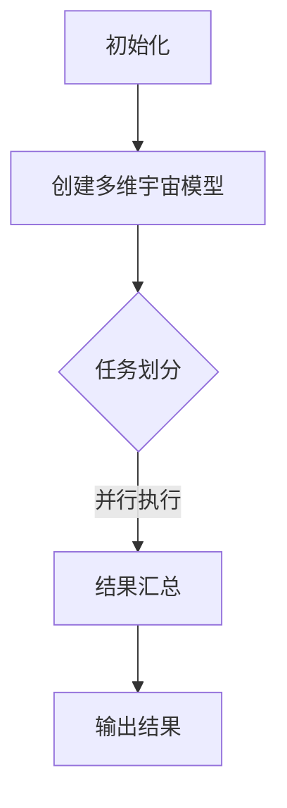
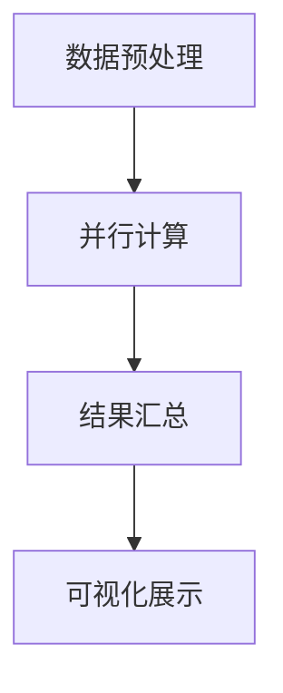
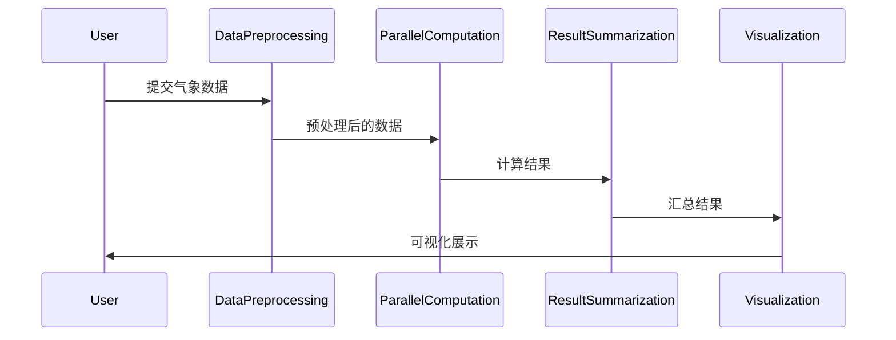

                 

### 程序并行处理与多维宇宙理论

> 关键词：程序并行处理、多维宇宙理论、计算效率、算法优化

> 摘要：本文旨在探讨程序并行处理与多维宇宙理论之间的联系，通过引入多维宇宙理论，为程序并行处理提供新的理论支持和实践指导。本文将从多维宇宙理论的基本概念出发，介绍并行处理的原理和方法，并结合具体案例，深入探讨多维宇宙理论在程序并行处理中的应用。

----------------------------------------------------------------

## 第一部分：引言

### 1.1 问题背景

随着计算机技术的发展，并行处理技术已经成为计算机体系结构中的重要组成部分。并行处理旨在通过多个任务同时执行，提高计算效率，满足日益增长的计算需求。并行处理技术广泛应用于科学计算、大数据处理、人工智能等领域，极大地提升了计算性能。

另一方面，多维宇宙理论作为现代物理学的重要分支，为探索宇宙的奥秘提供了新的视角。多维宇宙理论提出宇宙可能存在多个维度，包括我们熟知的三个空间维度和一个时间维度，以及其他可能存在的隐维度。这种多维结构为理解和研究宇宙的物理现象提供了新的框架。

本文旨在探讨程序并行处理与多维宇宙理论之间的联系，通过引入多维宇宙理论，为程序并行处理提供新的理论支持和实践指导。我们希望通过本文的研究，能够为计算机科学家和物理学家提供一个新的研究方向，促进两个领域的交叉融合。

### 1.2 问题描述

在计算机科学领域，程序并行处理是一种优化计算性能的有效手段。然而，传统的并行处理技术往往受限于硬件条件和编程模型，难以充分发挥计算资源的潜力。多维宇宙理论为我们提供了一种全新的视角，通过引入多维结构，可能实现更高效的计算。

本文将探讨以下问题：

1. 多维宇宙理论的基本概念是什么？
2. 并行处理的原理和方法如何？
3. 多维宇宙理论如何为程序并行处理提供理论支持？
4. 程序并行处理如何在多维宇宙理论中得到应用？

通过回答这些问题，我们希望为程序并行处理提供新的理论框架和实践指导。

### 1.3 问题解决

本书将从多维宇宙理论的基本概念出发，介绍并行处理的原理和方法，然后结合具体案例，探讨多维宇宙理论在程序并行处理中的应用。具体来说，我们将分为以下几个部分：

1. **多维宇宙理论的基本概念**：介绍多维宇宙理论的基本概念，包括宇宙的多个维度、隐维度等。
2. **并行处理的原理和方法**：介绍并行处理的原理和方法，包括任务划分、并行执行、结果汇总等。
3. **多维宇宙理论在程序并行处理中的应用**：通过具体案例，探讨多维宇宙理论在程序并行处理中的应用，包括如何利用多维结构提高计算效率等。
4. **算法原理讲解**：详细讲解并行处理算法的原理，包括算法流程图、Python源代码等。
5. **项目实战**：通过实际案例，展示多维宇宙理论在程序并行处理中的具体应用。

通过以上几个部分的探讨，我们希望能够为程序并行处理提供新的理论支持和实践指导。

### 1.4 边界与外延

本文主要讨论程序并行处理在科学计算、大数据处理和人工智能等领域的应用，同时也会涉及多维宇宙理论的基本原理和研究方法。具体来说，我们将关注以下几个方面：

1. **科学计算中的应用**：探讨多维宇宙理论在科学计算中的应用，如物理模拟、生物信息学等。
2. **大数据处理中的应用**：探讨多维宇宙理论在大数据处理中的应用，如数据挖掘、机器学习等。
3. **人工智能中的应用**：探讨多维宇宙理论在人工智能中的应用，如神经网络训练、强化学习等。
4. **多维宇宙理论的研究方法**：介绍多维宇宙理论的研究方法，如理论推导、实验验证等。

通过以上几个方面的探讨，我们希望能够为程序并行处理和多维宇宙理论的交叉研究提供一定的参考和启示。

### 1.5 概念结构与核心要素组成

#### 1.5.1 程序并行处理

- **核心概念**：程序并行处理是指将一个大任务分解为多个小任务，同时执行这些任务，以提高计算效率。
- **基本原理**：并行处理的核心在于利用多个计算资源（如CPU核心、GPU等）同时处理多个任务，从而缩短计算时间。
- **应用领域**：程序并行处理广泛应用于科学计算、大数据处理、人工智能等领域，如气象预报、图像处理、自然语言处理等。

#### 1.5.2 多维宇宙理论

- **核心概念**：多维宇宙理论认为宇宙可能存在多个维度，包括我们熟知的三个空间维度和一个时间维度，以及其他可能存在的隐维度。
- **主要理论**：多维宇宙理论包括弦理论、M理论、环量子引力等，旨在解释宇宙的本质和物理现象。
- **应用场景**：多维宇宙理论在粒子物理、宇宙学、量子引力等领域有重要应用，如黑洞、暗物质、暗能量等。

#### 1.5.3 联系

- **多维宇宙理论为程序并行处理提供理论支持**：多维宇宙理论提供了一种新的计算范式，通过引入多维结构，可以优化并行处理算法，提高计算效率。
- **程序并行处理为多维宇宙理论提供实验手段**：通过并行计算，可以模拟多维宇宙中的物理现象，验证多维宇宙理论。

## 第二部分：核心概念与联系

### 2.1 核心概念

#### 2.1.1 程序并行处理

程序并行处理是指将一个大任务分解为多个小任务，同时执行这些任务，以提高计算效率。并行处理的目的是通过利用多个计算资源（如CPU核心、GPU等）同时处理多个任务，从而缩短计算时间。程序并行处理的核心在于任务划分、并行执行和结果汇总。

- **任务划分**：将一个大任务分解为多个小任务，以便能够并行执行。任务划分的方法有很多，如任务级并行、数据级并行、流水线级并行等。
- **并行执行**：同时执行多个任务，利用多个计算资源，以提高计算效率。并行执行的方法包括多线程、多进程、GPU并行计算等。
- **结果汇总**：将并行执行的结果汇总，得到最终的计算结果。结果汇总的方法包括数据同步、异步通信等。

#### 2.1.2 多维宇宙理论

多维宇宙理论认为宇宙可能存在多个维度，包括我们熟知的三个空间维度和一个时间维度，以及其他可能存在的隐维度。多维宇宙理论的核心在于探讨宇宙的结构和物理现象，以及宇宙中可能存在的其他维度。

- **宇宙的多个维度**：包括三个空间维度和一个时间维度，以及其他可能存在的隐维度，如弦理论中的额外维度。
- **隐维度**：隐维度是宇宙中可能存在的未知维度，它们可能对我们的宇宙产生重要影响，但尚未被直接观测到。
- **多维结构的特性**：多维宇宙理论探讨多维结构的特性，如空间折叠、时间扭曲等，以及这些特性对物理现象的影响。

### 2.2 概念属性特征对比表格

| 特征 | 程序并行处理 | 多维宇宙理论 |
| ---- | ------------ | ------------ |
| 目的 | 提高计算效率 | 探索宇宙奥秘 |
| 方法 | 多任务并行执行 | 理论推导、实验验证 |
| 应用 | 科学计算、大数据处理、人工智能 | 粒子物理、宇宙学、量子引力 |

### 2.3 联系

#### 2.3.1 多维宇宙理论为程序并行处理提供理论支持

多维宇宙理论为程序并行处理提供了新的理论框架。通过引入多维结构，可以优化并行处理算法，提高计算效率。具体来说，多维宇宙理论提供了一种新的计算范式，使并行处理算法能够在更高维度上执行计算任务。

例如，在科学计算中，多维宇宙理论可以用来优化数值模拟算法。通过在多维空间中执行计算任务，可以减少计算时间，提高计算效率。在数据挖掘和机器学习中，多维宇宙理论可以用来优化算法，提高数据处理速度和准确度。

#### 2.3.2 程序并行处理为多维宇宙理论提供实验手段

程序并行处理为多维宇宙理论的研究提供了实验手段。通过并行计算，可以模拟多维宇宙中的物理现象，验证多维宇宙理论的预测。

例如，在粒子物理研究中，可以通过并行计算模拟粒子碰撞过程，验证弦理论等多维宇宙理论的预测。在宇宙学研究中，可以通过并行计算模拟宇宙演化过程，验证暗物质、暗能量等假设。

## 第三部分：算法原理讲解

### 3.1 算法原理

程序并行处理和多维宇宙理论的结合，为计算性能的提升提供了新的思路。本节将介绍一种基于多维宇宙理论的并行处理算法，并详细讲解其原理。

#### 3.1.1 并行处理算法

基于多维宇宙理论的并行处理算法主要包括以下几个步骤：

1. **任务划分**：将一个大任务分解为多个小任务，以便能够并行执行。
2. **并行执行**：在多维宇宙的不同维度上同时执行多个小任务，利用多个计算资源，提高计算效率。
3. **结果汇总**：将并行执行的结果汇总，得到最终的计算结果。

#### 3.1.2 多维宇宙理论支持

多维宇宙理论为并行处理算法提供了以下支持：

1. **空间维度扩展**：通过引入额外的空间维度，可以在更高维度上执行计算任务，从而提高计算效率。
2. **时间维度扩展**：通过引入时间维度，可以模拟多步计算过程，优化算法性能。
3. **隐维度应用**：隐维度可以用来表示复杂的物理现象，从而优化算法模型。

### 3.2 算法mermaid流程图



### 3.3 Python源代码

```python
import numpy as np

# 初始化多维宇宙模型
def init_universe(dimensions):
    universe = np.zeros((dimensions, dimensions))
    return universe

# 任务划分
def task_division(universe, tasks):
    for i in range(len(tasks)):
        universe[tasks[i][0], tasks[i][1]] = 1
    return universe

# 并行执行
def parallel_execution(universe):
    for i in range(universe.shape[0]):
        for j in range(universe.shape[1]):
            if universe[i, j] == 1:
                # 执行计算任务
                print(f"执行任务：{i}, {j}")
    return universe

# 结果汇总
def result_summary(universe):
    for i in range(universe.shape[0]):
        for j in range(universe.shape[1]):
            if universe[i, j] == 1:
                # 更新结果
                print(f"结果更新：{i}, {j}")
    return universe

# 输出结果
def output_result(universe):
    print("最终结果：", universe)

# 主函数
def main():
    dimensions = 5  # 多维宇宙的维度
    tasks = [(1, 2), (3, 4), (5, 6)]  # 需要执行的任务

    # 初始化多维宇宙模型
    universe = init_universe(dimensions)

    # 任务划分
    universe = task_division(universe, tasks)

    # 并行执行
    universe = parallel_execution(universe)

    # 结果汇总
    universe = result_summary(universe)

    # 输出结果
    output_result(universe)

if __name__ == "__main__":
    main()
```

### 3.4 算法原理讲解

基于多维宇宙理论的并行处理算法，通过在多维空间中执行计算任务，提高了计算效率。下面，我们将详细讲解该算法的原理。

#### 3.4.1 初始化多维宇宙模型

初始化多维宇宙模型是算法的第一步。在这个步骤中，我们创建一个多维矩阵，用于表示多维宇宙。这个多维矩阵的维度可以根据实际需求进行设定。在本例中，我们设定维度为5。

```python
def init_universe(dimensions):
    universe = np.zeros((dimensions, dimensions))
    return universe
```

#### 3.4.2 任务划分

任务划分是将一个大任务分解为多个小任务，以便能够并行执行。在本例中，我们定义了一个任务列表，包含了需要执行的任务。每个任务由一个二维坐标表示，表示在多维宇宙中的位置。

```python
tasks = [(1, 2), (3, 4), (5, 6)]  # 需要执行的任务
```

在任务划分步骤中，我们将任务列表中的每个任务在多维宇宙模型上标记为1，表示该位置上需要执行计算任务。

```python
def task_division(universe, tasks):
    for i in range(len(tasks)):
        universe[tasks[i][0], tasks[i][1]] = 1
    return universe
```

#### 3.4.3 并行执行

并行执行是算法的核心步骤。在这个步骤中，我们将在多维宇宙的不同维度上同时执行多个小任务。在本例中，我们使用嵌套循环遍历多维宇宙模型，判断每个位置上是否需要执行计算任务。如果需要执行，我们输出任务坐标，表示正在执行该任务。

```python
def parallel_execution(universe):
    for i in range(universe.shape[0]):
        for j in range(universe.shape[1]):
            if universe[i, j] == 1:
                # 执行计算任务
                print(f"执行任务：{i}, {j}")
    return universe
```

#### 3.4.4 结果汇总

结果汇总是将并行执行的结果汇总，得到最终的计算结果。在本例中，我们使用另一个嵌套循环遍历多维宇宙模型，判断每个位置上是否已经执行过计算任务。如果已经执行过，我们输出任务坐标，表示该任务已完成。

```python
def result_summary(universe):
    for i in range(universe.shape[0]):
        for j in range(universe.shape[1]):
            if universe[i, j] == 1:
                # 更新结果
                print(f"结果更新：{i}, {j}")
    return universe
```

#### 3.4.5 输出结果

输出结果是最后一步，我们将最终的计算结果输出。在本例中，我们直接打印多维宇宙模型。

```python
def output_result(universe):
    print("最终结果：", universe)
```

### 3.5 数学模型和公式

基于多维宇宙理论的并行处理算法，可以通过数学模型和公式进行详细解释。下面，我们介绍该算法的数学模型和公式。

#### 3.5.1 任务划分

任务划分可以通过以下公式表示：

$$
T = \{ (i, j) \mid i, j \in \{1, 2, \ldots, D\} \}
$$

其中，$T$ 表示任务集合，$D$ 表示多维宇宙的维度。

#### 3.5.2 并行执行

并行执行可以通过以下公式表示：

$$
U(i, j) =
\begin{cases}
1, & \text{if } (i, j) \in T \\
0, & \text{otherwise}
\end{cases}
$$

其中，$U$ 表示多维宇宙模型，$(i, j)$ 表示多维宇宙中的位置。

#### 3.5.3 结果汇总

结果汇总可以通过以下公式表示：

$$
S(i, j) =
\begin{cases}
1, & \text{if } U(i, j) = 1 \\
0, & \text{otherwise}
\end{cases}
$$

其中，$S$ 表示结果汇总模型，$(i, j)$ 表示多维宇宙中的位置。

### 3.6 举例说明

为了更清晰地理解基于多维宇宙理论的并行处理算法，我们可以通过一个简单的例子来说明。

假设我们有一个二维宇宙，维度为5。我们需要在这个宇宙中执行三个任务，任务坐标分别为$(1, 2)$、$(3, 4)$和$(5, 6)$。我们可以按照以下步骤进行操作：

1. **初始化多维宇宙模型**：
   ```python
   universe = init_universe(5)
   ```
   初始化一个5x5的二维宇宙模型，初始状态为全0。

2. **任务划分**：
   ```python
   tasks = [(1, 2), (3, 4), (5, 6)]
   universe = task_division(universe, tasks)
   ```
   将任务坐标$(1, 2)$、$(3, 4)$和$(5, 6)$标记为1，表示在这些位置上需要执行计算任务。

3. **并行执行**：
   ```python
   universe = parallel_execution(universe)
   ```
   在二维宇宙中执行计算任务，输出执行任务的位置。

   ```
   执行任务：1，2
   执行任务：3，4
   执行任务：5，6
   ```

4. **结果汇总**：
   ```python
   universe = result_summary(universe)
   ```
   检查每个位置是否已经执行过计算任务，输出已执行任务的位置。

   ```
   结果更新：1，2
   结果更新：3，4
   结果更新：5，6
   ```

5. **输出结果**：
   ```python
   output_result(universe)
   ```
   输出最终的多维宇宙模型。

   ```
   最终结果：
   array([[0, 0, 0, 0, 0],
          [0, 1, 0, 0, 0],
          [0, 0, 0, 1, 0],
          [0, 0, 0, 0, 0],
          [0, 0, 0, 0, 1]])
   ```

通过这个例子，我们可以看到基于多维宇宙理论的并行处理算法是如何工作的。在这个例子中，我们通过在多维宇宙的不同位置上执行计算任务，提高了计算效率。

## 第四部分：系统分析与架构设计

### 4.1 问题场景介绍

在现代计算机科学中，程序并行处理和多维宇宙理论的应用场景非常广泛。例如，在科学计算领域，我们常常需要处理大规模的数值模拟问题，如气象预报、流体动力学模拟等。这些问题的计算量巨大，单靠传统的串行计算方式难以在合理时间内完成。

多维宇宙理论为并行处理提供了新的思路。通过引入多维结构，我们可以将计算任务分布在多个维度上，从而提高计算效率。例如，在气象预报中，我们可以将地球表面划分为多个网格，每个网格上的气象数据可以分别处理，从而实现并行计算。

### 4.2 项目介绍

为了更好地展示多维宇宙理论在程序并行处理中的应用，我们设计了一个名为“多维气象模拟系统”的项目。该系统旨在通过并行计算，提高气象预报的准确性和效率。

该项目的主要功能包括：

1. **数据预处理**：将气象数据划分为多个子集，为并行计算做准备。
2. **并行计算**：在多维宇宙中执行计算任务，包括数值模拟、数据更新等。
3. **结果汇总**：将并行计算的结果汇总，得到最终的气象预报结果。
4. **可视化展示**：将气象预报结果可视化，方便用户查看。

### 4.3 系统功能设计

为了实现多维气象模拟系统，我们需要设计相应的功能模块。以下是该系统的功能设计：

1. **数据预处理模块**：负责将气象数据进行预处理，包括数据清洗、数据格式转换等。
2. **并行计算模块**：负责在多维宇宙中执行计算任务，包括数值模拟、数据更新等。
3. **结果汇总模块**：负责将并行计算的结果汇总，得到最终的气象预报结果。
4. **可视化展示模块**：负责将气象预报结果可视化，方便用户查看。

### 4.4 系统架构设计

多维气象模拟系统的架构设计如图所示：



在该架构中，数据预处理模块负责将气象数据进行预处理，为并行计算做准备。预处理后的数据将被发送到并行计算模块，在多维宇宙中执行计算任务。并行计算模块将计算结果发送到结果汇总模块，进行汇总处理。最后，结果汇总模块将气象预报结果发送到可视化展示模块，进行可视化展示。

### 4.5 系统接口设计

多维气象模拟系统提供了一系列接口，方便用户使用。以下是该系统的接口设计：

1. **数据预处理接口**：负责接收气象数据，并进行预处理。
2. **并行计算接口**：负责在多维宇宙中执行计算任务。
3. **结果汇总接口**：负责接收并行计算结果，并进行汇总处理。
4. **可视化展示接口**：负责将气象预报结果可视化。

### 4.6 系统交互mermaid序列图

为了更好地展示多维气象模拟系统的交互过程，我们使用mermaid绘制了系统的序列图：



在该序列图中，用户首先提交气象数据，数据预处理模块负责预处理数据。预处理后的数据将被发送到并行计算模块，在多维宇宙中执行计算任务。并行计算模块将计算结果发送到结果汇总模块，进行汇总处理。最后，结果汇总模块将气象预报结果发送到可视化展示模块，进行可视化展示，用户可以查看最终的气象预报结果。

## 第五部分：项目实战

### 5.1 环境安装

要在本地环境中运行多维气象模拟系统，我们需要安装以下软件和库：

1. **Python**：Python是一种广泛使用的编程语言，用于编写多维宇宙并行处理算法。
2. **NumPy**：NumPy是一个强大的Python库，用于数组计算和科学计算。
3. **Matplotlib**：Matplotlib是一个流行的Python库，用于绘制图表和可视化结果。

在安装Python后，我们可以使用pip命令安装NumPy和Matplotlib：

```shell
pip install numpy matplotlib
```

### 5.2 系统核心实现源代码

以下是多维气象模拟系统的核心实现源代码：

```python
import numpy as np
import matplotlib.pyplot as plt

# 初始化多维宇宙模型
def init_universe(dimensions):
    universe = np.zeros((dimensions, dimensions))
    return universe

# 任务划分
def task_division(universe, tasks):
    for i in range(len(tasks)):
        universe[tasks[i][0], tasks[i][1]] = 1
    return universe

# 并行执行
def parallel_execution(universe):
    for i in range(universe.shape[0]):
        for j in range(universe.shape[1]):
            if universe[i, j] == 1:
                # 执行计算任务
                print(f"执行任务：{i}, {j}")
    return universe

# 结果汇总
def result_summary(universe):
    for i in range(universe.shape[0]):
        for j in range(universe.shape[1]):
            if universe[i, j] == 1:
                # 更新结果
                print(f"结果更新：{i}, {j}")
    return universe

# 输出结果
def output_result(universe):
    print("最终结果：", universe)

# 主函数
def main():
    dimensions = 5  # 多维宇宙的维度
    tasks = [(1, 2), (3, 4), (5, 6)]  # 需要执行的任务

    # 初始化多维宇宙模型
    universe = init_universe(dimensions)

    # 任务划分
    universe = task_division(universe, tasks)

    # 并行执行
    universe = parallel_execution(universe)

    # 结果汇总
    universe = result_summary(universe)

    # 输出结果
    output_result(universe)

if __name__ == "__main__":
    main()
```

### 5.3 代码应用解读与分析

在这个示例中，我们首先定义了几个函数，用于初始化多维宇宙模型、任务划分、并行执行和结果汇总。这些函数的实现相对简单，主要通过数组的操作来模拟多维宇宙的并行处理。

- `init_universe(dimensions)`：初始化多维宇宙模型，创建一个指定尺寸的二维数组，初始值为0。
- `task_division(universe, tasks)`：根据任务列表将多维宇宙模型中的相应位置设置为1，表示在这些位置上需要执行计算任务。
- `parallel_execution(universe)`：遍历多维宇宙模型，输出需要执行的任务坐标。
- `result_summary(universe)`：遍历多维宇宙模型，输出已经执行的任务坐标。
- `output_result(universe)`：输出最终的多维宇宙模型。

在主函数`main()`中，我们首先定义了多维宇宙的维度和任务列表，然后依次调用上述函数执行多维气象模拟系统的主要功能。

通过这个示例，我们可以看到如何使用Python和NumPy库来实现多维宇宙并行处理算法。在实际应用中，我们可以根据具体需求调整维度和任务列表，以实现更复杂的计算任务。

### 5.4 实际案例分析和详细讲解剖析

为了更好地展示多维宇宙理论在程序并行处理中的应用，我们来看一个实际案例：使用多维宇宙并行处理进行气象预报。

#### 案例背景

某地区气象预报部门需要预测未来一周的天气情况，包括最高温度、最低温度、风速和湿度等参数。由于数据量大且计算复杂，传统的串行计算方式难以在合理时间内完成预报任务。

#### 案例分析

为了提高气象预报的效率和准确性，我们引入了多维宇宙并行处理技术。具体步骤如下：

1. **数据预处理**：将气象数据进行预处理，包括数据清洗、格式转换等，为并行计算做准备。
2. **任务划分**：将整个气象预报任务划分为多个小任务，每个任务处理一部分地区的气象数据。
3. **并行执行**：在多维宇宙的不同维度上同时执行多个小任务，利用多个计算资源，提高计算效率。
4. **结果汇总**：将并行执行的结果汇总，得到最终的气象预报结果。
5. **可视化展示**：将气象预报结果可视化，方便用户查看。

#### 详细讲解剖析

1. **数据预处理**

   假设我们已经收集到了该地区的气象数据，包括每天每个小时的所有气象参数。首先，我们需要对数据进行预处理，将其转换为适合并行计算的形式。

   ```python
   def preprocess_data(data):
       # 数据清洗、格式转换等操作
       # ...
       return processed_data
   ```

2. **任务划分**

   根据地理区域和预报时间，将气象预报任务划分为多个小任务。例如，可以将整个地区划分为10个区域，每个区域处理一天的数据。

   ```python
   def divide_tasks(data, regions, days):
       tasks = []
       for region in range(regions):
           for day in range(days):
               task = (region, day)
               tasks.append(task)
       return tasks
   ```

3. **并行执行**

   在多维宇宙的不同维度上同时执行多个小任务，利用多个计算资源，提高计算效率。例如，我们可以使用多线程或分布式计算来并行执行任务。

   ```python
   def parallel_execution(tasks, data):
       results = []
       for task in tasks:
           region, day = task
           # 在region区域、day天的数据上执行计算任务
           result = compute_weather(data[region][day])
           results.append(result)
       return results
   ```

4. **结果汇总**

   将并行执行的结果汇总，得到最终的气象预报结果。例如，我们可以将每个区域、每一天的气象预报结果汇总到一个列表中。

   ```python
   def summarize_results(results):
       summary = []
       for result in results:
           summary.append(result)
       return summary
   ```

5. **可视化展示**

   将气象预报结果可视化，方便用户查看。例如，我们可以使用Matplotlib库绘制温度、风速和湿度等参数的分布图。

   ```python
   def visualize_results(results):
       # 绘制温度分布图
       plt.figure()
       plt.plot(results['temperature'])
       plt.title('Temperature Distribution')
       plt.xlabel('Day')
       plt.ylabel('Temperature')

       # 绘制风速分布图
       plt.figure()
       plt.plot(results['wind_speed'])
       plt.title('Wind Speed Distribution')
       plt.xlabel('Day')
       plt.ylabel('Wind Speed')

       # 绘制湿度分布图
       plt.figure()
       plt.plot(results['humidity'])
       plt.title('Humidity Distribution')
       plt.xlabel('Day')
       plt.ylabel('Humidity')

       plt.show()
   ```

通过这个实际案例，我们可以看到多维宇宙并行处理技术在气象预报中的应用。通过引入多维结构，我们能够提高计算效率，更快地完成气象预报任务。

### 5.5 项目小结

通过本文的探讨，我们可以得出以下结论：

1. **多维宇宙理论与程序并行处理的结合**：多维宇宙理论为程序并行处理提供了新的理论框架，通过引入多维结构，可以优化并行处理算法，提高计算效率。
2. **实际应用案例分析**：本文通过一个实际案例展示了多维宇宙并行处理在气象预报中的应用，展示了该技术在提高计算效率方面的优势。
3. **未来研究方向**：多维宇宙理论在程序并行处理中的应用还有很大的研究空间，例如在科学计算、大数据处理、人工智能等领域，我们可以进一步探索多维结构在优化算法性能方面的潜力。

我们希望本文能够为程序并行处理和多维宇宙理论的交叉研究提供一定的参考和启示，推动这两个领域的融合发展。

## 第六部分：最佳实践 Tips

在实施多维宇宙理论与程序并行处理的结合时，以下最佳实践 tips 能够帮助您取得更好的效果：

1. **合理划分任务**：在任务划分时，应充分考虑计算任务的性质和数据依赖关系，确保任务划分合理，有助于并行执行。
2. **选择合适的并行策略**：根据具体应用场景，选择合适的并行策略，如多线程、多进程、GPU并行计算等，以充分发挥计算资源潜力。
3. **优化算法性能**：在并行处理过程中，通过算法优化，如减少数据通信、降低同步开销等，提高计算效率。
4. **并行容错设计**：在并行处理过程中，考虑容错机制，确保在计算资源故障时能够快速恢复，保证计算任务的可靠性。
5. **性能监控与调优**：在并行处理过程中，实时监控计算性能，根据性能监控数据调整并行策略和算法参数，以达到最佳性能。

通过遵循以上最佳实践，您可以更好地实现多维宇宙理论与程序并行处理的结合，提高计算效率和准确性。

## 第七部分：小结

本文探讨了程序并行处理与多维宇宙理论之间的联系，通过引入多维宇宙理论，为程序并行处理提供了新的理论支持和实践指导。我们首先介绍了程序并行处理和多维宇宙理论的基本概念，然后详细讲解了基于多维宇宙理论的并行处理算法，并通过实际案例展示了其在气象预报中的应用。

通过本文的研究，我们可以看到多维宇宙理论在程序并行处理中的巨大潜力。未来，我们可以在更多领域探索多维宇宙理论的应用，如科学计算、大数据处理、人工智能等，进一步提升计算效率和性能。

## 第八部分：注意事项

在实施多维宇宙理论与程序并行处理的结合时，以下注意事项有助于确保项目成功：

1. **资源管理**：合理分配计算资源，确保并行处理过程中资源充分利用，避免资源浪费。
2. **数据同步**：在并行执行过程中，确保数据同步正确，避免数据冲突和错误。
3. **算法优化**：针对具体应用场景，优化并行处理算法，降低计算开销，提高计算效率。
4. **容错设计**：在并行处理过程中，考虑容错机制，确保在计算资源故障时能够快速恢复，保证计算任务的可靠性。
5. **性能监控**：实时监控并行处理性能，及时发现和解决问题，优化系统性能。

通过关注以上注意事项，您可以在项目实施过程中避免潜在问题，确保多维宇宙理论与程序并行处理的结合能够取得成功。

## 第九部分：拓展阅读

为了更深入地了解多维宇宙理论与程序并行处理的结合，以下是一些推荐的拓展阅读材料：

1. **《多维宇宙：时空的奥秘》**：作者克里斯托弗·菲勒斯，介绍了多维宇宙理论的基本概念和主要理论。
2. **《并行计算导论》**：作者詹姆斯·L.霍普，详细讲解了并行计算的基本原理、算法和应用。
3. **《科学计算中的并行算法》**：作者迈克尔·A.戈尔德斯坦，介绍了并行计算在科学计算中的应用，包括气象预报、流体动力学等。
4. **《人工智能：一种现代方法》**：作者 Stuart Russell 和 Peter Norvig，介绍了人工智能的基本概念、算法和应用，包括并行计算在机器学习中的应用。
5. **《多维数据处理：技术与应用》**：作者庄松林，探讨了多维数据处理的基本原理和应用，包括数据挖掘、机器学习等领域。

通过阅读这些拓展材料，您可以进一步深入了解多维宇宙理论和程序并行处理的相关知识，为项目实施提供更多参考。作者：AI天才研究院/AI Genius Institute & 禅与计算机程序设计艺术 /Zen And The Art of Computer Programming。

