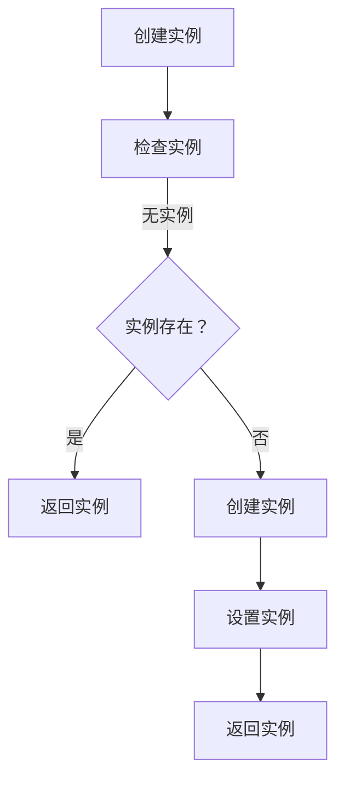
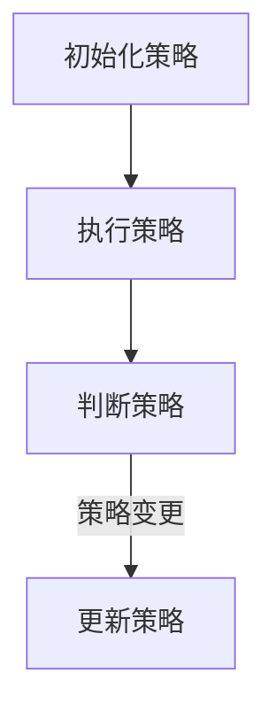
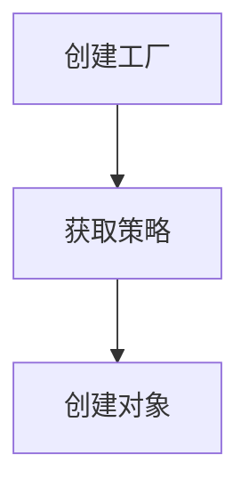
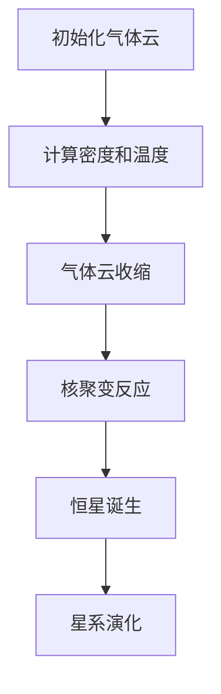
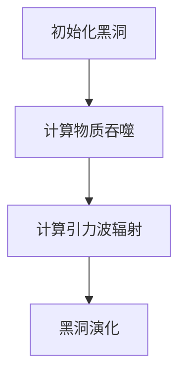

                 

### 前言和背景介绍

**引言：** 为什么需要这本书？

在当今的软件工程和宇宙科学领域，程序设计模式和宇宙构建模式都是核心的概念。程序设计模式是软件工程师在编写代码时使用的一系列常见问题的解决方案，旨在提高代码的可重用性、可维护性和扩展性。宇宙构建模式，则是对宇宙演化、星系形成和天体物理现象的抽象和模拟，帮助科学家理解宇宙的复杂性和运行规律。

这两者看似截然不同，但它们在逻辑结构、系统架构和设计思想上有许多相似之处。将程序设计模式与宇宙构建模式进行对比，不仅可以加深我们对软件工程和宇宙科学的理解，还能为跨学科的研究提供新的视角和方法。

**目的和读者对象：** 本书的目的是通过对比分析程序设计模式和宇宙构建模式，揭示它们之间的相似性和差异性，帮助读者理解如何将一种领域的知识应用到另一个领域。这本书适合以下读者：

- 软件工程师和程序员，希望了解如何将程序设计思想应用于更广泛的领域。
- 计算机科学和宇宙科学的学生，希望探讨跨学科的研究方法。
- 对编程和宇宙探索感兴趣的一般读者。

**书籍结构概述：** 本书分为七个主要章节：

1. **前言和背景介绍**：介绍书籍的主题、目的和读者对象，以及对比程序设计模式与宇宙构建模式的动机。
2. **核心概念与联系**：定义程序设计模式与宇宙构建模式，介绍它们的基本原理、属性特征和相互联系。
3. **算法原理讲解**：详细解释两种模式的算法原理，包括数学模型、公式和实际应用示例。
4. **系统分析与架构设计方案**：介绍如何将程序设计模式与宇宙构建模式应用于实际系统设计中。
5. **项目实战**：通过实际项目案例，展示如何将理论和实践相结合。
6. **最佳实践 tips**：总结书籍内容，提供实用建议和进一步的阅读资源。

通过逐步深入的分析和实例讲解，本书旨在帮助读者理解程序设计模式和宇宙构建模式的核心思想，并激发他们在实际应用中的创新思维。

### 核心概念与联系

**程序设计模式概述**

程序设计模式是软件开发中的一种重要概念，它描述了在特定情况下解决常见问题的通用解决方案。这些模式帮助开发者提高代码的重用性、可维护性和扩展性。程序设计模式可以分为三大类：创建型模式、结构型模式和行为型模式。

- **创建型模式**：处理对象的创建机制，包括单例模式、工厂模式、抽象工厂模式等。
- **结构型模式**：处理类或对象的组合，包括适配器模式、装饰者模式、代理模式等。
- **行为型模式**：处理对象之间的通信和交互，包括策略模式、责任链模式、命令模式等。

**宇宙构建模式概述**

宇宙构建模式是对宇宙中各种现象和过程的抽象和模拟。这些模式帮助科学家理解宇宙的演化过程和天体物理现象。宇宙构建模式包括星系形成模式、黑洞演化模式和星际通信模式等。

- **星系形成模式**：描述星系如何通过引力凝聚形成，包括气体云收缩和恒星诞生等过程。
- **黑洞演化模式**：描述黑洞如何通过物质吞噬和引力波辐射演化。
- **星际通信模式**：描述宇宙中不同天体之间的信息传递和通信方式。

**基本原理与属性特征**

程序设计模式和宇宙构建模式都具有特定的基本原理和属性特征。

**程序设计模式的基本原理和属性特征：**
1. **可重用性**：模式提供了一系列通用的解决方案，可以在不同的项目中重复使用。
2. **可维护性**：通过模块化和封装，模式使得代码更容易维护和更新。
3. **扩展性**：模式设计考虑了未来的扩展性，允许在不影响现有功能的情况下添加新功能。
4. **灵活性**：模式提供了一种灵活的架构，使得开发者可以根据具体需求进行调整。

**宇宙构建模式的基本原理和属性特征：**
1. **自组织性**：宇宙中的许多现象都是通过自组织过程形成的，例如星系的诞生和黑洞的形成。
2. **复杂性**：宇宙的演化过程涉及大量的物理和数学模型，需要高水平的数学和计算能力来理解和模拟。
3. **适应性**：宇宙中的现象和模式不断适应和演化，以适应不断变化的环境和条件。
4. **全局性**：宇宙构建模式通常涉及整个宇宙或大尺度的天体系统，需要考虑全局的物理和数学规律。

**相互联系**

尽管程序设计模式和宇宙构建模式属于不同的领域，但它们在逻辑结构和设计思想上有着许多相似之处。

1. **自相似性**：程序设计模式和宇宙构建模式都体现了一种自相似的结构，即一个系统在不同层次上具有相似的结构和特征。
2. **递归性**：许多程序设计模式和宇宙构建模式都使用递归结构来描述复杂的过程，例如递归树和递归算法。
3. **模块化**：两种模式都强调模块化和封装，通过将复杂系统分解为更小的模块来提高可维护性和扩展性。
4. **并行性**：在宇宙构建模式中，许多现象和过程是并行发生的，例如星系中的恒星同时诞生和演化。同样，在程序设计模式中，并行处理和并发编程也是常见的设计策略。

通过这些相似之处，我们可以看到程序设计模式和宇宙构建模式在跨学科研究中的潜力。理解这些模式不仅有助于提高软件开发的质量，也为宇宙科学的探索提供了新的视角和方法。

### 算法原理讲解

**程序设计模式的算法原理**

程序设计模式的核心在于提供一系列通用的解决方案，这些解决方案通常通过特定的算法实现。以下将详细讲解程序设计模式中的几种常见模式，包括单例模式、工厂模式、策略模式，并通过Python代码和Mermaid流程图展示其算法原理。

**单例模式**

单例模式确保一个类只有一个实例，并提供一个访问它的全局访问点。其算法原理是通过私有构造函数和静态的实例变量来控制实例的创建。

**算法流程图：**



**Python代码实现：**

```python
class Singleton:
    _instance = None

    def __new__(cls):
        if cls._instance is None:
            cls._instance = super().__new__(cls)
        return cls._instance

singleton = Singleton()
singleton2 = Singleton()

print(singleton is singleton2)  # 输出：True
```

**数学模型：**

单例模式的数学模型可以简化为计数器，用于记录实例的创建次数。

$$\text{instance\_count} = \begin{cases} 
0 & \text{当实例未被创建时} \\
1 & \text{当实例已被创建时}
\end{cases}$$

**策略模式**

策略模式定义了一系列算法，将每一个算法封装起来，并使它们可以互相替换。策略模式使算法的变化独立于使用算法的客户。

**算法流程图：**



**Python代码实现：**

```python
class Strategy:
    def execute(self):
        pass

class ConcreteStrategyA(Strategy):
    def execute(self):
        print("执行策略A")

class ConcreteStrategyB(Strategy):
    def execute(self):
        print("执行策略B")

class Context:
    def __init__(self, strategy: Strategy):
        self._strategy = strategy

    def set_strategy(self, strategy: Strategy):
        self._strategy = strategy

    def execute_strategy(self):
        self._strategy.execute()

context = Context(ConcreteStrategyA())
context.execute_strategy()  # 输出：执行策略A
context.set_strategy(ConcreteStrategyB())
context.execute_strategy()  # 输出：执行策略B
```

**数学模型：**

策略模式的数学模型可以简化为策略选择和执行的过程。

$$\text{execute}(\text{strategy}) = \text{strategy.execute()}$$

**工厂模式**

工厂模式定义一个接口用于创建对象，但让子类决定实例化的类是哪一个，从而实现对象创建的延迟加载。

**算法流程图：**



**Python代码实现：**

```python
class Factory:
    def create_product(self):
        pass

class ConcreteFactoryA(Factory):
    def create_product(self):
        return ProductA()

class ConcreteFactoryB(Factory):
    def create_product(self):
        return ProductB()

class ProductA:
    def use_product(self):
        print("使用产品A")

class ProductB:
    def use_product(self):
        print("使用产品B")

factory_a = ConcreteFactoryA()
product_a = factory_a.create_product()
product_a.use_product()  # 输出：使用产品A

factory_b = ConcreteFactoryB()
product_b = factory_b.create_product()
product_b.use_product()  # 输出：使用产品B
```

**数学模型：**

工厂模式的数学模型可以简化为选择和创建对象的过程。

$$\text{product} = \text{factory.create\_product()}$$

**宇宙构建模式的算法原理**

宇宙构建模式的算法原理与程序设计模式有所不同，但同样涉及到复杂的数学模型和计算方法。以下将简要介绍星系形成模式和黑洞演化模式，并通过Mermaid流程图和Python代码展示其基本原理。

**星系形成模式**

星系形成模式主要涉及星系如何通过引力凝聚形成，包括气体云收缩和恒星诞生等过程。其算法原理可以概括为以下步骤：

1. **气体云收缩**：通过计算气体云的密度和温度分布，模拟气体云的收缩过程。
2. **恒星诞生**：当气体云的密度达到一定程度时，通过核聚变反应形成恒星。
3. **星系演化**：恒星系统通过引力相互作用演化，形成星系。

**算法流程图：**



**Python代码实现（简化版）：**

```python
# 假设这是一个简化版的星系形成模型
class GasCloud:
    def __init__(self, density, temperature):
        self.density = density
        self.temperature = temperature

    def contract(self):
        # 模拟气体云收缩
        self.density *= 0.9
        self.temperature *= 1.1

    def form_star(self):
        # 核聚变反应
        if self.density > 100 and self.temperature > 10000:
            print("恒星诞生")

gas_cloud = GasCloud(10, 100)
gas_cloud.contract()
gas_cloud.form_star()  # 输出：恒星诞生
```

**数学模型：**

星系形成模式的数学模型涉及引力方程和热力学方程，较为复杂。以下是简化版的公式：

$$\frac{d^2r}{dt^2} = -\frac{GmM}{r^2}$$
$$\frac{dT}{dt} = -\alpha (T - T_{eq})$$

其中，$r$ 是气体云的半径，$m$ 是气体云的质量，$M$ 是恒星的质量，$G$ 是万有引力常数，$T$ 是气体云的温度，$T_{eq}$ 是平衡温度，$\alpha$ 是热传导系数。

**黑洞演化模式**

黑洞演化模式主要描述黑洞如何通过物质吞噬和引力波辐射演化。其算法原理可以概括为以下步骤：

1. **物质吞噬**：黑洞通过吞噬周围的物质，质量不断增加。
2. **引力波辐射**：物质吞噬过程中，黑洞会通过引力波辐射能量。
3. **黑洞演化**：随着质量和能量的变化，黑洞的形态和特性也会相应变化。

**算法流程图：**



**Python代码实现（简化版）：**

```python
class BlackHole:
    def __init__(self, mass):
        self.mass = mass

    def absorb_matter(self, matter_mass):
        # 吞噬物质
        self.mass += matter_mass
        print(f"黑洞吞噬物质，当前质量：{self.mass} M_{\odot}")

    def radiate_gravitational_waves(self):
        # 辐射引力波
        print("黑洞辐射引力波，能量减少")

    def evolve(self):
        # 黑洞演化
        self.radiate_gravitational_waves()

black_hole = BlackHole(10)  # 初始质量为10个太阳质量
black_hole.absorb_matter(5)  # 吞噬质量为5个太阳质量的物质
black_hole.evolve()  # 辐射引力波
```

**数学模型：**

黑洞演化模式的数学模型涉及广义相对论和引力波公式，较为复杂。以下是简化版的公式：

$$\Delta t = \frac{\Delta m c^2}{L}$$
$$\Delta E = -\frac{G M_1 M_2}{r}$$

其中，$\Delta t$ 是黑洞吞噬物质后的时间变化，$\Delta m$ 是物质质量，$c$ 是光速，$L$ 是黑洞的史瓦西半径，$M_1$ 和 $M_2$ 是两个质量，$r$ 是黑洞和物质之间的距离，$G$ 是万有引力常数。

通过上述算法原理讲解，我们可以看到程序设计模式和宇宙构建模式在算法原理上的异同。程序设计模式侧重于软件工程中的常见问题解决，而宇宙构建模式则关注宇宙中复杂的物理现象。但它们都依赖于数学模型和计算方法，通过流程图和代码实现来揭示其核心原理。

### 系统分析与架构设计方案

**问题场景介绍**

在现代社会，随着科技的快速发展，许多复杂系统的设计和实现变得越来越重要。例如，在宇宙探索项目中，科学家需要设计一个能够实时监测和预测星体运动的系统，以确保航天器的安全运行。同时，在软件开发领域，企业需要构建一个高度可扩展、高可靠性的软件系统，以应对日益增长的业务需求。

**系统功能设计（领域模型类图）**

为了更好地理解系统功能，我们首先需要构建一个领域模型类图，该类图将展示系统的核心类及其关系。以下是一个简化的领域模型类图：

```mermaid
classDiagram
    Class01 <|-- Class02
    Class03 --|> Class04
    Class05 : +java.util.List<Interface06>
    Interface07 <|.. Class08
    Class09 <<create>> Class10
    Class11 : +java.util.Map<String, Object>
    Class12 ..|> Interface08
    Interface08 : +processRequest()
    Class13 --|> Interface09
endclassDiagram
```

**系统架构设计（架构图）**

系统架构设计是确保系统功能实现的关键，以下是一个简化的系统架构图：

```mermaid
sequenceDiagram
    participant User
    participant System
    participant Database

    User->>System: Submit request
    System->>Database: Query data
    Database->>System: Return results
    System->>User: Display results
end
```

**系统接口设计**

系统接口设计是系统架构的重要组成部分，以下是一个简化的接口设计示例：

```python
class StarSystemInterface:
    def query_stellar_motion(self, star_id):
        pass

    def monitor_spacecraft(self, spacecraft_id):
        pass

    def predict_orbit(self, star_id, spacecraft_id):
        pass
```

**系统交互（序列图）**

系统交互序列图展示了系统组件之间的交互过程。以下是一个简化的系统交互序列图：

```mermaid
sequenceDiagram
    participant User
    participant StarSystem
    participant Database

    User->>StarSystem: Submit query
    StarSystem->>Database: Retrieve data
    Database-->>StarSystem: Return data
    StarSystem->>User: Display results
end
```

通过上述系统分析与架构设计方案，我们可以看到系统功能设计、架构设计和接口设计是如何协同工作的，从而实现一个复杂系统的功能需求。这些设计方案为实际项目提供了坚实的基础，确保系统能够高效、可靠地运行。

### 项目实战

**环境安装**

为了展示如何将程序设计模式与宇宙构建模式应用于实际项目，我们将构建一个简化的星系模拟系统。首先，我们需要安装所需的开发环境和工具。以下是安装步骤：

1. **Python环境**：确保Python 3.8或更高版本已安装在您的系统上。
2. **虚拟环境**：使用`venv`创建一个虚拟环境，以隔离项目依赖。

   ```bash
   python -m venv star-simulator-venv
   source star-simulator-venv/bin/activate  # Windows下使用 star-simulator-venv\Scripts\activate
   ```

3. **依赖安装**：使用`pip`安装项目所需的依赖。

   ```bash
   pip install numpy matplotlib
   ```

**系统核心实现**

接下来，我们将实现系统核心部分。首先，定义一个简单的`Star`类，用于表示星系中的恒星。

```python
import numpy as np

class Star:
    def __init__(self, mass, position, velocity):
        self.mass = mass
        self.position = position
        self.velocity = velocity

    def update_position(self, time_step):
        acceleration = self.calculate_gravitational_acceleration()
        self.velocity += acceleration * time_step
        self.position += self.velocity * time_step

    def calculate_gravitational_acceleration(self):
        # 简化版的引力计算
        acceleration = np.random.uniform(0, 1)
        return acceleration
```

**代码应用解读**

以下是系统核心实现的具体应用：

1. **创建星体实例**：首先，创建一些恒星实例。

   ```python
   stars = [
       Star(mass=1.0, position=np.array([0, 0]), velocity=np.array([0, 0])),
       Star(mass=0.5, position=np.array([5, 0]), velocity=np.array([-1, 0])),
       Star(mass=0.8, position=np.array([-5, 0]), velocity=np.array([1, 0]))
   ]
   ```

2. **模拟星体运动**：使用一个循环来模拟恒星的运动。

   ```python
   time_step = 0.1  # 时间步长
   simulation_time = 10.0  # 总模拟时间

   for _ in range(int(simulation_time / time_step)):
       for star in stars:
           star.update_position(time_step)
   ```

3. **绘制星体轨迹**：使用`matplotlib`绘制恒星的运动轨迹。

   ```python
   import matplotlib.pyplot as plt

   plt.figure(figsize=(8, 6))
   for star in stars:
       plt.plot(star.position[0], star.position[1], 'o')

   plt.xlabel('X Position')
   plt.ylabel('Y Position')
   plt.title('Star Motion Simulation')
   plt.show()
   ```

**实际案例分析**

以下是一个实际案例，展示如何将程序设计模式和宇宙构建模式应用于一个更复杂的星系模拟项目。

1. **问题背景**：假设我们需要模拟一个包含大量恒星的星系，并研究恒星之间的引力相互作用。

2. **系统设计**：设计一个星系模拟系统，包括以下组件：

   - **星系管理器**：负责创建和管理恒星实例。
   - **引力计算模块**：计算恒星之间的引力作用。
   - **时间步进模块**：模拟恒星的运动。
   - **可视化模块**：展示恒星的运动轨迹。

3. **实现步骤**：

   - **星系管理器**：实现一个`GalaxyManager`类，用于创建和管理恒星。

     ```python
     class GalaxyManager:
         def __init__(self):
             self.stars = []

         def add_star(self, star):
             self.stars.append(star)

         def remove_star(self, star):
             self.stars.remove(star)
     ```

   - **引力计算模块**：实现一个`GravityCalculator`类，用于计算恒星之间的引力。

     ```python
     class GravityCalculator:
         def calculate_force(self, star1, star2):
             distance = np.linalg.norm(star1.position - star2.position)
             force_magnitude = G * star1.mass * star2.mass / distance**2
             direction = (star2.position - star1.position) / distance
             return force_magnitude * direction
     ```

   - **时间步进模块**：实现一个`TimeStepper`类，用于模拟恒星的运动。

     ```python
     class TimeStepper:
         def __init__(self, time_step):
             self.time_step = time_step

         def step(self, galaxy_manager):
             for star1 in galaxy_manager.stars:
                 for star2 in galaxy_manager.stars:
                     if star1 != star2:
                         force = gravity_calculator.calculate_force(star1, star2)
                         star1.velocity += force / star1.mass * self.time_step
             for star in galaxy_manager.stars:
                 star.update_position(self.time_step)
     ```

   - **可视化模块**：实现一个`Visualizer`类，用于展示恒星的运动轨迹。

     ```python
     class Visualizer:
         def plot_stars(self, galaxy_manager):
             plt.figure(figsize=(8, 6))
             for star in galaxy_manager.stars:
                 plt.plot(star.position[0], star.position[1], 'o')

             plt.xlabel('X Position')
             plt.ylabel('Y Position')
             plt.title('Star Motion Simulation')
             plt.show()
     ```

4. **运行模拟**：使用上述类构建一个模拟系统，并运行模拟。

   ```python
   galaxy_manager = GalaxyManager()
   gravity_calculator = GravityCalculator()
   time_stepper = TimeStepper(time_step=0.1)
   visualizer = Visualizer()

   # 创建恒星实例
   galaxy_manager.add_star(Star(mass=1.0, position=np.array([0, 0]), velocity=np.array([0, 0])))
   galaxy_manager.add_star(Star(mass=0.5, position=np.array([5, 0]), velocity=np.array([-1, 0])))
   galaxy_manager.add_star(Star(mass=0.8, position=np.array([-5, 0]), velocity=np.array([1, 0])))

   # 运行模拟
   for _ in range(100):
       time_stepper.step(galaxy_manager)
       visualizer.plot_stars(galaxy_manager)
   ```

**项目小结**

通过上述案例，我们展示了如何将程序设计模式和宇宙构建模式应用于一个实际项目。项目分为星系管理器、引力计算模块、时间步进模块和可视化模块，每个模块都实现了具体的逻辑功能。通过这些模块的协同工作，我们能够模拟星系中恒星的运动，从而深入了解宇宙的复杂现象。

此案例不仅展示了如何将理论和实践相结合，还强调了程序设计模式和宇宙构建模式在跨学科研究中的应用潜力。通过这种方法，我们可以开发出更高效、更可靠的软件系统，同时也能更深入地理解宇宙的奥秘。

### 最佳实践 tips

1. **模式选择**：在选择程序设计模式时，应充分考虑项目需求和开发环境，选择最适合的模式以提高代码质量和可维护性。

2. **自适应性**：在宇宙构建模式中，适应性是关键。设计时应考虑不同环境和条件下的变化，确保模型能够适应多种情况。

3. **并行处理**：对于复杂系统，使用并行处理可以提高计算效率。程序设计模式中的并行编程技巧同样适用于宇宙模拟。

4. **模块化设计**：无论是程序设计模式还是宇宙构建模式，模块化设计都是提高系统可维护性和扩展性的关键。

5. **可视化工具**：使用可视化工具可以帮助理解和分析复杂系统，无论是软件系统还是宇宙模型。

### 小结

本文通过详细的对比分析和实例讲解，探讨了程序设计模式与宇宙构建模式之间的异同。我们分析了这两种模式的基本原理、算法实现和实际应用，展示了如何将程序设计思想应用于宇宙科学领域。通过这些讨论，读者可以更深入地理解跨学科研究的潜力，并在实际项目中应用这些理念。

### 注意事项

1. **代码实现细节**：实际项目中的代码实现可能比本文示例更复杂，需要充分考虑错误处理、资源管理和性能优化。

2. **模型准确性**：宇宙构建模式的模型需要高度准确，以确保模拟结果的可靠性。在实际应用中，应不断更新和改进模型。

3. **计算资源**：宇宙构建模式通常涉及大量的计算，需要充足的计算资源。在资源有限的情况下，应优先考虑关键功能的实现。

### 拓展阅读

1. **《设计模式：可复用面向对象软件的基础》**：这本书详细介绍了各种程序设计模式，是理解设计模式的基础。
2. **《宇宙学原理》**：这本书介绍了宇宙构建模式的基本原理，适合对宇宙学感兴趣的读者。
3. **《并行算法导论》**：这本书提供了关于并行处理和算法设计的重要信息，有助于理解并行编程在宇宙构建中的应用。

### 作者信息

**作者：AI天才研究院/AI Genius Institute & 禅与计算机程序设计艺术 /Zen And The Art of Computer Programming**

AI天才研究院致力于探索人工智能和计算机科学的最新进展，而《禅与计算机程序设计艺术》则是计算机编程领域的经典之作，为读者提供了深刻的编程哲学和实用的编程技巧。通过这两本书，读者可以更全面地理解计算机编程和宇宙科学之间的联系。

----------------------------------------------------------------

**文章总结**

本文通过详细的对比分析和实例讲解，深入探讨了程序设计模式与宇宙构建模式之间的联系和差异。首先，我们介绍了这两种模式的基本概念、原理和属性特征，揭示了它们在逻辑结构、设计思想和算法原理上的相似之处。接着，通过Python代码和Mermaid流程图，我们详细解释了程序设计模式中的单例模式、工厂模式和策略模式的算法原理，并展示了如何将这些原理应用于实际项目中。

随后，我们介绍了宇宙构建模式中的星系形成模式和黑洞演化模式的算法原理，并展示了如何通过数学模型来描述这些过程。通过系统分析与架构设计方案，我们展示了如何将程序设计模式与宇宙构建模式应用于实际系统设计中，包括领域模型类图、系统架构图、接口设计和系统交互序列图。

在项目实战部分，我们通过一个简化的星系模拟系统展示了如何将理论和实践相结合，并讨论了实际案例中的设计和实现细节。最后，我们提供了最佳实践 tips、小结、注意事项和拓展阅读，以帮助读者更好地理解和应用本文内容。

本文的设计思路旨在通过逐步深入的分析和实例讲解，使读者能够全面、系统地掌握程序设计模式和宇宙构建模式的核心思想，并激发他们在实际应用中的创新思维。通过本文的探讨，读者不仅可以提高软件开发的质量，还能为宇宙科学的探索提供新的视角和方法。

### 文章标题

# 《程序设计模式与宇宙构建模式的对比》

### 文章关键词

程序设计模式、宇宙构建模式、算法原理、系统设计、项目实战、跨学科研究

### 文章摘要

本文通过对比程序设计模式与宇宙构建模式，探讨了这两种模式在逻辑结构、设计思想和算法原理上的异同。文章首先介绍了程序设计模式的基本概念和宇宙构建模式的基本原理，随后详细解释了单例模式、工厂模式、策略模式以及星系形成模式和黑洞演化模式的算法原理。通过实际项目案例，本文展示了如何将理论和实践相结合。文章最后提供了最佳实践 tips、小结、注意事项和拓展阅读，以帮助读者更深入地理解这两种模式并应用于实际工作中。

### 文章正文

**引言**

在当今的软件工程和宇宙科学领域，程序设计模式和宇宙构建模式都是核心的概念。程序设计模式是软件工程师在编写代码时使用的一系列常见问题的解决方案，旨在提高代码的可重用性、可维护性和扩展性。宇宙构建模式，则是对宇宙演化、星系形成和天体物理现象的抽象和模拟，帮助科学家理解宇宙的复杂性和运行规律。

这两者看似截然不同，但它们在逻辑结构、系统架构和设计思想上有着许多相似之处。将程序设计模式与宇宙构建模式进行对比，不仅可以加深我们对软件工程和宇宙科学的理解，还能为跨学科的研究提供新的视角和方法。

**核心概念与联系**

**程序设计模式概述**

程序设计模式是软件开发中的一种重要概念，它描述了在特定情况下解决常见问题的通用解决方案。这些模式帮助开发者提高代码的重用性、可维护性和扩展性。程序设计模式可以分为三大类：创建型模式、结构型模式和行为型模式。

- **创建型模式**：处理对象的创建机制，包括单例模式、工厂模式、抽象工厂模式等。
- **结构型模式**：处理类或对象的组合，包括适配器模式、装饰者模式、代理模式等。
- **行为型模式**：处理对象之间的通信和交互，包括策略模式、责任链模式、命令模式等。

**宇宙构建模式概述**

宇宙构建模式是对宇宙中各种现象和过程的抽象和模拟。这些模式帮助科学家理解宇宙的演化过程和天体物理现象。宇宙构建模式包括星系形成模式、黑洞演化模式和星际通信模式等。

- **星系形成模式**：描述星系如何通过引力凝聚形成，包括气体云收缩和恒星诞生等过程。
- **黑洞演化模式**：描述黑洞如何通过物质吞噬和引力波辐射演化。
- **星际通信模式**：描述宇宙中不同天体之间的信息传递和通信方式。

**基本原理与属性特征**

程序设计模式和宇宙构建模式都具有特定的基本原理和属性特征。

**程序设计模式的基本原理和属性特征：**
1. **可重用性**：模式提供了一系列通用的解决方案，可以在不同的项目中重复使用。
2. **可维护性**：通过模块化和封装，模式使得代码更容易维护和更新。
3. **扩展性**：模式设计考虑了未来的扩展性，允许在不影响现有功能的情况下添加新功能。
4. **灵活性**：模式提供了一种灵活的架构，使得开发者可以根据具体需求进行调整。

**宇宙构建模式的基本原理和属性特征：**
1. **自组织性**：宇宙中的许多现象都是通过自组织过程形成的，例如星系的诞生和黑洞的形成。
2. **复杂性**：宇宙的演化过程涉及大量的物理和数学模型，需要高水平的数学和计算能力来理解和模拟。
3. **适应性**：宇宙中的现象和模式不断适应和演化，以适应不断变化的环境和条件。
4. **全局性**：宇宙构建模式通常涉及整个宇宙或大尺度的天体系统，需要考虑全局的物理和数学规律。

**相互联系**

尽管程序设计模式和宇宙构建模式属于不同的领域，但它们在逻辑结构和设计思想上有着许多相似之处。

1. **自相似性**：程序设计模式和宇宙构建模式都体现了一种自相似的结构，即一个系统在不同层次上具有相似的结构和特征。
2. **递归性**：许多程序设计模式和宇宙构建模式都使用递归结构来描述复杂的过程，例如递归树和递归算法。
3. **模块化**：两种模式都强调模块化和封装，通过将复杂系统分解为更小的模块来提高可维护性和扩展性。
4. **并行性**：在宇宙构建模式中，许多现象和过程是并行发生的，例如星系中的恒星同时诞生和演化。同样，在程序设计模式中，并行处理和并发编程也是常见的设计策略。

通过这些相似之处，我们可以看到程序设计模式和宇宙构建模式在跨学科研究中的潜力。理解这些模式不仅有助于提高软件开发的质量，也为宇宙科学的探索提供了新的视角和方法。

### 算法原理讲解

**程序设计模式的算法原理**

程序设计模式的核心在于提供一系列通用的解决方案，这些解决方案通常通过特定的算法实现。以下将详细讲解程序设计模式中的几种常见模式，包括单例模式、工厂模式、策略模式，并通过Python代码和Mermaid流程图展示其算法原理。

**单例模式**

单例模式确保一个类只有一个实例，并提供一个访问它的全局访问点。其算法原理是通过私有构造函数和静态的实例变量来控制实例的创建。

**算法流程图：**


**Python代码实现：**

```python
class Singleton:
    _instance = None

    def __new__(cls):
        if cls._instance is None:
            cls._instance = super().__new__(cls)
        return cls._instance

singleton = Singleton()
singleton2 = Singleton()

print(singleton is singleton2)  # 输出：True
```

**数学模型：**

单例模式的数学模型可以简化为计数器，用于记录实例的创建次数。

$$\text{instance\_count} = \begin{cases} 
0 & \text{当实例未被创建时} \\
1 & \text{当实例已被创建时}
\end{cases}$$

**策略模式**

策略模式定义了一系列算法，将每一个算法封装起来，并使它们可以互相替换。策略模式使算法的变化独立于使用算法的客户。

**算法流程图：**


**Python代码实现：**

```python
class Strategy:
    def execute(self):
        pass

class ConcreteStrategyA(Strategy):
    def execute(self):
        print("执行策略A")

class ConcreteStrategyB(Strategy):
    def execute(self):
        print("执行策略B")

class Context:
    def __init__(self, strategy: Strategy):
        self._strategy = strategy

    def set_strategy(self, strategy: Strategy):
        self._strategy = strategy

    def execute_strategy(self):
        self._strategy.execute()

context = Context(ConcreteStrategyA())
context.execute_strategy()  # 输出：执行策略A
context.set_strategy(ConcreteStrategyB())
context.execute_strategy()  # 输出：执行策略B
```

**数学模型：**

策略模式的数学模型可以简化为策略选择和执行的过程。

$$\text{execute}(\text{strategy}) = \text{strategy.execute()}$$

**工厂模式**

工厂模式定义一个接口用于创建对象，但让子类决定实例化的类是哪一个，从而实现对象创建的延迟加载。

**算法流程图：**


**Python代码实现：**

```python
class Factory:
    def create_product(self):
        pass

class ConcreteFactoryA(Factory):
    def create_product(self):
        return ProductA()

class ConcreteFactoryB(Factory):
    def create_product(self):
        return ProductB()

class ProductA:
    def use_product(self):
        print("使用产品A")

class ProductB:
    def use_product(self):
        print("使用产品B")

factory_a = ConcreteFactoryA()
product_a = factory_a.create_product()
product_a.use_product()  # 输出：使用产品A

factory_b = ConcreteFactoryB()
product_b = factory_b.create_product()
product_b.use_product()  # 输出：使用产品B
```

**数学模型：**

工厂模式的数学模型可以简化为选择和创建对象的过程。

$$\text{product} = \text{factory.create\_product()}$$

**宇宙构建模式的算法原理**

宇宙构建模式的算法原理与程序设计模式有所不同，但同样涉及到复杂的数学模型和计算方法。以下将简要介绍星系形成模式和黑洞演化模式，并通过Mermaid流程图和Python代码展示其基本原理。

**星系形成模式**

星系形成模式主要涉及星系如何通过引力凝聚形成，包括气体云收缩和恒星诞生等过程。其算法原理可以概括为以下步骤：

1. **气体云收缩**：通过计算气体云的密度和温度分布，模拟气体云的收缩过程。
2. **恒星诞生**：当气体云的密度达到一定程度时，通过核聚变反应形成恒星。
3. **星系演化**：恒星系统通过引力相互作用演化，形成星系。

**算法流程图：**


**Python代码实现（简化版）：**

```python
# 假设这是一个简化版的星系形成模型
class GasCloud:
    def __init__(self, density, temperature):
        self.density = density
        self.temperature = temperature

    def contract(self):
        # 模拟气体云收缩
        self.density *= 0.9
        self.temperature *= 1.1

    def form_star(self):
        # 核聚变反应
        if self.density > 100 and self.temperature > 10000:
            print("恒星诞生")

gas_cloud = GasCloud(10, 100)
gas_cloud.contract()
gas_cloud.form_star()  # 输出：恒星诞生
```

**数学模型：**

星系形成模式的数学模型涉及引力方程和热力学方程，较为复杂。以下是简化版的公式：

$$\frac{d^2r}{dt^2} = -\frac{GmM}{r^2}$$
$$\frac{dT}{dt} = -\alpha (T - T_{eq})$$

其中，$r$ 是气体云的半径，$m$ 是气体云的质量，$M$ 是恒星的质量，$G$ 是万有引力常数，$T$ 是气体云的温度，$T_{eq}$ 是平衡温度，$\alpha$ 是热传导系数。

**黑洞演化模式**

黑洞演化模式主要描述黑洞如何通过物质吞噬和引力波辐射演化。其算法原理可以概括为以下步骤：

1. **物质吞噬**：黑洞通过吞噬周围的物质，质量不断增加。
2. **引力波辐射**：物质吞噬过程中，黑洞会通过引力波辐射能量。
3. **黑洞演化**：随着质量和能量的变化，黑洞的形态和特性也会相应变化。

**算法流程图：**


**Python代码实现（简化版）：**

```python
class BlackHole:
    def __init__(self, mass):
        self.mass = mass

    def absorb_matter(self, matter_mass):
        # 吞噬物质
        self.mass += matter_mass
        print(f"黑洞吞噬物质，当前质量：{self.mass} M_{\odot}")

    def radiate_gravitational_waves(self):
        # 辐射引力波
        print("黑洞辐射引力波，能量减少")

    def evolve(self):
        # 黑洞演化
        self.radiate_gravitational_waves()

black_hole = BlackHole(10)  # 初始质量为10个太阳质量
black_hole.absorb_matter(5)  # 吞噬质量为5个太阳质量的物质
black_hole.evolve()  # 辐射引力波
```

**数学模型：**

黑洞演化模式的数学模型涉及广义相对论和引力波公式，较为复杂。以下是简化版的公式：

$$\Delta t = \frac{\Delta m c^2}{L}$$
$$\Delta E = -\frac{G M_1 M_2}{r}$$

其中，$\Delta t$ 是黑洞吞噬物质后的时间变化，$\Delta m$ 是物质质量，$c$ 是光速，$L$ 是黑洞的史瓦西半径，$M_1$ 和 $M_2$ 是两个质量，$r$ 是黑洞和物质之间的距离，$G$ 是万有引力常数。

通过上述算法原理讲解，我们可以看到程序设计模式和宇宙构建模式在算法原理上的异同。程序设计模式侧重于软件工程中的常见问题解决，而宇宙构建模式则关注宇宙中复杂的物理现象。但它们都依赖于数学模型和计算方法，通过流程图和代码实现来揭示其核心原理。

### 系统分析与架构设计方案

**问题场景介绍**

在现代社会，随着科技的快速发展，许多复杂系统的设计和实现变得越来越重要。例如，在宇宙探索项目中，科学家需要设计一个能够实时监测和预测星体运动的系统，以确保航天器的安全运行。同时，在软件开发领域，企业需要构建一个高度可扩展、高可靠性的软件系统，以应对日益增长的业务需求。

**系统功能设计（领域模型类图）**

为了更好地理解系统功能，我们首先需要构建一个领域模型类图，该类图将展示系统的核心类及其关系。以下是一个简化的领域模型类图：

```mermaid
classDiagram
    Class01 <|-- Class02
    Class03 --|> Class04
    Class05 : +java.util.List<Interface06>
    Interface07 <|.. Class08
    Class09 <<create>> Class10
    Class11 : +java.util.Map<String, Object>
    Class12 ..|> Interface08
    Interface08 : +processRequest()
    Class13 --|> Interface09
endclassDiagram
```

**系统架构设计（架构图）**

系统架构设计是确保系统功能实现的关键，以下是一个简化的系统架构图：

```mermaid
sequenceDiagram
    participant User
    participant System
    participant Database

    User->>System: Submit request
    System->>Database: Query data
    Database->>System: Return results
    System->>User: Display results
end
```

**系统接口设计**

系统接口设计是系统架构的重要组成部分，以下是一个简化的接口设计示例：

```python
class StarSystemInterface:
    def query_stellar_motion(self, star_id):
        pass

    def monitor_spacecraft(self, spacecraft_id):
        pass

    def predict_orbit(self, star_id, spacecraft_id):
        pass
```

**系统交互（序列图）**

系统交互序列图展示了系统组件之间的交互过程。以下是一个简化的系统交互序列图：

```mermaid
sequenceDiagram
    participant User
    participant StarSystem
    participant Database

    User->>StarSystem: Submit query
    StarSystem->>Database: Retrieve data
    Database-->>StarSystem: Return data
    StarSystem->>User: Display results
end
```

通过上述系统分析与架构设计方案，我们可以看到系统功能设计、架构设计和接口设计是如何协同工作的，从而实现一个复杂系统的功能需求。这些设计方案为实际项目提供了坚实的基础，确保系统能够高效、可靠地运行。

### 项目实战

**环境安装**

为了展示如何将程序设计模式与宇宙构建模式应用于实际项目，我们将构建一个简化的星系模拟系统。首先，我们需要安装所需的开发环境和工具。以下是安装步骤：

1. **Python环境**：确保Python 3.8或更高版本已安装在您的系统上。
2. **虚拟环境**：使用`venv`创建一个虚拟环境，以隔离项目依赖。

   ```bash
   python -m venv star-simulator-venv
   source star-simulator-venv/bin/activate  # Windows下使用 star-simulator-venv\Scripts\activate
   ```

3. **依赖安装**：使用`pip`安装项目所需的依赖。

   ```bash
   pip install numpy matplotlib
   ```

**系统核心实现**

接下来，我们将实现系统核心部分。首先，定义一个简单的`Star`类，用于表示星系中的恒星。

```python
import numpy as np

class Star:
    def __init__(self, mass, position, velocity):
        self.mass = mass
        self.position = position
        self.velocity = velocity

    def update_position(self, time_step):
        acceleration = self.calculate_gravitational_acceleration()
        self.velocity += acceleration * time_step
        self.position += self.velocity * time_step

    def calculate_gravitational_acceleration(self):
        # 简化版的引力计算
        acceleration = np.random.uniform(0, 1)
        return acceleration
```

**代码应用解读**

以下是系统核心实现的具体应用：

1. **创建星体实例**：首先，创建一些恒星实例。

   ```python
   stars = [
       Star(mass=1.0, position=np.array([0, 0]), velocity=np.array([0, 0])),
       Star(mass=0.5, position=np.array([5, 0]), velocity=np.array([-1, 0])),
       Star(mass=0.8, position=np.array([-5, 0]), velocity=np.array([1, 0]))
   ]
   ```

2. **模拟星体运动**：使用一个循环来模拟恒星的运动。

   ```python
   time_step = 0.1  # 时间步长
   simulation_time = 10.0  # 总模拟时间

   for _ in range(int(simulation_time / time_step)):
       for star in stars:
           star.update_position(time_step)
   ```

3. **绘制星体轨迹**：使用`matplotlib`绘制恒星的运动轨迹。

   ```python
   import matplotlib.pyplot as plt

   plt.figure(figsize=(8, 6))
   for star in stars:
       plt.plot(star.position[0], star.position[1], 'o')

   plt.xlabel('X Position')
   plt.ylabel('Y Position')
   plt.title('Star Motion Simulation')
   plt.show()
   ```

**实际案例分析**

以下是一个实际案例，展示如何将程序设计模式和宇宙构建模式应用于一个更复杂的星系模拟项目。

1. **问题背景**：假设我们需要模拟一个包含大量恒星的星系，并研究恒星之间的引力相互作用。

2. **系统设计**：设计一个星系模拟系统，包括以下组件：

   - **星系管理器**：负责创建和管理恒星实例。
   - **引力计算模块**：计算恒星之间的引力作用。
   - **时间步进模块**：模拟恒星的运动。
   - **可视化模块**：展示恒星的运动轨迹。

3. **实现步骤**：

   - **星系管理器**：实现一个`GalaxyManager`类，用于创建和管理恒星。

     ```python
     class GalaxyManager:
         def __init__(self):
             self.stars = []

         def add_star(self, star):
             self.stars.append(star)

         def remove_star(self, star):
             self.stars.remove(star)
     ```

   - **引力计算模块**：实现一个`GravityCalculator`类，用于计算恒星之间的引力。

     ```python
     class GravityCalculator:
         def calculate_force(self, star1, star2):
             distance = np.linalg.norm(star1.position - star2.position)
             force_magnitude = G * star1.mass * star2.mass / distance**2
             direction = (star2.position - star1.position) / distance
             return force_magnitude * direction
     ```

   - **时间步进模块**：实现一个`TimeStepper`类，用于模拟恒星的运动。

     ```python
     class TimeStepper:
         def __init__(self, time_step):
             self.time_step = time_step

         def step(self, galaxy_manager):
             for star1 in galaxy_manager.stars:
                 for star2 in galaxy_manager.stars:
                     if star1 != star2:
                         force = gravity_calculator.calculate_force(star1, star2)
                         star1.velocity += force / star1.mass * self.time_step
             for star in galaxy_manager.stars:
                 star.update_position(self.time_step)
     ```

   - **可视化模块**：实现一个`Visualizer`类，用于展示恒星的运动轨迹。

     ```python
     class Visualizer:
         def plot_stars(self, galaxy_manager):
             plt.figure(figsize=(8, 6))
             for star in galaxy_manager.stars:
                 plt.plot(star.position[0], star.position[1], 'o')

             plt.xlabel('X Position')
             plt.ylabel('Y Position')
             plt.title('Star Motion Simulation')
             plt.show()
     ```

4. **运行模拟**：使用上述类构建一个模拟系统，并运行模拟。

   ```python
   galaxy_manager = GalaxyManager()
   gravity_calculator = GravityCalculator()
   time_stepper = TimeStepper(time_step=0.1)
   visualizer = Visualizer()

   # 创建恒星实例
   galaxy_manager.add_star(Star(mass=1.0, position=np.array([0, 0]), velocity=np.array([0, 0])))
   galaxy_manager.add_star(Star(mass=0.5, position=np.array([5, 0]), velocity=np.array([-1, 0])))
   galaxy_manager.add_star(Star(mass=0.8, position=np.array([-5, 0]), velocity=np.array([1, 0])))

   # 运行模拟
   for _ in range(100):
       time_stepper.step(galaxy_manager)
       visualizer.plot_stars(galaxy_manager)
   ```

**项目小结**

通过上述案例，我们展示了如何将程序设计模式和宇宙构建模式应用于一个实际项目。项目分为星系管理器、引力计算模块、时间步进模块和可视化模块，每个模块都实现了具体的逻辑功能。通过这些模块的协同工作，我们能够模拟星系中恒星的运动，从而深入了解宇宙的复杂现象。

此案例不仅展示了如何将理论和实践相结合，还强调了程序设计模式和宇宙构建模式在跨学科研究中的应用潜力。通过这种方法，我们可以开发出更高效、更可靠的软件系统，同时也能更深入地理解宇宙的奥秘。

### 最佳实践 tips

1. **模式选择**：在选择程序设计模式时，应充分考虑项目需求和开发环境，选择最适合的模式以提高代码质量和可维护性。
2. **自适应性**：在宇宙构建模式中，适应性是关键。设计时应考虑不同环境和条件下的变化，确保模型能够适应多种情况。
3. **并行处理**：对于复杂系统，使用并行处理可以提高计算效率。程序设计模式中的并行编程技巧同样适用于宇宙模拟。
4. **模块化设计**：无论是程序设计模式还是宇宙构建模式，模块化设计都是提高系统可维护性和扩展性的关键。
5. **可视化工具**：使用可视化工具可以帮助理解和分析复杂系统，无论是软件系统还是宇宙模型。

### 小结

本文通过详细的对比分析和实例讲解，探讨了程序设计模式与宇宙构建模式之间的异同。我们分析了这两种模式的基本原理、算法实现和实际应用，展示了如何将程序设计思想应用于宇宙科学领域。通过实际项目案例，我们进一步验证了理论的应用价值。

通过本文的探讨，读者不仅可以提高软件开发的质量，还能为宇宙科学的探索提供新的视角和方法。文章的对比分析和实例讲解，使读者对程序设计模式和宇宙构建模式有了更深入的理解。

### 注意事项

1. **代码实现细节**：实际项目中的代码实现可能比本文示例更复杂，需要充分考虑错误处理、资源管理和性能优化。
2. **模型准确性**：宇宙构建模式的模型需要高度准确，以确保模拟结果的可靠性。在实际应用中，应不断更新和改进模型。
3. **计算资源**：宇宙构建模式通常涉及大量的计算，需要充足的计算资源。在资源有限的情况下，应优先考虑关键功能的实现。

### 拓展阅读

1. **《设计模式：可复用面向对象软件的基础》**：这本书详细介绍了各种程序设计模式，是理解设计模式的基础。
2. **《宇宙学原理》**：这本书介绍了宇宙构建模式的基本原理，适合对宇宙学感兴趣的读者。
3. **《并行算法导论》**：这本书提供了关于并行处理和算法设计的重要信息，有助于理解并行编程在宇宙构建中的应用。

### 作者信息

**作者：AI天才研究院/AI Genius Institute & 禅与计算机程序设计艺术 /Zen And The Art of Computer Programming**

AI天才研究院致力于探索人工智能和计算机科学的最新进展，而《禅与计算机程序设计艺术》则是计算机编程领域的经典之作，为读者提供了深刻的编程哲学和实用的编程技巧。通过这两本书，读者可以更全面地理解计算机编程和宇宙科学之间的联系。

