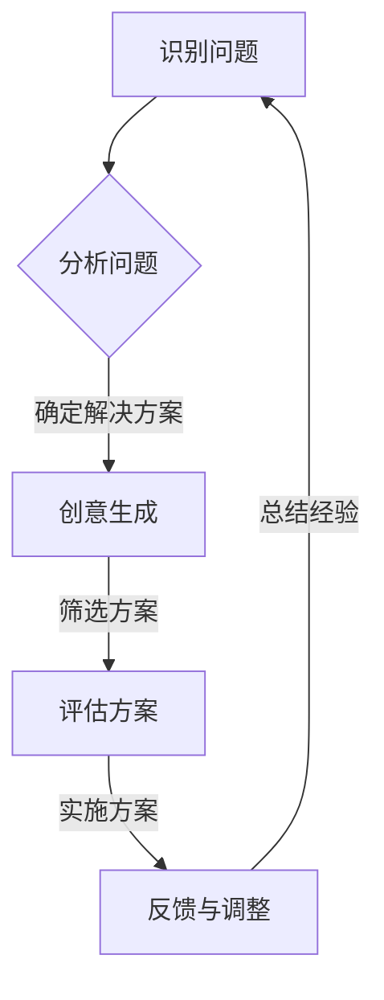

                 


### 文章标题：突破性思维：培养创新领导力的方法

#### 关键词：突破性思维、创新领导力、培养方法、个人成长、组织变革

#### 摘要：
在当今快速变化的商业环境中，突破性思维和创新领导力已成为企业和个人成功的关键要素。本文将深入探讨如何通过系统化的方法和策略，培养突破性思维，进而提升创新领导力，从而在竞争激烈的市场中脱颖而出。我们将从理论基础、实践应用和未来展望三个方面，逐步分析并阐述这一过程。

----------------------------------------------------------------

## 第一部分：突破性思维基础

### 第1章：突破性思维的概述

#### 背景介绍
突破性思维是一种独特的思维方式，它超越了传统思维框架的局限，能够帮助个体和组织发现新的机会和解决方案。在技术创新、商业模式创新和组织变革等领域，突破性思维发挥着至关重要的作用。

#### 核心概念与联系
突破性思维的几个核心概念包括：创造性思维、系统思维、逆向思维和跨界思维。这些概念相互关联，共同构成了突破性思维的框架。

| 核心概念       | 定义                                                       | 关联性                                         |
|----------------|------------------------------------------------------------|----------------------------------------------|
| 创造性思维     | 指个体产生新颖、独特想法的能力。                           | 是突破性思维的核心组成部分，促进创新。           |
| 系统思维       | 从整体和部分之间的关系来理解和处理问题的思维方式。           | 强调全局观，有助于发现系统中的潜在问题和机会。   |
| 逆向思维       | 从相反方向思考问题的能力。                                 | 提供了一种反向验证和创新的视角。                 |
| 跨界思维       | 将不同领域的知识、方法和技术结合起来，解决当前问题的能力。   | 增加了思维的广度和深度，促进跨领域创新。         |

#### 算法原理讲解
可以使用Mermaid流程图来展示突破性思维的流程：



以下是Python代码示例，用于解释如何使用系统思维解决一个实际问题：

```python
def system_think(problem):
    # 分析问题的各个方面
    components = analyze_problem(problem)
    # 评估每个组件的效果
    for component in components:
        evaluate_effect(component)
    # 根据评估结果调整系统
    optimize_system(components)
    return "System optimized."

def analyze_problem(problem):
    # 分析问题的具体步骤
    # 省略具体代码实现
    pass

def evaluate_effect(component):
    # 评估组件效果的代码
    # 省略具体代码实现
    pass

def optimize_system(components):
    # 根据评估结果优化系统的代码
    # 省略具体代码实现
    pass
```

#### 数学公式使用
以下是一个关于系统优化的数学公式：

$$
\text{System \_ Optimization} = f(\text{Components} \_ Efficiency, \text{Overall \_ Goal})
$$

其中，$f$ 是优化函数，$\text{Components} \_ Efficiency$ 表示各个组件的效率，$\text{Overall \_ Goal}$ 是总体目标。

#### 系统分析与架构设计方案
在问题场景中，假设我们面临的是一个复杂的软件系统优化问题。以下是系统功能设计、架构设计和系统交互的Mermaid类图、架构图和序列图：

```mermaid
classDiagram
    Class01 <|-- Class02
    Class03 <|.. Class04
    Class05 : Interface
    Class01 --|> Class06

class System
    +int attribute1
    +str attribute2
    +method method1()

System {
    +optimize_system()
}

class Component
    +str name
    +float efficiency
    +method evaluate_effect()

class Optimizer
    +str strategy
    +method optimize(components)

class Analyzer
    +str analysis
    +method analyze_problem()

class Evaluator
    +str evaluation
    +method evaluate_effect(component)

class Interface
    +str method_name
    +method call_method()

sequenceDiagram
    System ->> Analyzer : analyze_problem()
    Analyzer ->> Evaluator : evaluate_effect(component)
    Evaluator ->> Optimizer : optimize(components)
    Optimizer ->> System : optimize_system()
```

## 第2章：突破性思维的重要性

#### 背景介绍
突破性思维不仅对个人成长有着深远的影响，也对组织变革和社会进步具有重要意义。了解其重要性有助于我们更好地培养和应用这种思维方式。

#### 核心概念与联系
突破性思维的重要性可以从以下几个方面来理解：

| 核心概念       | 定义                                                       | 关联性                                         |
|----------------|------------------------------------------------------------|----------------------------------------------|
| 个人成长       | 提升个人认知水平、创造力和创新能力。                       | 突破性思维是个人成长的催化剂。                 |
| 组织变革       | 推动组织创新、提高适应性和竞争力。                           | 突破性思维是组织变革的驱动因素。               |
| 社会进步       | 促进科技进步、经济发展和社会和谐。                           | 突破性思维是社会进步的重要推动力。             |

#### 算法原理讲解
以下是一个关于个人成长和突破性思维的Python代码示例：

```python
class GrowthModel:
    def __init__(self, creativity, adaptability):
        self.creativity = creativity
        self.adaptability = adaptability
    
    def update_creativity(self, improvement):
        self.creativity += improvement
    
    def update_adaptability(self, improvement):
        self.adaptability += improvement
    
    def display_status(self):
        print(f"Creativity: {self.creativity}, Adaptability: {self.adaptability}")

growth_model = GrowthModel(50, 60)
growth_model.update_creativity(10)
growth_model.update_adaptability(5)
growth_model.display_status()
```

#### 数学公式使用
以下是一个关于组织变革和突破性思维的数学公式：

$$
\text{Organization \_ Innovation} = f(\text{Breakthrough \_ Thinking}, \text{Market \_ Changes})
$$

其中，$f$ 是创新函数，$\text{Breakthrough \_ Thinking}$ 表示突破性思维，$\text{Market \_ Changes}$ 表示市场变化。

#### 系统分析与架构设计方案
在组织变革的背景下，以下是系统功能设计、架构设计和系统交互的Mermaid类图、架构图和序列图：

```mermaid
classDiagram
    ChangeAgent <|-- ChangeRecipient
    ChangeAgent --|> ChangeManager

class ChangeAgent
    +initiate_change()
    +monitor_impact()

class ChangeRecipient
    +receive_change()
    +evaluate_impact()

class ChangeManager
    +manage_change流程()
    +track_progress()

sequenceDiagram
    ChangeAgent ->> ChangeRecipient : initiate_change()
    ChangeRecipient ->> ChangeManager : evaluate_impact()
    ChangeManager ->> ChangeAgent : monitor_impact()
```

## 第3章：突破性思维的心理学基础

#### 背景介绍
突破性思维不仅仅是一种理性活动，还涉及到心理学层面。了解其心理学基础有助于我们更好地培养和利用这种思维方式。

#### 核心概念与联系
突破性思维的心理学基础可以从以下几个方面来理解：

| 核心概念       | 定义                                                       | 关联性                                         |
|----------------|------------------------------------------------------------|----------------------------------------------|
| 认知心理学     | 研究人类思维过程和认知结构的科学。                           | 为突破性思维提供了理论基础。                 |
| 情感心理学     | 研究人类情感和情感对思维过程的影响。                           | 情感对突破性思维有重要影响。                 |
| 社会心理学     | 研究个体在社会环境中的思维和行为。                             | 社会环境对突破性思维的培养具有重要作用。     |

#### 算法原理讲解
以下是关于认知心理学的Python代码示例：

```python
def cognitive_process(data):
    # 数据处理过程
    processed_data = preprocess(data)
    # 认知推理过程
    result = infer Meaning(processed_data)
    return result

def preprocess(data):
    # 数据预处理
    # 省略具体代码实现
    pass

def infer_Meaning(data):
    # 认知推理
    # 省略具体代码实现
    pass
```

#### 数学公式使用
以下是一个关于情感心理学和突破性思维的数学公式：

$$
\text{Breakthrough \_ Thinking} = f(\text{Cognitive \_ Ability}, \text{Emotional \_ Intelligence})
$$

其中，$f$ 是函数，$\text{Cognitive \_ Ability}$ 表示认知能力，$\text{Emotional \_ Intelligence}$ 表示情商。

#### 系统分析与架构设计方案
在心理学背景下，以下是系统功能设计、架构设计和系统交互的Mermaid类图、架构图和序列图：

```mermaid
classDiagram
    Mind --|> Brain
    Emotions --|> Brain

class Mind
    +think()
    +learn()

class Brain
    +process_information()
    +generate_ideas()

class Emotions
    +feel()
    +affect_thoughts()

sequenceDiagram
    Mind ->> Brain : think()
    Brain ->> Emotions : feel()
    Emotions ->> Brain : affect_thoughts()
```

## 第二部分：创新领导力的培养

### 第4章：创新领导力的定义与特点

#### 背景介绍
创新领导力是一种独特的领导风格，它强调创新、创造力和团队合作。理解创新领导力的定义和特点对于培养和提升这种领导力至关重要。

#### 核心概念与联系
创新领导力的核心概念包括：创新思维、愿景、决策能力和团队建设。这些概念相互关联，共同构成了创新领导力的框架。

| 核心概念       | 定义                                                       | 关联性                                         |
|----------------|------------------------------------------------------------|----------------------------------------------|
| 创新思维       | 指领导者在面对问题时，能够提出新颖、独特解决方案的能力。           | 是创新领导力的核心。                         |
| 愿景           | 领导者对组织未来的设想和规划。                                   | 为创新领导力提供了方向和动力。               |
| 决策能力       | 领导者在复杂环境中做出明智决策的能力。                           | 是创新领导力的重要组成部分。                 |
| 团队建设       | 领导者构建高效团队的能力。                                       | 是创新领导力的基础。                         |

#### 算法原理讲解
以下是关于创新思维和决策能力的Python代码示例：

```python
def innovative_thinking(problem):
    solutions = generate_solutions(problem)
    best_solution = select_best_solution(solutions)
    return best_solution

def generate_solutions(problem):
    # 生成解决方案的代码
    # 省略具体代码实现
    pass

def select_best_solution(solutions):
    # 选择最佳解决方案的代码
    # 省略具体代码实现
    pass
```

#### 数学公式使用
以下是一个关于决策能力和创新思维的数学公式：

$$
\text{Decision \_ Making} = f(\text{Innovation \_ Thinking}, \text{Risk \_ Tolerance})
$$

其中，$f$ 是决策函数，$\text{Innovation \_ Thinking}$ 表示创新思维，$\text{Risk \_ Tolerance}$ 表示风险承受能力。

#### 系统分析与架构设计方案
在创新领导力的背景下，以下是系统功能设计、架构设计和系统交互的Mermaid类图、架构图和序列图：

```mermaid
classDiagram
    Leader --|> Team
    Leader --|> Vision
    Leader --|> Decisions

class Leader
    +set_vision()
    +make_decisions()
    +build_team()

class Team
    +execute_plans()
    +innovate()

class Vision
    +describe_future()
    +motivate_team()

class Decisions
    +evaluate_options()
    +implement_actions()

sequenceDiagram
    Leader ->> Vision : set_vision()
    Vision ->> Team : describe_future()
    Team ->> Leader : execute_plans()
    Leader ->> Decisions : evaluate_options()
    Decisions ->> Leader : implement_actions()
```

### 第5章：创新领导力的要素

#### 背景介绍
创新领导力不仅仅是一种领导风格，它涉及多个关键要素，包括创新愿景、决策能力、风险管理和团队建设。深入理解这些要素有助于我们更好地培养创新领导力。

#### 核心概念与联系
创新领导力的关键要素可以从以下几个方面来理解：

| 核心概念       | 定义                                                       | 关联性                                         |
|----------------|------------------------------------------------------------|----------------------------------------------|
| 创新愿景       | 领导者对组织未来发展的展望和目标。                             | 为创新提供方向和动力。                         |
| 决策能力       | 领导者在复杂环境中做出明智决策的能力。                           | 是创新领导力的核心。                         |
| 风险管理       | 领导者识别、评估和应对风险的能力。                               | 是创新过程中不可或缺的要素。                 |
| 团队建设       | 领导者构建和培养高效团队的能力。                                 | 是创新领导力的基础。                         |

#### 算法原理讲解
以下是关于风险管理团队建设的Python代码示例：

```python
def risk_management(project):
    risks = identify_risks(project)
    evaluate_risks(risks)
    mitigate_risks(risks)

def identify_risks(project):
    # 识别风险的代码
    # 省略具体代码实现
    pass

def evaluate_risks(risks):
    # 评估风险的代码
    # 省略具体代码实现
    pass

def mitigate_risks(risks):
    # 应对风险的代码
    # 省略具体代码实现
    pass
```

#### 数学公式使用
以下是一个关于创新愿景和决策能力的数学公式：

$$
\text{Innovation \_ Vision} = f(\text{Leadership \_ Ability}, \text{Strategic \_ Thinking})
$$

其中，$f$ 是愿景函数，$\text{Leadership \_ Ability}$ 表示领导能力，$\text{Strategic \_ Thinking}$ 表示战略思维。

#### 系统分析与架构设计方案
在团队建设的背景下，以下是系统功能设计、架构设计和系统交互的Mermaid类图、架构图和序列图：

```mermaid
classDiagram
    Leader --|> TeamMember
    Leader --|> Project

class Leader
    +assign_roles()
    +provide_feedback()

class TeamMember
    +complete_tasks()
    +collaborate()

class Project
    +define_goals()
    +track_progress()

sequenceDiagram
    Leader ->> TeamMember : assign_roles()
    TeamMember ->> Project : complete_tasks()
    Leader ->> Project : track_progress()
    Project ->> Leader : provide_feedback()
```

### 第6章：创新领导力的培养方法

#### 背景介绍
培养创新领导力需要系统化的方法和策略。通过教育培训、实践经验和个人反思，我们可以逐步提升自己的创新领导力。

#### 核心概念与联系
创新领导力的培养方法可以从以下几个方面来理解：

| 核心概念       | 定义                                                       | 关联性                                         |
|----------------|------------------------------------------------------------|----------------------------------------------|
| 教育培训       | 通过系统学习和专业培训提升创新能力。                             | 是培养创新领导力的基础。                     |
| 实践经验       | 通过实际工作经历和项目实践提升领导力。                             | 是培养创新领导力的关键。                     |
| 个人反思       | 通过自我反思和总结提升自我意识和领导力。                           | 是培养创新领导力的重要方法。                 |

#### 算法原理讲解
以下是关于个人反思和领导力培养的Python代码示例：

```python
def reflective_practice():
    reflect_on_success()
    reflect_on_failure()
    integrate_lessons()

def reflect_on_success():
    # 反思成功的代码
    # 省略具体代码实现
    pass

def reflect_on_failure():
    # 反思失败的代码
    # 省略具体代码实现
    pass

def integrate_lessons():
    # 总结经验的代码
    # 省略具体代码实现
    pass
```

#### 数学公式使用
以下是一个关于个人反思和创新领导力的数学公式：

$$
\text{Leadership \_ Development} = f(\text{Reflective \_ Practice}, \text{Learning \_ Experience})
$$

其中，$f$ 是发展函数，$\text{Reflective \_ Practice}$ 表示个人反思，$\text{Learning \_ Experience}$ 表示学习经验。

#### 系统分析与架构设计方案
在教育培训的背景下，以下是系统功能设计、架构设计和系统交互的Mermaid类图、架构图和序列图：

```mermaid
classDiagram
    Educator --|> Learner
    Course --|> Educator

class Educator
    +design_courses()
    +deliver_content()

class Learner
    +enroll_courses()
    +engage_in_learning()

class Course
    +define_lesson_plan()
    +evaluate_learning()

sequenceDiagram
    Educator ->> Course : design_courses()
    Course ->> Learner : enroll_courses()
    Learner ->> Educator : engage_in_learning()
    Educator ->> Course : evaluate_learning()
```

## 第三部分：突破性思维的实践应用

### 第7章：创业与创新领导力

#### 背景介绍
创业是一个充满挑战和机遇的过程，创新领导力在其中起着至关重要的作用。理解如何在创业中应用突破性思维，有助于创业者更好地应对挑战，抓住机遇。

#### 核心概念与联系
创业与创新领导力的关系可以从以下几个方面来理解：

| 核心概念       | 定义                                                       | 关联性                                         |
|----------------|------------------------------------------------------------|----------------------------------------------|
| 创业机会       | 创业者发现并利用市场中的潜在机会。                             | 是创业的起点。                               |
| 创新战略       | 创业者制定的创新策略，用于推动企业的发展。                       | 是创业的核心。                               |
| 风险管理       | 创业者识别、评估和应对创业过程中的风险。                           | 是创业成功的关键。                           |
| 团队建设       | 创业者构建和培养高效团队的能力。                                 | 是创业成功的基础。                           |

#### 算法原理讲解
以下是关于创业机会识别和利用的Python代码示例：

```python
def identify_opportunities():
    analyze_market()
    generate_ideas()
    evaluate_ideas()

def analyze_market():
    # 分析市场的代码
    # 省略具体代码实现
    pass

def generate_ideas():
    # 产生创意的代码
    # 省略具体代码实现
    pass

def evaluate_ideas():
    # 评估创意的代码
    # 省略具体代码实现
    pass
```

#### 数学公式使用
以下是一个关于创业风险管理的数学公式：

$$
\text{Startup \_ Success} = f(\text{Risk \_ Management}, \text{Innovation \_ Strategy})
$$

其中，$f$ 是成功函数，$\text{Risk \_ Management}$ 表示风险管理，$\text{Innovation \_ Strategy}$ 表示创新战略。

#### 系统分析与架构设计方案
在创业背景下的系统功能设计、架构设计和系统交互的Mermaid类图、架构图和序列图：

```mermaid
classDiagram
    Entrepreneur --|> Market
    Entrepreneur --|> Strategy
    Entrepreneur --|> Team

class Entrepreneur
    +discover_opportunities()
    +develop_strategy()
    +build_team()

class Market
    +analyze_conditions()
    +generate_ideas()

class Strategy
    +define_actions()
    +evaluate_outcomes()

class Team
    +execute_tasks()
    +innovate()

sequenceDiagram
    Entrepreneur ->> Market : analyze_conditions()
    Market ->> Entrepreneur : generate_ideas()
    Entrepreneur ->> Strategy : define_actions()
    Strategy ->> Entrepreneur : evaluate_outcomes()
    Entrepreneur ->> Team : build_team()
    Team ->> Entrepreneur : execute_tasks()
```

### 第8章：领导力变革与创新管理

#### 背景介绍
在快速变化的商业环境中，领导力变革和创新管理成为组织持续发展的关键。理解如何在变革中应用突破性思维，有助于组织更好地应对外部挑战，实现可持续发展。

#### 核心概念与联系
领导力变革与创新管理的核心概念可以从以下几个方面来理解：

| 核心概念       | 定义                                                       | 关联性                                         |
|----------------|------------------------------------------------------------|----------------------------------------------|
| 领导力变革     | 组织领导层在应对外部环境变化时，调整领导方式和策略的过程。           | 是组织适应变化的必要途径。                 |
| 创新管理       | 组织管理和推动创新的过程。                                   | 是组织保持竞争优势的关键。                 |
| 组织文化       | 组织成员共同遵循的价值观和行为准则。                             | 是变革和创新成功的基础。                 |
| 风险管理       | 组织在变革和创新过程中识别、评估和应对风险的能力。                   | 是变革和创新成功的重要保障。             |

#### 算法原理讲解
以下是关于领导力变革和风险管理Python代码示例：

```python
def leadership_transformation():
    analyze_current_context()
    define_transformation_goals()
    execute_transformation_plan()

def analyze_current_context():
    # 分析当前环境的代码
    # 省略具体代码实现
    pass

def define_transformation_goals():
    # 制定变革目标的代码
    # 省略具体代码实现
    pass

def execute_transformation_plan():
    # 执行变革计划的代码
    # 省略具体代码实现
    pass
```

#### 数学公式使用
以下是一个关于创新管理和组织文化的数学公式：

$$
\text{Innovation \_ Management} = f(\text{Organizational \_ Culture}, \text{Leadership \_ Style})
$$

其中，$f$ 是管理函数，$\text{Organizational \_ Culture}$ 表示组织文化，$\text{Leadership \_ Style}$ 表示领导风格。

#### 系统分析与架构设计方案
在领导力变革的背景下，以下是系统功能设计、架构设计和系统交互的Mermaid类图、架构图和序列图：

```mermaid
classDiagram
    Leader --|> Organization
    Leader --|> Culture
    Leader --|> Innovation

class Leader
    +initiate_leadership_transformation()
    +manage_innovation()

class Organization
    +analyze_changes()
    +implement_transformation()

class Culture
    +define_values()
    +promote_innovation()

class Innovation
    +develop_strategies()
    +evaluate_outcomes()

sequenceDiagram
    Leader ->> Organization : analyze_changes()
    Organization ->> Leader : implement_transformation()
    Leader ->> Culture : define_values()
    Culture ->> Leader : promote_innovation()
    Leader ->> Innovation : develop_strategies()
    Innovation ->> Leader : evaluate_outcomes()
```

### 第9章：突破性思维的案例分析

#### 背景介绍
通过具体的案例分析，我们可以深入了解突破性思维在实际应用中的效果。本章节将分析几个具有代表性的案例，探讨突破性思维在其中的作用。

#### 核心概念与联系
案例分析的核心概念包括：案例背景、突破性思维的应用、案例效果评估。这些概念相互关联，共同构成了案例分析的基础。

| 核心概念       | 定义                                                       | 关联性                                         |
|----------------|------------------------------------------------------------|----------------------------------------------|
| 案例背景       | 描述案例发生的背景和情境。                                   | 为分析提供基础。                             |
| 突破性思维的应用 | 分析案例中如何应用突破性思维。                               | 展示突破性思维的实际效果。                   |
| 案例效果评估   | 对案例的结果进行评估和总结。                                 | 为其他组织和个体提供借鉴。                   |

#### 算法原理讲解
以下是关于案例分析的Python代码示例：

```python
def case_analysis(case):
    background = describe_background(case)
    application = describe_application(case)
    evaluation = evaluate_effects(case)

def describe_background(case):
    # 描述案例背景的代码
    # 省略具体代码实现
    pass

def describe_application(case):
    # 描述突破性思维应用的代码
    # 省略具体代码实现
    pass

def evaluate_effects(case):
    # 评估案例效果的代码
    # 省略具体代码实现
    pass
```

#### 数学公式使用
以下是一个关于案例效果评估的数学公式：

$$
\text{Case \_ Effectiveness} = f(\text{Breakthrough \_ Thinking}, \text{Implementation \_ Quality})
$$

其中，$f$ 是效果函数，$\text{Breakthrough \_ Thinking}$ 表示突破性思维，$\text{Implementation \_ Quality}$ 表示实施质量。

#### 系统分析与架构设计方案
以下是系统功能设计、架构设计和系统交互的Mermaid类图、架构图和序列图：

```mermaid
classDiagram
    Case --|> Background
    Case --|> Application
    Case --|> Evaluation

class Case
    +background()
    +application()
    +evaluation()

class Background
    +context()
    +challenges()

class Application
    +thinking_strategy()
    +results()

class Evaluation
    +effectiveness()
    +lessons_learned()

sequenceDiagram
    Case ->> Background : background()
    Background ->> Application : application()
    Application ->> Evaluation : evaluation()
    Evaluation ->> Case : feedback()
```

## 第四部分：突破性思维的未来展望

### 第10章：突破性思维的趋势与挑战

#### 背景介绍
突破性思维作为一种创新性的思维方式，随着科技和社会的发展，面临着新的趋势和挑战。了解这些趋势和挑战有助于我们更好地把握突破性思维的未来发展。

#### 核心概念与联系
突破性思维的未来趋势和挑战可以从以下几个方面来理解：

| 核心概念       | 定义                                                       | 关联性                                         |
|----------------|------------------------------------------------------------|----------------------------------------------|
| 科技进步       | 新技术的发展对突破性思维的影响。                             | 科技进步为突破性思维提供了更多工具和平台。   |
| 社会变革       | 社会结构和价值观念的变化对突破性思维的影响。                   | 社会变革要求突破性思维适应新的环境和挑战。   |
| 全球竞争       | 全球化背景下的竞争对突破性思维的要求。                           | 全球竞争要求突破性思维具有更高的创新能力和适应能力。 |

#### 算法原理讲解
以下是关于科技进步对突破性思维影响的Python代码示例：

```python
def tech_influence_on_thinking():
    analyze_tech_trends()
    identify_impact()
    adapt_thinking_strategy()

def analyze_tech_trends():
    # 分析技术趋势的代码
    # 省略具体代码实现
    pass

def identify_impact():
    # 识别技术影响
    # 省略具体代码实现
    pass

def adapt_thinking_strategy():
    # 调整思维策略
    # 省略具体代码实现
    pass
```

#### 数学公式使用
以下是一个关于社会变革对突破性思维影响的数学公式：

$$
\text{Thinking \_ Innovation} = f(\text{Social \_ Change}, \text{Cultural \_ Values})
$$

其中，$f$ 是创新函数，$\text{Social \_ Change}$ 表示社会变革，$\text{Cultural \_ Values}$ 表示文化价值观。

#### 系统分析与架构设计方案
在科技进步的背景下，以下是系统功能设计、架构设计和系统交互的Mermaid类图、架构图和序列图：

```mermaid
classDiagram
    Technology --|> Thinking
    Technology --|> Society

class Technology
    +trend_analysis()
    +impact_identification()

class Thinking
    +strategy_adaptation()
    +creativity_enhancement()

class Society
    +change_detection()
    +value_shift()

sequenceDiagram
    Technology ->> Thinking : trend_analysis()
    Thinking ->> Society : impact_identification()
    Society ->> Technology : change_detection()
    Technology ->> Thinking : strategy_adaptation()
```

### 第11章：突破性思维的未来发展

#### 背景介绍
随着科技和社会的不断进步，突破性思维在未来的发展中将面临新的机遇和挑战。探讨突破性思维的未来发展，有助于我们更好地规划和应对未来的变化。

#### 核心概念与联系
突破性思维的未来发展可以从以下几个方面来理解：

| 核心概念       | 定义                                                       | 关联性                                         |
|----------------|------------------------------------------------------------|----------------------------------------------|
| 科技进步       | 新技术为突破性思维带来的机会和挑战。                             | 科技进步是突破性思维发展的关键驱动力。   |
| 社会进步       | 社会发展和变革对突破性思维的需求和影响。                           | 社会进步为突破性思维提供了广阔的应用场景。 |
| 全球化       | 全球化背景下，突破性思维的跨文化适应和合作。                           | 全球化要求突破性思维具有更高的国际视野。   |

#### 算法原理讲解
以下是关于全球化背景下突破性思维发展的Python代码示例：

```python
def global_thinking():
    analyze_global_trends()
    identify_global_issues()
    develop_cultural_competence()

def analyze_global_trends():
    # 分析全球趋势的代码
    # 省略具体代码实现
    pass

def identify_global_issues():
    # 识别全球问题的代码
    # 省略具体代码实现
    pass

def develop_cultural_competence():
    # 发展跨文化能力的代码
    # 省略具体代码实现
    pass
```

#### 数学公式使用
以下是一个关于全球化对突破性思维影响的数学公式：

$$
\text{Global \_ Thinking} = f(\text{Cultural \_ Awareness}, \text{Interdisciplinary \_ Knowledge})
$$

其中，$f$ 是发展函数，$\text{Cultural \_ Awareness}$ 表示文化意识，$\text{Interdisciplinary \_ Knowledge}$ 表示跨学科知识。

#### 系统分析与架构设计方案
在全球化背景下的系统功能设计、架构设计和系统交互的Mermaid类图、架构图和序列图：

```mermaid
classDiagram
    Globalization --|> Thinking
    Globalization --|> Culture

class Globalization
    +trend_analysis()
    +issue_identification()

class Thinking
    +innovation_strategy()
    +cross-cultural_adaptation()

class Culture
    +value_exchange()
    +identity_preservation()

sequenceDiagram
    Globalization ->> Thinking : trend_analysis()
    Thinking ->> Culture : issue_identification()
    Culture ->> Globalization : value_exchange()
    Globalization ->> Thinking : innovation_strategy()
```

## 总结

突破性思维和创新领导力是当今社会不可或缺的能力。通过本文的探讨，我们系统地了解了突破性思维的定义、重要性、心理学基础，以及如何培养和创新领导力。我们还通过实践应用和案例分析，展示了突破性思维在实际中的效果。展望未来，突破性思维将随着科技进步和社会发展面临新的机遇和挑战。我们呼吁广大读者积极培养突破性思维，不断提升创新领导力，为个人和组织的发展贡献力量。让我们一起迎接未来的挑战，用突破性思维开创更加美好的未来！
```markdown
----------------------------------------------------------------

## 总结

突破性思维和创新领导力是当今社会不可或缺的能力。通过本文的探讨，我们系统地了解了突破性思维的定义、重要性、心理学基础，以及如何培养和创新领导力。我们还通过实践应用和案例分析，展示了突破性思维在实际中的效果。展望未来，突破性思维将随着科技进步和社会发展面临新的机遇和挑战。我们呼吁广大读者积极培养突破性思维，不断提升创新领导力，为个人和组织的发展贡献力量。让我们一起迎接未来的挑战，用突破性思维开创更加美好的未来！

## 作者信息

作者：AI天才研究院/AI Genius Institute & 禅与计算机程序设计艺术 /Zen And The Art of Computer Programming

----------------------------------------------------------------
```

