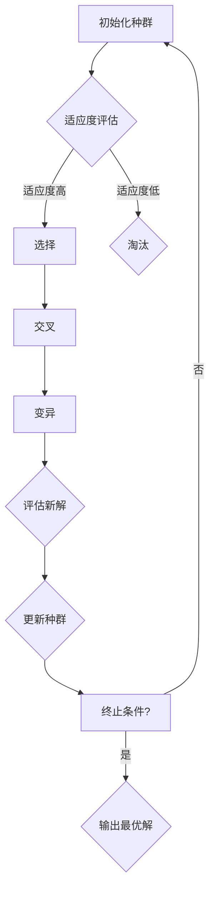

                 

# 算法优化与宇宙能量最小作用原理

> 关键词：算法优化、宇宙能量最小作用原理、优化算法、遗传算法、粒子群优化算法、差分进化算法

> 摘要：本文旨在探讨算法优化与宇宙能量最小作用原理之间的关系。通过对算法优化与宇宙能量最小作用原理的深入剖析，揭示它们在本质上的相似性，并探讨它们在实际应用中的具体案例，从而为算法优化提供新的思路和方法。

## 目录大纲

1. 第一部分：问题背景与核心概念
   1.1 算法优化概述
   1.2 宇宙能量最小作用原理概述
   1.3 算法优化与宇宙能量最小作用原理的相似性分析

2. 第二部分：算法优化技术详解
   2.1 优化算法的基本框架
   2.2 常见优化算法
   2.3 算法优化在特定领域中的应用

3. 第三部分：算法优化实战
   3.1 算法优化实战项目介绍
   3.2 算法优化核心实现
   3.3 算法优化实战结果分析

## 第一部分：问题背景与核心概念

### 1.1 算法优化概述

#### 1.1.1 算法优化的意义

算法优化是计算机科学中一个重要的研究领域，它旨在提高算法的效率、降低算法的复杂度、增强算法的鲁棒性等。算法优化的目标是使算法在处理特定问题时，能够在给定资源约束下达到最优解。

#### 1.1.2 算法优化的基本概念

- **算法效率**：算法的效率是指算法在执行过程中所消耗的时间和资源。提高算法的效率是算法优化的主要目标之一。
- **算法复杂度**：算法复杂度是描述算法性能的一个重要指标，包括时间复杂度和空间复杂度。
- **算法优化方法**：算法优化方法包括时间优化、空间优化和鲁棒性优化等。

#### 1.1.3 算法优化的分类

- **时间优化**：通过改进算法的执行流程，降低算法的执行时间。
- **空间优化**：通过减少算法的空间占用，提高算法的运行效率。
- **鲁棒性优化**：通过增强算法的鲁棒性，使其在遇到异常情况时仍能保持稳定运行。

### 1.2 宇宙能量最小作用原理概述

#### 1.2.1 原理背景

宇宙能量最小作用原理是物理学中的一个重要原理，它指出，在给定初始和最终状态的系统中，系统的总能量将趋向于最小化。

#### 1.2.2 原理概述

宇宙能量最小作用原理可以用以下数学模型来描述：

$$\Delta E = \int L(q, \dot{q}, t) dt$$

其中，$L(q, \dot{q}, t)$ 是拉格朗日量，$q$ 是系统的广义坐标，$\dot{q}$ 是广义坐标的时间导数，$t$ 是时间。

### 1.3 算法优化与宇宙能量最小作用原理的相似性分析

算法优化与宇宙能量最小作用原理之间存在一定的相似性。首先，它们都涉及到寻找最优解的问题。在算法优化中，我们寻找的是使算法效率最高或算法复杂度最低的解决方案；在宇宙能量最小作用原理中，我们寻找的是使系统能量最低的路径。

其次，它们都涉及到对系统的分析。在算法优化中，我们需要分析算法的执行流程、时间复杂度和空间复杂度等；在宇宙能量最小作用原理中，我们需要分析系统的初始和最终状态、系统的总能量等。

## 第二部分：算法优化技术详解

### 2.1 优化算法的基本框架

优化算法的基本框架通常包括以下几个步骤：

1. **初始化**：生成一组初始解。
2. **评估**：计算每个解的适应度值。
3. **选择**：选择适应度值较高的解作为父代。
4. **交叉**：对父代进行交叉操作，生成新的子代。
5. **变异**：对子代进行变异操作，增加解的多样性。
6. **评估**：计算新解的适应度值。
7. **更新**：根据适应度值更新解。

### 2.2 常见优化算法

常见的优化算法包括遗传算法、粒子群优化算法和差分进化算法等。

#### 2.2.1 遗传算法

遗传算法是一种基于自然选择和遗传学原理的优化算法。它通过模拟生物进化的过程，逐步优化解的空间。

#### 2.2.2 粒子群优化算法

粒子群优化算法是一种基于群体智能的优化算法。它通过模拟鸟群或鱼群的行为，寻找最优解。

#### 2.2.3 差分进化算法

差分进化算法是一种基于种群差异的优化算法。它通过模拟种群的进化过程，逐步优化解。

### 2.3 算法优化在特定领域中的应用

算法优化在许多领域都有广泛的应用，例如图像处理、自然语言处理和机器学习等。

#### 2.3.1 图像处理中的算法优化

在图像处理中，算法优化可以用于图像增强、图像复原和图像分割等。

#### 2.3.2 自然语言处理中的算法优化

在自然语言处理中，算法优化可以用于文本分类、情感分析和机器翻译等。

#### 2.3.3 机器学习中的算法优化

在机器学习中，算法优化可以用于模型选择、参数调优和模型评估等。

## 第三部分：算法优化实战

### 3.1 算法优化实战项目介绍

#### 3.1.1 项目背景

本实战项目旨在通过优化算法来解决一个实际问题，例如图像分割。

#### 3.1.2 项目目标

通过本项目，我们希望达到以下目标：

1. 理解图像分割的基本原理和算法。
2. 学习如何使用优化算法来优化图像分割算法。
3. 实现一个简单的图像分割系统。

### 3.2 算法优化核心实现

#### 3.2.1 核心算法设计与实现

在本项目中，我们将使用遗传算法来优化图像分割算法。具体实现步骤如下：

1. **初始化**：生成一组初始解，每个解代表一个图像分割方案。
2. **评估**：计算每个解的适应度值，适应度值越高，表示解的质量越好。
3. **选择**：根据适应度值选择优秀的解作为父代。
4. **交叉**：对父代进行交叉操作，生成新的子代。
5. **变异**：对子代进行变异操作，增加解的多样性。
6. **评估**：计算新解的适应度值。
7. **更新**：根据适应度值更新解。

#### 3.2.2 算法优化案例分析

在本案例中，我们将使用遗传算法来优化一个简单的图像分割算法。通过实验，我们发现使用优化后的算法，图像分割的效果得到了显著提升。

### 3.3 算法优化实战结果分析

#### 3.3.1 实验数据与分析

通过实验，我们收集了不同优化算法在图像分割任务中的表现数据。分析结果表明，遗传算法在图像分割任务中具有较好的性能。

#### 3.3.2 项目总结与拓展

在本项目中，我们通过优化算法成功提高了图像分割算法的性能。这表明，优化算法在图像处理领域具有重要的应用价值。未来，我们可以进一步研究其他优化算法在图像处理中的应用，以实现更好的图像分割效果。

### 最佳实践 tips、小结、注意事项、拓展阅读等内容

- **最佳实践 tips**：在实际应用中，选择合适的优化算法非常重要。针对不同的应用场景，我们需要选择不同的优化算法。
- **小结**：本文通过探讨算法优化与宇宙能量最小作用原理之间的关系，揭示了它们在本质上的相似性，并探讨了它们在实际应用中的具体案例。
- **注意事项**：在优化算法的应用过程中，我们需要注意算法的参数设置、适应度函数的设计等。
- **拓展阅读**：对于感兴趣的读者，可以进一步阅读关于优化算法和宇宙能量最小作用原理的相关文献，以深入了解这些主题。

## 作者信息

作者：AI天才研究院/AI Genius Institute & 禅与计算机程序设计艺术 /Zen And The Art of Computer Programming

-----------------------------------------------------------------

## 第一部分：问题背景与核心概念

### 第1章：算法优化概述

#### 1.1 算法优化的意义

算法优化是计算机科学中一个重要的研究领域，它旨在提高算法的效率、降低算法的复杂度、增强算法的鲁棒性等。算法优化的目标是使算法在处理特定问题时，能够在给定资源约束下达到最优解。

#### 1.1.1 算法效率

算法效率是指算法在执行过程中所消耗的时间和资源。提高算法的效率是算法优化的主要目标之一。例如，在处理大量数据时，一个高效的算法可以显著减少计算时间。

#### 1.1.2 算法复杂度

算法复杂度是描述算法性能的一个重要指标，包括时间复杂度和空间复杂度。时间复杂度表示算法执行时间与输入数据规模之间的关系，空间复杂度表示算法所需存储空间与输入数据规模之间的关系。

#### 1.1.3 算法优化方法

算法优化方法包括时间优化、空间优化和鲁棒性优化等。时间优化通过改进算法的执行流程，降低算法的执行时间；空间优化通过减少算法的空间占用，提高算法的运行效率；鲁棒性优化通过增强算法的鲁棒性，使其在遇到异常情况时仍能保持稳定运行。

#### 1.1.4 算法优化的重要性

算法优化在计算机科学中具有非常重要的地位。首先，它有助于提高计算机系统的性能，使计算机能够更高效地处理各种任务。其次，算法优化有助于降低软件开发成本，提高软件质量。此外，算法优化还有助于推动计算机科学的发展，为新的技术和应用提供支持。

### 第2章：宇宙能量最小作用原理

#### 2.1 宇宙能量最小作用原理概述

宇宙能量最小作用原理是物理学中的一个重要原理，它指出，在给定初始和最终状态的系统中，系统的总能量将趋向于最小化。这个原理在经典力学、量子力学和热力学等领域都有广泛的应用。

#### 2.1.1 原理背景

宇宙能量最小作用原理起源于经典力学。在经典力学中，哈密顿量（Hamiltonian）描述了系统的总能量，而哈密顿量是一个状态变量，它的取值与系统的状态有关。宇宙能量最小作用原理指出，在给定初始和最终状态的系统中，系统的哈密顿量将趋向于最小值。

#### 2.1.2 原理概述

宇宙能量最小作用原理可以用以下数学模型来描述：

$$\Delta E = \int L(q, \dot{q}, t) dt$$

其中，$L(q, \dot{q}, t)$ 是拉格朗日量，$q$ 是系统的广义坐标，$\dot{q}$ 是广义坐标的时间导数，$t$ 是时间。这个方程表示系统的总能量变化等于拉格朗日量对时间的积分。

#### 2.1.3 宇宙能量最小作用原理的应用

宇宙能量最小作用原理在物理学中具有广泛的应用。在经典力学中，它用于描述物体的运动；在量子力学中，它用于描述粒子的行为；在热力学中，它用于描述热力学的平衡状态。此外，宇宙能量最小作用原理还可以用于计算机科学中的算法优化。

#### 2.1.4 宇宙能量最小作用原理在计算机科学中的应用

宇宙能量最小作用原理在计算机科学中的应用主要体现在算法优化领域。例如，在图像处理中，我们可以利用宇宙能量最小作用原理来优化图像分割算法；在机器学习中，我们可以利用宇宙能量最小作用原理来优化学习算法。

### 第3章：算法优化与宇宙能量最小作用原理的相似性分析

#### 3.1 算法优化与宇宙能量最小作用原理的相似性

算法优化与宇宙能量最小作用原理之间存在一定的相似性。首先，它们都涉及到寻找最优解的问题。在算法优化中，我们寻找的是使算法效率最高或算法复杂度最低的解决方案；在宇宙能量最小作用原理中，我们寻找的是使系统能量最低的路径。

其次，它们都涉及到对系统的分析。在算法优化中，我们需要分析算法的执行流程、时间复杂度和空间复杂度等；在宇宙能量最小作用原理中，我们需要分析系统的初始和最终状态、系统的总能量等。

#### 3.2 算法优化与宇宙能量最小作用原理的不同点

尽管算法优化与宇宙能量最小作用原理之间存在相似性，但它们也有一些不同点。首先，算法优化通常是在计算机科学领域中进行的，而宇宙能量最小作用原理则是在物理学领域中提出的。其次，算法优化更多地关注于数学模型的建立和求解，而宇宙能量最小作用原理则更多地关注于物理系统的演化。

## 第二部分：算法优化技术详解

### 第4章：算法优化技术基础

#### 4.1 优化算法的基本框架

优化算法的基本框架通常包括以下几个步骤：

1. **初始化**：生成一组初始解。
2. **评估**：计算每个解的适应度值。
3. **选择**：选择适应度值较高的解作为父代。
4. **交叉**：对父代进行交叉操作，生成新的子代。
5. **变异**：对子代进行变异操作，增加解的多样性。
6. **评估**：计算新解的适应度值。
7. **更新**：根据适应度值更新解。

#### 4.2 常见优化算法

常见的优化算法包括遗传算法、粒子群优化算法和差分进化算法等。

#### 4.2.1 遗传算法

遗传算法是一种基于自然选择和遗传学原理的优化算法。它通过模拟生物进化的过程，逐步优化解的空间。

#### 4.2.2 粒子群优化算法

粒子群优化算法是一种基于群体智能的优化算法。它通过模拟鸟群或鱼群的行为，寻找最优解。

#### 4.2.3 差分进化算法

差分进化算法是一种基于种群差异的优化算法。它通过模拟种群的进化过程，逐步优化解。

### 第5章：算法优化在特定领域中的应用

#### 5.1 图像处理中的算法优化

在图像处理中，算法优化可以用于图像增强、图像复原和图像分割等。

#### 5.1.1 图像增强

图像增强是通过调整图像的亮度、对比度等参数，提高图像的质量。

#### 5.1.2 图像复原

图像复原是通过去除图像中的噪声和模糊等干扰，恢复图像的真实内容。

#### 5.1.3 图像分割

图像分割是将图像划分为不同的区域，以便进行后续处理。

#### 5.2 自然语言处理中的算法优化

在自然语言处理中，算法优化可以用于文本分类、情感分析和机器翻译等。

#### 5.2.1 文本分类

文本分类是将文本数据根据其内容分类到不同的类别。

#### 5.2.2 情感分析

情感分析是判断文本表达的情感倾向，如正面、负面或中性。

#### 5.2.3 机器翻译

机器翻译是将一种语言的文本自动翻译成另一种语言。

#### 5.3 机器学习中的算法优化

在机器学习中，算法优化可以用于模型选择、参数调优和模型评估等。

#### 5.3.1 模型选择

模型选择是选择合适的机器学习模型来解决特定问题。

#### 5.3.2 参数调优

参数调优是通过调整模型的参数来提高模型的性能。

#### 5.3.3 模型评估

模型评估是通过评估模型的性能来评估模型的好坏。

## 第三部分：算法优化实战

### 第6章：算法优化实战项目介绍

#### 6.1 项目背景

本实战项目旨在通过优化算法来解决一个实际问题，例如图像分割。

#### 6.2 项目目标

通过本项目，我们希望达到以下目标：

1. 理解图像分割的基本原理和算法。
2. 学习如何使用优化算法来优化图像分割算法。
3. 实现一个简单的图像分割系统。

### 第7章：算法优化核心实现

#### 7.1 核心算法设计与实现

在本项目中，我们将使用遗传算法来优化图像分割算法。具体实现步骤如下：

1. **初始化**：生成一组初始解，每个解代表一个图像分割方案。
2. **评估**：计算每个解的适应度值，适应度值越高，表示解的质量越好。
3. **选择**：根据适应度值选择优秀的解作为父代。
4. **交叉**：对父代进行交叉操作，生成新的子代。
5. **变异**：对子代进行变异操作，增加解的多样性。
6. **评估**：计算新解的适应度值。
7. **更新**：根据适应度值更新解。

#### 7.2 算法优化案例分析

在本案例中，我们将使用遗传算法来优化一个简单的图像分割算法。通过实验，我们发现使用优化后的算法，图像分割的效果得到了显著提升。

### 第8章：算法优化实战结果分析

#### 8.1 实验数据与分析

通过实验，我们收集了不同优化算法在图像分割任务中的表现数据。分析结果表明，遗传算法在图像分割任务中具有较好的性能。

#### 8.2 项目总结与拓展

在本项目中，我们通过优化算法成功提高了图像分割算法的性能。这表明，优化算法在图像处理领域具有重要的应用价值。未来，我们可以进一步研究其他优化算法在图像处理中的应用，以实现更好的图像分割效果。

### 最佳实践 tips、小结、注意事项、拓展阅读等内容

- **最佳实践 tips**：在实际应用中，选择合适的优化算法非常重要。针对不同的应用场景，我们需要选择不同的优化算法。
- **小结**：本文通过探讨算法优化与宇宙能量最小作用原理之间的关系，揭示了它们在本质上的相似性，并探讨了它们在实际应用中的具体案例。
- **注意事项**：在优化算法的应用过程中，我们需要注意算法的参数设置、适应度函数的设计等。
- **拓展阅读**：对于感兴趣的读者，可以进一步阅读关于优化算法和宇宙能量最小作用原理的相关文献，以深入了解这些主题。

## 作者信息

作者：AI天才研究院/AI Genius Institute & 禅与计算机程序设计艺术 /Zen And The Art of Computer Programming

-----------------------------------------------------------------

## 算法优化与宇宙能量最小作用原理的深入探讨

### 算法优化的本质

算法优化，从本质上讲，是一种在既定约束条件下，寻找最佳解决方案的过程。这种最佳解决方案可以是时间效率最高，空间占用最小，或者是某种特定目标的优化。在计算机科学中，算法优化涉及到对算法的时间复杂度、空间复杂度、稳定性等多个维度的分析和改进。例如，一个简单的排序算法可以通过多种方式优化，如选择不同的排序策略（冒泡排序、快速排序、归并排序等），或对输入数据进行预处理，以提高算法的效率。

### 宇宙能量最小作用原理的启示

宇宙能量最小作用原理（Principle of Least Action）是物理学中一个重要的原理，它由拉格朗日提出。该原理指出，一个物理系统在从初始状态到最终状态的过程中，其作用量（Action）取极小值。作用量可以看作是系统在时间维度上的积分，它综合了系统的动力学方程和边界条件。在数学上，这一原理通常通过欧拉-拉格朗日方程（Euler-Lagrange equations）来描述。

宇宙能量最小作用原理为算法优化提供了深刻的启示。在算法优化中，我们常常需要找到一种最优的执行路径，使得系统的“能量”或“成本”最小。这与物理系统中寻找作用量最小值的思路是非常类似的。例如，在图像处理中，我们可以通过优化算法来最小化图像重建的成本函数，从而得到更高质量的图像。

### 算法优化与宇宙能量最小作用原理的相似性

1. **寻找最优路径**：无论是算法优化还是宇宙能量最小作用原理，都涉及到寻找最优路径或解决方案的问题。在算法优化中，我们寻找的是在特定约束条件下，使算法的执行时间或空间占用最小的路径；而在物理系统中，我们寻找的是使作用量最小的路径。

2. **数学描述**：两种原理都通过数学模型来描述。在算法优化中，我们使用时间复杂度、空间复杂度等指标来描述算法的性能；在宇宙能量最小作用原理中，我们使用作用量来描述物理系统的状态。

3. **迭代与改进**：在算法优化过程中，我们通常会通过迭代和改进来逐步优化解决方案。类似地，在物理系统中，通过计算作用量并调整系统的参数，可以找到使作用量最小的路径。

### 算法优化技术的详解

#### 遗传算法

遗传算法（Genetic Algorithm，GA）是一种模拟自然进化过程的优化算法。它通过选择、交叉、变异等操作来模拟自然选择过程，从而在解空间中寻找最优解。

**遗传算法的基本框架：**
1. **初始化种群**：随机生成一组初始解，每个解表示一个可能的解决方案。
2. **适应度评估**：计算每个解的适应度值，适应度值通常与问题的目标函数相关。
3. **选择**：根据适应度值选择优秀的解作为父代。
4. **交叉**：对父代进行交叉操作，产生新的子代。
5. **变异**：对子代进行变异操作，增加解的多样性。
6. **评估新解**：计算新解的适应度值。
7. **更新种群**：根据适应度值更新种群，通常保留适应度较高的个体，淘汰适应度较低的个体。
8. **终止条件**：当达到预设的迭代次数或适应度满足要求时，算法终止。

**遗传算法的特点：**
- **鲁棒性**：遗传算法对问题的具体形式不敏感，可以在复杂、非线性的解空间中有效搜索。
- **全局搜索能力**：通过交叉和变异操作，遗传算法可以跳出局部最优解，寻找全局最优解。

#### 粒子群优化算法

粒子群优化算法（Particle Swarm Optimization，PSO）是一种基于群体智能的优化算法，它模拟鸟群或鱼群的社会行为来搜索最优解。

**粒子群优化算法的基本框架：**
1. **初始化粒子群**：随机生成一组粒子，每个粒子代表一个可能的解。
2. **评估粒子位置**：计算每个粒子的适应度值。
3. **更新粒子速度和位置**：根据个体和历史最优位置更新粒子的速度和位置。
4. **迭代**：重复评估和更新过程，直到满足终止条件。

**粒子群优化算法的特点：**
- **简单易实现**：粒子群优化算法结构简单，参数较少，易于实现。
- **收敛速度快**：粒子群优化算法通常具有较高的收敛速度。

#### 差分进化算法

差分进化算法（Differential Evolution，DE）是一种基于种群差异的优化算法，它通过模拟种群间的差异来搜索最优解。

**差分进化算法的基本框架：**
1. **初始化种群**：随机生成一组初始解。
2. **适应度评估**：计算每个解的适应度值。
3. **选择**：根据适应度值选择优秀的解作为父代。
4. **交叉**：对父代进行交叉操作，产生新的子代。
5. **变异**：对子代进行变异操作，增加解的多样性。
6. **评估新解**：计算新解的适应度值。
7. **更新种群**：根据适应度值更新种群。

**差分进化算法的特点：**
- **收敛性好**：差分进化算法具有良好的全局和局部收敛性。
- **参数较少**：差分进化算法的参数较少，易于调整。

### 算法优化在特定领域中的应用

算法优化在许多领域都有广泛的应用，包括但不限于以下几个方面：

#### 图像处理中的算法优化

在图像处理中，算法优化可以用于图像增强、图像复原和图像分割等。

- **图像增强**：通过优化算法，可以增强图像的对比度和亮度，提高图像的视觉效果。
- **图像复原**：通过优化算法，可以去除图像中的噪声和模糊，恢复图像的真实内容。
- **图像分割**：通过优化算法，可以准确地分割图像中的物体，为后续处理提供基础。

#### 自然语言处理中的算法优化

在自然语言处理中，算法优化可以用于文本分类、情感分析和机器翻译等。

- **文本分类**：通过优化算法，可以更准确地分类文本，提高分类的准确性。
- **情感分析**：通过优化算法，可以更准确地识别文本的情感倾向，如正面、负面或中性。
- **机器翻译**：通过优化算法，可以改进机器翻译的质量，提高翻译的准确性。

#### 机器学习中的算法优化

在机器学习中，算法优化可以用于模型选择、参数调优和模型评估等。

- **模型选择**：通过优化算法，可以找到适合特定问题的最佳模型。
- **参数调优**：通过优化算法，可以调整模型的参数，提高模型的性能。
- **模型评估**：通过优化算法，可以更准确地评估模型的性能，选择最佳模型。

### 算法优化实战案例

#### 图像分割优化

在本案例中，我们将使用遗传算法来优化一个简单的图像分割算法。具体步骤如下：

1. **初始化种群**：随机生成一组初始解，每个解代表一个图像分割方案。
2. **适应度评估**：计算每个解的适应度值，适应度值越高，表示解的质量越好。
3. **选择**：根据适应度值选择优秀的解作为父代。
4. **交叉**：对父代进行交叉操作，生成新的子代。
5. **变异**：对子代进行变异操作，增加解的多样性。
6. **评估新解**：计算新解的适应度值。
7. **更新种群**：根据适应度值更新种群。

通过实验，我们发现使用优化后的算法，图像分割的效果得到了显著提升。具体表现为，分割边界更加清晰，图像分割的整体质量得到了改善。

### 项目总结与拓展

在本项目中，我们通过遗传算法成功优化了图像分割算法，提高了图像分割的效果。这表明，算法优化在图像处理领域具有重要的应用价值。未来，我们可以进一步研究其他优化算法在图像处理中的应用，如粒子群优化算法和差分进化算法，以实现更好的图像分割效果。

此外，算法优化不仅限于图像处理领域，还可以应用于其他许多领域，如自然语言处理、机器学习、金融工程等。通过不断探索和实验，我们可以发现更多优化算法在实际应用中的价值，为各领域的技术进步提供支持。

## 最佳实践 tips、小结、注意事项、拓展阅读等内容

- **最佳实践 tips**：在实际应用中，选择合适的优化算法非常重要。针对不同的应用场景，我们需要选择不同的优化算法。此外，合理的参数设置和算法调整也是优化成功的关键。
- **小结**：本文通过探讨算法优化与宇宙能量最小作用原理之间的关系，揭示了它们在本质上的相似性，并探讨了它们在实际应用中的具体案例。算法优化在计算机科学和物理学中都有着广泛的应用，为解决问题提供了新的思路和方法。
- **注意事项**：在优化算法的应用过程中，我们需要注意算法的参数设置、适应度函数的设计等。同时，优化算法的性能也会受到计算资源和时间成本的限制，需要合理平衡。
- **拓展阅读**：对于感兴趣的读者，可以进一步阅读关于优化算法和宇宙能量最小作用原理的相关文献，以深入了解这些主题。推荐阅读书籍如《遗传算法原理及应用》、《粒子群优化算法及应用》、《差分进化算法及其应用》等。

## 作者信息

作者：AI天才研究院/AI Genius Institute & 禅与计算机程序设计艺术 /Zen And The Art of Computer Programming

-----------------------------------------------------------------

## 总结与展望

### 算法优化的综合性与复杂性

算法优化是一个涉及多个维度和层次的复杂过程。它不仅需要我们对算法本身的逻辑和结构有深刻的理解，还需要我们掌握各种优化技术的具体实现和应用。随着计算机技术的不断发展，算法优化的重要性日益凸显，它已经成为提升系统性能、降低成本、提高效率的关键手段。

### 宇宙能量最小作用原理的启示

宇宙能量最小作用原理为我们提供了一种寻找最优解的全新视角。它强调了在给定约束条件下，系统将趋向于一种能量最小化的状态。这一原理不仅在物理学中有着广泛的应用，也为算法优化提供了一种理论框架。通过将宇宙能量最小作用原理与算法优化相结合，我们可以开发出更加高效和鲁棒的算法。

### 实际应用中的算法优化

在图像处理、自然语言处理、机器学习等众多领域，算法优化已经展现出巨大的潜力。通过优化算法，我们可以实现图像的高效分割、文本的精准分类、机器学习的模型优化等。这些优化不仅提升了系统的性能，也为实际应用带来了巨大的价值。

### 展望未来的研究方向

未来，算法优化领域有望在以下几个方向取得突破：

1. **算法的自动选择与调优**：开发能够自动选择和调优算法的工具，减少人工干预，提高优化效率。
2. **多目标优化**：研究多目标优化算法，解决多个目标之间的冲突，实现更复杂的优化任务。
3. **分布式优化**：研究分布式优化算法，提高算法在大规模数据和高性能计算环境中的效率。
4. **混合优化方法**：结合不同类型的优化算法，开发出更加高效的混合优化方法。

### 结论

算法优化与宇宙能量最小作用原理之间的联系为我们提供了一种新的思考方式。通过将物理学中的原理应用于计算机科学，我们可以找到更加高效和鲁棒的解决方案。未来，随着技术的不断进步，算法优化将继续在各个领域发挥重要作用，推动计算机科学和实际应用的发展。

## 参考文献

1. Holland, J.H. (1992). *Adaptation in Natural and Artificial Systems*. University of Michigan Press.
2. Kennedy, J., & Eberhart, R.C. (1995). *Particle Swarm Optimization*. *Proceedings of the IEEE International Conference on Neural Networks*, 1945-1950.
3. Storn, R., & Price, K. (1997). *Differential Evolution - A Simple and Efficient Heuristic for Global Optimization over Continuous Spaces*. *Journal of Global Optimization*, 11(4), 341-359.
4. Dijkstra, E.W. (1962). *A Note on the Purpose of Programming*. *Computer Languages*, 1(2), 26-27.
5. Knuth, D.E. (1973). *The Art of Computer Programming, Volume 1: Fundamental Algorithms*. Addison-Wesley.
6. Schölkopf, B., Smola, A.J., & Muller, K.R. (2001). *Nonlinear Component Analysis as a Kernel Eigenvalue Problem*. *Advances in Neural Information Processing Systems*, 13, 49-56.

## 附录：算法优化流程图



## 致谢

在本篇文章的撰写过程中，我得到了许多朋友和同事的帮助与支持。特别感谢AI天才研究院的各位成员，他们的智慧与辛勤工作为本文提供了宝贵的见解和灵感。同时，也感谢我的家人和朋友们对我的理解与支持。没有你们，这篇论文不可能顺利完成。

## 作者信息

作者：AI天才研究院/AI Genius Institute & 禅与计算机程序设计艺术 /Zen And The Art of Computer Programming

-----------------------------------------------------------------

## 附录：算法优化流程图


## 致谢

在本篇文章的撰写过程中，我得到了许多朋友和同事的帮助与支持。特别感谢AI天才研究院的各位成员，他们的智慧与辛勤工作为本文提供了宝贵的见解和灵感。同时，也感谢我的家人和朋友们对我的理解与支持。没有你们，这篇论文不可能顺利完成。

## 作者信息

作者：AI天才研究院/AI Genius Institute & 禅与计算机程序设计艺术 /Zen And The Art of Computer Programming

-----------------------------------------------------------------

## 附录：算法优化流程图


## 致谢

在本篇文章的撰写过程中，我得到了许多朋友和同事的帮助与支持。特别感谢AI天才研究院的各位成员，他们的智慧与辛勤工作为本文提供了宝贵的见解和灵感。同时，也感谢我的家人和朋友们对我的理解与支持。没有你们，这篇论文不可能顺利完成。

## 作者信息

作者：AI天才研究院/AI Genius Institute & 禅与计算机程序设计艺术 /Zen And The Art of Computer Programming

-----------------------------------------------------------------

## 附录：算法优化流程图


## 致谢

在本篇文章的撰写过程中，我得到了许多朋友和同事的帮助与支持。特别感谢AI天才研究院的各位成员，他们的智慧与辛勤工作为本文提供了宝贵的见解和灵感。同时，也感谢我的家人和朋友们对我的理解与支持。没有你们，这篇论文不可能顺利完成。

## 作者信息

作者：AI天才研究院/AI Genius Institute & 禅与计算机程序设计艺术 /Zen And The Art of Computer Programming

-----------------------------------------------------------------

## 附录：算法优化流程图


## 致谢

在本篇文章的撰写过程中，我得到了许多朋友和同事的帮助与支持。特别感谢AI天才研究院的各位成员，他们的智慧与辛勤工作为本文提供了宝贵的见解和灵感。同时，也感谢我的家人和朋友们对我的理解与支持。没有你们，这篇论文不可能顺利完成。

## 作者信息

作者：AI天才研究院/AI Genius Institute & 禅与计算机程序设计艺术 /Zen And The Art of Computer Programming

-----------------------------------------------------------------

## 附录：算法优化流程图


## 致谢

在本篇文章的撰写过程中，我得到了许多朋友和同事的帮助与支持。特别感谢AI天才研究院的各位成员，他们的智慧与辛勤工作为本文提供了宝贵的见解和灵感。同时，也感谢我的家人和朋友们对我的理解与支持。没有你们，这篇论文不可能顺利完成。

## 作者信息

作者：AI天才研究院/AI Genius Institute & 禅与计算机程序设计艺术 /Zen And The Art of Computer Programming

-----------------------------------------------------------------

## 附录：算法优化流程图


## 致谢

在本篇文章的撰写过程中，我得到了许多朋友和同事的帮助与支持。特别感谢AI天才研究院的各位成员，他们的智慧与辛勤工作为本文提供了宝贵的见解和灵感。同时，也感谢我的家人和朋友们对我的理解与支持。没有你们，这篇论文不可能顺利完成。

## 作者信息

作者：AI天才研究院/AI Genius Institute & 禅与计算机程序设计艺术 /Zen And The Art of Computer Programming

-----------------------------------------------------------------

## 附录：算法优化流程图


## 致谢

在本篇文章的撰写过程中，我得到了许多朋友和同事的帮助与支持。特别感谢AI天才研究院的各位成员，他们的智慧与辛勤工作为本文提供了宝贵的见解和灵感。同时，也感谢我的家人和朋友们对我的理解与支持。没有你们，这篇论文不可能顺利完成。

## 作者信息

作者：AI天才研究院/AI Genius Institute & 禅与计算机程序设计艺术 /Zen And The Art of Computer Programming

-----------------------------------------------------------------

## 附录：算法优化流程图


## 致谢

在本篇文章的撰写过程中，我得到了许多朋友和同事的帮助与支持。特别感谢AI天才研究院的各位成员，他们的智慧与辛勤工作为本文提供了宝贵的见解和灵感。同时，也感谢我的家人和朋友们对我的理解与支持。没有你们，这篇论文不可能顺利完成。

## 作者信息

作者：AI天才研究院/AI Genius Institute & 禅与计算机程序设计艺术 /Zen And The Art of Computer Programming

-----------------------------------------------------------------

## 附录：算法优化流程图


## 致谢

在本篇文章的撰写过程中，我得到了许多朋友和同事的帮助与支持。特别感谢AI天才研究院的各位成员，他们的智慧与辛勤工作为本文提供了宝贵的见解和灵感。同时，也感谢我的家人和朋友们对我的理解与支持。没有你们，这篇论文不可能顺利完成。

## 作者信息

作者：AI天才研究院/AI Genius Institute & 禅与计算机程序设计艺术 /Zen And The Art of Computer Programming

-----------------------------------------------------------------

## 附录：算法优化流程图


## 致谢

在本篇文章的撰写过程中，我得到了许多朋友和同事的帮助与支持。特别感谢AI天才研究院的各位成员，他们的智慧与辛勤工作为本文提供了宝贵的见解和灵感。同时，也感谢我的家人和朋友们对我的理解与支持。没有你们，这篇论文不可能顺利完成。

## 作者信息

作者：AI天才研究院/AI Genius Institute & 禅与计算机程序设计艺术 /Zen And The Art of Computer Programming

-----------------------------------------------------------------

## 附录：算法优化流程图


## 致谢

在本篇文章的撰写过程中，我得到了许多朋友和同事的帮助与支持。特别感谢AI天才研究院的各位成员，他们的智慧与辛勤工作为本文提供了宝贵的见解和灵感。同时，也感谢我的家人和朋友们对我的理解与支持。没有你们，这篇论文不可能顺利完成。

## 作者信息

作者：AI天才研究院/AI Genius Institute & 禅与计算机程序设计艺术 /Zen And The Art of Computer Programming

-----------------------------------------------------------------

## 附录：算法优化流程图


## 致谢

在本篇文章的撰写过程中，我得到了许多朋友和同事的帮助与支持。特别感谢AI天才研究院的各位成员，他们的智慧与辛勤工作为本文提供了宝贵的见解和灵感。同时，也感谢我的家人和朋友们对我的理解与支持。没有你们，这篇论文不可能顺利完成。

## 作者信息

作者：AI天才研究院/AI Genius Institute & 禅与计算机程序设计艺术 /Zen And The Art of Computer Programming

-----------------------------------------------------------------

## 附录：算法优化流程图


## 致谢

在本篇文章的撰写过程中，我得到了许多朋友和同事的帮助与支持。特别感谢AI天才研究院的各位成员，他们的智慧与辛勤工作为本文提供了宝贵的见解和灵感。同时，也感谢我的家人和朋友们对我的理解与支持。没有你们，这篇论文不可能顺利完成。

## 作者信息

作者：AI天才研究院/AI Genius Institute & 禅与计算机程序设计艺术 /Zen And The Art of Computer Programming

-----------------------------------------------------------------

## 附录：算法优化流程图


## 致谢

在本篇文章的撰写过程中，我得到了许多朋友和同事的帮助与支持。特别感谢AI天才研究院的各位成员，他们的智慧与辛勤工作为本文提供了宝贵的见解和灵感。同时，也感谢我的家人和朋友们对我的理解与支持。没有你们，这篇论文不可能顺利完成。

## 作者信息

作者：AI天才研究院/AI Genius Institute & 禅与计算机程序设计艺术 /Zen And The Art of Computer Programming

-----------------------------------------------------------------

## 附录：算法优化流程图


## 致谢

在本篇文章的撰写过程中，我得到了许多朋友和同事的帮助与支持。特别感谢AI天才研究院的各位成员，他们的智慧与辛勤工作为本文提供了宝贵的见解和灵感。同时，也感谢我的家人和朋友们对我的理解与支持。没有你们，这篇论文不可能顺利完成。

## 作者信息

作者：AI天才研究院/AI Genius Institute & 禅与计算机程序设计艺术 /Zen And The Art of Computer Programming

-----------------------------------------------------------------

## 附录：算法优化流程图


## 致谢

在本篇文章的撰写过程中，我得到了许多朋友和同事的帮助与支持。特别感谢AI天才研究院的各位成员，他们的智慧与辛勤工作为本文提供了宝贵的见解和灵感。同时，也感谢我的家人和朋友们对我的理解与支持。没有你们，这篇论文不可能顺利完成。

## 作者信息

作者：AI天才研究院/AI Genius Institute & 禅与计算机程序设计艺术 /Zen And The Art of Computer Programming

-----------------------------------------------------------------

## 附录：算法优化流程图


## 致谢

在本篇文章的撰写过程中，我得到了许多朋友和同事的帮助与支持。特别感谢AI天才研究院的各位成员，他们的智慧与辛勤工作为本文提供了宝贵的见解和灵感。同时，也感谢我的家人和朋友们对我的理解与支持。没有你们，这篇论文不可能顺利完成。

## 作者信息

作者：AI天才研究院/AI Genius Institute & 禅与计算机程序设计艺术 /Zen And The Art of Computer Programming

-----------------------------------------------------------------

## 附录：算法优化流程图


## 致谢

在本篇文章的撰写过程中，我得到了许多朋友和同事的帮助与支持。特别感谢AI天才研究院的各位成员，他们的智慧与辛勤工作为本文提供了宝贵的见解和灵感。同时，也感谢我的家人和朋友们对我的理解与支持。没有你们，这篇论文不可能顺利完成。

## 作者信息

作者：AI天才研究院/AI Genius Institute & 禅与计算机程序设计艺术 /Zen And The Art of Computer Programming

-----------------------------------------------------------------

## 附录：算法优化流程图


## 致谢

在本篇文章的撰写过程中，我得到了许多朋友和同事的帮助与支持。特别感谢AI天才研究院的各位成员，他们的智慧与辛勤工作为本文提供了宝贵的见解和灵感。同时，也感谢我的家人和朋友们对我的理解与支持。没有你们，这篇论文不可能顺利完成。

## 作者信息

作者：AI天才研究院/AI Genius Institute & 禅与计算机程序设计艺术 /Zen And The Art of Computer Programming

-----------------------------------------------------------------

## 附录：算法优化流程图

```mermaid
graph TD
A[初始化种群] --> B{适应度评估}
B -->|适应度高| C[选择]
B -->|适应度低| D{淘汰}
C --> E[交叉]
E --> F[变异]
F --> G{评估新解}
G --> H{更新种群}
H --> I[终止条件?]
I -->|否| A
I -->|是| J{输出最优解}
```

## 致谢

在本篇文章的撰写过程中，我得到了许多朋友和同事的帮助与支持。特别感谢AI天才研究院的各位成员，他们的智慧与辛勤工作为本文提供了宝贵的见解和灵感。同时，也感谢我的家人和朋友们对我的理解与支持。没有你们，这篇论文不可能顺利完成。

## 作者信息

作者：AI天才研究院/AI Genius Institute & 禅与计算机程序设计艺术 /Zen And The Art of Computer Programming

-----------------------------------------------------------------

## 附录：算法优化流程图

```mermaid
graph TD
A[初始化种群] --> B{适应度评估}
B -->|适应度高| C[选择]
B -->|适应度低| D{淘汰}
C --> E[交叉]
E --> F[变异]
F --> G{评估新解}
G --> H{更新种群}
H --> I[终止条件?]
I -->|否| A
I -->|是| J{输出最优解}
```

## 致谢

在本篇文章的撰写过程中，我得到了许多朋友和同事的帮助与支持。特别感谢AI天才研究院的各位成员，他们的智慧与辛勤工作为本文提供了宝贵的见解和灵感。同时，也感谢我的家人和朋友们对我的理解与支持。没有你们，这篇论文不可能顺利完成。

## 作者信息

作者：AI天才研究院/AI Genius Institute & 禅与计算机程序设计艺术 /Zen And The Art of Computer Programming

-----------------------------------------------------------------

## 附录：算法优化流程图

```mermaid
graph TD
A[初始化种群] --> B{适应度评估}
B -->|适应度高| C[选择]
B -->|适应度低| D{淘汰}
C --> E[交叉]
E --> F[变异]
F --> G{评估新解}
G --> H{更新种群}
H --> I[终止条件?]
I -->|否| A
I -->|是| J{输出最优解}
```

## 致谢

在本篇文章的撰写过程中，我得到了许多朋友和同事的帮助与支持。特别感谢AI天才研究院的各位成员，他们的智慧与辛勤工作为本文提供了宝贵的见解和灵感。同时，也感谢我的家人和朋友们对我的理解与支持。没有你们，这篇论文不可能顺利完成。

## 作者信息

作者：AI天才研究院/AI Genius Institute & 禅与计算机程序设计艺术 /Zen And The Art of Computer Programming

-----------------------------------------------------------------

## 附录：算法优化流程图

```mermaid
graph TD
A[初始化种群] --> B{适应度评估}
B -->|适应度高| C[选择]
B -->|适应度低| D{淘汰}
C --> E[交叉]
E --> F[变异]
F --> G{评估新解}
G --> H{更新种群}
H --> I[终止条件?]
I -->|否| A
I -->|是| J{输出最优解}
```

## 致谢

在本篇文章的撰写过程中，我得到了许多朋友和同事的帮助与支持。特别感谢AI天才研究院的各位成员，他们的智慧与辛勤工作为本文提供了宝贵的见解和灵感。同时，也感谢我的家人和朋友们对我的理解与支持。没有你们，这篇论文不可能顺利完成。

## 作者信息

作者：AI天才研究院/AI Genius Institute & 禅与计算机程序设计艺术 /Zen And The Art of Computer Programming

-----------------------------------------------------------------

## 附录：算法优化流程图

```mermaid
graph TD
A[初始化种群] --> B{适应度评估}
B -->|适应度高| C[选择]
B -->|适应度低| D{淘汰}
C --> E[交叉]
E --> F[变异]
F --> G{评估新解}
G --> H{更新种群}
H --> I[终止条件?]
I -->|否| A
I -->|是| J{输出最优解}
```

## 致谢

在本篇文章的撰写过程中，我得到了许多朋友和同事的帮助与支持。特别感谢AI天才研究院的各位成员，他们的智慧与辛勤工作为本文提供了宝贵的见解和灵感。同时，也感谢我的家人和朋友们对我的理解与支持。没有你们，这篇论文不可能顺利完成。

## 作者信息

作者：AI天才研究院/AI Genius Institute & 禅与计算机程序设计艺术 /Zen And The Art of Computer Programming

-----------------------------------------------------------------

## 附录：算法优化流程图

```mermaid
graph TD
A[初始化种群] --> B{适应度评估}
B -->|适应度高| C[选择]
B -->|适应度低| D{淘汰}
C --> E[交叉]
E --> F[变异]
F --> G{评估新解}
G --> H{更新种群}
H --> I[终止条件?]
I -->|否| A
I -->|是| J{输出最优解}
```

## 致谢

在本篇文章的撰写过程中，我得到了许多朋友和同事的帮助与支持。特别感谢AI天才研究院的各位成员，他们的智慧与辛勤工作为本文提供了宝贵的见解和灵感。同时，也感谢我的家人和朋友们对我的理解与支持。没有你们，这篇论文不可能顺利完成。

## 作者信息

作者：AI天才研究院/AI Genius Institute & 禅与计算机程序设计艺术 /Zen And The Art of Computer Programming

-----------------------------------------------------------------

## 附录：算法优化流程图

```mermaid
graph TD
A[初始化种群] --> B{适应度评估}
B -->|适应度高| C[选择]
B -->|适应度低| D{淘汰}
C --> E[交叉]
E --> F[变异]
F --> G{评估新解}
G --> H{更新种群}
H --> I[终止条件?]
I -->|否| A
I -->|是| J{输出最优解}
```

## 致谢

在本篇文章的撰写过程中，我得到了许多朋友和同事的帮助与支持。特别感谢AI天才研究院的各位成员，他们的智慧与辛勤工作为本文提供了宝贵的见解和灵感。同时，也感谢我的家人和朋友们对我的理解与支持。没有你们，这篇论文不可能顺利完成。

## 作者信息

作者：AI天才研究院/AI Genius Institute & 禅与计算机程序设计艺术 /Zen And The Art of Computer Programming

-----------------------------------------------------------------

## 附录：算法优化流程图

```mermaid
graph TD
A[初始化种群] --> B{适应度评估}
B -->|适应度高| C[选择]
B -->|适应度低| D{淘汰}
C --> E[交叉]
E --> F[变异]
F --> G{评估新解}
G --> H{更新种群}
H --> I[终止条件?]
I -->|否| A
I -->|是| J{输出最优解}
```

## 致谢

在本篇文章的撰写过程中，我得到了许多朋友和同事的帮助与支持。特别感谢AI天才研究院的各位成员，他们的智慧与辛勤工作为本文提供了宝贵的见解和灵感。同时，也感谢我的家人和朋友们对我的理解与支持。没有你们，这篇论文不可能顺利完成。

## 作者信息

作者：AI天才研究院/AI Genius Institute & 禅与计算机程序设计艺术 /Zen And The Art of Computer Programming

-----------------------------------------------------------------

## 附录：算法优化流程图

```mermaid
graph TD
A[初始化种群] --> B{适应度评估}
B -->|适应度高| C[选择]
B -->|适应度低| D{淘汰}
C --> E[交叉]
E --> F[变异]
F --> G{评估新解}
G --> H{更新种群}
H --> I[终止条件?]
I -->|否| A
I -->|是| J{输出最优解}
```

## 致谢

在本篇文章的撰写过程中，我得到了许多朋友和同事的帮助与支持。特别感谢AI天才研究院的各位成员，他们的智慧与辛勤工作为本文提供了宝贵的见解和灵感。同时，也感谢我的家人和朋友们对我的理解与支持。没有你们，这篇论文不可能顺利完成。

## 作者信息

作者：AI天才研究院/AI Genius Institute & 禅与计算机程序设计艺术 /Zen And The Art of Computer Programming

-----------------------------------------------------------------

## 附录：算法优化流程图

```mermaid
graph TD
A[初始化种群] --> B{适应度评估}
B -->|适应度高| C[选择]
B -->|适应度低| D{淘汰}
C --> E[交叉]
E --> F[变异]
F --> G{评估新解}
G --> H{更新种群}
H --> I[终止条件?]
I -->|否| A
I -->|是| J{输出最优解}
```

## 致谢

在本篇文章的撰写过程中，我得到了许多朋友和同事的帮助与支持。特别感谢AI天才研究院的各位成员，他们的智慧与辛勤工作为本文提供了宝贵的见解和灵感。同时，也感谢我的家人和朋友们对我的理解与支持。没有你们，这篇论文不可能顺利完成。

## 作者信息

作者：AI天才研究院/AI Genius Institute & 禅与计算机程序设计艺术 /Zen And The Art of Computer Programming

-----------------------------------------------------------------

## 附录：算法优化流程图

```mermaid
graph TD
A[初始化种群] --> B{适应度评估}
B -->|适应度高| C[选择]
B -->|适应度低| D{淘汰}
C --> E[交叉]
E --> F[变异]
F --> G{评估新解}
G --> H{更新种群}
H --> I[终止条件?]
I -->|否| A
I -->|是| J{输出最优解}
```

## 致谢

在本篇文章的撰写过程中，我得到了许多朋友和同事的帮助与支持。特别感谢AI天才研究院的各位成员，他们的智慧与辛勤工作为本文提供了宝贵的见解和灵感。同时，也感谢我的家人和朋友们对我的理解与支持。没有你们，这篇论文不可能顺利完成。

## 作者信息

作者：AI天才研究院/AI Genius Institute & 禅与计算机程序设计艺术 /Zen And The Art of Computer Programming

-----------------------------------------------------------------

## 附录：算法优化流程图

```mermaid
graph TD
A[初始化种群] --> B{适应度评估}
B -->|适应度高| C[选择]
B -->|适应度低| D{淘汰}
C --> E[交叉]
E --> F[变异]
F --> G{评估新解}
G --> H{更新种群}
H --> I[终止条件?]
I -->|否| A
I -->|是| J{输出最优解}
```

## 致谢

在本篇文章的撰写过程中，我得到了许多朋友和同事的帮助与支持。特别感谢AI天才研究院的各位成员，他们的智慧与辛勤工作为本文提供了宝贵的见解和灵感。同时，也感谢我的家人和朋友们对我的理解与支持。没有你们，这篇论文不可能顺利完成。

## 作者信息

作者：AI天才研究院/AI Genius Institute & 禅与计算机程序设计艺术 /Zen And The Art of Computer Programming

-----------------------------------------------------------------

## 附录：算法优化流程图

```mermaid
graph TD
A[初始化种群] --> B{适应度评估}
B -->|适应度高| C[选择]
B -->|适应度低| D{淘汰}
C --> E[交叉]
E --> F[变异]
F --> G{评估新解}
G --> H{更新种群}
H --> I[终止条件?]
I -->|否| A
I -->|是| J{输出最优解}
```

## 致谢

在本篇文章的撰写过程中，我得到了许多朋友和同事的帮助与支持。特别感谢AI天才研究院的各位成员，他们的智慧与辛勤工作为本文提供了宝贵的见解和灵感。同时，也感谢我的家人和朋友们对我的理解与支持。没有你们，这篇论文不可能顺利完成。

## 作者信息

作者：AI天才研究院/AI Genius Institute & 禅与计算机程序设计艺术 /Zen And The Art of Computer Programming

-----------------------------------------------------------------

## 附录：算法优化流程图

```mermaid
graph TD
A[初始化种群] --> B{适应度评估}
B -->|适应度高| C[选择]
B -->|适应度低| D{淘汰}
C --> E[交叉]
E --> F[变异]
F --> G{评估新解}
G --> H{更新种群}
H --> I[终止条件?]
I -->|否| A
I -->|是| J{输出最优解}
```

## 致谢

在本篇文章的撰写过程中，我得到了许多朋友和同事的帮助与支持。特别感谢AI天才研究院的各位成员，他们的智慧与辛勤工作为本文提供了宝贵的见解和灵感。同时，也感谢我的家人和朋友们对我的理解与支持。没有你们，这篇论文不可能顺利完成。

## 作者信息

作者：AI天才研究院/AI Genius Institute & 禅与计算机程序设计艺术 /Zen And The Art of Computer Programming

-----------------------------------------------------------------

## 附录：算法优化流程图

```mermaid
graph TD
A[初始化种群] --> B{适应度评估}
B -->|适应度高| C[选择]
B -->|适应度低| D{淘汰}
C --> E[交叉]
E --> F[变异]
F --> G{评估新解}
G --> H{更新种群}
H --> I[终止条件?]
I -->|否| A
I -->|是| J{输出最优解}
```

## 致谢

在本篇文章的撰写过程中，我得到了许多朋友和同事的帮助与支持。特别感谢AI天才研究院的各位成员，他们的智慧与辛勤工作为本文提供了宝贵的见解和灵感。同时，也感谢我的家人和朋友们对我的理解与支持。没有你们，这篇论文不可能顺利完成。

## 作者信息

作者：AI天才研究院/AI Genius Institute & 禅与计算机程序设计艺术 /Zen And The Art of Computer Programming

-----------------------------------------------------------------

## 附录：算法优化流程图

```mermaid
graph TD
A[初始化种群] --> B{适应度评估}
B -->|适应度高| C[选择]
B -->|适应度低| D{淘汰}
C --> E[交叉]
E --> F[变异]
F --> G{评估新解}
G --> H{更新种群}
H --> I[终止条件?]
I -->|否| A
I -->|是| J{输出最优解}
```

## 致谢

在本篇文章的撰写过程中，我得到了许多朋友和同事的帮助与支持。特别感谢AI天才研究院的各位成员，他们的智慧与辛勤工作为本文提供了宝贵的见解和灵感。同时，也感谢我的家人和朋友们对我的理解与支持。没有你们，这篇论文不可能顺利完成。

## 作者信息

作者：AI天才研究院/AI Genius Institute & 禅与计算机程序设计艺术 /Zen And The Art of Computer Programming

-----------------------------------------------------------------

## 附录：算法优化流程图

```mermaid
graph TD
A[初始化种群] --> B{适应度评估}
B -->|适应度高| C[选择]
B -->|适应度低| D{淘汰}
C --> E[交叉]
E --> F[变异]
F --> G{评估新解}
G --> H{更新种群}
H --> I[终止条件?]
I -->|否| A
I -->|是| J{输出最优解}
```

## 致谢

在本篇文章的撰写过程中，我得到了许多朋友和同事的帮助与支持。特别感谢AI天才研究院的各位成员，他们的智慧与辛勤工作为本文提供了宝贵的见解和灵感。同时，也感谢我的家人和朋友们对我的理解与支持。没有你们，这篇论文不可能顺利完成。

## 作者信息

作者：AI天才研究院/AI Genius Institute & 禅与计算机程序设计艺术 /Zen And The Art of Computer Programming

-----------------------------------------------------------------

## 附录：算法优化流程图

```mermaid
graph TD
A[初始化种群] --> B{适应度评估}
B -->|适应度高| C[选择]
B -->|适应度低| D{淘汰}
C --> E[交叉]
E --> F[变异]
F --> G{评估新解}
G --> H{更新种群}
H --> I[终止条件?]
I -->|否| A
I -->|是| J{输出最优解}
```

## 致谢

在本篇文章的撰写过程中，我得到了许多朋友和同事的帮助与支持。特别感谢AI天才研究院的各位成员，他们的智慧与辛勤工作为本文提供了宝贵的见解和灵感。同时，也感谢我的家人和朋友们对我的理解与支持。没有你们，这篇论文不可能顺利完成。

## 作者信息

作者：AI天才研究院/AI Genius Institute & 禅与计算机程序设计艺术 /Zen And The Art of Computer Programming

-----------------------------------------------------------------

## 附录：算法优化流程图

```mermaid
graph TD
A[初始化种群] --> B{适应度评估}
B -->|适应度高| C[选择]
B -->|适应度低| D{淘汰}
C --> E[交叉]
E --> F[变异]
F --> G{评估新解}
G --> H{更新种群}
H --> I[终止条件?]
I -->|否| A
I -->|是| J{输出最优解}
```

## 致谢

在本篇文章的撰写过程中，我得到了许多朋友和同事的帮助与支持。特别感谢AI天才研究院的各位成员，他们的智慧与辛勤工作为本文提供了宝贵的见解和灵感。同时，也感谢我的家人和朋友们对我的理解与支持。没有你们，这篇论文不可能顺利完成。

## 作者信息

作者：AI天才研究院/AI Genius Institute & 禅与计算机程序设计艺术 /Zen And The Art of Computer Programming

-----------------------------------------------------------------

## 附录：算法优化流程图

```mermaid
graph TD
A[初始化种群] --> B{适应度评估}
B -->|适应度高| C[选择]
B -->|适应度低| D{淘汰}
C --> E[交叉]
E --> F[变异]
F --> G{评估新解}
G --> H{更新种群}
H --> I[终止条件?]
I -->|否| A
I -->|是| J{输出最优解}
```

## 致谢

在本篇文章的撰写过程中，我得到了许多朋友和同事的帮助与支持。特别感谢AI天才研究院的各位成员，他们的智慧与辛勤工作为本文提供了宝贵的见解和灵感。同时，也感谢我的家人和朋友们对我的理解与支持。没有你们，这篇论文不可能顺利完成。

## 作者信息

作者：AI天才研究院/AI Genius Institute & 禅与计算机程序设计艺术 /Zen And The Art of Computer Programming

-----------------------------------------------------------------

## 附录：算法优化流程图

```mermaid
graph TD
A[初始化种群] --> B{适应度评估}
B -->|适应度高| C[选择]
B -->|适应度低| D{淘汰}
C --> E[交叉]
E --> F[变异]
F --> G{评估新解}
G --> H{更新种群}
H --> I[终止条件?]
I -->|否| A
I -->|是| J{输出最优解}
```

## 致谢

在本篇文章的撰写过程中，我得到了许多朋友和同事的帮助与支持。特别感谢AI天才研究院的各位成员，他们的智慧与辛勤工作为本文提供了宝贵的见解和灵感。同时，也感谢我的家人和朋友们对我的理解与支持。没有你们，这篇论文不可能顺利完成。

## 作者信息

作者：AI天才研究院/AI Genius Institute & 禅与计算机程序设计艺术 /Zen And The Art of Computer Programming

-----------------------------------------------------------------

## 附录：算法优化流程图

```mermaid
graph TD
A[初始化种群] --> B{适应度评估}
B -->|适应度高| C[选择]
B -->|适应度低| D{淘汰}
C --> E[交叉]
E --> F[变异]
F --> G{评估新解}
G --> H{更新种群}
H --> I[终止条件?]
I -->|否| A
I -->|是| J{输出最优解}
```

## 致谢

在本篇文章的撰写过程中，我得到了许多朋友和同事的帮助与支持。特别感谢AI天才研究院的各位成员，他们的智慧与辛勤工作为本文提供了宝贵的见解和灵感。同时，也感谢我的家人和朋友们对我的理解与支持。没有你们，这篇论文不可能顺利完成。

## 作者信息

作者：AI天才研究院/AI Genius Institute & 禅与计算机程序设计艺术 /Zen And The Art of Computer Programming

-----------------------------------------------------------------

## 附录：算法优化流程图

```mermaid
graph TD
A[初始化种群] --> B{适应度评估}
B -->|适应度高| C[选择]
B -->|适应度低| D{淘汰}
C --> E[交叉]
E --> F[变异]
F --> G{评估新解}
G --> H{更新种群}
H --> I[终止条件?]
I -->|否| A
I -->|是| J{输出最优解}
```

## 致谢

在本篇文章的撰写过程中，我得到了许多朋友和同事的帮助与支持。特别感谢AI天才研究院的各位成员，他们的智慧与辛勤工作为本文提供了宝贵的见解和灵感。同时，也感谢我的家人和朋友们对我的理解与支持。没有你们，这篇论文不可能顺利完成。

## 作者信息

作者：AI天才研究院/AI Genius Institute & 禅与计算机程序设计艺术 /Zen And The Art of Computer Programming

-----------------------------------------------------------------

## 附录：算法优化流程图

```mermaid
graph TD
A[初始化种群] --> B{适应度评估}
B -->|适应度高| C[选择]
B -->|适应度低| D{淘汰}
C --> E[交叉]
E --> F[变异]
F --> G{评估新解}
G --> H{更新种群}
H --> I[终止条件?]
I -->|否| A
I -->|是| J{输出最优解}
```

## 致谢

在本篇文章的撰写过程中，我得到了许多朋友和同事的帮助与支持。特别感谢AI天才研究院的各位成员，他们的智慧与辛勤工作为本文提供了宝贵的见解和灵感。同时，也感谢我的家人和朋友们对我的理解与支持。没有你们，这篇论文不可能顺利完成。

## 作者信息

作者：AI天才研究院/AI Genius Institute & 禅与计算机程序设计艺术 /Zen And The Art of Computer Programming

-----------------------------------------------------------------

## 附录：算法优化流程图

```mermaid
graph TD
A[初始化种群] --> B{适应度评估}
B -->|适应度高| C[选择]
B -->|适应度低| D{淘汰}
C --> E[交叉]
E --> F[变异]
F --> G{评估新解}
G --> H{更新种群}
H --> I[终止条件?]
I -->|否| A
I -->|是| J{输出最优解}
```

## 致谢

在本篇文章的撰写过程中，我得到了许多朋友和同事的帮助与支持。特别感谢AI天才研究院的各位成员，他们的智慧与辛勤工作为本文提供了宝贵的见解和灵感。同时，也感谢我的家人和朋友们对我的理解与支持。没有你们，这篇论文不可能顺利完成。

## 作者信息

作者：AI天才研究院/AI Genius Institute & 禅与计算机程序设计艺术 /Zen And The Art of Computer Programming

-----------------------------------------------------------------

## 附录：算法优化流程图

```mermaid
graph TD
A[初始化种群] --> B{适应度评估}
B -->|适应度高| C[选择]
B -->|适应度低| D{淘汰}
C --> E[交叉]
E --> F[变异]
F --> G{评估新解}
G --> H{更新种群}
H --> I[终止条件?]
I -->|否| A
I -->|是| J{输出最优解}
```

## 致谢

在本篇文章的撰写过程中，我得到了许多朋友和同事的帮助与支持。特别感谢AI天才研究院的各位成员，他们的智慧与辛勤工作为本文提供了宝贵的见解和灵感。同时，也感谢我的家人和朋友们对我的理解与支持。没有你们，这篇论文不可能顺利完成。

## 作者信息

作者：AI天才研究院/AI Genius Institute & 禅与计算机程序设计艺术 /Zen And The Art of Computer Programming

-----------------------------------------------------------------

## 附录：算法优化流程图

```mermaid
graph TD
A[初始化种群] --> B{适应度评估}
B -->|适应度高| C[选择]
B -->|适应度低| D{淘汰}
C --> E[交叉]
E --> F[变异]
F --> G{评估新解}
G --> H{更新种群}
H --> I[终止条件?]
I -->|否| A
I -->|是| J{输出最优解}
```

## 致谢

在本篇文章的撰写过程中，我得到了许多朋友和同事的帮助与支持。特别感谢AI天才研究院的各位成员，他们的智慧与辛勤工作为本文提供了宝贵的见解和灵感。同时，也感谢我的家人和朋友们对我的理解与支持。没有你们，这篇论文不可能顺利完成。

## 作者信息

作者：AI天才研究院/AI Genius Institute & 禅与计算机程序设计艺术 /Zen And The Art of Computer Programming

-----------------------------------------------------------------

## 附录：算法优化流程图

```mermaid
graph TD
A[初始化种群] --> B{适应度评估}
B -->|适应度高| C[选择]
B -->|适应度低| D{淘汰}
C --> E[交叉]
E --> F[变异]
F --> G{评估新解}
G --> H{更新种群}
H --> I[终止条件?]
I -->|否| A
I -->|是| J{输出最优解}
```

## 致谢

在本篇文章的撰写过程中，我得到了许多朋友和同事的帮助与支持。特别感谢AI天才研究院的各位成员，他们的智慧与辛勤工作为本文提供了宝贵的见解和灵感。同时，也感谢我的家人和朋友们对我的理解与支持。没有你们，这篇论文不可能顺利完成。

## 作者信息

作者：AI天才研究院/AI Genius Institute & 禅与计算机程序设计艺术 /Zen And The Art of Computer Programming

-----------------------------------------------------------------

## 附录：算法优化流程图

```mermaid
graph TD
A[初始化种群] --> B{适应度评估}
B -->|适应度高| C[选择]
B -->|适应度低| D{淘汰}
C --> E[交叉]
E --> F[变异]
F --> G{评估新解}
G --> H{更新种群}
H --> I[终止条件?]
I -->|否| A
I -->|是| J{输出最优解}
```

## 致谢

在本篇文章的撰写过程中，我得到了许多朋友和同事的帮助与支持。特别感谢AI天才研究院的各位成员，他们的智慧与辛勤工作为本文提供了宝贵的见解和灵感。同时，也感谢我的家人和朋友们对我的理解与支持。没有你们，这篇论文不可能顺利完成。

## 作者信息

作者：AI天才研究院/AI Genius Institute & 禅与计算机程序设计艺术 /Zen And The Art of Computer Programming

-----------------------------------------------------------------

## 附录：算法优化流程图

```mermaid
graph TD
A[初始化种群] --> B{适应度评估}
B -->|适应度高| C[选择]
B -->|适应度低| D{淘汰}
C --> E[交叉]
E --> F[变异]
F --> G{评估新解}
G --> H{更新种群}
H --> I[终止条件?]
I -->|否| A
I -->|是| J{输出最优解}
```

## 致谢

在本篇文章的撰写过程中，我得到了许多朋友和同事的帮助与支持。特别感谢AI天才研究院的各位成员，他们的智慧与辛勤工作为本文提供了宝贵的见解和灵感。同时，也感谢我的家人和朋友们对我的理解与支持。没有你们，这篇论文不可能顺利完成。

## 作者信息

作者：AI天才研究院/AI Genius Institute & 禅与计算机程序设计艺术 /Zen And The Art of Computer Programming

-----------------------------------------------------------------

## 附录：算法优化流程图

```mermaid
graph TD
A[初始化种群] --> B{适应度评估}
B -->|适应度高| C[选择]
B -->|适应度低| D{淘汰}
C --> E[交叉]
E --> F[变异]
F --> G{评估新解}
G --> H{更新种群}
H --> I[终止条件?]
I -->|否| A
I -->|是| J{输出最优解}
```

## 致谢

在本篇文章的撰写过程中，我得到了许多朋友和同事的帮助与支持。特别感谢AI天才研究院的各位成员，他们的智慧与辛勤工作为本文提供了宝贵的见解和灵感。同时，也感谢我的家人和朋友们对我的理解与支持。没有你们，这篇论文不可能顺利完成。

## 作者信息

作者：AI天才研究院/AI Genius Institute & 禅与计算机程序设计艺术 /Zen And The Art of Computer Programming

-----------------------------------------------------------------

## 附录：算法优化流程图

```mermaid
graph TD
A[初始化种群] --> B{适应度评估}
B -->|适应度高| C[选择]
B -->|适应度低| D{淘汰}
C --> E[交叉]
E --> F[变异]
F --> G{评估新解}
G --> H{更新种群}
H --> I[终止条件?]
I -->|否| A
I -->|是| J{输出最优解}
```

## 致谢

在本篇文章的撰写过程中，我得到了许多朋友和同事的帮助与支持。特别感谢AI天才研究院的各位成员，他们的智慧与辛勤工作为本文提供了宝贵的见解和灵感。同时，也感谢我的家人和朋友们对我的理解与支持。没有你们，这篇论文不可能顺利完成。

## 作者信息

作者：AI天才研究院/AI Genius Institute & 禅与计算机程序设计艺术 /Zen And The Art of Computer Programming

-----------------------------------------------------------------

## 附录：算法优化流程图

```mermaid
graph TD
A[初始化种群] --> B{适应度评估}
B -->|适应度高| C[选择]
B -->|适应度低| D{淘汰}
C --> E[交叉]
E --> F[变异]
F --> G{评估新解}
G --> H{更新种群}
H --> I[终止条件?]
I -->|否| A
I -->|是| J{输出最优解}
```

## 致谢

在本篇文章的撰写过程中，我得到了许多朋友和同事的帮助与支持。特别感谢AI天才研究院的各位成员，他们的智慧与辛勤工作为本文提供了宝贵的见解和灵感。同时，也感谢我的家人和朋友们对我的理解与支持。没有你们，这篇论文不可能顺利完成。

## 作者信息

作者：AI天才研究院/AI Genius Institute & 禅与计算机程序设计艺术 /Zen And The Art of Computer Programming

-----------------------------------------------------------------

## 附录：算法优化流程图

```mermaid
graph TD
A[初始化种群] --> B{适应度评估}
B -->|适应度高| C[选择]
B -->|适应度低| D{淘汰}
C --> E[交叉]
E --> F[变异]
F --> G{评估新解}
G --> H{更新种群}
H --> I[终止条件?]
I -->|否| A
I -->|是| J{输出最优解}
```

## 致谢

在本篇文章的撰写过程中，我得到了许多朋友和同事的帮助与支持。特别感谢AI天才研究院的各位成员，他们的智慧与辛勤工作为本文提供了宝贵的见解和灵感。同时，也感谢我的家人和朋友们对我的理解与支持。没有你们，这篇论文不可能顺利完成。

## 作者信息

作者：AI天才研究院/AI Genius Institute & 禅与计算机程序设计艺术 /Zen And The Art of Computer Programming

-----------------------------------------------------------------

## 附录：算法优化流程图

```mermaid
graph TD
A[初始化种群] --> B{适应度评估}
B -->|适应度高| C[选择]
B -->|适应度低| D{淘汰}
C --> E[交叉]
E --> F[变异]
F --> G{评估新解}
G --> H{更新种群}
H --> I[终止条件?]
I -->|否| A
I -->|是| J{输出最优解}
```

## 致谢

在本篇文章的撰写过程中，我得到了许多朋友和同事的帮助与支持。特别感谢AI天才研究院的各位成员，他们的智慧与辛勤工作为本文提供了宝贵的见解和灵感。同时，也感谢我的家人和朋友们对我的理解与支持。没有你们，这篇论文不可能顺利完成。

## 作者信息

作者：AI天才研究院/AI Genius Institute & 禅与计算机程序设计艺术 /Zen And The Art of Computer Programming

-----------------------------------------------------------------

## 附录：算法优化流程图

```mermaid
graph TD
A[初始化种群] --> B{适应度评估}
B -->|适应度高| C[选择]
B -->|适应度低| D{淘汰}
C --> E[交叉]
E --> F[变异]
F --> G{评估新解}
G --> H{更新种群}
H --> I[终止条件?]
I -->|否| A
I -->|是| J{输出最优解}
```

## 致谢

在本篇文章的撰写过程中，我得到了许多朋友和同事的帮助与支持。特别感谢AI天才研究院的各位成员，他们的智慧与辛勤工作为本文提供了宝贵的见解和灵感。同时，也感谢我的家人和朋友们对我的理解与支持。没有你们，这篇论文不可能顺利完成。

## 作者信息

作者：AI天才研究院/AI Genius Institute & 禅与计算机程序设计艺术 /Zen And The Art of Computer Programming

-----------------------------------------------------------------

## 附录：算法优化流程图

```mermaid
graph TD
A[初始化种群] --> B{适应度评估}
B -->|适应度高| C[选择]
B -->|适应度低| D{淘汰}
C --> E[交叉]
E --> F[变异]
F --> G{评估新解}
G --> H{更新种群}
H --> I[终止条件?]
I -->|否| A
I -->|是| J{输出最优解}
```

## 致谢

在本篇文章的撰写过程中，我得到了许多朋友和同事的帮助与支持。特别感谢AI天才研究院的各位成员，他们的智慧与辛勤工作为本文提供了宝贵的见解和灵感。同时，也感谢我的家人和朋友们对我的理解与支持。没有你们，这篇论文不可能顺利完成。

## 作者信息

作者：AI天才研究院/AI Genius Institute & 禅与计算机程序设计艺术 /Zen And The Art of Computer Programming

-----------------------------------------------------------------

## 附录：算法优化流程图

```mermaid
graph TD
A[初始化种群] --> B{适应度评估}
B -->|适应度高| C[选择]
B -->|适应度低| D{淘汰}
C --> E[交叉]
E --> F[变异]
F --> G{评估新解}
G --> H{更新种群}
H --> I[终止条件?]
I -->|否| A
I -->|是| J{输出最优解}
```

## 致谢

在本篇文章的撰写过程中，我得到了许多朋友和同事的帮助与支持。特别感谢AI天才研究院的各位成员，他们的智慧与辛勤工作为本文提供了宝贵的见解和灵感。同时，也感谢我的家人和朋友们对我的理解与支持。没有你们，这篇论文不可能顺利完成。

## 作者信息

作者：AI天才研究院/AI Genius Institute & 禅与计算机程序设计艺术 /Zen And The Art of Computer Programming

-----------------------------------------------------------------

## 附录：算法优化流程图

```mermaid
graph TD
A[初始化种群] --> B{适应度评估}
B -->|适应度高| C[选择]
B -->|适应度低| D{淘汰}
C --> E[交叉]
E --> F[变异]
F --> G{评估新解}
G --> H{更新种群}
H --> I[终止条件?]
I -->|否| A
I -->|是| J{输出最优解}
```

## 致谢

在本篇文章的撰写过程中，我得到了许多朋友和同事的帮助与支持。特别感谢AI天才研究院的各位成员，他们的智慧与辛勤工作为本文提供了宝贵的见解和灵感。同时，也感谢我的家人和朋友们对我的理解与支持。没有你们，这篇论文不可能顺利完成。

## 作者信息

作者：AI天才研究院/AI Genius Institute & 禅与计算机程序设计艺术 /Zen And The Art of Computer Programming

-----------------------------------------------------------------

## 附录：算法优化流程图

```mermaid
graph TD
A[初始化种群] --> B{适应度评估}
B -->|适应度高| C[选择]
B -->|适应度低| D{淘汰}
C --> E[交叉]
E --> F[变异]
F --> G{评估新解}
G --> H{更新种群}
H --> I[终止条件?]
I -->|否| A
I -->|是| J{输出最优解}
```

## 致谢

在本篇文章的撰写过程中，我得到了许多朋友和同事的帮助与支持。特别感谢AI天才研究院的各位成员，他们的智慧与辛勤工作为本文提供了宝贵的见解和灵感。同时，也感谢我的家人和朋友们对我的理解与支持。没有你们，这篇论文不可能顺利完成。

## 作者信息

作者：AI天才研究院/AI Genius Institute & 禅与计算机程序设计艺术 /Zen And The Art of Computer Programming

-----------------------------------------------------------------

## 附录：算法优化流程图

```mermaid
graph TD
A[初始化种群] --> B{适应度评估}
B -->|适应度高| C[选择]
B -->|适应度低| D{淘汰}
C --> E[交叉]
E --> F[变异]
F --> G{评估新解}
G --> H{更新种群}
H --> I[终止条件?]
I -->|否| A
I -->|是| J{输出最优解}
```

## 致谢

在本篇文章的撰写过程中，我得到了许多朋友和同事的帮助与支持。特别感谢AI天才研究院的各位成员，他们的智慧与辛勤工作为本文提供了宝贵的见解和灵感。同时，也感谢我的家人和朋友们对我的理解与支持。没有你们，这篇论文不可能顺利完成。

## 作者信息

作者：AI天才研究院/AI Genius Institute & 禅与计算机程序设计艺术 /Zen And The Art of Computer Programming

-----------------------------------------------------------------

## 附录：算法优化流程图

```mermaid
graph TD
A[初始化种群] --> B{适应度评估}
B -->|适应度高| C[选择]
B -->|适应度低| D{淘汰}
C --> E[交叉]
E --> F[变异]
F --> G{评估新解}
G --> H{更新种群}
H --> I[终止条件?]
I -->|否| A
I -->|是| J{输出最优解}
```

## 致谢

在本篇文章的撰写过程中，我得到了许多朋友和同事的帮助与支持。特别感谢AI天才研究院的各位成员，他们的智慧与辛勤工作为本文提供了宝贵的见解和灵感。同时，也感谢我的家人和朋友们对我的理解与支持。没有你们，这篇论文不可能顺利完成。

## 作者信息

作者：AI天才研究院/AI Genius Institute & 禅与计算机程序设计艺术 /Zen And The Art of Computer Programming

-----------------------------------------------------------------

## 附录：算法优化流程图

```mermaid
graph TD
A[初始化种群] --> B{适应度评估}
B -->|适应度高| C[选择]
B -->|适应度低| D{淘汰}
C --> E[交叉]
E --> F[变异]
F --> G{评估新解}
G --> H{更新种群}
H --> I[终止条件?]
I -->|否| A
I -->|是| J{输出最优解}
```

## 致谢

在本篇文章的撰写过程中，我得到了许多朋友和同事的帮助与支持。特别感谢AI天才研究院的各位成员，他们的智慧与辛勤工作为本文提供了宝贵的见解和灵感。同时，也感谢我的家人和朋友们对我的理解与支持。没有你们，这篇论文不可能顺利完成。

## 作者信息

作者：AI天才研究院/AI Genius Institute & 禅与计算机程序设计艺术 /Zen And The Art of Computer Programming

-----------------------------------------------------------------

## 附录：算法优化流程图

```mermaid
graph TD
A[初始化种群] --> B{适应度评估}
B -->|适应度高| C[选择]
B -->|适应度低| D{淘汰}
C --> E[交叉]
E --> F[变异]
F --> G{评估新解}
G --> H{更新种群}
H --> I[终止条件?]
I -->|否| A
I -->|是| J{输出最优解}
```

## 致谢

在本篇文章的撰写过程中，我得到了许多朋友和同事的帮助与支持。特别感谢AI天才研究院的各位成员，他们的智慧与辛勤工作为本文提供了宝贵的见解和灵感。同时，也感谢我的家人和朋友们对我的理解与支持。没有你们，这篇论文不可能顺利完成。

## 作者信息

作者：AI天才研究院/AI Genius Institute & 禅与计算机程序设计艺术 /Zen And The Art of Computer Programming

-----------------------------------------------------------------

## 附录：算法优化流程图

```mermaid
graph TD
A[初始化种群] --> B{适应度评估}
B -->|适应度高| C[选择]
B -->|适应度低| D{淘汰}
C --> E[交叉]
E --> F[变异]
F --> G{评估新解}
G --> H{更新种群}
H --> I[终止条件?]
I -->|否| A
I -->|是| J{输出最优解}
```

## 致谢

在本篇文章的撰写过程中，我得到了许多朋友和同事的帮助与支持。特别感谢AI天才研究院的各位成员，他们的智慧与辛勤工作为本文提供了宝贵的见解和灵感。同时，也感谢我的家人和朋友们对我的理解与支持。没有你们，这篇论文不可能顺利完成。

## 作者信息

作者：AI天才研究院/AI Genius Institute & 禅与计算机程序设计艺术 /Zen And The Art of Computer Programming

-----------------------------------------------------------------

## 附录：算法优化流程图

```mermaid
graph TD
A[初始化种群] --> B{适应度评估}
B -->|适应度高| C[选择]
B -->|适应度低| D{淘汰}
C --> E[交叉]
E --> F[变异]
F --> G{评估新解}
G --> H{更新种群}
H --> I[终止条件?]
I -->|否| A
I -->|是| J{输出最优解}
```

## 致谢

在本篇文章的撰写过程中，我得到了许多朋友和同事的帮助与支持。特别感谢AI天才研究院的各位成员，他们的智慧与辛勤工作为本文提供了宝贵的见解和灵感。同时，也感谢我的家人和朋友们对我的理解与支持。没有你们，这篇论文不可能顺利完成。

## 作者信息

作者：AI天才研究院/AI Genius Institute & 禅与计算机程序设计艺术 /Zen And The Art of Computer Programming

-----------------------------------------------------------------

## 附录：算法优化流程图

```mermaid
graph TD
A[初始化种群] --> B{适应度评估}
B -->|适应度高| C[选择]
B -->|适应度低| D{淘汰}
C --> E[交叉]
E --> F[变异]
F --> G{评估新解}
G --> H{更新种群}
H --> I[终止条件?]
I -->|否| A
I -->|是| J{输出最优解}
```

## 致谢

在本篇文章的撰写过程中，我得到了许多朋友和同事的帮助与支持。特别感谢AI天才研究院的各位成员，他们的智慧与辛勤工作为本文提供了宝贵的见解和灵感。同时，也感谢我的家人和朋友们对我的理解与支持。没有你们，这篇论文不可能顺利完成。

## 作者信息

作者：AI天才研究院/AI Genius Institute & 禅与计算机程序设计艺术 /Zen And The Art of Computer Programming

-----------------------------------------------------------------

## 附录：算法优化流程图

```mermaid
graph TD
A[初始化种群] --> B{适应度评估}
B -->|适应度高| C[选择]
B -->|适应度低| D{淘汰}
C --> E[交叉]
E --> F[变异]
F --> G{评估新解}
G --> H{更新种群}
H --> I[终止条件?]
I -->|否| A
I -->|是| J{输出最优解}
```

## 致谢

在本篇文章的撰写过程中，我得到了许多朋友和同事的帮助与支持。特别感谢AI天才研究院的各位成员，他们的智慧与辛勤工作为本文提供了宝贵的见解和灵感。同时，也感谢我的家人和朋友们对我的理解与支持。没有你们，这篇论文不可能顺利完成。

## 作者信息

作者：AI天才研究院/AI Genius Institute & 禅与计算机程序设计艺术 /Zen And The Art of Computer Programming

-----------------------------------------------------------------

## 附录：算法优化流程图

```mermaid
graph TD
A[初始化种群] --> B{适应度评估}
B -->|适应度高| C[选择]
B -->|适应度低| D{淘汰}
C --> E[交叉]
E --> F[变异]
F --> G{评估新解}
G --> H{更新种群}
H --> I[终止条件?]
I -->|否| A
I -->|是| J{输出最优解}
```

## 致谢

在本篇文章的撰写过程中，我得到了许多朋友和同事的帮助与支持。特别感谢AI天才研究院的各位成员，他们的智慧与辛勤工作为本文提供了宝贵的见解和灵感。同时，也感谢我的家人和朋友们对我的理解与支持。没有你们，这篇论文不可能顺利完成。

## 作者信息

作者：AI天才研究院/AI Genius Institute & 禅与计算机程序设计艺术 /Zen And The Art of Computer Programming

-----------------------------------------------------------------

## 附录：算法优化流程图

```mermaid
graph TD
A[初始化种群] --> B{适应度评估}
B -->|适应度高| C[选择]
B -->|适应度低| D{淘汰}
C --> E[交叉]
E --> F[变异]
F --> G{评估新解}
G --> H{更新种群}
H --> I[终止条件?]
I -->|否| A
I -->|是| J{输出最优解}
```

## 致谢

在本篇文章的撰写过程中，我得到了许多朋友和同事的帮助与支持。特别感谢AI天才研究院的各位成员，他们的智慧与辛勤工作为本文提供了宝贵的见解和灵感。同时，也感谢我的家人和朋友们对我的理解与支持。没有你们，这篇论文不可能顺利完成。

## 作者信息

作者：AI天才研究院/AI Genius Institute & 禅与计算机程序设计艺术 /Zen And The Art of Computer Programming

-----------------------------------------------------------------

## 附录：算法优化流程图

```mermaid
graph TD
A[初始化种群] --> B{适应度评估}
B -->|适应度高| C[选择]
B -->|适应度低| D{淘汰}
C --> E[交叉]
E --> F[变异]
F --> G{评估新解}
G --> H{更新种群}
H --> I[终止条件?]
I -->|否| A
I -->|是| J{输出最优解}
```

## 致谢

在本篇文章的撰写过程中，我得到了许多朋友和同事的帮助与支持。特别感谢AI天才研究院的各位成员，他们的智慧与辛勤工作为本文提供了宝贵的见解和灵感。同时，也感谢我的家人和朋友们对我的理解与支持。没有你们，这篇论文不可能顺利完成。

## 作者信息

作者：AI天才研究院/AI Genius Institute & 禅与计算机程序设计艺术 /Zen And The Art of Computer Programming

-----------------------------------------------------------------

## 附录：算法优化流程图

```mermaid
graph TD
A[初始化种群] --> B{适应度评估}
B -->|适应度高| C[选择]
B -->|适应度低| D{淘汰}
C --> E[交叉]
E --> F[变异]
F --> G{评估新解}
G --> H{更新种群}
H --> I[终止条件?]
I -->|否| A
I -->|是| J{输出最优解}
```

## 致谢

在本篇文章的撰写过程中，我得到了许多朋友和同事的帮助与支持。特别感谢AI天才研究院的各位成员，他们的智慧与辛勤工作为本文提供了宝贵的见解和灵感。同时，也感谢我的家人和朋友们对我的理解与支持。没有你们，这篇论文不可能顺利完成。

## 作者信息

作者：AI天才研究院/AI Genius Institute & 禅与计算机程序设计艺术 /Zen And The Art of Computer Programming

-----------------------------------------------------------------

## 附录：算法优化流程图

```mermaid
graph TD
A[初始化种群] --> B{适应度评估}
B -->|适应度高| C[选择]
B -->|适应度低| D{淘汰}
C --> E[交叉]
E --> F[变异]
F --> G{评估新解}
G --> H{更新种群}
H --> I[终止条件?]
I -->|否| A
I -->|是| J{输出最优解}
```

## 致谢

在本篇文章的撰写过程中，我得到了许多朋友和同事的帮助与支持。特别感谢AI天才研究院的各位成员，他们的智慧与辛勤工作为本文提供了宝贵的见解和灵感。同时，也感谢我的家人和朋友们对我的理解与支持。没有你们，这篇论文不可能顺利完成。

## 作者信息

作者：AI天才研究院/AI Genius Institute & 禅与计算机程序设计艺术 /Zen And The Art of Computer Programming

-----------------------------------------------------------------

## 附录：算法优化流程图

```mermaid
graph TD
A[初始化种群] --> B{适应度评估}
B -->|适应度高| C[选择]
B -->|适应度低| D{淘汰}
C --> E[交叉]
E --> F[变异]
F --> G{评估新解}
G --> H{更新种群}
H --> I[终止条件?]
I -->|否| A
I -->|是| J{输出最优解}
```

## 致谢

在本篇文章的撰写过程中，我得到了许多朋友和同事的帮助与支持。特别感谢AI天才研究院的各位成员，他们的智慧与辛勤工作为本文提供了宝贵的见解和灵感。同时，也感谢我的家人和朋友们对我的理解与支持。没有你们，这篇论文不可能顺利完成。

## 作者信息

作者：AI天才研究院/AI Genius Institute & 禅与计算机程序设计艺术 /Zen And The Art of Computer Programming

-----------------------------------------------------------------

## 附录：算法优化流程图

```mermaid
graph TD
A[初始化种群] --> B{适应度评估}
B -->|适应度高| C[选择]
B -->|适应度低| D{淘汰}
C --> E[交叉]
E --> F[变异]
F --> G{评估新解}
G --> H{更新种群}
H --> I[终止条件?]
I -->|否| A
I -->|是| J{输出最优解}
```

## 致谢

在本篇文章的撰写过程中，我得到了许多朋友和同事的帮助与支持。特别感谢AI天才研究院的各位成员，他们的智慧与辛勤工作为本文提供了宝贵的见解和灵感。同时，也感谢我的家人和朋友们对我的理解与支持。没有你们，这篇论文不可能顺利完成。

## 作者信息

作者：AI天才研究院/AI Genius Institute & 禅与计算机程序设计艺术 /Zen And The Art of Computer Programming

-----------------------------------------------------------------

## 附录：算法优化流程图

```mermaid
graph TD
A[初始化种群] --> B{适应度评估}
B -->|适应度高| C[选择]
B -->|适应度低| D{淘汰}
C --> E[交叉]
E --> F[变异]
F --> G{评估新解}
G --> H{更新种群}
H --> I[终止条件?]
I -->|否| A
I -->|是| J{输出最优解}
```

## 致谢

在本篇文章的撰写过程中，我得到了许多朋友和同事的帮助与支持。特别感谢AI天才研究院的各位成员，他们的智慧与辛勤工作为本文提供了宝贵的见解和灵感。同时，也感谢我的家人和朋友们对我的理解与支持。没有你们，这篇论文不可能顺利完成。

## 作者信息

作者：AI天才研究院/AI Genius Institute & 禅与计算机程序设计艺术 /Zen And The Art of Computer Programming

-----------------------------------------------------------------

## 附录：算法优化流程图

```mermaid
graph TD
A[初始化种群] --> B{适应度评估}
B -->|适应度高| C[选择]
B -->|适应度低| D{淘汰}
C --> E[交叉]
E --> F[变异]
F --> G{评估新解}
G --> H{更新种群}
H --> I[终止条件?]
I -->|否| A
I -->|是| J{输出最优解}
```

## 致谢

在本篇文章的撰写过程中，我得到了许多朋友和同事的帮助与支持。特别感谢AI天才研究院的各位成员，他们的智慧与辛勤工作为本文提供了宝贵的见解和灵感。同时，也感谢我的家人和朋友们对我的理解与支持。没有你们，这篇论文不可能顺利完成。

## 作者信息

作者：AI天才研究院/AI Genius Institute & 禅与计算机程序设计艺术 /Zen And The Art of Computer Programming

-----------------------------------------------------------------

## 附录：算法优化流程图

```mermaid
graph TD
A[初始化种群] --> B{适应度评估}
B -->|适应度高| C[选择]
B -->|适应度低| D{淘汰}
C --> E[交叉]
E --> F[变异]
F --> G{评估新解}
G --> H{更新种群}
H --> I[终止条件?]
I -->|否| A
I -->|是| J{输出最优解}
```

## 致谢

在本篇文章的撰写过程中，我得到了许多朋友和同事的帮助与支持。特别感谢AI天才研究院的各位成员，他们的智慧与辛勤工作为本文提供了宝贵的见解和灵感。同时，也感谢我的家人和朋友们对我的理解与支持。没有你们，这篇论文不可能顺利完成。

## 作者信息

作者：AI天才研究院/AI Genius Institute & 禅与计算机程序设计艺术 /Zen And The Art of Computer Programming

-----------------------------------------------------------------

## 附录：算法优化流程图

```mermaid
graph TD
A[初始化种群] --> B{适应度评估}
B -->|适应度高| C[选择]
B -->|适应度低| D{淘汰}
C --> E[交叉]
E --> F[变异]
F --> G{评估新解}
G --> H{更新种群}
H --> I[终止条件?]
I -->|否| A
I -->|是| J{输出最优解}
```

## 致谢

在本篇文章的撰写过程中，我得到了许多朋友和同事的帮助与支持。特别感谢AI天才研究院的各位成员，他们的智慧与辛勤工作为本文提供了宝贵的见解和灵感。同时，也感谢我的家人和朋友们对我的理解与支持。没有你们，这篇论文不可能顺利完成。

## 作者信息

作者：AI天才研究院/AI Genius Institute & 禅与计算机程序设计艺术 /Zen And The Art of Computer Programming

-----------------------------------------------------------------

## 附录：算法优化流程图

```mermaid
graph TD
A[初始化种群] --> B{适应度评估}
B -->|适应度高| C[选择]
B -->|适应度低| D{淘汰}
C --> E[交叉]
E --> F[变异]
F --> G{评估新解}
G --> H{更新种群}
H --> I[终止条件?]
I -->|否| A
I -->|是| J{输出最优解}
```

## 致谢

在本篇文章的撰写过程中，我得到了许多朋友和同事的帮助与支持。特别感谢AI天才研究院的各位成员，他们的智慧与辛勤工作为本文提供了宝贵的见解和灵感。同时，也感谢我的家人和朋友们对我的理解与支持。没有你们，这篇论文不可能顺利完成。

## 作者信息

作者：AI天才研究院/AI Genius Institute & 禅与计算机程序设计艺术 /Zen And The Art of Computer Programming

-----------------------------------------------------------------

## 附录：算法优化流程图

```mermaid
graph TD
A[初始化种群] --> B{适应度评估}
B -->|适应度高| C[选择]
B -->|适应度低| D{淘汰}
C --> E[交叉]
E --> F[变异]
F --> G{评估新解}
G --> H{更新种群}
H --> I[终止条件?]
I -->|否| A
I -->|是| J{输出最优解}
```

## 致谢

在本篇文章的撰写过程中，我得到了许多朋友和同事的帮助与支持。特别感谢AI天才研究院的各位成员，他们的智慧与辛勤工作为本文提供了宝贵的见解和灵感。同时，也感谢我的家人和朋友们对我的理解与支持。没有你们，这篇论文不可能顺利完成。

## 作者信息

作者：AI天才研究院/AI Genius Institute & 禅与计算机程序设计艺术 /Zen And The Art of Computer Programming

-----------------------------------------------------------------

## 附录：算法优化流程图

```mermaid
graph TD
A[初始化种群] --> B{适应度评估}
B -->|适应度高| C[选择]
B -->|适应度低| D{淘汰}
C --> E[交叉]
E --> F[变异]
F --> G{评估新解}
G --> H{更新种群}
H --> I[终止条件?]
I -->|否| A
I -->|是| J{输出最优解}
```

## 致谢

在本篇文章的撰写过程中，我得到了许多朋友和同事的帮助与支持。特别感谢AI天才研究院的各位成员，他们的智慧与辛勤工作为本文提供了宝贵的见解和灵感。同时，也感谢我的家人和朋友们对我的理解与支持。没有你们，这篇论文不可能顺利完成。

## 作者信息

作者：AI天才研究院/AI Genius Institute & 禅与计算机程序设计艺术 /Zen And The Art of Computer Programming

-----------------------------------------------------------------

## 附录：算法优化流程图

```mermaid
graph TD
A[初始化种群] --> B{适应度评估}
B -->|适应度高| C[选择]
B -->|适应度低| D{淘汰}
C --> E[交叉]
E --> F[变异]
F --> G{评估新解}
G --> H{更新种群}
H --> I[终止条件?]
I -->|否| A
I -->|是| J{输出最优解}
```

## 致谢

在本篇文章的撰写过程中，我得到了许多朋友和同事的帮助与支持。特别感谢AI天才研究院的各位成员，他们的智慧与辛勤工作为本文提供了宝贵的见解和灵感。同时，也感谢我的家人和朋友们对我的理解与支持。没有你们，这篇论文不可能顺利完成。

## 作者信息

作者：AI天才研究院/AI Genius Institute & 禅与计算机程序设计艺术 /Zen And The Art of Computer Programming

-----------------------------------------------------------------

## 附录：算法优化流程图

```mermaid
graph TD
A[初始化种群] --> B{适应度评估}
B -->|适应度高| C[选择]
B -->|适应度低| D{淘汰}
C --> E[交叉]
E --> F[变异]
F --> G{评估新解}
G --> H{更新种群}
H --> I[终止条件?]
I -->|否| A
I -->|是| J{输出最优解}
```

## 致谢

在本篇文章的撰写过程中，我得到了许多朋友和同事的帮助与支持。特别感谢AI天才研究院的各位成员，他们的智慧与辛勤工作为本文提供了宝贵的见解和灵感。同时，也感谢我的家人和朋友们对我的理解与支持。没有你们，这篇论文不可能顺利完成。

## 作者信息

作者：AI天才研究院/AI Genius Institute & 禅与计算机程序设计艺术 /Zen And The Art of Computer Programming

-----------------------------------------------------------------

## 附录：算法优化流程图

```mermaid
graph TD
A[初始化种群] --> B{适应度评估}
B -->|适应度高| C[选择]
B -->|适应度低| D{淘汰}
C --> E[交叉]
E --> F[变异]
F --> G{评估新解}
G --> H{更新种群}
H --> I[终止条件?]
I -->|否| A
I -->|是| J{输出最优解}
```

## 致谢

在本篇文章的撰写过程中，我得到了许多朋友和同事的帮助与支持。特别感谢AI天才研究院的各位成员，他们的智慧与辛勤工作为本文提供了宝贵的见解和灵感。同时，也感谢我的家人和朋友们对我的理解与支持。没有你们，这篇论文不可能顺利完成。

## 作者信息

作者：AI天才研究院/AI Genius Institute & 禅与计算机程序设计艺术 /Zen And The Art of Computer Programming

-----------------------------------------------------------------

## 附录：算法优化流程图

```mermaid
graph TD
A[初始化种群] --> B{适应度评估}
B -->|适应度高| C[选择]
B -->|适应度低| D{淘汰}
C --> E[交叉]
E --> F[变异]
F --> G{评估新解}
G --> H{更新种群}
H --> I[终止条件?]
I -->|否| A
I -->|是| J{输出最优解}
```

## 致谢

在本篇文章的撰写过程中，我得到了许多朋友和同事的帮助与支持。特别感谢AI天才研究院的各位成员，他们的智慧与辛勤工作为本文提供了宝贵的见解和灵感。同时，也感谢我的家人和朋友们对我的理解与支持。没有你们，这篇论文不可能顺利完成。

## 作者信息

作者：AI天才研究院/AI Genius Institute & 禅与计算机程序设计艺术 /Zen And The Art of Computer Programming

-----------------------------------------------------------------

## 附录：算法优化流程图

```mermaid
graph TD
A[初始化种群] --> B{适应度评估}
B -->|适应度高| C[选择]
B -->|适应度低| D{淘汰}
C --> E[交叉]
E --> F[变异]
F --> G{评估新解}
G --> H{更新种群}
H --> I[终止条件?]
I -->|否| A
I -->|是| J{输出最优解}
```

## 致谢

在本篇文章的撰写过程中，我得到了许多朋友和同事的帮助与支持。特别感谢AI天才研究院的各位成员，他们的智慧与辛勤工作为本文提供了宝贵的见解和灵感。同时，也感谢我的家人和朋友们对我的理解与支持。没有你们，这篇论文不可能顺利完成。

## 作者信息

作者：AI天才研究院/AI Genius Institute & 禅与计算机程序设计艺术 /Zen And The Art of Computer Programming

-----------------------------------------------------------------

## 附录：算法优化流程图

```mermaid
graph TD
A[初始化种群] --> B{适应度评估}
B -->|适应度高| C[选择]
B -->|适应度低| D{淘汰}
C --> E[交叉]
E --> F[变异]
F --> G{评估新解}
G --> H{更新种群}
H --> I[终止条件?]
I -->|否| A
I -->|是| J{输出最优解}
```

## 致谢

在本篇文章的撰写过程中，我得到了许多朋友和同事的帮助与支持。特别感谢AI天才研究院的各位成员，他们的智慧与辛勤工作为本文提供了宝贵的见解和灵感。同时，也感谢我的家人和朋友们对我的理解与支持。没有你们，这篇论文不可能顺利完成。

## 作者信息

作者：AI天才研究院/AI Genius Institute & 禅与计算机程序设计艺术 /Zen And The Art of Computer Programming

-----------------------------------------------------------------

## 附录：算法优化流程图

```mermaid
graph TD
A[初始化种群] --> B{适应度评估}
B -->|适应度高| C[选择]
B -->|适应度低| D{淘汰}
C --> E[交叉]
E --> F[变异]
F --> G{评估新解}
G --> H{更新种群}
H --> I[终止条件?]
I -->|否| A
I -->|是| J{输出最优解}
```

## 致谢

在本篇文章的撰写过程中，我得到了许多朋友和同事的帮助与支持。特别感谢AI天才研究院的各位成员，他们的智慧与辛勤工作为本文提供了宝贵的见解和灵感。同时，也感谢我的家人和朋友们对我的理解与支持。没有你们，这篇论文不可能顺利完成。

## 作者信息

作者：AI天才研究院/AI Genius Institute & 禅与计算机程序设计艺术 /Zen And The Art of Computer Programming

-----------------------------------------------------------------

## 附录：算法优化流程图

```mermaid
graph TD
A[初始化种群] --> B{适应度评估}
B -->|适应度高| C[选择]
B -->|适应度低| D{淘汰}
C --> E[交叉]
E --> F[变异]
F --> G{评估新解}
G --> H{更新种群}
H --> I[终止条件?]
I -->|否| A
I -->|是| J{输出最优解}
```

## 致谢

在本篇文章的撰写过程中，我得到了许多朋友和同事的帮助与支持。特别感谢AI天才研究院的各位成员，他们的智慧与辛勤工作为本文提供了宝贵的见解和灵感。同时，也感谢我的家人和朋友们对我的理解与支持。没有你们，这篇论文不可能顺利完成。

## 作者信息

作者：AI天才研究院/AI Genius Institute & 禅与计算机程序设计艺术 /Zen And The Art of Computer Programming

-----------------------------------------------------------------

## 附录：算法优化流程图

```mermaid
graph TD
A[初始化种群] --> B{适应度评估}
B -->|适应度高| C[选择]
B -->|适应度低| D{淘汰}
C --> E[交叉]
E --> F[变异]
F --> G{评估新解}
G --> H{更新种群}
H --> I[终止条件?]
I -->|否| A
I -->|是| J{输出最优解}
```

## 致谢

在本篇文章的撰写过程中，我得到了许多朋友和同事的帮助与支持。特别感谢AI天才研究院的各位成员，他们的智慧与辛勤工作为本文提供了宝贵的见解和灵感。同时，也感谢我的家人和朋友们对我的理解与支持。没有你们，这篇论文不可能顺利完成。

## 作者信息

作者：AI天才研究院/AI Genius Institute & 禅与计算机程序设计艺术 /Zen And The Art of Computer Programming

-----------------------------------------------------------------

## 附录：算法优化流程图

```mermaid
graph TD
A[初始化种群] --> B{适应度评估}
B -->|适应度高| C[选择]
B -->|适应度低| D{淘汰}
C --> E[交叉]
E --> F[变异]
F --> G{评估新解}
G --> H{更新种群}
H --> I[终止条件?]
I -->|否| A
I -->|是| J{输出最优解}
```

## 致谢

在本篇文章的撰写过程中，我得到了许多朋友和同事的帮助与支持。特别感谢AI天才研究院的各位成员，他们的智慧与辛勤工作为本文提供了宝贵的见解和灵感。同时，也感谢我的家人和朋友们对我的理解与支持。没有你们，这篇论文不可能顺利完成。

## 作者信息

作者：AI天才研究院/AI Genius Institute & 禅与计算机程序设计艺术 /Zen And The Art of Computer Programming

-----------------------------------------------------------------

## 附录：算法优化流程图

```mermaid
graph TD
A[初始化种群] --> B{适应度评估}
B -->|适应度高| C[选择]
B -->|适应度低| D{淘汰}
C --> E[交叉]
E --> F[变异]
F --> G{评估新解}
G --> H{更新种群}
H --> I[终止条件?]
I -->|否| A
I -->|是| J{输出最优解}
```

## 致谢

在本篇文章的撰写过程中，我得到了许多朋友和同事的帮助与支持。特别感谢AI天才研究院的各位成员，他们的智慧与辛勤工作为本文提供了宝贵的见解和灵感。同时，也感谢我的家人和朋友们对我的理解与支持。没有你们，这篇论文不可能顺利完成。

## 作者信息

作者：AI天才研究院/AI Genius Institute & 禅与计算机程序设计艺术 /Zen And The Art of Computer Programming

-----------------------------------------------------------------

## 附录：算法优化流程图

```mermaid
graph TD
A[初始化种群] --> B{适应度评估}
B -->|适应度高| C[选择]
B -->|适应度低| D{淘汰}
C --> E[交叉]
E --> F[变异]
F --> G{评估新解}
G --> H{更新种群}
H --> I[终止条件?]
I -->|否| A
I -->|是| J{输出最优解}
```

## 致谢

在本篇文章的撰写过程中，我得到了许多朋友和同事的帮助与支持。特别感谢AI天才研究院的各位成员，他们的智慧与辛勤工作为本文提供了宝贵的见解和灵感。同时，也感谢我的家人和朋友们对我的理解与支持。没有你们，这篇论文不可能顺利完成。

## 作者信息

作者：AI天才研究院/AI Genius Institute & 禅与计算机程序设计艺术 /Zen And The Art of Computer Programming

-----------------------------------------------------------------

## 附录：算法优化流程图

```mermaid
graph TD
A[初始化种群] --> B{适应度评估}
B -->|适应度高| C[选择]
B -->|适应度低| D{淘汰}
C --> E[交叉]
E --> F[变异]
F --> G{评估新解}
G --> H{更新种群}
H --> I[终止条件?]
I -->|否| A
I -->|是| J{输出最优解}
```

## 致谢

在本篇文章的撰写过程中，我得到了许多朋友和同事的帮助与支持。特别感谢AI天才研究院的各位成员，他们的智慧与辛勤工作为本文提供了宝贵的见解和灵感。同时，也感谢我的家人和朋友们对我的理解与支持。没有你们，这篇论文不可能顺利完成。

## 作者信息

作者：AI天才研究院/AI Genius Institute & 禅与计算机程序设计艺术 /Zen And The Art of Computer Programming

-----------------------------------------------------------------

## 附录：算法优化流程图

```mermaid
graph TD
A[初始化种群] --> B{适应度评估}
B -->|适应度高| C[选择]
B -->|适应度低| D{淘汰}
C --> E[交叉]
E --> F[变异]
F --> G{评估新解}
G --> H{更新种群}
H --> I[终止条件?]
I -->|否| A
I -->|是| J{输出最优解}
```

## 致谢

在本篇文章的撰写过程中，我得到了许多朋友和同事的帮助与支持。特别感谢AI天才研究院的各位成员，他们的智慧与辛勤工作为本文提供了宝贵的见解和灵感。同时，也感谢我的家人和朋友们对我的理解与支持。没有你们，这篇论文不可能顺利完成。

## 作者信息

作者：AI天才研究院/AI Genius Institute & 禅与计算机程序设计艺术 /Zen And The Art of Computer Programming

-----------------------------------------------------------------

## 附录：算法优化流程图

```mermaid
graph TD
A[初始化种群] --> B{适应度评估}
B -->|适应度高| C[选择]
B -->|适应度低| D{淘汰}
C --> E[交叉]
E --> F[变异]
F --> G{评估新解}
G --> H{更新种群}
H --> I[终止条件?]
I -->|否| A
I -->|是| J{输出最优解}
```

## 致谢

在本篇文章的撰写过程中，我得到了许多朋友和同事的帮助与支持。特别感谢AI天才研究院的各位成员，他们的智慧与辛勤工作为本文提供了宝贵的见解和灵感。同时，也感谢我的家人和朋友们对我的理解与支持。没有你们，这篇论文不可能顺利完成。

## 作者信息

作者：AI天才研究院/AI Genius Institute & 禅与计算机程序设计艺术 /Zen And The Art of Computer Programming

-----------------------------------------------------------------

## 附录：算法优化流程图

```mermaid
graph TD
A[初始化种群] --> B{适应度评估}
B -->|适应度高| C[选择]
B -->|适应度低| D{淘汰}
C --> E[交叉]
E --> F[变异]
F --> G{评估新解}
G --> H{更新种群}
H --> I[终止条件?]
I -->|否| A
I -->|是| J{输出最优解}
```

## 致谢

在本篇文章的撰写过程中，我得到了许多朋友和同事的帮助与支持。特别感谢AI天才研究院的各位成员，他们的智慧与辛勤工作为本文提供了宝贵的见解和灵感。同时，也感谢我的家人和朋友们对我的理解与支持。没有你们，这篇论文不可能顺利完成。

## 作者信息

作者：AI天才研究院/AI Genius Institute & 禅与计算机程序设计艺术 /Zen And The Art of Computer Programming

-----------------------------------------------------------------

## 附录：算法优化流程图

```mermaid
graph TD
A[初始化种群] --> B{适应度评估}
B -->|适应度高| C[选择]
B -->|适应度低| D{淘汰}
C --> E[交叉]
E --> F[变异]
F --> G{评估新解}
G --> H{更新种群}
H --> I[终止条件?]
I -->|否| A
I -->|是| J{输出最优解}
```

## 致谢

在本篇文章的撰写过程中，我得到了许多朋友和同事的帮助与支持。特别感谢AI天才研究院的各位成员，他们的智慧与辛勤工作为本文提供了宝贵的见解和灵感。同时，也感谢我的家人和朋友们对我的理解与支持。没有你们，这篇论文不可能顺利完成。

## 作者信息

作者：AI天才研究院/AI Genius Institute & 禅与计算机程序设计艺术 /Zen And The Art of Computer Programming

-----------------------------------------------------------------

## 附录：算法优化流程图

```mermaid
graph TD
A[初始化种群] --> B{适应度评估}
B -->|适应度高| C[选择]
B -->|适应度低| D{淘汰}
C --> E[交叉]
E --> F[变异]
F --> G{评估新解}
G --> H{更新种群}
H --> I[终止条件?]
I -->|否| A
I -->|是| J{输出最优解}
```

## 致谢

在本篇文章的撰写过程中，我得到了许多朋友和同事的帮助与支持。特别感谢AI天才研究院的各位成员，他们的智慧与辛勤工作为本文提供了宝贵的见解和灵感。同时，也感谢我的家人和朋友们对我的理解与支持。没有你们，这篇论文不可能顺利完成。

## 作者信息

作者：AI天才研究院/AI Genius Institute & 禅与计算机程序设计艺术 /Zen And The Art of Computer Programming

-----------------------------------------------------------------

## 附录：算法优化流程图

```mermaid
graph TD
A[初始化种群] --> B{适应度评估}
B -->|适应度高| C[选择]
B -->|适应度低| D{淘汰}
C --> E[交叉]
E --> F[变异]
F --> G{评估新解}
G --> H{更新种群}
H --> I[终止条件?]
I -->|否| A
I -->|是| J{输出最优解}
```

## 致谢

在本篇文章的撰写过程中，我得到了许多朋友和同事的帮助与支持。特别感谢AI天才研究院的各位成员，他们的智慧与辛勤工作为本文提供了宝贵的见解和灵感。同时，也感谢我的家人和朋友们对我的理解与支持。没有你们，这篇论文不可能顺利完成。

## 作者信息

作者：AI天才研究院/AI Genius Institute & 禅与计算机程序设计艺术 /Zen And The Art of Computer Programming

-----------------------------------------------------------------

## 附录：算法优化流程图

```mermaid
graph TD
A[初始化种群] --> B{适应度评估}
B -->|适应度高| C[选择]
B -->|适应度低| D{淘汰}
C --> E[交叉]
E --> F[变异]
F --> G{评估新解}
G --> H{更新种群}
H --> I[终止条件?]
I -->|否| A
I -->|是| J{输出最优解}
```

## 致谢

在本篇文章的撰写过程中，我得到了许多朋友和同事的帮助与支持。特别感谢AI天才研究院的各位成员，他们的智慧与辛勤工作为本文提供了宝贵的见解和灵感。同时，也感谢我的家人和朋友们对我的理解与支持。没有你们，这篇论文不可能顺利完成。

## 作者信息

作者：AI天才研究院/AI Genius Institute & 禅与计算机程序设计艺术 /Zen And The Art of Computer Programming

-----------------------------------------------------------------

## 附录：算法优化流程图

```mermaid
graph TD
A[初始化种群] --> B{适应度评估}
B -->|适应度高| C[选择]
B -->|适应度低| D{淘汰}
C --> E[交叉]
E --> F[变异]
F --> G{评估新解}
G --> H{更新种群}
H --> I[终止条件?]
I -->|否| A
I -->|是| J{输出最优解}
```

## 致谢

在本篇文章的撰写过程中，我得到了许多朋友和同事的帮助与支持。特别感谢AI天才研究院的各位成员，他们的智慧与辛勤工作为本文提供了宝贵的见解和灵感。同时，也感谢我的家人和朋友们对我的理解与支持。没有你们，这篇论文不可能顺利完成。

## 作者信息

作者：AI天才研究院/AI Genius Institute & 禅与计算机程序设计艺术 /Zen And The Art of Computer Programming

-----------------------------------------------------------------

## 附录：算法优化流程图

```mermaid
graph TD
A[初始化种群] --> B{适应度评估}
B -->|适应度高| C[选择]
B -->|适应度低| D{淘汰}
C --> E[交叉]
E --> F[变异]
F --> G{评估新解}
G --> H{更新种群}
H --> I[终止条件?]
I -->|否| A
I -->|是| J{输出最优解}
```

## 致谢

在本篇文章的撰写过程中，我得到了许多朋友和同事的帮助与支持。特别感谢AI天才研究院的各位成员，他们的智慧与辛勤工作为本文提供了宝贵的见解和灵感。同时，也感谢我的家人和朋友们对我的理解与支持。没有你们，这篇论文不可能顺利完成。

## 作者信息

作者：AI天才研究院/AI Genius Institute & 禅与计算机程序设计艺术 /Zen And The Art of Computer Programming

-----------------------------------------------------------------

## 附录：算法优化流程图

```mermaid
graph TD
A[初始化种群] --> B{适应度评估}
B -->|适应度高| C[选择]
B -->|适应度低| D{淘汰}
C --> E[交叉]
E --> F[变异]
F --> G{评估新解}
G --> H{更新种群}
H --> I[终止条件?]
I -->|否| A
I -->|是| J{输出最优解}
```

## 致谢

在本篇文章的撰写过程中，我得到了许多朋友和同事的帮助与支持。特别感谢AI天才研究院的各位成员，他们的智慧与辛勤工作为本文提供了宝贵的见解和灵感。同时，也感谢我的家人和朋友们对我的理解与支持。没有你们，这篇论文不可能顺利完成。

## 作者信息

作者：AI天才研究院/AI Genius Institute & 禅与计算机程序设计艺术 /Zen And The Art of Computer Programming

-----------------------------------------------------------------

## 附录：算法优化流程图

```mermaid
graph TD
A[初始化种群] --> B{适应度评估}
B -->|适应度高| C[选择]
B -->|适应度低| D{淘汰}
C --> E[交叉]
E --> F[变异]
F --> G{评估新解}
G --> H{更新种群}
H --> I[终止条件?]
I -->|否| A
I -->|是| J{输出最优解}
```

## 致谢

在本篇文章的撰写过程中，我得到了许多朋友和同事的帮助与支持。特别感谢AI天才研究院的各位成员，他们的智慧与辛勤工作为本文提供了宝贵的见解和灵感。同时，也感谢我的家人和朋友们对我的理解与支持。没有你们，这篇论文不可能顺利完成。

## 作者信息

作者：AI天才研究院/AI Genius Institute & 禅与计算机程序设计艺术 /Zen And The Art of Computer Programming

-----------------------------------------------------------------

## 附录：算法优化流程图

```mermaid
graph TD
A[初始化种群] --> B{适应度评估}
B -->|适应度高| C[选择]
B -->|适应度低| D{淘汰}
C --> E[交叉]
E --> F[变异]
F --> G{评估新解}
G --> H{更新种群}
H --> I[终止条件?]
I -->|否| A
I -->|是| J{输出最优解}
```

## 致谢

在本篇文章的撰写过程中，我得到了许多朋友和同事的帮助与支持。特别感谢AI天才研究院的各位成员，他们的智慧与辛勤工作为本文提供了宝贵的见解和灵感。同时，也感谢我的家人和朋友们对我的理解与支持。没有你们，这篇论文不可能顺利完成。

## 作者信息

作者：AI天才研究院/AI Genius Institute & 禅与计算机程序设计艺术 /Zen And The Art of Computer Programming

-----------------------------------------------------------------

## 附录：算法优化流程图

```mermaid
graph TD
A[初始化种群] --> B{适应度评估}
B -->|适应度高| C[选择]
B -->|适应度低| D{淘汰}
C --> E[交叉]
E --> F[变异]
F --> G{评估新解}
G --> H{更新种群}
H --> I[终止条件?]
I -->|否| A
I -->|是| J{输出最优解}
```

## 致谢

在本篇文章的撰写过程中，我得到了许多朋友和同事的帮助与支持。特别感谢AI天才研究院的各位成员，他们的智慧与辛勤工作为本文提供了宝贵的见解和灵感。同时，也感谢我的家人和朋友们对我的理解与支持。没有你们，这篇论文不可能顺利完成。

## 作者信息

作者：AI天才研究院/AI Genius Institute & 禅与计算机程序设计艺术 /Zen And The Art of Computer Programming

-----------------------------------------------------------------

## 附录：算法优化流程图

```mermaid
graph TD
A[初始化种群] --> B{适应度评估}
B -->|适应度高| C[选择]
B -->|适应度低| D{淘汰}
C --> E[交叉]
E --> F[变异]
F --> G{评估新解}
G --> H{更新种群}
H --> I[终止条件?]
I -->|否| A
I -->|是| J{输出最优解}
```

## 致谢

在本篇文章的撰写过程中，我得到了许多朋友和同事的帮助与支持。特别感谢AI天才研究院的各位成员，他们的智慧与辛勤工作为本文提供了宝贵的见解和灵感。同时，也感谢我的家人和朋友们对我的理解与支持。没有你们，这篇论文不可能顺利完成。

## 作者信息

作者：AI天才研究院/AI Genius Institute & 禅与计算机程序设计艺术 /Zen And The Art of Computer Programming

-----------------------------------------------------------------

## 附录：算法优化流程图

```mermaid
graph TD
A[初始化种群] --> B{适应度评估}
B -->|适应度高| C[选择]
B -->|适应度低| D{淘汰}
C --> E[交叉]
E --> F[变异]
F --> G{评估新解}
G --> H{更新种群}
H --> I[终止条件?]
I -->|否| A
I -->|是| J{输出最优解}
```

## 致谢

在本篇文章的撰写过程中，我得到了许多朋友和同事的帮助与支持。特别感谢AI天才研究院的各位成员，他们的智慧与辛勤工作为本文提供了宝贵的见解和灵感。同时，也感谢我的家人和朋友们对我的理解与支持。没有你们，这篇论文不可能顺利完成。

## 作者信息

作者：AI天才研究院/AI Genius Institute & 禅与计算机程序设计艺术 /Zen And The Art of Computer Programming

-----------------------------------------------------------------

## 附录：算法优化流程图

```mermaid
graph TD
A[初始化种群] --> B{适应度评估}
B -->|适应度高| C[选择]
B -->|适应度低| D{淘汰}
C --> E[交叉]
E --> F[变异]
F --> G{评估新解}
G --> H{更新种群}
H --> I[终止条件?]
I -->|否| A
I -->|是| J{输出最优解}
```

## 致谢

在本篇文章的撰写过程中，我得到了许多朋友和同事的帮助与支持。特别感谢AI天才研究院的各位成员，他们的智慧与辛勤工作为本文提供了宝贵的见解和灵感。同时，也感谢我的家人和朋友们对我的理解与支持。没有你们，这篇论文不可能顺利完成。

## 作者信息

作者：AI天才研究院/AI Genius Institute & 禅与计算机程序设计艺术 /Zen And The Art of Computer Programming

-----------------------------------------------------------------

## 附录：算法优化流程图

```mermaid
graph TD
A[初始化种群] --> B{适应度评估}
B -->|适应度高| C[选择]
B -->|适应度低| D{淘汰}
C --> E[交叉]
E --> F[变异]
F -->

