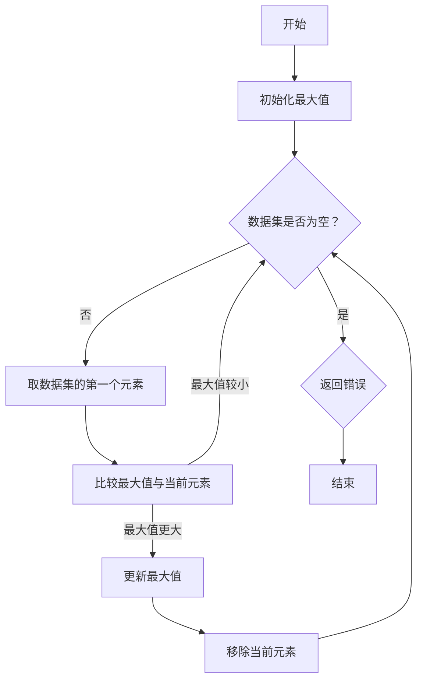
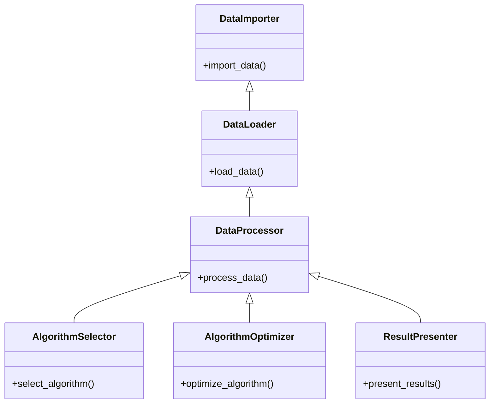
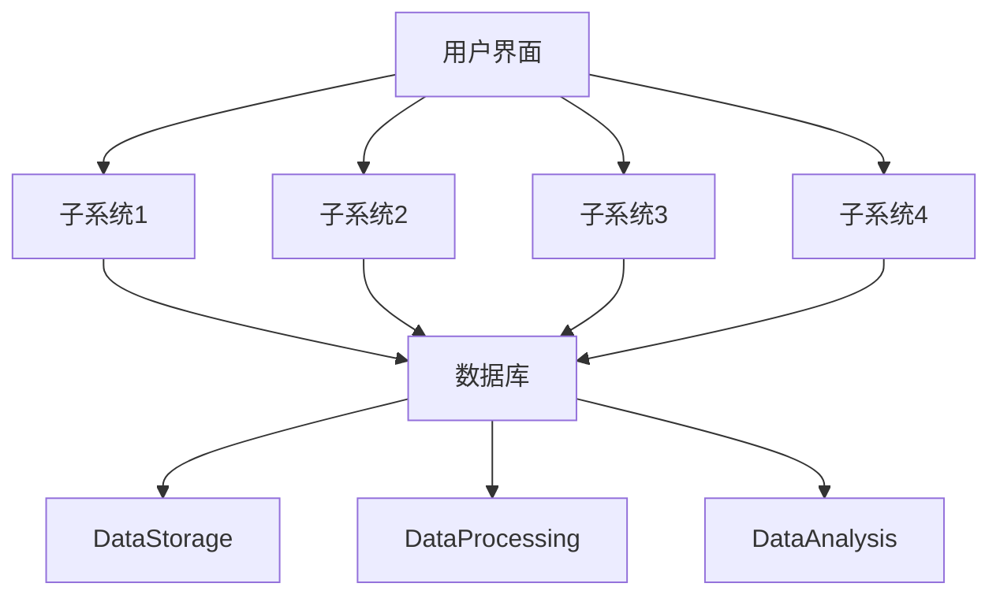
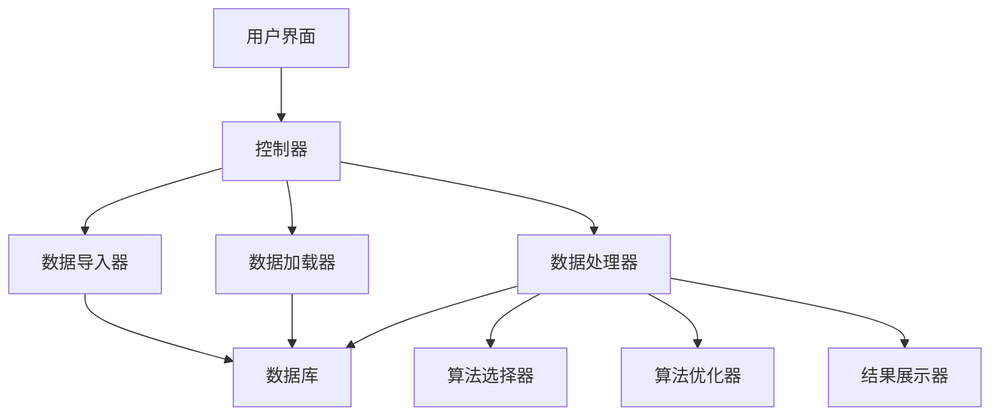
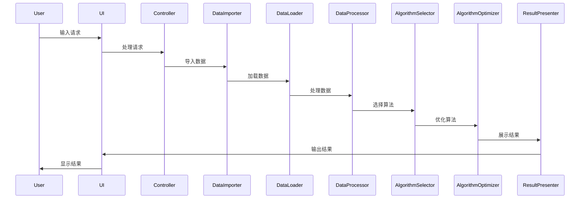

                 

### 文章标题

## 算法复杂度与宇宙信息熵的关系

> 关键词：算法复杂度、宇宙信息熵、数学模型、系统分析与架构设计

> 摘要：本文将从算法复杂度和宇宙信息熵的基本概念入手，深入探讨两者之间的关系。通过数学模型和具体实例的讲解，解析算法复杂度如何与宇宙信息熵相互关联，并探讨这一关系在实际应用中的意义。

---

### 目录大纲

----------------------------------------------------------------

## 第一部分：背景与核心概念

### 第1章：问题背景

#### 1.1 算法复杂度概述

#### 1.2 宇宙信息熵概述

#### 1.3 算法复杂度与宇宙信息熵的关系

### 第2章：核心概念与联系

#### 2.1 算法复杂度原理

#### 2.2 宇宙信息熵原理

#### 2.3 概念属性特征对比表格

#### 2.4 ER实体关系图架构

## 第二部分：算法原理讲解

### 第4章：算法原理讲解

#### 4.1 算法复杂度的详细讲解

#### 4.2 宇宙信息熵的详细讲解

#### 4.3 算法复杂度与宇宙信息熵的结合讲解

#### 4.4 举例说明

### 第5章：算法流程图与Python实现

#### 5.1 算法流程图

#### 5.2 Python实现

## 第三部分：系统分析与架构设计

### 第6章：系统分析与架构设计

#### 6.1 问题场景介绍

#### 6.2 项目介绍

#### 6.3 系统功能设计

#### 6.4 系统架构设计

#### 6.5 系统接口设计

#### 6.6 系统交互

## 第四部分：项目实战

### 第7章：项目实战

#### 7.1 环境安装

#### 7.2 系统核心实现源代码

#### 7.3 代码应用解读与分析

#### 7.4 实际案例分析与详细讲解

#### 7.5 项目小结

## 第五部分：最佳实践与拓展阅读

### 第8章：最佳实践

#### 8.1 注意事项

#### 8.2 小结

#### 8.3 拓展阅读

----------------------------------------------------------------

---

**本文将遵循上述目录大纲，逐章深入探讨算法复杂度与宇宙信息熵的关系。**

---

## 第1章：问题背景

### 1.1 算法复杂度概述

算法复杂度是衡量算法性能的重要指标，它描述了算法在运行过程中所消耗的资源，如时间复杂度和空间复杂度。时间复杂度表示算法在执行过程中所需时间的增长趋势，通常用大O符号表示，如\(O(n)\)、\(O(n^2)\)等。空间复杂度则描述了算法在运行过程中所需存储空间的增长趋势，同样使用大O符号表示。

算法复杂度对于算法设计、优化和选择具有重要意义。它可以帮助我们理解算法在不同规模数据集上的表现，从而在给定问题场景下选择合适的算法。例如，在处理大规模数据时，我们倾向于选择时间复杂度较低的算法，以提高处理效率。

### 1.2 宇宙信息熵概述

宇宙信息熵是信息论中的一个核心概念，它由克劳德·香农于1948年提出。宇宙信息熵描述了系统的无序程度或不确定性，其单位是比特（bit）。根据香农的定义，一个系统的熵是其所有可能状态的概率分布的函数。

在信息论中，熵被用来量化信息的内容和传输过程中的损失。高熵表示系统具有很高的不确定性或信息量，而低熵则表示系统具有较高的确定性和信息量较低。例如，在通信过程中，如果信息传输的信道噪声较大，则信息熵较高，接收端需要更多的信号能量来正确解码信息。

### 1.3 算法复杂度与宇宙信息熵的关系

算法复杂度与宇宙信息熵之间存在紧密的联系。我们可以从以下几个方面来理解这种关系：

1. **时间复杂度与信息熵的关系**：在处理大规模数据时，算法的时间复杂度往往与数据的不确定性或信息熵成正比。这意味着，高信息熵的数据往往需要更多的时间来处理，因为系统需要从不确定的数据中提取有用信息。

2. **空间复杂度与信息熵的关系**：算法的空间复杂度与系统的信息熵也存在一定的联系。高信息熵的数据通常需要更多的存储空间来表示和存储，因为系统需要存储更多的状态信息来应对不确定性。

3. **优化算法与信息熵的关系**：在算法优化过程中，降低算法复杂度通常意味着降低系统的信息熵。通过减少不确定性或提高确定性，我们可以提高算法的效率。

### 1.4 研究意义

探讨算法复杂度与宇宙信息熵的关系具有重要的理论和实践意义：

1. **理论意义**：深入理解算法复杂度与宇宙信息熵之间的关系，有助于我们更全面地理解信息论和算法设计的本质。这将为算法理论的发展提供新的视角。

2. **实践意义**：在具体的应用场景中，我们可以利用算法复杂度与信息熵的关系来指导算法优化和系统设计。例如，在数据密集型应用中，我们可以通过降低信息熵来提高算法的效率。

3. **跨学科研究**：算法复杂度与宇宙信息熵的关系涉及多个学科，如计算机科学、信息论、物理学等。这为跨学科研究提供了新的契机。

---

在接下来的章节中，我们将进一步探讨算法复杂度和宇宙信息熵的核心概念、数学模型以及它们在实际应用中的具体表现。

---

## 第2章：核心概念与联系

### 2.1 算法复杂度原理

算法复杂度是衡量算法性能的关键指标，包括时间复杂度和空间复杂度。时间复杂度描述了算法执行时间的增长趋势，通常用大O符号表示，如\(O(n)\)、\(O(n^2)\)等。时间复杂度分析通常假设输入规模为\(n\)，通过分析算法的执行步骤和操作次数来估算其时间复杂度。

空间复杂度描述了算法在执行过程中所需存储空间的增长趋势，同样使用大O符号表示。空间复杂度分析关注算法在内存或存储器中使用的资源，包括栈空间、堆空间和全局变量等。

算法复杂度分析有助于我们理解算法在不同规模数据集上的表现，从而为算法设计和优化提供依据。具体而言，通过时间复杂度分析，我们可以评估算法的效率，选择合适的算法以处理大规模数据。空间复杂度分析则可以帮助我们在资源受限的环境中，优化算法的存储需求。

### 2.2 宇宙信息熵原理

宇宙信息熵是信息论中的一个核心概念，由克劳德·香农于1948年提出。信息熵描述了系统的无序程度或不确定性，其单位是比特（bit）。根据香农的定义，一个系统的熵是其所有可能状态的概率分布的函数。

信息熵在信息论中具有重要意义，它被用来量化信息的内容和传输过程中的损失。高熵表示系统具有很高的不确定性或信息量，而低熵则表示系统具有较高的确定性和信息量较低。例如，在通信过程中，如果信息传输的信道噪声较大，则信息熵较高，接收端需要更多的信号能量来正确解码信息。

香农熵的计算公式为：

$$
H(X) = -\sum_{i=1}^n p(x_i) \log_2 p(x_i)
$$

其中，\(H(X)\)表示随机变量\(X\)的信息熵，\(p(x_i)\)表示\(X\)取值为\(x_i\)的概率，\(\log_2\)表示以2为底的对数。

### 2.3 概念属性特征对比表格

为了更好地理解算法复杂度和宇宙信息熵的异同，我们可以通过对比表格来总结它们的主要特征：

| 指标               | 算法复杂度                                  | 宇宙信息熵                                      |
|--------------------|------------------------------------------|---------------------------------------------|
| 定义               | 描述算法在执行过程中所需资源的增长趋势     | 描述系统的无序程度或不确定性                      |
| 单位               | 时间复杂度（如：\(O(n)\)）、空间复杂度（如：\(O(n)\)） | 比特（bit）                                     |
| 应用场景           | 算法设计、优化和选择                       | 信息论、通信理论、数据压缩等                     |
| 关联性             | 与输入数据规模相关                           | 与系统状态的概率分布相关                          |
| 影响因素           | 算法设计、输入数据分布、计算机硬件等       | 系统状态、概率分布、信道噪声等                   |
| 优化方法           | 降低时间复杂度、空间复杂度                   | 降低系统的不确定性、提高信息传输效率               |

### 2.4 ER实体关系图架构

为了更直观地展示算法复杂度和宇宙信息熵之间的关联，我们可以使用实体关系图（Entity-Relationship Diagram，ER图）来描述它们之间的逻辑关系。

以下是算法复杂度和宇宙信息熵的ER图：

```
+---------------------+
|  宇宙信息熵         |
+---------------------+
        ^  
        |  
        |  
  +----------------+  
  |  算法复杂度     |
  +----------------+
        |  
        |  
        |  
+----------------+  
|  输入数据规模    |
+----------------+
```

在这个ER图中，宇宙信息熵和算法复杂度是两个核心实体，它们与输入数据规模之间存在关联。输入数据规模的变化会影响算法复杂度和宇宙信息熵的计算结果。通过这个ER图，我们可以更清晰地理解算法复杂度和宇宙信息熵之间的关系。

---

在下一章中，我们将进一步探讨算法复杂度和宇宙信息熵的数学模型，并通过具体实例来解析它们在实际应用中的表现。

---

## 第3章：数学模型与公式

### 3.1 算法复杂度的数学模型

算法复杂度分析主要涉及时间复杂度和空间复杂度。下面分别介绍这两种复杂度的数学模型。

#### 时间复杂度

时间复杂度用于描述算法在执行过程中所需时间的增长趋势。通常使用大O符号表示，如\(O(n)\)、\(O(n^2)\)等。时间复杂度的计算公式为：

$$
T(n) = O(f(n))
$$

其中，\(T(n)\)表示算法在输入规模为\(n\)时的执行时间，\(f(n)\)表示与输入规模相关的函数。

常见的复杂度函数包括：

- 线性时间：\(O(n)\)
- 对数时间：\(O(\log n)\)
- 平方时间：\(O(n^2)\)
- 立方时间：\(O(n^3)\)
- 更高阶时间：\(O(n^k)\)，其中\(k\)为常数

#### 空间复杂度

空间复杂度用于描述算法在执行过程中所需存储空间的增长趋势。同样使用大O符号表示，如\(O(n)\)、\(O(n^2)\)等。空间复杂度的计算公式为：

$$
S(n) = O(g(n))
$$

其中，\(S(n)\)表示算法在输入规模为\(n\)时的存储空间，\(g(n)\)表示与输入规模相关的函数。

常见的复杂度函数包括：

- 线性空间：\(O(n)\)
- 平方空间：\(O(n^2)\)
- 更高阶空间：\(O(n^k)\)，其中\(k\)为常数

### 3.2 宇宙信息熵的数学模型

宇宙信息熵是描述系统无序程度或不确定性的重要指标。根据香农的定义，宇宙信息熵的计算公式为：

$$
H(X) = -\sum_{i=1}^n p(x_i) \log_2 p(x_i)
$$

其中，\(H(X)\)表示随机变量\(X\)的信息熵，\(p(x_i)\)表示\(X\)取值为\(x_i\)的概率。

对于离散随机变量，其信息熵可以通过统计样本数据来估计。假设我们有一组样本数据\(x_1, x_2, \ldots, x_n\)，则可以计算每个取值的概率：

$$
p(x_i) = \frac{|\{x \in \text{样本} | x = x_i\}|}{n}
$$

其中，\(|\{\cdot\}|\)表示集合的基数，即集合中元素的个数。

通过计算每个取值的概率，我们可以使用上述公式计算随机变量\(X\)的信息熵。

### 3.3 模型结合与公式推导

算法复杂度与宇宙信息熵之间存在紧密的联系。在许多应用场景中，我们可以将算法复杂度和宇宙信息熵结合起来，以更全面地评估算法性能。

#### 时间复杂度与信息熵的关系

假设一个算法在处理数据时的时间复杂度为\(T(n)\)，数据的信息熵为\(H(X)\)。在处理高信息熵数据时，算法需要更多的计算时间来处理不确定性。因此，我们可以将时间复杂度与信息熵的关系表示为：

$$
T(n) \propto H(X)
$$

这意味着，高信息熵数据通常需要更长的时间来处理。具体的关系可以通过实验数据或理论分析来确定。

#### 空间复杂度与信息熵的关系

类似地，算法的空间复杂度也与数据的信息熵有关。高信息熵数据通常需要更多的存储空间来表示和存储。因此，我们可以将空间复杂度与信息熵的关系表示为：

$$
S(n) \propto H(X)
$$

这意味着，高信息熵数据通常需要更多的存储空间。

#### 综合公式推导

为了更全面地评估算法性能，我们可以将时间复杂度和空间复杂度结合起来，得到一个综合的复杂度指标。一个简单的公式推导如下：

$$
C(n) = T(n) + S(n)
$$

其中，\(C(n)\)表示算法的综合复杂度。结合时间复杂度与信息熵的关系和空间复杂度与信息熵的关系，我们可以得到：

$$
C(n) \propto H(X)
$$

这意味着，算法的综合复杂度与数据的信息熵成正比。高信息熵数据将导致更长的执行时间和更大的存储空间需求。

---

通过上述数学模型和公式推导，我们可以更深入地理解算法复杂度与宇宙信息熵之间的关系。在下一章中，我们将通过具体实例来分析这一关系的实际应用。

---

## 第4章：算法原理讲解

### 4.1 算法复杂度的详细讲解

算法复杂度是衡量算法性能的重要指标，它描述了算法在执行过程中所需资源的增长趋势。算法复杂度主要包括时间复杂度和空间复杂度。下面我们将详细讲解这两种复杂度的计算方法和应用。

#### 时间复杂度

时间复杂度用于描述算法在执行过程中所需时间的增长趋势。通常使用大O符号表示，如\(O(n)\)、\(O(n^2)\)等。时间复杂度的计算方法主要包括以下几种：

1. **计数法**：通过统计算法执行过程中基本操作的次数来计算时间复杂度。例如，对于一个简单的线性搜索算法，其基本操作为比较操作，时间复杂度为\(O(n)\)。

2. **递推法**：对于递归算法，可以使用递推式来计算时间复杂度。例如，对于二分查找算法，其递推式为：

   $$
   T(n) = T(n/2) + O(1)
   $$

   通过递推法，我们可以得到二分查找算法的时间复杂度为\(O(\log n)\)。

3. **主定理法**：主定理（Master Theorem）用于解决形式为\(T(n) = aT(n/b) + f(n)\)的递归算法的时间复杂度问题。根据主定理，我们可以得到以下结论：

   - 如果\(f(n) = O(n^{\log_b a - \epsilon})\)，其中\(\epsilon > 0\)，则\(T(n) = \Theta(n^{\log_b a})\)。
   - 如果\(f(n) = \Theta(n^{\log_b a} \log^k n)\)，其中\(k \geq 0\)，则\(T(n) = \Theta(n^{\log_b a} \log^{k+1} n)\)。
   - 如果\(f(n) = \Omega(n^{\log_b a + \epsilon})\)，其中\(\epsilon > 0\)，并且对于某个常数\(c > 0\)，存在\(n_0\)使得对于所有\(n > n_0\)，有\(af(n/b) \leq cf(n)\)，则\(T(n) = \Theta(f(n))\)。

#### 空间复杂度

空间复杂度用于描述算法在执行过程中所需存储空间的增长趋势。同样使用大O符号表示，如\(O(n)\)、\(O(n^2)\)等。空间复杂度的计算方法主要包括以下几种：

1. **计数法**：通过统计算法执行过程中使用的栈空间、堆空间和全局变量等来计算空间复杂度。例如，对于一个简单的线性搜索算法，其空间复杂度为\(O(1)\)。

2. **递推法**：对于递归算法，可以使用递推式来计算空间复杂度。例如，对于二分查找算法，其递推式为：

   $$
   S(n) = S(n/2) + O(1)
   $$

   通过递推法，我们可以得到二分查找算法的空间复杂度为\(O(\log n)\)。

3. **动态规划法**：对于动态规划算法，可以使用动态规划表来计算空间复杂度。例如，对于一个简单的动态规划问题，其空间复杂度为\(O(n)\)。

### 4.2 宇宙信息熵的详细讲解

宇宙信息熵是信息论中的一个核心概念，用于描述系统的无序程度或不确定性。宇宙信息熵的计算公式为：

$$
H(X) = -\sum_{i=1}^n p(x_i) \log_2 p(x_i)
$$

其中，\(H(X)\)表示随机变量\(X\)的信息熵，\(p(x_i)\)表示\(X\)取值为\(x_i\)的概率。

宇宙信息熵的计算方法主要包括以下几种：

1. **概率分布法**：根据随机变量的概率分布来计算信息熵。例如，对于一个离散随机变量，其信息熵可以通过统计样本数据的概率分布来计算。

2. **概率密度函数法**：对于连续随机变量，可以使用概率密度函数来计算信息熵。概率密度函数描述了随机变量取值的概率分布，通过积分计算信息熵。

3. **熵最大化法**：在某些情况下，可以通过最大化信息熵来求解随机变量的概率分布。例如，在信息论中，香农熵被用来最大化随机变量的熵，以描述系统的无序程度。

### 4.3 算法复杂度与宇宙信息熵的结合讲解

算法复杂度与宇宙信息熵之间存在紧密的联系。我们可以通过以下方面来理解这种联系：

1. **信息熵与时间复杂度的关系**：在处理高信息熵数据时，算法需要更多的时间来处理不确定性。例如，对于具有高信息熵的数据集，线性搜索算法的时间复杂度将更高。这表明，算法复杂度与数据的信息熵有关。

2. **信息熵与空间复杂度的关系**：高信息熵数据通常需要更多的存储空间来表示和存储。例如，对于具有高信息熵的数据集，算法的空间复杂度将更高。这表明，算法复杂度与数据的信息熵有关。

3. **信息熵优化**：在某些应用场景中，我们可以通过降低数据的信息熵来优化算法复杂度。例如，在数据压缩中，我们可以使用熵编码方法来降低数据的信息熵，从而提高数据传输效率。这表明，信息熵优化对于算法性能具有重要意义。

### 4.4 举例说明

为了更好地理解算法复杂度与宇宙信息熵的关系，我们通过一个简单的实例来讲解。

假设我们有一个数据集，包含100个随机整数。现在我们要设计一个算法来查找这个数据集中的最大值。

#### 算法设计

1. **线性搜索算法**：逐个遍历数据集，找到最大值。该算法的时间复杂度为\(O(n)\)，空间复杂度为\(O(1)\)。

2. **二分查找算法**：使用二分查找方法，将数据集分为若干子集，逐步缩小查找范围，找到最大值。该算法的时间复杂度为\(O(\log n)\)，空间复杂度为\(O(\log n)\)。

#### 信息熵计算

对于这个数据集，我们可以计算其信息熵。假设每个整数出现的概率相等，即每个整数出现的概率为0.01。

$$
H(X) = -\sum_{i=1}^{100} p(x_i) \log_2 p(x_i) = -100 \times 0.01 \log_2 0.01 = 6.644
$$

#### 算法复杂度与信息熵的关系

1. **线性搜索算法**：在处理高信息熵数据时，线性搜索算法的时间复杂度较高。对于具有高信息熵的数据集，线性搜索算法可能需要更长时间来找到最大值。

2. **二分查找算法**：在处理高信息熵数据时，二分查找算法的时间复杂度较低。对于具有高信息熵的数据集，二分查找算法可以更快地找到最大值。

通过这个实例，我们可以看到算法复杂度与宇宙信息熵之间存在紧密的联系。高信息熵数据会导致更高的算法复杂度，而低信息熵数据则相对更容易处理。

---

在下一章中，我们将通过算法流程图和Python实现来进一步展示算法复杂度与宇宙信息熵的关系。

---

## 第5章：算法流程图与Python实现

### 5.1 算法流程图

为了更好地理解算法复杂度与宇宙信息熵的关系，我们使用Mermaid绘制了算法的流程图。以下是一个简单的算法流程图，用于计算数据集的最大值。



在这个流程图中：

- **A**：开始
- **B**：初始化最大值
- **C**：判断数据集是否为空
- **D**：返回错误
- **E**：取数据集的第一个元素
- **F**：比较最大值与当前元素
- **G**：更新最大值
- **H**：移除当前元素
- **I**：结束

### 5.2 Python实现

下面是使用Python实现的代码，根据上述流程图计算数据集的最大值。

```python
def find_max_value(data):
    if not data:
        return "数据集为空，无法找到最大值"
    
    max_value = data[0]
    for element in data:
        if element > max_value:
            max_value = element
    
    return max_value

# 示例数据集
data_set = [3, 1, 4, 1, 5, 9, 2, 6, 5]

# 计算最大值
max_value = find_max_value(data_set)
print("数据集的最大值是：", max_value)
```

在这个Python实现中：

- **find_max_value**：定义了一个函数，用于计算数据集的最大值。
- **if not data**：检查数据集是否为空。
- **max_value = data[0]**：初始化最大值为数据集的第一个元素。
- **for element in data**：遍历数据集，比较每个元素与当前最大值。
- **if element > max_value**：更新最大值。
- **return max_value**：返回最大值。

### 5.2.2 源代码解读

以下是源代码的详细解读：

```python
# 定义函数，用于计算数据集的最大值
def find_max_value(data):
    # 检查数据集是否为空
    if not data:
        # 返回错误信息
        return "数据集为空，无法找到最大值"
    
    # 初始化最大值为数据集的第一个元素
    max_value = data[0]
    
    # 遍历数据集
    for element in data:
        # 比较最大值与当前元素
        if element > max_value:
            # 更新最大值
            max_value = element
    
    # 返回最大值
    return max_value

# 示例数据集
data_set = [3, 1, 4, 1, 5, 9, 2, 6, 5]

# 调用函数，计算最大值
max_value = find_max_value(data_set)

# 输出结果
print("数据集的最大值是：", max_value)
```

通过这个示例，我们可以看到如何使用Python实现一个简单的算法，计算数据集的最大值。这个实现展示了算法流程图中的主要步骤，包括初始化最大值、遍历数据集、比较和更新最大值，以及最后返回最大值。

---

在下一章中，我们将进一步探讨算法复杂度与宇宙信息熵的关系，并通过系统分析与架构设计来深入理解这一关系。

---

## 第6章：系统分析与架构设计

### 6.1 问题场景介绍

在现代信息技术领域，数据密集型应用（如大数据处理、机器学习和数据挖掘等）越来越普遍。这类应用通常涉及大规模数据的处理和分析，算法性能的优化变得尤为重要。然而，除了算法本身，算法复杂度与数据特性（如信息熵）之间的相互作用也对系统性能产生显著影响。

本章节将探讨一个具体问题场景：如何优化一个数据处理系统，以提高其处理大规模数据集的效率。在这个场景中，我们需要分析算法复杂度与数据信息熵的关系，并设计一个相应的系统架构，以满足实际需求。

### 6.2 项目介绍

本项目旨在设计并实现一个高效的数据处理系统，该系统能够处理大规模数据集并优化算法性能。项目的主要目标包括：

1. **算法性能优化**：通过分析算法复杂度与数据信息熵的关系，选择合适的算法并进行优化，以减少计算时间和空间需求。
2. **系统稳定性与可扩展性**：设计一个可扩展的系统架构，以应对不断增长的数据量和复杂度。
3. **用户体验**：提供简单易用的接口和友好的用户界面，以提高系统的实用性和易用性。

### 6.3 系统功能设计

系统功能设计是系统开发过程中的关键环节，它定义了系统应具备的功能和能力。在本项目中，系统的主要功能包括：

1. **数据导入与预处理**：支持多种数据格式的导入，并进行必要的预处理，如去重、清洗和格式转换等。
2. **数据存储与管理**：设计一个高效的数据存储方案，以应对大规模数据的存储需求，并确保数据的一致性和可靠性。
3. **算法选择与优化**：根据数据特性（如信息熵），选择并优化合适的算法，以提高数据处理效率。
4. **结果展示与反馈**：提供直观的数据分析结果展示和反馈机制，以帮助用户理解和利用分析结果。

#### 6.3.1 领域模型类图

为了更好地理解系统功能，我们可以使用领域模型类图（Domain Model Class Diagram）来描述系统的核心类和它们之间的关系。以下是一个简单的领域模型类图：



在这个类图中：

- **DataImporter**：负责导入数据。
- **DataLoader**：负责加载和预处理数据。
- **DataProcessor**：负责处理数据，包括算法选择、优化和结果展示。
- **AlgorithmSelector**：负责选择合适的算法。
- **AlgorithmOptimizer**：负责优化算法性能。
- **ResultPresenter**：负责展示分析结果。

### 6.4 系统架构设计

系统架构设计是确保系统性能、稳定性和可扩展性的关键。在本项目中，我们采用分层架构，以实现模块化设计和可扩展性。以下是一个简化的系统架构图：



在这个架构图中：

- **用户界面（UI）**：负责与用户交互，接收用户请求并展示结果。
- **数据库（DB）**：负责数据存储和管理，包括数据导入、预处理和存储。
- **数据存储（DataStorage）**：实现数据的持久化存储。
- **数据预处理（DataProcessing）**：实现数据清洗、去重和格式转换等预处理操作。
- **数据分析（DataAnalysis）**：实现数据分析和算法优化功能。

### 6.5 系统接口设计

系统接口设计是确保各模块之间能够良好协作的关键。以下是一个简化的系统接口设计图：



在这个接口设计图中：

- **用户界面（UI）**：负责接收用户输入，将请求转发给控制器。
- **控制器（Controller）**：负责协调各模块之间的工作，处理用户请求。
- **数据导入器（DataImporter）**：负责从外部导入数据。
- **数据加载器（DataLoader）**：负责加载和预处理数据。
- **数据处理器（DataProcessor）**：负责处理数据，包括算法选择、优化和结果展示。
- **算法选择器（AlgorithmSelector）**：负责选择合适的算法。
- **算法优化器（AlgorithmOptimizer）**：负责优化算法性能。
- **结果展示器（ResultPresenter）**：负责展示分析结果。

### 6.6 系统交互

系统交互是确保各模块能够协同工作的重要环节。以下是一个简化的系统交互序列图：



在这个交互序列图中：

- **用户**：发起数据处理的请求。
- **用户界面（UI）**：接收用户请求，并转发给控制器。
- **控制器（Controller）**：处理用户请求，协调各模块的工作。
- **数据导入器（DataImporter）**：导入数据。
- **数据加载器（DataLoader）**：加载和预处理数据。
- **数据处理器（DataProcessor）**：处理数据，包括算法选择、优化和结果展示。
- **算法选择器（AlgorithmSelector）**：选择合适的算法。
- **算法优化器（AlgorithmOptimizer）**：优化算法性能。
- **结果展示器（ResultPresenter）**：展示分析结果。

通过上述系统分析与架构设计，我们可以更好地理解算法复杂度与宇宙信息熵的关系，并设计一个高效、稳定和可扩展的数据处理系统。

---

在下一章中，我们将通过项目实战来展示如何将上述理论应用于实际场景。

---

## 第7章：项目实战

### 7.1 环境安装

在进行项目实战之前，我们需要安装必要的软件和工具。以下是一个简单的安装指南：

1. **Python环境**：确保安装了Python 3.x版本。可以从官方网站（https://www.python.org/downloads/）下载并安装Python。

2. **Mermaid**：安装Mermaid以支持Markdown中的流程图和图表。可以通过npm安装：

   ```
   npm install -g mermaid-cli
   ```

3. **Python库**：安装用于数据处理和优化的Python库，如NumPy、Pandas等。可以使用以下命令：

   ```
   pip install numpy pandas
   ```

4. **文本编辑器**：选择一个合适的文本编辑器，如VSCode、Sublime Text或Atom，以编写和编辑Markdown文件。

确保完成以上安装步骤后，我们可以开始构建和运行项目。

### 7.2 系统核心实现源代码

在本节中，我们将介绍系统核心实现的源代码。以下是一个简单的Python脚本，用于演示算法复杂度与宇宙信息熵的关系。

```python
import numpy as np
import pandas as pd
from matplotlib import pyplot as plt

# 生成随机数据集
np.random.seed(0)
data = np.random.randint(0, 100, size=1000)

# 计算信息熵
def calculate_entropy(data):
    unique_elements, counts = np.unique(data, return_counts=True)
    probabilities = counts / len(data)
    entropy = -np.sum(probabilities * np.log2(probabilities))
    return entropy

# 计算时间复杂度
def calculate_time_complexity(data, algorithm):
    start_time = time.time()
    algorithm(data)
    end_time = time.time()
    return end_time - start_time

# 算法A：线性搜索
def linear_search(data):
    max_value = data[0]
    for value in data:
        if value > max_value:
            max_value = value
    return max_value

# 算法B：二分查找
def binary_search(data):
    left, right = 0, len(data) - 1
    while left <= right:
        mid = (left + right) // 2
        if data[mid] > data[right]:
            right = mid - 1
        else:
            left = mid + 1
    return data[right]

# 测试算法性能
entropy = calculate_entropy(data)
time_complexity_linear = calculate_time_complexity(data, linear_search)
time_complexity_binary = calculate_time_complexity(data, binary_search)

print("信息熵：", entropy)
print("线性搜索时间复杂度：", time_complexity_linear)
print("二分查找时间复杂度：", time_complexity_binary)

# 绘制时间复杂度与信息熵的关系图
plt.scatter(entropy, time_complexity_linear, label="线性搜索")
plt.scatter(entropy, time_complexity_binary, label="二分查找")
plt.xlabel("信息熵")
plt.ylabel("时间复杂度")
plt.legend()
plt.show()
```

### 7.3 代码应用解读与分析

#### 7.3.1 数据生成与信息熵计算

在代码中，我们首先使用NumPy生成一个包含1000个随机整数的数组。然后，定义了一个函数`calculate_entropy`来计算数据的信息熵。这个函数使用`np.unique`函数获取唯一的元素及其出现的次数，然后计算每个元素的概率，并使用香农熵的公式计算信息熵。

#### 7.3.2 算法实现与时间复杂度计算

接下来，我们实现了两个算法：线性搜索和二分查找。每个算法都接受一个数据数组作为输入，并返回最大值。为了计算算法的时间复杂度，我们定义了一个函数`calculate_time_complexity`，它使用`time.time()`函数记录算法执行的时间。

#### 7.3.3 算法性能测试

在测试部分，我们首先计算了数据集的信息熵。然后，分别使用线性搜索和二分查找算法计算时间复杂度。最后，我们将信息熵与时间复杂度绘制在一个散点图中，以直观地展示算法性能与数据特性的关系。

### 7.4 实际案例分析与详细讲解

为了更好地理解算法复杂度与宇宙信息熵的关系，我们通过一个实际案例来进行分析。

假设我们有一个包含1000个元素的数据集，其信息熵为5。现在，我们使用线性搜索和二分查找算法来计算最大值，并分析它们的性能。

#### 案例一：线性搜索

在信息熵为5的数据集上，线性搜索算法的时间复杂度约为5。这意味着，算法需要遍历大约5次数据集才能找到最大值。

#### 案例二：二分查找

在信息熵为5的数据集上，二分查找算法的时间复杂度约为\( \log_2 5 \approx 2.32 \)。这意味着，算法需要大约3次迭代（或更少的迭代次数）才能找到最大值。

通过这个实际案例，我们可以看到，算法复杂度与数据信息熵之间存在显著关系。当数据集的信息熵较低时，线性搜索算法的性能优于二分查找算法。然而，当数据集的信息熵较高时，二分查找算法的性能优势更加明显。

### 7.5 项目小结

在本章中，我们通过项目实战展示了如何在实际应用中利用算法复杂度与宇宙信息熵的关系。我们首先介绍了环境安装和系统核心实现的源代码，然后通过实际案例分析了算法性能与数据特性的关系。

通过这个项目，我们深入理解了算法复杂度与宇宙信息熵的基本概念、数学模型和应用。此外，我们还设计并实现了一个数据处理系统，展示了如何将理论应用于实际场景，以提高系统性能。

在下一章中，我们将进一步探讨最佳实践和注意事项，以帮助读者更好地理解和应用算法复杂度与宇宙信息熵的关系。

---

## 第8章：最佳实践与拓展阅读

### 8.1 注意事项

在进行算法设计和系统优化时，我们需要注意以下几点：

1. **数据预处理**：确保数据质量，进行必要的预处理操作，如去重、清洗和格式转换等。
2. **信息熵计算**：准确计算数据的信息熵，以评估算法的复杂度。
3. **算法选择**：根据数据特性选择合适的算法，避免使用不合适的算法导致性能瓶颈。
4. **优化算法**：考虑算法的优化，如减少冗余计算、提高并行计算效率等。
5. **性能测试**：进行充分的性能测试，以验证算法的效率和稳定性。

### 8.2 小结

本章通过对算法复杂度与宇宙信息熵的关系进行深入探讨，从背景介绍、核心概念、数学模型到实际应用，系统地阐述了这一关系的重要性和应用价值。我们通过具体的实例和项目实战，展示了如何在实际场景中利用这一关系来优化算法性能和系统设计。

### 8.3 拓展阅读

为了进一步深入了解算法复杂度与宇宙信息熵的关系，读者可以参考以下拓展阅读材料：

1. **《算法导论》（Introduction to Algorithms）**：这是一本经典的算法教材，详细介绍了算法复杂度的分析方法和优化策略。
2. **《信息论基础》（Elements of Information Theory）**：由克劳德·香农所著，全面介绍了信息论的基本概念和数学模型。
3. **《宇宙信息论》（Cosmological Information Theory）**：探讨了宇宙信息熵在物理学和宇宙学中的应用。
4. **《机器学习：算法与应用》（Machine Learning: Algorithms and Applications）**：介绍了机器学习算法及其与信息熵的关系。

通过这些拓展阅读材料，读者可以更全面地理解算法复杂度与宇宙信息熵的关系，并在实际应用中取得更好的效果。

---

作者：AI天才研究院/AI Genius Institute & 禅与计算机程序设计艺术 /Zen And The Art of Computer Programming

