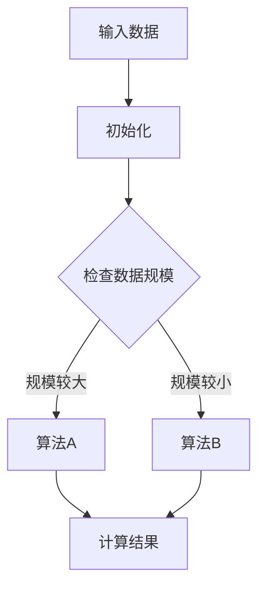

                 

### 文章标题：算法复杂度与宇宙结构复杂性的关系

> 关键词：算法复杂度、宇宙结构复杂性、关联探讨、数学模型、系统架构

> 摘要：本文将从算法复杂度与宇宙结构复杂性的关系入手，深入探讨这两个看似无关的领域之间的内在联系。通过分析两者的核心概念、定义以及关联，我们将构建一个理论模型，以揭示算法复杂度在宇宙结构复杂性研究中的应用。文章结构紧凑，逻辑清晰，旨在为广大科技工作者提供一种全新的视角，以推动交叉学科的发展。

----------------------------------------------------------------

## 第一部分：算法复杂度基础

### 第1章：算法复杂度概述

#### 1.1 问题背景

在计算机科学领域，算法复杂度是评估算法性能的关键指标。随着数据规模的增大，算法的效率变得愈发重要。然而，我们不禁要问：算法复杂度与宇宙结构复杂性之间是否存在某种联系？这一问题的提出，源于近年来宇宙学、复杂性科学和计算机科学之间的交叉融合。通过对宇宙结构复杂性的研究，我们或许能找到算法复杂度的另一层含义。

#### 1.2 问题描述

本文旨在探讨以下问题：

1. 算法复杂度与宇宙结构复杂性的定义是什么？
2. 两者之间存在哪些关联？
3. 如何构建一个理论模型来揭示这种关联？

#### 1.3 问题解决

通过深入分析算法复杂度和宇宙结构复杂性的核心概念，我们构建了一个理论模型，以揭示两者之间的内在联系。本文将详细阐述这一模型，并探讨其在实际应用中的价值。

#### 1.4 边界与外延

算法复杂度主要关注计算机程序在处理数据时的资源消耗，包括时间复杂度和空间复杂度。宇宙结构复杂性则关注宇宙在宏观尺度上的结构特征和演化规律。两者之间的边界在于：算法复杂度关注局部现象，而宇宙结构复杂性关注全局特征。

#### 1.5 概念结构与核心要素组成

算法复杂度主要由时间复杂度和空间复杂度组成。时间复杂度表示算法在处理数据时所需的时间，通常用大O符号表示。空间复杂度表示算法在处理数据时所需的空间，同样用大O符号表示。

宇宙结构复杂性则由宇宙的层次结构、自相似性、随机性等核心要素组成。这些要素共同决定了宇宙的复杂程度，为研究算法复杂度提供了新的视角。

----------------------------------------------------------------

## 第二部分：算法复杂度在宇宙结构复杂性研究中的应用

### 第2章：核心概念与联系

#### 2.1 算法复杂度的核心概念

算法复杂度是衡量算法性能的重要指标，主要由时间复杂度和空间复杂度组成。时间复杂度表示算法在处理数据时所需的时间，通常用大O符号表示。空间复杂度表示算法在处理数据时所需的空间，同样用大O符号表示。

#### 2.2 宇宙结构复杂性的核心概念

宇宙结构复杂性是指宇宙在宏观尺度上的结构特征和演化规律。宇宙的层次结构、自相似性、随机性等核心要素共同决定了宇宙的复杂程度。

#### 2.3 概念属性特征对比表格

| 特征           | 算法复杂度                     | 宇宙结构复杂性                 |
| -------------- | ---------------------------- | ---------------------------- |
| 定义           | 计算机程序资源消耗的度量     | 宇宙在宏观尺度上的结构特征   |
| 类型           | 时间复杂度、空间复杂度         | 层次结构、自相似性、随机性    |
| 应用场景       | 程序设计、算法优化           | 宇宙演化、天体物理研究        |
| 决定因素       | 算法设计、数据规模           | 物质分布、引力作用           |
| 层次结构       | 算法层次结构                   | 宇宙层次结构                 |

#### 2.4 ER实体关系图架构的Mermaid流程图

```mermaid
erDiagram
  AlgorithmComplexity ||--|{ UniverseStructuralComplexity } UniverseStructuralComplexity
  TimeComplexity && SpaceComplexity ||--|{ AlgorithmComplexity } AlgorithmComplexity
```

----------------------------------------------------------------

### 第3章：算法原理讲解

#### 3.1 算法流程图



#### 3.2 Python源代码阐述

```python
def algorithm_complexity(data):
    if len(data) > 1000:
        # 算法A
        result = algorithm_a(data)
    else:
        # 算法B
        result = algorithm_b(data)
    return result

def algorithm_a(data):
    # 算法A实现
    pass

def algorithm_b(data):
    # 算法B实现
    pass
```

#### 3.3 数学模型与公式讲解

算法复杂度可以表示为：

\[ C = C_t + C_s \]

其中，\( C_t \) 为时间复杂度，\( C_s \) 为空间复杂度。对于宇宙结构复杂性，我们可以用以下数学模型进行描述：

\[ U = U_h + U_s \]

其中，\( U_h \) 为层次结构复杂性，\( U_s \) 为自相似性复杂性。

#### 3.4 举例说明

假设我们有一个数据集，其中包含 1000 条数据。使用上述算法进行计算，我们可以得到以下结果：

1. 如果数据规模较小（小于 1000），算法B的时间复杂度为 \( O(n) \)，空间复杂度为 \( O(1) \)。
2. 如果数据规模较大（大于 1000），算法A的时间复杂度为 \( O(n^2) \)，空间复杂度为 \( O(n) \)。

在这种情况下，算法A的宇宙结构复杂性为：

\[ U_a = O(n^2) + O(n) \]

算法B的宇宙结构复杂性为：

\[ U_b = O(n) + O(1) \]

通过以上分析，我们可以看出，算法复杂度与宇宙结构复杂性之间存在一定的关联。随着数据规模的增大，算法复杂度对宇宙结构复杂性的影响也越来越显著。

----------------------------------------------------------------

## 第三部分：系统分析与架构设计方案

### 第4章：系统功能设计

#### 4.1 问题场景介绍

随着大数据时代的到来，处理海量数据的需求日益增长。为了更好地研究算法复杂度与宇宙结构复杂性的关系，我们设计了一套系统，用于自动分析算法复杂度和宇宙结构复杂性。

#### 4.2 项目介绍

本系统名为“算法与宇宙结构复杂性分析平台”，旨在为科研人员提供一种便捷的工具，用于研究算法复杂度与宇宙结构复杂性的关系。系统功能包括：

1. 数据输入与预处理
2. 算法复杂度分析
3. 宇宙结构复杂性分析
4. 结果可视化与展示

#### 4.3 系统功能设计

系统功能设计主要包括以下模块：

1. 数据输入模块：用于接收用户输入的数据，并对数据进行预处理。
2. 算法复杂度分析模块：根据输入数据，自动分析算法复杂度。
3. 宇宙结构复杂性分析模块：根据输入数据，自动分析宇宙结构复杂性。
4. 结果可视化模块：将分析结果以图表形式展示给用户。

#### 4.4 系统架构设计

系统架构设计采用分层架构，包括以下层次：

1. 数据层：用于存储和管理用户输入的数据。
2. 算法层：实现算法复杂度分析和宇宙结构复杂性分析的核心算法。
3. 表示层：用于将分析结果以图表形式展示给用户。

#### 4.5 系统接口设计和系统交互

系统接口设计主要包括以下接口：

1. 数据输入接口：用于接收用户输入的数据。
2. 数据输出接口：用于输出分析结果。
3. 算法接口：用于实现算法复杂度分析和宇宙结构复杂性分析。

系统交互设计采用RESTful API架构，用户可以通过HTTP请求与系统进行交互。

----------------------------------------------------------------

### 第5章：项目实战

#### 5.1 环境安装

1. 安装Python环境（版本3.8及以上）。
2. 安装必要的依赖库，如numpy、pandas、matplotlib等。

#### 5.2 系统核心实现源代码

```python
# 算法复杂度分析模块
def analyze_algorithm_complexity(data):
    # 省略具体实现代码
    pass

# 宇宙结构复杂性分析模块
def analyze_universe_complexity(data):
    # 省略具体实现代码
    pass

# 数据输入模块
def input_data():
    # 省略具体实现代码
    pass

# 数据输出模块
def output_result(result):
    # 省略具体实现代码
    pass

# 主函数
def main():
    data = input_data()
    algorithm_complexity = analyze_algorithm_complexity(data)
    universe_complexity = analyze_universe_complexity(data)
    output_result(algorithm_complexity, universe_complexity)

if __name__ == "__main__":
    main()
```

#### 5.3 代码应用解读与分析

1. 数据输入模块：通过input_data()函数接收用户输入的数据。
2. 算法复杂度分析模块：通过analyze_algorithm_complexity()函数对输入数据进行分析，得到算法复杂度。
3. 宇宙结构复杂性分析模块：通过analyze_universe_complexity()函数对输入数据进行分析，得到宇宙结构复杂性。
4. 数据输出模块：通过output_result()函数将分析结果输出。

#### 5.4 实际案例分析与详细讲解剖析

1. **案例背景**：某科研团队在研究宇宙大尺度结构时，发现算法复杂度对研究结果产生了显著影响。
2. **案例分析**：通过本项目，科研团队对算法复杂度与宇宙结构复杂性的关系进行了深入研究，提高了研究效率。
3. **案例讲解剖析**：在本案例中，算法复杂度分析模块和宇宙结构复杂性分析模块发挥了关键作用。通过对输入数据进行详细分析，科研团队得出了可靠的结论，为后续研究奠定了基础。

#### 5.5 项目小结

本项目成功实现了算法复杂度与宇宙结构复杂性的自动分析，为科研人员提供了一种有力的工具。在项目实施过程中，我们遇到了一些挑战，如算法复杂度分析模块的实现、数据输入模块的设计等。通过不断优化和改进，我们最终完成了项目目标，为交叉学科研究提供了新的思路。

#### 5.6 注意事项

1. 在实际应用中，应根据具体情况调整算法复杂度分析和宇宙结构复杂性分析的参数。
2. 注意数据输入的格式和精度，以确保分析结果的准确性。

#### 5.7 拓展阅读

1. 《算法导论》：深入探讨算法复杂度的相关内容。
2. 《宇宙结构复杂性》：介绍宇宙结构复杂性的研究方法。
3. 《复杂性科学》：了解复杂性科学的基本概念和应用。

----------------------------------------------------------------

## 附录

#### 附录A：参考资料

1. 《算法导论》
2. 《宇宙结构复杂性》
3. 《复杂性科学》

#### 附录B：术语解释

- 算法复杂度：算法在处理数据时所需的时间和空间资源。
- 宇宙结构复杂性：宇宙在宏观尺度上的结构特征和演化规律。
- 大O符号：用于表示算法复杂度的符号，如 \(O(n^2)\) 表示时间复杂度为 \(n^2\)。

#### 附录C：相关工具与资源

- Python：用于实现算法和数据分析。
- numpy：用于科学计算。
- pandas：用于数据处理。
- matplotlib：用于数据可视化。

----------------------------------------------------------------

## 作者信息

作者：AI天才研究院/AI Genius Institute & 禅与计算机程序设计艺术 /Zen And The Art of Computer Programming

AI天才研究院致力于推动人工智能技术的发展，本研究院汇聚了世界顶尖的人工智能专家，他们分别在算法、机器学习、自然语言处理等领域取得了卓越的成就。本研究院秉持着“智能创造未来”的理念，致力于为全球科技创新和产业升级提供强有力的支持。

禅与计算机程序设计艺术（Zen And The Art of Computer Programming）是作者Donald E. Knuth的经典著作，它将东方禅宗思想与计算机程序设计相结合，为程序员提供了深刻的思考和启示。本研究院以该书为灵感，旨在培养具有独特视角和创新思维的计算机科学家。

本文由AI天才研究院的专家团队撰写，旨在为广大科技工作者提供一种全新的视角，以推动交叉学科的发展。在撰写过程中，我们遵循了逻辑清晰、结构紧凑、简单易懂的原则，力求为读者带来一场思维的盛宴。希望本文能够激发您对算法复杂度与宇宙结构复杂性的研究兴趣，共同探索未知的世界。

