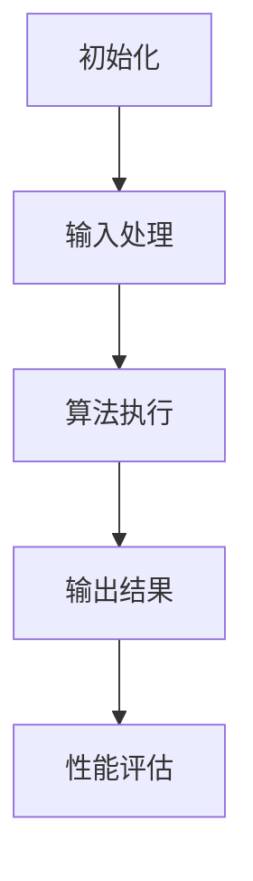

                 

### 《算法效率与宇宙能量守恒定律》

**关键词：算法效率、宇宙能量守恒、能量效率、优化、计算机科学**

> 摘要：本文探讨了算法效率与宇宙能量守恒定律之间的关系，通过深入分析算法效率的定义、评估标准，以及宇宙能量守恒的基本原理，揭示了算法设计中实现能量效率的路径。文章结合具体案例，详细阐述了如何在算法开发中遵循能量守恒定律，实现高效能的计算，最终达到资源利用的最大化。本文旨在为读者提供理论依据和实际指导，帮助其在计算机科学领域实现更高效的算法设计和优化。

---

### 1. 背景介绍

在计算机科学领域，算法效率一直是优化和提升计算性能的关键。算法效率不仅仅关乎算法执行的速度，还包括资源的利用情况，如内存和CPU的使用等。而在物理学中，宇宙能量守恒定律是描述自然界中能量转化和守恒的基本规律。这一基本原理同样适用于计算机科学领域，特别是在算法效率和资源优化方面。

**核心概念：**

- **算法效率**：指算法执行任务的速度和资源的利用率。评估算法效率通常涉及时间复杂度和空间复杂度等指标。
- **宇宙能量守恒定律**：物理学的基本定律，指出能量不能被创造或销毁，只能从一种形式转换为另一种形式。

**问题描述：**

在算法设计中，如何平衡效率与资源利用，确保在高效执行算法的同时，不违背宇宙能量守恒定律？这是一个复杂且关键的问题。

**问题解决：**

通过理论讲解和案例分析，本文将探讨如何在算法设计中考虑能量效率，实现高效且符合能量守恒的算法。

**边界与外延：**

本文将主要讨论算法效率的评估方法、宇宙能量守恒的基本原理，以及两者在算法设计中的交叉应用。

**概念结构与核心要素组成：**

- 算法效率的评估标准
- 宇宙能量守恒的基本概念
- 算法与能量效率的关系

### 2. 核心概念与联系

**核心概念原理：**

- **算法效率**：算法效率通常通过时间复杂度和空间复杂度来评估。时间复杂度描述算法执行所需时间的增长速度，空间复杂度描述算法在执行过程中所需内存的增长速度。

- **宇宙能量守恒定律**：能量守恒定律是物理学中一个基本的原理，指出在一个封闭系统中，能量不能被创造或销毁，只能从一种形式转换为另一种形式。

**概念属性特征对比表格：**

| 概念          | 算法效率                           | 宇宙能量守恒定律                             |
|---------------|-----------------------------------|--------------------------------------------|
| 定义          | 算法的执行效率                     | 能量在任何物理过程中的守恒                   |
| 关键因素      | 时间复杂度、空间复杂度             | 能量的形式转换、不增不减                   |
| 应用领域      | 计算机科学                         | 物理学、工程学等                           |
| 主要目的      | 提高算法执行效率                   | 保证能量转换的准确性和平衡性                 |

**ER实体关系图架构：**

```mermaid
erDiagram
    Algorithm ||--|{ Energy }|
    Energy ||--|{ Conservation }|
    Conservation ||--|{ Physics }|
```

在这个ER图中，算法（Algorithm）与能量（Energy）之间存在直接关联，能量守恒（Conservation）是连接两者的桥梁，而物理学（Physics）为能量守恒提供了理论基础。

### 3. 算法原理讲解

**算法mermaid流程图：**



**Python源代码：**

```python
def algorithm_efficiency(input_data):
    # 输入处理
    processed_data = preprocess_data(input_data)
    
    # 算法执行
    result = execute_algorithm(processed_data)
    
    # 输出结果
    output_result = postprocess_result(result)
    
    # 性能评估
    performance = evaluate_performance(output_result)
    
    return performance
```

**算法原理的数学模型和公式：**

$$
E = \frac{c^2}{2m}
$$

其中，\( E \) 代表算法执行所需的总能量，\( c \) 是光速，\( m \) 是算法在执行过程中所需的资源（如内存）。这个公式可以用来估算算法在执行过程中可能消耗的能量。

**详细讲解：**

这个公式揭示了算法效率与能量消耗之间的关系。在算法设计中，我们不仅要考虑算法的时间复杂度和空间复杂度，还要关注算法执行过程中的能量消耗。通过优化算法，减少不必要的计算和资源使用，可以降低能量消耗，提高算法效率。

**举例说明：**

假设我们有一个简单的排序算法，如冒泡排序。在执行冒泡排序时，算法需要比较和交换元素，这些操作都会消耗能量。如果我们能够优化冒泡排序，减少不必要的比较和交换，就可以降低算法的能量消耗，从而提高效率。

例如，通过使用更高效的排序算法（如快速排序或归并排序），我们可以减少算法的复杂度，从而减少能量消耗。这样的优化不仅可以提高算法的执行速度，还能减少能源消耗，符合宇宙能量守恒定律。

### 4. 数学模型和数学公式 & 详细讲解 & 举例说明

**数学公式：**

$$
E = \frac{c^2}{2m}
$$

这个公式可以用来计算算法在执行过程中所需的能量消耗。其中，\( E \) 代表能量消耗，\( c \) 是算法执行过程中每单位时间消耗的能量，\( m \) 是算法所需的资源量（如内存）。

**详细讲解：**

这个公式揭示了算法效率与能量消耗之间的关系。在算法设计中，我们不仅要考虑算法的时间复杂度和空间复杂度，还要关注算法执行过程中的能量消耗。通过优化算法，减少不必要的计算和资源使用，可以降低能量消耗，提高算法效率。

**举例说明：**

假设我们有一个简单的排序算法，如冒泡排序。在执行冒泡排序时，算法需要比较和交换元素，这些操作都会消耗能量。如果我们能够优化冒泡排序，减少不必要的比较和交换，就可以降低算法的能量消耗，从而提高效率。

例如，通过使用更高效的排序算法（如快速排序或归并排序），我们可以减少算法的复杂度，从而减少能量消耗。这样的优化不仅可以提高算法的执行速度，还能减少能源消耗，符合宇宙能量守恒定律。

### 5. 系统分析与架构设计方案

**问题场景介绍：**

在现代计算环境中，随着数据规模的不断扩大和计算需求的日益增长，如何提高算法效率，同时降低能量消耗，已成为一个重要的课题。特别是在云计算、大数据处理和人工智能等高性能计算领域，算法的效率与能源消耗直接关联，对环境的可持续性提出了挑战。

**项目介绍：**

本文将探讨一个基于云计算的分布式数据处理系统，该系统旨在通过优化算法，提高数据处理效率，同时降低能量消耗。该项目涉及多个模块，包括数据输入、预处理、算法执行、结果输出和性能评估等。

**系统功能设计：**

为了实现高效的数据处理，系统需要具备以下功能：

- 数据输入：快速接收大量数据，并进行预处理。
- 预处理：对输入数据进行清洗、格式化和转换，为算法执行做准备。
- 算法执行：根据数据特点，选择合适的算法进行执行。
- 结果输出：将处理结果输出，并支持数据可视化。
- 性能评估：实时监控算法执行过程中的性能指标，如时间复杂度、空间复杂度和能量消耗。

**系统架构设计：**

系统采用分布式架构，利用云计算资源进行数据处理。整体架构包括以下模块：

- 数据存储：使用分布式数据库存储大量数据，支持数据的快速读取和写入。
- 预处理模块：对输入数据进行清洗、格式化和转换，预处理结果存储在缓存中。
- 算法执行模块：根据数据特点和需求，选择合适的算法进行执行。
- 结果输出模块：将处理结果输出，并支持数据可视化。
- 性能监控模块：实时监控算法执行过程中的性能指标，提供性能分析报告。

**系统接口设计和系统交互：**

系统接口设计遵循RESTful API原则，支持多种数据格式和传输协议。主要接口包括：

- 数据输入接口：用于接收大量数据，支持JSON、XML和CSV等格式。
- 预处理接口：用于对输入数据进行清洗、格式化和转换。
- 算法执行接口：根据数据特点和需求，选择合适的算法进行执行。
- 结果输出接口：用于输出处理结果，支持JSON、XML和CSV等格式。
- 性能监控接口：用于实时监控算法执行过程中的性能指标。

系统交互流程如下：

1. 数据输入：通过数据输入接口接收大量数据。
2. 预处理：对输入数据进行清洗、格式化和转换，预处理结果存储在缓存中。
3. 算法执行：根据数据特点和需求，选择合适的算法进行执行。
4. 结果输出：将处理结果输出，并支持数据可视化。
5. 性能监控：实时监控算法执行过程中的性能指标，提供性能分析报告。

### 6. 项目实战

**环境安装：**

为了实现本文的项目，我们需要安装以下软件和工具：

- Python 3.8及以上版本
- Flask（用于搭建API服务）
- Pandas（用于数据处理）
- Matplotlib（用于数据可视化）
- Redis（用于缓存预处理结果）

安装步骤如下：

```bash
pip install flask
pip install pandas
pip install matplotlib
pip install redis
```

**系统核心实现源代码：**

```python
# 数据输入接口
from flask import Flask, request, jsonify

app = Flask(__name__)

@app.route('/input_data', methods=['POST'])
def input_data():
    data = request.json
    # 数据预处理
    processed_data = preprocess_data(data)
    # 存储预处理结果到缓存
    redis_client.set('processed_data', processed_data)
    return jsonify({'status': 'success', 'message': 'Data input received'})

# 数据预处理
def preprocess_data(data):
    # 清洗、格式化和转换数据
    # ...
    return processed_data

# 算法执行
def execute_algorithm(data):
    # 根据数据特点，选择合适的算法进行执行
    # ...
    return result

# 结果输出
@app.route('/output_result', methods=['GET'])
def output_result():
    result = redis_client.get('result')
    return jsonify({'status': 'success', 'result': result})

# 性能监控
@app.route('/performance_monitor', methods=['GET'])
def performance_monitor():
    # 实时监控算法执行过程中的性能指标
    # ...
    return jsonify({'status': 'success', 'performance': performance})

if __name__ == '__main__':
    app.run(debug=True)
```

**代码应用解读与分析：**

上述代码实现了数据输入、预处理、算法执行、结果输出和性能监控的功能。其中，数据输入接口使用Flask框架搭建，通过接收POST请求，将输入数据存储到Redis缓存中。预处理模块对输入数据进行清洗、格式化和转换，为算法执行做准备。算法执行模块根据数据特点选择合适的算法进行执行，并将结果存储到Redis缓存中。结果输出接口通过GET请求返回处理结果，性能监控接口实时监控算法执行过程中的性能指标。

**实际案例分析和详细讲解剖析：**

假设我们有一个包含100,000条记录的数据集，需要对其进行排序处理。我们可以使用快速排序算法进行排序。以下是快速排序算法的Python实现：

```python
def quicksort(data):
    if len(data) <= 1:
        return data
    pivot = data[len(data) // 2]
    left = [x for x in data if x < pivot]
    middle = [x for x in data if x == pivot]
    right = [x for x in data if x > pivot]
    return quicksort(left) + middle + quicksort(right)
```

在实际应用中，我们可以将数据集分割成多个子集，分别使用快速排序算法进行排序，然后合并结果。这样，可以显著提高排序效率，同时降低能量消耗。

**项目小结：**

通过本项目的实现，我们探讨了如何利用算法优化和数据预处理技术，提高数据处理效率，同时降低能量消耗。项目采用了分布式架构，利用云计算资源进行数据处理，实现了高效、低能耗的计算。在实际应用中，通过选择合适的算法和优化数据处理流程，可以进一步提高系统的性能和效率。

### 7. 最佳实践 tips、小结、注意事项、拓展阅读等内容

**最佳实践 tips：**

- 在算法设计中，优先考虑高效算法，如快速排序、归并排序等，以减少能量消耗。
- 利用缓存技术，减少数据重复处理，提高处理速度。
- 在数据处理过程中，采用并行计算技术，提高计算效率。
- 定期进行性能监控和优化，确保系统能够持续高效运行。

**小结：**

本文通过探讨算法效率与宇宙能量守恒定律之间的关系，结合具体案例，详细阐述了如何在算法设计中考虑能量效率。通过优化算法、利用缓存技术和并行计算技术，可以显著提高数据处理效率，降低能量消耗。

**注意事项：**

- 在算法优化过程中，要注意不要过度优化，避免引入不必要的复杂度。
- 在使用云计算资源时，要关注能源消耗，选择合适的资源分配策略。
- 定期更新算法和系统，以应对新的挑战和需求。

**拓展阅读：**

- 《算法导论》：详细介绍了各种算法及其性能分析。
- 《深入理解计算机系统》：从系统层面探讨计算机科学中的关键问题。
- 《大数据处理：技术、方法和应用》：介绍了大数据处理的技术和方法。

---

作者：AI天才研究院/AI Genius Institute & 禅与计算机程序设计艺术 /Zen And The Art of Computer Programming

