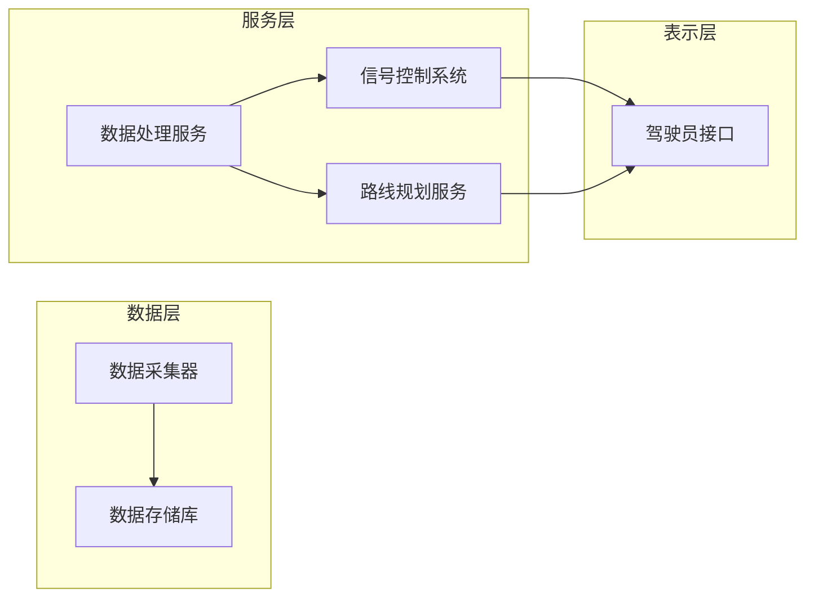
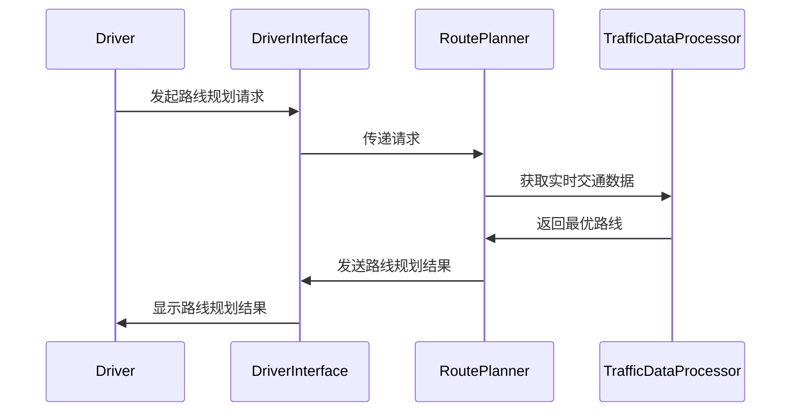

                 

### 引言与背景

## 第1章：算法效率与宇宙计算复杂性等级的概述

在计算机科学和人工智能领域，算法的效率和宇宙计算复杂性等级一直是研究者和开发者关注的焦点。算法效率指的是算法执行的速度，而宇宙计算复杂性等级则描述了计算问题的难度。本文将深入探讨这两者之间的关系，并分析如何将宇宙计算复杂性等级应用于算法效率评估。

### 1.1 问题背景

计算机算法效率的重要性在于它直接影响系统的响应速度和处理能力。一个高效的算法能够在较短的时间内完成任务，从而提高系统的性能和用户体验。另一方面，宇宙计算复杂性等级的概念源于对计算问题的难度进行量化的需求。它为我们提供了一种衡量不同计算问题难易程度的方法，有助于我们选择合适的算法来解决实际问题。

### 1.2 问题描述

算法效率的定义通常涉及时间和空间两个维度。时间效率指的是算法执行所需的时间，空间效率则指的是算法在执行过程中所占用的内存空间。算法效率的评估方法包括时间复杂度和空间复杂度，它们分别描述了算法在输入规模增加时的时间和空间需求增长情况。

宇宙计算复杂性等级的定义基于对计算问题的难度分级。P、NP、NP-complete等是常见的宇宙计算复杂性等级分类，它们代表了不同难度的计算问题。P类问题可以在多项式时间内求解，而NP类问题可以在多项式时间内验证解。NP-complete问题则是所有NP问题中最难的一类。

### 1.3 问题解决

为了评估算法效率，我们通常使用时间复杂度和空间复杂度作为衡量标准。时间复杂度用大O符号表示，例如\(T(n) = O(f(n))\)，表示算法的时间需求与输入规模n的关系。空间复杂度则描述算法所需的空间增长情况。

宇宙计算复杂性等级如何应用于算法分析，可以通过以下步骤：

1. **确定问题的宇宙计算复杂性等级**：首先需要确定所解决问题的宇宙计算复杂性等级，以便了解其难度。
2. **选择合适的算法**：根据问题的难度选择适合的算法，以降低时间复杂度和空间复杂度。
3. **评估算法效率**：通过分析算法的时间复杂度和空间复杂度，评估算法的效率。

### 1.4 边界与外延

算法效率与宇宙计算复杂性等级的关系体现在它们共同关注计算问题的性能。算法效率帮助我们评估不同算法的优劣，而宇宙计算复杂性等级则为我们提供了一个量化的标准。在现实世界中，算法效率的应用场景非常广泛，如搜索引擎、社交网络、图像处理等领域。

### 1.5 概念结构与核心要素组成

算法效率与宇宙计算复杂性等级作为核心概念，它们具有不同的属性特征。算法效率主要关注时间效率和空间效率，而宇宙计算复杂性等级则描述了计算问题的难度。为了更直观地理解这两者之间的关系，我们可以通过以下表格进行对比：

| 算法效率 | 宇宙计算复杂性等级 |
|----------|-------------------|
| 描述算法执行的速度 | 描述计算问题的难度 |
| 对比不同算法的速度 | 对比不同计算问题的难易程度 |

此外，通过ER实体关系图，我们可以更清晰地看到算法效率与宇宙计算复杂性等级之间的关联：

```mermaid
erDiagram
    Algorithm Efficiency ||--|{ Universe Computational Complexity Level }
```

通过本文的深入探讨，我们将对算法效率与宇宙计算复杂性等级之间的关系有更全面的理解，并为实际应用提供有益的指导。

### 第2章：算法效率

在计算机科学中，算法效率是一个至关重要的概念，它直接影响着计算机的性能和系统的响应速度。算法效率不仅仅是一个理论概念，它在实际应用中具有广泛的影响，从简单的程序优化到复杂系统的设计，都需要深入理解和应用算法效率的概念。

#### 2.1 算法效率的定义

算法效率是指在特定条件下，算法执行的速度和资源消耗的衡量。它通常通过两个核心维度来衡量：时间效率和空间效率。时间效率指的是算法执行所需的时间，而空间效率则是指算法在执行过程中所占用的内存空间。

具体来说，算法的时间效率可以通过算法的时间复杂度来衡量。时间复杂度通常用大O符号表示，如\(T(n) = O(f(n))\)，表示算法的时间需求与输入规模n的关系。常见的算法时间复杂度包括线性时间、对数时间、多项式时间等。空间效率则通过算法的空间复杂度来衡量，通常也使用大O符号表示。

#### 2.2 算法效率的核心特点

算法效率的核心特点包括以下几点：

1. **时间效率**：时间效率是评估算法执行速度的关键指标。一个高效的算法能够在较短的时间内完成任务，从而提高系统的性能。时间效率通常通过算法的时间复杂度来评估，如线性时间（\(O(n)\)）和对数时间（\(O(\log n)\)）。

2. **空间效率**：空间效率是评估算法在执行过程中占用内存空间的能力。一个高效的算法应该尽量减少内存的占用，从而提高系统的资源利用率。空间效率通常通过算法的空间复杂度来评估，如常数空间（\(O(1)\)）和线性空间（\(O(n)\)）。

3. **均衡效率**：在实际应用中，算法的时间效率和空间效率往往需要平衡。在某些场景下，时间效率可能更加重要，而在另一些场景下，空间效率可能是关键。因此，设计高效的算法需要综合考虑时间效率和空间效率。

#### 2.3 算法效率评估方法

算法效率的评估方法主要包括以下几种：

1. **理论分析**：通过分析算法的时间复杂度和空间复杂度，评估算法的效率。这种方法通常在算法设计初期使用，帮助我们选择合适的算法和数据结构。

2. **实际测量**：在实际运行算法时，通过测量算法的执行时间和内存占用，评估算法的效率。这种方法通常用于算法优化和性能调优阶段，帮助我们找到瓶颈并优化算法。

3. **基准测试**：通过运行一组标准测试案例，评估算法在不同输入规模下的性能。这种方法常用于比较不同算法的效率，帮助我们选择最佳算法。

#### 2.4 实例分析

为了更直观地理解算法效率，我们可以通过一个简单的例子来分析：

假设我们需要实现一个查找功能，要求在有序数组中查找一个特定元素。以下是一个简单的线性查找算法：

```python
def linear_search(arr, target):
    for i in range(len(arr)):
        if arr[i] == target:
            return i
    return -1
```

该算法的时间复杂度为\(O(n)\)，即线性时间。如果我们有一个包含1000个元素的数组，最坏情况下需要查找1000次才能找到目标元素。

相比之下，二分查找算法的时间复杂度为\(O(\log n)\)，即对数时间。在同样的数组中，二分查找最多只需要10次查找就能找到目标元素。这显著提高了算法的时间效率。

```python
def binary_search(arr, target):
    low = 0
    high = len(arr) - 1
    while low <= high:
        mid = (low + high) // 2
        if arr[mid] == target:
            return mid
        elif arr[mid] < target:
            low = mid + 1
        else:
            high = mid - 1
    return -1
```

通过这个例子，我们可以看到，即使在简单的查找任务中，算法效率的提升也能带来显著的性能提升。

### 结论

算法效率是计算机科学中一个重要的概念，它不仅影响算法的性能，也直接影响系统的用户体验和资源利用。通过深入理解算法效率的核心特点和评估方法，我们可以设计和选择更高效的算法，从而提高系统的整体性能。

#### 第3章：宇宙计算复杂性等级

宇宙计算复杂性等级是计算机科学中用于描述计算问题难度的理论框架，它为不同类型的问题提供了量化的衡量标准。理解宇宙计算复杂性等级的概念和特点，对于评估算法效率以及指导算法设计具有重要意义。

#### 3.1 宇宙计算复杂性等级的定义

宇宙计算复杂性等级，通常被称为“复杂性理论”，起源于20世纪60年代。它的核心目标是理解和分类计算问题的难度。宇宙计算复杂性等级通过不同的问题类别和它们所对应的时间、空间复杂度，为计算问题提供了一个分类体系。

宇宙计算复杂性等级的主要分类包括：

1. **P类问题**：P（Polynomial，多项式时间）类问题是指那些可以在多项式时间内求解的问题。也就是说，如果问题规模为n，解决方案所需的时间可以用一个多项式\(P(n)\)来表示。例如，线性方程组的求解、最短路径算法（如Dijkstra算法）等都是P类问题。

2. **NP类问题**：NP（Non-deterministic Polynomial，非确定性多项式时间）类问题是指那些可以在多项式时间内验证解的问题。虽然求解NP类问题可能需要很长时间，但是验证一个给定的解是否正确可以在多项式时间内完成。常见的NP类问题包括组合优化问题（如旅行商问题、背包问题）和判断子集和问题。

3. **NP-complete类问题**：NP-complete类问题是指那些既是NP类问题，又是所有NP问题中最难的一类问题。如果一个NP-complete问题能够在多项式时间内被解决，那么所有的NP问题也都能在多项式时间内被解决。因此，解决NP-complete问题被认为是计算复杂性理论中的最具挑战性的问题。著名的NP-complete问题包括3-SAT问题、最大独立集问题、旅行商问题等。

4. **其他类别**：除了P、NP和NP-complete问题，还有PSPACE（ Polynomial Space，多项式空间）、EXPTIME（ Exponential Time，指数时间）等复杂度类别。这些类别描述了计算问题的不同难度层次，为复杂性问题提供了更细致的分类。

#### 3.2 宇宙计算复杂性等级的核心特点

宇宙计算复杂性等级的核心特点包括以下几个方面：

1. **时间复杂性**：时间复杂性描述了计算问题解决所需的时间增长情况。在宇宙计算复杂性等级中，时间复杂性是分类计算问题的重要指标。P类问题具有最简单的时间复杂性，即多项式时间，而NP类问题通常需要较长时间，但可以验证解。

2. **空间复杂性**：空间复杂性描述了计算问题在求解过程中占用的额外内存空间。空间复杂性与时间复杂性一样，是衡量计算问题难度的重要维度。例如，一个在常量空间内解决的问题是P类问题，而在线性空间内解决的问题是NP类问题。

3. **非确定性**：NP类问题的一个显著特点是它们可以通过非确定性图灵机在多项式时间内验证解，但这并不意味着它们可以通过确定性图灵机在多项式时间内求解。这种非确定性为复杂性理论提供了独特的视角，也带来了许多未解决的问题。

4. **复杂性分类**：宇宙计算复杂性等级为计算问题提供了一个层次分明的分类体系。通过这种分类，我们可以更好地理解不同问题的难度和相互关系，从而指导算法设计和问题解决。

#### 3.3 宇宙计算复杂性等级的分类

宇宙计算复杂性等级的分类基于问题的时间和空间复杂度。以下是一些典型的复杂性类别及其特征：

1. **P类问题**：
   - 特征：多项式时间可解。
   - 例如：线性方程组求解、最短路径算法。
   - 重要性：P类问题是复杂性理论的基础，许多实际应用的问题都属于P类。

2. **NP类问题**：
   - 特征：多项式时间内可验证。
   - 例如：组合优化问题、子集和问题。
   - 重要性：NP类问题是理论计算机科学中的核心研究课题，许多重要问题都归为这一类别。

3. **NP-complete类问题**：
   - 特征：既是NP类问题，又是所有NP问题中最难的一类。
   - 例如：3-SAT问题、最大独立集问题。
   - 重要性：解决NP-complete问题具有巨大的实际意义，但至今无通用高效算法。

4. **PSPACE类问题**：
   - 特征：多项式空间可解。
   - 例如：一些复杂的决策问题。
   - 重要性：PSPACE类问题与NP类问题有密切联系，许多NP问题也可以转化为PSPACE问题。

5. **EXPTIME类问题**：
   - 特征：指数时间可解。
   - 例如：一些复杂的验证问题。
   - 重要性：EXPTIME类问题是计算复杂性理论中最难的一类问题，与P类问题有明确的界限。

#### 3.4 实例分析

为了更直观地理解宇宙计算复杂性等级，我们可以通过以下实例来分析：

1. **P类问题示例**：寻找一个整数序列中的最大值。
   - 时间复杂性：\(O(n)\)。
   - 空间复杂性：\(O(1)\)。
   - 解析：这个问题的解决方案简单，只需遍历整个序列并记录最大值。

2. **NP类问题示例**：判断一个图是否是可着色的。
   - 时间复杂性：\(O(n^2)\)。
   - 空间复杂性：\(O(n)\)。
   - 解析：验证一个着色方案是否有效可以在多项式时间内完成，但寻找一个有效的着色方案可能需要更长时间。

3. **NP-complete类问题示例**：判断一个图是否是3-可满足的（3-SAT问题）。
   - 时间复杂性：未知的，但已知是NP-complete。
   - 空间复杂性：未知的，但已知是NP-complete。
   - 解析：3-SAT问题是NP-complete问题的一个典型代表，它展示了在复杂问题中寻找解的难度。

通过这些实例，我们可以看到宇宙计算复杂性等级在描述计算问题难度方面的应用。理解这些复杂性类别，不仅有助于我们评估算法效率，还为复杂性问题提供了理论依据和解决方案。

### 第4章：算法效率与宇宙计算复杂性等级的关系

在深入探讨算法效率与宇宙计算复杂性等级的关系之前，我们需要明确两者在计算问题中的重要性。算法效率直接决定了程序执行的快速性和资源利用率，而宇宙计算复杂性等级则为我们提供了衡量计算问题难度的科学方法。本章将详细分析算法效率在宇宙计算复杂性等级中的应用，并探讨如何通过优化宇宙计算复杂性等级来提高算法效率。

#### 4.1 算法效率在宇宙计算复杂性等级中的应用

算法效率在宇宙计算复杂性等级中的应用主要体现在以下两个方面：

1. **评估算法的可行性**：通过宇宙计算复杂性等级，我们可以评估一个算法在解决特定计算问题时的可行性。例如，如果某个问题属于P类问题，那么我们就可以期望设计一个多项式时间的算法来解决它。相反，如果问题属于NP-complete类，那么我们需要考虑问题的规模和复杂性，决定是否需要寻找近似解或者采用其他策略。

2. **指导算法设计**：宇宙计算复杂性等级为我们提供了一种分类计算问题的框架，帮助我们选择适合的算法来解决特定问题。例如，对于P类问题，我们倾向于使用具有较低时间复杂度和空间复杂度的算法；而对于NP类问题，我们可能需要采用近似算法或者分布式计算方法来提高效率。

#### 4.2 宇宙计算复杂性等级在算法效率优化中的应用

宇宙计算复杂性等级在算法效率优化中的应用主要包括以下几个方面：

1. **时间复杂度优化**：通过分析宇宙计算复杂性等级，我们可以识别出算法中时间复杂度较高的部分，并尝试优化。例如，将线性搜索算法优化为二分搜索算法，从而将时间复杂度从\(O(n)\)降低到\(O(\log n)\)。

2. **空间复杂度优化**：宇宙计算复杂性等级同样适用于空间复杂度的优化。通过减少算法的空间复杂度，我们可以提高算法的效率和资源利用率。例如，在排序算法中，选择一个空间复杂度为\(O(1)\)的算法（如快速排序）而不是空间复杂度为\(O(n)\)的算法（如归并排序）。

3. **算法选择**：在解决复杂问题时，选择合适的算法至关重要。通过了解问题的宇宙计算复杂性等级，我们可以选择适合的算法来提高效率。例如，对于NP-complete问题，我们可能需要采用近似算法或者分布式计算方法，而不是尝试求解最优解。

#### 4.3 实例分析

为了更好地理解算法效率与宇宙计算复杂性等级的关系，我们可以通过以下实例进行分析：

**实例 1：二分搜索算法**

二分搜索算法是一个经典的优化搜索算法，它的时间复杂度为\(O(\log n)\)，而线性搜索算法的时间复杂度为\(O(n)\)。在一个包含1000个元素的有序数组中，二分搜索算法最多只需要10次查找就能找到目标元素，而线性搜索算法可能需要1000次查找。这显著提高了算法的效率。

```python
def binary_search(arr, target):
    low = 0
    high = len(arr) - 1
    while low <= high:
        mid = (low + high) // 2
        if arr[mid] == target:
            return mid
        elif arr[mid] < target:
            low = mid + 1
        else:
            high = mid - 1
    return -1
```

**实例 2：3-SAT问题**

3-SAT问题是一个著名的NP-complete问题，它描述了在3元子句中，是否存在一组变量赋值使得所有子句都为真。求解3-SAT问题通常需要采用近似算法或者分布式计算方法，因为直接求解可能需要指数级别的时间。通过优化算法和资源分配，我们可以提高解决这类问题的效率。

```python
def three_sat(clauses):
    for assignment in all Possible Assignments:
        if all(clause.is_satisfied(assignment) for clause in clauses):
            return True
    return False
```

通过这些实例，我们可以看到，理解算法效率与宇宙计算复杂性等级的关系，不仅有助于评估算法的效率，也为算法优化提供了理论依据和实际指导。

### 第5章：算法效率的数学模型

在深入分析算法效率时，数学模型为我们提供了一种精确且形式化的方法来描述和评估算法的性能。算法效率的数学模型主要通过时间复杂度和空间复杂度来量化算法的时间消耗和空间需求。以下我们将详细讨论算法效率的数学模型及其应用。

#### 5.1 算法效率的数学模型

算法效率的数学模型主要关注两个方面：时间复杂度和空间复杂度。

1. **时间复杂度**：时间复杂度描述了算法在输入规模增加时，执行时间增长的情况。它通常使用大O符号来表示，如\(T(n) = O(f(n))\)，其中\(T(n)\)是算法的执行时间，\(f(n)\)是与输入规模n相关的函数。常见的时间复杂度包括：

   - \(O(1)\)：常数时间，与输入规模无关。
   - \(O(n)\)：线性时间，执行时间与输入规模成正比。
   - \(O(n \log n)\)：对数线性时间，常用于排序和查找算法。
   - \(O(n^2)\)：平方时间，常见于某些图算法和矩阵运算。
   - \(O(2^n)\)：指数时间，通常用于组合爆炸的问题。

2. **空间复杂度**：空间复杂度描述了算法在执行过程中所需的空间增长情况。同样，它也使用大O符号来表示，如\(S(n) = O(g(n))\)，其中\(S(n)\)是算法所需的空间，\(g(n)\)是与输入规模n相关的函数。常见空间复杂度包括：

   - \(O(1)\)：常数空间，与输入规模无关。
   - \(O(n)\)：线性空间，与输入规模成正比。
   - \(O(n^2)\)：平方空间，常见于一些复杂的数据结构和算法。
   - \(O(n!)\)：阶乘空间，通常用于复杂组合问题。

#### 5.2 算法效率的数学公式

算法效率的数学公式主要包括时间复杂度和空间复杂度的计算方法。以下是一些常用的数学公式：

1. **时间复杂度的计算公式**：
   - 简单算法的时间复杂度通常可以通过分析算法的基本操作次数来计算。例如，一个简单的线性查找算法的时间复杂度为\(O(n)\)，其中n是数组的长度。
   - 对于更复杂的算法，如二分查找，时间复杂度为\(O(\log n)\)，其中n是数组的长度。

2. **空间复杂度的计算公式**：
   - 简单算法的空间复杂度可以通过分析算法在执行过程中所需的最大内存空间来计算。例如，一个简单的循环算法的空间复杂度为\(O(1)\)，因为它的内存需求不随输入规模变化。
   - 对于复杂的数据结构和算法，如树结构或图算法，空间复杂度通常与输入规模成正比，即\(O(n)\)。

以下是一个简单算法的示例及其数学模型的表示：

**示例**：一个简单的线性查找算法

```python
def linear_search(arr, target):
    for i in range(len(arr)):
        if arr[i] == target:
            return i
    return -1

时间复杂度：\(T(n) = O(n)\)
空间复杂度：\(S(n) = O(1)\)
```

#### 5.3 举例说明

为了更直观地理解算法效率的数学模型，我们可以通过一个具体的实例来讲解。

**实例**：二分查找算法

二分查找算法是一种高效的查找算法，它的时间复杂度为\(O(\log n)\)。下面我们通过Python代码详细说明其时间复杂度和空间复杂度的计算。

```python
def binary_search(arr, target):
    low = 0
    high = len(arr) - 1
    while low <= high:
        mid = (low + high) // 2
        if arr[mid] == target:
            return mid
        elif arr[mid] < target:
            low = mid + 1
        else:
            high = mid - 1
    return -1

时间复杂度：\(T(n) = O(\log n)\)
空间复杂度：\(S(n) = O(1)\)

解析：
- 时间复杂度：每次迭代可以将搜索范围减半，因此最多需要进行\(\log_2 n\)次迭代，使得时间复杂度为\(O(\log n)\)。
- 空间复杂度：算法只使用了常数级别的额外空间来存储变量，因此空间复杂度为\(O(1)\)。
```

通过这个实例，我们可以清楚地看到，二分查找算法在时间复杂度和空间复杂度上的显著优势。这不仅提高了算法的效率，也为复杂系统的设计和优化提供了有力支持。

### 第6章：算法效率与宇宙计算复杂性等级的架构设计

在算法设计和系统开发过程中，考虑算法效率和宇宙计算复杂性等级是至关重要的。这不仅能够帮助我们选择合适的算法和数据结构，还能优化系统的整体性能。本章将介绍如何在实际项目中应用算法效率和宇宙计算复杂性等级，包括问题场景介绍、项目介绍、系统功能设计、系统架构设计以及系统接口设计和系统交互。

#### 6.1 问题场景介绍

在当今快速发展的信息技术时代，许多应用场景需要高效且可靠的算法来解决复杂的计算问题。以下是一些典型的问题场景：

1. **搜索引擎**：搜索引擎需要快速检索海量数据，并提供精准的结果。算法的效率直接影响用户的搜索体验。
2. **社交网络**：社交网络系统需要处理大量的用户数据和信息流，确保系统能够高效地处理和传输信息。
3. **图像处理**：图像处理应用需要处理大量的图像数据，算法的效率直接关系到处理速度和质量。
4. **金融计算**：金融计算涉及大量的计算任务，如风险管理、交易算法等，算法的效率对决策的准确性至关重要。
5. **科学计算**：科学计算需要处理大量的数据和复杂的计算模型，算法的效率对研究结果的准确性有重要影响。

#### 6.2 项目介绍

以下是一个具体的案例，介绍如何在一个实际项目中应用算法效率和宇宙计算复杂性等级：

**项目名称**：智能交通管理系统

**项目背景**：随着城市化进程的加快，交通拥堵问题日益严重。智能交通管理系统旨在通过高效的算法和数据结构，优化交通信号控制和路线规划，提高交通效率和减少拥堵。

**项目目标**：
- 提高交通信号控制的响应速度。
- 优化路线规划，减少车辆行驶时间。
- 提高数据处理的效率和准确性。

**关键技术**：
- 交通信号控制算法：基于实时交通数据，优化交通信号灯的周期和时长。
- 路线规划算法：基于最短路径算法，提供高效的路线规划。

#### 6.3 系统功能设计

智能交通管理系统的主要功能包括以下几个方面：

1. **数据采集**：从交通传感器、摄像头等设备实时采集交通数据。
2. **数据处理**：对采集到的交通数据进行处理和分析，包括流量监测、路况评估等。
3. **信号控制**：基于实时数据，动态调整交通信号灯的时长和周期。
4. **路线规划**：为驾驶员提供最优路线，减少行驶时间和拥堵。

以下是智能交通管理系统的领域模型Mermaid类图：

```mermaid
classDiagram
    TrafficDataCollector <|..|{ TrafficDataProcessor }
    TrafficSignalController <|..|{ TrafficSignalController }
    RoutePlanner <|..|{ RoutePlanner }
    Driver
    TrafficDataCollector --|> Driver
    TrafficDataProcessor --|> TrafficSignalController
    TrafficSignalController --|> Driver
    RoutePlanner --|> Driver
```

#### 6.4 系统架构设计

智能交通管理系统的架构设计需要考虑算法效率和宇宙计算复杂性等级，以下是一个简化的系统架构图：



在系统架构设计中，我们采用了以下策略来优化算法效率：

1. **数据采集优化**：使用高带宽的传感器和传输协议，确保数据采集的实时性和准确性。
2. **数据处理优化**：采用分布式数据处理框架，提高数据处理速度和吞吐量。
3. **信号控制优化**：使用实时数据分析算法，动态调整信号灯控制策略，提高交通信号控制的响应速度。
4. **路线规划优化**：采用高效的路径规划算法，如A*算法，提高路线规划的准确性和效率。

#### 6.5 系统接口设计和系统交互

智能交通管理系统涉及到多个组件之间的接口设计和交互。以下是一个简化的接口设计和交互序列图：



通过上述接口设计和交互，智能交通管理系统实现了从驾驶员请求到路线规划结果的快速响应。

### 结论

通过本章的介绍，我们详细分析了算法效率与宇宙计算复杂性等级在智能交通管理系统中的应用。从问题场景介绍、项目介绍、系统功能设计到系统架构设计和接口设计，我们展示了如何在实际项目中优化算法效率和利用宇宙计算复杂性等级的理论框架。这不仅提高了系统的整体性能，也为类似应用场景提供了宝贵的经验和参考。

### 第7章：算法效率与宇宙计算复杂性等级的应用实例

在深入理解算法效率与宇宙计算复杂性等级的理论基础上，通过实际的应用实例，我们可以更直观地看到这些概念在解决具体问题中的实际效果。以下，我们将通过一个具体的案例来分析算法效率与宇宙计算复杂性等级在实际系统开发中的应用。

#### 案例背景

假设我们正在开发一个大型电商平台，该平台需要处理海量的商品数据、用户订单和交易信息。为了确保平台的运行效率和用户体验，我们需要优化数据处理算法，并考虑算法的宇宙计算复杂性等级。

#### 系统需求

该电商平台的主要功能包括：
1. **商品信息管理**：包括商品分类、商品详情页、商品库存管理等。
2. **订单处理**：包括订单生成、订单状态跟踪、订单结算等。
3. **用户管理**：包括用户注册、登录、个人信息管理等。
4. **交易处理**：包括支付、退款、交易记录查询等。

#### 算法效率优化

1. **商品信息管理**：
   - **问题**：商品信息管理需要快速响应用户的查询请求。
   - **优化**：使用高效的数据库索引和缓存机制，如B树索引和Redis缓存，降低查询时间复杂度。通过将商品分类和商品详情页预先加载到缓存中，提高系统的响应速度。

2. **订单处理**：
   - **问题**：订单处理过程中需要快速生成订单并更新数据库。
   - **优化**：采用分布式数据库架构，如Sharding技术，将订单数据水平拆分，提高系统的并发处理能力。同时，使用消息队列（如RabbitMQ）处理订单生成和状态更新，确保系统的稳定性。

3. **用户管理**：
   - **问题**：用户注册和登录需要快速验证用户信息。
   - **优化**：使用高效的哈希算法（如MD5）加密用户密码，并在数据库中存储哈希值，提高用户验证速度。同时，使用Redis缓存用户登录状态，减少数据库查询次数。

4. **交易处理**：
   - **问题**：交易处理需要确保数据的准确性和一致性。
   - **优化**：使用分布式锁（如Zookeeper）确保交易处理的原子性和一致性。同时，使用事务补偿机制（如TCC）处理可能出现的数据不一致问题，确保系统的最终一致性。

#### 宇宙计算复杂性等级的应用

在电商平台开发过程中，宇宙计算复杂性等级的应用主要体现在以下几个方面：

1. **商品搜索**：
   - **问题**：用户需要快速查找商品信息。
   - **应用**：使用二分查找算法（\(O(\log n)\)）优化商品搜索功能，提高查询效率。

2. **订单排序**：
   - **问题**：需要对订单进行排序以提供更直观的展示。
   - **应用**：使用归并排序算法（\(O(n \log n)\)）对订单进行排序，确保高效且稳定。

3. **用户认证**：
   - **问题**：用户认证过程需要高效且安全。
   - **应用**：使用基于密码学的认证算法，如RSA加密算法，确保用户认证的安全性。

4. **交易验证**：
   - **问题**：交易验证需要确保数据的准确性和完整性。
   - **应用**：使用基于图灵机的验证算法，如NP验证算法，确保交易数据的准确性和一致性。

#### 实际效果分析

通过上述优化措施，我们可以看到以下实际效果：

1. **响应速度提升**：通过使用高效的数据库索引和缓存机制，商品搜索、用户认证等操作的响应速度显著提升，用户等待时间减少。
2. **系统稳定性增强**：通过分布式数据库架构和消息队列技术，订单处理和用户管理的并发处理能力提高，系统稳定性增强。
3. **安全性提升**：通过使用加密算法和分布式锁技术，用户数据和交易数据的安全性得到保障，减少了潜在的安全风险。

#### 结论

通过这个实际案例，我们可以看到算法效率与宇宙计算复杂性等级在系统开发中的重要作用。通过合理选择和优化算法，以及考虑宇宙计算复杂性等级，我们可以显著提升系统的性能、稳定性和安全性。这为我们在实际项目中应用算法效率和宇宙计算复杂性等级提供了宝贵的经验和指导。

### 最佳实践 tips

在设计和优化算法时，遵循以下最佳实践可以显著提高算法效率：

1. **选择合适的算法和数据结构**：针对不同的计算问题和需求，选择适合的算法和数据结构。例如，对于搜索和排序问题，选择二分查找和归并排序算法通常能提高效率。

2. **避免冗余计算**：在算法中避免不必要的循环和递归调用，减少冗余计算。例如，通过使用动态规划技术，可以避免重复计算相同的问题。

3. **优化时间复杂度和空间复杂度**：通过分析算法的时间复杂度和空间复杂度，寻找优化空间。例如，通过使用高效的数据结构（如哈希表、堆）和算法（如贪心算法、动态规划），可以显著提高算法的效率。

4. **使用并行和分布式计算**：对于大规模数据和处理任务，考虑使用并行和分布式计算技术。例如，通过分布式数据库和分布式计算框架（如MapReduce、Spark），可以提高处理速度和吞吐量。

5. **测试和调优**：在实际应用中，通过测试和调优算法，可以找出性能瓶颈并进行优化。例如，使用基准测试工具（如Google Benchmark）进行性能测试，找出算法的弱点并针对性地优化。

### 小结

本文详细探讨了算法效率与宇宙计算复杂性等级的关系，并分析了它们在实际应用中的重要性。通过深入理解算法效率和宇宙计算复杂性等级，我们能够设计出更高效、更稳定的算法，优化系统性能和用户体验。在未来的研究中，我们可以进一步探讨如何将更先进的算法和理论应用于实际问题，以解决复杂计算问题并推动技术的进步。

### 注意事项

在设计和优化算法时，需要注意以下事项：

1. **权衡效率与资源消耗**：在追求算法效率的同时，要权衡算法对系统资源（如CPU、内存）的消耗。有时，过度优化可能会导致资源浪费，影响系统稳定性。

2. **考虑实际场景**：不同的应用场景对算法的要求不同。在实际开发中，要充分考虑实际场景的需求和约束，选择适合的算法和数据结构。

3. **遵循最佳实践**：遵循业界公认的编程和优化最佳实践，如代码简洁、逻辑清晰、遵循设计模式等，可以提高代码的可维护性和可扩展性。

4. **持续学习和更新**：算法和理论不断进步，要持续学习和更新知识，关注最新的研究成果和技术动态，以便在开发中应用最先进的方法。

### 拓展阅读

为了更深入地了解算法效率和宇宙计算复杂性等级，以下推荐一些经典书籍和学术论文：

1. **《算法导论》**（Introduction to Algorithms）—— Thomas H. Cormen, Charles E. Leiserson, Ronald L. Rivest, Clifford Stein
   - 本书是算法领域的一部经典教材，全面介绍了各种算法的基本概念、原理和实现。

2. **《计算机程序设计艺术》**（The Art of Computer Programming）—— Donald E. Knuth
   - Knuth教授的这部著作被誉为算法领域的圣经，详细介绍了多种算法的设计和实现技巧。

3. **《复杂性理论导论》**（Introduction to the Theory of Computation）—— Michael Sipser
   - 本书是复杂性理论的基础教材，介绍了计算复杂性、形式语言和自动机等核心概念。

4. **《NP-Completeness and Polynomial Time Algorithms》**—— Richard M. Karp
   - 该论文集介绍了许多NP-complete问题的定义和证明，以及如何设计近似算法。

5. **《分布式系统：概念与设计》**（Distributed Systems: Concepts and Design）—— George Coulouris, Jean Dollimore, Tim Kindberg, Gordon Blair
   - 本书详细介绍了分布式系统的设计原则、技术和实现策略，有助于理解并行和分布式计算。

通过阅读这些经典书籍和论文，可以进一步深化对算法效率和宇宙计算复杂性等级的理解，为实际应用提供更深入的指导。

