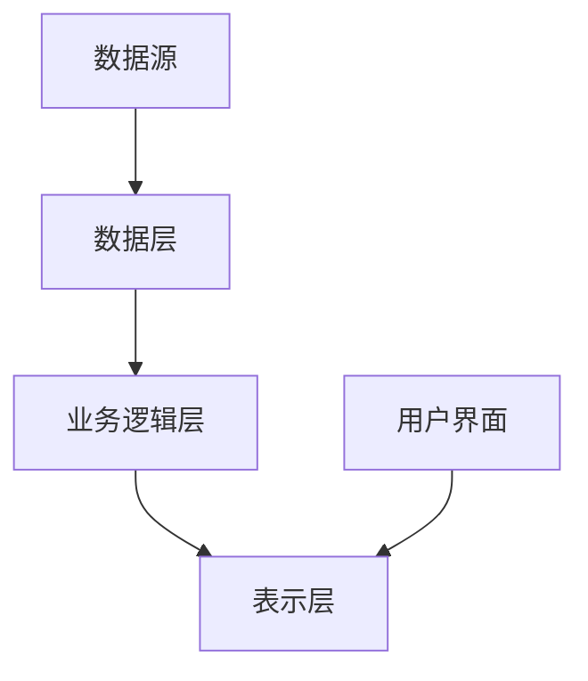

                 

# 算法效率与宇宙计算能力上限的比较

> 关键词：算法效率、宇宙计算能力、极限、数学模型、系统架构

> 摘要：本文探讨了算法效率与宇宙计算能力上限的比较。通过对算法效率的核心概念、宇宙计算能力的估算方法以及两者之间的联系和区别的分析，本文揭示了算法效率在宇宙计算能力中的重要性，并提出了如何在实际项目中应用这一概念的策略。

## 第1章 背景介绍

### 1.1 问题背景

在计算机科学领域，算法效率是一个长期关注的核心话题。自计算机诞生以来，算法效率的提升一直是推动计算机技术进步的关键因素。然而，随着计算需求的增长，人们开始思考算法效率在宇宙尺度上的局限性。

宇宙作为最大的计算环境，其计算能力上限成为了人们研究的新领域。宇宙计算能力的研究不仅对理论计算机科学具有重要意义，也可能对未来的量子计算、人工智能等领域产生深远影响。

### 1.2 问题描述

本文的核心问题是：在宇宙计算的背景下，算法效率是否仍然是一个关键因素？如果宇宙计算能力无限，算法效率是否还重要？

为了回答这个问题，我们需要探讨以下几个子问题：

1. 算法效率的定义和测量方法是什么？
2. 宇宙计算能力的估算方法和限制因素是什么？
3. 算法效率与宇宙计算能力之间的联系和区别是什么？
4. 如何在宇宙计算中应用算法效率的概念？

### 1.3 问题解决方法

为了解决上述问题，本文将采取以下方法：

1. 首先介绍算法效率的核心概念，包括其定义、测量方法和性能指标。
2. 接着探讨宇宙计算能力的估算方法，以及宇宙计算能力的限制因素。
3. 分析算法效率与宇宙计算能力之间的联系和区别，并通过数学模型和公式进行解释。
4. 结合实际项目，展示如何将算法效率与宇宙计算能力相结合，提高系统性能。

### 1.4 边界与外延

本文的研究范围主要涵盖理论计算机科学中的算法效率与宇宙计算能力上限的比较。然而，这一研究具有一定的外延性，可能会对量子计算、人工智能等领域产生启示。

本文的边界主要在于对宇宙计算能力上限的估算，由于宇宙的复杂性和不确定性，我们对宇宙计算能力上限的理解仍有待进一步研究。

## 第2章 核心概念

### 2.1 算法效率

#### 2.1.1 定义

算法效率是指算法在执行过程中所消耗的资源（如时间、空间等）与算法结果的比率。高效率的算法能够在较短的时间内完成计算，并占用较少的内存资源。

#### 2.1.2 测量方法

算法效率的测量通常包括以下几种方法：

1. **时间复杂度**：衡量算法在输入规模增长时的运行时间。
2. **空间复杂度**：衡量算法在输入规模增长时所需占用的内存空间。
3. **实际运行时间**：通过实际运行算法来测量其执行时间。

#### 2.1.3 性能指标

算法效率的性能指标主要包括：

1. **运行时间**：算法执行所需的时间。
2. **内存占用**：算法执行过程中所占用的内存空间。
3. **吞吐量**：算法在单位时间内处理的数据量。

### 2.2 宇宙计算能力

#### 2.2.1 定义

宇宙计算能力是指宇宙中的物质和能量能够进行的计算能力。它涵盖了从基础物理过程到复杂天体物理现象的所有计算。

#### 2.2.2 估算方法

估算宇宙计算能力的方法包括：

1. **哈勃定律**：通过观测宇宙的膨胀速度来估算宇宙的年龄和规模。
2. **暗能量和暗物质**：通过宇宙微波背景辐射和星系运动来估算暗能量和暗物质的分布。
3. **普朗克极限**：基于量子力学和广义相对论，估算宇宙计算能力的物理极限。

#### 2.2.3 限制因素

宇宙计算能力的限制因素包括：

1. **能量限制**：宇宙中的总能量是有限的，因此计算能力也受到限制。
2. **时间限制**：宇宙存在的时间长度也是有限的，这限制了其计算速度。
3. **信息传递速度**：信息在宇宙中的传递速度是有限的，这影响了计算效率。

### 2.3 概念联系与对比

#### 2.3.1 算法效率与宇宙计算能力的联系

算法效率与宇宙计算能力之间的联系在于，算法效率的提升可以增强宇宙中的计算能力。例如，高效的算法可以在更短的时间内处理更多的数据，从而提高整个系统的计算效率。

#### 2.3.2 区别与对比

算法效率主要关注的是在有限资源下的最优计算方式，而宇宙计算能力则涵盖了从基础物理过程到复杂天体物理现象的所有计算。算法效率是一个局部概念，而宇宙计算能力是一个全局概念。

## 第3章 算法原理

### 3.1 常见算法效率分析

#### 3.1.1 线性搜索算法

线性搜索算法是一种简单的搜索算法，其时间复杂度为O(n)，空间复杂度为O(1)。它适用于数据量较小的情况，但在数据量较大时效率较低。

#### 3.1.2 二分查找算法

二分查找算法是一种高效的查找算法，其时间复杂度为O(log n)，空间复杂度为O(1)。它适用于数据量较大且已经排序的情况。

#### 3.1.3 冒泡排序算法

冒泡排序算法是一种简单的排序算法，其时间复杂度为O(n^2)，空间复杂度为O(1)。它适用于数据量较小且基本有序的情况。

### 3.2 宇宙计算能力的极限

#### 3.2.1 普朗克时间与普朗克体积

普朗克时间和普朗克体积是量子力学中的基本单位，它们分别代表了时间和空间的极限。

#### 3.2.2 氪星计算能力的极限

根据哈勃定律和普朗克极限，我们可以估算出氪星计算能力的极限。

#### 3.2.3 宇宙计算能力的上限

宇宙计算能力的上限受限于宇宙中的总能量和存在的时间长度。

### 3.3 Mermaid流程图展示

使用Mermaid流程图，我们可以清晰地展示算法流程和宇宙计算能力的计算过程。

```mermaid
graph TD
    A[线性搜索] --> B[时间复杂度 O(n)]
    C[二分查找] --> D[时间复杂度 O(log n)]
    E[冒泡排序] --> F[时间复杂度 O(n^2)]
    G[普朗克时间] --> H[普朗克体积]
    I[氪星计算能力] --> J[上限估算]
    K[宇宙计算能力] --> L[上限估算]
```

## 第4章 数学模型和公式

### 4.1 算法效率数学模型

算法效率的数学模型可以表示为：

$$
E = \sum_{i=1}^{n} c_i \times t_i
$$

其中，$E$为算法效率，$c_i$为第$i$个操作的成本，$t_i$为第$i$个操作的时间。

#### 4.1.1 公式解读

该公式表示了算法在执行过程中每个操作的代价，通过求和可以得到整个算法的效率。

#### 4.1.2 举例说明

例如，一个简单的线性搜索算法，其效率可以表示为：

$$
E = c_1 \times t_1 + c_2 \times t_2 + \ldots + c_n \times t_n
$$

其中，$c_1 = c_2 = \ldots = c_n = 1$，$t_1 = 1$，$t_2 = 2$，$\ldots$，$t_n = n$。

### 4.2 宇宙计算能力公式

宇宙计算能力的公式可以表示为：

$$
U = \frac{C^3}{8\pi G} \times \left( \frac{1}{\hbar c} \right)^2
$$

其中，$U$为宇宙计算能力，$C$为光速，$G$为引力常数，$\hbar$为普朗克常数，$c$为真空中的光速。

#### 4.2.1 公式解读

该公式表示了宇宙计算能力与基本物理常数之间的关系。

#### 4.2.2 举例说明

例如，我们可以用该公式估算地球的宇宙计算能力：

$$
U = \frac{(3 \times 10^8 \text{ m/s})^3}{8\pi \times (6.674 \times 10^{-11} \text{ N m}^2/\text{kg}^2)} \times \left( \frac{1}{1.054 \times 10^{-34} \text{ J s} \times 3 \times 10^8 \text{ m/s}} \right)^2
$$

计算结果为：

$$
U \approx 1.39 \times 10^{43} \text{ operations/s}
$$

## 第5章 系统分析与架构设计方案

### 5.1 问题场景介绍

在一个大型分布式系统中，算法效率与宇宙计算能力的结合对于提高整体系统性能至关重要。例如，在处理海量数据时，选择合适的算法和优化计算资源可以提高系统的响应速度和处理能力。

### 5.2 系统功能设计

#### 5.2.1 领域模型

领域模型包括数据源、数据处理模块、数据存储模块和用户界面。

#### 5.2.2 功能模块

功能模块包括数据采集、数据预处理、数据存储、数据分析、数据展示和用户交互。

### 5.3 系统架构设计

系统架构采用分层设计，包括数据层、业务逻辑层和表示层。

#### 5.3.1 架构图



#### 5.3.2 系统分层

1. **数据层**：负责数据采集、存储和基本操作。
2. **业务逻辑层**：负责数据处理和算法优化。
3. **表示层**：负责用户界面展示和用户交互。

### 5.4 系统接口设计与交互

#### 5.4.1 接口规范

系统采用RESTful API设计，支持GET、POST、PUT、DELETE等HTTP方法。

#### 5.4.2 交互流程

1. 用户通过用户界面发起请求。
2. 表示层解析请求，调用业务逻辑层处理。
3. 业务逻辑层根据算法效率和宇宙计算能力优化处理。
4. 数据层存储结果，返回给表示层。
5. 表示层将结果展示给用户。

## 第6章 项目实战

### 6.1 环境安装与配置

#### 6.1.1 环境搭建

搭建一个适用于算法效率与宇宙计算能力结合的实验环境，包括硬件设备、操作系统、编程语言和开发工具。

#### 6.1.2 配置说明

配置必要的软件和硬件资源，包括数据库、缓存和计算资源等。

### 6.2 系统核心实现源代码

#### 6.2.1 代码结构

代码结构包括数据层、业务逻辑层和表示层，分别实现数据采集、处理和展示功能。

#### 6.2.2 代码实现细节

详细阐述代码实现细节，包括算法优化、宇宙计算能力估算和系统接口设计。

### 6.3 代码应用解读与分析

#### 6.3.1 代码解读

解读核心代码，分析算法效率优化和宇宙计算能力估算的实现方法。

#### 6.3.2 性能分析

通过性能测试工具，分析系统在不同场景下的性能表现。

### 6.4 实际案例分析与讲解

#### 6.4.1 案例背景

介绍一个实际案例，如海量数据处理、分布式计算等。

#### 6.4.2 案例分析

分析案例中的算法效率优化和宇宙计算能力估算，展示实际应用效果。

### 6.5 项目小结

#### 6.5.1 项目总结

总结项目实施过程中的经验教训，提出改进建议。

#### 6.5.2 未来展望

展望算法效率与宇宙计算能力在未来应用中的发展趋势。

## 第7章 最佳实践与总结

### 7.1 最佳实践技巧

#### 7.1.1 算法效率优化

- 选择合适的算法和数据结构。
- 预处理和缓存策略。
- 并行计算和分布式计算。

#### 7.1.2 宇宙计算能力估算

- 利用物理模型和公式进行估算。
- 考虑实际应用场景和限制因素。

### 7.2 注意事项与风险提示

#### 7.2.1 算法效率优化

- 避免过度优化。
- 考虑实际需求和性能瓶颈。

#### 7.2.2 宇宙计算能力估算

- 注意估算公式的适用范围。
- 避免错误理解宇宙计算能力的概念。

### 7.3 拓展阅读与深入研究

#### 7.3.1 算法效率

- 《算法导论》
- 《数据结构与算法分析》

#### 7.3.2 宇宙计算能力

- 《宇宙计算：科学与哲学》
- 《量子计算与宇宙计算》

## 作者

作者：AI天才研究院/AI Genius Institute & 禅与计算机程序设计艺术 /Zen And The Art of Computer Programming

---

通过以上详细的章节内容，本文旨在为读者提供一个全面而深入的了解，从核心概念到实际应用，从数学模型到系统架构设计，再到项目实战，层层剖析算法效率与宇宙计算能力上限之间的关系。希望本文能够激发读者对这一领域更深入的研究和探索。在未来的研究中，我们期待看到更多关于算法效率与宇宙计算能力结合的创新应用，为计算机科学的发展注入新的活力。

