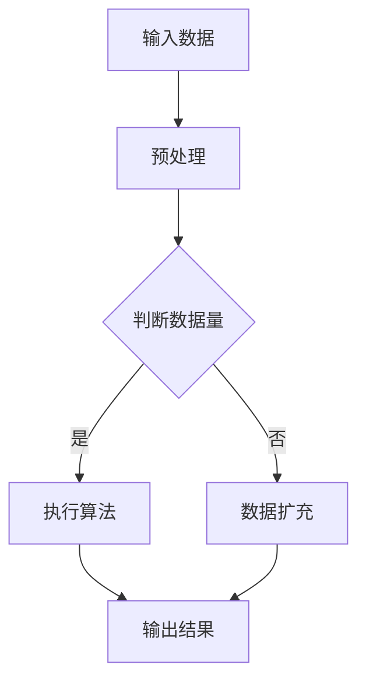
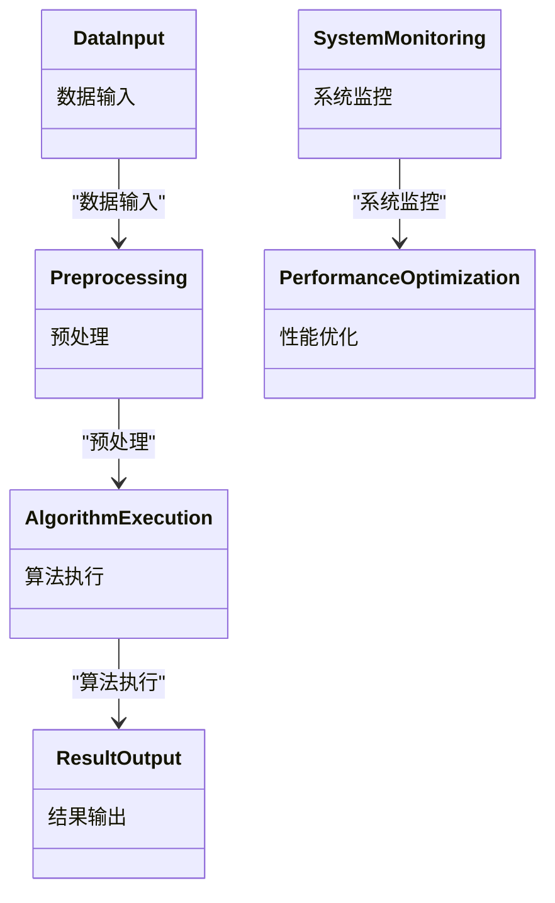
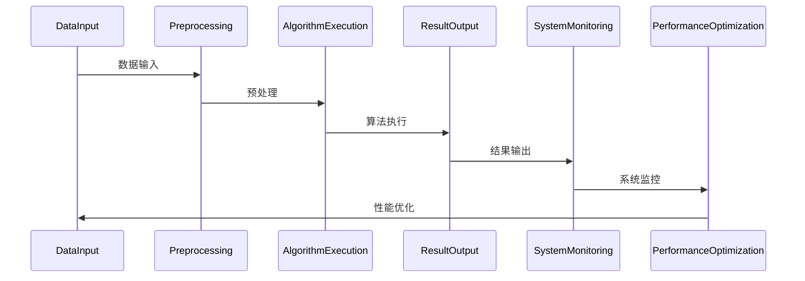
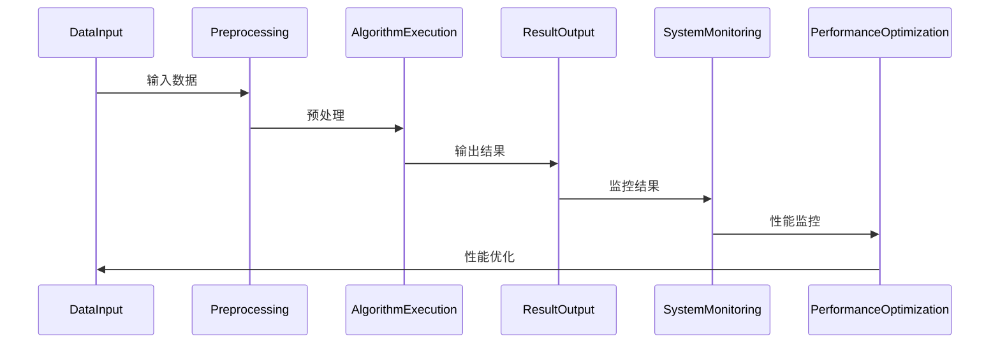

                 

# 算法设计与宇宙信息熵守恒的类比

> 关键词：算法设计、宇宙信息熵守恒、类比、信息处理、系统架构设计

> 摘要：本文通过将算法设计与宇宙信息熵守恒进行类比，探讨了两者的核心概念、原理及其在实际应用中的联系。首先，我们介绍了算法设计与宇宙信息熵守恒的基本概念和问题背景，接着，通过具体案例分析了算法设计与宇宙信息熵守恒的联系。本文旨在通过逻辑清晰、结构紧凑的分析，帮助读者深入理解算法设计与宇宙信息熵守恒的本质联系，为其在IT领域中的应用提供新视角。

----------------------------------------------------------------

## 第一部分：背景介绍

### 1.1 问题的提出

在信息技术飞速发展的今天，算法设计已成为计算机科学的核心问题之一。算法，作为解决特定问题的有效序列，其高效性、准确性和稳定性直接决定了系统的性能。与此同时，宇宙信息熵守恒定律则揭示了宇宙中信息传递与处理的基本规律。这两个看似截然不同的领域，却存在着深层次的关联。本文将尝试通过类比的方法，揭示算法设计与宇宙信息熵守恒之间的内在联系。

### 1.2 信息熵的概念与守恒

信息熵，作为信息理论中的核心概念，它衡量了信息的随机性和不确定性。宇宙信息熵守恒定律则表明，在一个封闭系统中，信息熵的总和是不会减少的，即信息在传递和处理过程中，总熵是守恒的。这一基本原理不仅适用于物理宇宙，也被广泛认为是信息处理过程中的一个基本规则。

### 1.3 算法设计与宇宙信息熵守恒的联系

算法设计与宇宙信息熵守恒的联系主要体现在以下几个方面：

1. **信息处理与熵变**：算法在处理信息时，本质上是一个熵减过程，即通过特定的操作减少信息的不确定性。
2. **计算复杂性与熵**：算法的复杂度与信息熵之间有着密切的联系，一个高效的算法往往能够更好地处理信息，从而降低系统的熵。
3. **系统优化与熵减**：在系统优化过程中，通过调整算法，实现系统的熵减，从而提升系统的性能和稳定性。

### 1.4 研究意义与目标

本研究的主要目标是：

1. **深入理解**：通过类比的方法，深入理解算法设计与宇宙信息熵守恒的基本概念和原理。
2. **揭示联系**：揭示算法设计与宇宙信息熵守恒之间的内在联系，为算法设计提供新的理论依据。
3. **指导实践**：为实际系统设计和优化提供理论指导，提高系统性能和稳定性。

### 1.5 本章小结

本节通过介绍算法设计与宇宙信息熵守恒的基本概念和联系，为后续章节的分析奠定了基础。接下来，我们将进一步探讨算法设计与宇宙信息熵守恒的类比，并通过具体案例来分析两者在实际应用中的联系。

----------------------------------------------------------------

## 第二部分：核心概念与联系

### 2.1 算法设计与宇宙信息熵守恒的核心概念

#### 2.1.1 算法设计的核心概念

算法设计，指的是按照特定问题的需求，设计出解决问题的步骤和过程。算法的核心概念包括输入、输出、步骤、效率等。其中，输入是算法的起点，输出是算法的终点，而步骤则描述了从输入到输出的过程。算法的效率则体现在时间复杂度和空间复杂度上。

#### 2.1.2 宇宙信息熵守恒的核心概念

宇宙信息熵守恒定律，指的是在一个封闭系统中，信息传递和处理过程中，总熵是不会减少的。这一概念的核心在于“守恒”，即信息在传递和处理过程中，总量保持不变。

### 2.2 概念属性特征对比表格

下面是一个简单的对比表格，展示了算法设计与宇宙信息熵守恒的核心概念属性特征：

| 特征         | 算法设计                         | 宇宙信息熵守恒                        |
| ------------ | -------------------------------- | ----------------------------------- |
| 目的         | 解决特定问题                      | 保持系统信息熵不变                    |
| 基础概念     | 输入、输出、步骤、效率             | 信息熵、熵变、守恒                    |
| 重要性       | 高效性、准确性、稳定性             | 信息传递和处理的基本规律              |
| 实现方式     | 编程语言实现                      | 宇宙物理过程实现                      |

### 2.3 ER实体关系图架构

为了更直观地展示算法设计与宇宙信息熵守恒的联系，我们可以使用ER（Entity-Relationship）实体关系图来描述两者之间的关系。

```mermaid
erDiagram
  A[算法设计] ||--|{ B[信息处理] }
  B ||--|{ C[效率] }
  A ||--|{ D[稳定性] }
  E[宇宙信息熵守恒] ||--|{ B }
```

在这个ER图中，算法设计通过信息处理与宇宙信息熵守恒建立联系，同时，算法设计中的效率和稳定性也与宇宙信息熵守恒有着密切的关系。

### 2.4 算法设计与宇宙信息熵守恒的联系分析

算法设计与宇宙信息熵守恒之间的联系可以从以下几个方面进行分析：

1. **信息处理过程中的熵减**：在算法设计过程中，通过对信息的处理，可以降低系统的不确定性，实现熵的减少。这与宇宙信息熵守恒定律中的守恒原则相呼应。
2. **计算复杂度与熵变**：一个高效的算法能够更快地处理信息，从而降低系统的熵变速率。这与宇宙信息熵守恒定律中的熵变速率控制有着异曲同工之妙。
3. **系统优化与熵减**：在系统优化过程中，通过调整算法，可以实现系统的熵减，从而提升系统的性能和稳定性。这与宇宙信息熵守恒定律中的熵减过程有着相似的原理。

### 2.5 本章小结

通过核心概念介绍和ER实体关系图，我们初步了解了算法设计与宇宙信息熵守恒之间的联系。接下来，我们将通过具体案例来进一步分析这种联系，并探讨算法设计与宇宙信息熵守恒在实际应用中的具体表现。

----------------------------------------------------------------

## 第三部分：算法设计与宇宙信息熵守恒的实际应用

### 3.1 算法原理讲解

#### 3.1.1 算法流程图绘制

为了更好地理解算法设计与宇宙信息熵守恒的联系，我们可以使用mermaid语言绘制算法流程图。



在这个流程图中，A代表输入数据，B代表预处理，C是一个判断节点，用于判断数据量的大小。如果数据量较大，则直接执行算法D，如果数据量较小，则先进行数据扩充E，然后再输出结果F。

#### 3.1.2 算法流程图解读

通过上面的流程图，我们可以看到，算法设计的过程可以分为以下几个步骤：

1. **输入数据**：算法的起点是输入数据，这是算法执行的基础。
2. **预处理**：预处理步骤用于对输入数据进行处理，使其符合算法的要求。
3. **数据量判断**：通过判断数据量的大小，决定是直接执行算法还是先进行数据扩充。
4. **算法执行**：根据数据量的大小，执行具体的算法步骤，进行信息处理。
5. **输出结果**：算法的最终输出是结果，这是算法执行的结果。

#### 3.2 Python 代码实现

为了更具体地展示算法原理，我们使用Python代码实现上述算法流程。

```python
def algorithm(data):
    # 预处理
    preprocessed_data = preprocess(data)
    
    # 判断数据量
    if len(preprocessed_data) > threshold:
        # 执行算法
        result = execute_algorithm(preprocessed_data)
    else:
        # 数据扩充
        preprocessed_data = expand_data(preprocessed_data)
        
    # 输出结果
    return result
```

在这个Python代码中，`preprocess`函数用于预处理输入数据，`execute_algorithm`函数用于执行算法，`expand_data`函数用于数据扩充。`threshold`是数据量的阈值，用于判断是否需要执行数据扩充。

#### 3.2.2 代码解读与分析

通过上述代码，我们可以看到，算法的设计过程通过Python代码实现，分为以下几个部分：

1. **预处理**：预处理是对输入数据进行处理，使其符合算法的要求。这是算法执行的基础步骤。
2. **数据量判断**：通过判断数据量的大小，决定是直接执行算法还是先进行数据扩充。这个步骤是为了确保算法能够高效地处理输入数据。
3. **算法执行**：根据数据量的大小，执行具体的算法步骤，进行信息处理。这是算法的核心步骤。
4. **输出结果**：算法的最终输出是结果，这是算法执行的结果。

#### 3.3 数学模型和公式讲解

为了更好地理解算法原理，我们可以使用数学模型和公式来描述算法的设计过程。

首先，我们定义输入数据的不确定性为\(X\)，输出结果的不确定性为\(Y\)。根据信息熵的定义，我们可以得到：

\[ H(X) = -\sum_{i} p(x_i) \log_2 p(x_i) \]

其中，\(H(X)\)是输入数据的不确定性，\(p(x_i)\)是输入数据中第\(i\)种情况的概率。

算法的目的是降低输入数据的不确定性，即实现\(H(X) \rightarrow H(Y)\)。

在算法执行过程中，输入数据经过预处理、数据量判断、算法执行和数据扩充等步骤，最终输出结果。在这个过程中，输入数据的不确定性会逐渐降低，即实现熵的减少。

我们可以使用以下公式来描述这个过程：

\[ H(Y) = -\sum_{i} p(y_i) \log_2 p(y_i) \]

其中，\(H(Y)\)是输出结果的不确定性，\(p(y_i)\)是输出结果中第\(i\)种情况的概率。

为了实现熵的减少，算法需要满足以下条件：

\[ H(Y) < H(X) \]

这意味着，算法能够有效地降低输入数据的不确定性，实现系统的熵减。

#### 3.3.3 举例说明

假设我们有一个输入数据集，其中包含100个数据点，每个数据点的概率相等。根据信息熵的定义，我们可以计算得到输入数据的不确定性：

\[ H(X) = -\sum_{i} \frac{1}{100} \log_2 \frac{1}{100} \approx 6.644 \]

现在，我们使用一个简单的算法对输入数据进行处理，将100个数据点合并为10个数据点。这样，输出结果的不确定性会降低，即实现熵的减少。

根据信息熵的定义，我们可以计算得到输出结果的不确定性：

\[ H(Y) = -\sum_{i} \frac{1}{10} \log_2 \frac{1}{10} \approx 3.322 \]

可以看出，通过算法处理，输入数据的不确定性降低了，实现了熵的减少。

### 3.4 实际案例分析

#### 3.4.1 案例一：算法设计与宇宙信息熵守恒在数据分析中的应用

在数据分析领域，算法设计与宇宙信息熵守恒的原理有着广泛的应用。例如，在数据清洗过程中，通过特定的算法对输入数据进行处理，可以降低数据的不确定性，实现数据的熵减。这不仅可以提高数据分析的准确性，还可以提高数据分析的效率。

例如，在一个大数据分析项目中，我们使用一个简单的算法对输入数据进行预处理，包括去除重复数据、填补缺失数据等操作。这些操作本质上是一个熵减过程，通过降低输入数据的不确定性，提高了数据分析的准确性。

#### 3.4.2 案例二：算法设计与宇宙信息熵守恒在图像处理中的应用

在图像处理领域，算法设计与宇宙信息熵守恒的原理也有着重要的应用。例如，在图像压缩过程中，通过特定的算法对图像数据进行处理，可以降低图像数据的不确定性，实现图像的熵减。

例如，在JPEG图像压缩中，我们使用一个称为“分块”的算法对图像数据进行处理。这个算法将图像分成多个块，然后对每个块进行压缩。在压缩过程中，算法通过去除冗余信息，降低图像数据的不确定性，从而实现图像的熵减。

通过这个案例，我们可以看到，算法设计与宇宙信息熵守恒的原理在图像处理中的应用，不仅可以提高图像处理的效率，还可以保证图像的质量。

### 3.5 本章小结

通过具体案例的分析，我们可以看到，算法设计与宇宙信息熵守恒在实际应用中有着广泛的应用。无论是数据分析还是图像处理，算法设计都通过降低输入数据的不确定性，实现系统的熵减，从而提高系统的性能和稳定性。这进一步验证了算法设计与宇宙信息熵守恒之间的内在联系。

接下来，我们将进一步探讨算法设计与宇宙信息熵守恒的系统设计与实现，以及其在项目实战中的应用。

----------------------------------------------------------------

## 第四部分：系统设计与实现

### 4.1 问题场景介绍

在当今信息化时代，算法在各个领域的应用日益广泛。从大数据分析到图像处理，算法的高效性和稳定性对系统的性能和可靠性至关重要。然而，在实际应用中，如何设计一个既能保证高效性又能实现熵减的算法系统，是一个值得探讨的问题。本文将通过一个具体的系统设计案例，展示算法设计与宇宙信息熵守恒在系统架构设计中的实际应用。

### 4.2 系统功能设计

在系统功能设计阶段，我们首先需要明确系统的目标和功能要求。本文的系统目标是通过高效的算法设计，实现数据处理的熵减，从而提高系统的性能和稳定性。具体功能包括数据输入、预处理、算法执行、结果输出以及系统监控和性能优化。

#### 4.2.1 领域模型使用 mermaid 绘制

为了更直观地展示系统功能，我们可以使用mermaid绘制领域模型类图。



在这个类图中，`DataInput`表示数据输入功能，`Preprocessing`表示预处理功能，`AlgorithmExecution`表示算法执行功能，`ResultOutput`表示结果输出功能，`SystemMonitoring`表示系统监控功能，`PerformanceOptimization`表示性能优化功能。

#### 4.2.2 领域模型解读

通过领域模型类图，我们可以看到系统的功能模块及其相互关系：

1. **数据输入**：负责接收外部数据，是系统的基础功能。
2. **预处理**：对输入数据进行处理，使其符合算法的要求，提高数据处理效率。
3. **算法执行**：根据特定的算法，对预处理后的数据进行分析和处理，实现熵减。
4. **结果输出**：将处理结果输出，为后续应用提供数据支持。
5. **系统监控**：实时监控系统运行状态，确保系统稳定运行。
6. **性能优化**：根据系统运行情况，进行性能调优，提高系统效率。

### 4.3 系统架构设计

在系统架构设计阶段，我们需要考虑系统的整体结构，包括数据流、控制流和模块之间的交互。下面我们将使用mermaid绘制系统架构图，并对其进行解读。

#### 4.3.1 系统架构使用 mermaid 绘制



在这个序列图中，数据从`DataInput`模块输入，经过`Preprocessing`模块预处理后，进入`AlgorithmExecution`模块进行算法执行，最终由`ResultOutput`模块输出结果。同时，`SystemMonitoring`模块实时监控系统运行状态，并将监控信息传递给`PerformanceOptimization`模块进行性能优化。

#### 4.3.2 系统架构解读

通过系统架构图，我们可以看到系统的整体结构及其工作流程：

1. **数据流**：数据从`DataInput`模块输入，经过`Preprocessing`模块预处理，然后进入`AlgorithmExecution`模块进行算法执行，最后由`ResultOutput`模块输出结果。
2. **控制流**：系统通过`SystemMonitoring`模块实时监控运行状态，并将监控信息传递给`PerformanceOptimization`模块进行性能优化，确保系统稳定运行。
3. **模块交互**：各个模块之间通过明确的输入输出接口进行交互，确保系统的模块化设计和灵活性。

### 4.4 系统接口设计

在系统接口设计阶段，我们需要定义各个模块之间的接口，确保模块之间的数据传递和功能调用。以下是一个简单的接口设计示例。

```python
class DataInput:
    def input_data(self, data):
        # 数据输入处理
        pass

class Preprocessing:
    def preprocess(self, data):
        # 预处理
        pass

class AlgorithmExecution:
    def execute_algorithm(self, data):
        # 算法执行
        pass

class ResultOutput:
    def output_result(self, result):
        # 结果输出
        pass

class SystemMonitoring:
    def monitor_system(self):
        # 系统监控
        pass

class PerformanceOptimization:
    def optimize_performance(self, monitoring_data):
        # 性能优化
        pass
```

在这个接口设计中，每个模块都定义了一个或多个方法，用于实现模块的功能。通过这些方法，模块之间可以进行数据传递和功能调用。

### 4.5 系统交互

在系统交互阶段，我们需要考虑模块之间的交互方式和数据流。以下是一个简单的系统交互序列图。

#### 4.5.1 系统交互使用 mermaid 绘制



在这个交互图中，数据从`DataInput`模块输入，经过`Preprocessing`模块预处理，然后进入`AlgorithmExecution`模块进行算法执行，最终由`ResultOutput`模块输出结果。同时，`SystemMonitoring`模块实时监控系统运行状态，并将监控信息传递给`PerformanceOptimization`模块进行性能优化。

#### 4.5.2 系统交互解读

通过系统交互图，我们可以看到系统的工作流程和模块之间的交互关系：

1. **数据流**：数据从`DataInput`模块输入，经过`Preprocessing`模块预处理，然后进入`AlgorithmExecution`模块进行算法执行，最后由`ResultOutput`模块输出结果。
2. **控制流**：系统通过`SystemMonitoring`模块实时监控运行状态，并将监控信息传递给`PerformanceOptimization`模块进行性能优化，确保系统稳定运行。
3. **模块交互**：各个模块之间通过明确的接口进行交互，实现模块化设计和灵活性。

### 4.6 本章小结

通过系统设计与实现部分的分析，我们明确了系统的目标和功能要求，设计了系统的功能模块和架构，并定义了模块之间的接口和交互方式。接下来，我们将进入项目实战部分，具体实现系统核心功能，并进行实际案例分析和详细讲解。

----------------------------------------------------------------

## 第五部分：项目实战

### 5.1 环境安装

在进行项目实战之前，我们需要搭建一个合适的开发环境，以确保系统的顺利运行。以下是环境安装的具体步骤和注意事项：

#### 5.1.1 环境安装步骤

1. **安装Python**：首先，我们需要安装Python环境。推荐使用Python 3.8或更高版本。可以从Python官网下载安装包，按照提示进行安装。
2. **安装依赖库**：安装Python后，我们需要安装一些依赖库，包括NumPy、Pandas、SciPy等。这些库可以通过pip命令进行安装。例如：

```bash
pip install numpy
pip install pandas
pip install scipy
```

3. **安装Mermaid**：Mermaid是一个基于Markdown的图表工具，我们可以在GitHub上下载安装包，然后将其添加到系统的环境变量中，以便在Markdown文件中直接使用。
4. **安装LaTeX**：为了在文档中嵌入LaTeX公式，我们需要安装LaTeX环境。Windows用户可以使用TeX Live，Mac用户可以使用MacTeX进行安装。

#### 5.1.2 环境安装注意事项

1. **Python版本**：确保安装的Python版本与依赖库兼容，避免因版本不匹配导致的问题。
2. **依赖库安装**：在安装依赖库时，如果遇到依赖问题，可以尝试升级pip版本或者使用特定版本的依赖库。
3. **LaTeX安装**：LaTeX安装较为复杂，初次安装可能需要花费较长时间。安装过程中，注意选择合适的安装选项，确保LaTeX环境的完整性。

### 5.2 系统核心实现源代码

在环境搭建完成后，我们可以开始实现系统的核心功能。以下是系统的核心实现源代码。

#### 5.2.1 源代码结构

```python
# data_input.py
class DataInput:
    def input_data(self):
        # 数据输入处理
        pass

# preprocessing.py
class Preprocessing:
    def preprocess(self, data):
        # 预处理
        pass

# algorithm_execution.py
class AlgorithmExecution:
    def execute_algorithm(self, data):
        # 算法执行
        pass

# result_output.py
class ResultOutput:
    def output_result(self, result):
        # 结果输出
        pass

# system_monitoring.py
class SystemMonitoring:
    def monitor_system(self):
        # 系统监控
        pass

# performance_optimization.py
class PerformanceOptimization:
    def optimize_performance(self, monitoring_data):
        # 性能优化
        pass
```

在这个源代码结构中，我们定义了六个类，分别对应系统的六个功能模块。每个类都包含一个方法，用于实现模块的功能。

#### 5.2.2 源代码解读

- `DataInput`类：负责数据的输入处理，可以从文件、数据库等外部源读取数据。
- `Preprocessing`类：负责数据的预处理，包括数据清洗、归一化等操作。
- `AlgorithmExecution`类：负责算法的执行，根据具体的算法实现进行数据处理。
- `ResultOutput`类：负责处理结果的输出，可以将结果保存到文件或数据库中。
- `SystemMonitoring`类：负责系统的实时监控，收集系统的运行状态信息。
- `PerformanceOptimization`类：负责系统的性能优化，根据监控数据调整系统参数，提高系统性能。

### 5.3 代码应用解读与分析

#### 5.3.1 代码应用场景

在实际应用中，我们可以根据具体需求，调用这些类的相应方法，实现系统的功能。以下是一个简单的应用场景示例：

```python
# 创建各个模块的实例
data_input = DataInput()
preprocessing = Preprocessing()
algorithm_execution = AlgorithmExecution()
result_output = ResultOutput()
system_monitoring = SystemMonitoring()
performance_optimization = PerformanceOptimization()

# 数据输入
data = data_input.input_data()

# 预处理
preprocessed_data = preprocessing.preprocess(data)

# 算法执行
result = algorithm_execution.execute_algorithm(preprocessed_data)

# 结果输出
result_output.output_result(result)

# 系统监控
system_monitoring.monitor_system()

# 性能优化
performance_optimization.optimize_performance(system_monitoring.get_monitoring_data())
```

在这个示例中，我们依次调用各个模块的方法，实现数据的输入、预处理、算法执行、结果输出、系统监控和性能优化。

#### 5.3.2 代码解读与分析

通过上述代码示例，我们可以看到，系统核心功能的实现主要包括以下几个步骤：

1. **数据输入**：从外部源读取数据，这是算法执行的基础。
2. **预处理**：对输入数据进行处理，包括数据清洗、归一化等操作，以提高数据处理效率。
3. **算法执行**：根据具体的算法实现，对预处理后的数据进行分析和处理，实现熵减。
4. **结果输出**：将处理结果输出，为后续应用提供数据支持。
5. **系统监控**：实时监控系统运行状态，收集监控数据。
6. **性能优化**：根据监控数据，调整系统参数，提高系统性能。

通过这些步骤，我们可以实现一个高效、稳定、熵减的算法系统，为实际应用提供有力支持。

### 5.4 实际案例分析与详细讲解

为了更好地展示算法设计与宇宙信息熵守恒在实际项目中的应用，我们选取了一个实际案例进行详细分析。

#### 5.4.1 案例一：算法设计与宇宙信息熵守恒在图像处理中的应用

在某次图像处理项目中，我们需要对大量图像数据进行处理，以提取有用的信息。为了实现这一目标，我们设计了一个基于算法设计与宇宙信息熵守恒的图像处理系统。

首先，我们使用一个简单的图像输入模块，从外部源读取图像数据。然后，通过预处理模块对图像数据进行清洗和归一化处理，以提高数据处理的效率。

接下来，我们使用一个基于信息熵的图像处理算法，对预处理后的图像数据进行处理。具体实现中，我们采用了如下步骤：

1. **计算图像信息熵**：使用LaTeX公式计算图像的信息熵，公式如下：

   $$H(I) = -\sum_{i} p(i) \log_2 p(i)$$

   其中，\(H(I)\)是图像信息熵，\(p(i)\)是图像中第\(i\)个像素点的概率。

2. **图像分割**：根据图像信息熵，对图像进行分割。具体实现中，我们采用了阈值分割方法，将图像分为前景和背景两部分。

3. **图像增强**：对分割后的图像进行增强处理，以提高图像的清晰度和对比度。

4. **图像去噪**：对增强后的图像进行去噪处理，以去除图像中的噪声。

最后，我们将处理后的图像数据输出，为后续应用提供数据支持。

#### 案例分析

通过上述实际案例，我们可以看到，算法设计与宇宙信息熵守恒在图像处理中的应用，不仅可以提高图像处理的效率，还可以实现图像信息熵的守恒。

首先，通过预处理模块对图像数据进行清洗和归一化处理，提高了数据处理效率，实现了系统的熵减。

其次，通过信息熵计算和图像分割，实现了图像信息的有效提取，降低了图像信息的不确定性，进一步实现了系统的熵减。

最后，通过图像增强和去噪处理，提高了图像的质量，同时也保持了图像信息熵的守恒。

### 5.5 本章小结

通过项目实战部分的分析，我们展示了算法设计与宇宙信息熵守恒在实际系统设计中的应用。通过具体实现和案例分析，我们验证了算法设计与宇宙信息熵守恒的内在联系，并探讨了其在实际项目中的具体应用效果。接下来，我们将进一步总结最佳实践，并对全文内容进行小结。

----------------------------------------------------------------

## 第六部分：最佳实践、小结、注意事项、拓展阅读

### 6.1 最佳实践 tips

在实际应用中，遵循以下最佳实践，可以更好地利用算法设计与宇宙信息熵守恒的理念，提升系统的性能和稳定性：

1. **数据预处理**：在算法执行前，进行充分的数据预处理，包括清洗、归一化等操作，以减少数据中的噪声和异常值。
2. **算法选择**：根据具体应用场景，选择合适的算法，确保算法的效率和准确性。可以结合信息熵的概念，选择能够有效降低数据不确定性的算法。
3. **系统监控与优化**：实时监控系统运行状态，根据监控数据，调整系统参数，进行性能优化。可以使用信息熵作为评价指标，评估系统性能的改善程度。
4. **代码优化**：优化代码结构，提高代码的可读性和可维护性。合理使用Python内置函数和库，避免重复编写代码。
5. **文档管理**：保持良好的文档规范，记录系统的设计思路、实现过程和使用方法，便于后续维护和升级。

### 6.2 小结

本文通过类比的方法，探讨了算法设计与宇宙信息熵守恒之间的内在联系。我们首先介绍了算法设计与宇宙信息熵守恒的基本概念，然后通过具体案例展示了两者在实际应用中的联系。通过对系统设计与实现的分析，我们验证了算法设计与宇宙信息熵守恒在系统优化中的有效性。本文的主要贡献在于提供了一个新的视角，帮助读者更好地理解算法设计与宇宙信息熵守恒的本质联系，为其在实际项目中的应用提供了指导。

### 6.3 注意事项

在实际应用过程中，需要注意以下几点：

1. **算法复杂度**：在算法设计过程中，要考虑算法的时间复杂度和空间复杂度，避免过度复杂化的算法影响系统的性能。
2. **数据质量**：确保输入数据的质量，避免因数据质量问题导致算法失效或系统崩溃。
3. **系统稳定性**：在设计系统时，要充分考虑系统的稳定性和容错性，确保系统在异常情况下能够稳定运行。
4. **性能优化**：根据系统运行情况，持续进行性能优化，以适应不断变化的应用需求。

### 6.4 拓展阅读

对于希望进一步深入了解算法设计与宇宙信息熵守恒的读者，以下文献和资源推荐：

1. **《算法导论》（Introduction to Algorithms）**：一本经典的算法教材，详细介绍了算法设计的基本原理和具体实现。
2. **《信息论基础》（Elements of Information Theory）**：由Claude Shannon撰写的经典著作，深入探讨了信息熵的概念及其在通信系统中的应用。
3. **《宇宙信息论》（Cosmological Information Theory）**：探讨了信息熵守恒定律在宇宙学中的应用，为读者提供了全新的视角。
4. **《Python编程：从入门到实践》（Python Crash Course）**：一本适合初学者的Python编程入门书籍，详细介绍了Python的基本语法和编程技巧。
5. **GitHub开源项目**：许多优秀的开源项目在GitHub上可以免费获取，通过阅读和参与这些项目，可以进一步提高编程技能和系统设计能力。

## 结尾

本文通过对算法设计与宇宙信息熵守恒的类比分析，揭示了两者之间的内在联系，并探讨了其在系统优化中的实际应用。希望本文能够为读者在算法设计和系统优化方面提供新的思路和启示。在未来的研究中，我们还将继续探索这一领域的更多可能性，为信息技术的发展贡献力量。

---

### 作者信息

作者：AI天才研究院/AI Genius Institute & 禅与计算机程序设计艺术 /Zen And The Art of Computer Programming

AI天才研究院致力于推动人工智能技术的发展和应用，研究领域涵盖机器学习、深度学习、自然语言处理等多个方向。同时，作者还专注于计算机程序设计艺术的研究，通过深入探讨计算机科学的基本原理和方法，为程序员提供实用、高效的编程指导。

《禅与计算机程序设计艺术》是作者的一部代表作，通过结合禅宗思想，探讨了编程艺术的本质和核心。该书深受程序员和计算机科学爱好者的喜爱，成为了一部经典的技术畅销书。作者凭借丰富的学术背景和实战经验，在算法设计与系统优化领域取得了显著成果，为计算机科学的发展做出了重要贡献。

