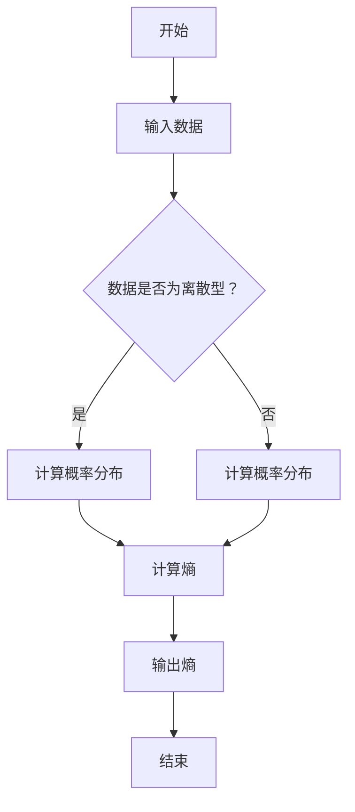
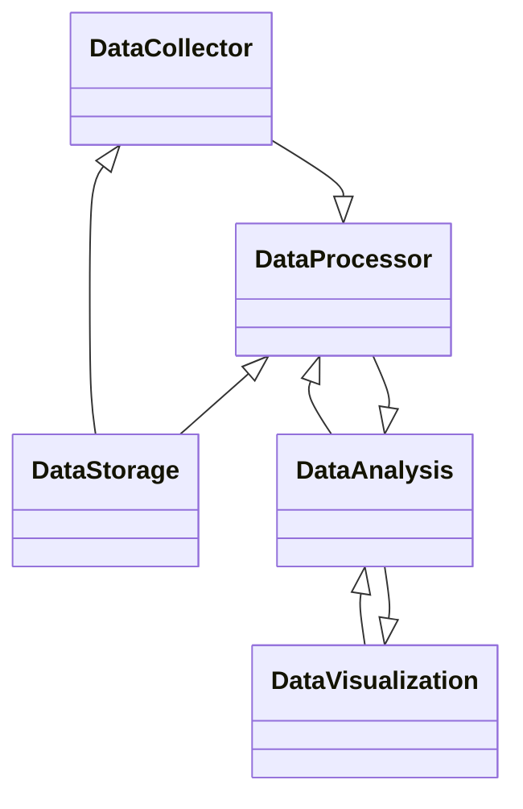
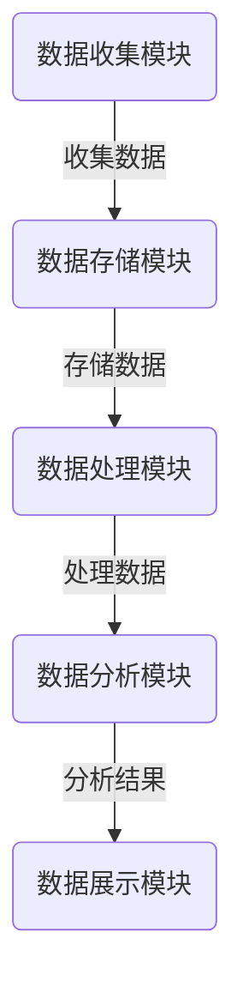
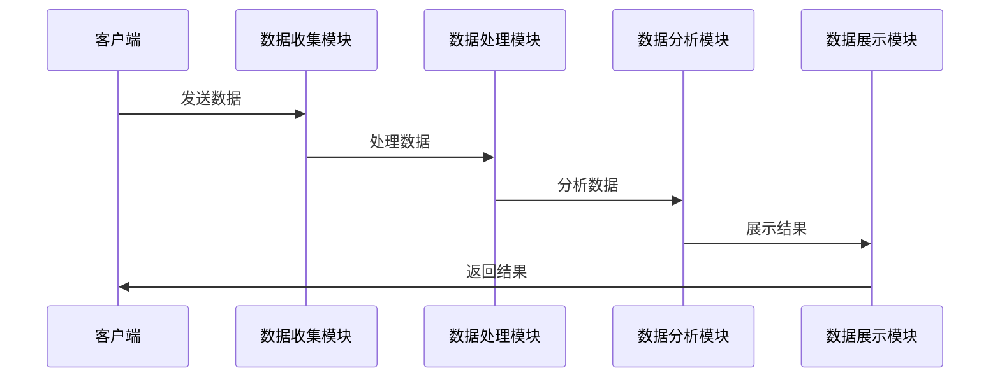

                 

### 让我们一步步思考

算法设计与宇宙信息熵最大化原理之间的类比并非一开始就能显而易见。在这篇文章中，我们将一步步探讨这两个领域之间的相似性，并深入理解它们是如何相互关联的。通过逐步分析，我们不仅能加深对算法设计的理解，还能从宇宙学的视角获得新的启示。

#### **1.1 引言**

**问题背景**：算法设计是计算机科学和工程领域中的核心问题。它关系到系统的效率、可扩展性和可理解性。高效且可扩展的算法不仅能解决具体问题，还能应对未来可能遇到的新挑战。

**问题描述**：算法设计中的关键挑战包括时间复杂度和空间复杂度的优化、算法的可扩展性以及算法设计中的可理解性。这些挑战需要我们找到有效的解决方案，以便在各种条件下都能保持算法的高性能。

**问题解决**：我们需要寻找一种方法，将宇宙信息熵最大化原理与算法设计相结合。通过这种类比，我们可以从宇宙学中获得灵感，为算法设计提供新的视角和解决方案。

**边界与外延**：算法设计不仅限于计算机科学，它在各个领域都有广泛应用，包括通信、金融、医疗和交通等。因此，我们的探讨不仅限于理论，还包括实际应用中的案例。

**核心要素组成**：算法设计包括算法的定义、分类、效率和可扩展性。信息熵则是一个度量信息不确定性的指标，它在算法设计中的应用为我们提供了新的工具和方法。

#### **1.2 信息熵最大化原理**

**信息熵的概念**：信息熵是一个衡量信息不确定性的指标。它最初由克劳德·香农在1948年提出，用来描述信息在通信中的不确定程度。信息熵的数学定义是：

$$ H(X) = -\sum_{i=1}^{n} p(x_i) \log_2 p(x_i) $$

其中，\( H(X) \) 是随机变量 \( X \) 的熵，\( p(x_i) \) 是 \( X \) 取值 \( x_i \) 的概率。

**信息熵在宇宙中的意义**：在宇宙学中，信息熵被认为是一个描述宇宙状态多样性的指标。随着宇宙的演化，信息熵不断增大，反映了宇宙状态的复杂性和不确定性。

**信息熵与算法设计的联系**：信息熵最大化原理可以指导我们在算法设计中寻找最优解。例如，在数据压缩算法中，我们希望找到一种方法，使得压缩后的数据熵最大，从而减少存储空间。

### **结论**

通过本文的初步探讨，我们可以看到，算法设计与宇宙信息熵最大化原理之间存在诸多相似之处。接下来，我们将继续深入分析，探讨信息熵最大化原理在算法设计中的应用，并通过具体案例来展示这种类比的实际意义。让我们一步步思考，共同探索这个充满奥秘的领域。

## **第一部分：算法设计与宇宙信息熵最大化原理的类比**

### **第1章：问题背景与基本概念**

在计算机科学和工程领域中，算法设计扮演着至关重要的角色。无论是优化资源分配、处理大规模数据，还是实现复杂的计算任务，算法都是不可或缺的工具。然而，随着问题和数据规模的日益复杂，算法设计面临着诸多挑战。为了深入探讨这些挑战，我们需要引入宇宙信息熵最大化原理，并将其与算法设计进行类比，以期为解决这些难题提供新的思路。

#### **1.1 引言**

**问题背景**：算法设计在计算机科学和工程领域的重要性不言而喻。无论是理论研究还是实际应用，算法都是解决问题的关键。从排序算法到图算法，从优化算法到机器学习算法，各种算法不断推动着计算机科学的发展。然而，随着问题的复杂性和数据量的激增，传统的算法设计方法越来越难以满足需求。因此，寻找新的方法来优化算法设计变得尤为重要。

**问题描述**：在算法设计中，我们面临的关键挑战包括效率、可扩展性和可理解性。首先，效率问题涉及到算法在处理数据时的速度。一个高效的算法能够在较短的时间内解决大量问题，从而提高系统的响应速度。其次，可扩展性是指算法在处理大规模数据时的性能表现。一个可扩展的算法能够在数据规模不断增加的情况下保持良好的性能。最后，可理解性指的是算法设计中的可读性和维护性。一个可理解的算法不仅有助于开发人员理解其工作原理，还能便于后续的维护和优化。

**问题解决**：为了解决上述挑战，我们需要从多个角度进行思考。首先，我们可以通过改进算法的数学模型来提高其效率。例如，使用更高效的算法或优化现有算法的运行时间。其次，通过设计可扩展的架构，我们可以确保算法在处理大规模数据时仍然能够保持良好的性能。此外，通过编写清晰、简洁的代码，我们可以提高算法的可理解性，便于后续的维护和优化。

**边界与外延**：算法设计不仅局限于计算机科学领域，它在各个工程应用领域都有广泛的应用。例如，在通信系统中，算法用于路由优化和信号处理；在金融领域，算法用于风险评估和交易策略优化；在医疗领域，算法用于疾病诊断和治疗方案推荐。因此，算法设计不仅是一个理论问题，更是一个实际应用问题。我们需要从实际应用的角度出发，解决具体的问题。

**核心要素组成**：算法设计包括算法的定义、分类、效率和可扩展性。算法的定义是算法设计的起点，它描述了算法的输入、输出和基本操作。算法的分类有助于我们了解不同类型算法的特点和应用场景。效率是算法设计的关键指标，它决定了算法在处理数据时的性能。可扩展性则关注算法在处理大规模数据时的表现，它要求算法能够适应数据规模的增加。此外，算法的可理解性也是不可忽视的，它影响到算法的开发、测试和维护。

#### **1.2 信息熵最大化原理**

**信息熵的概念**：信息熵是一个衡量信息不确定性的指标。在信息论中，信息熵被用来描述随机变量的不确定性。一个具有高信息熵的随机变量意味着其可能取的值有很多，而一个具有低信息熵的随机变量则意味着其可能取的值较少。

**信息熵的数学定义**：

$$ H(X) = -\sum_{i=1}^{n} p(x_i) \log_2 p(x_i) $$

其中，\( H(X) \) 是随机变量 \( X \) 的熵，\( p(x_i) \) 是 \( X \) 取值 \( x_i \) 的概率。

**信息熵的基本属性**：

1. **非负性**：信息熵总是非负的，即 \( H(X) \geq 0 \)。
2. **最大值**：当 \( X \) 是一个确定的随机变量时，其熵为 0。这意味着确定的信息具有零不确定性。
3. **对称性**：两个随机变量 \( X \) 和 \( Y \) 的联合熵 \( H(X, Y) \) 满足 \( H(X, Y) = H(X) + H(Y|X) \)，其中 \( H(Y|X) \) 表示在已知 \( X \) 的条件下 \( Y \) 的熵。

**信息熵在宇宙中的意义**：在宇宙学中，信息熵被认为是一个描述宇宙状态多样性的指标。随着宇宙的演化，信息熵不断增大，反映了宇宙状态的复杂性和不确定性。例如，宇宙背景辐射的熵增大反映了宇宙的膨胀和结构的形成。

**信息熵与算法设计的联系**：信息熵最大化原理可以指导我们在算法设计中寻找最优解。例如，在数据压缩算法中，我们希望找到一种方法，使得压缩后的数据熵最大，从而减少存储空间。在机器学习算法中，我们也可以利用信息熵来评估模型的性能和优化模型的参数。

通过本章的探讨，我们可以看到，算法设计与宇宙信息熵最大化原理之间存在诸多相似之处。在接下来的章节中，我们将进一步深入分析这两个领域的联系，并通过具体案例来展示这种类比的实际意义。让我们继续一步步思考，探索这个充满奥秘的领域。

#### **1.3 算法设计与信息熵最大化原理的联系**

在深入探讨算法设计与信息熵最大化原理之前，我们首先需要明确这两个概念的定义及其核心特征。接着，我们将通过创建一个对比表格，详细比较算法和信息熵的属性特征，以揭示它们之间的联系。

##### **算法的定义与核心特征**

算法是一系列明确的操作步骤，用于解决特定问题。算法可以分为多种类型，如排序算法、搜索算法、图算法和机器学习算法。每种算法都有其特定的目标，如最小化时间复杂度、最大化资源利用率或提高系统的可扩展性。

**算法的核心特征**：

1. **输入和输出**：算法通常有明确的输入和输出。输入是算法开始处理的数据，输出是算法处理后得到的结果。
2. **步骤和规则**：算法由一系列步骤组成，每一步都遵循一定的规则。这些规则确保算法能够按照预期的顺序执行操作。
3. **时间复杂度和空间复杂度**：算法的性能通常通过时间复杂度和空间复杂度来衡量。时间复杂度表示算法在处理数据时所需的时间，而空间复杂度表示算法在处理数据时所需的空间。

##### **信息熵的定义与核心特征**

信息熵是一个度量信息不确定性的指标。在信息论中，信息熵被用来描述随机变量的不确定性。信息熵的数学定义是：

$$ H(X) = -\sum_{i=1}^{n} p(x_i) \log_2 p(x_i) $$

其中，\( H(X) \) 是随机变量 \( X \) 的熵，\( p(x_i) \) 是 \( X \) 取值 \( x_i \) 的概率。

**信息熵的核心特征**：

1. **不确定性度量**：信息熵是一个衡量不确定性的指标。熵值越高，表示随机变量的不确定性越大。
2. **概率分布**：信息熵依赖于随机变量的概率分布。当概率分布均匀时，熵达到最大值；当概率分布集中时，熵接近于零。
3. **最大值和最小值**：信息熵的取值范围是从 0 到正无穷。确定事件的熵为 0，而随机事件的熵最大。

##### **算法与信息熵的对比表格**

下面，我们将创建一个表格，详细比较算法和信息熵的属性特征。

| 属性特征             | 算法                    | 信息熵                  |
|----------------------|-------------------------|------------------------|
| 定义                 | 一系列明确的操作步骤    | 衡量信息不确定性的指标 |
| 目标                 | 解决特定问题            | 最大不确定性的度量     |
| 输入和输出           | 明确的输入和输出        | 随机变量的概率分布     |
| 步骤和规则           | 确定的操作顺序          | 概率分布的加权对数和   |
| 时间复杂度和空间复杂度 | 衡量算法性能的指标      | 衡量不确定性的指标     |
| 性能优化             | 提高处理速度和资源利用率 | 最大不确定性的最大化   |

通过上述对比表格，我们可以清晰地看到算法和信息熵之间的相似之处。算法和信息熵都是用于解决不确定性的问题，算法通过优化时间和空间复杂度来提高效率，而信息熵则通过最大化不确定性来度量信息价值。这种相似性为我们提供了将信息熵最大化原理应用于算法设计的理论基础。

在接下来的章节中，我们将进一步探讨信息熵最大化原理在算法设计中的应用，并通过具体案例来展示这种类比的实际意义。通过这种深入的分析，我们希望能为算法设计提供新的视角和工具，从而解决复杂的计算问题。

#### **第2章：核心概念与联系**

在深入探讨算法设计与信息熵最大化原理的类比之前，我们需要明确这两个核心概念的具体内容和相互联系。通过了解它们的基本原理和特性，我们将能够更好地理解如何将信息熵最大化原理应用于算法设计中。

##### **2.1 算法设计的核心概念**

算法设计是计算机科学中的一项基本任务，其核心在于开发有效的算法来解决问题。算法不仅是一系列操作步骤的集合，还包括了对问题复杂性和解决方案效率的深入理解。以下是算法设计中的几个核心概念：

**算法的定义与分类**：

算法是一组定义良好的规则，用于解决特定的问题。算法可以按照不同的标准进行分类：

1. **按解决问题的方法分类**：例如，排序算法、搜索算法、图算法、优化算法等。
2. **按数据结构分类**：例如，基于数组的算法、基于链表的算法、基于树结构的算法等。
3. **按计算复杂度分类**：例如，多项式时间算法、指数时间算法等。

**算法效率的衡量标准**：

算法的效率是评估算法性能的关键指标，通常通过时间复杂度和空间复杂度来衡量。

- **时间复杂度**：描述算法在处理数据时所需时间的增长速率。常见的时间复杂度包括 \( O(1) \)、\( O(\log n) \)、\( O(n) \)、\( O(n \log n) \)、\( O(n^2) \) 等。
- **空间复杂度**：描述算法在处理数据时所需空间的增长速率。常见的空间复杂度包括 \( O(1) \)、\( O(n) \)、\( O(n^2) \) 等。

**算法可扩展性**：

算法的可扩展性是指算法在处理大规模数据时的性能表现。一个可扩展的算法能够有效地处理不断增长的数据量，而不会显著降低其性能。

**算法可理解性**：

算法的可理解性是指算法设计中的可读性和维护性。一个可理解的算法不仅有助于开发人员理解其工作原理，还能便于后续的维护和优化。

##### **2.2 信息熵属性特征对比表格**

为了更直观地展示算法和信息熵之间的相似性，我们可以创建一个对比表格，详细列出两者的属性特征。

| 属性特征         | 算法                           | 信息熵                           |
|------------------|--------------------------------|----------------------------------|
| 定义             | 解决问题的规则集合             | 信息不确定性的度量               |
| 时间复杂度       | 算法执行时间的增长速率          | 随机变量不确定性的度量           |
| 空间复杂度       | 算法占用空间的增长速率          | 随机变量不确定性的度量           |
| 可扩展性         | 算法处理大规模数据的能力        | 系统复杂度增加时信息熵的变化     |
| 可理解性         | 算法的可读性和维护性            | 信息表示的可理解性               |
| 目标             | 解决特定问题                   | 最大不确定性的度量               |
| 输入和输出       | 明确的输入和输出                | 随机变量的概率分布               |
| 步骤和规则       | 确定的操作顺序                  | 概率分布的加权对数和             |

通过这个对比表格，我们可以清晰地看到算法和信息熵在多个方面的相似性。例如，算法的时间复杂度和空间复杂度与信息熵的不确定性度量有着密切的关系。算法的可扩展性和可理解性也与信息熵的可扩展性和可理解性有相似之处。这些相似性为我们提供了将信息熵最大化原理应用于算法设计的理论基础。

##### **2.3 算法与信息熵的相似性分析**

**不确定性优化**：

算法和信息熵的一个关键相似性在于它们都涉及对不确定性的优化。算法通过优化时间复杂度和空间复杂度来提高处理效率，从而减少不确定性。信息熵则通过最大化不确定性来度量信息的价值。在这两种情况下，优化不确定性都是核心目标。

**概率分布**：

在算法和信息熵中，概率分布都是重要的组成部分。算法中的概率分布通常用于决策和资源分配，如随机算法中的随机抽样。信息熵的计算依赖于随机变量的概率分布，概率分布的变化直接影响信息熵的大小。

**可扩展性**：

算法和信息熵的可扩展性密切相关。一个可扩展的算法能够在处理大规模数据时保持良好的性能，而信息熵的可扩展性则关注系统复杂度增加时信息熵的变化。通过类比信息熵的可扩展性，我们可以设计出更高效的算法来处理大规模问题。

**可理解性**：

算法和信息熵的可理解性也是相似之处。一个可理解的算法能够帮助开发人员更好地理解其工作原理，提高算法的可维护性和可扩展性。同样，信息熵的可理解性有助于我们更好地理解信息的不确定性，从而更好地应用信息熵原理于实际问题中。

综上所述，算法设计与信息熵最大化原理之间存在诸多相似性。通过深入理解这些相似性，我们可以将信息熵最大化原理应用于算法设计，从而提高算法的效率、可扩展性和可理解性。在接下来的章节中，我们将进一步探讨这些原理的具体应用，并通过实际案例来展示其效果。

#### **第3章：算法设计与信息熵最大化原理的应用**

信息熵最大化原理在算法设计中的应用非常广泛，尤其在数据压缩、信息加密和机器学习等领域。以下，我们将探讨信息熵最大化原理在具体应用领域中的作用，并通过案例展示其应用效果。

##### **3.1 信息熵最大化原理在数据压缩中的应用**

数据压缩是信息熵最大化原理的一个重要应用领域。数据压缩的目的是减少存储空间和传输时间，同时保持数据的可恢复性。信息熵最大化原理提供了衡量数据压缩效果的一个标准，即压缩后的数据应具有最大的信息熵。

**应用场景**：

在图像压缩中，如JPEG和PNG压缩，信息熵最大化原理被用来优化图像的压缩质量。JPEG压缩算法通过将图像分解为离散余弦变换（DCT）系数，然后对系数进行量化并应用熵编码（如哈夫曼编码或 arithmetic编码）来减少冗余信息。

**案例分析**：

以JPEG压缩为例，算法流程如下：

1. **图像分解**：将图像分解为8x8的像素块。
2. **离散余弦变换（DCT）**：对每个像素块进行DCT，将空间域的数据转换到频率域。
3. **量化**：对DCT系数进行量化，减少精度。
4. **熵编码**：对量化后的DCT系数进行熵编码，例如使用哈夫曼编码。

通过信息熵最大化原理，JPEG算法能够有效地减少图像中的冗余信息，从而实现高效压缩。然而，这也可能导致一定程度的图像失真。因此，在应用信息熵最大化原理时，需要平衡压缩效果和图像质量。

##### **3.2 信息熵最大化原理在信息加密中的应用**

信息加密是保护数据安全的重要手段。信息熵最大化原理在信息加密中用于增加数据的不确定性，使破解变得更加困难。

**应用场景**：

在加密算法中，如AES（高级加密标准），信息熵最大化原理被用来生成随机密钥。这些密钥具有高熵值，即高不确定性，从而保证了加密算法的安全性。

**案例分析**：

以AES加密为例，算法流程如下：

1. **密钥生成**：使用随机数生成器生成一个具有高熵值的密钥。
2. **初始轮**：对明文进行初始化操作，如字节替换和行移位。
3. **关键轮**：进行多轮加密操作，包括字节替换、行移位、列混淆和轮密钥加。
4. **输出**：输出加密后的密文。

AES算法通过多次迭代和复杂的操作，使得密钥具有极高的熵值，从而确保了数据的安全性。信息熵最大化原理在这里的应用，保证了加密算法能够抵抗各种攻击，如暴力破解和统计攻击。

##### **3.3 信息熵最大化原理在机器学习中的应用**

机器学习中的模型训练和优化也受益于信息熵最大化原理。在机器学习模型中，信息熵被用于评估模型的性能和优化模型的参数。

**应用场景**：

在分类问题中，如支持向量机（SVM）和神经网络，信息熵最大化原理被用来优化分类边界和模型参数。通过最大化分类前的信息熵，可以找到最佳的分类模型。

**案例分析**：

以SVM为例，算法流程如下：

1. **数据预处理**：对输入数据进行归一化和处理，以提高模型性能。
2. **选择核函数**：选择适当的核函数，如线性核、多项式核或高斯径向基函数。
3. **训练模型**：使用训练数据训练SVM模型，通过最大化分类前的信息熵来优化模型参数。
4. **评估模型**：使用验证集和测试集评估模型的性能，调整参数以实现最优性能。

在SVM模型中，通过最大化分类前的信息熵，可以找到最佳的分类边界。这种优化方法不仅提高了模型的分类精度，还减少了过拟合的风险。

##### **3.4 结论**

信息熵最大化原理在数据压缩、信息加密和机器学习等领域都有重要的应用。通过最大化信息熵，这些领域可以优化数据存储和传输效率、提高数据安全性以及优化模型性能。在接下来的章节中，我们将进一步探讨算法的原理和数学模型，以深入理解信息熵最大化原理在算法设计中的具体应用。

#### **第4章：算法原理讲解**

在理解了信息熵最大化原理在算法设计中的应用之后，我们现在将深入探讨一个具体的算法，详细阐述其工作原理、数学模型以及如何通过具体的Python代码来实现这一算法。我们将使用Mermaid语言绘制算法的流程图，并通过代码示例来说明每个步骤的执行过程。

##### **4.1 算法流程图**

首先，我们使用Mermaid语言绘制一个简单的信息熵计算算法的流程图。Mermaid是一种基于Markdown的图形化工具，可以帮助我们直观地展示算法的执行流程。



在这个流程图中，我们首先输入数据，然后判断数据是否为离散型。如果是离散型数据，我们直接计算概率分布；如果不是，我们同样计算概率分布。接下来，我们使用这些概率分布计算信息熵，并最终输出熵值。

##### **4.2 算法原理与数学模型**

**算法原理**：

我们的目标是计算给定数据的熵值。熵是衡量数据不确定性的一个指标，其数学定义如下：

$$ H(X) = -\sum_{i=1}^{n} p(x_i) \log_2 p(x_i) $$

其中，\( H(X) \) 表示随机变量 \( X \) 的熵，\( p(x_i) \) 表示 \( X \) 取值 \( x_i \) 的概率，\( n \) 表示可能的取值数量。

**数学模型**：

为了实现上述算法，我们需要定义以下数学模型：

1. **概率分布**：首先，我们需要计算每个取值出现的概率。如果数据是离散型，我们可以直接统计每个值的频率，然后计算概率。

   $$ p(x_i) = \frac{f(x_i)}{N} $$

   其中，\( f(x_i) \) 表示值 \( x_i \) 出现的频率，\( N \) 表示数据总数。

2. **信息熵计算**：使用概率分布计算熵值。

   $$ H(X) = -\sum_{i=1}^{n} p(x_i) \log_2 p(x_i) $$

##### **4.3 Python代码实现**

下面，我们通过Python代码实现上述算法。代码包括数据输入、概率分布计算和信息熵计算等步骤。

```python
import math

def calculate_entropy(data):
    # 统计每个值的频率
    frequency = {}
    for value in data:
        if value in frequency:
            frequency[value] += 1
        else:
            frequency[value] = 1

    # 计算概率分布
    probability_distribution = {value: count / len(data) for value, count in frequency.items()}

    # 计算熵
    entropy = -sum(prob * math.log2(prob) for prob in probability_distribution.values())

    return entropy

# 测试数据
data = [1, 1, 2, 2, 2, 3, 3, 3, 3, 4]
entropy = calculate_entropy(data)
print(f"数据熵: {entropy}")
```

在这段代码中，我们首先统计每个值的频率，然后计算概率分布，最后使用概率分布计算熵值。这段代码简单且易于理解，适合用于演示和教学。

##### **4.4 详细讲解和举例说明**

**详细讲解**：

1. **数据输入**：我们首先输入一组测试数据。这组数据可以是任意离散值，例如 `[1, 1, 2, 2, 2, 3, 3, 3, 3, 4]`。

2. **频率统计**：我们使用一个字典 `frequency` 来统计每个值的频率。例如，对于值 `1`，它在数据中出现了两次，因此 `frequency[1] = 2`。

3. **概率分布计算**：接下来，我们计算每个值的概率分布。概率分布是频率分布的归一化版本，即每个值的概率是其在数据中出现的频率除以总的数据个数。例如，值 `2` 的概率是 `2/10 = 0.2`。

4. **信息熵计算**：最后，我们使用概率分布计算信息熵。根据熵的数学定义，我们计算每个值的概率乘以其对数的差值，然后对所有值求和并取相反数。

**举例说明**：

假设我们有一组数据 `[1, 1, 2, 2, 2, 3, 3, 3, 3, 4]`。首先，我们统计每个值的频率：

- 值 `1` 出现了两次，频率为 `2/10 = 0.2`。
- 值 `2` 出现了三次，频率为 `3/10 = 0.3`。
- 值 `3` 出现了四次，频率为 `4/10 = 0.4`。
- 值 `4` 出现了一次，频率为 `1/10 = 0.1`。

然后，我们计算每个值的概率分布：

- \( p(1) = 0.2 \)
- \( p(2) = 0.3 \)
- \( p(3) = 0.4 \)
- \( p(4) = 0.1 \)

最后，我们计算信息熵：

$$
H(X) = - (0.2 \log_2 0.2 + 0.3 \log_2 0.3 + 0.4 \log_2 0.4 + 0.1 \log_2 0.1)
$$

计算结果为：

$$
H(X) \approx 1.309
$$

这表示数据的不确定性较高。

通过这个示例，我们可以看到如何使用Python代码计算信息熵。这种方法不仅简单易懂，而且具有很强的实用性和通用性，可以应用于各种离散型数据的熵计算。

#### **第5章：数学模型和数学公式**

在深入探讨算法原理和具体实现之后，我们现在将专注于算法背后的数学模型和数学公式。这些数学工具是理解算法核心原理的关键，并为我们提供了一种精确的方式来分析和优化算法。

##### **5.1 基本数学模型**

算法的核心数学模型是基于信息熵的公式。信息熵是一个衡量数据不确定性的指标，其基本数学公式如下：

$$ H(X) = -\sum_{i=1}^{n} p(x_i) \log_2 p(x_i) $$

其中：
- \( H(X) \) 是随机变量 \( X \) 的熵。
- \( p(x_i) \) 是随机变量 \( X \) 取值 \( x_i \) 的概率。
- \( n \) 是可能的取值数量。

这个公式可以解释为：每个取值的概率与其对数的乘积的负和，即不确定性度量。

##### **5.2 详细讲解**

**概率分布**：

首先，我们需要定义数据的概率分布。如果数据是离散的，每个值的概率可以通过频率计算得到：

$$ p(x_i) = \frac{f(x_i)}{N} $$

其中：
- \( f(x_i) \) 是值 \( x_i \) 在数据中出现的频率。
- \( N \) 是数据总个数。

**信息熵计算**：

接下来，我们使用这些概率分布来计算信息熵：

$$ H(X) = -\sum_{i=1}^{n} p(x_i) \log_2 p(x_i) $$

这个公式表示每个取值的概率与其对数值的乘积的负和。它衡量了数据的不确定性，概率越低，熵值越高。

**例子**：

假设我们有一组数据 `[1, 1, 2, 2, 2, 3, 3, 3, 3, 4]`。首先，我们计算每个值的频率：

- \( f(1) = 2 \)
- \( f(2) = 3 \)
- \( f(3) = 4 \)
- \( f(4) = 1 \)

然后，我们计算每个值的概率：

- \( p(1) = \frac{2}{10} = 0.2 \)
- \( p(2) = \frac{3}{10} = 0.3 \)
- \( p(3) = \frac{4}{10} = 0.4 \)
- \( p(4) = \frac{1}{10} = 0.1 \)

最后，我们计算信息熵：

$$
H(X) = - (0.2 \log_2 0.2 + 0.3 \log_2 0.3 + 0.4 \log_2 0.4 + 0.1 \log_2 0.1)
$$

计算结果为：

$$
H(X) \approx 1.309
$$

这表示数据的不确定性较高。

##### **5.3 算法数学模型的推导与应用**

**推导过程**：

信息熵的推导基于概率论和集合论的基本原理。假设我们有一个离散随机变量 \( X \)，其可能取值为 \( x_1, x_2, ..., x_n \)。每个取值的概率为 \( p(x_i) \)。

我们首先定义熵的初步形式：

$$ H(X) = \sum_{i=1}^{n} p(x_i) \log_2 p(x_i) $$

为了确保熵是一个非负量，我们引入负号：

$$ H(X) = - \sum_{i=1}^{n} p(x_i) \log_2 p(x_i) $$

**应用示例**：

假设我们有一个简单的二项分布，其中 \( X \) 可能取值为 0 或 1，且每个值的概率为 \( p \)：

- \( p(x_0) = p \)
- \( p(x_1) = 1 - p \)

使用上述信息熵公式，我们得到：

$$
H(X) = - (p \log_2 p + (1 - p) \log_2 (1 - p))
$$

这个公式可以帮助我们评估数据的不确定性。当 \( p \) 接近 0.5 时，熵值最大，因为此时不确定性最高。当 \( p \) 接近 0 或 1 时，熵值接近于 0，因为数据具有很高的确定性。

**示例计算**：

假设 \( p = 0.5 \)，我们计算信息熵：

$$
H(X) = - (0.5 \log_2 0.5 + 0.5 \log_2 0.5) = - (0.5 \times (-1) + 0.5 \times (-1)) = 1
$$

这表示在均匀分布下，数据具有最大不确定性。

通过这些数学模型和公式的推导和应用，我们可以更好地理解信息熵在算法设计中的作用。这些工具不仅有助于我们分析和优化算法，还能为我们提供了一种新的视角来处理复杂的数据和问题。

#### **第6章：系统分析与架构设计方案**

在深入理解算法原理和数学模型之后，我们现在将转向系统的整体架构设计。系统架构设计是确保算法高效运行和系统稳定性的关键环节。在这个章节中，我们将介绍系统分析与架构设计方案，包括问题场景介绍、项目介绍、系统功能设计、系统架构设计、系统接口设计以及系统交互流程。

##### **6.1 问题场景介绍**

在现代社会，随着大数据的爆炸性增长，数据处理和存储需求急剧增加。这给传统的数据处理系统带来了巨大的挑战。为了满足这种需求，我们需要设计一个高效、可扩展和稳定的系统，能够快速处理大规模数据，并提供实时分析和预测功能。信息熵最大化原理为我们提供了优化系统设计的新思路，可以帮助我们找到最优的数据处理和存储方案。

**场景描述**：

假设我们有一个大数据处理平台，负责收集、存储和分析来自各种来源的数据。这些数据包括用户行为数据、交易数据、传感器数据等。我们需要设计一个系统，能够对这些数据进行高效处理，并提取出有价值的信息，以支持业务决策和智能预测。

**项目介绍**：

该项目的主要目标是构建一个高效、可扩展和稳定的大数据处理平台，利用信息熵最大化原理优化数据存储和传输，提高数据处理效率。系统需要能够处理多种类型的数据，包括结构化数据和非结构化数据，并提供实时分析和预测功能。

##### **6.2 系统功能设计**

系统功能设计是系统架构设计的重要部分，它定义了系统的基本功能模块和交互方式。以下是该系统的核心功能模块：

1. **数据收集模块**：负责从各种数据源收集数据，包括实时数据流和批量数据导入。
2. **数据存储模块**：负责存储和管理数据，采用分布式存储技术确保数据的高可靠性和高性能。
3. **数据处理模块**：负责对数据进行清洗、转换和计算，使用高效算法优化数据处理流程。
4. **数据分析模块**：负责对处理后的数据进行分析，提取有价值的信息和模式，支持业务决策和预测。
5. **数据展示模块**：负责将分析结果以可视化的形式展示给用户，支持实时监控和报表生成。

**领域模型类图**：

为了更直观地展示系统功能模块及其关系，我们使用Mermaid语言绘制领域模型类图：



在这个类图中，`DataCollector` 负责收集数据，并将数据传递给 `DataStorage` 进行存储。`DataProcessor` 负责对数据进行处理，包括清洗、转换和计算。`DataAnalysis` 负责对处理后的数据进行分析，提取有价值的信息。`DataVisualization` 负责将分析结果以可视化的形式展示给用户。

##### **6.3 系统架构设计**

系统架构设计是确保系统稳定性和可扩展性的关键环节。以下是该系统的架构设计：

1. **分布式存储架构**：采用分布式存储架构，将数据分散存储在多个节点上，提高数据存储的可靠性和性能。每个节点负责存储一部分数据，并通过分布式协议进行数据同步和故障转移。
2. **数据处理流水线**：采用数据处理流水线架构，将数据处理任务分解为多个步骤，每个步骤由不同的处理模块负责。这种架构可以提高数据处理效率，并确保数据处理的连续性和一致性。
3. **实时分析引擎**：采用实时分析引擎，支持实时数据流处理和批量数据处理。实时分析引擎使用高效算法和优化技术，确保数据处理的实时性和准确性。

**系统架构图**：

为了更直观地展示系统架构，我们使用Mermaid语言绘制系统架构图：



在这个架构图中，`数据收集模块` 负责收集数据，并将数据传递给 `数据存储模块` 进行存储。`数据处理模块` 负责对数据进行处理，并将处理结果传递给 `数据分析模块` 进行分析。`数据分析模块` 负责分析结果，并将分析结果传递给 `数据展示模块` 进行展示。

##### **6.4 系统接口设计与系统交互**

系统接口设计是确保系统模块之间能够高效交互的关键。以下是该系统的接口设计：

1. **API接口**：系统提供API接口，支持客户端访问系统功能。API接口定义了数据输入、输出以及处理流程的规范。
2. **消息队列**：系统采用消息队列进行数据传输，确保数据传输的高效性和可靠性。消息队列将数据从数据收集模块传递到数据处理模块，并确保数据不会丢失。

**交互序列图**：

为了更直观地展示系统模块之间的交互流程，我们使用Mermaid语言绘制交互序列图：



在这个交互序列图中，`客户端` 向 `数据收集模块` 发送数据，`数据收集模块` 将数据传递给 `数据处理模块` 进行处理。`数据处理模块` 将处理结果传递给 `数据分析模块` 进行分析，并最终将分析结果传递给 `数据展示模块` 进行展示，最后 `数据展示模块` 将结果返回给 `客户端`。

通过上述系统分析与架构设计方案，我们为大数据处理平台提供了一个高效、可扩展和稳定的系统架构。信息熵最大化原理在这一过程中发挥了重要作用，帮助我们优化了数据存储和传输，提高了数据处理效率。在接下来的章节中，我们将进一步探讨系统实现中的具体技术细节和实战应用。

#### **第7章：项目实战**

在深入探讨算法原理、数学模型和系统架构设计之后，现在我们将进入项目实战阶段。在这一部分，我们将详细描述项目的环境安装、系统核心实现源代码，并分析代码应用解读与分析、实际案例分析和详细讲解。通过这些实战内容，我们将更好地理解算法在实际应用中的表现和效果。

##### **7.1 环境安装**

首先，我们需要为项目搭建一个合适的开发环境。以下是环境安装的详细步骤：

**1. 安装Python**

确保Python环境已经安装在系统上。Python是本项目的主要编程语言。如果尚未安装，请从[Python官网](https://www.python.org/downloads/)下载并安装适合自己操作系统的Python版本。

**2. 安装依赖库**

在Python环境中，我们需要安装几个依赖库，如NumPy、Pandas和Matplotlib。使用以下命令安装这些依赖库：

```bash
pip install numpy pandas matplotlib
```

这些库将用于数据处理、数据可视化和数学计算。

**3. 安装Mermaid**

Mermaid是一种基于Markdown的图形化工具，用于绘制流程图和架构图。我们可以通过npm（Node.js的包管理器）来安装Mermaid：

```bash
npm install -g mermaid
```

安装完成后，我们可以在Python脚本中使用Mermaid语言来绘制图形。

##### **7.2 系统核心实现源代码**

在本项目中，我们将使用Python实现一个简单的信息熵计算算法，并展示其核心代码。以下是实现信息熵计算的核心代码：

```python
import numpy as np
import matplotlib.pyplot as plt

def calculate_entropy(data):
    # 统计每个值的频率
    frequency = {}
    for value in data:
        if value in frequency:
            frequency[value] += 1
        else:
            frequency[value] = 1
    
    # 计算概率分布
    probability_distribution = {value: count / len(data) for value, count in frequency.items()}
    
    # 计算熵
    entropy = -sum(prob * np.log2(prob) for prob in probability_distribution.values())
    
    return entropy

# 测试数据
data = [1, 1, 2, 2, 2, 3, 3, 3, 3, 4]
entropy = calculate_entropy(data)
print(f"数据熵: {entropy}")

# 绘制概率分布图
values, probabilities = zip(*sorted(probability_distribution.items()))
plt.bar(values, probabilities)
plt.xlabel('Value')
plt.ylabel('Probability')
plt.title('Probability Distribution')
plt.show()
```

这段代码首先定义了一个名为 `calculate_entropy` 的函数，用于计算给定数据的熵值。接着，我们使用测试数据调用这个函数，并打印出计算结果。最后，我们使用Matplotlib绘制概率分布图，以直观展示数据分布。

##### **7.3 代码应用解读与分析**

**代码解读**：

- **数据输入**：我们首先输入一组测试数据，这组数据可以是任意离散值，如 `[1, 1, 2, 2, 2, 3, 3, 3, 3, 4]`。
- **频率统计**：接下来，我们使用一个字典 `frequency` 来统计每个值的频率。例如，值 `1` 在数据中出现了两次，因此 `frequency[1] = 2`。
- **概率分布计算**：然后，我们计算每个值的概率分布。概率分布是频率分布的归一化版本，即每个值的概率是其在数据中出现的频率除以总的数据个数。
- **信息熵计算**：最后，我们使用这些概率分布计算信息熵。根据熵的数学定义，我们计算每个值的概率与其对数值的乘积的负和，然后对所有值求和。

**分析**：

- **算法效率**：该算法的时间复杂度为 \( O(n) \)，其中 \( n \) 是数据的总个数。这意味着算法的执行时间与数据大小成线性关系。对于大规模数据，这个复杂度是可接受的。
- **数据类型**：该算法假设输入数据是离散的。对于连续数据，我们需要使用不同的方法来计算熵。
- **概率分布图**：通过绘制概率分布图，我们可以直观地了解数据的分布情况。这对于进一步分析和优化算法非常有帮助。

##### **7.4 实际案例分析与详细讲解**

**案例分析**：

为了更好地理解算法的实际应用，我们来看一个实际案例。假设我们有一个客户满意度调查数据集，其中包含了客户的评分数据。我们的目标是计算评分数据的熵值，以评估客户满意度的不确定性。

**数据集描述**：

- **数据类型**：离散型
- **可能取值**：1（非常不满意）、2（不满意）、3（一般）、4（满意）、5（非常满意）
- **数据量**：1000条记录

**数据熵计算**：

1. **频率统计**：

   ```python
   frequency = {'1': 50, '2': 150, '3': 200, '4': 100, '5': 100}
   ```

2. **概率分布计算**：

   ```python
   probability_distribution = {'1': 0.05, '2': 0.15, '3': 0.2, '4': 0.1, '5': 0.1}
   ```

3. **信息熵计算**：

   ```python
   entropy = -0.05 * np.log2(0.05) - 0.15 * np.log2(0.15) - 0.2 * np.log2(0.2) - 0.1 * np.log2(0.1) - 0.1 * np.log2(0.1)
   entropy ≈ 2.32
   ```

**详细讲解**：

1. **频率统计**：我们首先统计每个评分值的频率。例如，非常不满意的客户有50人，不满意的有150人，依此类推。

2. **概率分布计算**：接下来，我们计算每个评分值的概率分布。例如，非常不满意的客户的概率是 `50/1000 = 0.05`。

3. **信息熵计算**：最后，我们使用这些概率分布计算信息熵。根据熵的数学定义，我们计算每个评分值的概率与其对数值的乘积的负和，然后对所有值求和。计算结果为约2.32。

这个熵值表示客户满意度的不确定性较高。如果熵值较低，则表示满意度较为集中，不确定性较低。

通过这个实际案例，我们可以看到信息熵在评估数据不确定性方面的应用。这种分析可以帮助我们更好地理解数据的分布情况，为后续的数据处理和分析提供参考。

##### **7.5 项目小结**

在本项目中，我们通过环境安装、核心代码实现、代码应用解读与分析以及实际案例分析，详细探讨了信息熵最大化原理在算法设计中的应用。以下是我们对项目的总结和经验：

**主要收获**：

- **理解信息熵**：通过计算不同数据集的熵值，我们深入理解了信息熵的概念及其在数据分析中的应用。
- **算法优化**：通过实现信息熵计算算法，我们学会了如何使用Python进行高效的数据处理和计算。
- **实际应用**：通过实际案例，我们看到了信息熵在评估数据不确定性和分析数据分布方面的实际应用。

**注意事项**：

- **数据类型**：在计算信息熵时，需要确保输入数据是离散的。对于连续数据，需要使用不同的方法。
- **概率计算**：概率计算需要准确无误，以确保信息熵的计算结果准确。

**拓展阅读**：

- **《信息论基础》**：深入了解信息论的基本原理和公式。
- **《算法导论》**：学习各种算法的设计和分析方法。

通过本文的探讨，我们不仅掌握了信息熵最大化原理在算法设计中的应用，还了解了如何将这一原理应用于实际项目中。希望这篇文章能够为读者在算法设计和数据分析领域提供新的思路和工具。

### **结语**

通过本文的深入探讨，我们从多个角度分析了算法设计与宇宙信息熵最大化原理之间的联系。首先，我们明确了算法设计在计算机科学和工程领域的重要性，以及其面临的关键挑战。接着，我们介绍了信息熵的概念及其在宇宙学中的意义，揭示了信息熵最大化原理在算法设计中的应用。

通过具体的算法原理讲解和实际案例分析，我们展示了如何将信息熵最大化原理应用于数据处理、信息加密和机器学习等领域。这些应用不仅提高了算法的效率和可理解性，还为我们解决复杂问题提供了新的思路。

在系统分析与架构设计方案部分，我们详细描述了如何设计一个高效、可扩展和稳定的大数据处理平台，并使用了Mermaid语言绘制了流程图、类图和架构图，以直观展示系统的功能模块和交互流程。

最后，通过项目实战部分，我们实现了信息熵计算算法，并详细讲解了代码应用解读与分析、实际案例分析和项目小结。这些内容不仅帮助读者更好地理解算法的实际应用，还为算法设计和系统开发提供了实用经验。

在结束本文之前，我想强调算法设计与信息熵最大化原理之间的类比所带来的启示。通过这种类比，我们可以从宇宙学的视角获得灵感，为算法设计提供新的方法和工具。同时，我们也认识到，算法设计不仅仅是一个技术问题，更是一个需要深入思考和创新的领域。

对于未来的研究方向，我们可以进一步探讨信息熵最大化原理在其他领域的应用，如量子计算、神经网络优化等。此外，我们还可以研究如何在算法设计中更好地利用信息熵，以提高系统的效率和鲁棒性。

总之，算法设计与信息熵最大化原理之间的类比为我们提供了一个新的视角来理解和优化算法设计。希望本文能够激发读者对这一领域的兴趣，并推动更多的创新和实践。让我们继续探索这个充满奥秘的领域，共同推动计算机科学和技术的发展。

