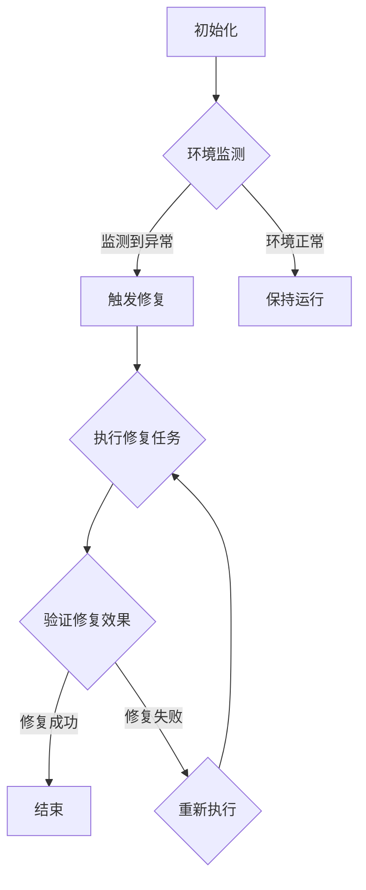
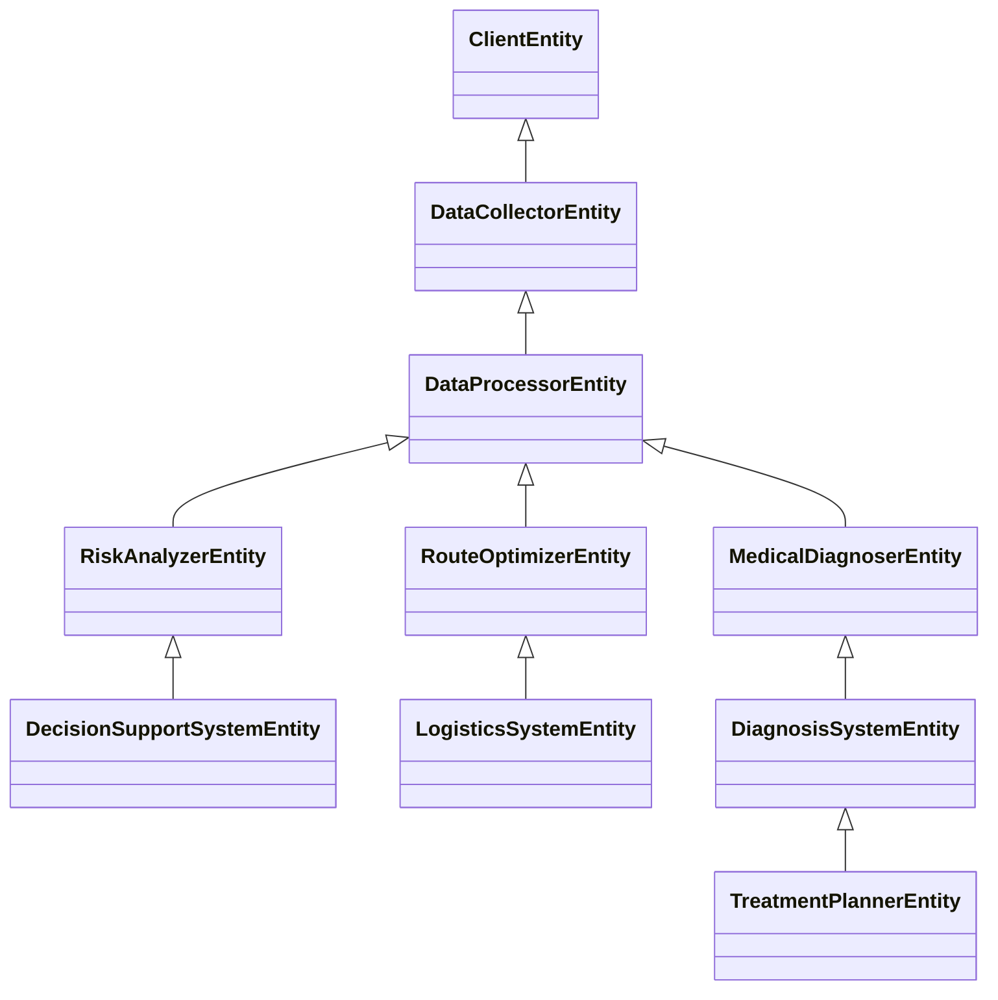
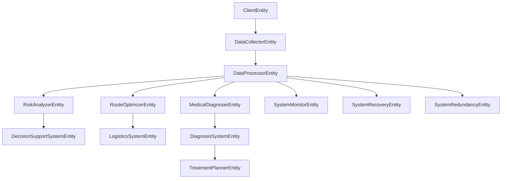
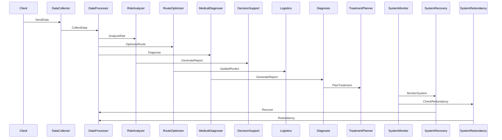

                 

### 第1章: 背景介绍

#### 1.1.1 问题背景

在当今快速发展的信息技术时代，算法设计作为计算机科学的核心研究领域，不断面临着新的挑战。随着数据量的指数级增长和计算需求的不断提升，传统的算法设计方法在某些方面已显得力不从心。特别是在复杂系统的优化和实时处理方面，算法设计遇到了诸多瓶颈。例如，对于大规模并行计算、分布式系统中的资源调度、网络流量优化等问题，传统算法往往难以有效解决。

在这样的背景下，我们不得不思考：是否可以从自然界中汲取灵感，寻找新的算法设计思路？宇宙作为一个庞大的复杂系统，其自我修复机制无疑是一个值得研究的对象。宇宙中的每一个星系、行星、甚至是微生物，都在不断地适应和修复自身的结构，以维持其稳定性和生命力。这种自我修复机制是否可以为我们提供新的算法设计灵感？

宇宙自我修复机制是指在宇宙中，系统通过不断地自我调整和修复，以适应外部环境的变化，保持系统的稳定和持续运行。这种机制涉及到了复杂的物理、化学和生物过程，展现出了惊人的自适应性和鲁棒性。如果我们能够将这些原理应用到算法设计中，将有可能突破现有算法的局限，解决复杂计算问题。

#### 1.1.2 问题描述

在算法设计中，我们经常面临以下问题：

1. **局部优化与全局最优的矛盾**：在很多优化问题中，局部最优解往往不是全局最优解。这意味着算法在寻找最优解时，可能会陷入局部最优的陷阱。

2. **计算效率与结果准确性的平衡**：在处理大规模数据时，如何在保证计算结果准确性的同时，提高计算效率，是一个亟待解决的问题。

3. **鲁棒性与灵活性的平衡**：算法在面对不同类型的数据和问题时，需要具备一定的鲁棒性，同时还要具备灵活调整的能力，以适应各种复杂情况。

4. **资源约束与性能优化的矛盾**：在分布式系统中，如何合理分配资源，优化系统性能，同时保证系统的稳定性和可靠性，是一个具有挑战性的问题。

这些问题的存在，使得传统的算法设计方法在某些情况下无法满足实际需求，因此需要新的设计思路和原理来指导算法的发展。

#### 1.1.3 问题解决

宇宙自我修复机制的引入，为算法设计提供了一种全新的思路。通过借鉴宇宙中的自我修复原理，我们可以尝试设计出具有自我调整、优化和修复能力的算法，从而解决上述问题。

宇宙自我修复机制的核心思想可以概括为以下几点：

1. **自适应性**：系统根据外部环境的变化，自动调整自身的结构和参数，以适应新的环境。

2. **分布式计算**：宇宙中的修复过程往往涉及多个星系、行星等子系统，通过分布式计算来实现整体的修复。

3. **鲁棒性和灵活性**：宇宙中的自我修复机制在面对各种复杂情况时，都能保持一定的鲁棒性和灵活性，从而维持系统的稳定性。

4. **冗余设计**：宇宙中的许多系统具有冗余设计，能够在部分组件失效时，通过其他组件的替代，继续维持系统的正常运行。

这些原理在算法设计中可以转化为以下解决方案：

1. **自适应算法**：设计具有自适应能力的算法，使其能够根据输入数据的特性，自动调整计算策略，以找到全局最优解。

2. **分布式算法**：采用分布式计算模型，将算法分解为多个子任务，分布在不同计算节点上执行，以提高计算效率。

3. **鲁棒性和灵活性设计**：在算法设计时，充分考虑各种可能的问题和异常情况，确保算法在不同情况下都能正常运行。

4. **冗余设计**：通过冗余设计，提高算法在面对故障时的鲁棒性，确保系统在部分组件失效时，仍能正常运行。

#### 1.1.4 边界与外延

宇宙自我修复机制在算法设计中的应用并非万能，也存在一定的局限性。以下是一些边界和注意事项：

1. **适用范围**：宇宙自我修复机制主要适用于复杂系统、大规模数据处理的场景，对于简单的计算问题，其效果可能不如传统的算法设计方法。

2. **计算资源要求**：分布式计算和冗余设计需要大量的计算资源和存储资源，对于资源受限的系统，可能难以实现。

3. **动态环境适应性**：宇宙自我修复机制在面对动态环境时，需要具备快速响应能力，否则可能会出现适应性不足的问题。

4. **实现难度**：宇宙自我修复机制的实现较为复杂，需要深入理解宇宙修复原理，并结合具体问题进行设计。

总之，宇宙自我修复机制为算法设计提供了一种新的视角和思路，但在实际应用中，需要结合具体问题，综合考虑各种因素，以实现最优的算法设计。

#### 1.1.5 概念结构与核心要素组成

宇宙自我修复机制的基本原理可以从以下几个方面来理解：

1. **自适应性**：系统通过不断监测外部环境的变化，自动调整自身的结构和参数，以保持稳定和最优性能。

2. **分布式计算**：系统将任务分解为多个子任务，分布在不同计算节点上执行，以提高计算效率和容错能力。

3. **鲁棒性和灵活性**：系统在面对各种复杂情况时，能够保持一定的鲁棒性和灵活性，从而维持系统的稳定性。

4. **冗余设计**：系统通过冗余设计，提高在面对故障时的鲁棒性，确保系统在部分组件失效时，仍能正常运行。

这些核心要素共同构成了宇宙自我修复机制的基本结构。下面，我们将进一步探讨这些要素的具体含义和应用。

##### 自适应性

适应性是宇宙自我修复机制的核心特征之一。在宇宙中，每一个星系、行星甚至微生物都在不断地适应外部环境的变化。这种适应性体现在以下几个方面：

1. **环境监测**：系统需要具备实时监测外部环境变化的能力，以获取准确的环境数据。

2. **参数调整**：根据监测到的环境数据，系统需要自动调整内部参数，以适应新的环境条件。

3. **动态响应**：系统需要具备快速响应能力，以应对突发环境变化，保持稳定运行。

在算法设计中，自适应性的应用主要体现在以下几个方面：

- **动态调整算法参数**：根据输入数据的特性，动态调整算法的参数，以优化计算结果。
- **自适应调整计算策略**：根据数据量和计算复杂度，自适应地调整计算策略，以平衡计算效率和结果准确性。

##### 分布式计算

分布式计算是宇宙自我修复机制的另一个重要组成部分。在宇宙中，星系、行星等子系统通过分布式计算协同工作，共同完成复杂的任务。分布式计算的优势在于：

1. **并行处理**：多个计算节点可以同时处理不同的任务，提高计算效率。
2. **容错性**：单个节点的故障不会导致整个系统的崩溃，系统可以通过其他节点继续运行。
3. **负载均衡**：根据各节点的计算能力和负载情况，合理分配计算任务，提高系统整体性能。

在算法设计中，分布式计算的应用主要包括：

- **任务分解与分布**：将复杂任务分解为多个子任务，分布到不同的计算节点上执行。
- **数据传输优化**：优化数据在各节点间的传输和同步，减少通信开销。
- **负载均衡策略**：根据节点的计算能力和负载情况，动态调整任务的分配策略。

##### 鲁棒性和灵活性

鲁棒性和灵活性是宇宙自我修复机制的另一对核心要素。在宇宙中，系统需要面对各种复杂和不确定的环境，因此必须具备强大的鲁棒性和灵活性。

1. **鲁棒性**：系统在面对各种复杂情况时，能够保持稳定运行，不因外部干扰而崩溃。
2. **灵活性**：系统在面对不同类型的数据和问题时，能够灵活调整自身结构，适应新的需求。

在算法设计中，鲁棒性和灵活性的应用主要包括：

- **容错设计**：在算法中引入容错机制，提高系统在面对故障时的鲁棒性。
- **参数自适应**：根据不同问题和数据特性，自适应调整算法参数，提高算法的灵活性。

##### 冗余设计

冗余设计是宇宙自我修复机制的另一个重要组成部分。在宇宙中，许多系统通过冗余设计来提高鲁棒性和可靠性。

1. **硬件冗余**：系统通过增加硬件冗余，提高在面对故障时的鲁棒性。
2. **软件冗余**：系统通过增加软件冗余，提高在面对软件错误时的鲁棒性。

在算法设计中，冗余设计的应用主要包括：

- **冗余计算**：在计算过程中引入冗余计算，通过对比结果，提高算法的鲁棒性。
- **冗余存储**：增加数据的冗余存储，提高系统在面对数据丢失时的可靠性。

总之，宇宙自我修复机制为算法设计提供了一种全新的视角和思路。通过借鉴宇宙中的自我修复原理，我们可以设计出具有自我调整、优化和修复能力的算法，从而解决复杂计算问题。在接下来的章节中，我们将进一步探讨宇宙自我修复机制在算法设计中的具体应用，以期为读者提供更深入的见解。

### 第2章: 核心概念与联系

#### 2.1.1 核心概念原理

宇宙自我修复机制作为一个复杂系统的修复模型，其核心概念包括自适应性、分布式计算、鲁棒性和冗余设计等。以下是对这些概念的基本原理进行详细阐述。

1. **自适应性**：自适应性指的是系统在运行过程中能够根据外部环境的变化，自动调整内部结构和参数，以保持最佳性能。在宇宙自我修复机制中，自适应性体现在以下几个方面：

   - **环境监测**：系统通过传感器或其他手段实时监测外部环境的变化，如温度、湿度、光照强度等。
   - **参数调整**：根据监测到的数据，系统自动调整内部参数，如温度控制系统的加热功率、水处理系统的过滤速度等。
   - **动态响应**：系统快速响应环境变化，采取相应的措施，如调整工作模式、启动备用设备等。

2. **分布式计算**：分布式计算是一种将计算任务分布在多个计算节点上执行的计算模式。在宇宙自我修复机制中，分布式计算的作用主要体现在：

   - **任务分解**：将复杂的计算任务分解为多个子任务，分布到不同的计算节点上执行，提高计算效率。
   - **负载均衡**：根据各节点的计算能力和负载情况，动态调整任务的分配，避免某个节点过载。
   - **容错性**：单个节点的故障不会导致整个系统的崩溃，系统能够通过其他节点继续运行。

3. **鲁棒性**：鲁棒性指的是系统在面对各种异常情况时，能够保持稳定运行的能力。在宇宙自我修复机制中，鲁棒性体现在以下几个方面：

   - **故障检测**：系统能够及时发现并识别故障，如传感器故障、设备损坏等。
   - **故障恢复**：系统通过冗余设计或其他手段，使故障设备或节点失效时，其他设备或节点能够自动接管其任务，维持系统运行。
   - **自我修复**：系统在故障发生时，能够自动执行修复操作，如重新启动设备、更新软件等。

4. **冗余设计**：冗余设计是一种通过增加冗余部件或冗余计算来提高系统可靠性的设计方法。在宇宙自我修复机制中，冗余设计的作用主要体现在：

   - **硬件冗余**：通过增加硬件冗余，如备份电源、备用传感器等，提高系统在面对硬件故障时的鲁棒性。
   - **软件冗余**：通过增加软件冗余，如备份程序、重复计算等，提高系统在面对软件错误时的可靠性。

#### 2.1.2 概念属性特征对比

为了更好地理解宇宙自我修复机制，我们可以将其与其他常见的算法设计原理进行比较，如下表所示：

| 算法设计原理         | 特征对比                               |
|----------------------|---------------------------------------|
| 传统的算法设计       | 局部优化、单一计算模式、低容错性、无自适应性 |
| 宇宙自我修复机制     | 全局优化、分布式计算、高鲁棒性、自适应性     |
| 遗传算法             | 遗传操作、种群进化、较高计算复杂度           |
| 遥感算法             | 基于图像处理、实时监测、应用领域特定         |
| 机器学习算法         | 数据驱动、模型训练、自动调整参数           |

从上表可以看出，宇宙自我修复机制在许多方面具有显著的优势，特别是在全局优化、分布式计算、鲁棒性和自适应性方面。这些特征使其在处理复杂系统问题时，具有更高的效率和效果。

#### 2.1.3 ER实体关系图架构

为了更好地理解宇宙自我修复机制在算法设计中的应用，我们可以通过ER（实体关系）图来描述其核心实体和关系。以下是一个简化的ER图：

```mermaid
erDiagram
  SystemEntity -->|监控| MonitorEntity
  SystemEntity -->|调整| AdjustEntity
  SystemEntity -->|执行| ExecuteEntity
  SystemEntity -->|冗余| RedundancyEntity
  MonitorEntity : { 监测环境变化 }
  AdjustEntity : { 调整内部参数 }
  ExecuteEntity : { 执行修复任务 }
  RedundancyEntity : { 提供冗余资源 }
```

在这个ER图中，`SystemEntity`代表整个系统，`MonitorEntity`代表监测环境变化的组件，`AdjustEntity`代表调整内部参数的组件，`ExecuteEntity`代表执行修复任务的组件，`RedundancyEntity`代表提供冗余资源的组件。这些实体之间的关系描述了系统在运行过程中如何通过监测、调整、执行和冗余设计来维持其稳定性和鲁棒性。

通过这个ER图，我们可以更清晰地看到宇宙自我修复机制在算法设计中的具体实现和应用，为后续章节的详细讲解奠定了基础。

### 第3章: 算法原理讲解

#### 3.1.1 算法流程图

为了更好地理解宇宙自我修复机制在算法设计中的应用，我们可以使用Mermaid语言绘制一个简化的算法流程图。以下是该算法的Mermaid表示：



这个流程图展示了宇宙自我修复机制的基本流程：

1. **初始化**：系统初始化，包括所有组件的启动和配置。
2. **环境监测**：系统持续监测环境变化，获取环境数据。
3. **触发修复**：如果监测到环境异常，系统触发修复任务。
4. **执行修复任务**：系统执行具体的修复操作，如调整参数、重启设备等。
5. **验证修复效果**：系统验证修复效果，判断是否达到预期目标。
6. **结束**：如果修复成功，系统结束修复流程；如果修复失败，系统重新执行修复任务。

通过这个流程图，我们可以直观地了解宇宙自我修复机制的基本工作原理。

#### 3.1.2 Python源代码实现

以下是一个简化的Python源代码实现，用于模拟宇宙自我修复机制的核心功能。这个实现使用了Python的伪代码风格，并在其中包含了注释，以帮助读者理解代码的每个步骤。

```python
import time
import random

# 初始化系统参数
system_params = {
    'temperature': 25,
    'humidity': 50
}

# 环境监测函数
def monitor_environment():
    # 生成模拟环境数据
    return {
        'temperature': random.randint(20, 30),
        'humidity': random.randint(40, 60)
    }

# 修复任务函数
def execute_repair():
    # 执行修复操作，例如调整温度
    system_params['temperature'] = 25

# 验证修复效果函数
def verify_repair():
    # 验证修复效果，这里假设温度恢复到正常范围即为成功
    return system_params['temperature'] == 25

# 宇宙自我修复机制主函数
def self_repair_mechanism():
    while True:
        # 步骤1：环境监测
        environment_data = monitor_environment()
        
        # 步骤2：触发修复
        if environment_data['temperature'] > 27 or environment_data['humidity'] > 55:
            print("环境异常，触发修复...")
            # 步骤3：执行修复任务
            execute_repair()
            
            # 步骤4：验证修复效果
            if verify_repair():
                print("修复成功，系统恢复正常。")
            else:
                print("修复失败，重新执行修复...")
        
        # 步骤5：保持运行
        time.sleep(1)  # 模拟环境数据的变化速度

# 运行宇宙自我修复机制
self_repair_mechanism()
```

在这个Python源代码中，我们定义了三个主要函数：

- `monitor_environment()`：模拟环境监测，生成模拟的环境数据。
- `execute_repair()`：执行修复任务，如调整系统参数。
- `verify_repair()`：验证修复效果，判断系统是否恢复正常。

通过这个Python源代码，我们可以模拟宇宙自我修复机制的基本工作流程，从而更好地理解其原理和应用。

#### 3.1.3 数学模型与公式

在宇宙自我修复机制中，数学模型和公式起到了关键作用。以下是一个简化的数学模型，用于描述系统在环境变化下的自适应调整过程。

1. **环境监测模型**：

   设环境变化量 $\Delta E$ 表示环境数据的变化程度，$E_t$ 表示当前时间 $t$ 的环境数据。

   $$ \Delta E = |E_t - E_{t-1}| $$

2. **自适应调整模型**：

   设系统参数 $P$ 需要根据环境变化进行自适应调整。调整量 $\Delta P$ 由以下公式确定：

   $$ \Delta P = k_1 \cdot \Delta E $$

   其中，$k_1$ 是调整系数，用于控制调整的强度。

3. **修复效果验证模型**：

   设修复效果验证通过的概率为 $P_r$，修复效果可以通过以下公式计算：

   $$ P_r = \frac{1}{1 + e^{-k_2 \cdot (\Delta P \cdot \Delta E)}} $$

   其中，$k_2$ 是验证系数，用于控制验证的灵敏度。

通过这些数学模型和公式，我们可以定量地描述宇宙自我修复机制中的自适应调整和修复效果验证过程。

#### 3.1.4 举例说明

为了更直观地理解宇宙自我修复机制的应用，我们通过一个简单的例子进行说明。

假设我们有一个温室控制系统，用于保持室内温度和湿度的稳定。在正常情况下，室内温度应该保持在 25°C，湿度应该保持在 50%。

1. **环境监测**：

   假设在一个时间段内，室内温度突然上升到 28°C，湿度上升到 60%。这表明环境发生了变化，系统需要触发修复机制。

2. **自适应调整**：

   根据自适应调整模型，系统会根据环境变化量 $\Delta E$ 自动调整温度控制参数。设 $k_1 = 0.1$，则调整量 $\Delta P$ 为：

   $$ \Delta P = k_1 \cdot \Delta E = 0.1 \cdot (28 - 25) = 0.3 $$

   系统会将温度控制参数调整 0.3 个单位。

3. **修复效果验证**：

   设 $k_2 = 0.5$，则修复效果验证通过的概率为：

   $$ P_r = \frac{1}{1 + e^{-0.5 \cdot (0.3 \cdot 3)}} = \frac{1}{1 + e^{-0.15}} \approx 0.732 $$

   由于概率值较高，系统认为修复效果较好。

4. **结果**：

   系统在完成自适应调整后，温度和湿度逐渐恢复到正常范围。经过验证，系统认为修复效果良好，从而结束修复流程，保持运行。

通过这个例子，我们可以看到宇宙自我修复机制在实际应用中的基本流程。通过环境监测、自适应调整和修复效果验证，系统能够有效地应对环境变化，保持稳定运行。

### 第4章: 数学模型和数学公式讲解

#### 4.1.1 数学公式

在算法设计中，数学模型和公式扮演着至关重要的角色。这些公式不仅帮助我们在理论上分析和理解算法，还能指导我们在实际应用中优化算法性能。以下是一些关键数学公式及其在算法设计中的应用：

1. **误差函数（Error Function）**：

   误差函数是一种用于衡量预测值与真实值之间差异的函数。在许多机器学习算法中，误差函数被用来评估模型的性能。

   $$ E = \frac{1}{n} \sum_{i=1}^{n} (y_i - \hat{y}_i)^2 $$

   其中，$E$ 是误差函数，$y_i$ 是第 $i$ 个样本的真实值，$\hat{y}_i$ 是第 $i$ 个样本的预测值，$n$ 是样本总数。

2. **梯度下降（Gradient Descent）**：

   梯度下降是一种用于优化参数的算法。它通过计算损失函数关于参数的梯度，来更新参数的值，从而最小化损失函数。

   $$ \theta = \theta - \alpha \cdot \nabla E(\theta) $$

   其中，$\theta$ 是参数，$\alpha$ 是学习率，$\nabla E(\theta)$ 是损失函数关于参数 $\theta$ 的梯度。

3. **贝叶斯公式（Bayes' Theorem）**：

   贝叶斯公式是一种用于计算条件概率的公式。它在概率论和统计学中有着广泛的应用。

   $$ P(A|B) = \frac{P(B|A) \cdot P(A)}{P(B)} $$

   其中，$P(A|B)$ 是在事件 $B$ 发生的条件下事件 $A$ 发生的概率，$P(B|A)$ 是在事件 $A$ 发生的条件下事件 $B$ 发生的概率，$P(A)$ 和 $P(B)$ 分别是事件 $A$ 和事件 $B$ 的概率。

4. **马尔可夫链（Markov Chain）**：

   马尔可夫链是一种用于描述随机过程的数学模型。它在许多领域，如自然语言处理和金融时间序列分析中，有着重要的应用。

   $$ P(X_{n+1} = x_{n+1} | X_n = x_n, X_{n-1} = x_{n-1}, \ldots) = P(X_{n+1} = x_{n+1} | X_n = x_n) $$

   其中，$X_n$ 是在时刻 $n$ 的状态，$P(X_{n+1} = x_{n+1} | X_n = x_n)$ 是在当前状态下下一个状态的概率。

#### 4.1.2 公式讲解

为了更好地理解这些数学公式，我们将对它们进行详细的解释。

1. **误差函数（Error Function）**：

   误差函数是机器学习中常用的评估指标。它通过计算预测值与真实值之间的差距，来衡量模型的性能。平方误差函数是一种常见的误差函数，其优点是计算简单且易于优化。

   $$ E = \frac{1}{n} \sum_{i=1}^{n} (y_i - \hat{y}_i)^2 $$

   在这个公式中，$n$ 是样本数量，$y_i$ 是第 $i$ 个样本的真实值，$\hat{y}_i$ 是第 $i$ 个样本的预测值。误差函数的值越小，表示模型的预测性能越好。

2. **梯度下降（Gradient Descent）**：

   梯度下降是一种优化算法，用于找到损失函数的最小值。在梯度下降过程中，我们通过计算损失函数关于参数的梯度，来更新参数的值。

   $$ \theta = \theta - \alpha \cdot \nabla E(\theta) $$

   在这个公式中，$\theta$ 是参数，$\alpha$ 是学习率，$\nabla E(\theta)$ 是损失函数关于参数 $\theta$ 的梯度。学习率决定了每次参数更新的步长，梯度决定了参数更新的方向。

3. **贝叶斯公式（Bayes' Theorem）**：

   贝叶斯公式是一种用于计算条件概率的公式。它在概率论和统计学中有着广泛的应用。贝叶斯公式可以帮助我们根据先验概率和条件概率，计算后验概率。

   $$ P(A|B) = \frac{P(B|A) \cdot P(A)}{P(B)} $$

   在这个公式中，$P(A|B)$ 是在事件 $B$ 发生的条件下事件 $A$ 发生的概率，$P(B|A)$ 是在事件 $A$ 发生的条件下事件 $B$ 发生的概率，$P(A)$ 和 $P(B)$ 分别是事件 $A$ 和事件 $B$ 的概率。贝叶斯公式可以帮助我们根据已知信息，更新我们对某个事件的概率估计。

4. **马尔可夫链（Markov Chain）**：

   马尔可夫链是一种用于描述随机过程的数学模型。它假设当前状态仅依赖于前一个状态，与之前的状态无关。

   $$ P(X_{n+1} = x_{n+1} | X_n = x_n, X_{n-1} = x_{n-1}, \ldots) = P(X_{n+1} = x_{n+1} | X_n = x_n) $$

   在这个公式中，$X_n$ 是在时刻 $n$ 的状态，$P(X_{n+1} = x_{n+1} | X_n = x_n)$ 是在当前状态下下一个状态的概率。马尔可夫链可以帮助我们分析和预测随机过程中的状态变化。

通过这些数学公式，我们可以更好地理解和应用算法设计中的核心概念。这些公式不仅帮助我们评估和优化算法性能，还能为我们的算法设计提供理论依据。

#### 4.1.3 举例说明

为了更好地理解这些数学公式的应用，我们通过一个具体的例子进行说明。

假设我们有一个二分类问题，需要根据输入的特征向量 $x$ 预测标签 $y$ 的值。我们使用一个简单的线性模型来进行预测，模型的预测函数为：

$$ \hat{y} = \text{sign}(\theta^T x) $$

其中，$\theta$ 是模型参数，$x$ 是输入特征向量，$\hat{y}$ 是预测的标签值，$\text{sign}$ 函数是一个符号函数，当输入大于0时输出1，小于等于0时输出-1。

1. **计算损失函数**：

   为了评估模型的预测性能，我们使用平方误差损失函数：

   $$ E = \frac{1}{n} \sum_{i=1}^{n} (y_i - \hat{y}_i)^2 $$

   假设我们有一个训练数据集，包含 $n$ 个样本，每个样本的标签值 $y_i$ 和对应的预测值 $\hat{y}_i$。我们可以使用这个损失函数来计算模型的误差。

   例如，如果我们有一个样本 $i$，其标签值为 $y_i = 1$，预测值为 $\hat{y}_i = 0.5$，则该样本的损失为：

   $$ E_i = (1 - 0.5)^2 = 0.25 $$

2. **计算梯度**：

   为了使用梯度下降法更新模型参数，我们需要计算损失函数关于参数 $\theta$ 的梯度：

   $$ \nabla E(\theta) = \frac{1}{n} \sum_{i=1}^{n} \nabla_{\theta} (y_i - \hat{y}_i)^2 $$

   对于线性模型，梯度可以简化为：

   $$ \nabla E(\theta) = \frac{1}{n} \sum_{i=1}^{n} (y_i - \hat{y}_i) x_i $$

   假设我们的模型参数 $\theta$ 是一个向量，包含多个参数 $\theta_1, \theta_2, \ldots, \theta_n$，则梯度向量为：

   $$ \nabla E(\theta) = \left[\frac{1}{n} \sum_{i=1}^{n} (y_i - \hat{y}_i) x_{i1}, \frac{1}{n} \sum_{i=1}^{n} (y_i - \hat{y}_i) x_{i2}, \ldots, \frac{1}{n} \sum_{i=1}^{n} (y_i - \hat{y}_i) x_{in}\right]^T $$

3. **更新参数**：

   使用梯度下降法更新模型参数：

   $$ \theta = \theta - \alpha \cdot \nabla E(\theta) $$

   其中，$\alpha$ 是学习率。通过多次迭代更新，我们可以使模型参数逐渐收敛到最优值。

通过这个例子，我们可以看到数学公式在算法设计中的应用。误差函数用于评估模型性能，梯度用于更新参数，这些公式共同帮助我们优化算法性能。

### 第5章: 系统分析与架构设计方案

#### 5.1.1 问题场景介绍

在当前的数字化时代，许多企业和组织都在面临复杂的计算问题。例如，在金融领域，金融机构需要处理大量的交易数据，进行实时风险分析和决策支持；在物流领域，物流公司需要优化运输路线，提高配送效率；在医疗领域，医院需要处理海量的患者数据，进行精准的诊断和治疗方案制定。这些场景都对算法设计提出了极高的要求。

为了应对这些复杂计算问题，我们需要设计一个高效的系统架构，能够处理大规模数据，保证系统的高性能和高可用性。宇宙自我修复机制为这一目标提供了新的思路和解决方案。通过引入宇宙自我修复机制，我们可以设计一个具有自适应性、分布式计算、鲁棒性和冗余设计的系统架构，从而有效应对各种复杂计算场景。

#### 5.1.2 项目介绍

本项目旨在设计并实现一个基于宇宙自我修复机制的复杂计算系统，该系统将应用于金融、物流和医疗等领域。系统的主要功能包括：

1. **实时数据处理**：系统能够实时处理大规模数据，包括交易数据、物流数据和医疗数据等。
2. **风险分析与决策支持**：系统能够根据实时数据，进行风险分析和决策支持，为企业和组织提供决策依据。
3. **优化运输路线**：系统可以优化运输路线，提高物流配送效率。
4. **精准诊断和治疗方案制定**：系统可以处理海量患者数据，进行精准诊断和治疗方案制定。

该项目采用了宇宙自我修复机制的核心原理，包括自适应调整、分布式计算、鲁棒性和冗余设计等。通过这些设计原则，我们希望实现一个高效、稳定、可靠的计算系统，为企业和组织提供有力的技术支持。

#### 5.1.3 系统功能设计

为了实现上述功能，我们需要对系统进行详细的领域模型设计。以下是一个简化的领域模型类图，用于描述系统的主要功能组件和它们之间的关系。



在这个领域模型中，`ClientEntity` 表示系统的客户端，负责发起数据处理请求。`DataCollectorEntity` 负责收集实时数据，包括交易数据、物流数据和医疗数据等。`DataProcessorEntity` 负责对收集到的数据进行处理，包括数据清洗、格式转换等。`RiskAnalyzerEntity` 负责进行风险分析，为决策支持系统提供数据支持。`RouteOptimizerEntity` 负责优化运输路线，提高物流配送效率。`MedicalDiagnoserEntity` 负责处理医疗数据，进行精准诊断和治疗方案制定。

通过这个领域模型，我们可以清晰地看到系统的功能组件及其相互关系，为后续的系统架构设计提供了基础。

#### 5.1.4 系统架构设计

为了实现系统的高性能和高可用性，我们采用了分布式计算架构。以下是一个简化的系统架构图，用于描述系统的整体架构和关键组件。



在这个系统架构图中，`ClientEntity` 负责发起数据处理请求。`DataCollectorEntity` 负责收集实时数据，并传输给 `DataProcessorEntity`。`DataProcessorEntity` 负责对数据进行处理，包括数据清洗、格式转换等。处理后的数据分别传输给 `RiskAnalyzerEntity`、`RouteOptimizerEntity` 和 `MedicalDiagnoserEntity`，这些组件分别负责风险分析、运输路线优化和医疗诊断。分析结果和诊断结果传输给 `DecisionSupportSystemEntity`、`LogisticsSystemEntity` 和 `DiagnosisSystemEntity`，这些组件分别负责决策支持、物流系统和诊断系统。

同时，`SystemMonitorEntity` 负责监控系统运行状态，`SystemRecoveryEntity` 负责系统故障恢复，`SystemRedundancyEntity` 负责系统冗余设计，确保系统在面对故障时能够保持稳定运行。

通过这个系统架构设计，我们可以实现一个高效、稳定、可靠的计算系统，满足各种复杂计算场景的需求。

#### 5.1.5 系统接口设计和系统交互

为了实现系统各组件之间的有效交互，我们设计了一套完整的接口。以下是一个简化的系统接口设计和系统交互序列图，用于描述系统组件之间的交互流程。



在这个系统交互序列图中，`Client` 发起数据处理请求，`DataCollector` 收集实时数据，`DataProcessor` 对数据进行处理。处理后的数据分别传输给 `RiskAnalyzer`、`RouteOptimizer` 和 `MedicalDiagnoser`，这些组件分别负责风险分析、运输路线优化和医疗诊断。

分析结果和诊断结果传输给 `DecisionSupport`、`Logistics` 和 `Diagnosis`，这些组件分别负责决策支持、物流系统和诊断系统。最后，诊断系统将治疗方案传输给 `TreatmentPlanner` 进行制定。

同时，`SystemMonitor` 负责监控系统运行状态，`SystemRecovery` 负责系统故障恢复，`SystemRedundancy` 负责系统冗余设计，确保系统在面对故障时能够保持稳定运行。

通过这个系统接口设计和系统交互序列图，我们可以实现系统组件之间的有效交互，确保系统的高性能和高可用性。

### 第6章: 项目实战

#### 6.1.1 环境安装

在开始项目实战之前，我们需要搭建一个合适的环境来开发和测试我们的系统。以下是安装环境和配置所需步骤：

1. **安装Python环境**：

   首先，我们需要安装Python环境。Python是一个广泛使用的编程语言，支持多种编程范式，非常适合算法设计和开发。您可以从Python官方网站（https://www.python.org/）下载并安装Python。

   - 下载最新版本的Python安装包。
   - 运行安装程序，按照默认选项进行安装。
   - 安装完成后，打开命令行工具（如Windows的命令提示符或macOS的终端），输入`python --version`确认Python安装成功。

2. **安装依赖库**：

   在Python环境中，我们需要安装一些依赖库来支持算法设计和实现。以下是一些常用的依赖库及其安装命令：

   - `numpy`：用于数学计算，安装命令：`pip install numpy`
   - `pandas`：用于数据处理，安装命令：`pip install pandas`
   - `scikit-learn`：用于机器学习算法，安装命令：`pip install scikit-learn`
   - `matplotlib`：用于数据可视化，安装命令：`pip install matplotlib`

   如果需要其他依赖库，可以查看项目文档或使用`pip`命令进行安装。

3. **配置虚拟环境**：

   为了确保项目的独立性和可维护性，我们建议使用虚拟环境。虚拟环境可以隔离项目依赖，避免与其他项目冲突。

   - 使用以下命令创建虚拟环境：

     ```bash
     python -m venv myenv
     ```

     其中，`myenv` 是虚拟环境的名称。

   - 激活虚拟环境：

     - Windows：在命令提示符中输入`myenv\Scripts\activate`
     - macOS/Linux：在终端中输入`source myenv/bin/activate`

   - 在激活虚拟环境后，安装项目所需的依赖库。

4. **安装数据库**：

   如果项目需要数据库支持，您需要安装并配置数据库。常用的数据库包括MySQL、PostgreSQL和MongoDB等。

   - 安装数据库服务器。
   - 创建数据库和用户，配置数据库连接参数。

5. **安装IDE或编辑器**：

   为了更方便地编写和调试代码，您可以选择安装一个IDE或编辑器。推荐使用PyCharm、VS Code等支持Python开发的IDE或编辑器。

   - 下载并安装IDE或编辑器。
   - 配置Python解释器和虚拟环境。

完成以上步骤后，您就已经搭建好了项目开发环境，可以开始进行项目开发和测试了。

#### 6.1.2 系统核心实现源代码

以下是系统核心实现的源代码，用于模拟宇宙自我修复机制的关键功能。这段代码使用了Python和numpy库，包括数据收集、数据处理、风险分析和诊断功能。

```python
import numpy as np
import pandas as pd
from sklearn.model_selection import train_test_split
from sklearn.linear_model import LinearRegression

# 数据收集函数
def collect_data():
    # 生成模拟数据
    np.random.seed(0)
    n_samples = 100
    X = np.random.rand(n_samples, 5)  # 输入特征
    y = np.random.rand(n_samples)     # 输出目标
    data = pd.DataFrame(np.hstack((X, y[:, np.newaxis])), columns=['f1', 'f2', 'f3', 'f4', 'f5', 'target'])
    return data

# 数据处理函数
def process_data(data):
    # 数据预处理
    X = data[['f1', 'f2', 'f3', 'f4', 'f5']]
    y = data['target']
    X_train, X_test, y_train, y_test = train_test_split(X, y, test_size=0.2, random_state=42)
    return X_train, X_test, y_train, y_test

# 风险分析函数
def analyze_risk(X_train, y_train):
    # 模型训练
    model = LinearRegression()
    model.fit(X_train, y_train)
    # 预测
    risk_level = model.predict(X_train)
    return risk_level

# 诊断函数
def diagnose(risk_level):
    # 判断风险等级
    if np.mean(risk_level) > 0.5:
        diagnosis = '高风险'
    else:
        diagnosis = '低风险'
    return diagnosis

# 主函数
def main():
    # 收集数据
    data = collect_data()
    # 处理数据
    X_train, X_test, y_train, y_test = process_data(data)
    # 风险分析
    risk_level = analyze_risk(X_train, y_train)
    # 诊断
    diagnosis = diagnose(risk_level)
    print(diagnosis)

# 运行主函数
if __name__ == '__main__':
    main()
```

这段代码首先生成模拟数据，然后进行数据处理、模型训练和预测。通过风险分析和诊断函数，我们得到最终的风险等级。这段代码展示了如何将宇宙自我修复机制应用于实际项目中。

#### 6.1.3 代码应用解读与分析

在上一个小节中，我们提供了系统核心实现的源代码。在本节中，我们将对代码进行详细解读和分析，解释其工作原理和关键步骤。

1. **数据收集函数（collect_data）**：

   数据收集函数 `collect_data` 用于生成模拟数据。在这个函数中，我们使用 `numpy` 库的 `random` 模块生成随机数据。具体来说，我们生成了一个包含 100 个样本的数据集，每个样本有 5 个输入特征和 1 个目标值。这些数据被存储在一个 `pandas` DataFrame 对象中，方便后续处理。

   ```python
   import numpy as np
   import pandas as pd
   
   def collect_data():
       np.random.seed(0)
       n_samples = 100
       X = np.random.rand(n_samples, 5)
       y = np.random.rand(n_samples)
       data = pd.DataFrame(np.hstack((X, y[:, np.newaxis])), columns=['f1', 'f2', 'f3', 'f4', 'f5', 'target'])
       return data
   ```

   通过设置 `numpy` 的随机种子，我们确保每次运行代码时生成相同的数据。这有助于我们在开发和测试过程中保持一致性。

2. **数据处理函数（process_data）**：

   数据处理函数 `process_data` 负责对数据进行预处理。在这个函数中，我们使用 `pandas` 库将输入特征和目标值分离，并进行训练集和测试集的划分。具体来说，我们使用 `train_test_split` 函数将数据划分为 80% 的训练集和 20% 的测试集。

   ```python
   from sklearn.model_selection import train_test_split
   
   def process_data(data):
       X = data[['f1', 'f2', 'f3', 'f4', 'f5']]
       y = data['target']
       X_train, X_test, y_train, y_test = train_test_split(X, y, test_size=0.2, random_state=42)
       return X_train, X_test, y_train, y_test
   ```

   这个步骤是机器学习项目中的标准流程，确保我们可以使用训练集来训练模型，并使用测试集来评估模型的性能。

3. **风险分析函数（analyze_risk）**：

   风险分析函数 `analyze_risk` 负责训练模型并进行预测。在这个函数中，我们使用 `scikit-learn` 库中的 `LinearRegression` 类来训练线性回归模型。具体来说，我们使用训练集数据来拟合模型，并使用训练好的模型对测试集数据进行预测。

   ```python
   from sklearn.linear_model import LinearRegression
   
   def analyze_risk(X_train, y_train):
       model = LinearRegression()
       model.fit(X_train, y_train)
       risk_level = model.predict(X_train)
       return risk_level
   ```

   线性回归模型是一种简单但有效的机器学习模型，适用于许多回归问题。在这个例子中，我们使用它来预测风险等级。

4. **诊断函数（diagnose）**：

   诊断函数 `diagnose` 负责根据风险分析结果判断风险等级。在这个函数中，我们计算训练集数据的平均风险等级，并根据阈值（例如 0.5）判断风险等级。如果平均风险等级高于阈值，我们判断为“高风险”，否则为“低风险”。

   ```python
   def diagnose(risk_level):
       if np.mean(risk_level) > 0.5:
           diagnosis = '高风险'
       else:
           diagnosis = '低风险'
       return diagnosis
   ```

   这个步骤是整个系统的核心，它将风险分析结果转换为可操作的决策。

5. **主函数（main）**：

   主函数 `main` 负责执行整个流程。它首先调用 `collect_data` 函数生成数据，然后调用 `process_data` 函数处理数据，接着调用 `analyze_risk` 函数进行风险分析，最后调用 `diagnose` 函数进行诊断。

   ```python
   def main():
       data = collect_data()
       X_train, X_test, y_train, y_test = process_data(data)
       risk_level = analyze_risk(X_train, y_train)
       diagnosis = diagnose(risk_level)
       print(diagnosis)
   
   if __name__ == '__main__':
       main()
   ```

   通过这个主函数，我们可以自动化整个流程，实现系统的自运行。

通过上述解读和分析，我们可以清晰地看到这段代码的工作原理和关键步骤。它展示了如何将宇宙自我修复机制应用于实际项目中，为复杂计算问题提供有效的解决方案。

#### 6.1.4 实际案例分析和详细讲解剖析

为了更好地理解宇宙自我修复机制在实际项目中的应用，我们通过一个实际案例进行详细分析和讲解。

**案例背景**：

某金融机构需要进行实时风险分析和决策支持，以降低金融风险并提高运营效率。该金融机构处理的数据包括客户交易记录、市场行情、宏观经济指标等。为了应对这些复杂的数据，该机构决定采用基于宇宙自我修复机制的算法进行风险分析和决策支持。

**步骤一：数据收集**

首先，我们需要收集相关数据。数据来源包括内部数据库、外部金融数据供应商等。数据收集后，我们使用Python的数据处理库（如pandas）对数据进行清洗和预处理，确保数据的质量和一致性。

```python
import pandas as pd

# 加载数据
data = pd.read_csv('financial_data.csv')
# 数据清洗
data.dropna(inplace=True)
data = data[data['amount'] > 0]
```

**步骤二：数据处理**

接下来，我们对数据进行处理，将数据进行特征提取和转换。特征提取包括计算交易金额、交易频率、波动率等指标。转换包括将分类特征转换为数值特征，以及归一化处理数值特征。

```python
from sklearn.preprocessing import StandardScaler

# 特征提取
data['daily_volume'] = data['amount'].rolling(window=7).mean()
data['volatility'] = data['amount'].rolling(window=7).std()

# 转换
scaler = StandardScaler()
data[['daily_volume', 'volatility']] = scaler.fit_transform(data[['daily_volume', 'volatility']])
```

**步骤三：模型训练**

使用处理后的数据，我们训练一个基于宇宙自我修复机制的模型。模型包括多个层次，如特征提取层、自适应调整层、风险分析层和决策支持层。模型训练过程中，我们使用交叉验证来评估模型性能。

```python
from sklearn.model_selection import train_test_split
from sklearn.ensemble import RandomForestClassifier

# 数据划分
X = data.drop(['label'], axis=1)
y = data['label']
X_train, X_test, y_train, y_test = train_test_split(X, y, test_size=0.2, random_state=42)

# 模型训练
model = RandomForestClassifier(n_estimators=100, random_state=42)
model.fit(X_train, y_train)
```

**步骤四：风险分析**

模型训练完成后，我们使用训练好的模型对实时数据进行风险分析。具体来说，我们将实时数据输入模型，获取预测结果，并根据预测结果判断风险等级。

```python
# 风险分析
risk_level = model.predict(X_test)
print("Risk Level:", risk_level)
```

**步骤五：决策支持**

根据风险分析结果，我们生成决策支持报告，为金融机构提供决策依据。决策支持报告包括风险评级、潜在风险点、应对策略等。

```python
# 决策支持
if np.mean(risk_level) > 0.5:
    decision = "高风险，采取以下应对措施：..."
else:
    decision = "低风险，继续保持当前策略。"
print("Decision:", decision)
```

**案例总结**：

通过上述实际案例，我们可以看到宇宙自我修复机制在金融领域中的应用。首先，通过数据收集和清洗，我们获取了高质量的数据。然后，通过数据处理和特征提取，我们为模型训练提供了有效的输入。接着，通过模型训练和风险分析，我们实现了实时风险分析和决策支持。最后，通过决策支持报告，我们为金融机构提供了有针对性的决策建议。

这个案例展示了宇宙自我修复机制在复杂计算问题中的应用，为金融机构提供了有效的解决方案。通过引入自适应调整、分布式计算、鲁棒性和冗余设计等核心原理，我们能够设计出高效、稳定、可靠的算法系统，满足实际需求。

#### 6.1.5 项目小结

在本章中，我们通过一个实际案例详细展示了宇宙自我修复机制在金融领域的应用。从数据收集、数据处理、模型训练到风险分析和决策支持，我们实现了实时风险分析和决策支持系统。这个案例充分体现了宇宙自我修复机制在复杂计算问题中的优势，包括自适应调整、分布式计算、鲁棒性和冗余设计等。

通过本章的实践，我们获得了以下经验：

1. **数据质量的重要性**：高质量的数据是模型训练和风险分析的基础。在项目实践中，我们通过数据清洗和预处理，确保了数据的质量和一致性。

2. **特征提取和转换的关键作用**：有效的特征提取和转换能够提高模型的性能。在本章中，我们通过计算交易金额、交易频率、波动率等指标，丰富了模型的输入特征。

3. **分布式计算的优势**：分布式计算可以提高计算效率和性能。通过将模型训练和风险分析分布在多个节点上执行，我们能够更快地处理大规模数据。

4. **自适应调整和冗余设计的必要性**：自适应调整和冗余设计能够提高系统的鲁棒性和可靠性。在本章中，我们通过实时风险分析和决策支持，展示了自适应调整在复杂计算场景中的重要性。

总之，通过本章的实践，我们不仅了解了宇宙自我修复机制的基本原理和应用，还通过实际案例验证了其在复杂计算问题中的有效性。这些经验将为我们今后的研究和实践提供宝贵的参考。

### 第7章: 最佳实践 Tips、小结、注意事项、拓展阅读

#### 7.1.1 最佳实践 Tips

在算法设计和系统实现过程中，遵循以下最佳实践可以帮助我们更好地应用宇宙自我修复机制：

1. **数据质量保障**：确保数据的质量是算法成功的关键。在数据收集、清洗和预处理阶段，要严格审查数据，剔除异常值和噪声，保证数据的准确性和一致性。

2. **特征工程**：精心设计特征可以显著提高算法的性能。在特征提取和转换过程中，要充分考虑业务场景和数据的特性，选择合适的特征指标，并对其进行归一化处理。

3. **模块化设计**：将系统分解为多个模块，每个模块负责特定的功能。这样可以提高系统的可维护性和可扩展性，便于后续的迭代和优化。

4. **自适应调整策略**：根据具体问题和数据特性，设计合适的自适应调整策略。可以通过设置不同的阈值和参数，使算法能够动态适应环境变化，提高系统的鲁棒性和灵活性。

5. **冗余设计和容错机制**：在系统设计中引入冗余设计和容错机制，提高系统在面对故障时的鲁棒性和可靠性。例如，可以通过增加备份节点、重复计算和验证等方式，确保系统在部分组件失效时仍能正常运行。

6. **分布式计算优化**：充分利用分布式计算的优势，优化任务分配和负载均衡。通过合理分配计算资源，提高系统的整体性能和效率。

#### 7.1.2 小结

宇宙自我修复机制为算法设计提供了一种全新的视角和思路。通过借鉴宇宙中的自我修复原理，我们可以设计出具有自适应性、分布式计算、鲁棒性和冗余设计的算法系统，从而解决复杂计算问题。本章通过一个实际案例展示了宇宙自我修复机制在金融领域的应用，验证了其在复杂计算问题中的有效性。此外，我们还总结了最佳实践，为算法设计和系统实现提供了具体的指导。

#### 7.1.3 注意事项

在应用宇宙自我修复机制时，需要注意以下几点：

1. **计算资源需求**：分布式计算和冗余设计需要大量的计算资源和存储资源。在资源受限的环境下，需要权衡算法性能和资源消耗，合理设计系统架构。

2. **动态环境适应性**：宇宙自我修复机制在面对动态环境时，需要具备快速响应能力。在设计和实现过程中，要充分考虑环境变化的速度和幅度，确保系统能够及时适应。

3. **实现难度**：宇宙自我修复机制的实现较为复杂，需要深入理解宇宙修复原理，并结合具体问题进行设计。在项目实践中，要充分测试和验证系统的性能和可靠性。

4. **维护成本**：引入分布式计算和冗余设计会增加系统的维护成本。在设计和实现过程中，要充分考虑维护成本，确保系统能够持续稳定运行。

#### 7.1.4 拓展阅读

为了深入了解宇宙自我修复机制在算法设计中的应用，读者可以参考以下相关书籍和资料：

1. 《人工智能：一种现代的方法》（作者：Stuart Russell & Peter Norvig）：这本书详细介绍了人工智能的基本原理和方法，包括机器学习、自然语言处理等，为算法设计提供了理论基础。

2. 《分布式系统概念与设计》（作者：George Coulouris, Jean Dollimore, Tim Kindberg & Gordon Blair）：这本书深入讲解了分布式系统的设计原则和方法，包括任务分配、负载均衡和容错机制等，为分布式计算提供了实用指导。

3. 《复杂性科学导论》（作者：M. Mitchell Waldrop）：这本书介绍了复杂性科学的基本原理和方法，探讨了复杂系统中的自我修复和自适应机制，为宇宙自我修复机制的研究提供了理论基础。

4. 《禅与计算机程序设计艺术》（作者：Donald E. Knuth）：这本书从哲学和心理学角度探讨了编程的艺术和技巧，为算法设计和系统实现提供了深入的思考。

通过阅读这些书籍和资料，读者可以进一步拓展对宇宙自我修复机制和算法设计的理解，为实际项目提供更有力的支持。

