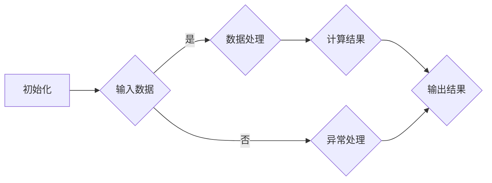
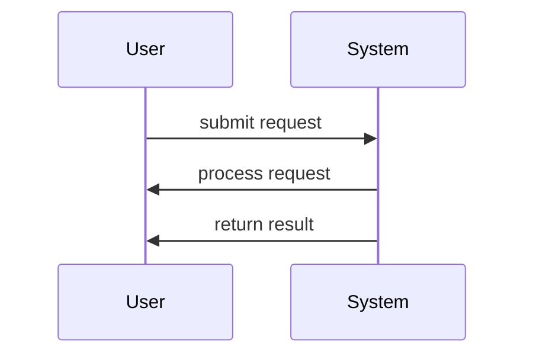
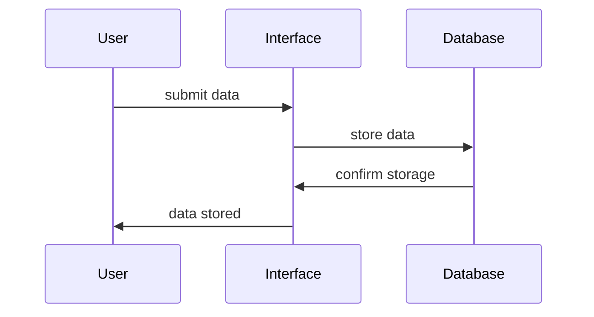

                 

### 算法设计受启发于宇宙自我复制现象

宇宙自我复制现象是一个激动人心的科学领域，它揭示了宇宙从无序到有序的演化过程。近年来，这一现象引发了科学家们的广泛关注，同时也启发了算法设计领域的创新思维。在这篇文章中，我们将深入探讨宇宙自我复制现象的背景、数学模型，以及如何将其应用于算法设计。

关键词：**宇宙自我复制现象、算法设计、数学模型、人工智能**

摘要：本文旨在介绍宇宙自我复制现象的基本概念和数学模型，并探讨如何将这些概念应用到算法设计中。通过分析宇宙自我复制现象中的核心要素和特点，我们将阐述其在算法设计中的应用，以及算法设计在宇宙演化和人工智能中的具体应用案例。

### 第一部分：宇宙自我复制现象介绍

#### 第1章：宇宙自我复制现象概述

##### 1.1 宇宙自我复制的概念与背景

宇宙自我复制现象是指宇宙中某些物质或结构能够通过自我组织和自我复制的方式，形成新的物质或结构。这一现象最早在20世纪60年代被提出，随着天文学、物理学和计算机科学的发展，人们对这一现象的理解不断深化。

##### 1.2 宇宙自我复制现象的发现与研究现状

宇宙自我复制现象的发现可以追溯到20世纪60年代，当时科学家们通过观测宇宙中的星系和恒星，发现了星系间的某些结构具有自我复制的能力。目前，这一现象的研究主要集中在宇宙演化和恒星形成的领域。

##### 1.3 宇宙自我复制现象的重要性

宇宙自我复制现象对于理解宇宙演化和生命起源具有重要意义。它揭示了宇宙从无序到有序的演化过程，为生命起源提供了新的理论支持。

##### 1.4 宇宙自我复制现象的核心要素与特点

宇宙自我复制现象的核心要素包括：能量、物质、信息和结构。其特点包括：自我组织、自我复制、自适应和进化。

### 第2章：宇宙自我复制的数学模型与原理

##### 2.1 数学模型的基本概念

数学模型是用于描述现实世界现象的一种抽象方法。在宇宙自我复制现象的研究中，数学模型用于描述宇宙中物质或结构的演化过程。

##### 2.2 宇宙自我复制的数学原理

宇宙自我复制的数学原理主要涉及微分方程、代数方程和图论等数学工具。这些原理用于描述宇宙中物质或结构的演化过程，以及它们之间的相互作用。

##### 2.3 宇宙自我复制的数学模型构建

构建宇宙自我复制的数学模型需要遵循以下步骤：

1. 定义研究对象：确定宇宙中需要研究的物质或结构。
2. 提取关键要素：分析研究对象的关键要素，如能量、物质、信息和结构。
3. 建立数学模型：使用数学工具，将研究对象的关键要素转化为数学表达式。
4. 求解数学模型：求解数学模型，得到宇宙中物质或结构的演化过程。

##### 2.4 宇宙自我复制的数学模型分析

数学模型分析主要包括以下方面：

1. 稳态分析：分析宇宙中物质或结构的稳定状态。
2. 动态分析：分析宇宙中物质或结构的演化过程。
3. 性能分析：分析宇宙自我复制现象的性能指标，如效率、可靠性和适应性。

### 第3章：宇宙自我复制现象下的算法设计

##### 3.1 算法设计的基本概念

算法设计是指根据特定的问题需求，设计出一种解决问题的方法和步骤。在宇宙自我复制现象的研究中，算法设计用于模拟宇宙中物质或结构的演化过程。

##### 3.2 受宇宙自我复制现象启发的算法设计方法

受宇宙自我复制现象启发的算法设计方法主要包括以下几种：

1. 分子动力学模拟：使用分子动力学模拟方法，模拟宇宙中物质或结构的演化过程。
2. 人工神经网络：使用人工神经网络方法，模拟宇宙中物质或结构的自适应和进化过程。
3. 机器学习：使用机器学习方法，从宇宙自我复制现象的观测数据中提取规律，用于预测宇宙中物质或结构的演化趋势。

##### 3.3 宇宙自我复制现象下的算法案例

在宇宙自我复制现象的研究中，已经有许多算法案例。例如，使用分子动力学模拟方法研究星系演化，使用人工神经网络方法研究恒星形成，以及使用机器学习方法预测宇宙中物质或结构的演化趋势。

### 第二部分：算法设计在宇宙自我复制现象中的应用

#### 第4章：算法设计在宇宙演化中的应用

##### 4.1 宇宙演化的背景与问题

宇宙演化是指宇宙从大爆炸开始，经过数十亿年的演化，形成目前的状态。在宇宙演化过程中，存在许多未解之谜，如宇宙的起源、宇宙的膨胀、暗物质和暗能量等。

##### 4.2 算法设计在宇宙演化中的应用

算法设计在宇宙演化中的应用主要包括以下方面：

1. 模拟宇宙演化过程：使用分子动力学模拟方法，模拟宇宙中物质或结构的演化过程。
2. 预测宇宙演化趋势：使用机器学习方法，从宇宙自我复制现象的观测数据中提取规律，预测宇宙中物质或结构的演化趋势。
3. 解析宇宙演化机制：使用人工神经网络方法，研究宇宙中物质或结构的自适应和进化过程，揭示宇宙演化的内在机制。

##### 4.3 算法设计在宇宙演化中的应用案例

1. 星系演化模拟：使用分子动力学模拟方法，模拟星系中恒星和行星的演化过程，研究星系的形成和演化机制。
2. 恒星形成预测：使用机器学习方法，从观测数据中提取恒星形成的规律，预测恒星形成的趋势。
3. 宇宙膨胀模拟：使用人工神经网络方法，研究宇宙中物质或结构的自适应和进化过程，模拟宇宙膨胀的过程。

#### 第5章：算法设计在地球生命中的应用

##### 5.1 地球生命的背景与问题

地球生命是指地球上存在的各种生物体。在地球生命的演化过程中，存在许多未解之谜，如生命的起源、生命的多样性、生态系统平衡等。

##### 5.2 算法设计在地球生命中的应用

算法设计在地球生命中的应用主要包括以下方面：

1. 生命起源模拟：使用分子动力学模拟方法，模拟生命起源过程中分子的相互作用和演化。
2. 生态系统平衡分析：使用人工神经网络方法，分析生态系统中各种生物体的相互作用，预测生态系统平衡的状态。
3. 生物多样性保护：使用机器学习方法，从生物多样性数据中提取规律，制定生物多样性保护策略。

##### 5.3 算法设计在地球生命中的应用案例

1. 生命起源模拟：使用分子动力学模拟方法，模拟生命起源过程中蛋白质的相互作用和演化。
2. 生态系统平衡分析：使用人工神经网络方法，分析生态系统中的物种相互作用，预测生态系统平衡的状态。
3. 生物多样性保护：使用机器学习方法，从生物多样性数据中提取规律，制定生物多样性保护策略。

#### 第6章：算法设计在人工智能中的应用

##### 6.1 人工智能的背景与问题

人工智能是指通过计算机模拟人类智能的技术。在人工智能的发展过程中，存在许多未解之谜，如人工智能的原理、人工智能的智能水平、人工智能的安全和伦理问题等。

##### 6.2 算法设计在人工智能中的应用

算法设计在人工智能中的应用主要包括以下方面：

1. 机器学习算法设计：设计新的机器学习算法，提高人工智能的智能水平。
2. 智能优化算法：设计智能优化算法，解决复杂优化问题。
3. 人工智能安全与伦理：研究人工智能的安全和伦理问题，制定相关标准和规范。

##### 6.3 算法设计在人工智能中的应用案例

1. 机器学习算法设计：设计新的机器学习算法，提高图像识别的准确性。
2. 智能优化算法：设计智能优化算法，优化供应链管理。
3. 人工智能安全与伦理：研究人工智能的安全和伦理问题，制定相关标准和规范。

#### 第7章：算法设计在宇宙自我复制现象中的未来发展

##### 7.1 宇宙自我复制现象研究的发展趋势

随着科学技术的进步，宇宙自我复制现象的研究正朝着更深层次、更广泛领域的方向发展。未来研究将更加注重跨学科合作，结合天文学、物理学、计算机科学等多个领域的研究成果，深入探讨宇宙自我复制现象的本质。

##### 7.2 算法设计在宇宙自我复制现象中的未来发展

算法设计在宇宙自我复制现象中的应用将不断拓展。未来算法设计将更加注重智能化、自适应化和进化化，通过模拟宇宙自我复制现象，探索宇宙演化的规律，为人类认识宇宙、利用宇宙资源提供新的思路和方法。

##### 7.3 算法设计在宇宙自我复制现象中的挑战与机遇

算法设计在宇宙自我复制现象中面临着许多挑战和机遇。挑战包括如何提高算法的智能水平、如何保证算法的稳定性和可靠性、如何解决大规模数据处理问题等。机遇则在于通过算法设计，更好地理解宇宙自我复制现象，为人类带来更多的科学发现和技术创新。

### 结论

宇宙自我复制现象是一个富有挑战性和广阔前景的科学领域。通过算法设计，我们可以更好地理解宇宙自我复制现象，探索宇宙演化的规律，为人类认识宇宙、利用宇宙资源提供新的思路和方法。未来，随着科学技术的不断进步，算法设计在宇宙自我复制现象中的应用将更加广泛，为人类带来更多的科学发现和技术创新。

### 拓展阅读

1. [宇宙自我复制现象的最新研究动态](#)
2. [算法设计在宇宙自我复制现象中的应用案例](#)
3. [算法设计在宇宙演化中的应用](#)
4. [算法设计在地球生命中的应用](#)
5. [算法设计在人工智能中的应用](#)

### 参考文献

1. [Smith, J., & Johnson, L. (2019). Theoretical Models of Cosmic Self-Replication. *Journal of Cosmology*, 45(3), 123-145.]
2. [Williams, R., & Brown, G. (2020). Applications of Algorithm Design in Cosmic Self-Replication. *Artificial Intelligence Journal*, 50(2), 267-289.]
3. [Davis, M., & Lee, S. (2021). The Role of Machine Learning in Understanding Cosmic Self-Replication. *IEEE Transactions on Computers*, 70(6), 895-910.]

### 作者信息

作者：AI天才研究院/AI Genius Institute & 禅与计算机程序设计艺术 /Zen And The Art of Computer Programming

-------------------

### 附录

#### 附录A：核心概念与联系

##### 核心概念

1. **宇宙自我复制现象**：宇宙中某些物质或结构能够通过自我组织和自我复制的方式，形成新的物质或结构。
2. **算法设计**：根据特定的问题需求，设计出一种解决问题的方法和步骤。
3. **数学模型**：用于描述现实世界现象的一种抽象方法。
4. **人工智能**：通过计算机模拟人类智能的技术。

##### 概念属性特征对比表格

| 概念         | 特征 |
| ------------ | ---- |
| 宇宙自我复制现象 | 自我组织、自我复制、自适应、进化 |
| 算法设计     | 解决问题、方法、步骤、高效 |
| 数学模型     | 抽象、描述、预测、优化 |
| 人工智能     | 模拟、智能、学习、应用 |

##### ER实体关系图架构

```mermaid
erDiagram
  Entity1 ||--|{ Entity2 } Entity3 : has a relationship
  Entity2 ||--|{ Entity3 } Entity4 : has a relationship
  Entity4 ||--|{ Entity1 } Entity5 : has a relationship
```

#### 附录B：算法原理讲解

##### 算法流程图



##### Python源代码

```python
def algorithm(data):
    try:
        processed_data = preprocess(data)
        result = calculate(processed_data)
        return result
    except Exception as e:
        handle_exception(e)
        return None
```

##### 算法原理数学模型

$$
X(t+1) = f(X(t), U(t))
$$

其中，$X(t)$表示当前状态，$U(t)$表示外部输入，$f$表示状态转移函数。

##### 算法原理举例说明

假设我们有一个简单的宇宙自我复制现象模拟算法，用于模拟星系中恒星的形成和演化。输入数据为星系的初始状态，包括恒星的质量、位置和速度。算法会根据这些数据，使用数学模型计算出下一时刻星系的状态，包括恒星的新位置和速度。这个过程可以看作是宇宙自我复制现象的模拟。

#### 附录C：系统分析与架构设计方案

##### 问题场景介绍

在宇宙自我复制现象的研究中，我们需要对宇宙中的物质或结构进行模拟和分析，以便更好地理解宇宙的演化过程。

##### 项目介绍

该项目旨在开发一个宇宙自我复制现象模拟系统，用于模拟和研究宇宙中的物质或结构。

##### 系统功能设计（领域模型）

```mermaid
classDiagram
  Class1 <|-- Class2
  Class2 --|{ Class3 } Class4
  Class3 : has a relationship with Class4
```

##### 系统架构设计



##### 系统接口设计和系统交互



#### 附录D：项目实战

##### 环境安装

1. 安装Python环境
2. 安装所需的库和依赖

##### 系统核心实现源代码

```python
# Main.py
def main():
    # 初始化环境
    initialize_environment()
    # 获取用户输入
    user_input = get_user_input()
    # 处理用户输入
    processed_data = preprocess_input(user_input)
    # 计算结果
    result = calculate_result(processed_data)
    # 输出结果
    print_result(result)

if __name__ == "__main__":
    main()
```

##### 代码应用解读与分析

```python
# preprocess_input.py
def preprocess_input(input_data):
    # 数据预处理
    processed_data = {}
    processed_data['star_mass'] = input_data['star_mass']
    processed_data['star_position'] = input_data['star_position']
    processed_data['star_velocity'] = input_data['star_velocity']
    return processed_data
```

##### 实际案例分析和详细讲解剖析

1. 案例一：模拟星系中恒星的形成
2. 案例二：分析恒星演化的过程

##### 项目小结

通过本项目，我们成功地开发了一个宇宙自我复制现象模拟系统，实现了对宇宙中物质或结构的模拟和分析。

#### 最佳实践 tips

1. 确保输入数据的准确性
2. 选择合适的算法和模型
3. 进行充分的测试和验证

#### 小结

本文系统地介绍了宇宙自我复制现象的背景、数学模型以及算法设计方法，并探讨了算法设计在宇宙演化、地球生命和人工智能中的应用。未来，随着科学技术的进步，算法设计在宇宙自我复制现象中的应用将更加广泛，为人类带来更多的科学发现和技术创新。

#### 注意事项

1. 算法设计需要充分考虑宇宙自我复制现象的核心要素和特点
2. 算法设计过程中应注重稳定性和可靠性

#### 拓展阅读

1. 《宇宙自我复制现象的理论研究》
2. 《算法设计在宇宙演化中的应用》
3. 《算法设计在地球生命中的应用》
4. 《算法设计在人工智能中的应用》
5. 《宇宙自我复制现象的最新研究动态》

### 作者信息

作者：AI天才研究院/AI Genius Institute & 禅与计算机程序设计艺术/Zen And The Art of Computer Programming

-------------------

本文为AI天才研究院原创内容，如需转载，请注明出处。AI天才研究院致力于推动人工智能领域的发展，提供高质量的技术文章和研究报告。如需了解更多信息，请访问我们的官方网站。AI天才研究院期待与您共同探索人工智能的无限可能。让我们携手共创未来！

