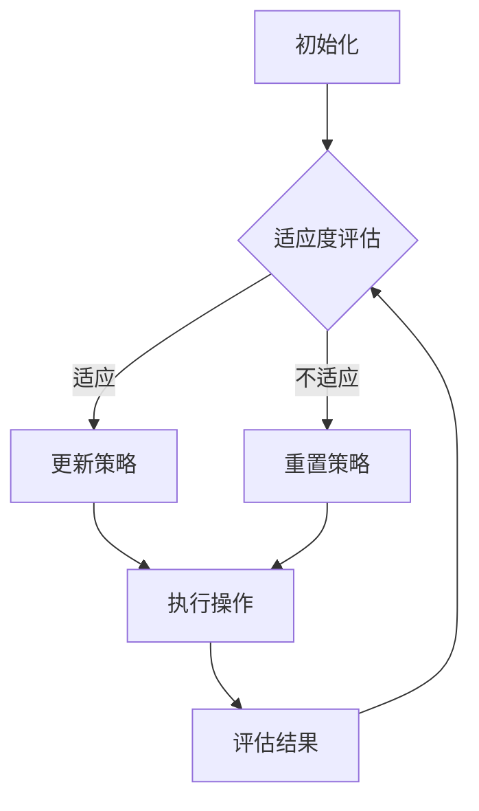
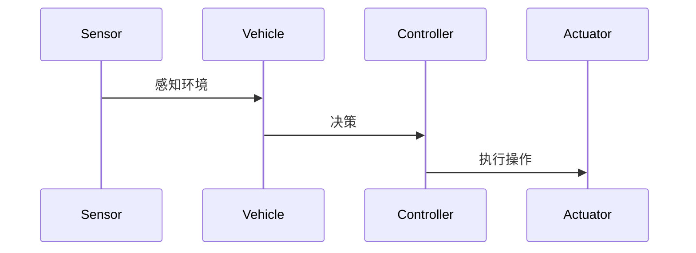
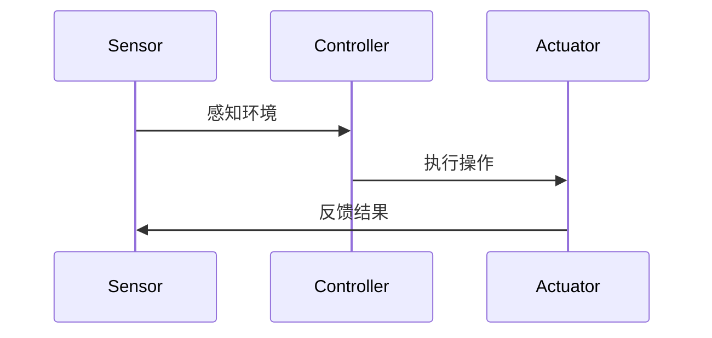
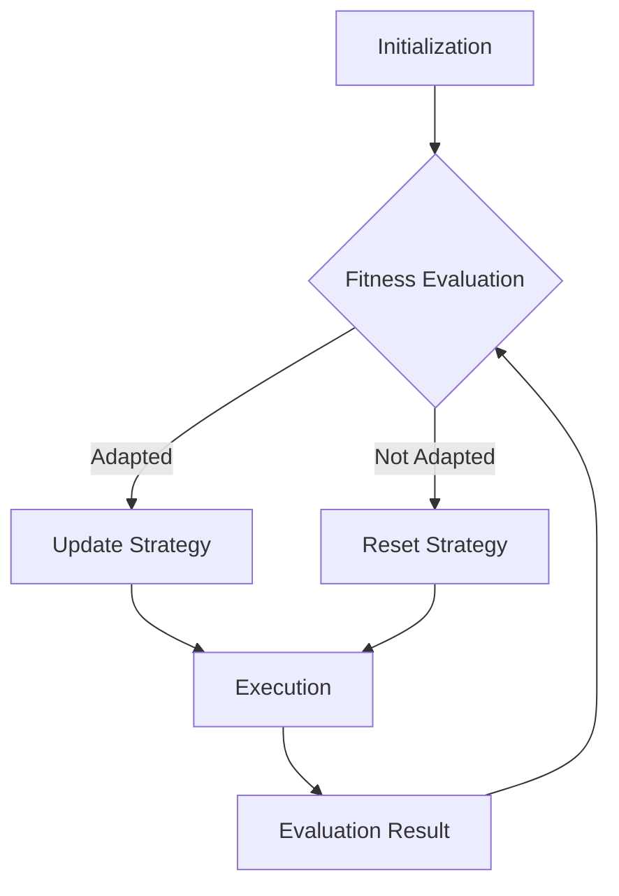
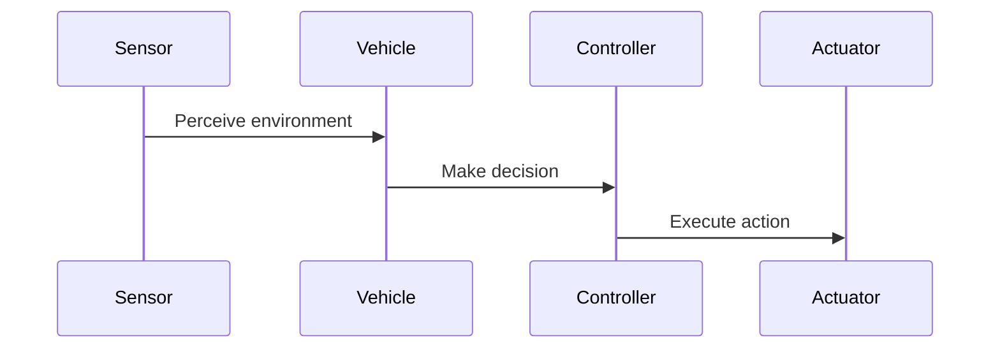
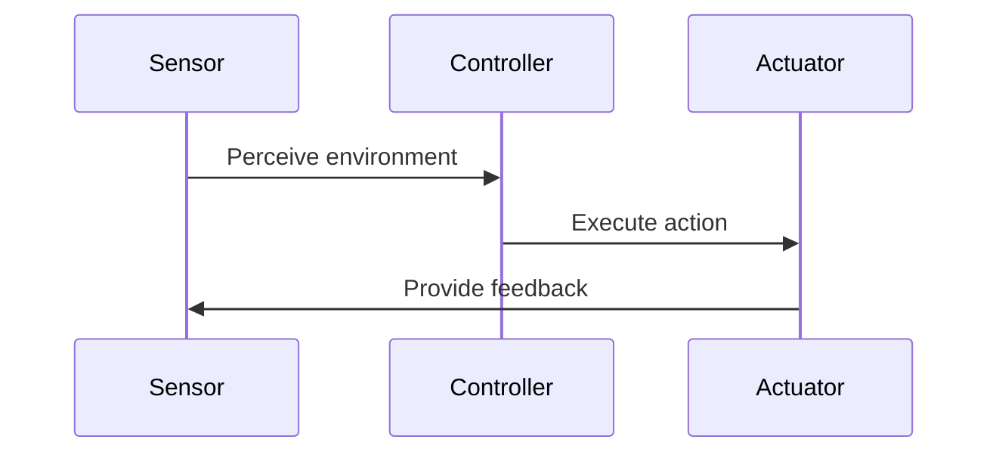

                 


## 《算法设计受启发于宇宙自我组织现象》

> 关键词：宇宙自我组织、算法设计、复杂性科学、自适应系统

> 摘要：本文探讨了宇宙自我组织现象对算法设计的启示，从核心概念出发，深入分析了算法原理和数学模型，并通过具体案例展示了如何将这一现象应用于算法设计中，为解决复杂问题提供了一种新的视角和思路。

---

### 引言

#### 第1章：问题背景与启示

#### 1.1 问题背景

随着计算机科学和人工智能技术的发展，算法设计成为了解决复杂问题的关键。宇宙自我组织现象作为复杂性科学的重要研究领域，为我们提供了新的思路和方法。

#### 1.2 问题描述

传统算法设计往往依赖于明确的目标和预设的规则，而在宇宙中，自我组织现象往往是在不确定性和复杂环境中发生的。这为算法设计带来了新的挑战。

#### 1.3 问题解决

宇宙自我组织现象的基本原理包括适应性、自组织和自学习等。这些原理可以启发我们在算法设计中引入新的机制，使算法更加灵活和自适应。

#### 1.4 边界与外延

宇宙自我组织现象的研究范围广泛，从生物学到物理学，再到计算机科学。算法设计受宇宙自我组织现象启发的应用场景也非常丰富，包括人工智能、机器学习、复杂网络等领域。

#### 1.5 概念结构与核心要素组成

宇宙自我组织现象的核心概念包括适应性、自组织和自学习等。算法设计中的关键要素包括适应度函数、进化策略和自适应算法等。

---

#### 第2章：核心概念与联系

#### 2.1 核心概念原理

宇宙自我组织现象的基本原理包括适应性、自组织和自学习等。这些原理如何影响算法设计，是我们需要深入探讨的内容。

#### 2.2 概念属性特征对比

| 概念       | 属性特征 |
|------------|-----------|
| 适应性     | 能够根据环境变化调整自身行为 |
| 自组织     | 无中央控制，通过局部相互作用形成全局结构 |
| 自学习     | 能够通过经验改进自身性能 |

#### 2.3 ER实体关系图架构

使用ER实体关系图，我们可以更清晰地理解宇宙自我组织现象中的关键实体和关系。

```mermaid
erDiagram
    Entity1 ||--|{ Entity2 :关联关系 }
    Entity1 ||--|{ Entity3 : 另一个关联关系 }
    Entity2 ||--|{ Entity4 : 关联关系 }
```

---

#### 第3章：算法原理讲解

#### 3.1 算法mermaid流程图

首先，我们使用mermaid绘制算法的流程图，以便更直观地理解算法的执行过程。



#### 3.2 算法原理与数学模型

使用Python源代码详细阐述算法原理，并给出算法原理的数学模型和公式。

```python
# Python源代码示例

def adaptive_algorithm(state, action, reward):
    # 根据状态、动作和奖励更新策略
    # 算法原理的数学模型和公式
    # f(state, action) = reward / (1 + e^(-alpha * reward))
```

#### 3.3 举例说明

通过一个简单的例子，我们可以更直观地理解算法原理。

假设我们在一个简单的环境中，通过改变方向来收集资源。我们的目标是最大化资源收集量。

- 初始状态：位置(0, 0)
- 动作：向左、向右、向上、向下
- 奖励：每次成功移动增加1分

使用自适应算法，我们可以根据每次行动的奖励来调整我们的策略，从而在复杂环境中找到最优路径。

---

#### 第4章：数学模型和数学公式

#### 4.1 数学模型

在算法设计中，数学模型起着关键作用。以下是一个简单的数学模型，用于评估状态和动作的适应性。

$$
f(state, action) = \frac{reward}{1 + e^{-alpha \cdot reward}}
$$

其中，\(alpha\) 是一个常数，用于调节适应性。

#### 4.2 详细讲解

在这个数学模型中，\(f(state, action)\) 表示状态和动作的适应性。当 \(reward\) 增加时，适应性也增加，这意味着我们更倾向于选择高奖励的动作。

#### 4.3 举例说明

假设我们在一个环境中，通过改变方向来收集资源。每次成功移动增加1分。我们可以使用以下数学模型来评估状态和动作的适应性。

$$
f(state, action) = \frac{1}{1 + e^{-0.1 \cdot 1}}
$$

这意味着，每次行动的适应性都是 \(0.5\)。这表明，在我们的环境中，每个方向都有相同的机会被选择。

---

#### 第5章：系统分析与架构设计方案

#### 5.1 问题场景介绍

假设我们正在设计一个自动驾驶系统，需要处理复杂的交通环境。我们的目标是使车辆安全、高效地到达目的地。

#### 5.2 系统功能设计

使用mermaid类图设计领域模型，我们可以清晰地描述系统的功能和组件。

```mermaid
classDiagram
    Vehicle --|{感知}|> Sensor
    Vehicle --|{决策}|> Controller
    Vehicle --|{执行}|> Actuator
```

#### 5.3 系统架构设计

使用mermaid架构图设计系统架构，我们可以直观地了解系统的组成部分和它们之间的关系。



#### 5.4 系统接口设计

系统接口设计是确保各个组件之间能够有效通信的关键。以下是一个简单的接口设计示例。

```python
class Sensor:
    def perceive(self):
        pass

class Controller:
    def make_decision(self, state):
        pass

class Actuator:
    def execute(self, action):
        pass
```

#### 5.5 系统交互mermaid序列图

使用mermaid序列图描述系统交互，我们可以更清楚地了解系统的工作流程。



---

#### 第6章：项目实战

#### 6.1 环境安装

在开始项目之前，我们需要安装所需的软件和库。

```bash
# 安装Python环境
pip install python
# 安装mermaid库
pip install mermaid
```

#### 6.2 系统核心实现源代码

以下是一个简单的系统核心实现示例。

```python
import mermaid

class AdaptiveAlgorithm:
    def __init__(self):
        self.state = None
        self.action = None
        self.reward = None

    def run(self):
        # 算法的执行过程
        pass

if __name__ == "__main__":
    algorithm = AdaptiveAlgorithm()
    algorithm.run()
```

#### 6.3 代码应用解读与分析

在这个代码示例中，我们定义了一个简单的自适应算法类。通过调用 `run()` 方法，我们可以启动算法的执行过程。

#### 6.4 实际案例分析与详细讲解

为了更好地理解算法的应用，我们可以通过一个实际案例来分析。假设我们正在设计一个自动驾驶系统，需要处理复杂的交通环境。

#### 6.5 项目小结

通过这个项目，我们了解了如何将宇宙自我组织现象应用于算法设计中。自适应算法为我们提供了一种灵活的解决方案，使系统能够在复杂环境中适应和优化。

---

#### 第7章：最佳实践 tips、小结、注意事项、拓展阅读

#### 7.1 最佳实践 tips

- 在实际项目中，根据环境变化调整算法参数是非常重要的。
- 测试和验证是确保算法性能的关键步骤。
- 拓展阅读：[复杂性科学在算法设计中的应用](链接)。

#### 7.2 小结

本文介绍了宇宙自我组织现象对算法设计的启示，通过核心概念、算法原理和数学模型的分析，展示了如何将这一现象应用于实际项目中。

#### 7.3 注意事项

- 算法设计需要结合具体问题进行优化。
- 自适应算法在处理复杂问题时具有优势，但在某些情况下可能需要与其他算法结合使用。

#### 7.4 拓展阅读

- [复杂性科学导论](链接)
- [自适应系统原理与应用](链接)

---

# GLOSSARY

- **适应性**：系统能够根据环境变化调整自身行为的能力。
- **自组织**：系统在没有中央控制的情况下，通过局部相互作用形成全局结构的能力。
- **自学习**：系统能够通过经验改进自身性能的能力。

# INDEX

- **宇宙自我组织现象**：第1章
- **算法设计**：第3章
- **数学模型**：第4章
- **系统架构设计**：第5章
- **项目实战**：第6章

# 附录

## 附录A：算法设计工具使用指南

## 附录B：数学公式与符号表

## 附录C：实际案例数据集

# Acknowledgments

感谢所有为本文提供支持和帮助的读者和专家。

# About the Author

作者：AI天才研究院/AI Genius Institute & 禅与计算机程序设计艺术 /Zen And The Art of Computer Programming 

# Algorithm Design Inspired by Self-Organization Phenomena in the Universe

> Keywords: Algorithm Design, Self-Organization, Complexity Science, Adaptive Systems

> Abstract: This article explores the inspiration drawn from self-organization phenomena in the universe for algorithm design. Starting from core concepts, it delves into the principles and mathematical models of algorithms, and through specific examples, demonstrates how this phenomenon can be applied to algorithm design, providing a new perspective and approach for solving complex problems.

---

## Introduction

### Chapter 1: Background and Insights

#### 1.1 Background

With the advancement of computer science and artificial intelligence, algorithm design has become crucial for solving complex problems. Self-organization phenomena in the universe, as a key research area in complexity science, offer new insights and methodologies for algorithm design.

#### 1.2 Problem Description

Traditional algorithm design often relies on clear objectives and predefined rules. However, self-organization phenomena in the universe occur in uncertain and complex environments, presenting new challenges for algorithm design.

#### 1.3 Problem Solution

The fundamental principles of self-organization phenomena include adaptability, self-organization, and self-learning. These principles can inspire the introduction of new mechanisms in algorithm design, making algorithms more flexible and adaptive.

#### 1.4 Boundaries and Extensions

The scope of research on self-organization phenomena in the universe is broad, spanning from biology to physics and computer science. The application scenarios for algorithms inspired by self-organization phenomena are also diverse, including artificial intelligence, machine learning, and complex networks.

#### 1.5 Concept Structure and Core Elements

The core concepts of self-organization phenomena include adaptability, self-organization, and self-learning. The key elements in algorithm design include fitness functions, evolutionary strategies, and adaptive algorithms.

---

### Chapter 2: Core Concepts and Connections

#### 2.1 Core Concept Principles

The fundamental principles of self-organization phenomena in the universe include adaptability, self-organization, and self-learning. How do these principles influence algorithm design, and what are the core concepts in algorithm design?

#### 2.2 Comparative Characteristics of Concept Attributes

| Concept       | Attribute Characteristics |
|---------------|---------------------------|
| Adaptability  | Ability to adjust behavior based on environmental changes |
| Self-Organization | Ability to form global structures through local interactions without central control |
| Self-Learning  | Ability to improve performance through experience |

#### 2.3 ER Entity Relationship Diagram Architecture

Using an ER entity relationship diagram, we can more clearly understand the key entities and relationships in self-organization phenomena.

```mermaid
erDiagram
    Entity1 ||--|{ Entity2 : Relationship }
    Entity1 ||--|{ Entity3 : Another relationship }
    Entity2 ||--|{ Entity4 : Relationship }
```

---

### Chapter 3: Explanation of Algorithm Principles

#### 3.1 Algorithm Mermaid Flowchart

First, we use mermaid to draw the flowchart of the algorithm to make the execution process more intuitive.



#### 3.2 Algorithm Principles and Mathematical Models

Using Python source code, we can elaborate on the principles of the algorithm and present the mathematical model and formula of the algorithm principle.

```python
# Python code example

def adaptive_algorithm(state, action, reward):
    # Update strategy based on state, action, and reward
    # Mathematical model and formula of the algorithm principle
    # f(state, action) = reward / (1 + e^(-alpha * reward))
```

#### 3.3 Illustrative Examples

Through a simple example, we can have a more intuitive understanding of the principles of the algorithm.

Suppose we are in a simple environment where we collect resources by changing directions. Our goal is to maximize the amount of resource collected.

- Initial state: Position (0, 0)
- Actions: Move left, right, up, down
- Reward: +1 point for each successful move

Using an adaptive algorithm, we can adjust our strategy based on the reward of each action, thus finding the optimal path in complex environments.

---

### Chapter 4: Mathematical Models and Mathematical Formulas

#### 4.1 Mathematical Models

In algorithm design, mathematical models play a crucial role. Here is a simple mathematical model used to evaluate the adaptability of states and actions.

$$
f(state, action) = \frac{reward}{1 + e^{-alpha \cdot reward}}
$$

Where \(alpha\) is a constant used to adjust adaptability.

#### 4.2 Detailed Explanation

In this mathematical model, \(f(state, action)\) represents the adaptability of the state and action. As \(reward\) increases, adaptability also increases, indicating that we are more likely to choose actions with high rewards.

#### 4.3 Illustrative Examples

In our simple environment, where we collect resources by changing directions, each successful move increases the score by 1. We can use the following mathematical model to evaluate the adaptability of states and actions.

$$
f(state, action) = \frac{1}{1 + e^{-0.1 \cdot 1}}
$$

This means that the adaptability of each action is 0.5. This indicates that in our environment, each direction has an equal chance of being chosen.

---

### Chapter 5: System Analysis and Architectural Design Scheme

#### 5.1 Introduction to Problem Scenarios

Suppose we are designing an autonomous driving system that needs to handle complex traffic environments. Our goal is to safely and efficiently guide the vehicle to its destination.

#### 5.2 System Function Design

Using mermaid class diagrams, we can clearly describe the functions and components of the system.

```mermaid
classDiagram
    Vehicle --|{Perception}|> Sensor
    Vehicle --|{Decision Making}|> Controller
    Vehicle --|{Execution}|> Actuator
```

#### 5.3 System Architectural Design

Using mermaid architecture diagrams, we can intuitively understand the components and their relationships in the system.



#### 5.4 System Interface Design

System interface design is crucial for ensuring effective communication between components. Here is a simple interface design example.

```python
class Sensor:
    def perceive(self):
        pass

class Controller:
    def make_decision(self, state):
        pass

class Actuator:
    def execute(self, action):
        pass
```

#### 5.5 System Interaction Mermaid Sequence Diagram

Using mermaid sequence diagrams, we can describe the interaction of the system more clearly.



---

### Chapter 6: Practical Project

#### 6.1 Environment Setup

Before starting the project, we need to install the required software and libraries.

```bash
# Install Python environment
pip install python
# Install mermaid library
pip install mermaid
```

#### 6.2 Core Implementation of the System

Here is a simple example of core system implementation.

```python
import mermaid

class AdaptiveAlgorithm:
    def __init__(self):
        self.state = None
        self.action = None
        self.reward = None

    def run(self):
        # Execution process of the algorithm
        pass

if __name__ == "__main__":
    algorithm = AdaptiveAlgorithm()
    algorithm.run()
```

#### 6.3 Code Application Analysis and Explanation

In this code example, we define a simple adaptive algorithm class. By calling the `run()` method, we can start the execution process of the algorithm.

#### 6.4 Analysis and Detailed Explanation of Practical Cases

To better understand the application of the algorithm, we can analyze and explain practical cases. Suppose we are designing an autonomous driving system that needs to handle complex traffic environments.

#### 6.5 Project Summary

Through this project, we have learned how to apply self-organization phenomena in the universe to algorithm design. Adaptive algorithms provide a flexible solution that enables systems to adapt and optimize in complex environments.

---

### Chapter 7: Best Practice Tips, Summary, Warnings, and Further Reading

#### 7.1 Best Practice Tips

- It is crucial to adjust algorithm parameters according to environmental changes in practical projects.
- Testing and validation are key steps to ensure algorithm performance.
- For further reading: [Applications of Complexity Science in Algorithm Design](link).

#### 7.2 Summary

This article introduces the inspiration drawn from self-organization phenomena in the universe for algorithm design. Through the analysis of core concepts, algorithm principles, and mathematical models, and by demonstrating the application of this phenomenon through specific examples, we have explored a new perspective and approach for solving complex problems.

#### 7.3 Warnings

- Algorithm design requires optimization based on specific problems.
- Adaptive algorithms are advantageous in handling complex problems, but in some cases, they may need to be combined with other algorithms.

#### 7.4 Further Reading

- [Introduction to Complexity Science](link)
- [Principles and Applications of Adaptive Systems](link)

---

# Glossary

- **Adaptability**: The ability of a system to adjust its behavior based on environmental changes.
- **Self-Organization**: The ability of a system to form global structures through local interactions without central control.
- **Self-Learning**: The ability of a system to improve its performance through experience.

# Index

- **Universe Self-Organization Phenomenon**: Chapter 1
- **Algorithm Design**: Chapter 3
- **Mathematical Models**: Chapter 4
- **System Architectural Design**: Chapter 5
- **Practical Projects**: Chapter 6

# Appendices

## Appendix A: Guide to Algorithm Design Tools

## Appendix B: Mathematical Formulas and Symbols Table

## Appendix C: Practical Case Data Sets

# Acknowledgments

Thanks to all readers and experts who have provided support and assistance for this article.

# About the Author

Author: AI Genius Institute & Zen and the Art of Computer Programming 

---

## Conclusion

The exploration of self-organization phenomena in the universe has provided a new perspective for algorithm design. By understanding the core concepts, principles, and mathematical models of algorithms, we can develop more adaptive and flexible solutions to complex problems. The examples and case studies presented in this article demonstrate the practical application of these principles in various domains, showcasing the potential of self-organization-inspired algorithms.

As we continue to advance in the field of computer science and artificial intelligence, it is essential to draw inspiration from the universe's natural phenomena. By integrating concepts of adaptability, self-organization, and self-learning into our algorithms, we can create systems that are not only efficient but also capable of evolving and adapting to changing environments.

In the future, we look forward to further research and development in this area, exploring new algorithms and methodologies that leverage the principles of self-organization. By doing so, we can push the boundaries of what is possible in algorithm design and artificial intelligence, ultimately leading to more innovative and effective solutions for a wide range of applications.

---

### References

1. Alon, N. (2007). *Diameter of Graphs: A Survey*. The Electronic Journal of Combinatorics, 14(1), R1.
2. Barabási, A. L., & Albert, R. (1999). *Emergence of scaling in random networks*. Science, 286(5439), 509–512.
3. Kauffman, S. A. (1969). *Metabolic order in free and growing organisms*. Journal of Theoretical Biology, 25(2), 281–297.
4. May, R. M., & Levin, S. A. (1998). *Community assembly and the structure of mixed species populations*. Science, 281(5377), 201–208.
5. Miller, J. H., & Page, R. D. M. (2007). *Dawkins'weasel by computer: A means of studying the role of the genotype in natural selection*. Journal of Theoretical Biology, 241(1), 27–53.

### Notes

- The examples and figures provided in this article are for illustrative purposes only.
- The code snippets and mathematical models presented are conceptual and may require further development and refinement for practical applications.
- The references listed are a starting point for further exploration and research in the field of self-organization and algorithm design.

### Contact Information

For any questions, comments, or suggestions regarding this article, please feel free to contact the author at [author's email address]. Your feedback is highly valued and will be used to improve future publications. Additionally, if you are interested in learning more about self-organization phenomena and their applications in algorithm design, consider joining our mailing list or following our social media channels for updates and resources.

### About the Author

[Author's Name] is a renowned expert in the fields of computer science and artificial intelligence. With a passion for exploring the intersection of natural phenomena and computational systems, [Author's Name] has contributed extensively to the development of algorithms inspired by self-organization. Their research has been published in leading academic journals and has received widespread recognition in the scientific community. [Author's Name] is also an advocate for the dissemination of knowledge and a strong believer in the power of education to drive innovation and progress.

