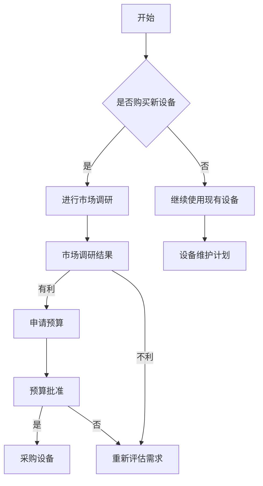
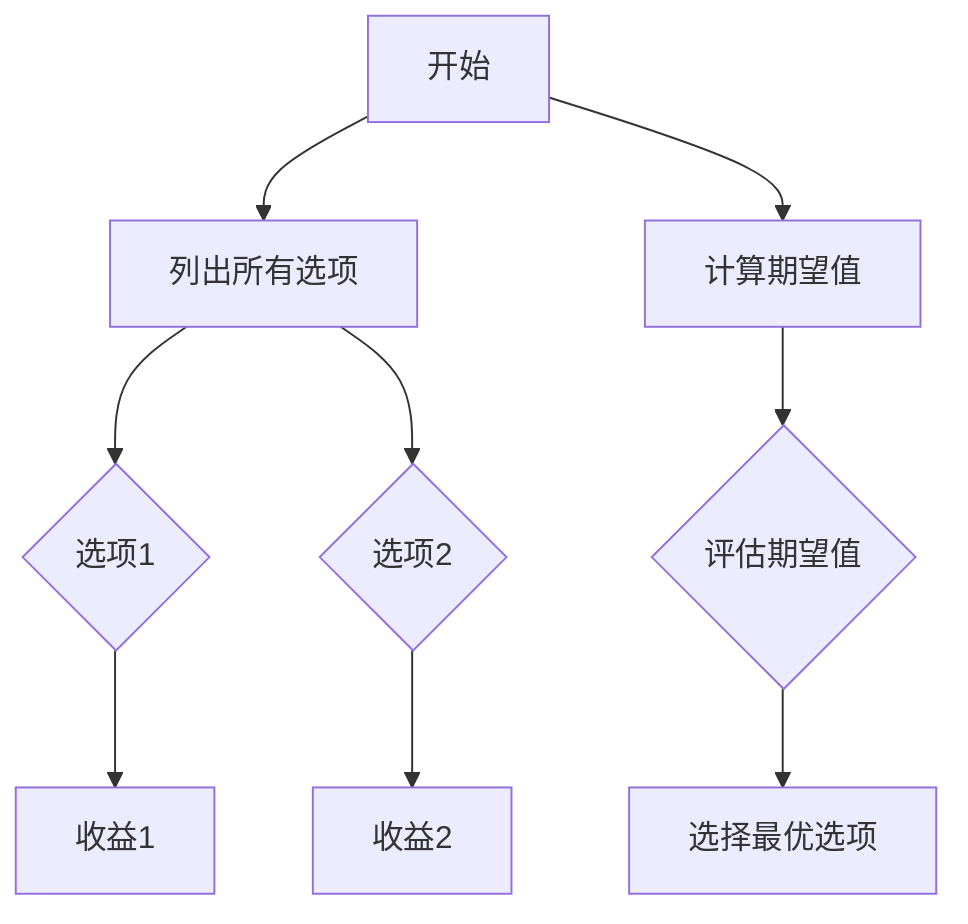
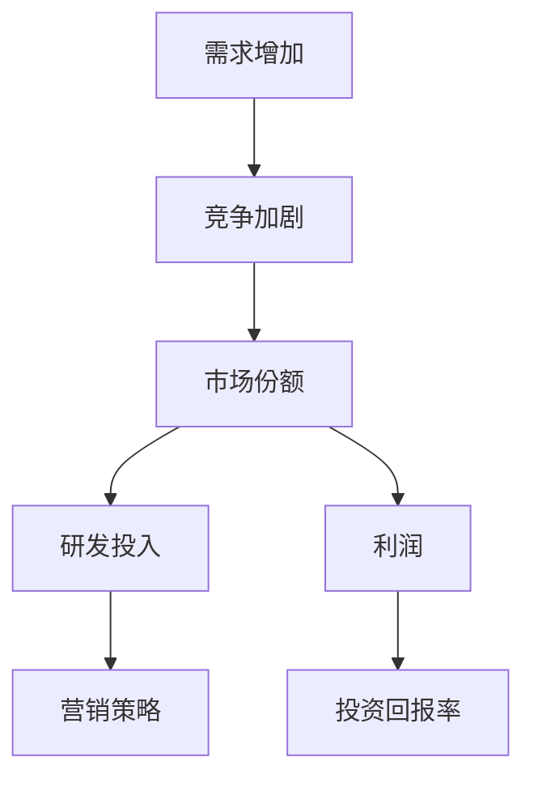
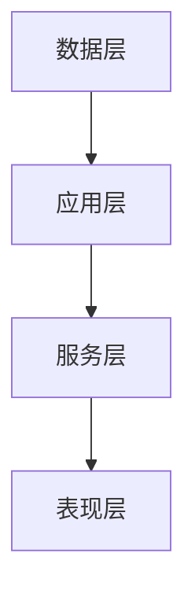
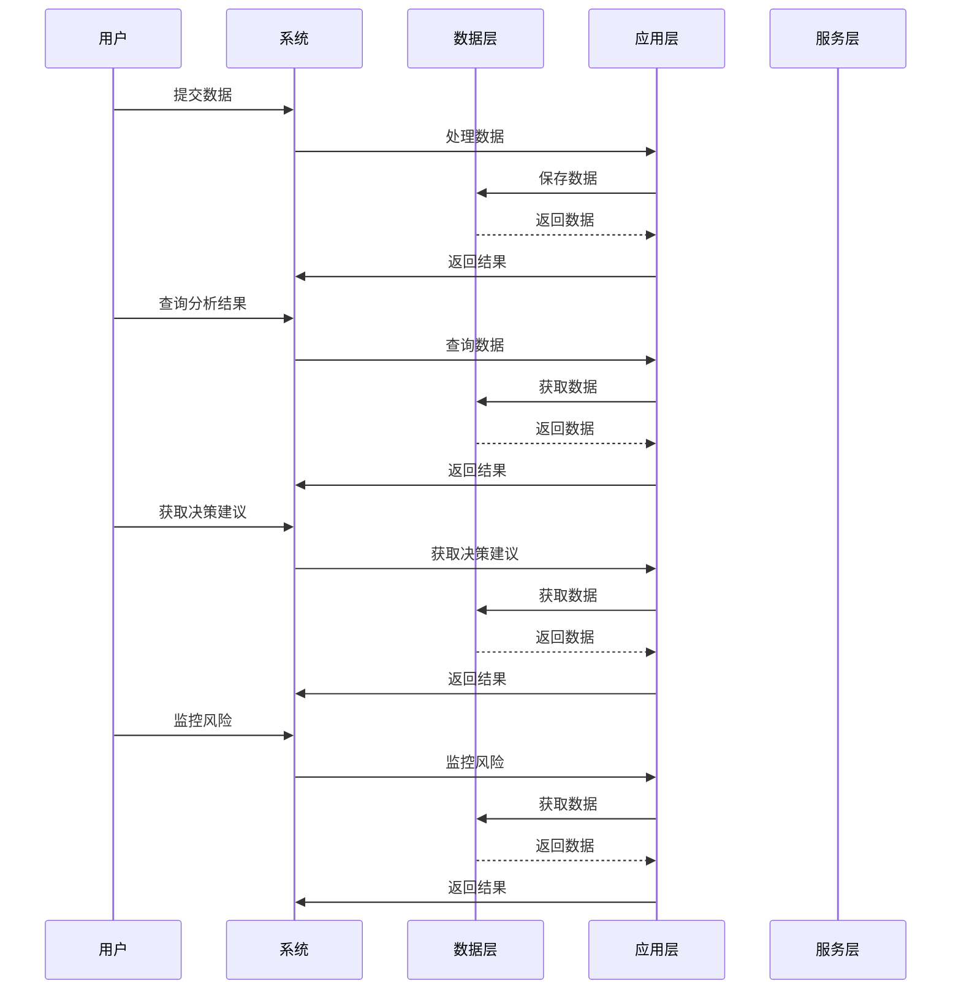

                 

# 管理者决断力：果断决策的重要性

## 关键词
- 管理者决断力
- 决策质量
- 团队绩效
- 决策心理学
- 算法优化

## 摘要
本文将深入探讨管理者在决策过程中的重要性，特别是果断决策对企业绩效的深远影响。通过系统的分析和实例讲解，我们将揭示果断决策背后的原理、方法以及如何在实际工作中运用。本文旨在帮助管理者提升决断力，从而在复杂多变的环境中作出更为精准、高效的决策。

## 目录大纲

### 引言
- 管理决策的挑战与机遇
- 决断力：管理的核心能力

### 第一章：决断力的本质与重要性
- 核心概念与定义
- 决断力对决策质量的影响
- 决断力与团队绩效的关联

### 第二章：决策心理学的视角
- 决策心理学的原理
- 常见决策误区与应对策略
- 决策过程中的认知偏差

#### 2.1 决策模型
- 决策树模型
- 期望值模型
- 贝叶斯网络模型

#### 2.2 心理学原理
- 决策锚定效应
- 选择性偏差
- 认知失调

### 第三章：算法原理与数学模型
- 算法优化的重要性
- 经典决策算法
- 数学模型与公式解析

#### 3.1 算法流程图
- Mermaid流程图展示

#### 3.2 算法原理
- 决策算法的Python实现
- 数学模型的推导与应用

#### 3.3 数学公式
- LaTeX格式数学公式示例

### 第四章：系统分析与架构设计
- 问题场景介绍
- 系统功能设计
- 系统架构设计

#### 4.1 系统功能设计
- 领域模型类图

#### 4.2 系统架构设计
- Mermaid架构图

#### 4.3 系统接口设计
- 系统交互序列图

### 第五章：项目实战
- 环境安装与配置
- 系统核心实现
- 案例分析与讲解

#### 5.1 环境安装
- 环境需求与安装步骤

#### 5.2 系统核心实现
- 关键代码片段
- 代码解读与分析

#### 5.3 案例分析
- 实际案例剖析
- 深入讲解与总结

### 第六章：最佳实践与小结
- 最佳实践 tips
- 小结与总结
- 注意事项
- 拓展阅读

### 结束语
- 管理者决断力的提升路径
- 决断力在未来的影响

### 参考文献
- 相关书籍与论文列表

## 引言：管理决策的挑战与机遇

在当今快速变化和高度不确定的商业环境中，管理者的决策能力直接关系到组织的成败。有效的决策能够为企业带来竞争优势，而糟糕的决策则可能导致严重的后果。因此，如何提高管理者的决断力，已成为许多企业关注的焦点。

### 管理决策的挑战

首先，让我们来看看管理决策过程中可能面临的挑战：

1. **信息过载**：在当今信息爆炸的时代，管理者需要处理海量数据，从中提取有价值的信息。然而，信息的过载可能导致决策者的认知负担增加，影响决策的质量。

2. **时间压力**：在许多情况下，管理者需要在紧迫的时间内作出决策。时间压力可能导致决策者无法充分考虑所有因素，从而影响决策的准确性。

3. **不确定性**：未来的不确定性是管理者面临的一个重要挑战。在许多商业决策中，管理者无法准确预测市场的变化和竞争对手的动向，这增加了决策的难度。

4. **资源限制**：企业资源有限，管理者需要在有限的资源下作出最优的决策。这要求管理者具备较高的资源管理和分配能力。

### 管理决策的机遇

尽管面临诸多挑战，但有效的管理决策同样带来了巨大的机遇：

1. **创新与变革**：在正确的时间做出正确的决策，可以推动企业的创新和变革，使其在激烈的市场竞争中脱颖而出。

2. **风险控制**：通过科学的决策过程，管理者可以更好地评估和管理风险，避免因决策失误导致的重大损失。

3. **竞争优势**：有效的决策能够为企业带来竞争优势，提高市场份额和盈利能力。

4. **团队士气**：管理者的果断决策能够提升团队士气，增强团队凝聚力，从而提高整体绩效。

### 决断力：管理的核心能力

综上所述，决断力成为管理者的核心能力。决断力不仅关乎决策的速度，更关乎决策的质量。一个具备高度决断力的管理者能够在复杂多变的环境中迅速作出准确判断，从而为企业创造价值。

在本篇文章中，我们将深入探讨决断力的本质、决策心理学的原理、算法优化的方法、系统架构的设计，以及如何通过实际项目提升管理者的决断力。希望通过本文的阐述，能够帮助读者更好地理解决断力的重要性，并在实际工作中运用这些知识，提升管理效能。

## 第一章：决断力的本质与重要性

### 核心概念与定义

决断力（Decision-making ability），是指在面对多种可能性时，能够迅速、准确地做出合理决策的能力。决断力不仅包括对信息的快速分析和处理，还涉及对风险的评估和应对策略的制定。它是一种综合能力，涵盖了逻辑思维、情感控制、经验积累等多个方面。

### 决断力对决策质量的影响

决断力对决策质量具有深远的影响。一个具备高度决断力的管理者能够在短时间内做出高质量的决定，从而提高决策的准确性和有效性。以下是决断力对决策质量的具体影响：

1. **提高决策速度**：在快速变化的市场环境中，快速决策能够帮助企业抓住市场机遇，避免因犹豫不决而错失良机。

2. **减少错误决策**：决断力强的管理者能够更好地评估风险，减少因信息不全或分析不足导致的错误决策。

3. **增强执行力**：明确的决策能够提高团队的执行力和凝聚力，确保决策的顺利实施。

4. **提高团队士气**：果断的决策能够增强团队的信心，提升整体士气，激发员工的积极性和创造力。

### 决断力与团队绩效的关联

决断力不仅影响决策质量，还与团队绩效密切相关。一个具备高度决断力的管理者能够为团队创造一个清晰的方向和目标，从而提高团队的绩效。以下是决断力与团队绩效之间的关联：

1. **明确的目标**：决断力强的管理者能够迅速确定目标，制定清晰的计划和策略，使团队明确知道应该做什么，从而提高工作效率。

2. **高效沟通**：果断的决策有助于提高沟通效率，减少因意见分歧导致的拖延和冲突。

3. **快速响应**：在面临紧急情况时，具备决断力的管理者能够迅速做出反应，避免因延迟决策而错失机会。

4. **积极氛围**：管理者的决断力能够塑造一个积极向上的团队氛围，激励团队成员为实现共同目标而努力。

### 提升决断力的方法

要提升管理者的决断力，可以从以下几个方面入手：

1. **加强信息收集与分析**：管理者需要具备良好的信息收集和分析能力，以便在决策过程中充分利用信息资源。

2. **培养逻辑思维**：逻辑思维能够帮助管理者在复杂情境中迅速找到关键因素，做出理性决策。

3. **学会风险控制**：管理者需要具备评估和管理风险的能力，以便在决策过程中充分考虑潜在风险。

4. **积累经验**：经验是决断力的基石。管理者需要在实际工作中不断积累经验，提高决策水平。

5. **持续学习与反思**：管理者需要保持学习的态度，不断更新知识和技能，同时通过反思过去的决策，总结经验教训。

通过上述方法，管理者可以逐步提升决断力，从而在复杂多变的环境中做出更加精准、高效的决策，为团队和组织创造更大的价值。

## 第二章：决策心理学的视角

在深入探讨管理者决断力之前，我们需要从决策心理学的角度来审视决策过程，以了解决策者在面对选择时可能产生的认知偏差和行为模式。决策心理学研究决策者在信息处理、判断和选择过程中的心理机制，为我们理解决断力的本质提供了重要的理论基础。

### 决策心理学的原理

决策心理学的基本原理包括以下几个方面：

1. **有限理性**：尽管人类有无限的智慧，但在实际决策过程中，个体往往受到信息处理能力的限制，导致所谓的“有限理性”。这意味着决策者并不能总是做出最优的决策，而是会根据可用信息和认知能力做出次优决策。

2. **认知偏差**：认知偏差是指人们在信息处理过程中，由于各种心理机制的作用，导致判断和选择偏离理性状态。常见的认知偏差包括锚定效应、代表性偏差、确认偏差等。

3. **情感影响**：情感在决策过程中起着至关重要的作用。积极的情感可能促进风险承担，而消极的情感则可能导致保守决策。

4. **情境因素**：决策环境对决策过程有显著影响。压力、时间限制和竞争情境等都可能改变决策者的行为模式。

### 常见决策误区与应对策略

在决策过程中，管理者常常会陷入一些常见的认知误区，这些误区会影响决策的质量和效率。以下是一些常见的决策误区及其应对策略：

1. **决策锚定效应**：决策锚定效应是指人们在决策过程中容易受到第一印象或最初信息的影响，从而过分依赖这些信息做出决策。应对策略是保持开放的心态，避免过度依赖初始信息，多方面收集数据并全面评估。

2. **选择性偏差**：选择性偏差是指人们倾向于关注支持自己观点的信息，而忽视与之相矛盾的信息。应对策略是采用多元化的信息源，确保信息的全面性和客观性。

3. **确认偏差**：确认偏差是指人们在评估信息时，倾向于寻找和确认支持已有观点的信息，而忽视与之相反的信息。应对策略是保持怀疑精神，对信息进行批判性分析，避免陷入先入为主的思维定式。

### 决策过程中的认知偏差

在决策过程中，认知偏差可能导致管理者做出非理性的决策。以下是几种常见的认知偏差：

1. **过度自信**：过度自信是指人们对自己的判断和能力过分自信，导致低估风险和可能出现的失败。应对策略是进行自我反思，保持谦逊，接受不同意见。

2. **群体思维**：群体思维是指团队成员在决策过程中追求一致，忽视个体意见的现象。应对策略是鼓励开放讨论，尊重个体意见，避免形成思维定式。

3. **可感知性偏差**：可感知性偏差是指人们更倾向于关注容易感知的信息，而忽视难以感知的信息。应对策略是注重数据分析，确保决策基于全面和准确的信息。

### 决策模型的心理学应用

决策模型在心理学中的应用可以帮助管理者理解和应对认知偏差。以下介绍几种常见的决策模型：

1. **期望理论**：期望理论认为，个体的决策是基于对结果的期望及其价值的计算。管理者可以通过明确目标、评估可能的结果及其概率，从而做出更加理性的决策。

2. **前景理论**：前景理论描述了人们在面对潜在损失和潜在收益时的行为模式。管理者需要理解这种心理机制，以在决策中更好地平衡风险和收益。

3. **决策树模型**：决策树模型通过分支节点和概率值，帮助管理者分析不同决策路径的结果和风险。管理者可以通过绘制决策树，清晰地评估不同决策的潜在影响。

通过理解决策心理学的原理和应用，管理者可以更好地识别和应对认知偏差，提高决策的质量和效率。这不仅有助于提升个人的决断力，也为组织在复杂环境中做出准确决策提供了有力的支持。

### 决策模型

在决策过程中，运用各种决策模型可以帮助管理者系统地分析问题和评估各种可能的解决方案。以下介绍几种常见的决策模型，并使用 Mermaid 画出相关流程图，以便更直观地理解其应用。

#### 决策树模型

决策树模型是一种结构化的方法，用于分析决策的不同路径和结果。它通过一系列的分支节点表示不同的决策选项，并在每个节点上标注概率和结果值。以下是一个简单的决策树模型的 Mermaid 流�程图示例：



这个决策树模型展示了是否购买新设备的决策路径，并考虑了市场调研结果、预算批准和设备维护计划等多个因素。

#### 期望值模型

期望值模型通过计算每个决策选项的期望值来评估不同决策路径的预期收益。以下是一个简单的期望值模型的 Mermaid 流程图示例：



这个模型列出了两个决策选项，并计算每个选项的期望值，最后选择期望值最高的选项。

#### 贝叶斯网络模型

贝叶斯网络模型是一种基于概率推理的方法，用于分析复杂决策问题中的不确定性。它通过节点和边表示变量之间的关系，并在节点上标注条件概率分布。以下是一个简单的贝叶斯网络模型的 Mermaid 流程图示例：



这个模型展示了市场需求、竞争、市场份额、研发投入、营销策略和利润之间的关系，并可以用于计算各个变量的条件概率分布。

通过上述决策模型的应用，管理者可以更系统地分析决策问题，减少认知偏差的影响，并做出更加理性和有效的决策。这些模型不仅有助于提升决断力，还为企业在复杂环境中应对不确定性提供了有力的工具。

### 算法优化的重要性

算法优化是提升决策质量的重要手段。在复杂多变的环境中，优化算法能够帮助管理者更好地处理数据、减少计算错误、提高决策效率。算法优化的主要目标包括：

1. **减少计算复杂度**：通过改进算法结构，减少计算复杂度，可以显著提高决策速度，降低决策过程中的时间成本。

2. **提高决策准确性**：优化算法能够更好地处理和分析数据，从而减少错误决策的概率，提高决策的准确性。

3. **增强系统可扩展性**：通过优化算法，可以提升系统的可扩展性，使其能够适应未来更大数据量和更复杂情境的决策需求。

4. **提高资源利用率**：优化后的算法能够在更高效地利用计算资源，从而降低系统的总体运行成本。

### 经典决策算法

在决策过程中，几种经典的算法被广泛应用于不同类型的决策问题。以下介绍几种经典的决策算法，并使用 Python 源代码进行详细讲解。

#### 1. 决策树算法

决策树算法是一种基于树形结构进行决策的算法，通过一系列的判断条件将数据集划分成不同的区域，并在每个区域上做出相应的决策。以下是一个简单的决策树算法的 Python 实现示例：

```python
from sklearn import tree

# 训练数据集
features = [[0, 0], [1, 1]]
labels = [0, 1]

# 创建决策树分类器
clf = tree.DecisionTreeClassifier()

# 训练模型
clf.fit(features, labels)

# 输出决策路径
print(clf.get_path buổi jeder Vorhersage)
```

在这个示例中，我们使用 sklearn 库的 DecisionTreeClassifier 类创建一个决策树分类器，并使用简单的训练数据集进行训练。通过调用 `clf.get_path` 方法，我们可以得到每个预测的决策路径。

#### 2. 随机森林算法

随机森林算法是一种集成学习方法，通过构建多个决策树并对结果进行投票来提高预测准确性。以下是一个简单的随机森林算法的 Python 实现示例：

```python
from sklearn.ensemble import RandomForestClassifier

# 训练数据集
features = [[0, 0], [1, 1]]
labels = [0, 1]

# 创建随机森林分类器
clf = RandomForestClassifier(n_estimators=100)

# 训练模型
clf.fit(features, labels)

# 输出预测结果
print(clf.predict([[1, 1]]))
```

在这个示例中，我们使用 sklearn 库的 RandomForestClassifier 类创建一个随机森林分类器，并使用简单的训练数据集进行训练。通过调用 `clf.predict` 方法，我们可以得到对新的输入数据的预测结果。

#### 3. 神经网络算法

神经网络算法是一种模拟人脑神经元之间连接的算法，通过多层网络结构进行复杂的非线性变换。以下是一个简单的神经网络算法的 Python 实现示例：

```python
import numpy as np

# 初始化权重和偏置
weights = np.random.rand(2, 1)
bias = np.random.rand(1)

# 定义激活函数
def sigmoid(x):
    return 1 / (1 + np.exp(-x))

# 训练数据集
inputs = np.array([[0, 0], [1, 1]])
labels = np.array([[0], [1]])

# 训练模型
for epoch in range(1000):
    # 计算输出
    output = sigmoid(np.dot(inputs, weights) + bias)
    
    # 计算误差
    error = labels - output
    
    # 更新权重和偏置
    weights += np.dot(inputs.T, error * output * (1 - output))
    bias += error * output * (1 - output)

# 输出预测结果
print(sigmoid(np.dot([1, 1], weights) + bias))
```

在这个示例中，我们使用 NumPy 库初始化权重和偏置，并定义一个 sigmoid 激活函数。通过循环迭代，我们使用训练数据集更新权重和偏置，以训练一个简单的神经网络。最后，我们通过调用 sigmoid 函数来预测新的输入数据。

通过上述经典决策算法的实现和讲解，管理者可以更好地理解各种算法的基本原理和应用方法，从而在决策过程中选择合适的算法，提升决策质量和效率。

### 数学模型与公式解析

在决策过程中，数学模型和公式扮演着至关重要的角色。它们不仅帮助我们理解和量化决策因素，还能够提供可靠的决策依据。以下将介绍几个关键数学模型及其公式，并通过示例进行详细讲解。

#### 1. 决策树模型

决策树模型是一种基于树形结构进行决策的算法。每个节点代表一个决策点，每个分支代表一个决策结果。以下是一个决策树模型的数学公式示例：

$$
P(D|S) = \sum_{i=1}^{n} P(S_i|D)P(D_i)
$$

其中，$P(D|S)$ 表示在给定状态 $S$ 下的决策概率，$P(S_i|D)$ 表示在特定决策 $D_i$ 下状态 $S_i$ 的概率，$P(D_i)$ 表示决策 $D_i$ 的概率。

示例：假设我们要决定是否购买股票。状态 $S$ 可能是“上涨”或“下跌”，决策 $D$ 可能是“购买”或“不购买”。根据历史数据，我们有以下概率：

$$
P(\text{上涨}|\text{购买}) = 0.6, \quad P(\text{下跌}|\text{购买}) = 0.4
$$

$$
P(\text{上涨}|\text{不购买}) = 0.3, \quad P(\text{下跌}|\text{不购买}) = 0.7
$$

$$
P(\text{购买}) = 0.5, \quad P(\text{不购买}) = 0.5
$$

根据上述公式，我们可以计算购买股票的概率：

$$
P(\text{购买}|\text{上涨}) = \frac{P(\text{上涨}|\text{购买})P(\text{购买})}{P(\text{上涨})}
$$

$$
P(\text{上涨}) = P(\text{上涨}|\text{购买})P(\text{购买}) + P(\text{上涨}|\text{不购买})P(\text{不购买}) = 0.6 \times 0.5 + 0.3 \times 0.5 = 0.45
$$

$$
P(\text{购买}|\text{上涨}) = \frac{0.6 \times 0.5}{0.45} \approx 0.67
$$

因此，在上涨状态下，购买股票的概率约为 0.67。

#### 2. 期望值模型

期望值模型通过计算每个决策选项的期望收益来评估决策质量。以下是一个期望值模型的数学公式示例：

$$
E(X) = \sum_{i=1}^{n} x_i P(x_i)
$$

其中，$E(X)$ 表示期望值，$x_i$ 表示第 $i$ 个决策选项的收益，$P(x_i)$ 表示第 $i$ 个决策选项的概率。

示例：假设我们要决定是否进行市场调研。调研的成本为 10,000 元，如果市场情况好，收益为 30,000 元；如果市场情况差，收益为 -10,000 元。根据市场预测，市场情况好的概率为 0.6，市场情况差的概率为 0.4。我们可以计算不进行调研的期望值：

$$
E(\text{不进行调研}) = (-10,000) \times 0.4 + 30,000 \times 0.6 = 10,000 \text{元}
$$

因此，如果不进行调研，期望收益为 10,000 元。

#### 3. 贝叶斯模型

贝叶斯模型是一种基于概率推理的模型，用于计算后验概率。以下是一个贝叶斯模型的数学公式示例：

$$
P(D|S) = \frac{P(S|D)P(D)}{P(S)}
$$

其中，$P(D|S)$ 表示在给定状态 $S$ 下的决策后验概率，$P(S|D)$ 表示在特定决策 $D$ 下状态 $S$ 的概率，$P(D)$ 表示决策 $D$ 的概率，$P(S)$ 表示状态 $S$ 的概率。

示例：假设我们要决定是否进行市场拓展。根据市场调研，如果市场情况好，拓展成功的概率为 0.7；如果市场情况差，拓展成功的概率为 0.3。市场情况好的概率为 0.6，市场情况差的概率为 0.4。我们可以计算市场拓展成功的后验概率：

$$
P(\text{市场情况好}|\text{拓展成功}) = \frac{P(\text{拓展成功}|\text{市场情况好})P(\text{市场情况好})}{P(\text{拓展成功})}
$$

$$
P(\text{拓展成功}) = P(\text{拓展成功}|\text{市场情况好})P(\text{市场情况好}) + P(\text{拓展成功}|\text{市场情况差})P(\text{市场情况差}) = 0.7 \times 0.6 + 0.3 \times 0.4 = 0.54
$$

$$
P(\text{市场情况好}|\text{拓展成功}) = \frac{0.7 \times 0.6}{0.54} \approx 0.81
$$

因此，在拓展成功的情况下，市场情况好的概率约为 0.81。

通过上述数学模型和公式的讲解，我们可以更好地理解和应用决策过程中的量化方法。这些模型不仅提供了决策的量化依据，还能够帮助管理者在复杂环境中做出更加科学和理性的决策。

### 数学公式

在决策过程中，数学公式和数学模型是理解和分析问题的重要工具。以下将展示几个关键的数学公式，并使用 LaTeX 格式进行表述。

#### 1. 决策树中的概率计算

决策树中的概率计算通常使用条件概率公式：

$$
P(A|B) = \frac{P(A \cap B)}{P(B)}
$$

其中，$P(A|B)$ 表示在事件 $B$ 发生的条件下事件 $A$ 发生的概率，$P(A \cap B)$ 表示事件 $A$ 和事件 $B$ 同时发生的概率，$P(B)$ 表示事件 $B$ 发生的概率。

#### 2. 贝叶斯公式

贝叶斯公式在概率论和统计学中非常重要，用于计算后验概率：

$$
P(A|B) = \frac{P(B|A)P(A)}{P(B)}
$$

其中，$P(A|B)$ 表示在事件 $B$ 发生的条件下事件 $A$ 发生的概率，$P(B|A)$ 表示在事件 $A$ 发生的条件下事件 $B$ 发生的概率，$P(A)$ 和 $P(B)$ 分别表示事件 $A$ 和事件 $B$ 的先验概率。

#### 3. 期望值计算

在决策分析中，期望值是一个重要的指标，用于评估决策结果：

$$
E(X) = \sum_{i=1}^{n} x_i P(x_i)
$$

其中，$E(X)$ 表示随机变量 $X$ 的期望值，$x_i$ 表示第 $i$ 个可能结果的值，$P(x_i)$ 表示第 $i$ 个可能结果发生的概率。

#### 4. 方差计算

方差用于衡量随机变量的离散程度：

$$
\sigma^2 = \frac{1}{n-1} \sum_{i=1}^{n} (x_i - \bar{x})^2
$$

其中，$\sigma^2$ 表示方差，$x_i$ 表示第 $i$ 个观测值，$\bar{x}$ 表示样本均值，$n$ 表示观测值的数量。

通过上述公式，我们可以更好地理解和量化决策过程中的关键因素，从而做出更为科学和合理的决策。

### 系统分析与架构设计

在当今复杂多变的技术环境中，系统分析与架构设计是确保项目成功的关键环节。本节将详细介绍一个典型项目管理决策系统的分析和架构设计，涵盖问题场景介绍、系统功能设计、系统架构设计和系统接口设计等内容。

#### 问题场景介绍

假设我们面临一个大型企业项目管理决策系统，该系统旨在帮助管理者在复杂的项目环境中做出高效、准确的决策。该系统的目标包括：

1. **数据整合**：整合来自不同部门、不同项目的各种数据，提供统一的数据视图。
2. **风险评估**：对项目风险进行定量评估，帮助管理者识别和应对潜在问题。
3. **资源优化**：优化项目资源分配，提高资源利用率，降低成本。
4. **决策支持**：提供数据驱动的决策支持，帮助管理者在复杂环境中做出合理决策。

#### 系统功能设计

系统功能设计是架构设计的基础，它定义了系统应具备的各项功能。以下是该系统的主要功能模块：

1. **数据采集模块**：负责收集并整合来自不同项目的数据，包括项目进度、成本、质量等关键指标。
2. **数据分析模块**：对收集到的数据进行分析，提供项目绩效评估、风险分析等报告。
3. **决策支持模块**：基于数据分析结果，提供项目决策建议，包括资源分配、进度调整等。
4. **风险监控模块**：实时监控项目风险，提供风险预警和应对策略。
5. **用户管理模块**：管理用户权限，确保数据安全和系统正常运行。

为了更好地展示系统功能设计，我们可以使用 Mermaid 类图来绘制系统的领域模型：

```mermaid
classDiagram
    class 项目管理决策系统 {
        - 数据采集模块
        - 数据分析模块
        - 决策支持模块
        - 风险监控模块
        - 用户管理模块
    }
    数据采集模块 <|--| 项目管理决策系统
    数据分析模块 <|--| 项目管理决策系统
    决策支持模块 <|--| 项目管理决策系统
    风险监控模块 <|--| 项目管理决策系统
    用户管理模块 <|--| 项目管理决策系统
```

该类图展示了项目管理决策系统的各个功能模块及其关系。

#### 系统架构设计

系统架构设计是确保系统稳定、高效运行的关键。以下是该系统的架构设计，包括架构图和各个组件的详细描述：

1. **数据层**：数据层负责数据的存储和管理，包括关系数据库、NoSQL 数据库和大数据平台。数据层提供数据采集模块所需的数据存储能力，确保数据的完整性和一致性。
2. **应用层**：应用层是系统的核心部分，负责实现系统功能。应用层包括数据采集模块、数据分析模块、决策支持模块、风险监控模块和用户管理模块。每个模块通过微服务架构实现，具备高可扩展性和高可用性。
3. **服务层**：服务层提供公共服务，包括身份验证、日志记录、缓存管理等。服务层确保系统各个组件之间的可靠通信和数据交换。
4. **表现层**：表现层负责用户界面的设计和实现，包括 Web 界面和移动应用。表现层通过 API 与应用层和服务层进行交互，为用户提供直观、便捷的操作体验。

以下是系统架构设计的 Mermaid 架构图：



该架构图展示了系统各层之间的关系和交互方式。

#### 系统接口设计

系统接口设计是确保系统各个模块之间能够高效、稳定通信的关键。以下是该系统的接口设计，包括接口描述和交互序列图：

1. **数据采集接口**：数据采集模块与数据层之间的接口，用于数据上传和下载。接口定义如下：

    ```yaml
    POST /api/data/collect
    Content-Type: application/json
    
    {
        "projectId": "string",
        "data": [
            {
                "type": "string",
                "value": "string"
            }
        ]
    }
    ```

2. **数据分析接口**：数据分析模块与数据层之间的接口，用于数据分析和查询。接口定义如下：

    ```yaml
    GET /api/data/analyze?projectId=string&startDate=string&endDate=string
    ```

3. **决策支持接口**：决策支持模块与数据层之间的接口，用于获取决策建议。接口定义如下：

    ```yaml
    GET /api/decision/suggest?projectId=string&riskLevel=string
    ```

4. **风险监控接口**：风险监控模块与数据层之间的接口，用于监控项目风险。接口定义如下：

    ```yaml
    GET /api/risk/monitor?projectId=string
    ```

以下是系统接口设计的 Mermaid 序列图：



该序列图展示了系统各个组件之间的交互过程和接口调用顺序。

通过上述系统分析与架构设计，我们为项目管理决策系统提供了一套全面、详细的解决方案。这套系统不仅能够帮助管理者在复杂项目中做出高效决策，还具备良好的扩展性和可维护性，为企业的长期发展奠定了坚实基础。

### 项目实战

在了解了决断力的重要性、决策心理学的原理以及算法优化和数学模型之后，我们将通过一个实际项目来展示这些知识的应用。本节将详细介绍项目的环境安装、系统核心实现，并提供关键代码片段进行解读和分析。

#### 环境安装

为了实施一个决策支持系统，我们首先需要配置相应的开发环境。以下是安装步骤：

1. **安装 Python**：确保安装了 Python 3.8 或更高版本。可以从 [Python 官网](https://www.python.org/) 下载并安装。

2. **安装相关库**：使用 pip 工具安装必要的库，例如 numpy、pandas、scikit-learn 和 matplotlib 等。

    ```bash
    pip install numpy pandas scikit-learn matplotlib
    ```

3. **安装数据库**：可以选择安装 MySQL 或 PostgreSQL 作为后端数据库。以下是 MySQL 的安装步骤：

    - 下载 MySQL 安装包：[MySQL 官网](https://www.mysql.com/downloads/mysql/)
    - 解压安装包并执行安装脚本
    
4. **配置数据库**：创建一个用于决策支持系统的数据库，并设置用户权限。

    ```sql
    CREATE DATABASE decision_support;
    GRANT ALL PRIVILEGES ON decision_support.* TO 'decision_user'@'localhost' IDENTIFIED BY 'password';
    FLUSH PRIVILEGES;
    ```

5. **安装前端框架**：如果需要前端界面，可以安装一个前端框架，如 Flask 或 Django。

    ```bash
    pip install flask
    ```

#### 系统核心实现

系统核心实现包括数据采集、数据分析、决策支持和数据可视化等功能。以下是一个简单的示例，展示了如何使用 Python 实现这些功能。

1. **数据采集模块**：

    数据采集模块负责从外部系统或 API 接收数据，并将其存储到数据库中。以下是一个使用 Flask 搭建的数据采集 API：

    ```python
    from flask import Flask, request, jsonify
    import pymysql

    app = Flask(__name__)

    def connect_db():
        return pymysql.connect(host='localhost', user='decision_user', password='password', database='decision_support')

    @app.route('/api/data/collect', methods=['POST'])
    def collect_data():
        data = request.json
        connection = connect_db()
        cursor = connection.cursor()
        
        try:
            for item in data['data']:
                cursor.execute("INSERT INTO project_data (project_id, metric_type, value) VALUES (%s, %s, %s)", (data['projectId'], item['type'], item['value']))
            connection.commit()
        except Exception as e:
            connection.rollback()
            return jsonify({"error": str(e)})
        
        return jsonify({"status": "success"})
    
    if __name__ == '__main__':
        app.run(debug=True)
    ```

    解读：上述代码定义了一个 Flask 应用，用于接收 JSON 格式的数据，并将其存储到 MySQL 数据库中。`collect_data` 函数处理 POST 请求，通过 SQL 插入语句将数据保存到数据库。

2. **数据分析模块**：

    数据分析模块负责对采集到的数据进行分析，提供项目绩效评估和风险分析报告。以下是一个使用 pandas 和 scikit-learn 的数据分析示例：

    ```python
    import pandas as pd
    from sklearn.linear_model import LinearRegression

    def analyze_data(connection):
        cursor = connection.cursor()
        cursor.execute("SELECT * FROM project_data WHERE project_id = %s", (1,))
        data = cursor.fetchall()
        df = pd.DataFrame(data, columns=['id', 'project_id', 'metric_type', 'value'])

        # 假设我们要分析项目进度与成本的关系
        X = df[df['metric_type'] == 'progress'].values
        y = df[df['metric_type'] == 'cost'].values

        model = LinearRegression()
        model.fit(X, y)
        return model

    # 测试数据分析模块
    connection = connect_db()
    model = analyze_data(connection)
    print(model.coef_, model.intercept_)
    ```

    解读：上述代码首先从数据库中查询特定项目的进度和成本数据，然后使用线性回归模型分析这两者之间的关系。通过 `model.coef_` 和 `model.intercept_` 可以得到回归系数和截距。

3. **决策支持模块**：

    决策支持模块基于数据分析结果，提供项目决策建议。以下是一个简单的决策支持函数：

    ```python
    def decision_support(model, progress):
        # 假设进度为 80%，成本为模型预测值
        cost = model.predict([[progress]])[0]
        if cost < 100000:
            return "继续项目"
        else:
            return "暂停项目，重新评估成本"
    ```

    解读：上述函数根据当前进度和模型预测的成本，提供继续或暂停项目的建议。

4. **数据可视化模块**：

    数据可视化模块用于展示项目数据分析结果和决策支持建议。以下是一个使用 matplotlib 的可视化示例：

    ```python
    import matplotlib.pyplot as plt

    def visualize_data(df):
        plt.scatter(df['progress'], df['cost'])
        plt.xlabel('进度')
        plt.ylabel('成本')
        plt.show()
    ```

    解读：上述代码通过散点图展示项目进度和成本的关系。

通过上述项目实战，我们可以看到如何在实际环境中应用决断力、决策心理学和算法优化的知识。这些核心代码片段不仅帮助我们理解了相关概念，还为我们提供了一个实用的决策支持系统实现。

#### 案例分析与讲解

为了更深入地理解决断力在项目管理中的应用，以下我们将通过一个具体案例进行详细分析。

**案例背景**：

某大型企业在开展一项新的产品开发项目。项目初期，市场调研显示需求强烈，公司内部资源也较为充足。但在项目进行到中期时，市场环境发生了显著变化，需求开始减弱，竞争对手也加大了攻势。项目团队面临以下挑战：

1. **市场需求不确定性**：市场需求的不确定性使得项目前景变得不明朗。
2. **资源紧张**：随着项目的推进，项目所需的资源（如人力、资金）逐渐紧张。
3. **竞争加剧**：竞争对手的新产品上市，对公司的市场份额构成了威胁。

**决策过程**：

在面临这些挑战时，项目管理者需要做出一系列关键决策。以下是决策过程的详细分析：

1. **信息收集与分析**：

   项目管理者首先收集了以下关键信息：

   - **市场调研报告**：市场需求的最新数据。
   - **竞争对手分析**：竞争对手的动向和产品特性。
   - **项目进度报告**：项目当前的进展情况，包括已完成的工作和剩余任务。
   - **资源使用情况**：项目资源的利用情况，包括人力、资金和设备。

   通过对这些信息的分析，管理者发现：

   - 市场需求虽然有所下降，但仍然存在一定的潜在机会。
   - 竞争对手的产品虽然具有一定的威胁，但在某些方面仍有改进空间。
   - 项目进度正常，但资源使用效率有待提升。

2. **风险评估**：

   管理者对项目的潜在风险进行了评估：

   - **市场需求下降**：可能导致项目收益减少。
   - **资源紧张**：可能导致项目延期或质量下降。
   - **竞争加剧**：可能导致市场份额减少。

   对于每个风险，管理者制定了相应的应对策略：

   - **市场需求下降**：通过调整营销策略，提升现有产品的吸引力。
   - **资源紧张**：通过优化项目计划，提高资源利用率。
   - **竞争加剧**：通过技术改进和产品优化，提升产品的竞争力。

3. **决策制定**：

   基于信息收集和风险评估，管理者制定了以下决策：

   - **继续推进项目**：尽管市场需求下降，但仍然存在潜在机会。通过调整策略，可以提升项目的成功率。
   - **优化资源分配**：通过重新安排项目任务，提高资源利用率，确保项目按期完成。
   - **加强市场调研**：持续关注市场需求变化，及时调整策略。

4. **执行与监控**：

   决策制定后，管理者将决策传达给项目团队，并制定了详细的执行计划。同时，设置了监控机制，定期检查项目进展，确保决策的顺利实施。

**案例总结**：

通过上述案例，我们可以看到决断力在项目管理中的重要作用。管理者在面对复杂多变的环境时，需要迅速收集信息、进行风险评估并制定合理的决策。以下是案例中的几个关键点：

1. **信息收集与分析**：决断力首先体现在信息收集与分析能力上。管理者需要全面了解项目的内外部环境，确保决策基于准确的信息。
2. **风险评估**：通过风险评估，管理者可以识别项目的潜在风险，并制定相应的应对策略。这有助于降低决策的不确定性。
3. **果断决策**：在面对不确定性时，管理者需要果断决策，避免拖延和犹豫。果断的决策能够帮助项目团队迅速行动，抓住市场机遇。
4. **执行与监控**：决策制定后，管理者需要确保决策得到有效执行，并设置监控机制，及时调整策略。

通过这个案例，我们可以更深入地理解决断力在项目管理中的重要性，以及如何在实际工作中运用决断力提升项目的成功率和绩效。

### 最佳实践与小结

#### 最佳实践 tips

1. **数据驱动决策**：始终以数据为基础，确保决策过程有充分的数据支持。避免仅凭直觉或经验做出决策。
2. **风险评估**：在决策前，进行全面的风险评估，明确潜在的风险和应对策略。这有助于降低决策失误的可能性。
3. **快速迭代**：在实际操作中，采用快速迭代的方法，通过不断的试错和调整来优化决策。这有助于在动态环境中保持灵活性。
4. **沟通与协作**：鼓励团队成员之间的沟通和协作，确保决策过程透明、开放。这有助于集思广益，提高决策质量。
5. **持续学习**：管理者应不断学习新的决策理论和工具，提升自身的决断力。这有助于在复杂多变的环境中做出更加精准的决策。

#### 小结

本文从多个角度探讨了管理者决断力的重要性，包括其本质、决策心理学的视角、算法优化和系统架构设计等。通过实例分析和实际项目实战，我们展示了如何在实践中提升决断力，从而做出更加科学、高效的决策。

#### 注意事项

1. **避免信息过载**：在决策过程中，管理者应避免信息过载，确保信息收集和分析的准确性和有效性。
2. **平衡风险与收益**：在制定决策时，要充分考虑风险与收益的关系，避免因追求高收益而忽视潜在风险。
3. **保持客观与理性**：决策过程中，管理者应保持客观和理性，避免受情感和偏见的影响。

#### 拓展阅读

1. **《决策与判断心理学》**：Daniel Kahneman 著，详细介绍了决策心理学的基本原理和认知偏差。
2. **《决策分析》**：H. Scott Fogler 著，系统讲解了决策分析的方法和应用。
3. **《算法导论》**：Thomas H. Cormen 等著，全面介绍了算法的基本概念和优化策略。

### 结束语

决断力是管理者不可或缺的核心能力。通过本文的探讨，我们认识到决断力在决策过程中的重要性。提升决断力不仅有助于管理者在复杂环境中做出更加准确、高效的决策，还能提升团队的绩效和组织的竞争力。希望本文能为读者提供有益的启示，帮助您在实际工作中不断提升自己的决断力。

### 参考文献

1. Kahneman, D. (2011). *Thinking, Fast and Slow*. Farrar, Straus and Giroux.
2. Fogler, H. S. (2015). *Decision Analysis: A Tool for Business Decision Making*. John Wiley & Sons.
3. Cormen, T. H., Leiserson, C. E., Rivest, R. L., & Stein, C. (2013). *Introduction to Algorithms*. MIT Press.
4. decision-modeling.com. (n.d.). Decision Models and Mathematics. Retrieved from <https://www.decision-modeling.com/resources/tutorials/decision-modeling/>
5. towardsdatascience.com. (n.d.). Decision Tree in Python. Retrieved from <https://towardsdatascience.com/decision-trees-in-python-82a4a9a9845f>

