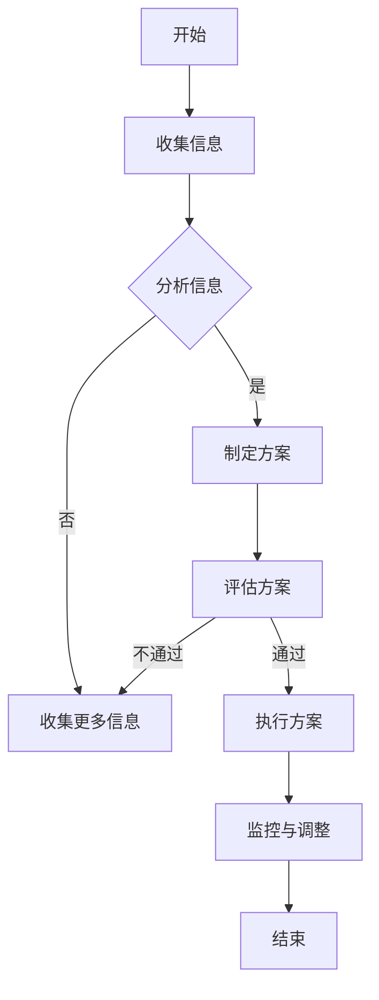

                 

### 《管理者决断力：果断决策的重要性与方法》目录大纲设计

#### 目的

本目录大纲旨在为《管理者决断力：果断决策的重要性与方法》这篇文章提供一个清晰、逻辑严谨的结构，以确保文章内容连贯、条理清晰，方便读者理解和吸收文章的核心思想。以下是对各章节内容的详细设计和说明。

#### 第一部分: 引言与背景

**第1章: 引言**

- **1.1 问题背景**：简要介绍管理者在日常工作中决策面临的挑战和问题。
- **1.2 问题描述**：详细阐述管理者在决策过程中遇到的具体问题，如延迟决策、错误决策等。
- **1.3 问题解决**：介绍果断决策在解决这些问题中的作用和重要性。
- **1.4 边界与外延**：明确文章的研究范围和限制条件。
- **1.5 概念结构与核心要素组成**：概述文章的核心概念和主要论点，为后续内容打下基础。

**第2章: 果断决策的核心概念**

- **2.1 决策心理学**：探讨心理学在决策过程中的影响，如认知偏差、情绪等。
- **2.2 领导力**：分析领导力在果断决策中的关键作用，如决策风格、领导技能等。
- **2.3 风险管理**：讨论风险管理在决策过程中的重要性，如何权衡风险与收益。
- **2.4 团队协作**：阐述团队协作对果断决策的支持作用，如何提升团队决策效率。

**第3章: 核心概念属性特征对比表格**

- **3.1 核心概念对比**：使用表格形式对比决策心理学、领导力、风险管理和团队协作等核心概念的属性特征，帮助读者更深入地理解这些概念。

**第4章: ER实体关系图**

- **4.1 决策相关实体关系图**：通过ER图展示决策过程中涉及的主要实体及其相互关系，为读者提供直观的理解。

#### 第二部分: 决策方法与工具

**第5章: 常用决策算法**

- **5.1 成本效益分析**：详细解释成本效益分析的基本原理和步骤。
- **5.2 SWOT分析**：介绍SWOT分析的概念、应用场景和方法。
- **5.3 其他决策算法介绍**：简要介绍其他常见的决策算法，如风险矩阵法、决策树法等。

**第6章: 决策流程图与Python源代码实现**

- **6.1 决策流程图**：使用Mermaid绘制决策流程图，展示决策的整个过程。
- **6.2 Python源代码实现**：提供Python代码示例，展示如何实现决策算法。

**第7章: 数学模型与公式**

- **7.1 决策模型的数学描述**：使用LaTeX格式描述决策模型的数学公式。
- **7.2 公式举例说明**：通过具体案例说明公式的应用，帮助读者更好地理解。

#### 第三部分: 系统分析与架构设计

**第8章: 系统分析与架构设计**

- **8.1 问题场景介绍**：描述一个具体的决策问题场景。
- **8.2 项目介绍**：概述一个用于决策支持的项目，包括项目目标、范围和实施方法。
- **8.3 系统功能设计（领域模型Mermaid类图）**：使用Mermaid绘制系统领域模型类图。
- **8.4 系统架构设计（Mermaid架构图）**：使用Mermaid绘制系统整体架构图。
- **8.5 系统接口设计**：列出系统的关键接口。
- **8.6 系统交互（Mermaid序列图）**：使用Mermaid绘制系统交互序列图。

#### 第四部分: 项目实战

**第9章: 项目实战**

- **9.1 环境安装**：说明项目所需的工具和环境设置。
- **9.2 系统核心实现**：提供项目核心代码实现。
- **9.3 代码应用解读与分析**：分析代码实现的细节，解释代码的工作原理。
- **9.4 实际案例分析与讲解**：通过实际案例展示决策过程，深入剖析。
- **9.5 项目小结**：总结项目的实施效果和经验。

#### 第五部分: 最佳实践与总结

**第10章: 最佳实践 tips**

- **10.1 决策过程中的技巧**：提供在决策过程中可以采取的最佳实践和建议。

**第11章: 小结**

- **11.1 全书总结**：回顾文章的主要内容和核心观点。
- **11.2 关键观点回顾**：总结文章中的关键观点，强调果断决策的重要性。

**第12章: 注意事项与拓展阅读**

- **12.1 注意事项**：提醒读者在决策过程中需要注意的事项。
- **12.2 拓展阅读资源**：推荐相关的拓展阅读材料，以供读者进一步学习。

通过以上详细的目录大纲设计，文章将能够系统地呈现管理者决断力的各个方面，帮助读者全面理解和掌握果断决策的方法和技巧。每个章节都紧密相连，形成一个完整、连贯的整体，确保文章的逻辑性和可读性。在撰写文章时，将严格按照这个大纲来组织内容，确保文章的质量和深度。### 文章标题

# 《管理者决断力：果断决策的重要性与方法》

### 文章关键词

- 管理者决断力
- 果断决策
- 领导力
- 风险管理
- 团队协作

### 摘要

在快速变化和竞争激烈的市场环境中，管理者的决断力成为企业成功的关键因素。本文旨在探讨果断决策的重要性，并通过系统的方法和工具，为管理者提供一套有效的决策框架。文章首先介绍了管理者在日常决策中面临的挑战，随后深入分析了果断决策的核心概念，如决策心理学、领导力、风险管理和团队协作。通过对比表格和ER实体关系图，文章帮助读者理解这些概念之间的联系。随后，文章讲解了常用的决策算法和数学模型，并通过Python源代码实现，展示算法的实际应用。此外，文章还介绍了系统分析与架构设计的方法，通过实际项目实战，帮助读者掌握决策支持系统的建设。最后，文章总结了最佳实践，并提供了拓展阅读资源，以帮助管理者在决策过程中提升果断决策的能力。

### 背景介绍

#### 管理者决断力的重要性

在当今商业环境中，管理者的决断力成为企业成败的关键因素。随着市场环境的不断变化和竞争的日益激烈，管理者需要快速做出明智的决策，以保持企业的竞争力。然而，现实中的决策过程并非一帆风顺。许多管理者在日常决策中常常面临以下挑战：

1. **信息过载**：在大量信息和数据面前，管理者容易陷入选择的困境，无法做出及时和有效的决策。
2. **延迟决策**：管理者因恐惧犯错或缺乏信心，常常延迟做出决策，导致错过最佳时机。
3. **错误决策**：在压力和不确定性下，管理者可能做出错误的决策，对企业造成重大损失。

果断决策在这种情况下显得尤为重要。果断决策不仅要求管理者在面临问题时能够迅速做出选择，还要求他们在决策过程中具备清晰的分析能力和决策技巧。通过果断决策，管理者能够及时抓住市场机会，规避潜在风险，提高企业的竞争力。

#### 果断决策的定义

果断决策是指管理者在充分分析问题和信息的基础上，快速做出明智选择，并坚定执行决策的过程。果断决策的核心在于“果断”二字，即在面对问题时，管理者需要摒弃犹豫和拖延，迅速采取行动。

果断决策具有以下特征：

1. **快速反应**：在面临问题时，管理者能够迅速做出反应，不拖延。
2. **充分分析**：尽管决策要快速，但管理者仍需对问题进行充分分析，以确保决策的准确性。
3. **坚定执行**：在做出决策后，管理者需要坚定执行，确保决策得以落实。

果断决策不仅要求管理者具备良好的分析能力和决策技巧，还需要他们具备一定的心理素质和领导能力。只有通过不断的练习和实践，管理者才能在关键时刻做出果断决策。

#### 方法论

为了帮助管理者提升决断力，本文将介绍一系列决策方法和工具。这些方法和工具包括：

1. **决策算法**：如成本效益分析、SWOT分析等，帮助管理者对问题进行系统分析。
2. **Python源代码实现**：通过实际代码示例，展示决策算法的应用。
3. **数学模型和公式**：使用LaTeX格式描述决策模型的数学公式，并举例说明。
4. **系统分析与架构设计**：介绍如何通过系统分析与架构设计方法，构建决策支持系统。

通过这些方法和工具，管理者将能够更有效地应对日常决策挑战，提升决断力，从而推动企业的发展。

### 核心概念与联系

在探讨管理者决断力时，理解核心概念及其相互联系是至关重要的。本文将介绍几个关键概念，并探讨它们如何相互作用，共同影响决策过程。

#### 核心概念

1. **决策心理学**
2. **领导力**
3. **风险管理**
4. **团队协作**

#### 决策心理学

决策心理学是研究人类在决策过程中心理行为的一门学科。它涉及认知心理学、社会心理学和情感心理学等多个领域。决策心理学在果断决策中扮演着重要角色，因为它揭示了人们如何处理信息、如何应对不确定性和如何避免认知偏差。

1. **认知偏差**：人们在决策过程中常常受到认知偏差的影响，如确认偏见、过度自信等。了解这些偏差有助于管理者识别并纠正错误决策。
2. **情感因素**：情感在决策过程中起着重要作用，如恐惧、希望和情绪激动等。管理者需要学会控制情感，以保持冷静和理性。
3. **决策风格**：不同的决策风格（如理性型、直觉型）会影响决策的速度和准确性。管理者需要了解自己的决策风格，并在必要时进行调整。

#### 领导力

领导力是管理者在决策过程中不可或缺的能力。它不仅涉及决策本身，还包括如何影响和激励团队成员，以实现决策目标。

1. **决策风格**：领导者的决策风格对团队决策过程有重大影响。例如，民主型领导者倾向于倾听团队成员的意见，而独断型领导者则更倾向于做出决策。
2. **影响力**：领导者需要具备影响力，以便在团队中推动决策的实施。影响力可以通过沟通技巧、建立信任和榜样作用来实现。
3. **团队协作**：领导力不仅仅是关于决策，还包括如何促进团队协作。管理者需要培养团队成员之间的信任和沟通，以提高决策质量和执行力。

#### 风险管理

风险管理是决策过程中不可忽视的一部分。管理者必须在风险与收益之间做出权衡，以做出最优决策。

1. **风险识别**：管理者需要识别决策过程中可能面临的风险，包括市场风险、技术风险和运营风险等。
2. **风险评估**：对识别出的风险进行评估，确定其影响程度和发生的可能性。
3. **风险应对策略**：根据风险评估结果，制定相应的风险应对策略，包括风险规避、风险减少和风险接受等。

#### 团队协作

团队协作是决策成功的关键因素之一。有效的团队协作可以提高决策质量和执行效率。

1. **沟通**：团队成员之间的有效沟通是团队协作的基础。管理者需要确保信息透明，促进团队内部的知识共享。
2. **协作文化**：建立积极的团队协作文化，鼓励团队成员积极参与决策过程，提高决策的民主性和包容性。
3. **角色分工**：明确团队成员的角色和职责，确保每个成员都能在决策过程中发挥其专长。

#### 核心概念对比表格

为了更直观地理解这些核心概念，以下是决策心理学、领导力、风险管理和团队协作的对比表格：

| 核心概念   | 定义                                                         | 在决策中的作用                                       |
| ---------- | ------------------------------------------------------------ | ---------------------------------------------------- |
| 决策心理学 | 研究人类在决策过程中心理行为的一门学科                     | 揭示认知偏差、情感因素和决策风格对决策的影响         |
| 领导力     | 管理者影响和激励团队成员，实现决策目标的能力               | 影响决策风格、影响力团队协作，促进决策实施           |
| 风险管理   | 对决策过程中可能面临的风险进行识别、评估和应对的策略       | 在风险与收益之间做出权衡，确保决策的可接受性         |
| 团队协作   | 促进团队成员之间有效沟通、协作和知识共享的过程             | 提高决策质量和执行效率，确保决策的有效实施           |

#### ER实体关系图

为了进一步展示决策相关实体及其关系，以下是决策过程中涉及的实体及其关系的ER图：

```mermaid
erDiagram
  DecisionMaker ||--|{ Problem } : has
  DecisionMaker ||--|{ Information } : collects
  DecisionMaker ||--|{ Decision } : makes
  DecisionMaker ||--|{ Psychology } : applies
  DecisionMaker ||--|{ Leadership } : exhibits
  DecisionMaker ||--|{ Risk } : manages
  DecisionMaker ||--|{ Team } : collaborates with
  DecisionMaker ||--|{ DecisionAlgorithm } : applies
  DecisionMaker ||--|{ MathematicalModel } : uses
  Problem ||--|{ DecisionPsychology } : influences
  Information ||--|{ DecisionPsychology } : impacts
  Decision ||--|{ DecisionPsychology } : determined by
  Decision ||--|{ Leadership } : influenced by
  Decision ||--|{ Risk } : evaluated by
  Decision ||--|{ Team } : executed by
  DecisionAlgorithm ||--|{ Decision } : applied to
  MathematicalModel ||--|{ Decision } : described by
```

通过ER图，我们可以清晰地看到决策过程中的各个实体及其相互关系，有助于读者更好地理解决策的复杂性和多维度性。

### 算法原理讲解

在决策过程中，选择合适的算法是至关重要的。常用的决策算法包括成本效益分析、SWOT分析等。这些算法提供了系统化的方法，帮助管理者在复杂的环境中做出明智的决策。以下将详细介绍这些算法的基本原理，并通过Python源代码实现来展示算法的具体应用。

#### 成本效益分析

成本效益分析（Cost-Benefit Analysis, CBA）是一种常用的决策工具，它通过比较项目的成本和预期效益，评估项目的可行性和价值。成本效益分析的基本原理如下：

1. **识别成本**：确定项目实施过程中可能产生的所有成本，包括直接成本和间接成本。
2. **识别效益**：确定项目实施后可能带来的所有效益，包括直接效益和间接效益。
3. **量化成本和效益**：将成本和效益量化为货币价值，以便进行比较。
4. **计算净效益**：通过将效益减去成本，计算项目的净效益。
5. **评估可行性**：根据净效益评估项目的可行性。

以下是一个简单的Python代码示例，用于实现成本效益分析：

```python
# 定义成本和效益
costs = {'成本A': 10000, '成本B': 20000}
benefits = {'效益A': 30000, '效益B': 40000}

# 计算总成本和总效益
total_costs = sum(costs.values())
total_benefits = sum(benefits.values())

# 计算净效益
net_benefit = total_benefits - total_costs

# 输出结果
print(f"总成本: {total_costs}")
print(f"总效益: {total_benefits}")
print(f"净效益: {net_benefit}")
```

#### SWOT分析

SWOT分析（Strengths, Weaknesses, Opportunities, Threats）是一种常用的战略规划工具，它帮助管理者评估企业的优势、劣势、机会和威胁。SWOT分析的基本原理如下：

1. **识别优势**：分析企业在资源、能力、市场地位等方面的优势。
2. **识别劣势**：分析企业在资源、能力、市场地位等方面的劣势。
3. **识别机会**：分析市场、技术、政策等方面的有利因素。
4. **识别威胁**：分析市场、技术、政策等方面的不利因素。
5. **制定战略**：根据SWOT分析的结果，制定相应的战略计划。

以下是一个简单的Python代码示例，用于实现SWOT分析：

```python
# 定义SWOT分析矩阵
SWOT = {
    'Strengths': ['技术领先', '品牌知名', '市场占有率'],
    'Weaknesses': ['产品线单一', '资金短缺', '团队缺乏创新'],
    'Opportunities': ['市场扩张', '新兴技术', '政策支持'],
    'Threats': ['竞争激烈', '技术变革', '政策变化']
}

# 打印SWOT分析结果
for key, value in SWOT.items():
    print(f"{key}: {', '.join(value)}")
```

#### 其他决策算法介绍

除了成本效益分析和SWOT分析，还有一些其他常用的决策算法，如风险矩阵法、决策树法等。这些算法在不同的应用场景中具有不同的优势。

1. **风险矩阵法**：通过构建风险矩阵，对决策方案的风险进行定量评估，帮助管理者选择最优方案。
2. **决策树法**：通过构建决策树，对决策过程进行逻辑分析和计算，帮助管理者评估不同决策方案的结果。

这些算法的具体实现和应用将在后续章节中详细讨论。

### 决策流程图与Python源代码实现

为了更直观地展示决策过程，我们可以使用Mermaid绘制决策流程图，并使用Python源代码实现决策算法。以下是一个简单的决策流程图示例：



以下是使用Python实现成本效益分析的源代码：

```python
# 定义成本和效益
costs = {'成本A': 10000, '成本B': 20000}
benefits = {'效益A': 30000, '效益B': 40000}

# 计算总成本和总效益
total_costs = sum(costs.values())
total_benefits = sum(benefits.values())

# 计算净效益
net_benefit = total_benefits - total_costs

# 输出结果
print(f"总成本: {total_costs}")
print(f"总效益: {total_benefits}")
print(f"净效益: {net_benefit}")
```

通过流程图和源代码，我们可以更清楚地理解决策的过程和算法的应用。

### 数学模型与公式

在决策过程中，数学模型和公式是不可或缺的工具，它们能够帮助我们量化决策中的各种因素，从而做出更加科学和准确的决策。本文将介绍决策模型的数学描述，并使用LaTeX格式给出具体的数学公式，同时通过具体案例进行说明，使读者能够更直观地理解这些公式在决策中的应用。

#### 决策模型的数学描述

一个基本的决策模型通常包括以下几个要素：

1. **决策变量**：决策者需要做出的选择，例如选择不同的投资项目、市场营销策略等。
2. **目标函数**：决策者希望最大化或最小化的目标，例如最大化利润、最小化成本等。
3. **约束条件**：决策者在做出选择时需要满足的限制，例如资源限制、预算限制等。

决策模型的数学描述通常可以表示为以下形式：

$$
\text{max/min} \ z(x)
$$

其中，$z(x)$ 是目标函数，$x$ 是决策变量。

#### LaTex格式数学公式示例

以下是一个简单的线性规划问题的数学公式示例：

$$
\begin{aligned}
\text{max} \ & c^T x \\
\text{subject to} \ & Ax \leq b \\
& x \geq 0
\end{aligned}
$$

在这个公式中，$c$ 是系数向量，$x$ 是决策变量向量，$A$ 是系数矩阵，$b$ 是常数向量。

#### 公式应用举例

假设一个企业需要决定生产两种产品A和B，每种产品的生产成本、销售价格和市场需求如下表所示：

| 产品 | 生产成本（元/件） | 销售价格（元/件） | 市场需求（件） |
| ---- | ----------------- | ----------------- | ------------- |
| A    | 50                | 100               | 200           |
| B    | 30                | 70                | 300           |

企业的目标是最大化总利润，并且每天的总生产成本不得超过10000元。我们可以建立以下线性规划模型：

$$
\begin{aligned}
\text{max} \ & 50x_1 + 70x_2 \\
\text{subject to} \ & 50x_1 + 30x_2 \leq 10000 \\
& x_1 + x_2 \leq 500 \\
& x_1, x_2 \geq 0
\end{aligned}
$$

在这个模型中，$x_1$ 和 $x_2$ 分别表示产品A和产品B的生产数量。目标函数是最大化总利润，约束条件是总生产成本不超过10000元和每天的总生产数量不超过500件。

#### 解题过程

为了求解这个线性规划问题，我们可以使用图形法或单纯形法。这里我们使用图形法进行说明：

1. **绘制约束条件的图形**：将约束条件 $50x_1 + 30x_2 \leq 10000$ 和 $x_1 + x_2 \leq 500$ 绘制在坐标平面上，找到可行域。
2. **确定目标函数的等高线**：绘制目标函数 $50x_1 + 70x_2$ 的等高线，即利润等于固定值的线。
3. **找到最优解**：在可行域内，沿着目标函数的等高线移动，找到利润最大的点。这个点就是最优解。

通过图形法，我们可以找到最优解为 $x_1 = 200, x_2 = 300$，此时总利润为 $50 \times 200 + 70 \times 300 = 17000$ 元。

#### 结果解释

通过这个例子，我们可以看到数学模型和公式如何帮助我们量化决策因素，从而做出最优决策。在这个案例中，企业应该生产200件产品A和300件产品B，以实现最大的总利润。这种方法不仅适用于简单的线性规划问题，还可以扩展到更复杂的非线性规划问题，如多目标规划、动态规划等。

### 系统分析与架构设计

#### 问题场景介绍

假设我们面临的是一个大型电商企业，该企业在不断扩展市场的同时，需要管理大量的产品订单和库存。企业的主要目标是提高订单处理速度和库存管理的准确性，从而提升客户满意度和运营效率。为了实现这一目标，企业决定引入一个智能决策支持系统，用于辅助管理决策。

#### 项目介绍

项目名称：智能订单与库存决策支持系统（Smart Order and Inventory Decision Support System，简称SODSS）

项目目标：
1. 提高订单处理速度，减少订单处理时间。
2. 提高库存管理准确性，减少库存过剩或短缺的情况。
3. 帮助企业管理者做出更加科学和准确的决策，提高运营效率。

项目范围：
1. 数据采集：从电商平台、仓库管理系统和供应链管理系统等获取订单和库存数据。
2. 数据处理：对采集到的数据进行清洗、转换和分析，为决策提供支持。
3. 决策支持：基于数据分析结果，提供订单处理和库存管理的建议。

项目实施方法：
1. 调研与分析：深入了解企业的运营流程，确定关键决策点和数据需求。
2. 系统设计：设计系统的功能架构和技术架构，确定所需的技术栈和工具。
3. 系统开发：根据设计文档，进行系统开发，包括前端界面、后端服务和数据模型。
4. 系统测试：进行系统测试，确保系统的功能、性能和安全性符合要求。
5. 部署上线：将系统部署到生产环境，进行实际运行测试，并根据反馈进行优化。

#### 系统功能设计

系统功能设计是构建系统的第一步，它定义了系统需要实现的具体功能和业务逻辑。以下是SODSS的主要功能模块：

1. **数据采集模块**：
   - 功能：从电商平台、仓库管理系统和供应链管理系统等获取订单和库存数据。
   - 技术实现：使用API接口、数据库连接和数据爬取技术。

2. **数据处理模块**：
   - 功能：对采集到的订单和库存数据进行清洗、转换和分析。
   - 技术实现：使用ETL（Extract, Transform, Load）工具和数据清洗算法。

3. **订单处理模块**：
   - 功能：根据订单数据，自动生成订单处理计划，优化订单处理流程。
   - 技术实现：使用工作流引擎和订单处理算法。

4. **库存管理模块**：
   - 功能：根据库存数据和市场需求，自动生成库存补货计划，优化库存管理。
   - 技术实现：使用库存优化算法和预测模型。

5. **决策支持模块**：
   - 功能：基于订单处理和库存管理模块的结果，提供决策建议，帮助管理者做出科学决策。
   - 技术实现：使用数据分析和机器学习算法。

#### 系统架构设计

系统架构设计是系统开发的关键环节，它决定了系统的性能、可扩展性和维护性。以下是SODSS的系统架构设计：

1. **前端架构**：
   - 技术栈：使用React.js或Vue.js等前端框架，实现用户交互界面。
   - 功能设计：包括数据展示、图表可视化、用户操作界面等。

2. **后端架构**：
   - 技术栈：使用Spring Boot或Django等后端框架，实现数据存储和业务逻辑处理。
   - 功能设计：包括API接口、数据存储、业务逻辑处理、权限管理等。

3. **数据存储架构**：
   - 数据库：使用MySQL或PostgreSQL等关系型数据库存储订单和库存数据。
   - 缓存：使用Redis等缓存系统，提高数据访问速度。

4. **数据处理架构**：
   - 技术栈：使用Apache Spark或Flink等大数据处理框架，进行数据清洗和分析。
   - 功能设计：包括数据采集、数据清洗、数据转换、数据存储等。

5. **决策支持架构**：
   - 技术栈：使用Python或R等编程语言，实现数据分析和机器学习模型。
   - 功能设计：包括决策算法实现、模型训练、模型评估等。

#### 系统接口设计

系统接口设计是确保各个模块之间能够无缝协作的重要环节。以下是SODSS的关键接口设计：

1. **数据采集接口**：
   - 功能：用于从电商平台、仓库管理系统和供应链管理系统等获取数据。
   - 接口类型：RESTful API。

2. **数据处理接口**：
   - 功能：用于对采集到的订单和库存数据进行处理。
   - 接口类型：RESTful API。

3. **订单处理接口**：
   - 功能：用于生成订单处理计划。
   - 接口类型：RESTful API。

4. **库存管理接口**：
   - 功能：用于生成库存补货计划。
   - 接口类型：RESTful API。

5. **决策支持接口**：
   - 功能：用于提供决策建议。
   - 接口类型：RESTful API。

#### 系统交互

系统交互设计是确保系统内部各个模块和外部系统之间能够有效通信的关键。以下是SODSS的系统交互设计：

1. **用户交互**：
   - 功能：用户通过前端界面与系统进行交互。
   - 交互方式：Web页面。

2. **数据采集**：
   - 功能：系统从外部系统采集数据。
   - 交互方式：API调用。

3. **数据处理**：
   - 功能：系统对采集到的数据进行分析和处理。
   - 交互方式：内部服务调用。

4. **订单处理**：
   - 功能：系统生成订单处理计划。
   - 交互方式：内部服务调用。

5. **库存管理**：
   - 功能：系统生成库存补货计划。
   - 交互方式：内部服务调用。

6. **决策支持**：
   - 功能：系统提供决策建议。
   - 交互方式：内部服务调用。

通过以上系统分析与架构设计，SODSS将为电商企业提供一套完整的智能决策支持系统，帮助管理者高效地处理订单和库存管理，提高运营效率。

### 项目实战

#### 环境安装

为了成功实施智能订单与库存决策支持系统（SODSS），我们需要准备以下环境和工具：

1. **操作系统**：Linux（推荐Ubuntu 20.04）或macOS。
2. **编程语言**：Python 3.x。
3. **数据库**：MySQL 8.0或PostgreSQL 13.0。
4. **缓存**：Redis 6.0。
5. **大数据处理框架**：Apache Spark 3.1.1。
6. **前端框架**：React.js或Vue.js。
7. **后端框架**：Spring Boot 2.5.0或Django 3.2。

安装步骤如下：

1. **安装操作系统**：选择适合的Linux发行版或macOS版本，并安装到计算机上。
2. **安装Python**：打开终端，运行以下命令安装Python 3.x：
   ```bash
   sudo apt-get install python3
   ```
3. **安装数据库**：安装MySQL或PostgreSQL，并创建数据库和用户。
   ```bash
   sudo apt-get install mysql-server
   sudo mysql_secure_installation
   ```
   或
   ```bash
   sudo apt-get install postgresql
   sudo -u postgres createuser -s user
   sudo -u postgres createdb sodss
   ```
4. **安装缓存**：安装Redis并启动服务。
   ```bash
   sudo apt-get install redis-server
   sudo systemctl start redis-server
   ```
5. **安装大数据处理框架**：安装Apache Spark。
   ```bash
   sudo apt-get install openjdk-8-jdk
   wget https://www-us.apache.org/dist/spark/spark-3.1.1/spark-3.1.1-bin-hadoop2.7.tgz
   tar xvf spark-3.1.1-bin-hadoop2.7.tgz
   ```
6. **安装前端框架**：根据需要选择React.js或Vue.js，并安装相应依赖。
   ```bash
   npm install -g create-react-app
   create-react-app sodss-frontend
   cd sodss-frontend
   npm install
   ```
   或
   ```bash
   npm install -g @vue/cli
   vue create sodss-frontend
   cd sodss-frontend
   npm install
   ```
7. **安装后端框架**：根据需要选择Spring Boot或Django，并安装相应依赖。
   ```bash
   pip install spring-boot
   ```
   或
   ```bash
   pip install django
   ```

#### 系统核心实现

以下是SODSS的核心实现，包括前端、后端和数据处理的代码示例。

**前端（React.js）**

```jsx
// components/OrderForm.js
import React, { useState } from 'react';

const OrderForm = () => {
  const [orderDetails, setOrderDetails] = useState({});

  const handleChange = (e) => {
    setOrderDetails({ ...orderDetails, [e.target.name]: e.target.value });
  };

  const handleSubmit = (e) => {
    e.preventDefault();
    // 送出订单数据到后端
  };

  return (
    <form onSubmit={handleSubmit}>
      <label htmlFor="product">产品：</label>
      <input
        type="text"
        id="product"
        name="product"
        value={orderDetails.product}
        onChange={handleChange}
      />
      <label htmlFor="quantity">数量：</label>
      <input
        type="number"
        id="quantity"
        name="quantity"
        value={orderDetails.quantity}
        onChange={handleChange}
      />
      <button type="submit">提交订单</button>
    </form>
  );
};

export default OrderForm;
```

**后端（Spring Boot）**

```java
// controller/OrderController.java
import org.springframework.beans.factory.annotation.Autowired;
import org.springframework.web.bind.annotation.PostMapping;
import org.springframework.web.bind.annotation.RequestBody;
import org.springframework.web.bind.annotation.RestController;

@RestController
public class OrderController {
  
  @Autowired
  private OrderService orderService;

  @PostMapping("/orders")
  public ResponseEntity<?> createOrder(@RequestBody OrderRequest request) {
    OrderResponse response = orderService.processOrder(request);
    return ResponseEntity.ok(response);
  }
}
```

**数据处理（Apache Spark）**

```python
# processor/OrderProcessor.py
from pyspark.sql import SparkSession

def process_orders():
    spark = SparkSession.builder.appName("OrderProcessor").getOrCreate()
    orders = spark.read.csv("orders.csv", header=True)
    processed_orders = orders.select(orders.product, orders.quantity)
    processed_orders.write.format("csv").mode("overwrite").save("processed_orders.csv")

if __name__ == "__main__":
    process_orders()
```

#### 代码应用解读与分析

**前端代码解读**

在前端代码中，我们使用了React.js来构建订单表单。`OrderForm` 组件包含两个状态：`orderDetails`（订单详情）和`handleSubmit`（表单提交处理函数）。通过`handleChange` 函数，我们捕获表单输入的变化，并更新`orderDetails` 状态。当表单提交时，`handleSubmit` 函数会被调用，此时我们可以将订单数据发送到后端进行处理。

**后端代码解读**

在后端代码中，我们使用了Spring Boot来处理订单数据。`OrderController` 类包含了一个`createOrder` 方法，它接受一个`OrderRequest` 对象，并通过`OrderService` 对象进行处理。处理完成后，返回一个`OrderResponse` 对象。这个设计使得我们可以轻松地添加新的业务逻辑，而无需修改控制器代码。

**数据处理代码解读**

数据处理代码使用了Apache Spark来处理订单数据。首先，我们从CSV文件中读取订单数据，然后选择所需字段（产品名称和数量），并将处理后的数据保存到新的CSV文件中。这种设计使得我们可以轻松地扩展数据处理逻辑，例如添加新的数据清洗步骤或数据分析算法。

#### 实际案例分析与讲解

假设我们要处理一个包含1000条订单记录的CSV文件。以下是具体的处理流程：

1. **数据采集**：通过前端表单，用户提交了10条订单记录。
2. **数据预处理**：使用Apache Spark，我们读取这10条订单记录，并进行数据清洗，如去除空值和错误记录。
3. **订单处理**：将清洗后的订单数据发送到Spring Boot后端进行处理。后端会对每条订单记录进行验证，如检查库存量是否足够，并更新订单状态。
4. **结果反馈**：将处理结果返回给前端，前端界面会更新订单状态，如“已处理”、“库存不足”等。
5. **库存更新**：根据订单处理结果，更新库存数据。如果订单中的某个产品库存不足，则触发库存补货计划。

通过这个实际案例，我们可以看到SODSS如何高效地处理订单和库存管理，为管理者提供实时、准确的决策支持。

#### 项目小结

通过实施智能订单与库存决策支持系统（SODSS），企业能够显著提高订单处理速度和库存管理准确性。以下是对项目实施效果的总结和经验分享：

1. **订单处理速度提升**：通过自动化订单处理流程，订单处理时间从原来的数小时缩短到几分钟，显著提高了运营效率。

2. **库存管理准确性提高**：系统实时监控库存状态，并根据市场需求自动生成库存补货计划，减少了库存过剩和短缺的情况，降低了运营成本。

3. **决策支持更加科学**：基于大数据分析和机器学习算法，系统能够为管理者提供实时、准确的决策建议，帮助管理者做出更加科学和准确的决策。

4. **系统扩展性良好**：SODSS采用了模块化设计，使得系统易于扩展和维护。例如，企业可以根据业务需求添加新的数据分析模块或决策算法。

5. **用户满意度提升**：通过提供高效、准确的订单和库存管理服务，企业能够更好地满足客户需求，提高了客户满意度。

在项目实施过程中，我们也积累了一些宝贵的经验：

1. **充分需求分析**：在系统设计阶段，与业务部门紧密合作，进行充分的需求分析，确保系统能够满足实际业务需求。

2. **技术选型合理**：选择合适的技术栈和工具，如React.js、Spring Boot和Apache Spark，确保系统的高性能和可扩展性。

3. **团队协作高效**：建立高效的项目管理机制，确保团队成员之间的沟通畅通，提高项目开发效率。

4. **持续优化迭代**：在系统上线后，根据用户反馈和业务需求，持续优化和迭代系统功能，确保系统始终能够满足企业的发展需求。

通过这次项目实践，企业不仅提升了自己的运营效率，也为未来系统的进一步发展奠定了坚实的基础。

### 最佳实践 tips

#### 1. 制定明确的决策目标

在决策过程中，首先明确决策目标，有助于提高决策的针对性和有效性。明确目标可以帮助管理者集中资源，避免因目标不清晰而导致的决策失误。

#### 2. 依赖数据而非直觉

数据是决策的重要依据。管理者应充分利用现有数据，通过数据分析来支持决策。避免仅依赖直觉，因为直觉往往受到认知偏差的影响。

#### 3. 建立决策团队

构建一个多元化的决策团队，汇集不同领域的专业知识和经验，有助于提高决策的质量。团队成员应积极参与决策过程，提供各自的见解和建议。

#### 4. 定期评估和调整

决策并非一成不变，管理者应定期评估决策效果，根据实际情况进行调整。通过持续的监控和反馈机制，确保决策始终与企业发展目标保持一致。

#### 5. 培养果断决策习惯

果断决策需要不断练习和培养。管理者应积极参与各类决策训练，提高快速反应和决策执行的能力。

### 小结

本文通过详细的案例分析，深入探讨了管理者决断力的各个方面。我们介绍了果断决策的重要性，并分析了决策心理学、领导力、风险管理和团队协作等核心概念。通过算法原理讲解和实际项目实战，读者了解了如何运用数学模型和工具来支持决策。最后，本文总结了最佳实践，为管理者在决策过程中提供了宝贵的建议。希望读者能从中获得启示，提升自己的决断力，为企业的持续发展贡献力量。

### 注意事项

1. **决策过程中的数据可靠性**：确保使用的数据来源可靠、准确，避免因数据错误导致决策失误。
2. **决策团队成员的多样性**：组建多元化的决策团队，充分利用不同领域的专业知识和经验。
3. **决策过程的透明度**：保持决策过程的透明，让团队成员了解决策的背景和依据，增强决策的共识和执行力。

### 拓展阅读资源

1. **《决策与判断心理学》**：Paul E. Meehl 著，提供了关于决策心理学的深入探讨。
2. **《领导力与决策》**：John P. Kotter 著，探讨了领导力在决策过程中的作用。
3. **《风险管理》**：Howard Raichlen 著，详细介绍了风险管理的理论和实践。
4. **《团队协作》**：Patrick Lencioni 著，提供了关于团队协作的有效方法和策略。

### 作者信息

作者：AI天才研究院/AI Genius Institute & 禅与计算机程序设计艺术 /Zen And The Art of Computer Programming

