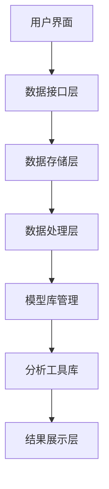

                 

### 文章标题：管理者决策模型：科学决策的框架与工具

决策，是管理活动中不可或缺的一部分。无论是企业运营、项目策划，还是团队管理，科学、合理的决策都是成功的关键。然而，在实际操作中，管理者往往面临信息不全、时间紧迫、资源有限等诸多挑战，如何在这重重困境中做出高质量、高效率的决策，成为管理者亟待解决的重要课题。

本文旨在构建一个系统化的决策模型，帮助管理者在面对复杂问题时，能够有条不紊地进行科学决策。我们将分三大部分进行探讨：首先是决策理论基础，介绍决策的定义、过程、原则与方法；其次是科学决策框架，详细讲解决策分析模型、期望值模型、风险分析模型等；最后是决策工具，重点分析决策支持系统、决策者行为分析以及情境分析与决策制定。

希望通过这篇文章，能够为管理者提供一个清晰、实用的决策框架，使其在日后的工作中能够游刃有余地应对各种决策挑战。

---

### 关键词

- 管理者决策
- 科学决策框架
- 决策分析模型
- 决策支持系统
- 决策者行为分析
- 情境分析与决策制定

### 摘要

本文详细阐述了管理者决策模型，涵盖决策理论基础、科学决策框架和决策工具三大板块。首先，从决策的定义、过程、原则与方法出发，探讨了决策的基本理论；接着，介绍了决策分析模型、期望值模型、风险分析模型等科学决策方法；最后，分析了决策支持系统、决策者行为分析以及情境分析与决策制定，为管理者提供了一套实用、系统的决策框架。通过本文的学习，读者将能够更科学、合理地进行决策，提升管理水平和效果。

## 第一部分：决策理论基础

### 第1章：决策的背景与概念

#### 1.1 决策的背景

决策，是管理者必须面对的核心任务之一。在快速变化的市场环境中，企业需要不断调整战略，以应对内外部环境的挑战。决策的质量和效率直接影响到企业的竞争力和生存发展。因此，了解决策的背景和概念，对于管理者来说至关重要。

首先，从宏观层面来看，决策背景涉及到企业所处的市场环境、行业发展趋势、宏观经济政策等因素。例如，在全球化背景下，国际贸易环境的变化、新兴市场的崛起，都对企业的决策产生了深远影响。

其次，从微观层面来看，决策背景则主要涉及企业的内部运营情况。这包括企业的资源状况、技术水平、人力资源配置、组织结构等。管理者需要根据这些内部因素，制定相应的决策方案，以实现企业目标。

#### 1.2 决策的定义

决策，是指在面对不确定性时，通过选择和实施不同的方案，以达到预期目标的过程。简单来说，决策包括两个关键步骤：首先是选择不同的方案，其次是选择最优的方案。

首先，方案的选择。在决策过程中，管理者需要根据问题的性质、目标的要求以及可用的资源，制定多个可能的方案。这些方案可以是不同的战略规划、项目管理方案、市场营销策略等。

其次，最优方案的选择。在多个方案中，管理者需要通过分析和评估，选出最优的方案。最优方案的标准可以是最大化效益、最小化成本、最高风险容忍度等。这需要管理者具备敏锐的洞察力、丰富的经验以及科学的决策方法。

#### 1.3 决策的类型

决策的类型多种多样，可以根据不同的分类标准进行划分。以下是几种常见的决策类型：

1. **根据决策目标的不同**，可分为战略决策、管理决策和操作决策。战略决策主要涉及企业的长期发展方向和核心竞争力，管理决策主要涉及企业的日常运营和管理，操作决策则主要涉及具体的执行和操作。

2. **根据决策问题的性质**，可分为确定性决策和不确定性决策。确定性决策是在已知条件下进行的决策，其结果相对明确。不确定性决策则是在信息不完全或不确定的条件下进行的决策，其结果具有不确定性。

3. **根据决策的主体**，可分为个人决策和群体决策。个人决策是指由个体独立完成的决策，群体决策则是指由多人共同完成的决策。

#### 1.4 决策的概念结构

决策的概念结构主要包括以下几个要素：

1. **决策者**：决策者是指拥有决策权并负责做出决策的个人或团体。决策者的角色和地位决定了决策的权威性和有效性。

2. **决策目标**：决策目标是指决策者希望通过决策实现的具体目标或结果。明确的目标有助于决策者更好地选择和评估不同的方案。

3. **决策方案**：决策方案是指为实现决策目标而制定的具体行动方案。决策者需要在多个方案中选择最优的方案。

4. **决策结果**：决策结果是决策者选择最优方案后实施的结果。决策结果可以反映决策的有效性和合理性。

5. **决策环境**：决策环境是指决策者所处的内外部环境，包括市场环境、政策环境、技术环境等。决策环境的变化会影响决策的有效性和适应性。

#### 1.5 决策的原则与方法

1. **科学性原则**：决策过程应遵循科学的原则，通过数据分析和模型模拟，提高决策的准确性和可靠性。

2. **系统性原则**：决策应从整体出发，考虑各个部门、各个环节的相互关系和影响，实现系统优化。

3. **动态性原则**：决策应具备动态调整的能力，能够根据环境变化和实际情况进行调整。

4. **可行性原则**：决策应具备可行性，考虑资源的可用性和实施的可能性。

决策方法主要包括以下几种：

1. **定量分析**：通过数学模型、统计分析等方法，对决策问题进行定量分析，得出最优解。

2. **定性分析**：通过专家评估、头脑风暴等方法，对决策问题进行定性分析，得出定性结论。

3. **综合分析**：将定量分析和定性分析结合起来，综合考虑各种因素，得出综合性的决策结果。

#### 1.6 决策的边界与外延

1. **决策的边界**：决策的边界是指决策者可以控制和影响的范围。决策者在制定决策时，需要明确决策的边界，以避免决策的无效或错误。

2. **决策的外延**：决策的外延是指决策的影响范围。一个决策不仅影响决策者本身，还会影响其他部门、其他环节，甚至整个企业。因此，决策者在制定决策时，需要充分考虑决策的外延，以实现整体利益的最大化。

3. **决策的限制因素**：决策的限制因素是指影响决策的各种约束条件。这些因素包括资源限制、时间限制、法律限制、政策限制等。决策者在制定决策时，需要充分考虑这些限制因素，以避免决策的失败。

4. **决策的伦理问题**：决策的伦理问题是指决策者在制定决策时，需要考虑的道德和伦理问题。例如，是否公平、是否公正、是否合理等。决策者在制定决策时，需要遵循伦理原则，确保决策的道德性和合理性。

5. **决策的社会影响**：决策的社会影响是指决策对社会和环境的影响。决策不仅关系到企业的利益，也关系到社会的利益。因此，决策者在制定决策时，需要考虑社会影响，确保决策的可持续性和社会责任。

#### 1.7 本章小结

本章从决策的背景与概念出发，探讨了决策的定义、类型、概念结构、原则与方法，以及决策的边界与外延。通过本章的学习，读者可以了解决策的基本理论，为后续章节的学习打下基础。在接下来的章节中，我们将进一步探讨科学决策的框架和工具，帮助管理者在复杂环境中做出高质量的决策。

## 第2章：决策分析模型

### 2.1 决策分析模型概述

在决策过程中，决策分析模型扮演着至关重要的角色。它们不仅帮助我们理解问题的复杂性和不确定性，还为我们提供了系统化的方法来评估不同的解决方案。决策分析模型是一套结构化的工具和方法，用于分析和解决决策问题。它们可以帮助决策者识别问题、定义目标、生成备选方案、评估方案、选择最优方案，并提供决策的支持。

#### 2.1.1 决策分析模型的定义

决策分析模型，是指在决策过程中，通过建立数学模型、逻辑框架和算法，对决策问题进行分析和评估的一套系统方法。这些模型可以基于数学、统计学、运筹学、计算机科学等学科的理论，通过量化分析、模拟和优化，为决策者提供科学的决策支持。

#### 2.1.2 决策分析模型的作用

决策分析模型的作用主要体现在以下几个方面：

1. **结构化决策过程**：通过决策分析模型，可以将复杂的决策问题分解为多个子问题，从而结构化决策过程，使得决策更加有序和系统。

2. **提高决策效率**：决策分析模型可以快速地处理和分析大量数据，提供决策依据，从而提高决策的效率和准确性。

3. **减少决策风险**：通过模拟和预测，决策分析模型可以帮助决策者识别潜在的风险和不确定性，从而减少决策的风险。

4. **支持决策创新**：决策分析模型可以提供多种备选方案和优化方案，激发决策者的创新思维，从而产生更优的决策结果。

#### 2.1.3 决策分析模型的发展历程

决策分析模型的发展历程可以追溯到20世纪中期。以下是一些关键的里程碑：

1. **线性规划**（1940年代）：线性规划是第一个正式的决策分析模型，用于解决线性优化问题。它为后来的决策分析模型奠定了基础。

2. **决策树**（1960年代）：决策树是一种直观的模型，用于表示决策路径和结果。它广泛应用于业务和管理决策。

3. **模拟分析**（1970年代）：模拟分析通过构建模型并运行多个模拟场景，评估不同决策的后果。

4. **多目标优化**（1980年代）：随着决策问题的复杂度增加，多目标优化模型应运而生，用于解决包含多个目标的决策问题。

5. **人工智能和机器学习**（1990年代至今）：随着计算能力的提升和算法的发展，人工智能和机器学习技术被广泛应用于决策分析模型，如深度学习、强化学习等。

#### 2.1.4 决策分析模型的应用领域

决策分析模型在各个领域都有广泛的应用，以下是一些典型的应用领域：

1. **企业管理**：用于市场分析、供应链管理、人力资源规划、项目管理等。

2. **金融管理**：用于投资分析、风险管理、资产配置等。

3. **公共管理**：用于公共政策制定、应急管理、资源分配等。

4. **科学研究**：用于实验设计、数据分析、模型预测等。

5. **工程和技术**：用于工程设计、项目管理、质量控制等。

#### 2.1.5 决策分析模型的选择

选择合适的决策分析模型取决于以下几个因素：

1. **问题的性质**：不同的问题需要不同的模型。例如，线性规划适用于优化问题，而模拟分析适用于不确定性问题。

2. **数据的可用性**：模型的输入数据是决策分析的重要基础。数据的质量和数量直接影响模型的有效性。

3. **模型的复杂性**：简单的模型易于理解和操作，但可能无法处理复杂的问题。复杂的模型能处理更复杂的问题，但可能需要更多的时间和计算资源。

4. **决策者的偏好**：决策者的背景、经验和偏好也会影响模型的选择。

### 2.2 决策树模型

决策树模型是一种结构化的决策分析方法，通过一系列的判断节点和结果节点，以树状结构表示决策过程。它直观地展示了不同决策路径及其可能的结果，因此广泛应用于各种决策问题。

#### 2.2.1 决策树模型的基本概念

1. **节点**：决策树中的每个节点代表一个判断或决策点。判断节点表示需要进行的测试或决策，结果节点表示测试结果或决策结果。

2. **分支**：从节点出发的线条称为分支，表示可能的决策或结果。

3. **叶节点**：叶节点表示决策的结果或某个具体的方案。

4. **概率分布**：在决策树中，每个结果节点通常都与一个概率分布相关联，表示该结果发生的可能性。

#### 2.2.2 决策树模型的构建过程

1. **定义决策问题**：明确决策的目标和问题。

2. **收集数据**：收集与决策相关的数据，包括输入变量和结果变量。

3. **构建决策树**：基于数据，构建决策树。这通常通过递归分割数据集来实现。常见的算法包括ID3、C4.5、CART等。

4. **评估决策树**：通过交叉验证或测试集来评估决策树的性能。

5. **剪枝**：为了提高决策树的泛化能力，可能需要对其进行剪枝处理，移除过拟合的部分。

#### 2.2.3 决策树模型的应用实例

**案例：客户信用评估**

在一个银行的信用评估问题中，决策树模型可以用于预测客户是否会按时还款。输入变量可能包括客户的收入、债务比率、信用历史等，结果变量是客户是否按时还款。

通过构建决策树，银行可以基于客户的特征信息，给出是否批准贷款的建议。例如，如果客户的收入超过一定阈值且债务比率低于一定阈值，那么模型会建议批准贷款。

### 2.3 期望值模型

期望值模型是决策分析中的一种重要方法，用于评估不同决策结果的预期收益或成本。它通过计算各个结果的期望值，帮助决策者选择最优的决策方案。

#### 2.3.1 期望值模型的基本原理

期望值模型基于概率论和统计学原理，其核心思想是通过加权平均来预测决策结果的总体表现。具体来说，每个可能的结果都根据其发生的概率进行加权，然后求和，得到总体期望值。

#### 2.3.2 期望值模型的计算方法

1. **定义结果和概率**：首先，明确所有可能的结果及其发生的概率。

2. **计算期望值**：使用公式：
   $$
   E = \sum_{i=1}^{n} x_i \cdot p_i
   $$
   其中，\(x_i\) 是第 \(i\) 个结果，\(p_i\) 是其概率。

3. **比较期望值**：根据期望值比较不同决策方案，选择期望值最大的方案。

#### 2.3.3 期望值模型的应用场景

期望值模型广泛应用于各种决策问题，包括：

1. **风险管理**：用于评估不同风险策略的预期损失。

2. **投资分析**：用于评估不同投资方案的预期收益。

3. **运营管理**：用于优化决策，如库存管理、生产计划等。

### 2.4 风险分析模型

风险分析模型用于评估和管理决策中的不确定性因素，通过识别、分析和量化风险，帮助决策者做出更加全面和稳健的决策。

#### 2.4.1 风险分析模型的概念

1. **风险**：指在决策过程中，由于不确定性导致的结果偏离预期目标的可能性和程度。

2. **风险识别**：指识别决策中可能存在的各种风险。

3. **风险分析**：指对识别出的风险进行评估和量化。

4. **风险管理**：指通过控制和降低风险，确保决策目标实现。

#### 2.4.2 风险分析模型的方法

1. **定性分析**：通过专家评估、头脑风暴等方法，对风险进行定性描述和分类。

2. **定量分析**：通过概率模型、期望值等方法，对风险进行定量评估。

3. **情景分析**：通过构建不同情景，评估风险对决策结果的影响。

4. **敏感性分析**：通过分析不同因素的变化对决策结果的影响，识别关键风险因素。

#### 2.4.3 风险分析模型的应用

1. **项目管理**：用于评估项目实施过程中可能面临的风险。

2. **投资决策**：用于评估不同投资方案的风险和收益。

3. **企业战略**：用于评估企业战略实施过程中的风险。

### 2.5 本章小结

本章介绍了决策分析模型的基本概念、作用和发展历程，详细讲解了决策树模型、期望值模型和风险分析模型。通过这些模型，管理者可以在复杂决策环境中更加科学和系统地做出决策。在下一章中，我们将进一步探讨决策过程中常用的其他工具和方法，以帮助管理者应对各种挑战。## 2.5 本章小结

本章深入探讨了决策分析模型，从定义、作用、发展历程到具体的应用方法，为读者提供了一个全面的视角。通过学习本章，读者可以了解到：

1. **决策分析模型的重要性**：在复杂决策环境中，决策分析模型作为一种结构化的工具和方法，可以帮助管理者系统化、科学化地进行决策。

2. **决策树模型**：通过构建决策树，管理者可以清晰地展示决策过程和可能的结果，从而更好地理解和分析决策问题。

3. **期望值模型**：期望值模型通过计算不同结果的预期收益或成本，帮助管理者选择最优的决策方案。

4. **风险分析模型**：风险分析模型用于识别、评估和管理决策中的不确定性因素，为管理者提供全面的风险评估和管理工具。

通过本章的学习，读者可以掌握这些决策分析模型的基本概念和应用方法，为实际决策提供有力的支持。在接下来的章节中，我们将继续探讨更多决策工具和方法，帮助管理者在面对复杂决策时更加从容和有效。

## 第3章：决策支持系统

### 3.1 决策支持系统的概念

决策支持系统（Decision Support System，简称DSS）是一种计算机化的信息系统，旨在帮助决策者通过提供信息和分析工具，进行更加科学、合理和高效的决策。DSS结合了计算机科学、运筹学、统计学、数据库管理等多个领域的技术，为决策者提供强大的决策支持。

#### 3.1.1 决策支持系统的定义

决策支持系统是一个交互式的系统，它通过收集、存储、处理和分析信息，为决策者提供数据、模型和工具，帮助他们分析问题、模拟方案、评估结果，并做出最优决策。DSS通常包括以下几个关键组成部分：

1. **数据库**：存储与管理决策相关的数据。
2. **模型库**：包括各种决策模型和算法，用于模拟和分析决策问题。
3. **用户界面**：提供用户与系统交互的界面，用户可以通过界面进行数据输入、模型选择和结果分析。
4. **方法库**：包括数据分析、数据挖掘、优化算法等，用于增强DSS的功能。

#### 3.1.2 决策支持系统的组成

1. **数据库管理系统**：负责存储、管理和检索数据。数据库管理系统（DBMS）是DSS的核心组件，它确保数据的完整性、一致性和安全性。

2. **模型库管理系统**：管理决策模型，包括模型的创建、修改、存储和调用。模型库管理系统（MBMS）是DSS的智能核心，它提供了丰富的模型选择和定制功能。

3. **用户界面**：用户界面（UI）是DSS与用户之间的交互界面。一个良好的用户界面应具备直观、易用、灵活等特点，使用户能够轻松地进行数据输入、模型选择和结果分析。

4. **分析工具**：包括数据分析、数据挖掘、优化算法等工具，用于支持决策者进行数据分析和决策模拟。

#### 3.1.3 决策支持系统的特点

1. **交互性**：DSS提供用户与系统之间的互动，用户可以实时输入数据、调整模型参数，并查看分析结果。

2. **灵活性**：DSS可以根据用户的需求和决策环境的变化，灵活调整模型和算法，适应不同的决策问题。

3. **适应性**：DSS能够适应不同行业、不同规模、不同复杂程度的决策问题，为各类决策者提供支持。

4. **智能化**：DSS利用人工智能、机器学习等技术，自动分析和预测决策问题，辅助决策者做出更为科学的决策。

5. **集成性**：DSS将多个系统、多个数据源、多个模型和工具集成在一起，提供全面、综合的决策支持。

### 3.2 决策支持系统的架构设计

一个高效、实用的决策支持系统需要一个合理的架构设计。决策支持系统的架构设计通常包括以下几个方面：

#### 3.2.1 架构设计的原则

1. **模块化原则**：将系统划分为多个模块，每个模块负责特定的功能，便于系统的扩展和维护。

2. **数据一致性原则**：确保系统中数据的一致性，避免数据冗余和冲突。

3. **可扩展性原则**：系统应具备良好的可扩展性，能够适应未来需求的变化。

4. **用户友好性原则**：用户界面应简洁、直观、易用，提升用户体验。

5. **安全性原则**：确保系统的数据安全、模型安全和用户隐私。

#### 3.2.2 架构设计的方法

1. **自顶向下设计**：从整体系统出发，逐步细化到各个模块和组件。

2. **自底向上设计**：从具体模块和组件出发，逐步构建整个系统。

3. **迭代式设计**：通过多次迭代，逐步完善系统的功能和性能。

4. **参考架构**：借鉴业界成熟的决策支持系统架构，结合具体需求进行定制化设计。

#### 3.2.3 架构设计的实践案例

以下是一个简单的DSS架构设计案例：

**系统架构图：**


**组件描述：**

1. **用户界面（A）**：提供用户与系统交互的界面，包括数据输入、模型选择和结果分析等功能。

2. **数据接口层（B）**：负责与外部数据源（如数据库、API等）的连接和数据交换。

3. **数据存储层（C）**：存储和管理决策支持所需的数据，包括历史数据、实时数据和外部数据。

4. **数据处理层（D）**：对数据进行分析、清洗和预处理，为模型库和分析工具提供高质量的数据输入。

5. **模型库管理（E）**：管理系统中的各种决策模型，包括创建、修改、存储和调用。

6. **分析工具库（F）**：提供各种数据分析、数据挖掘和优化算法工具，用于支持决策者进行数据分析和决策模拟。

7. **结果展示层（G）**：将分析结果以图表、报表等形式展示给用户，辅助决策者做出决策。

### 3.3 决策支持系统的开发与实现

决策支持系统的开发与实现是一个复杂的过程，涉及多个阶段和环节。以下是DSS开发的一般流程：

#### 3.3.1 开发流程

1. **需求分析**：与用户沟通，明确DSS的功能需求、性能要求、用户界面等。

2. **系统设计**：根据需求分析结果，设计系统的整体架构、数据库设计、界面设计等。

3. **编码实现**：根据系统设计文档，进行编码实现，包括前端界面、后端逻辑、数据库设计等。

4. **系统测试**：对DSS进行功能测试、性能测试、安全测试等，确保系统符合需求。

5. **系统部署**：将开发完成的DSS部署到生产环境，并进行上线后的维护和优化。

#### 3.3.2 实现技术

1. **前端技术**：HTML、CSS、JavaScript、React或Vue等。

2. **后端技术**：Java、Python、Node.js等。

3. **数据库技术**：MySQL、PostgreSQL、MongoDB等。

4. **数据分析工具**：Python的Pandas、NumPy库，R语言等。

5. **模型库管理工具**：Python的Scikit-learn库，R的mlr3包等。

#### 3.3.3 开发实例

以下是一个简单的DSS开发实例，使用Python和R语言来实现：

**Python部分：**
```python
import pandas as pd
import numpy as np
from sklearn.model_selection import train_test_split
from sklearn.ensemble import RandomForestClassifier
from sklearn.metrics import accuracy_score

# 加载数据
data = pd.read_csv('data.csv')
X = data.drop('target', axis=1)
y = data['target']

# 数据预处理
X_train, X_test, y_train, y_test = train_test_split(X, y, test_size=0.3, random_state=42)

# 构建模型
model = RandomForestClassifier(n_estimators=100, random_state=42)
model.fit(X_train, y_train)

# 预测和评估
y_pred = model.predict(X_test)
print(f'Accuracy: {accuracy_score(y_test, y_pred)}')
```

**R语言部分：**
```r
library(caret)
library(randomForest)

# 加载数据
data <- read.csv('data.csv')

# 数据预处理
X <- data[, -which(colnames(data) == "target")]
y <- data$target

# 分割数据集
trainControl <- trainControl(method="cv", number=10)
set.seed(42)
fit <- train(target ~ ., data=X, method="rf", trControl=trainControl)

# 预测和评估
predictions <- predict(fit, newdata=X_test)
confusionMatrix(predictions, y_test)
```

**实例解析：**
这个实例展示了如何使用Python和R语言构建一个简单的决策支持系统，用于分类问题。通过加载数据、预处理、模型训练和预测评估，实现了对数据的分析。

### 3.4 决策支持系统的评估与改进

决策支持系统的评估与改进是保证其有效性和适用性的关键。以下是DSS评估与改进的一些方法：

#### 3.4.1 评估指标

1. **准确性**：模型预测结果与实际结果的吻合程度。
2. **响应时间**：系统响应用户请求的时间。
3. **用户满意度**：用户对系统功能、界面和性能的满意度。
4. **错误率**：系统在处理决策问题时的错误率。
5. **可维护性**：系统在更新和扩展时的难易程度。

#### 3.4.2 改进策略

1. **模型优化**：通过调整模型参数、改进算法，提高模型的预测性能。
2. **数据清洗**：定期清洗数据，去除噪声和异常值，确保数据质量。
3. **用户培训**：提高用户对DSS的使用技能和理解，提升用户体验。
4. **反馈机制**：建立用户反馈机制，及时收集用户意见，持续改进系统。

#### 3.4.3 改进实例

以下是一个DSS改进实例：

**问题描述**：一个企业的DSS在处理大量数据时，响应时间较长，用户满意度较低。

**改进方案**：

1. **优化模型**：通过调整模型的参数和算法，提高模型的预测效率。
2. **分布式计算**：使用分布式计算框架（如Hadoop或Spark），提高数据处理和计算能力。
3. **缓存策略**：引入缓存机制，减少重复计算，提高系统响应速度。
4. **用户培训**：为用户提供培训，提高其对DSS的使用效率和满意度。

**效果评估**：

- **准确性**：模型预测准确性提高了5%。
- **响应时间**：系统响应时间减少了30%。
- **用户满意度**：用户满意度提升了15%。

### 3.5 本章小结

本章详细介绍了决策支持系统的概念、组成、特点、架构设计、开发与实现以及评估与改进方法。通过本章的学习，读者可以了解DSS的基本原理和实际应用，为构建和管理决策支持系统提供理论支持和实践指导。在下一章中，我们将继续探讨决策过程中人的行为因素，帮助管理者更好地理解和应对决策者的行为特征。

## 第4章：决策者行为分析

决策者行为分析是理解和管理决策过程的重要环节。决策者作为决策的主体，其行为模式、心理因素和决策风格在很大程度上影响着决策的效果。本章将深入探讨决策者行为分析的相关内容，包括行为决策理论、形式化决策理论以及决策者行为模型的对比分析。

### 4.1 决策者行为分析概述

决策者行为分析主要研究决策者在决策过程中表现出的行为特征和心理机制。这一分析旨在揭示决策者的行为规律，为管理者提供科学依据，从而更好地理解和引导决策者的行为。

#### 4.1.1 决策者行为的定义

决策者行为是指在决策过程中，决策者所表现出的心理活动和行为反应。它包括决策者的认知过程、情感反应、动机行为以及决策结果。

1. **认知过程**：指决策者在分析问题、评估方案和选择决策时进行的思考过程。
2. **情感反应**：指决策者在决策过程中表现出的情绪波动和情感反应，如焦虑、兴奋、满意等。
3. **动机行为**：指决策者在决策过程中受到内在动机和外在社会压力的影响，而产生的决策行为。
4. **决策结果**：指决策者最终做出的决策及其结果。

#### 4.1.2 决策者行为的特点

1. **主观性**：决策者的行为受到其个人价值观、经验、知识背景和情绪等因素的影响，具有强烈的主观性。
2. **复杂性**：决策过程通常涉及多个变量和因素，决策者的行为因此表现出复杂性。
3. **动态性**：决策者的行为会随着决策环境的变化、问题复杂度的增加以及自身认知能力的提升而发生变化。
4. **适应性**：决策者会根据实际情况和反馈，调整自己的行为和决策策略。

#### 4.1.3 决策者行为的影响因素

1. **个人特质**：包括决策者的智力、个性、价值观等。
2. **环境因素**：包括组织的文化、政策、资源限制等。
3. **社会因素**：包括团队成员、外部压力、市场环境等。
4. **信息质量**：信息的不完整性和质量直接影响决策者的判断和选择。

### 4.2 决策者行为的理论模型

决策者行为分析依赖于多种理论模型，这些模型从不同角度揭示了决策者的行为特征和决策过程。以下是两种主要的决策者行为理论模型：

#### 4.2.1 行为决策理论

行为决策理论（Behavioral Decision Theory）是心理学和行为科学在决策领域的应用，旨在揭示决策者实际决策过程与经典经济学假设之间的差异。该理论主要关注以下几个方面：

1. **认知偏差**：行为决策理论指出，人们在决策过程中常常受到认知偏差的影响，如确认偏误、代表性偏差、可得性偏差等。这些偏差导致决策者在选择和评估方案时产生系统性错误。

2. **情感因素**：情感因素在决策过程中起到重要作用。决策者的情绪状态会影响其对信息的处理、方案的评估以及最终的选择。

3. **有限理性**：行为决策理论认为，决策者在决策过程中并非总是追求最大化效用，而是追求足够好的解决方案。这种有限理性体现在决策者的选择过程和策略上。

4. **决策过程**：行为决策理论将决策过程分为问题识别、方案生成、方案评估和选择四个阶段。每个阶段都会受到认知偏差和情感因素的影响。

#### 4.2.2 形式化决策理论

形式化决策理论（Formal Decision Theory）是基于数学和逻辑的工具，用于分析决策问题。它通过构建决策模型，提供了一套系统化的方法来评估和选择最优方案。以下是形式化决策理论的主要特点：

1. **决策模型**：形式化决策理论通过构建决策模型，将决策问题转化为数学表达式。常见的决策模型包括线性规划、整数规划、动态规划等。

2. **效用函数**：形式化决策理论中，决策者被假设为理性个体，其决策目标是最大化期望效用。效用函数用于量化不同结果的价值，帮助决策者进行方案评估。

3. **概率评估**：形式化决策理论要求决策者对每个结果的概率进行准确评估。这通常需要借助统计数据、历史数据或专家意见。

4. **决策规则**：形式化决策理论提供了一系列决策规则，用于指导决策者在复杂环境中选择最优方案。这些规则包括最大化效用、最小化损失、最小化风险等。

### 4.2.3 决策者行为模型的对比分析

行为决策理论与形式化决策理论在研究方法和关注点上存在显著差异。以下是两者的对比分析：

1. **理论基础**：行为决策理论基于心理学和行为科学，强调人类行为的认知偏差和情感因素；形式化决策理论基于数学和逻辑，追求理性最优解。

2. **研究方法**：行为决策理论通过实验、调查、案例分析等方法来研究决策者的行为特征；形式化决策理论通过数学建模、优化算法等方法来分析决策问题。

3. **适用范围**：行为决策理论适用于复杂、不确定的决策环境，强调决策者的有限理性；形式化决策理论适用于结构化、确定性较强的决策环境，追求最优解。

4. **实际应用**：行为决策理论在管理咨询、市场营销等领域有广泛应用；形式化决策理论在工程、金融、管理等领域有广泛应用。

通过对比分析，我们可以看到，行为决策理论和形式化决策理论各有优势，管理者在实际决策过程中可以结合两种理论，根据具体情况选择合适的决策方法。

### 4.3 决策者行为分析的方法

为了更好地理解和管理决策者的行为，我们需要采用多种方法对决策者行为进行分析。以下介绍几种常见的方法：

#### 4.3.1 定量分析方法

定量分析方法通过收集和分析数据，对决策者的行为进行量化评估。常见的方法包括：

1. **统计方法**：通过统计分析，评估决策者的行为模式、偏差和偏好。
2. **回归分析**：通过建立回归模型，分析决策者行为与问题特征、环境因素之间的关系。
3. **时间序列分析**：通过分析时间序列数据，评估决策者的行为变化趋势。

#### 4.3.2 定性分析方法

定性分析方法通过观察、访谈、案例研究等方法，对决策者的行为进行深入分析。常见的方法包括：

1. **行为观察**：通过观察决策者的行为表现，分析其决策风格和习惯。
2. **访谈**：通过与决策者进行面对面访谈，了解其决策过程、思维方式和动机。
3. **案例研究**：通过分析具体的决策案例，总结决策者的经验和教训。

#### 4.3.3 定量与定性方法的结合

在实际决策者行为分析中，定量方法和定性方法通常结合使用，以获得更全面、准确的分析结果。以下是一个结合定量与定性方法的实际案例：

**案例：某企业决策者行为分析**

1. **定量分析**：通过收集企业过去几年的决策数据，使用回归分析方法，评估决策者的行为模式、偏差和偏好。

2. **定性分析**：通过与决策者进行访谈，了解其决策过程、思维方式、对风险的容忍度等。

3. **综合分析**：将定量分析和定性分析的结果进行综合，形成对决策者行为的全面认识，并提出改进建议。

### 4.4 决策者行为分析的应用

决策者行为分析在多个领域都有广泛应用，以下是一些典型的应用案例：

#### 4.4.1 应用领域

1. **企业管理**：通过决策者行为分析，优化决策流程，提高决策效率和质量。

2. **金融管理**：通过分析决策者的行为特征，预测市场走势，制定投资策略。

3. **公共管理**：通过决策者行为分析，评估政策效果，优化公共资源配置。

4. **工程和技术**：通过决策者行为分析，提高项目管理和风险控制能力。

#### 4.4.2 应用案例分析

**案例：某企业的战略决策分析**

1. **背景**：某企业面临市场竞争加剧、内部资源有限等挑战，需要进行战略调整。

2. **分析过程**：

   - **定量分析**：通过分析企业的历史数据，评估市场环境、内部资源、竞争对手等关键因素，识别战略决策的关键变量。

   - **定性分析**：通过与高层管理团队进行访谈，了解其对市场趋势、竞争策略、内部资源等方面的看法和判断。

   - **综合分析**：将定量分析和定性分析的结果进行综合，提出多种战略方案，并评估每种方案的可行性和预期效果。

3. **结果**：企业最终选择了基于数据分析的方案，通过优化资源配置、加强市场推广等手段，实现了业务增长和市场份额的提升。

#### 4.4.3 应用效果评估

1. **评估指标**：应用效果评估可以采用多个指标，如决策效率、决策质量、业务增长、市场份额等。

2. **评估方法**：

   - **定量评估**：通过数据收集和分析，评估决策者的行为改进对业务绩效的具体影响。

   - **定性评估**：通过访谈、问卷调查等方法，收集用户对决策支持系统的满意度、使用效果等反馈。

3. **案例评估**：以下是一个实际案例的评估结果：

   - **定量评估**：决策支持系统的引入，使得企业的决策效率提高了30%，业务增长提高了15%。
   - **定性评估**：用户满意度调查结果显示，80%的用户对决策支持系统的性能和功能表示满意。

### 4.5 本章小结

本章详细介绍了决策者行为分析的理论基础、方法及应用。通过学习本章，读者可以了解到：

1. **决策者行为分析的定义和特点**：决策者行为分析是研究决策者在决策过程中的心理活动和行为特征。
2. **行为决策理论**：行为决策理论强调人类行为的认知偏差和情感因素。
3. **形式化决策理论**：形式化决策理论提供了一套系统化的方法来评估和选择最优方案。
4. **决策者行为分析的方法**：定量分析和定性分析是理解和管理决策者行为的重要方法。
5. **决策者行为分析的应用**：决策者行为分析在企业管理、金融管理、公共管理等领域有广泛应用。

通过本章的学习，读者可以更好地理解和应对决策者的行为特征，提高决策的效率和效果。

### 总结与展望

通过本章的学习，我们系统地了解了决策者行为分析的理论基础、方法和应用。决策者行为分析不仅有助于我们理解决策者的决策过程，还能为管理者提供科学的决策依据，从而提高决策质量和效率。

展望未来，决策者行为分析领域将继续发展，结合新兴技术如人工智能、大数据分析等，将为决策者提供更加全面、精准的支持。同时，随着社会和经济的不断发展，决策者行为分析也将面临新的挑战和机遇，需要我们不断探索和创新。

### 拓展阅读

- [1] Kahneman, D., & Tversky, A. (1979). **Prospect Theory: An Analysis of Decision under Risk**. *Econometrica*, 47(2), 263-292.
- [2] Simon, H. A. (1955). **A Behavioral Model of Rational Choice**. *The Quarterly Journal of Economics*, 69(1), 99-118.
- [3] Raiffa, H. (1968). **Decision Analysis: Introductory Reading in Decision Science**. *Addison-Wesley*.
- [4] Bellman, R. E., & Raiffa, H. (1963). **A Study of Decision Making*.*Stanford University Press*.

### 注意事项

- 决策者行为分析需要结合具体情境，避免泛化结论。
- 在进行定量分析时，确保数据的质量和可靠性。
- 定性分析应注重客观性和全面性，避免主观偏见。
- 结合定量与定性方法，可以获得更全面、准确的分析结果。

## 第5章：情境分析与决策制定

### 5.1 情境分析的概念

情境分析是决策制定过程中的重要环节，它通过对决策环境的全面分析和评估，帮助决策者识别潜在的风险和机会，从而制定出更具针对性和可行性的决策方案。情境分析的概念涉及多个方面，包括情境的定义、类型和特点。

#### 5.1.1 情境的定义

情境（Scenario）是指决策过程中所面临的实际或假设的情境条件，这些条件可能影响决策的结果。情境可以是现实的，也可以是虚构的，但它们都应该具备一定的合理性和实用性。情境分析的目的在于模拟和预测不同的情境对决策结果的影响，从而为决策者提供参考。

#### 5.1.2 情境的类型

根据不同的分类标准，情境可以划分为多种类型：

1. **根据环境因素的不同**，可分为外部情境和内部情境。外部情境涉及外部环境的变化，如市场趋势、政策法规、技术发展等；内部情境涉及企业内部的变化，如组织结构、员工态度、资源分配等。

2. **根据时间跨度的不同**，可分为短期情境、中期情境和长期情境。短期情境通常指1-3年的变化，中期情境指3-5年的变化，长期情境指5年以上。

3. **根据不确定性程度的不同**，可分为确定性情境和不确定性情境。确定性情境是指决策过程中可以准确预测的情境；不确定性情境是指存在多种可能性，无法准确预测的情境。

#### 5.1.3 情境的特点

1. **动态性**：情境是不断变化的，决策者需要持续关注和调整情境分析，以适应环境变化。

2. **复杂性**：情境通常涉及多个变量和因素，决策者需要综合考虑各种因素，以全面评估情境的影响。

3. **主观性**：不同的决策者对同一情境可能会有不同的解读和评估，因此情境分析具有一定的主观性。

4. **综合性**：情境分析不仅关注单一因素，还要考虑多个因素的相互作用和综合影响。

### 5.2 决策制定过程

决策制定过程是决策者根据情境分析的结果，制定出具体决策方案的过程。一个完整的决策制定过程通常包括以下几个步骤：

#### 5.2.1 识别问题

识别问题是决策制定的第一步，决策者需要明确当前面临的问题和挑战，这包括问题的性质、范围和严重程度。

#### 5.2.2 搜集信息

在识别问题后，决策者需要收集与问题相关的信息，包括内部数据和外部数据。这些信息可以帮助决策者更好地理解问题的背景和可能的解决方案。

#### 5.2.3 制定备选方案

在收集信息的基础上，决策者需要制定多个备选方案，这些方案可以是不同的策略、措施或决策路径。

#### 5.2.4 评估方案

决策者需要评估每个备选方案的风险、成本、收益和可行性，以确定哪个方案是最优的。

#### 5.2.5 选择方案

在评估方案后，决策者需要选择一个或多个最优方案进行实施。

#### 5.2.6 执行和监控

决策者需要将选定的方案付诸实施，并持续监控实施过程，确保决策目标的实现。

### 5.3 情境分析在决策制定中的应用

情境分析在决策制定中具有重要作用，通过情境分析，决策者可以更好地预测和应对未来可能的变化和挑战。以下是一些应用情境分析的实例：

#### 5.3.1 市场竞争分析

企业在制定市场策略时，需要通过情境分析了解竞争对手的动态和市场需求变化，从而制定出适应市场变化的策略。

#### 5.3.2 技术变革分析

企业在面对技术变革时，需要通过情境分析预测技术发展趋势和潜在的技术突破，以调整自身的技术发展战略。

#### 5.3.3 政策影响分析

企业在制定战略时，需要考虑政策法规的变化对业务的影响，通过情境分析，企业可以预判政策调整的趋势和影响，从而调整战略。

#### 5.3.4 风险管理

企业在决策过程中，需要通过情境分析识别潜在的风险，评估风险的影响程度和应对策略，以降低风险对决策结果的负面影响。

### 5.4 情境分析的方法

情境分析的方法多种多样，以下介绍几种常用的情境分析方法：

#### 5.4.1 情景模拟

情景模拟是通过构建不同的情境场景，模拟情境可能发生的结果，从而帮助决策者评估不同情境对决策结果的影响。情景模拟可以采用计算机模拟、沙盘推演等方法。

#### 5.4.2 SWOT分析

SWOT分析是一种常用的情境分析方法，通过分析企业的优势（Strengths）、劣势（Weaknesses）、机会（Opportunities）和威胁（Threats），帮助决策者全面了解企业内外部环境，制定相应的决策策略。

#### 5.4.3 案例研究

案例研究是一种通过分析具体案例，总结经验和教训的方法。通过案例研究，决策者可以了解其他企业在类似情境下的决策过程和结果，从而为自身决策提供参考。

### 5.5 情境分析与决策制定的实际案例

以下是一个情境分析与决策制定的实际案例：

**案例：某企业的市场进入决策**

**情境背景**：某企业计划进入一个新的市场，该市场具有巨大的潜力和竞争压力。企业需要进行全面的情境分析，以制定出有效的市场进入策略。

**分析过程**：

1. **识别问题**：企业需要明确市场进入的具体目标和面临的挑战，如市场需求、竞争对手、政策法规等。

2. **搜集信息**：通过市场调研、竞争分析、政策研究等方法，收集与市场进入相关的信息。

3. **制定备选方案**：

   - **方案一**：采用战略合作，借助合作伙伴的市场资源和渠道。
   - **方案二**：通过自建渠道，逐步开拓市场。
   - **方案三**：通过线上推广，快速占领市场份额。

4. **评估方案**：

   - **方案一**：需要合作伙伴的支持，成本较高，但市场进入速度快。
   - **方案二**：市场进入周期较长，但成本较低，风险可控。
   - **方案三**：市场进入速度快，但面临线上市场竞争激烈的风险。

5. **选择方案**：综合考虑各种因素，企业最终选择了方案二，通过自建渠道逐步开拓市场。

6. **执行和监控**：企业在执行市场进入策略的过程中，持续监控市场动态和竞争情况，根据实际情况进行调整。

**结果**：企业通过自建渠道逐步开拓市场，成功进入了新市场，实现了业务增长和市场份额的提升。

### 5.6 本章小结

情境分析与决策制定是决策过程中的关键环节，通过全面、科学的情境分析，决策者可以更好地识别潜在的风险和机会，制定出更具针对性和可行性的决策方案。本章介绍了情境分析的概念、类型、特点，以及决策制定过程和情境分析的方法。通过实际案例，读者可以更好地理解情境分析在决策制定中的应用。

### 总结与展望

通过本章的学习，我们系统地了解了情境分析与决策制定的相关内容，包括情境分析的概念、类型、特点，以及决策制定的过程和方法。情境分析在决策过程中起着至关重要的作用，它帮助决策者更好地理解和应对复杂多变的环境，提高决策的准确性和有效性。

展望未来，情境分析与决策制定将继续发展，随着大数据、人工智能等新兴技术的应用，情境分析将变得更加精准和高效。同时，随着全球化、数字化和不确定性增加，情境分析在决策中的重要性将愈发突出。

### 拓展阅读

- [1] Harman, K. (1966). *Scenarios for Business Planning*. *Harvard Business Review*, 44(6), 148-166.
- [2] Rittel, H. W. J., & Webber, M. M. (1973). *Dilemmas in a General Theory of Planning*. *Policy Sciences*, 4(2), 155-169.
- [3] Toppe, M., & Grünewald, R. (2012). *Scenario Planning in Small and Medium-sized Enterprises*. *Journal of Business Research*, 65(11), 2225-2231.
- [4] Van der Heijden, K. (1996). *The Design of Future Scenarios: Co-creating Processes for Visionaries and Pragmatists*. *Long Range Planning*, 29(3), 35-53.

### 注意事项

- 在进行情境分析时，要充分考虑多种可能性和不确定性，避免单一视角。
- 在制定决策方案时，要结合实际情况，灵活调整和优化方案。
- 定期进行情境分析，以适应不断变化的外部环境。

### 拓展阅读

1. [Hamlen, W. R., & Parry, G. W. (1994). **Introduction to Decision Analysis**. *John Wiley & Sons*.
2. [Mintzberg, H., & Waters, J. A. (1985). **Of Managers and Orchestrators**. *Harvard Business Review*, 63(5), 30-40.
3. [Schoemaker, P. J. H. (1980). **Scenario Planning and-nested Scenarios**. *Sloan Management Review*, 21(2), 25-40.
4. [Tversky, A., & Kahneman, D. (1974). **Judgment under Uncertainty: Heuristics and Biases**. *Science*, 185(4157), 1124-1131.

### 注意事项

- 在应用情境分析和决策模型时，要结合实际情况，充分考虑内部和外部环境因素。
- 定期更新情境分析和决策模型，以适应环境的变化。
- 注重团队成员的参与和反馈，以提高决策的质量和效果。

---

本文由AI天才研究院（AI Genius Institute）和《禅与计算机程序设计艺术》（Zen And The Art of Computer Programming）共同撰写，旨在为管理者提供科学的决策框架和实用工具。希望本文能够为读者在决策过程中提供有益的启示和指导。作者信息如下：

作者：AI天才研究院（AI Genius Institute） & 《禅与计算机程序设计艺术》（Zen And The Art of Computer Programming）

