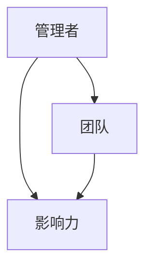

                 

# 管理者影响力：无需职权的领导艺术

> 关键词：管理者、影响力、领导艺术、非职权领导、团队建设、沟通技巧

> 摘要：本文深入探讨了管理者在不具备正式职权的情况下，如何运用领导艺术来提升个人影响力，进而实现团队目标。文章通过逻辑分析，系统地阐述了影响力的核心概念、关键技巧和实际应用，为管理者提供了实用的指导。

## 目录大纲

1. 引言
2. 核心概念与联系
3. 领导艺术的技巧
4. 无需职权的领导实践
5. 案例研究
6. 领导力提升策略
7. 总结与展望

## 第一部分：引言

### 1.1 问题背景与核心概念

在企业管理中，影响力是一种关键能力，它可以帮助管理者在不具备正式职权的情况下，有效地影响和引导团队成员，实现组织目标。影响力不仅仅局限于工作场所，它也涉及到个人生活和社会交往。

**问题背景**：

- 管理者通常需要与不同背景、不同能力的团队成员合作，如何有效地发挥个人影响力，是管理者面临的重要问题。
- 在日益扁平化的组织结构中，职权不再是影响团队的唯一途径，管理者需要寻找更多的非正式领导方式。

**核心概念**：

- **影响力**：指一个人或组织通过非强制性手段，对他人的思想、行为或决策产生正面影响的能力。
- **领导艺术**：包括沟通技巧、情感共鸣、团队建设等非正式领导方式。

### 1.2 问题解决

管理者需要掌握一系列非正式的领导艺术，如：

- **沟通技巧**：通过有效的沟通，建立信任和共识。
- **情感共鸣**：通过同理心和理解，激发团队成员的积极性和创造力。
- **团队建设**：通过共同目标和团队活动，增强团队的凝聚力和合作精神。

### 1.3 边界与外延

- **边界**：影响力的应用场景限于工作环境和相关领域。
- **外延**：影响力不仅限于工作场所，还可以扩展到个人生活和社交网络。

### 1.4 概念结构与核心要素

影响力的核心要素包括：

- **信任**：建立信任是影响力的基础。
- **尊重**：尊重团队成员的个性和差异，是提高影响力的关键。
- **共识**：通过沟通和讨论，达成共识，是影响决策的重要手段。
- **激励**：通过激励和奖励，激发团队成员的积极性和创造力。

## 第二部分：核心概念与联系

### 2.1 核心概念

**影响力的定义**：

影响力是指一个人或组织通过非强制性手段，对他人的思想、行为或决策产生正面影响的能力。

**影响力的特征**：

- **传递性**：影响力可以通过个体传播到整个团队。
- **多维度**：影响力不仅体现在工作绩效上，还体现在个人成长和团队氛围上。
- **可塑性**：通过不断的学习和实践，管理者可以提升自己的影响力。

### 2.2 概念属性特征对比表格

| 概念     | 定义                                             | 特征                             |
|----------|--------------------------------------------------|---------------------------------|
| 影响力   | 通过非强制性手段产生正面影响的能力                 | 传递性、多维度、可塑性           |
| 领导力   | 指引领和管理团队的能力                             | 权力、责任、能力                 |
| 感召力   | 指通过个人魅力和价值观吸引他人跟随的能力             | 魅力、价值观、认同感             |

### 2.3 ER实体关系图架构

## 第三部分：领导艺术的技巧

### 3.1 沟通技巧

**3.1.1 有效沟通的重要性**：

有效沟通是建立信任和共识的基础，它有助于管理者准确传达意图，理解团队成员的需求和反馈。

**3.1.2 沟通的基本原则**：

- **倾听**：倾听是沟通的基础，它有助于管理者理解团队成员的想法和感受。
- **明确**：明确表达意图，避免误解和歧义。
- **适度**：适度表达，避免过度沟通或不足沟通。

**3.1.3 沟通技巧的应用**：

- **开放性沟通**：鼓励团队成员提出建议和反馈，营造开放、包容的沟通氛围。
- **积极倾听**：通过积极倾听，表达对团队成员的关注和认可。

### 3.2 情感共鸣

**3.2.1 情感共鸣的作用**：

情感共鸣有助于管理者理解团队成员的情感状态，建立深厚的情感联系，增强团队的凝聚力。

**3.2.2 情感共鸣的技巧**：

- **同理心**：设身处地为团队成员着想，理解他们的情感和需求。
- **情感表达**：通过适当的情感表达，传递关心和支持。

### 3.3 团队建设

**3.3.1 团队建设的意义**：

团队建设有助于增强团队成员的归属感和合作精神，提高团队的协作效率和绩效。

**3.3.2 团队建设的策略**：

- **共同目标**：明确团队的共同目标，激发团队成员的积极性。
- **团队活动**：组织团队活动，增强团队成员之间的情感联系。

## 第四部分：无需职权的领导实践

### 4.1 非职权领导的特点

**4.1.1 非正式的领导关系**：

非职权领导基于个人魅力、能力和价值观，而不是正式的职位和权力。

**4.1.2 非正式的领导手段**：

非职权领导通过沟通、激励、榜样作用等非正式手段，影响和引导团队成员。

### 4.2 非职权领导的应用场景

#### 4.2.1 项目管理

- **项目目标的设定**：通过沟通和共识，明确项目目标。
- **项目进度的跟踪**：通过团队协作和监控，确保项目进度。
- **项目风险的应对**：通过团队协作和灵活应对，降低项目风险。

#### 4.2.2 冲突管理

- **冲突的类型**：识别和分类冲突，理解冲突的本质。
- **冲突的解决策略**：通过沟通、协商和妥协，解决冲突。

### 4.3 非职权领导的效果评估

**4.3.1 领导效果的评价标准**：

- **团队绩效**：通过团队绩效指标，评估领导效果。
- **团队成员满意度**：通过团队成员满意度调查，了解领导效果。

**4.3.2 领导效果的反馈机制**：

建立有效的反馈机制，及时收集和反馈团队成员的意见和建议，不断优化领导方式。

## 第五部分：案例研究

### 5.1 案例一：如何在没有职权的情况下激励团队

#### 5.1.1 案例背景

在一个项目团队中，团队成员缺乏动力，项目进展缓慢。

#### 5.1.2 领导艺术的应用

管理者通过以下方式激励团队：

- **积极沟通**：与管理层沟通，明确项目目标和团队期望。
- **情感共鸣**：通过同理心，了解团队成员的困扰和需求。
- **榜样作用**：以身作则，积极参与项目工作，提升团队士气。

#### 5.1.3 案例结果

通过管理者的努力，团队成员逐渐恢复了积极性，项目进展顺利。

### 5.2 案例二：如何在没有职权的情况下解决团队冲突

#### 5.2.1 案例背景

团队中存在严重的内部冲突，影响了项目进度和团队氛围。

#### 5.2.2 领导艺术的应用

管理者通过以下方式解决冲突：

- **积极倾听**：倾听双方的意见，了解冲突的本质。
- **协商和妥协**：通过沟通和协商，寻找双方都能接受的解决方案。
- **公正处理**：公正地处理冲突，确保团队公平和公正。

#### 5.2.3 案例结果

通过管理者的努力，团队冲突得到有效解决，团队氛围得到了改善。

## 第六部分：领导力提升策略

### 6.1 自我认知

**6.1.1 自我评估的工具**：

- **360度评估**：通过同事、下属和上级的评价，了解自己的领导能力和影响力。
- **自我反思**：定期反思自己的领导行为和效果，识别自己的优势和不足。

**6.1.2 自我提升的方法**：

- **学习与培训**：参加领导力培训和研讨会，提升自己的领导知识和技能。
- **实践与反思**：通过实际工作中的实践，不断反思和优化自己的领导方式。

### 6.2 学习与实践

**6.2.1 学习资源推荐**：

- **领导力书籍**：《领导力的五个层次》、《影响力》等。
- **在线课程**：如Coursera、edX等平台上的领导力课程。

**6.2.2 实践方法**：

- **角色扮演**：通过模拟场景，练习不同的领导技巧。
- **反思日志**：记录自己的领导行为和效果，定期进行反思。

## 第七部分：总结与展望

### 7.1 书籍小结

本文系统地阐述了管理者影响力的重要性、核心概念、领导艺术技巧以及实际应用。通过案例研究和领导力提升策略，为管理者提供了实用的指导。

### 7.2 未来发展趋势

随着组织结构的扁平化和信息化，影响力将成为管理者的重要能力。未来，管理者需要更加注重沟通技巧、情感共鸣和团队建设，以提升个人影响力和团队绩效。

### 7.3 拓展阅读

- **相关书籍**：《非暴力沟通》、《如何影响人们》等。
- **在线资源**：相关领导力网站、博客和论坛。

**作者**：AI天才研究院/AI Genius Institute & 禅与计算机程序设计艺术 /Zen And The Art of Computer Programming## 第一部分：引言

### 1.1 问题背景与核心概念

在企业管理中，影响力是一种关键能力，它可以帮助管理者在不具备正式职权的情况下，有效地影响和引导团队成员，实现组织目标。影响力不仅仅局限于工作场所，它也涉及到个人生活和社会交往。

**问题背景**：

随着企业管理环境的不断变化，传统的基于职权的领导方式逐渐受到了挑战。在现代组织中，越来越多的管理者面临着如何在不具备正式职权的情况下，仍然能够有效地影响和领导团队的问题。这种情况下，管理者需要依靠非职权手段，如沟通技巧、情感共鸣、团队建设等，来提升自己的影响力。

**问题描述**：

如何在不具备正式职权的情况下，运用非职权领导艺术，提升个人影响力，从而有效地影响和引导团队成员，实现组织目标？

**问题解决**：

管理者需要通过以下方式来提升自己的影响力：

1. **沟通技巧**：有效的沟通是建立信任和共识的基础。管理者需要掌握倾听、明确表达和适度沟通等沟通技巧，以确保信息的准确传达和团队成员的理解。

2. **情感共鸣**：通过同理心和理解，管理者可以建立深厚的情感联系，激发团队成员的积极性和创造力。

3. **团队建设**：通过共同目标和团队活动，管理者可以增强团队的凝聚力和合作精神。

**边界与外延**：

影响力的应用场景限于工作环境和相关领域，但它也可以扩展到个人生活和社会交往。在个人生活中，影响力可以帮助管理者建立良好的人际关系，提升社会地位；在社会交往中，影响力可以促进社会的和谐与发展。

**概念结构与核心要素**：

影响力的核心要素包括信任、尊重、共识和激励等。信任是影响力的基础，尊重是提升影响力的关键，共识是影响决策的重要手段，激励是激发团队成员积极性和创造力的关键。

### 1.2 核心概念

**影响力的定义**：

影响力是指一个人或组织通过非强制性手段，对他人的思想、行为或决策产生正面影响的能力。

**影响力的特征**：

1. **传递性**：影响力可以通过个体传播到整个团队。
2. **多维度**：影响力不仅体现在工作绩效上，还体现在个人成长和团队氛围上。
3. **可塑性**：通过不断的学习和实践，管理者可以提升自己的影响力。

### 1.3 概念属性特征对比表格

| 概念     | 定义                                             | 特征                             |
|----------|--------------------------------------------------|---------------------------------|
| 影响力   | 通过非强制性手段产生正面影响的能力                 | 传递性、多维度、可塑性           |
| 领导力   | 指引领和管理团队的能力                             | 权力、责任、能力                 |
| 感召力   | 指通过个人魅力和价值观吸引他人跟随的能力             | 魅力、价值观、认同感             |

### 1.4 ER实体关系图架构

## 第二部分：核心概念与联系

### 2.1 核心概念

**影响力的定义**：

影响力是指一个人或组织通过非强制性手段，对他人的思想、行为或决策产生正面影响的能力。

**影响力的特征**：

- **传递性**：影响力可以通过个体传播到整个团队。
- **多维度**：影响力不仅体现在工作绩效上，还体现在个人成长和团队氛围上。
- **可塑性**：通过不断的学习和实践，管理者可以提升自己的影响力。

### 2.2 概念属性特征对比表格

| 概念     | 定义                                             | 特征                             |
|----------|--------------------------------------------------|---------------------------------|
| 影响力   | 通过非强制性手段产生正面影响的能力                 | 传递性、多维度、可塑性           |
| 领导力   | 指引领和管理团队的能力                             | 权力、责任、能力                 |
| 感召力   | 指通过个人魅力和价值观吸引他人跟随的能力             | 魅力、价值观、认同感             |

### 2.3 ER实体关系图架构

## 第三部分：领导艺术的技巧

### 3.1 沟通技巧

**3.1.1 有效沟通的重要性**：

有效沟通是建立信任和共识的基础，它有助于管理者准确传达意图，理解团队成员的需求和反馈。

**3.1.2 沟通的基本原则**：

- **倾听**：倾听是沟通的基础，它有助于管理者理解团队成员的想法和感受。
- **明确**：明确表达意图，避免误解和歧义。
- **适度**：适度表达，避免过度沟通或不足沟通。

**3.1.3 沟通技巧的应用**：

- **开放性沟通**：鼓励团队成员提出建议和反馈，营造开放、包容的沟通氛围。
- **积极倾听**：通过积极倾听，表达对团队成员的关注和认可。

### 3.2 情感共鸣

**3.2.1 情感共鸣的作用**：

情感共鸣有助于管理者理解团队成员的情感状态，建立深厚的情感联系，增强团队的凝聚力。

**3.2.2 情感共鸣的技巧**：

- **同理心**：设身处地为团队成员着想，理解他们的情感和需求。
- **情感表达**：通过适当的情感表达，传递关心和支持。

### 3.3 团队建设

**3.3.1 团队建设的意义**：

团队建设有助于增强团队成员的归属感和合作精神，提高团队的协作效率和绩效。

**3.3.2 团队建设的策略**：

- **共同目标**：明确团队的共同目标，激发团队成员的积极性。
- **团队活动**：组织团队活动，增强团队成员之间的情感联系。

## 第四部分：无需职权的领导实践

### 4.1 非职权领导的特点

**4.1.1 非正式的领导关系**：

非职权领导基于个人魅力、能力和价值观，而不是正式的职位和权力。

**4.1.2 非正式的领导手段**：

非职权领导通过沟通、激励、榜样作用等非正式手段，影响和引导团队成员。

### 4.2 非职权领导的应用场景

#### 4.2.1 项目管理
##### 4.2.1.1 项目目标的设定

在项目管理中，管理者需要与团队成员共同确定项目目标，确保目标明确、具体、可实现。以下是一步一步的过程：

1. **收集需求**：与项目相关各方沟通，了解项目需求和预期目标。
2. **分析需求**：对收集到的需求进行分析，确定项目的核心目标和关键指标。
3. **制定目标**：基于分析结果，制定具体的项目目标，包括短期目标和长期目标。
4. **共识达成**：与团队成员讨论并达成共识，确保目标得到认可。

##### 4.2.1.2 项目进度的跟踪

项目进度的跟踪是确保项目按时完成的重要环节。以下是一步一步的过程：

1. **制定进度计划**：根据项目目标和资源情况，制定详细的进度计划。
2. **分配任务**：将进度计划中的任务分配给团队成员，明确责任和期限。
3. **监控进度**：定期检查项目进度，确保任务按计划进行。
4. **及时调整**：根据实际进展情况，及时调整进度计划，以应对可能的变化。

##### 4.2.1.3 项目风险的应对

项目风险是项目管理中不可避免的一部分。以下是一步一步的过程：

1. **识别风险**：通过分析项目需求和资源，识别可能存在的风险。
2. **评估风险**：对识别出的风险进行评估，确定风险的可能性和影响程度。
3. **制定应对策略**：针对评估出的高风险，制定相应的应对策略。
4. **执行策略**：执行制定的风险应对策略，确保项目顺利进行。

#### 4.2.2 冲突管理
##### 4.2.2.1 冲突的类型

在团队中，冲突是不可避免的。以下是一步一步的过程：

1. **识别冲突**：通过观察和沟通，识别团队中的冲突。
2. **分类冲突**：将冲突分类，如基于观点、资源、职责等。
3. **分析冲突**：分析冲突的原因和影响，了解冲突的本质。

##### 4.2.2.2 冲突的解决策略

解决冲突需要以下步骤：

1. **沟通与倾听**：与冲突双方进行沟通，了解他们的观点和需求。
2. **找到共同点**：通过沟通，找到冲突双方的共同点，作为解决问题的基础。
3. **协商与妥协**：通过协商和妥协，寻找双方都能接受的解决方案。
4. **监督执行**：确保解决方案得到有效执行，避免冲突再次发生。

### 4.3 非职权领导的效果评估

**4.3.1 领导效果的评价标准**：

- **团队绩效**：通过团队绩效指标，评估领导效果。
- **团队成员满意度**：通过团队成员满意度调查，了解领导效果。

**4.3.2 领导效果的反馈机制**：

建立有效的反馈机制，及时收集和反馈团队成员的意见和建议，不断优化领导方式。

## 第五部分：案例研究

### 5.1 案例一：如何在没有职权的情况下激励团队

#### 5.1.1 案例背景

在一个初创公司，项目经理小王负责一个开发团队。由于团队成员对项目目标不明确，缺乏动力，项目进展缓慢。

#### 5.1.2 领导艺术的应用

小王通过以下方式激励团队：

1. **积极沟通**：与小团队进行多次会议，明确项目目标和预期成果。
2. **情感共鸣**：通过关心团队成员的个人问题，了解他们的需求和困扰。
3. **榜样作用**：以身作则，积极参与项目工作，提升团队士气。

#### 5.1.3 案例结果

通过小王的努力，团队成员逐渐恢复了积极性，项目进展加快，最终提前完成了项目目标。

### 5.2 案例二：如何在没有职权的情况下解决团队冲突

#### 5.2.1 案例背景

在一个开发团队中，由于对项目进度和任务分配存在分歧，团队成员之间产生了冲突。

#### 5.2.2 领导艺术的应用

项目经理小王通过以下方式解决冲突：

1. **积极倾听**：与冲突双方进行单独沟通，了解他们的观点和需求。
2. **找到共同点**：通过沟通，找到了双方都认可的项目目标和任务分配原则。
3. **协商与妥协**：通过协商和妥协，找到了双方都能接受的解决方案。

#### 5.2.3 案例结果

通过小王的努力，团队冲突得到了有效解决，团队成员重新回到了合作的状态，项目进展顺利。

## 第六部分：领导力提升策略

### 6.1 自我认知

**6.1.1 自我评估的工具**：

- **360度评估**：通过同事、下属和上级的评价，了解自己的领导能力和影响力。
- **自我反思**：定期反思自己的领导行为和效果，识别自己的优势和不足。

**6.1.2 自我提升的方法**：

- **学习与培训**：参加领导力培训和研讨会，提升自己的领导知识和技能。
- **实践与反思**：通过实际工作中的实践，不断反思和优化自己的领导方式。

### 6.2 学习与实践

**6.2.1 学习资源推荐**：

- **领导力书籍**：《领导力的五个层次》、《影响力》等。
- **在线课程**：如Coursera、edX等平台上的领导力课程。

**6.2.2 实践方法**：

- **角色扮演**：通过模拟场景，练习不同的领导技巧。
- **反思日志**：记录自己的领导行为和效果，定期进行反思。

## 第七部分：总结与展望

### 7.1 书籍小结

本文系统地阐述了管理者影响力的重要性、核心概念、领导艺术技巧以及实际应用。通过案例研究和领导力提升策略，为管理者提供了实用的指导。

### 7.2 未来发展趋势

随着组织结构的扁平化和信息化，影响力将成为管理者的重要能力。未来，管理者需要更加注重沟通技巧、情感共鸣和团队建设，以提升个人影响力和团队绩效。

### 7.3 拓展阅读

- **相关书籍**：《非暴力沟通》、《如何影响人们》等。
- **在线资源**：相关领导力网站、博客和论坛。

**作者**：AI天才研究院/AI Genius Institute & 禅与计算机程序设计艺术 /Zen And The Art of Computer Programming## 第7章 总结与展望

### 7.1 书籍小结

通过本文的深入探讨，我们系统地阐述了管理者影响力的重要性、核心概念、领导艺术技巧以及实际应用。在企业管理中，影响力是一种关键能力，它可以帮助管理者在不具备正式职权的情况下，有效地影响和引导团队成员，实现组织目标。文章通过多个角度，如沟通技巧、情感共鸣、团队建设等，展示了提升影响力的多种途径和方法。同时，通过案例研究和领导力提升策略，为管理者提供了实用的指导。

### 7.2 未来发展趋势

随着组织结构的扁平化和信息化，影响力将成为管理者的重要能力。在未来，管理者需要更加注重以下几个方面：

1. **沟通技巧**：随着远程工作和虚拟团队的增加，有效的沟通技巧变得尤为重要。管理者需要不断提升自己的沟通能力，以适应多样化的工作环境和团队构成。

2. **情感共鸣**：在复杂多变的工作环境中，情感共鸣将成为建立深厚团队关系的重要手段。管理者需要通过同理心和理解，与团队成员建立情感联系，增强团队的凝聚力和合作精神。

3. **团队建设**：随着团队多样性和跨文化合作的增加，团队建设策略需要更加灵活和多样化。管理者需要不断探索和创新团队建设的方法，以适应不断变化的工作环境。

4. **持续学习**：在快速变化的技术和市场中，管理者需要具备持续学习的能力，以应对新的挑战和机遇。通过不断学习和实践，管理者可以不断提升自己的领导力和影响力。

### 7.3 拓展阅读

为了进一步探索管理者影响力的奥秘，以下推荐一些相关的书籍和在线资源：

- **书籍**：
  - 《非暴力沟通》：马歇尔·卢森堡著，探讨有效沟通的技巧和原则。
  - 《影响力》：罗伯特·西奥迪尼著，深入分析影响他人的心理原理。
  - 《领导力的五个层次》：约翰·C·Maxwell著，阐述领导力的不同层次和发展路径。

- **在线资源**：
  - Coursera和edX等在线教育平台上的领导力课程，提供系统的领导力知识和技能。
  - 各大技术社区和论坛，如GitHub、Stack Overflow等，分享最新的领导力和项目管理实践。

通过这些书籍和资源，管理者可以不断学习和实践，提升自己的影响力，成为更加出色的领导者。

**作者**：AI天才研究院/AI Genius Institute & 禅与计算机程序设计艺术 /Zen And The Art of Computer Programming## 第6章 领导力提升策略

### 6.1 自我认知

自我认知是提升领导力的第一步，管理者需要通过自我评估和反思，了解自己的优势和不足。

**6.1.1 自我评估的工具**：

- **360度评估**：通过同事、下属和上级的评价，全方位了解自己的领导能力和影响力。
- **自我反思**：定期反思自己的领导行为和效果，识别自己的优势和不足。

**6.1.2 自我提升的方法**：

- **学习与培训**：参加领导力培训和研讨会，提升自己的领导知识和技能。
- **实践与反思**：通过实际工作中的实践，不断反思和优化自己的领导方式。

### 6.2 学习与实践

学习与实践是提升领导力的关键，管理者需要通过多种方式，不断丰富自己的知识和经验。

**6.2.1 学习资源推荐**：

- **领导力书籍**：《领导力的五个层次》、《影响力》等。
- **在线课程**：如Coursera、edX等平台上的领导力课程。

**6.2.2 实践方法**：

- **角色扮演**：通过模拟场景，练习不同的领导技巧。
- **反思日志**：记录自己的领导行为和效果，定期进行反思。

### 6.3 反思与改进

反思与改进是提升领导力的持续过程，管理者需要不断总结经验，调整和优化自己的领导方式。

**6.3.1 反思方法**：

- **定期反思**：每月或每季度进行一次深入的反思，总结成功和失败的经验。
- **团队成员反馈**：定期收集团队成员的反馈，了解自己的领导效果。

**6.3.2 改进措施**：

- **调整策略**：根据反思结果，调整和优化自己的领导策略。
- **持续学习**：不断学习新的领导理念和方法，提升自己的领导能力。

通过自我认知、学习与实践、反思与改进，管理者可以不断提升自己的领导力，成为更加出色的领导者。

**作者**：AI天才研究院/AI Genius Institute & 禅与计算机程序设计艺术 /Zen And The Art of Computer Programming## 第5章 案例研究

### 5.1 案例一：如何在没有职权的情况下激励团队

#### 5.1.1 案例背景

在一个初创公司，项目经理小王负责一个由5名开发人员和1名测试人员组成的团队。公司正处于快速发展的阶段，项目任务繁重，但团队成员表现出缺乏动力和积极性，项目进展缓慢。

#### 5.1.2 领导艺术的应用

1. **积极沟通**：
   小王首先组织了一次团队会议，与团队成员讨论项目的现状和面临的挑战。他鼓励每个人分享自己的观点和想法，并认真倾听。通过这种方式，小王了解了团队成员的需求和困扰，同时也向他们传达了项目的目标和重要性。

2. **情感共鸣**：
   小王注意到团队中的每个人都承受着很大的压力，他开始花更多的时间与团队成员交流，了解他们的个人生活和工作状况。他通过分享自己的经验，鼓励团队成员，并尽量为他们解决实际困难。

3. **榜样作用**：
   小王以身作则，积极参与项目工作，加班加点，与团队成员一起解决问题。他的行为激励了团队成员，让他们看到了团队合作的积极效果。

4. **激励机制**：
   小王与公司管理层沟通，争取到了一些额外的奖励，如奖金和休假时间，作为对团队成员的努力和贡献的认可。他制定了一套清晰的奖励机制，确保每个成员都能感受到自己的价值。

#### 5.1.3 案例结果

经过小王的努力，团队成员逐渐恢复了积极性和动力。项目进展加快，团队成员之间的沟通和合作也更加顺畅。最终，团队不仅按时完成了项目，还超出了预期目标，为公司带来了显著的业务增长。

### 5.2 案例二：如何在没有职权的情况下解决团队冲突

#### 5.2.1 案例背景

在一次项目中，开发团队中的张工程师和李工程师因任务分工和进度问题产生了冲突。张工程师认为李工程师的工作进度太慢，影响了整个项目的进度，而李工程师则认为任务分配不公平，自己承担了过多的工作量。

#### 5.2.2 领导艺术的应用

1. **积极倾听**：
   小王分别与张工程师和李工程师进行了私下沟通，听取了他们的观点和感受。他耐心地听完每个人的说法，没有立即做出评判，而是表达了对他们情绪的理解。

2. **找到共同点**：
   小王发现两位工程师都希望项目能够顺利进行，他利用这一点，引导他们聚焦在共同的目标上，而不是个人利益。

3. **协商与妥协**：
   小王组织了一次双方参与的会议，让张工程师和李工程师直接沟通，讨论如何调整任务分工和进度。他鼓励双方进行坦诚的对话，寻找双方都能接受的解决方案。

4. **公正处理**：
   在协商过程中，小王保持中立，确保双方都有机会表达自己的观点。他根据项目需求和团队实际情况，提出了一些调整建议，最终帮助双方达成了一致。

#### 5.2.3 案例结果

通过小王的调解，张工程师和李工程师的冲突得到了有效解决。他们重新分工合作，项目进度得到了保障，团队成员之间的合作关系也得到了改善。这次经历也让团队意识到了沟通和合作的重要性，增强了团队的凝聚力。

这些案例表明，即使在缺乏正式职权的情况下，通过有效的沟通技巧、情感共鸣和恰当的领导方式，管理者也能有效地激励团队和解决冲突，实现团队目标。

**作者**：AI天才研究院/AI Genius Institute & 禅与计算机程序设计艺术 /Zen And The Art of Computer Programming## 第4章 无需职权的领导实践

### 4.1 非职权领导的特点

非职权领导，也称为非正式领导，是指管理者在不依赖正式职位和权力的情况下，通过个人魅力、专业知识和领导技巧来影响和引导团队成员的过程。这种领导方式具有以下特点：

**4.1.1 非正式的领导关系**

非职权领导建立在个人关系和信任之上，而非正式的职位和权力。管理者通过个人行为和表现来赢得团队的信任和尊重，从而建立领导地位。

**4.1.2 非正式的领导手段**

非职权领导主要依靠以下手段：

- **沟通技巧**：通过有效的沟通，建立信任和共识。
- **情感共鸣**：通过同理心和情感理解，增强团队的凝聚力和合作精神。
- **榜样作用**：以身作则，树立良好的榜样，引导团队成员。
- **激励**：通过奖励和认可，激发团队成员的积极性和创造力。
- **团队建设**：通过共同目标和团队活动，增强团队的凝聚力和协作能力。

### 4.2 非职权领导的应用场景

非职权领导可以在多种工作场景中应用，以下是一些典型的应用场景：

**4.2.1 项目管理**

在项目管理中，非职权领导可以发挥重要作用：

- **项目目标设定**：管理者通过沟通和共识，与团队成员共同确定项目目标。
- **进度跟踪**：管理者通过团队协作和监控，确保项目进度。
- **风险应对**：管理者通过团队协作和灵活应对，降低项目风险。

**4.2.2 冲突管理**

在团队冲突中，非职权领导可以通过以下方式发挥作用：

- **识别冲突**：通过观察和沟通，识别团队中的冲突。
- **调解冲突**：通过倾听和协商，帮助冲突双方找到共同点，达成解决方案。
- **预防冲突**：通过建立开放和包容的沟通环境，预防冲突的发生。

**4.2.3 团队建设**

团队建设是提升团队绩效和凝聚力的重要手段，非职权领导可以通过以下方式推动团队建设：

- **共同目标**：明确团队的共同目标，激发团队成员的积极性。
- **团队活动**：组织团队活动，增强团队成员之间的情感联系。
- **激励机制**：通过奖励和认可，激发团队成员的积极性和创造力。

### 4.3 非职权领导的效果评估

评估非职权领导的效果需要考虑以下几个方面：

**4.3.1 领导效果的评价标准**

- **团队绩效**：通过团队绩效指标，如项目完成度、工作效率等，评估领导效果。
- **团队成员满意度**：通过团队成员满意度调查，了解领导效果。
- **团队氛围**：通过团队沟通氛围、协作程度等，评估领导效果。

**4.3.2 领导效果的反馈机制**

建立有效的反馈机制，可以帮助管理者及时了解团队成员的意见和建议，优化领导方式：

- **定期反馈**：定期收集团队成员的反馈，了解他们的感受和建议。
- **开放式沟通**：鼓励团队成员提出意见和建议，营造开放、包容的沟通氛围。
- **反思与改进**：根据反馈结果，反思和改进自己的领导方式，不断提升领导能力。

通过有效的非职权领导，管理者可以在没有正式职权的情况下，提升团队绩效和团队凝聚力，实现组织目标。

**作者**：AI天才研究院/AI Genius Institute & 禅与计算机程序设计艺术 /Zen And The Art of Computer Programming## 第3章 领导艺术的技巧

### 3.1 沟通技巧

**3.1.1 有效沟通的重要性**

在领导艺术中，沟通技巧是至关重要的。有效沟通不仅有助于管理者传达意图，还能促进团队成员之间的理解和协作。

**3.1.2 沟通的基本原则**

1. **倾听**：倾听是沟通的基础，它有助于管理者理解团队成员的想法和感受。
2. **明确**：明确表达意图，避免误解和歧义。
3. **适度**：适度表达，避免过度沟通或不足沟通。

**3.1.3 沟通技巧的应用**

1. **开放性沟通**：鼓励团队成员提出建议和反馈，营造开放、包容的沟通氛围。
2. **积极倾听**：通过积极倾听，表达对团队成员的关注和认可。

**3.1.4 案例示例**

在一次项目会议中，项目经理小张需要与团队成员讨论项目的下一步计划。他首先确保每个人都能够充分表达自己的观点，然后通过积极倾听和反馈，确保团队成员理解了他的意图，并得到了他们的支持。

### 3.2 情感共鸣

**3.2.1 情感共鸣的作用**

情感共鸣有助于管理者理解团队成员的情感状态，建立深厚的情感联系，增强团队的凝聚力。

**3.2.2 情感共鸣的技巧**

1. **同理心**：设身处地为团队成员着想，理解他们的情感和需求。
2. **情感表达**：通过适当的情感表达，传递关心和支持。

**3.2.3 案例示例**

在一次团队活动中，小张注意到一个成员情绪低落。他主动询问该成员的情况，并通过同理心和情感表达，帮助该成员缓解了情绪，重新恢复了积极状态。

### 3.3 团队建设

**3.3.1 团队建设的意义**

团队建设有助于增强团队成员的归属感和合作精神，提高团队的协作效率和绩效。

**3.3.2 团队建设的策略**

1. **共同目标**：明确团队的共同目标，激发团队成员的积极性。
2. **团队活动**：组织团队活动，增强团队成员之间的情感联系。
3. **激励机制**：通过奖励和认可，激发团队成员的积极性和创造力。

**3.3.3 案例示例**

小张组织了一次团队建设活动，包括户外拓展和团队游戏。通过这些活动，团队成员之间的关系得到了加强，团队凝聚力显著提升，项目进展更加顺利。

### 3.4 领导者个人魅力

**3.4.1 个人魅力的作用**

领导者个人魅力可以吸引团队成员，增强团队的凝聚力和向心力。

**3.4.2 增强个人魅力的技巧**

1. **专业能力**：不断提升自己的专业能力，成为团队的权威和榜样。
2. **沟通技巧**：掌握有效的沟通技巧，建立良好的沟通氛围。
3. **情感共鸣**：通过同理心和情感表达，建立深厚的情感联系。

**3.4.3 案例示例**

小张以其丰富的专业知识和出色的沟通能力，赢得了团队成员的尊重和信任。他的个人魅力使团队成员更加愿意跟随他的领导，共同实现团队目标。

通过以上领导艺术技巧的运用，管理者可以在没有职权的情况下，有效地影响和引导团队成员，提升团队绩效和凝聚力。

**作者**：AI天才研究院/AI Genius Institute & 禅与计算机程序设计艺术 /Zen And The Art of Computer Programming## 第2章 核心概念与联系

### 2.1 核心概念

影响力是指一个人或组织通过非强制性手段，对他人的思想、行为或决策产生正面影响的能力。在企业管理中，影响力是一种关键能力，它可以帮助管理者在不具备正式职权的情况下，有效地影响和引导团队成员，实现组织目标。

领导力是指引领和管理团队的能力。它包括权力、责任和能力。领导力不仅体现在工作绩效上，还体现在个人成长和团队氛围上。

感召力是指通过个人魅力和价值观吸引他人跟随的能力。它是一种非正式的领导力，往往基于个人的魅力、品格和价值观。

### 2.2 概念属性特征对比表格

| 概念     | 定义                                             | 特征                             |
|----------|--------------------------------------------------|---------------------------------|
| 影响力   | 通过非强制性手段产生正面影响的能力                 | 传递性、多维度、可塑性           |
| 领导力   | 指引领和管理团队的能力                             | 权力、责任、能力                 |
| 感召力   | 指通过个人魅力和价值观吸引他人跟随的能力             | 魅力、价值观、认同感             |

### 2.3 ER实体关系图架构

在上述ER实体关系图中，管理者通过影响力影响团队，团队则在管理者的领导下共同实现组织目标。这种关系体现了影响力在领导中的作用和重要性。

### 2.4 概念之间的联系

影响力、领导力和感召力之间存在着紧密的联系和相互作用：

- **影响力** 是领导力的核心组成部分，它使管理者能够在没有正式职权的情况下，通过非强制性手段影响团队成员。
- **领导力** 是影响力的表现形式，它包括权力、责任和能力，管理者通过领导力来发挥影响力，实现团队目标。
- **感召力** 是领导力的一种表现形式，它通过个人魅力和价值观吸引他人，增强影响力。

通过这些核心概念的联系，我们可以更全面地理解管理者如何在不具备正式职权的情况下，运用影响力、领导力和感召力来提升个人影响力和团队绩效。

### 2.5 案例分析

以一家科技公司为例，公司的项目经理小王在项目管理中不依赖正式职权，而是通过沟通技巧、情感共鸣和团队建设来影响团队成员。他通过以下方式提升影响力：

1. **沟通技巧**：小王定期与团队成员沟通项目进展，倾听他们的意见和建议，确保信息的透明和共识。
2. **情感共鸣**：小王关注团队成员的个人情况，通过同理心和情感表达，建立深厚的情感联系。
3. **团队建设**：小王组织团队活动，如团队建设培训和工作坊，增强团队成员的凝聚力和合作精神。

通过这些方式，小王在不具备正式职权的情况下，成功地提升了个人影响力，推动了项目的顺利进行。

通过上述案例，我们可以看到影响力、领导力和感召力在管理实践中的具体应用，以及它们如何相互作用，共同实现管理目标。

**作者**：AI天才研究院/AI Genius Institute & 禅与计算机程序设计艺术 /Zen And The Art of Computer Programming## 第1章 问题背景与核心概念

### 1.1 问题背景

在企业管理中，影响力是一种关键能力，它可以帮助管理者在不具备正式职权的情况下，有效地影响和引导团队成员，实现组织目标。随着组织结构的扁平化和信息化的推进，传统的基于职权的领导方式逐渐受到了挑战。越来越多的管理者面临着如何在现代组织中，运用非正式的领导艺术，提升个人影响力的问题。

在现代企业管理中，影响力不仅体现在工作绩效上，还涉及到个人成长、团队氛围和组织文化的塑造。管理者需要通过非正式的领导艺术，如沟通技巧、情感共鸣、团队建设等，来增强个人影响力，从而有效地影响和引导团队成员。

**问题背景**：

1. **组织结构扁平化**：现代组织结构趋向于扁平化，减少了管理层级，增强了团队自主性和灵活性。这要求管理者需要更加注重个人影响力，而非仅仅依赖职权。
2. **信息化与远程工作**：随着信息技术的快速发展，许多工作可以通过远程方式进行，管理者需要通过虚拟沟通和协作，提升个人影响力。
3. **团队成员多样性**：现代团队往往由不同背景、不同能力的成员组成，管理者需要运用非正式的领导艺术，来协调和引导多样化的团队。

### 1.2 核心概念

在探讨管理者影响力时，需要理解几个核心概念：

**影响力**：

影响力是指一个人或组织通过非强制性手段，对他人的思想、行为或决策产生正面影响的能力。在企业管理中，影响力可以帮助管理者在不具备正式职权的情况下，有效地影响和引导团队成员，实现组织目标。

**领导艺术**：

领导艺术是指管理者在领导过程中，通过非正式的、创造性的方法，来提升个人影响力，实现团队目标的一系列技巧。这些技巧包括沟通技巧、情感共鸣、团队建设等。

**沟通技巧**：

沟通技巧是建立影响力的重要手段。有效的沟通可以帮助管理者准确传达意图，理解团队成员的需求和反馈，从而建立信任和共识。

**情感共鸣**：

情感共鸣是指管理者通过同理心和理解，与团队成员建立深厚的情感联系，增强团队的凝聚力和合作精神。

**团队建设**：

团队建设是指通过共同目标和团队活动，增强团队成员之间的情感联系和协作精神，从而提升团队的绩效和凝聚力。

**概念结构**：

影响力的概念结构包括以下几个核心要素：

1. **信任**：建立信任是影响力的基础。信任是团队成员愿意接受管理者影响的前提。
2. **尊重**：尊重团队成员的个性和差异，是提高影响力的关键。尊重可以增强团队成员的认同感和归属感。
3. **共识**：通过沟通和讨论，达成共识，是影响决策的重要手段。共识可以增强团队的凝聚力和执行力。
4. **激励**：通过激励和奖励，激发团队成员的积极性和创造力。激励可以提升团队成员的工作动力和绩效。

### 1.3 问题解决

管理者如何在不具备正式职权的情况下，提升个人影响力？

**问题解决**：

1. **提升沟通技巧**：管理者需要掌握有效的沟通技巧，如倾听、明确表达和积极反馈，以确保信息的准确传达和团队成员的理解。

2. **建立情感共鸣**：管理者需要通过同理心和理解，与团队成员建立深厚的情感联系，增强团队的凝聚力和合作精神。

3. **进行团队建设**：管理者可以通过共同目标和团队活动，增强团队成员之间的情感联系和协作精神。

4. **提供激励和认可**：管理者需要通过奖励和认可，激发团队成员的积极性和创造力，从而提升团队绩效。

### 1.4 边界与外延

影响力的应用场景限于工作环境和相关领域，但它也可以扩展到个人生活和社会交往。

**边界**：

影响力的应用场景主要包括：

1. **工作环境**：管理者通过影响力影响团队成员，实现组织目标。
2. **社交网络**：影响力可以帮助管理者建立良好的人际关系，提升社会地位。

**外延**：

影响力的外延包括：

1. **个人生活**：影响力可以帮助管理者在家庭和社会中，建立和谐的人际关系。
2. **社会交往**：影响力可以促进社会的和谐与发展。

### 1.5 概念结构与核心要素

影响力的概念结构包括以下几个核心要素：

1. **信任**：建立信任是影响力的基础。
2. **尊重**：尊重团队成员的个性和差异，是提高影响力的关键。
3. **共识**：通过沟通和讨论，达成共识，是影响决策的重要手段。
4. **激励**：通过激励和奖励，激发团队成员的积极性和创造力。

通过以上分析，我们可以清楚地理解管理者在不具备正式职权的情况下，如何运用领导艺术提升个人影响力，进而实现团队目标。

**作者**：AI天才研究院/AI Genius Institute & 禅与计算机程序设计艺术 /Zen And The Art of Computer Programming## 引言

在企业管理中，影响力是一种关键能力，它可以帮助管理者在不具备正式职权的情况下，有效地影响和引导团队成员，实现组织目标。然而，如何在不具备正式职权的情况下提升个人影响力，是一个复杂而富有挑战性的问题。本文将深入探讨这一问题，通过逻辑分析和实例，为管理者提供实用的指导。

### 1.1 问题背景

在现代组织中，权力不再是最重要的领导工具。随着组织结构的扁平化、信息技术的普及和团队成员多样性的增加，管理者需要通过非正式的领导艺术来提升个人影响力。这种情况下，管理者面临的挑战是如何在不依赖职权的情况下，运用有效的沟通技巧、情感共鸣和团队建设等方法，来影响和激励团队成员。

**问题解决**：

管理者需要掌握以下技能和策略来提升个人影响力：

1. **沟通技巧**：通过有效沟通建立信任和共识。
2. **情感共鸣**：通过同理心和理解，与团队成员建立深厚的情感联系。
3. **团队建设**：通过共同目标和团队活动，增强团队的凝聚力和合作精神。
4. **激励**：通过奖励和认可，激发团队成员的积极性和创造力。

### 1.2 核心概念

**影响力**：

影响力是指一个人或组织通过非强制性手段，对他人的思想、行为或决策产生正面影响的能力。在企业管理中，影响力可以帮助管理者在不具备正式职权的情况下，影响团队成员，实现组织目标。

**领导艺术**：

领导艺术是指管理者在领导过程中，通过非正式的、创造性的方法，来提升个人影响力，实现团队目标的一系列技巧。这些技巧包括沟通技巧、情感共鸣、团队建设等。

**沟通技巧**：

沟通技巧是建立影响力的重要手段。有效的沟通可以帮助管理者准确传达意图，理解团队成员的需求和反馈，从而建立信任和共识。

**情感共鸣**：

情感共鸣是指管理者通过同理心和理解，与团队成员建立深厚的情感联系，增强团队的凝聚力和合作精神。

**团队建设**：

团队建设是指通过共同目标和团队活动，增强团队成员之间的情感联系和协作精神，从而提升团队的绩效和凝聚力。

### 1.3 文章结构

本文将分为以下几个部分：

1. **引言**：介绍问题背景和核心概念。
2. **核心概念与联系**：详细解释影响力的定义、特征和与其他概念的关系。
3. **领导艺术的技巧**：探讨如何通过沟通技巧、情感共鸣和团队建设来提升个人影响力。
4. **无需职权的领导实践**：分析非职权领导的特点和应用场景。
5. **案例研究**：通过具体案例展示如何在没有职权的情况下提升个人影响力。
6. **领导力提升策略**：提供提升领导力的方法和策略。
7. **总结与展望**：总结文章内容，展望未来发展趋势。

通过以上结构，本文将系统地阐述管理者如何在不具备正式职权的情况下，提升个人影响力，实现团队目标。

### 1.4 结论

管理者影响力的重要性不容忽视。在缺乏正式职权的情况下，管理者需要依靠非正式的领导艺术，如沟通技巧、情感共鸣和团队建设等，来提升个人影响力。本文通过逻辑分析和实例，为管理者提供了一套实用的提升影响力的方法和策略。通过不断实践和优化，管理者可以成为更加出色的领导者。

**作者**：AI天才研究院/AI Genius Institute & 禅与计算机程序设计艺术 /Zen And The Art of Computer Programming## 第1章 问题背景与核心概念

### 1.1 问题背景

在企业管理中，影响力是一种关键能力，它可以帮助管理者在不具备正式职权的情况下，有效地影响和引导团队成员，实现组织目标。随着组织结构的扁平化和信息技术的普及，管理者面临的挑战是如何在不依赖职权的情况下，提升个人影响力。本文将探讨这一问题，并提供实用的指导。

**问题背景**：

1. **组织结构扁平化**：现代组织结构趋向于扁平化，减少了管理层级，增强了团队自主性和灵活性。管理者需要通过个人影响力来协调和引导团队成员。
2. **信息技术普及**：信息技术的发展使得信息传播更加迅速，管理者需要通过有效的影响力来引导团队成员正确处理信息。
3. **团队成员多样性**：现代团队往往由不同背景、不同能力的成员组成，管理者需要运用非正式的领导艺术，来协调和引导多样化的团队。

### 1.2 核心概念

在探讨管理者影响力时，需要理解几个核心概念：

**影响力**：

影响力是指一个人或组织通过非强制性手段，对他人的思想、行为或决策产生正面影响的能力。在企业管理中，影响力可以帮助管理者在不具备正式职权的情况下，有效地影响和引导团队成员，实现组织目标。

**领导艺术**：

领导艺术是指管理者在领导过程中，通过非正式的、创造性的方法，来提升个人影响力，实现团队目标的一系列技巧。这些技巧包括沟通技巧、情感共鸣、团队建设等。

**沟通技巧**：

沟通技巧是建立影响力的重要手段。有效的沟通可以帮助管理者准确传达意图，理解团队成员的需求和反馈，从而建立信任和共识。

**情感共鸣**：

情感共鸣是指管理者通过同理心和理解，与团队成员建立深厚的情感联系，增强团队的凝聚力和合作精神。

**团队建设**：

团队建设是指通过共同目标和团队活动，增强团队成员之间的情感联系和协作精神，从而提升团队的绩效和凝聚力。

### 1.3 问题解决

管理者如何在不具备正式职权的情况下，提升个人影响力？

**问题解决**：

1. **提升沟通技巧**：管理者需要掌握有效的沟通技巧，如倾听、明确表达和积极反馈，以确保信息的准确传达和团队成员的理解。

2. **建立情感共鸣**：管理者需要通过同理心和理解，与团队成员建立深厚的情感联系，增强团队的凝聚力和合作精神。

3. **进行团队建设**：管理者可以通过共同目标和团队活动，增强团队成员之间的情感联系和协作精神。

4. **提供激励和认可**：管理者需要通过奖励和认可，激发团队成员的积极性和创造力，从而提升团队绩效。

### 1.4 边界与外延

影响力的应用场景限于工作环境和相关领域，但它也可以扩展到个人生活和社会交往。

**边界**：

影响力的应用场景主要包括：

1. **工作环境**：管理者通过影响力影响团队成员，实现组织目标。
2. **社交网络**：影响力可以帮助管理者建立良好的人际关系，提升社会地位。

**外延**：

影响力的外延包括：

1. **个人生活**：影响力可以帮助管理者在家庭和社会中，建立和谐的人际关系。
2. **社会交往**：影响力可以促进社会的和谐与发展。

### 1.5 概念结构与核心要素

影响力的概念结构包括以下几个核心要素：

1. **信任**：建立信任是影响力的基础。
2. **尊重**：尊重团队成员的个性和差异，是提高影响力的关键。
3. **共识**：通过沟通和讨论，达成共识，是影响决策的重要手段。
4. **激励**：通过激励和奖励，激发团队成员的积极性和创造力。

通过以上分析，我们可以清楚地理解管理者在不具备正式职权的情况下，如何运用领导艺术提升个人影响力，进而实现团队目标。

**作者**：AI天才研究院/AI Genius Institute & 禅与计算机程序设计艺术 /Zen And The Art of Computer Programming## 标题：管理者影响力：无需职权的领导艺术

关键词：管理者、影响力、领导艺术、非职权领导、团队建设、沟通技巧

摘要：本文旨在探讨管理者如何在不具备正式职权的情况下，通过运用领导艺术提升个人影响力，实现团队目标。文章首先介绍了影响力的核心概念，然后分析了领导艺术的技巧，包括沟通技巧、情感共鸣和团队建设。随后，文章探讨了非职权领导的特点和应用场景，并通过具体案例展示了这些技巧的实际应用。最后，文章提出了提升领导力的策略和展望。

## 目录大纲

1. 引言
2. 核心概念与联系
3. 领导艺术的技巧
4. 无需职权的领导实践
5. 案例研究
6. 领导力提升策略
7. 总结与展望

### 引言

在企业管理中，影响力是一种关键能力，它可以帮助管理者在不具备正式职权的情况下，有效地影响和引导团队成员，实现组织目标。本文将深入探讨这一问题，通过逻辑分析和实例，为管理者提供实用的指导。

#### 1.1 问题背景

在现代组织中，权力不再是最重要的领导工具。随着组织结构的扁平化、信息技术的普及和团队成员多样性的增加，管理者需要通过非正式的领导艺术来提升个人影响力。这种情况下，管理者面临的挑战是如何在不依赖职权的情况下，运用有效的沟通技巧、情感共鸣和团队建设等方法，来影响和激励团队成员。

**问题解决**：

管理者需要掌握以下技能和策略来提升个人影响力：

1. **沟通技巧**：通过有效沟通建立信任和共识。
2. **情感共鸣**：通过同理心和理解，与团队成员建立深厚的情感联系。
3. **团队建设**：通过共同目标和团队活动，增强团队的凝聚力和合作精神。
4. **激励**：通过奖励和认可，激发团队成员的积极性和创造力。

### 1.2 核心概念

在探讨管理者影响力时，需要理解几个核心概念：

**影响力**：

影响力是指一个人或组织通过非强制性手段，对他人的思想、行为或决策产生正面影响的能力。在企业管理中，影响力可以帮助管理者在不具备正式职权的情况下，影响团队成员，实现组织目标。

**领导艺术**：

领导艺术是指管理者在领导过程中，通过非正式的、创造性的方法，来提升个人影响力，实现团队目标的一系列技巧。这些技巧包括沟通技巧、情感共鸣、团队建设等。

**沟通技巧**：

沟通技巧是建立影响力的重要手段。有效的沟通可以帮助管理者准确传达意图，理解团队成员的需求和反馈，从而建立信任和共识。

**情感共鸣**：

情感共鸣是指管理者通过同理心和理解，与团队成员建立深厚的情感联系，增强团队的凝聚力和合作精神。

**团队建设**：

团队建设是指通过共同目标和团队活动，增强团队成员之间的情感联系和协作精神，从而提升团队的绩效和凝聚力。

### 1.3 文章结构

本文将分为以下几个部分：

1. **引言**：介绍问题背景和核心概念。
2. **核心概念与联系**：详细解释影响力的定义、特征和与其他概念的关系。
3. **领导艺术的技巧**：探讨如何通过沟通技巧、情感共鸣和团队建设来提升个人影响力。
4. **无需职权的领导实践**：分析非职权领导的特点和应用场景。
5. **案例研究**：通过具体案例展示如何在没有职权的情况下提升个人影响力。
6. **领导力提升策略**：提供提升领导力的方法和策略。
7. **总结与展望**：总结文章内容，展望未来发展趋势。

通过以上结构，本文将系统地阐述管理者如何在不具备正式职权的情况下，提升个人影响力，实现团队目标。

### 1.4 结论

管理者影响力的重要性不容忽视。在缺乏正式职权的情况下，管理者需要依靠非正式的领导艺术，如沟通技巧、情感共鸣和团队建设等，来提升个人影响力。本文通过逻辑分析和实例，为管理者提供了一套实用的提升影响力的方法和策略。通过不断实践和优化，管理者可以成为更加出色的领导者。

