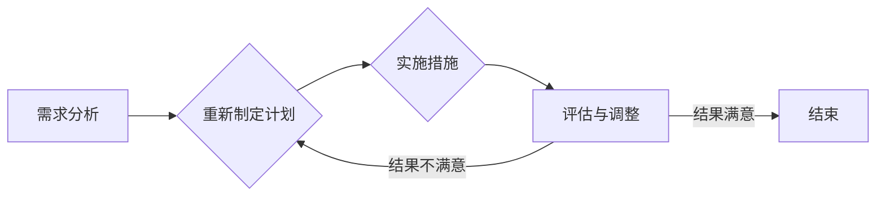

                 


### 《管理者怎么管人：人性化管理的艺术》

#### 关键词：管理者、人性化管理、管人艺术、员工激励、沟通技巧

> **摘要：**
> 
> 在现代企业管理中，人性化管理的理念逐渐受到重视。本文从管理者如何运用人性化管理的艺术出发，通过详细阐述人性化管理的核心概念、实践方法、流程图与模型，以及项目实战等多个方面，旨在帮助管理者提升管人技能，构建高效团队。

----------------------------------------------------------------

# 第一部分：背景与概念

## 第1章：人性化管理的时代背景

### 1.1 问题背景与描述

在当今快节奏、高竞争的商业环境中，管理者面临着前所未有的挑战。员工工作压力增大，工作与生活的平衡被打破，员工满意度和忠诚度下降。传统的以任务为中心的管理模式已经无法满足现代企业的需求，管理者需要更多地关注员工的情感需求，采取人性化管理的方法来提升团队效能。

#### 1.1.1 管理者面临的挑战

- **员工流动性增加**：随着就业市场日益开放，员工更容易跳槽，管理者需要留住人才。
- **工作压力与心理健康**：长时间的工作和高强度的工作压力导致员工心理健康问题突出。
- **工作与生活平衡**：现代员工更加注重工作与生活的平衡，管理者需要提供灵活的工作安排。

#### 1.1.2 人性化管理的兴起

人性化管理的理念源于对人的尊重和关注。随着社会的发展，企业逐渐认识到员工的积极性和创造力是企业发展的重要动力。人性化管理的兴起，反映了企业管理理念的转变，从“控制”转向“激励”和“关怀”。

#### 1.1.3 人性化管理的重要性

人性化管理的核心在于通过关注员工的情感需求，提升员工的满意度和忠诚度。这不仅有助于提高员工的工作效率和创造力，还能降低员工流失率，提升企业的整体竞争力。

----------------------------------------------------------------

## 第2章：人性化管理的核心概念

### 2.1 人本管理理论

人本管理理论强调以人为中心的管理理念，认为企业的成功取决于员工的能力和潜力。人本管理注重员工的全面发展，鼓励员工参与企业的决策过程，提升员工的自我管理和学习能力。

#### 2.1.1 人本管理的基本原则

- **尊重人**：尊重员工的个性、需求和尊严，创造一个公正、平等的工作环境。
- **信任人**：信任员工的自主性和创新能力，给予员工充分的自主权。
- **培养人**：通过培训和发展计划，提升员工的专业技能和综合素质。
- **激励人**：采取合适的激励措施，激发员工的内在动机和积极性。

### 2.2 员工参与

员工参与是人性化管理的核心要素之一，通过让员工参与到企业的决策和变革中，可以增强员工的归属感和责任感，提高员工的工作满意度。

#### 2.2.1 员工参与的形式

- **建议制度**：鼓励员工提出改善工作流程和提升工作效率的建议。
- **民主管理**：通过员工代表大会、员工委员会等形式，让员工参与企业的管理和决策。
- **团队建设**：通过团队活动，增强团队成员之间的合作和信任。

### 2.3 激励理论

激励理论是人性化管理的重要组成部分，通过合理的激励措施，可以激发员工的积极性和创造力。

#### 2.3.1 激励理论的基本原则

- **目标激励**：设定明确的、可实现的个人和团队目标，激发员工的动力。
- **成就激励**：通过认可员工的成就，提升员工的自我价值感。
- **薪酬激励**：提供有竞争力的薪酬待遇，满足员工的经济需求。
- **情感激励**：关注员工的情感需求，提供情感支持和关怀。

### 2.4 人性化管理与传统管理的区别

与传统管理相比，人性化管理更加注重员工的情感需求和全面发展，强调以员工为中心的管理模式。

#### 2.4.1 区别分析

- **管理目标**：传统管理以任务完成率为核心，人性化管理以员工满意度和忠诚度为核心。
- **管理方式**：传统管理采用指令式管理，人性化管理采用引导式管理。
- **管理效果**：传统管理可能导致员工不满和流失，人性化管理有助于提升员工满意度和企业竞争力。

----------------------------------------------------------------

## 第3章：人性化管理的实践方法

### 3.1 人性化管理的基本原则

人性化管理的实践需要遵循一些基本原则，以确保管理活动符合人性化的要求。

#### 3.1.1 基本原则

- **以人为本**：将员工的情感需求、职业发展作为管理工作的核心。
- **民主参与**：鼓励员工参与企业的决策过程，提升员工的参与感和责任感。
- **激励机制**：通过合适的激励措施，激发员工的积极性和创造力。
- **情感关怀**：关注员工的情感需求，提供情感支持和关怀。

### 3.2 建立有效的沟通机制

有效的沟通是人性化管理的基石。通过建立有效的沟通机制，可以增进管理者与员工之间的理解，提升团队协作效率。

#### 3.2.1 沟通机制

- **开放沟通**：鼓励员工表达意见和建议，营造一个开放、包容的沟通环境。
- **定期会议**：定期举行团队会议，汇报工作进展，解决团队问题。
- **反馈机制**：建立反馈机制，让员工及时了解工作成果和改进方向。

### 3.3 提高员工参与度

提高员工参与度是人性化管理的重要目标。通过多种形式的员工参与，可以增强员工的归属感和责任感。

#### 3.3.1 员工参与方式

- **团队建设活动**：通过团队建设活动，增强团队成员之间的合作和信任。
- **员工代表制度**：设立员工代表，参与企业的管理和决策。
- **员工培训和发展**：提供员工培训和发展机会，提升员工的专业能力和职业素养。

### 3.4 实施激励策略

激励策略是人性化管理的重要组成部分。通过合理的激励措施，可以激发员工的积极性和创造力。

#### 3.4.1 激励策略

- **目标激励**：设定明确的、可实现的个人和团队目标，激发员工的动力。
- **成就激励**：通过认可员工的成就，提升员工的自我价值感。
- **薪酬激励**：提供有竞争力的薪酬待遇，满足员工的经济需求。
- **情感激励**：关注员工的情感需求，提供情感支持和关怀。

----------------------------------------------------------------

## 第4章：人性化管理的流程图与模型

### 4.1 人性化管理实施流程

人性化管理的实施需要遵循一定的流程，以确保管理活动有序进行。

#### 4.1.1 实施流程

1. **需求分析**：了解员工的需求，确定人性化管理的目标和方向。
2. **制定计划**：根据需求分析，制定详细的实施计划，包括具体的措施和时间表。
3. **实施措施**：按照计划，逐步实施人性化管理措施。
4. **评估与调整**：对人性化管理的效果进行评估，根据评估结果进行调整和优化。

### 4.2 Mermaid流程图示例

下面是一个人性化管理的实施流程的Mermaid流程图示例：



### 4.3 人性化管理模型

人性化管理的模型主要包括人本管理模型、员工参与模型和激励模型。

#### 4.3.1 人本管理模型

人本管理模型关注员工的全面发展和职业规划，包括以下几个方面：

- **员工发展**：提供员工培训和发展机会，提升员工的综合素质。
- **员工关怀**：关注员工的身心健康，提供情感支持和关怀。
- **员工参与**：鼓励员工参与企业的决策和管理，提升员工的参与感和责任感。

#### 4.3.2 员工参与模型

员工参与模型主要包括以下几个方面：

- **建议制度**：鼓励员工提出改进建议，提升员工的工作积极性。
- **民主管理**：通过员工代表大会、员工委员会等形式，让员工参与企业的管理和决策。
- **团队建设**：通过团队建设活动，增强团队成员之间的合作和信任。

#### 4.3.3 激励模型

激励模型主要包括以下几个方面：

- **目标激励**：设定明确的、可实现的个人和团队目标，激发员工的动力。
- **成就激励**：通过认可员工的成就，提升员工的自我价值感。
- **薪酬激励**：提供有竞争力的薪酬待遇，满足员工的经济需求。
- **情感激励**：关注员工的情感需求，提供情感支持和关怀。

----------------------------------------------------------------

## 第5章：人性化管理的项目实战

### 5.1 项目环境安装

在进行人性化管理的项目实战之前，需要搭建一个合适的环境。以下是项目环境安装的步骤：

1. **安装Python**：在项目中，我们使用Python作为主要编程语言。确保已经安装了Python 3.8及以上版本。
2. **安装相关库**：使用pip命令安装项目中所需的库，例如：

   ```bash
   pip install Flask requests
   ```

3. **配置数据库**：根据项目需求，配置合适的数据库，如MySQL或PostgreSQL。

### 5.2 系统核心实现源代码

以下是人性化管理系统的一个核心实现源代码示例：

```python
# 导入所需的库
from flask import Flask, request, jsonify
import pymysql

# 创建Flask应用
app = Flask(__name__)

# 数据库连接
def get_db_connection():
    connection = pymysql.connect(
        host='localhost',
        user='root',
        password='password',
        database='humanized_management'
    )
    return connection

# 人性化管理接口
@app.route('/manage', methods=['POST'])
def manage():
    data = request.json
    action = data.get('action')
    if action == 'motivate':
        # 激励员工
        employee_id = data.get('employee_id')
        motivation_message = data.get('motivation_message')
        connection = get_db_connection()
        with connection.cursor() as cursor:
            cursor.execute("UPDATE employees SET motivation = %s WHERE id = %s", (motivation_message, employee_id))
        connection.commit()
        return jsonify({"status": "success", "message": "Employee motivated successfully"}), 200
    elif action == 'train':
        # 培训员工
        employee_id = data.get('employee_id')
        training_topic = data.get('training_topic')
        connection = get_db_connection()
        with connection.cursor() as cursor:
            cursor.execute("INSERT INTO trainings (employee_id, topic) VALUES (%s, %s)", (employee_id, training_topic))
        connection.commit()
        return jsonify({"status": "success", "message": "Training scheduled successfully"}), 200
    else:
        return jsonify({"status": "error", "message": "Invalid action"}), 400

# 运行应用
if __name__ == '__main__':
    app.run(debug=True)
```

### 5.3 代码应用解读与分析

上述代码实现了一个简单的人性化管理系统，通过HTTP接口提供激励和培训功能。下面是对代码的解读与分析：

1. **数据库连接**：使用pymysql库连接MySQL数据库，配置在`get_db_connection`函数中。
2. **激励接口**：`manage`函数中处理`motivate`动作，更新员工的激励信息。
3. **培训接口**：`manage`函数中处理`train`动作，为员工安排培训。

### 5.4 实际案例分析和详细讲解剖析

下面通过一个实际案例，分析人性化管理的实践过程：

**案例背景**：某公司人力资源部门希望通过人性化管理提升员工的工作积极性。

**案例分析**：

1. **需求分析**：公司管理层了解到员工对职业发展的期望，决定通过激励和培训来提升员工的积极性。
2. **实施激励**：通过系统中的激励接口，为表现突出的员工发送激励消息。
3. **实施培训**：为有潜力的员工安排专业培训，提升其职业技能。
4. **效果评估**：通过员工反馈和绩效评估，了解激励和培训的效果，根据评估结果进行调整。

### 5.5 项目小结

通过实际案例，可以看出人性化管理在提升员工积极性、改善团队氛围方面具有显著效果。在项目实践中，需要注意以下几点：

1. **准确识别员工需求**：了解员工的期望和需求，有针对性地实施激励和培训。
2. **合理设置激励和培训目标**：确保激励和培训目标的明确性和可实现性。
3. **持续跟踪和评估**：及时了解激励和培训的效果，根据评估结果进行调整。

----------------------------------------------------------------

## 第6章：最佳实践 tips、小结、注意事项、拓展阅读

### 6.1 最佳实践 tips

1. **倾听员工的意见**：定期组织员工座谈会，了解员工的意见和建议，重视员工的反馈。
2. **个性化激励**：根据员工的个性和需求，设计个性化的激励方案，提高激励的有效性。
3. **持续培训**：不断为员工提供培训和发展机会，提升员工的专业能力和综合素质。
4. **营造积极的工作氛围**：鼓励团队合作，建立积极向上的企业文化，提升员工的工作满意度。

### 6.2 小结

人性化管理是一种以员工为中心的管理理念，通过关注员工的情感需求、提升员工的参与度和激励员工的积极性，来提升企业的整体竞争力。在实践中，管理者需要结合实际情况，灵活运用人性化管理的原则和方法，以实现管理目标。

### 6.3 注意事项

1. **避免形式化**：在实施人性化管理的时，避免仅停留在表面，要真正关注员工的实际需求。
2. **平衡激励与约束**：激励和约束是管理的重要手段，要确保两者之间的平衡，避免过度激励或过度约束。
3. **持续改进**：人性化管理不是一成不变的，管理者需要不断学习和改进，以适应企业的发展和变化。

### 6.4 拓展阅读

1. **《人本管理》**：罗伯特·卡茨著，详细阐述了人本管理的理念和方法。
2. **《激励原理》**：弗鲁姆著，对激励理论进行了深入探讨。
3. **《团队协作的艺术》**：汤姆·彼得斯著，介绍了团队建设的重要性和方法。
4. **《管理学》**：斯蒂芬·罗宾斯著，涵盖了管理学的核心理论和实践方法。

---

**作者：AI天才研究院/AI Genius Institute & 禅与计算机程序设计艺术 /Zen And The Art of Computer Programming**

