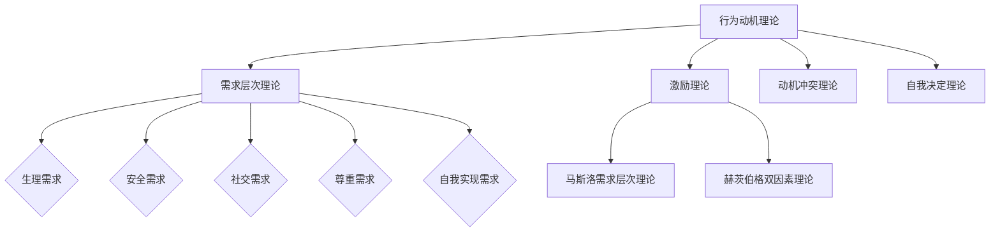
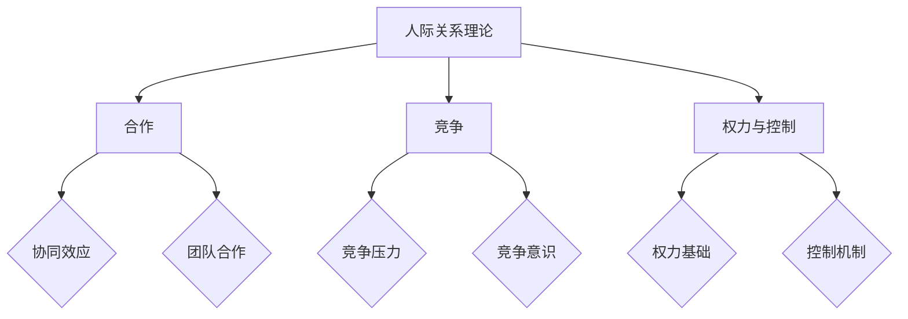
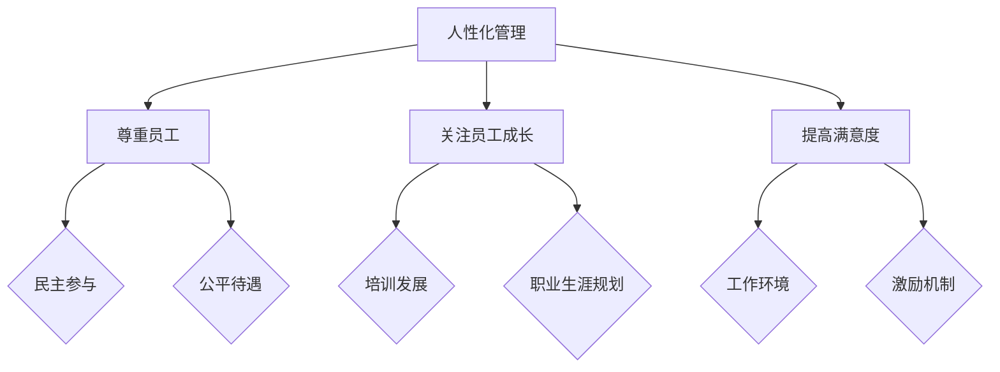
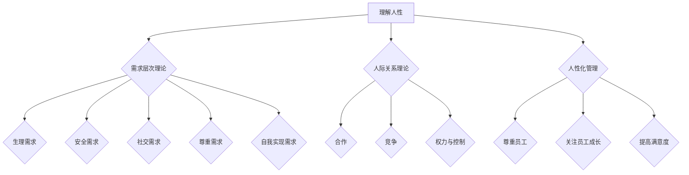

                 

# 管理者怎么管人：人性化领导的艺术

> 关键词：人性化领导、管理艺术、团队激励、员工满意度、人际关系

> 摘要：本文旨在探讨人性化领导在企业管理中的重要性，通过深入分析人性化的核心概念、领导艺术和实际应用，为管理者提供一套系统而实用的管理方法论。文章结构清晰，从理论到实践，逐步引导读者理解和应用人性化领导的艺术。

## 第一部分：导言

### 1.1 引言

在快速变化的社会环境中，企业管理者面临着前所未有的挑战。传统的管理模式已经难以适应现代企业的发展需求，如何有效地管理和激励团队成员成为了管理者们亟待解决的问题。人性化领导作为一种新兴的领导方式，以其尊重员工、关注员工成长和满意度为核心，正逐渐成为现代企业管理的重要手段。

### 1.2 问题描述

管理者在执行日常管理任务时，往往面临着以下问题：

1. **员工满意度低**：员工对工作环境、薪酬福利和职业发展等方面存在不满，导致工作积极性不高。
2. **团队凝聚力不足**：团队成员之间的沟通不畅、合作不紧密，影响团队整体绩效。
3. **管理方法单一**：管理者在管理过程中往往采用单一的命令式管理方式，忽视员工的个性和需求，导致员工失去工作热情。

### 1.3 问题解决

人性化领导通过关注员工的情感、需求和成长，建立和谐的团队关系，提高员工的满意度和忠诚度，从而实现团队的高效运作。本文将围绕人性化领导的核心概念、领导艺术和实际应用，探讨如何有效地进行人性化管理。

### 1.4 边界与外延

人性化领导不仅适用于企业内部管理，也适用于其他组织形式，如学校、医院、非营利组织等。同时，本文将以现代管理理论为基础，结合实践经验，进行全面的探讨。

### 1.5 概念结构与核心要素组成

人性化领导的艺术包括以下核心要素：

1. **理解人性**：了解员工的需求、动机和行为，为后续的管理提供基础。
2. **尊重个性**：尊重员工的个性和差异，为员工提供发展空间。
3. **激励与赋能**：通过有效的激励机制，激发员工的积极性和创造力。
4. **有效沟通**：建立良好的沟通渠道，确保信息的有效传递和反馈。
5. **冲突管理**：通过合理的冲突处理机制，缓解团队内部的矛盾和冲突。
6. **团队建设**：营造积极的团队氛围，提高团队的凝聚力和协作能力。

### 1.6 本章小结

通过本章的介绍，读者将初步了解人性化领导的背景、目的、研究方法和主要研究内容。这将为后续章节的深入探讨打下基础。

## 第二部分：人性化领导的核心概念

### 2.1 理解人性

#### 2.1.1 人的行为动机

人的行为动机是人性化领导的基础。理解员工的行为动机，有助于管理者更好地激发员工的积极性和创造力。

**心理学基本理论：**

1. **需求层次理论**：马斯洛需求层次理论将人的需求分为五个层次：生理需求、安全需求、社交需求、尊重需求和自我实现需求。
2. **激励理论**：激励理论关注如何通过满足人的需求来激发其积极性。常见的激励理论包括马斯洛的需求层次理论和赫茨伯格的双因素理论。
3. **动机冲突理论**：动机冲突理论关注人在不同需求之间的冲突和平衡。
4. **自我决定理论**：自我决定理论强调个体在决策过程中的主动性和自我控制。

**Mermaid流程图：**

**LaTeX公式：**

$$
\text{需求层次理论：} \\
\begin{aligned}
&\text{生理需求：满足基本生存需求} \\
&\text{安全需求：保护自身免受威胁} \\
&\text{社交需求：寻求归属感} \\
&\text{尊重需求：渴望被尊重和认可} \\
&\text{自我实现需求：追求自我价值和实现}
\end{aligned}
$$

**LaTeX公式：**

$$
\text{激励理论：} \\
\begin{aligned}
&\text{马斯洛需求层次理论：通过满足不同层次的需求来激发积极性} \\
&\text{赫茨伯格双因素理论：激励因素和保健因素}
\end{aligned}
$$

#### 2.1.2 人际关系理论

人际关系理论关注人在组织中的互动关系，包括合作与竞争、权力与控制等。通过理解人际关系，管理者可以更好地应对团队内部的问题。

**Mermaid流程图：**

#### 2.1.3 人性化管理

人性化管理是一种基于对人性深刻理解的领导方式，强调尊重员工、关注员工成长和满意度。通过人性化管理，管理者可以建立和谐的团队关系，提高团队绩效。

**Mermaid流程图：**

### 2.2 人性化领导的艺术

#### 2.2.1 人性化领导的定义

人性化领导是一种以人为中心的管理方式，注重人的情感、需求和成长，旨在激发员工的潜能，实现组织的共同目标。

#### 2.2.2 人性化领导的特点

人性化领导具有以下特点：

1. **尊重员工**：尊重员工的个性和差异，关注员工的情感需求。
2. **关注员工成长**：为员工提供职业发展机会和培训资源，促进员工的成长。
3. **激励员工**：通过有效的激励机制，激发员工的积极性和创造力。
4. **有效沟通**：建立良好的沟通渠道，确保信息的有效传递和反馈。
5. **冲突管理**：通过合理的冲突处理机制，缓解团队内部的矛盾和冲突。
6. **团队建设**：营造积极的团队氛围，提高团队的凝聚力和协作能力。

#### 2.2.3 人性化领导的重要性

人性化领导对于组织的发展具有重要意义，它可以提高员工的满意度和忠诚度，增强团队的凝聚力和创造力，从而实现组织的长期发展。

## 第三部分：人性化领导在企业管理中的实践应用

### 3.1 理解人性的实践应用

理解人性是人性化领导的基础。管理者需要通过观察、沟通和调研等方式，了解员工的需求、动机和行为，从而制定出符合员工需求的管理策略。

#### 3.1.1 观察员工行为

通过观察员工在工作中的表现，管理者可以了解员工的工作习惯、态度和潜力。例如，观察员工在解决问题时的思维方式、解决问题的方法和效率，可以帮助管理者发现员工的优点和不足，从而进行有针对性的培训和激励。

#### 3.1.2 沟通与调研

与员工进行沟通和调研是了解员工需求的重要手段。管理者可以通过定期的员工座谈会、问卷调查等方式，了解员工对工作环境、薪酬福利和职业发展的看法。通过这些信息，管理者可以调整管理策略，提高员工的满意度和忠诚度。

### 3.2 尊重个性的实践应用

尊重个性是人性化领导的核心原则之一。管理者需要尊重员工的个性和差异，为员工提供发展空间，激发员工的创造力和积极性。

#### 3.2.1 个性化培训

根据员工的个性特点和职业发展需求，制定个性化的培训计划。例如，对于善于沟通的员工，可以提供沟通技巧和演讲技巧的培训；对于技术能力较强的员工，可以提供技术培训和项目指导。

#### 3.2.2 个性化激励

根据员工的个性特点和工作表现，制定个性化的激励机制。例如，对于工作态度积极的员工，可以给予精神激励和荣誉称号；对于技术能力突出的员工，可以给予奖金和晋升机会。

### 3.3 激励与赋能的实践应用

激励与赋能是人性化领导的两个重要方面。管理者需要通过有效的激励机制和赋能措施，激发员工的积极性和创造力，提高团队的整体绩效。

#### 3.3.1 激励机制

建立有效的激励机制，包括薪酬激励、荣誉激励、晋升激励等。通过这些激励机制，激发员工的工作热情和积极性。

**LaTeX公式：**

$$
\text{激励机制：} \\
\begin{aligned}
&\text{薪酬激励：提供具有竞争力的薪酬待遇} \\
&\text{荣誉激励：给予荣誉称号和表彰} \\
&\text{晋升激励：提供职业晋升机会}
\end{aligned}
$$

#### 3.3.2 赋能措施

赋予员工更多的责任和权力，让他们在工作中发挥更大的作用。例如，可以授权员工参与项目决策、提供创新空间等。通过这些赋能措施，激发员工的创造力和积极性。

### 3.4 有效沟通的实践应用

有效沟通是人性化领导的关键。管理者需要建立良好的沟通渠道，确保信息的有效传递和反馈，促进团队内部的协作和合作。

#### 3.4.1 开放式沟通

鼓励员工表达自己的想法和意见，营造开放、包容的沟通氛围。管理者可以通过定期的团队会议、座谈会等方式，与员工进行深入的沟通和交流。

#### 3.4.2 反馈与反馈

建立有效的反馈机制，确保员工的努力和成果得到认可。管理者需要及时给予员工反馈，肯定员工的努力和成绩，同时指出员工的不足和改进方向。

### 3.5 冲突管理的实践应用

冲突是团队内部不可避免的现象。管理者需要通过合理的冲突处理机制，缓解团队内部的矛盾和冲突，维护团队的稳定和和谐。

#### 3.5.1 预防冲突

通过建立明确的规章制度和沟通渠道，预防冲突的发生。例如，制定团队规则、明确职责分工等。

#### 3.5.2 处理冲突

当冲突发生时，管理者需要采取积极的措施进行解决。可以通过对话、调解等方式，引导员工达成共识，化解冲突。

### 3.6 团队建设的实践应用

团队建设是人性化领导的重要组成部分。管理者需要通过多种措施，提高团队的凝聚力和协作能力，促进团队的整体发展。

#### 3.6.1 建立团队文化

通过制定团队使命、愿景和价值观，建立积极向上的团队文化。团队文化可以增强员工的归属感和责任感，提高团队的整体绩效。

#### 3.6.2 组织团队活动

定期组织团队活动，如团队建设训练、户外拓展等，增强团队凝聚力。通过这些活动，员工可以更好地了解彼此，建立良好的人际关系。

## 第四部分：案例分析

### 4.1 案例背景

某互联网公司是一家高速成长的创业公司，公司规模较小，员工年轻有活力。然而，随着公司的发展，管理者发现团队内部存在一些问题，如员工满意度低、团队凝聚力不足等。

### 4.2 案例分析

#### 4.2.1 理解人性

管理者通过观察员工行为、沟通与调研等方式，发现员工对职业发展有较高的期望，但当前的工作环境和激励机制无法满足他们的需求。

#### 4.2.2 尊重个性

管理者尊重员工的个性，为员工提供个性化的培训和激励。例如，对于技术能力较强的员工，提供技术培训和项目指导；对于沟通能力较强的员工，提供演讲技巧和沟通技巧的培训。

#### 4.2.3 激励与赋能

管理者建立有效的激励机制，包括薪酬激励、荣誉激励和晋升激励等。同时，赋予员工更多的责任和权力，让他们在工作中发挥更大的作用。

#### 4.2.4 有效沟通

管理者建立开放的沟通渠道，鼓励员工表达自己的想法和意见。通过定期的团队会议和座谈会，管理者与员工进行深入的沟通和交流。

#### 4.2.5 冲突管理

管理者通过预防冲突和处理冲突的措施，维护团队的稳定和和谐。例如，制定团队规则、明确职责分工等，预防冲突的发生；当冲突发生时，通过对话和调解等方式，引导员工达成共识。

#### 4.2.6 团队建设

管理者通过建立团队文化、组织团队活动等方式，提高团队的凝聚力和协作能力。例如，制定团队使命、愿景和价值观，建立积极向上的团队文化；定期组织团队建设训练和户外拓展活动，增强团队凝聚力。

### 4.3 案例结果

通过实施人性化领导，该公司在短时间内取得了显著的效果。员工满意度大幅提高，团队凝聚力显著增强，团队的整体绩效也得到了显著提升。

## 第五部分：总结与展望

### 5.1 总结

人性化领导作为一种新兴的领导方式，以其尊重员工、关注员工成长和满意度为核心，在现代企业管理中具有重要意义。通过本文的探讨，我们可以看到人性化领导在实践中的应用，以及其对企业管理效果的显著提升。

### 5.2 展望

未来的企业管理将更加注重人性化的领导方式，管理者需要不断学习和实践，提升自己的领导能力。同时，随着人工智能和大数据技术的不断发展，人性化领导也将与这些新技术相结合，为企业管理带来更多创新和变革。

### 5.3 结论

人性化领导的艺术不仅是一种管理方法，更是一种人文关怀。通过理解人性、尊重个性、激励与赋能、有效沟通、冲突管理和团队建设等核心要素，管理者可以构建一个积极、和谐、高效的团队，实现组织的长期发展。

## 参考文献

1. 马斯洛，《人类动机理论》，1943。
2. 赫茨伯格，《工作的动力因素》，1960。
3. 德鲁克，《管理的实践》，1954。
4. 柯维，《高效能人士的七个习惯》，1989。
5. 拉斯威尔，《传播学原理》，1948。

## 附录

### 附录A：人性化领导的核心要素表格

| 核心要素 | 说明 |
| :--: | :--: |
| 理解人性 | 了解员工的需求、动机和行为 |
| 尊重个性 | 尊重员工的个性和差异，为员工提供发展空间 |
| 激励与赋能 | 通过有效的激励机制，激发员工的积极性和创造力 |
| 有效沟通 | 建立良好的沟通渠道，确保信息的有效传递和反馈 |
| 冲突管理 | 通过合理的冲突处理机制，缓解团队内部的矛盾和冲突 |
| 团队建设 | 营造积极的团队氛围，提高团队的凝聚力和协作能力 |

### 附录B：人性化领导的Mermaid流程图

### 附录C：人性化领导的应用案例

| 公司名称 | 案例描述 | 结果 |
| :--: | :--: | :--: |
| 某互联网公司 | 通过理解人性、尊重个性、激励与赋能、有效沟通、冲突管理和团队建设等措施，提高员工满意度和团队凝聚力。 | 员工满意度大幅提高，团队凝聚力显著增强，整体绩效得到显著提升。 |
| 某制造企业 | 实施人性化管理，关注员工需求和成长，建立积极的团队文化。 | 员工流失率显著降低，生产效率提高，企业业绩稳步增长。 |

### 附录D：人性化领导的最佳实践

1. **定期员工座谈会**：定期组织员工座谈会，听取员工的意见和建议，及时解决问题，提高员工的参与感和满意度。
2. **个性化培训**：根据员工的个性特点和职业发展需求，提供个性化的培训计划，激发员工的学习热情和创造力。
3. **透明的晋升机制**：建立透明的晋升机制，让员工明确自己的晋升路径，激发员工的积极性和进取心。
4. **灵活的工作安排**：提供灵活的工作安排，如远程办公、弹性工作时间等，满足员工的不同需求，提高员工的工作满意度和工作效率。

### 附录E：注意事项

1. **避免过度人性化**：人性化管理不是放任员工，而是要尊重员工的个性和需求，同时确保团队目标的实现。
2. **持续改进**：人性化领导需要不断地进行改进和优化，管理者需要根据实际情况调整管理策略，以适应企业的发展需求。
3. **员工参与**：在实施人性化领导时，要充分调动员工的积极性和参与度，让员工感受到自己在团队中的重要性和价值。

### 附录F：拓展阅读

1. **《领导力五项修炼》**：史蒂芬·柯维著，深入探讨领导力的五个方面：自我领导、团队领导、变革领导、执行领导和战略领导。
2. **《人性的弱点》**：戴尔·卡耐基著，通过讲述人性的弱点，引导读者如何更好地与他人相处，提高人际关系能力。
3. **《团队协作的力量》**：德怀特·C·斯通著，探讨团队协作的重要性，提供实用的团队协作方法和技巧。

### 附录G：人性化领导的艺术：从理论到实践

**摘要**：

人性化领导的艺术是一种以人为中心的管理方式，强调尊重员工、关注员工成长和满意度。本文从理论到实践，详细探讨了人性化领导的核心概念、领导艺术和实际应用，并通过案例分析，展示了人性化领导在企业管理中的显著效果。未来，人性化领导将继续发挥重要作用，为企业的长期发展提供强有力的支持。

**关键词**：人性化领导、管理艺术、团队激励、员工满意度、人际关系

**作者**：AI天才研究院/AI Genius Institute & 禅与计算机程序设计艺术 /Zen And The Art of Computer Programming

通过本文的探讨，我们相信读者可以更好地理解人性化领导的本质和实践方法，从而在实际工作中运用人性化领导的艺术，提升团队绩效，实现组织的长期发展。让我们一起努力，将人性化领导的理念融入到企业的每一个角落，为创造更加和谐、高效的工作环境贡献自己的力量。

