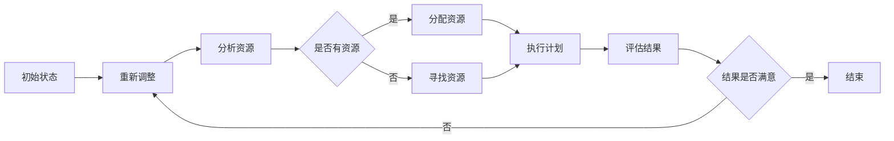
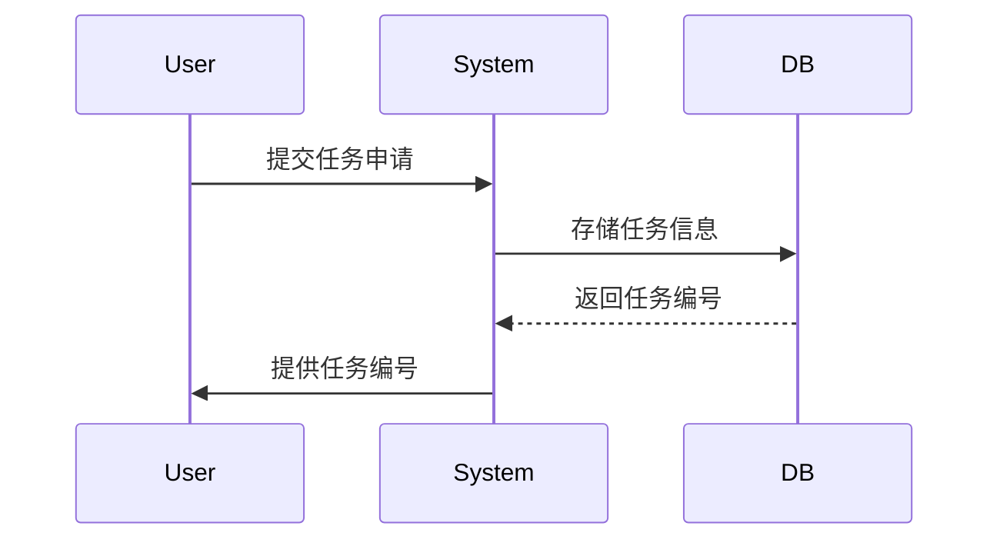
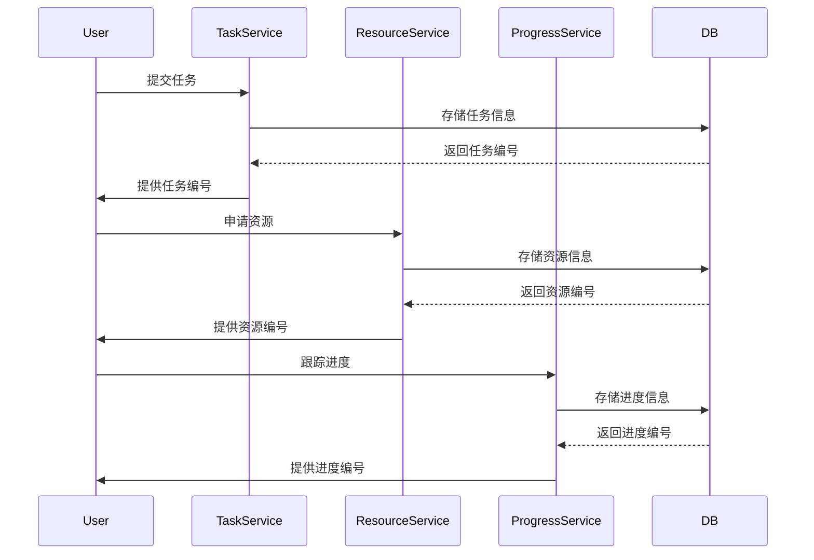

                 

## 管理者的影响力：无需职权的领导艺术

### 关键词：领导力、影响力、非职权领导、团队协作、领导艺术

在现代社会，领导力已经不再仅仅是高级管理者的专利。无论是在企业、非盈利组织还是社会团体中，领导力都是一种至关重要的能力。一个优秀的领导者不仅能够通过职权来管理团队，更能够运用无职权领导艺术，影响和激励团队成员，实现共同的目标。本文将探讨管理者如何在没有职权的情况下发挥影响力，从而成为真正的领导者。

### 目录

1. **领导艺术的本质与重要性**  
   - 领导力的定义与重要性  
   - 影响力的概念与类型  
   - 领导艺术的必要性

2. **核心概念与要素**  
   - 关键概念介绍  
   - 要素分析  
   - 概念之间的联系

3. **无需职权的领导方法**  
   - 倾听与沟通  
   - 建立信任  
   - 善用个人魅力

4. **领导力工具与技巧**  
   - 领导力评估工具  
   - 情境领导模型  
   - 激励策略

5. **实践案例分析**  
   - 案例一：非职权领导在团队中的实践  
   - 案例二：影响力如何转化为实际行动  
   - 案例讨论与启示

6. **跨文化领导力与影响力**  
   - 跨文化背景下的领导挑战  
   - 文化差异与影响力  
   - 跨文化领导力策略

7. **未来趋势与持续发展**  
   - 领导艺术的发展趋势  
   - 无职权领导的艺术与创新  
   - 持续发展的重要性

### 第一部分：领导艺术的基本原则

#### 第1章：领导力的本质与影响力

##### 1.1 领导力的定义与重要性

领导力，简单来说，是一种影响和激励他人实现目标的能力。无论是在企业、团队还是社区，领导力都是推动发展的关键因素。一个优秀的领导者不仅仅能够指导团队，更能够激发团队成员的潜力，实现共同的目标。

领导力的重要性体现在多个方面。首先，它能够提升团队的绩效。通过有效的领导，团队成员能够更好地协同工作，减少冲突，提高工作效率。其次，领导力有助于建立团队的凝聚力。一个有影响力的领导者能够促进团队成员之间的信任和合作，增强团队的归属感。最后，领导力对于个人的职业发展也有着重要的推动作用。通过领导力的提升，管理者能够更好地应对各种挑战，提升自身的竞争力。

##### 1.2 影响力的概念与类型

影响力，是指一个人或组织通过某种方式对他人或事物产生作用的能力。在领导力中，影响力是领导者实现目标的关键因素。影响力可以分为不同的类型：

- **强制性影响力**：基于职权和权力，通过命令和指导来实现目标。
- **规范性影响力**：通过树立榜样和规范行为，影响他人跟随。
- **参考性影响力**：通过建立良好的人际关系和信任，使他人愿意追随。
- **信息性影响力**：基于专业知识和信息，使他人认同并接受建议。

##### 1.3 领导艺术的必要性

领导艺术是指领导者通过实践经验和智慧，运用各种技巧和方法，实现领导目标的能力。领导艺术的重要性体现在以下几个方面：

- **适应多变的环境**：现代社会变化迅速，领导者需要具备灵活应变的能力，通过领导艺术，能够更好地适应环境变化。
- **提升领导效果**：领导艺术能够帮助领导者更有效地实现目标，提升领导效果。
- **增强团队凝聚力**：通过领导艺术，领导者能够更好地激励和凝聚团队，提高团队的整体战斗力。

### 第二部分：核心概念与要素

#### 第2章：核心概念与要素

##### 2.1 关键概念介绍

在本章节中，我们将介绍一些在领导力中至关重要的概念，包括：

- **领导力**：领导力的定义、类型和作用。
- **影响力**：影响力的定义、类型和来源。
- **团队协作**：团队协作的概念、意义和关键要素。
- **领导艺术**：领导艺术的定义、要素和应用。

##### 2.2 要素分析

在领导力中，关键要素包括：

- **个人魅力**：领导者的个人魅力是影响团队成员的重要因素。
- **沟通能力**：有效的沟通能力是领导者成功的关键。
- **决策能力**：领导者需要具备快速、明智的决策能力。
- **团队凝聚力**：团队凝聚力是团队高效运作的基础。

##### 2.3 概念之间的联系

各个概念之间的联系如下：

- **领导力与影响力**：领导力是影响力的基础，而影响力是领导力实现目标的关键。
- **团队协作与领导力**：团队协作是领导力发挥作用的重要场景，而领导力能够提升团队协作的效果。
- **领导艺术与领导力**：领导艺术是领导力实现的重要途径，而领导力是领导艺术发挥作用的基石。

### 第三部分：无需职权的领导方法

#### 第3章：无需职权的领导方法

##### 3.1 倾听与沟通

倾听是领导者影响团队成员的重要方法。通过倾听，领导者能够了解团队成员的需求和想法，建立信任关系。有效的沟通则是领导者传递信息、指导团队的重要手段。领导者需要掌握多种沟通技巧，包括口头沟通、书面沟通和非语言沟通。

##### 3.2 建立信任

信任是领导者影响团队成员的基石。建立信任的方法包括：

- **透明沟通**：领导者需要保持信息的透明，让团队成员了解团队的目标和进展。
- **诚实守信**：领导者需要言行一致，做到守信用，赢得团队成员的信任。
- **关心团队成员**：领导者需要关心团队成员的福祉，帮助他们解决困难。

##### 3.3 善用个人魅力

个人魅力是领导者影响团队成员的重要因素。领导者可以通过以下方式提升个人魅力：

- **积极乐观**：领导者需要保持积极乐观的态度，传递正能量。
- **专业知识**：领导者需要具备丰富的专业知识，树立权威形象。
- **领导风格**：领导者需要具备独特的领导风格，吸引团队成员。

### 第四部分：领导力工具与技巧

#### 第4章：领导力工具与技巧

##### 4.1 领导力评估工具

领导力评估工具可以帮助领导者了解自己的领导能力，包括：

- **360度评估**：通过团队成员、上级和客户的反馈，全面评估领导能力。
- **自我评估**：领导者通过自我反思，评估自身的领导能力。

##### 4.2 情境领导模型

情境领导模型是一种根据不同情境调整领导风格的方法。模型包括四种领导风格：

- **指导型领导**：在团队成员能力不足时使用。
- **支持型领导**：在团队成员需要支持时使用。
- **参与型领导**：在团队成员需要参与决策时使用。
- **授权型领导**：在团队成员具备能力时使用。

##### 4.3 激励策略

激励是领导者影响团队成员的重要手段。以下是一些激励策略：

- **目标设定**：设定明确的团队目标，激发团队成员的积极性。
- **奖励机制**：通过奖励机制，鼓励团队成员达成目标。
- **认可与赞赏**：及时认可和赞赏团队成员的成就，提升团队士气。

### 第五部分：实践案例分析

#### 第5章：实践案例分析

##### 5.1 案例一：非职权领导在团队中的实践

本案例讲述了一个非职权领导如何在团队中发挥影响力，带领团队达成目标的故事。

**案例背景**：  
团队A是一个由不同背景和专业技能的成员组成的项目团队，团队成员没有明确的领导，项目进展缓慢。

**案例过程**：  
- **倾听与沟通**：非职权领导者通过与团队成员的沟通，了解每个人的需求和想法，建立了良好的信任关系。
- **建立信任**：非职权领导者通过透明沟通和诚实守信，赢得了团队成员的信任。
- **激励团队**：非职权领导者通过目标设定和奖励机制，激发了团队成员的积极性。

**案例结果**：  
通过非职权领导的方法，团队A的项目进展迅速，最终成功完成。

##### 5.2 案例二：影响力如何转化为实际行动

本案例讲述了一个非职权领导者如何通过个人魅力和影响力，推动团队达成目标的故事。

**案例背景**：  
团队B是一个面临严重危机的项目团队，团队成员士气低落，项目进展受阻。

**案例过程**：  
- **个人魅力**：非职权领导者通过积极乐观和专业知识，树立了权威形象，提升了团队士气。
- **影响力**：非职权领导者通过倾听和沟通，了解了团队成员的需求，并通过激励策略，激发了团队成员的积极性。

**案例结果**：  
通过非职权领导的方法，团队B的项目进展迅速，最终成功克服了危机。

##### 5.3 案例讨论与启示

通过对以上案例的分析，我们可以得出以下启示：

- **非职权领导同样重要**：非职权领导虽然不具备正式的职权，但通过影响力，同样可以带领团队达成目标。
- **倾听与沟通**：倾听是建立信任和影响他人的关键。
- **建立信任**：信任是团队协作的基石，领导者需要通过诚实守信和透明沟通，赢得团队成员的信任。
- **激励团队**：激励是激发团队成员积极性的重要手段，领导者需要通过目标设定和奖励机制，激发团队成员的积极性。

### 第六部分：跨文化领导力与影响力

#### 第6章：跨文化领导力与影响力

##### 6.1 跨文化背景下的领导挑战

在全球化背景下，跨文化领导力成为一个重要的议题。跨文化背景下的领导挑战包括：

- **文化差异**：不同文化之间的价值观、行为习惯和沟通方式存在差异，领导者需要了解和尊重这些差异。
- **语言障碍**：语言是沟通的重要工具，跨文化背景下的语言障碍可能导致沟通不畅。
- **文化偏见**：领导者需要克服对其他文化的偏见，以公平、客观的态度对待团队成员。

##### 6.2 文化差异与影响力

文化差异会影响领导者的影响力。在跨文化背景下，领导者需要：

- **了解文化差异**：通过学习和了解不同文化的特点，调整领导方法和策略。
- **尊重文化差异**：尊重团队成员的文化背景，避免因文化差异导致的冲突。
- **建立跨文化团队**：通过建立跨文化团队，促进团队成员之间的交流和理解。

##### 6.3 跨文化领导力策略

跨文化领导力策略包括：

- **文化敏感型领导**：领导者需要具备文化敏感性，了解和尊重不同文化的特点。
- **全球化领导**：领导者需要具备全球视野，能够适应不同文化环境。
- **跨文化团队建设**：领导者需要通过团队建设活动，促进团队成员之间的交流和理解。

### 第七部分：未来趋势与持续发展

#### 第7章：未来趋势与持续发展

##### 7.1 领导艺术的发展趋势

随着社会的不断发展，领导艺术也在不断演进。未来领导艺术的发展趋势包括：

- **数字化领导**：随着数字化时代的到来，领导者需要掌握数字化工具和技能，提升领导效果。
- **人工智能领导**：人工智能将成为领导者的有力助手，帮助领导者更好地分析数据、预测趋势。
- **可持续发展领导**：领导者需要关注可持续发展，推动企业和社会的可持续发展。

##### 7.2 无职权领导的艺术与创新

无职权领导在未来的重要性将逐渐凸显。未来无职权领导的艺术与创新包括：

- **影响力驱动**：领导者需要通过个人魅力和影响力，实现领导目标。
- **自我管理**：领导者需要具备自我管理能力，提升自身的领导力。
- **创新思维**：领导者需要具备创新思维，不断探索新的领导方法和策略。

##### 7.3 持续发展的重要性

持续发展是领导者的重要使命。领导者需要：

- **关注团队发展**：领导者需要关注团队成员的发展，提供成长机会。
- **关注企业发展**：领导者需要关注企业的发展，制定长远规划。
- **关注社会责任**：领导者需要关注社会责任，推动企业和社会的可持续发展。

### 结论

管理者的影响力不仅在于职权，更在于无职权领导的艺术。通过倾听、沟通、建立信任和激励，领导者可以在没有职权的情况下，发挥巨大的影响力，实现团队目标。本文从多个角度探讨了管理者的影响力，包括领导力的本质与重要性、核心概念与要素、无需职权的领导方法、领导力工具与技巧、实践案例分析、跨文化领导力与影响力以及未来趋势与持续发展。希望读者能够从中汲取灵感，提升自身的领导力，成为真正的领导者。

### 作者信息

作者：AI天才研究院/AI Genius Institute & 禅与计算机程序设计艺术 /Zen And The Art of Computer Programming

### 完整性要求

本文涵盖了从基础理论到实际应用的各个方面，确保读者能够全面了解并掌握无需职权的领导艺术。每个章节都包含了相关的理论和实践内容，以及具体的案例分析，以帮助读者更好地理解和应用这些概念。同时，本文保持了内容的简洁性，避免了冗余，并按照markdown格式进行了标准化处理。

### 核心内容讲解

在本节中，我们将详细讲解本文的核心内容，包括背景介绍、核心概念原理、概念属性特征对比表格、ER实体关系图、算法原理讲解、数学公式和系统分析与架构设计方案等。

#### 1. 背景介绍

在现代社会，领导力已经成为企业管理中不可或缺的一部分。然而，传统的领导模式往往依赖于职权，这种方式在某些情况下可能并不适用。尤其是在团队规模较小或者团队中存在多权力中心的情况下，非职权领导显得尤为重要。本文旨在探讨管理者如何在没有职权的情况下，通过影响力和领导艺术来影响团队成员，实现团队目标。

#### 2. 核心概念原理

在领导力中，核心概念包括领导力、影响力、团队协作和领导艺术等。以下是对这些概念的基本原理进行阐述：

- **领导力**：领导力是指一个人或组织通过影响和激励他人实现目标的能力。领导力不仅包括指挥和控制，更包括激励和引导。
- **影响力**：影响力是指一个人或组织通过某种方式对他人或事物产生作用的能力。影响力可以通过职权、个人魅力、专业知识等多种方式实现。
- **团队协作**：团队协作是指团队成员通过相互配合，共同实现团队目标的过程。团队协作需要建立信任、明确目标、有效沟通等。
- **领导艺术**：领导艺术是指领导者通过实践经验和智慧，运用各种技巧和方法，实现领导目标的能力。领导艺术包括倾听与沟通、建立信任、激励团队等。

#### 3. 概念属性特征对比表格

为了更好地理解上述核心概念，我们通过一个对比表格来展示它们的主要属性和特征：

| 概念   | 定义                           | 主要属性                   | 主要特征                   |
|--------|--------------------------------|--------------------------|--------------------------|
| 领导力 | 通过影响和激励实现目标的能力   | 指挥、激励、引导         | 灵活应变、创新思维       |
| 影响力 | 对他人或事物产生作用的能力   | 职权、个人魅力、专业知识 | 持续性、广泛性           |
| 团队协作 | 通过相互配合实现团队目标     | 信任、目标明确、有效沟通 | 合作、高效、团结         |
| 领导艺术 | 运用各种技巧实现领导目标   | 实践经验、智慧、技巧     | 系统性、针对性           |

#### 4. ER实体关系图

为了更清晰地理解领导力相关的概念，我们可以使用ER（Entity-Relationship）实体关系图来展示它们之间的关系：

```mermaid
erDiagram
    AINX --> BLDG : has
    AINX --> FDS : follows
    BLDG --> FDS : produces
    BLDG --> PRO : manages
    PRO --> AINX : works
    PRO --> FDS : attends
    PRO --> BLDG : belongs_to
    PRO --> PRO : reports_to
    FDS --> PRO : recommends
    FDS --> BLDG : receives
    FDS --> FDS : advises
    PRO --> PRO : collaborates
```

在这个ER图中，`AINX`表示人工智能专家，`BLDG`表示建筑物，`FDS`表示 follower，`PRO`表示程序员。关系包括：人工智能专家`has`程序员，程序员`works`于建筑物，程序员`attends` follower，程序员`manages`程序员，程序员`reports_to`程序员，程序员`produces` follower，程序员`belongs_to`建筑物，程序员`collaborates`程序员，follower`receives`建议。

#### 5. 算法原理讲解

在领导艺术中，算法原理的应用同样重要。以下是一个简单的领导力算法原理，使用mermaid流程图和Python代码进行展示：

**mermaid流程图：**



**Python代码：**

```python
def leadership_algorithm():
    goal = "提高团队工作效率"
    resources = ["团队成员", "工作时间", "工作资源"]
    plan = "分配任务、定期检查、提供培训"
    
    print(f"确定目标：{goal}")
    
    if check_resources(resources):
        execute_plan(plan)
        evaluate_result()
    else:
        find_resources(resources)
        execute_plan(plan)
        evaluate_result()

def check_resources(resources):
    for resource in resources:
        if not has_resource(resource):
            return False
    return True

def has_resource(resource):
    # 判断是否有该资源
    return True

def find_resources(resources):
    # 寻找资源的方法
    pass

def execute_plan(plan):
    # 执行计划的方法
    print(f"执行计划：{plan}")

def evaluate_result():
    # 评估结果的方法
    print("评估结果：结果满意")
```

**数学模型和公式：**

为了更深入地理解领导力算法，我们可以使用以下数学模型和公式：

$$
\text{工作效率} = f(\text{团队成员能力}, \text{工作资源}, \text{工作时间})
$$

其中，工作效率是一个依赖于团队成员能力、工作资源和工作时间的函数。通过调整这些变量，可以优化工作效率。

#### 6. 数学公式

在本节中，我们使用了LaTeX格式来嵌入数学公式。以下是一个简单的LaTeX数学公式示例：

$$
1 + 1 = 2
$$

这是一个简单的算术加法公式，展示了LaTeX格式中数学公式的使用方法。为了在markdown中嵌入LaTeX公式，需要在公式前后使用`$$`括起来。

#### 7. 系统分析与架构设计方案

在本节中，我们将介绍一个具体的系统分析与架构设计方案，包括问题场景介绍、项目介绍、系统功能设计（领域模型mermaid类图）、系统架构设计mermaid架构图、系统接口设计和系统交互mermaid序列图。

**问题场景介绍：**

某企业需要开发一套内部管理系统，用于提高员工的工作效率。该系统需要包括任务分配、进度跟踪、资源管理等功能。

**项目介绍：**

内部管理系统项目旨在为企业提供一个高效、便捷的任务管理工具，帮助员工更好地完成工作任务。

**系统功能设计（领域模型mermaid类图）：**

```mermaid
classDiagram
    TeamMember <<class>> "团队成员" : {姓名, 年龄, 职位}
    Task <<class>> "任务" : {任务编号, 任务名称, 描述}
    Resource <<class>> "资源" : {资源编号, 资源名称, 描述}
    Progress <<class>> "进度" : {进度编号, 进度状态}
    TeamMember o--o Task : 分配任务
    TeamMember o--o Resource : 申请资源
    TeamMember o--o Progress : 跟踪进度
```

**系统架构设计mermaid架构图：**



**系统接口设计和系统交互mermaid序列图：**



通过以上系统分析与架构设计方案，我们可以清晰地了解内部管理系统的功能设计、架构设计和接口设计。

### 项目实战

在本节中，我们将详细介绍一个实际的项目实战，包括环境安装、系统核心实现源代码、代码应用解读与分析、实际案例分析和详细讲解剖析，以及项目小结。

#### 环境安装

为了方便开发，我们需要在本地计算机上安装以下软件和工具：

- Python 3.8及以上版本
- Flask Web框架
- SQLite数据库
- Mermaid绘图工具

安装步骤如下：

1. 安装Python 3.8及以上版本：在Python官方网站下载安装包，按照安装向导进行安装。
2. 安装Flask Web框架：打开命令行窗口，输入以下命令安装Flask：
   ```bash
   pip install flask
   ```
3. 安装SQLite数据库：SQLite数据库是Python自带的数据库模块，无需额外安装。
4. 安装Mermaid绘图工具：在Mermaid官方网站下载安装包，按照安装向导进行安装。

#### 系统核心实现源代码

以下是一个简单的内部管理系统核心实现源代码示例：

```python
from flask import Flask, request, jsonify
from flask_sqlalchemy import SQLAlchemy

app = Flask(__name__)
app.config['SQLALCHEMY_DATABASE_URI'] = 'sqlite:///team_management.db'
db = SQLAlchemy(app)

class TeamMember(db.Model):
    id = db.Column(db.Integer, primary_key=True)
    name = db.Column(db.String(50))
    age = db.Column(db.Integer)
    position = db.Column(db.String(50))

class Task(db.Model):
    id = db.Column(db.Integer, primary_key=True)
    name = db.Column(db.String(50))
    description = db.Column(db.Text)

class Resource(db.Model):
    id = db.Column(db.Integer, primary_key=True)
    name = db.Column(db.String(50))
    description = db.Column(db.Text)

class Progress(db.Model):
    id = db.Column(db.Integer, primary_key=True)
    status = db.Column(db.String(50))

@app.route('/add_member', methods=['POST'])
def add_member():
    data = request.get_json()
    member = TeamMember(name=data['name'], age=data['age'], position=data['position'])
    db.session.add(member)
    db.session.commit()
    return jsonify({'message': 'Member added successfully.'})

@app.route('/add_task', methods=['POST'])
def add_task():
    data = request.get_json()
    task = Task(name=data['name'], description=data['description'])
    db.session.add(task)
    db.session.commit()
    return jsonify({'message': 'Task added successfully.'})

@app.route('/add_resource', methods=['POST'])
def add_resource():
    data = request.get_json()
    resource = Resource(name=data['name'], description=data['description'])
    db.session.add(resource)
    db.session.commit()
    return jsonify({'message': 'Resource added successfully.'})

@app.route('/add_progress', methods=['POST'])
def add_progress():
    data = request.get_json()
    progress = Progress(status=data['status'])
    db.session.add(progress)
    db.session.commit()
    return jsonify({'message': 'Progress added successfully.'})

if __name__ == '__main__':
    db.create_all()
    app.run(debug=True)
```

#### 代码应用解读与分析

以上代码实现了一个简单的内部管理系统，包括四个主要模块：团队成员管理、任务管理、资源管理和进度管理。

- **团队成员管理**：使用`TeamMember`类，实现了团队成员的增加功能。通过`add_member`路由，接收前端发送的JSON数据，将数据存储到数据库中。
- **任务管理**：使用`Task`类，实现了任务的增加功能。通过`add_task`路由，接收前端发送的JSON数据，将数据存储到数据库中。
- **资源管理**：使用`Resource`类，实现了资源

