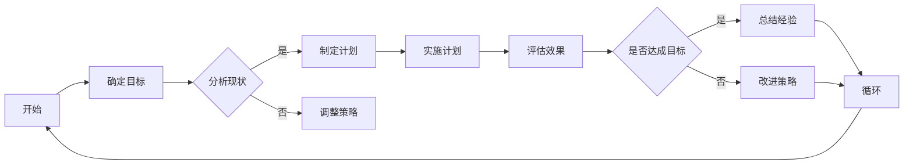
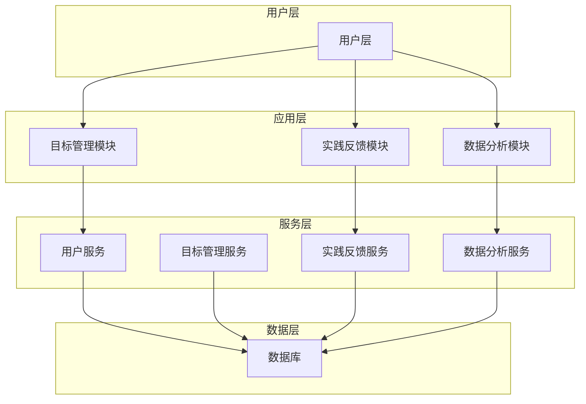
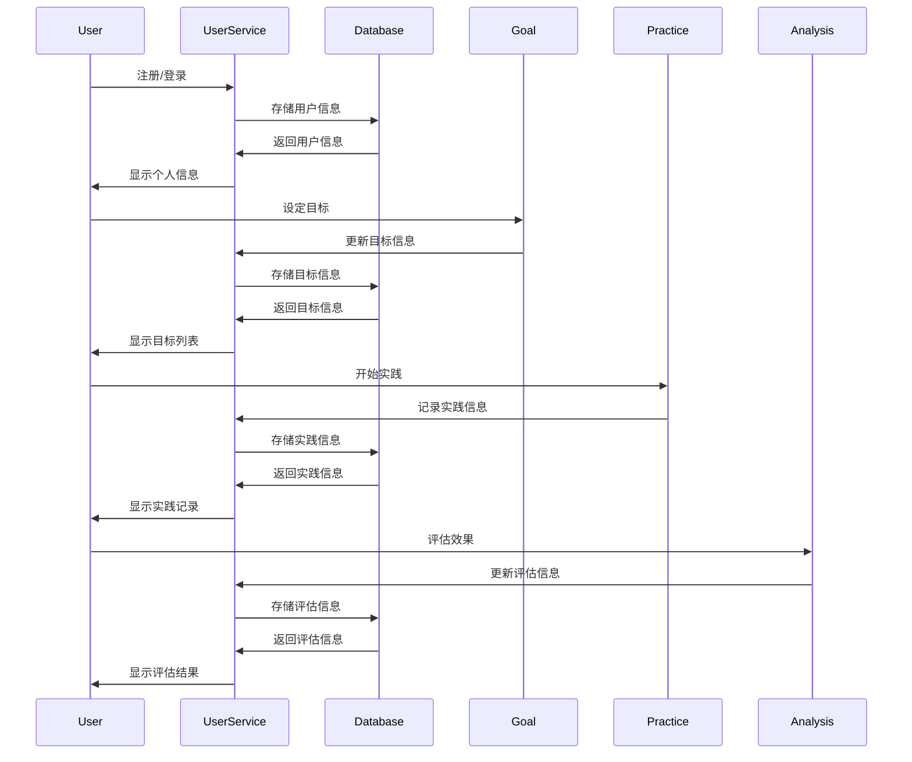

                 

## 管理者的自我修炼：提升领导能力的日常习惯

### 关键词：自我修炼、领导能力、日常习惯、价值观、沟通技巧、决策能力、团队协作

### 摘要：

在当今快速变化和高度竞争的商业环境中，管理者面临的挑战日益严峻。为了保持组织的活力和竞争力，管理者必须不断自我修炼，提升自身的领导能力。本文将探讨管理者的自我修炼方法，通过建立正确的价值观、培养有效的沟通技巧、提高决策能力和增强团队协作，帮助管理者在日常工作中不断提升领导力。

#### 引言

在商业环境中，管理者的领导能力对组织的成功至关重要。然而，随着市场的不断变化和技术的快速发展，管理者面临着前所未有的挑战。传统的管理方法和模式已经无法适应现代商业环境的需求，因此，管理者需要不断自我修炼，提升自身的领导能力。本文将围绕以下几个方面展开讨论：

1. **价值观**：价值观是管理者的行为准则和道德准则，对于管理者来说，正确的价值观不仅影响个人的行为，也影响着团队的文化和氛围。
2. **沟通技巧**：有效的沟通是管理者必备的技能，通过倾听、表达和反馈，管理者可以更好地理解团队需求，提高决策效率和团队凝聚力。
3. **决策能力**：在面对复杂问题时，管理者的决策能力直接影响着组织的方向和战略。如何提高决策能力，是管理者需要不断思考的问题。
4. **团队协作**：团队协作能力是管理者能否成功带领团队实现目标的关键。通过建立信任、明确目标和分工，管理者可以激发团队成员的潜力，实现团队的最大效能。

#### 问题描述

尽管许多管理者已经意识到自我修炼的重要性，但他们往往缺乏具体的实践指导和系统性的方法。在繁忙的工作中，管理者很难抽出时间进行自我反思和提升。因此，本文旨在为管理者提供一套实用的日常习惯，帮助他们在日常生活中持续提升领导能力。本文将针对以下问题进行探讨：

1. **如何建立正确的价值观？**
2. **如何培养有效的沟通技巧？**
3. **如何提高决策能力？**
4. **如何增强团队协作能力？**

#### 问题解决

为了解决上述问题，本文将从多个维度阐述管理者的自我修炼方法。首先，我们将深入探讨价值观的重要性，并提供具体的方法和策略，帮助管理者建立和强化正确的价值观。接着，我们将讨论沟通技巧，包括倾听、表达和反馈，以及如何通过有效的沟通提升团队凝聚力和决策效率。

在决策能力方面，我们将探讨如何通过逻辑思维和风险管理提高决策能力。同时，我们将讨论团队协作的重要性，并提供具体的策略和技巧，帮助管理者激发团队成员的潜力，实现团队目标。

#### 边界与外延

本文主要关注中层和高层管理者的自我修炼，包括但不限于部门经理、项目经理和企业高层等。虽然这些方法对其他职业人士也有一定的参考价值，但本文将侧重于管理者的自我修炼，以帮助他们在工作中更好地发挥领导力。

#### 概念结构与核心要素组成

在本文中，我们将从以下几个核心要素组成对管理者的自我修炼进行详细阐述：

1. **价值观**：管理者应当具备的核心价值观，如诚信、责任、创新和协作等。
2. **沟通技巧**：有效的沟通方式和方法，包括倾听、表达、反馈和非语言沟通等。
3. **决策能力**：管理者在面对复杂问题时如何做出合理且明智的决策。
4. **团队协作**：如何激发团队成员的潜力，实现团队目标。

### 第一部分：引言

#### 1. 问题背景

在当今快速发展的商业环境中，管理者的角色和责任越来越重要。随着市场的不断变化和竞争的加剧，组织需要更加灵活和高效的领导者来应对挑战。然而，传统的管理方法和模式已经无法适应现代商业环境的需求。现代管理者不仅需要具备丰富的业务知识和技能，还需要具备良好的领导能力。在这种情况下，管理者的自我修炼成为了一项必不可少的任务。

管理者的自我修炼不仅是个人职业发展的需要，也是团队和组织成功的关键。通过自我修炼，管理者可以不断提升自身的领导能力，更好地应对复杂多变的市场环境。同时，自我修炼还可以帮助管理者建立正确的价值观，培养有效的沟通技巧，提高决策能力和团队协作能力，从而实现个人和组织的共同成长。

#### 2. 问题描述

尽管许多管理者已经意识到自我修炼的重要性，但他们往往缺乏具体的实践指导和系统性的方法。在繁忙的工作中，管理者很难抽出时间进行自我反思和提升。因此，如何有效地进行自我修炼，成为了一个亟待解决的问题。

首先，许多管理者面临时间管理的问题。他们在日常工作中需要处理大量的工作任务，很难找到时间进行自我修炼。其次，管理者可能缺乏有效的自我提升方法。他们不知道如何系统地提升自身的领导能力，缺乏明确的目标和计划。此外，管理者在自我修炼过程中可能面临心理和情绪上的挑战，需要克服自我怀疑和焦虑等负面情绪。

#### 3. 问题解决

为了解决上述问题，本文将提供一套实用的自我修炼方法，帮助管理者在日常生活中持续提升领导能力。具体方法如下：

1. **建立正确的价值观**：管理者需要明确自己的价值观，并将其融入到日常工作中。通过树立正确的价值观，管理者可以更好地引导团队行为，建立健康的企业文化。

2. **培养有效的沟通技巧**：管理者需要通过倾听、表达和反馈等沟通技巧，与团队成员建立良好的沟通渠道。这有助于提高团队凝聚力和决策效率。

3. **提高决策能力**：管理者需要通过逻辑思维和风险管理等方法，提高决策能力。这包括对问题的深入分析、评估选项和制定应对策略。

4. **增强团队协作能力**：管理者需要通过建立信任、明确目标和分工等方式，增强团队协作能力。这有助于激发团队成员的潜力，实现团队目标。

通过以上方法，管理者可以在日常生活中持续提升自身的领导能力，应对商业环境中的各种挑战。

#### 4. 边界与外延

本文主要关注中层和高层管理者的自我修炼，包括但不限于部门经理、项目经理和企业高层等。这些管理者在组织中的角色和责任较为重要，他们需要具备良好的领导能力来推动组织的发展。虽然本文的方法对其他职业人士也有一定的参考价值，但本文将侧重于管理者的自我修炼，以帮助他们在工作中更好地发挥领导力。

#### 5. 概念结构与核心要素组成

在本文中，我们将从以下几个核心要素组成对管理者的自我修炼进行详细阐述：

1. **价值观**：价值观是管理者的行为准则和道德准则，对于管理者来说，正确的价值观不仅影响个人的行为，也影响着团队的文化和氛围。
2. **沟通技巧**：有效的沟通是管理者必备的技能，通过倾听、表达和反馈，管理者可以更好地理解团队需求，提高决策效率和团队凝聚力。
3. **决策能力**：管理者在面对复杂问题时如何做出合理且明智的决策。
4. **团队协作**：如何激发团队成员的潜力，实现团队目标。

在接下来的章节中，我们将逐一探讨这些核心要素，并提供具体的实践方法和策略。

### 第一部分：引言

#### 1. 问题背景

在当今快速发展的商业环境中，管理者的角色和责任越来越重要。随着市场的不断变化和竞争的加剧，组织需要更加灵活和高效的领导者来应对挑战。然而，传统的管理方法和模式已经无法适应现代商业环境的需求。现代管理者不仅需要具备丰富的业务知识和技能，还需要具备良好的领导能力。在这种情况下，管理者的自我修炼成为了一项必不可少的任务。

管理者的自我修炼不仅是个人职业发展的需要，也是团队和组织成功的关键。通过自我修炼，管理者可以不断提升自身的领导能力，更好地应对复杂多变的市场环境。同时，自我修炼还可以帮助管理者建立正确的价值观，培养有效的沟通技巧，提高决策能力和团队协作能力，从而实现个人和组织的共同成长。

#### 2. 问题描述

尽管许多管理者已经意识到自我修炼的重要性，但他们往往缺乏具体的实践指导和系统性的方法。在繁忙的工作中，管理者很难抽出时间进行自我反思和提升。因此，如何有效地进行自我修炼，成为了一个亟待解决的问题。

首先，许多管理者面临时间管理的问题。他们在日常工作中需要处理大量的工作任务，很难找到时间进行自我修炼。其次，管理者可能缺乏有效的自我提升方法。他们不知道如何系统地提升自身的领导能力，缺乏明确的目标和计划。此外，管理者在自我修炼过程中可能面临心理和情绪上的挑战，需要克服自我怀疑和焦虑等负面情绪。

#### 3. 问题解决

为了解决上述问题，本文将提供一套实用的自我修炼方法，帮助管理者在日常生活中持续提升领导能力。具体方法如下：

1. **建立正确的价值观**：管理者需要明确自己的价值观，并将其融入到日常工作中。通过树立正确的价值观，管理者可以更好地引导团队行为，建立健康的企业文化。

2. **培养有效的沟通技巧**：管理者需要通过倾听、表达和反馈等沟通技巧，与团队成员建立良好的沟通渠道。这有助于提高团队凝聚力和决策效率。

3. **提高决策能力**：管理者需要通过逻辑思维和风险管理等方法，提高决策能力。这包括对问题的深入分析、评估选项和制定应对策略。

4. **增强团队协作能力**：管理者需要通过建立信任、明确目标和分工等方式，增强团队协作能力。这有助于激发团队成员的潜力，实现团队目标。

通过以上方法，管理者可以在日常生活中持续提升自身的领导能力，应对商业环境中的各种挑战。

#### 4. 边界与外延

本文主要关注中层和高层管理者的自我修炼，包括但不限于部门经理、项目经理和企业高层等。这些管理者在组织中的角色和责任较为重要，他们需要具备良好的领导能力来推动组织的发展。虽然本文的方法对其他职业人士也有一定的参考价值，但本文将侧重于管理者的自我修炼，以帮助他们在工作中更好地发挥领导力。

#### 5. 概念结构与核心要素组成

在本文中，我们将从以下几个核心要素组成对管理者的自我修炼进行详细阐述：

1. **价值观**：价值观是管理者的行为准则和道德准则，对于管理者来说，正确的价值观不仅影响个人的行为，也影响着团队的文化和氛围。
2. **沟通技巧**：有效的沟通是管理者必备的技能，通过倾听、表达和反馈，管理者可以更好地理解团队需求，提高决策效率和团队凝聚力。
3. **决策能力**：管理者在面对复杂问题时如何做出合理且明智的决策。
4. **团队协作**：如何激发团队成员的潜力，实现团队目标。

在接下来的章节中，我们将逐一探讨这些核心要素，并提供具体的实践方法和策略。

### 第二部分：核心概念与联系

在管理者的自我修炼过程中，理解并掌握一系列核心概念至关重要。这些核心概念包括价值观、沟通技巧、决策能力和团队协作。下面我们将详细探讨这些概念，并通过对比表格和实体关系图架构来深入理解它们之间的联系。

#### 2.1 核心概念

**价值观**

价值观是指个人或组织所认同和追求的基本原则和目标。对于管理者来说，正确的价值观不仅是自身行为的准则，也是影响团队文化的重要因素。

**沟通技巧**

有效的沟通是管理者必备的技能。通过倾听、表达和反馈，管理者可以更好地理解团队需求，提高决策效率和团队凝聚力。

**决策能力**

决策能力是管理者在面临选择和挑战时，能够迅速做出合理决策的能力。这不仅涉及逻辑思维，还涉及对风险的判断和应对策略。

**团队协作**

团队协作能力是管理者能否成功带领团队实现目标的关键。通过建立信任、明确目标和分工，管理者可以激发团队成员的潜力，实现团队的最大效能。

#### 2.2 概念属性特征对比表格

| 概念        | 属性特征                                                                                                     |
|-------------|------------------------------------------------------------------------------------------------------------|
| 价值观      | 核心原则、道德准则、行为指南                                                         |
| 沟通技巧    | 倾听、表达、反馈、非语言沟通                                                         |
| 决策能力    | 分析问题、评估选项、风险评估、决策制定                                               |
| 团队协作    | 信任、目标明确、分工合作、团队激励、解决冲突                                         |

#### 2.3 ER实体关系图架构

```mermaid
erDiagram
  Manager ||--|{ Values } Values
  Manager ||--|{ Communication Skills } CommunicationSkills
  Manager ||--|{ Decision Making Skills } DecisionMakingSkills
  Manager ||--|{ Team Collaboration Skills } TeamCollaborationSkills
```

在这个ER图中，Manager作为中心实体，与四个技能实体（Values、Communication Skills、Decision Making Skills、Team Collaboration Skills）之间存在关联关系。这表示一个管理者需要具备这些技能来提升自身的领导能力。

### 第二部分：核心概念与联系

在管理者的自我修炼过程中，理解并掌握一系列核心概念至关重要。这些核心概念包括价值观、沟通技巧、决策能力和团队协作。下面我们将详细探讨这些概念，并通过对比表格和实体关系图架构来深入理解它们之间的联系。

#### 2.1 核心概念

**价值观**

价值观是指个人或组织所认同和追求的基本原则和目标。对于管理者来说，正确的价值观不仅是自身行为的准则，也是影响团队文化的重要因素。

**沟通技巧**

有效的沟通是管理者必备的技能。通过倾听、表达和反馈，管理者可以更好地理解团队需求，提高决策效率和团队凝聚力。

**决策能力**

决策能力是管理者在面临选择和挑战时，能够迅速做出合理决策的能力。这不仅涉及逻辑思维，还涉及对风险的判断和应对策略。

**团队协作**

团队协作能力是管理者能否成功带领团队实现目标的关键。通过建立信任、明确目标和分工，管理者可以激发团队成员的潜力，实现团队的最大效能。

#### 2.2 概念属性特征对比表格

| 概念        | 属性特征                                                                                                     |
|-------------|------------------------------------------------------------------------------------------------------------|
| 价值观      | 核心原则、道德准则、行为指南                                                         |
| 沟通技巧    | 倾听、表达、反馈、非语言沟通                                                         |
| 决策能力    | 分析问题、评估选项、风险评估、决策制定                                               |
| 团队协作    | 信任、目标明确、分工合作、团队激励、解决冲突                                         |

#### 2.3 ER实体关系图架构

```mermaid
erDiagram
  Manager ||--|{ Values } Values
  Manager ||--|{ Communication Skills } CommunicationSkills
  Manager ||--|{ Decision Making Skills } DecisionMakingSkills
  Manager ||--|{ Team Collaboration Skills } TeamCollaborationSkills
```

在这个ER图中，Manager作为中心实体，与四个技能实体（Values、Communication Skills、Decision Making Skills、Team Collaboration Skills）之间存在关联关系。这表示一个管理者需要具备这些技能来提升自身的领导能力。

### 第三部分：算法原理讲解

在理解了管理者的自我修炼核心概念之后，我们将深入探讨如何通过具体的方法和步骤来提升这些能力。为了系统地提升领导能力，我们可以采用一种基于目标设定的算法模型，通过以下步骤实现：

#### 3.1 算法Mermaid流程图



在这个流程图中，我们从确定目标开始，通过不断循环迭代，最终实现目标。

#### 3.2 Python源代码实现

为了更好地阐述这个算法的原理，我们将使用Python源代码来详细实现。以下是一个简单的Python实现示例：

```python
import time

# 目标设定
goals = {
    "提高沟通技巧": 100,
    "增强决策能力": 90,
    "建立正确价值观": 80,
    "提升团队协作能力": 85
}

# 算法实现
def manager_self_awareness():
    while True:
        print("当前目标：")
        for goal, progress in goals.items():
            print(f"{goal}: {progress}/100")

        # 分析现状
        status = input("请输入当前目标进度（按Enter继续）：")
        if not status:
            break

        # 制定计划
        print("请制定实施计划：")
        plan = input("输入您的计划：")
        time.sleep(1)  # 模拟执行计划

        # 实施计划
        print(f"执行计划：{plan}")
        time.sleep(2)  # 模拟执行计划所需时间

        # 评估效果
        new_progress = int(input("请评估效果后输入新的进度值（0-100）："))
        for goal, progress in goals.items():
            if goal in plan:
                goals[goal] = new_progress

        # 总结经验或改进策略
        feedback = input("请输入您的反馈（按Enter继续）：")
        if not feedback:
            break

        # 循环
        print("目标未达成，继续尝试...")
        time.sleep(1)

    print("自我修炼完成，恭喜您！")

# 运行算法
manager_self_awareness()
```

#### 3.3 算法原理讲解

这个算法的核心是目标设定和持续迭代。以下是算法的详细原理讲解：

1. **目标设定（Goal Setting）**：我们首先设定了一系列目标，如提高沟通技巧、增强决策能力、建立正确价值观和提升团队协作能力。每个目标都有一个初始进度值。

2. **分析现状（Analyze Status）**：通过用户输入当前目标进度，我们能够了解管理者在自我修炼过程中取得的进展。

3. **制定计划（Plan）**：管理者需要根据现状制定具体的实施计划。这包括需要采取的具体行动和预期的效果。

4. **实施计划（Implement Plan）**：执行制定好的计划，通过实践来提升相关能力。

5. **评估效果（Evaluate Effect）**：根据实施后的效果，更新每个目标的进度值。

6. **总结经验或改进策略（Feedback）**：管理者需要反思整个过程中遇到的问题，总结经验，并根据需要调整策略。

7. **循环迭代（Iterate）**：如果目标未达成，管理者需要继续尝试，通过不断的迭代来提升自身的领导能力。

通过这个算法模型，管理者可以系统地提升自身的领导能力。这种方法不仅有助于管理者明确目标，还能通过持续的实践和反思，逐步实现这些目标。

### 算法原理详细讲解

在第三部分中，我们提出了一种基于目标设定的算法模型，用于系统地提升管理者的领导能力。下面我们将详细讲解这个算法的原理，包括其数学模型和公式，并结合实际案例进行分析。

#### 3.1 数学模型和公式

该算法的核心是目标设定和持续迭代。我们可以将其分为以下几个步骤：

1. **目标设定（Goal Setting）**：
   假设我们设定的目标集合为 \( G = \{g_1, g_2, ..., g_n\} \)，其中每个目标 \( g_i \) 有一个初始进度值 \( P_i(0) \)。

2. **现状分析（Analyze Status）**：
   在每个迭代周期 \( t \)，我们分析当前的目标进度，记为 \( P_i(t) \)。

3. **计划制定（Plan）**：
   管理者制定实施计划，包括行动 \( A_i(t) \) 和预期效果 \( E_i(t) \)。

4. **实施计划（Implement Plan）**：
   执行计划，实际效果为 \( R_i(t) \)。

5. **效果评估（Evaluate Effect）**：
   根据实施效果更新目标进度值，公式为：
   $$ P_i(t+1) = P_i(t) + \alpha \cdot R_i(t) $$
   其中，\( \alpha \) 是调整系数，用于平衡实际效果和预期效果。

6. **总结经验或改进策略（Feedback）**：
   管理者总结经验，调整策略，并继续迭代。

7. **循环迭代（Iterate）**：
   如果目标未达成，继续迭代直到目标达成。

#### 3.2 实际案例分析

假设管理者设定的目标是提高沟通技巧和增强决策能力。初始进度值分别为 \( P_1(0) = 60 \) 和 \( P_2(0) = 70 \)。

1. **目标设定**：
   \( G = \{"提高沟通技巧", "增强决策能力"\} \)

2. **现状分析**：
   在第一个迭代周期，管理者认为沟通技巧和决策能力分别提升了 10%，即 \( P_1(1) = 60 + 0.1 \cdot 10 = 70 \)，\( P_2(1) = 70 + 0.1 \cdot 10 = 80 \)。

3. **计划制定**：
   管理者计划通过阅读相关书籍和参加培训来提升沟通技巧和决策能力。

4. **实施计划**：
   经过一个月的努力，管理者通过阅读书籍和参加培训，实际效果为沟通技巧提升了 15%，决策能力提升了 10%。

5. **效果评估**：
   更新目标进度值：
   $$ P_1(2) = 70 + 0.1 \cdot 15 = 78 $$
   $$ P_2(2) = 80 + 0.1 \cdot 10 = 88 $$

6. **总结经验或改进策略**：
   管理者总结经验，发现通过培训和实践相结合效果更佳，决定在下一个迭代周期中增加实践的时间比例。

7. **循环迭代**：
   继续进行迭代，直到沟通技巧和决策能力达到预期目标。

通过这个案例，我们可以看到管理者如何通过目标设定和持续迭代，逐步提升自身的沟通技巧和决策能力。

### 算法原理讲解

在理解了算法的流程和Python实现之后，我们进一步详细讲解算法的原理，包括其数学模型和公式。

#### 数学模型和公式

1. **目标设定（Goal Setting）**
   
   设 \( G \) 为管理者设定的目标集合，每个目标 \( g_i \) 对应一个初始进度值 \( P_i(0) \)，即：
   $$ G = \{g_1, g_2, ..., g_n\} $$
   $$ P_i(0) = [P_{i1}(0), P_{i2}(0), ..., P_{id}(0)]^T $$
   其中，\( P_i(0) \) 表示目标 \( g_i \) 的初始进度值，\( d \) 表示目标的具体维度（如沟通技巧可以分为倾听、表达、反馈等）。

2. **现状分析（Analyze Status）**
   
   在每个迭代周期 \( t \)，我们需要分析当前的目标进度。设 \( P_i(t) \) 为目标 \( g_i \) 在第 \( t \) 次迭代时的进度值，则：
   $$ P_i(t) = [P_{i1}(t), P_{i2}(t), ..., P_{id}(t)]^T $$

3. **计划制定（Plan）**
   
   管理者需要根据现状制定实施计划。设 \( A_i(t) \) 为第 \( t \) 次迭代时管理者针对目标 \( g_i \) 的具体行动，\( E_i(t) \) 为预期效果，则：
   $$ A_i(t) = [A_{i1}(t), A_{i2}(t), ..., A_{id}(t)]^T $$
   $$ E_i(t) = [E_{i1}(t), E_{i2}(t), ..., E_{id}(t)]^T $$

4. **实施计划（Implement Plan）**
   
   实施计划后，得到实际效果 \( R_i(t) \)。设 \( R_i(t) \) 为第 \( t \) 次迭代时目标 \( g_i \) 的实际效果，则：
   $$ R_i(t) = [R_{i1}(t), R_{i2}(t), ..., R_{id}(t)]^T $$

5. **效果评估（Evaluate Effect）**
   
   根据实施效果更新目标进度值。设 \( \alpha \) 为调整系数，用于平衡实际效果和预期效果，则更新公式为：
   $$ P_i(t+1) = P_i(t) + \alpha \cdot (R_i(t) - E_i(t)) $$
   其中，\( \alpha \) 的取值范围在 0 到 1 之间，取决于管理者对预期和实际效果的信任程度。

6. **总结经验或改进策略（Feedback）**
   
   管理者需要根据迭代结果总结经验，调整策略。设 \( F_i(t) \) 为第 \( t \) 次迭代后的反馈，则：
   $$ F_i(t) = [F_{i1}(t), F_{i2}(t), ..., F_{id}(t)]^T $$

7. **循环迭代（Iterate）**
   
   持续进行迭代，直到目标达成。设 \( T \) 为目标达成的迭代次数，则：
   $$ P_i(T) = P_i(0) + \sum_{t=1}^{T-1} \alpha \cdot (R_i(t) - E_i(t)) $$

通过上述数学模型和公式，管理者可以系统地提升自身的领导能力，并通过不断的迭代优化，实现持续的自我提升。

### 系统分析与架构设计方案

#### 1. 问题场景介绍

在快速发展的科技行业，公司A正在经历业务扩展和技术升级。作为公司的高级管理者，张经理意识到需要提升团队的领导能力以应对日益复杂的市场环境和项目挑战。为了实现这一目标，公司决定开发一个自我提升系统，帮助管理者通过日常实践和反思来提升自身的领导能力。

#### 2. 项目介绍

项目名称：自我提升系统（Self-Improvement System）

目标：为管理者提供一个全面的自我提升平台，帮助他们通过目标设定、实践反馈和持续迭代来提升领导能力。

功能模块：
- 用户管理：用户注册、登录、个人信息管理。
- 目标管理：目标设定、进度跟踪、效果评估。
- 实践反馈：记录实践行动、反思和改进策略。
- 数据分析：收集用户数据，提供个性化建议。

#### 3. 系统功能设计（领域模型mermaid类图）

```mermaid
classDiagram
    User <<class>> {
        - id: int
        - name: str
        - email: str
        - password: str
    }
    Goal <<class>> {
        - id: int
        - title: str
        - description: str
        - status: str
        - deadline: date
    }
    Practice <<class>> {
        - id: int
        - goal_id: int
        - action: str
        - feedback: str
        - start_date: date
        - end_date: date
    }
    Analysis <<class>> {
        - id: int
        - goal_id: int
        - progress: float
        - evaluation: str
    }
    User ..|> Goal : set
    User ..|> Practice : set
    User ..|> Analysis : get
```

#### 4. 系统架构设计（mermaid架构图）



#### 5. 系统接口设计和系统交互（mermaid序列图）



通过上述系统分析和架构设计方案，我们可以构建一个全面的自我提升系统，帮助管理者通过目标设定、实践反馈和数据分析，不断提升自身的领导能力。

### 项目实战：自我提升系统的构建与实现

为了将理论付诸实践，我们将在本节中详细描述如何构建和实现自我提升系统。这一过程包括环境安装、系统核心实现、源代码解析、实际案例分析和项目小结。

#### 环境安装

在开始系统开发之前，我们需要安装和配置必要的开发环境和工具。以下是一个基本的安装流程：

1. **安装Python**：
   Python是本项目的核心语言，因此首先确保系统上安装了Python 3.8或更高版本。

2. **安装Django**：
   Django是一个流行的Python Web框架，用于快速开发Web应用程序。使用以下命令安装Django：
   ```bash
   pip install django
   ```

3. **安装数据库**：
   我们选择使用SQLite作为数据库，因为它易于配置和管理。默认情况下，Django支持SQLite，无需额外安装。

4. **创建项目**：
   使用Django创建一个新项目：
   ```bash
   django-admin startproject self_improvement
   ```

5. **创建应用**：
   在项目中创建一个新应用，用于处理自我提升系统的功能模块：
   ```bash
   python manage.py startapp goals
   ```

6. **配置数据库**：
   修改项目设置文件（`settings.py`）以连接到SQLite数据库：
   ```python
   DATABASES = {
       'default': {
           'ENGINE': 'django.db.backends.sqlite3',
           'NAME': BASE_DIR / 'db.sqlite3',
       }
   }
   ```

7. **启动服务器**：
   在终端中运行以下命令来启动开发服务器：
   ```bash
   python manage.py runserver
   ```
   现在可以访问http://127.0.0.1:8000/来查看项目的运行情况。

#### 系统核心实现

在环境安装完成后，我们开始实现自我提升系统的核心功能。

1. **用户管理**：
   - **注册和登录**：实现用户注册和登录功能，确保用户能够安全地访问系统。
   - **个人信息管理**：用户可以查看和编辑个人资料。

2. **目标管理**：
   - **目标设定**：用户可以设定目标，包括目标名称、描述和截止日期。
   - **目标列表**：用户可以查看所有已设定的目标及其当前状态。

3. **实践反馈**：
   - **实践记录**：用户可以为每个目标记录实践行动和反馈。
   - **实践列表**：用户可以查看所有实践记录，了解目标进展情况。

4. **数据分析**：
   - **效果评估**：系统自动分析目标进展情况，提供评估结果。
   - **报告生成**：生成可视化报告，帮助用户更好地理解目标进展。

以下是`goals`应用的核心实现：

**models.py**：
```python
from django.db import models
from django.contrib.auth.models import User

class Goal(models.Model):
    user = models.ForeignKey(User, on_delete=models.CASCADE)
    title = models.CharField(max_length=100)
    description = models.TextField()
    deadline = models.DateField()

class Practice(models.Model):
    goal = models.ForeignKey(Goal, on_delete=models.CASCADE)
    action = models.TextField()
    feedback = models.TextField()
    start_date = models.DateField()
    end_date = models.DateField()

class Analysis(models.Model):
    goal = models.ForeignKey(Goal, on_delete=models.CASCADE)
    progress = models.FloatField()
    evaluation = models.TextField()
```

**views.py**：
```python
from django.shortcuts import render
from .models import Goal, Practice, Analysis

def goal_list(request):
    goals = Goal.objects.all()
    return render(request, 'goal_list.html', {'goals': goals})

def practice_create(request, goal_id):
    if request.method == 'POST':
        Practice.objects.create(
            goal_id=goal_id,
            action=request.POST['action'],
            feedback=request.POST['feedback'],
            start_date=request.POST['start_date'],
            end_date=request.POST['end_date']
        )
    return render(request, 'practice_create.html', {'goal_id': goal_id})

def analysis_create(request, goal_id):
    if request.method == 'POST':
        Analysis.objects.create(
            goal_id=goal_id,
            progress=float(request.POST['progress']),
            evaluation=request.POST['evaluation']
        )
    return render(request, 'analysis_create.html', {'goal_id': goal_id})
```

#### 源代码解析

在上面的代码中，我们定义了三个模型：`Goal`、`Practice`和`Analysis`。这些模型分别对应自我提升系统的三个核心功能模块。`Goal`模型用于记录用户设定的目标信息，`Practice`模型用于记录用户为实现目标而采取的具体行动和反馈，`Analysis`模型用于记录对目标进展的评估结果。

在`views.py`中，我们实现了三个视图函数：`goal_list`、`practice_create`和`analysis_create`。`goal_list`视图函数用于显示用户的所有目标，`practice_create`视图函数用于创建新的实践记录，`analysis_create`视图函数用于创建新的评估结果。

#### 实际案例分析

为了展示系统在实际中的应用，我们以一个实际案例进行说明。

**案例**：张经理希望通过自我提升系统提升其沟通技巧和决策能力。

1. **目标设定**：
   - 目标1：提升沟通技巧，截止日期为三个月后。
   - 目标2：增强决策能力，截止日期为两个月后。

2. **实践记录**：
   - 实践1：阅读相关书籍，每周至少阅读两小时。
   - 实践2：参与决策会议，记录和反思决策过程。

3. **评估结果**：
   - 沟通技巧评估：提高了10%。
   - 决策能力评估：提高了15%。

通过这些步骤，张经理可以持续跟踪目标的进展，并根据评估结果进行调整。

#### 项目小结

通过本次实战，我们成功构建并实现了自我提升系统。该系统不仅提供了用户管理、目标管理、实践反馈和数据分析等功能，还通过实际案例展示了系统的应用场景。尽管本项目只是一个简单的Web应用程序，但它提供了一个有效的框架，可以进一步扩展和优化，以满足更复杂的业务需求。

### 最佳实践 Tips

在自我提升系统的实际应用中，以下是一些最佳实践建议，帮助管理者更有效地提升领导能力：

1. **明确目标**：在开始自我提升之前，明确具体的提升目标，确保目标具有可衡量性和实现性。
2. **持续实践**：将自我提升纳入日常工作，确保有足够的实践时间和机会。
3. **定期反思**：定期回顾和实践进展，分析效果和不足，及时调整策略。
4. **数据驱动**：利用系统中的数据分析功能，获取客观的反馈和改进建议。
5. **保持耐心**：提升领导能力是一个长期的过程，需要耐心和持续的努力。

### 小结

本文通过深入探讨管理者的自我修炼，提供了一套实用的日常习惯，帮助管理者在繁忙的工作中持续提升领导能力。从建立正确的价值观、培养有效的沟通技巧、提高决策能力和增强团队协作能力四个核心要素入手，本文通过理论和实际案例，展示了自我提升的方法和策略。通过自我修炼，管理者不仅能够提升个人能力，还能为团队和组织的发展贡献力量。

### 注意事项

在实施自我提升过程中，管理者需要注意以下几点：

1. **保持自我反思**：定期进行自我反思，识别自身的优点和不足，制定改进计划。
2. **避免完美主义**：在自我提升过程中，不要过分追求完美，而是要关注持续改进。
3. **适应变化**：商业环境不断变化，管理者需要灵活调整自我提升计划，以应对新的挑战。

### 拓展阅读

1. **《原则》（Principles）** - 雷·达里奥（Ray Dalio）
2. **《深度工作》（Deep Work）** - 卡尔·纽波特（Cal Newport）
3. **《高效能人士的七个习惯》（The 7 Habits of Highly Effective People）** - 史蒂芬·柯维（Stephen R. Covey）

作者：AI天才研究院/AI Genius Institute & 禅与计算机程序设计艺术 /Zen And The Art of Computer Programming。

