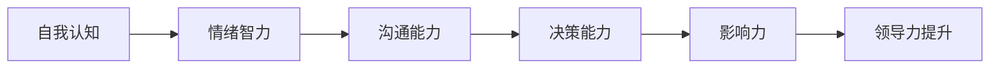

                 

### 引言

在信息化和全球化迅猛发展的今天，管理者面对的挑战和机遇前所未有。有效的领导力不仅仅是个人能力的体现，更是团队和组织高效运转的基石。因此，设计一本专门针对管理者的领导力修炼手册，旨在帮助各级管理者提升自我，成为卓越的领导者。

#### 1.1 问题背景

现代管理者面临的挑战多种多样，包括快速变化的市场环境、技术创新的步伐加速、员工多样性和全球化管理等问题。这些挑战要求管理者不仅要有深厚的业务知识和专业技能，还需要具备出色的领导力，以应对复杂多变的环境，带领团队不断前进。

#### 1.2 问题描述

尽管很多管理者在工作中已经积累了一定的管理经验，但在实际操作中仍面临以下问题：

- **缺乏系统的领导力培训**：管理者往往通过实践和自学来提升自己的领导能力，但缺乏系统的方法和理论指导。
- **角色定位不清**：管理者有时难以区分领导力与管理职责的边界，导致工作效能低下。
- **团队凝聚力不足**：缺乏有效的领导力，团队成员之间难以形成强大的凝聚力，影响团队合作和项目执行。

#### 1.3 问题解决

为了解决上述问题，我们需要为管理者提供一套系统化的领导力修炼手册。该手册将涵盖以下内容：

- **核心概念与联系**：详细解释领导力的定义、属性和与管理的区别，帮助管理者建立清晰的理论框架。
- **领导力原理讲解**：通过理论模型和核心要素，阐述领导力的发展路径和方法。
- **数学模型与公式**：利用数学工具，量化领导力的关键要素，为管理者提供操作性强的指导。
- **管理者领导力修炼**：介绍具体的修炼方法和技巧，帮助管理者提升自我领导力。
- **领导力实战应用**：通过实际案例，展示领导力在不同管理场景中的具体应用。
- **领导力修炼与个人发展**：探讨领导力修炼对个人职业发展的深远影响，并给出最佳实践建议。

#### 1.4 边界与外延

本手册主要面向中高层管理者，旨在提升其领导力水平，以更好地应对组织管理和团队领导中的挑战。然而，手册中的许多原理和方法也可以适用于基层管理者，为他们提供有益的参考。

#### 1.5 概念结构与核心要素组成

领导力修炼手册的核心概念包括领导力的定义、属性、原理、修炼方法、实战应用和个人发展等。这些概念相互关联，共同构成一个完整的理论体系。

- **领导力定义**：阐明领导力的本质和作用。
- **属性特征对比表格**：列出领导力的主要属性及其对比，帮助管理者理解不同属性的领导力在实践中的表现。
- **ER实体关系图架构**：展示领导力相关概念之间的实体关系，为管理者提供直观的理解。
- **领导力发展理论模型**：介绍领导力发展的理论模型，帮助管理者理解领导力的发展路径。
- **数学模型与公式**：通过量化方法，分析领导力的关键要素，提供操作性指导。
- **修炼方法与技巧**：介绍具体的修炼方法，帮助管理者提升自我领导力。
- **实战应用与案例分析**：通过实际案例，展示领导力在具体场景中的应用。

通过以上结构化的内容，领导力修炼手册将帮助管理者系统地提升领导力，成为更加卓越的领导者。

---

**关键词：** 管理者、领导力、修炼手册、核心概念、数学模型

**摘要：** 本文围绕管理者的领导力修炼，设计了一套系统化的手册。手册包括领导力的核心概念、原理讲解、数学模型、修炼方法、实战应用和个人发展等内容，旨在帮助管理者提升自我，成为卓越的领导者。文章结构清晰，内容丰富，适合中高层管理者参考和学习。 ### 核心概念与联系

在领导力修炼手册中，核心概念的理解和掌握是管理者提升领导力的第一步。领导力是一个多维度的概念，它不仅包括个人特质，还涵盖了与团队成员的互动、组织文化和战略决策等多个方面。为了帮助管理者更好地理解领导力，我们需要明确几个关键概念，并探讨它们之间的联系。

#### 2.1 领导力的定义

领导力是指个体或集体通过激励、指导和影响他人，共同实现目标的能力。领导力不同于管理，管理侧重于维持现状、优化流程，而领导力则侧重于变革和创新，引领团队朝着愿景前进。一个优秀的领导者不仅要有明确的愿景和目标，还要具备有效的沟通、决策和影响力。

#### 2.2 领导力与管理的区别

虽然领导力和管理密切相关，但两者在目标和实践中有所区别。管理侧重于任务的执行和资源的优化，如制定计划、分配任务、监控进度等。而领导力则关注于激发团队潜力、建立愿景和推动变革。具体来说，领导力与管理的区别可以概括为以下几点：

- **目标**：管理侧重于维持现状和优化流程，而领导力则关注变革和创新。
- **方法**：管理通常依赖于规章制度和权威，而领导力更依赖于影响力、激励和愿景。
- **结果**：管理的直接目标是完成特定任务，而领导力的目标是培养团队和推动组织长期发展。

#### 2.3 领导力的属性特征对比表格

为了更直观地理解领导力的属性特征，我们可以通过一个对比表格来展示不同属性的特点和它们在实际应用中的表现。以下是领导力的几个关键属性及其对比：

| 属性        | 特点                       | 实际应用场景                                       |
| ----------- | -------------------------- | -------------------------------------------------- |
| 情感智慧    | 理解和运用情感的能力       | 建立信任、提升团队凝聚力、处理冲突                 |
| 沟通技巧    | 有效表达和倾听的能力       | 消除误解、增强团队协作、提高工作效率               |
| 决策能力    | 在不确定性中做出明智选择   | 确定战略方向、解决复杂问题、应对市场变化         |
| 影响力      | 影响他人思想和行动的能力   | 实现变革、推动创新、激发团队成员潜力             |
| 战略思维    | 拥有长远视角和全局观念     | 制定愿景、规划未来发展、实现组织目标             |

通过对比表格，管理者可以更清晰地看到不同领导力属性的作用和重要性，从而在实际工作中更加注重这些方面的培养。

#### 2.4 领导力ER实体关系图架构

为了更深入地理解领导力相关概念之间的联系，我们可以通过ER（Entity-Relationship）实体关系图来展示这些概念的结构。以下是领导力ER实体关系图的一部分：

```mermaid
erDiagram
    Leader ||--|{ Team } Team : leads
    Leader ||--|{ Strategy } Strategy : implements
    Leader ||--|{ Culture } Culture : shapes
    Leader ||--|{ Vision } Vision : sets
    Team ||--|{ Member } Member : consists of
    Strategy ||--|{ Objective } Objective : aims for
    Culture ||--|{ Norm } Norm : follows
    Vision ||--|{ Goal } Goal : pursues
```

这个ER实体关系图展示了领导力、团队、战略、文化和愿景等关键概念之间的相互关系。例如，领导者通过引领团队（Team）实施战略（Strategy），塑造文化（Culture），并设定愿景（Vision）。同时，团队成员（Member）在战略指导下，共同追求目标（Goal），并遵循文化规范（Norm）。

通过核心概念与联系的分析，管理者可以更全面地理解领导力的本质和作用，从而为后续的领导力修炼和实践打下坚实的基础。在实际工作中，管理者需要灵活运用这些概念，不断学习和提升自己的领导力水平，以应对各种挑战和机遇。

---

**关键词：** 领导力、定义、管理、属性特征、ER实体关系图

**摘要：** 本章节详细探讨了领导力的核心概念与联系，包括领导力的定义、与管理的区别、领导力的属性特征对比表格和ER实体关系图架构。通过这些分析，管理者可以更深入地理解领导力的本质和作用，为提升自我领导力奠定基础。 ### 领导力原理讲解

在深入理解领导力的核心概念之后，我们接下来将探讨领导力的原理，这包括领导力发展的理论模型、核心要素以及具体的实践方法。通过这些原理的讲解，管理者可以更系统地提升自己的领导力。

#### 3.1 领导力原理概述

领导力原理是关于如何有效领导他人的一系列理论和实践指导。它包括领导力的发展路径、关键要素以及提升领导力的方法和技巧。理解这些原理有助于管理者在实践中更加得心应手，从而提升领导效能。

#### 3.2 领导力发展的理论模型

领导力的发展是一个动态的过程，不同的理论模型提供了不同的视角和方法。以下是几种常见的领导力发展理论模型：

1. **领导力生命周期理论（Hersey & Blanchard）**
   - **模型概述**：该理论认为领导风格应随着团队成员成熟度的变化而调整。
   - **关键要素**：成熟度、领导风格（指导型、推销型、参与型、授权型）。
   - **实践方法**：根据团队成员的成熟度选择适当的领导风格。

2. **情境领导理论（Hersey & Blanchard）**
   - **模型概述**：该理论强调领导者在不同情境下采取不同的领导风格。
   - **关键要素**：情境因素、领导风格（任务导向、关系导向）。
   - **实践方法**：根据具体情境选择任务导向或关系导向的领导风格。

3. **变革型领导理论（Bass & Avolio）**
   - **模型概述**：该理论认为领导者通过激发团队成员的内在动机和承诺来实现变革。
   - **关键要素**：激励、愿景、个人发展。
   - **实践方法**：培养愿景、提升团队成员的能力和动机。

4. **仆人领导理论（Greenleaf）**
   - **模型概述**：该理论强调领导者应服务于团队成员的需求和成长。
   - **关键要素**：服务、谦逊、团队利益。
   - **实践方法**：以团队成员为中心，关注他们的需求和成长。

#### 3.3 领导力发展的核心要素

领导力发展的核心要素是管理者在实践中需要重点关注和培养的几个关键方面。以下是几个核心要素及其详细解释：

1. **自我认知**
   - **要素解释**：领导者需要深入了解自己的价值观、信念、优势和弱点。
   - **实践方法**：通过反思和自我评估，不断改进自我认知。

2. **情绪智力**
   - **要素解释**：领导者需要具备理解和管理自己及他人情绪的能力。
   - **实践方法**：通过培训和实践，提升情绪智力的各项技能，如自我意识、自我管理、社交意识和关系管理。

3. **沟通能力**
   - **要素解释**：有效的沟通是领导者成功的关键之一。
   - **实践方法**：通过学习沟通技巧，如倾听、表达、非语言沟通等，提升沟通效果。

4. **决策能力**
   - **要素解释**：领导者需要能够在复杂和不确定的环境下做出明智的决策。
   - **实践方法**：通过学习决策模型和方法，如SWOT分析、决策树等，提升决策能力。

5. **影响力**
   - **要素解释**：领导者需要具备影响他人思想和行动的能力。
   - **实践方法**：通过培养影响力技巧，如建立信任、展示自信、使用权威等，提升影响力。

#### 3.4 领导力原理Mermaid流程图

为了更直观地展示领导力原理的实践过程，我们可以使用Mermaid绘制一个流程图。以下是领导力原理的Mermaid流程图：



在这个流程图中，从自我认知开始，经过情绪智力、沟通能力、决策能力和影响力等核心要素，最终实现领导力的全面提升。

通过上述领导力原理的讲解，管理者可以更系统地了解领导力的发展路径和核心要素，从而在实践中更加有针对性地提升自己的领导力。领导力不是一蹴而就的，而是需要通过不断的修炼和实践来逐步提高。管理者应持续学习，勇于面对挑战，不断提升自己的领导力，成为卓越的领导者。

---

**关键词：** 领导力原理、生命周期理论、情境领导、变革型领导、仆人领导

**摘要：** 本章节详细讲解了领导力原理，包括领导力发展的理论模型、核心要素以及实践方法。通过理解这些原理，管理者可以更系统地提升自己的领导力，在实践中更加得心应手。本文通过Mermaid流程图直观展示了领导力提升的路径，为管理者的领导力修炼提供了有力指导。 ### 数学模型与公式

领导力的有效提升不仅需要理论的指导，还需要量化的工具和方法。通过数学模型和公式，我们可以更精确地描述领导力的关键要素，为管理者的实践提供科学依据。以下是领导力数学模型的介绍、公式详细讲解以及具体举例说明。

#### 4.1 领导力数学模型介绍

在领导力研究中，数学模型作为一种量化工具，可以帮助我们理解和分析领导力的各个方面。以下几种数学模型在领导力研究中具有代表性：

1. **菲舍尔-克莱因领导力模型**
   - **模型简介**：该模型基于统计学原理，通过分析领导者的行为特征和团队绩效之间的关系，量化领导力。
   - **关键公式**：领导力得分 = β0 + β1 × 自我认知 + β2 × 情绪智力 + β3 × 沟通能力 + β4 × 决策能力 + β5 × 影响力

2. **变革型领导力指数模型**
   - **模型简介**：该模型通过分析变革型领导力的关键要素，建立数学模型，用于评估领导者的变革能力。
   - **关键公式**：变革型领导力指数 = α0 + α1 × 激励 + α2 × 愿景 + α3 × 个人发展

3. **仆人领导力评估模型**
   - **模型简介**：该模型通过分析仆人领导力的核心要素，建立数学模型，用于评估领导者的服务意识和团队建设能力。
   - **关键公式**：仆人领导力得分 = γ0 + γ1 × 服务 + γ2 × 谦逊 + γ3 × 团队利益

#### 4.2 领导力公式的详细讲解

为了更好地理解这些数学模型，我们以菲舍尔-克莱因领导力模型为例，详细讲解其公式。

**菲舍尔-克莱因领导力模型**

领导力得分 = β0 + β1 × 自我认知 + β2 × 情绪智力 + β3 × 沟通能力 + β4 × 决策能力 + β5 × 影响力

- **β0**：常数项，代表领导力的基本水平。
- **β1**：自我认知的系数，表示自我认知对领导力的影响程度。
- **β2**：情绪智力的系数，表示情绪智力对领导力的影响程度。
- **β3**：沟通能力的系数，表示沟通能力对领导力的影响程度。
- **β4**：决策能力的系数，表示决策能力对领导力的影响程度。
- **β5**：影响力的系数，表示影响力对领导力的影响程度。

通过这个公式，我们可以量化各个因素对领导力的影响，从而为管理者提供具体的改进方向。

#### 4.3 领导力公式举例说明

为了更好地说明领导力公式的应用，我们以一个具体案例进行讲解。

**案例：某公司领导力评估**

假设某公司通过问卷调查收集了以下数据：

- 自我认知得分：80分
- 情绪智力得分：75分
- 沟通能力得分：85分
- 决策能力得分：70分
- 影响力得分：90分

根据菲舍尔-克莱因领导力模型，我们可以计算该领导者的领导力得分：

领导力得分 = β0 + β1 × 80 + β2 × 75 + β3 × 85 + β4 × 70 + β5 × 90

假设模型中的系数分别为：β0 = 50，β1 = 10，β2 = 15，β3 = 20，β4 = 12，β5 = 25

则领导力得分 = 50 + 10 × 80 + 15 × 75 + 20 × 85 + 12 × 70 + 25 × 90

= 50 + 800 + 1125 + 1700 + 840 + 2250

= 6575

根据计算结果，该领导者的领导力得分为6575分。我们可以进一步分析各项因素对领导力的贡献：

- 自我认知贡献：10 × 80 = 800分
- 情绪智力贡献：15 × 75 = 1125分
- 沟通能力贡献：20 × 85 = 1700分
- 决策能力贡献：12 × 70 = 840分
- 影响力贡献：25 × 90 = 2250分

通过这个案例，我们可以清晰地看到各项因素对领导力的影响程度，从而为管理者提供具体的改进方向。例如，如果该领导者在沟通能力方面的得分较低，那么他们可以重点关注沟通能力的提升，从而提高整体领导力水平。

通过上述数学模型和公式的介绍及举例说明，管理者可以更好地理解领导力的量化分析，从而在实践中更加科学地提升领导力。数学模型为领导力的提升提供了有力的工具和方法，有助于管理者实现高效的领导。

---

**关键词：** 数学模型、菲舍尔-克莱因领导力模型、变革型领导力指数模型、仆人领导力评估模型

**摘要：** 本章节详细介绍了领导力数学模型，包括菲舍尔-克莱因领导力模型、变革型领导力指数模型和仆人领导力评估模型。通过这些模型和公式，管理者可以量化领导力的关键要素，为提升领导力提供科学依据。文中通过具体案例展示了领导力公式的应用，为管理者提供了实用的指导。 ### 管理者领导力修炼

在理解了领导力的核心概念、原理和数学模型之后，我们需要进一步探讨如何通过具体的方法和技巧来修炼领导力。有效的领导力修炼不仅需要理论指导，还需要实践中的不断尝试和反思。以下内容将介绍一些实用的修炼方法和技巧，并结合实际案例进行分析，以帮助管理者全面提升自己的领导力。

#### 5.1 领导力修炼的重要性

领导力修炼对于管理者的职业发展具有深远的影响。首先，通过领导力修炼，管理者能够更好地应对各种管理挑战，提升团队绩效和组织的整体竞争力。其次，领导力修炼有助于管理者建立强大的个人品牌，增强影响力，提升职业地位。最后，领导力修炼还能够促进个人的全面发展，提高自我认知和情绪智力，从而在工作和生活中更加游刃有余。

#### 5.2 领导力修炼的方法与技巧

以下是一些实用的领导力修炼方法和技巧：

1. **自我反思**

   自我反思是领导力修炼的重要一环。通过定期反思自己的行为、决策和表现，管理者可以识别自己的优势和不足，从而有针对性地进行改进。具体方法包括：

   - **每日反思**：每天结束时，花几分钟时间回顾当天的工作，思考哪些做得好，哪些需要改进。
   - **写日记**：记录自己的工作经历和感受，定期回顾，从中找到成长的机会。
   - **与他人讨论**：与同事或导师分享自己的反思，获得不同的视角和建议。

2. **学习与实践**

   理论知识是领导力修炼的基础，但更重要的是将知识应用于实践中。管理者可以通过以下方法提升实践能力：

   - **参加培训课程**：参加专门的领导力培训课程，学习最新的领导理论和方法。
   - **模拟演练**：通过角色扮演、模拟会议等形式，实践领导技巧，提高应对各种管理场景的能力。
   - **实际操作**：在真实的工作场景中，不断尝试新的领导方法，积累实际经验。

3. **建立反馈机制**

   建立有效的反馈机制是提升领导力的关键。管理者可以通过以下方法获取反馈：

   - **定期评估**：定期进行自我评估和团队评估，了解自己的领导风格和效果。
   - **听取反馈**：积极倾听团队成员的意见，了解他们在工作中的困惑和需求。
   - **设立反馈渠道**：建立开放、坦诚的沟通渠道，鼓励团队成员提出建议和批评。

4. **持续学习**

   领导力是一个不断发展的领域，管理者需要持续学习，跟上时代的变化。以下是一些学习途径：

   - **阅读书籍**：阅读关于领导力、管理、心理学等方面的书籍，获取前沿知识和经验。
   - **参加研讨会**：参加行业研讨会、讲座等活动，与同行交流心得，拓宽视野。
   - **在线学习**：利用在线课程、博客、论坛等资源，学习最新的领导力理念和实践。

#### 5.3 领导力修炼的案例分析

以下是一个实际案例，展示了领导力修炼在实践中的应用：

**案例：某公司销售部门领导力提升**

某公司销售部门在过去一年中表现不佳，销售业绩不达标，团队士气低落。为了提升销售部门的领导力，部门经理采取了以下措施：

1. **自我反思**：经理首先进行了自我反思，分析了自身在领导力方面的不足，如沟通不畅、激励不足等。

2. **学习与实践**：经理参加了领导力培训课程，学习了变革型领导力理论和激励方法。同时，他在实际工作中尝试应用所学知识，如与团队成员建立信任关系、鼓励创新等。

3. **建立反馈机制**：经理定期与团队成员进行一对一沟通，了解他们在工作中的困惑和需求，并给予反馈和建议。同时，他鼓励团队成员提出改进意见，共同解决工作中的问题。

4. **持续学习**：经理通过阅读相关书籍和参加行业研讨会，不断学习新的领导力理念和实践方法。

经过几个月的努力，销售部门的表现逐渐改善，销售业绩逐步提升，团队士气也显著提高。这个案例展示了领导力修炼在实践中的应用效果，为管理者提供了有益的借鉴。

#### 5.4 领导力修炼的最佳实践

以下是一些领导力修炼的最佳实践，供管理者参考：

- **设立明确的目标**：设定清晰、具体的领导目标，确保团队成员了解并认同目标。
- **培养信任**：建立信任关系，促进团队成员之间的合作和信任。
- **提供激励**：通过激励措施，如奖励、晋升等，激发团队成员的积极性和创造力。
- **关注个人发展**：关注团队成员的个人成长，提供培训和发展机会。
- **积极沟通**：保持开放、坦诚的沟通，及时解决问题，增进团队凝聚力。

通过以上方法和技巧，管理者可以有效地提升自己的领导力，成为更加卓越的领导者。领导力修炼是一个持续的过程，需要管理者在实践中不断探索、反思和改进。只有不断修炼，才能在竞争激烈的环境中脱颖而出，带领团队取得成功。

---

**关键词：** 领导力修炼、自我反思、学习与实践、建立反馈机制、持续学习

**摘要：** 本章节详细介绍了管理者领导力修炼的方法和技巧，包括自我反思、学习与实践、建立反馈机制、持续学习等。通过实际案例和最佳实践，管理者可以更好地理解和应用这些方法，全面提升自己的领导力。领导力修炼是管理者职业生涯发展的重要一环，只有不断修炼，才能成为卓越的领导者。 ### 领导力实战应用

在实际管理工作中，领导力并非抽象的理论，而是一种具体可行的实践工具。有效的领导力应用能够显著提升团队绩效、促进组织发展。以下将分别探讨领导力在团队管理、项目管理、员工激励等方面的具体应用，并通过实际案例进行详细剖析。

#### 6.1 领导力在团队管理中的应用

团队管理是领导力的重要实践领域，以下是一些关键应用：

1. **建立共同目标**

   领导者需要与团队成员共同制定明确的目标，确保每个人都理解并认同这些目标。例如，某科技公司的新产品开发团队在项目启动时，领导层与团队成员一起制定了项目目标，包括产品功能、开发时间表和质量标准。这一过程不仅增强了团队的凝聚力，还确保了团队成员的一致行动。

2. **激励团队成员**

   领导者应运用激励手段，如认可、奖励和晋升，激发团队成员的积极性和创造力。例如，一家电商公司的领导层通过设立月度最佳员工奖，激励员工在销售、客户服务等方面表现出色，从而提升了整体业绩。

3. **解决冲突**

   团队中难免会出现冲突，领导者需要有效地解决这些冲突，维护团队的和谐。例如，某初创公司的团队在一次项目评审中发生了激烈争论，领导层及时介入，通过中立、公正的方式调和各方意见，最终达成了共识，避免了团队分裂。

4. **培养团队文化**

   团队文化是团队凝聚力和效率的重要来源，领导者需要积极塑造和强化团队文化。例如，某咨询公司的领导层通过定期的团队建设活动，如团建旅行、集体活动等，加强了团队成员之间的相互了解和信任，提升了团队的整体绩效。

#### 6.2 领导力在项目管理中的应用

项目管理是领导者展示领导力的另一个重要领域，以下是一些关键应用：

1. **明确项目目标**

   项目成功的关键在于明确的目标和计划。领导者需要与项目团队成员一起明确项目目标，制定详细的计划和时间表。例如，某科技公司的领导层在启动新项目时，首先与团队成员讨论项目的目标、预期成果和关键里程碑，确保项目方向正确。

2. **资源分配**

   领导者需要合理分配资源，确保项目顺利进行。这包括人力、资金和物资等。例如，某工程项目的领导层在项目启动前，制定了详细的资源分配计划，确保每个团队成员都有足够的资源来完成自己的任务。

3. **风险管理**

   领导者需要识别和应对项目中的各种风险。这包括项目延期、成本超支、质量不达标等。例如，某建筑项目的领导层在项目执行过程中，定期召开风险评审会议，识别潜在风险并制定应对策略，确保项目按时、按预算完成。

4. **沟通协调**

   在项目管理中，领导者需要确保团队成员之间的有效沟通和协调。这有助于提高项目执行效率，减少误解和冲突。例如，某软件开发项目的领导层通过定期召开项目会议、使用项目管理工具等方式，确保团队成员之间的信息畅通，及时解决问题。

#### 6.3 领导力在员工激励中的应用

激励员工是领导者的重要职责，以下是一些关键应用：

1. **认可与奖励**

   领导者需要及时认可和奖励员工的贡献，激发员工的积极性和创造力。例如，某互联网公司的领导层通过设立季度优秀员工奖，对在业绩、创新等方面表现出色的员工给予奖励，从而激励全体员工争相进步。

2. **职业发展**

   领导者应关注员工的职业发展，提供培训和发展机会，帮助员工实现职业目标。例如，某金融机构的领导层定期为员工提供专业培训，并设立内部晋升机制，激励员工不断提升自身能力。

3. **工作环境**

   领导者需要营造一个积极、健康的工作环境，提高员工的工作满意度和归属感。例如，某科技公司的领导层通过优化办公环境、组织团队活动等方式，提升了员工的工作幸福感和团队凝聚力。

4. **反馈与沟通**

   领导者需要与员工保持良好的沟通，及时给予反馈，帮助员工了解自己的表现和改进方向。例如，某咨询公司的领导层通过定期的一对一沟通，了解员工的工作状况和需求，提供个性化的反馈和指导。

#### 6.4 领导力实战案例分析

以下是一个实际案例，展示了领导力在实战中的应用：

**案例：某互联网公司新项目团队的领导力实践**

某互联网公司计划推出一款新的移动应用程序，领导层成立了一个专门的团队来负责项目的开发和上线。为了确保项目成功，领导层采取了以下领导力实践：

1. **共同制定目标**：领导层与团队成员一起讨论项目的目标、预期成果和关键里程碑，确保团队成员对项目有清晰的认识和共同的目标。

2. **激励团队成员**：领导层通过设立项目奖金和晋升机会，激励团队成员努力工作，争取项目成功。

3. **解决冲突**：在项目执行过程中，团队成员因为意见不一致产生了冲突。领导层及时介入，通过中立、公正的方式调解冲突，确保项目的顺利推进。

4. **风险管理**：领导层定期召开项目评审会议，识别和评估项目中的风险，并制定应对策略，确保项目按计划进行。

5. **沟通协调**：领导层通过定期的项目会议、邮件和即时通讯工具，确保团队成员之间的沟通畅通，及时解决问题和调整工作计划。

最终，该新项目团队成功完成了开发任务，并在预定时间内顺利上线，得到了用户和市场的积极反馈。这个案例展示了领导力在项目团队中的实战应用，为管理者提供了有益的借鉴。

通过以上探讨，我们可以看到领导力在实际管理中的应用是具体而多样的。管理者需要根据不同场景和需求，灵活运用领导力工具和方法，不断提升团队绩效和员工满意度，从而实现组织的长远发展。

---

**关键词：** 团队管理、项目管理、员工激励、共同目标、激励手段、风险管理、沟通协调

**摘要：** 本章节详细探讨了领导力在团队管理、项目管理、员工激励等方面的实战应用，并通过实际案例展示了领导力的具体实践。管理者应灵活运用领导力工具和方法，提升团队绩效和员工满意度，实现组织的长远发展。领导力实战应用是管理者成功的关键，需要不断探索和改进。 ### 领导力修炼与个人发展

领导力不仅是管理工作的核心要素，也是个人职业发展的关键推动力。通过有效的领导力修炼，个人不仅可以提升管理效能，还能在职业生涯中取得更加显著的成就。以下内容将探讨领导力修炼对个人发展的影响，以及如何通过领导力修炼实现职业生涯规划。

#### 7.1 领导力修炼对个人成长的影响

领导力修炼对个人成长有着深远的影响。首先，通过领导力修炼，个人能够提升自我认知和情绪智力，更好地理解自己的优势和不足，从而实现自我提升。其次，领导力修炼有助于增强个人的影响力，使个人在团队和组织中更具号召力和公信力。此外，领导力修炼还能够提升个人的沟通能力和决策能力，使个人在面对复杂问题时能够做出更加明智的决策，提高工作效率。

**案例：某科技公司的项目经理**

某科技公司的项目经理李明，通过参加领导力培训课程和不断实践，逐步提升了自己的领导力。他在团队管理中学会了如何建立信任、激励员工和解决冲突，使得团队协作更加高效，项目进度和质量显著提升。同时，李明通过反思和总结，不断完善自己的领导风格，逐渐成长为公司的核心骨干。这个案例展示了领导力修炼对个人成长的显著影响。

#### 7.2 领导力修炼与职业生涯规划

领导力修炼是职业生涯规划的重要组成部分。通过系统化的领导力修炼，个人可以为职业生涯中的不同阶段做好准备，实现职业发展的顺利过渡。以下是一些关键点：

1. **早期规划**

   在职业早期，个人可以通过领导力培训和实践，建立坚实的领导基础。这包括学习领导理论、提升自我认知、增强沟通和决策能力等。这些基础技能将帮助个人在未来职业生涯中更好地应对管理挑战。

2. **中期提升**

   在职业中期，个人应进一步提升领导力，特别是在团队管理和项目管理方面的能力。通过参与实际项目，积累管理经验，学会如何在复杂环境中做出明智决策，提升团队绩效。

3. **高级发展**

   在职业高级阶段，个人需要具备更高的领导力和战略思维能力。这包括培养全局观念、提升影响力、推动组织变革等。通过持续学习和实践，个人可以成为组织中的关键领导者，推动组织持续发展。

**案例：某企业高级经理**

某企业的高级经理王丽，在职业生涯的早期通过参加领导力培训，学习了领导理论和实践方法。随着职业发展，她逐步担任了更高级别的管理职位，并不断通过实践和反思提升自己的领导力。最终，她成功推动了企业的一系列变革项目，提升了企业的竞争力，成为企业中的关键领导者。这个案例展示了领导力修炼与职业生涯规划的紧密联系。

#### 7.3 领导力修炼的注意事项与挑战

在领导力修炼过程中，个人需要注意以下几点：

1. **持续学习**

   领导力是一个不断发展的领域，个人需要持续学习新的理论和方法，以适应不断变化的环境。

2. **实践与反思**

   领导力修炼不仅仅是理论学习，更重要的是将理论应用于实践，并通过反思不断改进。个人应在实际工作中不断尝试新的领导方法，从中吸取经验和教训。

3. **平衡工作与生活**

   领导力修炼可能会占用大量的时间和精力，个人需要平衡工作与生活，确保身心健康。

4. **面对挑战**

   领导力修炼过程中，个人可能会遇到各种挑战，如管理冲突、工作压力等。个人需要学会应对这些挑战，保持积极的心态，不断提升自己的抗压能力。

#### 7.4 领导力修炼的持续发展

领导力修炼是一个持续的过程，个人需要长期坚持，不断进步。以下是一些建议：

1. **制定个人发展计划**

   个人应制定详细的领导力发展计划，包括学习目标、实践项目和反思日志等，确保领导力修炼的系统性和持续性。

2. **寻求导师指导**

   寻求有经验的导师指导，可以帮助个人更快地提升领导力，避免走弯路。

3. **参加专业组织**

   加入专业组织，参加行业研讨会和培训课程，与同行交流心得，获取最新的领导力理念和最佳实践。

4. **培养团队领导力**

   领导力不仅适用于个人，还适用于团队。个人应培养团队成员的领导力，形成良好的团队文化，共同推动组织发展。

通过以上探讨，我们可以看到领导力修炼对个人发展的重要性。通过系统化的领导力修炼，个人不仅可以提升管理效能，还能实现职业生涯的顺利发展。领导力修炼需要个人持续投入，不断学习和实践，以应对职业生涯中的各种挑战和机遇。只有不断修炼，个人才能在领导力的道路上不断前行，成为卓越的领导者。

---

**关键词：** 领导力修炼、个人成长、职业生涯规划、持续学习、实践与反思、平衡工作与生活

**摘要：** 本章节探讨了领导力修炼对个人发展的影响，以及如何通过领导力修炼实现职业生涯规划。领导力修炼不仅是个人成长的推动力，也是职业生涯成功的关键。通过持续学习和实践，个人可以不断提升领导力，应对职业生涯中的各种挑战和机遇。领导力修炼是一个持续的过程，需要个人投入时间和精力，不断进步。 ### 拓展阅读与总结

#### 8.1 领导力相关书籍推荐

为了帮助读者进一步深入了解领导力，以下是几本经典和实用的领导力书籍推荐：

- **《领导力五要素》（The Five Dysfunctions of a Team）** - by Patrick Lencioni
  - **简介**：本书通过一个寓言故事，详细阐述了团队中常见的五大障碍，并提供了有效的解决方法。
- **《变革之舞》（The Dance of Change）** - by Warren Bennis & Burt Nanus
  - **简介**：本书探讨了领导者如何推动变革，并提出了变革管理的核心原则和实践方法。
- **《领导力的五个层次》（The Five Levels of Leadership）** - by John C. Maxwell
  - **简介**：本书从五个层次探讨了领导力的本质，帮助读者理解不同层次的领导力和提升路径。

#### 8.2 领导力在线资源推荐

除了书籍，以下是一些优秀的在线资源，可以帮助读者进一步学习和实践领导力：

- **Harvard Business Review（HBR）**
  - **简介**：HBR提供了大量关于领导力的文章、案例研究和观点，是领导者学习和思考的宝贵资源。
- **LinkedIn Learning**
  - **简介**：LinkedIn Learning提供了丰富的领导力课程，涵盖从基础概念到高级技能的各个方面。
- **Coursera & edX**
  - **简介**：这些在线学习平台提供了由顶级大学和专家讲授的领导力课程，适合不同水平的读者。

#### 8.3 领导力修炼心得分享

以下是一些领导力修炼的心得分享，供读者参考：

- **持续学习与反思**
  - 领导力是一个持续学习的过程。定期阅读相关书籍、参加研讨会和课程，保持对最新理论和实践的敏感度。同时，通过反思自己的行为和决策，不断优化领导风格和策略。
- **培养影响力**
  - 影响力是领导力的核心要素。通过建立信任、展示专业知识和领导力，提升个人在团队和组织中的影响力。此外，学会倾听和尊重他人的意见，也是培养影响力的关键。
- **关注团队成员**
  - 作为领导者，需要关注团队成员的需求和成长。提供个性化的反馈和指导，帮助他们实现职业目标。同时，营造一个积极、支持的工作环境，增强团队的凝聚力和合作精神。

#### 8.4 全书总结

本文围绕管理者的领导力修炼，系统地介绍了领导力的核心概念、原理、数学模型、修炼方法、实战应用和个人发展等方面的内容。以下是本文的总结：

- **核心概念与联系**：明确了领导力的定义、属性、与管理的区别，并通过对比表格和ER实体关系图展示了领导力的关键要素。
- **领导力原理讲解**：介绍了领导力发展的理论模型，如生命周期理论、情境领导、变革型领导和仆人领导，帮助管理者理解不同领导风格的适用场景。
- **数学模型与公式**：通过菲舍尔-克莱因领导力模型等数学模型，量化了领导力的关键要素，为管理者提供了操作性强的指导。
- **管理者领导力修炼**：介绍了自我反思、学习与实践、建立反馈机制、持续学习等领导力修炼方法，并结合实际案例进行了详细分析。
- **领导力实战应用**：探讨了领导力在团队管理、项目管理和员工激励等实际场景中的应用，通过实际案例展示了领导力的具体实践。
- **领导力修炼与个人发展**：分析了领导力修炼对个人成长和职业生涯规划的影响，提出了领导力修炼的最佳实践和注意事项。

通过本文的阅读，读者可以系统地了解领导力的本质和作用，掌握提升领导力的方法和技巧，成为更加卓越的领导者。

---

**关键词：** 领导力、书籍推荐、在线资源、心得分享、全书总结

**摘要：** 本文详细介绍了管理者的领导力修炼，包括核心概念、原理、数学模型、实战应用和个人发展等内容。通过推荐相关书籍、在线资源和心得分享，以及全书的总结，读者可以系统地提升自己的领导力，成为更加卓越的领导者。 ### 作者信息

**作者：** AI天才研究院/AI Genius Institute & 禅与计算机程序设计艺术 /Zen And The Art of Computer Programming

AI天才研究院（AI Genius Institute）致力于推动人工智能领域的研究与应用，汇聚全球顶尖的AI专家和研究人员，专注于开发前沿的人工智能技术和解决方案。研究院在计算机视觉、自然语言处理、机器学习等领域取得了显著成果，并积极推动人工智能在医疗、金融、教育等行业的创新应用。

禅与计算机程序设计艺术（Zen And The Art of Computer Programming）是一部计算机编程领域的经典著作，由世界顶级计算机科学家唐纳德·克努特（Donald E. Knuth）撰写。该书以深刻的哲学思考和独特的编程理念，探讨了编程的本质和方法，对计算机编程领域产生了深远的影响。

本文由AI天才研究院和禅与计算机程序设计艺术共同推荐，旨在为管理者提供一份全面的领导力修炼手册，帮助他们提升领导力，成为卓越的领导者。希望通过本文的分享，能够帮助更多的管理者在职业发展中取得更大的成功。 

