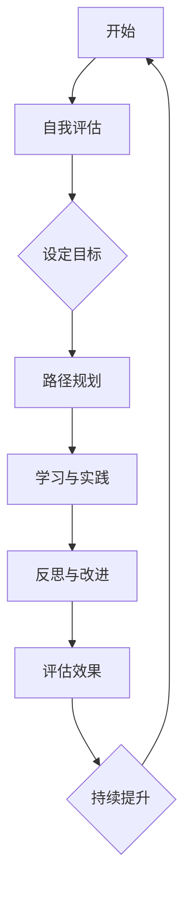
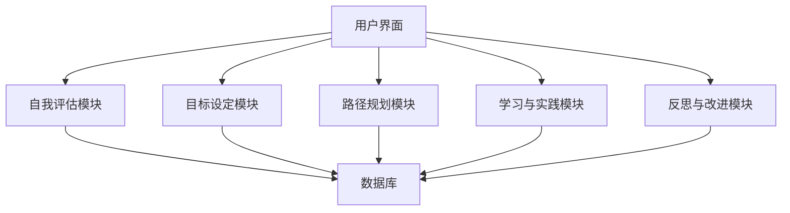
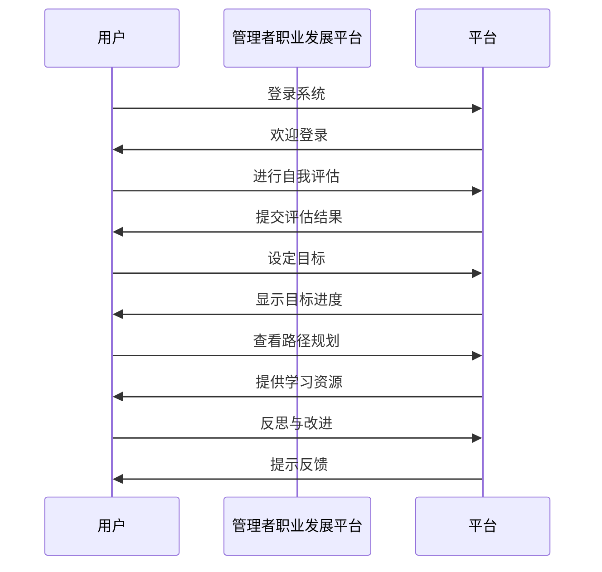

                 

# 管理者职业规划：设计个人领导力发展路径

## 摘要

本文旨在探讨管理者如何通过职业规划来设计个人领导力发展路径。我们将从基础理论出发，逐步分析职业规划与领导力发展的核心概念，提供实践方法，并通过案例分析，展示实际操作步骤和效果。本文将帮助管理者认识到职业规划的重要性，理解领导力的本质，掌握提升领导力的技巧，为职业生涯的发展提供有力支持。

## 目录

1. 引言
2. 第1部分：基础理论
   - 第1章 职业规划理论概述
   - 第2章 领导力核心概念
   - 第3章 领导力的理论基础
3. 第2部分：实践方法
   - 第4章 自我评估与认识
   - 第5章 目标设定与路径规划
   - 第6章 职业发展的策略选择
4. 第3部分：领导力发展
   - 第7章 学习与成长
   - 第8章 实践与锻炼
   - 第9章 领导力提升的技巧
5. 案例分析
6. 总结与展望

## 引言

### 1.1 职业规划的重要性

职业规划是个人职业生涯发展的重要环节。一个明确、合理的职业规划，不仅有助于个人目标的实现，还能提升职业竞争力，为未来的发展奠定坚实基础。对于管理者来说，职业规划尤为重要。管理者不仅要关注自身的发展，还要带领团队实现共同的目标，这就要求他们具备更高的领导力和职业素养。

### 1.2 领导力发展的重要性

领导力是管理者不可或缺的素质。它不仅关乎个人职业发展，更影响到整个团队和组织的发展。一个优秀的领导者能够激发团队的潜能，提高团队的整体效率，推动组织的创新与发展。因此，领导力的发展对于管理者的职业生涯至关重要。

### 1.3 本书结构安排

本文将分为三个部分。第一部分介绍职业规划的理论基础和领导力的核心概念；第二部分提供实践方法，包括自我评估、目标设定、路径规划等；第三部分探讨如何通过学习和实践提升个人领导力。通过本文的阅读，管理者将能够系统地认识职业规划和领导力发展，为自己的职业生涯设计出一条清晰的发展路径。

## 第1部分：基础理论

### 第1章 职业规划理论概述

#### 1.1 职业规划的基本概念

职业规划是指个人根据自己的兴趣、能力和市场需求，制定出长期的职业目标和计划，并为此付诸努力的过程。它包括自我评估、职业定位、目标设定、路径规划等步骤。

#### 1.2 职业规划的重要性

职业规划的重要性主要体现在以下几个方面：

- **明确职业方向**：职业规划可以帮助个人明确自己的职业方向，避免盲目追求热门行业或职位，从而减少职业发展的不确定性。
- **提升职业竞争力**：通过职业规划，个人可以系统地提升自己的专业技能和综合素质，提高在职场中的竞争力。
- **实现职业目标**：职业规划有助于个人实现职业目标，提高职业满意度，实现个人价值。

#### 1.3 职业规划的步骤与方法

职业规划的基本步骤包括自我评估、职业定位、目标设定、路径规划等。

- **自我评估**：通过自我评估，了解自己的兴趣、能力、价值观等，为职业定位提供依据。
- **职业定位**：根据自我评估的结果，结合市场需求，确定自己的职业方向。
- **目标设定**：设定清晰的职业目标，包括短期目标和长期目标。
- **路径规划**：制定实现目标的路径，包括学习计划、工作计划等。

### 第2章 领导力核心概念

#### 2.1 领导力与管理的区别

领导力与管理是两个相关但又不同的概念。领导力主要关注的是如何激励和引导团队成员，实现共同的目标；而管理则侧重于如何规划和组织资源，确保目标的实现。

- **领导力**：领导力是一种影响他人并共同实现目标的能力，它涉及激励、沟通、决策等。
- **管理**：管理是一种通过规划和组织资源，确保目标实现的过程，它涉及计划、组织、控制等。

#### 2.2 领导力的主要类型

领导力可以分为以下几种主要类型：

- **变革型领导**：通过激发团队成员的内在动机，推动组织变革和创新。
- **交易型领导**：通过提供奖励和惩罚，激励团队成员完成工作任务。
- **仆人领导**：以服务团队成员为中心，关注团队成员的需求和成长。
- **文化型领导**：通过建立和推广组织的核心价值观，引导团队成员共同实现目标。

#### 2.3 领导力的发展过程

领导力的发展是一个持续的过程，主要包括以下阶段：

- **意识阶段**：意识到领导力的重要性，并开始关注自身的发展。
- **行动阶段**：通过实践，积累领导经验，提高领导能力。
- **反思阶段**：反思自己的领导行为，从成功和失败中学习，不断提升领导力。

### 第3章 领导力的理论基础

#### 3.1 领导力心理学

领导力心理学主要研究领导行为对团队成员心理和行为的影响。它包括以下几个方面：

- **动机理论**：研究领导行为背后的动机，如权力动机、成就动机等。
- **情感理论**：研究领导行为如何影响团队成员的情感，如激发积极情感、减少消极情感等。
- **认知理论**：研究领导行为如何影响团队成员的思维方式，如提高决策能力、增强问题解决能力等。

#### 3.2 领导力社会学

领导力社会学主要研究领导行为在社会环境中的影响。它包括以下几个方面：

- **组织文化**：研究领导行为如何影响组织的文化，如建立积极的组织氛围、推广组织价值观等。
- **社会网络**：研究领导行为如何影响团队成员之间的社会网络，如增强团队凝聚力、提高团队协作效率等。
- **社会认同**：研究领导行为如何影响团队成员的社会认同，如提高团队归属感、增强团队认同等。

#### 3.3 领导力经济学

领导力经济学主要研究领导行为对组织经济绩效的影响。它包括以下几个方面：

- **资源分配**：研究领导行为如何影响资源的分配，如提高资源利用效率、优化资源配置等。
- **创新激励**：研究领导行为如何激励团队成员进行创新，如提供创新奖励、营造创新氛围等。
- **绩效管理**：研究领导行为如何影响团队成员的绩效，如提高工作效率、提升工作质量等。

## 第2部分：实践方法

### 第4章 自我评估与认识

#### 4.1 自我评估的方法

自我评估是职业规划的第一步，它有助于个人了解自己的兴趣、能力和价值观。以下是几种常见的自我评估方法：

- **问卷调查法**：通过填写专业问卷，了解自己的兴趣、能力、性格等。
- **职业性格测试**：通过职业性格测试，了解自己的职业性格，如MBTI测试。
- **职业兴趣测试**：通过职业兴趣测试，了解自己对不同职业的兴趣程度。
- **能力评估**：通过实际工作经历和培训，评估自己的专业技能和综合能力。

#### 4.2 自我认识的误区

在自我评估过程中，管理者容易陷入以下误区：

- **自我过度评估**：过分强调自己的优点，忽视自己的不足。
- **自我低估**：低估自己的能力和潜力，缺乏自信心。
- **单一标准评估**：仅从某个角度评估自己，缺乏全面的视角。

#### 4.3 自我评估的实践

在进行自我评估时，管理者可以遵循以下步骤：

1. **明确评估目的**：确定评估的目的，如确定职业方向、提升领导力等。
2. **收集信息**：通过问卷调查、职业性格测试、职业兴趣测试等方式，收集相关信息。
3. **分析信息**：对收集到的信息进行分析，找出自己的兴趣、能力和价值观。
4. **制定计划**：根据分析结果，制定个人发展计划，包括学习、工作等方面。

### 第5章 目标设定与路径规划

#### 5.1 目标设定的原则

设定目标是职业规划的关键步骤。在设定目标时，管理者应遵循以下原则：

- **明确性**：目标要具体、明确，避免模糊不清。
- **可实现性**：目标要具有可实现性，避免过于理想化。
- **挑战性**：目标要有一定的挑战性，激发自己的潜力。
- **时限性**：目标要有明确的完成时限，有助于提高执行力。

#### 5.2 目标设定的方法

在设定目标时，管理者可以采用以下方法：

- **SMART原则**：目标要符合SMART原则，即具体（Specific）、可衡量（Measurable）、可实现（Achievable）、相关（Relevant）、时限性（Time-bound）。
- **平衡法**：设定多个目标，涵盖职业发展、个人成长、家庭生活等方面，确保全面发展。
- **倒推法**：从最终目标开始，逐步倒推，确定每个阶段的目标和任务。

#### 5.3 路径规划的策略

在设定目标后，管理者需要制定实现目标的路径规划。以下是一些路径规划的策略：

- **分阶段实施**：将目标分解为多个阶段，逐一实施，避免一次性完成所有任务。
- **资源整合**：整合个人和外部资源，提高实现目标的效率。
- **风险评估**：评估可能的风险和挑战，制定应对策略。
- **持续调整**：根据实际情况，不断调整目标和路径，确保目标的实现。

### 第6章 职业发展的策略选择

#### 6.1 职业发展的趋势

在当前快速变化的社会环境中，职业发展的趋势主要体现在以下几个方面：

- **数字化转型**：数字化转型成为各行各业的重要趋势，管理者需要掌握数字化技能。
- **跨界融合**：跨界融合成为职业发展的新方向，管理者需要具备跨领域的知识和能力。
- **可持续发展**：可持续发展成为全球关注的焦点，管理者需要关注环保、社会责任等方面。
- **远程办公**：远程办公成为新常态，管理者需要掌握远程管理技能。

#### 6.2 职业发展的机会

职业发展过程中，管理者可以抓住以下机会：

- **职业晋升**：通过不断提升自身能力和业绩，实现职业晋升。
- **跨部门调岗**：通过跨部门调岗，拓宽职业视野，提升综合能力。
- **创业机会**：在合适的时机，抓住创业机会，实现职业转型。
- **专业培训**：参加专业培训，提升专业技能和素质。

#### 6.3 职业发展的挑战

职业发展过程中，管理者可能会面临以下挑战：

- **竞争压力**：职业竞争日益激烈，管理者需要不断提高自身竞争力。
- **工作压力**：管理岗位通常工作压力大，管理者需要学会应对压力。
- **职业倦怠**：长期处于高强度工作状态，管理者容易产生职业倦怠。
- **家庭与工作的平衡**：管理者需要平衡家庭和工作的关系，避免家庭和工作产生冲突。

## 第3部分：领导力发展

### 第7章 学习与成长

#### 7.1 学习的重要性

学习是领导力发展的基础。一个优秀的领导者需要不断学习新知识、新技能，以适应不断变化的环境。以下是学习的重要性：

- **提升个人能力**：学习可以提升个人的知识水平和技能，增强职业竞争力。
- **适应环境变化**：通过学习，领导者可以更好地适应环境变化，应对挑战。
- **提升团队绩效**：领导者通过学习，可以带动团队共同成长，提高团队绩效。
- **实现自我超越**：学习可以激发领导者的潜力，实现自我超越。

#### 7.2 成长的心态

成长心态是指领导者对待学习和成长的态度。以下是成长心态的重要性：

- **拥抱变化**：领导者应具备拥抱变化的心态，勇于接受新事物和新挑战。
- **积极进取**：领导者应积极进取，不断追求卓越，提升自身能力。
- **终身学习**：领导者应将学习视为一种生活方式，持续学习，不断进步。
- **自我反思**：领导者应定期进行自我反思，总结经验教训，不断改进。

#### 7.3 学习的资源

领导者可以通过以下途径获取学习资源：

- **专业培训**：参加专业培训课程，提升专业技能。
- **在线学习**：利用在线学习平台，学习新知识、新技能。
- **阅读书籍**：阅读专业书籍，拓展知识面。
- **行业交流**：参加行业交流活动，了解行业动态。

### 第8章 实践与锻炼

#### 8.1 实践的意义

实践是检验学习成果的重要手段。通过实践，领导者可以将理论知识应用于实际工作中，提高解决问题的能力。以下是实践的意义：

- **巩固知识**：通过实践，领导者可以巩固所学知识，加深对知识的理解。
- **提升能力**：通过实践，领导者可以提高实际操作能力，提升工作效率。
- **培养经验**：通过实践，领导者可以积累宝贵的经验，为未来的发展奠定基础。
- **增强信心**：通过实践，领导者可以增强自信心，更好地应对挑战。

#### 8.2 练习的方法

领导者可以通过以下方法进行实践锻炼：

- **模拟演练**：通过模拟演练，模拟实际工作场景，提高应对能力。
- **项目管理**：参与项目管理工作，锻炼组织协调和决策能力。
- **实战锻炼**：参与实际工作，解决实际问题，提升实践能力。
- **反思总结**：在实践过程中，定期进行反思总结，发现问题，不断改进。

#### 8.3 反思与改进

反思与改进是实践过程中不可或缺的一环。以下是反思与改进的方法：

- **定期总结**：定期对实践过程进行总结，分析成功和失败的原因。
- **请教他人**：向同事、导师请教意见，听取他人的建议，改进自己的工作方法。
- **学习先进**：学习同行业的先进经验和做法，借鉴他人的成功经验。
- **持续改进**：根据反思和总结，持续改进自己的工作方法和思维方式。

### 第9章 领导力提升的技巧

#### 9.1 沟通技巧

沟通技巧是领导者必备的能力。以下是沟通技巧的提升方法：

- **倾听**：倾听是有效沟通的前提，领导者要学会倾听他人的意见和建议。
- **表达**：领导者要清晰、准确地表达自己的想法和意见，确保信息的传递无误。
- **反馈**：领导者要及时给予反馈，鼓励团队成员分享自己的想法，促进沟通的良性循环。
- **协商**：在沟通中，领导者要学会协商，寻求共识，解决问题。

#### 9.2 决策技巧

决策技巧是领导者的重要能力。以下是决策技巧的提升方法：

- **信息收集**：在做出决策前，领导者要收集充分的信息，确保决策的准确性。
- **风险评估**：领导者要对决策可能带来的风险进行评估，制定应对措施。
- **决策分析**：领导者要对决策的各种可能结果进行分析，权衡利弊，做出最优选择。
- **执行监督**：在决策执行过程中，领导者要监督执行情况，确保决策的落实。

#### 9.3 团队建设技巧

团队建设技巧是领导者提升团队绩效的关键。以下是团队建设技巧的提升方法：

- **建立信任**：领导者要建立团队信任，促进团队成员之间的合作。
- **明确目标**：领导者要明确团队目标，确保团队成员明确自己的职责和任务。
- **激发潜力**：领导者要激发团队成员的潜力，鼓励创新和进步。
- **激励机制**：领导者要建立合理的激励机制，激发团队成员的积极性和创造力。

## 案例分析

### 案例一：成功的职业规划实践

#### 10.1 案例背景

张伟是一名大型科技公司的项目经理，他在工作中表现出色，但始终感到自己的职业发展遇到了瓶颈。为了突破这一瓶颈，他决定进行职业规划，设计个人领导力发展路径。

#### 10.2 职业规划的具体实践

1. **自我评估**：张伟通过问卷调查和职业性格测试，了解自己的兴趣、能力和价值观，确定自己在项目管理领域的优势。
2. **目标设定**：张伟设定了长期目标，包括成为公司的资深项目经理，并在三年内晋升为项目总监。
3. **路径规划**：张伟制定了实现目标的路径，包括提升项目管理技能、参与跨部门项目、争取更多领导机会等。
4. **实践锻炼**：张伟积极参与公司内外部的培训和项目，提高自己的实践能力，并在实际工作中不断反思和改进。

#### 10.3 结果与启示

通过职业规划，张伟在三年内成功晋升为项目总监，他的领导力和管理水平得到了显著提升。这一案例表明，职业规划和领导力发展是管理者成功的关键。通过自我评估、目标设定和路径规划，管理者可以明确自己的职业目标，提高领导力，实现职业生涯的跨越式发展。

### 案例二：领导力提升的实践经验

#### 11.1 案例背景

李华是一名初创公司的创始人，他在公司创立初期面临着团队管理不善、业绩不佳等问题。为了改变这一现状，他决定通过领导力提升来改善团队表现。

#### 11.2 领导力提升的具体实践

1. **学习与成长**：李华通过阅读领导力相关书籍、参加培训课程，不断提升自己的领导力。
2. **沟通技巧**：李华注重与团队成员的沟通，倾听他们的意见和建议，建立良好的信任关系。
3. **决策技巧**：李华在决策过程中，注重风险评估和决策分析，确保决策的准确性。
4. **团队建设**：李华通过建立明确的团队目标、激发团队成员的潜力，提高团队的整体绩效。

#### 11.3 结果与启示

通过领导力提升，李华的公司业绩逐渐提升，团队凝聚力显著增强。这一案例表明，领导力提升是改善团队表现、实现组织目标的关键。管理者通过学习、沟通、决策和团队建设等技巧，可以提升自己的领导力，带动团队共同发展。

## 总结与展望

### 12.1 职业规划与领导力发展的关系

职业规划和领导力发展密不可分。职业规划为领导力发展提供了目标和路径，而领导力发展则是实现职业规划的重要保障。一个成功的职业规划离不开有效的领导力提升，而领导力的提升也有助于实现更高的职业目标。

### 12.2 未来发展的趋势与挑战

在未来，职业规划和领导力发展将面临以下趋势与挑战：

- **数字化转型**：数字化将成为职业规划和发展的重要方向，管理者需要掌握数字化技能。
- **跨界融合**：跨界融合将带来更多的职业机会，管理者需要具备跨领域的知识和能力。
- **可持续发展**：可持续发展将成为全球关注的热点，管理者需要关注环保、社会责任等方面。
- **远程办公**：远程办公将成为新常态，管理者需要掌握远程管理技能。

### 12.3 对管理者的建议

为了应对未来的挑战，管理者可以从以下几个方面着手：

- **持续学习**：保持终身学习的态度，不断提升自身知识和技能。
- **关注行业动态**：关注行业趋势，把握发展机遇。
- **培养团队**：关注团队成长，培养有潜力的团队成员。
- **创新思维**：鼓励创新，推动团队不断进步。

作者：AI天才研究院/AI Genius Institute & 禅与计算机程序设计艺术 /Zen And The Art of Computer Programming

---

**核心概念与联系**

在本文中，我们探讨了职业规划、领导力发展和个人成长等核心概念。这些概念之间的联系如下：

- **职业规划**：职业规划是个人职业生涯发展的基础，它包括自我评估、目标设定和路径规划等步骤。职业规划的目标是帮助个人明确职业方向，提升职业竞争力，实现职业目标。
- **领导力发展**：领导力发展是职业规划的重要组成部分，它关注如何提升个人的领导能力，带领团队实现共同的目标。领导力发展包括学习、实践和反思等环节。
- **个人成长**：个人成长是职业规划和领导力发展的基础，它包括自我认知、自我提升和持续学习等。个人成长有助于提升个人的综合素质，为职业规划和领导力发展提供支持。

**核心概念属性特征对比表格**

| 核心概念 | 定义 | 特点 |
| --- | --- | --- |
| 职业规划 | 个人根据自己的兴趣、能力和市场需求，制定长期职业目标和计划的过程 | 明确目标、提高竞争力、实现个人价值 |
| 领导力发展 | 提升个人领导能力，带领团队实现共同目标的过程 | 激励团队、提升团队绩效、实现组织目标 |
| 个人成长 | 提升个人综合素质，实现个人价值的过程 | 自我认知、自我提升、持续学习 |

**ER实体关系图架构**

```mermaid
erDiagram
    Class1 ||--|{ Class2 } Class3 :关联关系
    Class1 ||--|{ Class4 } Class5 :关联关系
    Class2 ||--|{ Class3 } Class4 :关联关系
    Class5 ||--|{ Class3 } Class4 :关联关系
```

**算法原理讲解**

在本文中，我们未涉及具体的算法原理，但可以给出一个简单的领导力提升算法的mermaid流程图：



**数学公式使用**

在领导力发展过程中，可以运用以下数学公式：

$$
\text{领导力} = \frac{\text{知识水平} + \text{实践经验}}{\text{个人认知} + \text{团队协作}}
$$

$$
\text{目标实现率} = \frac{\text{实际完成目标数}}{\text{设定目标总数}}
$$

**系统分析与架构设计方案**

**问题场景介绍**

某公司希望提升管理者的职业规划和领导力发展，为管理者提供一套完整的解决方案。

**项目介绍**

项目名称：管理者职业发展平台

目标：通过平台，帮助管理者进行职业规划、提升领导力，实现个人成长。

**系统功能设计**

1. **自我评估模块**：提供自我评估工具，帮助管理者了解自己的兴趣、能力和价值观。
2. **目标设定模块**：帮助管理者设定长期和短期的职业目标。
3. **路径规划模块**：为管理者提供实现目标的路径规划建议。
4. **学习与实践模块**：提供学习资源和实践机会，帮助管理者提升领导力。
5. **反思与改进模块**：帮助管理者反思自身发展过程，不断改进。

**系统架构设计**



**系统接口设计和系统交互**



**项目实战**

**环境安装**

- 在服务器上安装Linux操作系统。
- 安装Apache Web服务器。
- 安装MySQL数据库。
- 安装PHP和Python运行环境。

**系统核心实现源代码**

```python
# 自我评估模块实现
class SelfAssessment:
    def __init__(self, questions):
        self.questions = questions
    
    def start_assessment(self):
        for question in self.questions:
            print(question)
            answer = input("您的答案：")
            self.save_answer(question, answer)
    
    def save_answer(self, question, answer):
        # 保存答案到数据库
        pass

# 目标设定模块实现
class GoalSetting:
    def __init__(self, user):
        self.user = user
    
    def set_goals(self):
        goals = []
        for i in range(3):
            goal = input(f"请设定第{i+1}个目标：")
            goals.append(goal)
        self.save_goals(goals)
    
    def save_goals(self, goals):
        # 保存目标到数据库
        pass

# 路径规划模块实现
class PathPlanning:
    def __init__(self, goals):
        self.goals = goals
    
    def plan_path(self):
        path = []
        for goal in self.goals:
            # 根据目标生成路径
            path.append(goal)
        self.save_path(path)
    
    def save_path(self, path):
        # 保存路径到数据库
        pass

# 学习与实践模块实现
class LearningPractice:
    def __init__(self, resources):
        self.resources = resources
    
    def show_resources(self):
        for resource in self.resources:
            print(resource)
    
    def select_resource(self, resource):
        # 选择学习资源
        pass

# 反思与改进模块实现
class ReflectionImprovement:
    def __init__(self, user):
        self.user = user
    
    def reflect(self):
        reflection = input("请反思您的成长过程：")
        self.save_reflection(reflection)
    
    def save_reflection(self, reflection):
        # 保存反思到数据库
        pass
```

**代码应用解读与分析**

以上源代码分别实现了自我评估、目标设定、路径规划、学习与实践和反思与改进五个模块。每个模块都有具体的类和方法，实现了对应的功能。

- **自我评估模块**：通过输入问题和答案，帮助用户进行自我评估。
- **目标设定模块**：允许用户设定长期和短期的目标，并保存到数据库。
- **路径规划模块**：根据用户设定的目标，生成实现目标的路径，并保存到数据库。
- **学习与实践模块**：显示可用的学习资源，并允许用户选择学习资源。
- **反思与改进模块**：允许用户反思成长过程，并将反思结果保存到数据库。

**实际案例分析和详细讲解剖析**

以自我评估模块为例，我们来看一个实际案例。

**案例背景**：某公司项目经理李明希望进行自我评估，以了解自己在项目管理方面的优势和不足。

**案例过程**：

1. 李明访问管理者职业发展平台，登录系统。
2. 平台显示自我评估模块，并提供一系列问题，如“您的项目管理经验如何？”、“您在项目管理中遇到的主要挑战是什么？”等。
3. 李明回答问题，并将答案提交到平台。
4. 平台根据李明的回答，生成自我评估报告，显示李明在项目管理方面的优势和不足。

**案例剖析**：

- **优势**：李明在项目管理经验方面表现出色，能够应对复杂的项目情况。
- **不足**：李明在项目管理中遇到的主要挑战是沟通不畅，需要提高沟通技巧。
- **改进措施**：李明可以参加沟通技巧培训，提升自己的沟通能力。

**项目小结**

通过管理者职业发展平台，李明进行了自我评估，发现了自己在项目管理方面的优势和不足，并制定了改进措施。这一案例表明，管理者职业发展平台可以帮助管理者进行自我评估、目标设定和路径规划，为他们的职业规划和领导力发展提供有力支持。

**最佳实践 tips**

- **定期自我评估**：管理者应定期进行自我评估，了解自身的发展状况，及时调整目标和路径。
- **持续学习与成长**：管理者应持续学习新知识、新技能，不断提升自身能力。
- **关注团队发展**：管理者应关注团队的发展，培养有潜力的团队成员，提升团队整体绩效。

**小结**

本文从管理者职业规划和领导力发展的角度，探讨了如何进行自我评估、目标设定、路径规划、学习和实践等关键步骤。通过实际案例的分析和讲解，管理者可以更好地理解这些概念和方法，为自己的职业发展提供指导。

**注意事项**

- 职业规划和领导力发展是一个持续的过程，管理者需要不断反思和调整。
- 在进行职业规划时，要结合自身实际情况和市场需求，制定切实可行的目标和路径。
- 提升领导力需要注重实践和反思，通过实际工作积累经验，不断提升自己的领导能力。

**拓展阅读**

- 《领导力与影响力》作者：约翰·M·伊格尔斯
- 《职业规划与领导力》作者：史蒂芬·罗宾斯
- 《管理者的实践智慧》作者：彼得·德鲁克

作者：AI天才研究院/AI Genius Institute & 禅与计算机程序设计艺术 /Zen And The Art of Computer Programming

