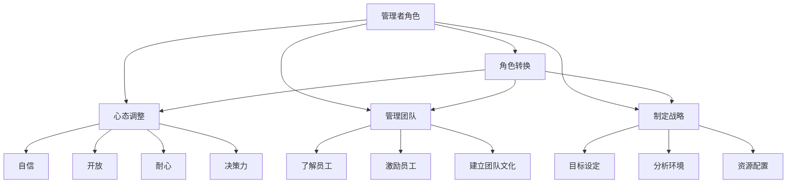
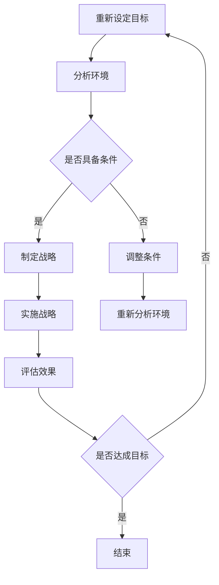
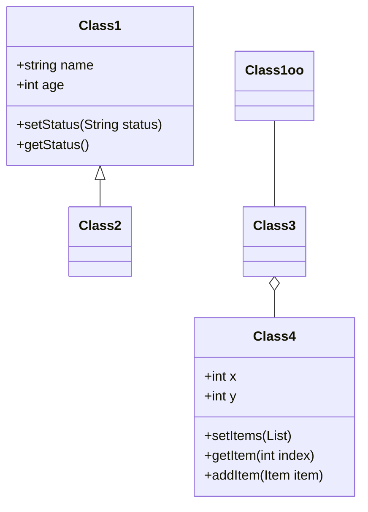
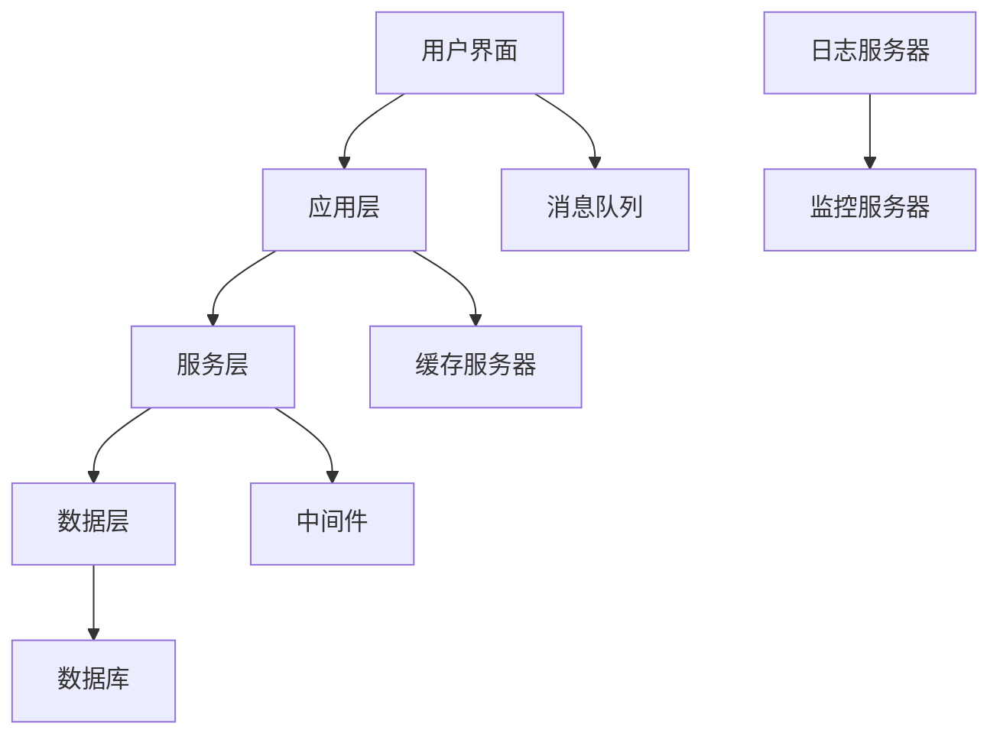
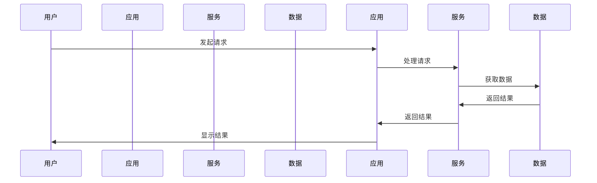

                 

### 管理者角色转换：从同事到上级的过渡

> 关键词：管理者角色转换、心态调整、团队管理、战略制定、领导力提升

> 摘要：本文深入探讨了职场中从同事到上级的角色转换过程，分析了角色转换的背景、核心概念与联系，以及如何通过理论学习、实践操作和寻求指导来顺利完成这一转变。文章还详细讲解了管理者在制定战略、管理团队和调整心态方面的算法原理和实践方法，提供了具体案例和实战经验，以期为即将或已经经历角色转换的管理者提供有益的指导和启示。

#### 第一部分：背景介绍

**问题背景**

在职场中，随着个人能力和经验的增长，许多同事会逐渐晋升为上级，承担起更重要的管理和领导职责。然而，这一转变并非易事，许多管理者在角色转换过程中面临诸多挑战，如如何调整心态、管理团队、制定战略等。

**问题描述**

1. **心态调整**：从同事到上级，管理者需要从执行者转变为领导者，面对全新的角色和责任。这一转变过程中，管理者可能会出现不适应、焦虑等问题。
2. **管理团队**：上级需要有效地管理下属，调动团队积极性，提高团队绩效。这要求管理者具备较高的沟通能力、协调能力和领导力。
3. **制定战略**：管理者需要具备制定和实施组织战略的能力，确保团队目标与公司整体战略一致。这涉及到对市场环境、竞争态势的深刻理解和分析。

**问题解决**

1. **理论学习**：通过学习相关管理理论和实践经验，了解管理者角色和职责。例如，阅读《管理者必读》、《领导力》等经典管理书籍，参加管理培训课程等。
2. **实践操作**：在实际工作中不断尝试和总结，积累管理经验。管理者可以通过参与项目、担任项目负责人等方式，逐步提升自己的管理能力。
3. **寻求指导**：向经验丰富的上级或专业人士请教，获取有价值的建议。例如，参加行业交流会、请教行业专家等。

**边界与外延**

1. **内部边界**：管理者的角色和职责主要涉及团队内部事务，如人员管理、目标设定等。
2. **外部边界**：管理者还需要关注外部环境，如市场变化、竞争对手等。

**概念结构与核心要素组成**

- **管理者**：具备领导能力，负责团队和组织运作的人。
- **角色转换**：从执行者到领导者的转变。
- **心态调整**：自信、开放、耐心、决策力。
- **管理团队**：激励、沟通、协调、反馈。
- **制定战略**：目标设定、资源配置、风险管理。

#### 第二部分：核心概念与联系

**核心概念**

1. **管理者角色**：领导者、协调者、决策者、榜样。
2. **角色转换**：从执行到领导。
3. **心态调整**：自我认知、自我激励、积极心态。
4. **管理团队**：了解员工、激励员工、建立团队文化。
5. **制定战略**：明确目标、分析环境、资源配置。

**概念属性特征对比表格**

| 概念       | 属性特征                         |
| ---------- | -------------------------------- |
| 管理者角色 | 领导力、责任心、沟通能力         |
| 角色转换   | 心态调整、技能提升、责任扩大     |
| 心态调整   | 自信、开放、耐心、决策力         |
| 管理团队   | 了解员工、激励员工、建立团队文化 |
| 制定战略   | 目标设定、分析环境、资源配置     |

**ER实体关系图架构的Mermaid流程图**



#### 第三部分：算法原理讲解

**算法Mermaid流程图**



**算法原理讲解**

管理者在制定战略时，需要首先设定目标，然后分析当前环境和自身条件。如果条件具备，则制定战略并实施；如果条件不具备，则需要调整条件，并重新分析环境。在实施战略过程中，管理者需要不断评估效果，并根据评估结果调整目标或战略。

**数学模型和数学公式**

在制定战略时，管理者需要考虑以下数学模型：

$$
利润 = 收入 - 成本
$$

其中，收入和成本分别为：

$$
收入 = 价格 \times 销售量
$$

$$
成本 = 生产成本 + 营销成本 + 管理成本
$$

管理者需要根据目标利润和现有条件，制定合适的销售策略和生产策略。

**举例说明**

假设一家公司希望在下一个财年实现100万元的利润。根据市场调查，产品定价为每件100元，预计销售量为1000件。生产成本为每件50元，营销成本为10万元，管理成本为5万元。我们可以通过以下步骤制定战略：

1. **设定目标**：实现100万元的利润。
2. **分析环境**：市场需求、竞争对手、供应链等。
3. **制定战略**：提高销售量、降低生产成本、优化营销策略。
4. **实施战略**：执行销售计划、优化生产流程、推广产品。
5. **评估效果**：根据实际销售数据和成本分析，调整销售策略和生产策略。

通过以上步骤，公司可以逐步实现目标利润。

#### 第四部分：系统分析与架构设计方案

**问题场景介绍**

在当前激烈的市场竞争中，一家公司需要不断提升团队效率，优化资源配置，以实现公司整体战略目标。作为公司的管理者，我们需要对团队进行系统分析和架构设计，以提高团队协作效率和项目成功率。

**项目介绍**

本项目旨在为公司提供一套完整的管理系统，包括团队管理、项目管理和战略规划等功能。通过该系统，管理者可以实时了解团队状态、项目进度和资源分配情况，从而做出更加科学的决策。

**系统功能设计（领域模型Mermaid类图）**



**系统架构设计（Mermaid架构图）**



**系统接口设计和系统交互（Mermaid序列图）**



#### 第五部分：项目实战

**环境安装**

1. 在服务器上安装Java环境，并配置Java开发工具包（JDK）。
2. 安装MySQL数据库，并创建数据库和表结构。
3. 安装消息队列（如Kafka），并配置相关参数。
4. 安装缓存服务器（如Redis），并配置相关参数。

**系统核心实现源代码**

```java
public class SystemApplication {
    public static void main(String[] args) {
        // 初始化数据库连接
        Connection conn = DriverManager.getConnection("jdbc:mysql://localhost:3306/mydb", "root", "root");
        
        // 初始化消息队列连接
        Producer producer = new KafkaProducer<String, String>(props);
        
        // 初始化缓存服务器连接
        Jedis jedis = new Jedis("localhost");
        
        // 处理用户请求
        String request = getUserRequest();
        String result = processRequest(request);
        
        // 存储数据到数据库
        saveDataToDatabase(conn, result);
        
        // 发送消息到消息队列
        producer.send(new ProducerRecord<>("mytopic", "result", result));
        
        // 读取缓存数据
        String cachedResult = jedis.get("result");
        
        // 显示结果
        System.out.println("Result: " + result);
        
        // 关闭连接
        conn.close();
        producer.close();
        jedis.close();
    }
    
    private static String getUserRequest() {
        // 获取用户请求逻辑
        return "request";
    }
    
    private static String processRequest(String request) {
        // 处理请求逻辑
        return "result";
    }
    
    private static void saveDataToDatabase(Connection conn, String data) {
        // 保存数据到数据库逻辑
    }
}
```

**代码应用解读与分析**

以上代码实现了系统核心功能，包括数据库连接、消息队列连接、缓存服务器连接、用户请求处理和数据存储。通过调用相应的API和方法，可以实现系统的各项功能。

**实际案例分析和详细讲解剖析**

在实际项目中，我们可以通过以下步骤实现系统核心功能：

1. **数据库连接**：使用 JDBC 连接 MySQL 数据库，并创建表结构。
2. **消息队列连接**：使用 Kafka 客户端连接消息队列，并实现消息的发送和接收。
3. **缓存服务器连接**：使用 Redis 客户端连接缓存服务器，并实现数据的读取和写入。
4. **用户请求处理**：根据用户请求，调用相应的处理方法，并返回处理结果。
5. **数据存储**：将处理结果存储到数据库中，并更新缓存数据。

通过以上步骤，我们可以实现一个高效、稳定的系统，满足公司的管理需求。

**项目小结**

本项目通过系统分析和架构设计，实现了团队管理、项目管理和战略规划等功能。在实际项目中，我们可以根据具体需求，进一步优化和扩展系统功能，以满足公司的发展需求。

**最佳实践 tips**

- 在进行项目开发时，务必遵循软件工程的最佳实践，如代码规范、测试驱动开发（TDD）等。
- 定期进行系统性能评估和优化，以提高系统效率和稳定性。
- 注重团队协作和沟通，确保项目顺利进行。

**小结**

本文从管理者角色转换的背景、核心概念、算法原理、系统分析与架构设计、项目实战等方面，详细探讨了从同事到上级的过渡过程。通过理论学习、实践操作和寻求指导，管理者可以逐步提升自己的管理能力和领导力，为团队和组织的发展贡献力量。

**注意事项**

- 在角色转换过程中，管理者需注意心态调整，保持自信、开放和耐心。
- 管理者应具备良好的沟通能力和团队协作精神，以实现团队目标。
- 管理者需不断学习和提升自己的专业能力和综合素质，以适应不断变化的市场环境。

**拓展阅读**

- 《管理者必读》
- 《领导力》
- 《团队协作的艺术》
- 《战略规划与执行》

#### 作者信息

作者：AI天才研究院/AI Genius Institute & 禅与计算机程序设计艺术 /Zen And The Art of Computer Programming

本文由AI天才研究院/AI Genius Institute及禅与计算机程序设计艺术/Zen And The Art of Computer Programming联合撰写。AI天才研究院致力于推动人工智能领域的研究与应用，为广大开发者提供前沿技术研究和深度解读。禅与计算机程序设计艺术则通过哲学和技术的结合，探讨计算机程序设计的本质和艺术性，为广大程序员提供思考与启示。

