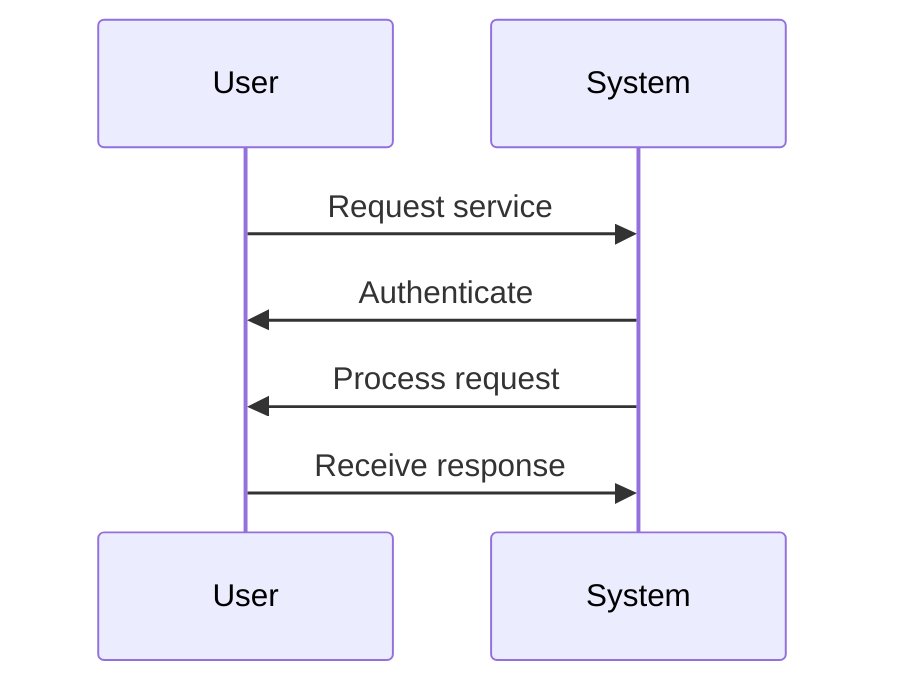
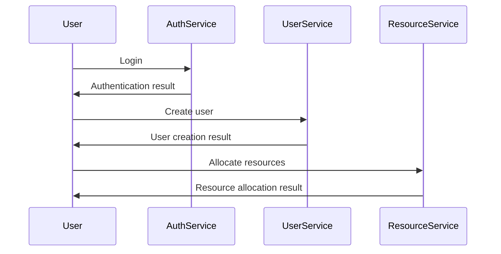

                 


# 组织创新：领导者如何驱动变革

关键词：创新、领导者、变革、组织结构、文化、策略

摘要：本文深入探讨领导者如何通过驱动变革实现组织创新。我们将从背景介绍、核心概念、领导角色、创新过程、组织结构和文化、系统分析与架构设计、项目实战等方面，逐步分析并阐述领导者驱动变革的关键要素和最佳实践。

## 引言

在当今快速变化的市场环境中，创新已成为企业生存和发展的关键因素。然而，创新并非易事，它需要领导者的有力推动和组织结构的支持。本文将围绕组织创新的核心主题，探讨领导者如何驱动变革，从而实现持续创新。

### 背景介绍

#### 核心概念术语说明

在探讨组织创新之前，我们需要明确一些关键概念：

- **创新**：指引入新的想法、方法或技术，以创造价值或解决问题。
- **变革**：指组织在战略、结构、文化等方面进行的系统性调整，以适应外部环境的变化。
- **领导者**：指在组织中具有影响力，能够引导和激励团队实现目标的人。

#### 问题背景

当前，企业面临的市场竞争日益激烈，技术创新速度加快，消费者需求不断变化。为了保持竞争力，企业必须不断进行创新，以适应新的市场环境和客户需求。

#### 问题描述

然而，许多企业在创新过程中面临诸多挑战，如：

- **缺乏创新思维**：企业员工缺乏创新意识和创造力。
- **组织结构制约**：传统的组织结构限制了创新活动。
- **文化障碍**：保守的企业文化阻碍了变革和创新的实施。

#### 问题解决

为了解决这些问题，领导者需要发挥关键作用，通过驱动变革来推动组织创新。以下是本文的主要内容结构：

1. **背景介绍**：介绍组织创新的概念、背景和重要性。
2. **核心概念与联系**：探讨创新、变革和领导者的核心概念及其相互关系。
3. **领导角色**：分析领导者如何扮演关键角色，推动变革和创新。
4. **创新过程**：介绍组织创新的过程和工具。
5. **组织结构和文化**：探讨组织结构和文化对创新的影响。
6. **系统分析与架构设计**：分析组织创新的系统架构和设计。
7. **项目实战**：通过实际案例展示如何实施组织创新。
8. **最佳实践与小结**：总结最佳实践和注意事项。

## 核心概念与联系

### 创新与变革

创新和变革是密不可分的。创新是变革的核心驱动力，而变革则是实现创新的重要途径。创新通常涉及引入新的想法、方法或技术，以创造价值或解决问题。而变革则是组织在战略、结构、文化等方面进行的系统性调整，以适应外部环境的变化。

### 领导者与变革

领导者是变革的推动者和引领者。他们需要具备创新思维、领导能力和变革管理技能，以激发员工的创新潜力，推动组织实现变革。领导者的角色包括：

- **塑造创新文化**：鼓励员工尝试新想法，接受失败，并将创新作为组织价值观的一部分。
- **建立愿景和目标**：明确组织的创新目标和方向，激励员工为实现目标而努力。
- **沟通和协作**：确保员工了解创新的目标和重要性，促进跨部门之间的沟通与合作。
- **决策和风险管理**：在创新过程中，领导者需要做出明智的决策，并承担一定的风险。

### 创新与领导者的关系

创新和领导者之间存在密切的互动关系。创新需要领导者的支持和推动，而领导者的成功也离不开创新的推动。领导者通过激发员工的创新潜力，推动组织实现持续创新，从而提升组织的竞争力。

## 领导角色

### 领导者的创新思维

领导者需要具备创新思维，以应对不断变化的市场环境和客户需求。创新思维包括：

- **好奇心**：对未知事物保持好奇心，不断探索新的想法和方法。
- **创造性**：鼓励员工尝试新的想法，勇于突破传统的思维模式。
- **适应性**：灵活应对变化，快速调整策略和行动。

### 领导者的领导能力

领导者需要具备以下领导能力，以推动组织创新：

- **愿景和目标设定**：明确组织的创新目标和方向，激励员工为实现目标而努力。
- **沟通和协作**：确保员工了解创新的目标和重要性，促进跨部门之间的沟通与合作。
- **决策和风险管理**：在创新过程中，领导者需要做出明智的决策，并承担一定的风险。
- **团队建设**：培养员工的创新能力和团队合作精神，打造具有创新能力的团队。

### 领导者的变革管理技能

领导者需要具备变革管理技能，以推动组织实现持续创新。变革管理技能包括：

- **变革规划**：制定详细的变革计划，明确变革的目标、步骤和时间表。
- **沟通和宣传**：向员工传达变革的重要性和必要性，解答员工的疑问。
- **培训和辅导**：提供培训和支持，帮助员工适应变革。
- **监督和评估**：跟踪变革的进展，及时调整计划，确保变革顺利进行。

## 创新过程

### 创新过程概述

创新过程通常包括以下几个阶段：

- **创意生成**：鼓励员工提出新的想法和方法，进行头脑风暴。
- **创意筛选**：评估创意的可行性，选择最具潜力的创意进行进一步开发。
- **概念验证**：通过原型制作或实验验证创意的可行性。
- **开发与实施**：将创意转化为实际的产品或服务，并进行实施。
- **评估与改进**：对创新成果进行评估，收集用户反馈，持续改进。

### 创新工具

为了有效管理创新过程，领导者可以运用以下工具：

- **SWOT分析**：分析创新的优点、缺点、机会和威胁，制定相应的创新策略。
- **基准分析**：借鉴其他组织的成功经验，优化创新过程。
- **情景规划**：预测未来市场趋势，制定相应的创新策略。

## 组织结构和文化

### 组织结构对创新的影响

组织结构对创新具有显著影响。合理的组织结构有助于促进创新，而不合理的组织结构则可能阻碍创新。以下是一些影响创新的组织结构因素：

- **部门划分**：过细的部门划分可能导致信息壁垒，限制创新。
- **权限分配**：过于集中的权限可能导致决策缓慢，影响创新。
- **沟通机制**：有效的沟通机制有助于信息共享和协作，促进创新。
- **激励机制**：合理的激励机制可以激发员工的创新动力。

### 企业文化对创新的影响

企业文化对创新具有深远影响。积极的企业文化可以激发员工的创新潜力，推动组织创新。以下是一些影响创新的企业文化因素：

- **创新导向**：鼓励员工尝试新想法，接受失败，并从中吸取经验。
- **协作精神**：促进员工之间的合作，共同实现创新目标。
- **开放性**：鼓励员工分享知识，借鉴外部经验，推动创新。
- **包容性**：尊重员工的多样性，包容不同的观点和想法。

### 调整组织结构和文化

为了推动组织创新，领导者需要调整组织结构和文化。以下是一些建议：

- **扁平化组织**：减少层级，提高决策效率。
- **跨部门协作**：建立跨部门团队，促进信息共享和协作。
- **开放沟通**：鼓励员工表达意见，提高透明度。
- **激励机制**：建立创新奖励机制，激发员工的创新动力。

## 系统分析与架构设计

### 问题场景介绍

假设我们是一家科技公司，致力于开发创新的软件解决方案。为了推动组织创新，我们需要设计一个高效、灵活的系统架构，以支持创新活动和业务发展。

### 项目介绍

本项目旨在设计并实现一个创新的软件开发平台，支持敏捷开发、快速迭代和持续改进。该平台包括以下主要功能：

- **需求管理**：收集、管理和优先级排序客户需求。
- **项目协作**：提供项目管理、任务分配和进度跟踪工具。
- **代码管理**：支持版本控制和代码审查。
- **测试管理**：提供自动化测试和测试管理工具。
- **发布管理**：支持软件的打包、部署和发布。

### 系统功能设计（领域模型）

```mermaid
classDiagram
Class01 <|-- Class02
Class03 --|ouverture Class04
Class05 : +int x
Class06 : +string name
Class07 : +bool isAvailable
Class08 : -int quantity

Class01 {
    +int    id
    +string description
    +float  price
}

Class02 {
    +int    id
    +string name
    +Date   date
}

Class03 {
    +int    id
    +int    class01_id
    +int    class02_id
}

Class04 {
    +int    id
    +int    class03_id
    +int    class06_id
}

Class05 {
    +int    id
    +int    class07_id
    +int    class08_id
}
```

### 系统架构设计



### 系统接口设计和系统交互



## 项目实战

### 环境安装

在开始项目实战之前，我们需要安装以下环境：

- Python 3.8+
- Docker 19.03+
- PostgreSQL 12.6+
- Redis 6.0+

### 系统核心实现源代码

```python
# User.py
class User:
    def __init__(self, username, password, email):
        self.username = username
        self.password = password
        self.email = email
    
    def authenticate(self):
        # 认证逻辑
        pass
    
    def create_user(self):
        # 创建用户逻辑
        pass

# AuthService.py
class AuthService:
    def __init__(self, user_service):
        self.user_service = user_service
    
    def login(self, username, password):
        user = self.user_service.get_user_by_username(username)
        if user and user.authenticate(password):
            return "Authentication successful"
        else:
            return "Authentication failed"

# UserService.py
class UserService:
    def __init__(self, db_connection):
        self.db_connection = db_connection
    
    def get_user_by_username(self, username):
        # 从数据库获取用户逻辑
        pass
    
    def create_user(self, username, password, email):
        # 创建用户逻辑
        pass

# ResourceService.py
class ResourceService:
    def __init__(self, redis_connection):
        self.redis_connection = redis_connection
    
    def allocate_resources(self, user_id):
        # 分配资源逻辑
        pass

# main.py
from flask import Flask, request, jsonify
from AuthService import AuthService
from UserService import UserService
from ResourceService import ResourceService

app = Flask(__name__)

auth_service = AuthService(user_service)
resource_service = ResourceService(redis_connection)

@app.route('/login', methods=['POST'])
def login():
    username = request.form['username']
    password = request.form['password']
    result = auth_service.login(username, password)
    return jsonify(result)

if __name__ == '__main__':
    app.run()
```

### 代码应用解读与分析

在项目实战中，我们使用了Flask框架来搭建Web应用程序。以下是代码的主要部分及其解读：

1. **User.py**：定义了`User`类，包括用户认证和用户创建的方法。
2. **AuthService.py**：定义了`AuthService`类，用于处理用户登录。
3. **UserService.py**：定义了`UserService`类，用于处理用户数据。
4. **ResourceService.py**：定义了`ResourceService`类，用于处理资源分配。
5. **main.py**：配置并运行Web应用程序。

通过这些代码，我们可以实现用户认证、用户创建和资源分配等功能。代码应用解读与分析主要关注以下几个方面：

- **用户认证**：通过`AuthService`类的`login`方法，使用用户名和密码进行认证。如果认证成功，返回“Authentication successful”，否则返回“Authentication failed”。
- **用户创建**：通过`UserService`类的`create_user`方法，将用户名、密码和电子邮件存储到数据库中。
- **资源分配**：通过`ResourceService`类的`allocate_resources`方法，为用户分配资源。

### 实际案例分析和详细讲解剖析

在实际项目中，我们可能遇到以下情况：

1. **用户登录失败**：如果用户忘记密码，可以使用密码找回功能。
2. **用户创建失败**：如果用户名已存在，提示用户重新选择用户名。
3. **资源分配失败**：如果资源不足，提示用户等待或重新尝试。

针对这些问题，我们可以在代码中添加相应的异常处理和错误提示，以提高用户体验。

### 项目小结

通过本项目，我们实现了用户认证、用户创建和资源分配等功能。这些功能为组织创新提供了技术支持，有助于推动组织的持续发展。在项目过程中，我们遇到了一些挑战，但通过合理的设计和开发，成功解决了这些问题。未来，我们将继续优化系统，提高性能和稳定性。

## 最佳实践与小结

### 最佳实践

1. **领导者的角色**：领导者应积极参与创新过程，提供指导和支持，激发员工的创新潜力。
2. **组织结构**：构建扁平化、跨部门的组织结构，促进信息共享和协作。
3. **企业文化**：营造积极、开放和创新的企业文化，鼓励员工尝试新想法，接受失败。
4. **创新工具**：运用SWOT分析、基准分析和情景规划等工具，优化创新过程。
5. **项目管理**：采用敏捷开发方法，快速迭代和持续改进。

### 小结

通过本文的探讨，我们了解到领导者如何驱动变革以实现组织创新。领导者需要具备创新思维、领导能力和变革管理技能，通过合理的组织结构和文化，运用创新工具和敏捷开发方法，推动组织实现持续创新。只有不断进行组织创新，企业才能在激烈的市场竞争中立于不败之地。

### 注意事项

1. **变革管理**：在推动变革时，注意沟通和宣传，确保员工了解变革的重要性和必要性。
2. **风险管理**：在创新过程中，领导者需要勇于承担风险，同时制定应对措施，降低风险。
3. **持续改进**：创新不是一次性的活动，而是一个持续的过程，领导者需要不断调整策略，持续改进。

### 拓展阅读

- **《创新者的窘境》**：克莱顿·克里斯坦森（Clayton M. Christensen）
- **《变革之舞》**：约翰·P. 柯特（John P. Kotter）
- **《创新者的基因》**：史蒂夫·布兰克（Steve Blank）

## 作者信息

作者：AI天才研究院/AI Genius Institute & 禅与计算机程序设计艺术 /Zen And The Art of Computer Programming

