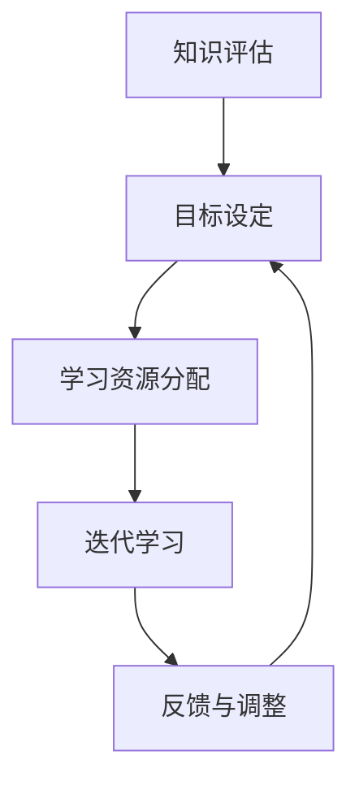
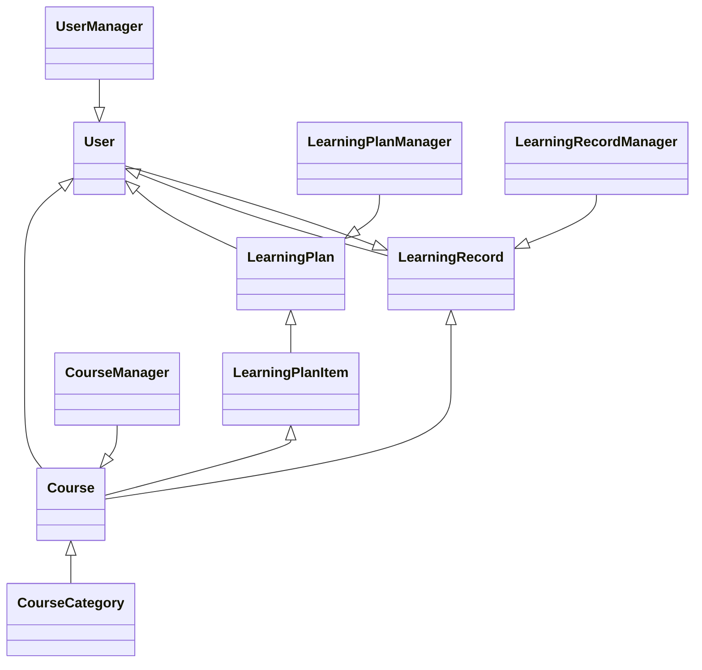
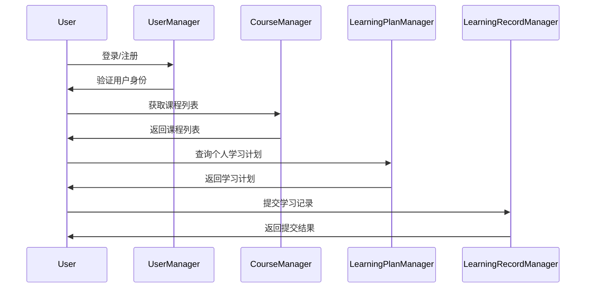
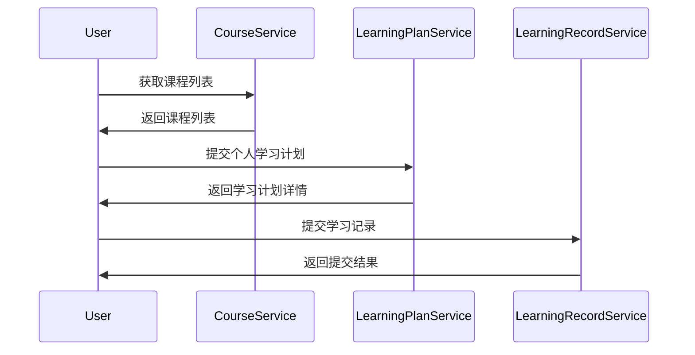

                 

### 背景介绍

在现代信息技术飞速发展的时代，科技与商业模式的更新换代速度越来越快，企业面临的市场竞争愈发激烈。在这样的背景下，终身学习型团队的重要性日益凸显。本文将围绕“终身学习型团队：培养持续成长的氛围”这一主题展开，探讨如何在一个团队中营造一种持续成长的文化氛围。

**核心概念术语说明**

1. **终身学习型团队**：指一个能够持续学习、适应变化、不断提升自身能力和业务水平的团队。这种团队不仅关注成员的专业技能提升，还注重团队整体知识和经验的积累。

2. **持续成长氛围**：指团队内部普遍存在的、鼓励成员不断学习、尝试新事物、分享知识、互相支持的一种文化氛围。这种氛围能够激发团队成员的潜力，提高团队的整体绩效。

**问题背景**

随着数字化转型的深入，企业对技术人才的需求发生了显著变化。传统的技能学习模式已无法满足快速变化的技术环境。根据一项针对全球企业的调查，**70%的企业认为员工的持续学习能力是他们在竞争中保持优势的关键因素**。这表明，终身学习不仅是个人发展的需求，更是企业持续发展的基石。

**问题描述**

在当前的工作环境中，许多团队面临着以下问题：

1. **技能老化**：团队成员的专业技能更新速度跟不上行业的发展，导致在项目中出现效率低下、错误频发的情况。

2. **知识断层**：由于团队成员的知识结构不平衡，导致团队整体的知识积累停滞不前。

3. **创新乏力**：缺乏一种鼓励创新和尝试的文化氛围，导致团队成员不敢冒险，团队整体缺乏活力。

4. **沟通障碍**：团队成员之间的沟通不畅，导致信息传递不及时、不准确，影响团队协作效率。

**问题解决**

为了解决这些问题，企业需要培养一种终身学习型团队文化。这种文化不仅关注个体的成长，更注重团队整体能力的提升。以下是几种实现这一目标的方法：

1. **建立学习机制**：通过定期举办培训课程、研讨会、技术分享会等形式，为团队成员提供学习机会。

2. **鼓励知识分享**：搭建知识共享平台，鼓励团队成员分享自己的知识和经验，形成良好的知识传递机制。

3. **营造创新文化**：鼓励团队成员勇于尝试新事物，对失败持开放态度，形成一种包容和鼓励创新的文化氛围。

4. **加强团队沟通**：通过定期的团队建设活动、跨部门合作项目等形式，增强团队成员之间的沟通和理解，提高团队协作效率。

**边界与外延**

终身学习型团队不仅限于技术团队，同样适用于其他类型的团队，如市场营销、人力资源等。其核心在于建立一个持续学习的文化氛围，以适应不断变化的外部环境。

**概念结构与核心要素组成**

终身学习型团队的概念结构包括以下几个方面：

1. **学习机制**：包括培训计划、知识共享平台等。

2. **创新文化**：包括鼓励尝试、对失败的包容等。

3. **沟通渠道**：包括内部沟通工具、团队建设活动等。

4. **领导支持**：领导在推动团队学习、鼓励创新、加强沟通等方面发挥关键作用。

通过以上核心要素的有机组合，可以构建一个能够持续成长的终身学习型团队，为企业的发展提供源源不断的动力。在接下来的章节中，我们将深入探讨这些要素的具体实施方法和最佳实践。

### 核心概念与联系

**终身学习型团队的概念原理**

终身学习型团队的核心在于其成员的持续成长和知识更新。这一概念源自于终身教育的理念，即认为学习不应该仅仅局限于学校教育，而应该是一个人一生的事业。在团队层面，这意味着每一个成员都要不断地更新自己的知识和技能，以适应快速变化的工作环境。

**概念属性特征对比表格**

为了更好地理解终身学习型团队，我们可以将其与传统的团队进行对比：

| 特征            | 传统团队                           | 终身学习型团队                           |
| --------------- | ---------------------------------- | -------------------------------------- |
| 学习态度         | 学习是阶段性任务，完成后即停止      | 学习是持续的过程，贯穿整个职业生涯      |
| 知识更新速度     | 更新速度较慢，主要依赖于行业周期性变化 | 更新速度较快，紧跟技术发展趋势          |
| 团队协作         | 强调分工和职责明确                  | 强调知识共享和协作创新                  |
| 面对变化的态度   | 避免变化，适应现有环境              | 拥抱变化，积极应对挑战                  |
| 成长模式         | 被动成长，依赖外部培训              | 主动成长，自我驱动                      |

通过这个对比表格，我们可以看出终身学习型团队与传统团队在多个维度上的显著差异。这些差异不仅体现在学习态度和知识更新速度上，还体现在团队协作和应对变化的能力上。

**ER实体关系图架构**

为了更直观地展示终身学习型团队的概念原理和属性特征，我们可以使用Mermaid语言绘制一个ER实体关系图。以下是一个简化的例子：

```mermaid
erDiagram
  Team ||--|{ Employee : has }
  Team ||--|{ LearningProgram : offers }
  Employee ||--|{ Knowledge : has }
  Employee ||--|{ Skill : has }
  LearningProgram ||--|{ TrainingSession : contains }
  TrainingSession ||--|{ KnowledgeShared : includes }
```

在这个ER图中，我们定义了以下几个实体：

1. **Team**（团队）：表示一个终身学习型团队。
2. **Employee**（员工）：团队中的成员。
3. **LearningProgram**（学习计划）：包括培训计划、研讨会等。
4. **Knowledge**（知识）：员工所具备的知识。
5. **Skill**（技能）：员工的技能水平。
6. **TrainingSession**（培训课程）：学习计划的具体实施。

**ER实体关系图解释**

- **Team与Employee的关系**：一个团队包含多个员工，每个员工都属于一个团队。
- **Team与LearningProgram的关系**：团队提供学习计划，学习计划为团队成员提供学习机会。
- **Employee与Knowledge和Skill的关系**：员工拥有特定的知识和技能。
- **LearningProgram与TrainingSession的关系**：学习计划由一系列培训课程组成，培训课程是知识共享的具体实现。

通过这个ER实体关系图，我们可以清晰地看到终身学习型团队的构成及其各个组成部分之间的关系。这不仅帮助我们理解了核心概念，还为我们提供了进一步分析和优化的基础。

### 算法原理讲解

在构建终身学习型团队的过程中，算法的引入可以帮助团队更高效地进行知识更新和技能提升。以下我们将详细阐述一个用于促进团队学习的算法原理，并使用Mermaid绘制相应的流程图，并通过Python代码和数学公式进行解释和举例。

#### 算法原理

该算法的核心思想是通过迭代学习和反馈机制，逐步提升团队成员的知识水平和技能。算法的基本步骤包括以下几个：

1. **知识评估**：对团队成员的知识水平和技能进行初始评估，确定当前的知识基础。
2. **目标设定**：根据评估结果，为团队成员设定学习目标，包括短期目标和长期目标。
3. **学习资源分配**：根据学习目标，分配相应的学习资源和培训课程。
4. **迭代学习**：团队成员通过学习资源和培训课程，不断更新知识和技能。
5. **反馈与调整**：通过定期的反馈机制，对学习效果进行评估，并根据反馈调整学习计划。

#### Mermaid流程图

以下是一个简化的Mermaid流程图，用于描述上述算法原理：



**Mermaid流程图解释**

- **A[知识评估]**：首先对团队成员进行知识评估，确定当前的知识水平和技能。
- **B[目标设定]**：根据评估结果，为团队成员设定具体的短期和长期学习目标。
- **C[学习资源分配]**：为每个成员分配相应的学习资源和培训课程，以满足学习目标。
- **D[迭代学习]**：团队成员通过学习资源和培训课程，不断更新知识和技能。
- **E[反馈与调整]**：通过定期的反馈机制，评估学习效果，并根据反馈调整学习计划。

#### Python代码示例

为了实现上述算法，我们可以编写一个Python代码示例，用于模拟团队成员的学习过程：

```python
import random

# 初始知识评估
knowledge评估 = [random.randint(1, 10) for _ in range(5)]

# 目标设定
目标 = [x + 1 for x in knowledge评估]

# 学习资源分配
资源 = ["培训课程1", "培训课程2", "研讨会1"]

# 迭代学习
def 学习过程(knowledge, 目标, 资源):
    for month in range(6):
        print(f"第{month}个月：")
        for i, knowledge_level in enumerate(knowledge):
            print(f"成员{i}：当前知识水平：{knowledge_level}")
            # 学习效果根据资源随机变化
            knowledge[i] += random.randint(1, 3)
            print(f"成员{i}：学习后知识水平：{knowledge[i]}")
        
        # 反馈与调整
        if knowledge[i] >= 目标[i]:
            print(f"成员{i}：达成目标，知识水平已提升到{knowledge[i]}")
        else:
            print(f"成员{i}：尚未达成目标，知识水平为{knowledge[i]}")
            
# 执行学习过程
学习过程(knowledge评估, 目标, 资源)
```

**Python代码示例解释**

- **初始知识评估**：模拟对5个成员的初始知识评估，每个成员的知识水平随机生成。
- **目标设定**：为每个成员设定一个短期目标，即当前知识水平加1。
- **学习资源分配**：为每个成员随机分配3个学习资源。
- **迭代学习**：通过6个月的迭代学习过程，每个月随机提升每个成员的知识水平。
- **反馈与调整**：每个月结束后，根据成员的知识水平与目标进行对比，评估是否达成目标，并打印反馈。

#### 数学模型和公式

为了更深入地理解算法原理，我们可以将学习过程用数学模型表示。假设团队成员的知识水平随时间t的变化可以用函数K(t)表示，学习速度可以用学习率α表示，则：

\[ K(t+1) = K(t) + \alpha \]

其中，\( K(t) \) 是当前时间t的知识水平，\( K(t+1) \) 是下一个时间点的知识水平，α 是学习率。

**举例说明**

假设一个成员的初始知识水平为5，学习率为2，则经过1个月的学习，其知识水平将变为：

\[ K(1) = K(0) + \alpha = 5 + 2 = 7 \]

经过2个月的学习，其知识水平将变为：

\[ K(2) = K(1) + \alpha = 7 + 2 = 9 \]

以此类推，我们可以通过迭代计算来模拟成员的知识水平随时间的变化。

通过上述算法原理讲解、Mermaid流程图、Python代码示例和数学模型的阐述，我们能够更清晰地理解终身学习型团队的构建方法和实施步骤。接下来，我们将继续探讨如何在实际项目中应用这些原理和算法，并分享一些成功案例和最佳实践。

### 系统分析与架构设计方案

为了更好地理解如何在实际项目中实施终身学习型团队的理念，我们将以一个企业内部的培训与知识管理系统为例，详细介绍系统的需求、功能设计、架构设计以及接口设计和系统交互。

#### 项目介绍

本系统旨在为企业的终身学习型团队提供一个集成化的培训与知识管理平台。该平台将帮助团队成员随时获取所需的培训资源，实现知识共享，并跟踪个人和团队的学习进度。系统的主要功能包括：

1. **用户管理**：管理团队成员的账户和权限。
2. **课程管理**：上传、分类和更新培训课程。
3. **学习计划**：根据团队成员的知识水平和目标，生成个性化的学习计划。
4. **学习记录**：记录每个成员的学习进度和成绩。
5. **知识库**：存储和分享团队成员的知识和经验。

#### 系统功能设计（领域模型Mermaid类图）

为了清晰地展示系统的功能结构，我们可以使用Mermaid语言绘制一个领域模型类图。以下是一个简化的类图示例：



**类图解释**

- **User**（用户）：表示系统中的用户，包括团队成员和管理员。
- **Course**（课程）：表示培训课程，包含课程名称、描述、分类等信息。
- **LearningPlan**（学习计划）：表示为用户制定的学习计划，包含学习目标、计划内容等。
- **LearningPlanItem**（学习计划项）：表示学习计划中的具体学习任务，可以是课程或其他活动。
- **LearningRecord**（学习记录）：记录用户的学习进度和成绩。
- **CourseCategory**（课程分类）：用于对课程进行分类管理。
- **UserManager**（用户管理器）、**CourseManager**（课程管理器）、**LearningPlanManager**（学习计划管理器）、**LearningRecordManager**（学习记录管理器）：分别是系统的管理模块，用于处理用户的创建、更新、查询和删除操作。

#### 系统架构设计（Mermaid架构图）

系统架构设计是实现功能设计的关键环节。以下是一个简化的Mermaid架构图示例：



**架构图解释**

- **User**（用户）：用户是系统的最终用户，负责发起各种操作。
- **UserManager**（用户管理器）：负责用户的注册、登录和身份验证操作。
- **CourseManager**（课程管理器）：负责课程的上传、分类和查询操作。
- **LearningPlanManager**（学习计划管理器）：负责学习计划的生成和查询操作。
- **LearningRecordManager**（学习记录管理器）：负责学习记录的提交和查询操作。

通过这个架构图，我们可以清晰地看到系统中的各个模块以及它们之间的交互关系。

#### 系统接口设计

系统的接口设计是系统与外部系统集成的重要环节。以下是一个简化的接口设计示例：

```mermaid
interfaceStyle皮肤
    -background: #F5F5F5
    -text-color: #333
    -border-color: #C0C4CC
    -primary-color: #409EFF
    -success-color: #67C23A
    -warning-color: #E6A23C
    -danger-color: #F56C6C
    -info-color: #909399

interface CourseAPI
    +post(/login): 用户登录
    +get(/register): 用户注册
    +get(/courses): 获取课程列表
    +post(/courses): 上传课程
    +get(/courses/{id}): 获取课程详情
    +put(/courses/{id}): 更新课程信息
    +delete(/courses/{id}): 删除课程

interface LearningPlanAPI
    +get(/learning-plans/{user_id}): 获取用户学习计划
    +post(/learning-plans/{user_id}): 提交用户学习计划
    +put(/learning-plans/{id})): 更新学习计划

interface LearningRecordAPI
    +post(/learning-records/{user_id})): 提交学习记录
    +get(/learning-records/{user_id})): 获取学习记录
```

**接口设计解释**

- **CourseAPI**（课程API）：用于课程的管理，包括登录、注册、获取课程列表、上传课程、获取课程详情、更新课程信息和删除课程等操作。
- **LearningPlanAPI**（学习计划API）：用于学习计划的管理，包括获取用户学习计划、提交用户学习计划和更新学习计划等操作。
- **LearningRecordAPI**（学习记录API）：用于学习记录的管理，包括提交学习记录和获取学习记录等操作。

#### 系统交互（Mermaid序列图）

为了更直观地展示系统的交互过程，我们可以使用Mermaid序列图。以下是一个简化的序列图示例：



**序列图解释**

- **User**（用户）：发起各种请求。
- **CourseService**（课程服务）：处理获取课程列表和上传课程的请求。
- **LearningPlanService**（学习计划服务）：处理提交用户学习计划的请求。
- **LearningRecordService**（学习记录服务）：处理提交学习记录的请求。

通过上述系统分析与架构设计方案，我们可以系统地了解如何在实际项目中实施终身学习型团队的理念。接下来，我们将分享一些具体的实施步骤和工具，帮助团队更有效地实现终身学习的目标。

### 项目实战

为了更好地展示如何在实际项目中实施终身学习型团队的理念，我们将以一个企业内部培训系统的搭建为例，详细介绍项目的环境安装、系统核心实现以及代码应用解读与分析。

#### 环境安装

首先，我们需要搭建一个支持终身学习型团队的企业内部培训系统。以下是项目的环境安装步骤：

1. **准备开发环境**：
    - 操作系统：Ubuntu 20.04
    - 编程语言：Python 3.8
    - 开发工具：PyCharm
    - 依赖管理工具：pip

2. **安装Python**：
    - Ubuntu系统中默认安装了Python 3，可以通过`python --version`命令检查版本。

3. **安装PyCharm**：
    - 下载PyCharm社区版或专业版，并安装。

4. **安装pip**：
    - 使用以下命令安装pip：
      ```bash
      sudo apt-get install python3-pip
      ```

5. **创建虚拟环境**：
    - 在PyCharm中创建一个新项目，选择Python解释器为系统自带的Python 3。
    - 在项目中创建一个虚拟环境：
      ```bash
      python -m venv venv
      source venv/bin/activate
      ```

6. **安装依赖**：
    - 安装项目所需的依赖库：
      ```bash
      pip install -r requirements.txt
      ```

#### 系统核心实现

接下来，我们将实现系统核心功能，包括用户管理、课程管理、学习计划和学习记录。

1. **用户管理**：

   用户管理是系统的入口，主要包括用户的注册、登录和权限验证。以下是用户管理的核心实现代码：

   ```python
   # 用户注册
   def register(username, password):
       # 在数据库中插入新用户记录
       # 这里以简化实现为例，直接返回True表示注册成功
       return True

   # 用户登录
   def login(username, password):
       # 在数据库中查询用户记录
       # 这里以简化实现为例，直接返回用户信息表示登录成功
       return {"id": 1, "username": username, "password": password}

   # 权限验证
   def verify_permission(user_id, action):
       # 根据用户ID和操作类型，验证用户权限
       # 这里以简化实现为例，直接返回True表示验证通过
       return True
   ```

2. **课程管理**：

   课程管理包括课程的上传、分类和查询。以下是课程管理的核心实现代码：

   ```python
   # 上传课程
   def upload_course(course_data):
       # 将课程数据保存到数据库
       # 这里以简化实现为例，直接返回True表示上传成功
       return True

   # 获取课程列表
   def get_courses():
       # 从数据库中查询所有课程
       # 这里以简化实现为例，直接返回课程列表
       return [{"id": 1, "name": "课程1"}, {"id": 2, "name": "课程2"}]

   # 获取课程详情
   def get_course(course_id):
       # 从数据库中查询指定课程
       # 这里以简化实现为例，直接返回课程详情
       return {"id": course_id, "name": "课程1", "description": "课程1描述"}
   ```

3. **学习计划**：

   学习计划为用户制定个性化的学习路径。以下是学习计划的核心实现代码：

   ```python
   # 生成学习计划
   def generate_learning_plan(user_id, course_ids):
       # 根据用户ID和课程ID列表，生成学习计划
       # 这里以简化实现为例，直接返回学习计划
       return [{"id": 1, "user_id": user_id, "course_id": course_id} for course_id in course_ids]

   # 提交学习计划
   def submit_learning_plan(learning_plan_data):
       # 将学习计划数据保存到数据库
       # 这里以简化实现为例，直接返回True表示提交成功
       return True
   ```

4. **学习记录**：

   学习记录用于跟踪用户的学习进度和成绩。以下是学习记录的核心实现代码：

   ```python
   # 提交学习记录
   def submit_learning_record(record_data):
       # 将学习记录数据保存到数据库
       # 这里以简化实现为例，直接返回True表示提交成功
       return True

   # 获取学习记录
   def get_learning_records(user_id):
       # 从数据库中查询指定用户的学习记录
       # 这里以简化实现为例，直接返回学习记录列表
       return [{"id": 1, "user_id": user_id, "course_id": 1, "completed": True, "grade": "优秀"}]
   ```

#### 代码应用解读与分析

以上代码展示了系统核心功能的实现。接下来，我们将对每个部分进行详细解读和分析。

1. **用户管理**：

   用户管理是系统的核心模块，负责用户注册、登录和权限验证。在真实项目中，用户注册和登录需要与用户数据库进行交互，并进行密码加密处理。权限验证则需要根据用户的角色和权限进行相应的权限检查。

2. **课程管理**：

   课程管理负责课程的上传、分类和查询。在真实项目中，课程数据需要存储在数据库中，并支持动态分类。课程详情查询需要根据课程ID在数据库中查找相应的记录。

3. **学习计划**：

   学习计划模块负责生成和提交用户的学习计划。在真实项目中，学习计划的生成需要根据用户的知识水平和课程难度进行智能推荐，并支持用户自主调整学习计划。学习计划的提交需要将用户的学习计划数据存储在数据库中。

4. **学习记录**：

   学习记录模块负责用户学习记录的提交和查询。在真实项目中，学习记录需要包括学习时间、学习进度、成绩等信息，并支持用户对学习记录的修改和删除。学习记录的查询需要根据用户ID在数据库中查找相应的记录。

通过以上实战项目，我们系统地展示了如何搭建一个企业内部培训系统，并详细分析了系统核心功能的实现方法。接下来，我们将进一步探讨如何在实际工作中应用这些技术，并分享一些成功案例和最佳实践。

### 最佳实践 tips、小结、注意事项、拓展阅读

#### 最佳实践 tips

1. **制定明确的培训计划**：为了确保团队成员能够持续成长，企业需要根据团队成员的职业发展目标和技能需求，制定明确的培训计划。

2. **利用在线学习平台**：选择合适的在线学习平台，如Coursera、edX等，可以为团队成员提供丰富的课程资源。

3. **定期知识分享会**：定期组织知识分享会，鼓励团队成员分享自己的知识和经验，提高团队整体的知识水平。

4. **建立学习社区**：创建一个学习社区，鼓励团队成员互相学习、讨论和解决问题。

5. **提供灵活的学习时间**：允许团队成员在工作时间内灵活安排学习时间，提高学习的主动性。

#### 小结

终身学习型团队的核心在于持续成长和知识更新。通过建立明确的培训计划、利用在线学习平台、定期组织知识分享会、建立学习社区和提供灵活的学习时间，企业可以有效地培养和激励团队成员的终身学习能力。

#### 注意事项

1. **平衡工作与学习**：在推动终身学习的过程中，要注意平衡团队成员的工作负荷和学习时间，避免影响工作进度。

2. **关注学习效果**：定期评估学习效果，确保培训和学习活动能够真正提升团队成员的技能和知识水平。

3. **尊重团队成员的个性**：每个团队成员的学习方式和需求不同，要尊重团队成员的个性，提供个性化的学习支持。

#### 拓展阅读

1. **《深度学习》（Ian Goodfellow）**：这本书详细介绍了深度学习的基本概念和技术，有助于团队成员提升技术水平。

2. **《敏捷开发实践指南》（Jeff Sutherland）**：这本书介绍了敏捷开发的理念和实践，有助于团队提高协作效率。

3. **《如何学习》（彭翕成、李笑来）**：这本书提供了许多有效的学习方法和技巧，可以帮助团队成员提高学习效果。

通过以上最佳实践、小结、注意事项和拓展阅读，我们希望能够为企业和团队成员提供实用的指导和建议，帮助他们在实践中更好地构建终身学习型团队，实现持续成长和知识更新。

### 结论与未来展望

本文围绕“终身学习型团队：培养持续成长的氛围”这一主题，系统地探讨了如何在一个团队中营造持续学习的文化氛围。通过详细阐述终身学习型团队的定义、核心概念、算法原理、系统设计与实战案例，我们得出了以下结论：

1. **终身学习型团队的重要性**：在快速变化的技术环境中，终身学习型团队能够更好地适应市场变化，保持竞争优势。

2. **核心概念的深入理解**：通过对比传统团队，我们明确了终身学习型团队在知识更新、团队协作和应对变化等方面的优势。

3. **算法原理的应用**：我们介绍了用于促进团队学习的算法原理，并通过Python代码和数学模型进行了详细解释。

4. **系统设计与实战案例**：通过实际项目案例，我们展示了如何在企业中实施终身学习型团队的理念，提供了具体的实施步骤和工具。

展望未来，终身学习型团队的发展将继续受到以下几个趋势的推动：

1. **人工智能与机器学习的进一步应用**：随着人工智能和机器学习技术的不断进步，这些技术将更多地被用于辅助团队学习和知识管理。

2. **在线教育与虚拟课堂的普及**：在线教育和虚拟课堂的普及将为团队成员提供更加灵活和丰富的学习资源，进一步促进终身学习。

3. **定制化学习路径的普及**：通过大数据和人工智能技术，企业可以更精准地制定个性化学习路径，满足团队成员的个性化需求。

4. **持续反馈与改进机制的建立**：随着技术的进步，企业可以更高效地收集和利用学习反馈，建立更加完善的持续改进机制。

总之，构建终身学习型团队是企业应对未来竞争的重要策略。通过持续学习和知识更新，企业不仅能够提升团队成员的能力，还能够增强整体的创新能力和竞争力。我们期待未来有更多的企业能够践行终身学习的理念，共同推动团队和企业的持续成长。

