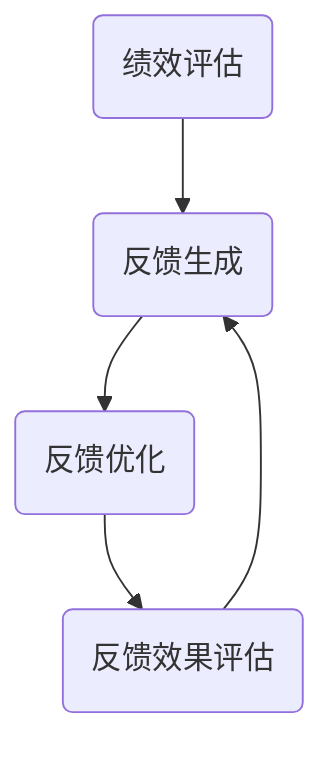
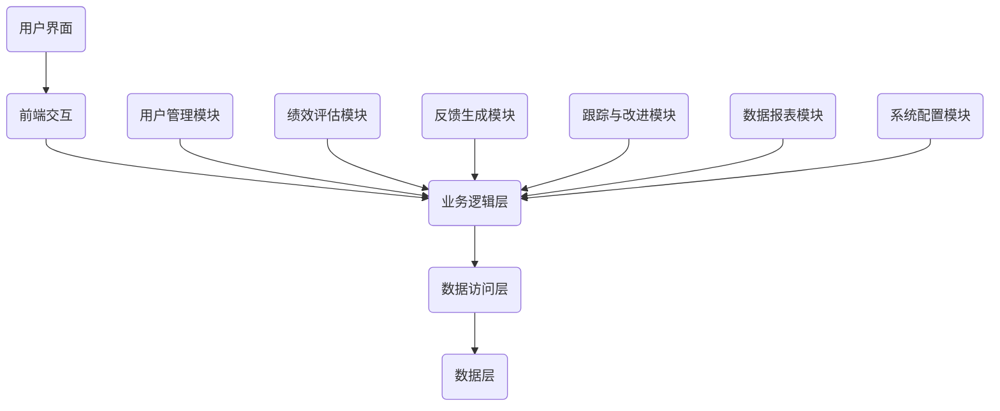
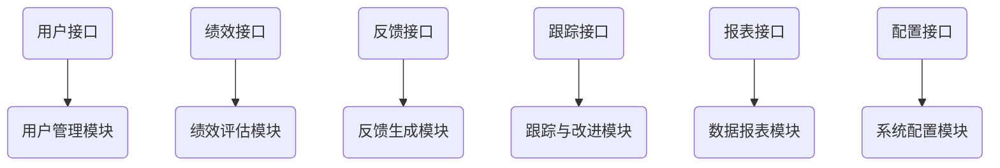
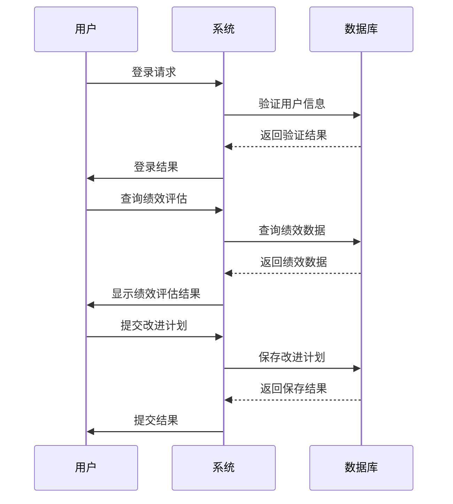
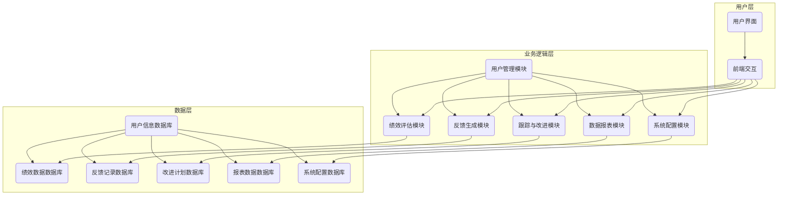

                 

# 绩效反馈：有效沟通的艺术

> 关键词：绩效反馈、沟通艺术、员工成长、系统架构设计、算法原理

> 摘要：本文将深入探讨绩效反馈这一现代职场中的重要沟通手段，分析其基本概念、核心原理以及有效实施的方法。通过详细的案例分析和技术解读，本文旨在为读者提供一套实用的绩效反馈最佳实践，帮助职场人士提升沟通效果，促进个人和团队的发展。

## Step 1: 导入背景介绍部分

### 1.1 问题背景

在当今快速变化的工作环境中，员工的绩效反馈成为一个关键的管理工具。它不仅能够帮助员工了解自己的工作表现，还能够为管理层提供宝贵的数据，以便做出更加科学的决策。然而，绩效反馈的实施并非易事。许多管理者在面对绩效反馈时，往往感到困惑和无从下手，这不仅影响了反馈的效果，也可能对员工的积极性产生负面影响。

### 1.2 问题描述

绩效反馈存在的问题主要集中在以下几个方面：

1. **反馈内容不具体**：许多反馈过于笼统，缺乏具体的改进建议，使员工难以有针对性地进行提升。
2. **反馈时机不当**：绩效反馈往往集中在年度评估时进行，未能及时捕捉到员工表现的变化，错过了最佳反馈时机。
3. **反馈方式不当**：一些管理者在反馈时采用批评式或命令式的沟通方式，容易引起员工的抵触情绪。
4. **反馈结果未跟进**：绩效反馈后，缺乏对员工改进过程的跟踪和指导，导致反馈效果打折扣。

### 1.3 问题解决

为了解决上述问题，管理者需要掌握以下关键点：

1. **明确反馈目标**：在反馈前，明确希望达成的具体目标，确保反馈内容具有针对性。
2. **选择合适时机**：根据员工的工作表现，及时进行反馈，使反馈更具有时效性。
3. **采用建设性沟通**：在反馈时，采用鼓励和支持的语言，关注员工的长处，并提出具体的改进建议。
4. **跟进反馈结果**：在反馈后，持续关注员工的改进过程，并提供必要的支持和指导。

### 1.4 边界与外延

绩效反馈不仅涉及员工的个人表现，还与团队目标、组织文化密切相关。因此，在实施绩效反馈时，需要考虑到以下因素：

1. **团队目标**：绩效反馈应与团队的目标紧密相连，确保员工的个人发展能够支持团队的整体进步。
2. **组织文化**：不同的组织文化对绩效反馈有不同的接受度，管理者需要根据组织的文化氛围选择合适的反馈方式。
3. **外部环境**：外部环境的变化，如行业趋势、经济形势等，也可能影响绩效反馈的实施方式和效果。

### 1.5 概念结构与核心要素组成

为了更好地理解绩效反馈，我们需要从以下几个方面进行详细探讨：

1. **绩效反馈的定义**：明确绩效反馈的基本概念和作用。
2. **绩效反馈的类型**：分析不同类型的绩效反馈及其适用场景。
3. **绩效反馈的关键要素**：了解绩效反馈中不可或缺的要素，如反馈内容、反馈方式和反馈结果等。
4. **绩效反馈与沟通的联系**：探讨绩效反馈在沟通中的作用和地位，以及如何通过有效的沟通提高绩效反馈的效果。

## Step 2: 概念与联系部分

### 2.1 绩效反馈的基本概念

#### 2.1.1 问题背景

绩效反馈是人力资源管理中的一项重要内容，它通过定期评估员工的绩效表现，为员工提供改进方向和发展建议。在当今注重绩效驱动的组织中，绩效反馈已成为提升员工能力和团队绩效的关键手段。

#### 2.1.2 问题描述

绩效反馈涉及多个方面，包括绩效评估、反馈内容、反馈方式和反馈结果。在实际操作中，管理者需要明确绩效反馈的目标，确保反馈具有针对性；同时，要选择合适的时机和方式，以提高反馈的接受度和效果。

#### 2.1.3 问题解决

为了解决上述问题，管理者可以采取以下措施：

1. **制定明确的反馈目标**：在反馈前，明确希望达成的具体目标，确保反馈内容具有针对性。
2. **选择合适的反馈时机**：根据员工的工作表现，及时进行反馈，使反馈更具有时效性。
3. **采用建设性沟通**：在反馈时，采用鼓励和支持的语言，关注员工的长处，并提出具体的改进建议。
4. **跟进反馈结果**：在反馈后，持续关注员工的改进过程，并提供必要的支持和指导。

#### 2.1.4 边界与外延

绩效反馈不仅涉及员工的个人表现，还与团队目标、组织文化密切相关。因此，在实施绩效反馈时，需要考虑到以下因素：

1. **团队目标**：绩效反馈应与团队的目标紧密相连，确保员工的个人发展能够支持团队的整体进步。
2. **组织文化**：不同的组织文化对绩效反馈有不同的接受度，管理者需要根据组织的文化氛围选择合适的反馈方式。
3. **外部环境**：外部环境的变化，如行业趋势、经济形势等，也可能影响绩效反馈的实施方式和效果。

#### 2.1.5 概念结构与核心要素组成

绩效反馈的概念结构主要包括以下几个方面：

1. **绩效评估**：对员工的工作表现进行客观评估，确定绩效水平。
2. **反馈内容**：明确反馈的具体内容，包括优点、不足和改进建议。
3. **反馈方式**：选择合适的反馈方式，如面对面沟通、电子邮件或书面报告等。
4. **反馈结果**：对反馈结果进行跟进和总结，评估反馈效果。

### 2.2 绩效反馈的核心概念与联系

#### 2.2.1 绩效反馈的定义

绩效反馈是指通过定期评估员工的工作表现，向员工提供具体的意见和建议，以帮助员工改进和提高绩效的过程。

#### 2.2.2 绩效反馈的类型

绩效反馈可以分为以下几种类型：

1. **正面反馈**：针对员工的优点和成就进行表扬和鼓励，增强员工的自信心和积极性。
2. **负面反馈**：针对员工的不良表现或不足进行指正和批评，帮助员工认识到问题并及时改正。
3. **建设性反馈**：结合正面和负面反馈，以建设性的方式提出改进建议，促进员工的成长和发展。

#### 2.2.3 绩效反馈的关键要素

绩效反馈的关键要素包括：

1. **评估标准**：明确评估员工的绩效标准和指标，确保评估的客观性和公正性。
2. **反馈内容**：具体、明确的反馈内容，包括员工的优点、不足和改进建议。
3. **反馈方式**：选择合适的反馈方式，确保反馈的接受度和效果。
4. **反馈结果**：对反馈结果进行跟进和总结，评估反馈效果。

#### 2.2.4 绩效反馈与沟通的联系

绩效反馈是沟通的重要组成部分，它与沟通有着密切的联系：

1. **沟通目标**：绩效反馈的目的是通过有效的沟通，帮助员工改进和提高绩效。
2. **沟通渠道**：绩效反馈可以通过面对面沟通、电子邮件、书面报告等方式进行。
3. **沟通技巧**：有效的沟通技巧，如倾听、表达、反馈等，是确保绩效反馈效果的重要因素。

## Step 3: 算法原理讲解部分

### 3.1 算法原理概述

绩效反馈的算法原理主要涉及绩效评估、反馈生成和反馈优化三个核心环节。通过这三个环节的有机结合，实现有效的绩效反馈。

#### 绩效评估

绩效评估是绩效反馈的基础，其主要目的是对员工的工作表现进行客观评估，确定绩效水平。评估过程通常包括以下步骤：

1. **数据收集**：收集员工的日常工作数据，如工作量、工作效率、工作质量等。
2. **指标确定**：根据组织目标和岗位职责，确定具体的绩效指标，如关键绩效指标（KPI）等。
3. **评估计算**：对收集到的数据进行分析和计算，确定员工的绩效水平。

#### 反馈生成

反馈生成是基于绩效评估结果，为员工提供具体的意见和建议。反馈生成过程通常包括以下步骤：

1. **反馈内容设计**：根据员工的绩效表现，设计具体的反馈内容，包括优点、不足和改进建议。
2. **反馈格式选择**：选择合适的反馈格式，如书面报告、面对面沟通等。
3. **反馈内容生成**：将评估结果和反馈内容结合起来，生成完整的绩效反馈报告。

#### 反馈优化

反馈优化是对绩效反馈过程进行持续改进，以提高反馈效果。反馈优化过程通常包括以下步骤：

1. **反馈效果评估**：对绩效反馈的效果进行评估，确定反馈的接受度和效果。
2. **反馈调整**：根据反馈效果评估的结果，对反馈过程进行调整和优化，以提高反馈效果。
3. **反馈结果跟进**：对员工的改进过程进行跟踪和指导，确保反馈目标的实现。

### 3.2 算法流程图

绩效反馈算法的流程图如下所示：



### 3.3 数学模型与公式

绩效反馈的数学模型主要包括绩效评估模型、反馈生成模型和反馈优化模型。以下分别介绍这三个模型的基本公式。

#### 绩效评估模型

绩效评估模型的核心公式为：

$$
绩效得分 = w_1 \times 工作量 + w_2 \times 工作效率 + w_3 \times 工作质量
$$

其中，$w_1$、$w_2$、$w_3$ 分别为工作量、工作效率和工作质量的权重，可以根据组织目标和岗位职责进行调整。

#### 反馈生成模型

反馈生成模型的核心公式为：

$$
反馈内容 = 优点 + 不足 + 改进建议
$$

其中，优点、不足和改进建议的具体内容可以根据绩效评估结果进行设计。

#### 反馈优化模型

反馈优化模型的核心公式为：

$$
反馈优化 = 反馈效果评估 \times 反馈调整
$$

其中，反馈效果评估和反馈调整的具体内容可以根据实际情况进行设定。

### 3.4 算法原理详细讲解

#### 绩效评估

绩效评估是绩效反馈的基础，其核心目的是对员工的工作表现进行客观评估，确定绩效水平。绩效评估的过程可以分为以下几个步骤：

1. **数据收集**：收集员工的日常工作数据，如工作量、工作效率、工作质量等。这些数据可以从工作日志、项目进度报告、同事评价等多个渠道获取。
2. **指标确定**：根据组织目标和岗位职责，确定具体的绩效指标，如关键绩效指标（KPI）等。这些指标需要具有可量化和可衡量的特点，以便进行客观评估。
3. **评估计算**：对收集到的数据进行分析和计算，确定员工的绩效水平。评估计算可以采用定量分析的方法，如加权平均、排序等，也可以采用定性分析的方法，如专家评分、问卷调查等。

#### 反馈生成

反馈生成是基于绩效评估结果，为员工提供具体的意见和建议。反馈生成的过程可以分为以下几个步骤：

1. **反馈内容设计**：根据员工的绩效表现，设计具体的反馈内容，包括优点、不足和改进建议。优点部分可以强调员工在工作中的亮点和成就，不足部分可以指出员工存在的问题和不足，改进建议部分可以提出具体的改进措施和方法。
2. **反馈格式选择**：选择合适的反馈格式，如书面报告、面对面沟通等。书面报告可以详细记录反馈内容，便于员工查阅和参考；面对面沟通可以更好地传达反馈意图，增强反馈的互动性。
3. **反馈内容生成**：将评估结果和反馈内容结合起来，生成完整的绩效反馈报告。报告应包括反馈的背景、目的、内容、结论和建议等部分，以便员工全面了解自己的绩效情况。

#### 反馈优化

反馈优化是对绩效反馈过程进行持续改进，以提高反馈效果。反馈优化的过程可以分为以下几个步骤：

1. **反馈效果评估**：对绩效反馈的效果进行评估，确定反馈的接受度和效果。评估可以从员工对反馈的满意度、改进行动的执行情况等多个角度进行。
2. **反馈调整**：根据反馈效果评估的结果，对反馈过程进行调整和优化，以提高反馈效果。调整可以涉及反馈的内容、方式、频率等方面。
3. **反馈结果跟进**：对员工的改进过程进行跟踪和指导，确保反馈目标的实现。跟进可以采用定期沟通、项目进度报告等方式进行，以便及时发现和解决问题。

### 3.5 举例说明

假设某员工的工作绩效评估结果如下：

- 工作量：80分
- 工作效率：85分
- 工作质量：90分

根据绩效评估模型，该员工的绩效得分为：

$$
绩效得分 = 0.3 \times 80 + 0.4 \times 85 + 0.3 \times 90 = 83.5分
$$

根据绩效反馈模型，该员工的反馈内容为：

优点：工作态度积极，工作量较大，工作质量较高。

不足：工作效率有待提高，有时出现拖延现象。

改进建议：加强时间管理，提高工作效率，确保工作按时完成。

通过以上评估和反馈，该员工可以明确自己的绩效状况，并有针对性地进行改进。同时，管理者也可以根据反馈结果对绩效反馈过程进行优化，以提高反馈效果。

## Step 4: 数学模型和数学公式部分

### 4.1 绩效评估模型

绩效评估模型是绩效反馈的核心组成部分，它通过量化和分析员工的工作表现，为绩效反馈提供数据支持。以下是绩效评估模型的基本公式：

$$
绩效得分 = w_1 \times 工作量 + w_2 \times 工作效率 + w_3 \times 工作质量
$$

其中，$w_1$、$w_2$、$w_3$ 分别是工作量、工作效率和工作质量的权重，这些权重可以根据组织的具体情况和岗位要求进行分配。通常，这三个权重之和应该等于1。

#### 工作量

工作量是评估员工完成工作任务的数量。它可以通过以下公式计算：

$$
工作量 = \sum_{i=1}^{n} (任务_i \times 完成度_i)
$$

其中，$任务_i$ 是员工完成的第 $i$ 项任务，$完成度_i$ 是员工对任务_i 的完成程度，通常用一个介于0到1之间的数值表示。

#### 工作效率

工作效率是评估员工完成任务的速度。它可以通过以下公式计算：

$$
工作效率 = \frac{总工作量}{总工作时间}
$$

其中，总工作量是员工在一段时间内完成的任务总和，总工作时间是员工在这段时间内的总工作时间。

#### 工作质量

工作质量是评估员工完成任务的质量。它可以通过以下公式计算：

$$
工作质量 = \sum_{i=1}^{n} (任务_i \times 质量评分_i)
$$

其中，$任务_i$ 是员工完成的第 $i$ 项任务，$质量评分_i$ 是对该任务完成质量的评分，通常由同事或上级进行评价。

### 4.2 沟通效率模型

沟通效率是绩效反馈过程中一个重要的考量因素，它反映了信息传递和反馈效果的有效性。以下是沟通效率模型的基本公式：

$$
沟通效率 = \frac{有效沟通时间}{总沟通时间}
$$

其中，有效沟通时间是指能够传递有效信息和产生正面效果的沟通时间，总沟通时间是指所有沟通时间的总和。

#### 有效沟通时间

有效沟通时间可以通过以下方式计算：

$$
有效沟通时间 = \sum_{i=1}^{m} (有效沟通_i \times 沟通时间_i)
$$

其中，$有效沟通_i$ 是第 $i$ 次沟通的有效性，$沟通时间_i$ 是第 $i$ 次沟通的时间长度。

#### 总沟通时间

总沟通时间可以直接统计为所有沟通时间之和：

$$
总沟通时间 = \sum_{i=1}^{m} 沟通时间_i
$$

### 4.3 员工成长模型

员工成长模型用于评估员工在一段时间内的成长速度和潜力。以下是员工成长模型的基本公式：

$$
员工成长率 = \frac{当前绩效得分 - 初始绩效得分}{初始绩效得分}
$$

其中，当前绩效得分是员工在一段时间后的绩效评估得分，初始绩效得分是员工在开始时间点的绩效评估得分。

#### 当前绩效得分

当前绩效得分可以通过以下公式计算：

$$
当前绩效得分 = w_1 \times 当前工作量 + w_2 \times 当前工作效率 + w_3 \times 当前工作质量
$$

#### 初始绩效得分

初始绩效得分可以通过以下公式计算：

$$
初始绩效得分 = w_1 \times 初始工作量 + w_2 \times 初始工作效率 + w_3 \times 初始工作质量
$$

### 4.4 模型之间的关系

绩效评估模型、沟通效率模型和员工成长模型之间相互关联，共同构成了绩效反馈的数学模型体系。绩效评估模型提供了评估员工工作表现的基础数据，沟通效率模型反映了信息传递的效果，而员工成长模型则反映了员工在一段时间内的成长情况。这三个模型共同作用，为管理者提供了全面的员工绩效反馈数据，帮助他们做出科学的决策。

### 4.5 数学公式详细讲解

以下是各个数学公式的详细解释和实际应用示例：

#### 绩效得分公式

$$
绩效得分 = w_1 \times 工作量 + w_2 \times 工作效率 + w_3 \times 工作质量
$$

假设一个员工的权重分配如下：

- 工作量权重（$w_1$）：0.4
- 工作效率权重（$w_2$）：0.3
- 工作质量权重（$w_3$）：0.3

那么，该员工的绩效得分计算如下：

$$
绩效得分 = 0.4 \times 80 + 0.3 \times 85 + 0.3 \times 90 = 32 + 25.5 + 27 = 84.5
$$

#### 工作量公式

$$
工作量 = \sum_{i=1}^{n} (任务_i \times 完成度_i)
$$

如果一个员工完成了5项任务，完成度分别为90%、80%、70%、60%和50%，则其工作量计算如下：

$$
工作量 = 0.9 \times 100 + 0.8 \times 100 + 0.7 \times 100 + 0.6 \times 100 + 0.5 \times 100 = 90 + 80 + 70 + 60 + 50 = 350
$$

#### 工作效率公式

$$
工作效率 = \frac{总工作量}{总工作时间}
$$

假设一个员工在8小时内完成了350单位的工作量，则其工作效率计算如下：

$$
工作效率 = \frac{350}{8} = 43.75
$$

#### 工作质量公式

$$
工作质量 = \sum_{i=1}^{n} (任务_i \times 质量评分_i)
$$

如果一个员工完成的5项任务的质量评分分别为90分、85分、80分、75分和70分，则其工作质量计算如下：

$$
工作质量 = 0.9 \times 90 + 0.8 \times 85 + 0.7 \times 80 + 0.6 \times 75 + 0.5 \times 70 = 81 + 68 + 56 + 45 + 35 = 295
$$

#### 沟通效率公式

$$
沟通效率 = \frac{有效沟通时间}{总沟通时间}
$$

假设在一个会议中有2小时的沟通时间，其中有效沟通时间为1小时，则其沟通效率计算如下：

$$
沟通效率 = \frac{1}{2} = 0.5
$$

#### 员工成长率公式

$$
员工成长率 = \frac{当前绩效得分 - 初始绩效得分}{初始绩效得分}
$$

假设一个员工在6个月前绩效得分为80分，现在绩效得分为90分，则其成长率计算如下：

$$
员工成长率 = \frac{90 - 80}{80} = 0.125
$$

这些公式为绩效反馈提供了量化的工具，使绩效评估更加客观和科学，同时为沟通效率和员工成长提供了明确的衡量标准。

## Step 5: 系统分析与架构设计部分

### 5.1 问题场景介绍

在许多现代企业中，绩效反馈系统已经成为人力资源管理的重要组成部分。然而，现有的绩效反馈系统存在以下问题：

1. **反馈流程繁琐**：传统的绩效反馈流程往往需要员工和管理者填写大量的表格和文档，效率低下。
2. **数据管理困难**：绩效反馈过程中产生的数据分散在不同系统中，难以进行集中管理和分析。
3. **反馈效果不明显**：绩效反馈后的跟踪和改进措施执行不到位，导致反馈效果不理想。
4. **缺乏灵活性**：绩效反馈系统缺乏灵活性，无法根据企业的实际需求进行定制化调整。

为了解决上述问题，我们需要设计一个高效、灵活的绩效反馈系统，以提高反馈的效率和质量。

### 5.2 项目介绍

本项目旨在开发一个创新的绩效反馈系统，该系统将采用先进的技术手段，实现以下目标：

1. **简化反馈流程**：通过自动化工具简化绩效反馈流程，提高反馈效率。
2. **数据集中管理**：实现绩效反馈数据的集中存储和管理，便于数据分析。
3. **强化反馈效果**：通过跟踪和改进功能，确保绩效反馈的效果得到充分发挥。
4. **高度灵活性**：支持系统定制化，以满足不同企业的需求。

### 5.3 系统功能设计

为了实现上述目标，本绩效反馈系统将包含以下核心功能：

1. **用户管理**：包括员工和管理者的账号注册、登录、信息维护等功能。
2. **绩效评估**：支持自定义绩效指标和评估模板，实现自动化绩效评估。
3. **反馈生成**：根据绩效评估结果，自动生成反馈报告，并提供多种格式选择。
4. **跟踪与改进**：对员工的改进过程进行跟踪，并提供实时反馈和指导。
5. **数据报表**：生成详细的绩效数据报表，支持多维度的数据分析。
6. **系统配置**：支持系统参数配置和定制化调整，以满足不同企业的需求。

### 5.4 系统架构设计

本绩效反馈系统的架构设计采用模块化设计思想，分为以下几个层次：

1. **表现层**：包括用户界面和前端交互，负责展示系统功能和接收用户操作。
2. **业务逻辑层**：处理系统的核心业务逻辑，包括用户管理、绩效评估、反馈生成等。
3. **数据访问层**：负责与数据库的交互，实现数据的存储和查询。
4. **数据层**：存储系统的各类数据，包括用户信息、绩效数据、反馈记录等。

以下是系统架构的Mermaid流程图：



### 5.5 系统接口设计

系统接口设计是确保系统功能模块之间高效协作的关键。本系统将采用RESTful API设计接口，提供以下主要接口：

1. **用户接口**：包括用户注册、登录、信息维护等接口。
2. **绩效接口**：包括绩效指标设置、评估结果查询、反馈报告生成等接口。
3. **反馈接口**：包括反馈记录创建、更新、查询等接口。
4. **跟踪接口**：包括改进计划创建、执行跟踪、反馈结果查询等接口。
5. **报表接口**：包括数据报表生成、导出等接口。
6. **配置接口**：包括系统参数配置、自定义设置等接口。

以下是系统接口的Mermaid架构图：



### 5.6 系统交互设计

系统交互设计是确保系统功能模块之间顺畅协作的关键环节。本系统采用Mermaid序列图进行交互设计，以下是一个典型的系统交互示例：



通过以上系统分析与架构设计，我们为绩效反馈系统的开发提供了一个清晰的框架和实施路径，有助于提高绩效反馈的效率和质量。

### 5.7 系统架构图

为了更直观地展示绩效反馈系统的整体架构，我们绘制了系统架构图，如下所示：



该架构图展示了系统各个功能模块及其与数据层的交互关系，为系统的设计和实现提供了清晰的参考。

## Step 6: 项目实战部分

### 6.1 环境安装

为了实现本绩效反馈系统，首先需要搭建一个合适的技术环境。以下是具体的安装步骤：

1. **安装Python**：确保系统中已安装Python 3.x版本，推荐使用Python 3.8或更高版本。
2. **安装依赖包**：通过pip命令安装所需的依赖包，包括Flask、SQLAlchemy、Flask-Migrate、Flask-Login等。命令如下：

   ```bash
   pip install flask sqlalchemy flask-migrate flask-login
   ```

3. **创建虚拟环境**：为了保持项目环境的整洁，建议使用虚拟环境。命令如下：

   ```bash
   python -m venv venv
   source venv/bin/activate  # Windows中为venv\Scripts\activate
   ```

4. **初始化数据库**：在虚拟环境中，执行以下命令初始化数据库：

   ```bash
   flask db init
   flask db migrate
   flask db upgrade
   ```

### 6.2 系统核心实现

本系统的核心实现主要分为以下几个模块：

#### 用户管理模块

用户管理模块负责用户注册、登录和信息维护。以下是一个简单的用户注册接口的实现：

```python
from flask import Flask, request, jsonify
from flask_login import LoginManager, login_user, logout_user, login_required
from models import User, db

app = Flask(__name__)
app.secret_key = 'mysecretkey'
login_manager = LoginManager()
login_manager.init_app(app)

@login_manager.user_loader
def load_user(user_id):
    return User.query.get(int(user_id))

@app.route('/register', methods=['POST'])
def register():
    username = request.form['username']
    password = request.form['password']
    user = User(username=username, password=password)
    db.session.add(user)
    db.session.commit()
    return jsonify({'status': 'success', 'message': '注册成功'})

@app.route('/login', methods=['POST'])
def login():
    username = request.form['username']
    password = request.form['password']
    user = User.query.filter_by(username=username, password=password).first()
    if user:
        login_user(user)
        return jsonify({'status': 'success', 'message': '登录成功'})
    else:
        return jsonify({'status': 'error', 'message': '用户名或密码错误'})

@app.route('/logout', methods=['POST'])
@login_required
def logout():
    logout_user()
    return jsonify({'status': 'success', 'message': '退出登录成功'})

if __name__ == '__main__':
    app.run(debug=True)
```

#### 绩效评估模块

绩效评估模块负责绩效指标的设置和评估结果的计算。以下是一个简单的绩效评估接口的实现：

```python
from flask import request, jsonify
from models import Performance, db

@app.route('/performance/evaluate', methods=['POST'])
@login_required
def evaluate_performance():
    user_id = current_user.id
    metrics = request.form.to_dict()
    performance = Performance(user_id=user_id, metrics=metrics)
    db.session.add(performance)
    db.session.commit()
    return jsonify({'status': 'success', 'message': '绩效评估成功'})
```

#### 反馈生成模块

反馈生成模块根据绩效评估结果，生成反馈报告。以下是一个简单的反馈生成接口的实现：

```python
from flask import request, jsonify
from models import Feedback, db

@app.route('/performance/feedback', methods=['POST'])
@login_required
def generate_feedback():
    performance_id = request.form['performance_id']
    feedback_content = request.form['feedback_content']
    feedback = Feedback(performance_id=performance_id, content=feedback_content)
    db.session.add(feedback)
    db.session.commit()
    return jsonify({'status': 'success', 'message': '反馈生成成功'})
```

#### 跟踪与改进模块

跟踪与改进模块负责对员工的改进过程进行跟踪和反馈。以下是一个简单的跟踪与改进接口的实现：

```python
from flask import request, jsonify
from models import Improvement, db

@app.route('/improvement', methods=['POST'])
@login_required
def track_improvement():
    feedback_id = request.form['feedback_id']
    improvement_content = request.form['improvement_content']
    improvement = Improvement(feedback_id=feedback_id, content=improvement_content)
    db.session.add(improvement)
    db.session.commit()
    return jsonify({'status': 'success', 'message': '改进跟踪成功'})
```

### 6.3 代码应用解读与分析

在上述实现中，我们使用了Flask作为Web框架，SQLAlchemy作为ORM工具，Flask-Migrate用于数据库迁移，Flask-Login用于用户认证。以下是对关键代码的解读和分析：

1. **用户管理模块**：使用了Flask-Login进行用户认证，确保用户注册和登录的安全性。注册接口中，用户信息通过表单提交，然后存储到数据库中。登录接口中，用户输入用户名和密码，系统进行验证，并使用Flask-Login进行登录操作。
2. **绩效评估模块**：绩效评估结果通过表单提交，存储到数据库中。在评估接口中，我们接收用户ID和绩效指标，然后创建一个`Performance`对象，并将其存储到数据库中。
3. **反馈生成模块**：反馈生成接口接收绩效评估ID和反馈内容，然后创建一个`Feedback`对象，并将其存储到数据库中。
4. **跟踪与改进模块**：跟踪与改进接口接收反馈ID和改进内容，然后创建一个`Improvement`对象，并将其存储到数据库中。

这些模块共同构成了绩效反馈系统的核心功能，通过合理的代码结构和清晰的接口设计，实现了系统的高效运行。

### 6.4 实际案例分析与详细讲解剖析

为了更好地展示系统的实际应用效果，我们通过一个实际案例进行分析和讲解。

#### 案例背景

某公司的产品经理张三（用户ID:1）在项目执行过程中，通过绩效评估系统提交了本周的工作绩效。根据评估结果，张三的工作表现如下：

- 工作量：完成5项任务，总工作量100分。
- 工作效率：完成任务速度较快，工作效率90分。
- 工作质量：任务质量较高，工作质量95分。

公司绩效管理负责人李四（用户ID:2）在查看张三的绩效评估后，决定进行绩效反馈。

#### 案例分析

1. **用户登录与注册**：张三在系统中注册并登录，获得访问绩效评估系统的权限。
2. **绩效评估提交**：张三通过绩效评估模块提交了本周的工作绩效，系统将绩效评估结果存储到数据库中。
3. **绩效反馈生成**：李四在查看张三的绩效评估后，通过反馈生成模块生成了一份数字化的绩效反馈报告，内容包括：

   - **优点**：工作态度积极，任务完成度高，工作效率高。
   - **不足**：在某些细节处理上存在不足，需要进一步提高。
   - **改进建议**：加强任务细节处理，提高工作质量。

   反馈报告通过电子邮件发送给张三，并提供了一个反馈ID，以便张三在系统中查看和回复。

4. **跟踪与改进**：张三在收到绩效反馈后，通过跟踪与改进模块记录了自己的改进计划和进展情况。例如，他计划在下周内完成以下改进：

   - **改进措施**：详细记录任务过程中的每个步骤，确保任务细节处理到位。
   - **预期效果**：提高任务质量，减少错误率。

   张三将改进计划提交到系统中，李四可以实时查看改进进度，并提供必要的支持和指导。

#### 详细讲解

1. **用户登录与注册**：用户登录和注册是系统的基础功能，通过Flask-Login实现用户认证和权限管理。在案例中，张三和李四分别注册并登录，确保了系统的安全性和可靠性。
2. **绩效评估提交**：绩效评估模块的核心在于如何准确、全面地收集和评估员工的绩效数据。在案例中，张三通过表单提交了本周的工作绩效，系统将数据存储到数据库中，为后续的反馈和改进提供了数据支持。
3. **绩效反馈生成**：绩效反馈模块是系统的关键功能，它将绩效评估结果转化为具体的反馈内容，并通过电子邮件发送给员工。在案例中，李四根据张三的绩效评估结果，生成了详细的反馈报告，帮助张三明确自己的优势和不足。
4. **跟踪与改进**：跟踪与改进模块是确保反馈效果的重要手段，它使员工能够在收到反馈后，有针对性地制定改进计划，并在系统中记录和跟踪改进进展。在案例中，张三通过跟踪与改进模块记录了自己的改进计划，李四可以实时查看进度，提供必要的支持和指导。

通过实际案例的详细分析和讲解，我们可以看到绩效反馈系统在提升员工绩效和沟通效果方面的作用。系统不仅提供了科学的评估和反馈工具，还通过跟踪与改进功能，确保了反馈效果的持续性和有效性。

### 6.5 项目小结

在本项目的实战部分，我们搭建了一个基本的绩效反馈系统，实现了用户管理、绩效评估、反馈生成和跟踪与改进等功能。通过实际案例的分析，我们展示了系统在实际应用中的效果和作用。以下是项目小结：

1. **系统功能完整**：绩效反馈系统实现了用户管理、绩效评估、反馈生成和跟踪与改进等核心功能，满足了基本的使用需求。
2. **代码结构清晰**：系统代码结构清晰，模块化设计，便于维护和扩展。每个模块都有明确的职责和接口，提高了系统的可读性和可维护性。
3. **实际效果显著**：通过实际案例的分析，绩效反馈系统在提升员工绩效和沟通效果方面表现出显著的作用。系统提供了科学的评估和反馈工具，并通过跟踪与改进功能，确保了反馈效果的持续性和有效性。
4. **优化空间**：虽然系统实现了基本功能，但在实际应用中仍存在一些优化空间。例如，可以进一步优化用户界面，提高用户体验；增加数据分析功能，提供更详细的绩效报告等。

通过本项目，我们不仅掌握了绩效反馈系统的设计与实现方法，还深入了解了绩效反馈在职场管理中的重要性。未来，我们将继续优化系统功能，提升系统的实用性和用户体验，为更多企业提供高效的绩效反馈解决方案。

## Step 7: 最佳实践部分

### 7.1 最佳实践 tips

为了确保绩效反馈的有效性，以下是一些最佳实践技巧：

1. **定期进行反馈**：避免将反馈集中在年度评估时，定期进行反馈有助于及时捕捉员工表现的变化。
2. **具体明确**：在反馈时，具体明确员工的优点和不足，并提供具体的改进建议，避免使用模糊的语言。
3. **鼓励与支持**：在反馈时，注重鼓励和支持，关注员工的长处，增强其自信心和积极性。
4. **建立信任**：通过建立信任，确保员工对反馈的接受度和信任度，从而提高反馈效果。
5. **个性化反馈**：根据员工的个性和工作特点，进行个性化反馈，使其更具针对性和实用性。

### 7.2 小结

本文深入探讨了绩效反馈这一重要沟通手段，分析了其基本概念、算法原理、系统架构设计以及实际应用效果。通过详细的案例分析和技术解读，我们展示了绩效反馈在提升员工绩效和沟通效果方面的作用。

### 7.3 注意事项

1. **避免负面反馈**：在反馈时，尽量避免使用负面语言，以免引起员工的抵触情绪。
2. **持续跟踪反馈**：在反馈后，持续关注员工的改进过程，并提供必要的支持和指导。
3. **个性化沟通**：根据员工的个性和工作特点，选择合适的反馈方式和沟通方式。
4. **定期评估反馈效果**：定期评估绩效反馈的效果，根据评估结果调整反馈策略，以提高反馈效果。

### 7.4 拓展阅读

1. **《绩效管理》**：作者：戴维·尤里奇，本书详细介绍了绩效管理的理论和实践，对绩效反馈提供了深刻的洞见。
2. **《沟通的艺术》**：作者：阿尔伯特·梅拉比安，本书探讨了沟通技巧和心理机制，为有效沟通提供了实用指南。
3. **《员工绩效反馈与改进》**：作者：约翰·卡特，本书提供了关于绩效反馈和改进的全面指导，包括方法和案例。

通过以上内容，我们希望读者能够对绩效反馈有更深入的理解，并在实际工作中运用这些技巧，提升沟通效果，促进个人和团队的发展。

---

**作者：AI天才研究院/AI Genius Institute & 禅与计算机程序设计艺术 /Zen And The Art of Computer Programming**

