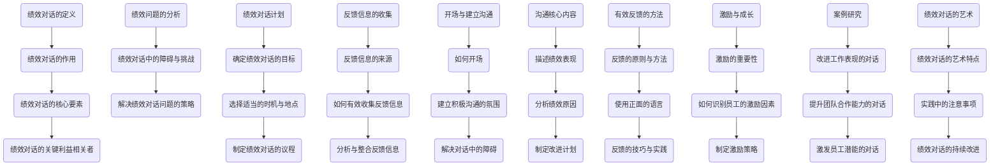
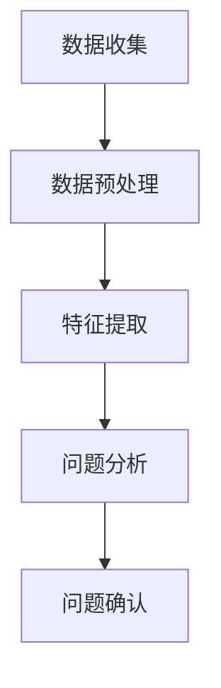

                 


## 绩效对话的艺术：有效反馈与激励

### 关键词

绩效对话、有效反馈、激励、企业管理、沟通技巧、员工成长

### 摘要

本文旨在探讨绩效对话的艺术，特别是有效反馈与激励在企业管理中的应用。通过分析绩效对话的定义、背景、重要性以及常见问题，本文将逐步介绍如何准备、进行以及优化绩效对话。同时，通过案例研究和实践技巧的分享，帮助读者掌握绩效对话的核心要素，提升团队绩效和员工满意度。

### 目录大纲

----------------------------------------------------------------

## 第一部分：理解绩效对话

### 第1章 绩效对话的背景与重要性
#### 1.1 绩效对话的定义与作用
#### 1.2 绩效对话在企业管理中的应用
#### 1.3 绩效对话的核心要素
#### 1.4 绩效对话的关键利益相关者

### 第2章 绩效对话中的问题与挑战
#### 2.1 常见绩效问题分析
#### 2.2 绩效对话中的障碍与挑战
#### 2.3 解决绩效对话问题的策略

## 第二部分：准备绩效对话

### 第3章 制定有效的绩效对话计划
#### 3.1 确定绩效对话的目标
#### 3.2 选择适当的时机与地点
#### 3.3 制定绩效对话的议程

### 第4章 收集反馈信息
#### 4.1 反馈信息的来源
#### 4.2 如何有效收集反馈信息
#### 4.3 分析与整合反馈信息

## 第三部分：进行绩效对话

### 第5章 开场与建立沟通
#### 5.1 如何开场
#### 5.2 建立积极沟通的氛围
#### 5.3 解决对话中的障碍

### 第6章 沟通核心内容
#### 6.1 描述绩效表现
#### 6.2 分析绩效原因
#### 6.3 制定改进计划

## 第四部分：优化与反馈

### 第7章 如何提供有效的反馈
#### 7.1 反馈的原则与方法
#### 7.2 使用正面的语言
#### 7.3 反馈的技巧与实践

### 第8章 激励与成长
#### 8.1 激励的重要性
#### 8.2 如何识别员工的激励因素
#### 8.3 制定激励策略

## 第五部分：绩效对话的艺术

### 第9章 案例研究：成功的绩效对话
#### 9.1 案例一：改进工作表现的对话
#### 9.2 案例二：提升团队合作能力的对话
#### 9.3 案例三：激发员工潜能的对话

### 第10章 绩效对话的艺术与实践
#### 10.1 绩效对话的艺术特点
#### 10.2 实践中的注意事项
#### 10.3 绩效对话的持续改进

### 第11章 总结与展望
#### 11.1 绩效对话的总结
#### 11.2 未来趋势与展望
#### 11.3 拓展阅读与资源推荐

----------------------------------------------------------------

### 核心概念原理、概念属性特征对比表格和ER实体关系图架构的 markdown 格式中的 Mermaid 流程图



### 算法原理讲解

#### 绩效对话中的问题识别算法

**算法原理**

在绩效对话中，识别和解决绩效问题是核心任务。以下是一个简化的算法原理，用于识别绩效问题：

1. **数据收集**：收集与绩效相关的数据，包括员工的工作表现、客户反馈、项目进度报告等。

2. **数据预处理**：清洗和整理收集到的数据，去除重复和不相关的信息。

3. **特征提取**：从预处理后的数据中提取关键特征，如任务完成率、工作效率、客户满意度等。

4. **问题分析**：使用统计分析和机器学习算法对提取的特征进行分析，识别出可能的绩效问题。

5. **问题确认**：与员工和相关利益相关者进行沟通，确认识别出的问题。

**Mermaid 流程图**



**Python 源代码示例**

```python
import pandas as pd
from sklearn.ensemble import RandomForestClassifier

# 数据收集
data = pd.read_csv('performance_data.csv')

# 数据预处理
data = data.drop_duplicates()
data = data[data['Task Completed'] != 'N/A']

# 特征提取
features = data[['Efficiency', 'Customer Satisfaction', 'Project Progress']]
labels = data['Performance Issue']

# 问题分析
model = RandomForestClassifier()
model.fit(features, labels)

# 问题确认
predictions = model.predict(features)
print(predictions)
```

**数学模型和公式**

- 绩效评分（Performance Score）: $$ PS = \frac{TP + TN}{TP + TN + FP + FN} $$，其中TP是任务完成数，TN是未完成的任务数，FP是误报的任务数，FN是漏报的任务数。
- 绩效指标（Performance Indicator）: $$ PI = \frac{PS}{100} $$。

**通俗易懂的举例说明**

假设我们收集了以下数据：

| Effi

