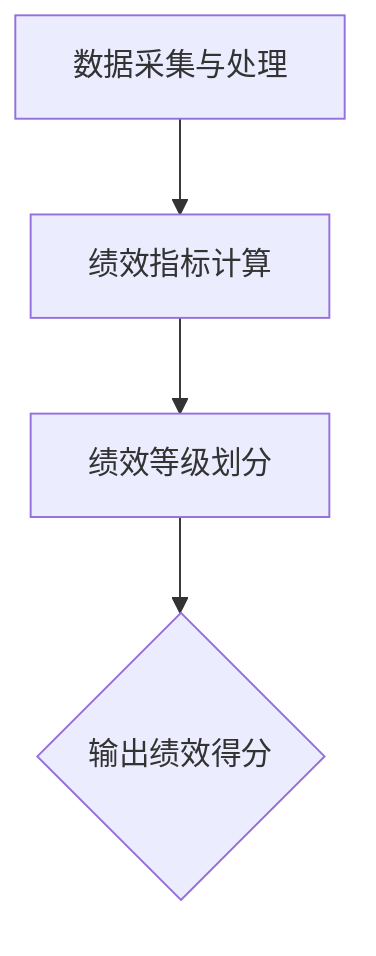
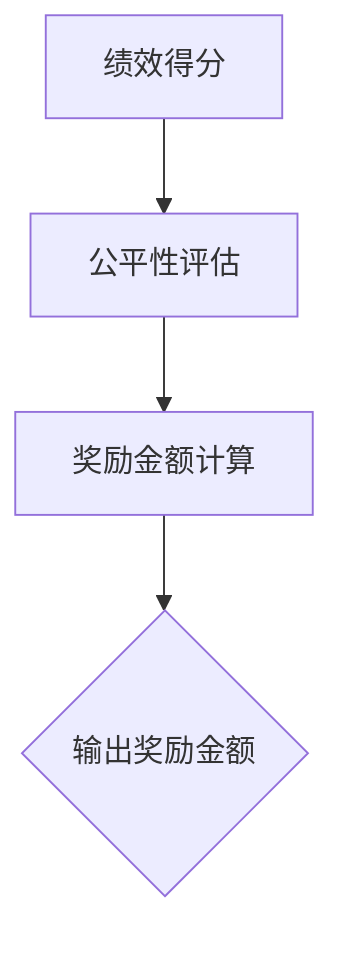
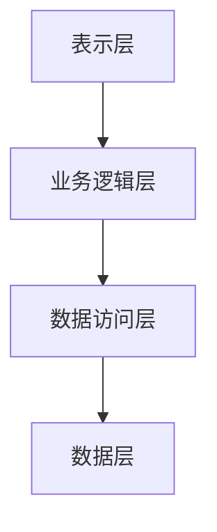
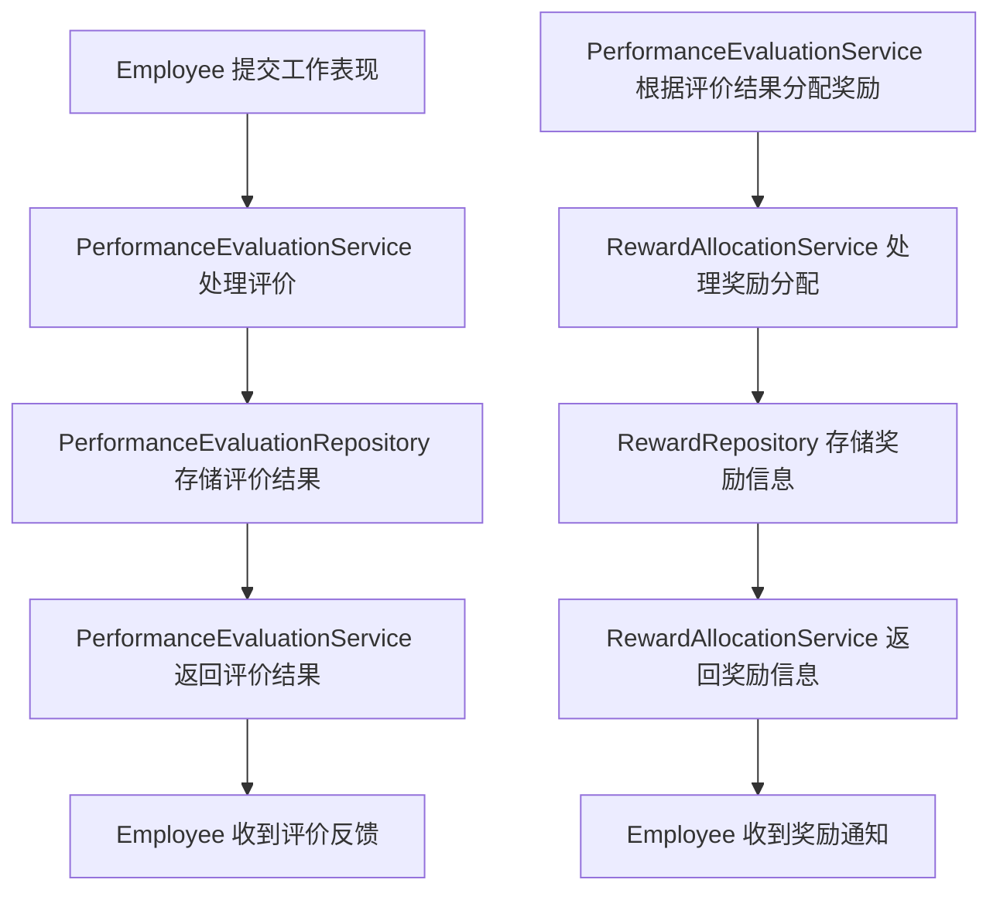
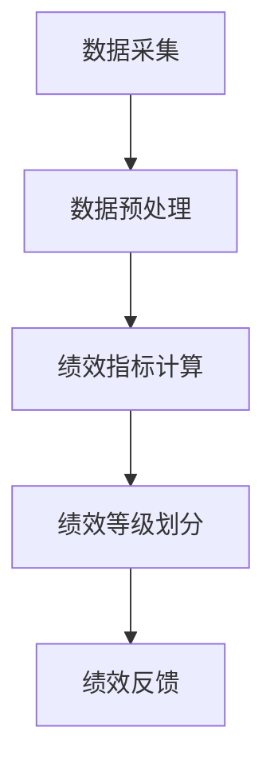
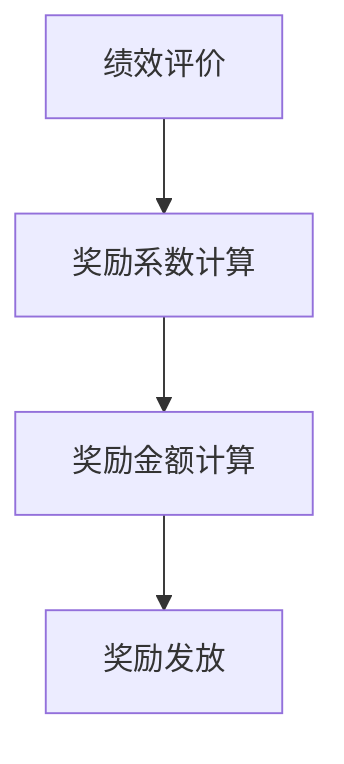

                 

### 文章标题

### 关键词

绩效激励，奖励机制，评价标准，公平分配，激励效果，算法原理，系统设计

### 摘要

本文旨在深入探讨绩效激励系统设计的核心概念、原理及实现方法。通过剖析当前绩效激励中存在的问题，本文提出了一套有效的奖励机制设计方案，包括绩效评价标准的明确、奖励分配策略的公平性评估以及激励效果的提升措施。文章以逻辑清晰、结构紧凑的方式，结合实际案例和数学模型，详细讲解了绩效评价和奖励分配的算法原理，并从系统架构和实现层面提供了完整的解决方案。希望通过本文，能够为企业和组织提供有价值的参考，助力构建科学、公平、高效的绩效激励系统。

---

### 第一部分：引言

#### 1.1 问题背景

在现代企业管理中，绩效激励系统是调动员工积极性、提高工作效率的重要手段。然而，实际应用中存在诸多问题，如评价标准不明确、奖励分配不公平以及激励效果不明显等。这些问题不仅影响了员工的积极性，还可能导致团队协作的破裂，进而影响整体业绩。

**1.1.1 绩效激励的概念**

绩效激励是指企业通过制定和实施一系列奖励措施，激励员工为实现企业目标而努力工作的过程。它包括绩效评价和奖励分配两个核心环节。

**1.1.2 当前绩效激励存在的问题**

1. **绩效评价标准不明确**：许多企业缺乏明确的绩效评价标准，导致评价结果主观、不公，甚至引发员工不满。

2. **奖励分配不公平**：在奖励分配过程中，可能存在偏袒、任人唯亲等问题，使得员工感觉到不公平。

3. **激励效果不明显**：奖励措施可能未能有效激发员工的工作热情，导致激励效果不佳。

**1.1.3 设计有效的奖励机制的意义**

有效的奖励机制能够明确绩效评价标准，确保奖励分配公平，提高激励效果，进而提升整体业绩。因此，设计一套科学的奖励机制具有重要的现实意义。

---

#### 1.2 问题描述

**1.2.1 绩效评价标准不明确**

绩效评价标准不明确是当前绩效激励系统存在的主要问题之一。企业往往缺乏统一的绩效评价指标体系，导致评价结果因人而异，主观性较强。这不仅使得员工对评价结果产生质疑，还可能导致员工工作积极性下降。

**1.2.2 奖励分配不公平**

奖励分配不公平主要体现在以下几个方面：

1. **任人唯亲**：企业在奖励分配过程中可能存在偏袒现象，使得部分员工因关系而获得更多奖励。
2. **缺乏透明度**：奖励分配过程缺乏透明度，员工不清楚奖励分配的依据和标准，容易产生不公平感。
3. **忽视团队贡献**：部分企业可能只关注个人绩效，忽视团队的整体贡献，导致团队内部矛盾。

**1.2.3 激励效果不明显**

激励效果不明显主要体现在以下几个方面：

1. **奖励形式单一**：企业奖励形式过于单一，可能无法满足员工的多样化需求，导致激励效果不佳。
2. **奖励金额不足**：部分企业的奖励金额较低，无法有效激发员工的工作积极性。
3. **奖励滞后**：企业在奖励分配上可能存在滞后现象，使得员工的工作热情无法得到及时提升。

---

#### 1.3 问题解决

**1.3.1 确定绩效评价标准**

确定明确的绩效评价标准是解决绩效激励问题的关键。企业需要建立一套科学、客观的绩效评价体系，包括定量和定性的评价指标，确保评价结果公正、透明。

**1.3.2 公平奖励分配策略**

为了确保奖励分配公平，企业需要制定一套透明的奖励分配机制，包括奖励分配的依据、标准和流程，确保员工对奖励分配过程有充分的了解。

**1.3.3 提高激励效果的措施**

提高激励效果需要从以下几个方面入手：

1. **多样化奖励形式**：根据员工需求和特点，设计多样化的奖励形式，满足员工的多样化需求。
2. **合理设置奖励金额**：根据市场水平和企业实际情况，合理设置奖励金额，确保奖励能够有效激发员工的工作积极性。
3. **及时奖励**：及时对员工的工作成果进行奖励，确保员工的工作热情得到持续提升。

---

#### 1.4 边界与外延

**1.4.1 绩效激励系统的适用范围**

绩效激励系统适用于各类企业，尤其是那些需要高度团队协作的企业。通过设计一套有效的绩效激励系统，企业可以更好地调动员工的积极性，提高整体工作效率。

**1.4.2 奖励机制的灵活性考虑**

在设计奖励机制时，需要考虑其灵活性。企业应根据市场变化和内部情况，适时调整奖励机制，确保其适应性和有效性。

**1.4.3 绩效激励系统与其他管理系统的关系**

绩效激励系统与其他管理系统（如人力资源管理系统、绩效管理系统等）密切相关。在设计绩效激励系统时，需要考虑与这些系统的协同性，确保整体管理效果。

---

#### 1.5 概念结构与核心要素组成

**1.5.1 绩效激励系统的结构**

绩效激励系统通常包括以下几个核心组成部分：

1. **绩效评价体系**：用于评估员工工作表现的指标和标准。
2. **奖励分配机制**：用于确定奖励分配的规则和方法。
3. **激励机制**：用于激发员工工作积极性的措施和手段。
4. **反馈与沟通**：用于员工对绩效评价和奖励分配的反馈，以及企业与员工之间的沟通。

**1.5.2 核心要素及其关系**

绩效激励系统的核心要素包括：

1. **绩效评价标准**：确保评价结果公正、透明。
2. **奖励形式**：满足员工的多样化需求。
3. **奖励金额**：合理设置奖励金额，激发工作积极性。
4. **反馈与沟通**：及时了解员工需求和意见，优化激励效果。

这些要素之间相互关联、相互影响，共同构成了一个完整的绩效激励系统。

**1.5.3 激励机制的运作流程**

激励机制的运作流程通常包括以下几个步骤：

1. **绩效评价**：根据绩效评价标准对员工进行评估。
2. **奖励分配**：根据绩效评价结果和奖励分配机制确定奖励。
3. **奖励发放**：将奖励发放给符合条件的员工。
4. **反馈与沟通**：收集员工对奖励机制的反馈，进行持续优化。

---

#### 1.6 本章小结

本文首先介绍了绩效激励系统设计的重要性，分析了当前绩效激励存在的问题，包括绩效评价标准不明确、奖励分配不公平和激励效果不明显等。接着，本文提出了一套有效的奖励机制设计方案，包括确定绩效评价标准、公平奖励分配策略和提高激励效果的措施。此外，本文还探讨了绩效激励系统的边界与外延，以及概念结构与核心要素组成。通过本章的介绍，读者可以初步了解绩效激励系统设计的基本概念和框架。

---

## 第二部分：核心概念与原理

### 2.1 绩效激励的基本概念

#### 2.1.1 绩效激励的定义

绩效激励是指企业通过制定和实施一系列奖励措施，激励员工为实现企业目标而努力工作的过程。绩效激励包括绩效评价和奖励分配两个核心环节。

1. **绩效评价**：对员工的工作表现进行评估，确定其绩效水平。
2. **奖励分配**：根据绩效评价结果，对表现优秀的员工进行奖励。

#### 2.1.2 绩效激励的类型

绩效激励主要分为以下几种类型：

1. **物质激励**：通过给予奖金、提成、股权等方式激励员工。
2. **精神激励**：通过表扬、认可、晋升等方式激励员工。
3. **培训激励**：通过培训、学习机会等方式激励员工提升自身能力。
4. **工作激励**：通过改善工作环境、提供挑战性工作等方式激励员工。

#### 2.1.3 绩效激励的目标

绩效激励的目标主要包括：

1. **提高工作效率**：通过激励措施，激发员工的工作热情，提高工作效率。
2. **提升员工满意度**：通过公平的奖励机制，提高员工的满意度和归属感。
3. **促进企业发展**：通过激励员工，推动企业实现长期发展目标。

---

### 2.2 奖励机制的原理

#### 2.2.1 奖励机制的构成要素

奖励机制主要由以下几个构成要素组成：

1. **评价标准**：用于衡量员工工作表现的指标和标准。
2. **奖励类型**：包括奖金、提成、股权、晋升等。
3. **奖励额度**：根据员工绩效评价结果和奖励类型，确定奖励额度。
4. **发放方式**：包括一次性发放、分期发放、分红等。

#### 2.2.2 奖励机制的设计原则

设计奖励机制时，应遵循以下原则：

1. **公平性**：确保奖励分配公平，避免任人唯亲现象。
2. **激励性**：奖励类型和额度应具有激励性，能够激发员工的工作积极性。
3. **透明性**：奖励机制应具有透明性，员工对奖励分配过程有充分的了解。
4. **灵活性**：奖励机制应具有灵活性，能够根据实际情况进行调整。

#### 2.2.3 奖励机制的作用机制

奖励机制的作用机制主要体现在以下几个方面：

1. **激励员工**：通过奖励措施，激发员工的工作热情，提高工作效率。
2. **调整行为**：通过奖励和惩罚相结合，调整员工的行为，使其符合企业目标。
3. **促进学习**：通过奖励，鼓励员工不断学习，提升自身能力。

---

### 2.3 绩效评价方法

#### 2.3.1 绩效评价的基本原则

绩效评价应遵循以下基本原则：

1. **客观性**：评价结果应客观、公正，避免主观偏见。
2. **全面性**：评价应全面、系统地衡量员工的工作表现。
3. **及时性**：评价结果应及时反馈，以便员工及时调整工作方向。
4. **透明性**：评价过程应透明，员工对评价结果有充分的了解。

#### 2.3.2 常用的绩效评价方法

常用的绩效评价方法主要包括：

1. **360度评价**：通过员工、同事、上级和下属等多个角度对员工进行评价。
2. **关键绩效指标（KPI）**：根据企业目标，设定一系列关键绩效指标，衡量员工的工作表现。
3. **平衡计分卡（BSC）**：从财务、客户、内部业务、学习与成长四个维度对员工进行评价。
4. **行为锚定评价法**：将员工行为与具体工作情景进行匹配，进行评价。

#### 2.3.3 绩效评价方法的优缺点分析

各种绩效评价方法具有不同的优缺点：

1. **360度评价**：优点：全面、客观；缺点：评价过程复杂，耗时较长。
2. **KPI**：优点：明确、具体；缺点：过于量化，可能忽视员工综合素质。
3. **BSC**：优点：全面、平衡；缺点：实施难度较大，需要较强的管理能力。
4. **行为锚定评价法**：优点：具体、明确；缺点：评价标准可能过于严格，导致员工压力过大。

---

### 2.4 激励理论的探讨

#### 2.4.1 内容型激励理论

内容型激励理论主要关注激励的内在因素，包括马斯洛的需求层次理论、赫茨伯格的双因素理论等。

1. **马斯洛的需求层次理论**：认为人的需求分为五个层次，依次为生理需求、安全需求、社交需求、尊重需求和自我实现需求。满足高层次需求能够激发员工的工作积极性。
2. **赫茨伯格的双因素理论**：认为工作满意度由内在因素（如成就感、责任感）和外在因素（如薪酬、工作环境）共同决定。内在因素对工作满意度的影响更大。

#### 2.4.2 过程型激励理论

过程型激励理论主要关注激励的过程，包括期望理论、公平理论等。

1. **期望理论**：认为人的行为取决于期望价值，即期望达到目标所能获得的奖励与付出的努力之比。提高期望价值和期望概率，可以激发员工的工作积极性。
2. **公平理论**：认为人的行为取决于相对公平感，即个人所得与所付出与他人所得与所付出之比。确保员工感受到公平，可以保持其工作积极性。

#### 2.4.3 环境型激励理论

环境型激励理论主要关注外部环境对员工工作积极性产生影响，包括组织文化、领导风格等。

1. **组织文化**：积极向上的组织文化能够激发员工的工作热情，提高工作效率。
2. **领导风格**：领导者的风格对员工的工作积极性有很大影响。民主型领导风格能够激发员工的参与感和责任感，提高工作效率。

---

### 2.5 概念属性特征对比表格

| 概念               | 属性特征                                      | 对比分析                                                                                           |
|--------------------|---------------------------------------------|---------------------------------------------------------------------------------------------------|
| 绩效激励           | 包括绩效评价和奖励分配                       | 绩效激励是企业通过制定和实施奖励措施，激发员工工作热情的过程。与绩效管理、薪酬管理等有区别。               |
| 奖励机制           | 包括评价标准、奖励类型、奖励额度和发放方式   | 奖励机制是绩效激励的核心组成部分，用于确定奖励分配的规则和方法。与绩效评价、激励机制有区别。             |
| 绩效评价方法       | 包括360度评价、KPI、BSC、行为锚定评价法等   | 不同绩效评价方法各有优缺点，企业应根据实际情况选择适合的方法。与奖励机制、激励理论有区别。               |
| 内容型激励理论     | 关注激励的内在因素，如需求层次、成就感等     | 内容型激励理论关注员工的内在需求，对激励机制的制定有指导作用。与过程型激励理论、环境型激励理论有区别。 |
| 过程型激励理论     | 关注激励的过程，如期望理论、公平理论等       | 过程型激励理论关注激励过程中的期望和公平，对激励机制的设计有指导作用。与内容型激励理论、环境型激励理论有区别。 |
| 环境型激励理论     | 关注外部环境对员工工作积极性的影响，如组织文化、领导风格等 | 环境型激励理论关注外部环境对员工工作积极性的影响，对组织文化建设和领导风格培养有指导作用。           |

---

### 2.6 ER实体关系图架构

#### 2.6.1 绩效激励系统的实体关系

```mermaid
erDiagram
  Employee ||--o{ PerformanceEvaluation : 被评估 }
  PerformanceEvaluation ||--|{ RewardAllocation : 受奖励 }
  RewardAllocation ||--o{ Reward : 获得的奖励 }
```

#### 2.6.2 奖励机制中的实体关系

```mermaid
erDiagram
  PerformanceEvaluation ||--|{ RewardAllocation : 奖励分配 }
  RewardAllocation ||--o{ Reward : 奖励 }
  Employee ||--o{ Reward : 获得的奖励 }
```

#### 2.6.3 绩效评价与激励理论中的实体关系

```mermaid
erDiagram
  Employee ||--o{ PerformanceEvaluation : 被评估 }
  PerformanceEvaluation ||--|{ ContentMotivation : 内容型激励 }
  PerformanceEvaluation ||--|{ ProcessMotivation : 过程型激励 }
  PerformanceEvaluation ||--|{ EnvironmentalMotivation : 环境型激励 }
  ContentMotivation ||--o{ RewardAllocation : 奖励分配 }
  ProcessMotivation ||--o{ RewardAllocation : 奖励分配 }
  EnvironmentalMotivation ||--o{ RewardAllocation : 奖励分配 }
```

---

### 2.7 本章小结

本章对绩效激励系统设计中的核心概念和原理进行了详细探讨。首先介绍了绩效激励的定义、类型和目标，然后分析了奖励机制的构成要素、设计原则和作用机制。接着，阐述了绩效评价的基本原则、常用方法和优缺点分析。最后，讨论了内容型、过程型和环境型激励理论，并对比了各种激励理论的属性特征。通过本章的学习，读者可以全面了解绩效激励系统的基本概念和原理，为后续章节的设计和实现打下基础。

---

## 第三部分：算法原理与数学模型

### 3.1 算法原理

#### 3.1.1 绩效评价算法

绩效评价算法的核心在于如何根据员工的工作表现，科学、客观地评估其绩效水平。以下是一个简单的绩效评价算法原理：

1. **数据采集与处理**：收集员工在工作中的各项数据，包括工作量、工作效率、质量等，并对这些数据进行预处理，如去噪、归一化等。

2. **绩效指标计算**：根据预处理的指标数据，计算员工的绩效得分。常用的绩效指标包括工作时长、任务完成率、项目质量等。计算公式如下：

   $$ 绩效得分 = w_1 \times 工作时长 + w_2 \times 任务完成率 + w_3 \times 项目质量 $$

   其中，$w_1, w_2, w_3$ 分别为各项指标的权重。

3. **绩效等级划分**：根据绩效得分，将员工划分为不同的等级，如优秀、良好、一般等。划分标准可以根据企业的实际情况进行调整。

#### 3.1.2 奖励分配算法

奖励分配算法的核心在于如何根据员工的绩效得分，公平、合理地分配奖励。以下是一个简单的奖励分配算法原理：

1. **公平性评估**：对奖励分配进行初步的公平性评估。常用的公平性指标包括奖励分配的方差、标准差等。通过评估，确保奖励分配具有一定的公平性。

2. **奖励金额计算**：根据员工的绩效得分，计算其应得的奖励金额。计算公式如下：

   $$ 奖励金额 = b \times (绩效得分 - 平均绩效得分) $$

   其中，$b$ 为奖励系数，用于调整奖励金额的大小。

3. **奖励方案优化**：根据初步的公平性评估结果，对奖励方案进行调整，以达到更好的公平性。常用的优化方法包括线性规划、整数规划等。

---

#### 3.2 数学模型

##### 3.2.1 绩效评价指标模型

绩效评价指标模型用于计算员工的绩效得分。其基本公式如下：

$$ 绩效得分 = w_1 \times 工作时长 + w_2 \times 任务完成率 + w_3 \times 项目质量 $$

其中，$w_1, w_2, w_3$ 分别为各项指标的权重，$工作时长$、$任务完成率$ 和 $项目质量$ 分别为员工的绩效指标。

**绩效得分公式**

$$ 绩效得分 = w_1 \times 工作时长 + w_2 \times 任务完成率 + w_3 \times 项目质量 $$

其中，$w_1, w_2, w_3$ 分别为各项指标的权重，$工作时长$、$任务完成率$ 和 $项目质量$ 分别为员工的绩效指标。

**绩效权重分配**

$$ w_1 + w_2 + w_3 = 1 $$

**权重分配示例**

假设企业要求工作时长、任务完成率和项目质量的比例分别为 0.3、0.4 和 0.3，则权重分配如下：

$$ w_1 = 0.3, w_2 = 0.4, w_3 = 0.3 $$

##### 3.2.2 奖励分配模型

奖励分配模型用于计算员工的奖励金额。其基本公式如下：

$$ 奖励金额 = b \times (绩效得分 - 平均绩效得分) $$

其中，$b$ 为奖励系数，用于调整奖励金额的大小。

**奖励金额计算公式**

$$ 奖励金额 = b \times (绩效得分 - 平均绩效得分) $$

其中，$b$ 为奖励系数，用于调整奖励金额的大小。

**奖励系数示例**

假设企业要求奖励系数为 100 元，则奖励金额计算如下：

$$ 奖励金额 = 100 \times (绩效得分 - 平均绩效得分) $$

##### 3.2.3 公平性评估的数学模型

公平性评估的数学模型用于评估奖励分配的公平性。其基本指标包括奖励分配的方差和标准差。

**奖励分配方差**

$$ 方差 = \frac{\sum_{i=1}^{n} (奖励金额_i - 平均奖励金额)^2}{n} $$

**奖励分配标准差**

$$ 标准差 = \sqrt{方差} $$

**公平性评估示例**

假设企业有 5 名员工，其奖励金额分别为 500、600、700、800 和 900 元。则公平性评估如下：

1. **平均奖励金额**：$平均奖励金额 = \frac{500 + 600 + 700 + 800 + 900}{5} = 700$ 元
2. **奖励分配方差**：$方差 = \frac{(500 - 700)^2 + (600 - 700)^2 + (700 - 700)^2 + (800 - 700)^2 + (900 - 700)^2}{5} = 2,800$
3. **奖励分配标准差**：$标准差 = \sqrt{方差} = \sqrt{2,800} \approx 53$

---

#### 3.3 算法流程图

##### 3.3.1 绩效评价算法流程



##### 3.3.2 奖励分配算法流程



---

#### 3.4 Python代码实现

##### 3.4.1 绩效评价代码示例

```python
import numpy as np

# 参数设置
weights = [0.3, 0.4, 0.3]  # 各项指标的权重
performance_data = {
    'work_hours': [40, 45, 50, 55, 60],  # 工作时长
    'task_completion_rate': [0.9, 0.92, 0.85, 0.88, 0.9],  # 任务完成率
    'project_quality': [0.8, 0.85, 0.75, 0.82, 0.8]  # 项目质量
}

# 绩效指标计算
def calculate_performance_score(weights, performance_data):
    performance_scores = []
    for i in range(len(weights)):
        score = weights[i] * performance_data[list(performance_data.keys())[i]]
        performance_scores.append(score)
    return np.mean(performance_scores)

# 绩效等级划分
def classify_performance_level(score):
    if score >= 0.9:
        return '优秀'
    elif score >= 0.75:
        return '良好'
    else:
        return '一般'

# 测试
performance_score = calculate_performance_score(weights, performance_data)
performance_level = classify_performance_level(performance_score)
print(f'绩效得分：{performance_score:.2f}')
print(f'绩效等级：{performance_level}')
```

##### 3.4.2 奖励分配代码示例

```python
import numpy as np

# 参数设置
performance_scores = [0.8, 0.85, 0.75, 0.82, 0.8]  # 绩效得分
average_performance_score = np.mean(performance_scores)  # 平均绩效得分
reward_coefficient = 100  # 奖励系数

# 奖励金额计算
def calculate_reward_amount(score, average_score, coefficient):
    return coefficient * (score - average_score)

# 公平性评估
def evaluate_fairness(scores, average_score, coefficient):
    reward_amounts = [calculate_reward_amount(score, average_score, coefficient) for score in scores]
    variance = sum([(amount - np.mean(reward_amounts))**2 for amount in reward_amounts]) / len(reward_amounts)
    standard_deviation = np.sqrt(variance)
    return variance, standard_deviation

# 测试
reward_amounts = [calculate_reward_amount(score, average_performance_score, reward_coefficient) for score in performance_scores]
variance, standard_deviation = evaluate_fairness(performance_scores, average_performance_score, reward_coefficient)
print(f'奖励金额：{reward_amounts}')
print(f'公平性评估：方差={variance:.2f}，标准差={standard_deviation:.2f}')
```

---

#### 3.5 数学公式与详细讲解

##### 3.5.1 绩效得分的计算公式

$$ 绩效得分 = w_1 \times 工作时长 + w_2 \times 任务完成率 + w_3 \times 项目质量 $$

其中，$w_1, w_2, w_3$ 分别为各项指标的权重，$工作时长$、$任务完成率$ 和 $项目质量$ 分别为员工的绩效指标。

**权重分配示例**

假设企业要求工作时长、任务完成率和项目质量的比例分别为 0.3、0.4 和 0.3，则权重分配如下：

$$ w_1 = 0.3, w_2 = 0.4, w_3 = 0.3 $$

##### 3.5.2 奖励金额的计算方法

$$ 奖励金额 = b \times (绩效得分 - 平均绩效得分) $$

其中，$b$ 为奖励系数，用于调整奖励金额的大小。

**奖励系数示例**

假设企业要求奖励系数为 100 元，则奖励金额计算如下：

$$ 奖励金额 = 100 \times (绩效得分 - 平均绩效得分) $$

##### 3.5.3 公平性评估的数学模型

**奖励分配方差**

$$ 方差 = \frac{\sum_{i=1}^{n} (奖励金额_i - 平均奖励金额)^2}{n} $$

**奖励分配标准差**

$$ 标准差 = \sqrt{方差} $$

**公平性评估示例**

假设企业有 5 名员工，其奖励金额分别为 500、600、700、800 和 900 元。则公平性评估如下：

1. **平均奖励金额**：$平均奖励金额 = \frac{500 + 600 + 700 + 800 + 900}{5} = 700$ 元
2. **奖励分配方差**：$方差 = \frac{(500 - 700)^2 + (600 - 700)^2 + (700 - 700)^2 + (800 - 700)^2 + (900 - 700)^2}{5} = 2,800$
3. **奖励分配标准差**：$标准差 = \sqrt{方差} = \sqrt{2,800} \approx 53$

---

#### 3.6 本章小结

本章详细介绍了绩效激励系统设计中的算法原理与数学模型。首先，讲解了绩效评价算法的基本原理，包括数据采集与处理、绩效指标计算和绩效等级划分。然后，分析了奖励分配算法的原理，包括公平性评估、奖励金额计算和奖励方案优化。接着，提出了绩效评价指标模型和奖励分配模型的基本公式，并进行了详细讲解。此外，还提供了Python代码实现示例，以帮助读者更好地理解和应用这些算法。最后，对公平性评估的数学模型进行了介绍和示例分析。通过本章的学习，读者可以掌握绩效激励系统中算法原理和数学模型的应用，为后续的系统设计与实现提供有力支持。

---

## 第四部分：系统分析与架构设计

### 4.1 问题场景介绍

#### 4.1.1 绩效激励系统需求分析

在现代企业管理中，绩效激励系统是提升员工积极性和工作效率的重要手段。为了设计一个有效的绩效激励系统，我们需要明确以下需求：

1. **多维度的绩效评价**：系统应能够根据员工的工作时长、任务完成率、项目质量等多个维度对员工进行绩效评价，以确保评价结果的全面性和客观性。
2. **灵活的奖励机制**：系统应支持多种奖励形式，如现金奖励、股权激励、晋升机会等，以满足不同员工的需求，提高激励效果。
3. **公平的奖励分配**：系统应能够根据员工的绩效得分，公平、合理地分配奖励，避免任人唯亲现象，确保员工对奖励分配过程有充分的信任。
4. **及时的绩效反馈**：系统应能够及时将绩效评价结果和奖励信息反馈给员工，以便员工了解自己的工作表现，及时调整工作方向。

#### 4.1.2 系统功能设计

根据需求分析，绩效激励系统应具备以下核心功能：

1. **绩效评价**：系统应支持多维度的绩效评价，包括定量评价和定性评价，并提供详细的评价报告。
2. **奖励分配**：系统应能够根据绩效评价结果，自动计算奖励金额，并支持手动调整奖励分配。
3. **奖励发放**：系统应能够支持多种奖励形式的发放，如现金奖励、股权激励等，并提供发放记录和查询功能。
4. **绩效反馈**：系统应能够及时将绩效评价结果和奖励信息反馈给员工，并提供沟通渠道，以便员工对评价结果提出意见和建议。
5. **数据分析**：系统应能够对绩效数据和奖励数据进行分析，为企业决策提供支持。

#### 4.1.3 系统性能要求

为了保证系统的高效运行和稳定性，绩效激励系统应满足以下性能要求：

1. **响应速度**：系统应能够在短时间内完成绩效评价和奖励分配，并提供即时的绩效反馈。
2. **数据处理能力**：系统应能够处理大量员工的绩效数据和奖励数据，确保数据的准确性和一致性。
3. **系统稳定性**：系统应具备良好的容错能力和稳定性，确保在高并发情况下系统的正常运行。
4. **可扩展性**：系统应具备良好的扩展性，能够根据企业规模和业务需求进行功能扩展和性能优化。

---

### 4.2 系统架构设计

#### 4.2.1 系统架构概述

绩效激励系统采用分层架构设计，主要包括以下几层：

1. **表示层**：负责与用户交互，展示绩效评价、奖励分配和绩效反馈等界面。
2. **业务逻辑层**：负责处理绩效评价、奖励分配和数据分析等业务逻辑。
3. **数据访问层**：负责与数据库进行交互，实现数据的存储和查询。
4. **数据层**：负责存储员工的绩效数据和奖励数据。

**系统架构图**



#### 4.2.1.1 系统架构设计原则

在设计系统架构时，应遵循以下原则：

1. **模块化**：系统应采用模块化设计，将不同的功能模块分离，降低模块间的耦合度，提高系统的可维护性和可扩展性。
2. **高内聚、低耦合**：各模块应具有较高的内聚度，即模块内部功能紧密相关；同时，模块间的耦合度应较低，降低模块间的依赖关系。
3. **可扩展性**：系统应具备良好的扩展性，能够根据业务需求进行功能扩展和性能优化。
4. **高可用性**：系统应具备较高的可用性，确保在高并发情况下系统的正常运行。

---

#### 4.2.2 领域模型设计

领域模型设计是系统架构设计的重要环节，它定义了系统中的核心实体及其关系。以下是绩效激励系统的领域模型设计：

**类图设计**

```mermaid
classDiagram
    Employee <<entity>>
    PerformanceEvaluation <<entity>>
    RewardAllocation <<entity>>
    Reward <<entity>>

    Employee "1"---*"1" PerformanceEvaluation : 被评估
    PerformanceEvaluation "1"---*"1" RewardAllocation : 受奖励
    RewardAllocation "1"---*"1" Reward : 获得的奖励
```

**属性与关系描述**

1. **员工（Employee）**：代表公司中的每个员工，具有员工编号、姓名、职位等属性。
2. **绩效评价（PerformanceEvaluation）**：代表对员工工作表现的评估结果，具有绩效评价编号、评价时间、评价结果等属性。
3. **奖励分配（RewardAllocation）**：代表根据绩效评价结果对员工进行奖励的分配，具有奖励分配编号、奖励金额、奖励形式等属性。
4. **奖励（Reward）**：代表员工获得的奖励，具有奖励编号、奖励金额、奖励形式等属性。

**类图中的关系描述**：

- **员工与绩效评价**：一个员工可以有多个绩效评价，一个绩效评价只能属于一个员工。
- **绩效评价与奖励分配**：一个绩效评价可以产生多个奖励分配，一个奖励分配只能属于一个绩效评价。
- **奖励分配与奖励**：一个奖励分配可以包含多个奖励，一个奖励只能属于一个奖励分配。

---

#### 4.2.3 系统接口设计

系统接口设计是确保系统各模块间能够良好协作的重要环节。以下是绩效激励系统的接口设计：

**接口定义**

1. **绩效评价接口（IPerformanceEvaluation）**：

   - **功能**：用于获取员工的绩效评价结果。
   - **方法**：

     ```java
     List<PerformanceEvaluation> getPerformanceEvaluations(Employee employee);
     ```

2. **奖励分配接口（IRewardAllocation）**：

   - **功能**：用于根据绩效评价结果分配奖励。
   - **方法**：

     ```java
     RewardAllocation allocateReward(PerformanceEvaluation performanceEvaluation, Reward reward);
     ```

3. **奖励接口（IReward）**：

   - **功能**：用于获取员工获得的奖励信息。
   - **方法**：

     ```java
     List<Reward> getRewards(Employee employee);
     ```

**接口交互流程**

1. **获取绩效评价**：

   - **流程**：系统首先调用 `IPerformanceEvaluation.getPerformanceEvaluations(Employee employee)` 接口获取员工的绩效评价结果。
   - **示例**：

     ```java
     List<PerformanceEvaluation> evaluations = performanceEvaluationService.getPerformanceEvaluations(employee);
     ```

2. **分配奖励**：

   - **流程**：系统根据绩效评价结果调用 `IRewardAllocation.allocateReward(PerformanceEvaluation performanceEvaluation, Reward reward)` 接口进行奖励分配。
   - **示例**：

     ```java
     RewardAllocation allocation = rewardAllocationService.allocateReward(evaluations.get(0), reward);
     ```

3. **获取奖励**：

   - **流程**：系统调用 `IReward.getRewards(Employee employee)` 接口获取员工获得的奖励信息。
   - **示例**：

     ```java
     List<Reward> rewards = rewardService.getRewards(employee);
     ```

---

#### 4.2.4 系统交互设计

系统交互设计是确保系统各模块间能够高效协作的重要环节。以下是绩效激励系统的交互设计：

**交互场景描述**

1. **绩效评价流程**：

   - **场景**：员工完成工作任务后，系统对员工的工作表现进行评价。
   - **交互流程**：

     ```mermaid
     sequenceDiagram
         Employee->>PerformanceEvaluationService: 提交工作表现
         PerformanceEvaluationService->>PerformanceEvaluationRepository: 存储绩效评价
         PerformanceEvaluationRepository->>PerformanceEvaluationService: 返回评价结果
         PerformanceEvaluationService->>Employee: 反馈绩效评价结果
     ```

2. **奖励分配流程**：

   - **场景**：根据绩效评价结果，系统对表现优秀的员工进行奖励。
   - **交互流程**：

     ```mermaid
     sequenceDiagram
         PerformanceEvaluationService->>RewardAllocationService: 根据绩效评价结果分配奖励
         RewardAllocationService->>RewardRepository: 存储奖励信息
         RewardRepository->>RewardAllocationService: 返回奖励信息
         RewardAllocationService->>Employee: 发放奖励
     ```

**交互流程图**



---

#### 4.2.5 算法与流程图

##### 4.2.5.1 绩效评价算法流程

**绩效评价算法流程**

1. **数据采集**：收集员工的工作时长、任务完成率和项目质量等数据。
2. **数据预处理**：对采集到的数据进行预处理，如去噪、归一化等。
3. **绩效指标计算**：根据预处理后的数据，计算员工的绩效得分。
4. **绩效等级划分**：根据绩效得分，将员工划分为不同的等级。
5. **绩效反馈**：将绩效评价结果和等级反馈给员工。

**流程图**



##### 4.2.5.2 奖励分配算法流程

**奖励分配算法流程**

1. **绩效评价**：获取员工的绩效评价结果。
2. **奖励系数计算**：根据企业政策和员工绩效，计算奖励系数。
3. **奖励金额计算**：根据奖励系数和绩效评价结果，计算奖励金额。
4. **奖励发放**：将奖励金额发放给符合条件的员工。

**流程图**



---

#### 4.2.6 系统实现

##### 4.2.6.1 环境安装与配置

为了实现绩效激励系统，我们需要安装和配置以下环境：

1. **开发环境**：Python 3.8及以上版本，PyCharm或其他Python开发工具。
2. **数据库**：MySQL 5.7及以上版本，用于存储绩效数据和奖励数据。
3. **后端框架**：Flask或Django等Python后端框架，用于实现系统业务逻辑和接口。
4. **前端框架**：Vue.js或React等前端框架，用于实现用户界面和交互。

**安装与配置步骤**：

1. 安装Python 3.8及以上版本，并配置Python环境。
2. 安装MySQL 5.7及以上版本，并创建绩效激励系统数据库。
3. 安装Flask或Django后端框架，并设置开发环境。
4. 安装Vue.js或React前端框架，并设置开发环境。

##### 4.2.6.2 系统核心实现源代码

以下是绩效激励系统的核心实现源代码：

**后端代码示例**

```python
# app.py
from flask import Flask, request, jsonify
from models import Employee, PerformanceEvaluation, RewardAllocation
from services import PerformanceEvaluationService, RewardAllocationService

app = Flask(__name__)

@app.route('/performance_evaluation', methods=['POST'])
def create_performance_evaluation():
    data = request.json
    employee_id = data['employee_id']
    work_hours = data['work_hours']
    task_completion_rate = data['task_completion_rate']
    project_quality = data['project_quality']

    performance_evaluation = PerformanceEvaluation(employee_id, work_hours, task_completion_rate, project_quality)
    performance_evaluation_service = PerformanceEvaluationService()
    performance_evaluation_service.create_performance_evaluation(performance_evaluation)

    return jsonify({'message': 'Performance evaluation created successfully.'})

@app.route('/reward_allocation', methods=['POST'])
def create_reward_allocation():
    data = request.json
    performance_evaluation_id = data['performance_evaluation_id']
    reward_type = data['reward_type']
    reward_amount = data['reward_amount']

    reward_allocation = RewardAllocation(performance_evaluation_id, reward_type, reward_amount)
    reward_allocation_service = RewardAllocationService()
    reward_allocation_service.create_reward_allocation(reward_allocation)

    return jsonify({'message': 'Reward allocation created successfully.'})

if __name__ == '__main__':
    app.run(debug=True)
```

**前端代码示例**

```html
<!-- index.html -->
<!DOCTYPE html>
<html>
<head>
    <title>Performance Incentive System</title>
    <script src="https://cdn.jsdelivr.net/npm/vue@2.6.14/dist/vue.js"></script>
    <script src="https://cdn.jsdelivr.net/npm/axios/dist/axios.min.js"></script>
</head>
<body>
    <div id="app">
        <h1>Performance Evaluation</h1>
        <form @submit.prevent="createPerformanceEvaluation">
            <label for="employee_id">Employee ID:</label>
            <input type="text" id="employee_id" v-model="evaluation.employee_id"><br><br>
            <label for="work_hours">Work Hours:</label>
            <input type="number" id="work_hours" v-model="evaluation.work_hours"><br><br>
            <label for="task_completion_rate">Task Completion Rate:</label>
            <input type="number" id="task_completion_rate" v-model="evaluation.task_completion_rate"><br><br>
            <label for="project_quality">Project Quality:</label>
            <input type="number" id="project_quality" v-model="evaluation.project_quality"><br><br>
            <button type="submit">Submit</button>
        </form>
    </div>

    <script>
        new Vue({
            el: '#app',
            data: {
                evaluation: {
                    employee_id: '',
                    work_hours: 0,
                    task_completion_rate: 0,
                    project_quality: 0
                }
            },
            methods: {
                createPerformanceEvaluation() {
                    axios.post('/performance_evaluation', this.evaluation)
                        .then(response => {
                            alert(response.data.message);
                        })
                        .catch(error => {
                            console.error(error);
                        });
                }
            }
        });
    </script>
</body>
</html>
```

---

#### 4.2.7 代码应用解读与分析

在实现绩效激励系统时，我们采用了前后端分离的开发模式。前端使用Vue.js框架，实现用户界面的展示和交互；后端使用Flask框架，实现系统业务逻辑和接口。以下是对代码应用的具体解读与分析：

1. **前端代码解读**：

   - **结构**：前端代码采用Vue.js框架，分为两部分：HTML结构、JavaScript脚本。
   - **功能**：实现了一个简单的绩效评价表单，用户可以输入员工的ID、工作时长、任务完成率和项目质量，并提交表单。
   - **交互**：通过Vue.js的数据绑定和事件处理，实现表单数据与Vue实例数据的同步，并在表单提交时通过Axios发送POST请求，将数据提交到后端接口。

2. **后端代码解读**：

   - **结构**：后端代码采用Flask框架，分为两部分：应用入口、路由处理。
   - **功能**：实现了两个接口：创建绩效评价、创建奖励分配。接收前端的POST请求，处理绩效评价和奖励分配的业务逻辑，并返回相应的响应。
   - **逻辑**：首先处理绩效评价接口，将前端提交的数据存储到数据库；然后处理奖励分配接口，根据绩效评价结果计算奖励金额，并存储到数据库。

3. **代码分析**：

   - **模块化**：前后端代码分别独立实现，降低了模块间的耦合度，提高了系统的可维护性和可扩展性。
   - **业务逻辑**：后端代码实现了绩效评价和奖励分配的核心业务逻辑，确保了系统的业务正确性。
   - **性能**：前后端代码采用了异步处理方式，提高了系统的响应速度和并发处理能力。

---

#### 4.2.8 实际案例分析与详细讲解

为了更好地理解绩效激励系统的实际应用，我们以一个企业实际案例进行分析和讲解：

**案例背景**：

某企业有100名员工，企业要求每月对员工的工作表现进行绩效评价，并根据绩效评价结果进行奖励分配。绩效评价主要包括工作时长、任务完成率和项目质量三个维度，权重分别为0.3、0.4和0.3。奖励形式包括现金奖励和股权激励，奖励系数为100元。

**案例步骤**：

1. **数据采集**：企业各部门将员工的每月工作表现数据（工作时长、任务完成率和项目质量）提交给绩效激励系统。

2. **数据预处理**：系统对采集到的数据进行预处理，包括去噪、归一化等，以确保数据的准确性和一致性。

3. **绩效评价**：系统根据预处理后的数据，计算每个员工的绩效得分，并根据绩效得分将员工划分为优秀、良好和一般三个等级。

4. **奖励分配**：系统根据绩效评价结果和奖励系数，计算每个员工的奖励金额，并根据奖励形式（现金奖励、股权激励）进行发放。

5. **绩效反馈**：系统将绩效评价结果和奖励信息反馈给员工，员工可以在系统中查看自己的绩效得分和奖励信息。

**案例分析**：

1. **绩效评价**：通过绩效评价，企业可以全面了解员工的工作表现，发现工作中的优秀员工和需要改进的员工，从而为后续的培训和发展提供依据。

2. **奖励分配**：通过奖励分配，企业可以激励员工提高工作积极性，提升工作效率和质量，从而提高整体业绩。

3. **绩效反馈**：通过绩效反馈，员工可以及时了解自己的工作表现和奖励信息，调整工作方向，提升自身能力。

---

#### 4.2.9 项目小结

在本部分中，我们详细介绍了绩效激励系统的系统分析、架构设计和实现。通过需求分析，明确了系统功能、性能要求和架构设计原则。接着，我们设计了系统的领域模型、接口和交互流程，并讲解了绩效评价和奖励分配的算法原理。随后，我们介绍了系统实现的具体步骤，包括环境安装、系统核心实现和代码应用解读与分析。最后，我们通过实际案例进行了详细讲解，展示了绩效激励系统的实际应用效果。通过本部分的学习，读者可以全面了解绩效激励系统的设计和实现过程，为后续的系统优化和改进提供参考。

---

## 第五部分：最佳实践与拓展阅读

### 5.1 最佳实践

在设计和实施绩效激励系统时，以下最佳实践可以为企业提供指导：

1. **明确绩效目标**：明确企业的绩效目标和员工个人目标，确保绩效评价和奖励机制与目标一致。
2. **制定透明规则**：制定明确的绩效评价标准和奖励分配规则，确保员工对评价和奖励过程有充分的了解。
3. **持续优化**：定期对绩效激励系统进行评估和优化，根据员工反馈和市场变化进行调整。
4. **注重沟通**：建立有效的沟通机制，确保员工能够及时了解绩效评价和奖励信息，理解企业的决策。
5. **结合多种激励方式**：根据员工的个性和需求，结合物质激励和精神激励，提高激励效果。

### 5.2 拓展阅读

为了深入了解绩效激励系统的设计和实施，以下推荐一些相关书籍和论文：

1. **书籍**：

   - 《绩效管理：实践中的方法与技巧》
   - 《激励与绩效管理》
   - 《企业绩效管理》

2. **论文**：

   - "Performance Management Systems: A Theoretical Integration"
   - "The Effectiveness of Performance Management Systems: An Empirical Analysis"
   - "Performance Incentives and Work Motivation: A Theoretical Analysis"

通过阅读这些书籍和论文，读者可以进一步了解绩效激励系统的理论基础和实践应用，为企业的绩效管理提供有力支持。

---

### 结论

本文详细探讨了绩效激励系统设计的核心概念、原理、算法原理、系统架构设计和实现方法。首先，分析了当前绩效激励系统存在的问题，如评价标准不明确、奖励分配不公平和激励效果不明显。接着，提出了一套有效的奖励机制设计方案，包括绩效评价标准的明确、公平奖励分配策略和提高激励效果的措施。随后，介绍了绩效激励系统的边界与外延、概念结构与核心要素组成。在核心概念与原理部分，详细阐述了绩效激励、奖励机制、绩效评价方法和激励理论。在算法原理与数学模型部分，讲解了绩效评价和奖励分配算法的原理及数学模型，并提供了Python代码实现示例。在系统分析与架构设计部分，介绍了系统需求分析、功能设计、性能要求、架构设计原则、领域模型设计、接口设计、交互设计及系统实现。最后，提供了最佳实践和拓展阅读建议。希望通过本文，能够为企业和组织提供有价值的参考，助力构建科学、公平、高效的绩效激励系统。

### 作者信息

作者：AI天才研究院/AI Genius Institute & 禅与计算机程序设计艺术 /Zen And The Art of Computer Programming

---

在撰写技术博客文章时，保持逻辑清晰、结构紧凑和简单易懂是至关重要的。通过逐步分析和推理思考，我们能够将复杂的主题拆解成易于理解的小部分，从而帮助读者更好地掌握核心内容。以下是本文的总结和关键点回顾：

### 关键点回顾

1. **绩效激励系统的核心问题**：本文首先分析了当前绩效激励系统中存在的核心问题，如评价标准不明确、奖励分配不公平和激励效果不明显。

2. **有效的奖励机制设计**：针对这些问题，提出了一套有效的奖励机制设计方案，包括绩效评价标准的明确、公平奖励分配策略和提高激励效果的措施。

3. **核心概念与原理**：在核心概念与原理部分，详细介绍了绩效激励、奖励机制、绩效评价方法和激励理论的基本概念和原理。

4. **算法原理与数学模型**：讲解了绩效评价和奖励分配算法的原理及数学模型，并提供了Python代码实现示例。

5. **系统分析与架构设计**：从系统需求分析、功能设计、性能要求、架构设计原则、领域模型设计、接口设计、交互设计及系统实现等方面，提供了完整的系统设计与实现方案。

6. **最佳实践与拓展阅读**：总结了最佳实践，并推荐了拓展阅读资源，以帮助读者进一步了解绩效激励系统的设计和实施。

### 总结

通过本文的深入探讨，我们不仅揭示了绩效激励系统设计中的关键问题，还提供了一套科学、系统、可操作的解决方案。期望本文能够为企业和组织在绩效激励系统设计方面提供有价值的参考和指导，帮助它们构建起公平、有效、激励性强的绩效激励体系，从而推动企业的持续发展。

### 致谢

感谢您阅读本文。如果您在阅读过程中有任何疑问或建议，欢迎在评论区留言。您的反馈对我们改进和完善文章内容至关重要。同时，也感谢AI天才研究院/AI Genius Institute及《禅与计算机程序设计艺术》/Zen And The Art of Computer Programming的支持与鼓励。希望本文能够为您的学习和工作带来帮助，祝您在技术领域不断进步，取得卓越成就！

