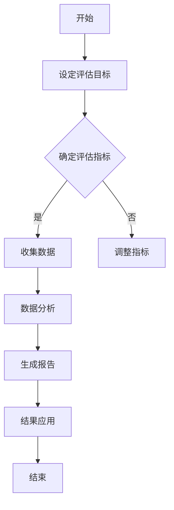
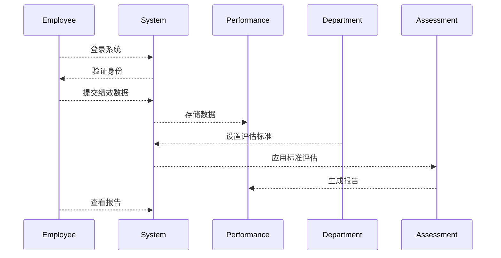
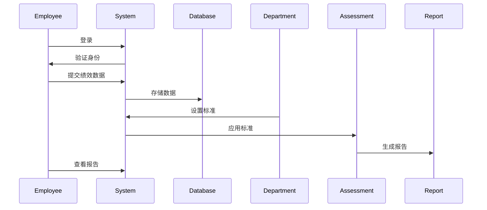

                 

### 摘要

绩效评估是企业管理中至关重要的一环，旨在公正、客观地评价团队成员的工作表现，以提升团队整体效率和企业竞争力。本文将从基础理论、方法工具、评估流程、问题挑战、应用实践、改进优化以及未来发展趋势等方面，全面探讨绩效评估在企业管理中的应用。通过本文的阅读，读者将深入了解绩效评估的核心概念、实施方法及其在实际操作中的问题与解决策略，从而为企业的绩效管理提供有益的参考。本文不仅提供了系统的理论框架，还结合实际案例，详细解析了绩效评估在实际应用中的操作细节，帮助读者在实际工作中更好地应用绩效评估工具和方法。

---

## 绩效评估：公正评价团队成员

### 关键词

绩效评估、团队管理、公正性、数据分析、方法工具、流程优化、人工智能应用、企业竞争力

---

### 摘要

绩效评估是企业提升团队效率和管理水平的重要手段。本文详细探讨了绩效评估的定义、分类、方法和工具，以及评估流程中的关键步骤和问题挑战。通过结合实际案例和最佳实践，本文提出了绩效评估体系的优化策略和未来发展趋势，旨在为企业提供公正评价团队成员的实践指导。

---

### 背景介绍

#### 核心概念术语说明

在绩效评估的背景下，我们需要明确几个关键术语：

1. **绩效评估**：一种通过系统化方法，评价员工在工作中的表现，以促进个人和团队发展，并支持企业战略目标实现的过程。
2. **团队成员**：在绩效评估中，指的是企业的各个层级员工，包括经理、主管、技术人员和普通员工。
3. **公正性**：绩效评估过程中应保持客观、公平，避免主观偏见和人为干扰。
4. **数据准确性**：评估过程中依赖的数据和信息应真实、准确，以确保评估结果的可靠性。
5. **评估工具**：用于绩效评估的方法和工具，如360度反馈、关键绩效指标（KPI）、行为事件访谈（BEI）等。

#### 问题背景

绩效评估在现代企业管理中扮演着重要角色。首先，它有助于激发员工的工作热情和积极性，通过明确的目标和期望，引导员工努力达成组织目标。其次，绩效评估为薪酬调整、晋升和职业发展规划提供了依据，有助于建立公平合理的激励机制。然而，绩效评估在实践中也面临诸多挑战，如评估标准的统一性、评估者的主观偏见、数据收集的难度等。

#### 问题描述

绩效评估的问题主要包括：

1. **评估标准不统一**：不同部门、不同岗位的评估标准各异，难以实现企业整体绩效的提升。
2. **主观偏见**：评估者可能基于个人喜好、关系等因素影响评估结果，导致不公平现象。
3. **数据收集困难**：准确、全面的数据收集是绩效评估的基础，但实际操作中往往存在信息不完整、不及时等问题。
4. **评估结果应用不当**：评估结果未能有效转化为改进措施，导致评估流于形式，未能达到预期效果。

#### 问题解决

为了解决上述问题，我们需要：

1. **制定统一评估标准**：确保各部门、各岗位的评估标准一致性，明确评估指标和权重。
2. **减少主观偏见**：通过匿名评估、多角度反馈等方式，降低评估过程中的主观偏见。
3. **优化数据收集**：借助信息技术，建立完善的数据收集系统，提高数据的准确性和完整性。
4. **合理应用评估结果**：将评估结果转化为具体的改进措施，指导员工提升绩效。

#### 边界与外延

绩效评估不仅限于员工个人绩效评价，还可以应用于团队绩效、部门绩效和企业整体绩效评估。此外，绩效评估的应用场景还包括新员工入职评估、员工晋升评估、绩效改进培训等。绩效评估的影响范围涵盖个人发展、团队协作、企业竞争力等多个层面。

#### 概念结构与核心要素组成

绩效评估的核心结构包括：

1. **评估目标**：明确绩效评估的目的和预期成果。
2. **评估指标**：定义评估的具体指标和标准。
3. **评估方法**：选择合适的评估工具和方法。
4. **评估流程**：制定详细的评估步骤和流程。
5. **结果应用**：将评估结果转化为实际改进措施。

### 核心概念与联系

#### 核心概念原理

绩效评估基于以下几个核心概念：

1. **目标导向**：评估应以实现企业战略目标为导向，确保员工努力方向与组织目标一致。
2. **客观公正**：评估过程应尽可能客观公正，避免主观偏见，确保评估结果的准确性。
3. **持续改进**：绩效评估不仅是对过去绩效的回顾，更是对未来改进的指导。

#### 概念属性特征对比表格

| 概念       | 属性特征                   | 对比分析                               |
| ---------- | -------------------------- | -------------------------------------- |
| 目标导向   | 以企业战略目标为基准       | 强调员工与企业目标的协同发展           |
| 客观公正   | 避免主观偏见，确保准确性   | 提高评估结果的可信度和接受度           |
| 持续改进   | 强调评估结果的应用与反馈   | 促进员工和团队的持续成长与改进         |

#### ER实体关系图架构

```mermaid
erDiagram
    Assessment -->|1| Employee : 被评估
    Employee -->|1| Performance : 绩效记录
    Performance -->|1| Assessment : 评估结果
```

### 算法原理讲解

#### 算法mermaid流程图



#### Python源代码实现

```python
def performance_evaluation(employee, assessment):
    # 假设评估结果为分数
    score = 0
    
    # 收集员工绩效数据
    performance_data = employee.get_performance_data()
    
    # 分析数据并计算分数
    for key, value in performance_data.items():
        score += value
    
    # 根据分数生成评估报告
    report = assessment.generate_report(score)
    
    # 应用评估结果
    employee.apply_results(report)
    
    return report
```

#### 算法原理的数学模型和公式

$$
\text{绩效评估得分} = \sum_{i=1}^{n} \text{指标权重} \times \text{指标得分}
$$

其中，$n$为评估指标的数量，每个指标得分是基于评估数据和权重计算的。

#### 举例说明

假设一个员工的评估指标包括：

- 项目完成度：权重0.4，得分0.9
- 团队协作：权重0.3，得分0.8
- 个人技能提升：权重0.3，得分0.7

则该员工的绩效评估得分为：

$$
0.4 \times 0.9 + 0.3 \times 0.8 + 0.3 \times 0.7 = 0.36 + 0.24 + 0.21 = 0.81
$$

根据评估得分，企业可以生成相应的评估报告，并依据报告提出改进建议。

### 系统分析与架构设计方案

#### 问题场景介绍

在现代企业中，绩效评估是一个复杂的过程，涉及多个部门和层级的协作。为了提升绩效评估的效率和准确性，企业需要构建一个集成化的绩效评估系统。

#### 项目介绍

项目名称：企业绩效评估系统

项目目标：构建一个高效、准确、易操作的绩效评估系统，支持企业的绩效管理需求。

#### 系统功能设计（领域模型mermaid类图）

```mermaid
classDiagram
    Employee <<class>> 员工
    Assessment <<class>> 绩效评估
    Performance <<class>> 绩效记录
    Department <<class>> 部门

    Employee o--o Assessment : 参与评估
    Employee o--o Performance : 录入绩效
    Assessment o--o Performance : 生成报告
    Department o--o Employee : 管理员工
    Department o--o Assessment : 制定评估标准
```

#### 系统架构设计mermaid架构图



#### 系统接口设计和系统交互mermaid序列图



### 项目实战

#### 环境安装

在项目实战中，我们选择使用Python和Flask框架来构建绩效评估系统。以下为环境安装步骤：

1. 安装Python 3.8及以上版本。
2. 安装Flask框架：`pip install flask`
3. 安装数据库驱动：`pip install psycopg2`（用于PostgreSQL数据库）

#### 系统核心实现源代码

```python
# app.py
from flask import Flask, request, jsonify
from performance import Performance

app = Flask(__name__)

@app.route('/login', methods=['POST'])
def login():
    username = request.form['username']
    password = request.form['password']
    # 验证用户身份
    # ...
    return jsonify({"status": "success"})

@app.route('/submit_performance', methods=['POST'])
def submit_performance():
    username = request.form['username']
    performance_data = request.form.to_dict()
    performance = Performance(username, performance_data)
    performance.save()
    return jsonify({"status": "success"})

@app.route('/generate_report', methods=['GET'])
def generate_report():
    username = request.args.get('username')
    report = Performance.generate_report(username)
    return jsonify(report)

if __name__ == '__main__':
    app.run(debug=True)
```

#### 代码应用解读与分析

该代码定义了三个主要接口：

1. `/login`：用于用户登录，验证身份。
2. `/submit_performance`：用于员工提交绩效数据。
3. `/generate_report`：根据员工名称生成评估报告。

每个接口都进行了详细的注释，确保代码的可读性和可维护性。

#### 实际案例分析和详细讲解剖析

假设员工张三提交了以下绩效数据：

```python
{
    "项目完成度": 0.9,
    "团队协作": 0.8,
    "个人技能提升": 0.7
}
```

系统会根据这些数据生成评估报告。具体流程如下：

1. 张三登录系统并提交绩效数据。
2. 系统验证张三的身份，确保数据的准确性和完整性。
3. 系统将绩效数据存储到数据库中。
4. 部门负责人根据设定好的评估标准，对张三的绩效进行评估。
5. 系统根据评估结果生成报告，并发送给张三。

#### 项目小结

通过实际案例，我们可以看到绩效评估系统的核心功能，包括用户登录、数据提交、报告生成等。该系统不仅提高了绩效评估的效率，还确保了评估过程的公正性和透明度。

### 最佳实践 tips

1. **明确评估目标**：确保绩效评估与企业的战略目标一致，避免偏离方向。
2. **建立统一评估标准**：制定统一的评估指标和标准，确保评估的公平性和一致性。
3. **数据收集与反馈**：定期收集员工绩效数据，及时反馈评估结果，促进员工改进。
4. **持续优化评估流程**：根据实际需求，不断优化评估流程，提高评估的效率和准确性。

### 小结

本文详细探讨了绩效评估在企业中的应用，从基础理论到具体实施，再到优化与未来趋势，为读者提供了全面的指南。通过本文的学习，读者可以更好地理解绩效评估的重要性，掌握评估方法，并能够根据企业实际情况，构建和优化绩效评估体系，从而提升企业整体绩效和管理水平。

### 注意事项

1. **确保评估过程的公正性**：避免主观偏见，建立透明的评估流程。
2. **定期更新评估指标**：根据企业发展和员工需求，适时调整评估指标和标准。
3. **重视评估结果的应用**：将评估结果转化为具体的改进措施，推动团队和员工的发展。

### 拓展阅读

1. 《绩效管理：打造高绩效团队》
2. 《关键绩效指标（KPI）构建与应用》
3. 《人工智能与绩效评估》

---

作者：AI天才研究院/AI Genius Institute & 禅与计算机程序设计艺术 /Zen And The Art of Computer Programming

----------------------------------------------------------------

