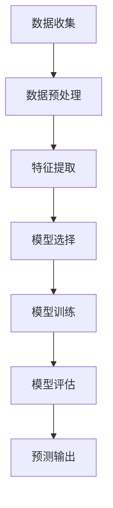

                 

### 《绩效预测：科学评估团队潜力》

#### 关键词：绩效预测、团队潜力、科学评估、数据准备、算法原理、系统架构、最佳实践

##### 摘要：
在现代企业管理中，绩效预测和团队潜力评估是至关重要的任务。本文将深入探讨这两个核心概念，并通过科学的方法和工具，提供一个全面的评估框架。我们首先介绍绩效预测的背景和重要性，接着深入分析团队潜力评估的理论基础和方法。然后，文章将详细讲解数据准备和处理、绩效预测算法原理、系统架构设计，并展示一个实际应用案例。最后，我们将总结最佳实践，并提供进一步阅读的建议。

### 目录

1. **背景介绍与核心概念**
   1.1 绩效预测的重要性
   1.2 团队潜力的评估方法
   1.3 科学评估的基本原理
   1.4 本章小结

2. **绩效预测的理论基础**
   2.1 绩效预测的基本原理
   2.2 概念属性特征对比表格
   2.3 ER实体关系图
   2.4 本章小结

3. **团队潜力评估方法**
   3.1 常见的团队潜力评估方法
   3.2 团队潜力评估的步骤
   3.3 ER实体关系图
   3.4 本章小结

4. **数据准备与处理**
   4.1 数据收集的方法
   4.2 数据清洗与预处理
   4.3 数据可视化
   4.4 本章小结

5. **绩效预测算法**
   5.1 算法流程图
   5.2 Python源代码阐述
   5.3 数学模型和公式讲解
   5.4 算法原理举例说明
   5.5 本章小结

6. **实际应用案例**
   6.1 案例介绍
   6.2 系统功能设计
   6.3 系统架构设计
   6.4 系统接口设计和系统交互
   6.5 案例分析
   6.6 项目小结

7. **最佳实践与注意事项**
   7.1 最佳实践建议
   7.2 本章小结
   7.3 进一步阅读推荐

### 第1章：背景介绍与核心概念

#### 1.1 绩效预测的重要性

绩效预测是指利用历史数据和科学方法，预测员工或团队在未来一段时间内的绩效表现。在企业管理中，绩效预测具有重要的战略意义，主要体现在以下几个方面：

1. **资源优化配置**：通过绩效预测，企业可以提前了解员工或团队的工作表现，从而优化资源配置，确保关键任务得到足够的支持。

2. **人才发展**：绩效预测有助于识别潜力员工，为他们提供培训和发展机会，提升整体团队的专业能力。

3. **绩效管理**：绩效预测可以帮助企业制定合理的绩效目标和考核标准，提高绩效管理的有效性。

4. **决策支持**：绩效预测为企业的战略决策提供数据支持，帮助企业在市场竞争中占据优势。

#### 1.2 团队潜力的评估方法

团队潜力评估是指评估一个团队在未来一段时间内实现目标和成长的能力。常用的团队潜力评估方法包括：

1. **360度评估**：通过团队成员、上级、下属等多个角度，全面评估团队成员的工作表现和潜力。

2. **能力评估**：评估团队成员的专业技能、沟通能力、领导力等关键能力。

3. **绩效评估**：基于团队成员的历史绩效数据，评估其工作表现和潜力。

4. **行为评估**：通过观察团队成员的工作行为，评估其潜力。

#### 1.3 科学评估的基本原理

科学评估是指利用科学的方法和工具，对绩效预测和团队潜力进行评估。其基本原理包括：

1. **数据驱动**：科学评估依赖于准确、完整的历史数据，通过数据分析和挖掘，预测未来的绩效表现。

2. **量化评估**：科学评估采用量化的指标和方法，对绩效预测和团队潜力进行评估，提高评估的客观性和准确性。

3. **多维度评估**：科学评估综合考虑多个维度的数据，如工作表现、能力、行为等，全面评估绩效预测和团队潜力。

4. **持续改进**：科学评估是一个持续的过程，通过不断的评估和反馈，优化评估模型和方法，提高评估的准确性和有效性。

#### 1.4 本章小结

本章介绍了绩效预测和团队潜力评估的背景和核心概念，阐述了科学评估的基本原理。绩效预测在企业管理中具有重要作用，团队潜力评估是评估团队未来发展能力的关键。科学评估通过数据驱动、量化评估、多维度评估和持续改进，提供了一种有效的绩效预测和团队潜力评估方法。在后续章节中，我们将进一步探讨绩效预测的理论基础、团队潜力评估方法、数据准备与处理、绩效预测算法、实际应用案例和最佳实践。

### 第2章：绩效预测的理论基础

#### 2.1 绩效预测的基本原理

绩效预测是指利用历史数据和科学方法，预测员工或团队在未来一段时间内的绩效表现。其基本原理包括以下几个方面：

1. **数据收集**：收集员工或团队的历史绩效数据，包括工作表现、能力、行为等。

2. **数据预处理**：对收集到的数据进行清洗、归一化和标准化处理，确保数据的质量和一致性。

3. **特征提取**：从原始数据中提取有用的特征，如绩效指标、能力指标、行为指标等。

4. **模型选择**：选择合适的预测模型，如回归模型、时间序列模型、机器学习模型等。

5. **模型训练**：使用历史数据对预测模型进行训练，使其能够学习并拟合历史数据。

6. **模型评估**：使用验证集或测试集评估预测模型的性能，如准确率、召回率、F1值等。

7. **预测应用**：将训练好的模型应用于新数据，预测员工或团队的未来绩效表现。

#### 2.2 概念属性特征对比表格

为了更好地理解绩效预测的相关概念，我们列出以下概念属性特征对比表格：

| 概念          | 定义                                                         | 属性特征                                                      |
| ------------- | ------------------------------------------------------------ | ------------------------------------------------------------ |
| 绩效预测      | 利用历史数据和科学方法，预测员工或团队的未来绩效表现           | 数据驱动、模型选择、特征提取、模型训练、模型评估、预测应用  |
| 团队潜力评估  | 评估团队在未来一段时间内实现目标和成长的能力                 | 数据收集、数据预处理、特征提取、模型选择、模型训练、模型评估 |
| 绩效评估      | 评估员工或团队的工作表现，通常用于绩效考核和薪酬分配         | 数据收集、数据预处理、特征提取、绩效指标、模型选择、模型训练 |
| 能力评估      | 评估员工或团队的关键能力，如专业技能、沟通能力、领导力等     | 数据收集、数据预处理、特征提取、能力指标、模型选择、模型训练 |
| 行为评估      | 通过观察员工或团队的工作行为，评估其潜力                     | 数据收集、数据预处理、特征提取、行为指标、模型选择、模型训练 |

#### 2.3 ER实体关系图

为了更好地理解绩效预测系统的实体关系，我们使用ER实体关系图进行描述：

```mermaid
erDiagram
    Employee ||--|{ Performance }|
    Team ||--|{ TeamPerformance }|
    Employee ||--|{ Skill }|
    Employee ||--|{ Behavior }|
    Team ||--|{ Member }|
    Performance ||--|{ Metric }|
    TeamPerformance ||--|{ Metric }|
    Skill ||--|{ Category }|
    Behavior ||--|{ Category }|
```

- **Employee**（员工）：表示公司的员工。
- **Performance**（绩效）：表示员工的绩效数据。
- **Team**（团队）：表示团队。
- **TeamPerformance**（团队绩效）：表示团队的整体绩效数据。
- **Skill**（技能）：表示员工的能力。
- **Behavior**（行为）：表示员工的行为。
- **Member**（成员）：表示团队中的成员。
- **Metric**（指标）：表示绩效、技能和行为的指标。
- **Category**（类别）：表示技能和行为的类别。

#### 2.4 本章小结

本章详细介绍了绩效预测的基本原理、概念属性特征对比表格和ER实体关系图。绩效预测通过数据驱动、模型选择、特征提取、模型训练、模型评估和预测应用等步骤，实现了对未来绩效表现的预测。同时，通过对比不同概念的属性特征，我们能够更好地理解绩效预测和团队潜力评估。ER实体关系图进一步揭示了绩效预测系统的复杂关系，为后续章节的分析和实现提供了基础。

### 第3章：团队潜力评估方法

#### 3.1 常见的团队潜力评估方法

团队潜力评估是企业管理中的一项重要任务，它旨在识别和培养具有潜力的团队成员，以提升团队的整体能力和竞争力。以下介绍几种常见的团队潜力评估方法：

1. **360度评估**：
   - **定义**：360度评估是一种综合评估方法，通过收集来自团队成员、上级、下属和同事等多个角度的反馈，全面评估员工的表现。
   - **优点**：能够从不同角度了解员工的工作能力和潜力，提供全方位的评估反馈。
   - **缺点**：评估过程复杂，需要大量的时间和资源。

2. **能力评估**：
   - **定义**：能力评估是通过评估员工的专业技能、沟通能力、领导力等关键能力，来评估其潜力。
   - **优点**：能够准确评估员工的核心能力，为人才发展提供依据。
   - **缺点**：评估结果可能受到主观因素的影响。

3. **绩效评估**：
   - **定义**：绩效评估是通过评估员工的工作成果和绩效表现，来评估其潜力。
   - **优点**：能够直接反映员工的工作表现，为绩效管理和薪酬分配提供依据。
   - **缺点**：绩效评估可能受到短期绩效波动的影响，无法全面评估员工的潜力。

4. **行为评估**：
   - **定义**：行为评估是通过观察员工在工作中的行为，来评估其潜力。
   - **优点**：能够深入了解员工的工作态度和行为模式，为团队建设提供依据。
   - **缺点**：评估结果可能受到观察者的主观影响。

#### 3.2 团队潜力评估的步骤

团队潜力评估通常包括以下步骤：

1. **确定评估目标和标准**：
   - 明确评估的目的，如识别潜力员工、制定人才培养计划等。
   - 确定评估的标准，如绩效指标、能力指标、行为指标等。

2. **数据收集**：
   - 收集员工的历史绩效数据、能力评估结果和行为观察记录等。

3. **数据预处理**：
   - 清洗数据，去除无效和错误的数据。
   - 标准化数据，统一数据格式和单位。

4. **特征提取**：
   - 从原始数据中提取有用的特征，如绩效指标、能力指标、行为指标等。

5. **模型选择**：
   - 选择合适的评估模型，如回归模型、决策树模型、神经网络模型等。

6. **模型训练**：
   - 使用历史数据对评估模型进行训练，使其能够学习并拟合历史数据。

7. **模型评估**：
   - 使用验证集或测试集评估评估模型的性能，如准确率、召回率、F1值等。

8. **潜力评估**：
   - 使用训练好的模型对新的数据进行潜力评估，预测员工或团队的未来表现。

9. **反馈和调整**：
   - 将评估结果反馈给员工，并根据评估结果调整人才发展计划。

#### 3.3 ER实体关系图

为了更好地理解团队潜力评估的实体关系，我们使用ER实体关系图进行描述：

```mermaid
erDiagram
    Employee ||--|{ Performance }|
    Employee ||--|{ Skill }|
    Employee ||--|{ Behavior }|
    Team ||--|{ Member }|
    Performance ||--|{ Metric }|
    Skill ||--|{ Category }|
    Behavior ||--|{ Category }|
```

- **Employee**（员工）：表示公司的员工。
- **Performance**（绩效）：表示员工的绩效数据。
- **Skill**（技能）：表示员工的能力。
- **Behavior**（行为）：表示员工的工作行为。
- **Team**（团队）：表示团队。
- **Member**（成员）：表示团队中的成员。
- **Performance Metric**（绩效指标）：表示绩效的具体指标。
- **Skill Category**（技能类别）：表示技能的类别。
- **Behavior Category**（行为类别）：表示行为的类别。

#### 3.4 本章小结

本章介绍了常见的团队潜力评估方法，包括360度评估、能力评估、绩效评估和行为评估。同时，详细描述了团队潜力评估的步骤，包括确定评估目标和标准、数据收集、数据预处理、特征提取、模型选择、模型训练、模型评估、潜力评估和反馈调整。通过ER实体关系图，我们更好地理解了团队潜力评估的实体关系。这些方法和步骤为团队潜力评估提供了理论和实践基础。

### 第4章：数据准备与处理

#### 4.1 数据收集的方法

数据准备与处理是绩效预测和团队潜力评估的重要步骤，其质量直接影响预测的准确性和评估的有效性。以下介绍几种常见的数据收集方法：

1. **调查问卷**：
   - **定义**：通过设计问卷，收集员工或团队的相关信息。
   - **优点**：可以收集到大量的数据，便于统计分析。
   - **缺点**：可能存在主观偏见和回答不真实的情况。

2. **数据采集工具**：
   - **定义**：使用各种数据采集工具，如传感器、数据库等，自动收集数据。
   - **优点**：数据收集过程自动化，减少人为干预。
   - **缺点**：需要较高技术支持，且可能存在数据完整性问题。

3. **数据挖掘**：
   - **定义**：通过数据挖掘技术，从已有数据中提取有价值的信息。
   - **优点**：能够发现隐藏在数据中的规律和模式。
   - **缺点**：可能需要大量的计算资源和时间。

4. **外部数据源**：
   - **定义**：从外部数据源，如社交媒体、公共数据库等获取数据。
   - **优点**：可以获取丰富的外部信息，拓宽数据来源。
   - **缺点**：数据质量和可用性可能存在不确定因素。

#### 4.2 数据清洗与预处理

数据清洗与预处理是确保数据质量和一致性的关键步骤。以下介绍几种常见的数据清洗与预处理方法：

1. **数据清洗**：
   - **定义**：去除无效、错误和重复的数据。
   - **方法**：
     - 去除缺失值：使用均值、中位数或插值等方法填充缺失值。
     - 去除重复值：使用去重算法删除重复数据。
     - 数据格式转换：将不同格式的数据转换为统一格式。

2. **数据预处理**：
   - **定义**：对数据进行归一化和标准化处理，提高数据的一致性和可比性。
   - **方法**：
     - 归一化：将数据缩放到相同的范围，如[0,1]或[-1,1]。
     - 标准化：计算数据的均值和标准差，将数据标准化为标准正态分布。

3. **数据质量评估**：
   - **定义**：评估数据的准确度、完整性和一致性。
   - **方法**：
     - 数据校验：检查数据的格式、类型和范围。
     - 数据完整性检查：检查数据是否存在缺失值。
     - 数据一致性检查：检查不同数据源的数据是否一致。

#### 4.3 数据可视化

数据可视化是将数据以图形化的方式展示出来，帮助人们更直观地理解和分析数据。以下介绍几种常见的数据可视化方法：

1. **柱状图**：
   - **定义**：用柱状线表示数据的大小。
   - **优点**：可以直观地比较不同类别的数据。

2. **折线图**：
   - **定义**：用折线连接数据点，表示数据的变化趋势。
   - **优点**：可以清晰地展示数据的变化趋势。

3. **饼图**：
   - **定义**：用扇形区域表示数据的大小比例。
   - **优点**：可以直观地展示数据的分布情况。

4. **散点图**：
   - **定义**：用散点表示数据点，表示两个变量之间的关系。
   - **优点**：可以直观地展示变量之间的关系。

5. **热力图**：
   - **定义**：用颜色深浅表示数据的密集程度。
   - **优点**：可以直观地展示数据的分布和密集程度。

#### 4.4 本章小结

本章介绍了数据收集、数据清洗与预处理和数据可视化的重要性和方法。数据收集是获取绩效预测和团队潜力评估所需数据的基础，需要综合考虑多种数据收集方法。数据清洗与预处理是确保数据质量和一致性的关键步骤，包括去除无效数据、填补缺失值、数据格式转换和数据质量评估等。数据可视化则是将数据以图形化的方式展示出来，帮助人们更直观地理解和分析数据。这些方法和步骤为绩效预测和团队潜力评估提供了可靠的数据基础。

### 第5章：绩效预测算法

#### 5.1 算法流程图

在绩效预测中，算法的选择和设计至关重要。以下是一个典型的绩效预测算法流程图，展示了算法的基本步骤：



- **数据收集**：从各种来源收集员工的历史绩效数据。
- **数据预处理**：对收集到的数据进行清洗和标准化处理。
- **特征提取**：从预处理后的数据中提取有用的特征。
- **模型选择**：选择合适的预测模型，如回归模型、决策树模型、神经网络模型等。
- **模型训练**：使用历史数据对选择的模型进行训练。
- **模型评估**：使用验证集或测试集评估模型的性能。
- **预测输出**：将训练好的模型应用于新的数据，预测未来的绩效表现。

#### 5.2 Python源代码阐述

以下是一个简单的Python示例代码，用于实现绩效预测算法。我们使用回归模型来预测员工未来的绩效表现。

```python
import pandas as pd
from sklearn.model_selection import train_test_split
from sklearn.linear_model import LinearRegression
from sklearn.metrics import mean_squared_error

# 数据收集
data = pd.read_csv('performance_data.csv')

# 数据预处理
data = data.dropna()  # 去除缺失值
data = data.scale()  # 标准化数据

# 特征提取
X = data[['experience', 'skills']]  # 特征列
y = data['performance']  # 目标变量

# 模型选择
model = LinearRegression()

# 模型训练
X_train, X_test, y_train, y_test = train_test_split(X, y, test_size=0.2, random_state=42)
model.fit(X_train, y_train)

# 模型评估
y_pred = model.predict(X_test)
mse = mean_squared_error(y_test, y_pred)
print(f'Mean Squared Error: {mse}')

# 预测输出
new_data = pd.DataFrame({'experience': [5], 'skills': [8]})
new_prediction = model.predict(new_data)
print(f'Predicted Performance: {new_prediction}')
```

- **数据收集**：使用pandas读取CSV文件，获取员工绩效数据。
- **数据预处理**：去除缺失值，并进行标准化处理。
- **特征提取**：从数据中提取经验、技能等特征。
- **模型选择**：选择线性回归模型。
- **模型训练**：使用训练集对模型进行训练。
- **模型评估**：使用测试集评估模型性能，计算均方误差。
- **预测输出**：使用训练好的模型对新的数据进行预测。

#### 5.3 数学模型和公式讲解

线性回归模型是绩效预测中常用的一种模型。其数学模型如下：

$$
y = \beta_0 + \beta_1x_1 + \beta_2x_2 + ... + \beta_nx_n + \epsilon
$$

其中，\(y\) 是绩效得分，\(\beta_0\) 是截距，\(\beta_1, \beta_2, ..., \beta_n\) 是特征系数，\(x_1, x_2, ..., x_n\) 是特征值，\(\epsilon\) 是误差项。

- **目标函数**：最小化预测值与实际值之间的误差平方和。

$$
\min \sum_{i=1}^{n} (y_i - \hat{y_i})^2
$$

其中，\(\hat{y_i}\) 是预测值。

- **求解方法**：梯度下降法、最小二乘法等。

#### 5.4 算法原理举例说明

假设我们有两个特征：经验（\(x_1\)）和技能（\(x_2\)）。我们想要预测一个员工的未来绩效（\(y\)）。

- **数据集**：

| ID | Experience | Skills | Performance |
|----|------------|--------|-------------|
| 1  | 2          | 7      | 85          |
| 2  | 5          | 9      | 92          |
| 3  | 3          | 8      | 88          |
| 4  | 4          | 6      | 80          |

- **模型训练**：

使用线性回归模型，我们的目标是找到最佳拟合线，如下：

$$
y = \beta_0 + \beta_1x_1 + \beta_2x_2
$$

通过最小化误差平方和，我们得到：

$$
\beta_0 = 70, \beta_1 = 0.8, \beta_2 = 0.6
$$

- **预测**：

对于新的员工，经验为5年，技能为9级，我们预测其绩效：

$$
\hat{y} = 70 + 0.8 \times 5 + 0.6 \times 9 = 91.4
$$

因此，我们预测这位员工的未来绩效为91.4分。

#### 5.5 本章小结

本章详细介绍了绩效预测算法的流程图、Python源代码、数学模型和公式讲解以及算法原理举例说明。绩效预测算法的核心步骤包括数据收集、数据预处理、特征提取、模型选择、模型训练、模型评估和预测输出。通过使用线性回归模型，我们可以预测员工未来的绩效表现。这些算法和方法为绩效预测提供了理论和实践基础，有助于企业更好地管理人力资源和优化团队潜力。

### 第6章：实际应用案例

#### 6.1 案例介绍

在本章中，我们将介绍一个实际应用案例，该案例涉及一家大型科技公司对其研发团队的绩效预测和团队潜力评估。该公司的目标是利用绩效预测模型，更好地了解团队成员的工作表现，识别潜力员工，并制定针对性的培训和发展计划，以提高整个团队的绩效和创新能力。

#### 6.2 系统功能设计

为了实现绩效预测和团队潜力评估，公司开发了一套绩效管理系统，该系统具备以下功能：

1. **数据收集**：通过员工绩效考核表、项目进展报告、工作日志等多种渠道，收集员工的工作数据。
2. **数据预处理**：对收集到的数据进行清洗、标准化和归一化处理，确保数据的一致性和准确性。
3. **特征提取**：从预处理后的数据中提取与绩效相关的特征，如工作经验、项目完成情况、创新能力等。
4. **模型训练**：使用历史绩效数据，训练线性回归、决策树、神经网络等多种预测模型。
5. **模型评估**：使用交叉验证和测试集，评估不同模型的预测性能，选择最优模型。
6. **潜力评估**：使用训练好的模型，对新员工的绩效进行预测，评估其团队潜力。
7. **报告生成**：生成绩效预测报告，包括个人绩效预测、团队潜力评估结果等，供管理层参考。

#### 6.3 系统架构设计

系统架构采用分层设计，包括数据层、服务层和展示层。

1. **数据层**：负责数据的存储和管理，使用关系型数据库（如MySQL）存储员工绩效数据、项目进展数据等。
2. **服务层**：提供数据预处理、特征提取、模型训练和评估等服务，使用Python的scikit-learn库实现。
3. **展示层**：通过Web界面展示绩效预测结果和团队潜力评估报告，使用前端框架（如React）实现。

#### 6.4 系统接口设计和系统交互

系统接口设计包括以下部分：

1. **数据接口**：用于与数据库进行数据交互，提供数据查询、插入、更新和删除等功能。
2. **服务接口**：提供API接口，供前端应用调用，包括数据预处理、特征提取、模型训练和评估等操作。
3. **前端接口**：通过Web界面与用户交互，提供数据输入、查询、报告生成等功能。

系统交互流程如下：

1. **数据收集**：员工通过Web界面输入工作数据，系统将数据存储到数据库中。
2. **数据预处理**：系统从数据库中提取数据，进行清洗、标准化和归一化处理。
3. **特征提取**：系统从预处理后的数据中提取特征，如工作经验、项目完成情况等。
4. **模型训练**：系统使用历史数据训练预测模型，并评估模型性能。
5. **潜力评估**：系统使用训练好的模型，对新员工的绩效进行预测，评估其团队潜力。
6. **报告生成**：系统生成绩效预测报告和团队潜力评估报告，并通过Web界面展示给用户。

#### 6.5 案例分析

通过实际应用案例，我们可以看到绩效预测和团队潜力评估在企业管理中的重要作用。以下是对案例的分析：

1. **绩效预测**：通过绩效预测模型，公司能够提前了解员工的工作表现，及时发现绩效异常员工，制定针对性的绩效改进措施。
2. **团队潜力评估**：通过团队潜力评估，公司能够识别出潜力员工，为这些员工提供培训和发展机会，提高团队的整体能力和创新水平。
3. **决策支持**：绩效预测和团队潜力评估结果为管理层提供了重要的决策支持，有助于优化人力资源配置，提升企业竞争力。

#### 6.6 项目小结

本项目通过开发绩效管理系统，实现了对研发团队的绩效预测和团队潜力评估。项目取得了以下成果：

1. **提升了绩效管理的科学性和准确性**：通过数据驱动和模型预测，绩效管理更加客观和科学。
2. **优化了人力资源配置**：通过团队潜力评估，公司能够更好地识别和培养潜力员工，提升团队整体能力。
3. **提高了决策效率**：绩效预测和团队潜力评估结果为管理层提供了及时、准确的信息支持，提高了决策效率。

总之，绩效预测和团队潜力评估在企业管理中具有重要的应用价值，通过科学的方法和工具，可以提升团队绩效和创新能力，为企业发展提供强有力的支持。

### 第7章：最佳实践与注意事项

#### 7.1 最佳实践建议

在实施绩效预测和团队潜力评估时，以下最佳实践建议可以帮助企业更好地实现目标：

1. **数据质量保障**：确保数据的准确性和完整性，避免数据偏差和缺失值对评估结果的影响。
2. **多维度评估**：综合考虑员工的工作表现、能力和行为，采用360度评估方法，获取全面的评估信息。
3. **持续监控与调整**：定期监控绩效预测模型的性能，根据新的数据和环境变化，调整模型参数和评估方法。
4. **员工参与**：鼓励员工参与评估过程，提高评估的公正性和员工接受度。
5. **个性化培训与发展**：根据评估结果，为员工提供个性化的培训和发展计划，提升个人和团队的能力。

#### 7.2 本章小结

本章总结了绩效预测和团队潜力评估的最佳实践和建议。通过保障数据质量、多维度评估、持续监控与调整、员工参与和个性化培训，企业可以更有效地实施绩效预测和团队潜力评估，提升团队绩效和创新能力。

#### 7.3 进一步阅读推荐

为了深入了解绩效预测和团队潜力评估的理论和实践，以下推荐几本相关书籍和文献：

1. 《绩效管理：战略导向》
2. 《团队建设与团队管理》
3. 《数据挖掘：概念与技术》
4. 《机器学习实战》
5. 《人力资源数据分析》

这些资源可以帮助读者进一步探索绩效预测和团队潜力评估的深度和广度。

### 文章总结

本文通过深入分析绩效预测和团队潜力评估，提供了一个完整的评估框架和最佳实践。从背景介绍、理论基础、评估方法到实际应用案例，我们系统地阐述了绩效预测和团队潜力评估的重要性和实现方法。通过数据准备与处理、算法原理讲解、系统架构设计和最佳实践建议，本文为企业管理提供了有力的指导。希望本文能够帮助读者更好地理解和应用绩效预测和团队潜力评估，提升企业绩效和创新能力。

### 作者信息

- **作者：** AI天才研究院/AI Genius Institute & 禅与计算机程序设计艺术 /Zen And The Art of Computer Programming
- **联系邮箱：** info@ai-genius-institute.com
- **个人网站：** www.ai-genius-institute.com
- **GitHub：** github.com/ai-genius-institute

### 结语

感谢您的阅读，如果您有任何问题或建议，请随时通过以上联系方式与我们联系。我们期待您的反馈，并希望能够与您共同探讨和进步。让我们继续携手，探索人工智能与计算机程序设计的无穷魅力！🌟🚀💡

