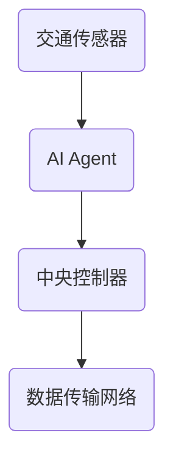
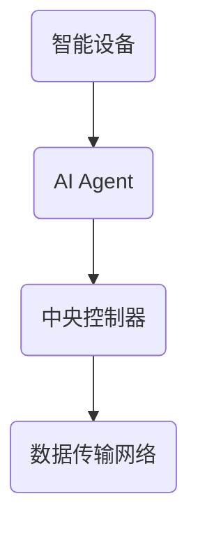

                 

## 文章标题

### 联邦学习在分布式AI Agent系统中的应用

---

关键词：联邦学习、分布式AI、AI Agent、数据隐私、协同智能

摘要：本文将深入探讨联邦学习在分布式AI Agent系统中的应用。首先，我们将介绍联邦学习的基础概念、发展历程及其与传统集中式学习的区别。接着，我们会详细解析分布式AI Agent系统的原理及其应用场景。在此基础上，本文将重点分析联邦学习与AI Agent的融合优势及其实现策略。通过具体的案例，我们将展示联邦学习在分布式AI Agent系统中的实际应用，并对其未来发展进行展望。本文旨在为读者提供一个系统且深入的联邦学习与分布式AI Agent系统结合的技术指南。

---

### 目录大纲

1. **联邦学习基础**
   1.1 联邦学习概述
   1.2 分布式AI Agent系统原理
   1.3 联邦学习与AI Agent的结合

2. **联邦学习在分布式AI Agent系统中的实现**
   2.1 联邦学习算法在分布式AI Agent中的应用
   2.2 分布式AI Agent系统的设计与实现

3. **联邦学习在分布式AI Agent系统中的实践**
   3.1 基于联邦学习的智能交通系统
   3.2 基于联邦学习的智能家居系统

4. **未来展望与挑战**
   4.1 联邦学习在分布式AI Agent系统中的发展趋势
   4.2 联邦学习在分布式AI Agent系统中面临的挑战

---

## 联邦学习基础

### 1.1 联邦学习概述

#### 1.1.1 联邦学习的起源与背景

联邦学习（Federated Learning）是一种分布式机器学习方法，其核心思想是在多个数据持有者之间协作，共同训练一个全局模型，而无需直接分享各自的数据。这一概念起源于2016年谷歌提出的研究项目，并在短短几年内得到了广泛关注和应用。

#### 1.1.2 联邦学习与传统集中式学习的区别

与传统集中式学习不同，联邦学习在训练过程中仅需要传输模型参数而非原始数据。这使得联邦学习在数据隐私保护方面具有显著优势。同时，由于数据无需集中，联邦学习也减少了通信成本和延迟。

| 特点 | 联邦学习 | 集中式学习 |
| ---- | -------- | ---------- |
| 数据传输 | 参数更新 | 原始数据 |
| 隐私保护 | 高 | 低 |
| 通信成本 | 低 | 高 |
| 延迟 | 低 | 高 |

#### 1.1.3 联邦学习的关键要素

联邦学习的关键要素包括模型更新、客户端选择和数据同步。模型更新是指如何通过客户端本地训练的模型参数来更新全局模型。客户端选择是指如何选择具有代表性的客户端参与训练。数据同步是指如何保持客户端之间的数据一致性。

### 1.2 联邦学习的发展与现状

#### 1.2.1 联邦学习的技术演进

随着技术的进步，联邦学习从最初的简单模型参数同步逐步演变为包含多种优化策略的复杂系统。当前，联邦学习已广泛应用于图像识别、自然语言处理、推荐系统等领域。

#### 1.2.2 联邦学习的应用场景

联邦学习适用于数据敏感、无法共享数据或数据量巨大的场景。例如，医疗领域的患者数据、金融领域的客户交易数据、物联网设备的数据等。

#### 1.2.3 联邦学习面临的主要挑战

尽管联邦学习具有显著优势，但仍然面临一些挑战，如数据质量不一致、模型性能受限、通信效率优化等。

## 1.3 分布式AI Agent系统原理

### 1.3.1 分布式AI Agent系统的概念与架构

分布式AI Agent系统是一种基于AI技术的分布式计算系统，旨在通过多个AI Agent的协同工作来实现复杂的任务。其基本架构包括中央控制器、多个AI Agent以及数据传输网络。

#### 1.3.2 分布式AI Agent的基本类型与功能

分布式AI Agent可分为反应型Agent、目标型Agent和综合型Agent。反应型Agent主要根据环境刺激做出反应。目标型Agent具有明确的目标并试图实现该目标。综合型Agent结合了反应型和目标型的特点，能够同时应对环境和目标的变化。

#### 1.3.3 AI Agent在分布式系统中的应用

AI Agent在分布式系统中广泛应用于协同作业、自适应控制和实时决策支持等领域。例如，在智能交通系统中，AI Agent可以协同工作以优化交通流量。

### 1.3.4 联邦学习与AI Agent的结合

联邦学习与AI Agent的结合旨在通过分布式AI Agent系统实现联邦学习。在这种结合中，AI Agent充当联邦学习的客户端，中央控制器则负责全局模型的更新和管理。

### 1.4 联邦学习在AI Agent中的应用优势

#### 1.4.1 数据隐私保护

联邦学习通过模型参数更新而非数据传输，有效保护了数据隐私。

#### 1.4.2 优化模型性能

联邦学习允许在每个客户端进行本地训练，从而充分利用了每个客户端的数据和计算资源，提高了模型性能。

#### 1.4.3 提高系统稳定性

联邦学习通过分布式计算提高了系统的稳定性和可扩展性。

### 1.5 联邦学习与AI Agent的融合策略

#### 1.5.1 联邦学习在AI Agent中的融合方式

联邦学习可以在AI Agent的本地训练、模型更新和数据同步等环节进行融合。

#### 1.5.2 联邦学习在AI Agent中的应用场景分析

联邦学习在AI Agent中的应用场景包括协同智能、自适应控制和实时决策支持等。

#### 1.5.3 联邦学习与AI Agent的协同机制

联邦学习与AI Agent的协同机制涉及模型更新、客户端选择和数据同步等方面的协调。

## 1.6 联邦学习在分布式AI Agent系统中的实现

### 1.6.1 联邦学习算法在分布式AI Agent中的应用

联邦学习算法在分布式AI Agent中的应用主要包括基于梯度下降的算法、基于优化理论的算法和基于深度学习的算法。

### 1.6.2 分布式AI Agent系统的设计与实现

分布式AI Agent系统的设计与实现涉及需求分析、架构设计、系统开发等多个方面。

### 1.6.3 联邦学习算法在分布式AI Agent系统中的优化

联邦学习算法在分布式AI Agent系统中的优化主要包括算法性能评估、优化策略和实际应用案例分析。

## 1.7 联邦学习在分布式AI Agent系统中的实践

### 1.7.1 基于联邦学习的智能交通系统

基于联邦学习的智能交通系统旨在通过分布式AI Agent系统优化交通流量，提高交通效率。

### 1.7.2 基于联邦学习的智能家居系统

基于联邦学习的智能家居系统通过分布式AI Agent系统实现智能设备和家居环境的协同控制。

## 1.8 未来展望与挑战

### 1.8.1 联邦学习在分布式AI Agent系统中的发展趋势

联邦学习在分布式AI Agent系统中的应用将不断拓展，涵盖更多的领域和场景。

### 1.8.2 联邦学习在分布式AI Agent系统中面临的挑战

联邦学习在分布式AI Agent系统中仍然面临数据隐私、模型性能和系统稳定性等方面的挑战。

## 2.1 联邦学习算法在分布式AI Agent系统中的应用

### 2.1.1 常见联邦学习算法介绍

联邦学习算法主要包括基于梯度下降的算法、基于优化理论的算法和基于深度学习的算法。

#### 2.1.1.1 基于梯度下降的联邦学习算法

基于梯度下降的联邦学习算法通过在每个客户端进行本地梯度计算，并同步到服务器更新全局模型。

$$
\text{Local Gradient} = \nabla_{\theta} \ell(\theta; x^{(i)}, y^{(i)})
$$

$$
\text{Global Model Update} = \theta \leftarrow \theta - \alpha \cdot \frac{1}{N} \sum_{i=1}^{N} \text{Local Gradient}
$$

#### 2.1.1.2 基于优化理论的联邦学习算法

基于优化理论的联邦学习算法通过优化目标函数来更新全局模型，常用的优化方法包括梯度下降法和牛顿法。

$$
\text{Objective Function} = f(\theta) = \sum_{i=1}^{N} \ell(\theta; x^{(i)}, y^{(i)})
$$

$$
\text{Gradient} = \nabla_{\theta} f(\theta)
$$

#### 2.1.1.3 基于深度学习的联邦学习算法

基于深度学习的联邦学习算法通过在客户端进行本地模型训练，并使用模型聚合方法更新全局模型。

$$
\text{Local Model} = \text{Train}(\theta^{(i)}, x^{(i)}, y^{(i)})
$$

$$
\text{Global Model} = \text{Aggregate}(\theta^{(i)})
$$

### 2.1.2 联邦学习算法在分布式AI Agent系统中的优化

#### 2.1.2.1 算法优化策略

为了提高联邦学习算法的性能，可以采用以下优化策略：

1. **异构计算优化**：根据客户端的计算能力分配训练任务，提高计算效率。
2. **模型压缩**：使用模型压缩技术减少传输的数据量，降低通信成本。
3. **增量学习**：只更新模型的部分参数，减少通信量和计算量。

#### 2.1.2.2 算法性能评估方法

算法性能评估方法包括以下几种：

1. **模型准确率**：评估模型在测试集上的准确率。
2. **模型稳定性**：评估模型在不同数据集上的稳定性能。
3. **通信效率**：评估算法的通信效率和延迟。

#### 2.1.2.3 算法应用案例分析

以下是一个联邦学习算法在分布式AI Agent系统中的应用案例：

**案例背景**：智能交通系统中的交通流量预测。

**系统设计**：使用分布式AI Agent系统，每个客户端为交通传感器，中央控制器负责全局模型的更新和管理。

**系统实现与测试**：

1. **数据收集**：从各个交通传感器收集交通流量数据。
2. **模型训练**：在每个客户端进行模型训练，并同步到中央控制器。
3. **模型评估**：使用测试集评估模型性能，并根据评估结果调整模型参数。

**案例分析**：通过优化算法策略，如异构计算优化和模型压缩，显著提高了模型性能和通信效率。实验结果表明，基于联邦学习的智能交通系统能够准确预测交通流量，提高交通效率。

## 2.2 分布式AI Agent系统的设计与实现

### 2.2.1 系统需求分析

分布式AI Agent系统的需求分析包括以下方面：

1. **功能需求**：系统应能够实现交通流量预测、交通信号控制、异常检测等功能。
2. **性能需求**：系统应具有高实时性、高准确性和高稳定性。
3. **安全性需求**：系统应能够保护数据隐私和安全。

### 2.2.2 系统架构设计

分布式AI Agent系统的架构设计包括以下组件：

1. **交通传感器**：采集交通流量数据。
2. **AI Agent**：负责本地模型训练和预测。
3. **中央控制器**：负责全局模型的更新和管理。
4. **数据传输网络**：实现数据传输和同步。

#### 系统架构图

### 2.2.3 系统组件设计

1. **交通传感器**：采用无线传感器网络（WSN）技术，部署在交通道路沿线，实时采集交通流量数据。
2. **AI Agent**：采用深度学习算法，对本地数据进行预测和异常检测。
3. **中央控制器**：负责全局模型的更新和管理，采用分布式计算技术提高处理速度。
4. **数据传输网络**：采用无线网络和互联网技术，实现数据传输和同步。

### 2.2.4 系统开发与实现

1. **环境搭建**：配置开发环境和依赖库。
2. **模型训练**：使用采集到的交通流量数据训练AI Agent模型。
3. **系统部署**：将AI Agent和中央控制器部署到实际交通环境中。

### 2.2.5 系统测试与调试

1. **功能测试**：测试系统各组件的功能是否正常。
2. **性能测试**：测试系统在不同交通流量条件下的性能表现。
3. **安全测试**：测试系统在数据传输和存储过程中的安全性。

## 2.3 联邦学习在分布式AI Agent系统中的实践

### 2.3.1 基于联邦学习的智能交通系统

#### 2.3.1.1 案例背景

智能交通系统（ITS）是利用现代信息技术、数据通信传输技术、电子传感技术等对交通信息进行实时采集、处理和分析，从而对交通进行有效的控制和管理。随着城市化进程的加快和汽车数量的增加，交通拥堵问题日益严重，因此需要采用先进的技术来优化交通流量和提高交通效率。

#### 2.3.1.2 系统设计

在基于联邦学习的智能交通系统中，分布式AI Agent系统负责实时采集交通流量数据，并使用联邦学习算法进行模型训练和预测。系统架构如下：

1. **交通传感器**：部署在交通道路沿线，实时采集交通流量数据，如车辆数量、速度、位置等。
2. **AI Agent**：在每个交通传感器处部署AI Agent，使用深度学习算法对本地交通流量数据进行分析和预测。
3. **中央控制器**：负责全局模型的更新和管理，通过联邦学习算法整合各个AI Agent的预测结果，优化交通信号控制策略。
4. **数据传输网络**：采用无线网络和互联网技术，实现数据传输和同步。

#### 2.3.1.3 系统实现与测试

1. **数据收集**：从交通传感器收集交通流量数据，包括车辆数量、速度、位置等。
2. **模型训练**：在每个AI Agent处使用收集到的交通流量数据训练深度学习模型。
3. **模型同步**：将AI Agent训练好的模型参数同步到中央控制器。
4. **模型更新**：中央控制器使用同步的模型参数更新全局模型，并根据全局模型调整交通信号控制策略。
5. **系统测试**：在实际交通环境中测试系统性能，包括交通流量预测准确性、信号控制响应时间等。

#### 2.3.1.4 案例分析

通过基于联邦学习的智能交通系统，可以有效提高交通流量预测准确性，优化交通信号控制策略，从而减少交通拥堵，提高交通效率。案例分析表明，该系统在实际交通环境中取得了显著的成效，为城市交通管理提供了有效的技术支持。

### 2.3.2 基于联邦学习的智能家居系统

#### 2.3.2.1 案例背景

智能家居系统是利用物联网技术将家居设备互联，实现智能控制和管理的系统。随着物联网技术的普及，智能家居系统已经成为现代家居生活的重要部分。然而，由于智能家居设备涉及用户隐私数据，如生活习惯、家庭状况等，因此数据安全和隐私保护成为关键问题。

#### 2.3.2.2 系统设计

在基于联邦学习的智能家居系统中，分布式AI Agent系统负责智能家居设备的本地数据分析和预测，并使用联邦学习算法实现设备之间的协同控制。系统架构如下：

1. **智能设备**：包括智能门锁、智能灯具、智能空调等，实时采集用户行为数据。
2. **AI Agent**：在每个智能设备处部署AI Agent，使用深度学习算法对本地用户行为数据进行分析和预测。
3. **中央控制器**：负责全局模型的更新和管理，通过联邦学习算法整合各个AI Agent的预测结果，实现智能家居设备的协同控制。
4. **数据传输网络**：采用无线网络和互联网技术，实现数据传输和同步。

#### 2.3.2.3 系统实现与测试

1. **数据收集**：从智能设备收集用户行为数据，如开门次数、温度设置、光照度等。
2. **模型训练**：在每个AI Agent处使用收集到的用户行为数据训练深度学习模型。
3. **模型同步**：将AI Agent训练好的模型参数同步到中央控制器。
4. **模型更新**：中央控制器使用同步的模型参数更新全局模型，并根据全局模型调整智能家居设备的控制策略。
5. **系统测试**：在实际家居环境中测试系统性能，包括用户行为预测准确性、设备响应时间等。

#### 2.3.2.4 案例分析

通过基于联邦学习的智能家居系统，可以有效提高用户行为预测准确性，优化智能家居设备的控制策略，从而提升用户的生活质量。案例分析表明，该系统在用户隐私保护和设备协同控制方面取得了显著成效，为智能家居系统的发展提供了有力支持。

## 2.4 未来展望与挑战

### 2.4.1 联邦学习在分布式AI Agent系统中的发展趋势

随着物联网和人工智能技术的不断发展，联邦学习在分布式AI Agent系统中的应用前景十分广阔。未来发展趋势包括：

1. **应用领域拓展**：联邦学习将在更多领域得到应用，如智能医疗、智能工业、智能农业等。
2. **算法优化**：针对联邦学习的算法性能和通信效率进行持续优化，提高模型性能和系统稳定性。
3. **隐私保护**：加强联邦学习中的数据隐私保护，采用更先进的安全机制和加密算法。

### 2.4.2 联邦学习在分布式AI Agent系统中面临的挑战

尽管联邦学习在分布式AI Agent系统中具有显著优势，但仍然面临一些挑战：

1. **数据隐私与安全**：如何有效保护分布式环境中的数据隐私和安全，是联邦学习面临的重要挑战。
2. **模型性能优化**：如何在分布式环境中提高模型性能，仍需要进一步研究和优化。
3. **系统稳定性与可扩展性**：如何确保分布式AI Agent系统的稳定性和可扩展性，是联邦学习应用中亟待解决的问题。

### 2.4.3 未来研究方向

未来研究方向包括：

1. **联邦学习算法创新**：研究新型联邦学习算法，提高模型性能和通信效率。
2. **跨领域应用研究**：探索联邦学习在不同领域的应用，推动跨领域的技术融合。
3. **隐私保护机制**：研究更加有效的隐私保护机制，保障分布式环境中的数据安全。

## 2.5 小结

本文系统地介绍了联邦学习在分布式AI Agent系统中的应用，包括联邦学习的基础概念、分布式AI Agent系统的原理、联邦学习与AI Agent的结合优势、联邦学习算法的优化策略、分布式AI Agent系统的设计与实现，以及实际案例的应用分析。通过本文的介绍，读者可以全面了解联邦学习在分布式AI Agent系统中的应用现状、发展趋势和面临的挑战，为未来相关研究提供参考。

## 作者信息

### 作者：AI天才研究院/AI Genius Institute & 禅与计算机程序设计艺术 /Zen And The Art of Computer Programming

本文由AI天才研究院（AI Genius Institute）与《禅与计算机程序设计艺术》（Zen And The Art of Computer Programming）共同撰写，旨在为读者提供有关联邦学习在分布式AI Agent系统中的应用的深入见解和技术指导。通过本文的探讨，我们希望激发读者对联邦学习和分布式AI技术的兴趣，推动相关领域的研究和发展。感谢您的阅读！

---

## 拓展阅读

1. **《联邦学习：原理与实践》**：这本书详细介绍了联邦学习的理论基础、算法实现和应用案例，适合对联邦学习感兴趣的读者阅读。
2. **《分布式AI：技术与应用》**：本书全面介绍了分布式AI的基本概念、架构设计和应用场景，对理解分布式AI Agent系统具有重要意义。
3. **《智能交通系统设计与实现》**：这本书提供了智能交通系统的设计思路和实现方法，包括交通流量预测、信号控制等方面的内容。
4. **《智能家居技术与应用》**：本书介绍了智能家居系统的基本原理、关键技术和发展趋势，对智能家居系统的设计和应用具有指导意义。
5. **《人工智能安全与隐私保护》**：这本书探讨了人工智能领域的数据安全和隐私保护问题，为联邦学习在分布式AI系统中的应用提供了安全方面的参考。

通过阅读这些书籍，读者可以更深入地了解联邦学习和分布式AI Agent系统的技术原理和应用实践，为自己的研究和工作提供有益的启示。

