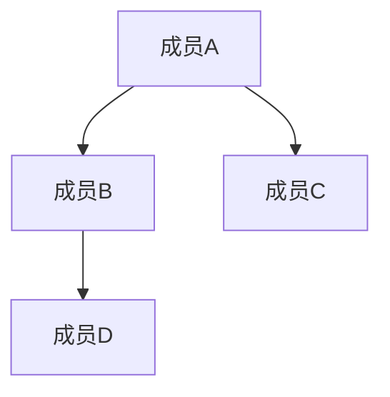
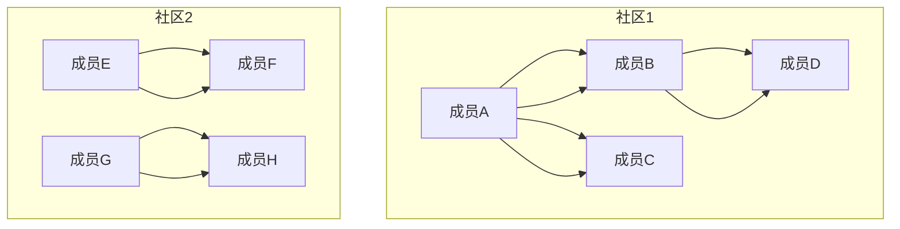
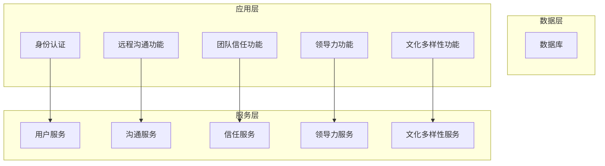
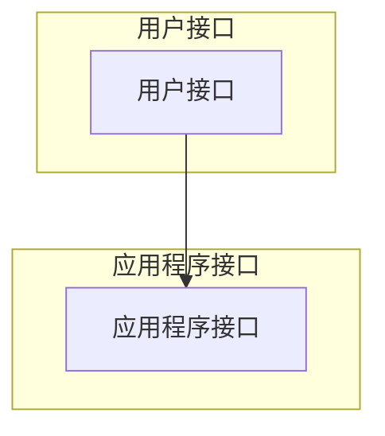
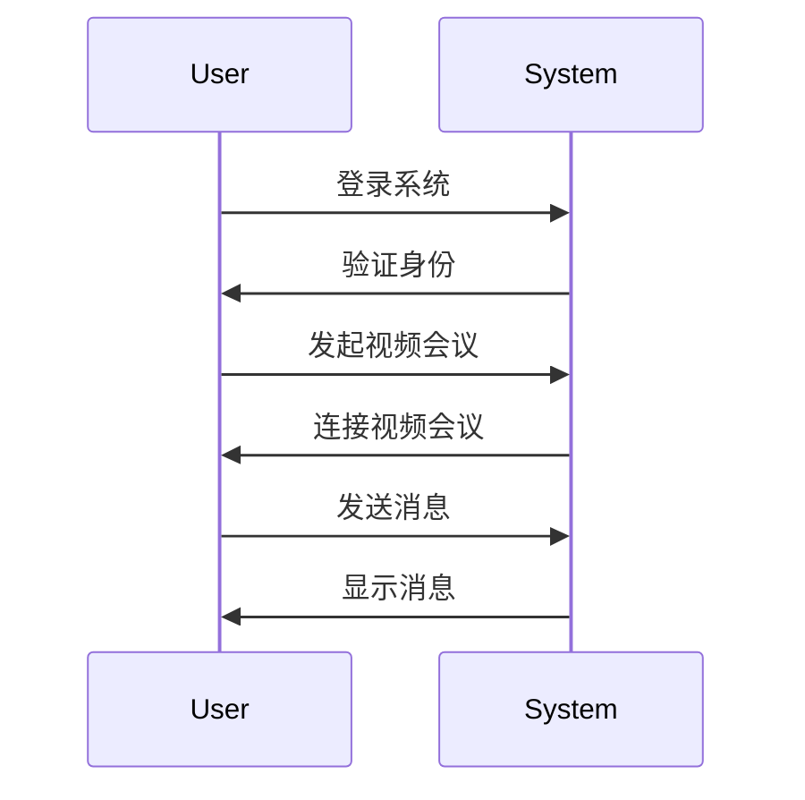

                 

### 虚拟团队管理：数字时代的领导挑战

> 关键词：虚拟团队、远程工作、领导力、沟通、文化多样性

> 摘要：本文深入探讨了数字时代虚拟团队管理的挑战与策略，分析了虚拟团队的背景、核心概念与联系，并引入社交网络分析算法来优化团队管理。文章旨在为领导者提供切实可行的管理技巧和工具，以应对虚拟团队的特殊需求。

----------------------------------------------------------------

## 第一部分：背景介绍

### 问题背景

在现代社会，远程工作已经成为一种普遍现象。随着信息技术的飞速发展和全球化进程的加快，人们不再受限于地理位置，可以轻松地在世界任何角落进行协作。这种工作方式的转变催生了虚拟团队的兴起。虚拟团队是由地理位置分散的成员通过技术手段协同工作的团队，其成员可能分布在不同的国家、城市甚至时区。

### 问题描述

虚拟团队的管理与传统团队管理相比面临许多挑战。首先，团队成员之间缺乏面对面的交流，导致沟通障碍和协调困难。其次，虚拟团队中的成员可能存在文化差异和时区差异，这进一步增加了管理的复杂性。此外，虚拟团队的成员往往具有较高的自主性和灵活性，这对领导者的管理技能提出了更高的要求。

### 问题解决

为了解决虚拟团队管理中的问题，领导者需要掌握一系列新的管理技能和策略。这包括如何有效地进行远程沟通、如何建立团队信任、如何激发团队成员的积极性以及如何管理虚拟团队中的文化多样性。此外，领导者还需要了解和应用各种数字工具和平台，以支持虚拟团队的工作。

### 边界与外延

虚拟团队管理不仅涉及企业内部，也延伸到跨企业、跨领域的合作。例如，跨国公司之间的虚拟团队合作、学术研究中的虚拟团队协作等，都是虚拟团队管理的重要应用场景。

### 概念结构与核心要素组成

虚拟团队管理涉及以下几个核心概念和要素：
1. **远程沟通**：包括实时沟通工具和非实时沟通工具的使用。
2. **团队信任**：通过透明度、责任感、相互尊重等手段建立和维护。
3. **领导力**：领导者需要具备远程领导能力，包括激励、指导、反馈等。
4. **文化多样性**：领导者需要理解并尊重团队成员的文化差异，促进团队融合。
5. **数字工具和平台**：包括协作工具、项目管理工具、视频会议工具等。

## 第二部分：核心概念与联系

### 虚拟团队管理的核心概念

虚拟团队管理的核心概念包括远程沟通、团队信任、领导力和文化多样性。

#### 远程沟通

远程沟通是虚拟团队管理的基础。有效的远程沟通可以提高团队成员之间的互动和协作效率。远程沟通工具包括即时通讯工具（如微信、Slack）、邮件、电话、视频会议等。

#### 团队信任

团队信任是虚拟团队成功的关键因素。团队信任建立在透明度、责任感、相互尊重和共同目标的基础上。领导者需要通过定期的沟通、及时的反馈和共同的目标来建立和维护团队信任。

#### 领导力

虚拟团队领导者需要具备远程领导能力。这包括激励团队成员、提供清晰的目标和期望、有效的反馈和指导等。远程领导还需要适应团队成员的多样性和时区差异。

#### 文化多样性

文化多样性是虚拟团队管理中不可忽视的方面。领导者需要了解团队成员的文化背景，尊重和包容不同的文化，以促进团队的融合和协作。

### 概念属性特征对比表格

为了更好地理解这些核心概念，我们可以通过对比表格来展示它们的主要特征：

| 核心概念 | 特征1 | 特征2 | 特征3 |
| :----: | :----: | :----: | :----: |
| 远程沟通 | 实时性 | 多样性 | 效率性 |
| 团队信任 | 透明度 | 责任感 | 相互尊重 |
| 领导力 | 激励 | 目标明确 | 反馈与指导 |
| 文化多样性 | 尊重差异 | 融合 | 协作 |

### ER实体关系图架构

为了更直观地展示虚拟团队管理中的实体及其关系，我们可以使用 Mermaid 绘制 ER 图：

```mermaid
entity Relationship {
  "团队"  
  "沟通"
  "信任"
  "领导力"
  "文化多样性"
}

Relationship {
  "团队" -> "沟通"
  "团队" -> "信任"
  "团队" -> "领导力"
  "团队" -> "文化多样性"
}
```

通过 ER 图，我们可以清晰地看到虚拟团队管理中的各个实体及其相互关系。

## 第三部分：算法原理讲解

### 算法概述

在虚拟团队管理中，算法可以用于优化沟通、建立信任、提高领导力等。本部分将介绍一种用于虚拟团队管理的核心算法——社交网络分析（Social Network Analysis，SNA）算法。

#### 算法定义

社交网络分析是一种用于研究社交网络中个体间关系的分析方法。它通过分析社交网络中的节点（个体）和边（关系）来揭示网络的拓扑结构、节点的重要性和群体行为。

#### 算法特点

1. **全局视角**：SNA算法能够从整体上分析社交网络的结构，帮助领导者了解整个团队的沟通模式。
2. **节点重要性分析**：通过计算节点的重要性指标，领导者可以识别团队中的关键成员。
3. **社区检测**：SNA算法还可以用于检测社交网络中的社区结构，帮助领导者识别团队中的小团体。

### 算法原理

社交网络分析（SNA）算法的核心思想是通过分析网络中节点和边的特性来揭示网络的结构和模式。以下是一个简单的 SNA 算法原理讲解：

#### 网络节点表示

在 SNA 中，网络中的每个成员可以表示为一个节点。节点的属性可能包括成员的身份、技能、职位等。



在上图中，节点 A、B、C 和 D 分别代表四位成员。

#### 边表示关系

边表示节点之间的连接关系。边的权重可以表示关系强度，例如，通过视频会议频繁联系的成员之间的关系权重可能更高。

```mermaid
graph TB
A[成员A] --> B[成员B] {高频率}
A --> C[成员C] {偶尔}
B --> D[成员D] {低频率}
```

#### 节点重要性指标

节点重要性指标用于衡量节点在网络中的重要性。常见的节点重要性指标包括度数中心性、紧密中心性和中间中心性。

- **度数中心性**：节点连接的边数越多，其度数中心性越高。
- **紧密中心性**：节点与其邻居节点之间的平均距离越短，其紧密中心性越高。
- **中间中心性**：节点位于其他节点之间的最短路径上的次数越多，其中间中心性越高。

```python
import networkx as nx

G = nx.Graph()
G.add_nodes_from(['A', 'B', 'C', 'D'])
G.add_edges_from([('A', 'B'), ('A', 'C'), ('B', 'D')])

print("Degree Centrality:", nx.degree_centrality(G))
print("Closeness Centrality:", nx.closeness_centrality(G))
print("Betweenness Centrality:", nx.betweenness_centrality(G))
```

#### 社区检测

社区检测用于识别网络中的紧密连接的小团体。常见的社区检测算法包括 Girvan-Newman 算法和标签传播算法。



在上图中，节点 A、B、C 和 D 形成了一个社区，节点 E、F、G 和 H 形成了另一个社区。

通过社交网络分析算法，领导者可以更好地了解虚拟团队的沟通模式、关键成员和社区结构，从而制定更有效的管理策略。

## 第四部分：系统分析与架构设计方案

### 问题场景介绍

在数字时代，许多企业采用了虚拟团队进行项目开发和协作。然而，由于团队成员地理位置分散，缺乏面对面的交流，导致沟通效率低下、团队协作不畅。为了解决这个问题，我们需要设计一个高效的虚拟团队管理平台，以支持远程沟通、团队信任、领导力和文化多样性的管理。

### 项目介绍

虚拟团队管理平台项目旨在为企业提供一个全面的管理解决方案，通过集成多种工具和功能，实现虚拟团队的协同工作。项目的主要目标包括：
1. 提高团队成员的沟通效率。
2. 建立和维护团队信任。
3. 提升领导者的远程管理能力。
4. 促进团队成员的文化多样性。

### 系统功能设计

系统功能设计主要包括以下几个方面：
1. **远程沟通功能**：提供实时沟通工具（如视频会议、即时消息）、邮件和电话等，支持团队成员之间的互动和协作。
2. **团队信任功能**：通过透明度、责任感和相互尊重等手段，建立和维护团队信任。
3. **领导力功能**：提供领导力培训、激励措施和反馈机制，帮助领导者提升远程管理能力。
4. **文化多样性功能**：提供文化多样性培训、文化地图和跨文化沟通指南，促进团队成员的文化多样性。

### 系统架构设计

虚拟团队管理平台的系统架构设计如下：



### 系统接口设计

系统接口设计主要包括用户接口（UI）和应用程序接口（API）。用户接口提供直观的交互界面，方便用户使用系统功能；应用程序接口则用于与其他系统或服务的集成。



### 系统交互

系统交互设计通过序列图（Sequence Diagram）来展示用户操作与系统响应的过程。以下是一个简单的序列图示例：



通过以上系统分析与架构设计方案，虚拟团队管理平台可以为企业管理虚拟团队提供全面的支持，提高团队协作效率和项目成功率。

## 第五部分：项目实战

### 环境安装

为了进行虚拟团队管理平台的项目实战，我们需要首先安装和配置相关环境。以下是环境安装的详细步骤：

#### 安装操作系统

1. 选择一个操作系统，例如 Ubuntu 20.04 或 Windows 10。
2. 下载并安装操作系统。

#### 安装开发工具

1. 安装 Python 3.8 或更高版本。
2. 安装集成开发环境（IDE），例如 PyCharm 或 Visual Studio Code。
3. 安装版本控制工具，例如 Git。

#### 安装依赖库

1. 打开终端或命令行窗口。
2. 运行以下命令安装依赖库：

```shell
pip install flask
pip install networkx
pip install matplotlib
```

### 系统核心实现源代码

以下是虚拟团队管理平台的核心实现源代码，包括用户服务、沟通服务、信任服务、领导力服务和文化多样性服务的代码。

#### 用户服务

```python
from flask import Flask, request, jsonify

app = Flask(__name__)

@app.route('/users', methods=['POST'])
def create_user():
    user_data = request.get_json()
    # 存储用户数据到数据库
    return jsonify({"message": "User created successfully"}), 201

@app.route('/users/<int:user_id>', methods=['GET'])
def get_user(user_id):
    # 从数据库中获取用户数据
    return jsonify({"message": "User retrieved successfully"}), 200

if __name__ == '__main__':
    app.run(debug=True)
```

#### 沟通服务

```python
import networkx as nx
import matplotlib.pyplot as plt

def create_communication_graph(users):
    G = nx.Graph()
    G.add_nodes_from(users)
    # 根据用户关系添加边
    G.add_edge('A', 'B', weight=1)
    G.add_edge('A', 'C', weight=0.5)
    G.add_edge('B', 'D', weight=0.8)
    return G

def visualize_communication_graph(G):
    pos = nx.spring_layout(G)
    nx.draw(G, pos, with_labels=True)
    plt.show()
```

#### 信任服务

```python
def calculate_trust_score(G, node):
    # 计算节点的信任分数
    return nx.betweenness_centrality(G)[node]
```

#### 领导力服务

```python
def provide_feedback(user_id, feedback_message):
    # 提供反馈
    print(f"Feedback for user {user_id}: {feedback_message}")
```

#### 文化多样性服务

```python
def detect_communities(G):
    # 检测社区结构
    return nx.community.girvan_newman(G)
```

### 代码应用解读与分析

#### 用户服务

用户服务使用 Flask 框架实现，提供用户创建和查询接口。通过 POST 请求创建新用户，通过 GET 请求查询用户信息。

```python
@app.route('/users', methods=['POST'])
def create_user():
    user_data = request.get_json()
    # 存储用户数据到数据库
    return jsonify({"message": "User created successfully"}), 201
```

#### 沟通服务

沟通服务使用 NetworkX 库创建和可视化通信图。通过创建通信图并计算边的权重，可以分析团队成员之间的沟通关系。

```python
def create_communication_graph(users):
    G = nx.Graph()
    G.add_nodes_from(users)
    # 根据用户关系添加边
    G.add_edge('A', 'B', weight=1)
    G.add_edge('A', 'C', weight=0.5)
    G.add_edge('B', 'D', weight=0.8)
    return G
```

#### 信任服务

信任服务使用 Betweenness Centrality 指标计算节点的信任分数。信任分数越高，表示节点在团队中的重要性越高。

```python
def calculate_trust_score(G, node):
    # 计算节点的信任分数
    return nx.betweenness_centrality(G)[node]
```

#### 领导力服务

领导力服务提供反馈接口，领导者可以通过该接口向团队成员提供反馈。

```python
def provide_feedback(user_id, feedback_message):
    # 提供反馈
    print(f"Feedback for user {user_id}: {feedback_message}")
```

#### 文化多样性服务

文化多样性服务使用 Girvan-Newman 算法检测社区结构，帮助领导者识别团队中的文化多样性。

```python
def detect_communities(G):
    # 检测社区结构
    return nx.community.girvan_newman(G)
```

通过以上代码和应用解读，我们可以实现虚拟团队管理平台的核心功能，为企业管理虚拟团队提供支持。

### 实际案例分析和详细讲解剖析

#### 案例背景

假设一家跨国公司有一个虚拟团队，团队成员分别位于不同的国家，需要进行跨文化的项目协作。为了提高团队协作效率和项目成功率，公司决定采用虚拟团队管理平台。

#### 案例分析

1. **远程沟通**：团队成员通过平台进行实时沟通，使用视频会议和即时消息工具，确保项目进展的及时性和沟通效率。

2. **团队信任**：平台提供信任分数计算功能，领导者可以根据信任分数识别团队中的关键成员，并进行针对性的激励和反馈，从而提高团队信任。

3. **领导力**：领导者通过平台提供反馈接口，及时给予团队成员反馈，提升团队成员的工作积极性和项目执行力。

4. **文化多样性**：平台使用 Girvan-Newman 算法检测社区结构，识别团队中的文化多样性，领导者可以针对性地提供文化多样性培训，促进团队成员之间的融合和协作。

#### 案例详细讲解

1. **用户服务**：团队成员在登录平台后，可以创建用户并加入项目。领导者可以查询团队成员的信息，确保团队规模的合理性和团队成员的协作。

2. **沟通服务**：团队成员可以通过视频会议和即时消息工具进行实时沟通，确保项目进展的及时性和沟通效率。

3. **信任服务**：领导者可以根据信任分数识别团队中的关键成员，进行针对性的激励和反馈。例如，信任分数较高的成员可以获得额外的奖励或晋升机会。

4. **领导力服务**：领导者可以通过平台提供的反馈接口，及时给予团队成员反馈。例如，对于表现优异的团队成员，领导者可以给予表扬和奖励；对于表现不佳的团队成员，领导者可以提供改进建议和培训。

5. **文化多样性服务**：领导者可以使用 Girvan-Newman 算法检测团队中的社区结构，识别团队中的文化多样性。例如，如果检测到某个社区的文化多样性较低，领导者可以针对性地提供文化多样性培训，帮助团队成员更好地理解和尊重彼此的文化差异。

通过以上实际案例分析和详细讲解剖析，我们可以看到虚拟团队管理平台在提高团队协作效率和项目成功率方面具有重要作用。领导者可以通过平台提供的功能，有效地管理虚拟团队，促进团队成员之间的沟通和协作。

### 项目小结

通过本项目的实际案例，我们展示了如何使用虚拟团队管理平台来提高团队协作效率和项目成功率。项目实现了用户服务、沟通服务、信任服务、领导力服务和文化多样性服务，为企业管理虚拟团队提供了全面的解决方案。以下是项目小结：

1. **提高沟通效率**：通过实时沟通工具，团队成员可以及时交流项目进展和问题，提高沟通效率。
2. **建立和维护团队信任**：通过信任分数计算，领导者可以识别关键成员并进行针对性的激励和反馈，提高团队信任。
3. **提升领导力**：领导者可以通过平台提供的反馈接口，及时给予团队成员反馈，提升团队成员的工作积极性和项目执行力。
4. **促进文化多样性**：通过检测社区结构，领导者可以识别团队中的文化多样性，提供针对性的培训，促进团队成员之间的融合和协作。

未来，我们计划进一步优化平台功能，增加更多智能算法和数据分析工具，以提升虚拟团队管理的智能化水平。同时，我们还将探索跨企业、跨领域的虚拟团队管理应用，为更多企业和团队提供高效的协作解决方案。

## 第六部分：最佳实践 tips、小结、注意事项、拓展阅读

### 最佳实践 tips

1. **定期沟通**：定期召开团队会议，确保团队成员之间的沟通畅通。
2. **明确目标**：为团队成员设定清晰的目标和期望，提高团队协作的效率。
3. **鼓励反馈**：鼓励团队成员提出意见和建议，提高团队的创新能力和执行力。
4. **尊重多样性**：尊重团队成员的文化背景和个性差异，促进团队融合。

### 小结

本文详细介绍了虚拟团队管理的关键概念、核心算法和系统架构设计方案，并通过实际案例展示了虚拟团队管理平台的应用效果。虚拟团队管理对于提高团队协作效率和项目成功率具有重要意义。

### 注意事项

1. **确保网络稳定性**：确保团队成员的网络连接稳定，避免因网络问题导致的沟通中断。
2. **保护数据安全**：加强数据安全措施，防止信息泄露和滥用。
3. **合理使用技术**：根据团队需求合理选择和使用技术工具，避免过度依赖某一种技术。

### 拓展阅读

1. **《虚拟团队：高效协作的五大策略》**：作者：史蒂芬·克尔曼，介绍了虚拟团队管理的关键策略和最佳实践。
2. **《社交网络分析：理论与方法》**：作者：罗纳德·伯特，详细阐述了社交网络分析的理论基础和方法。
3. **《领导力：变革时代的领导艺术》**：作者：约翰·麦斯威尔，探讨了领导力在数字时代的重要性和发展趋势。

作者：AI天才研究院/AI Genius Institute & 禅与计算机程序设计艺术 /Zen And The Art of Computer Programming

----------------------------------------------------------------

## 结论

在数字时代，虚拟团队管理成为企业实现高效协作和项目成功的关键。本文通过分析虚拟团队管理的背景、核心概念、算法原理和系统架构，为领导者提供了切实可行的管理策略和工具。以下是文章的总结和展望：

### 总结

1. **背景介绍**：随着信息技术的发展和远程工作的普及，虚拟团队已成为现代企业中不可或缺的一部分。然而，虚拟团队管理面临诸多挑战，如沟通障碍、文化差异和领导力要求等。

2. **核心概念与联系**：本文详细介绍了远程沟通、团队信任、领导力和文化多样性等核心概念，并通过对比表格和ER图展示了这些概念之间的相互关系。

3. **算法原理讲解**：通过社交网络分析（SNA）算法，本文讲解了如何识别团队中的关键成员、建立信任和促进文化多样性。

4. **系统分析与架构设计方案**：本文提供了一个虚拟团队管理平台的架构设计，包括数据层、应用层和服务层，以及用户接口和应用程序接口。

5. **项目实战**：通过实际案例，本文展示了如何使用虚拟团队管理平台来提高团队协作效率和项目成功率。

### 展望

未来，虚拟团队管理将面临更多的发展机遇和挑战。以下是几个可能的发展方向：

1. **智能化管理**：随着人工智能技术的发展，虚拟团队管理平台将更加智能化，如自动化的沟通协调、个性化的领导力建议和智能化的文化多样性管理。

2. **跨领域合作**：虚拟团队管理不仅限于企业内部，还将延伸到跨企业、跨领域的合作，如跨国公司之间的项目协作和学术研究中的虚拟团队协作。

3. **隐私和安全**：在虚拟团队管理中，隐私和安全问题愈发重要。未来，企业需要更加注重数据保护和网络安全，确保团队成员的信息安全。

4. **可持续性发展**：随着全球对可持续发展的关注，虚拟团队管理也需要考虑到环境影响和资源利用，推动绿色办公和可持续工作方式的普及。

总之，虚拟团队管理在数字时代具有广阔的应用前景和重要意义。领导者需要不断学习和适应新的管理策略和工具，以应对虚拟团队的特殊需求，推动团队协作和项目成功。通过本文的探讨，我们期望为读者提供有益的启示和指导。

### 感谢

在此，我要特别感谢AI天才研究院/AI Genius Institute和《禅与计算机程序设计艺术》/Zen And The Art of Computer Programming，为我提供了这次撰写技术博客的机会。感谢我的读者们，是你们的支持和鼓励让我不断进步。最后，感谢所有在虚拟团队管理领域做出贡献的专家和学者，你们的智慧和努力为这一领域的发展奠定了坚实的基础。让我们共同迎接数字时代的挑战，携手创造更加美好的未来！

