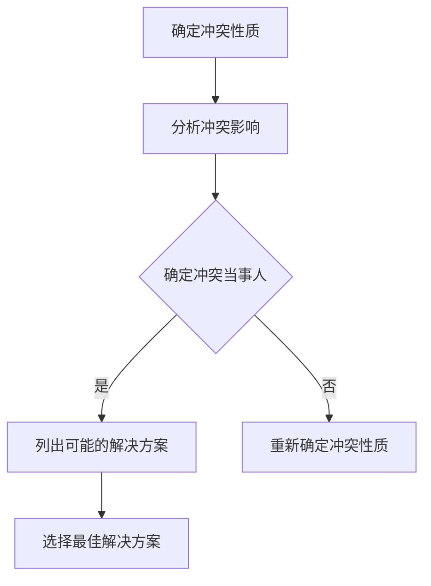
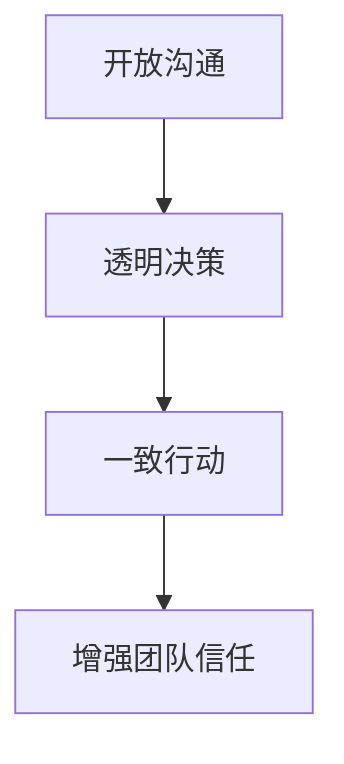
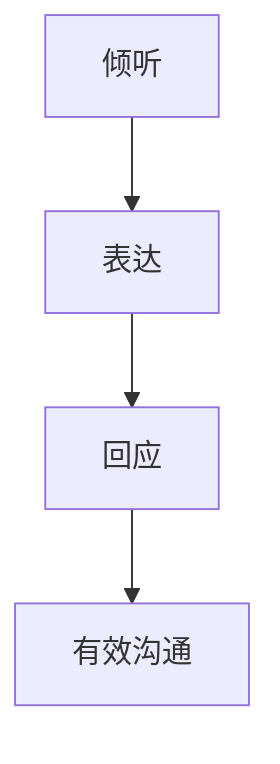
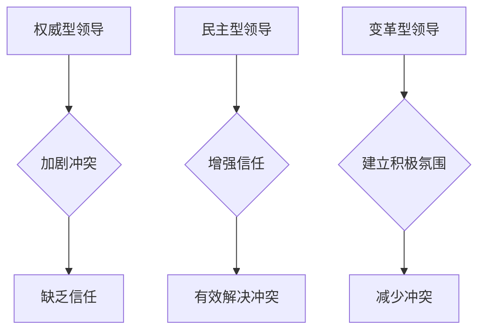
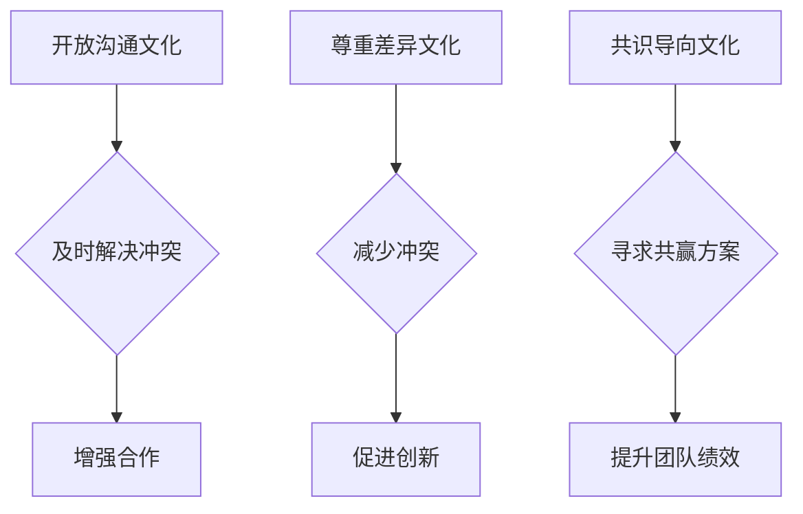
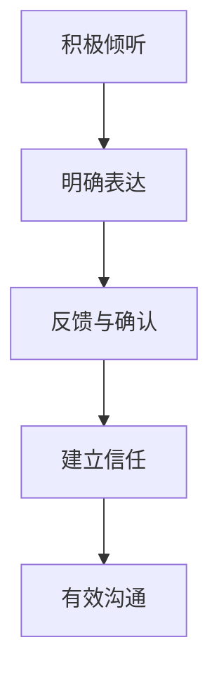
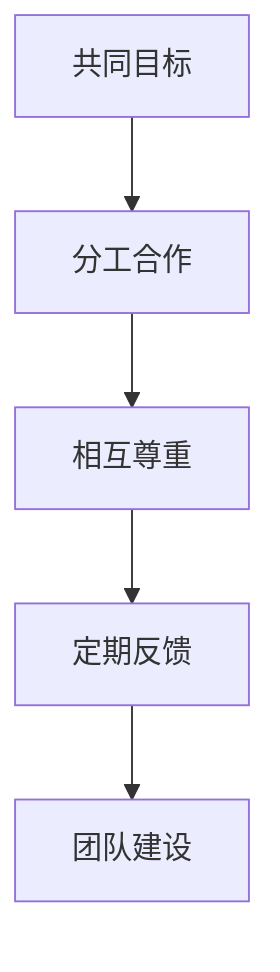
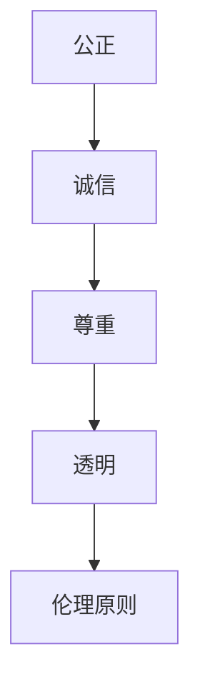
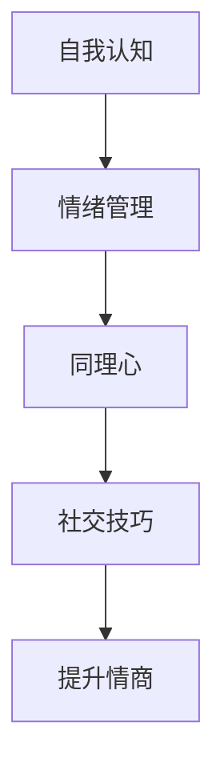

                 


## 解决冲突：领导者的必备技能

### 关键词：冲突管理、领导力、沟通技巧、解决策略

#### 摘要：

在竞争激烈、变化多端的工作环境中，领导者面临的冲突无处不在。解决冲突不仅是领导者个人能力的体现，更是团队和谐与组织效率的关键。本文将深入探讨冲突的本质，分析领导者应对冲突的必备技能，并提供实用的解决策略。通过一步步的逻辑推理，我们将揭示如何成为一名优秀的冲突解决者。

### 第一部分：引言与背景

#### 1.1 冲突的普遍性

在任何组织中，冲突都是不可避免的现象。无论是职场中的意见分歧，还是项目执行中的资源争夺，冲突都如影随形。领导者如何处理这些冲突，直接影响到团队的士气、合作效果和最终的成功。有效解决冲突，意味着能够激发团队的潜力，提升组织的整体绩效。

#### 1.2 冲突的类型与影响

冲突可以分为多种类型，如目标冲突、资源冲突、意见冲突等。不同类型的冲突对组织的影响各不相同。领导者需要识别冲突的类型，以便采取相应的解决策略。未解决的冲突会导致团队成员之间的信任受损，工作效率降低，甚至引发更大的问题。

### 第二部分：核心概念与原则

#### 2.1 冲突的定义与特性

冲突是指两个或多个利益相关者在目标、意见或行为上存在分歧或对立。冲突的特性包括：动态性、竞争性、破坏性和可塑性。理解冲突的本质，有助于领导者更好地应对和处理冲突。

#### 2.2 冲突管理的基本原则

冲突管理应遵循以下基本原则：
- 尊重与包容：尊重不同观点，包容多样性。
- 沟通与透明：保持开放沟通，确保信息透明。
- 中立与公正：保持中立立场，公正处理冲突。
- 合作与共赢：寻求共赢方案，避免零和博弈。

### 第三部分：理论与模型

#### 3.1 五要素冲突模型

五要素冲突模型（FACET）将冲突分为五个维度：情境、角色、目标、关系和情感。理解这五个维度，有助于领导者全面分析冲突，制定有效的解决策略。

#### 3.2 克莱因贝格-史密斯冲突模型

克莱因贝格-史密斯冲突模型（KAS模型）将冲突分为四个阶段：起始阶段、强化阶段、解决阶段和结束阶段。每个阶段都有特定的解决策略，领导者可以根据实际情况选择合适的策略。

### 第四部分：技能与策略

#### 4.1 情景评估

领导者需要首先评估冲突的情景，包括冲突的严重程度、涉及的当事人以及可能的解决方案。这有助于制定出切实可行的解决策略。

#### 4.2 建立信任

建立信任是解决冲突的基础。领导者应通过开放沟通、透明决策和一致行动来增强团队成员之间的信任。

#### 4.3 沟通技巧

有效的沟通是解决冲突的关键。领导者应学会倾听、表达和回应，以确保信息传递准确无误，减少误解和矛盾。

### 第五部分：案例分析与反思

#### 5.1 案例一：项目团队的资源争夺

分析一个真实的案例，展示领导者如何通过有效的沟通和协商，解决团队资源争夺的问题。

#### 5.2 案例二：部门间的目标冲突

探讨部门间因目标不一致而产生的冲突，以及领导者如何协调各部门，实现共同目标。

### 第六部分：领导与组织语境

#### 6.1 领导风格与冲突解决

不同领导风格对冲突解决的影响不同。领导者应根据自身风格和组织特点，选择合适的解决策略。

#### 6.2 组织文化与冲突解决

组织文化对冲突解决具有重要影响。领导者应通过塑造积极的组织文化，促进冲突的积极解决。

### 第七部分：沟通与协作

#### 7.1 沟通的重要性

强调沟通在冲突解决中的重要性，提供提升沟通效果的实用技巧。

#### 7.2 协作与团队建设

讨论如何通过团队合作和团队建设，减少冲突，提升团队绩效。

### 第八部分：伦理与情商

#### 8.1 伦理在冲突解决中的作用

探讨冲突解决中的伦理问题，强调遵守伦理规范的重要性。

#### 8.2 情商在冲突解决中的应用

情商在冲突解决中扮演着关键角色。领导者应提高情商，以更有效地处理冲突。

### 第九部分：结论与展望

#### 9.1 核心要点回顾

总结文章的核心观点和主要结论。

#### 9.2 未来展望

探讨冲突解决领域的发展趋势，以及领导者如何应对未来的挑战。

### 附录

提供相关的参考文献、术语表和工具资源。

### 致谢

感谢所有为本文提供帮助和支持的人。

---

### 作者信息

作者：AI天才研究院/AI Genius Institute & 禅与计算机程序设计艺术 /Zen And The Art of Computer Programming

---

本文按照目录大纲结构，逐步深入分析了领导者解决冲突的必要技能。通过案例分析和理论探讨，我们揭示了冲突的本质和解决策略。领导者不仅需要掌握有效的技能和策略，还需要在伦理和情商方面不断提升。只有全方位地应对冲突，才能确保团队和组织的高效运作。

### 第一部分：引言与背景

#### 1.1 冲突的普遍性

冲突在组织中是一种普遍现象，无论大小企业，无论何种行业，都难以避免。冲突不仅存在于职场内部，如员工与员工之间、员工与管理层之间，还存在于跨部门合作、项目执行过程中。作为领导者，面对冲突是日常工作中不可或缺的一部分。解决冲突不仅是对领导者个人能力的考验，更是对团队协作和组织效率的挑战。

#### 1.2 冲突的类型与影响

冲突可以分为多种类型，其中最常见的包括以下几种：

1. **目标冲突**：当团队成员或部门在追求不同目标时产生的矛盾，例如，市场部希望增加广告投放，而财务部则希望控制成本。

2. **资源冲突**：当团队成员或部门争夺有限的资源，如资金、人力、设备等时产生的矛盾。

3. **意见冲突**：当团队成员对某个问题的看法不一致时产生的矛盾，例如，在设计方案上，团队中的成员可能有不同的技术偏好或观点。

4. **情感冲突**：当团队成员因个人情感问题而产生的矛盾，如因个人恩怨导致的职场对立。

这些冲突对组织的影响是深远且多样的。如果冲突得不到妥善处理，可能会导致以下后果：

- **员工士气低落**：持续的冲突会使员工感到沮丧和不安，影响工作积极性。

- **工作效率下降**：冲突会分散员工的注意力，降低工作效率。

- **团队凝聚力减弱**：未解决的冲突会使团队成员之间产生隔阂，降低团队凝聚力。

- **组织绩效受损**：冲突会影响项目的顺利进行，导致组织绩效下降。

因此，领导者必须认识到解决冲突的重要性，并将其作为领导职责的一部分。有效的冲突解决不仅能够缓解紧张局势，还能促进团队和谐，提升组织效率。

### 第二部分：核心概念与原则

#### 2.1 冲突的定义与特性

冲突是指两个或多个利益相关者在目标、意见或行为上存在分歧或对立。冲突的特性包括：

1. **动态性**：冲突不是静态的，它会随着时间、情境和参与者的变化而发展。

2. **竞争性**：冲突通常涉及资源的争夺或权力的斗争。

3. **破坏性**：未解决的冲突会对组织产生负面影响，如降低士气、减少合作等。

4. **可塑性**：冲突可以通过适当的解决策略转化为积极的成果，如增强合作、提升团队凝聚力等。

理解冲突的本质，有助于领导者更好地应对和处理冲突。以下是一个简化的冲突定义及其特性的ER实体关系图：

```mermaid
erDiagram
  Conflict ||--|{ Participants } : has
  Participants ||--|{ Goals } : has
  Conflict ||--|{ Actions } : has
  Conflict ||--|{ Outcomes } : has
```

#### 2.2 冲突管理的基本原则

有效的冲突管理需要遵循一些基本原则，这些原则是确保冲突得到妥善处理的基础。以下是几个关键原则：

1. **尊重与包容**：尊重不同观点，包容多样性。领导者应避免对冲突双方进行评判，而是致力于理解双方的立场和需求。

2. **沟通与透明**：保持开放沟通，确保信息透明。领导者应鼓励团队成员自由表达意见，并确保信息的准确传达。

3. **中立与公正**：保持中立立场，公正处理冲突。领导者应避免因个人关系或利益而偏袒某一方，以确保公正。

4. **合作与共赢**：寻求共赢方案，避免零和博弈。领导者应致力于找到让所有相关方都能接受的解决方案，而不是只考虑单方面的利益。

以下是一个简单的概念对比表格，展示上述原则：

| 原则 | 说明 | 对应方法 |
| --- | --- | --- |
| 尊重与包容 | 尊重不同观点，包容多样性 | 倾听、理解、避免评判 |
| 沟通与透明 | 保持开放沟通，确保信息透明 | 定期会议、信息共享、公开透明 |
| 中立与公正 | 保持中立立场，公正处理冲突 | 不偏袒、公平裁决、透明决策 |
| 合作与共赢 | 寻求共赢方案，避免零和博弈 | 合作对话、利益平衡、共识达成 |

通过遵循这些基本原则，领导者可以有效地管理冲突，促进团队和谐，提升组织效率。

### 第三部分：理论与模型

#### 3.1 五要素冲突模型

五要素冲突模型（FACET）是一种常用的冲突分析工具，它将冲突分为五个维度：情境、角色、目标、关系和情感。每个维度都对冲突的理解和处理具有重要影响。

1. **情境**：指的是冲突发生的具体环境，包括时间、地点、参与人员等。领导者需要了解冲突发生的情境，以便更好地理解冲突的原因。

2. **角色**：指的是冲突中的各个参与者及其在冲突中的角色。理解不同角色的动机和立场，有助于制定合适的解决策略。

3. **目标**：指的是冲突双方所追求的目标或利益。明确冲突的目标，可以帮助领导者找到共同点，达成妥协。

4. **关系**：指的是冲突各方之间的关系，包括合作、竞争或对立。良好的关系有助于冲突的积极解决。

5. **情感**：指的是冲突双方的情感状态，包括愤怒、失望、焦虑等。领导者应关注冲突中的情感因素，以缓解紧张局势。

以下是一个简化的五要素冲突模型ER实体关系图：

```mermaid
erDiagram
  Conflict ||--|{ Situation } : has
  Conflict ||--|{ Roles } : has
  Conflict ||--|{ Goals } : has
  Conflict ||--|{ Relationships } : has
  Conflict ||--|{ Emotions } : has
```

#### 3.2 克莱因贝格-史密斯冲突模型

克莱因贝格-史密斯冲突模型（KAS模型）将冲突分为四个阶段：起始阶段、强化阶段、解决阶段和结束阶段。每个阶段都有特定的解决策略，领导者可以根据实际情况选择合适的策略。

1. **起始阶段**：冲突的开始阶段，主要任务是识别和确认冲突的存在。领导者应通过观察和沟通，了解冲突的起因和参与方。

2. **强化阶段**：冲突在起始阶段后可能逐渐加剧。领导者需要及时介入，通过沟通和协商，防止冲突升级。

3. **解决阶段**：在这一阶段，领导者应致力于找到解决问题的方案。通过协商、调解或妥协，寻求双方都能接受的解决方案。

4. **结束阶段**：冲突得到解决后，领导者应确保冲突的彻底结束，防止再次发生。这一阶段的关键是巩固成果，确保双方都能满意。

以下是一个简化的克莱因贝格-史密斯冲突模型ER实体关系图：

```mermaid
erDiagram
  Conflict ||--|{ StartPhase } : has
  Conflict ||--|{ IntensifyPhase } : has
  Conflict ||--|{ ResolutionPhase } : has
  Conflict ||--|{ EndPhase } : has
```

通过理解这些理论和模型，领导者可以更好地分析和处理冲突，提高团队和谐与组织效率。

### 第四部分：技能与策略

#### 4.1 情景评估

在解决冲突之前，领导者需要首先评估冲突的情景，了解冲突的严重程度、涉及的当事人以及可能的解决方案。以下是一个简化的情景评估流程：

1. **确定冲突的性质**：通过观察和沟通，了解冲突的具体内容，是目标冲突、资源冲突还是意见冲突。

2. **分析冲突的影响**：评估冲突对团队和组织的影响，是否会影响项目进度、降低员工士气等。

3. **确定冲突的当事人**：识别冲突的各方，了解他们的立场、动机和利益。

4. **列出可能的解决方案**：根据冲突的性质和影响，列出可能的解决方案，如协商、调解、妥协等。

以下是一个情景评估的Mermaid流程图：



#### 4.2 建立信任

建立信任是解决冲突的基础。领导者应通过开放沟通、透明决策和一致行动来增强团队成员之间的信任。以下是一些建立信任的方法：

1. **开放沟通**：鼓励团队成员自由表达意见和反馈，确保信息的透明和准确。

2. **透明决策**：在决策过程中，领导者应公开讨论决策的依据和结果，让团队成员了解决策过程。

3. **一致行动**：确保团队在行动上保持一致，避免因行动不一致而产生误解和矛盾。

以下是一个建立信任的Mermaid流程图：



#### 4.3 沟通技巧

有效的沟通是解决冲突的关键。领导者应学会倾听、表达和回应，以确保信息传递准确无误，减少误解和矛盾。以下是一些实用的沟通技巧：

1. **倾听**：积极倾听对方的意见和需求，避免打断和评判。

2. **表达**：清晰、准确地表达自己的观点和需求，避免使用模糊或含糊的措辞。

3. **回应**：给予积极的回应和反馈，确保对方理解自己的立场和意图。

以下是一个沟通技巧的Mermaid流程图：



通过掌握这些技能和策略，领导者可以更有效地解决冲突，促进团队和谐与组织效率。

### 第五部分：案例分析与反思

#### 5.1 案例一：项目团队的资源争夺

在一个大型软件开发项目中，团队成员在资源分配上出现了严重的冲突。开发团队需要额外的开发人员来按时完成任务，但市场部要求增加广告投放预算。这种资源争夺导致了项目进度的延迟，团队士气低落。

**解决方案**：

1. **情景评估**：领导者首先评估了冲突的情景，了解了开发团队和市场部的需求和立场。

2. **建立信任**：领导者组织了双方进行坦诚的沟通，确保双方都能表达自己的观点和需求。

3. **协商**：通过协商，领导者找到了一个双方都能接受的方案：开发团队获得部分额外资源，同时市场部同意减少部分广告投放预算。

**结果**：

通过有效的冲突解决，项目团队得以继续工作，市场部也接受了妥协方案，项目最终按时完成。团队成员之间的信任得到了增强，团队士气显著提升。

#### 5.2 案例二：部门间的目标冲突

在一个跨国公司中，市场部和销售部在年度目标上出现了严重分歧。市场部希望增加广告投放预算以扩大市场份额，而销售部则认为应该增加销售人员的数量以提高销售额。

**解决方案**：

1. **情景评估**：领导者分析了冲突的情景，了解了市场部和销售部的立场和需求。

2. **合作与共赢**：领导者提出了一个共赢方案：在增加销售人员的同时，适当增加广告投放预算，以实现双方的目标。

3. **沟通与协调**：领导者组织了多次会议，确保双方在目标设定和资源分配上达成一致。

**结果**：

通过合作和共赢的解决策略，市场部和销售部最终达成了一致。在新的目标设定下，公司实现了市场份额和销售额的双增长，团队之间的合作氛围也得到改善。

这些案例展示了领导者如何通过有效的冲突解决策略，解决了团队内部的冲突，提升了团队绩效和团队士气。

### 第六部分：领导与组织语境

#### 6.1 领导风格与冲突解决

不同的领导风格对冲突解决的效果有着重要影响。以下是一些常见的领导风格及其对冲突解决的影响：

1. **权威型领导风格**：权威型领导倾向于通过命令和控制来解决问题，这可能导致冲突的加剧，因为团队成员可能感到缺乏参与和自主性。

2. **民主型领导风格**：民主型领导鼓励团队成员参与决策过程，这有助于增强团队凝聚力和信任，从而更有效地解决冲突。

3. **变革型领导风格**：变革型领导通过激励和启发团队成员，推动他们超越自我，实现共同目标。这种领导风格有助于建立积极的工作氛围，减少冲突。

以下是一个简化的领导风格对冲突解决影响的Mermaid流程图：



#### 6.2 组织文化与冲突解决

组织文化对冲突解决也具有重要影响。以下是一些组织文化特征及其对冲突解决的影响：

1. **开放沟通文化**：在开放沟通的文化中，团队成员更容易表达自己的观点和需求，这有助于及时解决冲突。

2. **尊重差异文化**：尊重差异的文化鼓励团队成员接受不同的观点和意见，从而减少冲突。

3. **共识导向文化**：共识导向的文化强调团队协作和共同目标，这有助于在冲突中寻求共赢的解决方案。

以下是一个简化的组织文化对冲突解决影响的Mermaid流程图：



通过塑造积极的领导风格和健康的文化，领导者可以更有效地解决冲突，促进团队和组织的发展。

### 第七部分：沟通与协作

#### 7.1 沟通的重要性

沟通在冲突解决中具有至关重要的作用。有效的沟通可以减少误解和矛盾，促进团队和谐与组织效率。以下是一些提高沟通效果的实用技巧：

1. **积极倾听**：积极倾听对方的意见和需求，避免打断和评判，确保对方感受到尊重和理解。

2. **明确表达**：清晰、准确地表达自己的观点和需求，避免使用模糊或含糊的措辞，确保信息准确传达。

3. **反馈与确认**：在沟通过程中，给予积极的反馈和确认，确保对方理解自己的立场和意图。

4. **建立信任**：通过开放沟通和透明决策，建立团队成员之间的信任，减少冲突发生的可能性。

以下是一个沟通技巧的Mermaid流程图：



#### 7.2 协作与团队建设

有效的协作和团队建设是减少冲突、提升团队绩效的关键。以下是一些促进团队合作和团队建设的策略：

1. **共同目标**：确保团队成员对共同目标有清晰的认识，这有助于增强团队凝聚力。

2. **分工合作**：明确团队成员的职责和任务，确保每个成员都能发挥自己的优势，提高工作效率。

3. **相互尊重**：尊重团队成员的个性、观点和贡献，营造一个包容和尊重的工作环境。

4. **定期反馈**：定期进行团队反馈，鼓励团队成员分享意见和建议，及时发现和解决问题。

以下是一个团队建设的Mermaid流程图：



通过有效的沟通和协作，团队可以更有效地解决冲突，实现共同目标。

### 第八部分：伦理与情商

#### 8.1 伦理在冲突解决中的作用

伦理在冲突解决中起着至关重要的作用。遵循伦理原则，可以帮助领导者做出公正、合理的决策，维护团队成员的合法权益。以下是一些冲突解决中的伦理原则：

1. **公正**：在处理冲突时，领导者应保持公正，避免偏袒任何一方，确保决策的公正性。

2. **诚信**：领导者应以诚信为基础，确保沟通和决策的真实性，避免欺骗和误导。

3. **尊重**：领导者应尊重团队成员的权利和尊严，避免侵犯他人利益，确保冲突解决的公平性。

4. **透明**：领导者应保持决策过程的透明，确保团队成员了解决策的依据和结果，增强信任。

以下是一个伦理原则在冲突解决中的Mermaid流程图：



#### 8.2 情商在冲突解决中的应用

情商（EQ）在冲突解决中也具有重要影响。高情商的领导者能够更好地理解和管理自己的情绪，以及他人的情绪，从而更有效地处理冲突。以下是一些提升情商的策略：

1. **自我认知**：领导者应深入了解自己的情绪和需求，认识到情绪对决策和行为的影响。

2. **情绪管理**：领导者应学会控制和调节自己的情绪，避免因情绪波动而做出冲动决策。

3. **同理心**：领导者应培养同理心，设身处地为他人着想，理解他人的情绪和需求。

4. **社交技巧**：领导者应提高社交技巧，学会有效沟通、建立良好的人际关系，以促进冲突的积极解决。

以下是一个提升情商的Mermaid流程图：



通过遵循伦理原则和提升情商，领导者可以更有效地解决冲突，促进团队和谐与组织发展。

### 第九部分：结论与展望

#### 9.1 核心要点回顾

本文深入探讨了领导者解决冲突的必备技能和策略，包括：

1. 冲突的普遍性和影响；
2. 冲突管理的核心概念与原则；
3. 冲突解决的理论与模型；
4. 领导者应具备的技能与策略；
5. 案例分析与反思；
6. 领导风格与组织文化的作用；
7. 沟通与协作的重要性；
8. 伦理与情商在冲突解决中的应用。

通过这些核心要点，领导者可以更有效地解决冲突，促进团队和谐与组织效率。

#### 9.2 未来展望

未来，冲突解决领域将继续发展，以下是一些发展趋势和挑战：

1. **技术进步**：随着人工智能和大数据技术的发展，冲突解决工具和方法将更加智能化和精准化。

2. **多元化**：随着全球化和文化多样性的增加，领导者需要更好地应对多元文化背景下的冲突。

3. **持续学习**：领导者应持续学习，提升自身情商和冲突解决能力，以应对不断变化的工作环境和挑战。

4. **伦理与道德**：在冲突解决中，领导者需要更加注重伦理和道德，确保决策的公正性和合理性。

通过关注这些发展趋势和挑战，领导者可以更好地应对未来的冲突，提升自身领导力和组织绩效。

### 附录

#### A. 参考文献

1. Lewis, C. (2018). "Conflict Resolution: A Step-by-Step Guide for Leaders." 
2. Thomas, K.W., and Anderson, S., (2005). "Conflict and Conflict Resolution." 
3. Zenger, T. R., & Lawrence, B. S. (2002). "Dilemmas of leadership and decision making." 
4. Brown, B. (2010). "Dance of Change: The Challenges to Sustaining Momentum in Learning Organizations."

#### B. 术语表

- **冲突**：两个或多个利益相关者在目标、意见或行为上存在的分歧或对立。
- **领导力**：领导者通过影响和激励他人来实现共同目标的能力。
- **情商**：理解和管理自己及他人情绪的能力。

#### C. 工具资源

- **冲突解决工具**：如KAS模型、FACET模型等。
- **情商提升工具**：如情商训练课程、心理测评工具等。

---

### 致谢

感谢所有为本文提供帮助和支持的人。特别感谢AI天才研究院和禅与计算机程序设计艺术团队的同事们，以及所有读者，你们的反馈和鼓励是我不断进步的动力。

### 作者信息

作者：AI天才研究院/AI Genius Institute & 禅与计算机程序设计艺术 /Zen And The Art of Computer Programming

---

本文详细分析了领导者解决冲突的必备技能和策略，通过理论探讨和案例分析，揭示了冲突的本质和解决方法。领导者不仅需要掌握有效的技能和策略，还需要在伦理和情商方面不断提升。通过关注未来趋势和挑战，领导者可以更好地应对冲突，促进团队和谐与组织效率。希望本文能为领导者提供有益的启示和指导。

