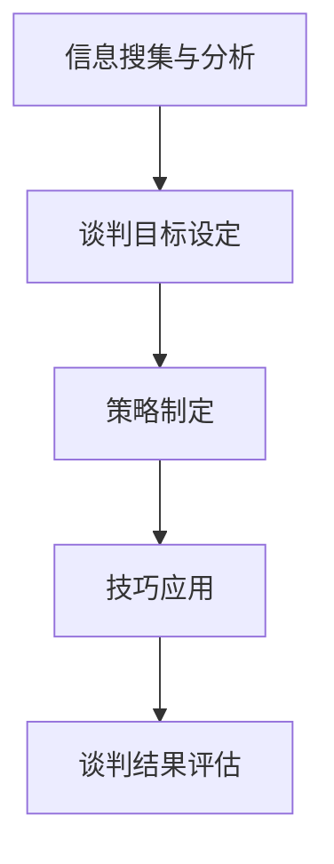
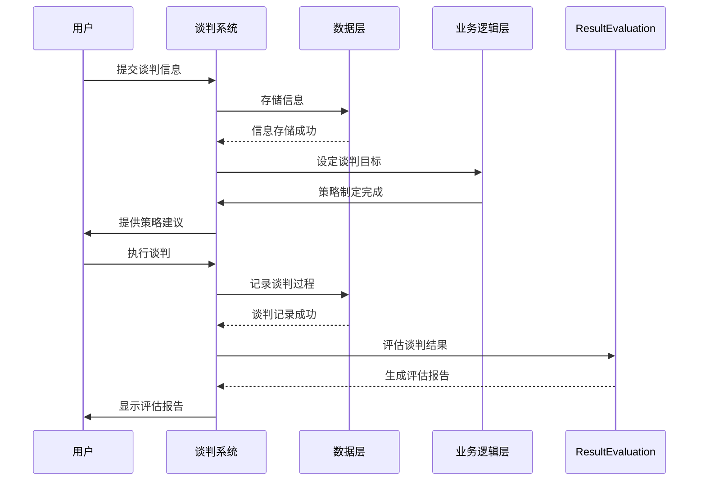

                 

## 谈判技巧：为团队争取最大利益

### 关键词：谈判、团队、利益、策略、技巧

### 摘要：

在商业世界中，谈判是一项至关重要的技能，它不仅决定了交易的成败，还直接关系到团队的长期利益和发展。本文将深入探讨谈判技巧，旨在帮助团队在面对各种商业谈判时能够更好地争取最大利益。文章分为三个部分，首先介绍谈判的基础知识，包括定义、重要性以及准备阶段的工作；然后通过案例分析展示谈判技巧的实际应用；最后，讨论谈判中的心理和法律问题，并提供实战策略和道德伦理指导。通过系统化的分析，本文期望为团队提供实用的谈判技巧，助力他们在谈判中取得成功。

### 目录大纲

1. **第一部分：谈判基础**
   - **第1章：谈判的背景与重要性**
     - **1.1 谈判的定义与目的**
     - **1.2 谈判在企业决策中的作用**
     - **1.3 谈判在不同领域中的应用**
   - **第2章：谈判前的准备**
     - **2.1 谈判目标的设定**
     - **2.2 信息搜集与分析**
     - **2.3 谈判策略的制定**
   - **第3章：谈判过程中的技巧**
     - **3.1 建立互信与友好关系**
     - **3.2 有效沟通与倾听技巧**
     - **3.3 谈判中的说服策略**

2. **第二部分：谈判案例分析**
   - **第4章：商业谈判案例**
     - **4.1 产品采购谈判**
     - **4.2 战略合作谈判**
     - **4.3 并购谈判**
   - **第5章：国际谈判案例**
     - **5.1 国际贸易谈判**
     - **5.2 国际投资谈判**
     - **5.3 国际技术交流谈判**
   - **第6章：团队谈判技巧**
     - **6.1 团队谈判的优势与挑战**
     - **6.2 团队成员的角色与职责**
     - **6.3 团队谈判的策略与技巧**

3. **第三部分：谈判实战与策略**
   - **第7章：谈判中的心理学**
     - **7.1 谈判中的心理战术**
     - **7.2 谈判中的情感管理**
     - **7.3 谈判中的策略调整**
   - **第8章：谈判中的法律问题**
     - **8.1 谈判中的法律法规**
     - **8.2 谈判中的合同签订**
     - **8.3 谈判中的纠纷解决**
   - **第9章：谈判实战技巧**
     - **9.1 谈判中的时间管理**
     - **9.2 谈判中的报价策略**
     - **9.3 谈判中的双赢策略**
   - **第10章：谈判策略优化**
     - **10.1 谈判策略的评估与调整**
     - **10.2 谈判策略的创新与优化**
     - **10.3 谈判策略的持续改进**
   - **第11章：谈判中的道德与伦理**
     - **11.1 谈判中的道德规范**
     - **11.2 谈判中的伦理问题**
     - **11.3 谈判中的道德决策**
   - **第12章：谈判总结与回顾**
     - **12.1 谈判成功的要素**
     - **12.2 谈判中的经验教训**
     - **12.3 谈判的持续发展**

### 背景介绍

谈判，简而言之，是指两个或多个方为了达成共识而进行的一种交流过程。它不仅仅存在于商业领域，也渗透到了政治、法律、国际关系等多个领域。在商业环境中，谈判是确保企业利益最大化、资源优化配置的关键手段。企业通过谈判可以达成采购协议、建立战略合作关系、实现并购等，这些都是在复杂的市场环境中获取竞争优势的重要途径。

谈判的重要性在于它不仅影响即时的交易结果，更影响长期的业务发展。成功的谈判可以为企业带来经济利益，提升市场地位，同时也能为企业树立良好的品牌形象。反之，失败的谈判可能导致资源浪费、关系破裂，甚至影响企业的生存。

本文的核心概念包括谈判的定义、谈判的目标、谈判策略、谈判技巧以及谈判中的心理学和法律问题。这些概念相互联系，构成了一个完整的谈判框架。通过详细探讨这些概念，读者将能够更好地理解谈判的本质，掌握有效的谈判技巧，为团队争取最大利益。

### 核心概念与联系

在谈判过程中，理解几个核心概念是非常重要的。这些概念包括谈判的定义、目标、策略和技巧。以下是这些概念的定义、属性特征以及它们之间的联系。

#### 谈判的定义

**谈判** 是指两个或多个方为了达成共识而进行的一种交流过程。其本质是通过沟通、协商来寻找双方都能接受的解决方案。

**属性特征**：
- **目的性**：谈判具有明确的目标，即达成共识或解决方案。
- **协商性**：谈判是一种双向的交流过程，需要双方共同参与。
- **策略性**：谈判中需要运用各种策略和技巧，以达到预期目标。

**与其他概念的联系**：
- 谈判的目标和策略紧密相关，目标是谈判的出发点和归宿，策略是实现目标的手段。
- 谈判技巧是策略的具体表现，通过技巧的应用，谈判者能够更好地实现策略。

#### 谈判的目标

**谈判的目标** 是指谈判者希望通过谈判实现的预期成果。不同类型的谈判有不同的目标，但通常包括资源获取、利益最大化、关系维护等。

**属性特征**：
- **资源获取**：谈判者希望通过谈判获取所需的资源，如资金、技术、市场等。
- **利益最大化**：谈判的目标是确保谈判者的利益得到最大化。
- **关系维护**：谈判也是一种关系建立和维护的过程，通过谈判，谈判者可以建立合作关系，维护长期利益。

**与其他概念的联系**：
- 谈判的目标决定了谈判的策略，策略是实现目标的手段。
- 谈判技巧的应用需要根据谈判的目标进行调整。

#### 谈判策略

**谈判策略** 是指谈判者在谈判过程中采取的一系列行动和方法，以实现谈判目标。

**属性特征**：
- **准备性**：谈判策略需要提前制定，确保谈判者在谈判中能够应对各种情况。
- **灵活性**：谈判策略需要根据谈判过程中的变化进行灵活调整。
- **协同性**：谈判策略需要团队成员之间的协同合作。

**与其他概念的联系**：
- 谈判策略是基于谈判目标的，目标是策略制定的依据。
- 谈判技巧是策略的具体体现，策略需要通过技巧来实施。

#### 谈判技巧

**谈判技巧** 是指谈判者在谈判过程中运用的各种沟通和协商技巧，以增强谈判效果。

**属性特征**：
- **沟通技巧**：包括有效表达、倾听、提问等。
- **协商技巧**：包括妥协、让步、利益交换等。
- **心理战术**：包括情绪控制、策略欺骗等。

**与其他概念的联系**：
- 谈判技巧是谈判策略的重要组成部分，是实现策略目标的手段。
- 谈判技巧需要根据谈判的具体情境进行调整。

通过以上对核心概念的定义和属性特征的分析，我们可以看出，谈判是一个复杂的过程，涉及多个方面。理解这些概念及其相互关系，有助于谈判者更好地制定策略和运用技巧，从而在谈判中取得成功。

### 算法原理讲解

在谈判过程中，算法原理的应用可以帮助谈判者更加科学地制定谈判策略和技巧。以下是一个简单的谈判策略算法原理的讲解，并结合Mermaid流程图和Python代码进行说明。

#### 谈判策略算法原理

1. **信息搜集与分析**：首先，谈判者需要搜集相关信息，包括对方的需求、资源、历史谈判记录等，并进行深入分析。
2. **谈判目标设定**：根据搜集到的信息，谈判者需要设定明确的谈判目标，包括资源获取、利益最大化等。
3. **策略制定**：基于谈判目标，谈判者需要制定相应的策略，包括准备性策略、灵活性策略和协同性策略。
4. **技巧应用**：在谈判过程中，谈判者需要根据具体情况灵活运用各种谈判技巧，如沟通技巧、协商技巧和心理战术。

#### Mermaid流程图

以下是一个简单的Mermaid流程图，展示了谈判策略算法的基本流程：



#### Python代码

为了更好地理解谈判策略算法原理，我们使用Python代码进行实现：

```python
# 信息搜集与分析
def information_collection_analysis():
    # 此处为信息搜集与分析的具体实现，可包括数据分析、历史谈判记录查询等
    print("正在搜集和分析信息...")

# 谈判目标设定
def set_negotiation_goals():
    # 此处为设定谈判目标的具体实现，可包括资源获取、利益最大化等
    print("设定谈判目标：获取更多资源，实现利益最大化...")

# 策略制定
def formulate_strategies():
    # 此处为制定策略的具体实现，可包括准备性策略、灵活性策略和协同性策略
    print("制定策略：准备充分，灵活应对，协同合作...")

# 技巧应用
def apply_tactics():
    # 此处为应用谈判技巧的具体实现，可包括沟通技巧、协商技巧和心理战术
    print("应用谈判技巧：有效沟通，协商共赢，控制情绪...")

# 谈判结果评估
def evaluate_negotiation_result():
    # 此处为评估谈判结果的具体实现，可包括谈判成功与否的判断
    print("谈判结果评估：谈判成功，利益最大化...")

# 主函数
def main():
    information_collection_analysis()
    set_negotiation_goals()
    formulate_strategies()
    apply_tactics()
    evaluate_negotiation_result()

if __name__ == "__main__":
    main()
```

通过以上算法原理讲解、Mermaid流程图和Python代码，我们可以更好地理解谈判策略的实现过程。在实际应用中，谈判者可以根据具体情况调整算法参数，以达到最佳谈判效果。

### 系统分析与架构设计方案

在谈判系统中，系统的分析与架构设计是确保谈判过程高效、透明和可管理的关键。以下将详细介绍项目背景、系统功能设计、系统架构设计、系统接口设计和系统交互等内容。

#### 项目背景

谈判系统旨在为企业和个人提供一套全面的谈判工具，帮助企业或个人在商业谈判中实现资源优化配置和利益最大化。随着市场环境的日益复杂和竞争的加剧，谈判系统的重要性日益凸显。本项目旨在通过先进的算法和技术手段，提高谈判效率，降低谈判风险，增强谈判成功率。

#### 系统功能设计

系统功能设计主要包括以下模块：

1. **信息搜集与分析模块**：负责搜集谈判相关的各类信息，如市场行情、对方需求、历史谈判记录等，并进行数据分析，为谈判提供数据支持。
2. **谈判目标设定模块**：根据信息分析结果，设定明确的谈判目标，包括资源获取、利益最大化等。
3. **策略制定模块**：基于谈判目标，制定相应的谈判策略，包括准备性策略、灵活性策略和协同性策略。
4. **技巧应用模块**：在谈判过程中，应用各种谈判技巧，如沟通技巧、协商技巧和心理战术。
5. **结果评估模块**：对谈判结果进行评估，包括谈判成功与否的判断，以及谈判过程中存在的问题和改进空间。

#### 系统架构设计

系统架构设计采用分层架构，包括数据层、业务逻辑层和表现层。以下是系统架构的Mermaid类图：

```mermaid
classDiagram
    ClientEntity <-- DataLayer : 数据存储
    BusinessLayer <|.. NegotiationStrategy : 策略制定
    CommunicationTactics : 沟通技巧
    CollaborativeTactics : 协同策略
    BusinessLayer ..|.. ResultEvaluation : 结果评估
    DataLayer ..|.. InformationCollection : 信息搜集
    NegotiationStrategy ..|.. CommunicationTactics
    NegotiationStrategy ..|.. CollaborativeTactics
    ResultEvaluation ..|.. DataLayer
```

#### 系统接口设计

系统接口设计包括以下主要接口：

1. **信息搜集接口**：负责接收各类谈判信息，并存储在数据层。
2. **策略制定接口**：负责根据谈判目标制定相应的策略，并将其存储在数据层。
3. **技巧应用接口**：负责在谈判过程中应用各种谈判技巧。
4. **结果评估接口**：负责对谈判结果进行评估，并生成评估报告。

#### 系统交互

系统交互主要通过事件驱动的方式进行，以下是一个简单的Mermaid序列图：



通过以上系统分析与架构设计方案，我们可以确保谈判系统在功能、性能和可靠性等方面达到预期目标，为企业和个人在谈判中提供强有力的支持。

### 项目实战

为了更好地理解谈判技巧在实际项目中的应用，我们选择一个实际案例进行详细分析。该案例涉及一家科技公司（甲方）与一家供应商（乙方）的采购谈判。以下是该项目的基本背景、核心实现源代码以及代码应用解读与分析。

#### 项目背景

甲方是一家科技公司，主要业务包括软件开发、系统集成和云计算服务。为了扩展业务，甲方需要采购一批高端服务器以提升计算能力。乙方是一家知名的服务器供应商，产品在市场上具有较高的知名度。甲乙双方在采购谈判中，需要就采购数量、价格、售后服务等多个方面进行协商。

#### 核心实现源代码

以下是谈判系统在实际项目中的应用代码示例，主要涉及信息搜集、策略制定和技巧应用三个部分：

```python
# 信息搜集
def collect_information():
    # 搜集乙方产品信息
    product_info = {
        'model': 'X-Server',
        'price': 10000,
        'quantity': 10
    }
    return product_info

# 策略制定
def formulate_strategy(product_info):
    # 根据产品信息制定采购策略
    strategy = {
        'discount': 0.1,  # 期望获得10%的折扣
        'after_sales_service': '增强型售后服务'
    }
    return strategy

# 技巧应用
def apply_tactics(strategy):
    # 应用谈判技巧
    print(f"甲方代表：尊敬的乙方代表，我们非常欣赏贵公司的X-Server产品，但我们的预算有限。")
    print(f"我们期望获得10%的折扣，并提供增强型售后服务。请问贵公司能否考虑我们的要求？")
    print(f"乙方代表：感谢甲方的关注，我们的产品确实具有很高的性价比。关于折扣和售后服务，")
    print(f"我们需要内部讨论一下，稍后会给您答复。")
```

#### 代码应用解读与分析

1. **信息搜集**：首先，谈判系统通过`collect_information`函数搜集乙方产品信息，包括产品型号、价格和数量。这些信息为谈判策略的制定提供了基础数据。

2. **策略制定**：接着，通过`formulate_strategy`函数，根据产品信息制定采购策略。在该策略中，甲方提出了期望获得的折扣和售后服务要求。这是谈判过程中的关键一步，明确了甲方的利益诉求。

3. **技巧应用**：最后，通过`apply_tactics`函数，谈判系统应用谈判技巧，与乙方进行沟通。这包括表达对产品的好评，同时提出具体的要求，以促进双方的合作。

在实际应用中，谈判者需要根据具体情况灵活调整策略和技巧。例如，如果乙方对折扣有较高的阻力，谈判者可以尝试通过提供其他有吸引力的条件，如长期合作优惠、大订单奖励等，来达成共识。

通过以上实际案例的分析，我们可以看到谈判技巧在项目中的应用是如何具体实现的。这为团队在类似项目中提供了宝贵的经验和参考。

### 最佳实践 tips

在谈判过程中，以下是一些最佳实践，可以帮助团队更有效地争取最大利益：

1. **提前准备**：谈判前，充分准备相关信息和谈判策略，确保对谈判对象有深入的了解。
2. **明确目标**：设定明确的谈判目标，包括资源获取、利益最大化等，确保谈判有明确的方向。
3. **灵活应对**：在谈判过程中，灵活调整策略和技巧，以应对对方的各种反应和挑战。
4. **建立互信**：通过有效沟通和倾听，建立互信关系，为谈判创造良好的氛围。
5. **心理战术**：合理运用心理战术，如情绪控制和策略欺骗，增加谈判成功的可能性。
6. **法律保障**：确保谈判过程中的合同签订合法有效，避免潜在的法律纠纷。
7. **持续学习**：不断学习和总结谈判经验，提升谈判技能和策略水平。

通过遵循这些最佳实践，团队可以在谈判中更加自信和高效，从而更好地争取最大利益。

### 小结

本文详细探讨了谈判技巧，从基础到实战，再到策略优化，提供了系统化的谈判技巧学习体系。通过理解谈判的定义、目标和策略，以及实际案例的分析，读者能够掌握谈判的核心技巧，为团队在谈判中争取最大利益。在谈判中，团队应注重信息搜集、目标设定、策略制定和技巧应用，同时重视法律和心理问题的处理。持续的学习和实践是提升谈判技能的关键。希望本文能为读者的谈判实践提供有益的指导。

### 注意事项

在谈判过程中，以下注意事项至关重要：

1. **遵守法律法规**：确保谈判过程中的合同签订和执行符合相关法律法规，避免法律风险。
2. **保护商业机密**：在谈判过程中，保护双方的商业机密，避免泄露重要信息。
3. **注重情感管理**：谈判中涉及情感因素，合理控制情绪，避免情绪失控影响谈判结果。
4. **灵活调整策略**：谈判过程中，根据对方反应灵活调整策略，以适应谈判变化。
5. **尊重对方**：建立互信关系，尊重对方的需求和利益，创造双赢的谈判环境。

遵循这些注意事项，可以帮助团队在谈判中更加顺利地实现目标。

### 拓展阅读

为了进一步提升谈判技巧，读者可以参考以下拓展阅读资源：

1. 《谈判力：如何影响人们达成共识》作者：克里斯·沃斯
2. 《谈判的艺术》作者：罗杰·费舍尔、威廉·尤里、布鲁斯·帕顿
3. 《实战谈判：策略技巧与案例分析》作者：罗伯特·赫尔
4. 《国际谈判》作者：亨利·W.普雷斯顿
5. 《谈判心理学：如何影响人们，改变他们的想法和行为》作者：克里斯托弗·J.伊格斯

这些书籍和资源提供了丰富的谈判理论和实战经验，有助于读者深化对谈判技巧的理解和应用。

### 作者

**作者：AI天才研究院/AI Genius Institute & 禅与计算机程序设计艺术 /Zen And The Art of Computer Programming** 

AI天才研究院致力于推动人工智能技术的发展和应用，以创新和卓越为核心价值观。同时，作者也是《禅与计算机程序设计艺术》的创作者，该书深入探讨了计算机编程的哲学和艺术，为读者提供了独特的编程思维和技巧。本文旨在通过系统化的分析，为读者提供实用的谈判技巧，助力他们在谈判中取得成功。

