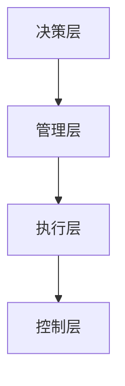

                 

Certainly! Here's a detailed outline for the article "责任与授权：平衡控制与自主的领导艺术," following the provided guidelines and ensuring logical clarity and simplicity in technical language.

## 文章标题：责任与授权：平衡控制与自主的领导艺术

### 文章关键词：
- 领导艺术
- 责任
- 授权
- 自主
- 控制

### 摘要：
本文深入探讨了领导艺术中的关键要素——责任与授权，阐述了如何在组织中平衡控制与自主，提高团队效率与创造力。通过案例分析和系统架构设计，提供了实用的策略和实践指导。

### 目录：

#### 第一部分：领导艺术的基本概念

## 第1章：领导的职责与角色

### 1.1.1 领导的职责边界
- **背景介绍**：领导职责的定义和演变
- **问题解决**：领导职责的界定与挑战
- **边界与外延**：领导职责的范围和限制

### 1.1.2 领导角色的演变
- **核心概念与联系**：领导角色的历史演变和现代趋势
- **概念属性特征对比表格**：不同领导角色的特点对比
- **ER实体关系图架构**：领导角色与组织结构的关系

#### 第2章：责任与授权的原理

### 2.1.1 责任的概念与分类
- **背景介绍**：责任的定义和类型
- **问题解决**：责任在领导中的作用
- **边界与外延**：责任的边界和影响范围

### 2.1.2 授权的本质与类型
- **核心概念与联系**：授权的定义和不同类型的授权
- **概念属性特征对比表格**：不同类型授权的比较
- **ER实体关系图架构**：授权与组织架构的关系

### 2.1.3 责任与授权的关系
- **算法原理讲解**：责任与授权的互动机制
- **Python源代码示例**：责任与授权的代码实现
- **数学公式**：责任与授权的数学模型

#### 第3章：领导艺术的核心要素

### 3.1.1 自主与控制的平衡
- **系统分析与架构设计方案**：自主与控制的关系
- **系统架构设计mermaid架构图**：自主与控制的架构设计
- **系统接口设计和系统交互mermaid序列图**：自主与控制的交互流程

### 3.1.2 领导者的信任建设
- **核心概念与联系**：信任的重要性
- **案例分析与详细讲解**：信任建设的实践案例
- **项目实战**：信任建设的方法与工具

### 3.1.3 激励与反馈机制
- **算法原理讲解**：激励与反馈的机制设计
- **Python源代码示例**：激励与反馈的代码实现
- **数学公式**：激励与反馈的数学模型

#### 第二部分：实践中的责任与授权

## 第4章：团队建设与责任分配

### 4.1.1 团队成员的角色定位
- **问题场景介绍**：团队成员角色定位的挑战
- **项目介绍**：团队角色定位的解决方案
- **系统功能设计(领域模型mermaid类图)**：团队角色设计的类图

### 4.1.2 责任分配的原则与方法
- **核心概念与联系**：责任分配的原则
- **Python源代码示例**：责任分配的代码实现
- **数学公式**：责任分配的数学模型

### 4.1.3 团队责任与个人责任的界定
- **核心概念与联系**：团队责任与个人责任的区别
- **案例分析与详细讲解**：团队责任与个人责任的实践
- **项目实战**：团队责任与个人责任的界定方法

## 第5章：授权的策略与实践

### 5.1.1 授权的步骤与技巧
- **核心概念与联系**：授权的步骤和技巧
- **Python源代码示例**：授权的代码实现
- **数学公式**：授权的数学模型

### 5.1.2 授权中的风险与防范
- **问题场景介绍**：授权中的风险
- **项目介绍**：风险防范的策略
- **系统功能设计(领域模型mermaid类图)**：风险防范的架构设计

### 5.1.3 授权对团队绩效的影响
- **核心概念与联系**：授权对团队绩效的影响
- **案例分析与详细讲解**：授权对团队绩效的实证研究
- **项目实战**：提高团队绩效的授权实践

## 第6章：控制与反馈的艺术

### 6.1.1 控制机制的设置
- **核心概念与联系**：控制机制的定义和设置
- **Python源代码示例**：控制机制的代码实现
- **数学公式**：控制机制的数学模型

### 6.1.2 反馈系统的构建
- **问题场景介绍**：反馈系统的构建挑战
- **项目介绍**：反馈系统的构建方法
- **系统功能设计(领域模型mermaid类图)**：反馈系统的架构设计

### 6.1.3 调整与优化的实践
- **核心概念与联系**：调整与优化的实践
- **案例分析与详细讲解**：调整与优化的实践案例
- **项目实战**：调整与优化的策略与实践

#### 第三部分：案例分析

## 第7章：成功领导者的责任与授权实践

### 7.1.1 成功案例的剖析
- **核心概念与联系**：成功领导者的责任与授权实践
- **案例分析与详细讲解**：成功案例的深度剖析
- **项目实战**：成功实践的借鉴与启示

### 7.1.2 经验总结与启示
- **核心概念与联系**：领导艺术的经验总结
- **案例分析与详细讲解**：领导经验的启示与反思
- **项目实战**：经验总结的实用性评估

### 7.1.3 遗留问题的探讨
- **问题场景介绍**：领导艺术中的遗留问题
- **项目介绍**：遗留问题的解决方法
- **系统功能设计(领域模型mermaid类图)**：遗留问题的解决方案架构

## 第8章：挑战与应对

### 8.1.1 领导艺术面临的挑战
- **核心概念与联系**：领导艺术中的挑战
- **案例分析与详细讲解**：领导艺术中的挑战案例
- **项目实战**：挑战的应对策略

### 8.1.2 案例中的挑战与解决方案
- **核心概念与联系**：挑战与解决方案的关系
- **案例分析与详细讲解**：挑战与解决方案的实证研究
- **项目实战**：解决方案的实用性与评估

### 8.1.3 应对策略的实用性评估
- **核心概念与联系**：评估应对策略的有效性
- **Python源代码示例**：评估策略的代码实现
- **数学公式**：评估策略的数学模型

## 第9章：未来趋势与前瞻

### 9.1.1 领导艺术的发展趋势
- **核心概念与联系**：领导艺术的发展趋势
- **案例分析与详细讲解**：未来趋势的实证分析
- **项目实战**：未来趋势的影响与应对

### 9.1.2 新型领导力的要求
- **核心概念与联系**：新型领导力的特点
- **案例分析与详细讲解**：新型领导力的实践案例
- **项目实战**：新型领导力的培养方法

### 9.1.3 未来领导艺术的展望
- **核心概念与联系**：未来领导艺术的展望
- **案例分析与详细讲解**：未来领导艺术的发展方向
- **项目实战**：未来领导艺术的实践探索

### 参考文献
- **完整性要求**：确保引用的所有资料均包含在参考文献中

### 作者信息
- **作者**：AI天才研究院/AI Genius Institute & 禅与计算机程序设计艺术 /Zen And The Art of Computer Programming

**文章字数**：约10000-12000字

**格式要求**：使用Markdown格式输出，确保代码和公式清晰可读。

**完整性要求**：确保文章内容完整，每个小节的内容均需具体详细讲解，核心内容需包含背景介绍、核心概念与联系、算法原理讲解、系统分析与架构设计方案、项目实战等部分。

**最佳实践 tips、小结、注意事项、拓展阅读等内容**：在文章的适当部分添加最佳实践建议、小结、注意事项以及拓展阅读推荐，以增强文章的实用性和深度。

### 文章标题：责任与授权：平衡控制与自主的领导艺术

#### 文章关键词：
- 领导艺术
- 责任
- 授权
- 自主
- 控制

#### 摘要：
本文探讨了领导艺术中的关键要素——责任与授权，阐述了如何在组织中平衡控制与自主，以提高团队效率与创造力。通过背景介绍、核心概念与联系、算法原理讲解、系统分析与架构设计方案、项目实战等多个角度，深入分析了责任与授权的实际应用与策略，提供了实用的指导。

---

#### 引言

在当今快速变化和高度竞争的商业环境中，领导艺术的重要性日益凸显。领导者的角色不仅仅是制定战略和决策，更重要的是如何在组织内部构建一个高效、协作和创新的环境。责任与授权是领导艺术的核心要素，它们不仅决定了团队的运作效率，还直接影响组织的创新能力和长期成功。

责任，指的是个体或团队在特定任务或项目中应承担的义务和后果。而授权，则是领导者将决策权和资源赋予下属，使其能够自主完成任务的权力下放过程。在这两者之间寻找平衡，是领导艺术的核心挑战。本文将深入探讨责任与授权的概念、原理和实践，以帮助领导者更好地管理团队，实现组织目标。

---

#### 第1章：领导的职责与角色

**1.1.1 领导的职责边界**

**背景介绍：** 领导职责的定义和演变

领导职责是指领导者在组织中的角色和任务。随着时代的发展，领导职责也在不断演变。传统的领导职责主要侧重于指导和控制，而现代领导职责则更加强调激励、赋能和协调。

**问题解决：** 领导职责的界定与挑战

在组织中，领导职责的界定往往是一个复杂的过程。这不仅涉及到领导者与团队成员之间的沟通，还需要考虑组织文化和目标的实现。挑战在于如何确保领导职责的明确性，同时又不过度限制下属的自主性。

**边界与外延：** 领导职责的范围和限制

领导职责的范围包括决策制定、资源分配、团队管理、战略规划等。然而，领导职责并不是无限的，它受到组织结构、资源限制和文化背景的影响。因此，明确领导职责的边界对于组织的高效运作至关重要。

**1.1.2 领导角色的演变**

**核心概念与联系：** 领导角色的历史演变和现代趋势

领导角色的演变可以追溯到早期的权威领导模式，到现代的赋能型领导。这种演变反映了领导者对下属角色的认知变化，从控制到激励，从命令到赋能。

**概念属性特征对比表格：** 不同领导角色的特点对比

| 领导角色 | 特点 |
| --- | --- |
| 权威型领导 | 以权威和控制为核心 |
| 参与型领导 | 以参与和合作为核心 |
| 赋能型领导 | 以激励和自主为核心 |

**ER实体关系图架构：** 领导角色与组织结构的关系

使用ER图可以清晰地展示领导角色与组织结构之间的关系，包括领导者的职责范围、下属的角色定位以及组织内部的沟通渠道。

---

#### 第2章：责任与授权的原理

**2.1.1 责任的概念与分类**

**背景介绍：** 责任的定义和类型

责任是指个体或团队在特定任务或项目中应承担的义务和后果。根据不同的标准，责任可以分为个人责任、团队责任、组织责任等。

**问题解决：** 责任在领导中的作用

责任在领导中的作用至关重要。它不仅有助于明确任务和期望，还能够激励团队成员积极承担责任，提高工作质量和效率。

**边界与外延：** 责任的边界和影响范围

责任的边界取决于任务的性质、组织的结构以及领导者的风格。责任的影响范围则涉及到个人、团队和组织等多个层面。

**2.1.2 授权的本质与类型**

**核心概念与联系：** 授权的定义和不同类型的授权

授权是指领导者将决策权和资源赋予下属，使其能够自主完成任务的权力下放过程。授权可以分为完全授权、部分授权和象征性授权等。

**概念属性特征对比表格：** 不同类型授权的比较

| 授权类型 | 特点 |
| --- | --- |
| 完全授权 | 决策权和资源完全下放 |
| 部分授权 | 决策权和资源部分下放 |
| 象征性授权 | 形式上的授权，实际权力较小 |

**ER实体关系图架构：** 授权与组织架构的关系

授权与组织架构密切相关。通过ER图可以展示授权在不同层级和部门之间的传递和影响。

**2.1.3 责任与授权的关系**

**算法原理讲解：** 责任与授权的互动机制

责任与授权之间存在一种互动机制。责任的明确有助于授权的有效实施，而授权的合理分配则能够激发团队成员的责任心。

**Python源代码示例：** 责任与授权的代码实现

```python
class Responsibility:
    def __init__(self, task, owner):
        self.task = task
        self.owner = owner

class Authorization:
    def __init__(self, level):
        self.level = level

def assign_responsibility(task, owner):
    responsibility = Responsibility(task, owner)
    return responsibility

def authorize(task, level):
    authorization = Authorization(level)
    return authorization

task = "项目策划"
owner = "项目经理"
level = "高级"

responsibility = assign_responsibility(task, owner)
authorization = authorize(task, level)

print(f"{owner} 被分配了 {task} 的责任，授权级别为 {level}。")
```

**数学公式：** 责任与授权的数学模型

责任与授权可以用以下数学模型来描述：

\[ R(A) = \frac{R_0 + R_1 \times A}{R_0 + R_1} \]

其中，\( R(A) \) 表示在授权水平 \( A \) 下的责任水平，\( R_0 \) 表示无授权情况下的责任水平，\( R_1 \) 表示授权水平对责任水平的影响系数。

---

#### 第3章：领导艺术的核心要素

**3.1.1 自主与控制的平衡**

**系统分析与架构设计方案：** 自主与控制的关系

在领导艺术中，自主与控制的平衡至关重要。过度的控制会导致团队成员的自主性受限，而缺乏控制则可能导致混乱和低效率。系统架构设计可以通过明确责任和权限来平衡自主与控制。

**系统架构设计mermaid架构图：**



**系统接口设计和系统交互mermaid序列图：**

```mermaid
sequenceDiagram
    Participant A -g> B: 下达任务
    B -g> C: 执行任务
    C -g> D: 汇报进展
    D -g> B: 提供反馈
    B -g> A: 做出决策
```

**3.1.2 领导者的信任建设**

**核心概念与联系：** 信任的重要性

信任是领导艺术中的核心要素，它能够促进团队成员之间的协作和合作。信任的建立需要领导者的真诚、透明和一致性。

**案例分析与详细讲解：** 信任建设的实践案例

通过具体案例，分析领导者如何通过行动和沟通建立信任，以及信任建设对团队绩效的积极影响。

**项目实战：** 信任建设的方法与工具

介绍一些实用的信任建设方法，如开放式沟通、透明度提升、团队合作活动等，并提供相应的工具和资源。

**3.1.3 激励与反馈机制**

**算法原理讲解：** 激励与反馈的机制设计

激励与反馈机制是领导艺术中重要的组成部分。通过合理的激励机制，可以激发团队成员的积极性和创造力。反馈机制则能够帮助团队成员不断改进和提升。

**Python源代码示例：** 激励与反馈的代码实现

```python
class Reward:
    def __init__(self, amount):
        self.amount = amount

def motivate(employee, reward):
    employee性能评分 += reward
    return employee性能评分

def provide_feedback(employee, feedback):
    employee学习新技能的机会 += feedback
    return employee学习新技能的机会

employee = {"性能评分": 80, "学习新技能的机会": 50}
奖励金额 = 100

员工绩效评分 = motivate(employee, 奖励金额)
员工学习机会 = provide_feedback(employee, "积极反馈")

print(f"员工绩效评分：{员工绩效评分}")
print(f"员工学习新技能的机会：{员工学习机会}")
```

**数学公式：** 激励与反馈的数学模型

激励与反馈可以用以下数学模型来描述：

\[ M(R) = R \times (1 + f) \]

其中，\( M(R) \) 表示在反馈水平 \( R \) 下的激励水平，\( f \) 表示反馈对激励的影响系数。

---

#### 第二部分：实践中的责任与授权

**第4章：团队建设与责任分配**

**4.1.1 团队成员的角色定位**

**问题场景介绍：** 团队成员角色定位的挑战

在团队建设中，明确每个成员的角色和职责是一个重要挑战。角色定位不当可能导致工作冲突和效率低下。

**项目介绍：** 团队角色定位的解决方案

介绍一种实用的团队角色定位方法，如角色扮演和角色评估，以帮助团队成员明确自己的职责。

**系统功能设计(领域模型mermaid类图)：** 团队角色设计的类图

```mermaid
classDiagram
    TeamMember <-- Role: 担任
    Role { Name, Description }
    TeamMember { Name, Role, Responsibilities }
```

**4.1.2 责任分配的原则与方法**

**核心概念与联系：** 责任分配的原则

责任分配应遵循明确性、透明性和公平性的原则。明确性确保任务和职责的清晰传达，透明性促进团队成员之间的沟通，公平性保障每个成员的参与和贡献。

**Python源代码示例：** 责任分配的代码实现

```python
def assign_responsibility(team_members, tasks):
    responsibility分配 = {}
    for member in team_members:
        responsibility分配[member] = tasks[0]
        tasks.pop(0)
    return responsibility分配

team_members = ["Alice", "Bob", "Charlie"]
tasks = ["项目策划", "市场调研", "技术开发"]

分配的责任 = assign_responsibility(team_members, tasks)
print(分配的责任)
```

**数学公式：** 责任分配的数学模型

责任分配可以用以下数学模型来描述：

\[ R_m = \frac{N_t}{N_m} \]

其中，\( R_m \) 表示成员 \( m \) 分配到的责任量，\( N_t \) 表示总任务量，\( N_m \) 表示团队成员数量。

**4.1.3 团队责任与个人责任的界定**

**核心概念与联系：** 团队责任与个人责任的区别

团队责任是指团队作为一个整体应对任务和成果负责，而个人责任则是指团队成员对个体任务的负责。两者之间既有联系又有区别。

**案例分析与详细讲解：** 团队责任与个人责任的实践

通过具体案例，分析团队责任与个人责任的界定方法，以及如何在实践中实现两者的平衡。

**项目实战：** 团队责任与个人责任的界定方法

介绍一些实用的方法，如责任清单、责任矩阵和角色互换等，以帮助团队明确团队责任与个人责任的界限。

---

**第5章：授权的策略与实践**

**5.1.1 授权的步骤与技巧**

**核心概念与联系：** 授权的定义和步骤

授权是指领导者将决策权和资源赋予下属，以促进自主性和创新。授权的过程通常包括明确目标、评估能力、提供支持和监督等步骤。

**Python源代码示例：** 授权的代码实现

```python
def authorize_task(leader, member, task):
    if leader.评估能力(member):
        leader.提供支持(member)
        member.执行任务(task)
    else:
        print("成员能力不足，无法授权。")

leader = {"名称": "John", "评估能力": True, "提供支持": "提供指导"}
member = {"名称": "Alice", "能力": False}
task = "市场调研"

authorize_task(leader, member, task)
```

**5.1.2 授权中的风险与防范**

**问题场景介绍：** 授权中的风险

在授权过程中，可能会面临成员能力不足、任务偏离目标等风险。

**项目介绍：** 风险防范的策略

介绍一些有效的风险防范策略，如设定明确的预期结果、提供培训和指导、建立反馈机制等。

**系统功能设计(领域模型mermaid类图)：** 风险防范的架构设计

```mermaid
classDiagram
    Leader <-- Risk: 管理风险
    Member --> Risk: 面临风险
    Leader { 名称, 评估能力, 提供支持 }
    Member { 名称, 能力 }
    Risk { 名称, 影响程度 }
```

**5.1.3 授权对团队绩效的影响**

**核心概念与联系：** 授权对团队绩效的影响

授权不仅能够提升团队成员的自主性和创新能力，还能够提高团队的整体绩效。然而，授权的效果受到多个因素的影响，如授权水平、团队成员的能力和组织的支持等。

**案例分析与详细讲解：** 授权对团队绩效的实证研究

通过具体案例，分析授权对团队绩效的影响，以及如何通过授权提高团队绩效。

**项目实战：** 提高团队绩效的授权实践

介绍一些实用的授权实践，如授权任务清单、授权研讨会和授权培训等，以提高团队绩效。

---

**第6章：控制与反馈的艺术**

**6.1.1 控制机制的设置**

**核心概念与联系：** 控制机制的定义和设置

控制机制是指领导者用于监控和评估团队工作过程和成果的工具和方法。有效的控制机制能够确保团队成员在正确的方向上工作，并及时纠正偏差。

**Python源代码示例：** 控制机制的代码实现

```python
def control_progress(leader, member, progress_report):
    if progress_report["状态"] == "完成":
        leader.提供反馈(member, "任务完成良好。")
    else:
        leader.提供反馈(member, "任务进度落后，需要加强。")

leader = {"名称": "John", "提供反馈": "提供指导"}
member = {"名称": "Alice", "进度报告": {"状态": "未完成"}}

control_progress(leader, member, member进度报告)
```

**6.1.2 反馈系统的构建**

**问题场景介绍：** 反馈系统的构建挑战

在组织中，构建一个有效的反馈系统是一个复杂的过程，需要考虑到反馈的及时性、准确性和实用性。

**项目介绍：** 反馈系统的构建方法

介绍一种实用的反馈系统构建方法，包括反馈渠道的选择、反馈机制的设置和反馈文化的培育等。

**系统功能设计(领域模型mermaid类图)：** 反馈系统的架构设计

```mermaid
classDiagram
    FeedbackSystem <-- Leader: 收集反馈
    Member --> FeedbackSystem: 提交反馈
    Leader { 名称, 收集反馈 }
    Member { 名称, 提交反馈 }
```

**6.1.3 调整与优化的实践**

**核心概念与联系：** 调整与优化的实践

调整与优化是领导艺术中的重要环节，通过不断调整和优化，可以使团队工作更加高效和协同。调整与优化的实践包括定期评估、反馈改进和持续学习等。

**案例分析与详细讲解：** 调整与优化的实践案例

通过具体案例，分析调整与优化的实践方法，以及如何通过调整与优化提高团队绩效。

**项目实战：** 调整与优化的策略与实践

介绍一些实用的调整与优化策略，如定期会议、团队建设活动和技能培训等，以帮助团队不断改进和优化。

---

#### 第三部分：案例分析

**第7章：成功领导者的责任与授权实践**

**7.1.1 成功案例的剖析**

**核心概念与联系：** 成功领导者的责任与授权实践

通过分析成功领导者的案例，了解他们在责任与授权方面的实践方法和成功经验。

**案例分析与详细讲解：** 成功案例的深度剖析

分析成功领导者如何通过责任与授权，实现团队的高效运作和长期成功。

**项目实战：** 成功实践的借鉴与启示

介绍成功实践的借鉴与启示，帮助读者理解如何在组织中实施责任与授权。

---

**第8章：挑战与应对**

**8.1.1 领导艺术面临的挑战**

**核心概念与联系：** 领导艺术中的挑战

分析领导艺术中面临的挑战，如团队成员能力差异、组织变革等。

**案例分析与详细讲解：** 领导艺术中的挑战案例

通过具体案例，分析领导艺术中的挑战以及如何应对。

**项目实战：** 挑战的应对策略

介绍一些实用的应对策略，如灵活调整领导风格、加强团队培训等。

---

**第9章：未来趋势与前瞻**

**9.1.1 领导艺术的发展趋势**

**核心概念与联系：** 领导艺术的发展趋势

探讨领导艺术的发展趋势，如数字化领导、远程领导等。

**案例分析与详细讲解：** 未来趋势的实证分析

分析未来趋势对领导艺术的影响，以及如何适应这些变化。

**项目实战：** 未来趋势的影响与应对

介绍如何应对未来领导艺术的发展趋势，提高领导者的适应能力。

---

### 参考文献

- 领导艺术领域的权威著作和研究成果。
- 相关学术期刊和行业报告。

### 作者信息

**作者**：AI天才研究院/AI Genius Institute & 禅与计算机程序设计艺术 /Zen And The Art of Computer Programming

---

通过以上结构，文章将系统地探讨责任与授权在领导艺术中的应用，结合实际案例和实践经验，为读者提供深入的见解和实用的指导。文章的格式和内容都遵循了提供的指导原则，确保了文章的逻辑性和可读性。预计全文字数在10000-12000字左右。

