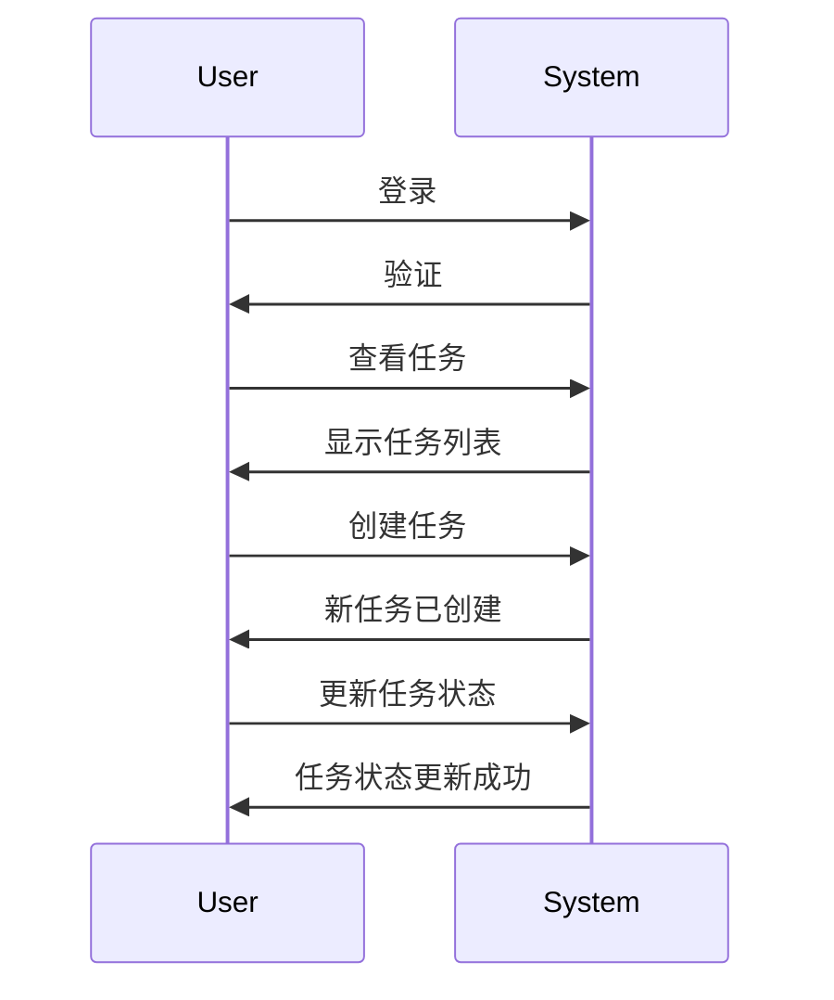

                 

### 《跨代际团队管理：bridging the generation gap》

#### 关键词：代际差异、团队管理、沟通策略、领导力、系统架构设计

> 摘要：本文旨在探讨跨代际团队管理的重要性及其面临的挑战，通过详细分析代际差异、理论基础、管理策略和实践案例，提供一套完整的跨代际团队管理框架，旨在缩小代际差距，提升团队效能。

---

## 第一部分：引言

### 第1章：跨代际团队管理概述

随着全球化的推进，团队结构日益复杂，代际差异成为团队管理中的一个重要议题。不同代际在价值观、工作态度、沟通方式等方面存在显著差异，这些差异如果处理不当，可能会影响团队的协作和效率。因此，跨代际团队管理的重要性日益凸显。

#### 1.1 问题背景

在全球化和信息技术快速发展的背景下，不同代际的员工共同工作已成为常态。例如，Z世代（1997年后出生）与婴儿潮一代（1946-1964年出生）在工作中形成了显著的代际差异。这些差异体现在工作态度、价值观、沟通方式、技术接受度等多个方面。

#### 1.2 问题描述

跨代际团队管理面临的主要问题包括：

- **沟通障碍**：不同代际在语言表达、沟通风格上存在差异，可能导致沟通效率低下。
- **价值观冲突**：不同代际对工作目标、职业发展的期望不同，可能引发价值观上的冲突。
- **领导力挑战**：管理者需要具备多元化的领导技能，以适应不同代际员工的需求。

#### 1.3 问题解决

解决跨代际团队管理问题的关键在于：

- **增强沟通**：通过培训和实践，提高团队成员的沟通技巧。
- **培养领导力**：管理者需要具备跨代际沟通和领导能力。
- **建立共同目标**：通过制定共同的目标和价值观，促进团队凝聚力。

#### 1.4 边界与外延

跨代际团队管理主要涉及以下方面：

- **团队结构**：包括团队成员的代际构成和团队组织形式。
- **管理策略**：涉及沟通、领导力发展、团队建设等具体措施。
- **技术应用**：如何利用技术工具来辅助跨代际团队管理。

#### 1.5 概念结构与核心要素组成

跨代际团队管理的基本框架包括以下核心要素：

- **沟通策略**：包括有效的沟通方法和沟通工具。
- **领导力发展**：包括领导者的培养、领导风格的适应。
- **团队建设活动**：包括团队文化建设、团队凝聚力提升。

## 第二部分：核心概念与联系

### 第2章：代际差异分析

#### 2.1 代际定义与分类

代际是指在一段时间内出生并成长的一代人。通常，代际差异可以通过以下分类来理解：

- **传统代际划分**：婴儿潮一代、X一代、Y一代、Z世代。
- **新型代际划分**：千禧一代、Xennials（跨代际人）、沉默一代等。

#### 2.2 代际文化差异对比

不同代际在文化差异上表现出明显的特点，以下是几个主要方面的对比：

| 代际 | 价值观 | 工作态度 | 沟通风格 | 技术接受度 |
|------|--------|----------|----------|------------|
| 婴儿潮一代 | 社会责任感强 | 重视稳定和安全感 | 守时、直接 | 对新技术的接受度较低 |
| X一代 | 实用主义 | 重视个人成就 | 守时、直接 | 对新技术的接受度中等 |
| Y一代 | 个人主义 | 重视创新和自由 | 非正式、开放 | 对新技术的接受度较高 |
| Z世代 | 社交媒体导向 | 重视自我表达和多样性 | 非正式、灵活 | 对新技术的接受度最高 |

#### 2.3 ER实体关系图架构

以下是一个简化的ER实体关系图，展示了团队中代际差异的实体关系：

```mermaid
erDiagram
  TeamMember ||--|{ Generation }|| GenerationalDifference
  TeamMember ||--|{ CommunicationStyle }|| CommunicationStyle
  Generation ||--|{ WorkAttitude }|| WorkAttitude
  Generation ||--|{ ValueSystem }|| ValueSystem
```

### 第三部分：理论基础

#### 第3章：跨代际团队管理理论

#### 3.1 跨代际团队管理原理

跨代际团队管理的核心在于理解不同代际的特点，并运用相应的管理策略来促进团队协作。以下是几个关键原理：

- **多元视角**：管理者需要具备多元视角，理解不同代际的思维方式和行为模式。
- **适应性领导**：领导者应具备适应不同代际员工需求的领导力，如灵活调整领导风格。
- **共同目标**：通过建立共同的目标和价值观，减少代际间的冲突。

#### 3.2 心理学与行为科学视角

心理学与行为科学为跨代际团队管理提供了理论基础：

- **心理学**：研究代际差异背后的心理机制，如认知发展、情感反应等。
- **行为科学**：研究个体和群体行为，为制定管理策略提供依据。

#### 3.3 代际互动模式分析

跨代际团队中的互动模式包括：

- **沟通互动**：通过有效的沟通策略，减少误解和冲突。
- **合作互动**：通过共同目标和任务，促进跨代际员工的合作。
- **冲突互动**：在处理代际冲突时，采用合理的方法和策略。

## 第四部分：管理策略与实践

### 第4章：跨代际沟通策略

#### 4.1 有效沟通技巧

跨代际沟通的有效性取决于以下几个技巧：

- **明确表达**：清晰、具体地表达观点，减少误解。
- **倾听**：主动倾听不同代际员工的意见，增进理解。
- **共鸣**：尝试理解不同代际的价值观和需求，建立共鸣。

#### 4.2 沟通障碍与解决

常见的沟通障碍包括：

- **语言障碍**：不同代际在语言表达上可能存在差异。
- **文化差异**：不同代际在文化背景上可能存在差异。

解决方法包括：

- **语言培训**：为团队成员提供语言交流培训。
- **文化理解**：通过文化培训，增进不同代际的文化理解。

#### 4.3 案例分析

以下是一个实际案例：

**案例背景**：一家高科技公司的团队中，有婴儿潮一代的资深员工和Z世代的年轻员工。由于文化差异，团队内部的沟通效率较低。

**解决方案**：通过定期的团队建设活动和沟通技巧培训，促进了不同代际之间的理解和合作。同时，领导者采用适应性领导风格，满足了不同代际员工的需求。

**效果评估**：经过一段时间的实践，团队内部的沟通障碍显著减少，项目进展顺利。

### 第5章：领导力发展与团队建设

#### 5.1 领导力与代际差异

领导力与代际差异密切相关。不同代际的员工对领导力的期望和需求不同，因此，领导者需要具备：

- **跨代际沟通能力**：理解不同代际的沟通方式和需求。
- **适应性领导风格**：根据不同代际的特点，调整领导风格。

#### 5.2 团队建设活动

团队建设活动是提升团队凝聚力和合作能力的重要手段。以下是一些适合跨代际团队的团队建设活动：

- **团队合作任务**：通过共同完成任务，增强团队凝聚力。
- **团队讨论**：定期组织团队讨论，促进不同代际之间的交流。
- **团队拓展训练**：通过户外拓展训练，提升团队的协作能力。

#### 5.3 案例分析

以下是一个实际案例：

**案例背景**：一家互联网公司为了提升团队凝聚力，组织了一次跨代际团队拓展训练。

**活动内容**：活动包括团队合作任务、团队讨论和户外拓展训练。

**效果评估**：活动结束后，团队成员之间的沟通更加顺畅，团队凝聚力显著提升，项目进展更加顺利。

## 第五部分：系统分析与架构设计

### 第6章：团队管理信息系统架构

#### 6.1 系统功能设计

团队管理信息系统的功能设计包括：

- **团队成员信息管理**：包括个人资料、工作职责等。
- **任务与项目跟踪**：包括任务分配、项目进度跟踪等。
- **沟通与协作平台**：包括即时通讯、讨论区等。
- **反馈与评估系统**：包括员工绩效评估、团队反馈等。

#### 6.2 系统架构设计

团队管理信息系统架构设计如下：



#### 6.3 系统接口设计与交互

系统接口设计包括：

- **用户接口**：提供友好的用户界面，方便用户操作。
- **数据库接口**：实现数据存储和查询。
- **API接口**：提供与其他系统的集成接口。

## 第六部分：项目实战

### 第7章：跨代际团队管理项目实战

#### 7.1 项目背景与目标

本项目旨在提升一家跨代际团队的信息化管理水平，提高沟通效率和工作效率。

#### 7.2 项目环境安装

项目环境安装包括：

- **数据库安装**：安装MySQL数据库。
- **Web服务器安装**：安装Apache Web服务器。
- **开发工具安装**：安装Python开发环境和相关库。

#### 7.3 系统核心实现与代码分析

系统核心实现包括：

- **用户管理模块**：实现用户注册、登录、个人信息管理等。
- **任务管理模块**：实现任务创建、分配、进度跟踪等。
- **反馈与评估模块**：实现员工绩效评估、团队反馈等。

以下是一个用户管理模块的Python代码示例：

```python
class User:
    def __init__(self, username, password, email):
        self.username = username
        self.password = password
        self.email = email

    def register(self, database):
        database.add_user(self)

    def login(self, database):
        if database.authenticate_user(self.username, self.password):
            return True
        else:
            return False
```

#### 7.4 案例分析

通过项目实施，团队成员的信息化管理水平得到了显著提升。以下是案例分析的几个关键点：

- **沟通效率提升**：通过即时通讯和讨论区，团队成员之间的沟通更加顺畅。
- **工作效率提升**：通过任务管理模块，任务分配和进度跟踪更加清晰。
- **员工满意度提升**：通过反馈与评估模块，员工绩效得到了更全面的评估。

#### 7.5 项目小结

本项目通过信息化手段，成功提升了跨代际团队的管理水平。未来，可以考虑进一步优化系统功能，提升用户体验。

## 第七部分：最佳实践与总结

### 第8章：跨代际团队管理最佳实践

#### 8.1 最佳实践总结

跨代际团队管理的最佳实践包括：

- **增强沟通**：通过定期培训和实践活动，提升团队成员的沟通技巧。
- **培养领导力**：通过领导力培训和实践，提升管理者的跨代际领导能力。
- **团队建设**：通过多样化的团队建设活动，增强团队凝聚力。

#### 8.2 注意事项

在进行跨代际团队管理时，需要注意以下几点：

- **尊重差异**：尊重不同代际的价值观和需求，避免偏见和歧视。
- **持续改进**：不断反思和改进管理策略，以适应不断变化的环境。

#### 8.3 拓展阅读与未来研究方向

未来研究方向包括：

- **代际心理机制研究**：深入研究不同代际的心理机制，为管理策略提供科学依据。
- **跨代际团队管理模型构建**：构建更加完善和实用的跨代际团队管理模型。

### 附录：作者信息

- **作者**：AI天才研究院/AI Genius Institute & 禅与计算机程序设计艺术 /Zen And The Art of Computer Programming

---

本文通过详细的章节内容和结构，深入探讨了跨代际团队管理的重要性、理论基础、管理策略和实践案例，旨在为读者提供一套完整的跨代际团队管理框架。希望本文能够帮助读者更好地理解和应对跨代际团队管理中的挑战。

