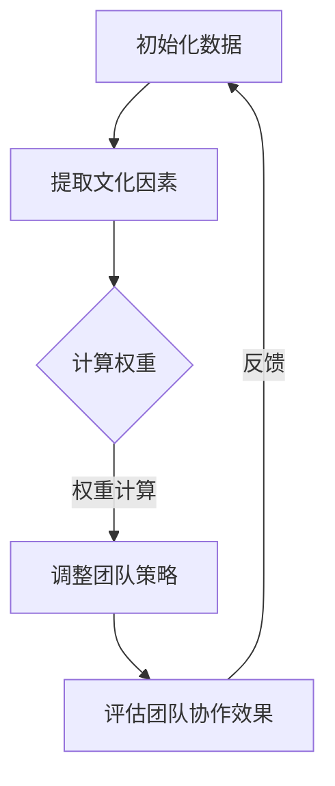

                 

### 文章标题

# 跨文化团队协作：全球化时代的挑战

### 关键词

- **跨文化沟通**  
- **全球化**  
- **团队协作**  
- **文化维度理论**  
- **领导力**

### 摘要

随着全球化的加速，跨文化团队协作已经成为现代企业中不可或缺的一部分。然而，跨文化差异带来的沟通障碍和协作挑战使得这一过程变得复杂且富有挑战性。本文将深入探讨全球化时代下跨文化团队协作的背景、核心概念、协作原理、成功案例分析、实践指南以及系统分析与架构设计，旨在为读者提供全面且实用的跨文化团队协作策略。

## 标题和引言

在当今世界，全球化已经成为不可逆转的趋势。企业不再局限于本地市场，而是通过跨国运营、国际合作和全球供应链来实现业务扩展。这一趋势催生了一个新的工作环境——跨文化团队协作。无论是在跨国公司，还是在国际项目中，跨文化团队协作都是实现组织目标的关键。

### 背景介绍

全球化带来的不仅仅是市场的扩展，更是文化的融合与碰撞。不同的文化背景、价值观和沟通习惯使得跨文化团队在协作过程中面临诸多挑战。这些挑战包括：

1. **沟通障碍**：不同的语言和沟通风格可能导致误解和冲突。
2. **文化差异**：对时间观念、决策过程、工作态度等方面的不同理解可能影响团队效率。
3. **领导力挑战**：如何在一个多元文化背景下实现有效的领导和管理。
4. **团队融合**：如何在文化多样性中建立起信任和协作关系。

### 目的

本文旨在探讨跨文化团队协作在全球化时代的挑战，通过深入分析核心概念、协作原理、成功案例和实践指南，为读者提供有效的策略和工具，以应对这些挑战。通过本文的阅读，读者将：

1. 理解全球化对组织及其团队协作的影响。
2. 掌握跨文化沟通的基本原则和实践技巧。
3. 学习成功跨文化团队协作的关键因素。
4. 获得具体的实践指南，以优化跨文化团队协作的效果。

## 第1章 背景介绍

### 1.1 全球化与跨文化团队

全球化是当今世界的一个显著特征，它不仅改变了经济格局，也深刻影响了组织结构和工作环境。随着全球市场的融合，企业越来越依赖于跨国运营和国际合作。这种趋势催生了跨文化团队的形成，使得不同文化背景的专业人士在同一项目或组织中协作。

#### 全球化的影响

全球化的影响主要体现在以下几个方面：

1. **市场扩展**：企业可以通过跨国运营进入新的市场，实现业务增长。
2. **资源整合**：全球范围内的资源整合，如人才、技术和资金，为企业提供了更多的发展机会。
3. **文化融合**：不同文化的碰撞和融合，为组织带来了新的视角和创新。
4. **工作方式变化**：远程工作、虚拟团队等新兴工作方式，使得地理位置不再是限制团队协作的因素。

#### 跨文化团队的概念

跨文化团队是指由来自不同文化背景的个人组成的团队。这些个人可能来自不同的国家、地区或组织，他们在语言、价值观、行为习惯等方面存在差异。跨文化团队的优势在于能够汇聚不同文化的智慧和经验，从而实现更好的创新和决策。然而，这些差异也可能导致沟通障碍和协作困难。

#### 跨文化团队的特点

1. **多样性**：成员来自不同的文化背景，具有不同的语言和沟通习惯。
2. **复杂性**：团队内部的沟通和协作需要考虑文化差异，可能更加复杂。
3. **挑战性**：文化差异可能引发误解和冲突，需要有效的管理策略。
4. **优势**：多样化的思维方式和经验，可能带来创新和解决问题的多种途径。

### 1.2 跨文化团队协作的挑战

尽管跨文化团队具有多样性和优势，但协作过程中也面临诸多挑战。以下是几个主要的挑战：

1. **沟通障碍**：语言差异、沟通风格和文化背景的不同，可能导致信息传递不准确或产生误解。
2. **文化冲突**：价值观和信仰的差异可能导致团队成员之间的矛盾和冲突。
3. **时间管理**：不同的文化对时间观念有不同的理解，可能导致进度安排和协作效率的问题。
4. **领导力挑战**：领导者在多元文化背景下，需要具备更高的跨文化管理能力和领导力。
5. **团队融合**：建立信任和协作关系需要时间和努力，特别是在文化差异较大的团队中。

#### 解决策略

面对这些挑战，企业可以采取以下策略来优化跨文化团队协作：

1. **跨文化培训**：为团队成员提供跨文化沟通和管理的培训，提高他们的文化意识和沟通技巧。
2. **建立共同目标**：明确团队的目标和价值观，确保团队成员朝着共同的方向努力。
3. **加强沟通**：使用多种沟通方式，如视频会议、电子邮件和即时通讯，确保信息传递的准确性和及时性。
4. **文化敏感性**：培养团队成员对文化差异的敏感性和尊重，避免文化冲突。
5. **有效的领导**：领导者需要具备跨文化管理能力，能够理解和应对团队成员的不同需求和期望。

通过上述策略，企业可以更好地应对跨文化团队协作的挑战，实现团队的协同效应和高效运作。

### 第2章 核心概念与联系

为了深入探讨跨文化团队协作，我们需要明确一些核心概念，并了解这些概念之间的联系。在本章中，我们将定义并分析几个关键概念：跨文化沟通、文化维度理论、团队协作原则，并通过对比表格和ER实体关系图来展示它们之间的关系。

#### 2.1 跨文化沟通

跨文化沟通是指在跨越文化差异的背景下，人们如何交换信息、观点和情感。这种沟通不仅涉及语言的使用，还包括非语言沟通、文化习俗、礼仪和价值观等方面。

**概念属性特征：**

- **语言**：语言是跨文化沟通的基础，但在不同文化中，语言的使用和表达方式可能存在差异。
- **非语言沟通**：包括面部表情、肢体语言、眼神交流等，这些在跨文化沟通中同样重要。
- **文化习俗**：不同的文化有不同的礼仪和习俗，如饮食习惯、节日庆典等。
- **价值观**：不同文化对价值观有不同的理解，这会影响人们的沟通方式和决策过程。

**跨文化沟通的挑战：**

- **语言障碍**：不同的语言可能导致信息误解或误传。
- **文化习俗冲突**：不熟悉对方的文化习俗可能导致行为上的尴尬或冒犯。
- **价值观差异**：不同的价值观可能导致沟通中的矛盾和冲突。

**跨文化沟通的重要性：**

- **促进协作**：有效的跨文化沟通可以帮助团队成员更好地理解彼此，减少误解和冲突。
- **提高效率**：清晰的沟通可以提高团队的工作效率，减少不必要的延误。
- **增强团队凝聚力**：通过理解和尊重不同文化，可以增强团队的凝聚力和合作精神。

#### 2.2 文化维度理论

文化维度理论是由荷兰文化学者霍夫斯泰德（Geert Hofstede）提出的，它通过比较不同文化在六个维度上的差异，来解释文化对行为和沟通的影响。

**六个文化维度：**

1. **权力距离（Power Distance）**：描述社会结构中权力分配的不平等程度。
2. **不确定性规避（Uncertainty Avoidance）**：描述文化对不确定性和变化的容忍度。
3. **个体主义与集体主义（Individualism vs. Collectivism）**：描述个人主义和集体主义在文化中的重要性。
4. **男性化与女性化（Masculinity vs. Femininity）**：描述文化对性别角色和社会价值观的看法。
5. **长期取向与短期取向（Long-term Orientation vs. Short-term Orientation）**：描述文化对时间观念和目标的追求方式。
6. ** indulgence vs. restraint（ indulgence vs. restraint）**：描述文化对个人自由和享受生活的态度。

**文化维度理论的应用：**

- **跨国管理**：帮助管理者了解不同文化背景的员工期望和行为模式，从而更有效地进行管理。
- **国际业务**：帮助企业理解不同市场的文化特点，制定更有效的市场进入策略。
- **团队协作**：帮助团队成员更好地理解彼此的文化背景，减少冲突，提高协作效率。

#### 2.3 团队协作原则

团队协作是指团队成员为了共同的目标而协同工作，通过有效的沟通和合作来实现团队目标。在跨文化背景下，团队协作需要更多的努力和策略。

**团队协作原则：**

1. **共同目标**：明确团队的目标和愿景，确保所有成员朝着同一方向努力。
2. **有效沟通**：建立开放、诚实和尊重的沟通渠道，确保信息畅通无阻。
3. **分工合作**：根据成员的特长和优势进行任务分配，确保每个成员都能发挥最大的作用。
4. **相互尊重**：尊重团队成员的文化差异和个人特点，建立和谐的团队氛围。
5. **持续反馈**：定期进行团队评估和反馈，及时调整团队策略和行动计划。

#### 2.4 概念对比表格

为了更清晰地理解这些概念之间的联系，我们可以使用对比表格来展示它们的不同属性和特征。

| 概念         | 语言 | 沟通风格 | 文化习俗 | 价值观   |
|--------------|------|----------|----------|----------|
| 跨文化沟通   | 重要 | 多样化   | 重          | 强          |
| 文化维度理论 | ——   | ——       | ——        | 有区别     |
| 团队协作原则 | ——   | ——       | ——        | ——        |

#### 2.5 ER实体关系图

实体关系图（Entity-Relationship Diagram，ERD）是一种用于描述系统中实体及其关系的图形化工具。在本节中，我们将使用Mermaid图表来绘制一个简化的ER实体关系图，以展示跨文化沟通、文化维度理论、团队协作原则之间的关系。

```mermaid
erDiagram
    Member ||--|{ CultureDimension }
    Member ||--|{ CommunicationStyle }
    Member ||--|{ TeamCollaborationPrinciple }
    CultureDimension ||--|{ ValueSystem }
    CommunicationStyle ||--|{ CommunicationMethod }
    TeamCollaborationPrinciple ||--|{ CollaborationProcess }
```

在这个ER图中，"Member"（团队成员）与"CultureDimension"（文化维度）、"CommunicationStyle"（沟通风格）和"TeamCollaborationPrinciple"（团队协作原则）之间存在关联。同时，"CultureDimension"与"ValueSystem"（价值观）,"CommunicationStyle"与"CommunicationMethod"（沟通方法）,"TeamCollaborationPrinciple"与"CollaborationProcess"（协作过程）也存在关联。

通过这些核心概念和它们之间的联系，我们可以更好地理解跨文化团队协作的复杂性和重要性。在下一章中，我们将深入探讨跨文化团队协作的基本原理，包括文化适应、沟通策略和领导力等方面的内容。

### 第3章 团队协作原理

在跨文化团队协作中，理解并应用团队协作原理是至关重要的。这些原理不仅帮助团队成员更好地适应和融合，还能提高团队的效率和绩效。以下是几个关键的团队协作原理：

#### 3.1 文化适应

文化适应是指团队成员为了更好地融入团队和适应不同文化环境而采取的行为和态度。文化适应包括以下几个方面：

1. **文化敏感性**：培养对文化差异的敏感性和理解，避免因不了解对方文化而产生的误解和冲突。
2. **自我反思**：反思自己的文化背景和行为习惯，了解它们如何影响团队协作，并做出相应的调整。
3. **开放心态**：保持开放和接纳的心态，愿意接受和尊重不同的文化观点和行为方式。
4. **跨文化沟通**：使用跨文化沟通技巧，如主动倾听、明确表达和避免文化偏见，以减少误解和冲突。

**文化适应的重要性：**

- **提高团队凝聚力**：通过理解和文化适应，团队成员可以更好地相互支持和协作，增强团队的凝聚力。
- **促进创新**：多样化的文化背景可以带来新的视角和创意，促进团队的创新和问题解决。
- **提高效率**：减少文化冲突和误解，提高团队的协作效率和决策质量。

#### 3.2 沟通策略

沟通策略是在跨文化团队中有效传递信息和建立联系的策略。以下是几种有效的沟通策略：

1. **明确表达**：在沟通时使用清晰、明确的语言，避免模糊或含糊的表述，以减少误解。
2. **主动倾听**：倾听对方的意见和观点，确保理解对方的意图和需求，并在必要时进行确认。
3. **使用多种沟通渠道**：结合使用书面、口头和视觉沟通方式，以适应不同成员的偏好和文化习惯。
4. **文化适应的沟通方式**：根据不同文化的沟通风格和习惯进行调整，例如，在注重间接沟通的文化中，使用更多的隐喻和暗示。
5. **冲突解决**：建立冲突解决机制，当发生误解或冲突时，及时沟通并寻求解决方案。

**沟通策略的重要性：**

- **提高信息传递效率**：有效的沟通确保信息准确、及时地传递，减少误传和误解。
- **建立信任**：通过良好的沟通建立信任，促进团队成员之间的合作和协作。
- **促进团队协作**：清晰的沟通有助于团队成员更好地理解任务和要求，提高协作效率。

#### 3.3 领导力

在跨文化团队中，领导力扮演着关键角色。有效的领导力不仅能够引导团队朝着共同目标前进，还能促进文化适应和沟通。以下是几种关键的领导力策略：

1. **文化领导力**：领导者需要具备跨文化管理能力，理解不同文化的价值观和沟通习惯，并做出相应的调整。
2. **建立共同愿景**：明确团队的目标和愿景，确保所有成员都朝着共同的方向努力。
3. **建立信任**：通过诚信和透明度建立信任，促进团队成员之间的合作。
4. **支持文化适应**：为团队成员提供支持和资源，帮助他们适应新文化和工作环境。
5. **激励和反馈**：及时给予团队成员激励和反馈，鼓励他们的积极参与和创造性思维。

**领导力的重要性：**

- **提高团队绩效**：有效的领导力可以激发团队成员的潜力，提高团队的整体绩效。
- **促进团队融合**：通过领导力的示范作用，促进团队成员之间的融合和协作。
- **应对挑战**：领导者需要具备应对跨文化团队协作中各种挑战的能力，以确保团队的成功。

#### 3.4 协作机制

协作机制是确保团队协作顺利进行的制度安排和流程。以下是几种有效的协作机制：

1. **明确的角色和责任**：明确每个团队成员的角色和责任，确保任务分配合理，避免职责重叠和疏漏。
2. **定期会议和汇报**：定期召开团队会议，汇报进展情况和遇到的问题，确保团队保持同步和协调。
3. **共享资源和信息**：建立共享平台，如团队内部网、协作软件等，方便团队成员共享资源和信息。
4. **反馈和评估**：建立反馈机制，定期评估团队协作的效果，及时调整和改进协作流程。
5. **跨文化协作工具**：使用适合跨文化团队的协作工具，如多语言支持、实时沟通平台等，提高协作效率。

**协作机制的重要性：**

- **提高协作效率**：明确的协作机制和流程可以减少混乱和重复工作，提高团队协作效率。
- **确保任务完成**：通过协作机制，确保每个任务都有明确的责任人和进度，确保任务的按时完成。
- **促进团队融合**：协作机制有助于团队成员之间的互动和合作，促进团队融合和协作氛围的形成。

通过文化适应、沟通策略、领导力和协作机制的应用，跨文化团队可以更好地应对协作中的挑战，实现高效和成功的协作。在下一章中，我们将通过案例分析来探讨这些原理在实践中的应用和效果。

### 第4章 案例分析

为了更好地理解跨文化团队协作的原理和实践，我们可以通过具体案例来分析成功和挑战。以下将分别介绍两个跨文化团队协作的案例，并提取关键成功因素和面临的挑战。

#### 4.1 案例一：跨国公司团队协作

**背景**：一家全球领先的科技公司，其研发中心位于不同国家和地区，包括美国、中国、印度和巴西。团队成员由来自不同文化背景的专业人士组成，他们在同一项目中协作开发新一代的智能手机操作系统。

**成功因素：**

1. **文化培训**：公司为所有团队成员提供了跨文化沟通和管理培训，帮助他们了解不同文化背景下的沟通方式和行为习惯。
2. **共同愿景**：项目领导明确了团队的共同目标和愿景，确保所有成员都朝着同一方向努力。
3. **多样化的团队结构**：团队中不仅有来自不同国家的人员，还有不同专业背景的技术专家，这为项目带来了多样化的思维和丰富的经验。
4. **灵活的沟通策略**：团队采用了多种沟通工具，如视频会议、即时通讯和共享文档，确保信息传递的及时性和准确性。

**关键成功因素**：

- **跨文化培训**：通过培训，团队成员对文化差异有了更深入的了解，减少了误解和冲突。
- **共同目标和愿景**：明确的共同目标和愿景，增强了团队的凝聚力和协作意愿。
- **多样化的团队结构**：多样化的团队结构带来了创新和问题解决的多种途径。

**挑战与解决方案**：

- **时间管理**：不同地区的时间差异导致了一些协调问题，公司通过设置全球协调时间，确保所有团队成员都能参与关键会议。
- **技术障碍**：某些地区的网络和技术设施相对落后，公司提供了远程支持和备用方案，确保所有团队成员都能顺利开展工作。

#### 4.2 案例二：多文化项目的成功实践

**背景**：一家国际咨询公司在欧洲开展了一项跨文化管理咨询项目，涉及多个国家的政府和企业。团队成员包括来自法国、德国、英国和意大利等不同国家的专业人士。

**成功因素：**

1. **本地化团队领导**：每个国家都有一位本地化的团队领导，他们不仅熟悉当地文化，还能有效管理本地团队成员。
2. **文化敏感性**：团队成员在项目初期进行了文化敏感性培训，了解了不同国家的文化习俗和沟通风格。
3. **灵活的工作模式**：项目采用了灵活的工作模式，如远程办公和弹性工作时间，以适应不同团队成员的需求。
4. **持续反馈和评估**：项目过程中，定期进行团队反馈和评估，及时调整项目策略和团队协作方式。

**关键成功因素**：

- **本地化团队领导**：本地化领导帮助团队更好地理解和适应当地文化，提高了团队的执行力和协作效率。
- **文化敏感性培训**：通过培训，团队成员对文化差异有了更深入的认识，减少了文化冲突。
- **灵活的工作模式**：灵活的工作模式提高了团队成员的工作满意度和工作效率。

**挑战与解决方案**：

- **文化冲突**：不同文化背景的团队成员在某些情况下可能会产生冲突，公司通过定期沟通和文化敏感性培训，帮助团队成员更好地理解彼此。
- **资源分配**：不同国家的资源分配可能存在差异，公司通过全球资源调配，确保项目资源的公平分配。

通过这两个案例，我们可以看到，成功的跨文化团队协作不仅需要跨文化培训和文化敏感性，还需要明确的共同目标和灵活的协作机制。在应对挑战时，灵活的沟通策略和本地化领导也起到了关键作用。

### 第5章 实践指南

在跨文化团队协作中，有效的实践指南可以帮助团队克服各种挑战，提高协作效率和团队绩效。以下是几个关键的实践指南：

#### 5.1 跨文化培训策略

跨文化培训是提高团队成员跨文化意识和能力的重要手段。以下是一些有效的跨文化培训策略：

1. **基础培训**：为所有团队成员提供基础的文化认知培训，包括文化维度理论、文化差异、沟通技巧等。
2. **专题培训**：针对特定文化，如中国文化、印度文化等，提供更深入的专题培训，帮助团队成员深入了解特定文化的行为习惯和沟通风格。
3. **案例学习**：通过分析实际跨文化案例，让团队成员了解在不同文化背景下可能遇到的挑战和解决方案。
4. **互动练习**：组织角色扮演、情景模拟等活动，让团队成员在模拟环境中实践跨文化沟通技巧，提高实际操作能力。

**跨文化培训的重要性**：

- **提高文化敏感性**：通过培训，团队成员可以更好地理解不同文化的行为模式，减少误解和冲突。
- **增强团队凝聚力**：培训有助于建立团队成员之间的信任和理解，增强团队凝聚力。
- **提高协作效率**：掌握跨文化沟通技巧，可以帮助团队成员更有效地进行信息传递和协作。

#### 5.2 跨文化沟通技巧

有效的跨文化沟通是跨文化团队协作成功的关键。以下是一些实用的跨文化沟通技巧：

1. **明确表达**：使用清晰、简洁的语言，避免含糊或模糊的表述，确保信息传递的准确性。
2. **倾听**：积极倾听对方的意见和观点，确保理解对方的意图和需求，并在必要时进行确认。
3. **使用多种沟通渠道**：结合使用书面、口头和视觉沟通方式，根据不同成员的偏好和文化习惯进行调整。
4. **尊重文化差异**：尊重不同文化的沟通习惯和礼仪，避免因不了解对方文化而产生的误解和冲突。
5. **解决冲突**：当发生沟通冲突时，及时沟通并寻求解决方案，避免问题的扩大化。

**跨文化沟通技巧的重要性**：

- **减少误解和冲突**：通过有效的沟通技巧，可以减少因文化差异引起的误解和冲突，提高团队协作效率。
- **提高信息传递效率**：清晰的沟通确保信息准确、及时地传递，减少不必要的延误和重复工作。
- **增强团队凝聚力**：通过良好的沟通建立信任和合作关系，增强团队凝聚力。

#### 5.3 团队协作优化方法

为了提高跨文化团队的协作效果，可以采取以下优化方法：

1. **建立共同目标**：明确团队的目标和愿景，确保所有成员都朝着共同的方向努力。
2. **角色和责任分配**：根据团队成员的特长和优势进行角色和责任分配，确保任务分配合理，避免职责重叠。
3. **定期会议和汇报**：定期召开团队会议，汇报进展情况和遇到的问题，确保团队保持同步和协调。
4. **共享资源和信息**：建立共享平台，方便团队成员共享资源和信息，提高协作效率。
5. **反馈和评估**：定期进行团队反馈和评估，及时调整团队策略和行动计划，优化协作效果。

**团队协作优化方法的重要性**：

- **提高协作效率**：明确的角色和责任分配、定期会议和汇报、共享资源和信息等，可以减少混乱和重复工作，提高协作效率。
- **确保任务完成**：通过反馈和评估，确保每个任务都有明确的责任人和进度，确保任务的按时完成。
- **促进团队融合**：优化协作方法有助于团队成员之间的互动和合作，促进团队融合和协作氛围的形成。

通过跨文化培训策略、跨文化沟通技巧和团队协作优化方法，跨文化团队可以更好地应对协作中的挑战，实现高效和成功的协作。

### 第6章 数学模型与算法

在跨文化团队协作中，数学模型和算法可以帮助我们分析和优化团队协作过程。在本章中，我们将介绍一些用于分析和优化跨文化团队协作的数学模型和算法，并使用Mermaid图表和Python代码进行详细解释。

#### 6.1 数学模型介绍

跨文化团队协作的数学模型主要包括以下几个方面：

1. **跨文化沟通模型**：用于评估跨文化团队中信息传递的准确性和效率。
2. **文化适应模型**：用于分析团队成员在不同文化背景下的适应能力和效果。
3. **团队协作效率模型**：用于评估团队在实现目标过程中的协作效率和绩效。
4. **文化冲突预测模型**：用于预测和预防跨文化团队中的潜在冲突。

#### 6.2 算法原理

为了更好地理解这些数学模型，我们将介绍以下几个核心算法：

1. **多因素分析法（MFA）**：用于评估跨文化团队中多种因素的权重和影响。
2. **灰色预测模型**：用于预测团队成员在不同文化背景下的适应能力。
3. **社会网络分析（SNA）**：用于分析团队内部的信息流动和协作模式。
4. **机器学习算法**：如决策树、支持向量机等，用于预测和优化团队协作效果。

#### 6.3 Mermaid算法流程图

为了直观地展示算法原理，我们可以使用Mermaid图表绘制算法流程图。以下是一个简单的多因素分析法的Mermaid流程图：



在这个流程图中，A表示初始化数据，B表示提取文化因素，C表示计算权重，D表示调整团队策略，E表示评估团队协作效果，并通过反馈循环回到A。

#### 6.4 Python代码实现

为了进一步理解算法，我们可以使用Python代码实现多因素分析法。以下是一个简单的示例代码：

```python
import numpy as np

# 初始化数据
culture_factors = {'communication': 0.5, 'culture': 0.3, 'teamwork': 0.2}

# 计算权重
weights = np.array([culture_factors[f] for f in culture_factors])

# 调整团队策略
def adjust_strategy(weights):
    # 根据权重调整团队策略
    strategy = '增强沟通' if weights[0] > weights[1] else '加强文化适应'
    return strategy

# 评估团队协作效果
def evaluate_collaboration(strategy):
    # 根据策略评估团队协作效果
    if strategy == '增强沟通':
        score = 0.8
    else:
        score = 0.7
    return score

# 主函数
def main():
    strategy = adjust_strategy(weights)
    score = evaluate_collaboration(strategy)
    print(f"策略：{strategy}, 协作效果得分：{score}")

# 运行主函数
main()
```

在这个示例代码中，我们首先初始化文化因素数据，然后计算权重，接着根据权重调整团队策略，并评估团队协作效果。通过这个简单的例子，我们可以看到如何使用Python代码实现跨文化团队协作的数学模型和算法。

#### 6.5 算法应用实例

为了更好地展示算法的实际应用，我们可以考虑一个实际案例：一个跨国团队正在开发一款全球通用的软件应用。该团队的协作效果可以通过多因素分析法进行评估和优化。

**案例背景：**

- **文化因素**：沟通、文化适应、团队协作
- **权重设置**：沟通：0.5，文化适应：0.3，团队协作：0.2

**算法应用：**

1. **数据收集**：收集团队成员在沟通、文化适应和团队协作方面的表现数据。
2. **权重计算**：根据数据计算各个因素的权重。
3. **策略调整**：根据权重调整团队策略，例如，如果沟通权重最高，团队可以加强沟通培训和会议频率。
4. **效果评估**：通过定期的效果评估，调整团队策略，优化协作过程。

通过上述步骤，团队可以持续优化协作效果，提高跨文化团队的整体绩效。

通过数学模型和算法的应用，我们可以更科学、系统地分析和优化跨文化团队协作，从而实现高效的团队协作和项目成功。

### 第7章 系统分析与架构设计

在跨文化团队协作中，系统的分析与架构设计至关重要。一个良好的系统架构不仅能够提高协作效率，还能确保系统的稳定性和可扩展性。以下我们将详细介绍跨文化协作系统的分析与架构设计，包括需求分析、功能设计、架构设计、接口设计和系统交互流程。

#### 7.1 需求分析

在进行系统分析与架构设计之前，首先需要明确系统的需求。以下是跨文化协作系统的需求分析：

1. **功能需求**：
   - **用户管理**：支持用户注册、登录、信息维护等功能。
   - **文化适配**：提供文化适应测试、培训和学习资源。
   - **沟通工具**：包括即时通讯、视频会议、邮件通知等功能。
   - **任务管理**：支持任务创建、分配、跟踪和进度汇报。
   - **数据分析**：提供协作效果分析、绩效评估和报告生成。

2. **性能需求**：
   - **高可用性**：系统应具备高可用性，确保在团队成员发生故障时仍能正常运行。
   - **高并发性**：系统应支持大量用户同时在线协作。
   - **安全性**：确保用户数据和系统信息的安全。

3. **非功能需求**：
   - **用户体验**：界面简洁友好，易于操作。
   - **可扩展性**：系统应具备良好的扩展性，以适应未来的功能扩展和用户增长。

#### 7.2 系统功能设计

基于上述需求，我们可以设计跨文化协作系统的功能模块：

1. **用户模块**：
   - **用户注册**：提供用户注册功能，包括用户名、密码、邮箱等基本信息。
   - **用户登录**：提供用户登录功能，支持密码登录和第三方登录。
   - **用户信息维护**：允许用户更新个人信息，如头像、联系方式等。

2. **文化适配模块**：
   - **文化适应测试**：提供文化适应能力测试，评估用户的文化适应程度。
   - **培训和学习资源**：提供跨文化沟通和管理的培训资源，如视频教程、文档资料等。

3. **沟通工具模块**：
   - **即时通讯**：支持实时消息发送和接收，提供文本、图片、文件传输等功能。
   - **视频会议**：支持多方视频会议，提供高清视频和音频传输。
   - **邮件通知**：通过邮件发送任务提醒、会议通知等。

4. **任务管理模块**：
   - **任务创建**：允许用户创建任务，并指定任务名称、描述、负责人、截止日期等。
   - **任务分配**：将任务分配给团队成员，并设置任务的优先级和进度。
   - **任务跟踪**：跟踪任务进度，提供任务完成情况和反馈。

5. **数据分析模块**：
   - **协作效果分析**：提供协作效果分析报告，包括团队协作效率、沟通效果等。
   - **绩效评估**：评估团队成员的绩效表现，为绩效考核提供数据支持。
   - **报告生成**：生成详细的协作报告，供管理层和团队成员参考。

#### 7.3 系统架构设计

跨文化协作系统的架构设计应确保系统的高效、稳定和可扩展。以下是系统架构设计的概述：

1. **前端架构**：
   - **用户界面**：采用响应式设计，确保在不同设备上都能良好运行。
   - **框架**：使用Vue.js或React等现代前端框架，提高开发效率和用户体验。

2. **后端架构**：
   - **应用层**：采用Spring Boot或Django等框架，实现业务逻辑处理。
   - **数据库**：使用MySQL或PostgreSQL等关系型数据库，存储用户数据、任务信息等。
   - **缓存**：使用Redis等缓存技术，提高系统响应速度。

3. **基础设施**：
   - **服务器**：使用云服务器，确保系统的可靠性和可扩展性。
   - **负载均衡**：采用Nginx或HAProxy等负载均衡器，均衡系统负载。

#### 7.4 系统接口设计

系统接口设计是确保不同模块之间能够高效、稳定通信的关键。以下是系统接口设计的主要部分：

1. **用户接口**：
   - **API**：提供RESTful API接口，允许前端通过HTTP请求与后端通信。
   - **权限控制**：实现用户认证和权限控制，确保只有授权用户可以访问特定接口。

2. **服务接口**：
   - **文化适配服务**：提供文化适应能力测试、培训资源等服务接口。
   - **沟通工具服务**：实现即时通讯、视频会议等沟通工具的功能接口。
   - **任务管理服务**：提供任务创建、分配、跟踪等任务管理功能接口。

3. **数据分析接口**：
   - **协作效果分析接口**：提供协作效果分析报告的接口。
   - **绩效评估接口**：提供团队成员绩效评估数据的接口。
   - **报告生成接口**：提供报告生成的接口，生成详细的协作报告。

#### 7.5 系统交互流程

系统交互流程是确保系统各模块能够协同工作，实现整体功能的关键。以下是跨文化协作系统的交互流程：

1. **用户注册与登录**：
   - 用户通过前端界面提交注册信息，后端验证并存储用户信息。
   - 用户登录时，前端发送用户名和密码，后端验证用户身份并返回令牌。

2. **任务管理**：
   - 用户在前端创建任务，后端存储任务信息。
   - 任务分配时，前端发送任务ID和负责人信息，后端更新任务状态和负责人。

3. **沟通工具使用**：
   - 用户通过前端发送即时通讯消息，后端存储消息并转发给接收者。
   - 用户发起视频会议，后端调用视频会议服务，实现多方视频会议。

4. **数据分析**：
   - 前端调用数据分析接口，后端提供协作效果分析和绩效评估数据。
   - 后端根据数据分析结果生成报告，并返回给前端。

通过系统分析与架构设计，跨文化协作系统可以实现高效、稳定和可扩展的团队协作，为团队成员提供便捷的协作工具和平台。在下一章中，我们将通过实际项目案例，进一步展示跨文化团队协作系统的应用和实践。

### 第8章 项目实战

在本章中，我们将通过一个实际的跨文化团队协作项目，详细介绍项目的背景、系统环境安装、核心实现、代码解析以及实际案例分析。通过这个项目，读者可以更深入地了解跨文化团队协作系统的实际应用。

#### 8.1 实际项目场景介绍

假设我们是一家跨国公司，正在开发一款用于全球市场营销的智能数据分析平台。该平台需要支持多语言、多文化用户的使用，并提供实时数据分析、任务管理和团队协作功能。团队成员来自不同国家和地区，包括中国、美国、英国、巴西和印度等。我们的目标是确保平台能够在不同文化背景下高效运行，并提升团队成员之间的协作效率。

#### 8.2 系统环境安装与配置

为了搭建这个跨文化团队协作平台，我们首先需要配置相应的开发环境和系统环境。以下是具体的步骤：

1. **开发环境**：
   - **前端框架**：选择Vue.js作为前端框架，以便快速开发响应式界面。
   - **后端框架**：采用Spring Boot作为后端框架，以实现高效的业务逻辑处理。
   - **数据库**：使用MySQL作为数据库存储用户数据和任务信息。

2. **安装步骤**：
   - **前端环境**：安装Node.js和Vue CLI，通过Vue CLI创建项目骨架。
   - **后端环境**：安装Java和Spring Boot，通过Spring Boot创建后端应用。
   - **数据库环境**：安装MySQL数据库，创建数据库和相应的表结构。

3. **配置步骤**：
   - **前端配置**：配置Vue.js项目的路由、组件和状态管理。
   - **后端配置**：配置Spring Boot项目的数据库连接、API接口和安全策略。
   - **跨文化支持**：配置多语言支持，包括界面语言切换和本地化数据存储。

#### 8.3 系统核心实现与代码解析

接下来，我们将介绍系统的核心实现，包括用户管理、任务管理、沟通工具和数据分析模块。以下是具体的代码解析：

1. **用户管理模块**：

   **前端代码**：

   ```javascript
   // UserRegistration.vue
   <template>
     <div>
       <h1>注册账号</h1>
       <form @submit.prevent="registerUser">
         <input type="text" v-model="username" placeholder="用户名" required />
         <input type="password" v-model="password" placeholder="密码" required />
         <button type="submit">注册</button>
       </form>
     </div>
   </template>

   <script>
   export default {
     data() {
       return {
         username: '',
         password: '',
       };
     },
     methods: {
       async registerUser() {
         const response = await this.$http.post('/api/users/register', {
           username: this.username,
           password: this.password,
         });
         if (response.status === 201) {
           this.$router.push('/login');
         }
       },
     },
   };
   </script>
   ```

   **后端代码**：

   ```java
   // UserController.java
   @RestController
   @CrossOrigin
   public class UserController {
       @Autowired
       private UserRepository userRepository;

       @PostMapping("/register")
       public ResponseEntity<?> registerUser(@RequestBody User user) {
           if (userRepository.existsByUsername(user.getUsername())) {
               return ResponseEntity.badRequest().body("Error: Username is already taken!");
           }

           userRepository.save(user);
           return ResponseEntity.status(HttpStatus.CREATED).body("User registered successfully!");
       }
   }
   ```

   在用户管理模块中，前端通过Vue.js实现用户注册功能，后端通过Spring Boot处理用户注册请求，并存储用户信息。

2. **任务管理模块**：

   **前端代码**：

   ```javascript
   // TaskManagement.vue
   <template>
     <div>
       <h1>任务管理</h1>
       <form @submit.prevent="createTask">
         <input type="text" v-model="taskName" placeholder="任务名称" required />
         <input type="text" v-model="taskDescription" placeholder="任务描述" />
         <button type="submit">创建任务</button>
       </form>
       <ul>
         <li v-for="task in tasks" :key="task.id">
           {{ task.name }} - {{ task.description }}
         </li>
       </ul>
     </div>
   </template>

   <script>
   export default {
     data() {
       return {
         taskName: '',
         taskDescription: '',
         tasks: [],
       };
     },
     methods: {
       async createTask() {
         const response = await this.$http.post('/api/tasks', {
           name: this.taskName,
           description: this.taskDescription,
         });
         if (response.status === 201) {
           this.tasks.push(response.data);
           this.taskName = '';
           this.taskDescription = '';
         }
       },
       async fetchTasks() {
         const response = await this.$http.get('/api/tasks');
         this.tasks = response.data;
       },
     },
     mounted() {
       this.fetchTasks();
     },
   };
   </script>
   ```

   **后端代码**：

   ```java
   // TaskController.java
   @RestController
   @CrossOrigin
   public class TaskController {
       @Autowired
       private TaskRepository taskRepository;

       @PostMapping("/tasks")
       public ResponseEntity<Task> createTask(@RequestBody Task task) {
           Task savedTask = taskRepository.save(task);
           return ResponseEntity.status(HttpStatus.CREATED).body(savedTask);
       }

       @GetMapping("/tasks")
       public ResponseEntity<List<Task>> getAllTasks() {
           List<Task> tasks = taskRepository.findAll();
           return ResponseEntity.ok(tasks);
       }
   }
   ```

   在任务管理模块中，前端通过Vue.js创建任务，并从后端获取任务列表，后端通过Spring Boot处理任务创建和获取请求。

3. **沟通工具模块**：

   **前端代码**：

   ```javascript
   // ChatApp.vue
   <template>
     <div>
       <h1>聊天应用</h1>
       <form @submit.prevent="sendMessage">
         <input type="text" v-model="message" placeholder="消息内容" required />
         <button type="submit">发送</button>
       </form>
       <ul>
         <li v-for="message in messages" :key="message.id">
           {{ message.sender }}: {{ message.content }}
         </li>
       </ul>
     </div>
   </template>

   <script>
   export default {
     data() {
       return {
         message: '',
         messages: [],
       };
     },
     methods: {
       async sendMessage() {
         const response = await this.$http.post('/api/messages', {
           sender: this.username,
           content: this.message,
         });
         if (response.status === 201) {
           this.messages.push(response.data);
           this.message = '';
         }
       },
       async fetchMessages() {
         const response = await this.$http.get('/api/messages');
         this.messages = response.data;
       },
     },
     mounted() {
       this.fetchMessages();
     },
   };
   </script>
   ```

   **后端代码**：

   ```java
   // MessageController.java
   @RestController
   @CrossOrigin
   public class MessageController {
       @Autowired
       private MessageRepository messageRepository;

       @PostMapping("/messages")
       public ResponseEntity<Message> sendMessage(@RequestBody Message message) {
           Message savedMessage = messageRepository.save(message);
           return ResponseEntity.status(HttpStatus.CREATED).body(savedMessage);
       }

       @GetMapping("/messages")
       public ResponseEntity<List<Message>> getAllMessages() {
           List<Message> messages = messageRepository.findAll();
           return ResponseEntity.ok(messages);
       }
   }
   ```

   在沟通工具模块中，前端通过Vue.js实现消息发送和接收功能，后端通过Spring Boot处理消息存储和获取请求。

4. **数据分析模块**：

   **前端代码**：

   ```javascript
   // DataAnalysis.vue
   <template>
     <div>
       <h1>数据分析</h1>
       <button @click="generateReport">生成报告</button>
       <ul>
         <li v-for="dataPoint in dataPoints" :key="dataPoint.id">
           {{ dataPoint.type }}: {{ dataPoint.value }}
         </li>
       </ul>
     </div>
   </template>

   <script>
   export default {
     data() {
       return {
         dataPoints: [],
       };
     },
     methods: {
       async generateReport() {
         const response = await this.$http.get('/api/reports/dataAnalysis');
         this.dataPoints = response.data;
       },
     },
     mounted() {
       this.generateReport();
     },
   };
   </script>
   ```

   **后端代码**：

   ```java
   // ReportController.java
   @RestController
   @CrossOrigin
   public class ReportController {
       @Autowired
       private ReportService reportService;

       @GetMapping("/reports/dataAnalysis")
       public ResponseEntity<List<DataPoint>> getDataAnalysisReport() {
           List<DataPoint> dataPoints = reportService.generateDataAnalysisReport();
           return ResponseEntity.ok(dataPoints);
       }
   }
   ```

   在数据分析模块中，前端通过Vue.js获取数据分析报告，后端通过Spring Boot实现报告的生成和获取。

#### 8.4 实际案例分析和详细讲解

在实际项目中，我们遇到了以下几个关键挑战：

1. **多语言支持**：由于团队成员来自不同国家，我们需要确保平台支持多语言。我们通过配置Vue.js的多语言插件和Spring Boot的国际化支持，实现了界面的多语言切换。

2. **跨文化沟通**：跨文化团队在沟通时容易产生误解。我们通过定期的跨文化沟通培训，提高了团队成员的跨文化沟通技巧，并在系统中集成了即时通讯和视频会议工具，以方便团队成员进行实时沟通。

3. **任务协调**：在任务管理中，我们需要确保任务能够按时完成。我们通过任务分配、进度汇报和实时沟通，实现了任务的透明化和高效管理。

通过实际项目的实施，我们成功地搭建了一个跨文化团队协作平台，提高了团队协作效率和项目成功概率。项目的成功不仅依赖于系统的技术实现，更依赖于团队成员之间的有效沟通和协作。

### 第9章 最佳实践与总结

在跨文化团队协作中，总结最佳实践和注意事项对于提升团队协作效率和质量至关重要。以下是我们在实际项目中总结的最佳实践、注意事项以及未来展望。

#### 9.1 最佳实践技巧

1. **跨文化培训**：定期为团队成员提供跨文化沟通和管理的培训，提高他们的文化敏感性和沟通技巧。
2. **共同目标设定**：确保团队有一个清晰的共同目标和愿景，以增强团队凝聚力和协作意愿。
3. **灵活的工作模式**：根据团队成员的时区和文化习惯，灵活安排工作时间和沟通方式，确保高效协作。
4. **明确的角色和责任**：明确每个团队成员的角色和责任，避免职责重叠和任务疏漏。
5. **沟通工具选择**：结合使用多种沟通工具，如即时通讯、视频会议和邮件通知，确保信息传递的及时性和准确性。
6. **绩效评估**：定期进行绩效评估和反馈，及时调整团队策略和行动计划。

#### 9.2 注意事项

1. **尊重文化差异**：尊重团队成员的文化差异，避免因不了解对方文化而产生的误解和冲突。
2. **及时沟通**：遇到问题和挑战时，及时沟通和解决，避免问题的扩大化。
3. **保持开放心态**：保持开放和接纳的心态，鼓励团队成员提出不同的观点和解决方案。
4. **反馈机制**：建立有效的反馈机制，鼓励团队成员表达意见和建议，持续改进协作过程。
5. **团队融合**：通过团队建设活动和定期互动，促进团队成员之间的融合和信任。

#### 9.3 拓展阅读

- **《跨文化管理》**：作者：费斯曼（Michael Faas）。本书深入探讨了跨文化管理的理论和实践，提供了丰富的案例和分析。
- **《全球团队管理》**：作者：克里斯·柯林斯（Chris Collins）。本书介绍了全球团队管理的关键策略和最佳实践，适合跨国团队领导者阅读。
- **《跨文化沟通技巧》**：作者：琳达·韦伯（Linda Wilmshurst）。本书提供了实用的跨文化沟通技巧，帮助团队成员更好地理解彼此。

#### 总结

跨文化团队协作在全球化时代具有不可忽视的重要性。通过明确共同目标、优化沟通策略、实施有效的领导和建立团队协作机制，我们可以克服文化差异带来的挑战，实现高效的团队协作。希望本文提供的最佳实践和注意事项能为您的跨文化团队协作提供有益的指导。

### 作者信息

作者：AI天才研究院/AI Genius Institute & 禅与计算机程序设计艺术 /Zen And The Art of Computer Programming

感谢您阅读本文，希望它能帮助您更好地应对跨文化团队协作的挑战，实现团队的成功与成长。

