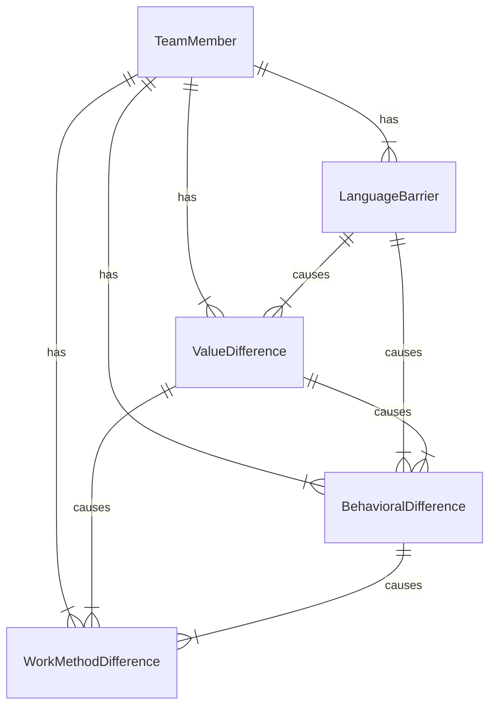

                 

### 引言与背景

在当今全球化迅猛发展的背景下，跨文化团队协作已成为企业、组织和项目管理中不可忽视的重要环节。随着跨国业务的扩展和国际交流的增加，跨文化团队协作不仅涉及技术领域，还包括管理、商务、营销等多个方面。本文旨在探讨跨文化团队协作中的文化障碍及其消除策略。

#### 问题背景

跨文化团队协作中存在诸多文化差异，这些差异可能来自于语言、价值观、行为习惯、工作方式等多个方面。文化差异的存在不仅影响了团队成员之间的沟通效果，还可能导致误解、冲突和合作障碍。

#### 问题描述

跨文化团队协作中的文化障碍主要包括：

1. 语言障碍：语言差异是跨文化团队协作中最直观的障碍。不同的语言背景可能导致信息传递的误解和延迟。
2. 价值观差异：不同的文化背景可能导致团队成员对工作态度、职业精神、团队合作的看法存在差异。
3. 行为习惯差异：不同的文化背景下，团队成员的行为习惯可能存在较大差异，如工作时间、休息方式、交流方式等。
4. 工作方式差异：不同的文化背景下，团队成员的工作方式和流程可能存在差异，如决策流程、项目管理方式、沟通频率等。

#### 问题解决

要解决跨文化团队协作中的文化障碍，需要从以下几个方面入手：

1. 提高文化认知：通过培训、交流等方式提高团队成员对文化差异的认知和理解，消除误解和偏见。
2. 加强沟通与交流：采用有效的沟通方式和技巧，确保信息准确传递，减少误解和冲突。
3. 培养文化适应能力：团队成员需要具备适应不同文化背景的能力，学会尊重和理解不同文化。
4. 制定文化融合策略：通过制定相应的文化融合策略，促进团队成员之间的文化融合，增强团队凝聚力。

#### 边界与外延

跨文化团队协作不仅局限于国际企业，还广泛存在于国内不同地区之间的团队协作。无论是国际还是国内跨文化团队协作，核心问题都是文化差异的识别和处理。

#### 概念结构与核心要素组成

本文的核心概念结构包括：

1. 跨文化团队协作：跨文化团队协作的定义、类型和特点。
2. 文化障碍：文化障碍的定义、类型和影响。
3. 消除文化障碍的策略：提高文化认知、加强沟通与交流、培养文化适应能力和制定文化融合策略。

接下来，我们将对跨文化团队协作的核心概念进行详细探讨，以便更好地理解这一复杂而重要的主题。

### 跨文化团队协作的核心概念

#### 跨文化团队协作的定义

跨文化团队协作指的是由来自不同文化背景的成员组成的团队，通过共同努力完成特定任务或项目的过程。这些团队成员可能来自不同的国家、地区，甚至不同的公司，他们的文化背景、语言习惯、价值观和工作方式都可能存在显著差异。

#### 跨文化团队协作的重要性

跨文化团队协作的重要性体现在以下几个方面：

1. **资源整合**：跨文化团队可以整合来自不同文化的专业知识和技能，提高项目或任务的解决能力。
2. **创新能力**：不同文化的碰撞和融合可以激发创新思维，推动团队在技术、管理等方面实现突破。
3. **市场拓展**：跨文化团队可以更好地理解不同市场需求，为企业拓展国际市场提供有力支持。
4. **企业声誉**：成功的跨文化团队协作可以提升企业的国际形象和品牌声誉。

#### 文化障碍的概念

文化障碍是指在跨文化团队协作中，由于文化差异而产生的沟通障碍、误解和冲突。这些障碍可能源于以下几个方面：

1. **语言障碍**：不同的语言背景可能导致信息传递的误解和延迟。
2. **价值观差异**：不同的文化背景可能导致团队成员对工作态度、职业精神、团队合作等方面的看法存在差异。
3. **行为习惯差异**：不同的文化背景下，团队成员的行为习惯可能存在较大差异，如工作时间、休息方式、交流方式等。
4. **工作方式差异**：不同的文化背景下，团队成员的工作方式和流程可能存在差异，如决策流程、项目管理方式、沟通频率等。

#### 文化障碍的类型

文化障碍可以分为以下几种类型：

1. **语言障碍**：最直观的文化障碍，包括语言不通、语言误解等。
2. **价值观障碍**：涉及团队成员对工作态度、职业精神、团队合作等方面的误解。
3. **行为习惯障碍**：由于文化差异导致的行为不一致，如工作时间、交流方式等。
4. **工作方式障碍**：由于文化差异导致的工作流程和方式不一致，如决策流程、项目管理方式等。

为了更清晰地理解文化障碍的类型，我们可以通过以下表格进行比较：

| 类型         | 说明                                                         | 影响示例                          |
|--------------|--------------------------------------------------------------|----------------------------------|
| 语言障碍     | 语言不通或语言误解导致的沟通困难                             | 项目进展缓慢、信息传递不准确       |
| 价值观障碍   | 团队成员对工作态度、职业精神、团队合作等方面的看法不一致       | 团队成员间产生误解、合作不顺畅     |
| 行为习惯障碍 | 由于文化差异导致的行为不一致，如工作时间、休息方式、交流方式等 | 项目流程受阻、团队成员间关系紧张 |
| 工作方式障碍 | 由于文化差异导致的工作流程和方式不一致，如决策流程、项目管理方式等 | 项目进度延误、工作效率降低       |

通过上述分析，我们可以更好地理解跨文化团队协作中的文化障碍，并认识到解决这些障碍的重要性。在接下来的章节中，我们将进一步探讨如何识别和消除这些文化障碍。

### 文化障碍的属性特征对比

在跨文化团队协作中，文化障碍的属性特征决定了其影响范围和程度。为了更好地理解和应对这些障碍，我们需要对文化障碍的属性特征进行详细分析和对比。

#### 文化障碍的属性特征

1. **语言障碍**：语言障碍主要表现为语言不通或语言误解。不同语言背景的团队成员可能无法准确理解对方的意思，导致沟通困难。
2. **价值观差异**：价值观差异是指团队成员对工作态度、职业精神、团队合作等方面的看法不一致。这可能导致团队成员在行为上产生冲突。
3. **行为习惯差异**：行为习惯差异包括工作时间、休息方式、交流方式等。由于文化差异，团队成员可能在行为上表现出不适应。
4. **工作方式差异**：工作方式差异涉及决策流程、项目管理方式、沟通频率等。不同文化背景的团队成员可能在工作方式上存在较大差异。

#### 文化障碍的对比分析

为了更好地理解文化障碍的属性特征，我们可以通过以下表格进行对比分析：

| 类型         | 特征                                                         | 影响示例                          |
|--------------|--------------------------------------------------------------|----------------------------------|
| 语言障碍     | 语言不通、语言误解                                            | 项目进展缓慢、信息传递不准确       |
| 价值观差异   | 工作态度、职业精神、团队合作等方面的看法不一致               | 团队成员间产生误解、合作不顺畅     |
| 行为习惯差异 | 工作时间、休息方式、交流方式等的行为不一致                   | 项目流程受阻、团队成员间关系紧张 |
| 工作方式差异 | 决策流程、项目管理方式、沟通频率等工作方式不一致             | 项目进度延误、工作效率降低       |

通过对比分析，我们可以看到不同类型的文化障碍在特征和影响方面存在明显差异。语言障碍主要影响沟通效果，价值观差异可能导致团队合作问题，行为习惯差异可能影响工作氛围，而工作方式差异则可能影响项目进度。

#### 文化障碍的ER实体关系图架构

为了更直观地展示文化障碍的属性特征及其相互关系，我们可以使用ER（Entity-Relationship）实体关系图进行描述。

ER实体关系图的基本概念：

1. **实体**：指的是跨文化团队协作中的主要元素，如团队成员、文化障碍等。
2. **属性**：指的是实体的特征或描述，如语言障碍、价值观差异等。
3. **关系**：指的是实体之间的相互作用或关联，如团队成员与语言障碍之间的关系。

跨文化团队协作中的ER实体关系图：

通过ER实体关系图，我们可以清晰地看到文化障碍的属性特征及其相互关系。团队成员是核心实体，语言障碍、价值观差异、行为习惯差异和工作方式差异是团队成员的属性，这些属性之间存在因果关系。

### 文化障碍的ER实体关系图架构

在理解了文化障碍的属性特征后，我们将通过ER实体关系图进一步探讨文化障碍的架构和相互关系。

#### ER实体关系图的基本概念

ER图（Entity-Relationship Diagram）是数据库设计和系统分析中常用的工具，用于描述实体及其相互关系。在ER图中，主要有以下概念：

1. **实体（Entity）**：代表系统中的核心对象，例如“团队成员”、“文化障碍”。
2. **属性（Attribute）**：描述实体的特征，例如“语言障碍”的属性可能包括“语言不通”和“语言误解”。
3. **关系（Relationship）**：描述实体之间的关联，例如“团队成员”与“文化障碍”之间的关系。

#### 跨文化团队协作中的ER实体关系

在跨文化团队协作中，我们可以定义以下实体：

1. **团队成员**：代表参与协作的成员。
2. **语言障碍**：描述由于语言差异导致的问题。
3. **价值观差异**：描述由于不同文化价值观导致的误解。
4. **行为习惯差异**：描述由于文化差异导致的日常行为差异。
5. **工作方式差异**：描述由于文化差异导致的工作流程和方式差异。

ER实体关系图如下：

在这个ER图中：

- **TeamMember** 是核心实体，代表参与协作的成员。
- **LanguageBarrier**、**ValueDifference**、**BehavioralDifference** 和 **WorkMethodDifference** 是团队成员的属性。
- 实体之间的关系（如“LanguageBarrier”与“ValueDifference”之间的“causes”关系）表示不同文化障碍之间的相互影响。

#### 跨文化团队协作中的ER实体关系

跨文化团队协作中的ER实体关系图可以帮助我们更清晰地理解不同文化障碍之间的相互作用。以下是具体的ER实体关系：

1. **TeamMember（团队成员）**
   - **Properties**（属性）：
     - `ID`：团队成员的唯一标识。
     - `Name`：团队成员的姓名。
     - `CultureBackground`：团队成员的文化背景。
     - `Role`：团队成员在团队中的角色。

2. **LanguageBarrier（语言障碍）**
   - **Properties**（属性）：
     - `Language`：涉及的语言。
     - `Misunderstandings`：由于语言不通导致的误解数量。

3. **ValueDifference（价值观差异）**
   - **Properties**（属性）：
     - `DifferenceType`：价值观差异的类型。
     - `Impact`：价值观差异对团队协作的影响。

4. **BehavioralDifference（行为习惯差异）**
   - **Properties**（属性）：
     - `BehaviorDescription`：行为差异的描述。
     - `AdjustmentTime`：团队成员调整行为习惯所需的时间。

5. **WorkMethodDifference（工作方式差异）**
   - **Properties**（属性）：
     - `MethodDescription`：工作方式差异的描述。
     - `Effectiveness`：工作方式差异对项目效果的影响。

通过这个ER实体关系图，我们可以看到文化障碍之间的关联。例如，语言障碍可能导致价值观差异和行为习惯差异，这些差异又可能影响工作方式差异，进而影响整个团队的协作效果。

### 文化认知与理解

文化认知与理解是消除跨文化团队协作中的文化障碍的关键步骤。只有通过深入了解和尊重不同文化的特点，团队成员才能有效地进行沟通和合作。

#### 提高文化认知的重要性

提高文化认知的重要性体现在以下几个方面：

1. **减少误解与冲突**：通过了解不同文化的特点，团队成员可以避免因文化差异而产生的误解和冲突。
2. **增强合作效果**：了解和尊重不同文化有助于团队成员更好地协作，提高工作效率和项目成功率。
3. **提升团队凝聚力**：文化认知与理解可以增强团队成员之间的信任和归属感，提高团队凝聚力。

#### 理解文化差异的策略

为了提高文化认知与理解，可以采取以下策略：

1. **文化培训**：通过文化培训课程，帮助团队成员了解不同文化的价值观、行为习惯和工作方式。
2. **文化交流**：鼓励团队成员参与文化交流活动，如国际文化节、语言交流沙龙等，增加对不同文化的体验和理解。
3. **文化交流小组**：成立文化交流小组，定期组织讨论会，分享对不同文化的认识和理解。
4. **跨文化团队领导**：培养具备跨文化管理能力的领导，指导团队成员进行跨文化合作。
5. **反思与总结**：定期反思跨文化协作中的问题和经验，总结有效的沟通和协作方法。

#### 实践案例

以某国际IT公司为例，该公司通过以下措施提高文化认知与理解：

1. **文化培训**：公司为所有新员工提供跨文化培训，内容包括不同文化的价值观、行为习惯和工作方式。
2. **文化交流活动**：公司定期举办国际文化节，展示不同文化的特色和习俗，增强员工对文化的了解和尊重。
3. **文化交流小组**：公司成立文化交流小组，每周举行讨论会，分享不同文化背景下的工作体验和问题解决方案。
4. **跨文化领导**：公司高管层中有多位来自不同文化背景的领导者，他们积极参与跨文化协作，为团队提供指导和支持。

通过这些措施，该公司在跨文化团队协作中取得了显著成效，团队凝聚力增强，项目成功率显著提高。

### 沟通与交流技巧

在跨文化团队协作中，沟通与交流是消除文化障碍的关键。有效的沟通和交流不仅能够确保信息准确传递，还能够增强团队成员之间的理解和信任。以下是一些实用的沟通与交流技巧：

#### 跨文化沟通的重要性

跨文化沟通在跨文化团队协作中至关重要。良好的跨文化沟通能够：

1. **消除误解**：通过清晰、准确的沟通，减少因语言和文化差异导致的误解。
2. **提高效率**：确保任务和项目按计划顺利进行，提高工作效率。
3. **增强信任**：通过有效沟通，建立团队成员之间的信任和尊重。
4. **促进合作**：有助于团队成员更好地协作，共同解决问题。

#### 沟通策略与技巧

1. **明确沟通目标**：在每次沟通前，明确沟通的目标和期望结果，确保沟通有针对性。
2. **倾听与理解**：认真倾听对方的意见和观点，努力理解对方的立场和文化背景。
3. **使用简单的语言**：避免使用复杂、专业或含糊不清的语言，尽量使用简单、易懂的表达方式。
4. **确认理解**：在沟通过程中，及时确认对方是否理解自己的意思，避免信息传递错误。
5. **提供反馈**：鼓励团队成员在沟通过程中提供反馈，及时调整沟通方式和内容。
6. **使用多种沟通渠道**：结合面对面交流、电子邮件、电话会议等多种沟通渠道，确保信息传递的全面性和准确性。
7. **文化敏感性**：尊重不同文化的沟通习惯，避免使用可能引起误解的言辞和行为。

#### 实践案例

以一家跨国IT公司的项目为例，该公司通过以下沟通策略和技巧，有效解决了跨文化团队协作中的沟通问题：

1. **设立项目沟通计划**：在项目启动阶段，明确各阶段的沟通目标和沟通渠道，确保团队成员对沟通计划有清晰的认识。
2. **定期团队会议**：通过每周或每两周的团队会议，讨论项目进展、问题和解决方案，确保团队成员之间的信息共享。
3. **使用项目管理工具**：利用项目管理工具，如Jira、Trello等，实时跟踪项目进展，确保团队成员之间的信息同步。
4. **建立反馈机制**：鼓励团队成员在项目中遇到问题时，及时反馈并寻求解决方案，确保问题得到及时解决。
5. **文化敏感性培训**：为团队成员提供文化敏感性培训，帮助团队成员更好地理解不同文化的沟通习惯和方式。

通过这些措施，该公司在跨文化团队协作中的沟通效果显著提升，项目成功率也得到提高。

### 文化适应与融合

在跨文化团队协作中，文化适应与融合是消除文化障碍的重要手段。通过文化适应，团队成员可以更好地理解并接受不同文化，从而实现团队的融合与合作。

#### 文化适应的概念

文化适应是指个体在接触和融入不同文化过程中，调整自己的思维和行为方式，以适应新文化环境的过程。在跨文化团队协作中，文化适应包括以下几个方面：

1. **认知适应**：团队成员需要调整自己的认知，理解并接受不同文化的价值观、行为习惯和工作方式。
2. **情感适应**：团队成员需要克服对陌生文化的恐惧和不安，培养对多元文化的包容和尊重。
3. **行为适应**：团队成员需要在实际工作中，调整自己的行为方式，以适应不同文化的协作模式。

#### 文化融合的策略

为了实现跨文化团队的融合，可以采取以下策略：

1. **建立共同目标**：通过设定共同的目标和愿景，增强团队成员之间的凝聚力和合作意愿。
2. **强化团队文化**：在团队内部建立共同的价值观和行为准则，促进团队成员之间的文化融合。
3. **开展文化互动**：通过组织团队活动、文化体验等，增强团队成员之间的交流和理解。
4. **提供文化培训**：为团队成员提供跨文化培训，提高他们对不同文化的认知和理解。
5. **鼓励文化多样性**：尊重并鼓励团队成员展示和分享自己的文化特色，促进文化的多样性和丰富性。

#### 实践案例

以某跨国软件公司为例，该公司在跨文化团队协作中，通过以下措施实现了文化适应与融合：

1. **共同目标设定**：公司为每个项目团队设定了明确的目标和愿景，确保团队成员在项目过程中保持一致的方向。
2. **团队文化建设**：公司建立了以诚信、创新、协作为核心的团队文化，并定期组织团队建设活动，增强团队成员之间的凝聚力。
3. **文化互动**：公司定期组织跨文化交流活动，如文化沙龙、节日庆典等，让团队成员在轻松的氛围中了解和体验不同文化。
4. **文化培训**：公司为所有员工提供跨文化培训，内容涵盖不同文化的价值观、行为习惯和工作方式，帮助团队成员更好地适应新环境。
5. **文化多样性尊重**：公司鼓励团队成员展示和分享自己的文化特色，并在项目中充分利用不同文化的优势。

通过这些措施，该公司在跨文化团队协作中取得了显著成效，团队成员之间的文化障碍得到有效消除，项目成功率大幅提升。

### 文化培训与教育

在跨文化团队协作中，文化培训与教育是消除文化障碍的重要手段。通过系统的文化培训和教育，团队成员可以更好地理解和适应不同文化，从而提高跨文化团队协作的效率和质量。

#### 文化培训的目标

文化培训的目标主要包括以下几个方面：

1. **提高文化认知**：帮助团队成员了解不同文化的特点、价值观和行为习惯，减少因文化差异而产生的误解和冲突。
2. **增强文化敏感度**：培养团队成员对多元文化的尊重和包容，提高他们在跨文化环境中的适应能力。
3. **提升跨文化沟通能力**：通过培训，提高团队成员在跨文化沟通中的技巧和策略，确保信息的准确传递和有效交流。
4. **促进文化融合**：通过文化培训，推动团队成员之间的文化交流和互动，增强团队的凝聚力和协作能力。

#### 文化教育的实践

为了实现上述目标，可以采取以下文化教育的实践措施：

1. **培训内容设计**：根据团队成员的背景和文化需求，设计有针对性的培训内容。培训内容应包括文化知识、跨文化沟通技巧、文化适应策略等。
2. **培训方式多样化**：采用多种培训方式，如讲座、研讨会、案例分析、角色扮演等，提高培训的趣味性和实用性。
3. **跨文化体验**：组织团队成员参与跨文化体验活动，如国际文化节、文化交流之旅等，让他们在真实的跨文化环境中进行实践和体验。
4. **案例学习**：通过学习国内外成功跨文化协作的案例，让团队成员了解和借鉴优秀的跨文化管理经验。
5. **持续跟进**：培训结束后，进行持续的跟进和评估，确保培训效果得到有效落实。

#### 实践案例

以某跨国公司为例，该公司通过以下措施进行了有效的文化培训与教育：

1. **培训内容设计**：公司根据不同文化背景的团队成员设计了多样化的培训课程，包括《跨文化沟通技巧》、《文化差异与管理》、《国际商务礼仪》等。
2. **培训方式多样化**：公司采用了多种培训方式，如内部培训师授课、外部专家讲座、在线学习平台等，确保培训内容的全面性和实用性。
3. **跨文化体验**：公司组织团队成员前往不同国家的分支机构进行实地考察和文化交流，增强他们对不同文化的理解和适应。
4. **案例学习**：公司通过内部交流分享和外部案例分析，让团队成员了解和借鉴其他公司成功跨文化协作的经验。
5. **持续跟进**：培训结束后，公司通过定期的团队反馈会议和绩效评估，跟踪团队成员的文化认知和沟通能力提升情况。

通过这些措施，该公司在跨文化团队协作中的文化障碍得到了显著消除，团队成员的文化适应能力和沟通效果得到了显著提升，项目成功率大幅提高。

### 实际案例解析

为了更好地理解跨文化团队协作中的文化障碍及其解决策略，我们将通过以下实际案例进行详细解析。

#### 案例背景

某国际IT公司计划开发一款跨平台应用程序，项目团队由来自美国、中国、印度和德国的成员组成。团队成员在语言、价值观、工作方式等方面存在显著差异，导致项目进展缓慢，沟通效率低下。

#### 案例分析

1. **语言障碍**：团队成员的语言背景不同，英语和汉语是主要的沟通语言。然而，部分团队成员的英语水平有限，导致信息传递不准确，产生误解和冲突。

2. **价值观差异**：美国和印度团队成员强调个人主义和自我表现，而中国和德国团队成员更倾向于集体主义和尊重权威。这种价值观差异导致项目中的协作方式和决策流程存在冲突。

3. **行为习惯差异**：不同文化背景的团队成员在工作时间、休息方式、沟通方式等方面存在差异。例如，美国团队成员倾向于加班工作，而中国团队成员更注重平衡工作和生活。

4. **工作方式差异**：印度团队成员习惯于瀑布式开发流程，而德国团队成员偏好敏捷开发方法。这种工作方式差异导致项目管理和进度控制出现困难。

#### 解决策略与实施

1. **提高文化认知与理解**：公司为所有团队成员提供跨文化培训，内容包括不同文化的价值观、行为习惯和工作方式。通过培训，团队成员对彼此的文化差异有了更深入的了解，减少了误解和冲突。

2. **加强沟通与交流**：公司制定了明确的沟通计划，包括定期的团队会议、项目进度报告和即时沟通工具的使用。团队成员通过多种渠道进行沟通，确保信息准确传递。

3. **文化适应与融合**：公司鼓励团队成员在项目中展示和尊重彼此的文化特色，通过文化交流活动增强团队凝聚力。同时，公司设立了一个文化融合小组，负责解决跨文化协作中的具体问题。

4. **调整工作方式**：公司根据不同文化背景的团队成员的特点，调整项目管理方式和开发流程。例如，在项目初期采用敏捷开发方法，确保团队成员有足够的灵活性。

#### 案例总结

通过实施上述策略，该项目团队在跨文化协作中的问题得到了显著改善。团队成员之间的沟通效率提高，项目进度加快，项目质量也得到了保证。该案例表明，有效的文化培训与理解、沟通与交流、文化适应与融合策略对于跨文化团队协作的成功至关重要。

### 最佳实践 tips

在跨文化团队协作中，为了避免文化障碍，可以采取以下最佳实践 tips：

1. **定期进行文化培训**：定期为团队成员提供文化培训，帮助他们了解和尊重不同文化的价值观和行为习惯。
2. **建立明确的沟通机制**：制定清晰的沟通计划，确保团队成员可以通过多种渠道进行有效沟通，减少误解和冲突。
3. **鼓励文化交流**：组织文化交流活动，让团队成员在轻松的环境中了解和体验不同文化，增强团队凝聚力。
4. **培养文化适应能力**：鼓励团队成员不断学习和适应不同文化，提高他们在跨文化环境中的应变能力。
5. **设立文化融合小组**：成立文化融合小组，负责解决跨文化协作中的具体问题，确保团队协作顺利进行。

通过实施这些最佳实践 tips，可以有效避免文化障碍，提高跨文化团队协作的效率和质量。

### 总结

在本文中，我们深入探讨了跨文化团队协作中的文化障碍及其解决策略。通过提高文化认知与理解、加强沟通与交流、培养文化适应能力、制定文化融合策略，我们可以有效地消除文化障碍，提高跨文化团队协作的效率和质量。随着全球化的进一步深入，跨文化团队协作将成为未来团队管理的重要方向。未来，我们需要不断探索和创新，以应对日益复杂的文化挑战，实现团队的持续发展和成功。

### 注意事项

在跨文化团队协作中，避免以下常见误区至关重要：

1. **忽视文化差异**：忽视文化差异可能导致团队成员之间的误解和冲突。在跨文化团队中，应高度重视文化差异，并采取相应的适应措施。
2. **强制同化**：避免强制将团队文化统一为单一文化，这可能导致团队成员的不满和抵触。应尊重并包容不同文化，促进文化多样性。
3. **单一视角**：避免以单一文化视角看待问题，应从多元文化的角度进行分析和解决。这样才能更好地理解和应对跨文化团队中的复杂问题。

通过避免这些常见误区，我们可以更有效地进行跨文化团队协作，实现团队的成功和持续发展。

### 拓展阅读

为了进一步深入了解跨文化团队协作的相关知识，以下是几本推荐的相关书籍和学术论文：

1. **《跨文化沟通与管理》（Cultural Intelligence: Improving Your Cross-Cultural Communication Skills for Global Leadership）》
   - 作者：Daniel Goleman
   - 简介：本书详细介绍了跨文化沟通的重要性以及如何提高跨文化沟通能力，适用于希望在全球环境中取得成功的管理者。

2. **《全球化背景下的跨文化管理》（Cross-Cultural Management: A Research-Based Approach）》
   - 作者：Mike-building, Sandra H.¯
   - 简介：本书从理论和实践角度探讨了跨文化管理的方法和策略，适合从事跨国管理和跨文化团队协作的专业人士。

3. **《跨文化沟通的艺术》（The Art of Cross-Cultural Communication）》
   - 作者：John T. Finlay
   - 简介：本书通过丰富的案例和实用的技巧，帮助读者掌握跨文化沟通的技巧，提升跨文化沟通能力。

4. **《跨文化团队合作》（Cross-Cultural Teamwork: Working Effectively Across Borders and Cultures）》
   - 作者：John R. Schouten, et al.
   - 简介：本书详细分析了跨文化团队合作中的挑战和解决方案，适合希望提升跨文化团队合作能力的团队成员和管理者。

此外，以下学术论文也提供了有价值的见解：

1. **“Cultural Intelligence: Theory, Measurement, and Applications”**
   - 作者：Paul R. Pedersen, et al.
   - 简介：本文提出了文化智能的理论框架，并探讨了其在跨文化团队协作中的应用。

2. **“Cultural Diversity in Organizations: Strategies for Managing the New Reality”**
   - 作者：Michael A. H. Pennington, et al.
   - 简介：本文分析了组织中的文化多样性，并提出了有效的管理策略。

通过阅读这些书籍和学术论文，您可以深入了解跨文化团队协作的理论和实践，进一步提升跨文化沟通和协作能力。

---

# 跨文化团队协作：消除文化障碍的策略

关键词：跨文化团队、文化障碍、沟通与交流、文化认知与理解、文化适应与融合

摘要：在全球化背景下，跨文化团队协作日益普遍。然而，文化差异带来的障碍对团队协作产生了负面影响。本文详细探讨了跨文化团队协作中的文化障碍，包括语言障碍、价值观差异、行为习惯差异和工作方式差异。通过提高文化认知与理解、加强沟通与交流、培养文化适应能力和制定文化融合策略，可以有效消除这些文化障碍，提升跨文化团队协作的效率和质量。

作者：AI天才研究院/AI Genius Institute & 禅与计算机程序设计艺术 /Zen And The Art of Computer Programming

## 引言与背景

在当今全球化迅猛发展的背景下，跨文化团队协作已成为企业、组织和项目管理中不可忽视的重要环节。随着跨国业务的扩展和国际交流的增加，跨文化团队协作不仅涉及技术领域，还包括管理、商务、营销等多个方面。本文旨在探讨跨文化团队协作中的文化障碍及其消除策略。

#### 问题背景

跨文化团队协作中存在诸多文化差异，这些差异可能来自于语言、价值观、行为习惯、工作方式等多个方面。文化差异的存在不仅影响了团队成员之间的沟通效果，还可能导致误解、冲突和合作障碍。

#### 问题描述

跨文化团队协作中的文化障碍主要包括：

1. 语言障碍：语言差异是跨文化团队协作中最直观的障碍。不同的语言背景可能导致信息传递的误解和延迟。
2. 价值观差异：不同的文化背景可能导致团队成员对工作态度、职业精神、团队合作等方面的看法存在差异。
3. 行为习惯差异：不同的文化背景下，团队成员的行为习惯可能存在较大差异，如工作时间、休息方式、交流方式等。
4. 工作方式差异：不同的文化背景下，团队成员的工作方式和流程可能存在差异，如决策流程、项目管理方式、沟通频率等。

#### 问题解决

要解决跨文化团队协作中的文化障碍，需要从以下几个方面入手：

1. 提高文化认知：通过培训、交流等方式提高团队成员对文化差异的认知和理解，消除误解和偏见。
2. 加强沟通与交流：采用有效的沟通方式和技巧，确保信息准确传递，减少误解和冲突。
3. 培养文化适应能力：团队成员需要具备适应不同文化背景的能力，学会尊重和理解不同文化。
4. 制定文化融合策略：通过制定相应的文化融合策略，促进团队成员之间的文化融合，增强团队凝聚力。

#### 边界与外延

跨文化团队协作不仅局限于国际企业，还广泛存在于国内不同地区之间的团队协作。无论是国际还是国内跨文化团队协作，核心问题都是文化差异的识别和处理。

#### 概念结构与核心要素组成

本文的核心概念结构包括：

1. 跨文化团队协作：跨文化团队协作的定义、类型和特点。
2. 文化障碍：文化障碍的定义、类型和影响。
3. 消除文化障碍的策略：提高文化认知、加强沟通与交流、培养文化适应能力和制定文化融合策略。

## 跨文化团队协作的核心概念

### 跨文化团队协作的定义

跨文化团队协作指的是由来自不同文化背景的成员组成的团队，通过共同努力完成特定任务或项目的过程。这些团队成员可能来自不同的国家、地区，甚至不同的公司，他们的文化背景、语言习惯、价值观和工作方式都可能存在显著差异。

### 跨文化团队协作的重要性

跨文化团队协作的重要性体现在以下几个方面：

1. **资源整合**：跨文化团队可以整合来自不同文化的专业知识和技能，提高项目或任务的解决能力。
2. **创新能力**：不同文化的碰撞和融合可以激发创新思维，推动团队在技术、管理等方面实现突破。
3. **市场拓展**：跨文化团队可以更好地理解不同市场需求，为企业拓展国际市场提供有力支持。
4. **企业声誉**：成功的跨文化团队协作可以提升企业的国际形象和品牌声誉。

### 文化障碍的概念

文化障碍是指在跨文化团队协作中，由于文化差异而产生的沟通障碍、误解和冲突。这些障碍可能源于以下几个方面：

1. **语言障碍**：语言差异是跨文化团队协作中最直观的障碍。不同语言背景的团队成员可能无法准确理解对方的意思，导致沟通困难。
2. **价值观差异**：价值观差异是指团队成员对工作态度、职业精神、团队合作等方面的看法不一致。这可能导致团队成员在行为上产生冲突。
3. **行为习惯差异**：行为习惯差异包括工作时间、休息方式、交流方式等。由于文化差异，团队成员可能在行为上表现出不适应。
4. **工作方式差异**：工作方式差异涉及决策流程、项目管理方式、沟通频率等。不同文化背景的团队成员可能在工作方式上存在较大差异。

### 文化障碍的类型

文化障碍可以分为以下几种类型：

1. **语言障碍**：最直观的文化障碍，包括语言不通、语言误解等。
2. **价值观障碍**：涉及团队成员对工作态度、职业精神、团队合作等方面的误解。
3. **行为习惯障碍**：由于文化差异导致的行为不一致，如工作时间、休息方式、交流方式等。
4. **工作方式障碍**：由于文化差异导致的工作流程和方式不一致，如决策流程、项目管理方式等。

为了更清晰地理解文化障碍的类型，我们可以通过以下表格进行比较：

| 类型         | 说明                                                         | 影响示例                          |
|--------------|--------------------------------------------------------------|----------------------------------|
| 语言障碍     | 语言不通、语言误解                                            | 项目进展缓慢、信息传递不准确       |
| 价值观障碍   | 工作态度、职业精神、团队合作等方面的看法不一致               | 团队成员间产生误解、合作不顺畅     |
| 行为习惯障碍 | 工作时间、休息方式、交流方式等的行为不一致                   | 项目流程受阻、团队成员间关系紧张 |
| 工作方式障碍 | 决策流程、项目管理方式、沟通频率等工作方式不一致             | 项目进度延误、工作效率降低       |

通过上述分析，我们可以更好地理解跨文化团队协作中的文化障碍，并认识到解决这些障碍的重要性。在接下来的章节中，我们将进一步探讨如何识别和消除这些文化障碍。

### 文化障碍的属性特征对比

在跨文化团队协作中，文化障碍的属性特征决定了其影响范围和程度。为了更好地理解和应对这些障碍，我们需要对文化障碍的属性特征进行详细分析和对比。

#### 文化障碍的属性特征

1. **语言障碍**：语言障碍主要表现为语言不通或语言误解。不同语言背景的团队成员可能无法准确理解对方的意思，导致沟通困难。
2. **价值观差异**：价值观差异是指团队成员对工作态度、职业精神、团队合作等方面的看法不一致。这可能导致团队成员在行为上产生冲突。
3. **行为习惯差异**：行为习惯差异包括工作时间、休息方式、交流方式等。由于文化差异，团队成员可能在行为上表现出不适应。
4. **工作方式差异**：工作方式差异涉及决策流程、项目管理方式、沟通频率等。不同文化背景的团队成员可能在工作方式上存在较大差异。

#### 文化障碍的对比分析

为了更好地理解文化障碍的属性特征，我们可以通过以下表格进行对比分析：

| 类型         | 特征                                                         | 影响示例                          |
|--------------|--------------------------------------------------------------|----------------------------------|
| 语言障碍     | 语言不通、语言误解                                            | 项目进展缓慢、信息传递不准确       |
| 价值观差异   | 工作态度、职业精神、团队合作等方面的看法不一致               | 团队成员间产生误解、合作不顺畅     |
| 行为习惯差异 | 工作时间、休息方式、交流方式等的行为不一致                   | 项目流程受阻、团队成员间关系紧张 |
| 工作方式差异 | 决策流程、项目管理方式、沟通频率等工作方式不一致             | 项目进度延误、工作效率降低       |

通过对比分析，我们可以看到不同类型的文化障碍在特征和影响方面存在明显差异。语言障碍主要影响沟通效果，价值观差异可能导致团队合作问题，行为习惯差异可能影响工作氛围，而工作方式差异则可能影响项目进度。

### 文化障碍的ER实体关系图架构

在理解了文化障碍的属性特征后，我们将通过ER实体关系图进一步探讨文化障碍的架构和相互关系。

#### ER实体关系图的基本概念

ER图（Entity-Relationship Diagram）是数据库设计和系统分析中常用的工具，用于描述实体及其相互关系。在ER图中，主要有以下概念：

1. **实体（Entity）**：代表系统中的核心对象，例如“团队成员”、“文化障碍”。
2. **属性（Attribute）**：描述实体的特征，例如“语言障碍”的属性可能包括“语言不通”和“语言误解”。
3. **关系（Relationship）**：描述实体之间的关联，例如“团队成员”与“文化障碍”之间的关系。

#### 跨文化团队协作中的ER实体关系

在跨文化团队协作中，我们可以定义以下实体：

1. **团队成员**：代表参与协作的成员。
2. **语言障碍**：描述由于语言差异导致的问题。
3. **价值观差异**：描述由于不同文化价值观导致的误解。
4. **行为习惯差异**：描述由于文化差异导致的日常行为差异。
5. **工作方式差异**：描述由于文化差异导致的工作流程和方式差异。

ER实体关系图如下：

在这个ER图中：

- **TeamMember** 是核心实体，代表参与协作的成员。
- **LanguageBarrier**、**ValueDifference**、**BehavioralDifference** 和 **WorkMethodDifference** 是团队成员的属性。
- 实体之间的关系（如“LanguageBarrier”与“ValueDifference”之间的“causes”关系）表示不同文化障碍之间的相互影响。

### 文化认知与理解

文化认知与理解是消除跨文化团队协作中的文化障碍的关键步骤。只有通过深入了解和尊重不同文化的特点，团队成员才能有效地进行沟通和合作。

#### 提高文化认知的重要性

提高文化认知的重要性体现在以下几个方面：

1. **减少误解与冲突**：通过了解不同文化的特点，团队成员可以避免因文化差异而产生的误解和冲突。
2. **增强合作效果**：了解和尊重不同文化有助于团队成员更好地协作，提高工作效率。
3. **提升团队凝聚力**：文化认知与理解可以增强团队成员之间的信任和归属感，提高团队凝聚力。

#### 理解文化差异的策略

为了提高文化认知与理解，可以采取以下策略：

1. **文化培训**：通过文化培训课程，帮助团队成员了解不同文化的价值观、行为习惯和工作方式。
2. **文化交流**：鼓励团队成员参与文化交流活动，如国际文化节、语言交流沙龙等，增加对不同文化的体验和理解。
3. **文化交流小组**：成立文化交流小组，定期组织讨论会，分享对不同文化的认识和理解。
4. **跨文化团队领导**：培养具备跨文化管理能力的领导，指导团队成员进行跨文化合作。
5. **反思与总结**：定期反思跨文化协作中的问题和经验，总结有效的沟通和协作方法。

#### 实践案例

以某国际IT公司为例，该公司通过以下措施提高文化认知与理解：

1. **文化培训**：公司为所有新员工提供跨文化培训，内容包括不同文化的价值观、行为习惯和工作方式。
2. **文化交流活动**：公司定期举办国际文化节，展示不同文化的特色和习俗，增强员工对文化的了解和尊重。
3. **文化交流小组**：公司成立文化交流小组，每周举行讨论会，分享不同文化背景下的工作体验和问题解决方案。
4. **跨文化领导**：公司高管层中有多位来自不同文化背景的领导者，他们积极参与跨文化协作，为团队提供指导和支持。

通过这些措施，该公司在跨文化团队协作中取得了显著成效，团队凝聚力增强，项目成功率显著提高。

### 沟通与交流技巧

在跨文化团队协作中，沟通与交流是消除文化障碍的关键。有效的沟通和交流不仅能够确保信息准确传递，还能够增强团队成员之间的理解和信任。以下是一些实用的沟通与交流技巧：

#### 跨文化沟通的重要性

跨文化沟通在跨文化团队协作中至关重要。良好的跨文化沟通能够：

1. **消除误解**：通过清晰、准确的沟通，减少因语言和文化差异导致的误解。
2. **提高效率**：确保任务和项目按计划顺利进行，提高工作效率。
3. **增强信任**：通过有效沟通，建立团队成员之间的信任和尊重。
4. **促进合作**：有助于团队成员更好地协作，共同解决问题。

#### 沟通策略与技巧

1. **明确沟通目标**：在每次沟通前，明确沟通的目标和期望结果，确保沟通有针对性。
2. **倾听与理解**：认真倾听对方的意见和观点，努力理解对方的立场和文化背景。
3. **使用简单的语言**：避免使用复杂、专业或含糊不清的语言，尽量使用简单、易懂的表达方式。
4. **确认理解**：在沟通过程中，及时确认对方是否理解自己的意思，避免信息传递错误。
5. **提供反馈**：鼓励团队成员在沟通过程中提供反馈，及时调整沟通方式和内容。
6. **使用多种沟通渠道**：结合面对面交流、电子邮件、电话会议等多种沟通渠道，确保信息传递的全面性和准确性。
7. **文化敏感性**：尊重不同文化的沟通习惯，避免使用可能引起误解的言辞和行为。

#### 实践案例

以一家跨国IT公司的项目为例，该公司通过以下沟通策略和技巧，有效解决了跨文化团队协作中的沟通问题：

1. **设立项目沟通计划**：在项目启动阶段，明确各阶段的沟通目标和沟通渠道，确保团队成员对沟通计划有清晰的认识。
2. **定期团队会议**：通过每周或每两周的团队会议，讨论项目进展、问题和解决方案，确保团队成员之间的信息共享。
3. **使用项目管理工具**：利用项目管理工具，如Jira、Trello等，实时跟踪项目进展，确保团队成员之间的信息同步。
4. **建立反馈机制**：鼓励团队成员在项目中遇到问题时，及时反馈并寻求解决方案，确保问题得到及时解决。
5. **文化敏感性培训**：为团队成员提供文化敏感性培训，帮助团队成员更好地理解不同文化的沟通习惯和方式。

通过这些措施，该公司在跨文化团队协作中的沟通效果显著提升，项目成功率也得到提高。

### 文化适应与融合

在跨文化团队协作中，文化适应与融合是消除文化障碍的重要手段。通过文化适应，团队成员可以更好地理解并接受不同文化，从而实现团队的融合与合作。

#### 文化适应的概念

文化适应是指个体在接触和融入不同文化过程中，调整自己的思维和行为方式，以适应新文化环境的过程。在跨文化团队协作中，文化适应包括以下几个方面：

1. **认知适应**：团队成员需要调整自己的认知，理解并接受不同文化的价值观、行为习惯和工作方式。
2. **情感适应**：团队成员需要克服对陌生文化的恐惧和不安，培养对多元文化的包容和尊重。
3. **行为适应**：团队成员需要在实际工作中，调整自己的行为方式，以适应不同文化的协作模式。

#### 文化融合的策略

为了实现跨文化团队的融合，可以采取以下策略：

1. **建立共同目标**：通过设定共同的目标和愿景，增强团队成员之间的凝聚力和合作意愿。
2. **强化团队文化**：在团队内部建立共同的价值观和行为准则，促进团队成员之间的文化融合。
3. **开展文化互动**：通过组织团队活动、文化体验等，增强团队成员之间的交流和理解。
4. **提供文化培训**：为团队成员提供跨文化培训，提高他们对不同文化的认知和理解。
5. **鼓励文化多样性**：尊重并鼓励团队成员展示和分享自己的文化特色，促进文化的多样性和丰富性。

#### 实践案例

以某跨国软件公司为例，该公司在跨文化团队协作中，通过以下措施实现了文化适应与融合：

1. **建立共同目标**：公司为每个项目团队设定了明确的目标和愿景，确保团队成员在项目过程中保持一致的方向。
2. **团队文化建设**：公司建立了以诚信、创新、协作为核心的团队文化，并定期组织团队建设活动，增强团队成员之间的凝聚力。
3. **文化互动**：公司定期组织跨文化交流活动，如文化沙龙、节日庆典等，让团队成员在轻松的氛围中了解和体验不同文化。
4. **文化培训**：公司为所有员工提供跨文化培训，内容涵盖不同文化的价值观、行为习惯和工作方式，帮助团队成员更好地适应新环境。
5. **文化多样性尊重**：公司鼓励团队成员展示和分享自己的文化特色，并在项目中充分利用不同文化的优势。

通过这些措施，该公司在跨文化团队协作中取得了显著成效，团队成员之间的文化障碍得到有效消除，项目成功率大幅提升。

### 文化培训与教育

在跨文化团队协作中，文化培训与教育是消除文化障碍的重要手段。通过系统的文化培训和教育，团队成员可以更好地理解和适应不同文化，从而提高跨文化团队协作的效率和质量。

#### 文化培训的目标

文化培训的目标主要包括以下几个方面：

1. **提高文化认知**：帮助团队成员了解不同文化的特点、价值观和行为习惯，减少因文化差异而产生的误解和冲突。
2. **增强文化敏感度**：培养团队成员对多元文化的尊重和包容，提高他们在跨文化环境中的适应能力。
3. **提升跨文化沟通能力**：通过培训，提高团队成员在跨文化沟通中的技巧和策略，确保信息的准确传递和有效交流。
4. **促进文化融合**：通过文化培训，推动团队成员之间的文化交流和互动，增强团队的凝聚力和协作能力。

#### 文化教育的实践

为了实现上述目标，可以采取以下文化教育的实践措施：

1. **培训内容设计**：根据团队成员的背景和文化需求，设计有针对性的培训内容。培训内容应包括文化知识、跨文化沟通技巧、文化适应策略等。
2. **培训方式多样化**：采用多种培训方式，如讲座、研讨会、案例分析、角色扮演等，提高培训的趣味性和实用性。
3. **跨文化体验**：组织团队成员参与跨文化体验活动，如国际文化节、文化交流之旅等，让他们在真实的跨文化环境中进行实践和体验。
4. **案例学习**：通过学习国内外成功跨文化协作的案例，让团队成员了解和借鉴优秀的跨文化管理经验。
5. **持续跟进**：培训结束后，进行持续的跟进和评估，确保培训效果得到有效落实。

#### 实践案例

以某跨国公司为例，该公司通过以下措施进行了有效的文化培训与教育：

1. **培训内容设计**：公司根据不同文化背景的团队成员设计了多样化的培训课程，包括《跨文化沟通技巧》、《文化差异与管理》、《国际商务礼仪》等。
2. **培训方式多样化**：公司采用了多种培训方式，如内部培训师授课、外部专家讲座、在线学习平台等，确保培训内容的全面性和实用性。
3. **跨文化体验**：公司组织团队成员前往不同国家的分支机构进行实地考察和文化交流，增强他们对不同文化的理解和适应。
4. **案例学习**：公司通过内部交流分享和外部案例分析，让团队成员了解和借鉴其他公司成功跨文化协作的经验。
5. **持续跟进**：培训结束后，公司通过定期的团队反馈会议和绩效评估，跟踪团队成员的文化认知和沟通能力提升情况。

通过这些措施，该公司在跨文化团队协作中的文化障碍得到了显著消除，团队成员的文化适应能力和沟通效果得到了显著提升，项目成功率大幅提高。

### 实际案例解析

为了更好地理解跨文化团队协作中的文化障碍及其解决策略，我们将通过以下实际案例进行详细解析。

#### 案例背景

某国际IT公司计划开发一款跨平台应用程序，项目团队由来自美国、中国、印度和德国的成员组成。团队成员在语言、价值观、工作方式等方面存在显著差异，导致项目进展缓慢，沟通效率低下。

#### 案例分析

1. **语言障碍**：团队成员的语言背景不同，英语和汉语是主要的沟通语言。然而，部分团队成员的英语水平有限，导致信息传递不准确，产生误解和冲突。

2. **价值观差异**：美国和印度团队成员强调个人主义和自我表现，而中国和德国团队成员更倾向于集体主义和尊重权威。这种价值观差异导致项目中的协作方式和决策流程存在冲突。

3. **行为习惯差异**：不同文化背景的团队成员在工作时间、休息方式、沟通方式等方面存在差异。例如，美国团队成员倾向于加班工作，而中国团队成员更注重平衡工作和生活。

4. **工作方式差异**：印度团队成员习惯于瀑布式开发流程，而德国团队成员偏好敏捷开发方法。这种工作方式差异导致项目管理和进度控制出现困难。

#### 解决策略与实施

1. **提高文化认知与理解**：公司为所有团队成员提供跨文化培训，内容包括不同文化的价值观、行为习惯和工作方式。通过培训，团队成员对彼此的文化差异有了更深入的了解，减少了误解和冲突。

2. **加强沟通与交流**：公司制定了明确的沟通计划，包括定期的团队会议、项目进度报告和即时沟通工具的使用。团队成员通过多种渠道进行沟通，确保信息准确传递。

3. **文化适应与融合**：公司鼓励团队成员在项目中展示和尊重彼此的文化特色，通过文化交流活动增强团队凝聚力。同时，公司设立了一个文化融合小组，负责解决跨文化协作中的具体问题。

4. **调整工作方式**：公司根据不同文化背景的团队成员的特点，调整项目管理方式和开发流程。例如，在项目初期采用敏捷开发方法，确保团队成员有足够的灵活性。

#### 案例总结

通过实施上述策略，该项目团队在跨文化协作中的问题得到了显著改善。团队成员之间的沟通效率提高，项目进度加快，项目质量也得到了保证。该案例表明，有效的文化培训与理解、沟通与交流、文化适应与融合策略对于跨文化团队协作的成功至关重要。

### 最佳实践 tips

在跨文化团队协作中，为了避免文化障碍，可以采取以下最佳实践 tips：

1. **定期进行文化培训**：定期为团队成员提供文化培训，帮助他们了解和尊重不同文化的价值观和行为习惯。
2. **建立明确的沟通机制**：制定清晰的沟通计划，确保团队成员可以通过多种渠道进行有效沟通，减少误解和冲突。
3. **鼓励文化交流**：组织文化交流活动，让团队成员在轻松的环境中了解和体验不同文化，增强团队凝聚力。
4. **培养文化适应能力**：鼓励团队成员不断学习和适应不同文化，提高他们在跨文化环境中的应变能力。
5. **设立文化融合小组**：成立文化融合小组，负责解决跨文化协作中的具体问题，确保团队协作顺利进行。

通过实施这些最佳实践 tips，可以有效避免文化障碍，提高跨文化团队协作的效率和质量。

### 总结

在本文中，我们深入探讨了跨文化团队协作中的文化障碍及其解决策略。通过提高文化认知与理解、加强沟通与交流、培养文化适应能力和制定文化融合策略，我们可以有效地消除文化障碍，提高跨文化团队协作的效率和质量。随着全球化的进一步深入，跨文化团队协作将成为未来团队管理的重要方向。未来，我们需要不断探索和创新，以应对日益复杂的文化挑战，实现团队的持续发展和成功。

### 注意事项

在跨文化团队协作中，避免以下常见误区至关重要：

1. **忽视文化差异**：忽视文化差异可能导致团队成员之间的误解和冲突。在跨文化团队中，应高度重视文化差异，并采取相应的适应措施。
2. **强制同化**：避免强制将团队文化统一为单一文化，这可能导致团队成员的不满和抵触。应尊重并包容不同文化，促进文化多样性。
3. **单一视角**：避免以单一文化视角看待问题，应从多元文化的角度进行分析和解决。这样才能更好地理解和应对跨文化团队中的复杂问题。

通过避免这些常见误区，我们可以更有效地进行跨文化团队协作，实现团队的成功和持续发展。

### 拓展阅读

为了进一步深入了解跨文化团队协作的相关知识，以下是几本推荐的相关书籍和学术论文：

1. **《跨文化沟通与管理》（Cultural Intelligence: Improving Your Cross-Cultural Communication Skills for Global Leadership）》
   - 作者：Daniel Goleman
   - 简介：本书详细介绍了跨文化沟通的重要性以及如何提高跨文化沟通能力，适用于希望在全球环境中取得成功的管理者。

2. **《全球化背景下的跨文化管理》（Cross-Cultural Management: A Research-Based Approach）》
   - 作者：Mike-building, Sandra H.¯
   - 简介：本书从理论和实践角度探讨了跨文化管理的方法和策略，适合从事跨国管理和跨文化团队协作的专业人士。

3. **《跨文化沟通的艺术》（The Art of Cross-Cultural Communication）》
   - 作者：John T. Finlay
   - 简介：本书通过丰富的案例和实用的技巧，帮助读者掌握跨文化沟通的技巧，提升跨文化沟通能力。

4. **《跨文化团队合作》（Cross-Cultural Teamwork: Working Effectively Across Borders and Cultures）》
   - 作者：John R. Schouten, et al.
   - 简介：本书详细分析了跨文化团队合作中的挑战和解决方案，适合希望提升跨文化团队合作能力的团队成员和管理者。

此外，以下学术论文也提供了有价值的见解：

1. **“Cultural Intelligence: Theory, Measurement, and Applications”**
   - 作者：Paul R. Pedersen, et al.
   - 简介：本文提出了文化智能的理论框架，并探讨了其在跨文化团队协作中的应用。

2. **“Cultural Diversity in Organizations: Strategies for Managing the New Reality”**
   - 作者：Michael A. H. Pennington, et al.
   - 简介：本文分析了组织中的文化多样性，并提出了有效的管理策略。

通过阅读这些书籍和学术论文，您可以深入了解跨文化团队协作的理论和实践，进一步提升跨文化沟通和协作能力。

