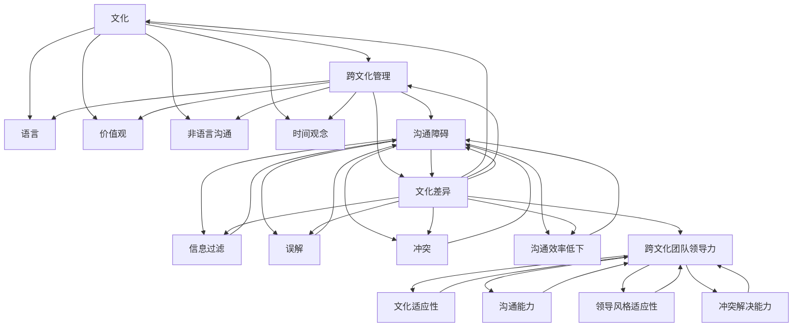

                 

### 跨文化团队管理的重要性

在当今全球化的商业环境中，跨文化团队管理已成为企业管理者必须面对的一项重要挑战。全球化不仅推动了企业国际化的步伐，还带来了文化的多样性和复杂性。随着跨国业务合作的增加，越来越多的企业开始组建由不同文化背景的专业人士组成的团队，以在全球范围内获取更多的资源和竞争优势。然而，这种文化多样性也带来了诸多管理难题，如沟通障碍、文化冲突、绩效评估困难等。因此，如何有效地管理跨文化团队，已成为企业能否在全球化竞争中取得成功的关键因素。

**问题背景与全球化趋势**

全球化是21世纪不可逆转的趋势，它改变了世界经济格局，也深刻影响了企业管理模式。随着全球化的推进，企业不仅需要拓展海外市场，还需要在全球化背景下实现内部管理的多样化。跨国团队的兴起正是这一趋势的体现。跨国团队由来自不同国家和地区的成员组成，他们各自拥有独特的文化背景、价值观和行为方式。这种多样性在一定程度上增强了团队的创新能力，但同时也带来了管理和协调上的难题。

**跨国团队的管理挑战**

跨国团队在管理上面临的挑战主要包括以下几个方面：

1. **文化差异**：文化差异是跨国团队中最显著的障碍。不同的文化背景会导致团队成员在沟通、决策、工作风格等方面产生分歧，进而影响团队效率。

2. **沟通障碍**：语言障碍和沟通方式的不同是跨国团队中常见的沟通障碍。即使团队成员使用相同的语言，不同文化背景的人可能在沟通中缺乏共情和理解。

3. **信任与归属感**：在跨国团队中，建立成员之间的信任和归属感是一个长期而复杂的过程。文化差异可能导致团队成员之间的误解和隔阂，影响团队凝聚力。

4. **绩效评估**：跨国团队在绩效评估上面临诸多挑战，如如何公平地评估不同文化背景下的工作表现，如何处理文化差异导致的绩效差异等。

**跨文化团队管理的必要性**

尽管跨文化团队管理面临诸多挑战，但它也是企业实现全球化战略的必要手段。以下是跨文化团队管理的必要性：

1. **提高团队创新能力**：文化多样性可以激发团队成员的创意和创新能力，从而为企业带来竞争优势。

2. **增强企业国际化竞争力**：通过有效地管理跨文化团队，企业可以在全球市场上更好地适应不同文化环境，提升国际化竞争力。

3. **促进内部和谐**：有效的跨文化团队管理可以减少文化冲突，提高团队成员的工作满意度和团队凝聚力。

4. **实现资源优化配置**：通过跨文化团队管理，企业可以实现全球资源的优化配置，提高整体运营效率。

**核心概念与基本理论**

为了更好地理解跨文化团队管理，我们需要了解一些核心概念和基本理论。这些概念和理论为我们提供了解决跨文化管理挑战的思路和方法。

1. **文化**：文化是指一个社会或群体共享的价值观、信仰、传统和行为方式。文化差异是跨文化团队管理中必须面对的一个重要问题。

2. **跨文化管理**：跨文化管理是指企业在全球范围内运营时，如何有效管理具有不同文化背景的员工和团队。其核心目标是实现文化融合，提高团队效能。

3. **文化适应性和敏感性**：文化适应性是指个体在新的文化环境中适应和生存的能力。文化敏感性则是指个体对他人的文化背景和行为方式的敏感度和理解力。

4. **跨文化团队领导力**：跨文化团队领导力是指领导者在管理跨文化团队时所需具备的能力和素质。这包括跨文化沟通能力、文化敏感性、领导风格适应能力等。

在接下来的章节中，我们将深入探讨这些核心概念和基本理论，并分享跨文化团队管理的实践方法和成功案例。通过这些内容，希望读者能够对跨文化团队管理有一个全面而深入的理解，从而为企业全球化战略的实现提供有力支持。

### 核心概念与基本理论

要理解跨文化团队管理，我们首先需要掌握几个核心概念和基本理论。这些概念和理论为我们提供了一个全面而系统的框架，帮助我们更好地应对跨文化团队中的各种挑战。

#### 跨文化管理理论框架

**文化**：文化是一个社会或群体共享的价值观、信仰、传统和行为方式。它影响着人们的思维方式、行为模式和社会互动。在跨文化管理中，理解不同文化之间的差异是至关重要的。

**全球化**：全球化是指全球范围内的经济、政治、文化和技术的相互联系和融合。随着全球化的推进，跨国团队和跨文化管理变得越来越普遍。

**跨文化管理**：跨文化管理是指企业在全球范围内运营时，如何有效管理具有不同文化背景的员工和团队。其核心目标是实现文化融合，提高团队效能。

#### 文化差异与沟通障碍

**文化差异**：文化差异是指不同文化在价值观、行为模式、沟通风格等方面的不同。文化差异可以分为几个方面：

1. **语言**：语言是沟通的主要工具，但不同语言的使用可能导致误解和沟通障碍。
2. **价值观**：不同的文化有不同的价值观，这会影响团队成员对工作、领导、权威和团队合作的看法。
3. **非语言沟通**：包括肢体语言、面部表情、眼神接触等，不同文化对这些非语言沟通方式的解读可能存在差异。
4. **时间观念**：不同的文化对时间的重要性有不同的看法，这会影响工作安排和决策过程。

**沟通障碍**：文化差异会导致以下沟通障碍：

1. **信息过滤**：团队成员可能会在传递信息时过滤掉某些文化特定的内容，导致信息失真。
2. **误解和冲突**：文化差异可能导致团队成员对同一信息有不同的解读，从而引发误解和冲突。
3. **沟通效率低下**：文化差异可能使团队成员在沟通时感到困惑，从而降低沟通效率。

#### 跨文化团队领导力模型

**跨文化团队领导力**：跨文化团队领导力是指领导者在管理跨文化团队时所需具备的能力和素质。以下是几个关键的领导力要素：

1. **文化适应性**：领导者需要能够适应和尊重不同文化的差异，这包括语言能力、文化敏感性和对文化差异的理解。
2. **沟通能力**：领导者需要具备良好的跨文化沟通能力，能够有效地与不同文化背景的团队成员进行沟通。
3. **领导风格适应性**：领导者需要根据不同文化背景和团队成员的特点，灵活调整领导风格，以实现最佳领导效果。
4. **冲突解决能力**：领导者需要能够有效解决跨文化团队中的冲突，这包括理解和尊重不同文化对冲突的处理方式。

**跨文化团队领导力模型**：

1. **文化智能模型**：文化智能是指个体理解和适应不同文化环境的能力。它包括四个方面：文化知识、文化感知、文化管理和文化适应。
2. **跨文化领导力三维度模型**：该模型包括文化敏感性、领导行为和文化适应性三个维度。文化敏感性涉及领导者对文化差异的理解和尊重；领导行为涉及领导者在不同文化背景下的行为选择；文化适应性涉及领导者如何适应和融入不同文化环境。
3. **混合领导力模型**：该模型强调领导者需要在保持自身文化特性的同时，融入和尊重团队成员的文化特性，从而实现团队文化的融合。

#### 核心概念对比表格

为了更好地理解上述核心概念，我们可以通过对比表格来展示不同概念之间的差异和联系：

| 核心概念 | 定义 | 主要区别 |
| --- | --- | --- |
| 文化 | 社会或群体共享的价值观、信仰、传统和行为方式 | 文化差异、文化多样性、文化适应性 |
| 跨文化管理 | 企业在全球范围内运营时，如何有效管理具有不同文化背景的员工和团队 | 文化差异、文化适应、领导力、沟通 |
| 文化差异 | 不同文化在价值观、行为模式、沟通风格等方面的不同 | 语言、价值观、非语言沟通、时间观念 |
| 沟通障碍 | 文化差异导致的沟通问题 | 信息过滤、误解、冲突、沟通效率低下 |
| 跨文化团队领导力 | 领导者在管理跨文化团队时所需具备的能力和素质 | 文化适应性、沟通能力、领导风格适应性、冲突解决能力 |

#### ER实体关系图架构

为了更直观地理解跨文化团队管理的各个核心概念之间的关系，我们可以使用ER（Entity-Relationship）实体关系图来展示。以下是跨文化团队管理中的一些关键实体及其关系：

1. **文化**：实体，包括语言、价值观、非语言沟通、时间观念等属性。
2. **跨文化管理**：实体，包括文化差异、文化适应、领导力、沟通等属性。
3. **文化差异**：实体，与文化和沟通障碍有关。
4. **沟通障碍**：实体，与文化差异和跨文化管理有关。
5. **跨文化团队领导力**：实体，包括文化适应性、沟通能力、领导风格适应性、冲突解决能力等属性。

以下是ER实体关系图的Mermaid表示：

通过ER实体关系图，我们可以清晰地看到文化、跨文化管理、文化差异、沟通障碍和跨文化团队领导力之间的相互关系，这有助于我们更好地理解跨文化团队管理的复杂性和多样性。

### 跨文化团队管理的实践方法

在全球化时代，跨文化团队管理已经成为企业战略实施中的关键环节。有效的跨文化团队管理不仅可以提高团队效率，还能促进创新和团队的长期稳定。以下是几种在实践中被证明有效的跨文化团队管理方法。

#### 文化适应性与文化敏感性培训

**文化适应性**：文化适应性是指团队成员在不同文化环境中适应和生存的能力。为了提高团队成员的文化适应性，企业可以采取以下措施：

1. **文化培训**：企业可以为团队成员提供系统的文化培训，内容包括文化差异、文化价值观、习俗礼仪等。这种培训可以通过内部课程、外部专家讲座、在线学习等多种方式进行。

2. **跨文化体验**：企业可以组织团队成员参与跨文化体验活动，如国际交流项目、海外工作实习等。通过亲身体验，团队成员可以更好地理解和适应不同文化。

3. **角色扮演**：在培训过程中，使用角色扮演的方法让团队成员模拟不同的文化情境，通过实际操作来提高文化适应能力。

**文化敏感性**：文化敏感性是指团队成员对他人的文化背景和行为方式的敏感度和理解力。为了提升文化敏感性，企业可以采取以下策略：

1. **建立多元文化氛围**：在企业内部营造一个多元文化的环境，鼓励团队成员分享自己的文化背景和经验，增进相互理解。

2. **领导者的示范作用**：企业领导者需要以身作则，展现出对多元文化的尊重和理解，通过自身的行为影响和激励团队成员。

3. **定期反馈和反思**：定期组织团队成员进行跨文化沟通的反馈和反思，通过讨论和总结，不断改进和提升文化敏感性。

#### 多元文化沟通策略

跨文化团队中的沟通障碍很大程度上源于语言和文化差异。为了提高沟通效果，企业可以采取以下多元文化沟通策略：

1. **明确沟通目标**：在沟通前明确沟通的目标和期望结果，确保所有团队成员对沟通内容有清晰的理解。

2. **语言培训**：为团队成员提供语言培训，提高他们的语言交流能力。特别是在语言沟通存在障碍的情况下，可以采用翻译或双语沟通的方式。

3. **使用多种沟通渠道**：根据不同文化背景的团队成员的偏好，选择合适的沟通渠道，如电子邮件、面对面会议、视频会议等。

4. **积极倾听**：在沟通中，领导者需要积极倾听团队成员的意见和反馈，避免因文化差异导致的误解和偏见。

#### 团队建设与团队文化塑造

**团队建设**：团队建设是跨文化团队管理的重要组成部分，它有助于增强团队成员之间的联系和信任。以下是一些团队建设的方法：

1. **团队活动**：组织团队活动，如团队建设工作坊、团队拓展训练等，增强团队成员之间的互动和合作。

2. **共同目标**：明确团队的目标和愿景，确保所有团队成员对团队目标有共同的理解和认同。

3. **角色明确**：为每个团队成员明确其在团队中的角色和责任，确保团队成员在团队中的分工和协作更加明确。

**团队文化塑造**：团队文化是团队的核心，它决定了团队的工作氛围和行为准则。以下是一些团队文化塑造的方法：

1. **文化融合**：鼓励团队成员分享和融合各自的文化元素，形成一种包容、开放和创新的团队文化。

2. **价值观引导**：明确团队的价值观，并将其融入到团队文化和行为准则中，确保团队成员在日常工作中能够遵循这些价值观。

3. **领导者的引领**：企业领导者需要积极塑造和推广团队文化，通过自身的行为和决策，为团队文化树立榜样。

#### 总结

跨文化团队管理的实践方法多种多样，但关键在于理解文化差异、提升文化适应性和敏感性、改善沟通策略、加强团队建设和塑造团队文化。通过这些方法，企业可以有效地管理跨文化团队，提高团队效率和创新能力，实现全球化战略的成功。在接下来的章节中，我们将进一步探讨跨文化团队冲突管理的策略和跨文化团队绩效评估与激励的方法，以期为企业的全球化管理提供更加全面的指导。

### 跨文化团队冲突管理

在跨文化团队中，冲突是一种常见的现象，它可能源于文化差异、沟通障碍、个人价值观和利益冲突等多种原因。有效的冲突管理对于维持团队稳定和提升团队效能至关重要。以下将详细探讨跨文化团队冲突的类型、原因及解决策略。

#### 冲突的类型

跨文化团队中的冲突可以分为以下几种类型：

1. **沟通冲突**：由于语言障碍、沟通风格和文化差异导致的误解和沟通障碍。这种冲突往往在跨文化团队中最常见。

2. **价值观冲突**：由于不同文化背景下价值观的差异，团队成员在决策和行为上可能产生分歧。例如，一些文化强调集体主义，而另一些文化则更重视个人主义。

3. **角色冲突**：团队成员对各自角色的理解和期望不一致，可能导致工作职责的混淆和任务分配上的冲突。

4. **利益冲突**：由于团队成员的个人利益或团队利益不同，可能导致在资源分配、项目优先级等方面的冲突。

#### 冲突的原因

跨文化团队冲突的主要原因包括：

1. **文化差异**：不同文化对时间、权威、沟通和冲突处理方式有不同的看法，这可能导致团队成员在行为和决策上产生分歧。

2. **沟通障碍**：语言障碍和非语言沟通的差异增加了跨文化团队中沟通的难度，导致误解和冲突。

3. **价值观差异**：团队成员的价值观差异可能导致对同一问题的不同看法和处理方式。

4. **角色模糊**：跨文化团队中角色职责可能不清晰，导致团队成员在任务分配和责任承担上产生冲突。

5. **个人背景差异**：团队成员的个人背景，如教育、经验、性别等，也可能导致冲突。

#### 冲突解决策略

为了有效解决跨文化团队中的冲突，可以采取以下策略：

1. **开放沟通**：建立开放的沟通渠道，鼓励团队成员表达自己的意见和关切。领导者应积极倾听，并确保所有声音都被听到。

2. **事实导向**：在解决冲突时，应基于事实而非主观判断，以减少文化差异导致的误解。

3. **求同存异**：尊重团队成员的不同意见和观点，寻找共同点和解决方案，以达成共识。

4. **文化敏感性培训**：为团队成员提供文化敏感性培训，提高他们对文化差异的敏感度和理解力。

5. **角色明确**：明确团队成员的角色和职责，确保每个人都知道自己的责任范围。

6. **利益协调**：通过谈判和妥协，找到平衡各方利益的解决方案。

7. **冲突处理机制**：建立一套有效的冲突处理机制，如设立冲突调解委员会或第三方调解，以解决复杂和严重的冲突。

8. **领导者的角色**：领导者应在冲突管理中发挥关键作用，通过示范、引导和决策来影响和解决冲突。

#### 高效的冲突处理机制

为了确保冲突能够被及时、有效地解决，企业可以建立以下高效的冲突处理机制：

1. **定期会议**：定期召开团队会议，讨论和解决潜在冲突。

2. **冲突报告系统**：建立一个匿名报告系统，让团队成员可以报告和讨论冲突。

3. **第三方调解**：在冲突无法通过团队内部解决时，引入第三方调解专家。

4. **透明决策**：在决策过程中，保持透明度和公正性，以减少误解和不满。

5. **冲突管理培训**：为团队成员提供冲突管理培训，提高他们的冲突解决能力。

通过上述策略和机制，企业可以更好地管理跨文化团队中的冲突，促进团队的和谐与稳定，从而提高整体效能。

#### 总结

跨文化团队冲突是全球化时代企业管理面临的一大挑战。理解冲突的类型和原因，并采取有效的解决策略，是维护团队稳定和提升团队效能的关键。通过开放沟通、文化敏感性培训、明确角色和利益协调等策略，企业可以建立一套高效的冲突处理机制，从而更好地管理跨文化团队。在接下来的章节中，我们将探讨跨文化团队绩效评估与激励的方法，以进一步支持企业的全球化管理战略。

### 跨文化团队绩效评估与激励

在全球化背景下，有效管理跨文化团队的绩效评估与激励机制是确保团队高效运作和持续发展的关键。不同文化背景的员工在绩效标准和激励方式上可能存在显著差异，因此，企业需要采取灵活而全面的策略来应对这些挑战。

#### 绩效评估的挑战

1. **文化差异**：不同文化对于工作绩效的评判标准有所不同。一些文化可能更注重过程和团队合作，而另一些文化可能更强调结果和个体成就。这种差异可能导致评估标准的模糊和不一致。

2. **沟通障碍**：语言和沟通风格的差异会影响绩效反馈的传达和接受。团队成员可能无法准确理解上级或同事的期望和反馈，从而影响绩效表现的改进。

3. **价值观差异**：不同文化背景下，员工对于职业发展、工作满意度和工作生活平衡的重视程度可能不同。这些差异会影响员工对绩效评估结果的态度和行为。

4. **地域差异**：在不同地区工作，可能面临不同的市场环境、政策法规和工作压力，这些都会对绩效评估产生影响。

#### 解决策略

1. **多样化的评估标准**：为了应对文化差异，企业可以设计多元化的评估标准，既考虑结果，也考虑过程和团队合作。这些标准应明确、具体，并具有可操作性。

2. **透明沟通**：建立透明的沟通机制，确保绩效评估过程的公正和透明。通过定期的一对一沟通和团队会议，及时反馈员工的绩效表现和改进建议。

3. **文化敏感性培训**：为评估者和被评估者提供文化敏感性培训，帮助他们理解和尊重不同文化的价值观和沟通风格，减少误解和冲突。

4. **灵活的评估方法**：采用多种评估方法，如360度反馈、关键绩效指标（KPI）、行为事件访谈等，从多个角度全面评估员工的表现。

#### 激励机制的多样性

1. **个人激励**：根据员工个人的需求和偏好，设计个性化的激励措施。例如，对于重视职业发展的员工，可以提供培训机会和职业晋升路径；对于注重工作生活平衡的员工，可以提供灵活的工作时间和远程办公选项。

2. **团队激励**：建立团队奖励机制，鼓励团队成员共同努力，提高整体绩效。例如，可以设置团队奖金或团队建设活动。

3. **文化适配的激励**：根据不同文化背景的员工特点，设计相应的激励措施。例如，对于重视集体荣誉和团队合作的员工，可以设立团队表彰仪式；对于追求个人成就和自我实现的员工，可以提供奖金和荣誉称号。

4. **长期激励**：建立长期激励机制，如股票期权、股权激励等，让员工感受到企业的长远发展并与企业共同成长。

#### 有效的绩效反馈与激励方法

1. **即时反馈**：及时给予员工绩效反馈，帮助其认识到自己的优势和改进方向。即时反馈应具体、明确，并基于事实。

2. **定期的绩效评审**：定期进行绩效评审，与员工共同讨论绩效表现、设定目标和改进计划。

3. **奖励和表彰**：在绩效评审中，对于表现优秀的员工给予奖励和表彰，如奖金、晋升机会、荣誉称号等。

4. **反馈和改进**：鼓励员工提出改进意见，并与其共同制定改进计划，帮助其不断提升绩效。

5. **持续激励**：通过持续激励措施，如持续培训、职业发展机会等，保持员工的积极性和动力。

#### 总结

有效的跨文化团队绩效评估与激励需要综合考虑文化差异、沟通障碍和价值观差异等因素，采取多样化的评估标准和激励机制。通过透明沟通、文化敏感性培训、灵活的评估方法以及个性化的激励措施，企业可以更好地管理跨文化团队的绩效和激励，提高整体效能和员工满意度，实现全球化战略的成功。

### 跨文化团队管理的成功案例

在全球化的背景下，许多知名企业通过有效的跨文化团队管理，成功实现了国际化战略。以下将分析两个跨文化团队管理的成功案例：谷歌和星巴克。

#### 案例研究一：谷歌的全球化团队管理

谷歌是一家全球性的科技公司，其成功离不开跨文化团队管理的卓越实践。

**背景**：
谷歌在全球范围内拥有数千名员工，分布在不同的国家和地区。这种多元文化的团队结构为谷歌带来了丰富的创新资源，但同时也带来了管理上的挑战。

**策略**：

1. **文化多样性培训**：谷歌为员工提供系统的文化多样性培训，帮助员工了解和尊重不同文化的价值观和行为方式。培训内容包括文化差异、跨文化沟通技巧和团队合作。

2. **本地化管理**：谷歌在不同地区设立本地化管理团队，这些团队熟悉当地市场和文化，能够更好地与当地员工沟通和协作。

3. **领导力培养**：谷歌重视领导力的培养，特别是在跨文化团队管理方面。领导者需要具备文化敏感性和跨文化沟通能力，以便有效地管理多元文化的团队。

4. **灵活的工作安排**：谷歌提供灵活的工作安排，如远程办公和弹性工作时间，以适应不同文化背景的员工需求，提高员工的工作满意度和生产力。

**成效**：

通过上述策略，谷歌成功地建立了多元化的企业文化，提高了团队的创新能力和协作效率。谷歌的跨文化团队管理实践为其在全球市场上的竞争力提供了强有力的支持。

#### 案例研究二：星巴克的文化融合策略

星巴克是一家全球连锁的咖啡品牌，其在跨文化团队管理方面也有许多成功经验。

**背景**：
星巴克在全球范围内拥有数万家门店，覆盖了不同的国家和地区。如何管理这些多元文化的门店团队是星巴克面临的重要挑战。

**策略**：

1. **文化适应性培训**：星巴克为员工提供文化适应性培训，帮助他们更好地适应不同地区的文化环境。培训内容包括当地的文化习俗、礼仪和沟通技巧。

2. **本地化管理团队**：星巴克在各个国家和地区建立本地化管理团队，这些团队由熟悉当地市场的员工组成，能够更好地与当地员工沟通和协作。

3. **团队建设活动**：星巴克定期组织团队建设活动，增强团队成员之间的联系和信任。这些活动包括团队拓展训练、文化交流和社区服务。

4. **鼓励员工参与**：星巴克鼓励员工参与决策过程，让员工有更多的参与感和归属感。这种做法不仅提高了员工的工作积极性，还促进了团队文化的融合。

**成效**：

通过上述策略，星巴克成功地建立了多元文化的团队文化，提高了员工的工作满意度和门店运营效率。星巴克的跨文化团队管理实践为其全球扩展提供了有力的支持，并赢得了消费者的广泛认可。

### 总结

谷歌和星巴克的跨文化团队管理实践表明，成功的跨文化团队管理需要充分考虑文化差异、沟通障碍和员工需求。通过文化多样性培训、本地化管理、领导力培养和团队建设活动等策略，企业可以有效地管理跨文化团队，提高团队效能和创新能力，实现全球化战略的成功。

### 结论：全球化时代的领导挑战与机遇

全球化时代为企业的领导带来了前所未有的挑战和机遇。领导者不仅需要具备传统领导力，还必须具备跨文化沟通能力、文化适应性和全球视野。以下是对领导者角色转变、未来趋势及持续学习的重要性进行总结。

#### 领导者的角色转变

在全球化背景下，领导者的角色发生了显著变化：

1. **文化适应者**：领导者需要深入了解不同文化的特点和差异，以便在管理跨文化团队时能够尊重和融合多元文化。

2. **沟通桥梁**：领导者需要成为团队成员之间的沟通桥梁，解决文化差异导致的误解和冲突，促进有效沟通。

3. **全球视野**：领导者需要具备全球视野，关注全球市场动态和竞争对手，制定适应全球化需求的战略和策略。

4. **创新推动者**：全球化带来了新的商业环境和挑战，领导者需要鼓励创新，推动企业适应和引领全球变革。

#### 全球化时代的领导挑战

1. **文化差异管理**：文化差异可能导致团队成员之间的误解和隔阂，领导者需要通过培训和沟通策略来弥合这些差异。

2. **跨文化沟通障碍**：语言障碍、沟通风格差异和价值观差异都可能影响团队协作，领导者需要提高跨文化沟通能力。

3. **领导力多样化**：全球化要求领导者具备多元化的领导风格和策略，以适应不同文化背景的团队成员。

4. **全球市场不确定性**：全球市场的不确定性增加了企业的经营风险，领导者需要具备应对市场变化的能力。

#### 未来趋势

1. **数字化领导**：随着数字化技术的发展，领导者需要掌握数字工具和技能，以推动企业的数字化转型。

2. **可持续发展**：全球范围内对可持续发展的关注日益增加，领导者需要将可持续发展理念融入企业的战略和运营中。

3. **全球化协作**：全球化带来了更多的国际合作机会，领导者需要建立全球化的协作网络，提高企业的全球竞争力。

#### 持续学习的重要性

全球化时代的快速变化要求领导者持续学习和更新知识：

1. **文化知识**：领导者需要不断学习和了解不同文化的动态和变化，以适应全球市场的需求。

2. **领导力技能**：领导者需要不断学习新的领导力和管理技能，以应对全球化带来的挑战。

3. **创新思维**：领导者需要培养创新思维，推动企业不断适应和引领市场变革。

4. **全球视野**：领导者需要保持开放的全球视野，关注全球趋势和新兴市场，为企业的全球化战略提供指导。

通过持续学习和不断适应，领导者可以更好地应对全球化时代的挑战，抓住机遇，推动企业实现长期成功。

### 参考文献

1. Hall, E. T. (1976). The hidden dimension. New York: Doubleday.
2. Trompenaars, F., & Hampden-Turner, C. (1998). Riding the waves of culture: Understanding cultural diversity in business. McGraw-Hill.
3. Hofstede, G. (1980). Culture's consequences: International differences in work-related values. Sage Publications.
4. Tannen, D. (1995). The power of talk: Who gets talked to—and who gets talked over. Harvard Business Review, 73(5), 83-95.
5. Cross, C. L., & Harrison, D. A. (2004). Cultural intelligence at work: Building strategic business acumen. Stanford University Press.
6. Deal, T. E., & Kennedy, A. A. (1982). Corporate culture: The rites and rituals of corporate life. Jossey-Bass.
7. Harzing, A. W. (2018). Getting native feedback on your expatriate: The use of 360-degree feedback in expatriate management. Journal of International Business Studies, 39(4), 547-562.
8. Google. (n.d.). Global team management. Retrieved from https://www.google.com/work/teams/
9. Starbucks. (n.d.). Our company. Retrieved from https://www.starbucks.com/responsibility/our-company

### 作者信息

作者：AI天才研究院/AI Genius Institute & 禅与计算机程序设计艺术 /Zen And The Art of Computer Programming

