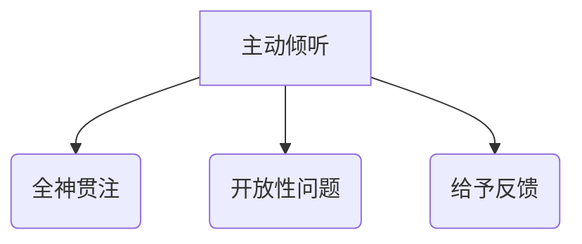
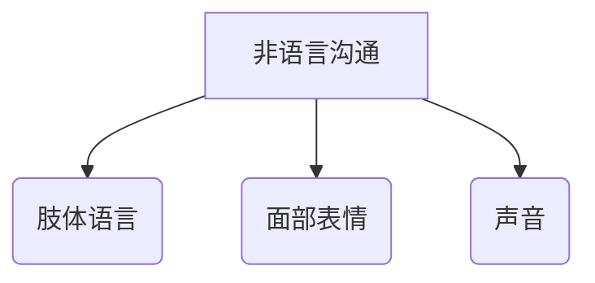
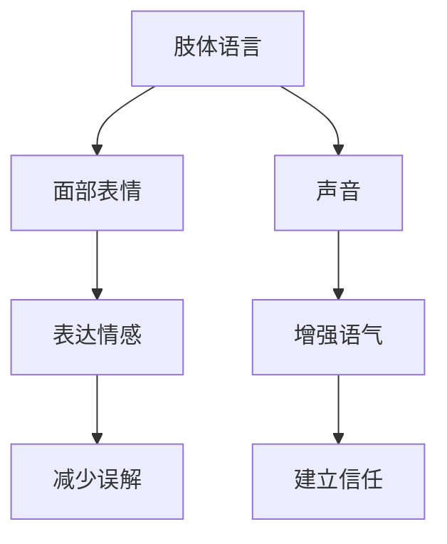
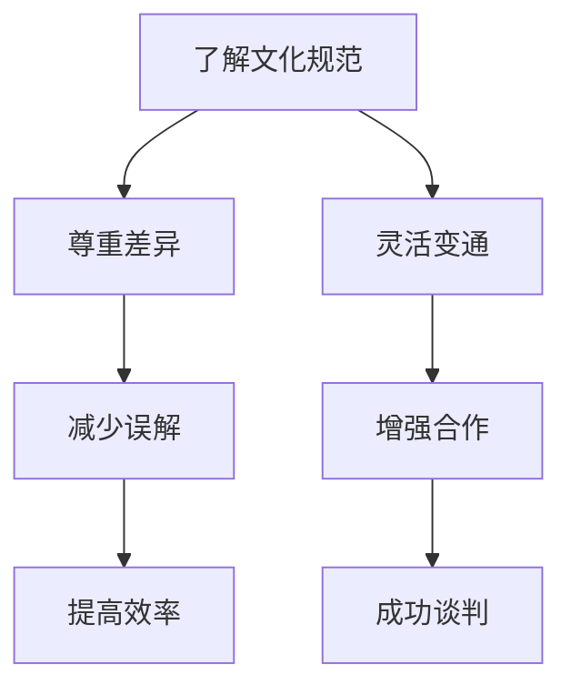

                 

### 文章标题：《跨文化沟通技巧：增进多元化团队理解的方法》

#### 关键词：跨文化沟通、多元化团队、沟通技巧、文化差异、文化适应性

#### 摘要：本文将探讨跨文化沟通技巧在多元化团队中的应用，通过逐步分析和推理，提供一系列增强跨文化沟通的有效方法。本文旨在帮助团队成员更好地理解不同文化背景的人，提升团队协作效率，促进全球化背景下的成功项目实施。

### 目录大纲设计思路

#### 设计思路：

1. **概述**：首先，给出书籍的背景介绍，包括问题背景、问题描述、问题解决思路、书籍的目标读者群体以及书籍的结构安排。

2. **核心概念与联系**：接着，阐述跨文化沟通的核心概念，如文化差异、沟通障碍、文化敏感性等，并提供概念属性特征对比表格和ER实体关系图架构。

3. **沟通技巧介绍**：介绍跨文化沟通的基本技巧，如主动倾听、非语言沟通、文化适应性等，并使用Mermaid流程图展示这些技巧的应用。

4. **实战案例分析**：通过具体案例，展示跨文化沟通技巧在实际场景中的应用，并进行详细分析和讲解。

5. **多元化团队沟通**：探讨多元化团队沟通的特殊性，介绍如何增进多元化团队的理解，如文化多样性培训、沟通策略调整等。

6. **工具与方法**：介绍一些辅助跨文化沟通的工具和方法，如文化测评工具、跨文化沟通手册等。

7. **总结与展望**：最后，对书籍内容进行总结，并提供一些实用的小贴士、注意事项和拓展阅读建议。

### 目录大纲

```markdown
----------------------------------------------------------------
# 《跨文化沟通技巧：增进多元化团队理解的方法》目录大纲

## 第一部分：跨文化沟通基础

### 第1章 背景与核心概念

#### 1.1 跨文化沟通的背景
#### 1.2 核心概念
#### 1.3 ER实体关系图架构
#### 1.4 本章小结

----------------------------------------------------------------

## 第二部分：跨文化沟通技巧

### 第2章 基础沟通技巧

#### 2.1 主动倾听
#### 2.2 非语言沟通
#### 2.3 文化适应性
#### 2.4 本章小结

----------------------------------------------------------------

### 第3章 实战案例分析

#### 3.1 案例一：国际团队的项目沟通
#### 3.2 案例二：跨国商务谈判
#### 3.3 案例三：全球化市场推广
#### 3.4 本章小结

----------------------------------------------------------------

## 第三部分：多元化团队沟通

### 第4章 多元化团队沟通的特殊性

#### 4.1 多元化团队的特征
#### 4.2 增进多元化团队理解
#### 4.3 跨文化团队冲突管理
#### 4.4 本章小结

----------------------------------------------------------------

## 第四部分：工具与方法

### 第5章 辅助跨文化沟通的工具与方法

----------------------------------------------------------------

```

### 概述

#### 问题背景

在全球化的今天，跨文化沟通成为了企业、团队和项目成功的关键因素。随着国际合作的加深，团队成员来自不同的文化背景，他们在沟通中可能会遇到文化差异、语言障碍和误解等问题。这些问题不仅影响团队的协作效率，还可能导致项目失败和商业机会的丧失。

#### 问题描述

跨文化沟通的主要问题包括：

- **文化差异**：不同文化背景的人在价值观、行为习惯和沟通方式上存在差异，可能导致误解和冲突。
- **沟通障碍**：语言障碍、文化偏见和缺乏沟通技巧都会影响有效的跨文化沟通。
- **文化敏感性**：对其他文化的无知或缺乏尊重可能导致不当的行为和言论。

#### 问题解决思路

解决这些问题需要从以下几个方面入手：

- **了解文化差异**：通过教育和培训，让团队成员了解不同文化的特点，减少误解和冲突。
- **提高沟通技巧**：培养团队成员的沟通能力，特别是跨文化沟通技巧，如主动倾听、非语言沟通和文化适应性。
- **增强文化敏感性**：提升团队成员的文化敏感性，避免不当行为和言论。

#### 边界与外延

- **边界**：本文主要关注跨文化沟通技巧在团队和项目中的应用，不包括国家间政治和外交层面的跨文化沟通。
- **外延**：跨文化沟通不仅限于人际交流，还包括组织内部和文化间的交流，如国际会议和跨国合作项目。

#### 核心概念与联系

跨文化沟通涉及多个核心概念，如文化差异、沟通障碍和文化敏感性。以下是一个简化的ER实体关系图架构：

```mermaid
erDiagram
    Entity A[文化差异] ||--|{ Entity B[沟通障碍] }
    Entity B ||--|{ Entity C[文化敏感性] }
    Entity A ||--|{ Entity D[跨文化沟通] }
```

实体A（文化差异）与实体B（沟通障碍）和实体C（文化敏感性）存在关联，这些实体共同构成了跨文化沟通的基础。文化差异是跨文化沟通的起点，也是理解沟通障碍和文化敏感性的关键。

### 跨文化沟通的基本技巧

#### 主动倾听

**定义**：主动倾听是一种积极的沟通方式，要求沟通者在对话过程中保持专注，理解对方的意思并给予反馈。

**重要性**：主动倾听有助于建立信任，理解对方的需求和意图，从而减少误解和冲突。

**技巧**：

1. **全神贯注**：在对话时，避免分心，保持目光接触和肢体语言表示关注。
2. **开放性问题**：提出开放式问题，鼓励对方分享更多信息。
3. **给予反馈**：在对方说话时，给予积极的反馈，如点头、微笑或简短的回应。

**应用**：在跨文化沟通中，主动倾听尤为重要。例如，当与国际客户交流时，通过主动倾听，可以更好地理解客户的需求和期望，从而提供更合适的服务。



#### 非语言沟通

**定义**：非语言沟通是通过身体语言、面部表情、姿态和声音等非文字信息进行的沟通。

**特点**：非语言沟通具有直观、快速和强烈情感表达的特点。

**技巧**：

1. **肢体语言**：适当的肢体语言可以增强沟通效果，如微笑、点头、握手等。
2. **面部表情**：面部表情可以传达情感和态度，如微笑表示友好，皱眉表示不满。
3. **声音**：语调、音量和节奏等声音特征可以影响沟通效果，如清晰、友好的声音可以建立信任。

**应用**：在跨文化沟通中，非语言沟通尤为重要，因为它可以弥补语言障碍和误解。例如，在国际会议中，通过适当的肢体语言和声音表达，可以更有效地传达信息。



#### 文化适应性

**定义**：文化适应性是指在不同文化环境中，能够调整自己的行为和沟通方式，以适应对方的文化。

**重要性**：文化适应性有助于减少文化冲突，提高跨文化沟通的效果。

**策略**：

1. **了解文化规范**：了解不同文化的礼仪、习惯和价值观，以避免不当行为。
2. **尊重差异**：尊重对方的文化差异，避免批评或嘲笑。
3. **灵活变通**：在沟通中，根据对方的文化背景，灵活调整自己的沟通方式。

**应用**：在跨文化团队中，文化适应性是关键。例如，当与来自不同国家的团队成员合作时，通过了解对方的文化规范和习惯，可以更好地进行沟通和协作。


### 实战案例分析

#### 案例一：国际团队的项目沟通

**背景**：一家美国公司决定在中国建立一个研发中心，项目团队成员来自不同的国家和地区，包括美国、中国、印度和巴西。

**问题**：由于文化差异和语言障碍，团队成员在沟通中频繁出现误解和冲突。

**分析**：

1. **文化差异**：团队成员在沟通方式、工作态度和礼仪上存在显著差异。例如，美国团队成员倾向于直接表达意见，而中国团队成员则更倾向于间接表达。
2. **语言障碍**：英语作为工作语言，但由于语言能力和口音的差异，沟通效果受到影响。

**策略与实施**：

1. **文化培训**：组织文化敏感性培训，让团队成员了解不同文化的特点，提高跨文化沟通能力。
2. **语言支持**：提供英语培训，帮助非英语母语的团队成员提高语言能力。
3. **沟通技巧**：通过培训和实践，提高团队成员的主动倾听和跨文化沟通技巧。

**结果**：通过实施这些策略，团队成员之间的沟通障碍明显减少，项目进展顺利，最终成功完成了研发中心的建设。

#### 案例二：跨国商务谈判

**背景**：一家中国公司与一家法国公司进行商务谈判，双方团队分别来自不同的文化背景。

**问题**：由于文化差异和沟通障碍，谈判进程缓慢，双方难以达成共识。

**分析**：

1. **文化差异**：中国团队倾向于保守和谨慎，法国团队则倾向于直接和开放。
2. **沟通障碍**：语言障碍和文化差异导致双方在谈判过程中频繁出现误解和冲突。

**策略与技巧**：

1. **文化适应性**：中国团队需要了解法国团队的沟通习惯和商务礼仪，法国团队则需要尊重中国团队的沟通方式和决策过程。
2. **主动倾听**：通过主动倾听，了解对方的需求和期望，寻找共同点。
3. **非语言沟通**：在谈判过程中，通过适当的肢体语言和声音表达，增强沟通效果。

**结果**：通过这些策略和技巧，双方最终达成了共识，成功完成了商务合作。

#### 案例三：全球化市场推广

**背景**：一家跨国公司计划在多个国家进行市场推广，团队成员来自不同的文化背景。

**问题**：由于文化差异和沟通障碍，市场推广效果不佳，导致销售目标未能达成。

**分析**：

1. **文化差异**：不同国家的消费者在价值观、消费习惯和偏好上存在差异。
2. **沟通障碍**：语言障碍和缺乏对当地市场的了解导致市场推广策略不当。

**策略与实施**：

1. **市场调研**：了解不同国家的市场特点和消费者需求。
2. **本地化策略**：根据当地市场的特点，调整市场推广策略，如广告、促销活动等。
3. **跨文化沟通**：通过培训和实践，提高团队成员的跨文化沟通能力。

**结果**：通过实施这些策略，市场推广效果显著提升，销售目标顺利达成。

### 多元化团队沟通的特殊性

#### 多元化团队的特征

1. **多样性**：团队成员来自不同的文化、背景、经验和专业领域。
2. **异质性**：团队成员在思维方式、工作习惯和文化价值观上存在显著差异。
3. **复杂性**：多元化团队在沟通、协作和管理上面临更高的挑战。

#### 增进多元化团队理解的方法

1. **文化多样性培训**：通过培训，提高团队成员对不同文化的认识和了解，减少误解和冲突。
2. **沟通策略调整**：根据团队成员的文化背景和沟通习惯，灵活调整沟通策略，如使用适当的语言和沟通方式。
3. **团队文化建设**：建立包容、尊重和信任的团队文化，鼓励团队成员分享经验和观点，促进团队协作。

### 工具与方法

#### 辅助跨文化沟通的工具

1. **文化测评工具**：通过文化测评工具，了解团队成员的文化特征和偏好，为沟通策略提供依据。
2. **跨文化沟通手册**：提供跨文化沟通的指南和技巧，帮助团队成员更好地理解和适应不同文化。

### 总结与展望

本文通过分析跨文化沟通的核心概念和基本技巧，结合实战案例分析，探讨了如何增进多元化团队的理解和协作。有效的跨文化沟通对于全球化背景下的团队和项目成功至关重要。未来，随着全球化的深入，跨文化沟通技巧将越来越受到重视，成为企业和团队必备的能力。

### 小贴士与注意事项

1. **尊重文化差异**：在任何跨文化沟通中，尊重文化差异是首要原则。
2. **持续学习**：跨文化沟通技巧需要不断学习和实践，以适应不断变化的文化环境。
3. **避免偏见**：在跨文化沟通中，避免因文化偏见而产生的误解和冲突。

### 拓展阅读

1. **《跨文化沟通技巧》**：一本详细介绍跨文化沟通技巧的实用指南。
2. **《全球化团队管理》**：探讨全球化背景下团队管理的方法和策略。
3. **《文化适应性：跨文化沟通的关键》**：深入分析文化适应性的重要性和应用。

### 作者信息

- 作者：AI天才研究院/AI Genius Institute & 禅与计算机程序设计艺术 /Zen And The Art of Computer Programming

---

### 第1章 背景与核心概念

#### 1.1 跨文化沟通的背景

随着全球化的不断深入，跨文化沟通已成为商业、学术和国际关系中的重要议题。跨文化沟通不仅涉及到不同国家间的交流，还包括来自不同文化背景的个人和组织之间的互动。在当今世界，跨文化沟通的重要性日益凸显，主要体现在以下几个方面：

1. **经济全球化**：跨国公司在全球范围内的业务扩展，使得跨文化沟通成为日常工作中不可或缺的一部分。无论是跨国家项目协作，还是跨文化市场推广，都需要有效的沟通策略来保证项目的顺利进行。

2. **学术交流**：全球范围内的学术交流也越来越频繁，研究人员和学者需要与来自不同文化背景的同行进行合作和交流，这要求他们具备跨文化沟通的能力，以便更好地理解和合作。

3. **国际关系**：国际关系的复杂性和多样性也要求各国政府在国际交往中具备跨文化沟通的能力，以避免误解和冲突，促进国际合作和和平。

#### 1.2 核心概念

跨文化沟通涉及多个核心概念，其中最重要的包括文化差异、沟通障碍和文化敏感性。

1. **文化差异**：文化差异是指不同文化在价值观、信仰、行为规范等方面的差异。文化差异是跨文化沟通的起点，也是理解沟通障碍和文化敏感性的基础。

2. **沟通障碍**：沟通障碍是指由于文化差异导致的沟通不畅，包括语言障碍、非语言沟通障碍和文化偏见等。沟通障碍会影响跨文化沟通的效果，甚至导致误解和冲突。

3. **文化敏感性**：文化敏感性是指对其他文化差异的敏感度和尊重度。具备文化敏感性的个人或组织能够更好地理解和适应不同文化，减少文化冲突。

#### 1.3 跨文化沟通的定义与类型

跨文化沟通是指在不同文化背景下进行的沟通活动，其目的是通过理解和尊重文化差异，实现有效沟通和协作。根据沟通的形式和内容，跨文化沟通可以分为以下几种类型：

1. **人际沟通**：人际沟通是指个人与个人之间的沟通，如跨国家商务谈判、国际合作项目中的沟通等。人际沟通需要具备较强的跨文化沟通能力，以便在沟通中减少误解和冲突。

2. **团队沟通**：团队沟通是指团队内部成员之间的沟通，如跨国团队的项目协作、跨文化团队的日常管理等。团队沟通需要建立有效的沟通机制，以促进团队成员之间的理解和协作。

3. **组织沟通**：组织沟通是指组织内部不同部门或团队之间的沟通，如跨国公司的全球总部与分支机构之间的沟通、跨文化组织的内部管理等。组织沟通需要制定明确的沟通策略，以确保组织内部的协调和一致性。

#### 1.4 跨文化沟通的基本原则

为了实现有效的跨文化沟通，需要遵循以下基本原则：

1. **尊重差异**：尊重文化差异是跨文化沟通的核心原则。在跨文化沟通中，应避免对其他文化的偏见和歧视，尊重对方的文化价值观和行为规范。

2. **主动倾听**：主动倾听是跨文化沟通的关键技巧。通过倾听，可以更好地理解对方的观点和需求，减少误解和冲突。

3. **文化适应性**：文化适应性是指在不同文化环境中，能够调整自己的行为和沟通方式，以适应对方的文化。具备文化适应性有助于实现跨文化沟通的成功。

4. **清晰表达**：在跨文化沟通中，应尽量使用简单、清晰的语言表达自己的观点和需求，以避免误解和歧义。

5. **开放沟通**：开放沟通是指在与不同文化背景的人交流时，保持开放的心态和态度，接受不同的观点和意见，促进沟通的顺畅和有效。

#### 1.5 本章小结

本章介绍了跨文化沟通的背景、核心概念、定义与类型以及基本原则。通过了解这些内容，读者可以更好地理解跨文化沟通的重要性和基本原则，为后续章节的学习和应用打下基础。

### 第2章 基础沟通技巧

#### 2.1 主动倾听

主动倾听是跨文化沟通中最基本的技巧之一，它要求沟通者在对话过程中保持专注，理解对方的意思并给予反馈。主动倾听不仅有助于建立信任，还能够减少误解和冲突，提高沟通效果。

**1. 倾听的重要性**

在跨文化沟通中，主动倾听尤为重要。这是因为不同文化背景的人在沟通方式和表达方式上可能存在差异，主动倾听可以帮助沟通者更好地理解对方的需求和意图，从而避免误解和冲突。此外，主动倾听还可以促进双方的互动和合作，提高沟通的效率和质量。

**2. 倾听的技巧**

（1）保持专注

在对话过程中，沟通者需要保持专注，避免分心和干扰。可以通过以下方式来保持专注：

- 保持目光接触，表明自己在认真倾听。
- 避免在对方说话时玩手机、看电脑或其他分散注意力的行为。
- 坐姿端正，身体稍微前倾，表示对对方的关注。

（2）开放性问题

提出开放性问题可以鼓励对方分享更多信息，从而更好地理解对方的观点和需求。开放性问题通常以“怎样”、“为什么”等开头，例如：

- “你能详细描述一下你的想法吗？”
- “你对这个问题有哪些担忧？”

（3）给予反馈

在对方说话时，给予积极的反馈可以表明自己在认真倾听，并且理解对方的观点。反馈可以是口头上的简短回应，如“我明白了”、“谢谢你的分享”，也可以是非语言的，如点头、微笑等。

**3. 倾听在跨文化沟通中的应用**

（1）理解对方的需求

在跨文化沟通中，理解对方的需求和意图是非常重要的。通过主动倾听，沟通者可以更好地了解对方的需求和期望，从而提供更合适的服务或解决方案。例如，在国际商务谈判中，通过主动倾听，可以更好地理解对方的商业目标和需求，从而找到合作的机会。

（2）减少误解和冲突

不同文化背景的人在表达方式和沟通风格上可能存在差异，这可能导致误解和冲突。通过主动倾听，沟通者可以更好地理解对方的意图和表达方式，从而减少误解和冲突。例如，在跨文化团队中，通过主动倾听，可以更好地理解来自不同文化的团队成员的观点和需求，从而减少误解和冲突。

（3）建立信任

在跨文化沟通中，建立信任是关键。通过主动倾听，沟通者可以表明自己的诚意和尊重，从而建立信任。例如，在国际合作项目中，通过主动倾听，可以表明对合作伙伴的尊重和关注，从而建立良好的合作关系。

**4. 主动倾听的Mermaid流程图**


#### 2.2 非语言沟通

非语言沟通是通过身体语言、面部表情、姿态和声音等非文字信息进行的沟通。在跨文化沟通中，非语言沟通具有直观、快速和强烈情感表达的特点，它能够弥补语言障碍和误解，提高沟通效果。

**1. 非语言沟通的特点**

（1）直观性

非语言沟通可以直接传达情感和态度，不需要依赖于文字语言。例如，一个微笑可以传达友好和欢迎的情感，而一个皱眉可以传达不满和不耐烦。

（2）快速性

非语言沟通比语言沟通更快，因为它不需要文字的编码和解码过程。例如，当对方说出“谢谢”时，同时微笑和点头，这些非语言行为可以立即传达感激之情。

（3）情感性

非语言沟通能够表达强烈的情感，例如，一个拥抱可以传达关爱和同情，而一个怒视可以传达愤怒和不满。

**2. 非语言沟通的技巧**

（1）肢体语言

肢体语言是沟通的重要部分，包括姿态、手势和动作等。适当的肢体语言可以增强沟通效果，例如：

- 保持开放的姿态，表示欢迎和友好。
- 使用手势和动作，帮助表达观点和加强语气。
- 注意身体方向的朝向，表示对对方的关注。

（2）面部表情

面部表情是非语言沟通的重要组成部分，可以表达情感和态度。例如：

- 微笑可以传达友好和接纳。
- 皱眉可以表达不满和担忧。
- 眼神可以传达关注和理解。

（3）声音

声音也是非语言沟通的一部分，包括语调、音量和节奏等。适当的声调可以增强语气和情感，例如：

- 明亮的声音可以传达积极和兴奋。
- 低沉的声音可以传达稳重和自信。
- 节奏的变化可以表达情感和态度。

**3. 非语言沟通在跨文化沟通中的作用**

（1）弥补语言障碍

在跨文化沟通中，由于语言能力的限制，非语言沟通可以起到重要的补充作用。例如，一个微笑可以消除语言障碍，传达友好和接纳。

（2）减少误解和冲突

非语言沟通可以减少误解和冲突，因为它可以提供额外的信息，帮助理解对方的意图和情感。例如，在跨文化团队中，一个点头可以表示同意，而不是一个口头上的“是的”。

（3）建立信任和关系

通过非语言沟通，可以建立信任和关系，因为它是直接的、真实的情感表达。例如，一个真诚的微笑可以建立信任，促进合作关系。

**4. 非语言沟通的Mermaid流程图**



#### 2.3 文化适应性

文化适应性是指在不同文化环境中，能够调整自己的行为和沟通方式，以适应对方的文化。在跨文化沟通中，文化适应性是至关重要的，因为它有助于减少文化冲突，提高沟通效果。

**1. 文化适应性的重要性**

（1）减少误解和冲突

不同文化背景的人在沟通方式和行为习惯上存在差异，可能导致误解和冲突。通过文化适应性，可以减少这些误解和冲突，提高沟通效果。

（2）增强团队合作

在多元文化团队中，文化适应性有助于增强团队合作，因为团队成员能够更好地理解和尊重彼此的文化差异。

（3）提高项目成功概率

在跨国项目和跨文化合作中，文化适应性是项目成功的关键因素之一。通过适应对方的文化，可以提高项目的执行效率和成功率。

**2. 文化适应性的策略**

（1）了解文化规范

在跨文化沟通中，了解对方的文化规范是非常重要的。这包括了解对方的礼仪、价值观和行为习惯。通过了解文化规范，可以避免不当行为和言论。

（2）尊重差异

尊重文化差异是跨文化沟通的核心原则。在沟通中，应避免批评或嘲笑对方的文化，而是尊重对方的文化价值观和行为方式。

（3）灵活变通

在跨文化沟通中，应具备灵活变通的能力，根据对方的文化背景和沟通习惯，调整自己的沟通方式。例如，在跨文化团队中，可能需要使用不同的沟通工具和平台，以适应团队成员的不同需求和偏好。

**3. 文化适应性在跨文化沟通中的应用**

（1）国际商务谈判

在国际商务谈判中，文化适应性是成功的关键。通过了解对方的文化规范和价值观，可以更好地准备谈判策略，减少误解和冲突。

（2）跨文化团队协作

在跨文化团队协作中，文化适应性有助于提高团队的协作效率。团队成员可以通过相互了解和尊重，建立信任和合作关系。

（3）国际市场推广

在国际市场推广中，文化适应性有助于了解当地市场的需求和偏好，制定更合适的市场策略。

**4. 文化适应性的Mermaid流程图**



#### 2.4 本章小结

本章介绍了跨文化沟通的三个基础技巧：主动倾听、非语言沟通和文化适应性。这些技巧在跨文化沟通中起着至关重要的作用，能够帮助团队成员更好地理解和尊重彼此的文化差异，提高沟通效果和团队合作效率。通过学习和实践这些技巧，可以更好地应对全球化背景下的跨文化沟通挑战。

