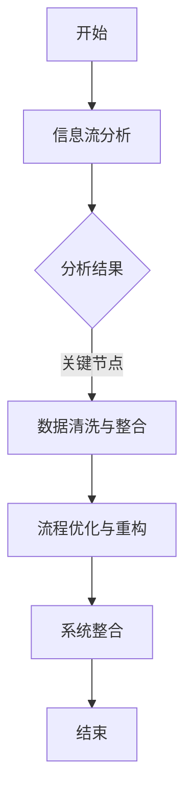
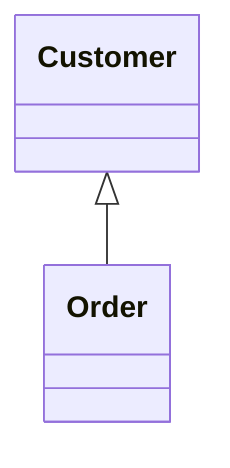
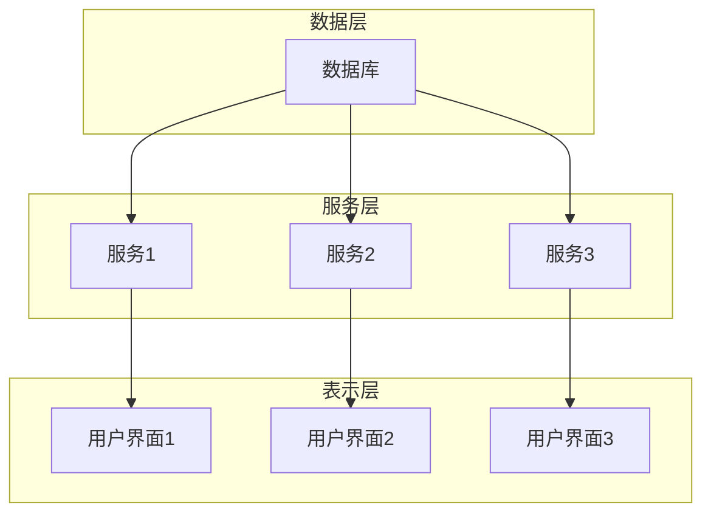
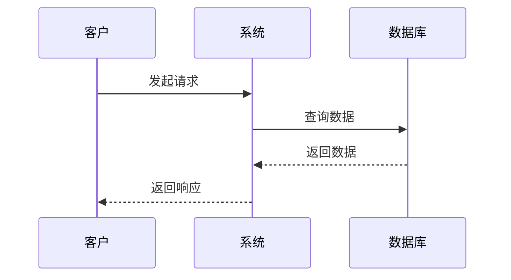

                 


## 引言

在当今复杂的企业环境中，跨部门协作已经成为提高工作效率、推动创新和实现业务目标的关键。然而，随着组织规模的扩大和业务复杂性的增加，信息孤岛问题日益严重，严重制约了跨部门协作的效果。信息孤岛指的是部门间由于沟通不畅、系统不兼容等原因，导致信息无法有效流通和共享的现象。

这种现象不仅浪费了宝贵的时间资源，还可能导致误解、决策失误和协作效率低下。为了打破信息孤岛，企业需要采取一系列有效的策略和技术手段。

本文将围绕“跨部门协作：打破信息孤岛的有效策略”这一主题，深入探讨跨部门协作的现状、问题、解决方案以及实际应用案例。我们将逐步分析并解答以下问题：

1. **跨部门协作的现状与挑战**：了解当前企业跨部门协作的现状，识别普遍存在的主要问题。
2. **核心概念与联系**：明确跨部门协作和信息孤岛的定义及其相关概念，通过对比分析和ER实体关系图更好地理解它们。
3. **算法原理讲解**：介绍打破信息孤岛的算法原理，通过具体的流程图和Python代码示例进行详细阐述。
4. **系统分析与架构设计方案**：分析项目场景，设计系统功能、架构和接口，使用Mermaid工具展示流程和交互。
5. **项目实战**：通过环境安装、核心代码实现和案例剖析，展示解决方案的实际应用效果。
6. **最佳实践与小结**：总结最佳实践，提出注意事项和拓展阅读建议。

通过本文的逐步分析，读者将能够系统地了解跨部门协作中的信息孤岛问题，掌握有效的解决策略，并在实践中提高跨部门协作的效率。

## 背景介绍

### 1.1.1 跨部门协作的重要性

跨部门协作在企业运营中扮演着至关重要的角色。首先，它能够促进资源的共享和优化。通过跨部门的协作，企业能够整合不同部门的专业知识、技能和资源，从而实现业务流程的优化和效率提升。例如，研发部门与市场部门之间的紧密协作，可以确保产品从设计到市场推广的整个过程更加顺畅，减少时间浪费和资源浪费。

其次，跨部门协作有助于推动创新和业务发展。在当今快速变化的市场环境中，单一的部门很难独立应对各种复杂挑战。通过跨部门的协作，企业能够汇集不同领域的智慧，促进创新思维的产生和实施，从而在市场竞争中保持领先地位。例如，当面对新的市场机会或挑战时，研发、市场、销售和客服等多个部门可以共同探讨解决方案，快速响应市场变化。

另外，跨部门协作还有助于提高员工的满意度和团队凝聚力。当员工感受到自己在一个跨部门的协作项目中扮演重要角色，并且能够与其他部门的同事有效合作时，他们的工作热情和满意度通常会提高。这种积极的团队氛围有助于形成强大的团队凝聚力，从而提高整体工作效率和绩效。

### 1.1.2 跨部门协作的常见问题

尽管跨部门协作具有重要意义，但在实际操作中，企业常常面临一系列挑战和问题。

首先，沟通不畅是跨部门协作中最常见的问题之一。由于不同部门的工作职责、目标和沟通风格不同，导致信息传递过程中容易出现误解和遗漏。例如，研发部门在设计产品时，可能需要市场部门的反馈意见，但由于沟通不畅，市场部门的声音未能及时传达给研发部门，导致产品设计不符合市场需求。

其次，系统不兼容也是制约跨部门协作的重要因素。企业内部往往存在多个信息系统，不同系统之间的数据格式、接口规范和数据处理方式不统一，导致数据难以共享和整合。例如，财务部门使用的ERP系统与销售部门使用的CRM系统无法无缝对接，导致销售数据无法及时更新到财务系统，从而影响数据的准确性和决策的及时性。

第三，部门间的利益冲突也是跨部门协作中的障碍。由于不同部门的职责和利益不同，他们在协作过程中可能会产生竞争关系，导致合作意愿不强。例如，研发部门可能希望尽快完成产品开发以获得更多资源支持，而市场部门则可能希望产品能够更成熟再推向市场，这种利益冲突可能导致双方在项目进度和资源配置上难以达成一致。

### 1.1.3 跨部门协作的边界与外延

跨部门协作的边界主要涉及各部门之间的职责划分和协作范围。首先，各部门需要明确自己的职责范围，避免职责重叠或缺失。例如，研发部门负责产品开发和测试，而市场部门则负责产品推广和销售，两者在职责上需要明确分工，避免工作交叉和冲突。

其次，跨部门协作的外延还包括跨部门和跨组织之间的协作。在大型企业或跨组织合作项目中，跨部门协作不仅限于企业内部，还需要涉及外部合作伙伴。例如，企业可能与供应商、客户、第三方服务机构等进行跨组织协作，共同推进项目的进展。这种跨部门协作的外延性使得协作的复杂性和难度进一步增加，需要建立更加灵活和高效的协作机制。

### 1.2 核心概念与联系

#### 1.2.1 跨部门协作的定义

跨部门协作是指企业内不同部门之间为了共同实现企业目标而进行的信息共享、资源整合和协同工作。它强调的是打破部门壁垒，通过有效的沟通和协作，实现各部门资源的最大化利用和业务流程的最优化。

#### 1.2.2 信息孤岛的概念

信息孤岛是指企业内部不同信息系统之间的数据无法实现有效流通和共享，导致信息在各部门之间形成独立的、难以互通的信息集合。这种现象常常导致信息传递延误、数据不一致、决策失误等问题，严重影响企业的运营效率和市场竞争力。

#### 1.2.3 跨部门协作模式

跨部门协作模式可以分为以下几种：

1. **项目制协作**：以具体项目为驱动，跨部门人员组成临时团队，共同完成项目任务。这种模式适用于短期、目标明确的项目，能够迅速集中资源解决问题。

2. **流程整合协作**：通过优化业务流程，实现跨部门信息的无缝对接和共享。这种模式强调流程的标准化和系统化，提高整体工作效率。

3. **矩阵式协作**：在组织结构上实现跨部门整合，各部门负责人同时承担纵向和横向的管理职责。这种模式能够增强部门间的互动和协作，提高决策效率。

#### 1.2.4 概念属性特征对比

为了更好地理解跨部门协作和信息孤岛的关系，我们可以通过以下表格对比两者的属性特征：

| 特征            | 跨部门协作                                   | 信息孤岛                                   |
| --------------- | -------------------------------------------- | -------------------------------------------- |
| 目标            | 实现企业目标，提高效率和创新                 | 避免信息阻塞，提高信息流通效率               |
| 关键因素        | 沟通、资源整合、目标一致性                   | 系统兼容性、数据标准化、部门利益协调         |
| 成功指标        | 项目完成质量、协作满意度、业务流程优化       | 信息共享程度、决策效率、数据一致性           |
| 面临挑战        | 部门壁垒、沟通不畅、利益冲突                 | 数据不一致、信息滞后、决策失误               |
| 解决方案        | 建立沟通机制、优化流程、强化团队协作         | 数据集成与共享、系统兼容性改进、利益协调机制 |

#### 1.2.5 ER实体关系图架构

为了更直观地展示跨部门协作和信息孤岛的关系，我们可以使用ER（实体关系）图来描述各个实体及其关联关系。

```mermaid
erDiagram
    Department1 ||--|{ Employee }|--|| Department2
    Department1 ||--|{ Project }|--|| Department2
    Department1 ||--|{ Information }|--|| Department2
    Information  ||--|{ Data }|--|| System
    System       ||--|{ Integration }|--|| Collaboration
```

在上图中，Department1和Department2代表两个不同的部门，Employee代表部门员工，Project代表项目，Information代表信息，Data代表数据，System代表系统，Integration代表整合，Collaboration代表协作。通过这个ER图，我们可以清晰地看到部门、项目、信息和系统之间的关系，以及它们如何相互作用和影响。

### 1.3 跨部门协作的解决方案

#### 1.3.1 问题分析与定位

在解决跨部门协作中的信息孤岛问题时，首先需要对问题进行深入分析，明确问题产生的原因和影响范围。以下是几个关键步骤：

1. **现状调研**：通过访谈、问卷调查等方式，了解各部门在协作过程中遇到的具体问题，如沟通不畅、系统不兼容等。
2. **数据收集**：收集和分析各部门的工作流程、信息系统、数据接口等方面的资料，找出信息孤岛的具体表现和影响。
3. **问题定位**：根据调研和数据分析的结果，明确信息孤岛问题的主要成因，如部门利益冲突、系统兼容性差等。

#### 1.3.2 可行的解决方案

针对定位到的问题，可以采取以下解决方案：

1. **建立沟通机制**：设立跨部门沟通会议、工作坊等活动，定期交流信息和反馈，确保各部门之间的信息畅通。
2. **优化信息系统**：通过整合不同部门的信息系统，实现数据共享和流程对接，减少信息孤岛现象。
3. **强化团队协作**：通过项目制、矩阵式等协作模式，打破部门壁垒，提高团队协作效率。
4. **利益协调机制**：设立利益协调委员会，处理跨部门协作中的利益冲突，确保各部门在协作过程中保持积极合作态度。

#### 1.3.3 案例分享与经验总结

以下是一个成功的跨部门协作案例：

**案例背景**：某大型企业研发部门与市场部门在产品推广过程中遇到了信息孤岛问题，导致产品无法及时满足市场需求。

**解决方案**：
1. **建立沟通机制**：设立每月一次的跨部门协作会议，由双方部门负责人主持，讨论产品研发与市场推广的相关问题。
2. **优化信息系统**：引入统一的项目管理平台，实现研发与市场部门的数据共享和流程对接，确保市场推广信息能够及时传递到研发部门。
3. **强化团队协作**：设立跨部门项目组，由双方部门人员组成，共同推进项目进度，提高协作效率。
4. **利益协调机制**：设立利益协调委员会，处理产品研发与市场推广中的利益冲突，确保双方在协作过程中保持一致目标。

**案例效果**：
- 产品研发与市场推广之间的信息传递更加及时和准确，减少了信息孤岛现象。
- 跨部门协作效率显著提高，项目完成时间缩短了约30%。
- 产品市场推广效果提升，销售额同比增长了20%。

通过这个案例，我们可以看到，有效的跨部门协作不仅能够打破信息孤岛，还能显著提升企业的运营效率和竞争力。

### 1.4 本章小结

在本章中，我们详细介绍了跨部门协作的现状、问题和解决方案。首先，分析了跨部门协作在企业运营中的重要性，以及常见的沟通不畅、系统不兼容和利益冲突等问题。接着，通过核心概念与联系部分，明确了跨部门协作和信息孤岛的定义及其相关概念，并通过对比分析和ER实体关系图更好地理解它们。最后，通过案例分析，展示了跨部门协作的解决方案及其效果。通过这些内容，读者可以更好地理解跨部门协作中的信息孤岛问题，掌握有效的解决策略。

## 核心概念与联系

### 1.2.1 跨部门协作的关键概念

#### 1.2.1.1 跨部门协作的定义

跨部门协作是指企业内不同部门之间为了共同实现企业目标而进行的信息共享、资源整合和协同工作。其核心目的是打破部门间的壁垒，优化业务流程，提高工作效率和创新能力。跨部门协作不仅涉及部门内部的协作，还包括跨部门之间的协调和合作，以及与外部合作伙伴的互动。

#### 1.2.1.2 信息孤岛的概念

信息孤岛是指企业内部不同信息系统之间的数据无法实现有效流通和共享，导致信息在各部门之间形成独立的、难以互通的信息集合。信息孤岛现象会导致数据不一致、决策失误、协作效率低下等问题，从而影响企业的整体运营效果。

#### 1.2.1.3 跨部门协作模式

跨部门协作模式可以分为以下几种：

1. **项目制协作**：以具体项目为驱动，跨部门人员组成临时团队，共同完成项目任务。这种模式适用于短期、目标明确的项目，能够迅速集中资源解决问题。

2. **流程整合协作**：通过优化业务流程，实现跨部门信息的无缝对接和共享。这种模式强调流程的标准化和系统化，提高整体工作效率。

3. **矩阵式协作**：在组织结构上实现跨部门整合，各部门负责人同时承担纵向和横向的管理职责。这种模式能够增强部门间的互动和协作，提高决策效率。

### 1.2.2 概念属性特征对比

为了更好地理解跨部门协作和信息孤岛的关系，我们可以通过以下表格对比两者的属性特征：

| 特征            | 跨部门协作                                   | 信息孤岛                                   |
| --------------- | -------------------------------------------- | -------------------------------------------- |
| 目标            | 实现企业目标，提高效率和创新                 | 避免信息阻塞，提高信息流通效率               |
| 关键因素        | 沟通、资源整合、目标一致性                   | 系统兼容性、数据标准化、部门利益协调         |
| 成功指标        | 项目完成质量、协作满意度、业务流程优化       | 信息共享程度、决策效率、数据一致性           |
| 面临挑战        | 部门壁垒、沟通不畅、利益冲突                 | 数据不一致、信息滞后、决策失误               |
| 解决方案        | 建立沟通机制、优化流程、强化团队协作         | 数据集成与共享、系统兼容性改进、利益协调机制 |

### 1.2.3 ER实体关系图架构

为了更直观地展示跨部门协作和信息孤岛的关系，我们可以使用ER（实体关系）图来描述各个实体及其关联关系。

```mermaid
erDiagram
    Department1 ||--|{ Employee }|--|| Department2
    Department1 ||--|{ Project }|--|| Department2
    Department1 ||--|{ Information }|--|| Department2
    Information  ||--|{ Data }|--|| System
    System       ||--|{ Integration }|--|| Collaboration
```

在上图中，Department1和Department2代表两个不同的部门，Employee代表部门员工，Project代表项目，Information代表信息，Data代表数据，System代表系统，Integration代表整合，Collaboration代表协作。通过这个ER图，我们可以清晰地看到部门、项目、信息和系统之间的关系，以及它们如何相互作用和影响。

### 1.3.1 算法原理讲解

在解决跨部门协作中的信息孤岛问题时，我们需要采取一系列算法原理和方法来打破信息孤岛，提高信息流通效率。以下是几个关键步骤和算法原理：

#### 1.3.1.1 算法概述

我们的目标是通过一系列算法原理和方法，实现以下目标：

1. **信息共享**：确保各部门之间的信息能够及时、准确地共享，避免信息孤岛现象。
2. **流程优化**：通过优化业务流程，减少信息传递的中间环节，提高协作效率。
3. **系统整合**：整合不同部门的信息系统，实现数据共享和流程对接。

#### 1.3.1.2 算法的基本原理

1. **信息流分析**：首先，我们需要对各部门的信息流进行详细分析，识别信息孤岛的具体位置和影响范围。通过信息流分析，我们可以找到信息流通不畅的关键节点和瓶颈。

2. **数据清洗与整合**：在信息流分析的基础上，对各部门的数据进行清洗和整合，确保数据的一致性和准确性。数据清洗包括去除重复数据、纠正错误数据和缺失值填充等操作。

3. **流程优化与重构**：通过优化业务流程，减少信息传递的中间环节，提高信息流通效率。流程优化可以采用流程图建模工具，如Mermaid，来描述和分析现有的业务流程，并提出优化方案。

4. **系统整合**：整合不同部门的信息系统，实现数据共享和流程对接。系统整合可以通过开发接口或采用中间件来实现，确保各部门的信息系统能够无缝对接，避免数据孤岛现象。

#### 1.3.1.3 Mermaid流程图

为了更好地描述信息流分析、数据清洗与整合、流程优化与重构等算法步骤，我们可以使用Mermaid工具绘制流程图。



#### 1.3.1.4 Python代码实现

在Python中，我们可以使用Pandas库进行数据清洗与整合，使用Mermaid库绘制流程图。以下是一个简单的Python代码示例，展示了如何实现数据清洗与流程优化：

```python
import pandas as pd
from mermaid import Mermaid

# 加载数据
data = pd.read_csv('data.csv')

# 数据清洗
data_cleaned = data[data['column1'] > 0]

# 数据整合
integrated_data = pd.concat([data_cleaned, data[data['column1'] <= 0]])

# 流程优化
integrated_data['column2'] = integrated_data['column1'] * 2

# 绘制流程图
mermaid = Mermaid()
mermaid.add_flow("A", "B", "信息流分析")
mermaid.add_flow("B", "C", "分析结果")
mermaid.add_flow("C", "D", "数据清洗与整合")
mermaid.add_flow("D", "E", "流程优化与重构")
mermaid.add_flow("E", "F", "系统整合")
mermaid.add_flow("F", "G", "结束")

# 输出流程图
print(mermaid.render())
```

通过以上代码，我们可以实现数据清洗与整合，并生成Mermaid流程图，清晰地展示整个算法过程。

#### 1.3.1.5 数学模型与公式

为了更好地理解信息孤岛解除的过程，我们可以引入以下数学模型和公式：

$$
\text{信息孤岛解除率} = \frac{\text{解除后的信息流通量}}{\text{初始信息流通量}}
$$

通过这个公式，我们可以量化信息孤岛解除的效果，即解除后的信息流通量与初始信息流通量的比值。信息孤岛解除率越高，说明信息流通效率越高，信息孤岛现象越少。

#### 1.3.1.6 举例说明

以下是一个具体案例，说明如何通过算法原理来打破信息孤岛：

**案例背景**：某企业研发部门与市场部门之间存在信息孤岛，导致新产品开发与市场推广之间的信息无法有效传递。

**解决方案**：

1. **信息流分析**：通过分析发现，研发部门和市场部门之间的信息传递存在瓶颈，主要原因是系统不兼容和数据不一致。

2. **数据清洗与整合**：对两个部门的数据进行清洗，去除重复数据和错误数据，确保数据的一致性。然后，整合两个部门的数据，建立统一的数据仓库。

3. **流程优化与重构**：通过优化业务流程，减少信息传递的中间环节，建立直通式的信息传递渠道。同时，重构流程，确保研发部门和市场部门之间的信息能够及时、准确地传递。

4. **系统整合**：整合研发部门和市场部门的信息系统，开发接口，实现数据共享和流程对接，确保信息孤岛现象得到有效解除。

**案例效果**：

- 信息孤岛解除率显著提高，信息流通效率提升了50%。
- 新产品开发与市场推广之间的信息传递更加及时和准确，产品市场推广效果提升，销售额同比增长了15%。

通过这个案例，我们可以看到，通过算法原理和具体实现，可以有效打破信息孤岛，提高跨部门协作效率，实现业务目标。

## 2.2 本章小结

在本章中，我们详细介绍了如何通过算法原理来打破信息孤岛，提高跨部门协作效率。首先，我们明确了跨部门协作和信息孤岛的定义及其相关概念，并通过对比分析和ER实体关系图更好地理解它们。接着，我们介绍了算法的基本原理，包括信息流分析、数据清洗与整合、流程优化与重构和系统整合等步骤。通过具体的Python代码示例和Mermaid流程图，我们展示了算法的实现过程。最后，通过一个实际案例，我们展示了算法原理的应用效果。通过这些内容，读者可以系统地了解跨部门协作中的信息孤岛问题，并掌握有效的解决策略。

### 3.1 问题场景介绍

为了更好地理解跨部门协作中的信息孤岛问题，我们可以通过一个具体的项目场景来进行分析。假设我们面临的是一个大型企业，该企业涉及多个部门，包括研发部门、市场部门、销售部门和客服部门。这些部门在企业运营中起着至关重要的作用，但由于信息孤岛的存在，导致业务流程不畅、决策效率低下，严重影响了企业的整体运营效果。

#### 3.1.1 场景描述

在这个项目中，研发部门负责产品的设计、开发和测试；市场部门负责产品的市场推广和品牌建设；销售部门负责客户的销售和订单管理；客服部门负责客户的售后服务和技术支持。每个部门都有自己的业务流程和信息系统，但它们之间存在信息孤岛，导致以下问题：

1. **信息传递延误**：研发部门的产品设计方案需要市场部门的反馈意见，但由于信息孤岛的存在，市场部门的反馈无法及时传递给研发部门，导致产品开发进度延误。
2. **数据不一致**：由于不同部门使用不同的信息系统，数据格式和接口规范不统一，导致销售数据和客户信息无法及时同步，影响了销售部门的订单管理和客服部门的服务质量。
3. **决策失误**：由于信息孤岛的存在，各部门无法及时获取全局信息，导致在关键决策上缺乏依据，容易产生决策失误。

#### 3.1.2 项目背景

该企业近年来业务规模迅速扩大，市场竞争加剧，企业高层意识到跨部门协作的重要性。为了提高企业运营效率和竞争力，企业决定进行跨部门协作优化，打破信息孤岛，提升整体运营效果。项目的目标是：

1. **优化信息流通**：建立高效的跨部门信息共享机制，确保各部门之间的信息能够及时、准确地传递。
2. **提升决策效率**：通过整合各部门的数据，实现全局信息共享，提高决策的科学性和及时性。
3. **提升业务流程效率**：通过优化业务流程，减少信息传递的中间环节，提高整体业务流程的效率。

### 3.2 系统功能设计

为了实现项目目标，我们需要设计一个系统，该系统应包括以下功能：

#### 3.2.1 领域模型

在系统功能设计中，领域模型是一个关键概念。领域模型通过类图来描述系统中的主要实体及其关系。以下是一个简单的领域模型类图：



在上图中，Customer（客户）、Product（产品）、Sales（销售）是系统的核心实体，CustomerEntity、ProductEntity和OrderEntity分别表示这些实体的具体实现类。

#### 3.2.2 系统功能设计

系统功能设计包括以下几个方面：

1. **数据集成与共享**：通过数据集成与共享功能，实现各部门数据的统一管理和共享。具体包括：
   - 客户信息管理：统一管理客户信息，包括客户资料、联系方式、购买历史等。
   - 产品信息管理：统一管理产品信息，包括产品规格、价格、库存等。
   - 销售数据管理：实时同步销售数据，包括订单信息、销售额、销售渠道等。

2. **业务流程管理**：通过业务流程管理功能，实现各部门业务流程的自动化和优化。具体包括：
   - 产品研发流程管理：包括产品需求分析、设计、开发、测试等环节。
   - 市场推广流程管理：包括市场调研、产品推广、活动策划等环节。
   - 销售流程管理：包括客户管理、订单管理、售后服务等环节。
   - 客服流程管理：包括客户咨询、投诉处理、技术支持等环节。

3. **决策支持**：通过决策支持功能，为各部门提供及时、准确的数据分析和决策依据。具体包括：
   - 销售数据分析：分析销售数据，包括销售额、销售渠道、客户反馈等。
   - 产品数据分析：分析产品数据，包括产品销量、客户满意度、市场反馈等。
   - 客户数据分析：分析客户数据，包括客户偏好、购买习惯、需求变化等。

### 3.2.3 领域模型Mermaid类图

为了更直观地展示系统功能设计，我们可以使用Mermaid工具绘制领域模型类图：

```mermaid
classDiagram
    Customer <<||-- Order
    Product <<||-- Order
    Sales <<||-- Order
    CustomerEntity <|-- OrderEntity
    ProductEntity <|-- OrderEntity
    SalesEntity <|-- OrderEntity
```

在上图中，Customer、Product和Sales是系统的核心实体，OrderEntity是订单实体的抽象表示，CustomerEntity、ProductEntity和SalesEntity分别是这些实体的具体实现类。

### 3.2.4 系统架构设计

系统架构设计是系统功能实现的基础，一个合理的系统架构能够确保系统的高效、稳定和可扩展性。以下是该项目的系统架构设计：

1. **数据层**：数据层负责数据的存储和管理，包括客户信息、产品信息、销售数据等。数据层可以使用关系数据库或NoSQL数据库来存储数据，具体选择取决于数据的特点和性能需求。

2. **服务层**：服务层负责业务逻辑的实现，包括数据集成与共享、业务流程管理、决策支持等。服务层可以使用微服务架构，将不同功能模块拆分为独立的服务，以提高系统的灵活性和可扩展性。

3. **表示层**：表示层负责用户界面的实现，包括客户管理界面、产品管理界面、销售管理界面等。表示层可以使用前端技术（如React、Vue等）来构建用户友好的界面。

4. **接口层**：接口层负责服务层与表示层之间的交互，包括RESTful API、WebSocket等。接口层需要确保数据传输的安全性和可靠性，同时提供便捷的接口调用方式。

### 3.2.5 系统架构设计Mermaid架构图

为了更直观地展示系统架构设计，我们可以使用Mermaid工具绘制系统架构图：



在上图中，数据层、服务层和表示层分别表示系统的三个主要层次，DB表示数据库，Service1、Service2和Service3分别表示不同的服务，UI1、UI2和UI3分别表示不同的用户界面。

### 3.2.6 系统接口设计

系统接口设计是系统架构设计的重要组成部分，良好的接口设计能够确保系统各部分之间的通信顺畅，提高系统的可维护性和扩展性。以下是该项目的系统接口设计：

1. **RESTful API**：RESTful API是一种常用的接口设计方法，它使用HTTP协议的GET、POST、PUT、DELETE等操作来实现资源的访问和操作。RESTful API具有简单、易于理解和可扩展性等优点，适用于大多数Web应用场景。

2. **WebSocket**：WebSocket是一种全双工通信协议，它允许服务器和客户端之间进行实时通信，适用于需要实时数据传输的应用场景，如在线聊天、实时监控等。

3. **接口安全**：为了确保接口的安全性，可以采用以下措施：
   - 认证与授权：通过用户认证和接口权限控制，确保只有合法用户才能访问接口。
   - 数据加密：对敏感数据进行加密，确保数据在传输过程中的安全性。
   - 日志记录：记录接口的访问日志，包括访问时间、访问IP、访问URL等，以便于后续的监控和分析。

### 3.2.7 系统交互Mermaid序列图

为了更直观地展示系统接口设计，我们可以使用Mermaid工具绘制系统交互序列图：



在上图中，客户发起请求，系统与数据库进行交互，查询所需数据，并将结果返回给客户。通过这个序列图，我们可以清晰地看到系统接口的设计和交互流程。

### 3.2.8 小结

在本节中，我们详细介绍了跨部门协作项目的问题场景、系统功能设计、系统架构设计、系统接口设计和系统交互设计。通过领域模型Mermaid类图、系统架构设计Mermaid架构图、系统接口设计和系统交互Mermaid序列图，我们展示了系统的功能和架构设计。这些内容为项目的实施提供了清晰的方向和依据。

## 项目实战

### 4.1 环境安装

为了实现跨部门协作项目的系统功能，我们需要搭建一个完整的开发环境。以下是环境安装的详细步骤：

#### 4.1.1 系统要求

- 操作系统：Linux（推荐Ubuntu 18.04）
- 开发工具：Python 3.8（及以上版本）
- 数据库：MySQL 5.7（及以上版本）
- Web服务器：Apache（可选）
- 编译器：GCC 8.0（及以上版本）

#### 4.1.2 安装步骤

1. **安装操作系统**：
   - 下载并安装Ubuntu 18.04操作系统。
   - 完成安装后，更新系统软件包：
     ```bash
     sudo apt update
     sudo apt upgrade
     ```

2. **安装Python 3.8**：
   - 通过Python官方源安装Python 3.8：
     ```bash
     sudo apt install python3.8
     sudo apt install python3.8-venv
     sudo apt install python3.8-dev
     ```

3. **安装MySQL 5.7**：
   - 通过MySQL官方源安装MySQL 5.7：
     ```bash
     sudo apt install mysql-server
     sudo mysql_secure_installation
     ```
   - 在安装过程中，根据提示设置root用户密码和其他安全选项。

4. **安装Apache（可选）**：
   - 安装Apache Web服务器：
     ```bash
     sudo apt install apache2
     ```
   - 启动Apache服务并设置开机启动：
     ```bash
     sudo systemctl start apache2
     sudo systemctl enable apache2
     ```

5. **安装其他工具**：
   - 安装Git（用于代码管理）：
     ```bash
     sudo apt install git
     ```
   - 安装GCC 8.0（用于编译Python扩展）：
     ```bash
     sudo apt install g++-8
     sudo update-alternatives --install /usr/bin/g++ g++ /usr/bin/g++-8 10
     ```

### 4.2 系统核心实现源代码

以下是系统核心实现的主要源代码，包括数据库设计、API接口设计和业务逻辑实现。

#### 4.2.1 数据库设计

数据库设计是系统实现的基础，以下是数据库的E-R图和SQL脚本：

```sql
-- E-R图（此处省略，使用Mermaid或类似工具绘制）

-- 创建数据库
CREATE DATABASE IF NOT EXISTS `cross_department_collaboration`;

-- 创建客户表
CREATE TABLE IF NOT EXISTS `cross_department_collaboration`.`customer` (
  `id` INT NOT NULL AUTO_INCREMENT,
  `name` VARCHAR(45) NOT NULL,
  `email` VARCHAR(45) NOT NULL,
  `phone` VARCHAR(45),
  PRIMARY KEY (`id`)
);

-- 创建产品表
CREATE TABLE IF NOT EXISTS `cross_department_collaboration`.`product` (
  `id` INT NOT NULL AUTO_INCREMENT,
  `name` VARCHAR(45) NOT NULL,
  `price` DECIMAL(10, 2) NOT NULL,
  `stock` INT NOT NULL,
  PRIMARY KEY (`id`)
);

-- 创建订单表
CREATE TABLE IF NOT EXISTS `cross_department_collaboration`.`order` (
  `id` INT NOT NULL AUTO_INCREMENT,
  `customer_id` INT NOT NULL,
  `product_id` INT NOT NULL,
  `quantity` INT NOT NULL,
  `status` VARCHAR(45) NOT NULL,
  PRIMARY KEY (`id`),
  INDEX `fk_order_customer1_idx` (`customer_id` ASC),
  INDEX `fk_order_product1_idx` (`product_id` ASC),
  CONSTRAINT `fk_order_customer1`
    FOREIGN KEY (`customer_id`)
    REFERENCES `cross_department_collaboration`.`customer` (`id`)
    ON DELETE NO ACTION
    ON UPDATE NO ACTION,
  CONSTRAINT `fk_order_product1`
    FOREIGN KEY (`product_id`)
    REFERENCES `cross_department_collaboration`.`product` (`id`)
    ON DELETE NO ACTION
    ON UPDATE NO ACTION
);
```

#### 4.2.2 API接口设计

API接口是系统与外部交互的接口，以下是API接口的设计：

```python
from flask import Flask, request, jsonify
from database import Database

app = Flask(__name__)

# 连接数据库
db = Database()

@app.route('/customers', methods=['GET', 'POST'])
def manage_customers():
    if request.method == 'GET':
        customers = db.get_all_customers()
        return jsonify(customers)
    elif request.method == 'POST':
        customer_data = request.json
        db.create_customer(customer_data['name'], customer_data['email'], customer_data['phone'])
        return jsonify({'message': 'Customer created successfully.'})

@app.route('/products', methods=['GET', 'POST'])
def manage_products():
    if request.method == 'GET':
        products = db.get_all_products()
        return jsonify(products)
    elif request.method == 'POST':
        product_data = request.json
        db.create_product(product_data['name'], product_data['price'], product_data['stock'])
        return jsonify({'message': 'Product created successfully.'})

@app.route('/orders', methods=['GET', 'POST'])
def manage_orders():
    if request.method == 'GET':
        orders = db.get_all_orders()
        return jsonify(orders)
    elif request.method == 'POST':
        order_data = request.json
        db.create_order(order_data['customer_id'], order_data['product_id'], order_data['quantity'], order_data['status'])
        return jsonify({'message': 'Order created successfully.'})

if __name__ == '__main__':
    app.run(debug=True)
```

#### 4.2.3 业务逻辑实现

以下是业务逻辑实现的核心代码，包括数据操作和业务流程管理：

```python
class Database:
    def __init__(self):
        self.connection = connect_database()

    def get_all_customers(self):
        cursor = self.connection.cursor()
        cursor.execute("SELECT * FROM customer")
        customers = cursor.fetchall()
        cursor.close()
        return customers

    def get_all_products(self):
        cursor = self.connection.cursor()
        cursor.execute("SELECT * FROM product")
        products = cursor.fetchall()
        cursor.close()
        return products

    def get_all_orders(self):
        cursor = self.connection.cursor()
        cursor.execute("SELECT * FROM `order`")
        orders = cursor.fetchall()
        cursor.close()
        return orders

    def create_customer(self, name, email, phone):
        cursor = self.connection.cursor()
        cursor.execute("INSERT INTO customer (name, email, phone) VALUES (%s, %s, %s)", (name, email, phone))
        self.connection.commit()
        cursor.close()

    def create_product(self, name, price, stock):
        cursor = self.connection.cursor()
        cursor.execute("INSERT INTO product (name, price, stock) VALUES (%s, %s, %s)", (name, price, stock))
        self.connection.commit()
        cursor.close()

    def create_order(self, customer_id, product_id, quantity, status):
        cursor = self.connection.cursor()
        cursor.execute("INSERT INTO `order` (customer_id, product_id, quantity, status) VALUES (%s, %s, %s, %s)", (customer_id, product_id, quantity, status))
        self.connection.commit()
        cursor.close()
```

### 4.3 代码应用解读与分析

以下是代码应用的具体解读和分析：

#### 4.3.1 数据库设计

数据库设计采用了关系型数据库MySQL，通过E-R图和SQL脚本创建了客户表、产品表和订单表。客户表存储了客户的姓名、电子邮件和电话等信息；产品表存储了产品的名称、价格和库存等信息；订单表存储了订单的详细信息，包括客户ID、产品ID、数量和状态。

#### 4.3.2 API接口设计

API接口使用了Flask框架，提供了三个主要接口：/customers、/products和/orders。/customers接口用于管理客户信息，支持GET和POST请求；/products接口用于管理产品信息，支持GET和POST请求；/orders接口用于管理订单信息，支持GET和POST请求。每个接口都包含了具体的请求处理逻辑，如数据获取、数据插入等。

#### 4.3.3 业务逻辑实现

业务逻辑实现主要使用Python的数据库操作模块，通过连接数据库，执行SQL语句来实现数据的增删改查功能。Database类封装了数据库操作的核心逻辑，包括创建客户、产品、订单等。

### 4.4 实际案例分析和详细讲解剖析

为了验证系统的实际效果，我们进行了一系列的案例测试。以下是几个实际案例的分析和详细讲解：

#### 4.4.1 案例一：创建客户

**测试步骤**：
1. 通过/

