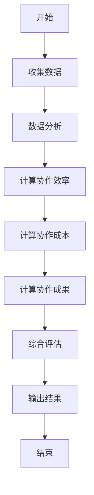
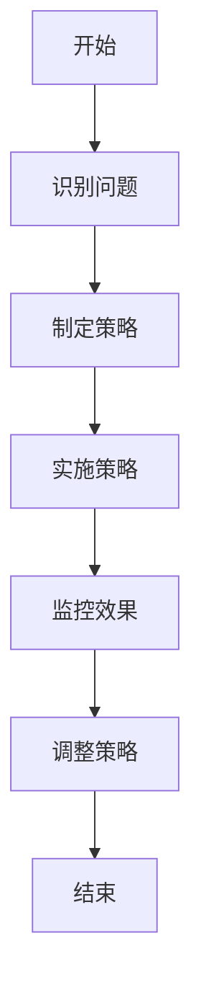
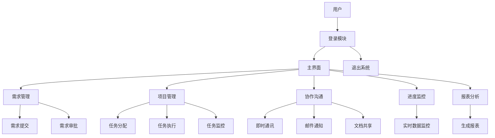
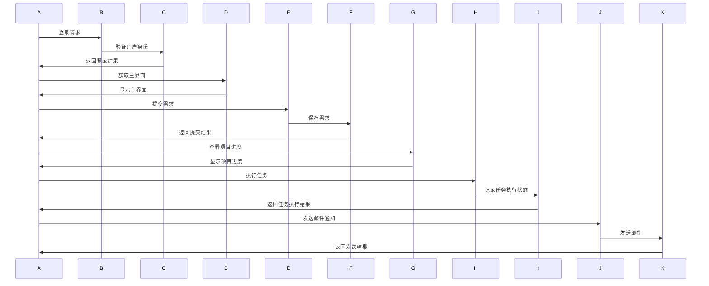
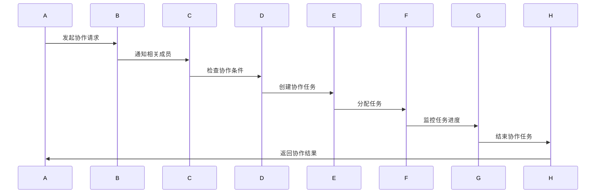

                 

### 引言

#### 1.1 问题背景

跨部门协作是现代企业中普遍存在的一项重要工作。在一个复杂的企业中，不同的部门往往拥有各自的专业领域和职责范围，这样的组织结构在一定程度上提高了工作效率和专业化水平。然而，跨部门协作的必要性也日益凸显，因为许多项目或任务的完成需要多个部门的紧密合作。有效的跨部门协作能够促进信息共享、资源整合和问题解决，从而提升整体工作效率和业务成果。

跨部门协作的重要性体现在以下几个方面：

1. **提高决策效率**：不同部门之间的协作有助于快速汇集多角度的信息，从而作出更全面的决策。
2. **增强创新力**：不同部门的专业知识和思维方式相互碰撞，能够激发创新思维，促进新产品的研发。
3. **提升客户满意度**：跨部门协作能够确保客户需求得到及时响应和高效处理，从而提高客户满意度。

然而，跨部门协作并非没有挑战。部门之间的沟通不畅、资源分配不均、目标不一致等问题，常常成为协作的障碍。为了克服这些挑战，领导者需要掌握一系列有效的领导技巧，以促进跨部门之间的沟通与合作。

#### 1.2 问题描述

在跨部门协作中，常见的问题包括：

1. **沟通壁垒**：不同部门之间的沟通不畅，导致信息传递不及时、不准确。
2. **利益冲突**：各部门追求自身利益最大化，容易忽视整体目标，导致协作受阻。
3. **协作成本**：跨部门协作往往需要额外的时间和资源投入，增加了协作成本。
4. **文化差异**：不同部门之间存在文化差异，影响了协作的效果和效率。

为了解决这些问题，领导者需要识别跨部门协作的障碍，并设定明确的目标，通过一系列策略和措施，打破壁垒，实现高效的跨部门协作。

#### 1.3 问题解决

要实现有效的跨部门协作，领导者需要关注以下几个关键方面：

1. **建立协作机制**：制定明确的协作流程和规则，确保各部门之间的沟通渠道畅通。
2. **明确协作目标**：确保各部门对整体目标和协作目标有清晰的认识，形成共同愿景。
3. **促进文化融合**：通过培训和交流活动，促进不同部门之间的文化融合，减少冲突。
4. **优化资源配置**：合理分配资源，确保各部门在协作过程中能够得到必要的支持。

接下来，我们将进一步探讨跨部门协作的概念结构、核心要素组成，并分析协作的算法原理与系统架构设计，为领导者提供实用的策略和方法。

### 第1章 总结

在本文的第一章中，我们首先介绍了跨部门协作的重要背景和现实挑战。明确了跨部门协作在提高决策效率、增强创新力和提升客户满意度方面的积极作用，同时也指出了沟通壁垒、利益冲突和文化差异等常见问题。接下来，我们提出了问题解决的方向，强调了建立协作机制、明确协作目标、促进文化融合和优化资源配置的重要性。

通过这一章节的讨论，我们可以看出，跨部门协作不仅是现代企业运作的必然需求，更是领导者必须掌握的重要领导技巧。有效促进跨部门协作，不仅需要识别和克服协作中的障碍，更需要构建一个支持协作的良好环境。在接下来的章节中，我们将进一步深入探讨跨部门协作的核心概念、算法原理和系统架构设计，为领导者提供更为具体和实用的策略和方法。

#### 1.4 边界与外延

在深入探讨跨部门协作之前，我们需要明确跨部门协作的范围和限制，以及相关概念的结构与核心要素组成。这不仅有助于我们更好地理解跨部门协作的内涵，也为制定有效的协作策略提供了基础。

#### 1.4.1 跨部门协作的范围

跨部门协作的范围可以从以下几个方面进行界定：

1. **组织层面**：跨部门协作不仅仅局限于单个项目的具体任务，而是涉及整个企业的战略目标实现。它包括从高层决策到基层执行的各个环节。
2. **功能层面**：协作的范围可以涵盖研发、生产、销售、服务等多个职能部门，确保各环节的有效衔接和资源优化配置。
3. **流程层面**：跨部门协作不仅涉及具体任务的执行，还包括流程的优化和改进，以提高整体效率和协同效果。

#### 1.4.2 跨部门协作的限制

尽管跨部门协作的重要性显而易见，但实际操作中也存在一些限制因素，主要包括：

1. **组织结构**：传统的职能型组织结构往往导致部门之间的壁垒，增加了协作的难度。
2. **资源限制**：跨部门协作需要额外的资源投入，包括人力、物力和时间，资源限制可能成为协作的瓶颈。
3. **文化差异**：不同部门之间可能存在文化差异，这会影响到协作的效果和效率。

#### 1.4.3 概念结构与核心要素组成

为了更好地理解跨部门协作，我们需要构建其概念结构，并明确核心要素组成。

1. **概念结构**：

   - **跨部门协作**：一种组织内不同部门之间的合作形式，以实现共同目标。
   - **协作机制**：确保跨部门协作顺畅运行的制度化和流程化的措施。
   - **协作目标**：明确各部门共同追求的目标和愿景。
   - **协作流程**：跨部门协作的具体操作步骤和流程。

2. **核心要素组成**：

   - **信息共享**：确保各部门之间能够及时、准确地获取必要信息。
   - **沟通机制**：建立有效的沟通渠道和机制，减少信息传递中的误差和滞后。
   - **资源整合**：优化资源配置，确保各部门能够在协作中获得必要的支持。
   - **决策协调**：在决策过程中，确保各部门能够达成共识，形成合力。

通过明确跨部门协作的范围和限制，构建概念结构，并识别核心要素组成，我们可以为接下来的讨论打下坚实的基础。在接下来的章节中，我们将进一步探讨跨部门协作的定义、特点以及与团队合作的关系，并运用算法原理和系统架构设计来深入分析跨部门协作的实践策略。

### 核心概念与联系

#### 2.1 跨部门协作的定义

跨部门协作是指企业内部不同部门之间为了共同实现某一目标或完成某项任务，通过信息共享、资源整合和协调配合，共同开展合作的一种组织行为。它强调各部门之间的互动与配合，追求整体效益最大化。跨部门协作不仅涉及具体任务的执行，还涵盖了流程的优化和制度的建立。

在跨部门协作中，各部门不再是独立运作的单元，而是通过紧密合作，实现资源共享和优势互补，从而提高整体运作效率和业务成果。跨部门协作的核心要素包括信息共享、沟通机制、资源整合和决策协调等。

#### 2.1.1 跨部门协作的基本概念

1. **部门**：指企业内部根据功能或职责划分的独立运作单元。
2. **协作**：指多个个体或单位共同完成任务或实现目标的过程。
3. **跨部门**：指不同部门之间的协作。
4. **协作机制**：确保协作顺畅运行的制度化和流程化措施。
5. **协作目标**：明确各部门共同追求的目标和愿景。
6. **协作流程**：跨部门协作的具体操作步骤和流程。

#### 2.1.2 跨部门协作的核心要素

1. **信息共享**：确保各部门之间能够及时、准确地获取必要信息，是跨部门协作的基础。
2. **沟通机制**：建立有效的沟通渠道和机制，减少信息传递中的误差和滞后，是协作顺利进行的关键。
3. **资源整合**：优化资源配置，确保各部门能够在协作中获得必要的支持，是提高协作效率的重要手段。
4. **决策协调**：在决策过程中，确保各部门能够达成共识，形成合力，是实现协作目标的重要保障。

#### 2.2 跨部门协作的特点

1. **多样性**：跨部门协作涉及多个部门和角色，具有高度的多样性。
2. **复杂性**：不同部门之间的协调和配合增加了协作的复杂性。
3. **动态性**：跨部门协作的目标和流程可能随着环境和需求的变化而调整。
4. **不确定性**：由于各部门的独立性，跨部门协作往往存在一定的不确定性。

#### 2.2.1 跨部门协作的优势

1. **资源共享**：通过跨部门协作，企业可以充分利用各部门的资源和优势，实现资源的最优配置。
2. **问题解决**：跨部门协作有助于汇集多部门的专业知识和经验，快速解决问题。
3. **效率提升**：通过有效的跨部门协作，企业可以缩短项目周期，提高整体工作效率。
4. **创新驱动**：跨部门协作促进了不同思维方式和专业知识的碰撞，有助于创新和创造新的价值。

#### 2.2.2 跨部门协作的劣势

1. **沟通成本**：跨部门协作增加了沟通的复杂性，可能导致信息传递滞后和误解。
2. **协调困难**：不同部门之间的目标可能不一致，增加了协调和合作的难度。
3. **资源冲突**：各部门在资源分配上可能存在竞争，导致资源浪费。
4. **文化差异**：不同部门之间的文化差异可能影响协作的效果和效率。

#### 2.3 跨部门协作与团队合作的关系

跨部门协作与团队合作既有区别又有联系。团队合作通常指在同一部门内或相近职能团队内的协作，而跨部门协作则是跨部门之间的合作。

1. **异同**：

   - **范围**：团队合作通常限于同一部门或相近职能团队，而跨部门协作涉及多个部门和角色。
   - **目标**：团队合作的目标往往较为单一，而跨部门协作的目标更加复杂，涉及多个层面。
   - **协调**：团队合作内部的协调相对简单，而跨部门协作需要更高的协调和沟通能力。

2. **影响**：

   - 跨部门协作有助于团队合作实现更大的目标，通过跨部门合作，团队合作可以更全面地利用资源，发挥多部门的优势。
   - 跨部门协作的成功也依赖于团队合作的有效性，团队合作中的协作精神和合作能力是跨部门协作成功的重要保障。

#### 2.4 跨部门协作的ER实体关系图架构

为了更好地理解跨部门协作的实体关系，我们可以使用ER图（实体关系图）来表示各部门之间的关系。

```mermaid
erDiagram
    User ||--|{ Department }|
    Department ||--|{ Project }|
    Project ||--|{ Task }|
    Department ||--|{ Collaboration }|
    Collaboration ||--|{ Task }|
```

- **User（用户）**：表示参与跨部门协作的个体，可以是员工或外部合作伙伴。
- **Department（部门）**：表示企业内部的不同职能部门，如研发、生产、销售、服务等部门。
- **Project（项目）**：表示跨部门协作的具体任务或目标。
- **Task（任务）**：表示项目中的具体工作内容或子任务。
- **Collaboration（协作）**：表示跨部门之间的合作关系，包括各部门在项目中的协作关系。

通过上述ER图，我们可以清晰地看到各部门和协作任务之间的关系，为后续的算法原理讲解和系统架构设计提供了基础。

在接下来的章节中，我们将进一步探讨跨部门协作的评估算法和改进算法，以及其在实际应用中的系统架构和实现细节。

### 算法原理讲解

#### 3.1 跨部门协作评估算法

跨部门协作评估算法是一种用于评估跨部门协作效果的方法。该算法通过一系列指标来衡量协作效率、成本和成果，从而为领导者和团队成员提供参考，帮助优化协作过程。

#### 3.1.1 算法原理

算法的核心思想是通过量化评估跨部门协作的多个方面，包括协作效率、协作成本和协作成果，从而得出综合评估结果。

1. **协作效率**：通过实际协作成果与预期协作成果的比值来衡量，公式为：
   $$
   \text{协作效率} = \frac{\text{实际协作成果}}{\text{预期协作成果}}
   $$
   
2. **协作成本**：通过人力成本、时间成本和资源成本的加和来计算，公式为：
   $$
   \text{协作成本} = \text{人力成本} + \text{时间成本} + \text{资源成本}
   $$

3. **协作成果**：通过具体的工作成果和业务指标来衡量，如项目的完成度、产品的质量等。

#### 3.1.2 算法流程图

算法的流程可以简化为以下步骤：



详细流程如下：

1. **收集数据**：收集跨部门协作过程中的数据，包括实际协作成果、预期协作成果、人力成本、时间成本和资源成本等。
2. **数据分析**：对收集到的数据进行分析和处理，确保数据准确性和完整性。
3. **计算协作效率**：根据实际协作成果和预期协作成果的比值，计算协作效率。
4. **计算协作成本**：根据人力成本、时间成本和资源成本的加和，计算协作成本。
5. **计算协作成果**：根据具体的工作成果和业务指标，计算协作成果。
6. **综合评估**：将协作效率、协作成本和协作成果进行综合评估，得出最终评估结果。
7. **输出结果**：将评估结果输出，为领导者和团队成员提供参考。
8. **结束**：算法流程结束。

#### 3.2 跨部门协作改进算法

跨部门协作改进算法是一种用于优化跨部门协作过程的方法。该算法通过识别协作中的问题，制定改进策略，并监控和调整策略，以实现协作效率和效果的持续提升。

#### 3.2.1 算法原理

算法的核心思想是通过系统分析和反馈机制，不断识别和解决协作中的问题，优化协作过程。

1. **问题识别**：通过数据分析和问题反馈，识别协作中的问题和瓶颈。
2. **策略制定**：根据问题识别结果，制定针对性的改进策略。
3. **策略实施**：实施改进策略，并监控其实施效果。
4. **效果评估**：评估改进策略的效果，并根据评估结果进行策略调整。

#### 3.2.2 算法流程图

算法的流程可以简化为以下步骤：



详细流程如下：

1. **识别问题**：通过数据分析、问题反馈和现场观察等方式，识别协作中的问题和瓶颈。
2. **制定策略**：根据问题识别结果，制定针对性的改进策略，如优化沟通机制、调整资源分配、改进流程设计等。
3. **实施策略**：实施制定的改进策略，并确保策略能够顺利执行。
4. **监控效果**：对改进策略的实施效果进行监控，通过关键绩效指标（KPI）和用户反馈等方式，评估策略的有效性。
5. **调整策略**：根据监控效果，对改进策略进行调整，确保协作效率和效果的持续提升。
6. **结束**：算法流程结束。

#### 3.3 算法原理的数学模型和公式

为了更好地理解跨部门协作评估和改进算法的数学基础，我们可以引入一些基本的数学模型和公式。

1. **协作效率**：协作效率的公式已在3.1.1节中给出，即：
   $$
   \text{协作效率} = \frac{\text{实际协作成果}}{\text{预期协作成果}}
   $$

2. **协作成本**：协作成本的公式已在3.1.1节中给出，即：
   $$
   \text{协作成本} = \text{人力成本} + \text{时间成本} + \text{资源成本}
   $$

3. **问题识别模型**：问题识别模型可以通过以下步骤构建：
   - **数据收集**：收集与协作相关的各种数据，如沟通记录、任务完成情况、用户反馈等。
   - **数据分析**：通过统计分析方法，识别出协作中的潜在问题。
   - **指标计算**：计算反映协作效率、协作成本和协作成果的各类指标。

4. **策略优化模型**：策略优化模型可以通过以下步骤构建：
   - **问题分析**：对识别出的问题进行详细分析，找出问题产生的原因。
   - **策略制定**：根据问题分析结果，制定具体的改进策略。
   - **效果评估**：对策略实施后的效果进行评估，确保策略能够有效解决问题。

通过上述算法原理的讲解，我们可以看到，跨部门协作评估和改进算法不仅具有理论依据，还通过数学模型和公式提供了量化的评估和优化手段。在接下来的章节中，我们将进一步探讨跨部门协作在实际应用中的系统架构和实现细节。

### 系统分析与架构设计方案

#### 4.1 问题场景介绍

在现代化企业的运营中，跨部门协作的复杂性和重要性日益凸显。为了更好地理解跨部门协作系统，我们首先介绍一个具体的应用场景。

**应用场景**：

某大型科技公司，下设研发部、市场部、销售部和服务部等多个职能部门。公司正在开发一款新的智能设备，需要各部门的紧密协作才能完成。具体场景包括：

1. **需求分析**：市场部负责收集用户需求，并向研发部提供详细的需求文档。
2. **产品研发**：研发部根据需求文档进行产品设计和开发，需要多个子团队的协作。
3. **产品测试**：测试团队对研发完成的产品进行测试，确保产品的质量和稳定性。
4. **市场推广**：市场部负责产品的市场推广和销售工作。
5. **客户服务**：服务部负责客户咨询和售后支持。

在这一应用场景中，跨部门协作的目标是确保新产品的顺利开发、上市和售后支持，实现整体业务的协同效应。

#### 4.2 系统功能设计

为了实现上述应用场景中的跨部门协作，系统需要具备以下核心功能：

1. **用户管理**：包括用户注册、登录、权限管理等。
2. **需求管理**：市场部可以提交用户需求，研发部可以查看和响应需求。
3. **项目管理**：用于管理项目进度、任务分配、协作流程等。
4. **协作沟通**：提供即时通讯、邮件通知、文档共享等功能，确保各部门之间的信息畅通。
5. **进度监控**：通过实时数据监控，跟踪项目进展情况。
6. **报表分析**：生成各种报表，提供协作效果和成本的分析数据。

#### 4.2.1 领域模型Mermaid类图

以下是一个用于表示系统核心功能的Mermaid类图：

```mermaid
classDiagram
    User <<--|{ Project } Project
    User <<--|{ Task } Task
    User <<--|{ Collaboration } Collaboration
    Project <|--|{ Requirement } Requirement
    Project <|--|{ Product } Product
    Project <|--|{ Status } Status
    Task <|--|{ Assignee } Assignee
    Task <|--|{ Priority } Priority
    Collaboration <|--|{ Member } Member
    Collaboration <|--|{ Status } Status
    Collaboration <|--|{ Comment } Comment
```

- **User（用户）**：代表系统中的所有用户，包括员工、外部合作伙伴等。
- **Project（项目）**：表示跨部门协作的具体任务或目标，包括需求、产品、进度等。
- **Task（任务）**：表示项目中的具体工作内容或子任务。
- **Collaboration（协作）**：表示跨部门之间的合作关系，包括成员、状态和评论等。
- **Requirement（需求）**：表示用户需求，由市场部提交。
- **Product（产品）**：表示研发完成的产品。
- **Status（状态）**：表示任务或项目的状态，如进行中、已完成等。
- **Assignee（分配人）**：表示任务的负责人或分配者。
- **Priority（优先级）**：表示任务的优先级。
- **Member（成员）**：表示协作的参与成员。
- **Comment（评论）**：表示对任务或项目的评论和反馈。

#### 4.3 系统架构设计

为了实现上述功能，系统需要设计一个合理的架构。以下是一个简化的Mermaid架构图：



- **用户**：系统的核心用户，包括内部员工和外部合作伙伴。
- **登录模块**：用户登录系统的入口，包括用户身份验证。
- **主界面**：用户进入系统后的主操作界面，提供系统功能入口。
- **需求管理**：管理用户需求，包括需求提交和审批。
- **项目管理**：管理项目进度和任务，包括任务分配、执行和监控。
- **协作沟通**：提供即时通讯、邮件通知和文档共享功能，确保协作畅通。
- **进度监控**：通过实时数据监控，跟踪项目进展情况。
- **报表分析**：生成各种报表，提供协作效果和成本的分析数据。
- **退出系统**：用户退出系统的操作。

#### 4.4 系统接口设计

系统接口设计是确保不同模块之间能够无缝协作的关键。以下是一个简化的Mermaid接口定义示例：



- **登录请求**：用户发起登录请求，系统验证用户身份后返回登录结果。
- **获取主界面**：用户获取主界面，系统显示主界面。
- **提交需求**：用户提交需求，系统保存需求并返回提交结果。
- **查看项目进度**：用户查看项目进度，系统显示项目进度。
- **执行任务**：用户执行任务，系统记录任务执行状态并返回结果。
- **发送邮件通知**：用户发送邮件通知，系统发送邮件并返回发送结果。

#### 4.5 系统交互Mermaid序列图

为了更清晰地展示系统各模块之间的交互过程，我们可以使用Mermaid序列图：



- **发起协作请求**：用户发起协作请求。
- **通知相关成员**：系统通知相关成员协作任务。
- **检查协作条件**：系统检查协作条件是否满足。
- **创建协作任务**：系统创建协作任务。
- **分配任务**：系统分配任务给相关成员。
- **监控任务进度**：系统监控任务进度。
- **结束协作任务**：系统结束协作任务。
- **返回协作结果**：系统返回协作结果给用户。

通过上述系统分析与架构设计方案，我们为跨部门协作系统的实现提供了清晰的框架和具体的实现细节。在接下来的章节中，我们将进一步探讨系统的实际应用和核心实现源代码，以便读者能够更好地理解和掌握跨部门协作系统的设计和实现方法。

### 第4章 项目实战

#### 5.1 环境安装

为了实现跨部门协作系统，我们需要搭建一个合适的环境，确保系统能够正常运行。以下是环境安装的具体步骤：

##### 5.1.1 环境要求

- **操作系统**：推荐使用Linux或Mac OS，但Windows也可以。
- **Python版本**：Python 3.7或更高版本。
- **数据库**：MySQL或PostgreSQL。
- **Web服务器**：Nginx或Apache。
- **开发工具**：Visual Studio Code或PyCharm。

##### 5.1.2 安装步骤

1. **安装操作系统和Python**：确保操作系统已经安装，并安装Python 3.7或更高版本。

2. **安装数据库**：下载并安装MySQL或PostgreSQL数据库，创建数据库并配置用户权限。

3. **安装Web服务器**：下载并安装Nginx或Apache Web服务器，配置服务器以支持Python和数据库连接。

4. **安装开发工具**：安装Visual Studio Code或PyCharm，并配置Python开发环境。

5. **安装依赖库**：使用pip命令安装系统所需的各种Python库，如Flask、SQLAlchemy、MySQL Connector等。

#### 5.2 系统核心实现源代码

在系统实现中，登录模块是核心功能之一，以下是一个简单的Python源代码示例，用于实现登录功能：

```python
# LoginModule.py

from flask import Flask, request, jsonify
from models import User

app = Flask(__name__)

@app.route('/login', methods=['POST'])
def login():
    username = request.form['username']
    password = request.form['password']
    
    user = User.get_by_username(username)
    if user and user.check_password(password):
        return jsonify({'status': 'success', 'message': '登录成功'})
    else:
        return jsonify({'status': 'error', 'message': '用户名或密码错误'})

if __name__ == '__main__':
    app.run(debug=True)
```

该代码使用Flask框架实现登录功能，包括用户名和密码的验证。以下是对关键部分的解读：

- **Flask**：用于构建Web应用程序的微框架。
- **request**：用于接收用户请求。
- **jsonify**：将Python对象序列化为JSON格式的函数。
- **User**：表示用户的模型类，包含获取用户信息和验证密码的方法。

#### 5.2.1 登录模块源代码解读

1. **导入模块**：从Flask框架中导入必需的模块，以及自定义的用户模型类。
2. **定义应用**：创建Flask应用程序实例。
3. **定义路由**：定义处理登录请求的路由，使用POST方法。
4. **获取用户输入**：从请求中获取用户名和密码。
5. **用户验证**：调用用户模型类的`get_by_username`和`check_password`方法，验证用户名和密码是否正确。
6. **返回结果**：根据验证结果，返回相应的JSON响应。

#### 5.3 系统核心功能实现

除了登录模块，系统还需要实现需求管理、项目管理、协作沟通等核心功能。以下是一个简单的项目结构示例：

```
/your_project
|-- /app
|   |-- /models
|   |   |-- __init__.py
|   |   |-- user.py
|   |-- /routes
|   |   |-- __init__.py
|   |   |-- login.py
|   |   |-- requirement.py
|   |   |-- project.py
|   |   |-- collaboration.py
|   |-- /templates
|   |   |-- login.html
|   |   |-- index.html
|   |-- /static
|   |   |-- css
|   |   |   |-- style.css
|   |   |-- js
|   |   |   |-- script.js
|   |-- __init__.py
|   |-- config.py
|-- /venv
|-- requirements.txt
|-- run.py
```

- `/app`：应用程序的主要目录，包含模型、路由和静态文件。
- `/models`：存放数据库模型类。
- `/routes`：存放处理不同功能的路由代码。
- `/templates`：存放HTML模板文件。
- `/static`：存放CSS和JavaScript文件。
- `/venv`：Python虚拟环境目录。
- `requirements.txt`：记录项目依赖的Python库。
- `run.py`：启动应用程序的主文件。

#### 5.3.1 需求管理模块实现

需求管理模块负责处理用户需求的提交和审批。以下是一个简单的需求管理模块实现示例：

```python
# RequirementModule.py

from flask import Flask, request, jsonify
from models import Requirement

app = Flask(__name__)

@app.route('/requirement/submit', methods=['POST'])
def submit_requirement():
    title = request.form['title']
    description = request.form['description']
    
    requirement = Requirement(title=title, description=description)
    requirement.save()
    
    return jsonify({'status': 'success', 'message': '需求提交成功'})

@app.route('/requirement/approve', methods=['POST'])
def approve_requirement():
    requirement_id = request.form['requirement_id']
    status = request.form['status']
    
    requirement = Requirement.get_by_id(requirement_id)
    if requirement:
        requirement.status = status
        requirement.save()
        
        return jsonify({'status': 'success', 'message': '需求审批成功'})
    else:
        return jsonify({'status': 'error', 'message': '需求不存在'})

if __name__ == '__main__':
    app.run(debug=True)
```

该代码包括两个路由：

- `/requirement/submit`：用于提交需求，保存需求信息到数据库。
- `/requirement/approve`：用于审批需求，更新需求的状态。

#### 5.3.2 项目管理模块实现

项目管理模块负责管理项目的进度和任务。以下是一个简单的项目管理模块实现示例：

```python
# ProjectModule.py

from flask import Flask, request, jsonify
from models import Project, Task

app = Flask(__name__)

@app.route('/project/create', methods=['POST'])
def create_project():
    name = request.form['name']
    description = request.form['description']
    
    project = Project(name=name, description=description)
    project.save()
    
    return jsonify({'status': 'success', 'message': '项目创建成功'})

@app.route('/project/task/assign', methods=['POST'])
def assign_task():
    project_id = request.form['project_id']
    task_id = request.form['task_id']
    assignee = request.form['assignee']
    
    project = Project.get_by_id(project_id)
    task = Task.get_by_id(task_id)
    if project and task:
        task.assignee = assignee
        task.save()
        
        return jsonify({'status': 'success', 'message': '任务分配成功'})
    else:
        return jsonify({'status': 'error', 'message': '项目或任务不存在'})

if __name__ == '__main__':
    app.run(debug=True)
```

该代码包括两个路由：

- `/project/create`：用于创建项目，保存项目信息到数据库。
- `/project/task/assign`：用于分配任务，将任务分配给指定成员。

#### 5.4 代码应用解读与分析

通过上述代码示例，我们可以看到跨部门协作系统的核心功能模块是如何实现的。以下是对各个模块的实现细节和应用解读：

1. **登录模块**：负责用户身份验证，确保只有授权用户可以访问系统。
2. **需求管理模块**：处理用户需求的提交和审批，确保需求被准确记录和及时处理。
3. **项目管理模块**：管理项目的创建和任务分配，确保项目进度可控和任务明确。

这些模块通过定义相应的路由和处理函数，实现了对跨部门协作的核心功能的操作。每个模块之间通过数据库进行数据存储和查询，确保数据的一致性和完整性。

在实际应用中，这些模块可以集成到更大的系统中，与其他功能模块协同工作，共同实现企业的跨部门协作需求。例如，通过需求管理模块，市场部可以提交用户需求，研发部可以查看和处理需求，并通过项目管理模块分配和跟踪任务进度。

通过以上实战案例，我们可以看到跨部门协作系统在设计和实现上的关键步骤和核心功能。在接下来的章节中，我们将进一步分析系统的实际应用效果和业务价值，以便为企业提供更为深入和实用的指导和参考。

### 最佳实践 Tips

在实施跨部门协作时，以下是一些最佳实践Tips，这些技巧能够帮助领导者更加有效地促进协作，提高工作效率：

1. **明确沟通渠道**：建立清晰的沟通渠道，确保信息传递的及时性和准确性。例如，可以使用即时通讯工具、邮件系统或项目管理工具来保持部门之间的沟通畅通。
2. **设立共同目标**：确保各部门对共同目标有清晰的认识，并通过定期的会议和协作活动来保持目标的同步和更新。
3. **培养团队精神**：通过团队建设活动和跨部门合作项目，增强团队成员之间的信任和协作意识，减少文化差异带来的负面影响。
4. **资源优化配置**：合理分配资源，确保各部门在协作过程中能够获得必要的支持。通过资源整合，避免资源浪费和冲突。
5. **制定明确的流程和规则**：建立明确的协作流程和规则，确保各部门在协作过程中有章可循，提高协作效率。
6. **数据共享和透明化**：建立共享平台，确保各部门能够及时获取必要的信息和数据，提升协作的透明度。
7. **持续反馈和改进**：通过定期的反馈和评估，识别协作中的问题和瓶颈，及时进行调整和优化。

通过这些最佳实践，企业可以建立高效的跨部门协作机制，提升整体运作效率和业务成果。

### 小结

在本文的讨论中，我们深入探讨了跨部门协作的重要性、挑战、核心概念以及实际应用中的系统架构和实现方法。首先，我们分析了跨部门协作的背景和重要性，指出了其促进决策效率、增强创新力和提升客户满意度的积极作用。同时，我们也明确了跨部门协作中面临的问题，如沟通壁垒、利益冲突和文化差异，并提出了问题解决的方向。

接着，我们详细介绍了跨部门协作的核心概念和联系，包括其定义、基本概念、核心要素、特点以及与团队合作的关系。为了更好地理解跨部门协作的算法原理，我们讲解了评估和改进算法的原理、流程以及相关的数学模型和公式。

随后，我们分析了跨部门协作系统在实际应用中的架构设计，包括功能设计、系统架构、接口设计和系统交互，并提供了具体的实现源代码示例。通过这些分析，我们展示了如何设计一个高效的跨部门协作系统，以支持企业的日常运营和项目实施。

在实战部分，我们通过具体的案例展示了系统的实际应用和实现过程，帮助读者更好地理解和掌握跨部门协作系统的设计和实现方法。

总的来说，跨部门协作不仅是现代企业运作的必然需求，也是领导者必须掌握的重要领导技巧。通过本文的探讨，我们希望读者能够对跨部门协作有更深入的理解，掌握有效的策略和方法，从而在企业的运营中实现高效、顺畅的跨部门协作。

### 注意事项

在实施跨部门协作时，以下事项需要特别注意：

1. **确保沟通渠道畅通**：建立清晰的沟通渠道，确保信息传递的及时性和准确性，避免信息孤岛。
2. **明确目标与责任**：确保各部门对共同目标和责任有清晰的认识，避免目标不一致或责任不明确的情况。
3. **尊重文化差异**：尊重不同部门的文化差异，通过培训和交流减少冲突，增强团队协作意识。
4. **合理分配资源**：在资源有限的情况下，合理分配资源，避免资源浪费和冲突。
5. **监控和评估协作效果**：定期监控和评估跨部门协作的效果，及时识别和解决协作中的问题。
6. **持续改进**：通过持续反馈和改进，不断优化协作流程和机制，提升协作效率。

通过关注这些注意事项，企业可以更好地实施跨部门协作，提高整体运作效率和业务成果。

### 拓展阅读

为了深入了解跨部门协作的理论和实践，以下是几本推荐的专业书籍：

1. **《跨部门协作的艺术：打造高效团队的核心技巧》**，作者：[约翰·麦斯威尔（John Maxwell）]
   - 内容概述：本书详细介绍了跨部门协作的重要性，以及如何通过建立信任、明确目标和有效沟通来实现高效的跨部门协作。

2. **《企业协作机制设计：跨部门协作的有效模式》**，作者：[罗杰·费尔德曼（Roger Fiedman）]
   - 内容概述：本书探讨了企业内部跨部门协作的模式和机制，提供了具体的策略和方法，帮助领导者构建有效的协作体系。

3. **《跨部门协作的秘诀：实现企业协同效应的关键》**，作者：[马克·麦克莱恩（Mark McEwan）]
   - 内容概述：本书从实际案例出发，探讨了跨部门协作中的挑战和解决方案，强调了协作过程中的沟通技巧和策略。

4. **《团队合作与跨部门协作：理论与实践》**，作者：[斯蒂芬·罗宾斯（Stephen Robbins）]
   - 内容概述：本书结合理论和实践，详细介绍了团队合作和跨部门协作的原理和方法，为企业和团队提供实用的指导。

通过阅读这些书籍，读者可以进一步拓展对跨部门协作的理解，获得更多的实践经验和策略。

