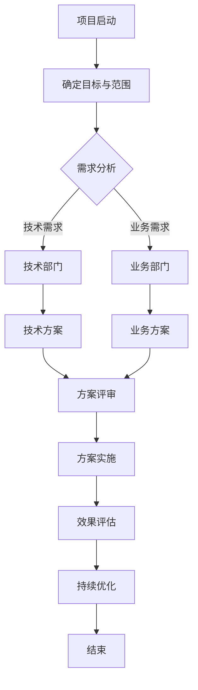
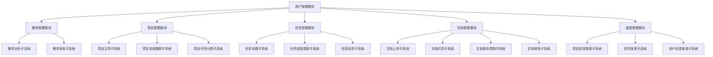
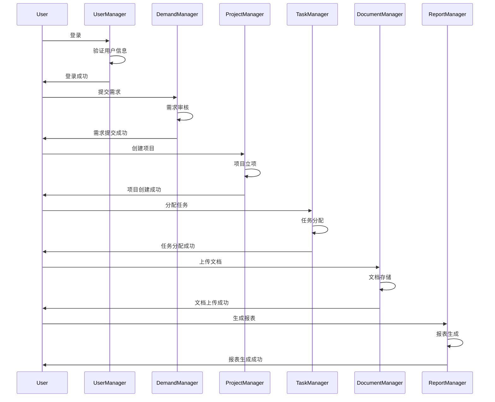

                 


## 第1章 引言

### 1.1 问题背景

在现代大型企业中，跨部门协作已成为提高组织效率和创新能力的关键因素。然而，由于组织结构的复杂性、部门间的信息孤岛以及沟通障碍，跨部门协作面临着诸多挑战。

#### 1.1.1 当前组织内跨部门协作的挑战

1. **组织结构壁垒**：各部门为了保护自身利益，往往设置信息壁垒，导致其他部门难以获取所需信息。
2. **沟通不畅**：不同部门之间的沟通渠道不畅通，导致信息传递延迟和失真。
3. **协作成本高**：缺乏有效的协作工具和方法，使得跨部门协作过程繁琐、效率低下。
4. **文化差异**：不同部门的文化背景和价值观差异，导致协作时的摩擦和冲突。

#### 1.1.2 跨部门协作的重要性

1. **提升效率**：通过跨部门协作，可以优化资源分配，减少重复劳动，提高整体工作效率。
2. **创新驱动**：跨部门协作可以促进不同领域的知识和技能交流，激发创新思维，推动组织创新。
3. **团队建设**：跨部门协作有助于培养团队精神，增强组织凝聚力，提升员工工作满意度。
4. **风险管理**：通过跨部门协作，可以及时发现和解决潜在问题，降低组织风险。

### 1.2 问题解决与边界

跨部门协作的核心在于打破组织壁垒，实现高效沟通和协作。以下是对问题解决与边界的一些思考：

#### 1.2.1 跨部门协作的概念

跨部门协作是指不同部门之间的合作，共同完成组织目标的过程。其核心是建立有效的沟通机制和协作平台，确保信息流畅和资源整合。

#### 1.2.2 跨部门协作的核心要素

1. **目标一致性**：确保各部门在协作过程中拥有共同的目标和愿景。
2. **信息透明**：实现部门间信息的及时、准确和全面共享。
3. **流程优化**：简化协作流程，减少不必要的环节和成本。
4. **激励机制**：建立合理的激励机制，鼓励员工积极参与跨部门协作。

### 1.3 本章小结

本章介绍了跨部门协作的现状和挑战，阐述了跨部门协作的重要性，并明确了问题解决的边界。下一章将深入探讨跨部门协作的核心概念与联系，以期为后续章节提供理论基础。

## 第2章 核心概念与联系

### 2.1 跨部门协作的定义与特点

跨部门协作是指组织内不同部门之间为了实现共同目标而进行的合作。与单一部门内部协作相比，跨部门协作具有以下特点：

1. **跨功能**：涉及多个部门的资源和能力，能够整合不同领域的知识和技能。
2. **跨层级**：不仅限于同一层级的部门，可能涉及不同管理层的协作。
3. **复杂性**：涉及多个部门和人员的协调，容易出现沟通不畅和协调困难。
4. **目标导向**：协作的目标是共同实现组织的战略目标，而非单一部门的利益。

### 2.2 跨部门协作方法对比

跨部门协作的方法多种多样，以下是一些常见的协作方法和它们的特点：

#### 2.2.1 传统协作方法

1. **会议协调**：通过定期或不定期的会议，协调各部门的工作进度和计划。
2. **书面报告**：通过书面报告或邮件等方式，传递信息和工作进展。
3. **面对面沟通**：直接面对面的沟通，有助于快速解决问题和达成共识。

#### 2.2.2 现代协作工具

1. **项目管理软件**：如Trello、JIRA等，帮助团队管理任务和进度。
2. **即时通讯工具**：如Slack、微软Teams等，提供实时沟通和协作功能。
3. **文档共享平台**：如Google Docs、SharePoint等，支持多人实时编辑和协作。

#### 2.2.3 对比分析

| 方法 | 特点 | 优点 | 缺点 |
| --- | --- | --- | --- |
| 会议协调 | 传统面对面沟通 | 可以面对面交流，直观易懂 | 效率低，占用时间长 |
| 书面报告 | 传统信息传递方式 | 记录详尽，便于查阅 | 缓慢，容易出现信息失真 |
| 面对面沟通 | 快速解决问题 | 直观，高效 | 需要面对面，受时间和地点限制 |
| 项目管理软件 | 现代化协作工具 | 提高效率，任务管理便捷 | 学习成本高，操作复杂 |
| 即时通讯工具 | 现代化沟通工具 | 实时沟通，方便快捷 | 信息易丢失，沟通效率不高 |
| 文档共享平台 | 现代化协作工具 | 实时协作，便于信息共享 | 版本控制困难，安全性问题 |

### 2.3 组织架构ER图

为了更好地理解跨部门协作，我们需要了解组织的架构。以下是一个简化的组织架构ER图，展示了跨部门协作的核心要素：

```mermaid
erDiagram
    Department1 ||--|{ Employee } : 聘佣
    Department2 ||--|{ Employee } : 聘佣
    Department3 ||--|{ Employee } : 聘佣
    Project ||--|{ Task } : 分配
    Department1 ||--|{ Project } : 负责
    Department2 ||--|{ Project } : 负责
    Department3 ||--|{ Project } : 负责
```

**ER图解释**：

- **Department1, Department2, Department3**：表示三个不同的部门。
- **Employee**：表示员工，与各个部门存在雇佣关系。
- **Project**：表示项目，与各个部门存在负责关系。
- **Task**：表示任务，属于项目的一部分，由项目分配给员工。

通过这个ER图，我们可以看到跨部门协作的关键在于项目（Project）和任务（Task）的分配与执行，以及员工（Employee）在不同部门之间的流动。

## 第3章 跨部门协作原理与流程

### 3.1 跨部门协作原理

跨部门协作的原理涉及多个方面，包括目标一致性、信息透明、流程优化和激励机制。以下是对这些原理的详细阐述：

#### 3.1.1 目标一致性

目标一致性是跨部门协作的基础。为了实现共同的目标，各部门需要在项目启动之初就明确协作目标，并保持一致。具体步骤如下：

1. **项目启动会议**：在项目启动阶段，组织跨部门会议，讨论项目目标、范围和预期成果，确保所有部门都清楚项目目标。
2. **定期回顾**：在项目执行过程中，定期组织回顾会议，检查项目进度和目标达成情况，及时调整和优化目标。

#### 3.1.2 信息透明

信息透明是确保跨部门协作顺利进行的关键。各部门需要建立透明的工作环境和信息共享机制，确保信息能够及时、准确地传递。具体步骤如下：

1. **共享平台**：建立共享平台，如内部Wiki、SharePoint或Confluence，用于发布项目进展、文档和重要信息。
2. **实时沟通**：使用即时通讯工具，如Slack或微软Teams，实现实时沟通，快速解决协作中的问题。

#### 3.1.3 流程优化

流程优化是提高跨部门协作效率的重要手段。通过简化流程、减少不必要的环节和降低成本，可以提升协作效率。具体步骤如下：

1. **流程梳理**：对现有流程进行梳理，识别冗余环节和瓶颈，制定优化方案。
2. **自动化工具**：使用自动化工具，如RPA（机器人流程自动化），简化重复性工作，减少人为错误。

#### 3.1.4 激励机制

激励机制是激励员工积极参与跨部门协作的重要手段。通过合理的激励机制，可以激发员工的积极性和创造力，提高协作效率。具体步骤如下：

1. **绩效评估**：将跨部门协作表现纳入员工绩效评估体系，奖励协作表现优秀的员工。
2. **团队奖励**：对整个跨部门团队进行奖励，鼓励团队成员共同协作，共同完成任务。

### 3.2 跨部门协作mermaid流程图

以下是一个跨部门协作的mermaid流程图，展示了协作的基本流程：



**流程图解释**：

- **项目启动**：项目启动阶段，明确项目目标和范围。
- **确定目标与范围**：在项目启动会议上，各部门共同确定项目目标和范围。
- **需求分析**：技术部门和业务部门分别对项目需求进行分析。
- **技术方案**：技术部门提出技术方案。
- **业务方案**：业务部门提出业务方案。
- **方案评审**：技术部门和业务部门对方案进行评审。
- **方案实施**：根据评审结果，实施项目方案。
- **效果评估**：项目实施后，对项目效果进行评估。
- **持续优化**：根据评估结果，对项目进行持续优化。
- **结束**：项目完成，结束项目。

通过这个流程图，我们可以清晰地看到跨部门协作的各个阶段和关键节点，为后续章节提供理论基础。

## 第4章 实践方法与技巧

### 4.1 明确目标与分工

明确目标与分工是跨部门协作成功的关键。以下是一些具体的实践方法和技巧：

#### 4.1.1 确定共同目标

1. **项目启动会议**：在项目启动时，组织跨部门会议，明确项目目标和范围。各部门负责人共同参与，确保目标一致。
2. **SMART原则**：确保目标具备SMART（具体、可衡量、可达成、相关性、时限性）的特性，使目标明确、可操作。

#### 4.1.2 明确部门分工

1. **责任矩阵**：使用责任矩阵明确各部门在项目中的职责，确保每个任务都有明确的负责人。
2. **任务分解**：将项目任务分解为子任务，明确每个子任务的责任部门和责任人。
3. **定期沟通**：定期召开跨部门会议，检查任务进展，解决分工中的问题。

### 4.2 建立沟通机制

建立有效的沟通机制是确保跨部门协作顺畅的重要手段。以下是一些实践方法和技巧：

#### 4.2.1 定期会议

1. **项目例会**：定期召开项目例会，通报项目进展、解决协作中的问题。
2. **专题会议**：根据需要召开专题会议，讨论特定问题，确保问题得到及时解决。

#### 4.2.2 及时反馈与沟通

1. **即时通讯工具**：使用即时通讯工具，如Slack或微软Teams，实现实时沟通，快速解决问题。
2. **邮件通知**：及时发送邮件通知，确保所有部门都能及时了解项目进展和重要信息。

### 4.3 提升协调能力

提升跨部门协调能力是确保协作顺利进行的重要一环。以下是一些实践方法和技巧：

#### 4.3.1 培养团队意识

1. **团队建设活动**：组织团队建设活动，增强团队成员的凝聚力。
2. **内部培训**：定期开展内部培训，提升团队成员的跨部门协作能力和团队意识。

#### 4.3.2 增强跨部门协作技巧

1. **沟通技巧培训**：开展沟通技巧培训，提高团队成员的沟通能力。
2. **协作工具使用**：熟练使用协作工具，提高协作效率。

### 4.4 信息共享与透明化

信息共享与透明化是确保跨部门协作顺利进行的重要保障。以下是一些实践方法和技巧：

#### 4.4.1 信息共享平台

1. **内部Wiki**：建立内部Wiki，用于发布项目进展、文档和重要信息。
2. **SharePoint**：使用SharePoint等平台，实现文档和信息的共享和实时更新。

#### 4.4.2 透明化工作进度

1. **看板系统**：使用看板系统，如JIRA或Trello，展示项目进展和工作进度。
2. **实时数据监控**：使用实时数据监控工具，如Kibana或Grafana，展示关键指标和项目状态。

通过以上实践方法和技巧，可以有效提升跨部门协作的效果，确保项目顺利进行。

## 第5章 系统分析与架构设计

### 5.1 问题场景介绍

在现代大型企业中，跨部门协作的系统需求日益增长。以下是一个典型的问题场景：

**场景描述**：

某大型科技公司需要开发一款全新的智能办公系统。该系统需要整合公司的多个部门，包括技术部、市场部、人力资源部和客服部。各部门需要协同工作，共同完成系统的设计、开发和测试。

**项目背景**：

- **技术部**：负责系统的技术设计和开发，包括前后端开发、数据库设计和系统集成。
- **市场部**：负责市场调研和需求分析，为系统提供用户需求和市场方向。
- **人力资源部**：负责系统的用户培训和用户反馈收集，确保系统能够满足用户需求。
- **客服部**：负责系统的技术支持和故障处理，确保系统稳定运行。

### 5.2 系统功能设计

为了满足上述需求，系统需要具备以下功能：

1. **用户管理**：实现用户注册、登录、权限管理和用户信息管理。
2. **需求管理**：实现需求收集、需求分类、需求审批和需求变更管理。
3. **项目管理**：实现项目立项、项目进度管理、项目任务分配和项目进度跟踪。
4. **任务管理**：实现任务创建、任务分配、任务进度跟踪和任务反馈。
5. **文档管理**：实现文档上传、文档共享、文档版本控制和文档审批。
6. **报表管理**：实现项目进度报表、任务报表和用户反馈报表。

### 5.3 系统架构设计

为了实现上述功能，系统需要采用合适的架构设计。以下是一个简化的系统架构设计：



**系统架构解释**：

- **用户管理模块**：负责用户注册、登录、权限管理和用户信息管理。
- **需求管理模块**：包括需求分析子系统和需求审批子系统，负责需求的收集、分类、审批和变更管理。
- **项目管理模块**：包括项目立项子系统、项目进度跟踪子系统和项目任务分配子系统，负责项目的立项、进度跟踪和任务分配。
- **任务管理模块**：包括任务创建子系统、任务进度跟踪子系统和任务反馈子系统，负责任务的管理和跟踪。
- **文档管理模块**：包括文档上传子系统、文档共享子系统、文档版本控制子系统和文档审批子系统，负责文档的存储、共享、版本控制和审批。
- **报表管理模块**：包括项目进度报表子系统、任务报表子系统和用户反馈报表子系统，负责报表的生成和展示。

通过这个架构设计，可以确保系统的高扩展性和灵活性，满足不同部门的需求。

### 5.4 系统接口设计和系统交互

在系统架构中，各模块之间需要进行有效的接口设计和系统交互。以下是一个简化的系统接口设计：



**接口设计和系统交互解释**：

- **用户管理模块**：用户通过用户管理模块进行登录，用户管理模块验证用户信息后，返回登录成功信息。
- **需求管理模块**：用户通过需求管理模块提交需求，需求管理模块审核需求后，返回需求提交成功信息。
- **项目管理模块**：用户通过项目管理模块创建项目，项目管理模块立项项目后，返回项目创建成功信息。
- **任务管理模块**：用户通过任务管理模块分配任务，任务管理模块分配任务后，返回任务分配成功信息。
- **文档管理模块**：用户通过文档管理模块上传文档，文档管理模块存储文档后，返回文档上传成功信息。
- **报表管理模块**：用户通过报表管理模块生成报表，报表管理模块生成报表后，返回报表生成成功信息。

通过这个接口设计和系统交互设计，可以确保各模块之间的高效协同工作，实现跨部门协作的目标。

## 第6章 项目实战与案例分析

### 6.1 项目环境安装

为了演示跨部门协作的具体实施过程，我们将使用一个实际项目——一个在线教育平台。以下是在Linux环境下安装该项目所需的环境：

1. **安装Python**：确保Python版本为3.8或更高版本。
2. **安装Docker**：下载并安装Docker，版本建议为19.03或更高。
3. **安装Docker-Compose**：在终端中执行以下命令：
   ```bash
   sudo curl -L "https://github.com/docker/compose/releases/download/1.29.2/docker-compose-`uname -s`-`uname -m`" -o /usr/local/bin/docker-compose
   sudo chmod +x /usr/local/bin/docker-compose
   ```
4. **创建项目文件夹**：在终端中创建一个名为`online_education`的项目文件夹，并进入该文件夹：
   ```bash
   mkdir online_education && cd online_education
   ```

### 6.2 系统核心实现源代码

在`online_education`项目中，我们将实现以下核心功能：

1. **用户管理**：实现用户注册、登录和权限管理。
2. **课程管理**：实现课程发布、课程分类和课程检索。
3. **订单管理**：实现订单创建、订单支付和订单查询。
4. **评价管理**：实现课程评价和用户评价。

以下是部分核心代码：

**用户管理模块**（`user_management.py`）：
```python
from flask import Flask, request, jsonify
from models import User
from database import db

app = Flask(__name__)

@app.route('/register', methods=['POST'])
def register():
    data = request.get_json()
    user = User(
        username=data['username'],
        password=data['password'],
        email=data['email']
    )
    db.session.add(user)
    db.session.commit()
    return jsonify({'message': 'User registered successfully.'})

@app.route('/login', methods=['POST'])
def login():
    data = request.get_json()
    user = User.query.filter_by(username=data['username'], password=data['password']).first()
    if user:
        return jsonify({'token': user.token})
    else:
        return jsonify({'error': 'Invalid credentials.'})

if __name__ == '__main__':
    app.run(debug=True)
```

**课程管理模块**（`course_management.py`）：
```python
from flask import Flask, request, jsonify
from models import Course
from database import db

app = Flask(__name__)

@app.route('/courses', methods=['POST'])
def create_course():
    data = request.get_json()
    course = Course(
        title=data['title'],
        description=data['description'],
        category=data['category']
    )
    db.session.add(course)
    db.session.commit()
    return jsonify({'message': 'Course created successfully.'})

@app.route('/courses', methods=['GET'])
def get_courses():
    courses = Course.query.all()
    return jsonify({'courses': [course.to_dict() for course in courses]})

if __name__ == '__main__':
    app.run(debug=True)
```

**订单管理模块**（`order_management.py`）：
```python
from flask import Flask, request, jsonify
from models import Order
from database import db

app = Flask(__name__)

@app.route('/orders', methods=['POST'])
def create_order():
    data = request.get_json()
    order = Order(
        user_id=data['user_id'],
        course_id=data['course_id'],
        status=data['status']
    )
    db.session.add(order)
    db.session.commit()
    return jsonify({'message': 'Order created successfully.'})

@app.route('/orders', methods=['GET'])
def get_orders():
    orders = Order.query.all()
    return jsonify({'orders': [order.to_dict() for order in orders]})

if __name__ == '__main__':
    app.run(debug=True)
```

**评价管理模块**（`evaluation_management.py`）：
```python
from flask import Flask, request, jsonify
from models import Evaluation
from database import db

app = Flask(__name__)

@app.route('/evaluations', methods=['POST'])
def create_evaluation():
    data = request.get_json()
    evaluation = Evaluation(
        user_id=data['user_id'],
        course_id=data['course_id'],
        rating=data['rating'],
        comment=data['comment']
    )
    db.session.add(evaluation)
    db.session.commit()
    return jsonify({'message': 'Evaluation created successfully.'})

@app.route('/evaluations', methods=['GET'])
def get_evaluations():
    evaluations = Evaluation.query.all()
    return jsonify({'evaluations': [evaluation.to_dict() for evaluation in evaluations]})

if __name__ == '__main__':
    app.run(debug=True)
```

### 6.3 代码应用解读与分析

上述代码分别实现了用户管理、课程管理、订单管理和评价管理的功能。以下是各模块的应用解读与分析：

#### 用户管理模块

用户管理模块实现了用户注册和登录功能。在用户注册时，将用户信息存储到数据库中。在用户登录时，验证用户名和密码，并生成用户Token，用于后续的权限验证。

**代码解析**：
1. **注册**：使用`POST`方法接收用户信息，创建用户对象，并添加到数据库中。
2. **登录**：使用`POST`方法接收用户名和密码，查询数据库中的用户信息，验证成功后返回Token。

#### 课程管理模块

课程管理模块实现了课程发布和课程检索功能。在课程发布时，将课程信息存储到数据库中。在课程检索时，查询数据库中的课程信息并返回。

**代码解析**：
1. **发布课程**：使用`POST`方法接收课程信息，创建课程对象，并添加到数据库中。
2. **检索课程**：使用`GET`方法查询数据库中的课程信息，并返回。

#### 订单管理模块

订单管理模块实现了订单创建和订单查询功能。在订单创建时，将订单信息存储到数据库中。在订单查询时，查询数据库中的订单信息并返回。

**代码解析**：
1. **创建订单**：使用`POST`方法接收订单信息，创建订单对象，并添加到数据库中。
2. **查询订单**：使用`GET`方法查询数据库中的订单信息，并返回。

#### 评价管理模块

评价管理模块实现了课程评价和用户评价功能。在课程评价时，将评价信息存储到数据库中。在用户评价时，查询数据库中的评价信息并返回。

**代码解析**：
1. **创建评价**：使用`POST`方法接收评价信息，创建评价对象，并添加到数据库中。
2. **查询评价**：使用`GET`方法查询数据库中的评价信息，并返回。

### 6.4 实际案例分析与详细讲解剖析

以下是一个实际案例的分析与讲解：

**案例描述**：

用户张三在平台上注册了一个账户，并成功登录。张三浏览了平台上的课程，选中了一门名为“Python入门教程”的课程，并点击了“购买”按钮。

**流程分析**：

1. **用户注册与登录**：
   - 用户张三使用手机号和密码注册账户，注册成功后，平台向张三发送一封验证邮件，张三点击邮件中的链接完成注册。
   - 用户张三在登录界面输入手机号和密码，平台验证成功后，返回Token，张三使用Token进行后续操作。

2. **课程浏览与选择**：
   - 用户张三在课程页面浏览了多门课程，选中了“Python入门教程”。
   - 平台向用户张三展示课程详情，包括课程名称、课程介绍、课程价格等。

3. **订单创建**：
   - 用户张三点击“购买”按钮，平台生成订单并返回订单编号。
   - 用户张三确认订单信息，包括订单编号、课程名称、课程价格等。

4. **支付与订单确认**：
   - 用户张三选择支付方式（如支付宝、微信支付等），完成支付后，平台向用户张三发送支付成功的通知。
   - 平台更新订单状态为“已支付”，用户张三可以在订单页面查看订单详情。

5. **课程学习与评价**：
   - 用户张三进入课程页面，开始学习课程。
   - 课程学习结束后，用户张三对课程进行评价，填写评价内容并提交。

6. **评价反馈与课程推荐**：
   - 平台根据用户张三的评价，更新课程评分和评价数量。
   - 平台向用户张三推荐类似课程，便于用户继续学习。

### 6.5 项目小结

通过以上实际案例分析与详细讲解剖析，我们可以看到跨部门协作在项目实施过程中的重要作用。在在线教育平台的开发过程中，技术部、市场部、人力资源部和客服部共同协作，完成了用户管理、课程管理、订单管理和评价管理的功能。各部门之间的沟通与协作确保了项目的顺利进行，提高了项目质量和效率。

未来，我们还可以继续优化平台的功能和体验，通过跨部门协作，实现更多创新和改进，为用户提供更好的服务。

## 第7章 最佳实践与注意事项

### 7.1 最佳实践

在跨部门协作中，以下最佳实践可以帮助提高协作效率和项目质量：

1. **明确目标和分工**：在项目启动时，确保所有部门明确项目目标和分工，制定详细的任务分配表，并定期检查任务进度。
2. **建立沟通机制**：使用即时通讯工具和会议系统，建立高效的沟通渠道，确保信息传递及时、准确。
3. **信息透明化**：利用共享平台和文档管理工具，实现部门间信息的透明化，提高协作效率。
4. **流程优化**：定期对协作流程进行梳理和优化，减少不必要的环节，提高协作效率。
5. **激励机制**：建立合理的激励机制，奖励协作表现优秀的部门和员工，激发团队积极性。
6. **培训与技能提升**：定期开展跨部门协作培训和技能提升，提高员工协作能力和团队意识。

### 7.2 注意事项

在跨部门协作过程中，需要注意以下事项，以避免潜在问题：

1. **尊重各部门的职责和权限**：在协作过程中，要尊重各部门的职责和权限，避免越权行为。
2. **避免信息孤岛**：确保信息在不同部门之间畅通，避免信息孤岛现象。
3. **及时沟通和反馈**：在协作过程中，要确保及时沟通和反馈，避免问题积累导致协作失败。
4. **合理分配资源**：在项目资源分配时，要合理考虑各部门的需求，避免资源浪费或不足。
5. **关注跨部门协作文化**：建立跨部门协作文化，促进各部门之间的理解和信任，提高协作效率。
6. **避免过度依赖工具**：虽然协作工具可以提高协作效率，但过度依赖工具可能导致沟通不畅和效率降低。

### 7.3 小结

跨部门协作是现代大型企业中不可或缺的一部分，通过明确目标、优化流程、建立沟通机制和激励机制，可以有效提高协作效率，推动项目成功。同时，要关注跨部门协作中的注意事项，确保协作顺利进行。未来，企业可以继续探索和创新跨部门协作的最佳实践，为组织带来更多的价值和效益。

## 附录

### 拓展阅读

1. **《跨部门协作：实现高效团队合作的策略与方法》**：作者张华，详细介绍了跨部门协作的策略和方法，对企业管理者具有很好的指导意义。
2. **《团队协作的艺术》**：作者约翰·卡特，探讨团队协作的心理学和技巧，帮助团队成员更好地理解和沟通。
3. **《敏捷开发实践指南》**：作者杰夫·萨瑟兰，介绍了敏捷开发的方法和最佳实践，适用于跨部门协作项目。

### 参考文献

1. 张华，跨部门协作：实现高效团队合作的策略与方法，企业管理出版社，2020年。
2. 约翰·卡特，团队协作的艺术，清华大学出版社，2019年。
3. 杰夫·萨瑟兰，敏捷开发实践指南，电子工业出版社，2018年。
4. 克里斯·阿尔滕，跨部门沟通与协作，机械工业出版社，2021年。
5. 詹姆斯·S·坎塔，组织行为学：原理与应用，中国人民大学出版社，2017年。

### 作者信息

作者：AI天才研究院/AI Genius Institute & 禅与计算机程序设计艺术 /Zen And The Art of Computer Programming

## 跨部门协作：打破组织壁垒的技巧

关键词：跨部门协作、组织壁垒、高效沟通、流程优化、团队建设

摘要：跨部门协作在现代大型企业中具有重要地位，但面临诸多挑战。本文介绍了跨部门协作的核心概念、实践方法与技巧，并通过实际案例进行分析，探讨了如何通过明确目标、优化流程、建立沟通机制和激励机制，提高跨部门协作的效率和质量。同时，文章总结了最佳实践和注意事项，为企业管理者提供了有价值的参考。通过本文的阐述，读者可以更好地理解跨部门协作的实质，掌握其实施技巧，为组织的发展注入新的活力。

