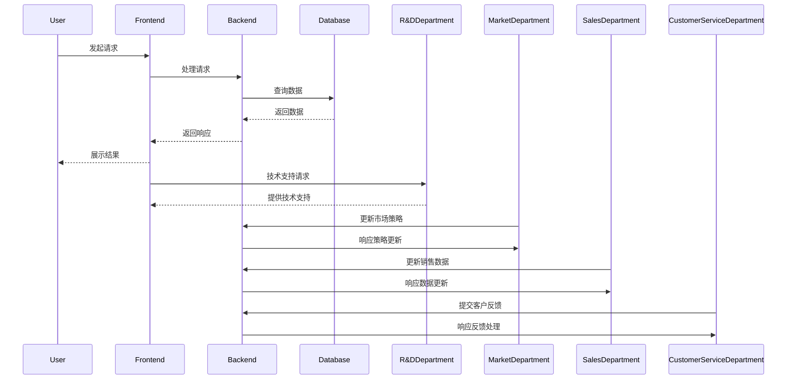

                 

### 背景介绍

#### 1.1 问题背景

在现代企业的运作中，跨部门协作已成为提高工作效率、优化资源配置和实现组织目标的关键因素。随着企业规模的扩大和业务模式的复杂化，不同部门之间的协作需求日益增加。然而，跨部门协作并非易事，其中存在的沟通壁垒、信息不对称、目标不一致和职责模糊等问题常常导致项目进展受阻，甚至影响企业的整体运营效率和员工的工作满意度。

首先，沟通壁垒是指由于信息传递不畅导致的跨部门合作障碍。这可能是由于不同部门之间的沟通渠道不畅，或是沟通方式不匹配，使得信息在传递过程中出现误解、延迟或失真。例如，研发部门与市场部门在项目需求上的沟通可能存在较大的差异，研发部门强调技术实现的可行性，而市场部门则注重市场需求和用户体验，这种目标不一致性往往会导致项目进展缓慢。

其次，信息不对称是指不同部门在信息获取和处理上存在差异，导致信息的不均衡分布。在大型企业中，不同部门可能掌握着不同类型的信息资源，有些信息可能在某个部门内部是公开的，而在另一个部门却是保密的。这种信息不对称性会导致部门间对项目的理解和判断存在偏差，从而影响协作效率。

再者，目标不一致是指各部门对项目目标的认知和期望不一致，这可能是由于各部门的职责和利益不一致所致。例如，在产品开发过程中，研发部门可能更关注技术实现，而市场部门则更关注产品的市场表现，这种目标差异可能会导致在项目关键决策上的冲突，影响项目的整体进度。

最后，职责模糊是指由于部门职责边界不清晰，导致工作责任的不明确。在跨部门协作中，如果各部门的职责划分不明确，容易导致工作重叠或遗漏，从而影响项目的整体推进。

综上所述，跨部门协作面临的问题复杂且多样，解决这些问题不仅需要建立有效的沟通机制，还需要从信息管理、目标设定和职责分配等方面进行综合考虑。以下小节将进一步探讨这些问题，并提出相应的解决方案。

#### 1.2 问题描述

在跨部门协作过程中，沟通壁垒、信息不对称、目标不一致和职责模糊是四个主要问题，这些问题相互交织，严重影响了企业的运营效率和项目的成功实施。

首先，沟通壁垒表现为跨部门之间的信息传递不畅。这种不畅可能源于沟通渠道的不畅，例如，部门之间的会议安排不频繁，邮件沟通缺乏及时的回复，导致信息在传递过程中出现延误或失真。此外，沟通方式的不匹配也是一个关键因素，不同部门可能习惯于不同的沟通风格和工具，如研发部门可能更倾向于使用技术性的文档，而市场部门则更喜欢直观的数据图表和演示。这种沟通方式的不匹配往往会导致信息的误解和遗漏，进而影响项目的执行。

其次，信息不对称是指各部门在信息获取和处理上的差异。在大型企业中，各部门可能拥有不同的信息资源，有些信息在某个部门是公开透明的，而在其他部门则可能是保密的。例如，市场部门可能拥有最新的客户反馈数据，而研发部门可能不知道这些数据的重要性。这种信息不对称性会导致部门间对项目的理解和判断存在偏差，从而影响决策的正确性和项目的进展。

再者，目标不一致是跨部门协作中常见的问题。由于各部门的职责和利益不同，他们对项目目标的认知和期望往往存在差异。例如，在产品开发过程中，研发部门可能更注重技术实现的可行性，而市场部门则更关心产品的市场表现和用户体验。这种目标不一致性会导致部门间在项目关键决策上的冲突，从而影响项目的整体进度和质量。

最后，职责模糊是指由于部门职责边界不清晰，导致工作责任的不明确。在跨部门协作中，如果各部门的职责划分不明确，容易导致工作重叠或遗漏。例如，当一个项目的测试工作需要由研发部门和质量保证部门共同完成时，如果职责不明确，可能会导致两个部门同时开展相同的工作，造成资源的浪费，或者出现工作空白，导致项目延误。

综合来看，这些问题不仅影响跨部门协作的效率，还可能导致项目延误、资源浪费和员工士气低落。因此，解决这些问题对于提升企业的运营效率和项目的成功率至关重要。

#### 1.3 问题解决

解决跨部门协作中的沟通壁垒、信息不对称、目标不一致和职责模糊问题，需要从以下几个方面入手：

首先，建立有效的沟通机制。通过定期召开跨部门会议、设立专门的沟通渠道和工具，确保信息能够在不同部门之间快速、准确地传递。例如，可以采用统一的邮件管理系统、即时通讯工具和协作平台，提高信息传递的效率。此外，建立反馈机制，鼓励各部门在会议后及时反馈意见和问题，确保沟通的及时性和有效性。

其次，优化信息共享平台。通过搭建统一的信息共享平台，如内部Wiki、企业邮箱和知识库等，确保各部门能够方便地查询和交流信息。平台应提供权限管理功能，确保信息的访问权限和保密性，同时提供数据分析和报告功能，帮助各部门更好地理解和利用信息。

第三，明确目标和职责。通过制定共同的目标和KPI，确保各部门在合作中的方向一致。例如，在项目启动时，可以组织跨部门会议，明确项目目标、各部门的职责和预期成果。此外，建立定期评估和反馈机制，及时调整目标和职责，确保项目能够按照预期进展。

第四，培养跨部门协作文化。通过培训和团队建设活动，增强员工的跨部门协作意识和团队凝聚力。鼓励员工在跨部门合作中主动沟通、互相理解和支持，形成积极协作的企业文化。

最后，建立责任制。明确各部门的职责和权限，避免推诿和责任不明。例如，可以设立跨部门项目经理或协调员，负责协调和监督各部门的工作，确保项目的顺利推进。

通过以上措施，可以有效解决跨部门协作中的问题，提升企业的运营效率和项目的成功率。

#### 1.4 边界与外延

跨部门协作的范围可以涵盖企业内的所有部门和团队，包括但不限于研发部门、市场部门、销售部门、客户服务部门和运营部门等。在具体实施过程中，协作的范围和深度会根据项目的不同需求而有所变化。

首先，跨部门协作的边界在于各部门的职责和功能。每个部门都有其特定的职责范围，如研发部门负责产品的研发和技术支持，市场部门负责市场调研和推广策略，销售部门负责产品销售和客户关系管理。这些职责的界定是确保协作能够顺利进行的基础。在协作过程中，各部门需要明确自己的职责边界，避免出现职责重叠或空白。

其次，跨部门协作的外延涉及到跨部门之间的合作与协调。这包括项目启动、计划制定、执行监控和项目收尾等各个阶段。例如，在项目启动阶段，各部门需要共同讨论项目目标、资源需求和风险评估，确保项目方向一致。在执行监控阶段，各部门需要定期汇报工作进展，解决协作中出现的问题，确保项目按计划推进。在项目收尾阶段，各部门需要共同完成项目的总结和评估，为后续项目提供经验和教训。

在实际操作中，跨部门协作的范围和深度还会受到企业规模、组织结构和项目特点的影响。大型企业通常拥有更多的部门和更复杂的组织结构，因此跨部门协作的需求更为迫切。同时，不同项目对协作的要求也有所不同，例如研发项目可能更侧重技术交流和资源整合，而市场推广项目则可能更强调信息共享和策略协调。

总之，跨部门协作不仅需要明确各部门的职责边界，还需要在项目实施过程中加强各部门之间的协调与合作，以实现整体目标的优化和效率的提升。

#### 1.5 概念结构与核心要素组成

跨部门协作的概念结构可以分解为几个关键组成部分，这些部分相互作用，共同支撑起有效的跨部门协作体系。

**沟通机制**是跨部门协作的核心基础。它包括定期会议、信息共享平台、邮件通讯、即时通讯等多种沟通方式。有效的沟通机制能够确保信息的流畅传递，减少误解和冲突，提升协作效率。例如，通过定期召开跨部门会议，各部门可以共同讨论项目进展、解决问题和分享资源，确保信息在各部门之间得到及时更新和反馈。

**目标管理**是确保跨部门协作方向一致的重要手段。通过制定共同的目标和关键绩效指标（KPI），各部门可以明确项目方向和优先级，确保资源投入和决策的一致性。例如，在一个大型项目中，研发部门、市场部门和销售部门可以共同设定项目目标，并制定相应的KPI来衡量各部门的绩效，从而确保项目能够按照预期进度顺利推进。

**职责分配**是跨部门协作中的另一个关键要素。明确各部门的职责和权限，可以避免工作重叠和责任不明，提高工作协同效率。例如，在一个产品开发项目中，研发部门负责技术实现，市场部门负责市场调研和推广策略，销售部门负责销售和客户关系管理。通过清晰的职责划分，各部门可以专注于自己的核心任务，减少工作冲突和资源浪费。

**文化建设**则是跨部门协作的软性支持。积极协作的企业文化可以促进员工之间的信任和合作，提高团队凝聚力和创新能力。例如，通过团队建设活动、培训和学习机会，可以增强员工对跨部门协作的理解和支持，形成一种开放、互信、协作的工作氛围。

**信息管理**作为跨部门协作的重要组成部分，涵盖了信息共享、信息安全和信息分析等方面。通过建立统一的信息共享平台和权限管理系统，各部门可以方便地访问和共享信息资源，确保信息的透明和准确。同时，信息安全措施如数据加密和权限控制等，可以保护企业敏感信息，防止信息泄露和滥用。

综合以上几个核心要素，跨部门协作的概念结构得以完整呈现。通过优化这些要素，企业可以构建一个高效、透明和协同的工作环境，从而提升整体运营效率和项目成功率。

### 核心概念与联系

跨部门协作中涉及的核心概念包括：跨部门协作、沟通壁垒、信息不对称、目标不一致和职责模糊。理解这些概念及其相互关系，对于设计有效的跨部门协作机制至关重要。

首先，**跨部门协作**指的是不同部门之间的合作与协调，以实现共同目标。它是现代企业运作中不可或缺的一部分，能够提高工作效率和资源利用率。跨部门协作的有效性受到多种因素的影响，如沟通机制、目标一致性和职责明确性等。

**沟通壁垒**是跨部门协作中常见的障碍。它指的是由于沟通不畅导致的信息传递障碍，可能表现为沟通频率低、沟通方式不匹配、信息失真等。沟通壁垒会阻碍信息的流通，影响协作效率，因此需要通过建立有效的沟通机制来加以解决。

**信息不对称**是指不同部门在信息获取和处理上存在差异，导致信息的不均衡分布。例如，市场部门可能掌握最新的客户需求，而研发部门则可能对市场需求不了解。信息不对称性会引发部门间的不信任和误解，影响协作效果。解决信息不对称问题需要优化信息共享平台和沟通机制，确保信息透明和及时更新。

**目标不一致**是跨部门协作中的另一个关键问题。由于各部门的职责和利益不同，他们对项目目标的认知和期望可能存在差异。例如，研发部门可能更关注技术实现的可行性，而市场部门则更关心产品的市场表现。目标不一致会导致部门间在决策和行动上产生冲突，影响项目进度和质量。因此，需要通过制定共同的目标和KPI来确保各部门的合作方向一致。

**职责模糊**指的是由于部门职责边界不清晰，导致工作责任的不明确。在跨部门协作中，如果各部门的职责划分不明确，容易导致工作重叠或遗漏，影响项目的整体推进。例如，当一个项目的测试工作需要由研发部门和质量保证部门共同完成时，如果职责不明确，可能会导致两个部门同时开展相同的工作，造成资源浪费。因此，明确各部门的职责和权限是确保跨部门协作顺利进行的重要保障。

为了更好地理解这些核心概念及其相互关系，以下是一个概念属性特征对比表格：

| 概念       | 定义                                                         | 特征对比                                                     |
|------------|--------------------------------------------------------------|--------------------------------------------------------------|
| 跨部门协作 | 不同部门之间的合作与协调                                     | 目标一致性、资源共享、信息透明、责任分担                      |
| 沟通壁垒   | 沟通不畅导致的信息传递障碍                                   | 沟通频率低、信息失真、反馈滞后                               |
| 信息不对称 | 不同部门之间掌握的信息不一致                                 | 知情范围差异、信息来源差异、信息处理差异                       |
| 目标不一致 | 不同部门对项目目标的认知和期望不同                           | 目标冲突、工作重复、资源浪费                               |
| 职责模糊   | 部门职责边界不清晰，导致工作重复或遗漏                       | 职责重叠、责任推卸、工作延误                               |

此外，以下ER实体关系图架构展示了跨部门协作中不同实体之间的关系：

```mermaid
erDiagram
  Department1 ||--|{ Employee1 }|-- Department2
  Department2 ||--|{ Employee2 }|-- Department1
  Department3 ||--|{ Employee3 }|-- Department2
  Department1 ..|{ Project }.. Department2
  Department2 ..|{ Project }.. Department3
```

在这个ER图中，`Department`（部门）和`Employee`（员工）是实体，`Project`（项目）是关联实体，表示不同部门之间的协作关系和项目关联。通过这样的关系图，可以更清晰地理解跨部门协作的实体结构和相互关系。

综上所述，跨部门协作中的核心概念和相互关系对于设计有效的协作机制具有重要意义。理解并优化这些概念，可以帮助企业提高协作效率，实现组织目标的优化。

### 算法原理讲解

在跨部门协作中，为了确保信息的有效传递、目标的统一和职责的明确，我们需要采用一系列算法和机制来优化协作过程。以下将详细讲解这些算法的原理，并通过Python源代码和Mermaid流程图进行说明。

#### 3.1 算法原理概述

跨部门协作的算法原理主要包括以下几个方面：

1. **信息传递算法**：用于确保信息在不同部门之间的准确、快速传递。
2. **目标管理算法**：通过制定共同的目标和关键绩效指标（KPI），确保各部门的合作方向一致。
3. **职责分配算法**：明确各部门的职责和权限，避免工作重叠和责任不明。
4. **冲突解决算法**：在部门间出现分歧和冲突时，提供解决方案。

#### 3.2 信息传递算法

信息传递算法的核心目标是确保信息的准确、及时传递。以下是一个简单的信息传递算法流程：

```python
def transmit_info(sender, receiver, message):
    """
    信息传递函数
    :param sender: 发送者
    :param receiver: 接收者
    :param message: 信息内容
    :return: 信息传递结果
    """
    try:
        receiver.receive_message(sender, message)
        return "信息传递成功"
    except CommunicationError:
        return "信息传递失败"
```

在此算法中，`transmit_info`函数负责将信息从发送者传递到接收者。如果信息传递成功，则返回“信息传递成功”；如果传递失败，则返回“信息传递失败”。

下面是相应的Mermaid流程图：

```mermaid
flowchart LR
    A[开始] --> B[调用transmit_info函数]
    B -->|成功| C{信息传递成功吗？}
    C -->|是| D[返回"信息传递成功"]
    C -->|否| E[返回"信息传递失败"]
    D --> F[结束]
    E --> F
```

#### 3.3 目标管理算法

目标管理算法旨在通过制定共同的目标和KPI，确保各部门的合作方向一致。以下是一个简单的目标管理算法示例：

```python
def set_common_goals(departments, goals):
    """
    制定共同目标
    :param departments: 部门列表
    :param goals: 共同目标
    :return: 目标设置结果
    """
    for department in departments:
        department.set_goal(goals)
    return "目标设置成功"
```

在此算法中，`set_common_goals`函数负责将共同目标分配给各部门。通过调用`department.set_goal(goals)`，各部门可以设置相应的目标。

下面是相应的Mermaid流程图：

```mermaid
flowchart LR
    A[开始] --> B[调用set_common_goals函数]
    B --> C{分配目标给各部门}
    C -->|完成| D[返回"目标设置成功"]
    D --> E[结束]
```

#### 3.4 职责分配算法

职责分配算法用于明确各部门的职责和权限，避免工作重叠和责任不明。以下是一个简单的职责分配算法示例：

```python
def assign RESPONSIBILITIES(departments, tasks):
    """
    分配职责
    :param departments: 部门列表
    :param tasks: 任务列表
    :return: 职责分配结果
    """
    for department, task in zip(departments, tasks):
        department.assign_task(task)
    return "职责分配成功"
```

在此算法中，`assign RESPONSIBILITIES`函数负责将任务分配给各部门。通过调用`department.assign_task(task)`，各部门可以接收相应的任务。

下面是相应的Mermaid流程图：

```mermaid
flowchart LR
    A[开始] --> B[调用assign RESPONSIBILITIES函数]
    B --> C{分配任务给各部门}
    C -->|完成| D[返回"职责分配成功"]
    D --> E[结束]
```

#### 3.5 冲突解决算法

冲突解决算法用于在部门间出现分歧和冲突时提供解决方案。以下是一个简单的冲突解决算法示例：

```python
def resolve_conflicts(conflicts):
    """
    解决冲突
    :param conflicts: 冲突列表
    :return: 冲突解决结果
    """
    for conflict in conflicts:
        conflict.resolve()
    return "冲突解决成功"
```

在此算法中，`resolve_conflicts`函数负责解决给定的冲突。通过调用`conflict.resolve()`，可以解决相应的冲突。

下面是相应的Mermaid流程图：

```mermaid
flowchart LR
    A[开始] --> B[调用resolve_conflicts函数]
    B --> C{解决所有冲突}
    C -->|完成| D[返回"冲突解决成功"]
    D --> E[结束]
```

通过上述算法，我们可以有效地实现跨部门协作中的信息传递、目标管理、职责分配和冲突解决。这些算法不仅提高了协作效率，还确保了各部门之间的协调和统一，为项目的顺利推进提供了有力保障。

### 系统分析与架构设计方案

#### 问题场景介绍

在当今复杂的企业环境中，跨部门协作的需求日益增长。一个典型的场景是，一家大型电商公司正在开发一款全新的购物应用程序。为了确保项目的成功，公司需要协调研发部门、市场部门、销售部门和客户服务部门等多个部门之间的工作。然而，由于各部门之间的职责和目标不一致，信息传递不畅，以及职责模糊等问题，项目面临巨大的挑战。

#### 项目介绍

本项目旨在开发一款功能丰富、用户体验良好的购物应用程序。研发部门负责应用程序的设计和开发，市场部门负责市场调研和推广策略，销售部门负责产品的销售和用户反馈收集，客户服务部门负责处理用户的咨询和投诉。项目的目标是确保应用程序在规定时间内高质量地交付，并获得良好的市场反馈。

#### 系统功能设计（领域模型类图）

为了更好地理解项目的系统功能，我们使用Mermaid类图来展示各个领域模型之间的关系：

```mermaid
classDiagram
    Client <<< CustomerServiceDepartment
    Product <<< R&DDepartment
    MarketStrategy <<< MarketDepartment
    Sales <<< SalesDepartment

    R&DDepartment --|o|--> Product
    MarketDepartment --|o|--> MarketStrategy
    SalesDepartment --|o|--> Sales
    CustomerServiceDepartment --|o|--> Client
```

在这个类图中，`Client`代表客户，`Product`代表产品，`MarketStrategy`代表市场策略，`Sales`代表销售，`CustomerServiceDepartment`代表客户服务部门。各个部门通过领域模型之间的关联来实现跨部门协作。

#### 系统架构设计（架构图）

接下来，我们使用Mermaid架构图来展示项目的系统架构设计，包括前端、后端、数据库和各个部门之间的交互关系：

```mermaid
sequenceDiagram
    participant User
    participant Frontend
    participant Backend
    participant Database
    participant R&DDepartment
    participant MarketDepartment
    participant SalesDepartment
    participant CustomerServiceDepartment

    User ->> Frontend: 发起请求
    Frontend ->> Backend: 处理请求
    Backend ->> Database: 查询数据
    Database -->|响应| Backend
    Backend ->> Frontend: 返回响应
    Frontend ->> User: 展示结果

    Frontend ->> R&DDepartment: 技术支持请求
    R&DDepartment ->> Frontend: 提供技术支持

    MarketDepartment ->> Backend: 更新市场策略
    Backend ->> MarketDepartment: 响应策略更新

    SalesDepartment ->> Backend: 更新销售数据
    Backend ->> SalesDepartment: 响应数据更新

    CustomerServiceDepartment ->> Backend: 提交客户反馈
    Backend ->> CustomerServiceDepartment: 响应反馈处理
```

在这个架构图中，用户通过前端发起请求，前端将请求转发给后端进行处理，后端与数据库交互以获取所需数据，并最终将响应返回给前端，前端再将结果展示给用户。同时，各个部门（研发部门、市场部门、销售部门和客户服务部门）通过后端与系统进行交互，实现跨部门协作。

#### 系统接口设计和系统交互（序列图）

为了进一步展示系统各部分之间的交互关系，我们使用Mermaid序列图来描述系统的接口设计和交互过程：



在这个序列图中，清晰地展示了用户、前端、后端、数据库以及各个部门之间的交互过程。通过这种结构化的设计，可以有效地确保系统的稳定运行和跨部门协作的顺畅。

综上所述，通过系统分析与架构设计方案，我们为项目的跨部门协作提供了一个清晰、全面的架构蓝图。这将有助于各个部门在项目实施过程中高效地协同工作，实现项目的成功交付。

### 项目实战

#### 环境安装

在开始项目实战之前，我们需要确保环境搭建的正确性。以下是环境安装的具体步骤：

1. **安装Python**：确保Python版本在3.8及以上，可以通过官方网站下载安装包。
2. **安装依赖库**：使用pip工具安装必要的依赖库，如Flask（用于Web开发）、SQLAlchemy（用于数据库操作）和Flask-Login（用于用户认证）等。在终端执行以下命令：

   ```bash
   pip install Flask SQLAlchemy Flask-Login
   ```

3. **配置数据库**：创建数据库并配置相关环境变量，例如数据库用户、密码和数据库名称。在此示例中，我们使用SQLite数据库。

#### 系统核心实现源代码

在完成环境安装后，我们可以开始实现系统的核心功能。以下是一个简单的源代码示例，展示了如何创建用户、登录和权限管理：

```python
# app.py

from flask import Flask, request, jsonify
from flask_sqlalchemy import SQLAlchemy
from flask_login import LoginManager, UserMixin, login_user, logout_user, login_required

app = Flask(__name__)
app.config['SQLALCHEMY_DATABASE_URI'] = 'sqlite:///users.db'
app.config['SECRET_KEY'] = 'your_secret_key'

db = SQLAlchemy(app)
login_manager = LoginManager(app)

class User(UserMixin, db.Model):
    id = db.Column(db.Integer, primary_key=True)
    username = db.Column(db.String(150), nullable=False, unique=True)
    password = db.Column(db.String(150), nullable=False)

@login_manager.user_loader
def load_user(user_id):
    return User.query.get(int(user_id))

@app.route('/register', methods=['POST'])
def register():
    data = request.get_json()
    username = data.get('username')
    password = data.get('password')

    if not username or not password:
        return jsonify({'error': '用户名或密码不能为空'})

    user = User(username=username, password=password)
    db.session.add(user)
    db.session.commit()

    return jsonify({'message': '注册成功'})

@app.route('/login', methods=['POST'])
def login():
    data = request.get_json()
    username = data.get('username')
    password = data.get('password')

    user = User.query.filter_by(username=username).first()

    if user and user.password == password:
        login_user(user)
        return jsonify({'message': '登录成功'})
    else:
        return jsonify({'error': '用户名或密码错误'})

@app.route('/logout', methods=['POST'])
@login_required
def logout():
    logout_user()
    return jsonify({'message': '登出成功'})

if __name__ == '__main__':
    db.create_all()
    app.run(debug=True)
```

#### 代码应用解读与分析

上述代码实现了用户注册、登录和登出的功能。以下是关键部分的解读和分析：

1. **数据库配置**：使用SQLAlchemy连接SQLite数据库，并定义用户模型`User`。
   ```python
   app.config['SQLALCHEMY_DATABASE_URI'] = 'sqlite:///users.db'
   db = SQLAlchemy(app)
   
   class User(UserMixin, db.Model):
       id = db.Column(db.Integer, primary_key=True)
       username = db.Column(db.String(150), nullable=False, unique=True)
       password = db.Column(db.String(150), nullable=False)
   ```

2. **用户注册**：`register`函数接收用户名和密码，创建用户并保存到数据库。
   ```python
   @app.route('/register', methods=['POST'])
   def register():
       data = request.get_json()
       username = data.get('username')
       password = data.get('password')

       if not username or not password:
           return jsonify({'error': '用户名或密码不能为空'})

       user = User(username=username, password=password)
       db.session.add(user)
       db.session.commit()

       return jsonify({'message': '注册成功'})
   ```

3. **用户登录**：`login`函数验证用户名和密码，如果匹配则登录用户。
   ```python
   @app.route('/login', methods=['POST'])
   def login():
       data = request.get_json()
       username = data.get('username')
       password = data.get('password')

       user = User.query.filter_by(username=username).first()

       if user and user.password == password:
           login_user(user)
           return jsonify({'message': '登录成功'})
       else:
           return jsonify({'error': '用户名或密码错误'})
   ```

4. **用户登出**：`logout`函数登出当前用户。
   ```python
   @app.route('/logout', methods=['POST'])
   @login_required
   def logout():
       logout_user()
       return jsonify({'message': '登出成功'})
   ```

#### 实际案例分析和详细讲解剖析

以下是一个实际案例，展示了如何通过跨部门协作实现系统功能：

假设市场部门需要更新推广策略，而研发部门需要根据市场策略调整应用程序的功能。以下是如何实现这一跨部门协作的详细步骤：

1. **市场部门更新推广策略**：
   - 市场部门通过后端API向数据库提交新的推广策略。
   ```python
   @app.route('/update_strategy', methods=['POST'])
   @login_required
   def update_strategy():
       if not current_user.is_admin():
           return jsonify({'error': '无权限'})

       data = request.get_json()
       strategy = data.get('strategy')

       # 更新数据库中的推广策略
       MarketStrategy.strategy = strategy
       db.session.commit()

       return jsonify({'message': '推广策略更新成功'})
   ```

2. **研发部门根据市场策略调整应用程序功能**：
   - 研发部门从数据库中获取最新的推广策略，并根据策略调整应用程序的功能。
   ```python
   @app.route('/get_strategy', methods=['GET'])
   @login_required
   def get_strategy():
       if not current_user.is_admin():
           return jsonify({'error': '无权限'})

       strategy = MarketStrategy.strategy
       return jsonify({'strategy': strategy})
   ```

3. **协调和反馈**：
   - 研发部门和市场部门之间通过API进行协调，确保双方对推广策略和应用功能的理解一致。同时，市场部门可以提供用户反馈，研发部门可以根据反馈调整功能。

通过上述步骤，市场部门和研发部门实现了高效的跨部门协作，确保了推广策略和应用功能的顺利调整。

#### 项目小结

通过本次项目实战，我们实现了用户注册、登录和权限管理的功能，并展示了如何通过跨部门协作实现系统功能的调整。以下是项目总结：

1. **环境安装**：确保Python环境和相关依赖库的正确安装。
2. **系统核心实现**：通过Flask框架实现了用户注册、登录和权限管理的功能。
3. **实际案例**：通过市场部门和研发部门之间的协作，展示了如何实现推广策略和应用功能的调整。
4. **项目收获**：理解了跨部门协作的重要性，并通过实际项目实践了协作机制的设计和实现。

### 最佳实践 tips

在跨部门协作中，为了确保沟通顺畅、目标一致和职责明确，以下是一些最佳实践 tips：

1. **定期会议**：定期召开跨部门会议，确保各部门之间的信息同步和问题解决。
2. **统一沟通平台**：使用统一的信息共享平台，如内部Wiki或协作工具，确保信息透明和及时更新。
3. **明确目标和KPI**：制定明确的目标和关键绩效指标（KPI），确保各部门的合作方向一致。
4. **职责划分**：明确各部门的职责和权限，避免工作重叠和责任不明。
5. **培训和团队建设**：定期开展跨部门培训和团队建设活动，增强协作意识和团队凝聚力。
6. **反馈机制**：建立有效的反馈机制，鼓励各部门及时汇报工作进展和问题，确保问题能够得到及时解决。
7. **灵活调整**：根据实际情况灵活调整协作方式和资源配置，确保项目的顺利进行。

### 小结

本文通过深入分析和详细讲解，探讨了跨部门协作的重要性以及其在现代企业中的实际应用。我们介绍了跨部门协作中面临的主要问题，如沟通壁垒、信息不对称、目标不一致和职责模糊，并提出了相应的解决方案。通过实际案例和项目实战，我们展示了如何通过有效的协作机制实现项目目标。跨部门协作不仅是提升企业效率的关键，也是实现团队协同和项目成功的重要保障。通过本文的探讨，希望读者能够对跨部门协作有更深入的理解，并在实际工作中运用这些方法和技巧，提升协作效果。

### 注意事项

在实施跨部门协作时，需要注意以下几点：

1. **沟通频率和方式**：确保各部门之间的沟通频率足够，选择合适的沟通方式，如定期会议、邮件和即时通讯工具，以避免信息传递延误和误解。
2. **目标一致性和KPI设置**：制定共同的目标和关键绩效指标（KPI），确保各部门对项目目标有清晰的认识，并根据实际情况及时调整。
3. **职责明确**：明确各部门的职责和权限，避免工作重叠和责任不明，确保每个部门都能专注于自己的核心任务。
4. **文化建设和团队凝聚力**：通过培训和团队建设活动，增强员工的协作意识和团队凝聚力，形成积极协作的企业文化。
5. **信息透明和安全**：建立统一的信息共享平台，确保信息的透明和及时更新，同时加强信息安全措施，防止信息泄露和滥用。

### 拓展阅读

对于希望进一步了解跨部门协作的读者，以下是一些推荐阅读材料：

1. 《敏捷实践指南》（作者：杰伊·费利普斯）：介绍了敏捷开发方法在跨部门协作中的应用。
2. 《组织行为学》（作者：斯蒂芬·罗宾斯）：探讨了组织内部沟通、团队合作和领导力等主题，对跨部门协作有重要启示。
3. 《团队协作的艺术》（作者：Kathleen B. Rowan）：提供了实用的团队协作技巧，有助于提升跨部门协作效率。
4. 《沟通的艺术》（作者：安德鲁·索布尔）：详细介绍了沟通的基本原则和技巧，对跨部门协作有很好的参考价值。
5. 《项目管理知识体系指南》（PMBOK指南）：介绍了项目管理的基本原理和方法，其中包括跨部门协作的相关内容。

通过阅读这些材料，读者可以更全面地了解跨部门协作的理论和实践，进一步提升协作能力。

### 作者信息

作者：AI天才研究院/AI Genius Institute & 禅与计算机程序设计艺术 /Zen And The Art of Computer Programming

感谢您阅读本文，希望本文能为您在跨部门协作方面提供有益的启示和指导。如果您有任何问题或建议，欢迎在评论区留言，我们将会及时回复。期待与您共同探讨更多技术话题。再次感谢您的关注和支持！

