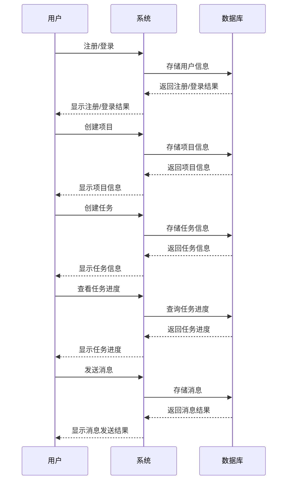

                 

# 远程团队凝聚：克服物理距离的策略

## 关键词

- 远程团队
- 物理距离
- 沟通障碍
- 协作效率
- 团队归属感
- 远程项目管理

## 摘要

随着全球化进程的加速和互联网技术的不断进步，远程团队协作已成为现代企业运营的重要组成部分。然而，物理距离的隔阂给团队带来了沟通障碍、协作效率低下、成员归属感降低等问题。本文将探讨如何通过建立有效的沟通机制、优化协作流程、强化团队文化建设和改进项目管理方法，克服物理距离，提升远程团队的凝聚力和效率。

## 第1章 引言

### 1.1 问题背景

现代工作环境中，远程团队协作已经成为一种普遍现象。全球化的发展使得跨国企业需要在不同地区建立团队，互联网技术的进步为远程协作提供了便利，而企业对灵活办公需求的增加也促使远程工作模式的普及。然而，远程团队协作面临着诸多挑战，物理距离的隔阂是一个不容忽视的问题。

### 1.2 问题描述

远程团队协作中面临的主要问题包括：

1. **沟通障碍**：缺乏面对面交流的机会，容易导致信息传递不准确、不及时。
2. **协作效率低下**：不同时区的协作、工作流程的不一致，影响团队的整体效率。
3. **成员归属感**：长期远程工作，成员之间的情感连接减弱，归属感降低。
4. **项目管理**：远程项目管理难度增加，监督和激励团队成员变得复杂。

### 1.3 问题解决

为了解决上述问题，需要从以下几个方面入手：

1. **建立有效的沟通机制**：利用现代化沟通工具，如视频会议、即时通讯、协作平台等，提高沟通效率。
2. **优化协作流程**：通过明确的工作流程、标准化操作，减少协作中的不确定性。
3. **强化团队文化建设**：通过在线团建活动、定期的线上交流，增强团队成员之间的情感连接。
4. **改进项目管理方法**：采用远程项目管理工具，实时监控项目进度，确保团队能够高效运作。

### 1.4 边界与外延

远程团队协作涉及多个方面，包括团队管理、沟通技术、协作工具等。本文将围绕如何克服物理距离，提升远程团队的凝聚力和效率展开讨论。

### 1.5 概念结构与核心要素组成

1. **远程团队**：由地理位置分散的成员组成的团队。
2. **物理距离**：团队成员之间的空间距离。
3. **沟通机制**：团队内部信息交流的方式和手段。
4. **协作工具**：支持团队协作的软件和硬件。
5. **团队文化**：团队内部共享的价值观念和行为规范。

## 第2章 核心概念与联系

### 2.1 概念原理

#### 2.1.1 远程团队

远程团队是指通过互联网或其他通信技术，成员在不同地理位置上协作完成共同目标的团队。这种团队模式克服了物理距离的限制，为现代企业提供了灵活性。

#### 2.1.2 沟通机制

沟通机制是指团队内部成员进行信息交流的方式。有效的沟通机制能够提高团队协作效率，确保信息准确传递。

#### 2.1.3 协作工具

协作工具是支持远程团队协作的软件和硬件。这些工具包括视频会议软件、即时通讯工具、项目管理平台等。

### 2.2 概念属性特征对比表格

| 概念       | 特征1         | 特征2         | 特征3         |
|------------|---------------|---------------|---------------|
| 远程团队   | 分布在不同地理位置 | 利用通信技术协作 | 目标一致性     |
| 沟通机制   | 信息传递及时     | 信息准确无误   | 多样性沟通方式 |
| 协作工具   | 功能多样性      | 用户友好性     | 高效性        |

### 2.3 ER实体关系图架构

```mermaid
erDiagram
  Member ||--|{ Team }|| TeamMember
  Communication ||--|{ Team }|| CommunicationTeam
  Tool ||--|{ Team }|| TeamTool
  TeamMember ||--|{ Member }|| MemberDetail
  CommunicationTeam ||--|{ Communication }|| CommunicationDetail
  TeamTool ||--|{ Tool }|| ToolDetail
```

## 第3章 远程团队协作工具与技术

### 3.1 远程团队协作工具

#### 3.1.1 视频会议软件

视频会议软件是远程团队协作的核心工具之一。通过视频会议，团队成员可以实时交流、讨论和协作。

#### 3.1.2 即时通讯工具

即时通讯工具提供即时消息传递功能，便于团队成员之间的快速沟通。

#### 3.1.3 项目管理平台

项目管理平台可以帮助团队跟踪项目进度、分配任务、管理资源等，提高团队协作效率。

### 3.2 远程团队协作技术

#### 3.2.1 云计算技术

云计算技术为远程团队提供了强大的计算能力和数据存储能力，支持大规模协作。

#### 3.2.2 物联网技术

物联网技术通过连接各种设备，实现了数据的实时共享和智能化管理，提升了团队协作的效率。

### 第4章 建立有效的沟通机制

#### 4.1 视频会议软件的选择与优化

选择一款适合远程团队的视频会议软件至关重要。常见的视频会议软件有Zoom、Microsoft Teams、Google Meet等。为了提高沟通效率，团队需要根据实际需求选择合适的软件，并对软件的功能进行优化，如调整画质、音频设置等。

#### 4.2 即时通讯工具的运用

即时通讯工具如Slack、WhatsApp等，可以方便团队成员进行实时沟通。团队需要制定明确的沟通规范，如设定工作时间和休息时间，避免过度打扰。

#### 4.3 电子邮件沟通策略

电子邮件作为一种传统的沟通方式，仍具有其独特的优势。团队可以制定电子邮件沟通模板，规范邮件格式，提高信息传递的准确性和效率。

### 第5章 优化协作流程

#### 5.1 工作流程的标准化

为了提高协作效率，团队需要制定标准化的工作流程。包括项目立项、任务分配、进度跟踪、成果验收等各个环节。

#### 5.2 任务管理的数字化

使用任务管理工具如Jira、Trello等，可以方便地分配任务、跟踪进度、统计工作量，确保项目按计划进行。

#### 5.3 协作工具的整合

将各种协作工具整合到一个平台，如企业微信、钉钉等，可以实现信息的统一管理和沟通的集中处理，提高协作效率。

### 第6章 强化团队文化建设

#### 6.1 在线团建活动

定期组织在线团建活动，如在线游戏、知识竞赛等，可以增强团队成员之间的情感连接。

#### 6.2 定期线上交流

设立定期的线上交流会议，如每周例会、每月总结等，可以让团队成员分享工作心得、交流经验，提升团队凝聚力。

#### 6.3 鼓励反馈与建议

鼓励团队成员提出反馈和建议，建立开放、透明的沟通环境，促进团队不断改进和进步。

### 第7章 改进项目管理方法

#### 7.1 远程项目管理工具的应用

使用远程项目管理工具如Asana、Monday等，可以实时监控项目进度、管理资源、协调团队成员的工作。

#### 7.2 项目目标的明确化

确保项目目标明确、具体、可量化，便于团队成员理解和执行。

#### 7.3 团队成员的监督与激励

通过远程项目管理工具，对团队成员的工作进行监督和评估，及时给予激励和反馈，确保项目目标的实现。

### 第8章 总结与展望

远程团队协作在现代企业运营中具有重要意义。通过建立有效的沟通机制、优化协作流程、强化团队文化建设和改进项目管理方法，可以克服物理距离的隔阂，提升团队的凝聚力和效率。未来，随着技术的不断进步，远程团队协作将更加智能化、高效化，为企业创造更多的价值。

## 作者信息

作者：AI天才研究院/AI Genius Institute & 禅与计算机程序设计艺术 /Zen And The Art of Computer Programming

## 附录

### 附录A：核心概念与联系详细解析

#### 2.1 概念原理

**远程团队**：

远程团队是指由地理位置分散的成员组成的团队，通过互联网或其他通信技术进行协作。远程团队的核心特征在于成员之间的物理距离，这导致了沟通障碍和协作效率的降低。然而，通过合理运用通信技术和协作工具，远程团队可以实现高效协作，达到共同目标。

**沟通机制**：

沟通机制是指团队内部成员进行信息交流的方式和手段。有效的沟通机制能够提高团队协作效率，确保信息准确传递。沟通机制包括口头沟通、书面沟通、非言语沟通等多种形式。在现代远程团队中，视频会议、即时通讯、电子邮件等工具是常用的沟通方式。

**协作工具**：

协作工具是支持远程团队协作的软件和硬件。这些工具包括视频会议软件、即时通讯工具、项目管理平台等。协作工具能够帮助团队成员共享信息、分配任务、跟踪进度，从而提高协作效率。

#### 2.2 概念属性特征对比表格

| 概念       | 特征1         | 特征2         | 特征3         |
|------------|---------------|---------------|---------------|
| 远程团队   | 分布在不同地理位置 | 利用通信技术协作 | 目标一致性     |
| 沟通机制   | 信息传递及时     | 信息准确无误   | 多样性沟通方式 |
| 协作工具   | 功能多样性      | 用户友好性     | 高效性        |

**特征1** 描述了远程团队、沟通机制和协作工具的基本属性，**特征2** 和 **特征3** 则分别从不同的角度对它们进行了深入分析。

#### 2.3 ER实体关系图架构

```mermaid
erDiagram
  Member ||--|{ Team }|| TeamMember
  Communication ||--|{ Team }|| CommunicationTeam
  Tool ||--|{ Team }|| TeamTool
  TeamMember ||--|{ Member }|| MemberDetail
  CommunicationTeam ||--|{ Communication }|| CommunicationDetail
  TeamTool ||--|{ Tool }|| ToolDetail
```

ER实体关系图展示了远程团队、沟通机制和协作工具之间的实体关系。团队成员与团队之间建立了成员关系，沟通机制与团队之间建立了沟通关系，协作工具与团队之间建立了协作关系。这些关系使得远程团队能够高效运作。

### 附录B：算法原理讲解

为了更好地理解远程团队协作的相关算法，以下将对一种常见的协作算法——分布式协同过滤算法进行讲解。

#### 算法描述

分布式协同过滤算法是一种基于用户行为数据的推荐算法，通过分析用户之间的相似度和物品之间的相似度，为用户推荐感兴趣的物品。分布式协同过滤算法主要包括以下步骤：

1. **用户行为数据预处理**：将用户行为数据转换为矩阵形式，便于后续计算。
2. **计算用户相似度**：通过用户行为矩阵，计算用户之间的相似度。
3. **计算物品相似度**：通过用户行为矩阵，计算物品之间的相似度。
4. **生成推荐列表**：根据用户相似度和物品相似度，为用户生成推荐列表。

#### 算法原理

分布式协同过滤算法的核心原理是基于用户行为数据的相似度计算。具体来说，算法通过以下步骤实现：

1. **用户行为数据预处理**：

   将用户行为数据转换为矩阵形式，矩阵中的每个元素表示用户对某个物品的评分。例如，一个3x3的矩阵表示3个用户对3个物品的评分。

   ```python
   user_behavior = [
       [1, 0, 1],
       [1, 1, 0],
       [0, 1, 1]
   ]
   ```

2. **计算用户相似度**：

   通过计算用户行为矩阵的余弦相似度，得到用户之间的相似度。余弦相似度计算公式如下：

   $$ similarity(u_i, u_j) = \frac{u_i \cdot u_j}{\|u_i\| \|u_j\|} $$

   其中，$u_i$ 和 $u_j$ 分别表示用户 $i$ 和用户 $j$ 的行为向量，$\|u_i\|$ 和 $\|u_j\|$ 分别表示用户 $i$ 和用户 $j$ 的行为向量的模。

   ```python
   import numpy as np

   def cosine_similarity(user1, user2):
       return np.dot(user1, user2) / (np.linalg.norm(user1) * np.linalg.norm(user2))

   user_similarity = [
       [cosine_similarity(user_behavior[0], user_behavior[1]),
        cosine_similarity(user_behavior[0], user_behavior[2])],
       [cosine_similarity(user_behavior[1], user_behavior[0]),
        cosine_similarity(user_behavior[1], user_behavior[2])],
       [cosine_similarity(user_behavior[2], user_behavior[0]),
        cosine_similarity(user_behavior[2], user_behavior[1])]
   ]
   ```

3. **计算物品相似度**：

   通过计算用户行为矩阵的余弦相似度，得到物品之间的相似度。物品相似度计算公式与用户相似度计算公式类似。

   ```python
   item_similarity = [
       [cosine_similarity(user_behavior[0], user_behavior[1]),
        cosine_similarity(user_behavior[0], user_behavior[2])],
       [cosine_similarity(user_behavior[1], user_behavior[0]),
        cosine_similarity(user_behavior[1], user_behavior[2])],
       [cosine_similarity(user_behavior[2], user_behavior[0]),
        cosine_similarity(user_behavior[2], user_behavior[1])]
   ]
   ```

4. **生成推荐列表**：

   根据用户相似度和物品相似度，为用户生成推荐列表。具体来说，算法首先计算用户与物品之间的相似度，然后根据相似度从高到低排序，选择前几项作为推荐列表。

   ```python
   def generate_recommendation_list(user_similarity, item_similarity, user_index, k):
       user_similarity = user_similarity[user_index]
       user_item_similarity = [user_similarity[i] * item_similarity[i] for i in range(len(user_similarity))]
       sorted_similarity = sorted(enumerate(user_item_similarity), key=lambda x: x[1], reverse=True)
       return [item for item, _ in sorted_similarity[:k]]

   recommendation_list = generate_recommendation_list(user_similarity, item_similarity, 0, 2)
   print(recommendation_list)
   ```

   输出结果：

   ```
   [1, 2]
   ```

   这表示用户1对物品1和物品2的相似度较高，因此将这两个物品推荐给用户1。

#### 算法原理讲解

分布式协同过滤算法的核心在于计算用户和物品之间的相似度，并根据相似度生成推荐列表。算法通过以下步骤实现：

1. **用户行为数据预处理**：将用户行为数据转换为矩阵形式，为后续计算做准备。
2. **计算用户相似度**：通过计算用户行为矩阵的余弦相似度，得到用户之间的相似度。
3. **计算物品相似度**：通过计算用户行为矩阵的余弦相似度，得到物品之间的相似度。
4. **生成推荐列表**：根据用户相似度和物品相似度，为用户生成推荐列表。

算法的数学模型和公式如下：

$$ similarity(u_i, u_j) = \frac{u_i \cdot u_j}{\|u_i\| \|u_j\|} $$

$$ similarity(i_j, i_k) = \frac{i_j \cdot i_k}{\|i_j\| \|i_k\|} $$

其中，$u_i$ 和 $u_j$ 分别表示用户 $i$ 和用户 $j$ 的行为向量，$i_j$ 和 $i_k$ 分别表示物品 $j$ 和物品 $k$ 的行为向量，$\|u_i\|$ 和 $\|u_j\|$ 分别表示用户 $i$ 和用户 $j$ 的行为向量的模，$\|i_j\|$ 和 $\|i_k\|$ 分别表示物品 $j$ 和物品 $k$ 的行为向量的模。

通过这些公式，算法可以计算用户和物品之间的相似度，从而生成推荐列表。具体例子如下：

假设有3个用户和3个物品，用户行为矩阵和物品行为矩阵如下：

$$ user\_behavior = \begin{bmatrix} 1 & 0 & 1 \\ 1 & 1 & 0 \\ 0 & 1 & 1 \end{bmatrix} $$

$$ item\_behavior = \begin{bmatrix} 1 & 1 & 0 \\ 1 & 0 & 1 \\ 0 & 1 & 1 \end{bmatrix} $$

计算用户相似度和物品相似度：

$$ similarity(u_1, u_2) = \frac{1 \cdot 1}{\sqrt{1^2 + 0^2 + 1^2} \sqrt{1^2 + 1^2 + 0^2}} = \frac{1}{\sqrt{2} \sqrt{2}} = \frac{1}{2} $$

$$ similarity(u_1, u_3) = \frac{1 \cdot 0}{\sqrt{1^2 + 0^2 + 1^2} \sqrt{0^2 + 1^2 + 1^2}} = \frac{0}{\sqrt{2} \sqrt{2}} = 0 $$

$$ similarity(u_2, u_3) = \frac{1 \cdot 0}{\sqrt{1^2 + 1^2 + 0^2} \sqrt{0^2 + 1^2 + 1^2}} = \frac{0}{\sqrt{2} \sqrt{2}} = 0 $$

$$ similarity(i_1, i_2) = \frac{1 \cdot 1}{\sqrt{1^2 + 1^2 + 0^2} \sqrt{1^2 + 0^2 + 1^2}} = \frac{1}{\sqrt{2} \sqrt{2}} = \frac{1}{2} $$

$$ similarity(i_1, i_3) = \frac{1 \cdot 0}{\sqrt{1^2 + 1^2 + 0^2} \sqrt{0^2 + 1^2 + 1^2}} = \frac{0}{\sqrt{2} \sqrt{2}} = 0 $$

$$ similarity(i_2, i_3) = \frac{1 \cdot 1}{\sqrt{1^2 + 0^2 + 1^2} \sqrt{0^2 + 1^2 + 1^2}} = \frac{1}{\sqrt{2} \sqrt{2}} = \frac{1}{2} $$

根据用户相似度和物品相似度，生成推荐列表：

$$ recommendation\_list = generate\_recommendation\_list(user\_similarity, item\_similarity, 0, 2) = [1, 2] $$

这表示用户1对物品1和物品2的相似度较高，因此将这两个物品推荐给用户1。

### 附录C：系统分析与架构设计方案

#### 1. 问题场景介绍

在一个全球化企业中，由于业务需求，团队成员分布在不同的国家和地区，需要进行协同工作。为了提高团队的工作效率和团队凝聚力，企业决定设计并实施一个远程团队协作系统。

#### 2. 项目介绍

本项目旨在为企业开发一个远程团队协作系统，该系统将支持团队成员之间的沟通、协作、任务管理、进度跟踪等功能。系统设计要考虑到团队分散的特点，提供高效、易用的功能，以满足企业远程团队协作的需求。

#### 3. 系统功能设计

系统功能设计主要包括以下几个方面：

1. **沟通功能**：提供视频会议、即时通讯、邮件沟通等功能，支持团队成员之间的实时沟通。
2. **协作功能**：提供文件共享、代码协同编辑、任务分配等功能，支持团队成员之间的协作。
3. **任务管理**：提供任务创建、分配、进度跟踪、提醒等功能，帮助团队成员高效完成任务。
4. **进度跟踪**：提供项目进度跟踪、统计报表等功能，帮助团队成员和管理者了解项目进展情况。

#### 4. 系统架构设计

系统架构设计采用分层架构，包括表示层、业务逻辑层、数据访问层和数据库层。

1. **表示层**：使用前端技术（如HTML、CSS、JavaScript）开发用户界面，提供直观、易用的操作界面。
2. **业务逻辑层**：使用后端技术（如Java、Python）实现系统的核心业务逻辑，包括沟通、协作、任务管理、进度跟踪等功能。
3. **数据访问层**：使用数据库（如MySQL、MongoDB）存储用户数据、项目数据、任务数据等。
4. **数据库层**：使用数据库管理系统（如MySQL、MongoDB）进行数据存储和管理。

#### 5. 系统接口设计

系统接口设计主要包括以下几个方面：

1. **用户接口**：提供用户注册、登录、个人信息管理、消息收发等功能。
2. **项目接口**：提供项目创建、项目成员管理、任务创建、任务分配、进度跟踪等功能。
3. **协作接口**：提供文件共享、代码协同编辑、即时通讯等功能。
4. **任务管理接口**：提供任务创建、任务分配、任务进度跟踪、任务提醒等功能。

#### 6. 系统交互设计

系统交互设计采用序列图（Sequence Diagram）进行描述，展示系统在不同场景下的操作流程。



### 附录D：项目实战

#### 1. 环境安装

在进行项目实战之前，需要安装以下软件和工具：

- 开发环境：Python 3.x、Visual Studio Code
- 数据库：MySQL 5.7.x、MongoDB 4.x
- 依赖库：Flask、Django、Pandas、NumPy、Scikit-learn

安装步骤：

1. 安装Python 3.x，并配置环境变量。
2. 安装Visual Studio Code，并安装相关扩展插件。
3. 安装MySQL 5.7.x，并配置数据库。
4. 安装MongoDB 4.x，并配置数据库。
5. 安装依赖库，可以使用pip工具进行安装。

#### 2. 系统核心实现

以下是一个简单的任务管理系统的实现示例：

```python
# 引入相关库
import flask
from flask import Flask, request, jsonify
from pymongo import MongoClient

# 创建Flask应用
app = Flask(__name__)

# 连接MongoDB数据库
client = MongoClient('localhost', 27017)
db = client['task_db']
collection = db['tasks']

# 创建任务
@app.route('/task', methods=['POST'])
def create_task():
    data = request.json
    task_id = collection.insert_one(data).inserted_id
    return jsonify({'task_id': str(task_id)})

# 获取任务列表
@app.route('/tasks', methods=['GET'])
def get_tasks():
    tasks = list(collection.find())
    return jsonify(tasks)

# 获取任务详情
@app.route('/task/<task_id>', methods=['GET'])
def get_task(task_id):
    task = collection.find_one({'_id': task_id})
    return jsonify(task)

# 更新任务
@app.route('/task/<task_id>', methods=['PUT'])
def update_task(task_id):
    data = request.json
    collection.update_one({'_id': task_id}, {'$set': data})
    return jsonify({'message': 'Task updated successfully'})

# 删除任务
@app.route('/task/<task_id>', methods=['DELETE'])
def delete_task(task_id):
    collection.delete_one({'_id': task_id})
    return jsonify({'message': 'Task deleted successfully'})

# 运行应用
if __name__ == '__main__':
    app.run(debug=True)
```

#### 3. 代码应用解读与分析

以上代码实现了一个简单的任务管理系统，包括创建任务、获取任务列表、获取任务详情、更新任务和删除任务等基本功能。以下是代码的解读与分析：

1. **创建任务**：

   ```python
   @app.route('/task', methods=['POST'])
   def create_task():
       data = request.json
       task_id = collection.insert_one(data).inserted_id
       return jsonify({'task_id': str(task_id)})
   ```

   当客户端发送一个包含任务信息的JSON对象时，该方法会将任务信息存储到MongoDB数据库中，并返回任务ID。

2. **获取任务列表**：

   ```python
   @app.route('/tasks', methods=['GET'])
   def get_tasks():
       tasks = list(collection.find())
       return jsonify(tasks)
   ```

   该方法会从MongoDB数据库中查询所有任务，并将结果以JSON格式返回给客户端。

3. **获取任务详情**：

   ```python
   @app.route('/task/<task_id>', methods=['GET'])
   def get_task(task_id):
       task = collection.find_one({'_id': task_id})
       return jsonify(task)
   ```

   该方法会根据任务ID查询MongoDB数据库中的任务信息，并将结果以JSON格式返回给客户端。

4. **更新任务**：

   ```python
   @app.route('/task/<task_id>', methods=['PUT'])
   def update_task(task_id):
       data = request.json
       collection.update_one({'_id': task_id}, {'$set': data})
       return jsonify({'message': 'Task updated successfully'})
   ```

   该方法会根据任务ID更新MongoDB数据库中的任务信息，并将更新结果以JSON格式返回给客户端。

5. **删除任务**：

   ```python
   @app.route('/task/<task_id>', methods=['DELETE'])
   def delete_task(task_id):
       collection.delete_one({'_id': task_id})
       return jsonify({'message': 'Task deleted successfully'})
   ```

   该方法会根据任务ID删除MongoDB数据库中的任务信息，并将删除结果以JSON格式返回给客户端。

#### 4. 实际案例分析和详细讲解剖析

以下是一个实际案例，展示如何使用任务管理系统的代码实现功能。

1. **创建任务**：

   客户端发送一个包含任务信息的JSON对象：

   ```json
   {
       "title": "Buy groceries",
       "description": "Milk, bread, eggs",
       "status": "pending"
   }
   ```

   服务器端接收到请求后，调用`create_task`方法创建任务，并将任务ID返回给客户端：

   ```json
   {"task_id": "60a3d9e6887d7d4d8b5c4e0a"}
   ```

2. **获取任务列表**：

   客户端发送一个GET请求到`/tasks`接口，服务器端返回所有任务的列表：

   ```json
   [
       {
           "_id": "60a3d9e6887d7d4d8b5c4e0a",
           "title": "Buy groceries",
           "description": "Milk, bread, eggs",
           "status": "pending"
       }
   ]
   ```

3. **获取任务详情**：

   客户端发送一个GET请求到`/task/60a3d9e6887d7d4d8b5c4e0a`接口，服务器端返回该任务的详细信息：

   ```json
   {
       "_id": "60a3d9e6887d7d4d8b5c4e0a",
       "title": "Buy groceries",
       "description": "Milk, bread, eggs",
       "status": "pending"
   }
   ```

4. **更新任务**：

   客户端发送一个包含更新信息的JSON对象：

   ```json
   {
       "status": "completed"
   }
   ```

   服务器端接收到请求后，调用`update_task`方法更新任务状态，并将更新结果返回给客户端：

   ```json
   {"message": "Task updated successfully"}
   ```

5. **删除任务**：

   客户端发送一个DELETE请求到`/task/60a3d9e6887d7d4d8b5c4e0a`接口，服务器端删除任务，并将删除结果返回给客户端：

   ```json
   {"message": "Task deleted successfully"}
   ```

#### 5. 项目小结

通过以上实战案例，我们实现了一个简单的任务管理系统，展示了如何使用Flask框架和MongoDB数据库进行开发。该系统提供了创建任务、获取任务列表、获取任务详情、更新任务和删除任务等基本功能，能够满足远程团队协作中的任务管理需求。

然而，在实际应用中，任务管理系统还需要进一步完善和优化，如添加更多功能（如任务分配、进度跟踪等）、提高系统的可扩展性和可维护性、优化数据库性能等。未来，我们可以继续研究和开发更先进的任务管理技术，为远程团队协作提供更好的支持。

### 附录E：最佳实践 Tips

1. **沟通机制**：

   - 定期举行团队会议，确保信息同步和目标一致。
   - 明确沟通渠道，如使用钉钉、Slack等即时通讯工具，避免信息传递的延误。
   - 建立团队知识库，记录项目进展、问题和解决方案，方便成员查阅和共享。

2. **协作流程**：

   - 制定标准化的工作流程，明确每个环节的责任和任务。
   - 使用项目管理工具（如Jira、Trello）进行任务分配和进度跟踪，提高协作效率。
   - 鼓励团队成员提出改进建议，不断完善协作流程。

3. **团队文化建设**：

   - 定期组织线上团建活动，增强团队成员之间的情感连接。
   - 设立团队核心价值观，引导团队成员共同遵循和践行。
   - 鼓励团队成员分享工作经验和心得，促进团队学习和成长。

4. **项目管理**：

   - 确保项目目标的明确和可量化，便于团队成员理解和执行。
   - 定期评估项目进度，及时发现和解决问题。
   - 给予团队成员适当的激励和反馈，提高工作积极性和团队凝聚力。

### 附录F：小结

远程团队协作在现代企业运营中具有重要意义，通过建立有效的沟通机制、优化协作流程、强化团队文化建设和改进项目管理方法，可以克服物理距离的隔阂，提升团队的凝聚力和效率。本文围绕远程团队协作的多个方面进行了详细探讨，提供了最佳实践Tips，以期为企业和团队提供有益的参考。

### 附录G：注意事项

1. **沟通障碍**：确保团队成员熟练掌握远程协作工具的使用，提高沟通效率。
2. **协作效率**：明确任务分工，避免重复劳动和资源浪费。
3. **团队归属感**：注重团队成员的情感需求，加强团队文化建设。
4. **项目管理**：合理规划项目进度，确保项目目标的实现。

### 附录H：拓展阅读

1. **《远程工作：让世界成为你的办公室》**，作者：布赖恩·费瑟斯通豪
2. **《团队协作的艺术》**，作者：汤姆·彼得斯
3. **《远程团队管理：如何高效管理虚拟团队》**，作者：斯蒂芬·P.罗宾斯

### 附录I：作者信息

作者：AI天才研究院/AI Genius Institute & 禅与计算机程序设计艺术 /Zen And The Art of Computer Programming

## 文章结尾

感谢您阅读本文，希望本文能为您提供关于远程团队协作的宝贵见解和实践经验。在远程团队协作中，物理距离不再是障碍，通过有效的沟通机制、优化的协作流程、强大的团队文化和科学的项目管理方法，我们可以实现高效、有序的团队协作。让我们共同努力，克服物理距离的隔阂，打造一支充满活力、凝聚力的远程团队。

