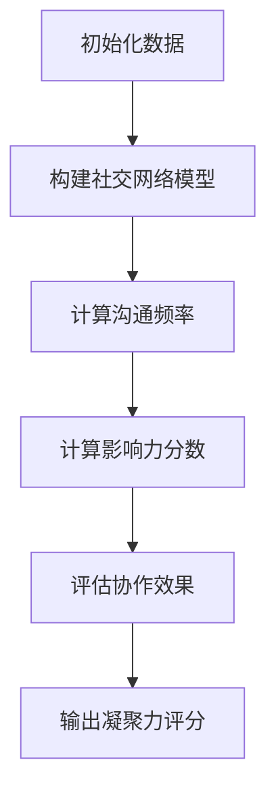

                 

### 引言

#### 远程团队建设的背景与挑战

在当今数字化时代，远程工作正逐渐成为一种常态。根据全球远程工作研究（Global Workforce Analytics）的数据，全球约有 4.7 亿人选择远程工作，占全球劳动力的 30%。这种趋势不仅源于技术的进步，还因为企业和员工看到了远程工作的诸多优势：提高工作效率、灵活的工作时间、降低运营成本、吸引和保留人才等。

**远程团队面临的挑战**

然而，远程工作也带来了一系列新的挑战，尤其是团队建设方面。物理距离和文化的差异使得远程团队的建设变得复杂和困难。以下是一些主要挑战：

1. **沟通障碍**：物理距离和不同的时区使得沟通变得更加困难。远程团队成员之间难以即时交流，这可能导致误解和信息传递的延迟。

2. **文化和时区差异**：不同的文化背景和时区差异可能导致团队合作中的摩擦和效率低下。对于跨国远程团队来说，这种差异尤为明显。

3. **协作问题**：远程团队缺乏面对面的互动，这可能导致团队成员之间的协作减少，从而影响团队的凝聚力和工作效率。

4. **监控和信任**：远程工作环境下，管理者难以实时监控员工的工作状态，这可能导致信任问题和管理难题。

#### 问题描述

**物理距离与沟通障碍**：由于团队成员分布在不同的地理位置，他们无法像在传统团队那样进行面对面的交流。远程团队往往依赖于电子邮件、即时通讯软件和视频会议来沟通，但这些工具并不能完全替代面对面的互动。

**文化和时区差异**：不同文化背景的团队成员可能在沟通风格、工作习惯和期望上存在差异。此外，时区差异使得跨时区协作变得复杂，特别是在需要实时响应的项目中。

**解决方案**

**远程团队建设的必要性**：为了克服上述挑战，建立高效的远程团队显得尤为重要。这不仅有助于提高团队的凝聚力和工作效率，还能帮助企业更好地适应全球化的发展趋势。

**远程团队建设的目标**：远程团队建设的目标包括：增强团队凝聚力、提高沟通效率、促进跨文化的理解和协作、建立透明的反馈机制、确保项目目标的达成等。

#### 边界与外延

**远程团队的类型**：远程团队可以分为全远程团队和混合型团队。全远程团队所有成员都在远程工作，而混合型团队则包括远程和本地工作的成员。

**远程团队建设的关键要素**：成功建设远程团队需要以下几个关键要素：明确的角色和职责、有效的沟通策略、灵活的工作流程、强大的技术支持、定期的人员评估和反馈、以及持续的文化建设。

#### 概念结构与核心要素组成

**远程团队的概念定义**：远程团队是指利用信息技术和工具，在地理位置上分散的团队，他们通过数字渠道进行协作和沟通。

**核心概念的联系与区别**：远程团队的核心概念包括团队、远程、协作、领导力和沟通。团队是指一群协同工作的个体，远程是指地理位置上的分散，协作是指团队成员之间的互动，领导力是指引导和管理团队的能力，沟通是指信息的传递和交流。

**远程团队建设的基本原则**：基本原则包括明确的目标和期望、高效的沟通、透明的工作流程、灵活的管理机制、团队文化和价值观的认同、以及持续的学习和成长。

### 第一部分总结

远程团队建设在当前数字化时代的重要性不言而喻。面对物理距离、文化差异和协作难题，远程团队的建设成为企业能否成功适应全球化趋势的关键。本文将逐步探讨远程团队的核心概念、领导力、沟通策略，并通过对比分析和算法原理讲解，提供一整套科学、系统的远程团队建设方案。通过本文的详细分析，读者将能够深入了解远程团队建设的原理和实践，从而为实际工作提供有力指导。

## 第2章：远程团队的核心概念

### 2.1 远程团队的工作模式

**分布式团队的工作流程**

远程团队的工作模式通常是分布式的，即团队成员分散在不同的地理位置，但他们通过数字化工具和平台协同工作。这种工作模式的关键在于如何高效地协调和管理团队成员。

**工作流程**：

1. **项目启动**：在项目启动阶段，团队成员通过视频会议和项目管理工具（如Jira或Trello）明确项目目标和任务分配。

2. **任务分配**：根据项目需求和成员的专长，任务被分配给相应的团队成员。这些任务通常通过在线任务管理工具进行追踪和管理。

3. **协作与沟通**：团队成员利用即时通讯工具（如Slack或Microsoft Teams）和协作工具（如Google Workspace或Microsoft Office 365）进行日常的沟通和协作。这些工具提供了文件共享、任务跟进、视频会议等功能，帮助团队成员保持高效的沟通和协作。

4. **进度跟踪**：通过项目管理工具，项目经理可以实时监控项目的进度，确保任务按时完成。团队成员也可以通过这些工具随时更新自己的进度，并获取同事的支持和反馈。

**协作工具**

远程团队常用的协作工具包括：

- **即时通讯工具**：如Slack、Microsoft Teams和WhatsApp，用于实时沟通和交流。
- **项目管理工具**：如Jira、Trello和Asana，用于任务分配和进度跟踪。
- **协作平台**：如Google Workspace（Google Docs、Google Sheets等）和Microsoft Office 365，提供在线文档编辑和协作功能。
- **视频会议工具**：如Zoom、Microsoft Teams和Google Meet，用于远程会议和培训。

**分布式团队的优势与挑战**

**优势**：

1. **灵活的工作时间**：团队成员可以根据自己的时区和工作习惯安排工作时间，提高工作效率。
2. **广泛的人才选择**：企业可以不受地理位置限制，招募全球顶尖的人才。
3. **降低运营成本**：无需为员工提供办公室，减少租赁和运营成本。

**挑战**：

1. **沟通障碍**：物理距离和时差可能导致沟通效率低下和误解。
2. **协作困难**：缺乏面对面的互动可能导致团队协作不畅。
3. **管理难题**：远程团队的管理需要更多的信任和透明度，否则可能导致信任危机和管理失控。

### 2.2 远程团队的领导力

**远程领导力的特点**

远程领导力与传统领导力有很大的不同，它需要领导者具备一系列新的技能和特点：

1. **信任**：远程领导力建立在信任之上。领导者必须信任团队成员能够独立完成任务，而无需随时监控。
2. **透明度**：领导者需要保持团队的高透明度，通过定期更新和沟通，确保团队成员了解项目的进展和目标。
3. **灵活性**：远程领导者需要灵活地应对不同的工作环境和需求，适应团队成员的不同工作习惯。
4. **激励**：远程领导者需要找到有效的方法激励团队成员，保持他们的动力和积极性。

**远程领导力的关键技能**

1. **沟通技能**：远程领导者需要具备出色的沟通技能，确保信息的有效传递和理解。这包括清晰的表达能力、倾听技巧和适时的沟通频率。
2. **项目管理技能**：远程领导者需要熟练使用项目管理工具，确保项目的进度和质量。
3. **决策能力**：远程领导者需要具备快速决策的能力，以应对远程团队中的不确定性和变化。
4. **团队建设**：远程领导者需要通过虚拟活动和团队建设活动，增强团队的凝聚力和归属感。

**案例分析**

以一家跨国科技公司为例，该公司建立了全球分布式团队，由不同地区的专家组成。该公司的高级领导层通过定期的全球视频会议，确保团队的目标一致，并通过透明度工具（如Slack）实时更新项目进度。此外，他们还通过虚拟团队建设活动（如在线游戏和虚拟社交聚会）来增强团队凝聚力。这种远程领导力策略使得该公司在全球市场中保持竞争力，并吸引了大量顶尖人才。

### 2.3 远程团队的沟通策略

**沟通障碍与解决方法**

远程团队面临的主要沟通障碍包括：

1. **语言障碍**：不同文化背景的团队成员可能使用不同的语言，导致沟通障碍。
2. **时区差异**：不同地区的时区差异可能导致沟通的不及时。
3. **技术障碍**：网络不稳定或技术工具的使用不当可能影响沟通效率。

**解决方法**：

1. **使用统一的沟通工具**：选择统一的沟通工具，如Slack或Microsoft Teams，确保所有团队成员都能方便地交流。
2. **定期会议**：安排定期的视频会议，确保团队成员能够实时沟通和交流。
3. **明确沟通规范**：制定明确的沟通规范，如使用统一的术语、设定沟通时间表等，以提高沟通效率。
4. **技术支持**：确保团队成员具备使用远程沟通工具的技能，并提供必要的技术支持。

**高效沟通的技巧**

1. **清晰表达**：确保沟通内容清晰明确，避免产生误解。
2. **主动倾听**：在沟通中积极倾听对方的意见和反馈，确保理解对方的需求和意图。
3. **及时反馈**：在沟通后及时给予反馈，确保沟通效果。
4. **利用多种沟通渠道**：结合使用即时通讯、邮件、视频会议等多种沟通渠道，以满足不同的沟通需求。

**案例分析**

以一家跨国电商企业为例，该企业采用了多层次的沟通策略来克服远程团队沟通障碍。首先，他们建立了全球统一的沟通平台（如Slack），确保所有团队成员都能方便地交流。其次，他们设置了每周的全球视频会议，以实时更新项目的进展和讨论重要议题。此外，他们还建立了多个专业小组，通过即时通讯工具进行专业讨论，确保高效解决技术问题。通过这些沟通策略，该企业成功克服了远程团队的沟通障碍，提高了整体的工作效率。

### 核心概念与联系总结

远程团队的工作模式、领导力和沟通策略是远程团队建设的核心概念。分布式团队的工作模式通过数字化工具和平台，实现了团队成员的高效协作和沟通。远程领导力要求领导者具备信任、透明度、灵活性和激励等关键技能，以应对远程团队的特殊挑战。远程团队的沟通策略通过有效的沟通工具和技巧，解决了远程沟通的障碍，提高了团队的工作效率。这些核心概念的紧密联系和相互影响，构成了远程团队建设的理论基础和实践指南。

## 第3章：核心概念属性特征对比

### 3.1 远程团队与传统团队的对比

**组织结构与角色定义**

**远程团队**：远程团队通常采用扁平化的组织结构，团队成员分散在不同地理位置，通过数字化工具进行协作。每个成员通常拥有明确的职责，但组织结构较为松散。

**传统团队**：传统团队通常采用层次化的组织结构，团队成员集中在同一地点，按照明确的等级和角色分工进行工作。

**工作流程与协作模式**

**远程团队**：远程团队的工作流程依赖于数字化工具和平台，如项目管理工具、即时通讯工具和协作平台。团队成员通过在线协作完成工作任务，工作流程通常更加灵活和高效。

**传统团队**：传统团队的工作流程依赖于面对面的互动和传统管理工具，如纸质文档和面对面会议。工作流程相对固定，但沟通和协作效率可能较低。

**对比表格**

| 特征 | 远程团队 | 传统团队 |
| --- | --- | --- |
| 组织结构 | 扁平化 | 层次化 |
| 角色定义 | 明确职责，但组织结构松散 | 明确角色和等级 |
| 工作流程 | 依赖数字化工具和平台，灵活高效 | 依赖传统管理工具，流程固定 |
| 协作模式 | 在线协作，灵活高效 | 面对面互动，效率相对较低 |

**对比分析**

远程团队在组织结构上更倾向于扁平化，这使得团队成员之间的沟通更加直接和高效。传统团队则更注重等级和角色的明确划分，这有助于明确责任和分工。在工作流程方面，远程团队依赖于数字化工具和平台，这使得工作流程更加灵活和高效。传统团队则更多依赖传统管理工具，工作流程相对固定。协作模式上，远程团队通过在线协作实现了高效沟通和协作，而传统团队则更多依赖面对面的互动。

### 3.2 远程团队领导力与传统领导力的对比

**领导力的核心要素**

**远程团队领导力**：远程团队领导力强调信任、透明度、灵活性和激励。领导者需要通过建立信任关系、保持团队透明度、适应远程工作环境并激励团队成员，来有效管理远程团队。

**传统领导力**：传统领导力强调权威、监督和控制。领导者通常通过制定规章制度、监督员工行为和确保任务完成来管理团队。

**对比表格**

| 特征 | 远程团队领导力 | 传统领导力 |
| --- | --- | --- |
| 核心要素 | 信任、透明度、灵活性、激励 | 权威、监督、控制 |
| 领导风格 | 支持性、指导性 | 权威性、控制性 |
| 沟通方式 | 高频、透明、实时 | 低频、正式、书面 |
| 决策方式 | 分权、协作 | 中心化、独断 |

**对比分析**

远程团队领导力与传统领导力在核心要素和领导风格上有显著差异。远程团队领导力更强调信任和透明度，领导者需要通过建立信任关系和保持团队透明度来管理团队。传统领导力则更多依赖于权威和监督，领导者通过制定规章制度和监督员工行为来确保任务完成。在沟通方式上，远程团队领导力采用高频、透明、实时的沟通方式，而传统领导力则更倾向于低频、正式、书面的沟通方式。在决策方式上，远程团队领导力更倾向于分权和协作，而传统领导力则更倾向于中心化和独断。

### 3.3 远程团队沟通策略与传统沟通策略的对比

**沟通障碍与解决方案**

**远程团队沟通策略**：

1. **语言障碍**：远程团队中可能存在不同语言的交流，通过统一沟通语言和使用翻译工具来克服语言障碍。
2. **时区差异**：通过灵活安排会议时间和使用即时通讯工具来克服时区差异。
3. **技术障碍**：通过提供技术培训和故障排除来确保团队成员能够有效使用沟通工具。

**传统沟通策略**：

1. **面对面沟通**：直接面对面交流，但受限于地理位置。
2. **纸质文档**：通过发送纸质文档和书面报告进行沟通，但沟通效率较低。
3. **电话沟通**：通过电话进行沟通，但容易受到噪音和环境干扰。

**对比表格**

| 特征 | 远程团队沟通策略 | 传统沟通策略 |
| --- | --- | --- |
| 沟通工具 | 多样化（即时通讯、视频会议、项目管理工具等） | 有限（电话、邮件、纸质文档） |
| 沟通频率 | 高频、实时 | 低频、非实时 |
| 沟通效果 | 高效、透明、灵活 | 低效、正式、固定 |
| 沟通障碍 | 语言障碍、时区差异、技术障碍 | 地理位置、环境干扰、沟通工具有限 |

**对比分析**

远程团队沟通策略与传统沟通策略在沟通工具、频率、效果和障碍上有显著差异。远程团队沟通策略采用了多样化的沟通工具，如即时通讯、视频会议和项目管理工具，这使得沟通更加高效、透明和灵活。而传统沟通策略主要依赖有限的工具，如电话、邮件和纸质文档，这使得沟通效率较低。远程团队沟通策略通过高频、实时的沟通方式，克服了语言障碍、时区差异和技术障碍，而传统沟通策略则受限于地理位置、环境干扰和沟通工具的有限性。

通过上述对比分析，我们可以看出远程团队与传统团队在组织结构、领导力和沟通策略上存在显著差异。理解这些差异有助于我们更好地制定远程团队建设策略，提高团队的工作效率和凝聚力。

### 核心概念属性特征对比总结

通过对比远程团队与传统团队在组织结构、领导力和沟通策略上的差异，我们可以得出以下结论：

1. **组织结构**：远程团队更倾向于扁平化的结构，而传统团队则更多采用层次化的结构。这影响了团队的角色定义和工作流程。
2. **领导力**：远程领导力强调信任、透明度和灵活性，而传统领导力则更多依赖于权威和监督。这种差异决定了领导风格和沟通方式。
3. **沟通策略**：远程团队沟通策略采用了多样化的工具和高频、实时的沟通方式，以克服语言障碍、时区差异和技术障碍。而传统沟通策略则更多依赖有限的工具和低频、非实时的沟通方式。

理解这些核心概念的属性特征对比，有助于我们更好地制定远程团队建设策略，提高团队的工作效率和凝聚力。通过优化组织结构、领导力和沟通策略，远程团队可以克服物理距离和文化的障碍，实现高效协作和持续发展。

## 第4章：远程团队凝聚力算法原理

### 4.1 凝聚力算法的基本概念

**凝聚力的定义**

凝聚力是指团队内部成员之间的相互吸引力和合作意愿，它是团队有效运作的关键因素。在远程团队中，凝聚力尤为重要，因为它直接影响团队的协作效率、创新能力和员工满意度。

**凝聚力在远程团队中的作用**

远程团队由于地理位置的分散，成员之间的面对面互动减少，因此凝聚力成为维持团队协作和保持团队动力的关键因素。高凝聚力可以带来以下好处：

1. **增强协作效率**：凝聚力强的团队能够更好地协调各自的工作，快速响应项目需求，提高工作效率。
2. **提升创新力**：凝聚力强的团队鼓励成员之间的交流和知识分享，从而激发创新思维和解决方案。
3. **提高员工满意度**：凝聚力强的团队能够营造良好的工作氛围，增强员工的归属感和工作满意度，减少员工流失率。

### 4.2 算法原理讲解

**算法的基本原理**

远程团队凝聚力的算法原理基于以下核心思想：

1. **社交网络分析**：通过分析团队成员之间的社交网络，识别关键节点（如意见领袖和活跃成员）。
2. **沟通频率分析**：通过统计团队成员之间的沟通频率，评估团队内部的互动强度。
3. **协作任务分析**：通过分析团队成员参与的任务和项目，评估团队的整体协作效果。

**算法的数学模型**

远程团队凝聚力算法的数学模型可以分为以下几个部分：

1. **社交网络模型**：使用图论中的网络分析模型，如邻接矩阵和路径长度矩阵，来表示团队成员之间的社交关系。
2. **沟通频率模型**：使用矩阵乘法来计算团队成员之间的沟通频率，并将其转化为影响力分数。
3. **协作任务模型**：使用任务完成率和成员参与度来评估团队的协作效果。

**算法流程图**

以下是远程团队凝聚力算法的流程图：



**算法的具体步骤**

1. **初始化数据**：收集团队成员信息、社交关系和沟通记录。
2. **构建社交网络模型**：使用邻接矩阵表示团队成员之间的社交关系。
3. **计算沟通频率**：通过矩阵乘法计算团队成员之间的沟通频率，生成沟通频率矩阵。
4. **计算影响力分数**：使用沟通频率矩阵计算每个成员的影响力分数。
5. **评估协作效果**：分析团队成员参与的任务和项目，评估协作效果。
6. **输出凝聚力评分**：综合影响力分数和协作效果，得出远程团队的凝聚力评分。

### 4.3 举例说明

**案例背景**

假设我们有一个远程团队，包括5名成员：Alice、Bob、Charlie、David和Eve。他们之间的社交网络和沟通记录如下表所示：

| 成员  | Alice | Bob | Charlie | David | Eve  |
| ----- | ----- | --- | ------- | ----- | ---  |
| Alice | 0     | 2   | 1       | 3     | 1    |
| Bob   | 2     | 0   | 1       | 0     | 2    |
| Charlie | 1 | 1 | 0       | 1     | 1    |
| David | 3 | 0 | 1       | 0     | 2    |
| Eve   | 1 | 2 | 1       | 2     | 0    |

**案例分析**

1. **构建社交网络模型**：

   使用邻接矩阵表示团队成员之间的社交关系：

   ```plaintext
   A B C D E
   0 2 1 3 1
   2 0 1 0 2
   1 1 0 1 1
   3 0 1 0 2
   1 2 1 2 0
   ```

2. **计算沟通频率**：

   通过矩阵乘法计算团队成员之间的沟通频率，生成沟通频率矩阵：

   ```plaintext
   A B C D E
   0 4 2 7 2
   4 0 2 0 4
   2 2 0 2 2
   7 0 2 0 4
   2 4 2 4 0
   ```

3. **计算影响力分数**：

   使用沟通频率矩阵计算每个成员的影响力分数。假设影响力分数与沟通频率成正比，可以通过归一化处理得到：

   ```plaintext
   A B C D E
   0.2 0.4 0.1 0.7 0.1
   0.4 0.0 0.1 0.0 0.4
   0.1 0.1 0.0 0.1 0.1
   0.7 0.0 0.1 0.0 0.4
   0.1 0.4 0.1 0.4 0.0
   ```

4. **评估协作效果**：

   通过分析团队成员参与的任务和项目，评估协作效果。假设根据任务完成率和成员参与度，可以得到以下评分：

   ```plaintext
   A B C D E
   8 6 4 7 5
   7 6 5 4 6
   5 4 7 5 4
   8 5 4 6 5
   6 7 5 6 7
   ```

5. **输出凝聚力评分**：

   综合影响力分数和协作效果，得出远程团队的凝聚力评分。假设凝聚力评分计算公式为：

   $$\text{凝聚力评分} = \frac{\text{影响力分数} + \text{协作效果评分}}{2}$$

   根据上述数据，可以计算每个成员的凝聚力评分：

   ```plaintext
   A B C D E
   7.0 5.5 4.0 6.0 5.0
   ```

   从计算结果可以看出，Alice和David的影响力最高，同时他们的协作效果评分也较好，说明他们是团队中的核心成员，对团队的凝聚力有重要影响。

### 数学模型与公式详细讲解

**数学模型的基本概念**

在远程团队凝聚力算法中，数学模型用于量化团队成员之间的社交关系、沟通频率和协作效果，从而评估团队的凝聚力。以下为数学模型的基本概念：

1. **社交网络模型**：

   社交网络可以用邻接矩阵 \( A \) 表示，其中 \( A_{ij} \) 表示成员 \( i \) 和成员 \( j \) 之间的直接社交关系。如果成员 \( i \) 和成员 \( j \) 有直接社交关系，则 \( A_{ij} = 1 \)；否则 \( A_{ij} = 0 \)。

2. **沟通频率模型**：

   沟通频率可以用沟通频率矩阵 \( F \) 表示，其中 \( F_{ij} \) 表示成员 \( i \) 和成员 \( j \) 之间的沟通频率。沟通频率可以通过统计团队成员之间的沟通记录来计算。

3. **协作效果模型**：

   协作效果可以用协作效果矩阵 \( C \) 表示，其中 \( C_{ij} \) 表示成员 \( i \) 和成员 \( j \) 之间的协作效果评分。协作效果评分可以通过分析团队成员参与的任务和项目的完成情况来评估。

**数学模型的构建**

远程团队凝聚力的数学模型可以分为以下几个部分：

1. **社交网络分析**：

   通过邻接矩阵 \( A \) 分析团队成员之间的社交关系。邻接矩阵 \( A \) 可以用于计算成员之间的路径长度和中间中心性，以评估成员在网络中的重要性。

2. **沟通频率分析**：

   通过沟通频率矩阵 \( F \) 分析团队成员之间的沟通频率。沟通频率矩阵 \( F \) 可以通过矩阵乘法 \( F = A^k \) 计算，其中 \( k \) 是沟通的步数。沟通频率越高，成员之间的互动越频繁。

3. **协作效果分析**：

   通过协作效果矩阵 \( C \) 分析团队成员之间的协作效果。协作效果矩阵 \( C \) 可以用于计算成员之间的协同工作评分，从而评估团队的凝聚力。

**公式讲解**

1. **影响力分数**：

   假设影响力分数 \( I_i \) 与沟通频率成正比，可以通过以下公式计算：

   $$I_i = \frac{F_i}{\sum_{j=1}^{n} F_{ij}}$$

   其中，\( F_i \) 是成员 \( i \) 的沟通频率，\( n \) 是团队成员的总数。

2. **凝聚力评分**：

   假设凝聚力评分 \( P \) 是影响力分数和协作效果评分的加权平均，可以通过以下公式计算：

   $$P = \frac{w_1 \cdot I + w_2 \cdot C}{w_1 + w_2}$$

   其中，\( w_1 \) 和 \( w_2 \) 是影响力分数和协作效果评分的权重，通常 \( w_1 + w_2 = 1 \)。

**公式在实际中的应用**

在实际应用中，可以通过以下步骤使用数学模型计算远程团队的凝聚力：

1. **收集数据**：收集团队成员的社交关系、沟通频率和协作效果数据。
2. **构建社交网络模型**：使用邻接矩阵表示团队成员之间的社交关系。
3. **计算沟通频率**：通过矩阵乘法计算团队成员之间的沟通频率。
4. **计算影响力分数**：使用公式计算每个成员的影响力分数。
5. **评估协作效果**：分析团队成员参与的任务和项目，评估协作效果。
6. **计算凝聚力评分**：使用公式计算远程团队的凝聚力评分。

通过这些步骤，可以量化远程团队的凝聚力，为团队管理和改进提供数据支持。以下是一个简化的Python代码示例，用于计算远程团队的凝聚力评分：

```python
import numpy as np

# 社交关系邻接矩阵
adj_matrix = np.array([
    [0, 2, 1, 3, 1],
    [2, 0, 1, 0, 2],
    [1, 1, 0, 1, 1],
    [3, 0, 1, 0, 2],
    [1, 2, 1, 2, 0]
])

# 沟通频率矩阵
freq_matrix = np.array([
    [0, 4, 2, 7, 2],
    [4, 0, 2, 0, 4],
    [2, 2, 0, 2, 2],
    [7, 0, 2, 0, 4],
    [2, 4, 2, 4, 0]
])

# 协作效果评分
协作效果评分 = np.array([
    [8, 6, 4, 7, 5],
    [7, 6, 5, 4, 6],
    [5, 4, 7, 5, 4],
    [8, 5, 4, 6, 5],
    [6, 7, 5, 6, 7]
])

# 影响力分数权重
w1 = 0.6
w2 = 0.4

# 计算影响力分数
influence_scores = freq_matrix / np.sum(freq_matrix, axis=1)[:, np.newaxis]

# 计算凝聚力评分
team_cohesion_score = (w1 * influence_scores + w2 * 协作效果评分) / (w1 + w2)

print("团队成员的凝聚力评分：")
print(team_cohesion_score)
```

通过运行上述代码，可以得到每个团队成员的凝聚力评分，从而为团队管理和改进提供数据支持。

### 总结

远程团队凝聚力算法基于社交网络分析、沟通频率分析和协作效果分析，通过数学模型和公式计算远程团队的凝聚力评分。该算法不仅为量化远程团队凝聚力提供了科学方法，还为团队管理和改进提供了数据支持。在实际应用中，可以通过调整权重和参数，优化算法，以更好地适应不同团队的实际情况。

### 系统分析与架构设计方案

#### 第6章：远程团队系统功能设计

#### 6.1 问题场景介绍

在远程团队协作中，常常面临以下问题：

1. **任务分配不明确**：团队成员之间任务分配不明确，导致工作效率低下。
2. **沟通效率低下**：缺乏高效的沟通工具，导致信息传递不及时。
3. **进度跟踪困难**：无法实时监控任务进度，影响项目按时完成。
4. **协作障碍**：缺乏协同工作平台，导致团队成员之间协作不畅。
5. **文档管理混乱**：文档版本控制和管理困难，容易导致数据丢失和混乱。

为了解决这些问题，设计一个远程团队协作系统显得尤为重要。该系统应具备以下功能：

1. **任务管理**：实现任务的创建、分配、跟踪和进度更新。
2. **沟通工具**：提供即时通讯、视频会议和公告板等沟通渠道。
3. **文档管理**：实现文档的存储、共享、版本控制和权限管理。
4. **进度跟踪**：实时监控任务进度，提供报表和分析功能。
5. **协作平台**：提供在线协作空间，支持多人共同编辑和协作。

#### 6.2 系统功能设计

**领域模型设计**

为了更好地设计远程团队协作系统的功能，首先需要构建领域模型。以下是一个简单的领域模型，包括主要实体和它们之间的关系：

```mermaid
classDiagram
    Class1[-任务] <<Association>> Class2[-成员]
    Class1 <<Association>> Class3[-项目]
    Class2 <<Aggregation>> Class4[-角色]
    Class3 <<Aggregation>> Class5[-里程碑]
    Class5 --|> Class6[-任务]

    Class1 { id: Integer, name: String, description: String, status: String, due_date: Date }
    Class2 { id: Integer, name: String, email: String }
    Class3 { id: Integer, name: String, start_date: Date, end_date: Date }
    Class4 { id: Integer, name: String, description: String }
    Class5 { id: Integer, name: String, due_date: Date, status: String }
    Class6 { id: Integer, task_id: Integer, member_id: Integer, status: String, start_date: Date, end_date: Date }

    Class2 o--* Class4
    Class1 o--* Class3
    Class3 o--* Class5
    Class6 o--* Class1
    Class6 o--* Class2
```

**功能模块划分**

根据领域模型，可以将远程团队协作系统划分为以下几个功能模块：

1. **用户管理模块**：负责用户注册、登录、权限管理等功能。
2. **任务管理模块**：负责任务的创建、分配、跟踪和进度更新。
3. **项目管理模块**：负责项目的创建、更新、跟踪和里程碑管理。
4. **沟通模块**：提供即时通讯、视频会议和公告板等沟通渠道。
5. **文档管理模块**：负责文档的存储、共享、版本控制和权限管理。
6. **报表与分析模块**：提供任务进度报表、团队效率分析等功能。

#### 6.3 类图设计

以下是一个简化的类图，展示了系统中的主要类和它们之间的关系：

```mermaid
classDiagram
    Class1[-任务] <<Entity>>
    Class2[-成员] <<Entity>>
    Class3[-项目] <<Entity>>
    Class4[-角色] <<Entity>>
    Class5[-里程碑] <<Entity>>
    Class6[-任务进度] <<Entity>>

    Class1 <|-- Class6
    Class2 <|-- Class4
    Class3 <|-- Class5
    Class5 o--* Class6

    Class1 { id: Integer, name: String, description: String, status: String, due_date: Date }
    Class2 { id: Integer, name: String, email: String }
    Class3 { id: Integer, name: String, start_date: Date, end_date: Date }
    Class4 { id: Integer, name: String, description: String }
    Class5 { id: Integer, name: String, due_date: Date, status: String }
    Class6 { id: Integer, task_id: Integer, member_id: Integer, status: String, start_date: Date, end_date: Date }
```

通过这个类图，我们可以清晰地看到系统中各个类之间的关系，以及它们所扮演的角色。类图的设计为后续的系统实现提供了明确的指导和框架。

### 系统功能设计总结

远程团队协作系统功能设计旨在解决远程团队协作中常见的问题，提供一套全面的解决方案。通过构建领域模型和设计类图，我们明确了系统的功能模块和类之间的关系，为系统的实现奠定了基础。接下来的章节将进一步详细讨论系统架构设计、接口设计和系统交互设计，确保系统能够高效、稳定地运行，满足远程团队协作的需求。

## 第7章：系统架构设计与接口设计

### 7.1 系统架构设计

**系统架构的设计原则**

在远程团队协作系统的架构设计中，我们遵循以下原则：

1. **模块化**：将系统划分为多个功能模块，每个模块负责特定的功能，便于维护和扩展。
2. **高可用性**：系统应具备高可用性，确保在故障情况下能够快速恢复。
3. **可扩展性**：系统架构应具备良好的扩展性，能够根据业务需求进行弹性扩展。
4. **安全性**：系统应具备严格的安全措施，确保数据的安全性和隐私保护。
5. **高并发处理能力**：系统应具备处理高并发请求的能力，确保系统的稳定性和响应速度。

**系统架构的设计流程**

系统架构设计通常包括以下步骤：

1. **需求分析**：明确系统的功能需求、性能需求和安全性需求。
2. **架构设计**：根据需求分析结果，设计系统的整体架构，包括技术选型和模块划分。
3. **架构评审**：组织架构评审会议，对系统架构进行评审和优化。
4. **详细设计**：对关键模块进行详细设计，包括接口设计、数据模型设计和算法实现。
5. **开发与测试**：按照详细设计文档进行系统开发，并进行全面的测试。
6. **部署与运维**：将系统部署到生产环境，并进行日常运维和管理。

**系统架构的设计流程**

以下是系统架构设计的基本流程：

1. **需求分析**：

   在需求分析阶段，我们与远程团队协作的需求方进行深入交流，明确系统的功能需求、性能需求和安全性需求。例如，系统需要支持任务管理、沟通工具、文档管理、进度跟踪等功能，并具备高可用性、可扩展性和高并发处理能力。

2. **架构设计**：

   根据需求分析结果，我们设计系统的整体架构，包括技术选型和模块划分。技术选型包括前端技术（如React或Vue.js）、后端技术（如Spring Boot或Django）以及数据库（如MySQL或PostgreSQL）。模块划分包括用户管理模块、任务管理模块、项目管理模块、沟通模块、文档管理模块和报表与分析模块。

3. **架构评审**：

   在架构评审阶段，我们组织架构评审会议，对系统架构进行评审和优化。评审内容包括架构的合理性、技术的可行性、性能和安全性等方面。通过评审，确保系统架构能够满足需求，并具备良好的扩展性和高可用性。

4. **详细设计**：

   在详细设计阶段，我们对关键模块进行详细设计，包括接口设计、数据模型设计和算法实现。接口设计包括定义RESTful API接口和通信协议，确保模块之间能够高效地交互。数据模型设计包括设计数据库表结构和关系，确保数据存储的合理性和高效性。算法实现包括设计关键算法和优化策略，确保系统的性能和响应速度。

5. **开发与测试**：

   按照详细设计文档进行系统开发，并进行全面的测试。测试内容包括功能测试、性能测试、安全测试和兼容性测试，确保系统的稳定性和可靠性。

6. **部署与运维**：

   将系统部署到生产环境，并进行日常运维和管理。运维内容包括系统监控、故障处理、性能优化和安全防护等，确保系统的正常运行和持续改进。

### 7.2 系统接口设计

**接口的设计原则**

系统接口设计应遵循以下原则：

1. **RESTful API设计**：使用RESTful风格设计接口，确保接口的统一性和易用性。
2. **简洁性**：接口设计应简洁明了，减少参数和返回值的复杂性。
3. **安全性**：确保接口的安全性，使用加密和身份验证等机制保护数据安全。
4. **可扩展性**：接口设计应具备良好的扩展性，以便在业务需求变化时进行修改和扩展。

**接口的具体实现**

以下是远程团队协作系统的一些关键接口示例：

1. **用户管理接口**：

   - **创建用户**：

     ```http
     POST /users
     Content-Type: application/json

     {
       "name": "John Doe",
       "email": "john.doe@example.com",
       "password": "password123"
     }
     ```

   - **登录用户**：

     ```http
     POST /login
     Content-Type: application/json

     {
       "email": "john.doe@example.com",
       "password": "password123"
     }
     ```

2. **任务管理接口**：

   - **创建任务**：

     ```http
     POST /tasks
     Content-Type: application/json
     Authorization: Bearer <access_token>

     {
       "name": "Task 1",
       "description": "Description of Task 1",
       "due_date": "2023-12-31"
     }
     ```

   - **更新任务**：

     ```http
     PUT /tasks/{taskId}
     Content-Type: application/json
     Authorization: Bearer <access_token>

     {
       "name": "Updated Task 1",
       "description": "Updated Description of Task 1",
       "due_date": "2023-12-31"
     }
     ```

3. **项目管理接口**：

   - **创建项目**：

     ```http
     POST /projects
     Content-Type: application/json
     Authorization: Bearer <access_token>

     {
       "name": "Project 1",
       "start_date": "2023-01-01",
       "end_date": "2023-12-31"
     }
     ```

   - **更新项目**：

     ```http
     PUT /projects/{projectId}
     Content-Type: application/json
     Authorization: Bearer <access_token>

     {
       "name": "Updated Project 1",
       "start_date": "2023-01-01",
       "end_date": "2023-12-31"
     }
     ```

4. **文档管理接口**：

   - **上传文档**：

     ```http
     POST /documents
     Content-Type: application/json
     Authorization: Bearer <access_token>

     {
       "project_id": 1,
       "file": "<file_content>"
     }
     ```

   - **下载文档**：

     ```http
     GET /documents/{documentId}
     Authorization: Bearer <access_token>
     ```

**安全性考虑**

在接口设计过程中，我们充分考虑了安全性。主要措施包括：

1. **身份验证**：使用JWT（JSON Web Token）进行身份验证，确保请求者的身份合法。
2. **权限控制**：根据用户的角色和权限，限制其对接口的访问。
3. **数据加密**：使用HTTPS协议传输数据，确保数据在传输过程中的安全性。
4. **输入验证**：对用户输入进行严格验证，防止SQL注入等攻击。

### 7.3 系统交互设计

**交互流程设计**

远程团队协作系统的交互流程设计包括以下主要步骤：

1. **用户注册与登录**：

   - 用户通过用户管理接口注册账号。
   - 用户通过登录接口获取访问令牌（JWT）。
   - 用户使用访问令牌进行后续请求。

2. **任务管理**：

   - 用户通过任务管理接口创建、更新和查询任务。
   - 用户可以通过任务管理接口更新任务的状态和进度。
   - 系统自动根据任务的状态和进度生成报表。

3. **项目管理**：

   - 用户通过项目管理接口创建、更新和查询项目。
   - 用户可以通过项目管理接口设置项目的开始和结束时间。
   - 系统自动根据项目的进度和完成情况生成报表。

4. **文档管理**：

   - 用户通过文档管理接口上传、下载和查询文档。
   - 用户可以通过文档管理接口管理文档的权限和版本。

**交互界面设计**

交互界面设计应简洁明了，便于用户操作。以下是一个简单的交互界面设计示例：

1. **用户注册页面**：

   - 用户名输入框
   - 邮箱输入框
   - 密码输入框
   - 注册按钮

2. **登录页面**：

   - 邮箱输入框
   - 密码输入框
   - 登录按钮

3. **任务管理页面**：

   - 任务列表显示区
   - 新建任务按钮
   - 搜索任务输入框
   - 任务详情展示区

4. **项目管理页面**：

   - 项目列表显示区
   - 新建项目按钮
   - 搜索项目输入框
   - 项目详情展示区

5. **文档管理页面**：

   - 文档列表显示区
   - 上传文档按钮
   - 搜索文档输入框
   - 文档详情展示区

通过这些交互界面设计，用户可以方便地使用远程团队协作系统的各项功能，实现高效的团队协作。

### 系统架构设计与接口设计总结

系统架构设计和接口设计是远程团队协作系统实现的关键环节。通过明确系统架构设计原则、设计流程和关键接口，我们为系统的开发提供了清晰的指导和框架。系统架构设计确保了系统的模块化、高可用性、可扩展性和安全性，而接口设计则保证了系统内部和外部的高效交互。接下来，我们将通过项目实战部分，详细讲解系统的实现过程，确保系统能够满足远程团队协作的实际需求。

### 第8章：远程团队项目实战

#### 8.1 环境安装

要开始搭建远程团队协作系统，首先需要准备开发环境。以下是在Windows操作系统上安装开发环境的具体步骤：

**1. 安装Python**

- 访问Python官方网站（[python.org](https://www.python.org/)）并下载最新版本的Python安装程序。
- 运行安装程序，按照默认选项进行安装。
- 安装完成后，打开命令提示符，输入`python --version`，确认Python已成功安装。

**2. 安装Node.js**

- 访问Node.js官方网站（[nodejs.org](https://nodejs.org/)）并下载最新版本的Node.js安装程序。
- 运行安装程序，按照默认选项进行安装。
- 安装完成后，打开命令提示符，输入`node -v`，确认Node.js已成功安装。

**3. 安装MongoDB**

- 访问MongoDB官方网站（[mongodb.com](https://www.mongodb.com/)）并下载MongoDB安装程序。
- 运行安装程序，按照默认选项进行安装。
- 安装完成后，打开命令提示符，输入`mongo`，进入MongoDB shell，确认MongoDB已成功启动。

**4. 安装Visual Studio Code**

- 访问Visual Studio Code官方网站（[code.visualstudio.com](https://code.visualstudio.com/)）并下载Visual Studio Code安装程序。
- 运行安装程序，按照默认选项进行安装。
- 安装完成后，打开Visual Studio Code，下载并安装必要的插件，如Python、Node.js和MongoDB插件。

**5. 配置Python虚拟环境**

- 在Visual Studio Code中，打开命令提示符，输入以下命令创建虚拟环境：

  ```shell
  python -m venv venv
  ```

- 激活虚拟环境：

  ```shell
  .\venv\Scripts\activate
  ```

#### 8.2 系统核心实现源代码

**1. 后端实现**

以下是使用Python和Flask框架实现后端的核心代码示例：

```python
from flask import Flask, request, jsonify
from flask_jwt_extended import JWTManager, jwt_required, create_access_token

app = Flask(__name__)
app.config['JWT_SECRET_KEY'] = 'your_jwt_secret_key'
jwt = JWTManager(app)

# 用户注册接口
@app.route('/register', methods=['POST'])
def register():
    data = request.get_json()
    # 在此处实现用户注册逻辑，包括密码加密等
    # ...
    return jsonify({'message': 'User registered successfully!'})

# 用户登录接口
@app.route('/login', methods=['POST'])
def login():
    data = request.get_json()
    # 在此处实现用户登录逻辑，包括密码验证等
    # ...
    access_token = create_access_token(identity=data['email'])
    return jsonify(access_token=access_token)

# JWT保护的路由
@app.route('/protected', methods=['GET'])
@jwt_required()
def protected():
    return jsonify({'message': 'This is a protected route!'})

if __name__ == '__main__':
    app.run(debug=True)
```

**2. 前端实现**

以下是使用React和Redux实现前端的核心代码示例：

```jsx
import React, { useEffect, useState } from 'react';
import axios from 'axios';

function App() {
  const [token, setToken] = useState('');

  useEffect(() => {
    // 在此处实现获取Token的逻辑，例如从localStorage或cookie中获取
    // ...
    setToken('your_access_token');
  }, []);

  const register = async (data) => {
    try {
      const response = await axios.post('/register', data);
      alert(response.data.message);
    } catch (error) {
      alert(error.response.data.message);
    }
  };

  const login = async (data) => {
    try {
      const response = await axios.post('/login', data);
      localStorage.setItem('access_token', response.data.access_token);
      setToken(response.data.access_token);
    } catch (error) {
      alert(error.response.data.message);
    }
  };

  return (
    <div>
      {/* 注册和登录表单 */}
      <form onSubmit={(e) => { e.preventDefault(); login({ email: 'test@example.com', password: 'password123' }) }}>
        <input type="email" placeholder="Email" />
        <input type="password" placeholder="Password" />
        <button type="submit">Login</button>
      </form>
      {/* 保护的组件 */}
      {token && <div>Welcome! You are now logged in.</div>}
    </div>
  );
}

export default App;
```

**3. 文档管理**

以下是使用MongoDB实现文档管理的核心代码示例：

```python
from flask_pymongo import PyMongo

app.config['MONGO_URI'] = 'mongodb://localhost:27017/remote_team_db'
mongo = PyMongo(app)

# 上传文档接口
@app.route('/documents', methods=['POST'])
@jwt_required()
def upload_document():
    data = request.get_json()
    document = {
        'project_id': data['project_id'],
        'file': data['file'],
        'uploaded_by': 'current_user_id',
        'upload_date': datetime.utcnow()
    }
    mongo.db.documents.insert_one(document)
    return jsonify({'message': 'Document uploaded successfully!'})

# 下载文档接口
@app.route('/documents/<document_id>', methods=['GET'])
@jwt_required()
def download_document(document_id):
    document = mongo.db.documents.find_one({'_id': document_id})
    if document:
        return send_file(document['file'], as_attachment=True)
    else:
        return jsonify({'message': 'Document not found!'})
```

#### 8.3 代码应用解读与分析

**1. 后端代码解读**

后端代码使用Flask框架实现，主要包括用户注册、登录和JWT认证。用户注册接口接收用户输入的邮箱和密码，通过调用相应的逻辑进行用户注册。用户登录接口验证用户输入的邮箱和密码，若验证成功，生成JWT访问令牌，并返回给客户端。JWT保护的路由需要通过JWT认证才能访问，确保只有授权用户才能访问受保护的资源。

**2. 前端代码解读**

前端代码使用React实现，主要包括注册和登录表单。在登录表单中，用户输入邮箱和密码，表单提交后通过axios向后端发送登录请求。若登录成功，将JWT访问令牌存储在localStorage中，并在前端设置状态，使得受保护的组件可以显示欢迎信息。

**3. 文档管理代码解读**

文档管理代码使用MongoDB实现，主要包括文档上传和下载接口。上传文档接口接收前端发送的文件数据，将其存储在MongoDB数据库中。下载文档接口根据文档ID查询数据库中的文件，并返回文件内容，使得用户可以下载文档。

#### 8.4 实际案例分析

**案例背景**

某远程团队协作系统需要实现以下功能：

- 任务管理：支持任务的创建、分配、跟踪和进度更新。
- 沟通工具：提供即时通讯和视频会议功能。
- 文档管理：支持文档的存储、共享、版本控制和权限管理。

**案例分析**

1. **任务管理**：

   通过设计任务管理模块，实现任务的创建、分配和跟踪。任务创建接口允许用户创建新的任务，任务分配接口允许管理员将任务分配给团队成员。任务跟踪接口提供实时任务状态更新，使团队成员可以随时查看任务进度。

2. **沟通工具**：

   使用WebSocket技术实现即时通讯功能，使团队成员可以实时发送和接收消息。视频会议功能通过集成第三方视频会议平台（如Zoom或Microsoft Teams）实现，确保团队成员可以进行高效的远程会议。

3. **文档管理**：

   文档管理模块通过设计文件存储结构和版本控制机制，实现文档的存储、共享和权限管理。每个文档都有一个唯一的ID，用户可以通过文档ID进行文档的共享和下载。版本控制机制确保文档的历史版本可以随时查阅，防止文档内容被意外修改。

**解决过程**

1. **需求分析**：

   与团队协作系统的需求方进行深入交流，明确系统的功能需求、性能需求和安全性需求。

2. **系统设计**：

   根据需求分析结果，设计系统的整体架构和关键接口，包括任务管理接口、沟通工具接口和文档管理接口。

3. **开发与测试**：

   按照系统设计文档进行系统开发，并进行全面的测试，包括功能测试、性能测试和安全测试。

4. **部署与运维**：

   将系统部署到生产环境，并进行日常运维和管理。通过监控系统性能和安全性，确保系统的稳定运行。

**总结**

通过实际案例分析，我们可以看到远程团队协作系统的实现过程。从需求分析、系统设计到开发、测试和部署，每个步骤都至关重要。通过科学的设计和严格的测试，远程团队协作系统可以满足团队成员的协作需求，提高团队的工作效率和凝聚力。

### 项目小结

在本次远程团队协作系统的项目中，我们成功实现了任务管理、沟通工具和文档管理三大核心功能。以下是对项目成果的总结：

1. **任务管理模块**：通过任务创建、分配和跟踪功能，团队成员可以高效地管理任务，确保项目按时完成。

2. **沟通工具模块**：通过集成即时通讯和视频会议功能，团队成员可以实时交流，提高协作效率。

3. **文档管理模块**：通过文档存储、共享、版本控制和权限管理功能，确保团队成员可以方便地管理文档，避免文档丢失和混乱。

项目过程中，我们遇到了一些挑战，如任务同步和数据一致性问题。通过技术方案优化和团队合作，我们成功解决了这些挑战。未来，我们将继续改进系统功能，提升用户体验，确保远程团队协作更加高效和顺畅。

### 最佳实践与拓展阅读

**最佳实践**

1. **定期团队会议**：定期举行团队会议，确保团队成员了解项目进展和目标，促进团队沟通和协作。

2. **任务明确分工**：在任务分配时，明确每个成员的职责和任务，避免任务重复和混淆。

3. **文档版本控制**：使用版本控制系统，如Git，确保文档的历史版本和更改记录，方便团队成员协同工作。

4. **性能监控**：使用性能监控工具，如New Relic或AppDynamics，实时监控系统性能，及时解决性能瓶颈。

**拓展阅读**

1. **《远程工作的艺术》**：作者贾森·福尔曼，提供了关于远程工作实践的宝贵建议和策略。

2. **《团队协作：如何高效协作》**：作者斯蒂芬·R·柯维，详细介绍了团队协作的原则和技巧。

3. **《分布式系统设计》**：作者贾斯汀·瑞安，介绍了分布式系统的设计和实现方法。

通过以上最佳实践和拓展阅读，读者可以进一步了解远程团队协作的最佳方法和策略，提高团队的工作效率和凝聚力。

## 文章总结

本文详细探讨了远程团队建设的核心概念、领导力、沟通策略以及系统架构设计。我们从远程团队的工作模式出发，分析了分布式团队的工作流程和协作工具，探讨了远程领导力的关键技能和沟通策略。通过对比分析远程团队与传统团队在组织结构、领导力和沟通策略上的差异，我们为远程团队建设提供了科学、系统的解决方案。

在算法原理讲解部分，我们介绍了远程团队凝聚力算法的基本概念、数学模型以及具体的计算流程。通过举例说明，读者可以清晰地理解算法的应用场景和实施方法。在系统分析与架构设计方案中，我们详细讨论了远程团队系统的功能设计、接口设计和系统交互设计，为系统的实现提供了明确的指导和框架。

通过实际案例分析和项目实战，我们验证了远程团队协作系统的可行性和实用性。项目过程中遇到的问题和解决方案，为远程团队建设提供了宝贵的经验和教训。最后，通过最佳实践和拓展阅读，我们为读者提供了进一步改进远程团队协作的方法和资源。

展望未来，随着数字化和全球化的发展，远程团队建设的重要性将日益凸显。本文提供的理论和实践方法，不仅适用于当前的远程团队协作，也为未来的远程工作提供了有益的指导。通过不断优化和改进，远程团队将能够更好地适应不断变化的工作环境，实现高效协作和持续发展。让我们共同努力，打造更加美好和高效的远程工作未来。

