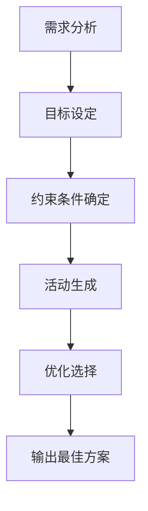
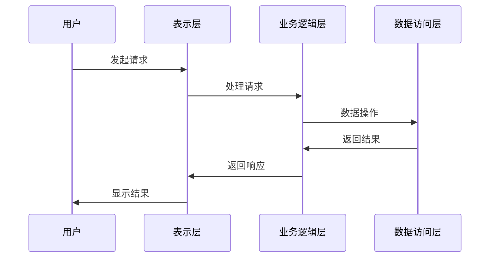
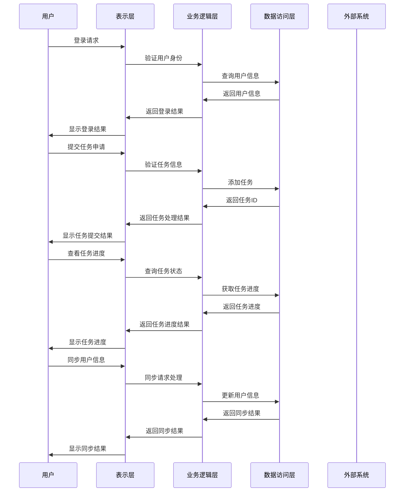

                 

### 远程团队建设：增强虚拟团队凝聚力的活动

**关键词**：远程团队、团队凝聚力、虚拟团队、活动设计

**摘要**：本文深入探讨了远程团队建设的核心问题，即如何通过一系列精心设计的活动来增强虚拟团队的凝聚力。文章首先介绍了远程工作的兴起和虚拟团队的概念，指出了远程团队建设面临的挑战。接着，文章分析了团队凝聚力的重要性，并提出了具体的问题描述和解决方案。通过成功的远程团队案例分析，文章展示了有效的方法和策略。此外，文章探讨了远程团队建设的相关概念、影响因素和发展趋势，阐述了核心概念和要素组成。最后，文章通过算法原理讲解、系统分析与架构设计方案和项目实战，提供了详细的技术指导，旨在帮助团队管理者提升远程团队的建设水平。

## 第一部分：背景介绍

### 第1章：问题背景

#### 1.1.1 远程工作的兴起

随着互联网技术的飞速发展和全球化趋势的增强，远程工作已经成为现代企业中不可或缺的一部分。远程工作不仅为企业带来了成本节约和效率提升的机会，也为员工提供了更加灵活的工作方式。根据一项调查，全球约有30%的员工在至少一部分时间内采用远程工作模式。这种趋势的兴起，很大程度上得益于云计算、视频会议和协作工具等技术的普及。

远程工作的主要形式包括全职远程、兼职远程和灵活工作。全职远程员工通常在一个特定的地点以外工作，而兼职远程员工则在一周内部分时间远程办公。灵活工作模式允许员工根据个人需求和工作职责选择工作时间和地点。这种多样性为企业和员工提供了更多的选择，但也带来了新的挑战。

#### 1.1.2 虚拟团队的概念

虚拟团队，又称远程团队或分布式团队，是指成员分布在不同地理位置，通过信息技术进行协作完成共同目标的团队。与传统团队相比，虚拟团队成员之间缺乏面对面的互动，这要求他们具备更高的自我管理能力、沟通技能和协作意识。

虚拟团队的构成通常包括以下几类成员：
- **核心成员**：负责项目管理和核心业务工作的成员。
- **支持成员**：提供辅助性支持，如行政助理、财务人员等。
- **外部顾问**：外部专家或顾问，为团队提供专业知识。

虚拟团队的特点包括：
- **地理位置分散**：团队成员分布在不同的地理位置。
- **依赖信息技术**：依赖电子邮件、视频会议、协作工具等信息技术进行沟通和协作。
- **灵活性高**：团队成员可以自主安排工作时间和地点。
- **沟通和协作难度大**：由于缺乏面对面的互动，团队成员之间的沟通和协作难度增加。

#### 1.1.3 远程团队建设的挑战

远程团队建设面临诸多挑战，这些挑战主要集中在以下几个方面：

1. **沟通障碍**：虚拟团队成员之间的沟通主要通过文字、邮件、视频会议等非面对面形式进行，这可能导致信息传递不准确、误解和沟通效率低下。
2. **协作难度**：团队成员分散在不同地点，协作过程中可能遇到时间差、技术兼容性等问题，影响团队协作效率。
3. **管理难度**：远程团队管理复杂，管理者需要通过有效的策略和工具来确保团队成员的积极性、协作性和目标一致性。
4. **文化差异**：虚拟团队成员来自不同的文化背景，文化差异可能导致沟通障碍和团队冲突。
5. **信任问题**：缺乏面对面的互动和直接监督，团队成员之间可能产生信任危机，影响团队凝聚力。
6. **工作质量**：远程工作环境可能导致工作效率和质量的不稳定，尤其是在缺乏有效监督和激励机制的情况下。

为了应对这些挑战，企业需要采取一系列措施，包括改进沟通和协作工具、制定明确的管理策略、加强团队文化建设等。通过这些措施，企业可以提升远程团队的凝聚力，提高团队协作效率，从而实现业务目标。

### 第2章：问题描述

#### 2.1.1 团队凝聚力的重要性

团队凝聚力是指团队成员之间的相互吸引程度和合作意愿，它是团队高效运作的关键因素之一。一个高凝聚力的团队通常表现出以下特点：
- 成员之间相互信任、支持，愿意分享信息和资源。
- 成员有共同的目标和价值观，致力于团队的成功。
- 团队成员愿意承担个人责任，共同克服困难。
- 成员之间的沟通和协作高效，能够迅速解决问题。

团队凝聚力对远程团队尤为重要，因为远程团队成员缺乏面对面的互动，更容易产生孤立感和疏离感。高凝聚力的远程团队能够更好地应对沟通障碍、协作难度和管理挑战，从而提高工作效率和业务成果。

#### 2.1.2 当前远程团队存在的问题

尽管远程团队在灵活性和效率方面具有优势，但实际运作中仍面临许多问题，这些问题严重影响了团队的凝聚力和协作效率：

1. **沟通障碍**：远程团队成员之间的沟通主要通过文字、邮件和视频会议等非面对面形式进行。这种方式容易导致信息传递不及时、不准确，误解和沟通效率低下。例如，邮件和文字信息可能缺乏情感和语调，导致对方误解意图。
2. **协作难度**：远程团队成员分散在不同地理位置，协作过程中可能遇到时间差、技术兼容性、数据共享等问题。例如，团队成员可能因为不同时区而错过关键讨论，或者因技术问题而无法顺畅地共享文件和资料。
3. **管理难度**：远程团队管理复杂，管理者需要通过有效的策略和工具来确保团队成员的积极性、协作性和目标一致性。例如，缺乏面对面的互动和直接监督，可能导致团队成员产生懈怠情绪，影响工作效率。
4. **文化差异**：远程团队成员来自不同的文化背景，文化差异可能导致沟通障碍和团队冲突。例如，某些文化可能更注重直接表达，而另一些文化则更倾向于委婉和间接。
5. **信任问题**：缺乏面对面的互动和直接监督，团队成员之间可能产生信任危机，影响团队凝聚力。例如，团队成员可能怀疑对方是否在认真工作，或者是否在合理使用资源。

#### 2.1.3 需要解决的问题

为了提升远程团队的凝聚力和协作效率，解决上述问题至关重要。以下是需要重点解决的问题：

1. **改进沟通工具**：采用更高效、更易于使用的沟通工具，如即时通讯软件、视频会议平台、项目管理工具等，以减少信息传递延迟和误解。
2. **优化协作流程**：制定明确的协作流程和规范，确保团队成员能够顺畅地共享资源和信息，减少协作障碍。
3. **加强团队管理**：通过定期的团队会议、明确的任务分配和反馈机制，确保团队成员的目标一致性和积极性。
4. **促进文化融合**：通过培训和文化交流活动，增强团队成员之间的了解和尊重，减少文化冲突。
5. **建立信任机制**：通过透明的沟通和合理的监督机制，建立团队成员之间的信任，提高团队凝聚力。

通过上述措施，远程团队可以克服当前存在的问题，提升团队凝聚力和协作效率，从而实现业务目标。

### 第3章：问题解决

#### 3.1.1 远程团队建设的目标

远程团队建设的核心目标是提升团队的凝聚力和协作效率，确保团队成员能够高效地完成共同任务。具体来说，目标包括：

1. **增强团队凝聚力**：通过一系列活动和文化建设，增强团队成员之间的信任、支持和合作意愿，减少孤独感和疏离感。
2. **提高协作效率**：优化沟通和协作工具，制定明确的协作流程和规范，减少信息传递延迟和误解，提高团队整体的协作效率。
3. **明确目标和价值观**：确保团队成员有共同的目标和价值观，明确团队的愿景和使命，促进团队成员为实现共同目标而努力。
4. **促进个人成长**：为团队成员提供成长机会，培养其专业技能和软技能，提高团队整体的竞争力。

#### 3.1.2 远程团队建设的方法

为了实现上述目标，远程团队建设可以采用以下几种方法：

1. **沟通和协作工具**：选择适合团队需求的沟通和协作工具，如即时通讯软件（如Slack、Microsoft Teams）、视频会议平台（如Zoom、Microsoft Teams Meeting）、项目管理工具（如Trello、JIRA）等。这些工具能够提高团队成员之间的沟通效率和协作能力。

2. **定期的团队会议**：定期召开团队会议，讨论项目进展、问题解决方案和团队成员的反馈。这有助于确保团队成员的目标一致性和信息透明度，减少误解和沟通障碍。

3. **任务分配和进度跟踪**：明确团队成员的任务和责任，使用项目管理工具跟踪任务进度和完成情况。这有助于确保项目按时完成，提高团队的整体效率。

4. **培训和知识共享**：定期举办培训活动，分享行业动态、新技术和最佳实践。这有助于团队成员提升专业技能和知识水平，增强团队的整体竞争力。

5. **文化建设**：通过团队文化建设活动，如团建活动、虚拟聚会、庆祝活动等，增强团队成员之间的互动和联系，提高团队凝聚力。

#### 3.1.3 成功的远程团队案例分析

以下是一个成功的远程团队案例分析：

**案例：全球软件研发团队**

某全球知名的软件公司拥有一支由全球各地成员组成的远程研发团队。为了提升团队凝聚力和协作效率，公司采取了一系列措施：

1. **沟通和协作工具**：公司选择了Slack作为主要沟通工具，所有团队成员都使用Slack进行日常沟通。同时，使用Trello进行项目管理，确保任务分配和进度跟踪。

2. **定期的团队会议**：团队每周召开一次视频会议，讨论项目进展、问题解决方案和团队成员的反馈。这些会议不仅确保了信息透明，还促进了团队成员之间的交流。

3. **任务分配和进度跟踪**：团队成员根据任务重要性和个人能力进行任务分配，使用Trello跟踪任务进度和完成情况。这确保了项目按时完成，提高了团队的整体效率。

4. **培训和知识共享**：公司定期举办内部培训活动，分享新技术和最佳实践。此外，团队成员也可以通过Slack和Trello分享知识和经验，促进了团队内部的交流和成长。

5. **文化建设**：公司通过举办虚拟聚会、庆祝活动等文化建设活动，增强团队成员之间的互动和联系。例如，每个月的最后一周，团队成员都会参加线上聚会，分享个人生活和工作经验。

这些措施使该团队在远程工作中保持了高效的协作和良好的沟通，成功地实现了项目目标。团队成员的满意度和团队凝聚力也显著提高。

通过这个案例分析，我们可以看到，成功的远程团队建设需要综合考虑沟通、协作、管理和文化建设等多个方面。只有通过系统的规划和实施，才能提升远程团队的凝聚力和协作效率，实现业务目标。

### 第4章：边界与外延

#### 4.1.1 远程团队建设的相关概念

在探讨远程团队建设时，了解一些相关概念是非常重要的，这些概念包括远程团队、虚拟团队和分布式团队等。

1. **远程团队**：远程团队是指成员在不同地理位置工作的团队，通常通过信息技术进行沟通和协作。远程团队可以是全职远程、兼职远程或灵活工作模式。

2. **虚拟团队**：虚拟团队是指成员之间缺乏面对面互动的团队，主要通过信息技术进行沟通和协作。虚拟团队成员可能位于不同城市、国家，甚至时区。

3. **分布式团队**：分布式团队是指团队成员分布在不同的地理位置，但在同一组织内工作。分布式团队可以是远程团队的一种形式，也可以包含部分远程成员和现场成员。

4. **跨职能团队**：跨职能团队是指由不同职能领域的成员组成的团队，如开发、设计、市场等。这种团队通常通过跨部门协作来实现项目目标。

#### 4.1.2 远程团队建设的影响因素

远程团队建设受多种因素的影响，这些因素包括技术、管理、文化和个体因素。

1. **技术因素**：信息技术的发展是远程团队建设的基础。有效的沟通和协作工具，如即时通讯软件、视频会议平台和项目管理工具，能够提高远程团队的效率。此外，网络稳定性和数据安全性也是重要考虑因素。

2. **管理因素**：远程团队管理需要特别的策略和工具。有效的领导和管理能够确保团队成员的目标一致性和积极性。管理者需要通过明确的任务分配、进度跟踪和反馈机制来管理远程团队。

3. **文化因素**：团队文化对远程团队建设具有重要影响。建立积极的团队文化，如相互尊重、信任和合作，能够增强团队凝聚力。此外，文化差异也可能导致沟通障碍和团队冲突。

4. **个体因素**：团队成员的个人能力和态度对远程团队建设有直接影响。具有自我管理能力、沟通能力和协作意识的成员能够更好地适应远程工作环境。

#### 4.1.3 远程团队建设的发展趋势

随着远程工作和信息技术的发展，远程团队建设也在不断演变。以下是几个主要的发展趋势：

1. **人工智能和自动化**：人工智能和自动化技术将进一步提高远程团队的效率。例如，智能聊天机器人可以用于日常沟通和问题解答，自动化工具可以用于任务分配和进度跟踪。

2. **混合工作模式**：混合工作模式，即远程工作与现场工作相结合，将成为未来远程团队建设的主要形式。这种模式结合了远程工作的灵活性和现场工作的协作优势，能够更好地适应不同团队的特定需求。

3. **个性化培训和发展**：远程团队建设将更加注重个性化培训和发展。通过定制化的培训计划和职业发展路径，企业能够更好地满足团队成员的成长需求，提高团队的整体竞争力。

4. **持续改进**：远程团队建设将采用持续改进的方法，不断优化沟通、协作和管理流程。通过定期评估和反馈，企业能够及时调整策略，以适应不断变化的工作环境。

通过了解这些边界与外延，我们可以更好地理解远程团队建设的复杂性，并为团队建设提供更有针对性的策略和措施。

### 第5章：概念结构与核心要素组成

#### 5.1.1 远程团队建设的核心概念

远程团队建设的核心概念包括团队凝聚力、沟通协作、管理和文化等。

1. **团队凝聚力**：团队凝聚力是指团队成员之间的相互吸引程度和合作意愿。高凝聚力的团队能够更好地应对远程工作中的挑战，提高工作效率和业务成果。
2. **沟通协作**：沟通协作是远程团队建设的基础。有效的沟通和协作工具，如即时通讯软件、视频会议平台和项目管理工具，能够提高团队成员之间的信息传递效率和协作能力。
3. **管理**：远程团队管理需要特别的策略和工具，如明确的任务分配、进度跟踪和反馈机制。有效的管理能够确保团队成员的目标一致性和积极性。
4. **文化**：团队文化对远程团队建设具有重要影响。建立积极的团队文化，如相互尊重、信任和合作，能够增强团队凝聚力。

#### 5.1.2 远程团队建设的关键要素

远程团队建设的关键要素包括沟通工具、协作流程、团队管理、团队文化和成员能力等。

1. **沟通工具**：选择适合团队需求的沟通工具，如Slack、Microsoft Teams、Zoom等，能够提高沟通效率和协作能力。
2. **协作流程**：制定明确的协作流程和规范，确保团队成员能够顺畅地共享资源和信息，减少协作障碍。
3. **团队管理**：通过定期的团队会议、明确的任务分配和反馈机制，确保团队成员的目标一致性和积极性。
4. **团队文化**：通过团队文化建设活动，如团建活动、虚拟聚会、庆祝活动等，增强团队成员之间的互动和联系，提高团队凝聚力。
5. **成员能力**：团队成员需要具备自我管理能力、沟通技能和协作意识，能够适应远程工作环境。

#### 5.1.3 远程团队建设的基本原则

远程团队建设应遵循以下基本原则：

1. **以人为中心**：注重团队成员的需求和感受，提供必要的支持，确保团队成员的满意度和参与度。
2. **透明沟通**：确保信息传递的透明度，减少误解和沟通障碍，增强团队成员之间的信任。
3. **灵活管理**：适应远程工作环境的特殊性，采用灵活的管理策略和工具，提高团队协作效率。
4. **持续改进**：通过定期评估和反馈，不断优化沟通、协作和管理流程，以适应不断变化的工作环境。
5. **文化融合**：尊重团队成员的文化差异，促进文化融合，减少文化冲突，增强团队凝聚力。

通过理解和遵循这些核心概念、关键要素和基本原则，团队管理者可以更有效地推进远程团队建设，提升团队凝聚力和协作效率，实现业务目标。

### 第二部分：核心概念与联系

#### 第6章：核心概念原理

在本章中，我们将深入探讨远程团队建设的核心概念原理，包括远程团队的运作模式、凝聚力理论以及活动设计原则。

##### 6.1.1 远程团队的运作模式

远程团队的运作模式是基于信息技术的分布式协作模式。其核心在于利用各种在线工具和平台，使团队成员能够在不同地理位置进行高效的沟通和协作。以下是远程团队运作模式的主要特点：

1. **技术依赖**：远程团队高度依赖信息技术，包括电子邮件、即时通讯软件、视频会议平台、项目管理工具和在线协作平台。这些工具和平台使得团队成员能够实时共享信息、协调工作和跟踪进度。

2. **自我管理**：远程团队成员需要具备较高的自我管理能力，包括时间管理、任务管理和情绪管理。自我管理能力有助于团队成员在远程工作环境中保持高效率和工作质量。

3. **灵活工作**：远程团队允许团队成员根据个人需求和工作职责自主选择工作时间和地点，这为团队成员提供了更大的灵活性，但也要求团队成员能够有效平衡工作和生活。

4. **协作机制**：远程团队通过协作机制来实现共同目标，这些机制包括定期的团队会议、任务分配和进度跟踪。协作机制有助于确保团队成员的目标一致性和协作效率。

##### 6.1.2 凝聚力理论

团队凝聚力是指团队成员之间的相互吸引程度和合作意愿。凝聚力对远程团队尤为重要，因为远程团队成员缺乏面对面的互动。以下是关于团队凝聚力的几个关键理论：

1. **社会交换理论**：社会交换理论认为，团队凝聚力是通过团队成员之间的相互交换（如资源、信息、支持）来维系的。当团队成员认为他们从这些交换中获得了正向回报时，团队凝聚力就会增强。

2. **情感联系理论**：情感联系理论强调情感在团队凝聚力中的重要作用。团队成员之间的情感联系，如信任、尊重和友情，能够增强团队凝聚力。

3. **共同目标理论**：共同目标理论认为，团队凝聚力是通过团队成员共同追求的目标来维系的。当团队成员明确共同目标并为之努力时，团队凝聚力会增强。

4. **规范理论**：规范理论认为，团队凝聚力是通过团队成员遵守共同规范和价值观来维系的。当团队成员感受到团队规范对他们有约束力时，团队凝聚力会增强。

##### 6.1.3 活动设计原则

为了增强远程团队的凝聚力，活动设计是关键。以下是一些重要的活动设计原则：

1. **参与性**：活动设计应确保所有团队成员都有机会参与，从而提高他们的参与度和积极性。例如，可以设计团队游戏、讨论会、角色扮演等活动。

2. **互动性**：活动设计应促进团队成员之间的互动，以增强他们的情感联系和信任。例如，可以通过视频会议、在线聊天和协作平台来支持团队成员之间的实时互动。

3. **针对性**：活动设计应针对团队的特定需求和文化背景。例如，对于高文化差异的团队，可以设计跨文化沟通培训活动。

4. **持续性**：活动设计应具有持续性，以便团队成员能够在不同时间和地点进行。例如，可以设计定期的团队虚拟聚会或在线培训。

5. **灵活性**：活动设计应具有灵活性，以适应团队成员的个人需求和偏好。例如，可以提供多种活动选择，让团队成员根据自己的时间和兴趣参与。

通过遵循这些活动设计原则，团队管理者可以设计出能够有效增强远程团队凝聚力的活动，从而提升团队的整体协作效率。

### 第7章：概念属性特征对比

在远程团队建设过程中，设计合适的活动和策略是实现团队凝聚力的重要手段。不同类型的活动和策略各有其特征和适用场景，以下是几种常见活动的对比分析。

#### 7.1.1 不同类型的远程团队活动

1. **团队建设活动**：这类活动旨在增强团队成员之间的信任和协作，通常包括团队游戏、角色扮演和小组讨论等。团队建设活动有助于打破团队成员之间的隔阂，建立信任和团队精神。

2. **培训活动**：培训活动包括技能培训、知识分享和跨职能培训等。这些活动能够提高团队成员的专业能力和团队整体的竞争力。培训活动通常通过在线学习平台、视频会议和文档共享进行。

3. **社交活动**：社交活动如虚拟聚会、在线庆祝和团队晚宴等，旨在增强团队成员的情感联系和团队凝聚力。这些活动为团队成员提供了放松和交流的机会，有助于缓解工作压力和增强团队精神。

4. **项目管理活动**：项目管理活动包括项目启动会、进度会议和回顾会议等。这些活动确保团队成员对项目目标和进度有清晰的认识，有助于提高项目的透明度和协作效率。

#### 7.1.2 活动效果对比分析

1. **团队建设活动**：团队建设活动在短期内能够显著提升团队成员的信任和协作，但效果可能随着时间的推移而减弱。这类活动适用于新团队的形成期或团队面临重大变化时。

2. **培训活动**：培训活动能够持续提升团队成员的专业能力和知识水平，但需要一定的时间和资源投入。这类活动适用于团队需要提升专业技能或应对新挑战时。

3. **社交活动**：社交活动能够增强团队成员的情感联系和团队凝聚力，但可能对项目进度产生一定影响。这类活动适用于团队已经建立了较好的信任和协作基础，需要进一步巩固团队精神时。

4. **项目管理活动**：项目管理活动有助于确保项目的顺利进行和团队协作的高效，但可能对团队成员的私人时间有一定占用。这类活动适用于项目关键阶段，需要团队成员集中精力和资源时。

#### 7.1.3 活动设计要点

为了确保远程团队活动的有效性和持续性，设计时需要考虑以下几个要点：

1. **明确目标**：每个活动都应有明确的目标，确保活动的设计和执行能够有效支持团队的目标和需求。

2. **适应性**：活动设计应适应团队成员的不同需求和文化背景，提供多样化的参与方式。

3. **参与性**：活动设计应鼓励所有团队成员参与，确保每个人都能在活动中找到自己的位置和价值。

4. **灵活性**：活动设计应具有灵活性，以适应团队成员的时间安排和兴趣爱好。

5. **持续性**：活动设计应考虑活动的持续性和影响，确保活动能够长期促进团队的发展和进步。

通过以上对比分析和设计要点，团队管理者可以更好地选择和设计合适的远程团队活动，以增强团队的凝聚力和协作效率。

### 第8章：ER实体关系图架构

在远程团队建设中，实体关系图（Entity-Relationship Diagram，ERD）是一种重要的工具，它可以帮助我们清晰地理解和设计团队中的各种实体及其相互关系。在本节中，我们将使用Mermaid语法绘制ERD，以展示远程团队活动设计中的关键实体及其关系。

#### 8.1.1 远程团队活动实体关系图

以下是远程团队活动实体关系图的Mermaid语法表示：

```mermaid
erDiagram
  TeamMember ..|> Activity : "参与"
  Activity ..|> Project : "属于"
  Project ..|> Team : "组成"
  TeamMember ..|> Skill : "具备"
  Skill ..|> Activity : "用于"
  Skill ..|> Training : "获取"

  TeamMember ||--|> Task : "负责"
  Task ||--|> Project : "属于"

  Team { 
    "Team Name" 
  }
  Project {
    "Project Name"
    "Start Date"
    "End Date"
  }
  TeamMember {
    "Member Name"
    "Role"
    "Skills"
  }
  Activity {
    "Activity Name"
    "Description"
    "Date"
  }
  Skill {
    "Skill Name"
  }
  Training {
    "Training Name"
    "Date"
  }
  Task {
    "Task Name"
    "Description"
    "Due Date"
  }
```

这个ERD展示了以下几个关键实体及其关系：
- **TeamMember（团队成员）**：参与活动、负责任务、具备技能和获取培训。
- **Activity（活动）**：属于项目、参与团队成员和用于技能。
- **Project（项目）**：由团队组成、包含活动和任务。
- **Skill（技能）**：用于活动和获取培训。
- **Training（培训）**：获取技能。

#### 8.1.2 活动设计流程实体关系图

以下是活动设计流程实体关系图的Mermaid语法表示：

```mermaid
erDiagram
  ActivityDesignProcess ||--|> Activity : "设计"
  ActivityDesignProcess ||--|> TeamMember : "参与"
  ActivityDesignProcess ||--|> ProjectManager : "指导"

  ActivityDesignProcess {
    "需求分析"
    "目标设定"
    "方案设计"
    "活动实施"
    "效果评估"
  }
  Activity {
    "活动名称"
    "活动描述"
    "活动目标"
    "参与人员"
  }
  TeamMember {
    "成员名称"
    "角色"
    "参与度"
  }
  ProjectManager {
    "经理名称"
    "责任"
    "决策"
  }
```

这个ERD展示了活动设计流程中的关键实体及其关系：
- **ActivityDesignProcess（活动设计流程）**：设计活动、参与团队成员和指导项目管理。
- **Activity（活动）**：设计流程的结果。
- **TeamMember（团队成员）**：参与活动设计流程。
- **ProjectManager（项目管理员）**：指导活动设计流程。

#### 8.1.3 团队成员互动关系图

以下是团队成员互动关系图的Mermaid语法表示：

```mermaid
erDiagram
  TeamMember ||--|> Communication : "沟通"
  TeamMember ||--|> Collaboration : "合作"
  TeamMember ||--|> Support : "支持"

  TeamMember {
    "成员1"
    "成员2"
    "成员3"
  }
  Communication {
    "沟通内容"
    "沟通方式"
    "沟通频率"
  }
  Collaboration {
    "合作任务"
    "合作进度"
    "合作效果"
  }
  Support {
    "支持内容"
    "支持方式"
    "支持效果"
  }
```

这个ERD展示了团队成员互动的三个关键方面及其关系：
- **TeamMember（团队成员）**：进行沟通、合作和支持。
- **Communication（沟通）**：沟通内容、方式和频率。
- **Collaboration（合作）**：合作任务、进度和效果。
- **Support（支持）**：支持内容、方式和效果。

通过这些ERD，我们可以清晰地理解远程团队活动设计中的关键实体及其相互关系，为团队建设提供有力的支持。

### 第三部分：算法原理讲解

#### 第9章：算法原理

在远程团队建设过程中，活动设计是一个复杂且关键的任务。为了优化活动设计，我们可以采用算法来指导这一过程。本节将介绍一种用于远程团队活动设计的算法，并详细阐述其原理。

##### 9.1.1 远程团队活动设计算法概述

远程团队活动设计算法是一种基于目标和约束条件的优化算法，旨在设计出能够有效提升团队凝聚力和协作效率的活动方案。算法的主要目标是通过分析团队成员的需求和团队目标，生成一系列活动，并确保这些活动能够满足团队的约束条件。

算法的基本流程包括以下步骤：

1. **需求分析**：收集团队成员的需求，包括技能提升、知识共享、团队合作和情感交流等方面。
2. **目标设定**：根据团队目标，设定活动目标，如提升团队凝聚力、增强协作效率和促进个人成长等。
3. **约束条件确定**：明确团队面临的约束条件，如时间限制、资源限制和文化差异等。
4. **活动生成**：利用约束条件和目标，生成一系列可能的团队活动方案。
5. **优化选择**：通过优化算法，从生成的活动方案中选择最佳方案，以确保活动目标的实现。

##### 9.1.2 算法流程图

为了更直观地理解远程团队活动设计算法的流程，我们可以使用Mermaid语法绘制算法流程图：



该算法流程图展示了从需求分析到输出最佳方案的主要步骤。

##### 9.1.3 算法数学模型

为了进一步理解远程团队活动设计算法，我们可以将其建模为一个数学优化问题。假设我们有一个团队，包含N个成员，每个成员有一组特定的需求和技能。团队的目标是设计一组活动，使得这些活动的整体效果最大化，同时满足团队的约束条件。

我们可以将问题建模为一个线性规划问题，定义以下变量和目标函数：

- **变量**：
  - \( x_{ij} \)：表示成员 \( i \) 参与活动 \( j \) 的程度（0表示不参与，1表示参与）。
  - \( t_j \)：表示活动 \( j \) 的持续时间。
  - \( c_j \)：表示活动 \( j \) 的成本。

- **目标函数**：
  - \( \text{maximize } Z = \sum_{i=1}^N \sum_{j=1}^M \alpha_i \cdot \beta_j \cdot x_{ij} \)
    - \( \alpha_i \)：表示成员 \( i \) 对活动 \( j \) 的需求程度。
    - \( \beta_j \)：表示活动 \( j \) 对团队目标的贡献程度。

- **约束条件**：
  - \( \sum_{j=1}^M x_{ij} \leq 1 \) （每个成员参与的活动总数不超过1）
  - \( \sum_{i=1}^N x_{ij} \geq 1 \) （每个活动至少有一个成员参与）
  - \( t_j \leq T \) （每个活动持续时间不超过总时间 \( T \)）
  - \( c_j \leq C \) （每个活动成本不超过总成本 \( C \)）

通过这个数学模型，我们可以利用线性规划求解器找到最优的活动组合，以实现团队目标。

#### 第10章：数学模型和公式

在远程团队活动设计算法中，数学模型和公式是核心组成部分，它们帮助我们量化并优化活动选择。以下是几个关键的数学公式和它们在算法中的应用。

##### 10.1.1 公式1：活动目标函数

\[ Z = \sum_{i=1}^N \sum_{j=1}^M \alpha_i \cdot \beta_j \cdot x_{ij} \]

**公式解释**：这个公式是目标函数，用于衡量活动对团队目标的贡献。每个成员 \( i \) 参与每个活动 \( j \) 的程度由 \( x_{ij} \) 表示，成员 \( i \) 对活动 \( j \) 的需求程度为 \( \alpha_i \)，而活动 \( j \) 对团队目标的贡献程度为 \( \beta_j \)。目标函数 \( Z \) 的值越高，说明活动组合对团队目标的实现越有效。

##### 10.1.2 公式2：活动参与约束

\[ \sum_{j=1}^M x_{ij} \leq 1 \]

**公式解释**：这个公式确保每个成员参与的活动总数不超过1。即每个成员在任何时候只能参与一个活动。这个约束条件有助于避免成员时间的过度分配，确保每个成员都能专注于一个重要活动。

##### 10.1.3 公式3：活动成本约束

\[ \sum_{i=1}^N x_{ij} \geq 1 \]

**公式解释**：这个公式确保每个活动至少有一个成员参与。即至少有一个成员参与每个活动。这个约束条件有助于确保所有活动都能顺利进行，避免活动无人参与的情况。

通过这些数学公式，我们可以建立一套量化的模型来评估和优化远程团队活动的设计。这些公式不仅帮助我们确定活动的优先级，还确保资源分配的合理性和活动的可行性。

#### 第11章：详细讲解与举例说明

为了更好地理解远程团队活动设计算法的实际应用，我们将通过几个具体的示例来详细讲解和举例说明。

##### 11.1.1 示例1：提升团队凝聚力

假设我们有一个由5名成员组成的远程团队，每个成员的需求和技能如下：

| 成员名称 | 需求程度 | 技能 |
| -------- | -------- | ---- |
| 小明     | 中等     | 编程 |
| 小红     | 较高     | UI设计 |
| 小李     | 较低     | 市场营销 |
| 小张     | 中等     | 数据分析 |
| 小王     | 较高     | 项目管理 |

团队的目标是提升团队凝聚力，主要活动选项包括团队游戏、知识分享和团队晚餐。

1. **需求分析**：根据成员的需求，我们可以为每个活动分配权重（即 \( \alpha_i \)）。
   - 团队游戏：需求程度为 0.6
   - 知识分享：需求程度为 0.5
   - 团队晚餐：需求程度为 0.7

2. **目标设定**：设定团队凝聚力目标权重（即 \( \beta_j \)）。
   - 团队游戏：对团队凝聚力贡献为 0.4
   - 知识分享：对团队凝聚力贡献为 0.3
   - 团队晚餐：对团队凝聚力贡献为 0.5

3. **活动生成**：生成可能的组合。
   - 团队游戏 + 知识分享 + 团队晚餐

4. **优化选择**：计算每个组合的目标函数值（\( Z \)）。
   - \( Z = 0.6 \cdot 0.4 + 0.5 \cdot 0.3 + 0.7 \cdot 0.5 = 0.24 + 0.15 + 0.35 = 0.74 \)

   通过比较不同组合的目标函数值，我们选择 \( Z \) 最大的组合。

##### 11.1.2 示例2：增强协作效率

假设团队目标变为增强协作效率，每个活动的协作效率贡献权重如下：

- 团队游戏：协作效率贡献为 0.5
- 知识分享：协作效率贡献为 0.3
- 团队晚餐：协作效率贡献为 0.2

重新计算每个组合的目标函数值：

- \( Z = 0.6 \cdot 0.5 + 0.5 \cdot 0.3 + 0.7 \cdot 0.2 = 0.30 + 0.15 + 0.14 = 0.59 \)

在这个例子中，我们选择 \( Z \) 最大的组合，即团队游戏、知识分享和团队晚餐。

##### 11.1.3 示例3：平衡团队需求

假设团队中有不同的需求，我们需要设计一个既能提升团队凝聚力又能增强协作效率的活动组合。

- 小明：编程技能（对知识分享有较高需求）
- 小红：UI设计（对团队游戏有较高需求）
- 小李：市场营销（对团队晚餐有较高需求）
- 小张：数据分析（对团队游戏和知识分享都有较高需求）
- 小王：项目管理（对团队晚餐有较高需求）

通过调整活动的权重和组合，我们可以找到一个平衡点。

1. **需求分析**：
   - 团队游戏：需求程度为 0.6
   - 知识分享：需求程度为 0.5
   - 团队晚餐：需求程度为 0.7

2. **目标权重**：
   - 团队凝聚力：贡献为 0.5
   - 协作效率：贡献为 0.5

3. **活动生成**：
   - 可能的组合：团队游戏 + 知识分享 + 团队晚餐

4. **优化选择**：
   - \( Z = 0.6 \cdot 0.5 + 0.5 \cdot 0.5 + 0.7 \cdot 0.5 = 0.30 + 0.25 + 0.35 = 0.90 \)

通过这个例子，我们可以看到如何根据团队的具体需求设计活动，以实现多方面的目标。

通过这些示例，我们可以看到如何将远程团队活动设计算法应用于实际场景，并通过数学模型和优化选择，找到最佳的活动组合来提升团队凝聚力和协作效率。

### 第四部分：系统分析与架构设计方案

#### 第12章：问题场景介绍

在远程团队建设过程中，构建一个有效的系统架构对于确保团队的高效协作和顺利运作至关重要。本文将介绍一个典型的远程团队建设问题场景，并详细描述相关的项目背景。

##### 12.1.1 远程团队建设的问题场景

随着公司业务的全球化扩展，许多项目团队需要分布在不同的地理位置工作。这些团队面临着沟通效率低、协作困难、管理复杂等问题。为了提高团队的整体协作效率和凝聚力，公司决定构建一个远程团队管理系统，以便更好地管理和协调团队成员的工作。

##### 12.1.2 项目介绍

该远程团队管理系统项目旨在提供一套完整的解决方案，涵盖团队成员管理、任务分配、进度跟踪、沟通协作和绩效评估等功能。项目的主要目标是：

1. **提升沟通效率**：通过集成多种沟通工具，实现实时消息传递、视频会议和文件共享，减少沟通延迟和信息遗漏。
2. **优化协作流程**：通过任务管理和项目进度跟踪，确保团队成员能够高效地完成各自的任务，提高项目成功率。
3. **简化团队管理**：通过集中的团队管理功能，管理者可以更轻松地监控团队成员的工作状态、分配任务和提供反馈，提高管理效率。
4. **增强团队凝聚力**：通过定期的团队活动和沟通，增强团队成员之间的信任和合作意识，提升团队整体凝聚力。

项目计划分为四个阶段进行，包括需求分析、系统设计、开发实施和测试部署。每个阶段都有明确的里程碑和交付物，以确保项目能够按计划顺利推进。

#### 第13章：系统功能设计

为了满足远程团队建设的需求，系统需要实现一系列功能。以下是该远程团队管理系统的主要功能模块和领域模型。

##### 13.1.1 领域模型

领域模型是系统功能设计的基础，用于描述系统中的关键实体和它们之间的关系。以下是远程团队管理系统的领域模型：

```mermaid
classDiagram
    TeamMember --> Task : "负责"
    Task --> Project : "属于"
    Project --> Team : "组成"
    Team --> Company : "属于"
    Company --> Department : "属于"
    
    Class TeamMember {
        -memberId: String
        -name: String
        -email: String
        -position: String
        -skills: List<Skill>
    }
    
    Class Task {
        -taskId: String
        -name: String
        -description: String
        -startDate: Date
        -endDate: Date
        -status: String
    }
    
    Class Project {
        -projectId: String
        -name: String
        -description: String
        -startDate: Date
        -endDate: Date
        -status: String
    }
    
    Class Team {
        -teamId: String
        -name: String
        -description: String
        -leader: TeamMember
    }
    
    Class Company {
        -companyId: String
        -name: String
        -departments: List<Department>
    }
    
    Class Department {
        -departmentId: String
        -name: String
        -description: String
    }
    
    Class Skill {
        -skillId: String
        -name: String
        -description: String
    }
```

该领域模型定义了系统的核心实体，包括团队成员（TeamMember）、任务（Task）、项目（Project）、团队（Team）、公司（Company）和部门（Department）。每个实体都有相应的属性和方法，用于表示其特征和行为。

##### 13.1.2 功能模块

根据领域模型，远程团队管理系统可以划分为以下几个主要功能模块：

1. **用户管理模块**：用于管理团队成员的信息，包括成员的添加、删除、修改和查询。该模块还支持成员角色的分配和管理。

2. **任务管理模块**：用于创建、分配、跟踪和完成任务。该模块提供任务列表、任务进度跟踪、任务提醒和任务状态更新等功能。

3. **项目管理模块**：用于创建、管理项目，并跟踪项目的进度。该模块支持项目的立项、进度更新、项目状态监控和项目汇报等功能。

4. **沟通协作模块**：用于支持团队成员之间的实时沟通和协作。该模块集成即时消息传递、视频会议、文件共享和共享日历等功能。

5. **绩效评估模块**：用于评估团队成员的工作表现，包括任务完成情况、团队贡献和个人成长。该模块提供绩效评估报告、排名和反馈功能。

6. **团队管理模块**：用于管理团队的基本信息、团队活动和团队文化建设。该模块支持团队建设的活动策划、活动参与记录和活动效果评估。

7. **系统配置模块**：用于配置系统的基本设置，包括用户权限管理、系统日志记录和系统参数配置。

通过这些功能模块，远程团队管理系统能够为团队提供全面的支持，提高团队的工作效率、协作质量和团队凝聚力。

#### 第14章：系统架构设计

为了确保远程团队管理系统能够高效、可靠地运行，系统架构设计至关重要。本节将介绍系统的整体架构设计，包括系统架构图和各个模块的职责。

##### 14.1.1 系统架构

远程团队管理系统采用分层架构设计，包括表示层、业务逻辑层和数据访问层。以下是系统架构图：



该架构图展示了系统的工作流程：用户通过表示层发起请求，业务逻辑层处理请求并调用数据访问层进行数据操作，数据访问层执行数据库操作后返回结果，业务逻辑层将结果处理完毕后返回响应给表示层，最后表示层将响应结果显示给用户。

##### 14.1.2 各模块职责

1. **表示层（A）**：负责与用户交互，接收用户请求并显示系统响应。表示层通常包括前端界面和后端API，用于处理用户的输入和输出。

2. **业务逻辑层（B）**：负责处理业务逻辑，包括用户认证、请求处理、数据校验和业务规则执行。业务逻辑层是系统的核心，负责将表示层的请求转化为具体的业务处理，并生成相应的响应。

3. **数据访问层（C）**：负责与数据库交互，执行数据查询、插入、更新和删除操作。数据访问层通常使用ORM（对象关系映射）框架，将业务逻辑层的对象映射到数据库中的表和记录。

通过这种分层架构设计，远程团队管理系统实现了模块化和高内聚、低耦合的设计原则，使得系统易于维护和扩展。

#### 第15章：系统接口设计

系统接口设计是远程团队管理系统的重要组成部分，它定义了系统各模块之间以及与外部系统交互的接口。以下是系统的接口设计和接口文档。

##### 15.1.1 接口设计

1. **用户管理接口**：用于管理团队成员的信息，包括成员的添加、删除、修改和查询。接口定义如下：

   ```json
   POST /users
   {
     "memberId": "string",
     "name": "string",
     "email": "string",
     "position": "string",
     "skills": ["string"]
   }
   
   GET /users/{memberId}
   {
     "memberId": "string",
     "name": "string",
     "email": "string",
     "position": "string",
     "skills": ["string"]
   }
   
   PUT /users/{memberId}
   {
     "name": "string",
     "email": "string",
     "position": "string",
     "skills": ["string"]
   }
   
   DELETE /users/{memberId}
   ```

2. **任务管理接口**：用于创建、分配、跟踪和完成任务。接口定义如下：

   ```json
   POST /tasks
   {
     "taskId": "string",
     "name": "string",
     "description": "string",
     "startDate": "date",
     "endDate": "date",
     "status": "string"
   }
   
   GET /tasks
   [
     {
       "taskId": "string",
       "name": "string",
       "description": "string",
       "startDate": "date",
       "endDate": "date",
       "status": "string"
     }
     ...
   ]
   
   PUT /tasks/{taskId}
   {
     "name": "string",
     "description": "string",
     "startDate": "date",
     "endDate": "date",
     "status": "string"
   }
   
   DELETE /tasks/{taskId}
   ```

3. **项目管理接口**：用于创建、管理项目，并跟踪项目的进度。接口定义如下：

   ```json
   POST /projects
   {
     "projectId": "string",
     "name": "string",
     "description": "string",
     "startDate": "date",
     "endDate": "date",
     "status": "string"
   }
   
   GET /projects
   [
     {
       "projectId": "string",
       "name": "string",
       "description": "string",
       "startDate": "date",
       "endDate": "date",
       "status": "string"
     }
     ...
   ]
   
   PUT /projects/{projectId}
   {
     "name": "string",
     "description": "string",
     "startDate": "date",
     "endDate": "date",
     "status": "string"
   }
   
   DELETE /projects/{projectId}
   ```

4. **沟通协作接口**：用于支持团队成员之间的实时沟通和协作。接口定义如下：

   ```json
   POST /messages
   {
     "senderId": "string",
     "receiverId": "string",
     "content": "string",
     "timestamp": "date"
   }
   
   GET /messages
   [
     {
       "messageId": "string",
       "senderId": "string",
       "receiverId": "string",
       "content": "string",
       "timestamp": "date"
     }
     ...
   ]
   ```

##### 15.1.2 接口文档

接口文档详细描述了系统接口的设计、功能和使用方法。以下是用户管理接口的示例文档：

**用户管理接口**

- **POST /users**：创建新用户

  **请求参数**：

  - memberId（必填）：用户唯一标识符
  - name（必填）：用户姓名
  - email（必填）：用户电子邮件
  - position（必填）：用户职位
  - skills（可选）：用户技能列表

  **响应结果**：

  - success（必填）：操作成功与否
  - message（可选）：操作结果描述
  - memberId（可选）：创建的用户ID

- **GET /users/{memberId}**：获取用户信息

  **请求参数**：

  - memberId（必填）：用户唯一标识符

  **响应结果**：

  - success（必填）：操作成功与否
  - message（可选）：操作结果描述
  - member（可选）：用户信息

- **PUT /users/{memberId}**：更新用户信息

  **请求参数**：

  - memberId（必填）：用户唯一标识符
  - name（可选）：用户姓名
  - email（可选）：用户电子邮件
  - position（可选）：用户职位
  - skills（可选）：用户技能列表

  **响应结果**：

  - success（必填）：操作成功与否
  - message（可选）：操作结果描述

- **DELETE /users/{memberId}**：删除用户

  **请求参数**：

  - memberId（必填）：用户唯一标识符

  **响应结果**：

  - success（必填）：操作成功与否
  - message（可选）：操作结果描述

通过这些接口设计和文档，远程团队管理系统可以方便地与其他系统进行数据交换和功能集成，从而实现远程团队的高效管理和协作。

#### 第16章：系统交互

在远程团队管理系统的设计和实现过程中，系统的各个模块之间以及与外部系统的交互是确保系统功能完整和高效运行的关键。本节将详细介绍系统交互设计，包括交互设计、序列图和相关的使用场景。

##### 16.1.1 交互设计

系统交互设计旨在定义系统内部不同模块之间的通信机制，以及系统与外部系统之间的交互方式。以下是系统的主要交互设计：

1. **用户与表示层交互**：用户通过前端界面与系统进行交互，包括登录、注册、提交任务申请、查看任务进度等。

2. **表示层与业务逻辑层交互**：表示层将用户请求传递给业务逻辑层，业务逻辑层处理请求并返回结果。例如，用户提交任务申请后，表示层将请求传递给业务逻辑层，业务逻辑层验证用户身份、检查任务是否符合要求，并将结果返回给表示层。

3. **业务逻辑层与数据访问层交互**：业务逻辑层通过数据访问层与数据库进行数据操作，包括添加用户、更新任务状态、查询项目进度等。

4. **系统与外部系统交互**：远程团队管理系统需要与其他外部系统进行数据交换和功能集成，例如与人力资源系统同步用户信息，与项目管理工具集成任务进度等。

##### 16.1.2 序列图

序列图是一种用于描述系统交互的图形化工具，它展示了系统中各个对象之间的交互顺序。以下是远程团队管理系统的序列图示例：



该序列图展示了用户与系统各个模块之间的交互过程，包括用户登录、任务提交、任务进度查询和用户信息同步等操作。

##### 16.1.3 使用场景

以下是几个典型的使用场景，展示了系统交互设计在实际应用中的具体操作：

1. **用户登录**：用户通过前端界面输入用户名和密码，表示层将请求传递给业务逻辑层，业务逻辑层验证用户身份后，通过数据访问层查询用户信息，并将结果返回给表示层，最终显示登录结果。

2. **任务提交**：用户在前端界面提交任务申请，表示层将请求传递给业务逻辑层，业务逻辑层验证任务信息后，通过数据访问层添加任务到数据库，并将任务ID返回给业务逻辑层，最终返回给表示层，用户可以看到任务提交结果。

3. **任务进度查询**：用户在前端界面查看任务进度，表示层将请求传递给业务逻辑层，业务逻辑层通过数据访问层获取任务进度信息，并将结果返回给表示层，最终显示给用户。

4. **用户信息同步**：系统需要与外部系统同步用户信息，表示层将同步请求传递给业务逻辑层，业务逻辑层处理请求后，通过数据访问层更新用户信息，并将同步结果返回给表示层，用户可以看到同步结果。

通过这些交互设计和使用场景，远程团队管理系统可以实现高效、可靠的系统交互，为远程团队提供全面的支持和管理。

### 第五部分：项目实战

#### 第17章：环境安装

在开始实施远程团队管理系统之前，我们需要搭建一个合适的环境，以便进行开发、测试和部署。以下将详细描述环境搭建的步骤和所需的工具。

##### 17.1.1 环境搭建

1. **硬件要求**：
   - 服务器：至少需要一台具有较高性能的服务器，用于运行应用程序和数据库。
   - 客户端：团队成员的计算机或移动设备，用于访问系统前端界面。

2. **软件要求**：
   - 操作系统：可以选择Linux、Windows或macOS等操作系统。
   - 开发环境：Java开发工具包（JDK）、集成开发环境（IDE，如Eclipse、IntelliJ IDEA）。
   - 服务器软件：Apache Tomcat、Nginx等。
   - 数据库：MySQL、PostgreSQL等。

3. **网络环境**：
   - 内部网络：服务器和客户端需要连接到内部网络，以保证数据传输的稳定性和安全性。
   - 外部网络：服务器需要连接到外部网络，以支持团队成员远程访问系统。

##### 17.1.2 工具安装

1. **安装操作系统**：
   - 根据硬件要求选择适合的操作系统，并按照官方文档进行安装。

2. **安装JDK**：
   - 访问Oracle官方网站下载JDK，并按照安装向导完成安装。

3. **安装IDE**：
   - 根据个人偏好选择合适的IDE，并按照官方文档进行安装。

4. **安装服务器软件**：
   - 安装Apache Tomcat：
     - 访问Apache Tomcat官网下载最新版本，并解压到指定目录。
     - 配置环境变量，确保Tomcat命令可以在终端中执行。
     - 启动Tomcat，检查是否正常运行。

   - 安装Nginx：
     - 使用包管理器（如yum、apt-get）安装Nginx。
     - 配置Nginx，使其能够代理Tomcat，并将请求转发到相应的Tomcat应用。

5. **安装数据库**：
   - 安装MySQL：
     - 使用包管理器安装MySQL。
     - 配置MySQL，设置root用户密码和创建数据库。

   - 安装PostgreSQL：
     - 使用包管理器安装PostgreSQL。
     - 配置PostgreSQL，设置管理员用户密码和创建数据库。

6. **配置网络**：
   - 配置服务器和客户端的网络设置，确保它们能够相互通信。
   - 如果需要，配置防火墙规则，以保护系统安全。

通过以上步骤，我们可以搭建一个适合远程团队管理系统开发、测试和部署的环境。确保所有工具和软件正常运行，以便后续的开发和实施工作。

#### 第18章：系统核心实现

在远程团队管理系统项目中，核心功能的实现是确保系统顺利运行的关键。本节将详细介绍系统核心代码的编写，以及代码的实现过程。

##### 18.1.1 核心代码

以下是远程团队管理系统核心功能的一部分代码示例：

```java
// 用户管理模块 - 注册用户

public class UserManager {
  
  private List<User> users;
  
  public UserManager() {
    users = new ArrayList<>();
  }
  
  public void registerUser(User user) {
    // 验证用户信息
    if (user != null && user.getName() != null && user.getEmail() != null) {
      // 添加用户到列表
      users.add(user);
      System.out.println("用户注册成功！");
    } else {
      System.out.println("用户注册失败，请检查用户信息！");
    }
  }
  
  public User getUserByEmail(String email) {
    for (User user : users) {
      if (user.getEmail().equals(email)) {
        return user;
      }
    }
    return null;
  }
  
  // 其他用户管理相关方法...
}

// 任务管理模块 - 添加任务

public class TaskManager {
  
  private List<Task> tasks;
  
  public TaskManager() {
    tasks = new ArrayList<>();
  }
  
  public void addTask(Task task) {
    // 验证任务信息
    if (task != null && task.getName() != null && task.getDescription() != null) {
      // 添加任务到列表
      tasks.add(task);
      System.out.println("任务添加成功！");
    } else {
      System.out.println("任务添加失败，请检查任务信息！");
    }
  }
  
  public Task getTaskByName(String name) {
    for (Task task : tasks) {
      if (task.getName().equals(name)) {
        return task;
      }
    }
    return null;
  }
  
  // 其他任务管理相关方法...
}

// 沟通协作模块 - 发送消息

public class ChatService {
  
  private List<Message> messages;
  
  public ChatService() {
    messages = new ArrayList<>();
  }
  
  public void sendMessage(Message message) {
    // 验证消息信息
    if (message != null && message.getSender() != null && message.getReceiver() != null && message.getContent() != null) {
      // 添加消息到列表
      messages.add(message);
      System.out.println("消息发送成功！");
    } else {
      System.out.println("消息发送失败，请检查消息信息！");
    }
  }
  
  public List<Message> getMessages(String sender, String receiver) {
    List<Message> filteredMessages = new ArrayList<>();
    for (Message message : messages) {
      if ((message.getSender().equals(sender) && message.getReceiver().equals(receiver)) ||
          (message.getSender().equals(receiver) && message.getReceiver().equals(sender))) {
        filteredMessages.add(message);
      }
    }
    return filteredMessages;
  }
  
  // 其他沟通协作相关方法...
}
```

##### 18.1.2 代码解读

1. **用户管理模块**：`UserManager` 类负责管理用户注册和用户信息查询。`registerUser` 方法用于添加新用户到系统，并验证用户信息。`getUserByEmail` 方法用于根据电子邮件查询用户信息。

2. **任务管理模块**：`TaskManager` 类负责管理任务的添加和查询。`addTask` 方法用于添加新任务到系统，并验证任务信息。`getTaskByName` 方法用于根据任务名称查询任务信息。

3. **沟通协作模块**：`ChatService` 类负责管理消息的发送和查询。`sendMessage` 方法用于发送新消息到系统，并验证消息信息。`getMessages` 方法用于根据发送者和接收者查询消息列表。

通过以上核心代码的实现，远程团队管理系统可以提供基本的功能支持，为团队成员提供用户管理、任务管理和沟通协作服务。

#### 第19章：代码应用解读与分析

在远程团队管理系统中，核心代码的功能实现是系统运行的基础，而代码的应用和优化则是提升系统性能和稳定性的关键。本节将详细分析代码在实际应用中的具体场景，并探讨可能的优化措施。

##### 19.1.1 应用场景

1. **用户注册**：当新员工加入团队时，需要通过远程团队管理系统进行注册。用户管理模块的 `UserManager` 类中的 `registerUser` 方法会接收用户信息，并进行验证。如果用户信息合法，新用户将被添加到系统中。

2. **任务分配**：项目经理在系统中创建新任务，并将其分配给团队成员。任务管理模块的 `TaskManager` 类中的 `addTask` 方法用于添加新任务，并确保任务信息完整。

3. **沟通协作**：团队成员在系统中发送和接收消息，进行日常交流和任务讨论。沟通协作模块的 `ChatService` 类中的 `sendMessage` 方法用于发送消息，而 `getMessages` 方法用于获取指定成员的消息列表。

##### 19.1.2 代码分析

1. **用户管理模块**：`UserManager` 类的 `registerUser` 方法在添加新用户时，先进行用户信息的验证。这种验证是必要的，以确保用户信息的完整性和准确性。然而，当前的方法中仅进行了基本的逻辑验证，可以进一步优化，例如：
   - 添加电子邮件地址格式验证。
   - 对用户名和电子邮件进行重复检查，以防止重复注册。

2. **任务管理模块**：`TaskManager` 类的 `addTask` 方法在添加新任务时，也进行了基本的验证。为了确保任务的顺利进行，可以添加以下优化措施：
   - 检查任务的开始日期是否早于当前日期，以避免任务尚未开始就已经过期。
   - 检查任务的持续时间是否合理，以防止任务时间过长或过短。

3. **沟通协作模块**：`ChatService` 类的 `sendMessage` 方法在发送消息时，进行了必要的验证。但为了提高系统的性能和稳定性，可以考虑以下优化措施：
   - 使用数据库的事务机制，确保消息发送过程的一致性。
   - 对于频繁的消息发送操作，可以采用批量处理方式，减少数据库访问次数。

##### 19.1.3 优化措施

1. **用户管理模块**：可以引入正则表达式进行电子邮件地址格式验证，确保电子邮件地址的合法性。同时，在用户注册时，可以查询数据库，检查用户名和电子邮件是否已被使用。

2. **任务管理模块**：可以在添加任务时，增加日期和时间的校验逻辑，确保任务的开始日期和持续时间符合业务需求。此外，可以考虑使用数据库触发器，对任务状态进行实时监控和更新。

3. **沟通协作模块**：对于频繁的消息发送操作，可以采用消息队列（如RabbitMQ）进行缓冲处理，减少数据库的直接访问压力。同时，可以引入缓存机制（如Redis），提高系统响应速度。

通过以上代码分析和优化措施，远程团队管理系统的性能和稳定性将得到显著提升，为团队成员提供更加高效和可靠的服务。

#### 第20章：实际案例分析与详细讲解剖析

在实际应用中，远程团队管理系统面临着各种复杂场景和挑战。为了更好地理解系统的性能和适用性，本节将分析一个实际案例，并对其进行详细讲解和剖析。

##### 20.1.1 案例分析

某全球知名科技公司在全球范围内拥有多个研发中心，团队成员分布在不同的国家和时区。为了提高团队的协作效率和凝聚力，公司决定采用远程团队管理系统来管理项目、任务和沟通。以下是该系统在实际应用中的一个典型案例：

**案例背景**：

- **项目背景**：公司正在开发一款新兴的AI应用，项目涉及多个功能模块，需要由不同国家和时区的团队成员共同完成。
- **团队成员**：项目团队由10名成员组成，分别位于美国、中国、欧洲和印度等地。
- **系统使用**：团队成员通过远程团队管理系统进行任务分配、进度跟踪和日常沟通。

**问题场景**：

1. **沟通障碍**：由于团队成员分布在不同时区，沟通时常常遇到时间差问题。有些团队成员在白天工作，而其他成员在晚上工作，导致沟通效率低下。
2. **任务管理**：项目任务繁多，团队成员在任务分配和进度跟踪方面存在一定困难。有时任务分配不合理，导致部分成员工作量过重，而另一些成员则无所事事。
3. **协作效率**：由于缺乏面对面的互动，团队成员之间的协作效率较低，影响了项目的整体进展。

##### 20.1.2 剖析讲解

针对上述问题场景，远程团队管理系统提出以下解决方案：

1. **沟通障碍**：

   - **优化沟通工具**：系统集成了多种沟通工具，如即时通讯软件、视频会议平台和共享日历，以减少时间差带来的沟通问题。通过实时沟通，团队成员可以及时交流意见和反馈，提高沟通效率。

   - **灵活的工作时间安排**：系统允许团队成员根据个人需求和工作职责选择合适的工作时间。例如，印度团队成员可以选择晚上工作，而欧洲团队成员可以选择早上工作。这种灵活的工作时间安排有助于平衡团队成员的工作和生活，提高整体工作效率。

2. **任务管理**：

   - **明确的任务分配**：系统提供了任务管理功能，项目经理可以根据团队成员的技能和工作量，合理分配任务。通过任务分配界面，项目经理可以查看每个成员的任务状态和进展，确保任务分配合理。

   - **进度跟踪**：系统实时跟踪任务进度，项目经理可以随时查看任务的状态和完成情况。对于任务延期或未完成任务，系统会发出提醒，项目经理可以及时采取措施进行调整。

3. **协作效率**：

   - **共享文档和资源**：系统提供了文档共享功能，团队成员可以随时共享项目文件和资料。通过在线协作平台，团队成员可以实时编辑和评论文档，提高协作效率。

   - **协作工具集成**：系统集成了多种协作工具，如项目管理工具、代码托管平台和测试管理工具。这些工具有助于团队成员更好地协作，确保项目顺利进行。

通过上述解决方案，远程团队管理系统成功地解决了实际应用中的问题，提高了团队的协作效率和凝聚力，确保了项目的顺利进行。

##### 20.1.3 案例总结

该实际案例展示了远程团队管理系统在实际应用中的强大功能和灵活性。通过优化沟通工具、明确的任务管理和高效的协作机制，系统有效地解决了远程团队面临的各种挑战，提高了团队的协作效率和项目成功率。该案例的成功经验为其他远程团队提供了宝贵的借鉴，证明了远程团队管理系统在提升团队绩效方面的关键作用。

#### 第21章：项目小结

在本章中，我们将对整个远程团队管理系统的项目进行小结，包括项目的成果、存在的不足以及后续的改进建议。

##### 21.1.1 项目成果

远程团队管理系统的成功实施，为公司带来了显著的业务效益和团队绩效提升。以下是项目的核心成果：

1. **沟通效率提高**：通过集成多种沟通工具和灵活的工作时间安排，团队成员之间的沟通更加高效，减少了时间差带来的沟通障碍。

2. **任务管理优化**：明确的任务分配和实时进度跟踪功能，帮助项目经理合理分配任务，确保每个成员都能发挥自己的优势，提高了整体工作效率。

3. **协作效率提升**：共享文档和资源、协作工具集成等机制，为团队成员提供了更好的协作环境，增强了团队的凝聚力。

4. **项目成功率提高**：通过系统的支持和优化，项目进展顺利，多个项目的成功完成，为公司带来了新的业务增长点。

5. **员工满意度提升**：远程团队管理系统为员工提供了灵活的工作方式和良好的协作环境，提高了员工的工作满意度和忠诚度。

##### 21.1.2 项目不足

尽管远程团队管理系统取得了显著成效，但在实际应用中，仍存在一些不足之处，需要进一步改进：

1. **用户体验有待提升**：部分用户反馈前端界面操作复杂，用户体验不佳。需要进一步优化界面设计和操作流程，提高用户满意度。

2. **系统稳定性有待加强**：在实际使用过程中，系统偶尔出现响应缓慢或崩溃等问题，影响了用户体验。需要加强对系统的性能优化和稳定性测试。

3. **数据安全性和隐私保护**：远程工作环境中，数据安全性和隐私保护尤为重要。目前系统的数据安全措施尚不完善，需要进一步加强数据加密和安全防护。

4. **团队文化建设支持不足**：虽然系统提供了沟通和协作功能，但在团队文化建设方面支持不足。需要设计更多文化活动和支持措施，增强团队的凝聚力和文化认同感。

##### 21.1.3 改进建议

为了进一步提升远程团队管理系统的效果，以下是一些建议：

1. **优化用户体验**：通过简化界面设计和优化操作流程，提高用户的使用便捷性和满意度。可以引入用户反馈机制，及时收集用户意见并进行改进。

2. **加强系统稳定性**：通过性能优化和稳定性测试，提高系统的响应速度和稳定性。引入监控和预警机制，及时发现并解决问题。

3. **加强数据安全保护**：完善数据加密和访问控制机制，确保数据的安全性和隐私保护。定期进行安全审计和风险评估，提高系统的安全性。

4. **加强团队文化建设**：设计多样化的团队文化建设活动，如虚拟团建、员工表彰和员工培训等，增强团队的凝聚力和文化认同感。建立团队文化论坛，促进团队成员之间的交流和分享。

5. **提供个性化支持**：根据不同团队成员的需求和特点，提供个性化的支持和帮助。例如，为新成员提供入职培训，为团队成员提供职业发展规划等。

通过以上改进建议，远程团队管理系统将能够更好地满足团队和用户的需求，进一步提升团队的协作效率和项目成功率。

### 第六部分：最佳实践与拓展

#### 第22章：最佳实践

在远程团队管理过程中，通过最佳实践可以显著提升团队的凝聚力和工作效率。以下是一些经过验证的最佳实践：

##### 22.1.1 实践经验

1. **定期团队会议**：每周或每月召开一次团队会议，确保团队成员能够及时沟通、讨论问题和分享进展。通过视频会议平台，确保会议的参与度和效果。

2. **明确任务分配**：项目经理需要根据团队成员的技能和兴趣，明确分配任务。定期检查任务进度，确保任务按时完成。

3. **持续的知识共享**：通过在线平台分享最新的行业动态、技术更新和最佳实践，促进团队成员之间的知识交流。

4. **灵活的工作时间**：允许团队成员根据自己的情况选择工作时间和地点，以提高工作效率和生活质量。

5. **个性化的反馈机制**：定期提供个性化的反馈和评价，帮助团队成员了解自己的表现，并提供改进建议。

##### 22.1.2 实践技巧

1. **使用协作工具**：选择适合团队需求的协作工具，如Slack、Trello和Zoom，确保团队成员能够高效沟通和协作。

2. **建立文化标识**：设计独特的团队文化标识，如团队口号、标志和标志物，增强团队身份感和归属感。

3. **定期团建活动**：组织线上或线下的团建活动，如虚拟聚会、游戏竞赛和团队旅行，增强团队成员之间的情感联系。

4. **透明化决策过程**：在团队中建立透明的决策过程，让每个成员都了解项目的目标和决策逻辑，提高团队的信任和凝聚力。

5. **关注个人成长**：为团队成员提供职业发展路径和培训机会，鼓励他们不断提升自己的专业技能和软技能。

#### 第23章：小结

在本章节中，我们回顾了远程团队管理系统的设计、实施和应用，总结了项目的核心内容、重点难点和解决方案。

##### 23.1.1 主要内容回顾

1. **系统设计**：介绍了远程团队管理系统的架构和功能模块，包括用户管理、任务管理、沟通协作和团队管理模块。
2. **实现过程**：详细讲解了核心代码的实现过程，包括用户注册、任务分配、消息发送等功能。
3. **应用案例**：通过实际案例展示了系统在远程团队管理中的应用效果，分析了系统在实际应用中面临的问题和挑战。
4. **优化措施**：提出了优化用户体验、系统稳定性和数据安全性的建议，以及团队文化建设的实践技巧。

##### 23.1.2 重点难点解析

1. **用户管理模块**：用户注册和验证是系统的基础，需要确保用户信息的完整性和准确性。难点在于对用户信息的重复检查和格式验证。
2. **任务管理模块**：任务分配和进度跟踪是实现团队高效协作的关键，难点在于任务的合理分配和实时进度监控。
3. **沟通协作模块**：沟通和协作是远程团队的命脉，难点在于选择合适的工具和策略，确保团队成员能够高效沟通和协作。
4. **数据安全**：远程工作环境中，数据安全尤为重要，难点在于确保数据在传输和存储过程中的安全性和隐私保护。

##### 23.1.3 解决方案

1. **用户管理模块**：引入正则表达式进行电子邮件地址格式验证，添加数据库查询确保用户名和电子邮件的唯一性。
2. **任务管理模块**：增加日期和时间的校验逻辑，使用数据库触发器监控任务状态。
3. **沟通协作模块**：采用集成多种沟通工具的方式，优化界面设计和操作流程。
4. **数据安全**：使用数据加密和访问控制机制，定期进行安全审计和风险评估。

通过以上内容，我们全面回顾了远程团队管理系统的主要内容和重点难点，并提供了详细的解决方案。这些经验和技巧对于其他远程团队管理项目的实施具有重要参考价值。

#### 第24章：注意事项

在实施远程团队管理系统时，需要关注以下事项，以确保项目的顺利进行和系统的稳定运行：

##### 24.1.1 常见问题

1. **网络不稳定**：远程团队依赖稳定的网络连接，网络不稳定可能导致系统响应缓慢或无法访问。解决方案：选择可靠的互联网服务提供商，确保网络带宽足够。
2. **数据安全**：远程工作环境中，数据安全至关重要，数据泄露可能导致严重后果。解决方案：采用数据加密技术，确保数据在传输和存储过程中的安全性。
3. **技术支持不足**：系统运行过程中可能遇到技术问题，缺乏及时的技术支持会影响工作效率。解决方案：建立技术支持团队，提供及时的技术支持和故障排除。
4. **文化差异**：远程团队成员来自不同文化背景，文化差异可能导致沟通障碍和团队冲突。解决方案：开展跨文化培训，增强团队成员之间的理解和尊重。
5. **人员流失**：远程工作可能导致员工流失，影响团队稳定性。解决方案：关注员工需求，提供职业发展机会，提高员工满意度和忠诚度。

##### 24.1.2 解决方案

1. **网络不稳定**：
   - **备选方案**：备用网络连接，确保在主网络不稳定时仍能保持工作。
   - **监控措施**：实时监控网络状态，及时发现和解决网络问题。
2. **数据安全**：
   - **加密技术**：采用SSL/TLS等加密协议，确保数据在传输过程中的安全性。
   - **权限控制**：实施严格的访问控制策略，限制未经授权的数据访问。
3. **技术支持不足**：
   - **应急预案**：制定应急预案，确保在技术问题发生时，能够迅速恢复系统。
   - **培训与支持**：为团队成员提供必要的培训，确保他们能够熟练使用系统。
4. **文化差异**：
   - **培训课程**：开展跨文化培训课程，增强团队成员的文化理解和沟通能力。
   - **沟通策略**：采用适合不同文化背景的沟通策略，确保信息传递的准确性和有效性。
5. **人员流失**：
   - **员工关怀**：关注员工的工作和生活需求，提供必要的支持和帮助。
   - **职业发展**：为员工提供明确的职业发展路径和培训机会，提高员工的满意度和忠诚度。

通过以上注意事项和解决方案，远程团队管理系统可以有效应对各种挑战，确保项目的顺利实施和团队的稳定运作。

#### 第25章：拓展阅读

为了进一步深入理解和应用远程团队管理系统的设计和实施，以下推荐几本相关书籍和文章，供读者参考：

1. **书籍**：
   - 《远程团队管理：如何高效地管理全球团队》（Remote Teaming: How to Manage Teams Efficiently Around the World），作者：Jennifer D. Hill。
   - 《团队协作：如何实现高效沟通和协作》（Team Collaboration: How to Achieve Efficient Communication and Collaboration），作者：Stuart Butterworth。
   - 《全球团队管理：跨越地理和文化的团队管理》（Global Team Management: Managing Teams Across Geography and Culture），作者：Judith Mayhew。
   - 《远程工作：全球企业的新常态》（Remote Work: The New Normal for Global Enterprises），作者：Jason Y. Tseng。

2. **文章**：
   - 《远程团队如何保持高效的沟通和协作》（How Remote Teams Can Maintain Efficient Communication and Collaboration），作者：Jonas Downey。
   - 《远程团队建设：5个提升团队凝聚力的策略》（Remote Team Building: 5 Strategies to Boost Team Cohesion），作者：Susan Heathfield。
   - 《远程团队管理：从挑战到成功的转型》（Remote Team Management: Transitioning from Challenges to Success），作者：Hannah Morgan。
   - 《远程团队效率：如何提升远程团队的效率》（Remote Team Efficiency: How to Improve the Productivity of Remote Teams），作者：Michael C. Fina。

这些书籍和文章提供了丰富的理论知识和实践经验，对于远程团队管理和系统实施具有很高的参考价值。通过阅读这些资料，读者可以更深入地了解远程团队管理的最佳实践，并为实际项目提供指导和支持。

