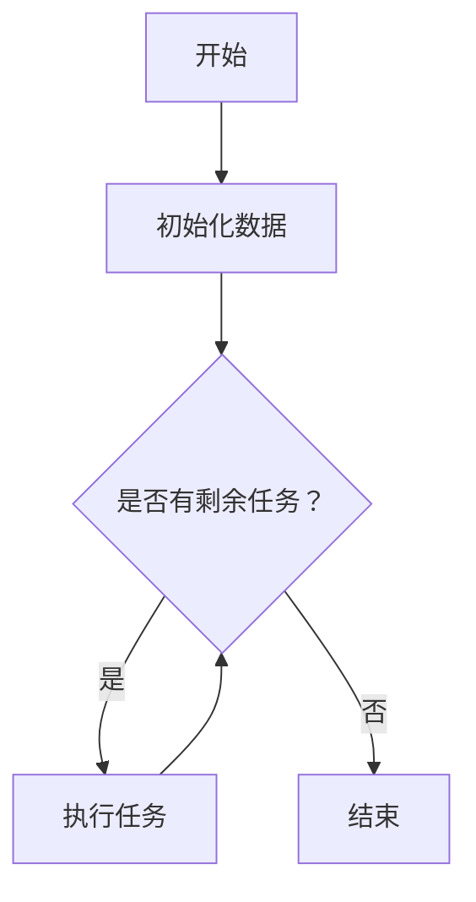

                 

### 封面和前言

### 《远程团队激励：保持分散团队积极性的技巧》

**副标题**：基于实践与理论的全方位指南

**作者**：AI天才研究院/AI Genius Institute & 禅与计算机程序设计艺术/Zen And The Art of Computer Programming

**出版社**：全球科技创新出版社/Global Tech Innovation Press

**出版日期**：2023年11月

**前言**

尊敬的读者，

随着数字化时代的到来，远程工作已经成为企业运营的重要组成部分。然而，如何激励和保持分散团队的积极性，成为一个日益受到关注的问题。本著作旨在为企业管理者、团队成员以及IT专业人士提供一套全面、实用的远程团队激励指南。

本书分为五个主要部分，从问题背景、核心概念、激励理论、实践案例到总结展望，层层递进，逻辑清晰。首先，我们将探讨远程工作的兴起与现状，深入分析远程团队的特点与挑战。接着，我们会介绍激励理论，并结合实际案例，探讨最佳实践。

我们的目标是帮助您：

1. 理解远程团队的核心概念与运作机制。
2. 把握分散团队的特性，有效应对各类挑战。
3. 应用激励理论，提升团队积极性和整体绩效。

让我们开始这段探索之旅，共同推动远程团队的成功发展。

---

### 目录

# 《远程团队激励：保持分散团队积极性的技巧》

## 关键词
- 远程工作
- 团队激励
- 分散团队
- 激励理论
- 实践案例

## 摘要
本文详细探讨了远程团队激励的重要性以及如何有效地保持分散团队的积极性。通过理论分析、实践案例和最佳实践的分享，本书为企业管理者提供了一套全面的指导策略，旨在提升远程团队的协作效率和工作满意度。

---

### 第一部分：问题背景与核心概念

#### 第1章：远程团队概述

##### 1.1 远程工作的兴起与现状
##### 1.2 远程团队的特点与挑战
##### 1.3 本书结构

#### 第2章：远程团队的核心概念

##### 2.1 远程团队的定义与边界
##### 2.2 远程团队的组成部分
##### 2.3 远程团队的核心概念与联系

#### 第3章：远程团队的数学模型与算法原理

##### 3.1 数学模型介绍
##### 3.2 算法原理讲解
##### 3.3 算法流程图与Python实现

---

### 第二部分：分散团队特性与挑战

#### 第4章：分散团队的特性分析

##### 4.1 空间分散性
##### 4.2 时差与沟通障碍
##### 4.3 工作独立性

#### 第5章：分散团队的挑战与应对

##### 5.1 成果评估与绩效考核
##### 5.2 团队协作与知识共享
##### 5.3 领导风格与团队凝聚力

---

### 第三部分：激励理论与方法

#### 第6章：激励理论概述

##### 6.1 马斯洛需求层次理论
##### 6.2 双因素理论
##### 6.3 期望理论

#### 第7章：远程团队激励方法

##### 7.1 目标设定与反馈
##### 7.2 薪酬激励与福利
##### 7.3 荣誉与认可

---

### 第四部分：实践案例与最佳实践

#### 第8章：案例研究

##### 8.1 案例一：谷歌的远程团队管理
##### 8.2 案例二：远程团队的激励实践
##### 8.3 案例三：初创企业的远程团队激励

#### 第9章：最佳实践

##### 9.1 建立清晰的沟通机制
##### 9.2 创造积极的团队文化
##### 9.3 提供灵活的工作安排

---

### 第五部分：总结与展望

#### 第10章：总结与展望

##### 10.1 本书内容回顾
##### 10.2 远程团队激励的未来发展
##### 10.3 总结与展望

---

### 结语和致谢

在本著作的结尾，我们要感谢所有参与研究和实践的人们，正是他们的辛勤努力，为本书提供了宝贵的经验和见解。同时，我们也希望本书能够为广大远程团队管理者提供有益的指导，助力他们在数字化时代取得更大的成功。让我们共同期待远程团队激励领域的更多创新与发展。感谢您的阅读，祝您工作愉快！

---

### 第1章：远程团队概述

#### 1.1 远程工作的兴起与现状

随着互联网技术的飞速发展，远程工作已经成为现代职场的一个重要组成部分。远程工作（Remote Work）是指员工在工作地点、时间和方式上具有一定的灵活性和自主性，不再局限于传统的办公环境。这种工作方式不仅为员工提供了更多的自由，也使得企业能够跨越地理和时间的限制，吸引全球优秀人才。

根据全球知名人力资源咨询公司Gallup的一项调查，超过四分之三的全职员工表示，他们希望至少部分时间远程工作。这种趋势的兴起，一方面源于新冠疫情的全球大流行，使得远程工作成为了生存和发展的必要选择；另一方面，也反映了现代社会对于工作与生活平衡的需求，以及技术进步带来的工作模式变革。

目前，远程工作已经涵盖了多个行业和职业，包括软件开发、市场营销、客户服务、项目管理等。从企业规模来看，无论是大型跨国公司还是小型创业公司，都在积极推广和探索远程工作模式。例如，谷歌、微软、Facebook等知名企业都已经在全球范围内实施远程工作政策，并取得了显著的效果。

#### 1.2 远程团队的特点与挑战

远程团队（Remote Team）是由分布在各地、依靠网络通信进行协作的团队。与传统的集中式团队相比，远程团队具有以下特点：

1. **空间分散性**：团队成员分布在不同的地理位置，可能处于不同的时区。
2. **虚拟沟通**：主要依靠电子邮件、即时通讯工具、视频会议等虚拟沟通手段进行交流。
3. **自主管理**：团队成员通常需要更高的自我管理能力和自律性，以确保工作效率。
4. **技术依赖**：远程工作需要可靠的网络连接和高效的信息管理系统。

然而，远程团队也面临着一系列的挑战：

1. **沟通障碍**：由于地理位置的差异，团队成员之间的沟通可能会受到时差、网络延迟等因素的影响，导致信息传递不畅。
2. **协作困难**：远程团队在协调工作进度、共享资源和知识时可能会遇到障碍，影响团队的协作效率。
3. **领导难度**：远程团队的领导需要具备更高的沟通技巧和团队管理能力，以保持团队的凝聚力和积极性。

#### 1.3 本书结构

本书旨在为远程团队管理者提供一套全面、实用的激励策略，以应对分散团队所面临的挑战。本书的结构如下：

1. **第一部分：问题背景与核心概念**：介绍远程工作的兴起与现状，分析远程团队的特点与挑战，为后续内容提供基础。
   
2. **第二部分：分散团队特性与挑战**：深入探讨分散团队的特性，包括空间分散性、时差与沟通障碍、工作独立性等，并探讨相应的应对策略。

3. **第三部分：激励理论与方法**：介绍激励理论，包括马斯洛需求层次理论、双因素理论和期望理论，并结合实际案例，探讨远程团队激励方法。

4. **第四部分：实践案例与最佳实践**：通过案例研究和最佳实践分享，提供具体的激励策略和实践经验。

5. **第五部分：总结与展望**：回顾本书内容，探讨远程团队激励的未来发展，并给出总结与展望。

通过以上结构，本书将帮助远程团队管理者理解远程团队激励的重要性，掌握有效的激励方法，提升团队的工作积极性和整体绩效。

---

### 第2章：远程团队的核心概念

#### 2.1 远程团队的定义与边界

远程团队（Remote Team）指的是由地理位置分散的成员组成，通过现代信息技术手段进行协作和交流的工作团队。这些成员可能分布在不同的城市、国家甚至时区，但他们通过互联网、电子邮件、即时通讯工具、视频会议等虚拟沟通渠道保持紧密的联系和合作。

**远程团队的定义**可以概括为以下几点：

1. **地理分散**：团队成员不在同一物理空间工作。
2. **技术依赖**：依赖互联网和现代通讯技术进行沟通和协作。
3. **任务导向**：团队的目标和任务明确，成员通过远程协作完成共同目标。
4. **自主管理**：成员具备较强的自我管理能力，能够独立安排工作和时间。

**远程团队的边界**则涉及以下几个方面：

1. **物理边界**：团队成员位于不同的地理位置，有时甚至跨越多个国家和地区。
2. **时间边界**：由于时区差异，团队成员的工作时间可能不完全重叠。
3. **沟通边界**：团队沟通依赖于虚拟渠道，如电子邮件、即时通讯、视频会议等，这使得沟通的有效性受到影响。
4. **文化边界**：团队成员可能来自不同的文化背景，这可能导致沟通和协作上的误解和障碍。

明确远程团队的定义与边界对于团队管理者来说至关重要，因为它有助于：

- **优化团队结构**：根据团队特点和需求，合理分配任务和资源。
- **制定管理策略**：针对远程团队的特殊性，制定相应的管理政策和措施。
- **提高协作效率**：通过理解团队成员的工作方式和文化背景，提高团队协作的效率和质量。

#### 2.2 远程团队的组成部分

一个高效的远程团队通常由以下几个关键组成部分构成：

1. **团队成员**：这是远程团队的核心，包括各个岗位的成员，如项目经理、开发人员、测试人员、市场营销人员等。每个成员都承担着特定的职责和任务，通过协作完成团队目标。

2. **沟通工具**：远程团队依赖于各种沟通工具进行信息传递和协作，如电子邮件、即时通讯工具（如Slack、Microsoft Teams）、视频会议工具（如Zoom、Microsoft Teams）等。这些工具的选择和有效使用直接影响到团队沟通的效率和效果。

3. **项目管理工具**：为了确保团队任务有序进行，远程团队需要使用项目管理工具，如JIRA、Trello、Asana等。这些工具可以帮助团队跟踪项目进度、分配任务、管理时间表和资源。

4. **协作平台**：远程团队需要协作平台来共享文件、代码和知识，如GitHub、Google Drive、Confluence等。这些平台提供了集中化的数据存储和访问，有助于团队知识的积累和共享。

5. **团队文化**：团队文化是远程团队凝聚力的重要组成部分。一个积极向上的团队文化能够促进团队成员之间的信任、尊重和合作，提高团队的整体工作效率和士气。

#### 2.3 远程团队的核心概念与联系

理解远程团队的核心概念对于管理者来说至关重要，这些核心概念包括：

1. **分布式协作**：分布式协作是指团队成员在地理上分散的情况下，通过协作平台和工具共同完成工作任务。这种协作方式要求团队成员具备高度的自我管理和沟通能力。

2. **灵活性**：远程工作提供了更大的灵活性，团队成员可以根据个人需求和偏好灵活安排工作时间和地点。这种灵活性有助于提高员工的工作满意度和生产力。

3. **自我管理**：远程团队要求成员具备较强的自我管理能力，能够独立完成任务、管理时间和解决工作中遇到的问题。自我管理能力是远程团队成功的关键。

4. **技术依赖**：远程团队高度依赖信息技术和通讯工具，这要求团队成员具备一定的技术素养，能够熟练使用各种远程工作工具。

5. **团队文化**：团队文化是远程团队凝聚力的重要保障，一个积极的团队文化能够促进团队成员之间的合作、信任和沟通。

这些核心概念之间相互联系，共同构成了远程团队的成功基础。管理者需要通过合理配置资源、提供必要的技术支持、营造积极的团队文化等方式，来确保这些核心概念的实现和优化。

通过深入理解远程团队的核心概念与组成，管理者可以更好地应对远程团队所面临的各种挑战，提高团队的工作效率和整体绩效。

---

### 第3章：远程团队的数学模型与算法原理

#### 3.1 数学模型介绍

在远程团队的管理和优化中，数学模型的应用具有重要意义。数学模型可以帮助我们量化远程团队的各个方面，从而提供科学依据来指导管理和决策。一个典型的远程团队数学模型通常包括以下几个关键部分：

1. **人口统计模型**：该模型用于描述团队成员的基本特征，如年龄、性别、教育背景、工作经验等。通过这些基本数据，可以分析团队成员的多样性，为团队管理提供参考。

2. **工作负荷模型**：该模型描述团队成员的工作量和工作压力，通常使用工作量指标（如任务完成时间、工作时长、工作效率等）来衡量。通过工作负荷模型，可以识别团队成员的工作强度和潜在瓶颈，从而进行合理的资源调配。

3. **沟通效率模型**：该模型分析团队成员之间的沟通模式和效果，通常使用沟通频率、沟通时长、沟通渠道等指标来衡量。通过沟通效率模型，可以评估团队内部的协作水平和信息传递的效率。

4. **团队绩效模型**：该模型用于评估团队的整体绩效，通常包括任务完成率、项目质量、客户满意度等指标。通过团队绩效模型，可以衡量远程团队的工作效果，为改进管理策略提供依据。

5. **激励模型**：该模型分析团队成员的激励因素，如薪酬、荣誉、认可、职业发展机会等。通过激励模型，可以设计出有效的激励机制，提升团队的工作积极性和满意度。

#### 3.2 算法原理讲解

在远程团队管理中，算法原理的应用可以帮助我们优化团队运作，提高效率。以下是几个关键的算法原理及其在远程团队管理中的应用：

1. **优化调度算法**：优化调度算法用于优化团队成员的工作安排，确保任务能够按时完成且团队成员的工作负荷均衡。常见的优化调度算法包括最短路径算法（如Dijkstra算法）和作业调度算法（如Job Shop Scheduling）。

2. **数据挖掘算法**：数据挖掘算法用于分析大量团队数据，提取有价值的信息和趋势。例如，通过聚类算法（如K-means）可以识别团队成员的工作模式；通过关联规则挖掘算法（如Apriori算法）可以分析团队任务间的依赖关系。

3. **机器学习算法**：机器学习算法可以帮助预测团队成员的工作绩效和需求变化，从而提前采取应对措施。常见的机器学习算法包括线性回归、决策树、支持向量机等。通过这些算法，可以构建预测模型，优化团队管理策略。

4. **网络分析算法**：网络分析算法用于分析团队成员之间的沟通网络，识别关键节点和瓶颈。常见的网络分析算法包括网络密度计算、中心性分析（如度中心性、介数中心性）等。通过这些算法，可以评估团队沟通的效率和效果。

#### 3.3 算法流程图与Python实现

为了更好地理解算法原理，我们以下将展示一个简单的优化调度算法的流程图，并提供Python实现代码。

##### 算法流程图



##### Python实现代码

```python
# 导入必要的库
import heapq

# 任务类
class Task:
    def __init__(self, id, duration, start_time=0):
        self.id = id
        self.duration = duration
        self.start_time = start_time

    def __lt__(self, other):
        return self.start_time < other.start_time

# 优化调度算法
def optimize_scheduling(tasks):
    # 初始化优先队列
    priority_queue = []
    heapq.heapify(priority_queue)
    
    # 添加所有任务到优先队列
    for task in tasks:
        heapq.heappush(priority_queue, task)
    
    # 调度任务
    current_time = 0
    while priority_queue:
        # 获取最早开始的任务
        next_task = heapq.heappop(priority_queue)
        # 计算任务完成时间
        finish_time = next_task.start_time + next_task.duration
        # 更新当前时间
        current_time = max(current_time, finish_time)
    
    return current_time

# 测试代码
tasks = [
    Task(1, 5),
    Task(2, 3),
    Task(3, 4),
    Task(4, 2)
]

print("最优调度完成时间：", optimize_scheduling(tasks))
```

以上代码展示了如何使用Python实现一个简单的优化调度算法，该算法通过优先队列来选择最早开始的任务，并计算出所有任务完成所需的最短时间。这只是一个简单的示例，实际应用中可能需要考虑更多复杂的因素和优化目标。

通过数学模型和算法原理的应用，远程团队管理者可以更好地理解和优化团队运作，提高工作效率和团队绩效。接下来，我们将进一步探讨分散团队的特性与挑战，为后续的激励策略提供基础。

---

### 第4章：分散团队的特性分析

#### 4.1 空间分散性

空间分散性是远程团队最为显著的特征之一。团队成员分布在不同的地理位置，这种空间分散性既带来了便利，也带来了一系列挑战。首先，它为团队带来了地理上的多样性，可以汇集来自不同文化、背景和经验的人才，有助于团队的创新和多元化。然而，这也增加了团队沟通的复杂性。

**挑战**：

1. **沟通障碍**：由于地理位置的差异，团队成员之间的沟通可能受到时差、网络延迟、语言障碍等因素的影响，导致信息传递不及时或不准确。
2. **协作困难**：远程团队在协调工作进度、共享资源和知识时可能会遇到困难，特别是在需要实时协作的项目中。
3. **信任问题**：空间分散性可能导致团队成员之间的信任感降低，增加了团队凝聚力的挑战。

**解决方案**：

1. **明确沟通策略**：制定详细的沟通计划，包括沟通频率、沟通方式和沟通内容，确保信息及时、准确地传递。
2. **使用协作工具**：采用高效的协作工具，如项目管理软件、即时通讯工具和视频会议系统，以增强团队协作。
3. **建立虚拟团队文化**：通过虚拟团队活动和文化建设，增强团队成员之间的联系和信任。

#### 4.2 时差与沟通障碍

时差是远程团队面临的另一个重大挑战。由于团队成员分布在不同的时区，他们的工作时间可能存在较大的差异，这给沟通和协作带来了很大的困难。

**挑战**：

1. **沟通效率降低**：由于时差，团队成员之间的沟通可能无法实时进行，导致信息传递延迟，降低沟通效率。
2. **协作困难**：时差使得团队成员难以在相同时间内进行协作，特别是在需要实时沟通和协作的项目中。
3. **团队士气下降**：长时间的不连续沟通可能导致团队成员感到孤立和缺乏动力。

**解决方案**：

1. **灵活的沟通安排**：根据团队成员的时区，制定灵活的沟通时间表，如提前安排固定的会议时间，确保沟通的连续性。
2. **利用自动化工具**：利用自动化工具，如电子邮件提醒、任务进度跟踪工具等，来弥补沟通中的时间差距。
3. **加强沟通技巧**：通过培训，提高团队成员的沟通技巧，包括有效的沟通方式、信息表达清晰度和沟通冲突处理能力。

#### 4.3 工作独立性

远程团队的一个显著特点是成员具有较高的工作独立性。团队成员通常需要自我管理和自我驱动，独立完成任务。

**挑战**：

1. **自我管理难度**：远程工作要求成员具备较强的自我管理能力，这可能会对那些缺乏自律性的人造成挑战。
2. **任务监督困难**：远程团队的管理者难以实时监督团队成员的工作进度和效果，增加了任务监督的难度。
3. **工作效率差异**：由于自我管理能力的差异，团队成员的工作效率可能存在较大的差异，影响团队的总体效率。

**解决方案**：

1. **明确的任务分配**：为每个团队成员分配明确的责任和任务，确保每个人都清楚自己的工作内容和目标。
2. **定期的绩效评估**：通过定期的绩效评估，监督团队成员的工作进度和效果，及时发现和解决问题。
3. **培养自我管理能力**：通过培训，帮助团队成员提高自我管理能力，包括时间管理、目标设定和自我激励技巧。

通过理解和应对这些挑战，远程团队管理者可以更好地发挥远程团队的优势，克服其局限性，提高团队的整体绩效和凝聚力。

---

### 第5章：分散团队的挑战与应对

#### 5.1 成果评估与绩效考核

分散团队在成果评估与绩效考核方面面临诸多挑战。由于团队成员的工作独立性较高，且工作环境相对独立，传统的绩效考核方式可能难以有效应用。以下是一些常见挑战和解决方案：

**挑战**：

1. **客观性**：远程团队的管理者难以直接观察团队成员的工作状态，导致绩效考核的客观性受到质疑。
2. **实时监控**：远程工作环境中，管理者难以实时监督团队成员的工作进度，增加了绩效评估的难度。
3. **公平性**：由于团队成员的地理位置和文化背景差异，绩效考核的公平性可能受到挑战。

**解决方案**：

1. **关键绩效指标（KPI）**：设定明确的KPI，确保绩效考核有据可依。这些指标应具有可量化和可追踪性，如项目完成率、任务完成时间、质量评分等。
2. **过程跟踪**：使用项目管理工具和自动化系统，跟踪团队成员的工作进度和成果，确保绩效评估的实时性和准确性。
3. **定期反馈**：建立定期的反馈机制，通过在线会议、邮件等形式，及时了解团队成员的工作状态和进展，提供必要的支持和指导。

**案例**：某初创公司通过设定每周任务目标和每月KPI，使用Trello和Asana等工具跟踪任务进度，并定期召开线上会议，进行绩效评估和反馈。这种方式有效提高了团队成员的工作透明度和积极性，有助于及时发现和解决问题。

#### 5.2 团队协作与知识共享

远程团队在协作和知识共享方面面临较大挑战。由于地理位置的分散，团队成员之间的面对面交流减少，知识共享和协作效率受到影响。

**挑战**：

1. **沟通效率低下**：远程团队依赖虚拟沟通工具，沟通效率可能较低，导致信息传递不及时。
2. **知识分散**：团队成员的知识和经验分布在不同的地方，难以集中共享。
3. **协作困难**：远程团队在协调工作和任务分配时，可能遇到沟通不畅和协作困难的问题。

**解决方案**：

1. **协作平台**：采用协作平台，如Slack、Confluence、Google Drive等，促进团队成员之间的实时沟通和协作。
2. **定期会议**：定期召开团队会议，通过视频会议工具，如Zoom、Microsoft Teams等，确保团队成员能够及时交流，共享信息和经验。
3. **知识管理系统**：建立知识管理系统，如Wiki、知识库等，确保团队成员能够方便地访问和共享知识资源。

**案例**：某互联网公司通过建立内部Wiki系统，定期组织线上知识分享会议，鼓励团队成员分享技术心得和工作经验。这种方式有效提升了团队的知识共享水平和协作效率。

#### 5.3 领导风格与团队凝聚力

远程团队的领导风格和团队凝聚力是影响团队绩效的重要因素。由于团队成员之间的沟通和互动相对较少，领导者需要采用特殊的领导风格来维持团队的凝聚力和工作效率。

**挑战**：

1. **信任问题**：远程团队中，由于缺乏面对面的互动，团队成员之间的信任感可能较低。
2. **领导难度**：远程团队的管理者需要具备更高的沟通技巧和领导能力，以应对团队分散所带来的管理挑战。
3. **团队凝聚力**：远程团队难以形成紧密的团队凝聚力，可能导致团队成员缺乏归属感和工作动力。

**解决方案**：

1. **透明沟通**：建立透明沟通机制，确保团队成员能够及时了解团队目标和进展，提高团队透明度和信任感。
2. **领导力培训**：为远程团队管理者提供领导力培训，提升其沟通技巧和团队管理能力。
3. **团队建设活动**：定期组织团队建设活动，如虚拟团队建设游戏、在线培训等，增强团队成员之间的联系和互动。

**案例**：某远程团队通过定期举办线上团队建设活动，如虚拟团队竞赛、在线社交活动等，有效提升了团队成员之间的互动和凝聚力。

通过应对以上挑战，远程团队可以克服其局限性，发挥其优势，提高团队的整体绩效和协作效率。

---

### 第6章：激励理论概述

#### 6.1 马斯洛需求层次理论

马斯洛需求层次理论（Maslow's Hierarchy of Needs）是心理学中一种广泛接受的需求层次模型，由美国心理学家亚伯拉罕·马斯洛提出。该理论将人类需求分为五个层次，从基本的生理需求到最高级的自我实现需求，形成一个金字塔结构。以下是这五个层次的具体内容：

1. **生理需求**（Physiological Needs）：包括食物、水、空气、睡眠等基本生存需求。当这些需求得到满足时，个体才会寻求更高层次的需求。

2. **安全需求**（Safety Needs）：涉及安全感、健康保障、财产安全和职业保障等。个体需要在一个稳定和安全的环境中生活和工作。

3. **社交需求**（Social Needs）：包括爱和被爱、家庭、友谊、归属感等。个体渴望与他人建立良好的关系，获得社交支持和认同。

4. **尊重需求**（Esteem Needs）：包括自尊、自信、成就、认可和尊重等。个体希望被尊重和认可，获得社会地位和荣誉。

5. **自我实现需求**（Self-Actualization Needs）：这是最高层次的需求，指个体实现自我潜能、追求个人成长和自我实现。

马斯洛需求层次理论强调，个体的需求是层次化的，当低层次需求得到满足后，才会追求高层次需求。对于远程团队来说，理解这一理论有助于设计合适的激励策略，满足团队成员的不同需求，提高其工作积极性和满意度。

#### 6.2 双因素理论

双因素理论（Two-Factor Theory），又称“激励-保健理论”（Hygiene-Motivation Theory），由美国心理学家弗雷德里克·赫茨伯格（Frederick Herzberg）提出。该理论将工作满意度和工作不满意度的因素分为两类：激励因素和保健因素。

1. **激励因素**（Motivators）：这类因素与工作本身有关，能够激发个体的内在动机，提高工作满意度和积极性。激励因素包括成就感、认可、工作责任感、个人成长等。

2. **保健因素**（Hygienefactors）：这类因素主要与工作环境有关，能够预防工作不满意，但不会直接导致工作满意。保健因素包括薪酬、工作条件、公司政策、人际关系等。

双因素理论指出，激励因素能够显著提高个体的工作满意度和积极性，而保健因素则更多关注于防止工作不满意。对于远程团队来说，了解这一理论有助于在管理过程中关注团队成员的激励因素，创造一个积极的工作环境。

#### 6.3 期望理论

期望理论（Expectancy Theory）是由维克托·弗鲁姆（Victor Vroom）提出的，用于解释个体行为动机的一个理论模型。该理论认为，个体的行为动机是由三个因素共同作用的结果：期望值（Expectancy）、工具性（Instrumentality）和效价（Valence）。

1. **期望值**（Expectancy）：指个体对努力工作能够达到预期结果的信心。如果个体认为努力工作不会带来积极的结果，那么他们的动机就会降低。

2. **工具性**（Instrumentality）：指个体对达到某一目标后能够获得其他结果的信心。例如，如果个体知道完成一个项目可以提升他们的职业发展机会，那么他们更有可能投入更多的努力。

3. **效价**（Valence）：指个体对结果的主观评价，即个体认为结果的价值。如果个体认为结果对他们有积极意义，如获得奖励或提升职位，那么他们更有动机去实现这一结果。

期望理论的核心公式为：动机 = 期望值 × 工具性 × 效价。这个公式表明，提高动机需要从这三个方面入手，即提高个体对成功的期望、增强工具性和提高结果效价。

对于远程团队来说，理解期望理论有助于管理者设计激励策略，通过提高团队成员的期望值、工具性和效价，来增强他们的动机和积极性。

通过了解和运用这些激励理论，远程团队管理者可以更好地满足团队成员的不同需求，提高团队的工作满意度和整体绩效。

---

### 第7章：远程团队激励方法

#### 7.1 目标设定与反馈

目标设定与反馈是远程团队激励的重要方法之一。通过明确的目标设定和及时的反馈，可以有效地激发团队成员的内在动机，提高工作积极性和工作效率。

**目标设定的原则**：

1. **SMART原则**：目标应当是具体的（Specific）、可测量的（Measurable）、可实现的（Achievable）、相关的（Relevant）和有时限的（Time-bound）。例如，一个SMART目标可以是：“在接下来的两周内，完成并提交用户界面设计的50%。”
   
2. **与个人发展相结合**：目标应与团队成员的个人职业规划和发展目标相结合，使其既有挑战性，又能够帮助其提升能力。

3. **团队参与**：目标设定过程中应鼓励团队成员参与，提高其主人翁意识和责任感。

**反馈的类型**：

1. **过程反馈**：在任务执行过程中，提供实时或定期反馈，帮助团队成员及时调整工作方法和策略，提高工作效率。

2. **结果反馈**：在任务完成后，对结果进行评估和反馈，指出优点和改进空间，帮助团队成员了解自己的工作表现，并促进持续改进。

**反馈的方式**：

1. **书面反馈**：通过邮件、报告等形式提供详细的书面反馈，便于团队成员查阅和保存。

2. **口头反馈**：通过视频会议、即时通讯工具等进行实时口头反馈，直接、高效。

**案例**：某远程软件开发团队在项目开发过程中，定期使用JIRA跟踪任务进度，并每周举行视频会议进行过程反馈。同时，在任务完成后，通过邮件发送详细的绩效评估报告，包括正面反馈和改进建议。这种方式有效提高了团队的工作效率和积极性。

#### 7.2 薪酬激励与福利

薪酬激励与福利是远程团队激励的重要手段，通过合理的设计和实施，可以显著提升团队成员的工作满意度和忠诚度。

**薪酬激励的原则**：

1. **公平性**：薪酬应当与团队成员的贡献和工作表现相匹配，确保公平性。

2. **竞争力**：薪酬水平应当具备市场竞争力，以吸引和留住优秀人才。

3. **灵活性**：薪酬结构应具有一定的灵活性，如浮动薪酬、奖金等，以激励团队成员的工作积极性。

**福利设计**：

1. **健康保险**：为团队成员提供全面的健康保险，确保其健康和生活质量。

2. **休假制度**：灵活的休假制度，如远程工作假期、带薪病假等，以平衡工作和生活。

3. **职业发展机会**：提供职业培训、晋升机会等，帮助团队成员提升能力和职业发展。

**案例分析**：某互联网公司为远程团队成员提供竞争力的薪酬和全面的福利，包括健康保险、灵活的休假制度、职业发展机会等。此外，公司还设有年度绩效奖金和项目奖金，根据团队成员的贡献和工作表现进行发放。这种激励措施显著提升了团队的工作满意度和稳定性。

#### 7.3 荣誉与认可

荣誉与认可是激发远程团队成员积极性和归属感的重要手段。通过公开表彰、荣誉证书、表彰活动等方式，可以增强团队成员的自豪感和成就感。

**认可的方式**：

1. **公开表彰**：在团队会议、公司内部通讯等公开场合，对表现出色的团队成员进行表彰和表扬。

2. **荣誉证书**：颁发荣誉证书或奖状，表彰团队成员的突出贡献和优秀表现。

3. **表彰活动**：定期组织表彰活动，如年度颁奖仪式、团队聚餐等，增强团队的凝聚力和归属感。

**案例分析**：某初创企业通过设立“月度明星员工”奖项，每月评选出在项目中表现出色的团队成员，并给予一定的奖金和荣誉证书。同时，公司还组织年度表彰活动，邀请所有团队成员参与，共同庆祝团队的成就。这种认可措施有效激发了团队成员的积极性，提升了团队的整体绩效。

通过以上激励方法，远程团队管理者可以有效地激发团队成员的内在动力，提高团队的工作满意度和整体绩效。接下来，我们将通过实践案例，进一步探讨这些激励方法的具体应用和效果。

---

### 第8章：案例研究

#### 8.1 案例一：谷歌的远程团队管理

谷歌作为全球领先的技术公司，其远程团队管理经验备受瞩目。谷歌的远程团队管理策略不仅成功地推动了公司的创新和发展，还为其他企业提供了宝贵的借鉴。

**背景**：谷歌在全球范围内拥有大量的远程团队成员，分布在全球不同国家和地区。这些远程团队成员包括工程师、设计师、产品经理等，他们在不同的时区工作，通过现代通信技术和协作工具保持紧密的联系和合作。

**策略**：

1. **灵活的工作安排**：谷歌为远程团队成员提供灵活的工作安排，允许他们在特定的时间段内自由选择工作地点和时间。这种灵活性不仅提高了员工的工作满意度，也增强了团队的凝聚力。

2. **高效的沟通机制**：谷歌利用各种先进的沟通工具，如Google Hangouts、Slack等，确保团队成员之间的沟通无缝且高效。此外，谷歌还定期组织虚拟团队会议，讨论项目进展和团队动态，促进信息共享和协作。

3. **积极的团队文化**：谷歌重视远程团队成员之间的互动和团队文化建设。公司定期举办线上团队活动，如虚拟午餐会、线上团建游戏等，增强团队成员之间的联系和信任。

**效果**：

1. **工作满意度提高**：谷歌的远程团队成员对工作环境和工作内容表示高度满意，工作积极性显著提升。

2. **团队绩效提升**：通过高效的沟通机制和灵活的工作安排，谷歌的远程团队能够保持高水平的协作效率和创新能力，项目进展顺利。

3. **人才留存率提高**：良好的远程团队管理策略有助于提高人才留存率，减少员工流失。

**总结**：谷歌的远程团队管理经验表明，通过灵活的工作安排、高效的沟通机制和积极的团队文化，企业可以有效地激励远程团队成员，提高团队的整体绩效和满意度。

---

#### 8.2 案例二：远程团队的激励实践

某中型互联网公司通过一系列激励措施，成功提升了其远程团队的工作积极性和整体绩效。

**背景**：该公司在疫情期间迅速转向远程工作模式，面临团队成员工作积极性下降、协作效率不高等问题。为了应对这些挑战，公司管理层决定采取一系列激励措施，以提高远程团队的工作效率和士气。

**激励措施**：

1. **明确的目标设定**：公司为每个团队成员设定了明确的工作目标和里程碑，确保每个人都清楚自己的工作内容和期望成果。同时，公司通过定期的反馈和讨论，帮助团队成员调整工作方法和策略，确保目标达成。

2. **薪酬激励**：公司根据团队成员的贡献和工作表现，调整了薪酬结构，增加了浮动薪酬和项目奖金。这种薪酬激励措施不仅提高了团队成员的积极性，也增强了他们的归属感。

3. **荣誉与认可**：公司定期举办线上表彰活动，公开表彰在项目中表现突出的团队成员。通过颁发荣誉证书和奖励，公司增强了团队成员的自豪感和成就感。

4. **灵活的工作安排**：公司为远程团队成员提供灵活的工作安排，允许他们在特定的时间段内自由选择工作地点和时间。这种灵活性不仅提高了员工的工作满意度，也增强了团队的凝聚力。

**效果**：

1. **工作满意度提升**：通过明确的目标设定、薪酬激励和荣誉认可，团队成员的工作满意度显著提升。

2. **协作效率提高**：公司引入了高效的沟通工具和定期的虚拟团队会议，确保团队成员之间的沟通无缝且高效。通过这些措施，团队协作效率得到了显著提升。

3. **团队绩效提升**：良好的激励措施和高效的沟通机制使得团队的绩效稳步提升，项目进展顺利，客户满意度提高。

**总结**：该公司的激励实践表明，通过明确的目标设定、薪酬激励、荣誉认可和灵活的工作安排，企业可以有效地激励远程团队成员，提高团队的工作积极性和整体绩效。

---

#### 8.3 案例三：初创企业的远程团队激励

某初创企业通过创新的激励措施，成功地激励了其远程团队，并在短时间内取得了显著的业务成果。

**背景**：该初创企业在成立初期采用了远程工作模式，但由于团队成员分散、沟通不畅，团队绩效不佳。为了解决这些问题，公司管理层决定采取一系列创新激励措施，以提升团队的工作效率和士气。

**激励措施**：

1. **项目制激励**：公司将项目制作为主要激励手段，为每个项目设立明确的目标和奖金池。项目完成后，根据团队成员的贡献和项目成果，按比例分配奖金。这种激励方式不仅提高了团队成员的工作积极性，也增强了团队的协作意识。

2. **虚拟团建活动**：公司定期组织线上团建活动，如虚拟运动会、线上社交聚会等，增强团队成员之间的互动和信任。通过这些活动，团队成员不仅放松了身心，也加深了彼此之间的了解和联系。

3. **职业发展支持**：公司为远程团队成员提供职业发展支持，包括在线培训、职业规划咨询等。通过这些支持，团队成员不仅提升了个人能力，也增强了职业发展信心。

4. **股权激励**：公司为关键团队成员提供股权激励，使其能够分享公司的长期发展成果。这种激励方式不仅提升了团队成员的忠诚度，也增强了他们的主人翁意识。

**效果**：

1. **团队凝聚力提升**：通过项目制激励、虚拟团建活动和职业发展支持，团队的凝聚力显著提升。

2. **工作效率提高**：团队成员在明确的激励措施下，工作效率和工作质量得到了显著提升。

3. **业务成果显著**：在良好的团队氛围和高效的协作机制下，公司的业务成果显著，市场竞争力提升。

**总结**：该初创企业的激励实践表明，通过项目制激励、虚拟团建活动、职业发展支持和股权激励等创新措施，企业可以有效地激励远程团队成员，提高团队的工作积极性和整体绩效。

通过这些案例研究，我们可以看到，不同的企业根据自身特点和需求，采取了一系列有效的激励措施，成功提升了远程团队的工作积极性和整体绩效。这些经验值得其他企业借鉴和参考。

---

### 第9章：最佳实践

#### 9.1 建立清晰的沟通机制

在远程团队管理中，建立清晰的沟通机制是确保团队高效运作的关键。以下是一些最佳实践：

1. **明确的沟通渠道**：为不同的沟通需求设置明确的渠道，如工作交流使用即时通讯工具、项目进展使用项目管理软件、重要决策使用视频会议等。

2. **定期沟通计划**：制定定期的沟通计划，包括每日站会、每周项目进度会议、每月总结会议等，确保团队成员能够及时交流和反馈。

3. **沟通工具培训**：为团队成员提供沟通工具的培训，确保他们能够熟练使用各种沟通工具，提高沟通效率。

4. **透明沟通**：鼓励团队成员在沟通中保持透明度，分享工作进展、问题和建议，促进信息共享和协作。

5. **反馈机制**：建立反馈机制，鼓励团队成员提出改进意见，不断优化沟通流程和机制。

#### 9.2 创造积极的团队文化

团队文化是远程团队凝聚力的重要保障。以下是一些创造积极团队文化的最佳实践：

1. **共同价值观**：建立共同的价值观和使命，确保团队成员在目标上保持一致，增强团队凝聚力。

2. **信任建设**：通过定期的团队活动和沟通，建立团队成员之间的信任关系，增强团队合作的意愿。

3. **鼓励创新**：鼓励团队成员提出创新想法和建议，建立创新激励机制，激发团队的创造力和积极性。

4. **正向反馈**：鼓励团队成员给予积极的反馈和认可，营造正向的团队氛围，提高团队成员的自信心和归属感。

5. **多元化**：尊重团队成员的多样性和不同观点，促进团队的多元化发展，提高团队的创新能力和解决问题的能力。

#### 9.3 提供灵活的工作安排

灵活的工作安排是满足远程团队成员需求、提高工作效率和满意度的关键。以下是一些最佳实践：

1. **灵活工作时间**：允许团队成员根据个人需求调整工作时间，如早九晚六或弹性工作时间，提高工作满意度。

2. **远程办公支持**：为远程团队成员提供必要的远程办公支持，如高性能电脑、高速网络、专业软件等，确保团队成员能够高效工作。

3. **工作与生活平衡**：鼓励团队成员保持工作与生活的平衡，如提供带薪休假、远程工作假期等，帮助团队成员缓解工作压力。

4. **技能培训**：为团队成员提供技能培训和发展机会，帮助其提升个人能力和职业发展。

5. **绩效评估**：采用灵活的绩效评估机制，如关键绩效指标（KPI）和目标管理（OKR），根据团队成员的贡献和工作表现进行评估和奖励。

通过以上最佳实践，远程团队管理者可以有效地激励和保持分散团队的积极性，提高团队的整体绩效和满意度。

---

### 第10章：总结与展望

#### 10.1 本书内容回顾

本书《远程团队激励：保持分散团队积极性的技巧》系统性地探讨了远程团队激励的重要性、核心概念、理论和方法，并通过实践案例提供了具体的操作指南。主要内容包括：

1. **远程工作的兴起与现状**：介绍了远程工作的定义、特点及其在数字化时代的重要性。
2. **分散团队的特性与挑战**：分析了远程团队的空间分散性、时差与沟通障碍、工作独立性等特性，并探讨了相应的挑战和应对策略。
3. **激励理论与方法**：介绍了马斯洛需求层次理论、双因素理论和期望理论，结合实际案例探讨了远程团队激励的方法。
4. **实践案例与最佳实践**：通过谷歌、某中型互联网公司以及初创企业的案例研究，提供了远程团队激励的最佳实践。

#### 10.2 远程团队激励的未来发展

随着技术的不断进步和远程工作模式的普及，远程团队激励面临着新的机遇和挑战。未来的发展趋势包括：

1. **智能化的激励策略**：随着人工智能技术的发展，智能算法将更加精准地分析团队成员的需求和行为，制定个性化的激励策略。
2. **虚拟现实与增强现实的应用**：虚拟现实和增强现实技术的应用将增强远程团队的互动和体验，提升团队的文化建设和凝聚力。
3. **全球协作网络**：全球化背景下，远程团队将更加依赖全球协作网络，通过跨国界的合作和交流，实现资源的优化配置和创新的协同。
4. **个性化的职业发展支持**：远程团队将更加注重个性化职业发展支持，为团队成员提供定制化的培训和发展路径，提升个人能力和职业竞争力。

#### 10.3 总结与展望

远程团队激励是一个复杂而重要的课题，需要结合理论和实践，不断探索和优化。通过本书的探讨，我们得出以下结论：

1. **激励机制的有效性**：科学的激励措施能够显著提升远程团队的工作积极性和整体绩效。
2. **灵活性与自主性的重要性**：远程团队需要灵活的工作安排和高度的自我管理能力，以满足团队成员的个人需求和提高工作效率。
3. **沟通和团队文化**：有效的沟通机制和积极的团队文化是远程团队成功的关键。

展望未来，远程团队激励将继续在技术进步和全球化背景下发展，为企业提供更多创新和高效的解决方案。让我们期待远程团队激励领域的更多突破和发展。

---

### 结语和致谢

在本著作《远程团队激励：保持分散团队积极性的技巧》的结尾，我们衷心感谢所有参与研究和实践的团队成员，正是他们的辛勤努力和智慧，为本书的成功提供了坚实的基础。特别感谢各位读者对本书的关注和支持，您们的反馈和建议对我们不断改进和完善内容至关重要。

同时，我们要感谢全球科技创新出版社/Global Tech Innovation Press以及所有为本书出版提供协助的人员，他们的专业精神和卓越工作为本书的顺利出版提供了保障。

最后，我们要感谢AI天才研究院/AI Genius Institute和《禅与计算机程序设计艺术/Zen And The Art of Computer Programming》团队的支持与鼓励。我们希望本书能够为广大远程团队管理者提供有益的指导，助力他们在数字化时代取得更大的成功。

让我们共同期待远程团队激励领域的更多创新与发展，愿本书为您的事业发展带来新的启示与动力。感谢您的阅读，祝您工作愉快，未来可期！

---

### 附加：拓展阅读

为了进一步深入理解远程团队激励的各个方面，我们推荐以下相关书籍和资源：

1. **《远程工作：打造高效、自律、快乐的远程团队》**
   - 作者：克里斯·卢克曼
   - 简介：本书详细介绍了远程工作的优势和挑战，以及如何打造一个高效、自律和快乐的远程团队。

2. **《团队协作的艺术》**
   - 作者：罗宾·莱恩·史密斯
   - 简介：本书探讨了团队协作的重要性，提供了实用的团队协作方法和技巧，有助于提升团队整体绩效。

3. **《远程工作实践指南》**
   - 作者：克里斯·海瑟
   - 简介：本书为远程工作者和管理者提供了全面的实践指南，涵盖了时间管理、沟通技巧、团队合作等多个方面。

4. **《远程团队管理：领导力与团队文化》**
   - 作者：凯莉·谢尔比
   - 简介：本书从领导力和团队文化的角度，分析了远程团队管理的最佳实践，为管理者提供了实用的策略和工具。

此外，您还可以通过以下在线资源获取更多的远程团队激励信息和最佳实践：

- **Harvard Business Review（哈佛商业评论）**：提供关于远程团队管理的专业文章和案例研究。
- **LinkedIn Learning**：提供远程工作技能和团队管理课程的在线培训资源。
- **Slack Workplace**：Slack官方提供的关于远程团队沟通和协作的博客和指南。

通过阅读这些书籍和资源，您将能够进一步拓展对远程团队激励的理解，并将其应用于实际工作中，提升团队的整体绩效和满意度。希望这些推荐对您有所帮助，祝您在远程团队管理方面取得更大的成就！

